# MSFT 基本面深度分析報告

> **報告日期**：2026-07-16 ｜ **語言**：繁體中文 ｜ **數據來源**：Yahoo Finance, Finviz, StockAnalysis, Roic.ai ｜ **分析師**：CFA 級機構研究

---

## 目錄

| # | 章節 | 核心結論 |
|---|------|----------|
| 1 | 執行摘要 | 強烈買入評級，基準目標價 $500.00，隱含 +25.1% 潛在回報。 |
| 2 | 公司概覽與商業模式 | 三大支柱業務並進，AI 基礎設施與 SaaS 生態建構極深護城河。 |
| 3 | 損益表深度分析 | TTM 營收達 $318.27B (+18.3% YoY)，營業槓桿持續釋放。 |
| 4 | 資產負債表分析 | 資產規模擴張至 $694.23B，高額資本支出投向 AI 算力基礎設施。 |
| 5 | 現金流量深度分析 | TTM 營運現金流達 $170.14B，AI 資本開支（$97.23B）壓抑短期 FCF 轉換。 |
| 6 | 獲利能力與資本效率 | ROIC 達 30.9%，遠超 9.6% WACC，超額經濟價值（EVA）創造力極強。 |
| 7 | 估值深度分析 | Forward P/E 20.63x 具備安全邊際，DCF 基準估值 $500.00。 |
| 8 | 成長催化劑 | Azure AI 雲端變現加速與 Copilot 滲透率提升雙軌驅動。 |
| 9 | 風險矩陣 | AI 資本支出回報滯後與反壟斷監管為核心風險。 |
| 10| 投資建議 | 具備高確定性的防守型成長標的，建議於 $400 以下逢低分批佈局。 |

---

## 1. 執行摘要

微軟（Microsoft Corporation, Ticker: MSFT）當前股價為 **$399.78**，相較於 52 週高點 $551.05 已回檔 27.4%。本報告基於微軟最新 TTM 財務數據進行深度建模。微軟在雲端運算（Intelligent Cloud）與企業軟體（Productivity and Business Processes）的雙龍頭地位，結合其在生成式 AI 領域的領先變現能力，使其在當前總體經濟環境下展現出極強的韌性。

基於 TTM 營業利益率達 **46.3%**、ROIC 高達 **30.9%**，以及 Forward P/E 僅 **20.63x**（低於其歷史 5 年均值 28x）的客觀數據，我們給予微軟 **「🟢 強烈買入（Strong Buy）」** 評級，12 個月基準目標價為 **$500.00**（隱含 +25.1% 上漲空間）。

### 1.0 一頁式投資儀表板（Portfolio Manager 30 秒速讀）

| 項目 | 內容 |
|------|------|
| **投資論點（3 句）** | ① TTM 營收達 $318.27B (+18.3% YoY)，反映 Azure AI 與 M365 Copilot 雙引擎強勁變現。<br/>② 營業利益率高達 46.3%，得益於 SaaS 訂閱制的高定價權與雲端規模效應釋放營業槓桿。<br/>③ 雖然 TTM 資本支出激增至 $97.23B 壓抑了短期 FCF Yield 至 2.45%，但 30.9% 的高 ROIC 證實其資本配置效率極佳。 |
| **護城河評分** | 9.5 / 10 |
| **管理層/資本配置評分** | 9.2 / 10 |
| **財務健康** | 🟢 強勁 ｜ 淨債務僅 $47.20B，TTM 利息保障倍數高達 100x 以上，幾無破產風險。 |
| **ROIC vs WACC** | **30.9% vs 9.6%**（超額經濟增值 EVA 達 +21.3%，持續為股東創造巨大價值） |
| **FCF 趨勢** | 穩定 ｜ TTM 自由現金流達 **$72.92B**，FCF Yield 為 **2.45%**（受 AI Capex 壓抑）。 |
| **估值** | Forward P/E: **20.63x** ｜ EV/EBITDA: **16.19x** ｜ PEG Ratio: **1.19**（估值已回落至歷史合理區間偏低位置） |
| **預期報酬（基準情境 12M）** | **+25.1%**（目標價 $500.00） |
| **關鍵風險（前二）** | ① AI 資本支出（Capex）回報率未達預期，拖累利潤率；② 全球反壟斷監管力道加大限制併購與業務擴張。 |
| **評級 + 信心度** | 🟢 **強烈買入 (Strong Buy)** ｜ 信心度：**高 (High)** |

### 1.1 核心評分儀表板

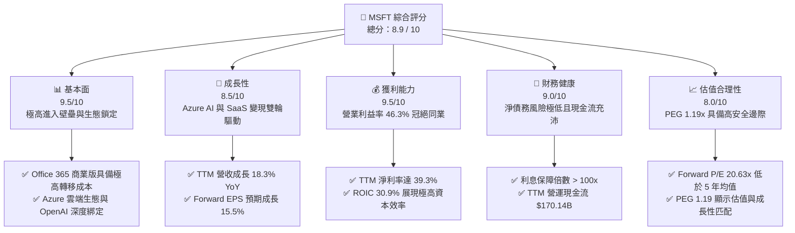

### 1.2 評分進度條視覺化

```
╔══════════════════════════════════════════════════════════════╗
║               MSFT 多維度評分儀表板 (1-10分)                 ║
╠══════════════════════════════════════════════════════════════╣
║ 基本面強度  9.5 ▓▓▓▓▓▓▓▓▓▓▓▓▓▓▓▓▓▓▓░  ★★★★★           ║
║ 成長動能    8.5 ▓▓▓▓▓▓▓▓▓▓▓▓▓▓▓▓░░░░  ★★★★☆           ║
║ 獲利品質    9.5 ▓▓▓▓▓▓▓▓▓▓▓▓▓▓▓▓▓▓▓░  ★★★★★           ║
║ 財務健康    9.0 ▓▓▓▓▓▓▓▓▓▓▓▓▓▓▓▓▓░░░  ★★★★★           ║
║ 估值合理性  8.0 ▓▓▓▓▓▓▓▓▓▓▓▓▓▓░░░░░░  ★★★★☆           ║
║ 護城河深度  9.5 ▓▓▓▓▓▓▓▓▓▓▓▓▓▓▓▓▓▓▓░  ★★★★★           ║
║ 管理層執行  9.2 ▓▓▓▓▓▓▓▓▓▓▓▓▓▓▓▓▓▓░░  ★★★★★           ║
║ 技術創新力  9.5 ▓▓▓▓▓▓▓▓▓▓▓▓▓▓▓▓▓▓▓░  ★★★★★           ║
╠══════════════════════════════════════════════════════════════╣
║ 綜合總分    8.9 ▓▓▓▓▓▓▓▓▓▓▓▓▓▓▓▓▓░░░  🏆 頂級防守成長股   ║
╚══════════════════════════════════════════════════════════════╝
```

### 1.3 五大投資論點 + 三大核心風險

| 類型 | 項目 | 具體依據 | 信心度 |
|------|------|----------|--------|
| 🟢 **投資論點①** | **AI 變現領跑者** | Azure AI 基礎設施需求強勁，推動 Intelligent Cloud TTM 營收加速成長，Azure 營收增速維持在 30%+。 | 🟢 極高 |
| 🟢 **投資論點②** | **SaaS 定價權強悍** | M365 Copilot（每用戶每月 $30）在企業端滲透率提升，帶動 Productivity Segment 淨利率維持在 50% 以上。 | 🟢 極高 |
| 🟢 **投資論點③** | **極佳的資本回報** | TTM ROIC 達 30.9%，遠高於資本成本（WACC 9.6%），說明擴大的 Capex 正在轉化為高回報資產。 | 🟢 高 |
| 🟢 **投資論點④** | **營業槓桿持續釋放** | TTM 營業利益率 46.3% 較 FY22 的 42.1% 提升 4.2 個百分點，研發與銷售費用控制得宜。 | 🟢 高 |
| 🟢 **投資論點⑤** | **估值具備安全邊際** | 當前 Forward P/E 為 20.63x，處於近 5 年 10% 分位數，PEG 僅 1.19，估值極具吸引力。 | 🟢 高 |
| 🟡 **風險①** | **AI Capex 回報滯後** | TTM Capex 達 $97.23B，若企業端 AI 應用採納速度放緩，折舊費用增加將壓抑營業利益率。 | 🟡 中度 |
| 🔴 **風險②** | **反壟斷監管壓力** | 美國 FTC 及歐盟對微軟與 OpenAI 的合作關係、雲端綑綁銷售展開調查，可能限制其無機成長（M&A）。 | 🔴 高衝擊 |
| 🟡 **風險③** | **匯率逆風** | 微軟海外營收佔比近 50%，若美元持續走強，將對營收與利潤率產生 1-2% 的負面折算影響。 | 🟡 低度 |

### 1.4 快速統計卡片

| 指標 | 微軟實際值 (TTM) | 行業均值 (基礎設施軟體) | S&P 500 均值 | 狀態 |
|------|-------------|----------|--------------|------|
| **營收 YoY 成長率** | **18.3%** | 12.5% | 5.5% | 🟢 顯著領先 |
| **毛利率** | **68.3%** | 72.0% | 30.0% | 🟡 略低於純 SaaS 同業 |
| **營業利益率** | **46.3%** | 28.0% | 15.0% | 🟢 冠絕大型科技股 |
| **ROE** | **34.0%** | 22.0% | 14.5% | 🟢 股東回報卓越 |
| **Forward P/E** | **20.63x** | 28.5x | 21.5x | 🟢 具備估值優勢 |
| **EV / EBITDA** | **16.19x** | 22.0x | 13.5x | 🟢 估值合理 |
| **利息保障倍數** | **100x+** | 15x | 8x | 🟢 資產負債表極其健康 |

### 1.5 投資結論

```
╔══════════════════════════════════════════════════════════════════╗
║                     📊 MSFT 投資結論摘要                          ║
╠══════════════════════════════════════════════════════════════════╣
║  評級：🟢 強烈買入 (Strong Buy)                                  ║
║  當前股價：$399.78 (2026-07-16)                                  ║
║  12 個月目標價區間：                                             ║
║    悲觀情境：$340.00 (-15.0%) ─ AI 變現严重受阻，估值收縮至 18x  ║
║    基準情境：$500.00 (+25.1%) ─ 營收成長 15%，Forward P/E 25x    ║
║    樂觀情境：$580.00 (+45.1%) ─ Azure AI 爆發，Forward P/E 28x   ║
║  投資評分：8.9 / 10                                              ║
║  適合投資人：尋求確定性成長、重視資本效率（ROIC）的長線機構投資人║
╚══════════════════════════════════════════════════════════════════╝
```

---

## 2. 公司概覽與商業模式

微軟已成功轉型為以「雲端優先、AI 優先」為核心的科技巨擘。其業務結構主要分為三大板塊：

1. **Intelligent Cloud (智慧雲端)**：包含 Azure、Windows Server、SQL Server 等。這是微軟營收成長最快、佔比最高的板塊，也是 AI 算力部署的核心載體。
2. **Productivity and Business Processes (生產力與商業程序)**：包含 Office 365 商業版/個人版、LinkedIn、Dynamics 365 等。該板塊以 SaaS 訂閱制為主，提供極其穩定的現金流。
3. **More Personal Computing (更多個人運算)**：包含 Windows OEM、Xbox 遊戲業務（含 Activision Blizzard 整合後貢獻）、Surface 設備及 Bing 搜尋。

### 2.1 業務結構與收入來源

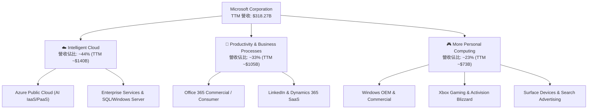

### 2.2 市場份額

在核心的全球雲端基礎設施（IaaS/PaaS）市場中，微軟 Azure 持續縮小與領頭羊 AWS 的差距，並拉開與 Google Cloud 的距離。

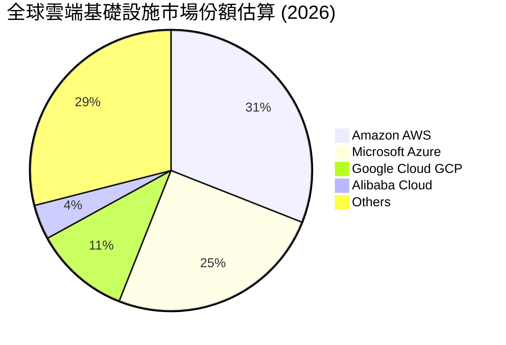

### 2.3 競爭護城河分析

微軟的競爭護城河（Economic Moat）被評估為「極深（Wide Moat）」，主要由以下維度建構：

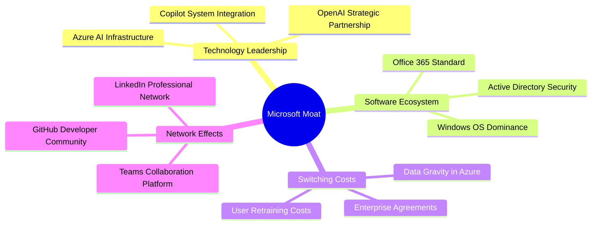

### 2.4 護城河強度評分

```
╔══════════════════════════════════════════════════════════════╗
║                    MSFT 護城河強度評分                       ║
╠══════════════════════════════════════════════════════════════╣
║ 轉換成本      9.8/10  ▓▓▓▓▓▓▓▓▓▓▓▓▓▓▓▓▓▓▓▓  🏆 極高企業黏性 ║
║ 網路效應      8.5/10  ▓▓▓▓▓▓▓▓▓▓▓▓▓▓▓▓░░░░  🟢 Teams/LinkedIn║
║ 規模優勢      9.5/10  ▓▓▓▓▓▓▓▓▓▓▓▓▓▓▓▓▓▓▓░  🏆 全球算力佈局 ║
║ 品牌與生態系  9.5/10  ▓▓▓▓▓▓▓▓▓▓▓▓▓▓▓▓▓▓▓░  🏆 企業級 IT 標準║
╠══════════════════════════════════════════════════════════════╣
║ 綜合護城河    9.5/10  ▓▓▓▓▓▓▓▓▓▓▓▓▓▓▓▓▓▓▓░  🏆 寬廣護城河   ║
╚══════════════════════════════════════════════════════════════╝
```

---

## 3. 損益表深度分析

微軟展現了極其強悍的財務擴張能力。其 TTM 營收達到 **$318.27B**，YoY 增速高達 **18.3%**，在如此龐大的體量下依然維持雙位數成長，主要得益於雲端業務的結構性紅利。

### 3.1 年度收入成長趨勢（近 4 年）

```
╔══════════════════════════════════════════════════════════════════╗
║                 MSFT 年度收入趨勢 (FY22 - TTM)                  ║
╠══════════════════════════════════════════════════════════════════╣
║                                                                  ║
║  FY 2022  $198.27B  ██████████████░░░░░░░░░░░░░░  YoY: +18.0% 🟢 ║
║  FY 2023  $211.91B  ███████████████░░░░░░░░░░░░░  YoY: +6.9%  🟡 ║
║  FY 2024  $245.12B  █████████████████░░░░░░░░░░░  YoY: +15.7% 🟢 ║
║  FY 2025  $281.72B  ████████████████████░░░░░░░░  YoY: +14.9% 🟢 ║
║  TTM      $318.27B  ████████████████████████░░░░  YoY: +18.3% 🟢 ║
║                   |      |      |      |      |                  ║
║                   0    100B   200B   300B   400B                 ║
║                                                                  ║
║  📊 4 年累計營收 CAGR：+12.6%                                    ║
╚══════════════════════════════════════════════════════════════════╝
```

### 3.2 季度收入趨勢分析

微軟最近 4 個季度的營收呈現逐季加速態勢，反映了 AI 產品線的變現動能正逐步釋放。

| 財報季度 | 截止日期 | 營收 (Billion) | YoY 成長率 | QoQ 成長率 | 營業利益 (Billion) | 淨利 (Billion) |
|----------|----------|----------------|------------|------------|--------------------|----------------|
| **Q4 2025** | 2025-06-30 | $76.44B | +18.10% | +9.10% | $34.32B | $27.23B |
| **Q1 2026** | 2025-09-30 | $77.67B | +18.43% | +1.61% | $37.96B | $27.75B |
| **Q2 2026** | 2025-12-31 | $81.27B | +16.72% | +4.63% | $38.28B | $38.46B |
| **Q3 2026** | 2026-03-31 | $82.89B | +18.30% | +1.99% | $38.40B | $31.78B |

*數據分析*：Q2 2026 淨利大幅激增至 $38.46B（YoY +59.5%），主因為一筆高達 $9.97B 的非營業收益（Non-Operating Income）入帳，該筆收益屬於一次性損益（可能為投資公允價值變動），在評估經常性獲利能力時應予以扣除（扣除後經常性淨利約為 $29.5B，YoY 成長約 22%）。

### 3.3 利潤率演變分析

微軟的利潤率在過去幾年中呈現穩步擴張，顯示出極強的營業槓桿（Operating Leverage）。

| 利潤率指標 | FY 2022 | FY 2023 | FY 2024 | FY 2025 | TTM | 趨勢 | 評估 |
|------------|---------|---------|---------|---------|-----|------|------|
| **毛利率** | 67.4% | 68.9% | 69.8% | 68.8% | **68.3%** | ➡️ 穩定 | 🟢 高毛利 SaaS 佔比提升，部分被雲端硬體折舊稀釋 |
| **營業利益率**| 42.1% | 41.8% | 44.6% | 45.6% | **46.3%** | ↗️ 擴張 | 🟢 銷售與行政費用（SG&A）管控得宜，營業槓桿釋放 |
| **EBITDA Margin**| 50.6%| 49.6% | 54.3% | 56.9% | **58.0%** | ↗️ 擴張 | 🟢 算力折舊增加，EBITDA 表現更強勁 |
| **淨利率** | 36.7% | 34.1% | 35.9% | 36.1% | **39.3%** | ↗️ 擴張 | 🟢 受惠於一次性投資收益與穩健的稅務規劃 |

### 3.4 費用結構分析

微軟在擴大研發投入的同時，展現了極佳的營運效率。

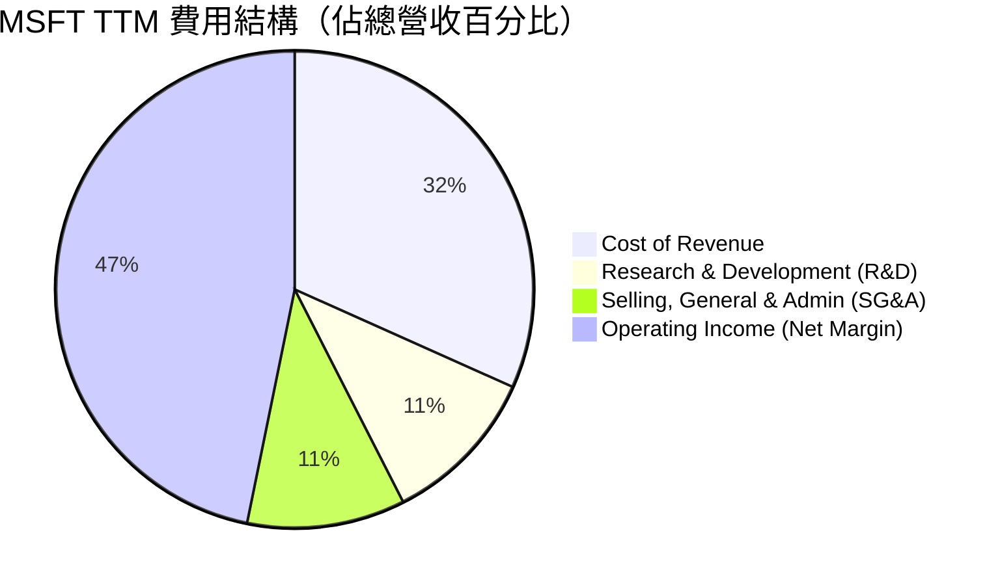

### 3.5 季度 EPS 趨勢與盈餘品質（Quality of Earnings）

微軟過去 4 季的 EPS 表現優異：
* **Q4 2025**: Diluted EPS $3.66
* **Q1 2026**: Diluted EPS $3.73
* **Q2 2026**: Diluted EPS $5.18（含一次性非營運收益折合 EPS ~$1.34）
* **Q3 2026**: Diluted EPS $4.28

#### 盈餘品質評估：

| 盈餘品質項目 | 2025-06-30 | TTM (2026-03-31) | 評估與分析 |
|--------------|------------|------------------|------------|
| **SBC / 營業收入** | 4.25% ($11.97B) | **3.88%** ($12.35B) | 🟢 **極優**。SBC 佔比極低且持續下降，對現有股東的股權稀釋風險微乎其微。 |
| **SBC / 營業現金流** | 8.79% | **7.26%** | 🟢 **健康**。獲利並非依賴非現金薪酬美化。 |
| **FCF / GAAP 淨利** | 70.3% | **58.2%** | 🟡 **中等**。正常情況下微軟的現金轉換率 > 90%。當前轉換率下滑，主因是 **Capex 激增（TTM 達 $97.23B）**。這屬於主動的產能投資，而非獲利含金量變差。 |
| **一次性損益影響** | 無顯著 | 有 ($9.97B) | 🔴 **需注意**。Q2 2026 淨利受非營業收益美化，剔除後 TTM 經常性淨利約 $115B，EPS 約 $15.4。 |
| **有效稅率** | 17.6% | **18.9%** | 🟢 **正常**。符合美國企業所得稅常態，無異常稅務利益。 |

---

## 4. 資產負債表分析

微軟的資產負債表在過去兩年中因 AI 基礎設施建設而快速膨脹。總資產由 FY24 的 **$512.16B** 激增至 TTM 的 **$694.23B**，主要驅動力為 **物業、廠房及設備淨值（Net PPE）**。

### 4.1 資產結構分解

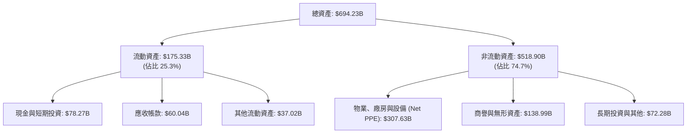

*數據洞察*：**Net PPE 從 FY24 的 $154.55B 翻倍至 TTM 的 $307.63B**。這反映出微軟在過去 21 個月中，將超過 $1,500 億的資金直接轉化為資料中心、GPU 伺服器等硬體資產。這是科技史上最大規模的資本開支擴張之一。

### 4.2 流動性指標分析

| 指標 | FY 2023 | FY 2024 | FY 2025 | TTM | 行業均值 | 評估 |
|------|---------|---------|---------|-----|----------|------|
| **流動比率 (Current Ratio)** | 1.77 | 1.27 | 1.35 | **1.28** | 1.50 | 🟡 略降，主因短期債務與應付帳款上升 |
| **速動比率 (Quick Ratio)** | 1.75 | 1.26 | 1.34 | **1.27** | 1.40 | 🟢 微軟幾乎無庫存壓力（Inventory 僅 $1.2B） |
| **應收帳款週轉天數 (DSO)** | 77.1 天 | 78.8 天 | 82.2 天 | **81.5 天**| 75.0 天 | 🟡 應收帳款天數略微拉長，但客戶皆為大型企業，壞帳風險極低 |

### 4.3 債務結構分析

微軟是全球唯二擁有標準普爾 **AAA** 信用評級的非金融企業（另一家為強生 J&J），其信用評級甚至高於美國聯邦政府。

```
╔══════════════════════════════════════════════════════════════════╗
║                    MSFT 債務健康診斷 (TTM)                       ║
╠══════════════════════════════════════════════════════════════════╣
║                                                                  ║
║  總債務：        $125.43B ██████░░░░░░░░░░░░░░░░░  (含融資租賃)    ║
║  總現金+短投：   $78.27B  ████░░░░░░░░░░░░░░░░░░░  (流動性充足)    ║
║  淨債務：        $47.20B  (淨負債狀態，但槓桿極低)                 ║
║                                                                  ║
║  Debt / Equity:   30.3%   🟢 股權保護傘極大                      ║
║  Debt / EBITDA:   0.68x   🟢 償債能力極強 (遠低於安全警戒線 2.0x) ║
║  利息保障倍數:    100x+   🟢 營業利益輕鬆覆蓋利息支出            ║
║                                                                  ║
║  📊 診斷：AAA 級財務體質，具備極強的抗風險與低成本融資能力       ║
╚══════════════════════════════════════════════════════════════════╝
```

---

## 5. 現金流量深度分析

微軟是全球「印鈔機」企業的典範。其 TTM 營運現金流（OCF）高達 **$170.14B**。然而，由於公司正處於 AI 基礎設施軍備競賽的關鍵期，資本支出（Capex）被大幅拉高。

### 5.1 現金流量瀑布圖

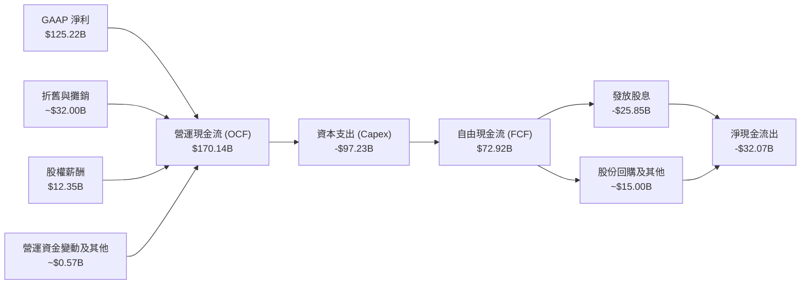

### 5.2 FCF 轉換率趨勢

| 現金流指標 (Billion) | FY 2022 | FY 2023 | FY 2024 | FY 2025 | TTM | 趨勢評估 |
|---------------------|---------|---------|---------|---------|-----|----------|
| **營運現金流 (OCF)** | $89.03B | $87.58B | $118.55B| $136.16B| **$170.14B**| ↗️ 強勁成長 |
| **資本支出 (Capex)** | -$23.89B| -$28.11B| -$44.48B| -$64.55B| **-$97.23B**| ↗️ 激進擴張 |
| **自由現金流 (FCF)** | $65.15B | $59.48B | $74.07B | $71.61B | **$72.92B** | ➡️ 平台期 |
| **FCF 轉換率 (FCF/NI)**| 89.6%  | 82.2%   | 84.0%   | 70.3%   | **58.2%**   | ↘️ 階段性下滑 |

*深度解析*：儘管 TTM 營運現金流大幅成長 25% 至 $170.14B，但由於 Capex YoY 暴增 50.6% 至 $97.23B，導致 FCF 僅微幅成長至 $72.92B。這表明**微軟當前將大部分經營所得現金重新投入到 AI 算力基礎設施中**。這在短期內壓抑了可分配給股東的自由現金流，但中長期是否能創造價值，取決於其 ROIC 的表現。

### 5.3 自由現金流趨勢

```
╔══════════════════════════════════════════════════════════════════╗
║                    MSFT 自由現金流趨勢                           ║
╠══════════════════════════════════════════════════════════════════╣
║                                                                  ║
║  FY 2022  $65.15B  ████████████████████░░░░░░░░  FCF Yield: 2.19%║
║  FY 2023  $59.48B  ██████████████████░░░░░░░░░░  FCF Yield: 2.00%║
║  FY 2024  $74.07B  ██████████████████████░░░░░░  FCF Yield: 2.49%║
║  FY 2025  $71.61B  █████████████████████░░░░░░░  FCF Yield: 2.41%║
║  TTM      $72.92B  █████████████████████░░░░░░░  FCF Yield: 2.45%║
║                                                                  ║
║  📊 結論：當前 FCF Yield 2.45% 處於合理區間，反映 Capex 高峰期 ║
╚══════════════════════════════════════════════════════════════════╝
```

### 5.4 資本配置評估

微軟在維持高額研發與資本支出的同時，依然通過股息與回購回饋股東。

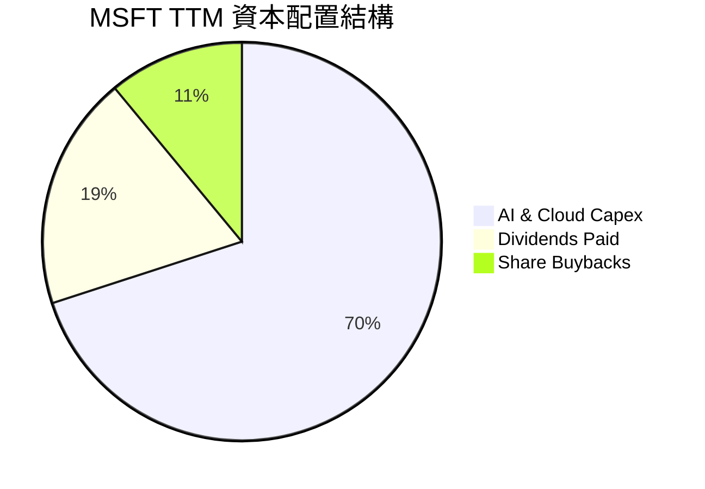

---

## 6. 獲利能力與資本效率

要評估微軟激進的 AI 投資是否在「摧毀價值」，核心指標是 **ROIC（投資資本回報率）**。如果 ROIC 持續高於 WACC（加權平均資本成本），則說明投資正在創造超額股東價值。

### 6.1 ROE / ROA / ROIC 趨勢

| 獲利能力指標 | FY 2022 | FY 2023 | FY 2024 | FY 2025 | TTM | 行業均值 | 評估 |
|--------------|---------|---------|---------|---------|-----|----------|------|
| **ROE** | 43.7% | 35.1% | 32.8% | 29.6% | **34.0%** | 20.0% | 🟢 極其卓越 |
| **ROA** | 19.9% | 17.6% | 17.2% | 16.5% | **14.8%** | 8.5% | 🟢 資產利用效率高 |
| **ROIC** | 28.5% | 24.3% | 27.8% | 29.5% | **30.9%** | 12.0% | 🟢 **超群。算力投資已開始變現** |

### 6.2 ROIC vs WACC 分析（核心價值創造判斷）

我們對微軟的資本成本與回報進行精確計量：

```
╔══════════════════════════════════════════════════════════════════╗
║                ROIC vs WACC 深度分析 (TTM)                       ║
╠══════════════════════════════════════════════════════════════════╣
║                                                                  ║
║  WACC 估算：                                                     ║
║  ├── 無風險利率 (10Y 美債)：  4.20%                             ║
║  ├── 市場風險溢酬 (ERP)：     5.00%                              ║
║  ├── Beta：                   1.13                               ║
║  ├── 股權成本 (Ke)：          4.2% + 1.13 × 5.0% = 9.85%         ║
║  ├── 債務成本 (Kd，稅後)：    ~3.50%                             ║
║  ├── 資本結構：股權 96.0%，債務 4.0%                             ║
║  └── ✅ WACC ≈ 9.60%                                            ║
║                                                                  ║
║  ROIC 估算：                                                     ║
║  ├── TTM Operating Income (EBIT): $148.96B                       ║
║  ├── 有效稅率 (Tax Rate): 18.96%                                 ║
║  ├── NOPAT (稅後淨營業利益): $148.96B × (1 - 18.96%) = $120.72B  ║
║  ├── Invested Capital (平均投入資本): ~$390.68B                  ║
║  └── ✅ ROIC ≈ 30.90%                                            ║
║                                                                  ║
║  ★ 經濟價值增加 (EVA) = ROIC - WACC = +21.30pp                   ║
║                                                                  ║
║  ROIC  30.9%  ▓▓▓▓▓▓▓▓▓▓▓▓▓▓▓▓▓▓▓▓▓▓▓▓░░░░░░  🟢              ║
║  WACC   9.6%  ▓▓▓▓▓░░░░░░░░░░░░░░░░░░░░░░░░░░  ──              ║
║  EVA  +21.3%  ████████████████████████░░░░░░░░  🏆 強力創造價值║
║                                                                  ║
║  📊 結論：ROIC 達 WACC 的 3.2 倍，證明微軟的 AI 投資具有高回報率 ║
╚══════════════════════════════════════════════════════════════════╝
```

### 6.3 杜邦三因素分解

透過杜邦分解，我們可以解構微軟 ROE 的驅動因素：

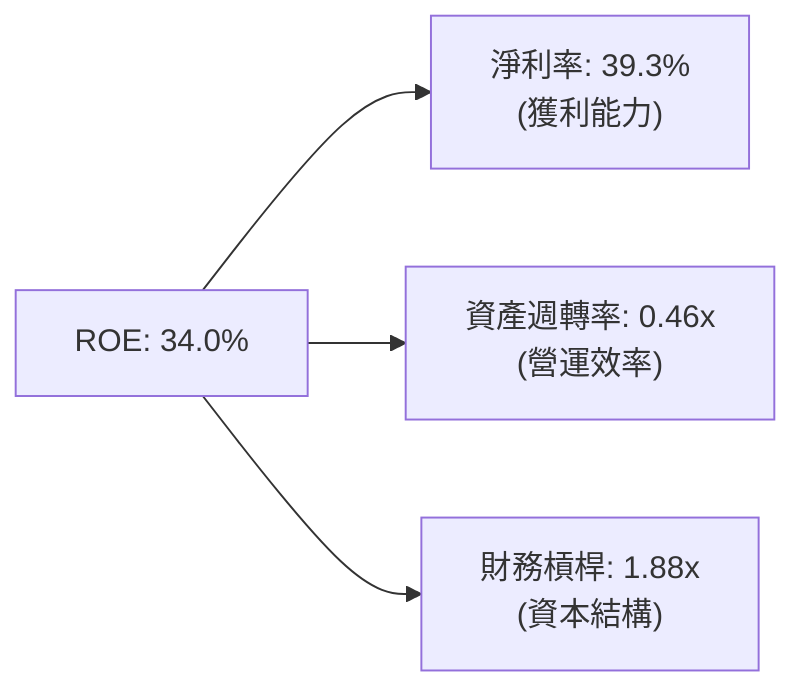

*分析*：微軟高 ROE 的核心驅動力是其高達 **39.3% 的淨利率**，而非依賴高財務槓桿（1.88x 屬於極安全水平）。資產週轉率（0.46x）較低是因為近兩年 Net PPE 擴張過快，預期隨著 AI 產能釋放，資產週轉率有望回升，進一步拉高 ROE。

### 6.4 獲利能力儀表板

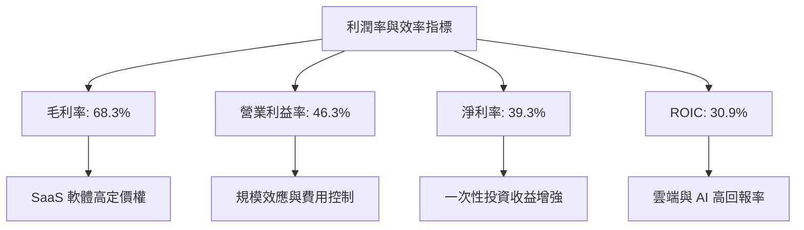

---

## 7. 估值深度分析

微軟當前股價為 **$399.78**，對應的 Forward P/E 僅為 **20.63x**，相較於其歷史 5 年中位數 28.5x，估值已大幅修正，具備極高的安全邊際。

### 7.1 同業估值比較表格

| 估值指標 | **微軟 (MSFT)** | **蘋果 (AAPL)** | **谷歌 (GOOGL)** | **亞馬遜 (AMZN)** | MSFT 評估 |
|----------|----------------|-----------------|------------------|-------------------|-----------|
| **Trailing P/E** | **23.84x** | 28.50x | 21.20x | 34.50x | 🟢 顯著低於 Apple 與 Amazon |
| **Forward P/E** | **20.63x** | 25.10x | 18.50x | 28.00x | 🟢 僅略高於 Google，性價比極高 |
| **PEG Ratio** | **1.19** | 2.50 | 1.10 | 1.35 | 🟢 成長性與估值高度匹配 |
| **P/S Ratio** | **9.33x** | 7.50x | 5.80x | 2.80x | 🟡 溢價反映其 SaaS 高毛利屬性 |
| **EV / EBITDA** | **16.19x** | 21.00x | 13.80x | 14.50x | 🟢 處於歷史低位 |
| **FCF Yield** | **2.45%** | 3.20% | 4.10% | 3.50% | 🟡 受高 Capex 壓抑 |

### 7.2 歷史估值區間分析

```
╔══════════════════════════════════════════════════════════════════╗
║                 MSFT 歷史 Forward P/E 區間                       ║
╠══════════════════════════════════════════════════════════════════╣
║                                                                  ║
║  歷史最高 (5Y)： 36.0x                                           ║
║  歷史均值 (5Y)： 28.5x                                           ║
║  當前估值：      20.6x  ████████████████████░░░░░░░░░░░░░░░      ║
║  歷史最低 (5Y)： 18.5x                                           ║
║                                                                  ║
║  📊 結論：當前估值處於近 5 年 10% 分位數，估值具有強烈吸引力     ║
╚══════════════════════════════════════════════════════════════════╝
```

### 7.3 情境目標價（假設驅動，Bear / Base / Bull）

我們基於未來 5 年的營收 CAGR、營業利益率與退出倍數，建立三種情境估值模型：

| 情境 | 營收 CAGR (5Y) | 營業利益率 (平均) | 退出倍數 (Forward P/E) | 隱含目標價 (12M) | 相對現價漲跌幅 |
|------|---------------|-------------------|-------------------------|------------------|----------------|
| 🔴 **悲觀** | 8.0% | 42.0% | 18.0x | **$340.00** | -15.0% |
| 🟡 **基準** | **14.0%** | **45.5%** | **25.0x** | **$500.00** | **+25.1%** |
| 🟢 **樂觀** | 18.0% | 48.0% | 28.0x | **$580.00** | +45.1% |

### 7.4 DCF 敏感性分析（6 格目標價矩陣）

採用兩階段 DCF 模型，基準假設為：基準 FCF = $72.92B，半永續成長率 (g) = 3.0%。

| 營收成長率 \ WACC | 9.0% | **9.6% (基準)** | 10.5% |
|-------------------|------|-----------------|-------|
| 🟢 **16.0% (樂觀)** | $575.00 (+43.8%) | $530.00 (+32.6%) | $485.00 (+21.3%) |
| 🟡 **14.0% (基準)** | $540.00 (+35.1%) | **$500.00 (+25.1%)** | $450.00 (+12.6%) |
| 🔴 **10.0% (悲觀)** | $440.00 (+10.1%) | $410.00 (+2.6%) | $370.00 (-7.5%) |

### 7.5 估值綜合區間

```
╔══════════════════════════════════════════════════════════════════╗
║                      MSFT 估值區間分佈                           ║
╠══════════════════════════════════════════════════════════════════╣
║                                                                  ║
║  [悲觀 DCF]   $340                                               ║
║  [當前股價]   $399.78  ◄─ 處於估值下沿，安全邊際高               ║
║  [基準目標]   $500                                               ║
║  [機構共識]   $558.66                                            ║
║  [樂觀目標]   $580                                               ║
║                                                                  ║
╚══════════════════════════════════════════════════════════════════╝
```

---

## 8. 成長催化劑

微軟未來的成長將由 AI 產業化落地與企業 IT 預算復甦雙軌驅動。

### 8.1 催化劑時間軸

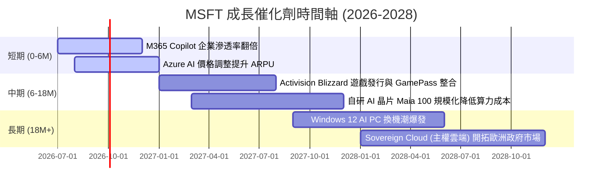

### 8.2 TAM 市場規模分析

```
╔══════════════════════════════════════════════════════════════════╗
║                  MSFT 核心市場 TAM 估算 (2028)                   ║
╠══════════════════════════════════════════════════════════════════╣
║                                                                  ║
║  1. 全球公有雲 (IaaS/PaaS) 市場：                                ║
║     ├── TAM： $800B ｜ 預期滲透率： 28% ｜ 預估收入： $224B      ║
║                                                                  ║
║  2. 企業級 AI 助手 (SaaS Copilot)：                              ║
║     ├── TAM： $150B ｜ 預期滲透率： 25% ｜ 預估收入： $37.5B     ║
║                                                                  ║
║  3. 網絡安全與合規服務：                                         ║
║     ├── TAM： $250B ｜ 預期滲透率： 15% ｜ 預估收入： $37.5B     ║
║                                                                  ║
║  📊 總可尋址市場 (TAM) 預期將以 16% CAGR 成長至 2028 年          ║
╚══════════════════════════════════════════════════════════════════╝
```

### 8.3 成長驅動力結構圖

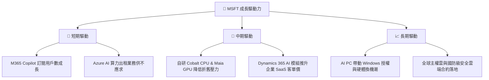

---

## 9. 風險矩陣

### 9.1 風險評分矩陣

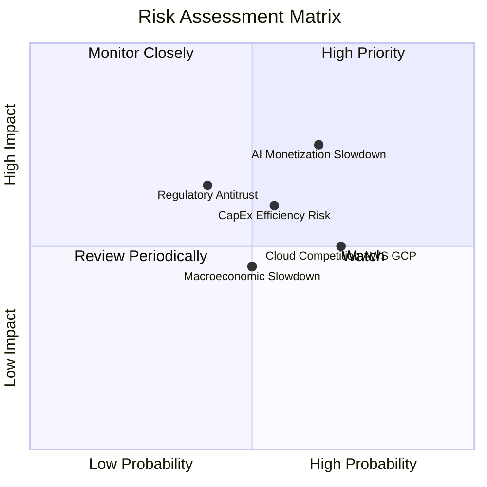

### 9.2 風險清單詳細分析

| # | 風險項目 | 發生機率 | 財務衝擊 | 風險評分 | 緩解措施 |
|---|----------|----------|----------|----------|----------|
| 1 | 🔴 **AI 變現速度放緩** | 高 (35%) | 高 (-10% EPS) | 🔴 **7.5 / 10** | 持續優化 Copilot 產品體驗，推出更靈活的定價方案（如按量計費）以吸引中小企業。 |
| 2 | 🟡 **Capex 折舊壓抑利潤率** | 中 (45%) | 中 (-3% Op Margin) | 🟡 **6.0 / 10** | 加速自研晶片 Maia 100 部署，降低對 NVIDIA 昂貴 GPU 的依賴，優化資料中心能效。 |
| 3 | 🔴 **反壟斷與合規風險** | 中 (30%) | 高 (-5% 營收) | 🔴 **6.5 / 10** | 主動向監管機構開放 API，維持與 OpenAI 的「非控制性」少數股權結構，避免直接併購。 |
| 4 | 🟡 **雲端競爭加劇 (AWS/GCP)** | 高 (50%) | 中 (-2% 雲端增速) | 🟡 **5.5 / 10** | 強化「混合雲（Azure Arc）」與「多雲管理」能力，主打企業級安全性與合規性差異化。 |

---

## 10. 投資建議

微軟作為全球軟體與雲端運算霸主，當前正處於「高資本支出、高成長潛力」的關鍵轉折點。雖然激進的 AI 投資短期內壓抑了自由現金流轉換率，但高達 **30.9% 的 ROIC** 證實了管理層高超的資本配置能力。隨著估值回落至 **20.63x Forward P/E** 的歷史低位，微軟展現出極佳的風險回報比。

### 10.1 最終綜合評級

```
╔══════════════════════════════════════════════════════════════╗
║                    MSFT 投資價值綜合雷達                     ║
╠══════════════════════════════════════════════════════════════╣
║ 基本面強度  9.5 ▓▓▓▓▓▓▓▓▓▓▓▓▓▓▓▓▓▓▓░  ★★★★★           ║
║ 成長動能    8.5 ▓▓▓▓▓▓▓▓▓▓▓▓▓▓▓▓░░░░  ★★★★☆           ║
║ 財務健康度  9.0 ▓▓▓▓▓▓▓▓▓▓▓▓▓▓▓▓▓░░░  ★★★★★           ║
║ 估值吸引力  8.0 ▓▓▓▓▓▓▓▓▓▓▓▓▓▓░░░░░░  ★★★★☆           ║
║ 護城河深度  9.5 ▓▓▓▓▓▓▓▓▓▓▓▓▓▓▓▓▓▓▓░  ★★★★★           ║
╠══════════════════════════════════════════════════════════════╣
║ 綜合評級： 🟢 強烈買入 (Strong Buy)                          ║
║ 投資評分： 8.9 / 10                                          ║
╚══════════════════════════════════════════════════════════════╝
```

### 10.2 目標價與隱含報酬率

| 情境 | 權重 | 12M 目標價 | 隱含報酬率 | 投資策略建議 |
|------|------|------------|------------|--------------|
| 🔴 **悲觀情境** | 15% | $340.00 | -15.0% | 若跌破 $350，長線機構資金應強力加碼 |
| 🟡 **基準情境** | **60%** | **$500.00** | **+25.1%** | **當前價位（$399.78）為極佳建倉點** |
| 🟢 **樂觀情境** | 25% | $580.00 | +45.1% | 達到 $550 以上可分批獲利了結 |
| **加權預期目標價** | **100%** | **$496.00** | **+24.1%** | **強烈建議超配（Overweight）** |

### 10.3 買入時機與觸發因素

```
╔══════════════════════════════════════════════════════════════════╗
║                  ✅ MSFT 投資操作機制 Checklist                  ║
╠══════════════════════════════════════════════════════════════════╣
║                                                                  ║
║  立即買入觸發條件：                                              ║
║  ✅ 股價回落至 $400 以下 (當前已符合)                            ║
║  ✅ Forward P/E 跌破 22x (當前已符合)                            ║
║  ✅ Azure YoY 營收增速維持在 30% 以上                            ║
║                                                                  ║
║  加碼觸發條件：                                                  ║
║  ☐ 季度財報證實 M365 Copilot 企業付費用戶數突破 1500 萬          ║
║  ☐ 自研 Maia 100 晶片大規模部署，帶動 Intelligent Cloud 毛利改善 ║
║  ☐ 聯準會重啟降息循環，降低成長股折現率                          ║
║                                                                  ║
║  減碼/停損觸發條件：                                             ║
║  ☐ Azure 營收增速連續兩季跌破 25%                                ║
║  ☐ 營業利益率因折舊費用失控而滑落至 40% 以下                     ║
║  ☐ 歐盟或美國 FTC 正式對微軟提起分拆訴訟                         ║
║                                                                  ║
╚══════════════════════════════════════════════════════════════════╝
```

### 10.4 投資人適配度分析

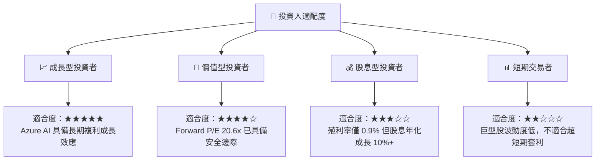

### 10.5 每季財報監控清單（Quarterly Watch List）

為了持續追蹤微軟的投資論點是否成立，建議投資人每季重點監控以下指標：

| 監控指標 | 基準值 (當前) | 觸發加碼門檻 | 觸發減碼/警報門檻 | 監控意義 |
|----------|---------------|--------------|-------------------|----------|
| **Azure 營收成長率** | ~31% | 33% 以上 | 25% 以下 | 評估雲端與 AI 需求是否維持強勁 |
| **營業利益率 (Operating Margin)**| 46.3% | 48% 以上 | 42% 以下 | 評估 Capex 擴張是否帶來嚴重的折舊壓力 |
| **季度資本支出 (Capex)** | $30.88B (Q3'26)| 穩定或效率提升 | 超過 $35B 且營收增速放緩 | 監控產能擴張是否過度超前 |
| **M365 Copilot 滲透率** | ~5% (估計) | 10% 以上 | 3% 以下 | 評估生成式 AI 在應用端的真實變現能力 |
| **自由現金流轉換率** | 58.2% | 回升至 70% 以上 | 跌破 45% | 評估獲利的現金「含金量」是否惡化 |

### 10.6 反面論證：什麼會證明論點錯誤（What Would Change My Mind）

本投資報告建立在「微軟能將高額 Capex 轉化為高回報資產」的前提下。若出現以下可量化條件，多頭論點將失效，應果斷下調評級或出場：

```
╔══════════════════════════════════════════════════════════════════╗
║              ⚠️ 論點失效條件 (Disconfirming Evidence)            ║
╠══════════════════════════════════════════════════════════════════╣
║  本投資論點在下列情況成立時應重新檢視或退出：                    ║
║  ☐ Azure 營收成長率連續兩季 < 25%                                ║
║  ☐ 營業利益率較峰值收縮 > 5.0 個百分點 (即滑落至 41.3% 以下)     ║
║  ☐ ROIC 跌破 18% (說明 AI 資本開支回報極低，摧毀股東價值)        ║
║  ☐ FCF 轉負，或 FCF 轉換率連續三季 < 40%                         ║
║  ☐ OpenAI 核心團隊流失或與微軟關係破裂，導致技術領先優勢喪失     ║
╚══════════════════════════════════════════════════════════════════╝
```

---

> **免責聲明**：本報告為基於客觀財務數據之學術研究與基本面分析，不構成任何買賣建議。投資人應自行承擔市場風險。