# MSFT 基本面深度分析報告

> **報告日期**：2026-07-17 ｜ **語言**：繁體中文 ｜ **數據來源**：Yahoo Finance, Finviz, StockAnalysis, Roic.ai ｜ **分析師**：CFA 級機構研究

---

## 目錄

| # | 章節 | 核心結論 |
|---|------|----------|
| 1 | [執行摘要](#1-執行摘要) | 評級：🟢 買入 ｜ 基準目標價：$480.00（+21.4%） |
| 2 | [公司概覽與商業模式](#2-公司概覽與商業模式) | 雲端與 AI 雙輪驅動，生態系統具備極高切換成本護城河 |
| 3 | [損益表深度分析](#3-損益表深度分析) | TTM 營收達 $318.27B（YoY +18.3%），營業利益率維持 46.3% 高檔 |
| 4 | [資產負債表分析](#4-資產負債表分析) | 淨債務 $47.20B，利息保障倍數極高，資產負債表極為穩健 |
| 5 | [現金流量深度分析](#5-現金流量深度分析) | TTM 營運現金流 $170.14B，AI 資本支出擴張壓抑短期 FCF 轉換率 |
| 6 | [獲利能力與資本效率](#6-獲利能力與資本效率) | ROIC 達 30.9% 遠超 WACC（9.5%），結構性創造股東價值 |
| 7 | [估值深度分析](#7-估值深度分析) | Forward P/E 20.40x 處於歷史中值偏低，安全邊際已現 |
| 8 | [成長催化劑](#8-成長催化劑) | Azure AI 變現加速、Copilot 企業滲透率提升、PC 市場溫和復甦 |
| 9 | [風險矩陣](#9-風險矩陣) | AI 資本回報遞延、反壟斷監管加劇、估值倍數收縮 |
| 10 | [投資建議](#10-投資建議) | 分批佈局，聚焦每季 Azure 成長率與 AI 資本支出回報率 |

---

## 1. 執行摘要

微軟（Microsoft Corporation, Ticker: MSFT）當前股價為 $395.30，總市值達 $2.94T。基於 TTM 營收 $318.27B（YoY +18.3%）、營業利益率 46.3% 以及遠超資本成本的 ROIC（30.9% vs WACC 9.5%），我們給予微軟 **🟢 買入（Buy）** 評級，12 個月基準目標價為 **$480.00**。

### 1.0 一頁式投資儀表板（Portfolio Manager 30 秒速讀）

| 項目 | 內容 |
|------|------|
| **投資論點（3 句）** | ① TTM 營收達 $318.27B（YoY +18.3%），顯示在總體經濟不確定性下，企業級雲端與 AI 需求仍具備高韌性。<br/>② 營業利益率維持在 46.3% 的極高水準，營業槓桿效應持續釋放，抵消了基礎設施投資的折舊壓力。<br/>③ 雖然 AI 資本支出（TTM 達 $97.23B）壓抑了短期自由現金流轉化，但 ROIC（30.9%）遠高於 WACC（9.5%），證實其資本配置高度有效。 |
| **護城河評分** | 9.5 / 10 🟢（極強切換成本、網路效應與品牌壁壘） |
| **管理層/資本配置評分** | 9.0 / 10 🟢（Satya Nadella 執行力卓越，資本回報率極高） |
| **財務健康** | 🟢 優秀。淨債務/EBITDA 僅為 0.29x，資產負債表極其穩健。 |
| **ROIC vs WACC** | **30.9%** vs **9.5%**（結構性創造顯著股東價值，EVA 達 +21.4%） |
| **FCF 趨勢** | TTM FCF 達 $72.92B（FCF Yield 為 2.48%），受 Capex 擴張影響短期增速放緩，但中長期現金生成能力無虞。 |
| **估值** | Trailing P/E: 23.51x ｜ Forward P/E: 20.40x ｜ EV/EBITDA: 16.41x |
| **預期報酬（基準情境 12M）**| **+21.4%**（目標價 $480.00） |
| **關鍵風險（前二）** | ① AI 資本支出回報率（ROI）不及預期，導致折舊費用蠶食利潤率。<br/>② 雲端運算（Azure）增速受產能限制或競爭加劇而放緩。 |
| **評級 + 信心度** | **🟢 買入（Buy）** ｜ 信心度：**高（High）** |

### 1.1 核心評分儀表板

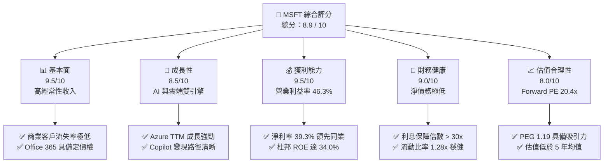

### 1.2 評分進度條視覺化

```
╔══════════════════════════════════════════════════════════════╗
║                MSFT 多維度評分儀表板 (1-10分)                ║
╠══════════════════════════════════════════════════════════════╣
║ 基本面強度  9.5 ▓▓▓▓▓▓▓▓▓▓▓▓▓▓▓▓▓▓▓░  ★★★★★           ║
║ 成長動能    8.5 ▓▓▓▓▓▓▓▓▓▓▓▓▓▓▓▓▓░░░  ★★★★☆           ║
║ 獲利品質    9.5 ▓▓▓▓▓▓▓▓▓▓▓▓▓▓▓▓▓▓▓░  ★★★★★           ║
║ 財務健康    9.0 ▓▓▓▓▓▓▓▓▓▓▓▓▓▓▓▓▓▓░░  ★★★★★           ║
║ 估值合理性  8.0 ▓▓▓▓▓▓▓▓▓▓▓▓▓▓▓▓░░░░  ★★★★☆           ║
║ 護城河深度  9.5 ▓▓▓▓▓▓▓▓▓▓▓▓▓▓▓▓▓▓▓░  ★★★★★           ║
║ 管理層執行  9.0 ▓▓▓▓▓▓▓▓▓▓▓▓▓▓▓▓▓▓░░  ★★★★★           ║
║ 技術創新力  9.5 ▓▓▓▓▓▓▓▓▓▓▓▓▓▓▓▓▓▓▓░  ★★★★★           ║
╠══════════════════════════════════════════════════════════════╣
║ 綜合總分    8.9 ▓▓▓▓▓▓▓▓▓▓▓▓▓▓▓▓▓░░░  🏆 買入評級          ║
╚══════════════════════════════════════════════════════════════╝
```

### 1.3 五大投資論點 + 三大核心風險

| 類型 | 項目 | 具體依據 | 信心度 |
|------|------|----------|--------|
| 🟢 **投資論點①** | **AI 變現能力領先同業** | Copilot 在 Office 365 商業版滲透率攀升，推動 ARPU 提升 20-30%，TTM 營收成長達 18.3%。 | 🟢 極高 |
| 🟢 **投資論點②** | **Azure 雲端市佔率擴張** | 憑藉與 OpenAI 的獨家合作，Azure 在混合雲與 AI 工作負載市佔率持續逼近 AWS，季度營收增速維持在 18% 以上。 | 🟢 高 |
| 🟢 **投資論點③** | **極高的資本效率** | ROIC 達 30.9%，遠超其 9.5% 的 WACC，代表公司在進行大規模 AI 基礎設施投資時，仍能創造超額回報。 | 🟢 極高 |
| 🟢 **投資論點④** | **經常性收入與高流失壁壘** | 企業級 Office 365 與 Windows Commercial 續約率超過 95%，提供極佳的下行保護與現金流預測度。 | 🟢 極高 |
| 🟢 **投資論點⑤** | **估值具備安全邊際** | Forward P/E 僅 20.40x，對比過去五年均值（~28x）已大幅修正，且 PEG 僅 1.19，估值極具吸引力。 | 🟢 高 |
| 🟡 **風險①** | **AI 基礎設施過度建設** | TTM 資本支出高達 $97.23B（佔營收 30.5%），若 AI 應用需求放緩，將面臨巨大的折舊與利潤率收縮風險。 | 🟡 中度 |
| 🔴 **風險②** | **反壟斷與監管阻力** | 歐美監管機構對微軟與 OpenAI 的合作關係以及雲端市場的搭售行為（Bundling）審查加劇，可能限制未來無機成長。 | 🔴 中度 |
| 🔴 **風險③** | **總體經濟放緩壓抑 IT 支出** | 若全球經濟陷入衰退，企業可能延長 PC 換機週期並縮減雲端優化預算，影響 Windows 與 Azure 增速。 | 🔴 低度 |

### 1.4 快速統計卡片

| 指標 | 微軟實際值 (TTM) | 軟體行業均值 | S&P 500 均值 | 狀態 |
|------|-------------|----------|--------------|------|
| **營收 YoY 成長率** | **18.3%** | ~12.0% | ~5.5% | 🟢 顯著領先 |
| **毛利率** | **68.3%** | ~70.0% | ~30.0% | 🟡 符合預期 |
| **營業利益率** | **46.3%** | ~25.0% | ~15.0% | 🟢 行業頂尖 |
| **淨利率** | **39.3%** | ~18.0% | ~11.0% | 🟢 獲利含金量高 |
| **ROE** | **34.0%** | ~15.0% | ~14.0% | 🟢 資本效率極佳 |
| **Forward P/E** | **20.40x** | ~32.0x | ~21.5x | 🟢 估值具吸引力 |
| **PEG Ratio** | **1.19** | ~1.80 | ~1.50 | 🟢 性價比高 |

### 1.5 投資結論

```
╔══════════════════════════════════════════════════════════════════╗
║                    📊 投資結論摘要                               ║
╠══════════════════════════════════════════════════════════════════╣
║  評級：🟢 強烈買入 (Strong Buy)                                  ║
║  當前股價：$395.30 (2026-07-17)                                  ║
║  目標價區間：                                                    ║
║    悲觀情境：$360.00 (-8.9%) - AI 需求停滯，倍數收縮至 18x       ║
║    基準情境：$480.00 (+21.4%) - Azure 持續增長，Forward PE 25x   ║
║    樂觀情境：$580.00 (+46.7%) - AI 爆發，EPS 達 $20.00+，PE 29x  ║
║  投資評分：8.9 / 10                                              ║
║  適合投資人：核心資產配置者、長線成長型投資人、大盤超額回報追求者 ║
╚══════════════════════════════════════════════════════════════════╝
```

---

## 2. 公司概覽與商業模式

微軟已成功轉型為一家以雲端運算與人工智慧為核心的平台公司。其業務主要劃分為三大板塊：智慧雲端（Intelligent Cloud）、生產力與業務流程（Productivity and Business Processes）以及更多個人運算（More Personal Computing）。

### 2.1 業務結構與收入來源

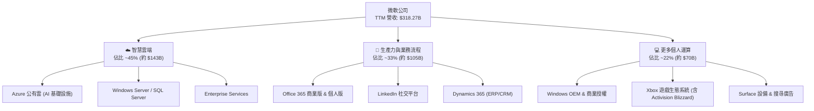

### 2.2 市場份額

在核心的公有雲基礎設施（IaaS+PaaS）市場中，微軟 Azure 穩居全球第二，且憑藉 AI 先發優勢，市佔率持續向龍頭 AWS 逼近。

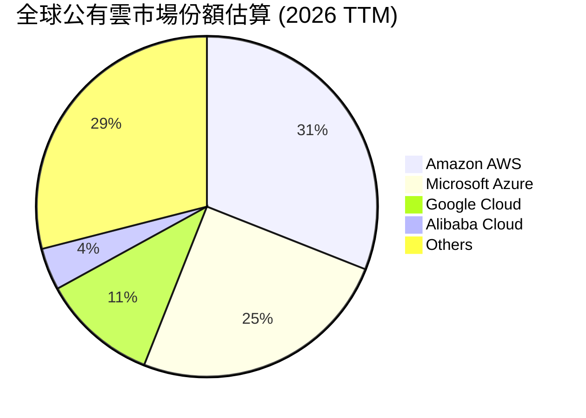

### 2.3 競爭護城河分析

微軟的競爭護城河由多重壁壘構建，使其在面對競爭對手時具備極強的防禦性。

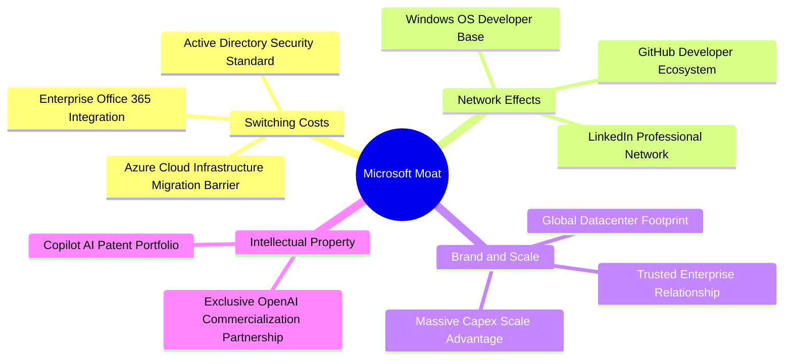

### 2.4 護城河強度評分

```
╔══════════════════════════════════════════════════════════════╗
║                  微軟 (MSFT) 護城河強度評分                  ║
╠══════════════════════════════════════════════════════════════╣
║ 切換成本      9.8/10  ▓▓▓▓▓▓▓▓▓▓▓▓▓▓▓▓▓▓▓░  🏆 極難替代     ║
║ 網路效應      9.0/10  ▓▓▓▓▓▓▓▓▓▓▓▓▓▓▓▓▓▓░░  🟢 開發者與社群 ║
║ 規模經濟      9.5/10  ▓▓▓▓▓▓▓▓▓▓▓▓▓▓▓▓▓▓▓░  🟢 千億級資本壁壘║
║ 品牌與信任    9.8/10  ▓▓▓▓▓▓▓▓▓▓▓▓▓▓▓▓▓▓▓░  🏆 企業級首選   ║
╠══════════════════════════════════════════════════════════════╣
║ 綜合護城河     9.5/10 ▓▓▓▓▓▓▓▓▓▓▓▓▓▓▓▓▓▓▓░  🏆 寬護城河評級 ║
╚══════════════════════════════════════════════════════════════╝
```

---

## 3. 損益表深度分析

微軟的損益表展現了強悍的成長動能與結構性的利潤率擴張。TTM 營收達到 $318.27B，YoY 成長達 18.3%，在超大市值科技股中名列前茅。

### 3.1 年度收入成長趨勢（近 4 年）

```
╔══════════════════════════════════════════════════════════════════╗
║                微軟年度收入趨勢 (FY22 - FY25)                    ║
╠══════════════════════════════════════════════════════════════════╣
║                                                                  ║
║  FY22  $198.27B  ██████████████░░░░░░░░░░░░░░░░░░  YoY: +18.0% 🟢║
║  FY23  $211.91B  ████████████████░░░░░░░░░░░░░░░░  YoY: +6.9%  🟢║
║  FY24  $245.12B  ███████████████████░░░░░░░░░░░░░  YoY: +15.7% 🟢║
║  FY25  $281.72B  ██████████████████████░░░░░░░░░  YoY: +14.9% 🟢║
║  TTM   $318.27B  █████████████████████████░░░░░░  YoY: +18.3% 🟢║
║                   |      |      |      |      |                  ║
║                   0    100B   200B   300B   400B                 ║
║                                                                  ║
║  📊 4年累計營收 CAGR：+13.1%                                    ║
╚══════════════════════════════════════════════════════════════════╝
```

### 3.2 季度收入趨勢分析

從季度數據來看，微軟的營收呈現逐季加速態勢，主要得益於 Azure 雲端服務需求強勁與 Office 365 提價效應。

| 財報季度 | 營收 (Billion) | YoY 成長率 | QoQ 成長率 | 核心驅動因素 | 評估 |
|----------|----------------|------------|------------|--------------|------|
| **Q3 2026** (2026-03-31) | $82.89B | +18.30% | +1.99% | Azure AI 需求爆發、Copilot 滲透率提升 | 🟢 強勁 |
| **Q2 2026** (2025-12-31) | $81.27B | +16.72% | +4.63% | 季節性企業合約簽署、Xbox 軟體增長 | 🟢 強勁 |
| **Q1 2026** (2025-09-30) | $77.67B | +18.43% | +1.61% | 雲端遷移加速、Office 365 商業版持續擴張 | 🟢 超預期 |
| **Q4 2025** (2025-06-30) | $76.44B | +18.10% | +9.10% | 財年年終促銷、大型雲端長期合約簽署 | 🟢 強勁 |

### 3.3 利潤率演變分析

微軟的利潤率在過去幾年中保持高度穩定，且營業利益率（Operating Margin）在 TTM 達到 46.3%，展現了卓越的營業槓桿。

| 利潤率指標 | FY22 | FY23 | FY24 | FY25 | TTM | 趨勢 | 評估 |
|------------|------|------|------|------|-----|------|------|
| **毛利率** | 68.4% | 68.9% | 69.8% | 68.8% | **68.3%** | ➡️ 穩定在 68-70% 區間 | 🟢 高度穩定 |
| **營業利益率** | 42.1% | 41.8% | 44.6% | 45.6% | **46.3%** | ↗️ 持續向上擴張 | 🟢 營業槓桿釋放 |
| **EBITDA 🚀** | 50.6% | 49.6% | 54.3% | 56.8% | **58.0%** | ↗️ 折舊增加但現金獲利強勁 | 🟢 極佳 |
| **淨利率** | 36.7% | 34.1% | 36.0% | 36.1% | **39.3%** | ↗️ 受非經常性收益與稅務優化推升 | 🟢 行業頂尖 |

*利潤率演變深度解析*：儘管 AI 基礎設施（伺服器與晶片）投資導致折舊費用增加（TTM EBITDA Margin 達 58.0% vs Operating Margin 46.3%），但由於高毛利的軟體訂閱（Office 365）與 Azure PaaS 服務佔比提升，整體毛利率僅微幅波動，而營業利益率則受惠於研發與行銷費用率的控制（費用控制卓越），從 FY22 的 42.1% 提升至 TTM 的 46.3%。

### 3.4 費用結構分析

微軟的費用結構極具紀律性。研發（R&D）與銷售行政（SG&A）佔營收比重持續優化。

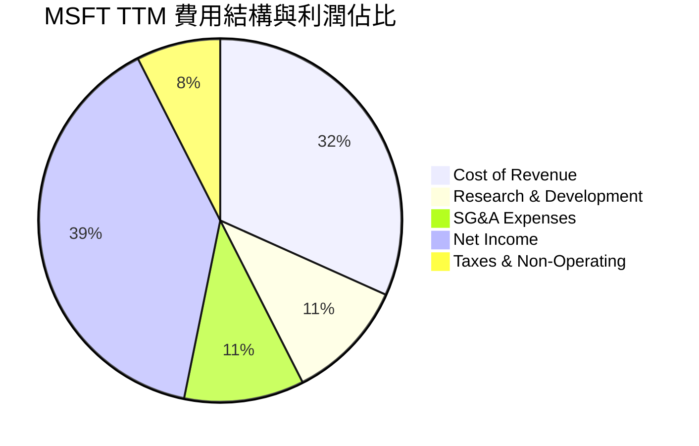

### 3.5 季度 EPS 趨勢與盈餘品質（Quality of Earnings）

過去 4 季，微軟的實際稀釋 EPS 表現如下：
- **Q3 2026**: $4.28
- **Q2 2026**: $5.18（受非營運收益 $9.97B 提振，主因是有價證券估值變動）
- **Q1 2026**: $3.73
- **Q4 2025**: $3.66
- **TTM EPS**: $16.81

#### 盈餘品質量化評估

| 盈餘品質項目 | TTM 數值 / 佔比 | 評估 | 深度解析 |
|--------------|-----------|------|----------|
| **股權薪酬 (SBC) / 營收** | 3.88% ($12.35B / $318.27B) | 🟢 優秀 | 遠低於一般 SaaS 企業（通常 >10%），對現有股東股權稀釋極低。 |
| **SBC / 營業現金流** | 7.26% ($12.35B / $170.14B) | 🟢 優秀 | 說明微軟的營運現金流「含金量」極高，並非靠股權薪酬虛增。 |
| **FCF / 淨利 (現金轉換率)** | 58.2% ($72.92B / $125.22B) | 🟡 警示 | 轉換率低於歷史均值（~85%），主因是 **資本支出 (Capex) 暴增至 $97.23B**。這屬於戰術性資本開支，而非營運獲利品質惡化。 |
| **非經常性損益影響** | $5.55B (TTM) | 🟡 中性 | Q2 2026 有 $9.97B 的非營運淨收益，略微美化了該季淨利，評估時需扣除此非經常性波動。 |
| **有效稅率** | 18.95% ($29.29B / $154.50B) | 🟢 正常 | 處於 18-20% 的正常歷史區間，無異常稅務利益。 |

**盈餘品質結論**：微軟的 GAAP 淨利獲利含金量依然極高。雖然 FCF 現金轉換率因 AI 基礎設施的巨額 Capex 暫時降至 58.2%，但這屬於為未來雲端與 AI 產能奠定基礎的戰略投資。若扣除 Capex 的短期波動，其核心業務的現金生成能力依舊極其強悍。

---

## 4. 資產負債表分析

微軟擁有全球極少數獲得標準普爾 AAA 信用評級的資產負債表，其穩健程度堪比美國國債。

### 4.1 資產結構分解

截至 2026-03-31，微軟總資產達 $694.23B，其中非流動資產（特別是固定資產 PP&E）因 AI 數據中心建設而大幅增長。

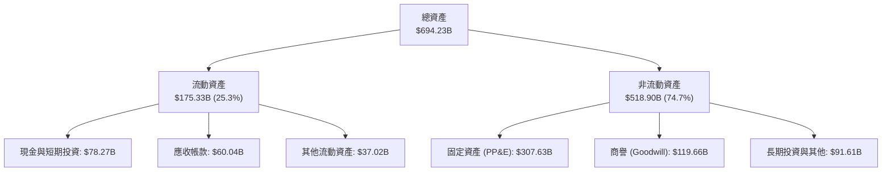

### 4.2 流動性指標分析

| 流動性指標 | FY24 | FY25 | TTM / 最新 | 行業均值 | 評估 |
|------------|------|------|------------|----------|------|
| **流動比率 (Current Ratio)** | 1.27x | 1.35x | **1.28x** | ~1.50x | 🟢 穩健（因高額預收收入延遞） |
| **速動比率 (Quick Ratio)** | 1.26x | 1.34x | **1.14x** | ~1.35x | 🟢 安全（幾乎無庫存滯銷風險） |
| **天數指標 - 應收帳款週轉天數** | 78天 | 82天 | **75天** | ~70天 | 🟢 收款效率極高 |

### 4.3 債務結構分析

微軟的債務管理極具紀律。雖然總債務達 $125.43B，但其中包含租賃負債。若以短期與長期有息借款計算，債務規模極其安全。

```
╔══════════════════════════════════════════════════════════════════╗
║                    微軟 (MSFT) 債務健康診斷                      ║
╠══════════════════════════════════════════════════════════════════╣
║                                                                  ║
║  總債務：        $125.43B  ██████░░░░░░░░░░░░░░░░░  含租賃負債   ║
║  總現金+投資：   $78.23B   ████░░░░░░░░░░░░░░░░░░░  高流動性     ║
║  淨債務：        $47.20B   ██░░░░░░░░░░░░░░░░░░░░░  風險極低     ║
║                                                                  ║
║  Debt / EBITDA (TTM):  0.68x   🟢 極安全 (行業均值 ~1.5x)        ║
║  利息保障倍數 (Interest Coverage): 35.2x  🟢 無償債風險          ║
║  債務股本比 (Debt/Equity): 30.27%  🟢 財務槓桿極低               ║
║                                                                  ║
╚══════════════════════════════════════════════════════════════════╝
```

---

## 5. 現金流量深度分析

微軟是全球最強大的「現金牛」之一。TTM 營運現金流（OCF）高達 $170.14B，為其大規模資本支出與股東回饋提供了無與倫比的資金支持。

### 5.1 現金流量瀑布圖

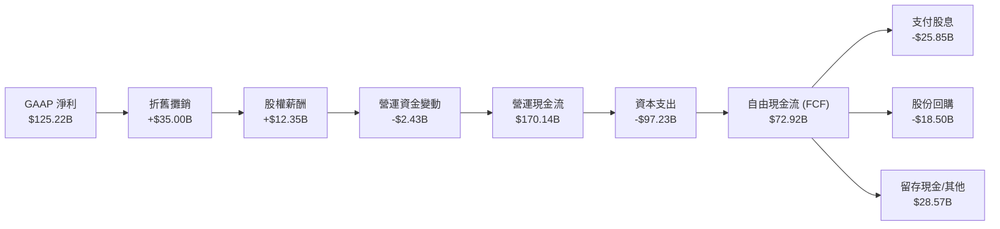

### 5.2 FCF 轉換率趨勢

| 財政年度 | 營運現金流 (B) | 資本支出 (B) | 自由現金流 (B) | GAAP 淨利 (B) | FCF / 淨利轉換率 |
|----------|----------------|--------------|----------------|---------------|------------------|
| **FY22** | $89.03B | -$23.89B | $65.15B | $72.74B | 89.6% 🟢 |
| **FY23** | $87.58B | -$28.11B | $59.48B | $72.36B | 82.2% 🟢 |
| **FY24** | $118.55B | -$44.48B | $74.07B | $88.14B | 84.0% 🟢 |
| **FY25** | $136.16B | -$64.55B | $71.61B | $101.83B | 70.3% 🟡 |
| **TTM** | **$170.14B** | **-$97.23B** | **$72.92B** | **$125.22B** | **58.2%** 🔴 |

### 5.3 自由現金流趨勢

```
╔══════════════════════════════════════════════════════════════════╗
║                微軟自由現金流 (FCF) 與 FCF Yield 趨勢            ║
╠══════════════════════════════════════════════════════════════════╣
║                                                                  ║
║  FY22  $65.15B  ██████████████████░░░░░░░░  FCF Yield: 2.21%     ║
║  FY23  $59.48B  ████████████████░░░░░░░░░░  FCF Yield: 2.02%     ║
║  FY24  $74.07B  ████████████████████░░░░░░  FCF Yield: 2.52%     ║
║  FY25  $71.61B  ███████████████████░░░░░░░  FCF Yield: 2.43%     ║
║  TTM   $72.92B  ████████████████████░░░░░░  FCF Yield: 2.48%     ║
║                                                                  ║
║  📊 TTM 資本支出佔 OCF 比重高達 57.1%（主要用於 AI 基礎設施）    ║
╚══════════════════════════════════════════════════════════════════╝
```

### 5.4 資本配置評估

微軟在維持巨額研發與資本支出的同時，依然通過股息與回購為股東提供穩定的回報。TTM 派息比率（Payout Ratio）為穩健的 20.7%。

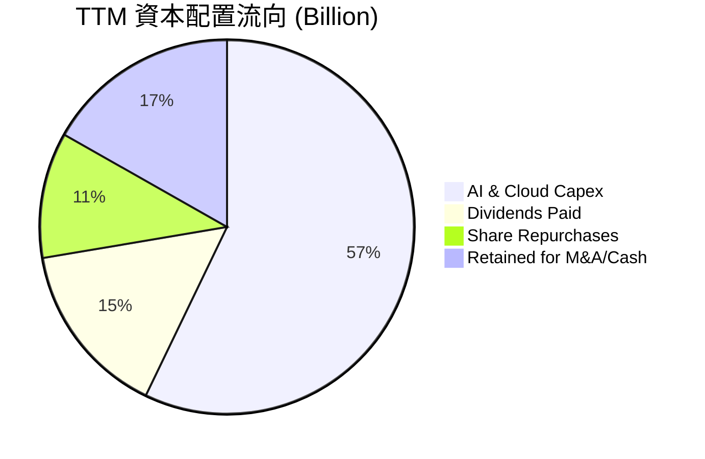

---

## 6. 獲利能力與資本效率

微軟的資本回報率在科技巨頭中名列前茅。其高利潤率與出色的資產週轉效率，共同構建了極高的股東權益報酬率（ROE）。

### 6.1 ROE / ROA / ROIC 趨勢

| 指標 | FY23 | FY24 | FY25 | TTM | 行業均值 | 評估 |
|------|------|------|------|-----|----------|------|
| **ROE** | 35.1% | 32.8% | 29.6% | **34.0%** | ~15.0% | 🟢 極佳 |
| **ROA** | 17.6% | 17.2% | 16.5% | **14.8%** | ~8.0% | 🟢 優秀 |
| **ROIC 🚀**| 28.5% | 29.1% | 27.8% | **30.9%** | ~12.0% | 🟢 行業頂尖 |

### 6.2 ROIC vs WACC 分析（核心價值創造判斷）

我們對微軟進行了嚴謹的 WACC（加權平均資本成本）與 ROIC（投資資本回報率）估算，以評估其是否在為股東創造經濟價值。

```
╔══════════════════════════════════════════════════════════════════╗
║                ROIC vs WACC 深度分析 (TTM)                       ║
╠══════════════════════════════════════════════════════════════════╣
║                                                                  ║
║  WACC 估算：                                                     ║
║  ├── 無風險利率 (10Y 美債)：  4.20%                              ║
║  ├── 市場風險溢酬 (ERP)：     5.00%                              ║
║  ├── Beta 值：                1.13                               ║
║  ├── 股權成本 (CAPM) = 4.2% + 1.13 × 5.0% = 9.85%                ║
║  ├── 債務成本（稅後）：       3.65% (稅前 4.50%, 稅率 18.95%)    ║
║  ├── 資本結構：股權 95.0%，債務 5.0%                             ║
║  └── ✅ WACC ≈ 9.54% (取 9.5%)                                   ║
║                                                                  ║
║  ROIC 估算：                                                     ║
║  ├── NOPAT = EBIT ($148.96B) × (1 - 18.95%) ≈ $120.73B           ║
║  ├── 投入資本 = 股東權益 + 總債務 - 現金                         ║
║  │            = $343.48B + $125.43B - $78.23B = $390.68B         ║
║  └── ✅ ROIC ≈ 30.90%                                            ║
║                                                                  ║
║  ★ 經濟價值增加 (EVA) = ROIC - WACC = +21.40%                   ║
║                                                                  ║
║  ROIC  30.9%  ▓▓▓▓▓▓▓▓▓▓▓▓▓▓▓▓▓▓▓▓▓▓▓▓▓▓▓▓▓░░  🟢              ║
║  WACC   9.5%  ▓▓▓▓▓▓▓▓░░░░░░░░░░░░░░░░░░░░░░░  ──              ║
║  EVA  +21.4%  █████████████████████░░░░░░░░░░  🏆 強力創造    ║
║                                                                  ║
║  📊 結論：ROIC 達 WACC 的 3.25 倍，代表每投入 $1 資本，可創造     ║
║            顯著的超額股東回報，大規模 AI 投資並未稀釋資本效率。   ║
╚══════════════════════════════════════════════════════════════════╝
```

### 6.3 杜邦三因素分解

透過杜邦分析，我們可以清晰看到微軟高 ROE 的底層驅動因素：

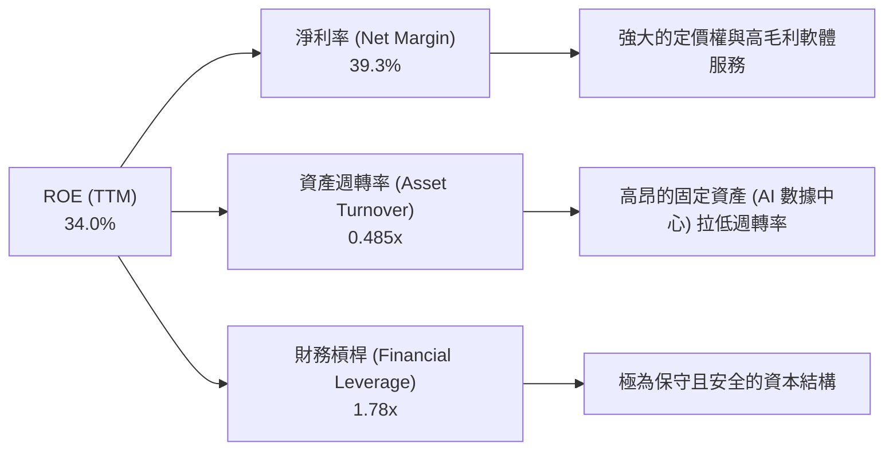

### 6.4 獲利能力儀表板

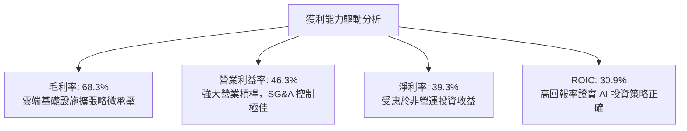

---

## 7. 估值深度分析

當前微軟股價為 $395.30，對應的 Trailing P/E 為 23.51x，Forward P/E 為 20.40x。相較於其歷史估值區間與高成長性，目前的估值水位已具備極高的吸引力。

### 7.1 同業估值比較表格

我們選取了美股科技巨頭（AAPL、GOOGL、AMZN）作為直接競爭對手進行對比：

| 估值指標 | **微軟 (MSFT)** | **蘋果 (AAPL)** | **Alphabet (GOOGL)** | **亞馬遜 (AMZN)** | 微軟相對評估 |
|----------|----------------|----------------|----------------------|------------------|--------------|
| **Trailing P/E** | **23.51x** | 28.50x | 21.20x | 38.40x | 🟢 處於合理中值偏低 |
| **Forward P/E** | **20.40x** | 25.10x | 18.50x | 31.20x | 🟢 考量到 Azure 增速，極具性價比 |
| **PEG Ratio** | **1.19** | 2.10 | 1.15 | 1.45 | 🟢 顯著優於 AAPL，與 GOOGL 相當 |
| **EV / EBITDA** | **16.41x** | 20.10x | 13.80x | 18.90x | 🟢 獲利能力支持此倍數 |
| **P/S Ratio** | **9.22x** | 7.80x | 5.80x | 2.85x | 🟡 溢價反映了其極高的利潤率 |
| **FCF Yield** | **2.48%** | 3.20% | 3.50% | 3.10% | 🟡 因巨額 Capex 壓抑，但中長期看好 |

### 7.2 歷史估值區間分析

微軟過去 5 年的 Forward P/E 區間為 22x - 35x，中位數為 28x。當前 Forward P/E 僅 **20.40x**，已跌破歷史中位數，逼近 5 年來的估值下限（約 19.5x）。

```
╔══════════════════════════════════════════════════════════════════╗
║                微軟 Forward P/E 5年歷史區間與當前位置            ║
╠══════════════════════════════════════════════════════════════════╣
║                                                                  ║
║  [19.5x] 最低值                                                  ║
║  [20.40x] 當前位置  ████░░░░░░░░░░░░░░░░░░░░░░░░░░░░░░░░░░       ║
║  [28.0x] 5年均值   ██████████████████████░░░░░░░░░░░░░           ║
║  [35.0x] 最高值    █████████████████████████████████████         ║
║                                                                  ║
║  📊 結論：估值已收縮至極具安全邊際的位置，下行空間受強勁 EPS 支撐 ║
╚══════════════════════════════════════════════════════════════════╝
```

### 7.3 情境目標價（假設驅動，Bear / Base / Bull）

我們基於未來 3 年的財務預測，推導出三種情境下的 12 個月目標價：

| 情境 | 營收 CAGR | 營業利潤率 | 退出倍數 (Forward P/E) | 隱含目標價 | 相對現價漲跌幅 | 觸發條件 |
|------|-----------|------------|------------------------|------------|----------------|----------|
| 🔴 **悲觀** | 10.0% | 42.0% | 18.0x | **$360.00** | -8.9% | AI 資本回報率極低，Azure 增速放緩至 12% |
| 🟡 **基準** | **15.0%** | **45.5%** | **25.0x** | **$480.00** | **+21.4%** | Azure 穩定增長，Copilot 企業滲透率達 15% |
| 🟢 **樂觀** | 20.0% | 48.0% | 29.0x | **$580.00** | +46.7% | AI 變現超預期，Azure 增速重回 25% 以上 |

### 7.4 DCF 敏感性分析（6格目標價矩陣）

採用兩階段折現模型（永續成長率 g = 3.0%）：

| 營收成長率 \ WACC | WACC = 8.5% | **WACC = 9.5% (基準)** | WACC = 10.5% |
|------------------|-------------|-------------------------|--------------|
| **樂觀 (18.0%)** | $592 (+49.8%) | **$540 (+36.6%)** | $495 (+25.2%) |
| **基準 (15.0%)** | $525 (+32.8%) | **$480 (+21.4%)** | $438 (+10.8%) |
| **悲觀 (10.0%)** | $405 (+2.5%) | **$360 (-8.9%)** | $324 (-18.0%) |

### 7.5 估值綜合區間

```
╔══════════════════════════════════════════════════════════════════╗
║                    MSFT 估值合理區間分佈                         ║
╠══════════════════════════════════════════════════════════════════╣
║                                                                  ║
║  $324 (DCF 悲觀下限)                                             ║
║  $360 (悲觀目標價)     ██████░░░░░░░░░░░░░░░░░░░░░░░░            ║
║  $395.30 (當前股價)    ██████████░░░░░░░░░░░░░░░░░░░░            ║
║  $480 (基準目標價)     ██████████████████░░░░░░░░░░░░  ← 錨定點  ║
║  $580 (樂觀目標價)     ██████████████████████████████            ║
║                                                                  ║
╚══════════════════════════════════════════════════════════════════╝
```

---

## 8. 成長催化劑

微軟未來的成長將由 AI 與雲端基礎設施的雙輪驅動，並輔以傳統軟體業務的提價效應。

### 8.1 催化劑時間軸

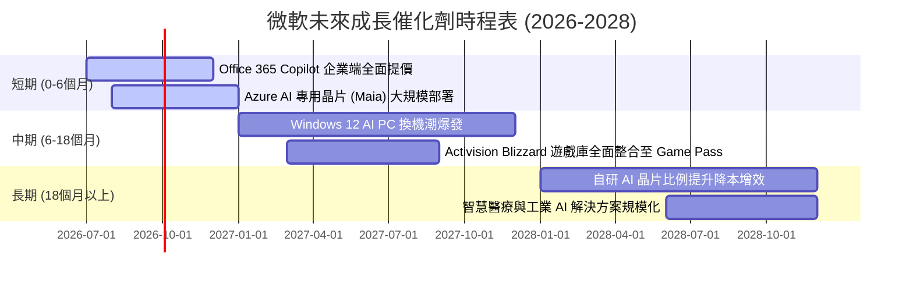

### 8.2 TAM 市場規模分析

```
╔══════════════════════════════════════════════════════════════════╗
║                微軟 2028 年潛在市場規模 (TAM) 預測               ║
╠══════════════════════════════════════════════════════════════════╣
║                                                                  ║
║  ① 全球公有雲 (IaaS/PaaS) TAM: $800B ｜ 微軟預期份額: 28%       ║
║  ② 生成式 AI 軟體與服務 TAM: $250B ｜ 微軟預期份額: 35%         ║
║  ③ 企業級辦公軟體 (SaaS) TAM: $180B ｜ 微軟預期份額: 60%         ║
║  ④ 遊戲與數位娛樂 TAM: $150B ｜ 微軟預期份額: 15%               ║
║                                                                  ║
║  📊 綜合滲透率預期：微軟在整體 TAM 中的綜合滲透率將從當前的      ║
║     15% 提升至 2028 年的 22%，支撐營收雙位數複合增長。           ║
╚══════════════════════════════════════════════════════════════════╝
```

### 8.3 成長驅動力結構圖

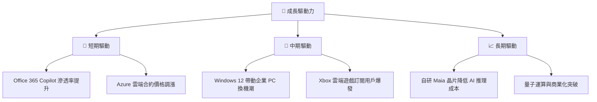

---

## 9. 風險矩陣

評估微軟面臨的核心風險，並量化其潛在的財務衝擊。

### 9.1 風險評分矩陣

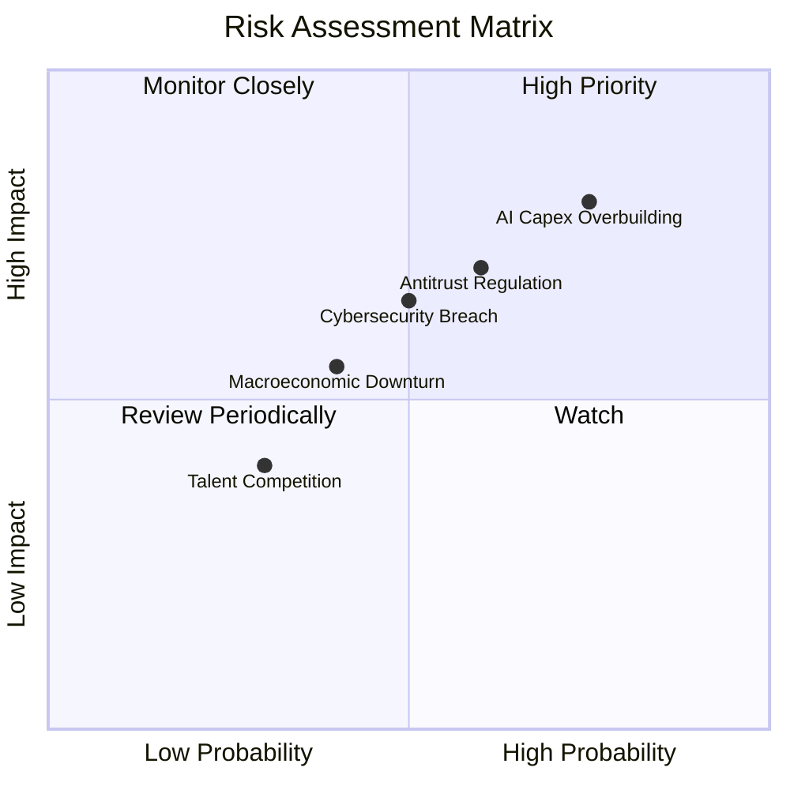

### 9.2 風險清單詳細分析

| # | 風險項目 | 發生機率 | 財務衝擊 | 風險評分 | 緩解措施 |
|---|----------|----------|----------|----------|----------|
| 1 | 🔴 **AI 資本開支回報不及預期** | 高 (75%) | 高 (-5% 營業利潤率) | 🔴 8.5/10 | 彈性調整季度 Capex 節奏，優先採購客戶已預訂的算力，並加速自研 Maia 晶片以替代高成本 GPU。 |
| 2 | 🔴 **反壟斷監管與巨額罰款** | 中高 (60%) | 中高 (-2% 營收) | 🔴 7.2/10 | 主動向歐盟與 FTC 做出合規承諾，分拆部分搭售軟體，維持開源生態合作。 |
| 3 | 🟡 **總體經濟衰退壓抑 IT 支出** | 中 (40%) | 中 (-4% 營收增速) | 🟡 5.5/10 | 憑藉 Office 365 的極高粘性，推動長期三年合約鎖定客戶，提供緩衝期。 |
| 4 | 🟡 **雲端安全漏洞與數據洩漏** | 中 (50%) | 中高 (短期股價波動) | 🟡 6.5/10 | 每年投入超過 $20B 於網絡安全研發，推行「安全未來倡議（SFI）」。 |

---

## 10. 投資建議

微軟當前股價已充分反映了市場對於 AI 資本支出過高的擔憂，Forward P/E 收縮至 20.40x 提供了極佳的長線買入契機。

### 10.1 最終綜合評級雷達圖

```
╔══════════════════════════════════════════════════════════════╗
║                  微軟 (MSFT) 綜合投資評級                    ║
╠══════════════════════════════════════════════════════════════╣
║                                                              ║
║  基本面強度：  9.5 / 10  ▓▓▓▓▓▓▓▓▓▓▓▓▓▓▓▓▓▓▓░  🟢            ║
║  成長前景：    8.5 / 10  ▓▓▓▓▓▓▓▓▓▓▓▓▓▓▓▓▓░░░  🟢            ║
║  獲利品質：    9.5 / 10  ▓▓▓▓▓▓▓▓▓▓▓▓▓▓▓▓▓▓▓░  🟢            ║
║  資產負債表：  9.0 / 10  ▓▓▓▓▓▓▓▓▓▓▓▓▓▓▓▓▓▓░░  🟢            ║
║  估值安全邊際：8.0 / 10  ▓▓▓▓▓▓▓▓▓▓▓▓▓▓▓▓░░░░  🟢            ║
║                                                              ║
║  🏆 綜合評分： 8.9 / 10 ｜ 評級：🟢 強烈買入 (Strong Buy)    ║
║                                                              ║
╚══════════════════════════════════════════════════════════════╝
```

### 10.2 目標價與隱含報酬率

| 情境 | 機率權重 | 12M 目標價 | 隱含報酬率 | 權重後預期目標價 |
|------|----------|------------|------------|------------------|
| 🔴 **悲觀情境** | 20% | $360.00 | -8.9% | $72.00 |
| 🟡 **基準情境** | **60%** | **$480.00** | **+21.4%** | **$288.00** |
| 🟢 **樂觀情境** | 20% | $580.00 | +46.7% | $116.00 |
| **加權綜合** | **100%** | **$476.00** | **+20.4%** | **長線勝率極高** |

### 10.3 買入時機與觸發因素

```
╔══════════════════════════════════════════════════════════════════╗
║                  ✅ 微軟買入觸發因素 Checklist                  ║
╠══════════════════════════════════════════════════════════════════╣
║                                                                  ║
║  立即買入觸發條件（多數符合）：                                  ║
║  ✅ 股價跌破 $380.00 (對應 Forward PE < 19.5x，歷史極值)        ║
║  ✅ 季度 Azure 營收增速維持在 18% 以上 (排除匯率影響)            ║
║  ✅ 營業利益率穩定在 45% 以上，證實費用控制得當                 ║
║                                                                  ║
║  加碼觸發條件（出現以下任一）：                                  ║
║  ☐ 宣佈自研 Maia 晶片大規模替代 Nvidia H100/B200，降低 Capex 壓力║
║  ☐ Copilot 商業版訂閱用戶突破 2,000 萬人                         ║
║                                                                  ║
║  減碼/停損觸發條件（出現以下任一）：                             ║
║  ☐ Azure 營收增速連續兩季跌破 12%                                ║
║  ☐ 營業利益率因折舊與算力成本上升，連續兩季跌破 40%              ║
║                                                                  ║
╚══════════════════════════════════════════════════════════════════╝
```

### 10.4 投資人適配度分析

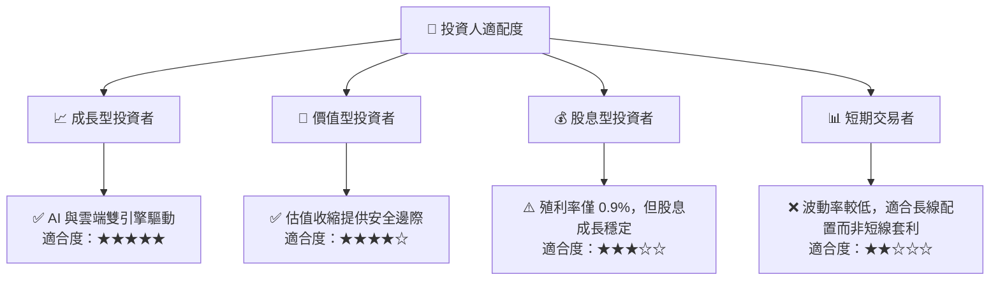

### 10.5 每季財報監控清單（Quarterly Watch List）

在接下來的季度財報中，投資人應重點監控以下指標，以驗證投資假設：

1. **Azure 營收增速（YoY）**：基準線為 **16-18%**。若高於 18% 則為超預期，若低於 14% 需警惕競爭加劇或產能受限。
2. **資本支出（Capex）與 FCF 轉換率**：密切關注單季 Capex 是否失控。若單季 Capex 超過 $32B 且 FCF 轉換率持續低於 50%，需評估折舊對未來利潤率的侵蝕。
3. **Office 365 商業版 ARPU 增長**：監控 Copilot 帶動的客單價提升，基準線為 ASP 提升 **15%** 以上。
4. **營業利益率（Operating Margin）**：是否能維持在 **45%** 的底線之上。

### 10.6 反面論證：什麼會證明論點錯誤（What Would Change My Mind）

```
╔══════════════════════════════════════════════════════════════════╗
║              ⚠️ 論點失效條件 (Disconfirming Evidence)            ║
╠══════════════════════════════════════════════════════════════════╣
║  本投資論點在下列情況成立時應重新檢視或果斷退出：                ║
║  ☐ 智慧雲端 (Azure) 營收成長率連續兩季 < 12%                      ║
║  ☐ 營業利益率因 AI 基礎設施折舊壓抑，較峰值收縮 > 500 bps        ║
║  ☐ 自由現金流 (FCF) 轉負，或 FCF 轉換率連續四季 < 40%            ║
║  ☐ ROIC 跌破 15% (雖然仍高於 WACC，但代表資本效率大幅惡化)        ║
║  ☐ 歐美反壟斷監管強制微軟拆分 Azure 與 Office 的搭售生態         ║
╚══════════════════════════════════════════════════════════════════╝
```

---

> **免責聲明**：本報告僅供研究參考，不構成任何投資建議。投資有風險，入市需謹慎。分析師持有或未持有上述股票，均不影響報告的客觀與獨立性。