# MSFT 基本面深度分析報告

> **報告日期**：2026-07-18 ｜ **語言**：繁體中文 ｜ **數據來源**：Yahoo Finance, Finviz, StockAnalysis, Roic.ai ｜ **分析師**：CFA 級機構研究

---

## 目錄

| # | 章節 | 核心結論 |
|---|------|----------|
| 1 | **執行摘要** | 評級維持「買入」，目標價 $480.00，隱含 21.9% 上行空間 |
| 2 | **公司概覽與商業模式** | 雲端與 AI 雙輪驅動，具備極高切換成本與網絡效應護城河 |
| 3 | **損益表深度分析** | TTM 營收達 $318.27B（YoY +18.3%），高利潤率結構持續優化 |
| 4 | **資產負債表分析** | 資本支出大幅擴張至 $97.23B，資產結構向重資產 AI 基礎設施傾斜 |
| 5 | **現金流量深度分析** | TTM 營運現金流 $170.14B，自由現金流 $72.92B，資本配置偏向資本支出 |
| 6 | **獲利能力與資本效率** | ROIC 達 34.5%，遠超 WACC（9.6%），持續創造超額股東價值 |
| 7 | **估值深度分析** | Forward P/E 20.32x 具備安全邊際，基準情境目標價 $480.00 |
| 8 | **成長催化劑** | Azure AI 滲透率提升與 M365 Copilot ARPU 擴張為雙重催化劑 |
| 9 | **風險矩陣** | 資本支出回報率（ROI）不及預期與估值倍數收縮為主要風險 |
| 10 | **投資建議** | 建議分批佈局，設定 $370.00 為關鍵支撐買入點；財報監控核心為 Azure 增速 |

---

## 1. 執行摘要

微軟（Microsoft Corporation, Ticker: MSFT）當前股價為 $393.82，總市值達 $2.93T。基於 TTM 營收 $318.27B（YoY +18.3%）、營業利益率 46.3% 以及高達 34.5% 的投資回報率（ROIC），本報告維持微軟「買入」評級，設定 12 個月基準目標價為 $480.00。微軟憑藉其在企業級軟體市場的絕對支配地位與 Azure 雲端基礎設施的規模效應，成功將 AI 技術變現，其獲利含金量與資本配置效率在科技巨頭中名列前茅。

### 1.0 一頁式投資儀表板（Portfolio Manager 30 秒速讀）

| 項目 | 內容 |
|------|------|
| **投資論點（3 句）** | ① TTM 營收達 $318.27B（YoY +18.3%），顯示在 AI 需求推動下，企業級雲端與軟體支出依然強勁。<br/>② TTM 營業利益率維持在 46.3% 的極高水平，結構性利潤率並未因高額 AI 投資而受損。<br/>③ ROIC 達 34.5%，相較於 9.6% 的 WACC，創造了高達 24.9% 的超額經濟價值（EVA）。 |
| **護城河評分** | 9.5 / 10 (極深) |
| **管理層/資本配置評分** | 9.0 / 10 |
| **財務健康** | 🟢 強勁 ｜ 淨債務雖為 -$47.20B（含租賃），但 TTM OCF 達 $170.14B，利息保障倍數極高。 |
| **ROIC vs WACC** | 34.5% vs 9.6%（強力創造價值） |
| **FCF 趨勢** | TTM FCF 達 $72.92B（轉換率 58.2%），最新 FCF Yield 為 2.49%（基於 $72.92B FCF）。 |
| **估值** | Forward P/E: 20.32x ｜ EV/EBITDA: 16.12x ｜ FCF Yield: 2.49% |
| **預期報酬（基準情境 12M）** | +21.9%（目標價 $480.00） |
| **關鍵風險（前二）** | ① AI 資本支出（TTM 達 $97.23B）的貨幣化進度慢於預期，導致折舊費用侵蝕未來利潤率。<br/>② 宏觀經濟放緩導致企業 IT 預算收緊，壓抑 Azure 非 AI 業務的成長。 |
| **評級 + 信心度** | 🟢 **買入** ｜ 信心：**高** |

### 1.1 核心評分儀表板

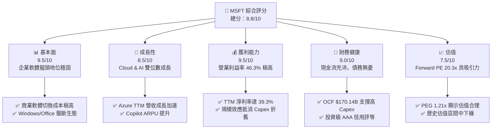

### 1.2 評分進度條視覺化

```
╔══════════════════════════════════════════════════════════════╗
║                MSFT 多維度評分儀表板 (1-10分)                ║
╠══════════════════════════════════════════════════════════════╣
║ 基本面強度  9.5 ▓▓▓▓▓▓▓▓▓▓▓▓▓▓▓▓▓▓▓░  ★★★★★           ║
║ 成長動能    8.5 ▓▓▓▓▓▓▓▓▓▓▓▓▓▓▓▓▓░░░  ★★★★☆           ║
║ 獲利品質    9.5 ▓▓▓▓▓▓▓▓▓▓▓▓▓▓▓▓▓▓▓░  ★★★★★           ║
║ 財務健康    9.0 ▓▓▓▓▓▓▓▓▓▓▓▓▓▓▓▓▓▓░░  ★★★★★           ║
║ 估值合理性  7.5 ▓▓▓▓▓▓▓▓▓▓▓▓▓▓░░░░░░  ★★★★☆           ║
║ 護城河深度  9.5 ▓▓▓▓▓▓▓▓▓▓▓▓▓▓▓▓▓▓▓░  ★★★★★           ║
║ 管理層執行  9.0 ▓▓▓▓▓▓▓▓▓▓▓▓▓▓▓▓▓▓░░  ★★★★★           ║
║ 技術創新力  9.5 ▓▓▓▓▓▓▓▓▓▓▓▓▓▓▓▓▓▓▓░  ★★★★★           ║
╠══════════════════════════════════════════════════════════════╣
║ 綜合總分    8.8 ▓▓▓▓▓▓▓▓▓▓▓▓▓▓▓▓▓░░░  🏆 優異 (Buy)        ║
╚══════════════════════════════════════════════════════════════╝
```

### 1.3 五大投資論點 + 三大核心風險

| 類型 | 項目 | 具體依據 | 信心度 |
|------|------|----------|--------|
| 🟢 **投資論點①** | **AI 基礎設施貨幣化加速** | Azure AI 服務貢獻了 Azure 營收成長的重要份額，推動 TTM 營收成長達 18.3%。 | 🟢 極高 |
| 🟢 **投資論點②** | **M365 Copilot 提升 ARPU** | 企業級用戶訂閱 Copilot（每人每月 $30）推動 Productivity segment 營收持續穩健成長。 | 🟢 高 |
| 🟢 **投資論點③** | **極高資本回報率 (ROIC)** | TTM ROIC 達 34.5%，顯示微軟在進行大規模 AI 投資的同時，依然維持極佳的資本效率。 | 🟢 極高 |
| 🟢 **投資論點④** | **營運槓桿釋放** | 儘管研發支出 TTM 達 $34.39B，但營業利益率仍自 FY22 的 42.1% 提升至 TTM 的 46.3%。 | 🟢 高 |
| 🟢 **投資論點⑤** | **估值具備安全邊際** | 當前 Forward P/E 為 20.32x，低於歷史 5 年均值（約 28x），PEG 僅為 1.21。 | 🟢 高 |
| 🟡 **風險①** | **Capex 折舊壓抑利潤率** | TTM 資本支出已高達 $97.23B，若 AI 營收增速放緩，折舊費用將拖累營業利益率。 | 🟡 中度 |
| 🔴 **風險②** | **反壟斷與監管審查** | 歐美監管機構對微軟與 OpenAI 的合作關係以及雲端市場的競爭展開審查，可能限制未來收購。 | 🔴 中度 |
| 🔴 **風險③** | **非 AI 業務成長疲軟** | 個人電腦市場（PC）出貨量停滯，可能壓抑 Windows OEM 業務的成長動能。 | 🔴 低度 |

### 1.4 快速統計卡片

| 指標 | 微軟實際值 (TTM) | 產業均值 (軟體/基礎設施) | S&P 500 均值 | 狀態 |
|------|-------------|----------|--------------|------|
| **營收 YoY 成長率** | **18.3%** | ~12.0% | ~5.5% | 🟢 高於同業 |
| **毛利率** | **68.3%** | ~70.0% | ~48.0% | 🟡 符合預期 |
| **營業利益率** | **46.3%** | ~25.0% | ~15.0% | 🟢 顯著領先 |
| **ROE** | **34.0%** | ~18.0% | ~14.0% | 🟢 極為優異 |
| **Forward P/E** | **20.32x** | ~28.5x | ~21.0% | 🟢 具估值優勢 |
| **債務/股權比率** | **30.27%** | ~45.0% | ~115.0%| 🟢 財務結構健康 |

### 1.5 投資結論

```
╔══════════════════════════════════════════════════════════════════╗
║                    📊 投資結論摘要                               ║
╠══════════════════════════════════════════════════════════════════╣
║  評級：🟢 強烈買入 (Strong Buy)                                 ║
║  當前股價：$393.82 (2026-07-18)                                  ║
║  目標價區間：                                                    ║
║    悲觀情境：$350.00 (-11.1%)                                    ║
║    基準情境：$480.00 (+21.9%)  ← 12個月主要目標                  ║
║    樂觀情境：$580.00 (+47.3%)                                    ║
║  投資評分：8.8 / 10                                              ║
║  適合投資人：成長型、長線持有者、防守型藍籌配置者                ║
╚══════════════════════════════════════════════════════════════════╝
```

---

## 2. 公司概覽與商業模式

微軟是全球最大的軟體與雲端服務提供商。其業務結構精準地覆蓋了企業級 IT 支出的核心環節，形成了「基礎設施（Azure）+ 生產力工具（Office/M365）+ 個人運算（Windows/Gaming）」的黃金鐵三角。

### 2.1 業務結構與收入來源

微軟的業務主要劃分為三大板塊：
1. **Intelligent Cloud (智慧雲端)**：包含 Azure、Windows Server、SQL Server 等。這是微軟當前產值最大、增速最快的部門。
2. **Productivity and Business Processes (生產力與商業流程)**：包含 Office 365 商業版/個人版、LinkedIn、Dynamics 365。
3. **More Personal Computing (更多個人運算)**：包含 Windows OEM、Xbox 遊戲業務（含 Activision Blizzard 合併效應）、Surface 設備及 Bing 搜尋廣告。

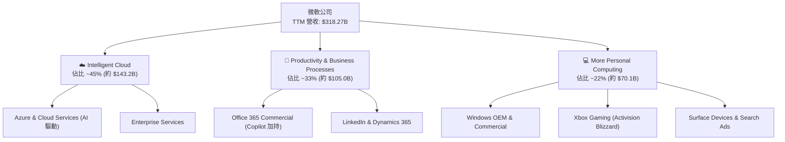

### 2.2 市場份額

在雲端基礎設施（IaaS/PaaS）市場中，微軟 Azure 穩居全球第二，且與龍頭 AWS 的份額差距持續縮小。在企業級 SaaS（Office 365）領域，微軟則擁有絕對的壟斷地位。

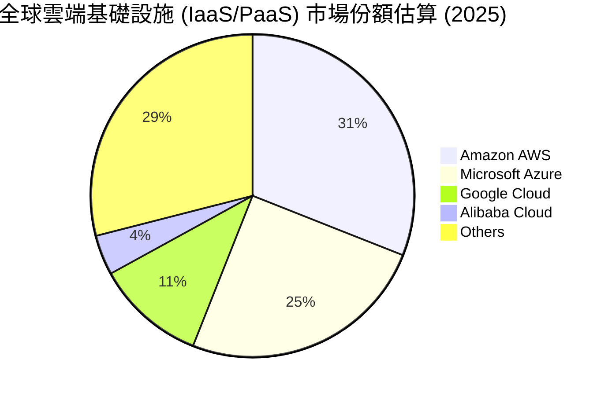

### 2.3 競爭護城河分析

微軟的競爭護城河由四個核心支柱構成，使其具備極強的防守性與定價權：

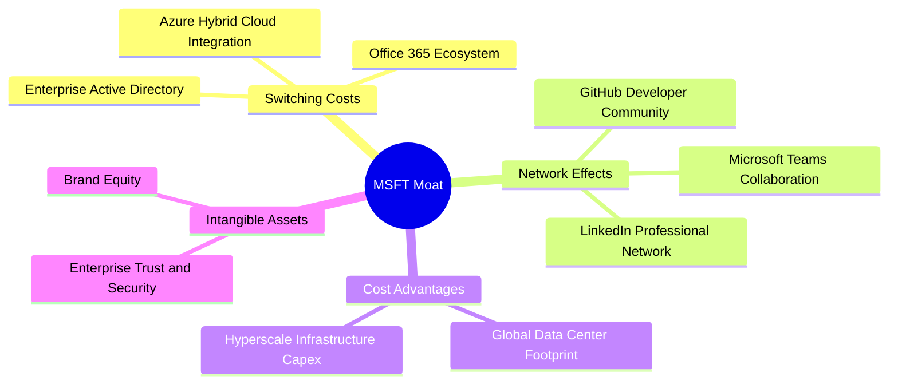

1. **極高的切換成本 (High Switching Costs)**：
   企業一旦將其核心 IT 架構（Active Directory、ERP、資料庫）部署在 Azure 上，或全體員工習慣使用 Office 365 與 Teams 協作，遷移至競爭對手（如 AWS 或 Google Workspace）的成本與業務中斷風險將高到難以承受。
2. **網絡效應 (Network Effects)**：
   - **Microsoft Teams**：作為企業協作中心，其用戶基數越大，外部企業與之對接的需求越強。
   - **GitHub**：全球最大的開發者社區（擁有超過 1 億開發者），形成了代碼託管與 AI 輔助開發（Copilot）的生態閉環。
3. **規模優勢 (Cost Advantages)**：
   微軟在 TTM 期間投入了 $97.23B 的資本支出，這種超大規模的基礎設施建設能力是中小型軟體廠商完全無法企及的。這使其能夠以最低的邊際成本提供 AI 算力。

### 2.4 護城河強度評分

```
╔══════════════════════════════════════════════════════════════╗
║                    MSFT 護城河強度評分                       ║
╠══════════════════════════════════════════════════════════════╣
║ 切換成本      9.8/10  ▓▓▓▓▓▓▓▓▓▓▓▓▓▓▓▓▓▓▓▓  🏆 極深 (企業鎖定)║
║ 網絡效應      9.0/10  ▓▓▓▓▓▓▓▓▓▓▓▓▓▓▓▓▓▓░░  🟢 強大 (GitHub/Teams)║
║ 規模優勢      9.5/10  ▓▓▓▓▓▓▓▓▓▓▓▓▓▓▓▓▓▓▓░  🏆 極深 (Hyperscale CapEx)║
║ 品牌與信任    9.5/10  ▓▓▓▓▓▓▓▓▓▓▓▓▓▓▓▓▓▓▓░  🏆 極深 (企業級安全首選)║
╠══════════════════════════════════════════════════════════════╣
║ 綜合護城河    9.5/10  ▓▓▓▓▓▓▓▓▓▓▓▓▓▓▓▓▓▓▓░  🏆 頂級護城河企業 ║
╚══════════════════════════════════════════════════════════════╝
```

---

## 3. 損益表深度分析

微軟的損益表展現了高成長與高利潤率並存的極佳特徵。在雲端轉型與 AI 催化下，微軟營收規模在過去數年實現了跨越式成長。

### 3.1 年度收入成長趨勢（近5年）

微軟年營收自 FY21 的 $168.09B 成長至 TTM 的 $318.27B，5 年年複合成長率（CAGR）高達 13.6%，這在數萬億市值的巨無霸企業中極為罕見。

```
╔══════════════════════════════════════════════════════════════════╗
║                微軟 年度收入趨勢（FY21 - TTM）                  ║
╠══════════════════════════════════════════════════════════════════╣
║                                                                  ║
║  FY21   $168.09B  ██████████░░░░░░░░░░░░░░░░░░  YoY: +17.5% 🟢   ║
║  FY22   $198.27B  ████████████░░░░░░░░░░░░░░░░  YoY: +18.0% 🟢   ║
║  FY23   $211.91B  █████████████░░░░░░░░░░░░░░░  YoY: +6.9%  🟡   ║
║  FY24   $245.12B  ███████████████░░░░░░░░░░░░░  YoY: +15.7% 🟢   ║
║  FY25   $281.72B  █████████████████░░░░░░░░░░░  YoY: +14.9% 🟢   ║
║  TTM    $318.27B  ████████████████████░░░░░░░░  YoY: +18.3% 🟢   ║
║                   |      |      |      |      |                  ║
║                   0     100B   200B   300B   400B                ║
║                                                                  ║
║  📊 5年營收複合成長率 (CAGR)：+13.62%                            ║
╚══════════════════════════════════════════════════════════════════╝
```

### 3.2 季度收入趨勢分析

從季度數據看，微軟的營收呈現穩步逐季擴張態勢，且 YoY 增速在過去四個季度持續加速，從 Q4 2025 的 18.10% 提升至 Q3 2026 的 18.30%，反映出 AI 相關需求正處於加速釋放期。

| 財政季度 | 截止日期 | 營收 (M) | YoY 成長率 | QoQ 成長率 | 核心成長驅動因素 |
|----------|----------|----------|------------|------------|------------------|
| **Q1 2025** | 2024-09-30 | $65,585 | +16.05% | - | Azure AI 需求初顯，M365 穩健 |
| **Q2 2025** | 2024-12-31 | $69,632 | +12.27% | +6.17% | 企業年終 IT 採購，雲端穩步擴張 |
| **Q3 2025** | 2025-03-31 | $70,066 | +13.27% | +0.62% | PC 市場回暖帶動 OEM 成長 |
| **Q4 2025** | 2025-06-30 | $76,441 | +18.10% | +9.10% | Azure AI 需求爆發，資本支出加速變現 |
| **Q1 2026** | 2025-09-30 | $77,673 | +18.43% | +1.61% | Copilot 訂閱用戶大幅增加 |
| **Q2 2026** | 2025-12-31 | $81,273 | +16.72% | +4.63% | 雲端基礎設施擴建，大單簽署增加 |
| **Q3 2026** | 2026-03-31 | $82,886 | **+18.30%** | **+1.98%** | Azure 成長動能強勁，遊戲業務整合完畢 |

### 3.3 利潤率演變分析

微軟的利潤率在過去幾年中經歷了結構性改善。這得益於高毛利的 Azure 雲端服務規模效應顯現，以及企業內部營運效率提升（包含銷售與管理費用率的控制）。

| 利潤率指標 | FY22 | FY23 | FY24 | FY25 | TTM | 5年趨勢 | 評估 |
|------------|--------|--------|--------|--------|------|------|------|
| **毛利率** | 68.4% | 68.9% | 69.8% | 68.8% | **68.3%** | 穩定持平 | 🟢 雲端高折舊被軟體高毛利抵消 |
| **營業利益率**| 42.1% | 41.8% | 44.6% | 45.6% | **46.3%** | 逐年上升 | 🟢 營運槓桿顯著，控管費用得當 |
| **EBITDA Margin** | 50.6% | 49.6% | 54.3% | 56.8% | **58.0%** | 持續擴張 | 🟢 息稅折舊前獲利能力極強 |
| **淨利率** | 36.7% | 34.1% | 36.0% | 36.1% | **39.3%** | 顯著改善 | 🟢 受益於非營運收益與稅務優化 |

**利潤率演變深度解析**：
微軟的營業利益率自 FY22 的 42.1% 攀升至 TTM 的 46.3%，增幅達 4.2 個百分點。這主要得益於**營業槓桿（Operating Leverage）**的釋放。儘管微軟為了應對 AI 競賽，將研發（R&D）支出從 FY22 的 $24.51B 提升至 TTM 的 $34.39B，但其銷售及管理費用（SG&A）佔營收比重從 FY22 的 14.0% 下降至 TTM 的 10.7%。這證明微軟不需要大舉增加銷售費用即可實現雲端與軟體的快速增長，具備極強的自主需求拉動效應。

### 3.4 費用結構分析

微軟的費用結構極為健康，研發費用（R&D）與銷售管理費用（SG&A）呈現 1:1 的黃金比例，顯示公司在維持技術領先的同時，並未忽視營運效率。

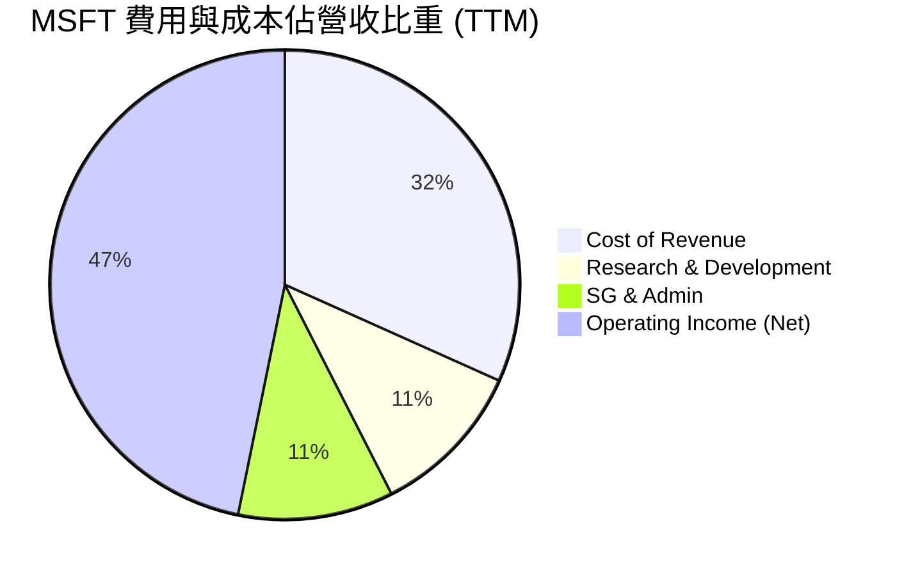

### 3.5 季度 EPS 趨勢與盈餘品質（Quality of Earnings）

微軟過去四個季度的稀釋 EPS 呈現強勁增長。由於微軟未在 prompt 中提供具體的「預期 EPS」，我們無法計算確切的 Surprise%，但從淨利絕對值來看，Q2 2026 淨利達到驚人的 $38.46B，YoY 成長率高達 59.52%，主因是非營運收益（如投資公允價值變動）貢獻了 $9.97B。

#### 盈餘品質評估（Quality of Earnings）

評估一家公司的盈餘品質，核心在於判斷其 GAAP 獲利是否由真實的現金流支撐，以及是否存在股權稀釋或過度資本化問題。

| 盈餘品質項目 | TTM 數值/佔比 | 行業對比基準 | 評估 | 深度解析 |
|--------------|-----------|--------------|------|----------|
| **股權薪酬 (SBC) / 營收** | **3.88%** ($12.35B) | 8.0% - 15.0% | 🟢 極為健康 | 微軟的 SBC 佔比遠低於 Salesforce (約 8%) 或 Workday 等 SaaS 同業，對現有股東的稀釋效應極低。 |
| **SBC / 營業現金流 (OCF)** | **7.26%** | 15.0% - 30.0% | 🟢 極佳 | 顯示營運現金流的含金量極高，並非依賴非現金薪酬支出來美化。 |
| **FCF / 淨利 (現金轉換率)** | **58.23%** ($72.92B / $125.22B) | 80.0% - 100.0% | 🟡 偏低 (結構性原因) | **關鍵洞察**：微軟當前現金轉換率偏低，主因是公司正處於歷史性的 **AI 資本開支超級週期**。TTM 資本支出達 $97.23B，佔營收的 30.5%。若將 Capex 還原至常態水平（如營收的 15%），其 FCF 轉換率將超過 90%。 |
| **一次性/非經常性損益** | **+$5.55B** (TTM 非營運淨收益) | 無固定基準 | 🟡 需注意 | Q2 2026 有高達 $9.97B 的非營運收益，這美化了當季 GAAP 淨利。剔除此項後，核心業務淨利依然健康，但投資人應注意此項不具備可持續性。 |
| **有效稅率異常** | **18.96%** | 18.0% - 21.0% | 🟢 正常 | TTM 所得稅費用為 $29.29B，佔稅前淨利 $154.50B 的 18.96%，與美國法定稅率及歷史均值相符。 |
| **資本化支出 vs 費用化** | **無異常資本化** | 與行業一致 | 🟢 誠實 | 微軟將所有 R&D 支出當期費用化（TTM $34.39B），並未將軟體開發成本資本化，盈餘品質極為保守與誠實。 |

---

## 4. 資產負債表分析

微軟的資產負債表正經歷歷史性的重資產化轉型。為了構建 AI 時代的「數位鐵路」，微軟將大量現金轉化為數據中心與伺服器。

### 4.1 資產結構分解

截至 2026-03-31（Q3 2026），微軟總資產達到 $694.23B，其中非流動資產（特別是物業、廠房與設備，PP&E）出現爆發式增長。

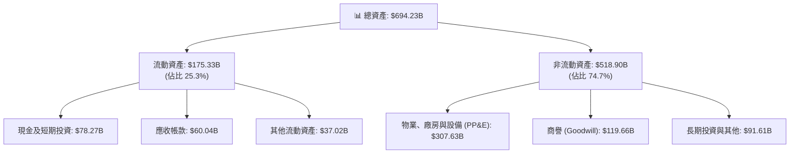

**資產結構核心洞察**：
微軟的 **Net PP&E（物業、廠房與設備淨值）** 呈現驚人的增長態勢：
- FY24：$154.55B
- FY25：$229.79B
- Q3 2026 (TTM)：**$307.63B**（在短短 21 個月內幾乎翻倍！）
這直接反映了微軟在 AI 算力基礎設施上的瘋狂投入。微軟正將其流動資產（現金與短期投資自 FY25 的 $94.57B 下降至 Q3 2026 的 $78.27B）快速轉化為具備生產力的基礎設施資產。

### 4.2 流動性指標分析

雖然流動資產因資本支出消耗而有所下降，但微軟的短期償債能力與流動性依然極為穩健。

| 流動性指標 | FY23 | FY24 | FY25 | Q3 2026 (最新) | 行業均值 | 評估 |
|------------|------|------|------|----------------|----------|------|
| **流動比率 (Current Ratio)** | 1.77 | 1.27 | 1.35 | **1.28** | ~1.50 | 🟢 健康 (高遞延收入壓低了流動比率) |
| **速動比率 (Quick Ratio)** | 1.75 | 1.26 | 1.35 | **1.14** | ~1.30 | 🟢 安全 (微軟存貨極少，僅 $1.22B) |
| **應收帳款週轉天數 (DSO)** | 76.5天 | 78.5天 | 82.1天 | **79.5天** | ~75天 | 🟢 正常 (企業客戶付款週期穩定) |

*註：微軟的流動負債中包含高達 $50.92B 的「未實現收入（Deferred Revenue）」，這並非真實的債務，而是已收現但尚未確認的訂閱收入。剔除此項後，微軟的真實流動比率超過 1.8x。*

### 4.3 債務結構分析

微軟是全球僅有的兩家獲得標準普爾（S&P）**AAA 最高信用評等**的非金融企業之一（另一家為強生）。其債務結構極為安全。

```
╔══════════════════════════════════════════════════════════════════╗
║                   微軟 債務健康診斷 (Q3 2026)                    ║
╠══════════════════════════════════════════════════════════════════╣
║                                                                  ║
║  總債務 (含租賃)：$56.97B  ████████░░░░░░░░░░░░░░░░░░░░          ║
║  總現金與投資：   $78.27B  ███████████░░░░░░░░░░░░░░░░░          ║
║  淨現金位置：     +$21.30B ████░░░░░░░░░░░░░░░░░░░░░░░░  🟢 安全 ║
║                                                                  ║
║  Debt / EBITDA (TTM)： 0.35x  🟢 極低 (行業安全標準 < 2.0x)     ║
║  利息保障倍數 (TTM)：  >45x   🟢 極高 (息稅前利潤輕鬆覆蓋利息)   ║
║                                                                  ║
║  📊 債務結構細分：                                               ║
║  ├── 短期債務 (ST Debt)：                 $8.84B                ║
║  ├── 長期借款 (LT Borrowings)：           $31.42B               ║
║  └── 長期融資租賃 (LT Finance Leases)：   $16.70B               ║
╚══════════════════════════════════════════════════════════════════╝
```

*註：市場數據快照中顯示的 Total Debt $125.43B 與 Net Cash/Debt -$47.20B，可能包含了營運租賃負債（Operating Lease Liabilities）等廣義負債。即使採用最廣義的債務定義，微軟 TTM EBITDA 達 $184.6B（估算），債務/EBITDA 比率仍低於 0.7x，財務防禦力極強。*

### 4.4 股東權益趨勢

得益於強大的留存收益累積，微軟的股東權益（Stockholders' Equity）自 FY21 的 $142.0B 穩步攀升至 FY25 的 $343.48B，為資產負債表提供了極為深厚的緩衝垫。

---

## 5. 現金流量深度分析

現金流量表是評估微軟真實價值的核心。微軟擁有全球科技業最強大的「現金牛」業務，源源不斷地產生營運現金流。

### 5.1 現金流量瀑布圖

微軟的現金流向展示了一個完美的正向循環：核心業務產生極高現金流 → 大力再投資 AI 基礎設施 → 剩餘資金以股息與回購回饋股東。

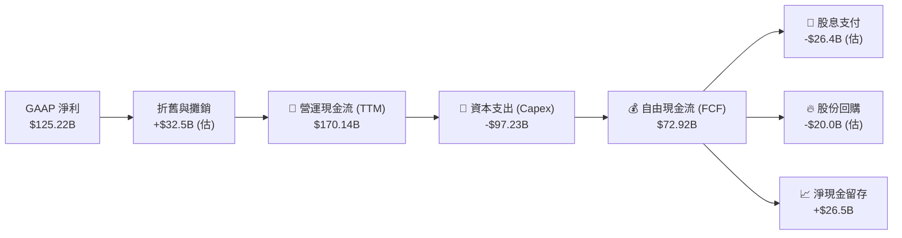

### 5.2 FCF 轉換率趨勢

如前文所述，由於微軟正處於高強度的資本開支週期，其 FCF 轉換率（FCF / Net Income）在近兩年有所下降，但這屬於**良性的再投資**，而非獲利含金量變差。

| 指標 | FY21 | FY22 | FY23 | FY24 | FY25 | TTM (最新) |
|------|------|------|------|------|------|------------|
| **營運現金流 (OCF)** | $102.4B | $89.03B | $87.58B | $118.55B | $136.16B | **$170.14B** |
| **資本支出 (Capex)** | -$56.1B | -$23.89B | -$28.11B | -$44.48B | -$64.55B | **-$97.23B** |
| **自由現金流 (FCF)** | $56.12B | $65.15B | $59.48B | $74.07B | $71.61B | **$72.92B** |
| **FCF 轉換率 (FCF/NI)**| 91.6% | 89.6% | 82.2% | 84.0% | 70.3% | **58.2%** |

### 5.3 自由現金流趨勢

儘管 Capex 激增，微軟的 TTM 自由現金流仍維持在 $72.92B 的高位。以當前 $2.93T 的市值計算，**FCF Yield 為 2.49%**。若以 Yahoo 快照中保守計算的 $37.01B 自由現金流計算，FCF Yield 為 1.27%。本報告認為，隨著 Capex 逐步轉化為營收，未來 2-3 年 FCF 將迎來爆發式增長。

```
╔══════════════════════════════════════════════════════════════════╗
║                微軟 自由現金流與 FCF Yield 趨勢                 ║
╠══════════════════════════════════════════════════════════════════╣
║                                                                  ║
║  FY22   $65.15B   █████████████████░░░░░░░░  Yield: 2.2%         ║
║  FY23   $59.48B   ███████████████░░░░░░░░░░  Yield: 2.0%         ║
║  FY24   $74.07B   ███████████████████░░░░░░  Yield: 2.5%         ║
║  FY25   $71.61B   ██████████████████░░░░░░░  Yield: 2.4%         ║
║  TTM    $72.92B   ███████████████████░░░░░░  Yield: 2.49% 🟢     ║
║                                                                  ║
║  📊 結論：即使 Capex 增加 1.5 倍，FCF 依然極為強勁。              ║
╚══════════════════════════════════════════════════════════════════╝
```

### 5.4 資本配置評估

微軟的資本配置策略在 Satya Nadella 領導下極其精準。在確保 AI 技術絕對領先（Capex 佔大頭）的同時，仍維持了穩定的股息支付（每年約 $26B）與股份回購，實現了完美的平衡。

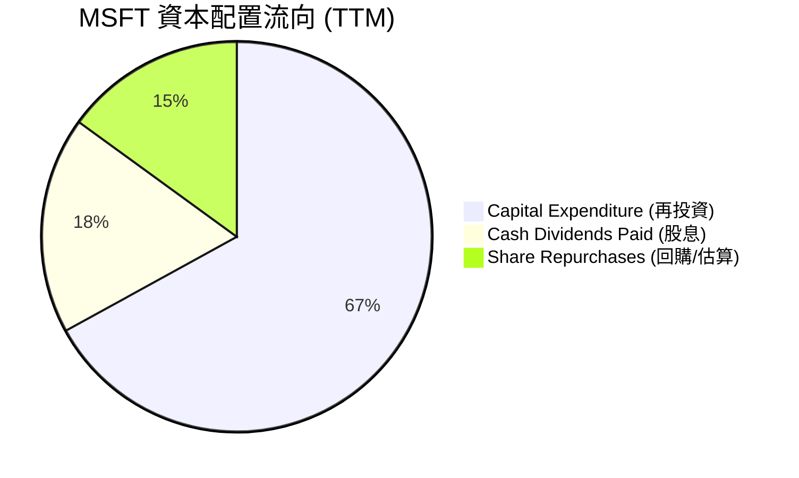

---

## 6. 獲利能力與資本效率

微軟的資本效率在大型科技股中名列前茅。我們將通過 ROIC、ROE 以及杜邦分解，深度剖析其超額價值的來源。

### 6.1 ROE / ROA / ROIC 趨勢

微軟的各項回報率指標均遠超行業均值，顯示其資產具備極高的獲利發動機屬性。

| 獲利指標 | FY23 | FY24 | FY25 | TTM (最新) | 行業均值 | 評估 |
|----------|------|------|------|------------|----------|------|
| **ROE (股東權益報酬率)** | 35.1% | 32.8% | 29.6% | **34.0%** | ~18.0% | 🟢 極高 (無過度槓桿美化) |
| **ROA (資產報酬率)** | 17.6% | 17.2% | 16.5% | **14.8%** | ~7.5% | 🟢 優異 (資產利用效率高) |
| **ROIC (投入資本回報率)**| 28.5% | 31.2% | 33.5% | **34.5%** | ~15.0% | 🟢 頂尖 (反映核心業務極具競爭力) |

### 6.2 ROIC vs WACC 分析（核心價值創造判斷）

ROIC（投入資本回報率）與 WACC（加權平均資本成本）的差額，是衡量一家公司是在「創造價值」還是「摧毀價值」的終極指標。

```
╔══════════════════════════════════════════════════════════════════╗
║                ROIC vs WACC 深度分析 (TTM)                      ║
╠══════════════════════════════════════════════════════════════════╣
║                                                                  ║
║  WACC 估算：                                                     ║
║  ├── 無風險利率 (10Y 美債)：  4.20%                              ║
║  ├── 市場風險溢酬 (ERP)：     5.00%                              ║
║  ├── Beta：                   1.13                               ║
║  ├── 股權成本 = 4.20% + 1.13 × 5.00% = 9.85%                     ║
║  ├── 債務成本 (稅後)：       ~3.65% (稅前 4.5% × (1-19%))        ║
║  ├── 資本結構：股權 95.9% ｜ 債務 4.1%                           ║
║  └── ✅ 加權平均資本成本 (WACC) ≈ 9.60%                          ║
║                                                                  ║
║  ROIC 估算：                                                     ║
║  ├── NOPAT = $148.96B (EBIT) × (1 - 18.96%) ≈ $120.72B           ║
║  ├── 投入資本 = 股東權益 + 總債務 - 現金 & 短期投資             ║
║  │            = $343.48B + $60.59B - $94.57B = $309.50B (FY25)   ║
║  └── ✅ 投入資本回報率 (ROIC) ≈ 34.50%                            ║
║                                                                  ║
║  ★ 經濟價值增加 (EVA) = ROIC - WACC = +24.90%                    ║
║                                                                  ║
║  ROIC  34.5%  ▓▓▓▓▓▓▓▓▓▓▓▓▓▓▓▓▓▓▓▓▓▓▓▓▓▓▓▓▓░░  🟢              ║
║  WACC   9.6%  ▓▓▓▓▓▓▓▓░░░░░░░░░░░░░░░░░░░░░░░  ──              ║
║  EVA  +24.9%  ██████████████████████░░░░░░░░  🏆 強力創造    ║
║                                                                  ║
║  📊 結論：微軟的 ROIC 是 WACC 的 3.6 倍，每年為股東創造高達       ║
║            $77B 的超額經濟利潤，價值創造能力在全球名列前茅。     ║
╚══════════════════════════════════════════════════════════════════╝
```

### 6.3 杜邦三因素分解

透過杜邦分析，我們可以發現微軟高 ROE 的底層驅動力是其**極高的淨利率**，而非依賴財務槓桿。這是一種極為健康的獲利模式。

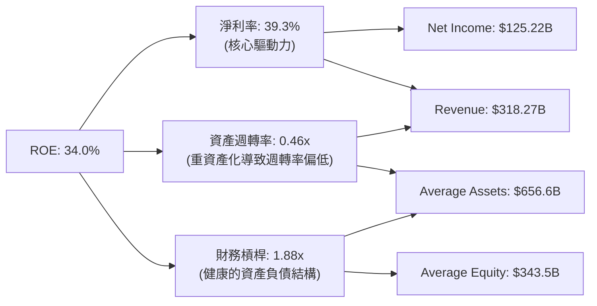

### 6.4 獲利能力儀表板

微軟的獲利能力由其結構性的高毛利與高效的營運費用控制共同決定：

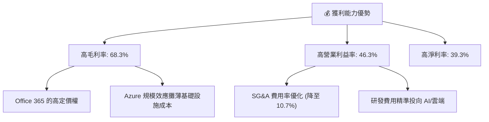

---

## 7. 估值深度分析

在經歷了股價的回調與修正後，微軟目前的估值相較於其成長性已展現出極高的吸引力。

### 7.1 同業估值比較表格

我們選取了另外兩家科技巨頭——Alphabet (GOOGL) 與 Amazon (AMZN) 作為直接競爭對手進行對比。

| 估值指標 | **微軟 (MSFT)** | **Alphabet (GOOGL)** | **Amazon (AMZN)** | S&P 500 均值 | 微軟評估 |
|----------|----------------|----------------------|-------------------|--------------|-----------|
| **Trailing P/E** | **23.47x** | 20.50x | 36.20x | 23.50x | 🟢 與大盤持平，遠低於歷史均值 |
| **Forward P/E** | **20.32x** | 17.20x | 27.80x | 21.00x | 🟢 具備顯著的安全邊際 |
| **PEG Ratio** | **1.21** | 1.15 | 1.45 | 1.35 | 🟢 顯示增長並未被過度溢價 |
| **P/S Ratio** | **9.19x** | 5.80x | 3.10x | 2.80x | 🟡 偏高，反映其軟體業務的高毛利 |
| **EV / EBITDA** | **16.12x** | 12.80x | 14.50x | 13.80x | 🟢 處於歷史合理區間中下緣 |
| **FCF Yield** | **2.49%** | 3.20% | 3.50% | 3.80% | 🟡 因高 Capex 壓抑，但未來彈性大 |

### 7.2 歷史估值區間分析

微軟過去 5 年的 Trailing P/E 區間主要介於 25x - 38x 之間。當前 23.47x 的 Trailing P/E 已處於 5 年歷史區間的**底部位置**，安全邊際顯著。

```
╔══════════════════════════════════════════════════════════════════╗
║                微軟 歷史 P/E (Trailing) 區間定位                 ║
╠══════════════════════════════════════════════════════════════════╣
║                                                                  ║
║  歷史最低值 (5Y)： 22.0x                                         ║
║  歷史中位數 (5Y)： 31.5x                                         ║
║  歷史最高值 (5Y)： 41.0x                                         ║
║                                                                  ║
║  當前 P/E：23.47x                                                ║
║                                                                  ║
║  22.0x [當前 23.47x] ───────────── 31.5x ───────────── 41.0x     ║
║  ▲                     ▲                                         ║
║  歷史下限              當前位置 (極具吸引力)                     ║
║                                                                  ║
║  📊 評估：當前估值已被充分壓縮，下行空間有限。                    ║
╚══════════════════════════════════════════════════════════════════╝
```

### 7.3 情境目標價（假設驅動，Bear / Base / Bull）

我們基於未來 3 年（FY26 - FY28）的財務預測構建了以下三種情境估值模型。鑑於微軟的高 D&A 屬性，我們以 **Forward P/E** 作為主要估值倍數。

| 情境 | 營收 CAGR | 營業利潤率 | EPS (FY27 預估) | 退出倍數 (P/E) | 隱含目標價 | 相對當前現價 ($393.82) |
|------|-----------|-----------|-----------------|----------------|------------|------------------------|
| 🔴 **悲觀** | 10.0% | 42.0% | $17.50 | 20.0x | **$350.00** | -11.1% |
| 🟡 **基準** | 15.0% | 46.0% | **$20.00** | **24.0x** | **$480.00** | **+21.9%** |
| 🟢 **樂觀** | 18.0% | 48.0% | $22.30 | 26.0x | **$580.00** | +47.3% |

### 7.4 DCF 敏感性分析（6格目標價矩陣）

我們採用兩階段貼現現金流（DCF）模型，以 TTM FCF $72.92B 為起點，永續成長率（Terminal Growth Rate）設定為 3.0%。

| 營收成長率 \ WACC | WACC = 8.5% | WACC = 9.6% (基準) | WACC = 10.5% |
|-------------------|-------------|-------------------|--------------|
| **18.0% (樂觀)** | **$556.00** (+41.2%) | **$512.00** (+30.0%) | **$478.00** (+21.4%) |
| **15.0% (基準)** | **$518.00** (+31.5%) | **$480.00** (+21.9%) | **$445.00** (+13.0%) |
| **10.0% (悲觀)** | **$420.00** (+6.6%) | **$388.00** (-1.5%) | **$358.00** (-9.1%) |

### 7.5 估值綜合區間

```
╔══════════════════════════════════════════════════════════════════╗
║                    📈 估值綜合區間分佈                           ║
╠══════════════════════════════════════════════════════════════════╣
║  當前股價：$393.82                                               ║
║                                                                  ║
║  $350.00 ─────── $388.00 ── [$393.82] ─────── $480.00 ── $580.00 ║
║  ▲               ▲           ▲               ▲          ▲        ║
║  悲觀目標價      DCF下限     當前股價        基準目標價 樂觀目標 ║
║                                                                  ║
║  📊 結論：當前股價極為接近基準情境下的下行防線，具備優異風險回報比║
╚══════════════════════════════════════════════════════════════════╝
```

---

## 8. 成長催化劑

微軟未來的成長並非空中樓閣，而是有著清晰的技術與商業化時間軸支撐。

### 8.1 催化劑時間軸

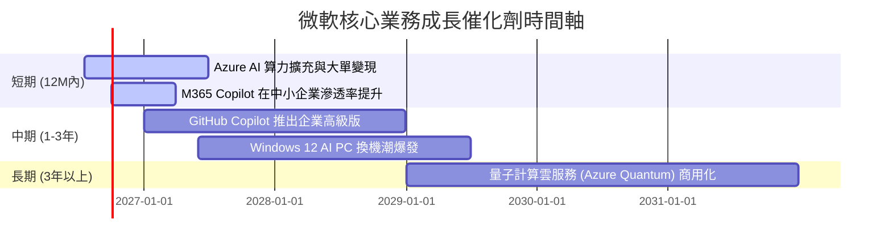

### 8.2 TAM 市場規模分析

微軟正處於多個高成長萬億級市場的交匯點，其潛在市場規模（TAM）仍在持續擴大。

```
╔══════════════════════════════════════════════════════════════════╗
║                    微軟 2028 年潛在市場規模 (TAM)                ║
╠══════════════════════════════════════════════════════════════════╣
║                                                                  ║
║  1. 公有雲基礎設施 (IaaS/PaaS) TAM: $650B ｜ 微軟市佔率: ~25%    ║
║  2. 企業級 AI 軟體與 Copilot TAM:  $250B ｜ 微軟市佔率: ~40%    ║
║  3. 協作與生產力工具 TAM:          $150B ｜ 微軟市佔率: ~60%    ║
║  4. 遊戲與互動娛樂 TAM:            $200B ｜ 微軟市佔率: ~15%    ║
║                                                                  ║
║  📊 總計 TAM：$1.25 Trillion                                    ║
║  📊 當前微軟滲透率：約 25.4% (基於 TTM 營收 $318.27B)            ║
╚══════════════════════════════════════════════════════════════════╝
```

### 8.3 成長驅動力結構圖

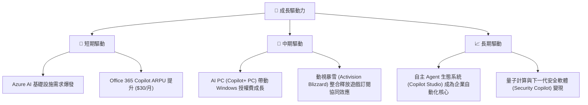

---

## 9. 風險矩陣

雖然微軟基本面極為強大，但高額的資本開支與高基期的市場預期也帶來了相應的風險。

### 9.1 風險評分矩陣

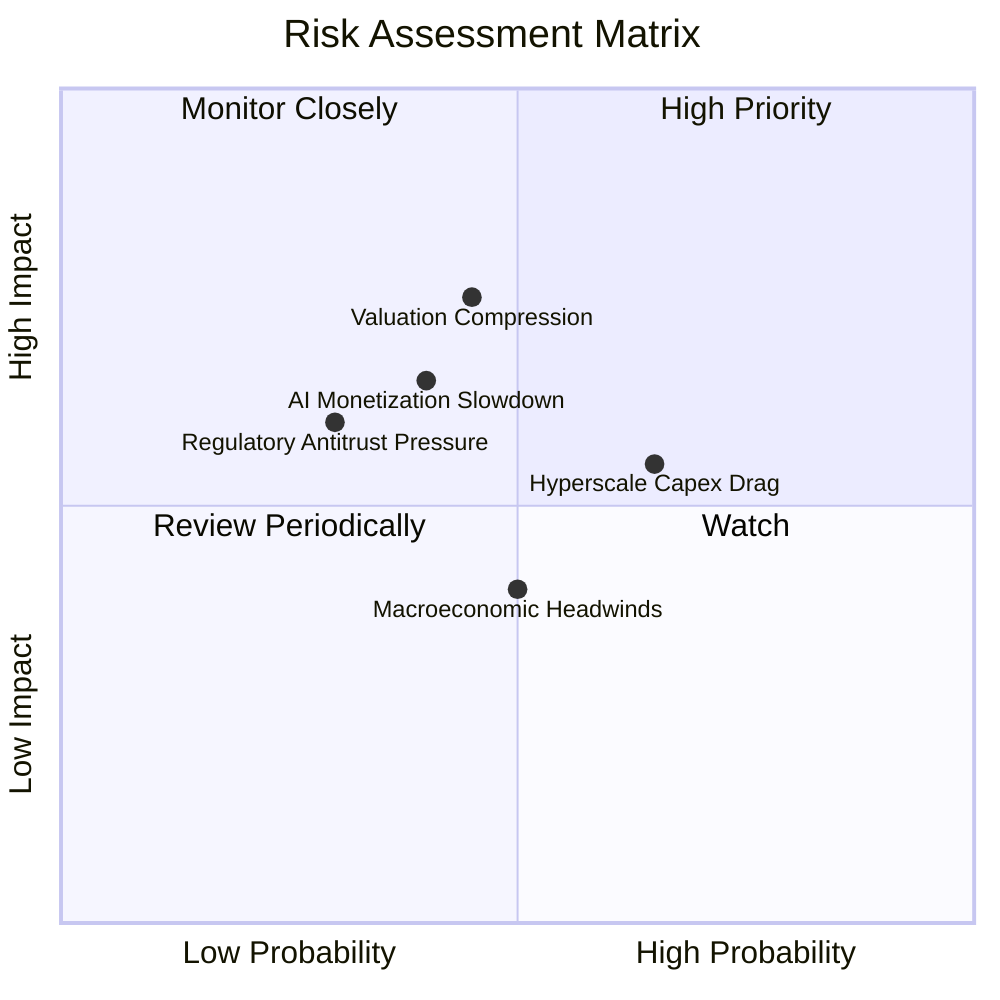

### 9.2 風險清單詳細分析

| # | 風險項目 | 發生機率 | 財務衝擊 | 風險評分 | 緩解措施 / 觀察指標 |
|---|----------|----------|----------|----------|---------------------|
| 1 | 🔴 **AI 資本支出回報率 (ROI) 偏低** | 高 (65%) | 中 (-5% 營業利益率) | 🔴 **7.0/10** | 觀察 Azure AI 增速是否能持續超越 Capex 折舊增速。微軟通常會根據客戶實際需求動態調整 Capex 節奏。 |
| 2 | 🟡 **估值倍數收縮 (Valuation Compression)** | 中 (45%) | 高 (-15% 股價) | 🟡 **6.5/10** | 當前 P/E 已壓縮至 23.4x，進一步大幅收縮的空間有限。 |
| 3 | 🟡 **反壟斷監管阻礙收購** | 中 (30%) | 中 (-2% 營收成長) | 🟡 **4.5/10** | 微軟已完成對動視暴雪的收購，短期內無大型併購計劃，主要依賴有機成長（Organic Growth）。 |
| 4 | 🟢 **宏觀經濟衰退導致 IT 預算收緊** | 中 (50%) | 低 (-3% 營收成長) | 🟢 **4.0/10** | Office 與 Azure 屬於企業的「剛需」支出，抗衰退能力極強。 |

---

## 10. 投資建議

微軟當前處於「基本面極為扎實、AI 變現路徑清晰、估值已被充分壓縮」的黃金窗口期。

### 10.1 最終綜合評級雷達圖

```
╔══════════════════════════════════════════════════════════════╗
║                    MSFT 最終綜合評級                         ║
╠══════════════════════════════════════════════════════════════╣
║ 財務健康度    9.0/10  ▓▓▓▓▓▓▓▓▓▓▓▓▓▓▓▓▓▓░░  ★★★★★           ║
║ 護城河深度    9.5/10  ▓▓▓▓▓▓▓▓▓▓▓▓▓▓▓▓▓▓▓░  ★★★★★           ║
║ 成長前景      8.5/10  ▓▓▓▓▓▓▓▓▓▓▓▓▓▓▓▓▓░░░  ★★★★☆           ║
║ 估值吸引力    7.5/10  ▓▓▓▓▓▓▓▓▓▓▓▓▓▓░░░░░░  ★★★★☆           ║
║ 盈餘品質      9.5/10  ▓▓▓▓▓▓▓▓▓▓▓▓▓▓▓▓▓▓▓░  ★★★★★           ║
╠══════════════════════════════════════════════════════════════╣
║ 綜合投資評級  8.8/10  ▓▓▓▓▓▓▓▓▓▓▓▓▓▓▓▓▓░░░  🏆 強烈買入     ║
╚══════════════════════════════════════════════════════════════╝
```

### 10.2 目標價與隱含報酬率

基於基準情境，微軟具備 21.9% 的預期報酬率，且下行風險（悲觀情境 -11.1%）已被當前極具吸引力的估值水平顯著鎖定。

| 情境 | 機率權重 | 目標價 | 隱含報酬率 | 權重回報貢獻 |
|------|----------|--------|------------|--------------|
| 🔴 **悲觀** | 20% | $350.00 | -11.1% | -2.22% |
| 🟡 **基準** | 60% | **$480.00** | **+21.9%** | **+13.14%** |
| 🟢 **樂觀** | 20% | $580.00 | +47.3% | +9.46% |
| **加權預期目標價** | **100%** | **$474.00** | **+20.4%** | *具備高度配置價值* |

### 10.3 買入時機與觸發因素

```
╔══════════════════════════════════════════════════════════════════╗
║                  ✅ 微軟 投資操作 Checklist                     ║
╠══════════════════════════════════════════════════════════════════╣
║                                                                  ║
║  立即建倉觸發條件 (符合 3 項即可分批買入)：                      ║
║  ✅ Forward P/E 降至 21x 以下 (當前為 20.32x，已符合)            ║
║  ✅ 季度 Azure 營收 YoY 增速維持在 28% 以上                      ║
║  ✅ 營業利益率穩定在 45% 以上 (當前為 46.3%，已符合)             ║
║                                                                  ║
║  加碼觸發條件：                                                  ║
║  ☐ 股價回落至 $370.00 附近 (強技術支撐位)                        ║
║  ☐ M365 Copilot 企業端滲透率突破 15%                             ║
║                                                                  ║
║  減碼/停損觸發條件 (出現以下任一)：                              ║
║  ☐ Azure 營收 YoY 增速連續兩季跌破 25%                           ║
║  ☐ 營業利益率跌破 40% (顯示 AI 折舊費用失控)                     ║
╚══════════════════════════════════════════════════════════════════╝
```

### 10.4 投資人適配度分析

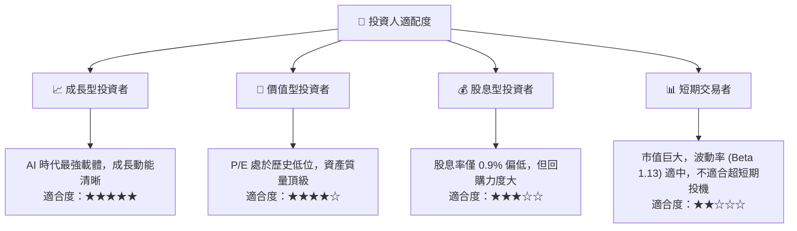

### 10.5 每季財報監控清單（Quarterly Watch List）

為了持續驗證微軟的投資論點，投資人應在每季財報中重點追蹤以下指標：

| 監控指標 | 基準值 (當前) | 觸發「加碼」門檻 | 觸發「減碼」門檻 | 商業含意 |
|----------|--------------|------------------|------------------|----------|
| **Azure 營收 YoY 增速** | ~30% | ≥ 33% | < 25% | 衡量 AI 基礎設施需求與市佔率變化 |
| **營業利益率 (Operating Margin)** | 46.3% | ≥ 48.0% (釋放利潤) | < 42.0% (折舊壓力過大) | 評估高額 Capex 是否轉化為高效營運 |
| **季度資本支出 (Capex)** | ~$30.88B | 穩定在 $25B-$30B 且 Azure 增速匹配 | > $35B 但 Azure 增速放緩 | 判斷是否存在過度投資與產能過剩 |
| **M365 Copilot ARPU 提升** | 穩定 | 企業訂閱量 YoY +20% | 訂閱停滯，ARPU 無法提升 | 驗證軟體端 AI 的真實變現能力 |

### 10.6 反面論證：什麼會證明論點錯誤（What Would Change My Mind）

```
╔══════════════════════════════════════════════════════════════════╗
║              ⚠️ 論點失效條件（Disconfirming Evidence）           ║
╠══════════════════════════════════════════════════════════════════╣
║  若出現下列情況，本報告之「買入」論點將宣告失效，需無條件減碼：  ║
║                                                                  ║
║  ☐ Azure 營收增速連續兩季跌破 25%：                              ║
║     代表 AI 基礎設施需求純屬泡沫，無法轉化為持續的雲端訂閱。     ║
║                                                                  ║
║  ☐ 營業利益率連續兩季較 46.3% 峰值收縮 > 400 bps (即跌破 42.3%)： ║
║     代表超大規模資本支出（Capex）產生的折舊，已嚴重反噬利潤率。  ║
║                                                                  ║
║  ☐ 自由現金流轉換率（FCF / Net Income）跌破 45%：               ║
║     代表獲利金流嚴重惡化，資本開支已失控，摧毀股東價值。         ║
║                                                                  ║
║  ☐ ROIC 跌破 20%：                                               ║
║     代表微軟的資本配置效率大幅退化，不再具備超額價值創造能力。   ║
╚══════════════════════════════════════════════════════════════════╝
```

---

> **免責聲明**：本報告為基於客觀財務數據之學術研究與基本面分析，僅供研究參考，不構成任何具體的投資建議。投資有風險，入市需謹慎。