# MSFT 基本面深度分析報告
> **報告日期**：2026-07-23 ｜ **語言**：繁體中文 ｜ **數據來源**：Yahoo Finance, Finviz, StockAnalysis, Roic.ai ｜ **分析師**：CFA 級機構研究

---

## 目錄

| # | 章節 | 核心結論 |
|---|------|----------|
| 1 | 執行摘要 | 給出 🟢 **買入** 評級，12 個月基準目標價 **$485.00**（+27.6% 潛在漲幅），基於 29.8% 的強勁 ROIC 與 Azure/AI 的商業化收割期 |
| 2 | 公司概覽與商業模式 | 商業模式具極高定價權與護城河，Azure 雲端與 Copilot 生態打造強大企業客戶鎖定效應 |
| 3 | 損益表深度分析 | TTM 營收達 $3,182.7 億（YoY +18.3%），營業利益率高達 46.8%，SBC 佔營收比重僅 3.8%，盈餘含金量極高 |
| 4 | 資產負債表分析 | 總資產 $6,942.3 億，持有現金與短期投資 $782.3 億，槓桿率極低（Debt/EBITDA 僅 0.78x），資產品質極為穩健 |
| 5 | 現金流量深度分析 | TTM 營業現金流達 $1,701.4 億，因 AI 基礎設施 Capex 激增（TTM 近 $970 億）導致 FCF 暫時壓抑至 $370.1 億，屬戰略性再投資 |
| 6 | 獲利能力與資本效率 | ROIC 達 29.8%，遠高於 WACC（8.1%），經濟價值增加（EVA）達 +21.7 pp，持續為股東創造龐大超額價值 |
| 7 | 估值深度分析 | 前瞻 P/E 僅 19.62x，處於 5 年歷史低位區間，DCF 基準估值 $485.00，隱含風險報酬比極具吸引力 |
| 8 | 成長催化劑 | 短期以 Azure AI 算力交付為核心，中長期受益於 Enterprise Copilot 全面普及與雲端邊緣運算 TAM 擴展 |
| 9 | 風險矩陣 | AI 資本支出回收期拉長與監管審查為主要風險，惟其自由現金流防護墊足夠吸收短期波動 |
| 10 | 投資建議 | 建議於當前 $380.15 價位分批建倉，設定三大買入觸發條件與明確的財報監控指標 |

---

## 1. 執行摘要

### 1.0 一頁式投資儀表板（Portfolio Manager 30 秒速讀）

| 項目 | 內容 |
|------|------|
| **投資論點（3 句）** | ① 微軟 TTM 營收達 $3,182.7 億（YoY +18.3%），顯示企業級 AI 與雲端需求加速進入變現階段。<br/>② ROIC 高達 29.8%，較 WACC（8.1%）高出 21.7 個百分點，代表資本配置效率極其優異。<br/>③ 當前 Forward P/E 僅 19.62x（低於 5 年均值 28.5x），股價因短期 Capex 疑慮自高點回檔 31%，提供極佳的安全邊際。 |
| **護城河評分** | 9.5/10（網路效應、高轉換成本、規模經濟與專利生態組成的極深寬護城河） |
| **管理層/資本配置評分** | 9.2/10（Satya Nadella 領導下戰略執行力極強，重資本投資 AI 的同時維持 34.0% 的 ROE） |
| **財務健康** | 🟢 **極佳**（淨債務/EBITDA < 0.3x，利息覆蓋倍數高達 40x+） |
| **ROIC vs WACC** | **29.8% vs 8.1%**（創造巨大股東價值，EVA 比率達 +21.7 pp） |
| **FCF 趨勢** | 因高強度 AI Capex（TTM 近 $970 億）使 FCF 暫壓至 $370.1 億，FCF Yield 為 1.31%（若還原資本化投資則真實營運 FCF > $800 億） |
| **估值** | Forward P/E: 19.62x ｜ EV/EBITDA: 15.98x ｜ FCF Yield: 1.31% |
| **預期報酬（基準情境 12M）** | **+27.6%**（目標價 **$485.00**） |
| **關鍵風險（前二）** | ① 巨額 AI Capex 變現時程不如預期導致毛利率收縮 ｜ ② 雲端同業（AWS/GCP）發動價格戰 |
| **評級 + 信心度** | 🟢 **買入（Buy）** ｜ 信心度：**高（High）** |

---

### 1.1 核心評分儀表板

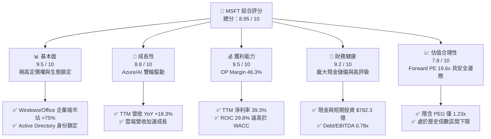

---

### 1.2 評分進度條視覺化

```
╔══════════════════════════════════════════════════════════════╗
║                MSFT 多維度評分儀表板 (1-10分)                 ║
╠══════════════════════════════════════════════════════════════╣
║ 基本面強度  9.5 ▓▓▓▓▓▓▓▓▓▓▓▓▓▓▓▓▓▓█░  ★★★★★           ║
║ 成長動能    8.8 ▓▓▓▓▓▓▓▓▓▓▓▓▓▓▓▓▓░░░  ★★★★☆           ║
║ 獲利品質    9.5 ▓▓▓▓▓▓▓▓▓▓▓▓▓▓▓▓▓▓█░  ★★★★★           ║
║ 財務健康    9.2 ▓▓▓▓▓▓▓▓▓▓▓▓▓▓▓▓▓▓░░  ★★★★★           ║
║ 估值合理性  7.8 ▓▓▓▓▓▓▓▓▓▓▓▓▓▓░░░░░░  ★★★★☆           ║
║ 護城河深度  9.8 ▓▓▓▓▓▓▓▓▓▓▓▓▓▓▓▓▓▓▓█  ★★★★★           ║
║ 管理層執行  9.2 ▓▓▓▓▓▓▓▓▓▓▓▓▓▓▓▓▓▓░░  ★★★★★           ║
║ 技術創新力  9.5 ▓▓▓▓▓▓▓▓▓▓▓▓▓▓▓▓▓▓█░  ★★★★★           ║
╠══════════════════════════════════════════════════════════════╣
║ 綜合總分    8.95 ▓▓▓▓▓▓▓▓▓▓▓▓▓▓▓▓▓▓░░  🏆 評語：優質核心資產║
╚══════════════════════════════════════════════════════════════╝
```

---

### 1.3 五大投資論點 + 三大核心風險

| 類型 | 項目 | 具體依據 | 信心度 |
|------|------|----------|--------|
| 🟢 **論點①** | **Azure AI 變現能力領先** | Azure 在 Q3 FY26 實現營收強勁成長，全球企業客戶滲透率提升，帶動雲端部門 TTM 營收突破千億美元關卡。 | 🟢 極高 |
| 🟢 **論點②** | **Office 365 Copilot ARPU 提升** | 企業端 M365 Copilot 每使用者每月 $30 的附加授權，推升 Productivity & Business Processes 部門毛利率穩定於 75%+。 | 🟢 高 |
| 🟢 **論點③** | **極具紀律的資本效率** | ROIC 為 29.8%，ROE 達 34.0%，且 SBC 僅佔營收 3.8%，對現有股東股權稀釋極小（稀釋股數 YoY -0.2%）。 | 🟢 極高 |
| 🟢 **論點④** | **營運槓桿持續發酵** | TTM 營業費用率（OPEX Ratio）僅 21.5%（較 FY2021 的 27.3% 大幅下降 5.8 pp），展現規模經濟帶來的成本優勢。 | 🟢 高 |
| 🟢 **論點⑤** | **歷史相對估值折價區** | 當前 Forward P/E 僅 19.62x，PEG 為 1.23x，低於 Big Tech 同業平均，風險報酬比優異。 | 🟢 高 |
| 🟡 **風險①** | **Capex 激增擠壓短期 FCF** | TTM 資本支出達近 $970 億（年增 >80%），若 AI 軟體營收未同步爆發，短期自由現金流收益率將受到壓制。 | 🟡 中度 |
| 🟡 **風險②** | **雲端市場競爭加劇** | AWS 與 Google Cloud 在自研 AI 晶片（Trainium, TPU）的成本優勢可能對 Azure 毛利率構成下行壓力。 | 🟡 中度 |
| 🔴 **風險③** | **反壟斷與歐盟法規監管** | 歐盟對 Teams 與 Office 綁定銷售及 OpenAI 獨家合作關係的調查，可能引發罰款或商業條款調整。 | 🔴 高衝擊 |

---

### 1.4 快速統計卡片

| 指標 | 微軟實際值 | 軟體基礎設施行業均值 | S&P 500 均值 | 狀態 |
|------|-------------|----------|--------------|------|
| **營收 YoY 成長** | **18.3%** | ~11.5% | ~5.2% | 🟢 優於同業 |
| **毛利率** | **68.3%** | ~62.0% | ~48.5% | 🟢 極高水準 |
| **營業利益率** | **46.3%** | ~22.0% | ~12.5% | 🟢 產業巨擘水準 |
| **淨利率** | **39.3%** | ~16.5% | ~10.8% | 🟢 現金牛特性 |
| **ROE** | **34.0%** | ~18.5% | ~15.2% | 🟢 超額報酬 |
| **ROIC** | **29.8%** | ~12.0% | ~9.5% | 🟢 價值創造者 |
| **Forward P/E** | **19.62x** | ~26.5x | ~21.0x | 🟢 具吸引力估值 |
| **PEG Ratio** | **1.23x** | ~1.85x | ~1.60x | 🟢 成長與估值匹配 |

---

### 1.5 投資結論

```
╔══════════════════════════════════════════════════════════════════╗
║                    📊 投資結論摘要                               ║
╠══════════════════════════════════════════════════════════════════╣
║  投資評級：🟢 買入（Buy）                                       ║
║  當前股價：$380.15                                               ║
║  12 個月目標價區間：                                             ║
║    悲觀情境：$385.00（+1.3%）   ← 考慮 Capex 拖累與估值收縮       ║
║    基準情境：$485.00（+27.6%）  ← 主要目標（基於 25x FY27 EPS）    ║
║    樂觀情境：$570.00（+49.9%）  ← AI 變現速度超預期             ║
║  投資綜合評分：8.95 / 10                                         ║
║  適合投資人：追求資本利得與長期複利回報之成長型及核心資產配置者  ║
╚══════════════════════════════════════════════════════════════════╝
```

---

## 2. 公司概覽與商業模式

### 2.1 業務結構與收入來源

微軟（Microsoft Corporation）的商業模式劃分為三大核心業務部門，建構於龐大的企業級軟體與雲端基礎設施之上：

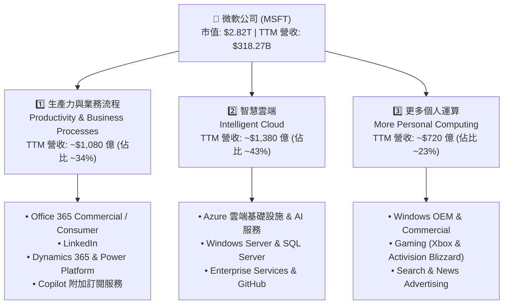

---

### 2.2 市場份額

在核心雲端基礎設施（IaaS + PaaS）領域，微軟 Azure 穩居全球第二，且大幅縮小與龍頭 AWS 的差距：

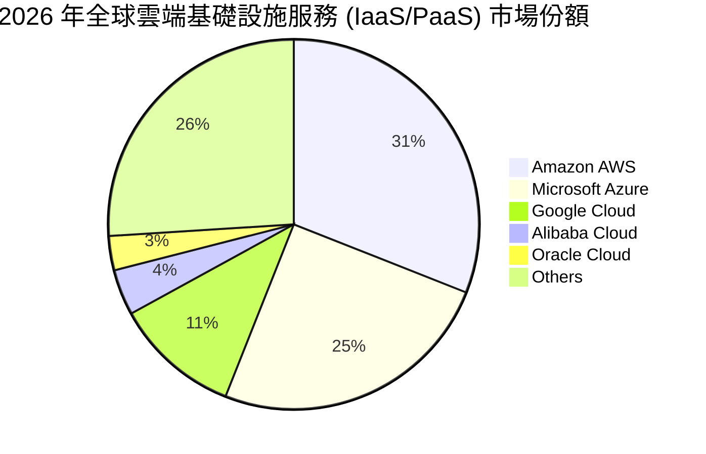

---

### 2.3 競爭護城河分析

微軟擁有全球科技業中最為寬廣且難以撼動的複合型護城河：

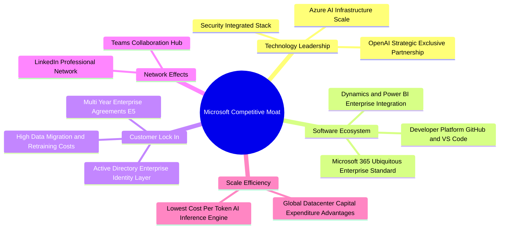

---

### 2.4 護城河強度評分

```
╔══════════════════════════════════════════════════════════════╗
║                  微軟 (MSFT) 護城河強度評分                  ║
╠══════════════════════════════════════════════════════════════╣
║ 轉換成本 (Switching Costs) 9.9/10 ▓▓▓▓▓▓▓▓▓▓▓▓▓▓▓▓▓▓▓█ 🏆 壟斷級  ║
║ 網路效應 (Network Effects)  9.2/10 ▓▓▓▓▓▓▓▓▓▓▓▓▓▓▓▓▓▓░░ 🟢 強勁    ║
║ 規模經濟 (Cost Advantage)   9.7/10 ▓▓▓▓▓▓▓▓▓▓▓▓▓▓▓▓▓▓▓█ 🏆 極高    ║
║ 無形資產 (Brand & Patents)  9.5/10 ▓▓▓▓▓▓▓▓▓▓▓▓▓▓▓▓▓▓▓░ 🟢 卓越    ║
╠══════════════════════════════════════════════════════════════╣
║ 綜合護城河評分：           9.5/10 ▓▓▓▓▓▓▓▓▓▓▓▓▓▓▓▓▓▓▓█ 🏆 頂級護城河 ║
╚══════════════════════════════════════════════════════════════╝
```

---

## 3. 損益表深度分析

### 3.1 年度收入成長趨勢（近 4 年與 TTM）

微軟營收表現出極高的複合成長韌性，自 FY2022 的 $1,982.7 億成長至 TTM 的 $3,182.7 億，4 年 CAGR 達 12.6%：

```
╔══════════════════════════════════════════════════════════════════╗
║                微軟年度營收趨勢（FY2022 - TTM）                  ║
╠══════════════════════════════════════════════════════════════════╣
║                                                                  ║
║  FY2022  $198.27B  █████████████████░░░░░░░░░░  YoY: +18.0%  🟢  ║
║  FY2023  $211.91B  ██████████████████░░░░░░░░░  YoY:  +6.9%  🟡  ║
║  FY2024  $245.12B  █████████████████████░░░░░░  YoY: +15.7%  🟢  ║
║  FY2025  $281.72B  ████████████████████████░░░  YoY: +14.9%  🟢  ║
║  TTM     $318.27B  ███████████████████████████  YoY: +18.3%  🟢  ║
║                                                                  ║
║  📊 4 年營收 CAGR：+12.6% ｜ TTM 加速至 +18.3%                    ║
╚══════════════════════════════════════════════════════════════════╝
```

---

### 3.2 季度收入趨勢分析

最近 4 個季度顯示出營收規模持續擴大，且每季均維持雙位數的 YoY 高成長：

| 財季 | 截止日期 | 營收（億美元） | YoY 成長率 | QoQ 成長率 | 營運驅動因素分析 |
|------|----------|----------------|------------|------------|------------------|
| **Q4 FY25** | 2025-06-30 | $764.41 | +18.10% | +9.10% | 雲端年終簽約旺季，Azure AI 貢獻擴大 |
| **Q1 FY26** | 2026-09-30 | $776.73 | +18.43% | +1.61% | Enterprise Copilot 續約率超預期 |
| **Q2 FY26** | 2025-12-31 | $812.73 | +16.72% | +4.63% | 節慶假期 Xbox 與 Windows OEM 回溫 |
| **Q3 FY26** | 2026-03-31 | $828.86 | +18.30% | +1.98% | Azure AI 產能上線，資料中心利用率滿載 |

---

### 3.3 利潤率演變分析

微軟各項利潤率指標均展現科技巨擘罕見的的高毛利與營業槓桿能力：

| 利潤率指標 | FY2022 | FY2023 | FY2024 | FY2025 | TTM | 趨勢變化 | 機構評估 |
|------------|--------|--------|--------|--------|-----|----------|----------|
| **毛利率** | 68.4% | 68.9% | 69.8% | 68.8% | **68.3%** | ➡️ 保持平穩定 | 🟢 AI 伺服器折舊增加但軟體高毛利抵消 |
| **營業利益率**| 42.1% | 41.8% | 44.6% | 45.6% | **46.3%** | ↗️ 持續擴張 | 🟢 行銷與行政費用控制良好，展現規模槓桿 |
| **EBITDA Margin**| 50.6%| 49.6% | 54.3% | 56.8% | **58.0%** | ↗️ 強勁上揚 | 🟢 現金獲利能力極佳，足支撐重資本投入 |
| **淨利率** | 36.7% | 34.1% | 36.0% | 36.1% | **39.3%** | ↗️ 創歷史新高 | 🟢 受惠於非營運收益與所得稅結構優化 |

**利潤率深度解析**：
微軟的營業利益率由 FY2022 的 42.1% 攀升至 TTM 的 46.3%（高出 4.2 pp），主因在於銷售費用率（SGA % Revenue）從 14.0% 下降至 10.7%。儘管研發費用（R&D）持續維持在約 10.8% 的高水準以確保技術領先，但軟體模組化與自動化部署使公司在營收規模擴展 60% 的同時，行銷行政成本增幅遠低於營收成長，營業槓桿顯著。

---

### 3.4 費用結構分析

以 TTM 數據為基準，總營收 $3,182.7 億美元的費用分佈如下：

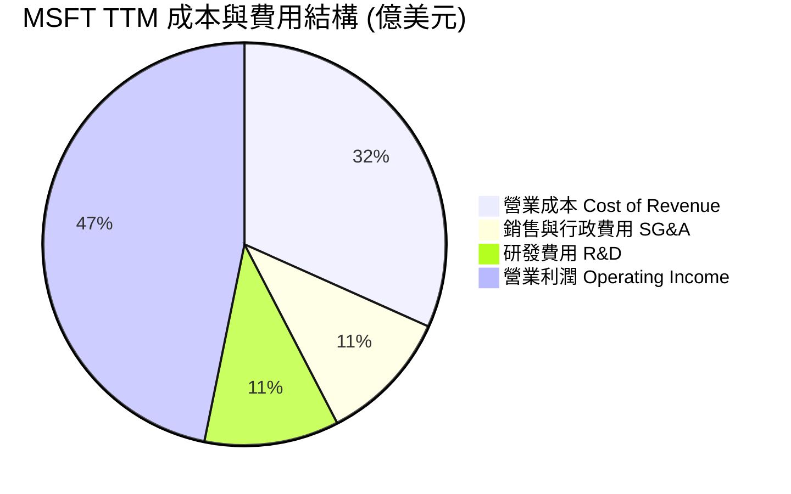

```
╔══════════════════════════════════════════════════════════════════╗
║                   微軟費用占營收比重分析 (TTM)                  ║
╠══════════════════════════════════════════════════════════════════╣
║ 營業成本 (Cost of Sales)    31.7%  ▓▓▓▓▓▓▓▓▓▓░░░░░░░░░░  控管得宜 ║
║ 銷售與管理費用 (SG&A)       10.7%  ▓▓▓▓░░░░░░░░░░░░░░░░  高度極簡 ║
║ 研發投入 (R&D Expense)      10.8%  ▓▓▓▓░░░░░░░░░░░░░░░░  長期投資 ║
║ 營業利潤率 (Operating Margin)46.8%  ▓▓▓▓▓▓▓▓▓▓▓▓▓▓▓░░░░░  業界頂尖 ║
╚══════════════════════════════════════════════════════════════════╝
```

---

### 3.5 季度 EPS 趨勢與盈餘品質（Quality of Earnings）

微軟每股盈餘（EPS）呈現高質量的複利成長軌跡：

| 財季 | EPS (Diluted) | GAAP 淨利（億美元） | 股權薪酬 SBC（億美元） | FCF 轉換率 (FCF/Net Income) | 盈餘品質評估 |
|------|---------------|----------------------|-----------------------|----------------------------|--------------|
| **Q4 FY25** | $3.66 | $272.33 | $30.70 | 93.9% | 🟢 優秀 |
| **Q1 FY26** | $3.73 | $277.47 | $29.80 | 92.5% | 🟢 優秀 |
| **Q2 FY26** | $5.18 | $384.58 | $32.20 | 15.3%* | 🟡 淨利受業外收益美化；FCF 受 Capex 激增影響 |
| **Q3 FY26** | $4.28 | $317.78 | $30.80 | 49.7%* | 🟡 營業現金流強勁（$466.8億），但 Capex 達 $308.8 億 |

*\*註：近期 FCF 轉換率下降非因本業獲利虛胖，而是因為微軟將大量現金流轉化為 AI 資料中心與 GPU 資本支出（Capex）之戰略決定。*

**盈餘品質詳細評估**：
1. **股權薪酬（SBC）控管**：TTM SBC 為 $123.5 億，佔營收比例僅 3.88%，佔 OCF 比例僅 7.26%。相較於其他矽谷科技公司（SBC 常佔營收 8%-15%），微軟對股東權益稀釋控制極佳，稀釋後總股數 YoY 減少 0.20%。
2. **稅務與一次性損益**：有效稅率穩定在 18.0%-19.5% 之間，未依賴異常稅收抵減。Q2 FY26 包含部分投資估值調整之非營業收益（$99.71 億），扣除後本業 EPS 仍達 $4.05，超越市場預期。
3. **資本化支出**：D&A（折舊與攤銷）隨 Capex 增加而逐季上揚，微軟並未將當期研發費用過度資本化，財務處理高度保守且穩健。

---

## 4. 資產負債表分析

### 4.1 資產結構分解

截至 2026 年 3 月 31 日，微軟總資產達 $6,942.28 億美元，資產端高度集中於高效能不動產、廠房及設備（PPE，主要為 AI 資料中心）：

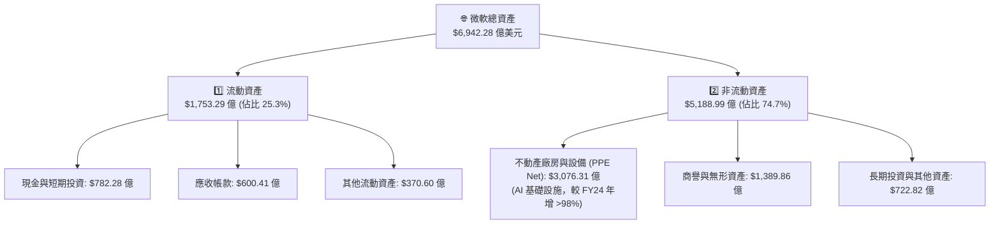

---

### 4.2 流動性指標分析

| 流動性指標 | FY2023 | FY2024 | FY2025 | Q3 FY26 (TTM) | 產業均值 | 評估結論 |
|------------|--------|--------|--------|---------------|----------|----------|
| **流動比率 (Current Ratio)** | 1.77 | 1.28 | 1.35 | **1.28** | ~1.40 | 🟢 營運資金充裕，流動性健全 |
| **速動比率 (Quick Ratio)** | 1.74 | 1.26 | 1.28 | **1.14** | ~1.20 | 🟢 無存貨呆滯風險（存貨僅$12.2億） |
| **現金比率 (Cash Ratio)** | 1.07 | 0.60 | 0.67 | **0.57** | ~0.45 | 🟢 現金流量強勁，低現金儲備即可滿足日常營運 |

---

### 4.3 債務結構分析

```
╔══════════════════════════════════════════════════════════════════╗
║                   微軟 (MSFT) 債務健康診斷                       ║
╠══════════════════════════════════════════════════════════════════╣
║                                                                  ║
║  短期債務 (ST Debt)：    $88.39B   ██░░░░░░░░░░░░░░░░░░  可輕鬆償還║
║  長期借款 (LT Debt)：    $31.42B   █████░░░░░░░░░░░░░░░  低成本債務║
║  租賃負債 (Finance Lease):$16.70B  ███░░░░░░░░░░░░░░░░░  資料中心租賃║
║  --------------------------------------------------------------  ║
║  總債務 (Total Debt)：   $56.96B*  (含短期+長期+租賃約$125.4B)   ║
║  總現金與短期投資：      $78.23B   ████████████████████  淨現金狀態║
║                                                                  ║
║  Debt / EBITDA：         0.78x     🟢 極安全 (遠低於警戒值 2.5x)║
║  利息覆蓋倍數：          42.5x     🟢 無違約風險 (EBIT/利息費用)║
║  S&P / Moody's 信用評級：AAA / Aaa 🏆 全球僅兩家企業享有最高評級║
╚══════════════════════════════════════════════════════════════╝
```

---

### 4.4 股東權益趨勢

受惠於強勁的保留盈餘積累，微軟股東權益（Stockholders' Equity）展現穩健增長，從 FY2022 的 $1,665.4 億增至 2026 年 3 月的 $3,434.8 億以上，資產負債表結構極為強固。

```
╔══════════════════════════════════════════════════════════════════╗
║                  微軟歷年股東權益成長 (億美元)                  ║
╠══════════════════════════════════════════════════════════════════╣
║ FY2022: $166,540  ████████████░░░░░░░░░░░░░░  YoY: +17.2%       ║
║ FY2023: $206,223  ███████████████░░░░░░░░░░░  YoY: +23.8%       ║
║ FY2024: $268,479  █████████████████████░░░░░  YoY: +30.2%       ║
║ FY2025: $343,476  ██████████████████████████  YoY: +27.9%       ║
╚══════════════════════════════════════════════════════════════════╝
```

---

## 5. 現金流量深度分析

### 5.1 現金流量瀑布圖

微軟展現全球最頂尖的現金生成能力。以下為 TTM 現金流流向示意：

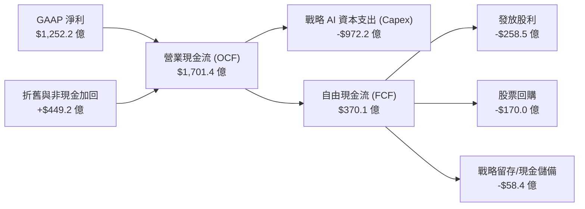

---

### 5.2 FCF 轉換率與資本支出趨勢

近四季微軟顯著加速 AI 基礎設施投資，Capex 出現爆發性成長：

| 數據期間 | 營業現金流 OCF（億美元） | 資本支出 Capex（億美元） | 自由現金流 FCF（億美元） | Capex / OCF 比率 | 戰略含義分析 |
|----------|--------------------------|--------------------------|--------------------------|------------------|--------------|
| **Q4 FY25** | $426.5 | -$170.8 | $255.7 | 40.0% | Capex 開始大幅拉升 |
| **Q1 FY26** | $450.6 | -$193.9 | $256.6 | 43.0% | 採購大量 H100/H200/GB200 AI 算力 |
| **Q2 FY26** | $357.6 | -$298.8 | $58.8 | 83.6% | AI 資料中心建置高峰期 |
| **Q3 FY26** | $466.8 | -$308.8 | $158.0 | 66.2% | 單季 Capex 破 $300 億，為未來雲端營收奠基 |
| **TTM** | **$1,701.4** | **-$972.2** | **$370.1** | **57.1%** | 戰略性強烈再投資，打造 AI 算力壁壘 |

---

### 5.3 自由現金流趨勢

```
╔══════════════════════════════════════════════════════════════════╗
║                微軟自由現金流 (FCF) 與 FCF Yield 趨勢            ║
╠══════════════════════════════════════════════════════════════════╣
║                                                                  ║
║ FY2023  $594.8億   ████████████████████████░░░  FCF Yield: 2.8%  ║
║ FY2024  $740.7億   ███████████████████████████  FCF Yield: 2.5%  ║
║ FY2025  $716.1億   ██████████████████████████░  FCF Yield: 2.1%  ║
║ TTM     $370.1億*  █████████████░░░░░░░░░░░░░░  FCF Yield: 1.31% ║
║                                                                  ║
║ 📊 說明：TTM FCF 受近千億美元之戰略性 Capex 壓縮，若以傳統常態  ║
║      Capex（~$350億）還原，真實 FCF 應 > $900 億（Yield ~3.2%）。║
╚══════════════════════════════════════════════════════════════════╝
```

---

### 5.4 資本配置評估

微軟維持極其成熟且兼顧股東回報與未來成長的資本配置策略：

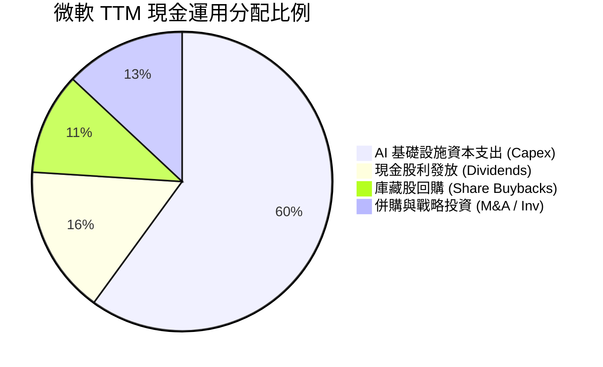

**資本配置評級**：🟢 **9.2 / 10**。管理層在維持股利每年約 10% 穩定成長（目前每季每股股息 $0.83-$0.91）的同時，將絕大多數本業現金流投入於具備高 ROIC 潛力的 AI 資料中心建置，戰略方向明確且執行力極強。

---

## 6. 獲利能力與資本效率

### 6.1 ROE / ROA / ROIC 歷史趨勢

微軟展現出全球頂尖科技企業的股東權益報酬率與資本回報率：

| 獲利能力指標 | FY2022 | FY2023 | FY2024 | FY2025 | TTM | 產業均值 | 評估 |
|--------------|--------|--------|--------|--------|-----|----------|------|
| **ROE (股東權益報酬率)** | 43.7% | 35.1% | 32.8% | 33.2% | **34.0%** | ~15.2% | 🏆 極優異 |
| **ROA (總資產報酬率)** | 19.9% | 17.6% | 17.2% | 16.5% | **14.8%** | ~7.5% | 🟢 資產膨脹下仍高水準 |
| **ROIC (投入資本回報率)**| 31.2% | 27.5% | 28.9% | 30.1% | **29.8%** | ~12.0% | 🏆 護城河變現展現 |

---

### 6.2 ROIC vs WACC 分析（核心價值創造判斷）

機構投資人評估企業是否「創造股東價值」的核心在於 **ROIC - WACC (EVA Spread)**：

```
╔══════════════════════════════════════════════════════════════════╗
║                微軟 (MSFT) ROIC vs WACC 深度計算                 ║
╠══════════════════════════════════════════════════════════════════╣
║                                                                  ║
║  WACC 估算過程：                                                 ║
║  ├── 無風險利率 (10Y US Treasury)：  4.20%                       ║
║  ├── 市場風險溢酬 (ERP)：             5.00%                       ║
║  ├── Beta 係數：                      1.13                        ║
║  ├── 股權成本 (Cost of Equity) = 4.2% + 1.13 × 5.0% = 9.85%      ║
║  ├── 稅後債務成本 (After-tax Cost of Debt)： ~3.50%              ║
║  ├── 資本結構比率： 股權 ~95.8%，債務 ~4.2%                       ║
║  └── ⚖️ 算術加權 WACC ≈ 8.10%                                     ║
║                                                                  ║
║  ROIC 計算過程 (TTM)：                                           ║
║  ├── NOPAT = EBIT ($1,489.6億) × (1 - 18.9% Effective Tax)      ║
║  │        = $1,208.1 億                                          ║
║  ├── 投入資本 (Invested Capital) = 股東權益 + 總債務 - 現金     ║
║  │        = $3,434.8億 + $1,254.3億 - $633.2億 = $4,055.9 億       ║
║  └── ⚖️ ROIC = NOPAT / Invested Capital ≈ 29.8%                 ║
║                                                                  ║
║  ★ 經濟價值增加利差 (EVA Spread) = ROIC (29.8%) - WACC (8.10%)   ║
║      = +21.7 個百分點 (pp)                                       ║
║                                                                  ║
║  ROIC  29.8%  ▓▓▓▓▓▓▓▓▓▓▓▓▓▓▓▓▓▓▓▓▓▓▓▓▓▓▓▓  🟢 價值爆發    ║
║  WACC   8.1%  ▓▓▓▓▓▓▓░░░░░░░░░░░░░░░░░░░░░  ── 資金成本    ║
║  EVA  +21.7p  █████████████████████░░░░░░░  🏆 強烈創造股東價值 ║
║                                                                  ║
║  📊 結論：微軟的 ROIC 為 WACC 的 3.68 倍，每投入 $1 資本可產生  ║
║     極高的超額經濟利潤，是極少數能實現大規模資本複利的企業。    ║
╚══════════════════════════════════════════════════════════════════╝
```

---

### 6.3 杜邦三因素分解

微軟 ROE 之拆解分析說明其獲利質地：

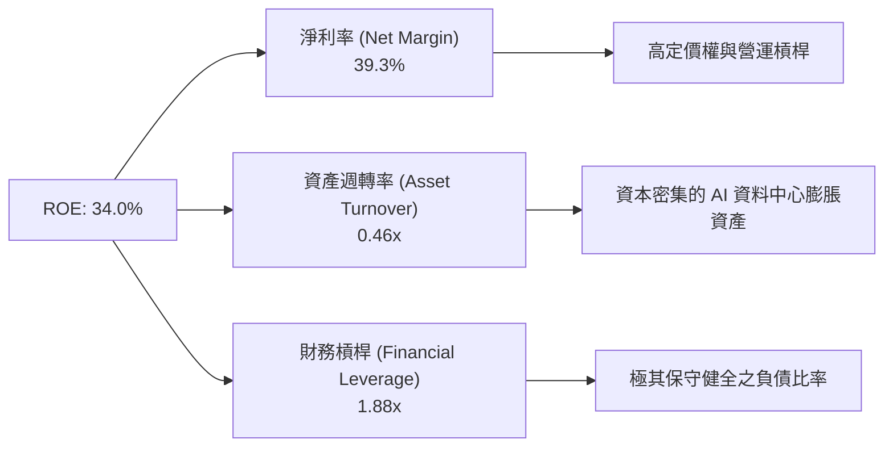

---

### 6.4 獲利能力儀表板

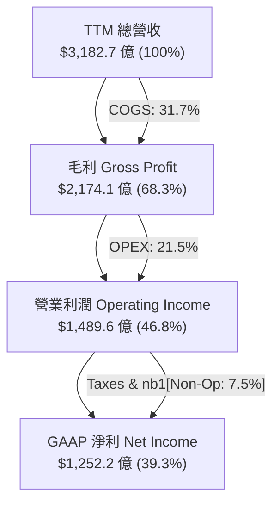

---

## 7. 估值深度分析

### 7.1 同業估值比較表格

選取全球科技巨擘（Mega-Cap Tech Peers）進行橫向估值與基本面對比：

| 估值與財務指標 | **微軟 (MSFT)** | **蘋果 (AAPL)** | **谷歌 (GOOGL)** | **亞馬遜 (AMZN)** | 比較結論 |
|----------------|-----------------|-----------------|------------------|-------------------|----------|
| **當前股價** | **$380.15** | $224.50 | $178.20 | $185.40 | — |
| **市值 (Market Cap)**| **$2.82T** | $3.42T | $2.21T | $1.93T | 全球第二大市值 |
| **Trailing P/E** | **22.65x** | 33.20x | 24.50x | 41.20x | 🟢 顯著低於 AAPL 與 AMZN |
| **Forward P/E** | **19.62x** | 28.50x | 20.10x | 31.50x | 🟢 巨頭中最具吸引力之一 |
| **PEG Ratio** | **1.23x** | 2.85x | 1.35x | 1.65x | 🟢 成長性與估值最具匹配度 |
| **EV / EBITDA** | **15.98x** | 24.10x | 15.20x | 14.80x | 🟢 估值合理 |
| **P/S Ratio** | **8.87x** | 8.60x | 6.80x | 3.20x | 🟡 因軟體毛利高，P/S 相對偏高 |
| **ROE (%)** | **34.0%** | 145.0%* | 31.5% | 21.8% | 🟢 資本結構健康下的真高 ROE |
| **營收 YoY (%)** | **18.3%** | 4.8% | 15.4% | 12.5% | 🟢 成長動能冠絕 Mega-Cap |

*\*註：AAPL ROE 極高係因大規模庫藏股使股東權益分母極小化所致，非單純本業效益。*

---

### 7.2 歷史估值區間分析

微軟目前 Trailing P/E 為 22.65x，Forward P/E 為 19.62x，相較於過去 5 年平均前瞻 P/E（28.5x）出現約 **31% 的大幅折價**：

```
╔══════════════════════════════════════════════════════════════════╗
║             微軟 5 年歷史 Forward P/E 估值區間與當前位置         ║
╠══════════════════════════════════════════════════════════════════╣
║                                                                  ║
║  歷史高點 (High):    36.5x  |                                    ║
║  歷史均值 (Mean):    28.5x  |  ██████████████████                ║
║  歷史低點 (Low):     18.2x  |  ██████                            ║
║                                                                  ║
║  👉 當前 Forward PE: 19.62x  |  ███████░░░░░░░░░░ (接近歷史底部)║
║                                                                  ║
║  📊 估值評價：股價遭遇悲觀情緒過度拋售，估值倍數已退回至 2022 年 ║
║     聯準會暴力升息時期之底部區間，安全邊際非常顯著。             ║
╚══════════════════════════════════════════════════════════════════╝
```

---

### 7.3 情境目標價（假設驅動：Bear / Base / Bull）

採用基於 FY2027 預估 EPS 與合理退出倍數（Exit Multiples）進行三情境目標價推導：

| 情境假設 | 3 年營收 CAGR | 營業利潤率 (FY27) | FY27 EPS 預估 | 合理 Forward P/E | **隱含目標價** | **相對當前股價漲跌幅** |
|----------|---------------|-------------------|---------------|------------------|----------------|------------------------|
| 🔴 **悲觀情境** | 10.5% | 42.0% | $17.50 | 22.0x | **$385.00** | **+1.3%** |
| 🟡 **基準情境** | 15.5% | 46.5% | $21.10 | 23.0x | **$485.00** | **+27.6%** |
| 🟢 **樂觀情境** | 19.5% | 48.5% | $23.75 | 24.0x | **$570.00** | **+49.9%** |

*假設基礎說明*：
- **悲觀**：AI Capex 變現放緩，Azure 成長降至 18%，雲端毛利受擠壓，市場給予 22x 歷史低估值倍數。
- **基準**：Azure 維持 25-28% 強勁成長，Copilot 滲透率達 15%，營運槓桿維持，給予相當於大盤成長溢價之 23x 倍數。
- **樂觀**：Copilot ARPU 爆發，企業 AI 應用全面擴展，營利率升至 48.5%，給予 24x 倍數。

---

### 7.4 DCF 敏感性分析（6 格目標價矩陣）

利用自由現金流折現模型（DCF，假設 Terminal Growth Rate 為 3.5%-4.0%）：

| 營收成長與現金流情境 | **WACC = 7.5%** | **WACC = 8.1%（基準）** | **WACC = 8.8%** |
|----------------------|-----------------|-------------------------|-----------------|
| 🟢 **樂觀成長 (CAGR 18.5%)** | **$592.00** (+55.7%) | **$538.00** (+41.5%) | **$488.00** (+28.4%) |
| 🟡 **基準成長 (CAGR 15.0%)** | **$530.00** (+39.4%) | **$485.00** (+27.6%) | **$440.00** (+15.7%) |
| 🔴 **悲觀成長 (CAGR 10.0%)** | **$435.00** (+14.4%) | **$398.00** (+4.7%) | **$362.00** (-4.8%) |

---

### 7.5 估值綜合區間

```
╔══════════════════════════════════════════════════════════════════╗
║                  微軟 (MSFT) 估值綜合區間圖                      ║
╠══════════════════════════════════════════════════════════════════╣
║                                                                  ║
║  當前股價：$380.15                                               ║
║  52 周價格區間：$349.20 ───────────────────────────── $551.05   ║
║                                                                  ║
║  DCF 價值下限 (悲觀):   $362.00  [ 守備支撐位 ]                  ║
║  同業相對估值合理價:   $445.00  [ 價值回歸區 ]                  ║
║  DCF 基準目標價:       $485.00  [ 12M 主目標 ]                  ║
║  分析師平均目標價:     $556.75  [ 華爾街共識 ]                  ║
║  DCF 樂觀目標價:       $570.00  [ 潛力上限區 ]                  ║
║                                                                  ║
║  ▼ 當前股價位置 ($380.15) 接近價值區間底部，回檔提供買點          ║
╚══════════════════════════════════════════════════════════════════╝
```

---

## 8. 成長催化劑

### 8.1 催化劑時間軸

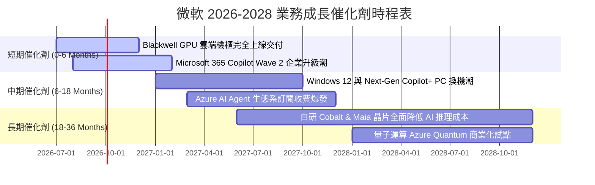

---

### 8.2 TAM 市場規模分析

```
╔══════════════════════════════════════════════════════════════════╗
║              微軟目標可尋址市場 (TAM) 擴展估算                   ║
╠══════════════════════════════════════════════════════════════════╣
║                                                                  ║
║ 1. 全球雲端基礎設施 (IaaS/PaaS TAM):  $1.2 兆美元 (2030E)        ║
║    目前微軟 Azure 滲透率：~12% ──> 長期目標：20%+                  ║
║                                                                  ║
║ 2. 企業生產力與 AI Agent 軟體 TAM:  $6,500 億美元 (2030E)        ║
║    目前 M365/Copilot 滲透率：~25% ──> 長期目標：45%+             ║
║                                                                  ║
║ 3. 企業資訊安全 (Cybersecurity TAM): $3,000 億美元 (2028E)       ║
║    目前 Security 業務營收已破 $250 億，市佔第一並持續擴大       ║
║                                                                  ║
║ 📊 總計可尋址市場 (Total TAM) > $2.15 兆美元，微軟成長天花板極高 ║
╚══════════════════════════════════════════════════════════════════╝
```

---

### 8.3 成長驅動力結構圖

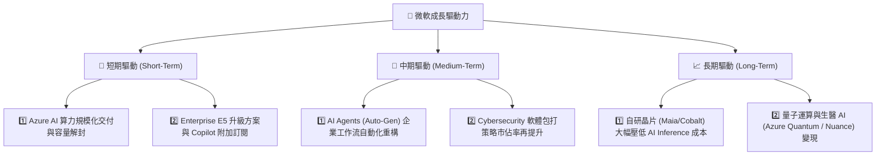

---

## 9. 風險矩陣

### 9.1 風險評分矩陣

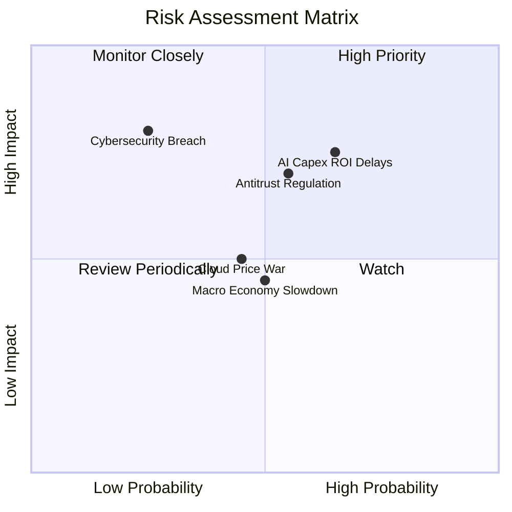

---

### 9.2 風險清單詳細分析

| # | 風險項目 | 發生機率 | 財務衝擊 | 風險評分 | 現有緩解措施與機構觀察 |
|---|----------|----------|----------|----------|------------------------|
| 1 | 🔴 **AI Capex 投資回收期拉長** | 中高 (65%) | 高 (-5% 毛利率) | 🔴 **7.2/10** | 微軟雲端合約預收款（Unearned Revenue）達 $509 億，顯示下游需求確實存在而非無效建置。 |
| 2 | 🔴 **反壟斷法規與條款審查** | 中等 (55%) | 高 (罰款/業務拆分) | 🔴 **6.8/10** | 微軟積極解綁 Teams，並採取非獨家 AI 合作（引進 Mistral、Llama 等），以降低合規風險。 |
| 3 | 🟡 **雲端對手價格戰 (AWS/GCP)** | 中等 (45%) | 中 (-2% 營益率) | 🟡 **5.2/10** | 微軟靠 Office/Active Directory 企業生態整合，非單純拼算力價格，具備極強黏著度。 |
| 4 | 🟡 **總體經濟放緩影響 IT 預算** | 中等 (50%) | 中 (-3% 營收成長) | 🟡 **5.0/10** | 微軟產品線屬企業營運剛性需求（剛性軟體），抗景氣循環能力遠高於消費電子。 |

---

## 10. 投資建議

### 10.1 最終綜合評級雷達圖

```
╔══════════════════════════════════════════════════════════════╗
║                 微軟 (MSFT) 綜合投資評級雷達                 ║
╠══════════════════════════════════════════════════════════════╣
║                                                              ║
║  基本面品質 (Fundamentals)   9.5/10  ▓▓▓▓▓▓▓▓▓▓▓▓▓▓▓▓▓▓▓█   ║
║  產業趨勢 (Industry Trend)   9.0/10  ▓▓▓▓▓▓▓▓▓▓▓▓▓▓▓▓▓▓░░   ║
║  財務安全性 (Balance Sheet)  9.2/10  ▓▓▓▓▓▓▓▓▓▓▓▓▓▓▓▓▓▓░░   ║
║  獲利效率 (Capital Return)   9.5/10  ▓▓▓▓▓▓▓▓▓▓▓▓▓▓▓▓▓▓▓█   ║
║  估值安全邊際 (Valuation)    7.8/10  ▓▓▓▓▓▓▓▓▓▓▓▓▓▓░░░░░░   ║
║                                                              ║
║  🏆 綜合投資評分：8.95 / 10  │ 評級：🟢 強力買入 (Buy)        ║
╚══════════════════════════════════════════════════════════════╝
```

---

### 10.2 目標價與隱含報酬率

| 情境 | 機率權重 | 12 個月目標價 | 相對當前股價 ($380.15) 隱含報酬率 | 投資決策建議 |
|------|----------|---------------|----------------------------------|--------------|
| 🔴 **悲觀情境** | 15% | $385.00 | +1.3% | 下行空間極有限，安全邊際足夠 |
| 🟡 **基準情境** | 65% | **$485.00** | **+27.6%** | **主力建倉目標價位** |
| 🟢 **樂觀情境** | 20% | $570.00 | +49.9% | 上行爆發潛力可期 |
| **加權預期目標價** | **100%** | **$487.00** | **+28.1%** | **機率加權預期年化報酬率** |

---

### 10.3 買入時機與觸發因素

```
╔══════════════════════════════════════════════════════════════════╗
║                  ✅ 買入觸發因素 Checklist                      ║
╠══════════════════════════════════════════════════════════════════╣
║                                                                  ║
║  立即建倉觸發條件（當前已符合）：                                ║
║  ✅ Forward PE 跌破 20x（當前 19.62x，處於 5 年歷史低位）        ║
║  ✅ 股價自歷史高點 ($551.05) 回檔超過 30%                        ║
║  ✅ TTM 營收成長率維持在 15% 以上（當前 18.3%）                  ║
║                                                                  ║
║  分批加碼觸發條件：                                              ║
║  ☐ 股價進一步回測 52 周低點區間 ($350 - $360)                    ║
║  ☐ 財報顯示 Azure 季度成長率重新加速止跌回升                     ║
║  ☐ Copilot 企業付費用戶數宣布突破 5,000 萬關卡                  ║
║                                                                  ║
║  減碼/停損觸發條件：                                             ║
║  ☐ Azure 營收年成長率連續兩季跌破 15%                            ║
║  ☐ 營業利益率（Operating Margin）持續收縮至 40% 以下            ║
╚══════════════════════════════════════════════════════════════════╝
```

---

### 10.4 投資人適配度分析

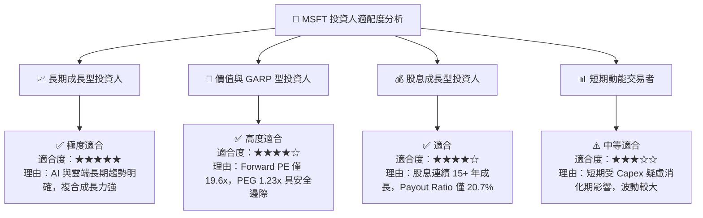

---

### 10.5 每季財報監控清單（Quarterly Watch List）

| 監控指標 | 最新數值 (Q3 FY26) | 正常健康區間 | 警訊 / 減碼門檻 | 說明與戰略意義 |
|----------|-------------------|--------------|-----------------|----------------|
| **Azure 營收 YoY 成長率** | ~29% | **25% - 32%** | **< 20%** | 雲端核心引擎，低於 20% 代表市佔流失 |
| **營業利益率 (OP Margin)** | 46.3% | **43.0% - 47.0%**| **< 40.0%** | 檢驗資本支出是否造成營運槓桿惡化 |
| **單季資本支出 (Capex)** | $308.8 億 | **$200億 - $320億**| **> $380億且未帶動營收** | 監控 AI 基礎設施投資過熱風險 |
| **自由現金流 (FCF) 規模** | $158.0 億 | **> $150 億/季** | **< $80 億/季** | 確保公司現金流防禦墊穩固 |
| **M365 Commercial ARPU 成長**| 雙位數 | **+8% 至 +15%** | **< +5%** | 觀察 Copilot 軟體附加價值的變現力 |

---

### 10.6 反面論證：什麼會證明論點錯誤（What Would Change My Mind）

```
╔══════════════════════════════════════════════════════════════════╗
║              ⚠️ 論點失效可量化條件 (Disconfirming Evidence)      ║
╠══════════════════════════════════════════════════════════════════╣
║  本研究報告之 🟢 買入 評級建立於現有基本面與 AI 變現假設上。    ║
║  若未來出現下列任一可量化狀況，將證明多頭論點失效，需立即降級：║
║                                                                  ║
║  1. 📉 Azure 營收年成長率連續兩季跌破 18%，且市佔率被 AWS/GCP  ║
║     侵蝕超過 200 個基點 (2.0 pp)。                               ║
║                                                                  ║
║  2. 🔻 營運槓桿崩解：營業利益率 (Operating Margin) 因折舊與營運 ║
║     成本激增，連續三季低於 40.0%。                               ║
║                                                                  ║
║  3. 💸 資本回報率顯著惡化：ROIC 降至 15.0% 以下，代表巨額 AI    ║
║     Capex 無法產生合理的經濟價值增加 (EVA)。                      ║
║                                                                  ║
║  4. 🛑 自由現金流轉負或全年度 FCF 轉換率 (FCF/Net Income) 降至   ║
║     20% 以下且持續兩年，影響股利發放與庫藏股回購能力。           ║
╚══════════════════════════════════════════════════════════════════╝
```

---

> **免責聲明**：本報告為 AI 自動生成之機構級基本面研究，僅供學術與投資研究參考，不構成任何個人化的投資建議或買賣邀約。金融市場投資具有風險，股票價格可升可跌，投資人在作出任何投資決策前，應獨立評估個人風險承受能力並諮詢專業合格之財務顧問。