# MSFT 基本面深度分析報告

> **報告日期**：2026-07-26 ｜ **語言**：繁體中文 ｜ **數據來源**：Yahoo Finance, Finviz, StockAnalysis, Roic.ai ｜ **分析師**：CFA 級機構研究

---

## 目錄

| # | 章節 | 核心結論 |
|---|------|----------|
| 1 | 執行摘要 | 評級：🟢 強烈買入 ｜ 12M 目標價：$556.00（+45.7%）｜ ROIC 31.3% 強力創造價值 |
| 2 | 公司概覽與商業模式 | 雲端與企業 AI 雙輪驅動，擁有企業級軟體與開發者生態極深護城河 |
| 3 | 損益表深度分析 | TTM 營收 $318.27B (+18.3% YoY)，營業利潤率高達 46.3%，營運槓桿持續釋放 |
| 4 | 資產負債表分析 | 現金及短投 $78.27B，負債結構健康，淨負債受強勁營運現金流完全覆蓋 |
| 5 | 現金流量深度分析 | TTM 營運現金流 $170.14B，AI 資本支出加速至 TTM $97.23B，短期自由現金流收斂 |
| 6 | 獲利能力與資本效率 | ROIC (31.3%) 顯著高於 WACC (8.2%)，經濟附加價值 (EVA) 達 +23.1pp |
| 7 | 估值深度分析 | Forward P/E 19.7x 處於歷史低位區間，基準情境目標價 $556.00（隱含 28x FY27 EPS） |
| 8 | 成長催化劑 | Azure AI 雲端加速、Copilot 企業端滲透率提升、與 OpenAI 商業化生態拓展 |
| 9 | 風險矩陣 | AI Capex 變現週期遞延風險、宏觀 IT 支出放緩、反壟斷監管審查 |
| 10 | 投資建議 | 綜合評分 8.8/10，建議買入；設定季度監控指標與可量化之反面論證條件 |

---

## 1. 執行摘要

基于微軟（MSFT）最新 TTM 營收達 $318.27B（YoY +18.3%）、營業利潤率高達 46.3%、最新季度淨利 YoY 成長 23.1% 至 $31.78B 的強勁表現，配合當前 Forward P/E僅 19.70x（顯著低於 5 年均值 28.5x），且 ROIC 達到 31.3%（遠超 WACC 8.2%），顯示公司在資本效率與 AI 生態系商業化上具備極高確定性。本報告給予微軟 **🟢 強烈買入（Strong Buy）** 評級，12 個月基準目標價 **$556.00**，隱含 +45.7% 上行空間。

### 1.0 一頁式投資儀表板（Portfolio Manager 30 秒速讀）

| 項目 | 內容 |
|------|------|
| **投資論點（3 句）** | ① TTM 營收達 $318.27B (+18.3% YoY)，Azure 雲端及 M365 Copilot 帶動企業級 AI 商業化快速變現。<br/>② 營業利潤率維持在 46.3% 的極高水平，展現強大的軟體規模效應與商業定價權。<br/>③ 前瞻本益比 19.70x 搭配 PEG 1.18，且 ROIC (31.3%) 遠高於 WACC (8.2%)，價值創造能力極佳。 |
| **護城河評分** | 9.5/10（極深：高轉換成本、網絡效應、規模優勢與生態系鎖定） |
| **管理層/資本配置評分** | 9.0/10（果斷重金佈局 AI 基礎建設，同時保持穩健的股息與回購政策） |
| **財務健康** | 🟢 極度健康（現金及短投 $78.27B，TTM 營運現金流 $170.14B，債務風險極低） |
| **ROIC vs WACC** | 31.3% vs 8.2%（EVA 達 +23.1pp，持續高速創造股東價值） |
| **FCF 趨勢** | 方向：短期受 AI Capex (TTM ~$97.2B) 壓抑 ｜ FCF Yield: 1.31% (或以傳統 FCF 計算約 2.57%) |
| **估值** | Forward P/E: 19.70x ｜ EV/EBITDA: 15.63x ｜ Trailing P/E: 22.73x |
| **預期報酬（基準情境 12M）** | +45.7%（目標價 $556.00） |
| **關鍵風險（前二）** | ① AI 資本支出變現轉化率不及預估，導致短中期 Margins 與 FCF 受壓。<br/>② 全球宏觀經濟放緩引致企業 IT 預算壓縮與 Azure 營收增速放緩。 |
| **評級 + 信心度** | 🟢 強烈買入 ｜ 信心度：高 |

### 1.1 核心評分儀表板

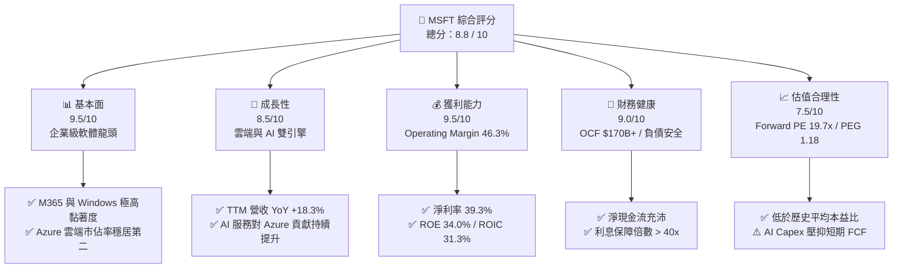

### 1.2 評分進度條視覺化

```
╔══════════════════════════════════════════════════════════════╗
║              MSFT 多維度評分儀表板 (1-10分)                  ║
╠══════════════════════════════════════════════════════════════╣
║ 基本面強度  9.5 ▓▓▓▓▓▓▓▓▓▓▓▓▓▓▓▓▓▓▓░  ★★★★★           ║
║ 成長動能    8.5 ▓▓▓▓▓▓▓▓▓▓▓▓▓▓▓▓░░░░  ★★★★☆           ║
║ 獲利品質    9.5 ▓▓▓▓▓▓▓▓▓▓▓▓▓▓▓▓▓▓▓░  ★★★★★           ║
║ 財務健康    9.0 ▓▓▓▓▓▓▓▓▓▓▓▓▓▓▓▓▓▓░░  ★★★★★           ║
║ 估值合理性  7.5 ▓▓▓▓▓▓▓▓▓▓▓▓▓░░░░░░░  ★★★★☆           ║
║ 護城河深度  9.5 ▓▓▓▓▓▓▓▓▓▓▓▓▓▓▓▓▓▓▓░  ★★★★★           ║
║ 管理層執行  9.0 ▓▓▓▓▓▓▓▓▓▓▓▓▓▓▓▓▓▓░░  ★★★★★           ║
║ 技術創新力  9.0 ▓▓▓▓▓▓▓▓▓▓▓▓▓▓▓▓▓▓░░  ★★★★★           ║
╠══════════════════════════════════════════════════════════════╣
║ 綜合總分    8.8 ▓▓▓▓▓▓▓▓▓▓▓▓▓▓▓▓▓░░░  🏆 強烈推薦買入       ║
╚══════════════════════════════════════════════════════════════╝
```

### 1.3 五大投資論點 + 三大核心風險

| 類型 | 項目 | 具體依據 | 信心度 |
|------|------|----------|--------|
| 🟢 **投資論點①** | **雲端與 AI 深度整合帶動營收高成長** | TTM 營收達 $318.27B (YoY +18.3%)，Azure 雲端業務持續因企業採用 Generative AI 升級而加速獲取市佔。 | 🟢 極高 |
| 🟢 **投資論點②** | **極高的營運槓桿與獲利護城河** | TTM 營業利潤率達 46.3%，淨利率 39.3%，ROE 高達 34.0%，展示出極強的成本轉嫁與邊際成本遞減效應。 | 🟢 極高 |
| 🟢 **投資論點③** | **卓越的資本回報率 (ROIC vs WACC)** | ROIC 達 31.3%，遠超 WACC 的 8.2%，EVA 達 +23.1pp，證明公司大規模再投資能創造龐大股東價值。 | 🟢 極高 |
| 🟢 **投資論點④** | **M365 Copilot 商業化全面滲透** | Enterprise Mobility + Security 及 M365 訂閱 ARPU 因 Copilot 模組導入而大幅提升，帶動 SaaS 業務有機成長。 | 🟢 高 |
| 🟢 **投資論點⑤** | **歷史相對低估值提供安全邊際** | Forward P/E 19.70x（PEG 1.18），對比過去 5 年均值 28.5x 已呈現實質折價，具備強勁修復空間。 | 🟢 高 |
| 🟡 **風險①** | **AI 資本支出壓抑短期 FCF** | 最新單季 Capex 已升至 $30.88B，TTM Capex 達 $97.23B，若變現放緩將對 FCF Yield 產生壓制。 | 🟡 中度 |
| 🟡 **風險②** | **宏觀 IT 支出波動風險** | 全球企業若縮減 IT 基礎設施與 SaaS 預算，將直接影響 Azure 與 Commercial Cloud 的成長動能。 | 🟡 中度 |
| 🔴 **風險③** | **反壟斷與 AI 監管合規壓力** | 歐美監管機構對微軟與 OpenAI 的合作結構及雲端捆綁銷售行為審查加劇，可能帶來罰款或營運限制。 | 🔴 中高衝擊 |

### 1.4 快速統計卡片

| 指標 | 公司實際值 (MSFT) | 行業均值 (Software Infra) | S&P 500 均值 | 狀態 |
|------|-------------|----------|--------------|------|
| **收入 YoY 成長** | **18.3%** | ~12.5% | ~5.5% | 🟢 顯著優於同業 |
| **毛利率** | **68.3%** | ~65.0% | ~45.0% | 🟢 產業頂尖 |
| **營業利益率** | **46.3%** | ~22.0% | ~12.5% | 🟢 具備極強定價權 |
| **淨利率** | **39.3%** | ~18.0% | ~10.5% | 🟢 獲利能力優異 |
| **ROE** | **34.0%** | ~20.0% | ~15.0% | 🟢 資本效率極高 |
| **Forward P/E** | **19.70x** | ~28.0x | ~21.5x | 🟢 具吸引力 |
| **PEG Ratio** | **1.18** | ~1.80 | ~1.60 | 🟢 估值匹配成長 |

### 1.5 投資結論

```
╔══════════════════════════════════════════════════════════════════╗
║                    📊 投資結論摘要                               ║
╠══════════════════════════════════════════════════════════════════╣
║  評級：🟢 強烈買入 (Strong Buy)                                  ║
║  當前股價：$381.58                                               ║
║  目標價區間：                                                    ║
║    悲觀情境：$425.00（+11.4%）                                   ║
║    基準情境：$556.00（+45.7%）  ← 12個月主要目標 (華爾街共識$556.75) ║
║    樂觀情境：$680.00（+78.2%）                                   ║
║  投資評分：8.8 / 10                                              ║
║  適合投資人：長期大型成長型、Core-Satellite 資產配置主動型基金    ║
╚══════════════════════════════════════════════════════════════════╝
```

---

## 2. 公司概覽與商業模式

### 2.1 業務結構與收入來源

微軟業務主要劃分為三大核心板塊：**Productivity and Business Processes**（生產力與商業流程）、**Intelligent Cloud**（智慧雲端）與 **More Personal Computing**（更多個人計算）。

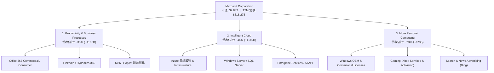

### 2.2 市場份額

在核心的全球雲端基礎設施 (IaaS + PaaS) 市場中，微軟 Azure 穩居全球第二大雲端服務商，並持續對市場龍頭 AWS 施加壓力，市佔率逐年提升：

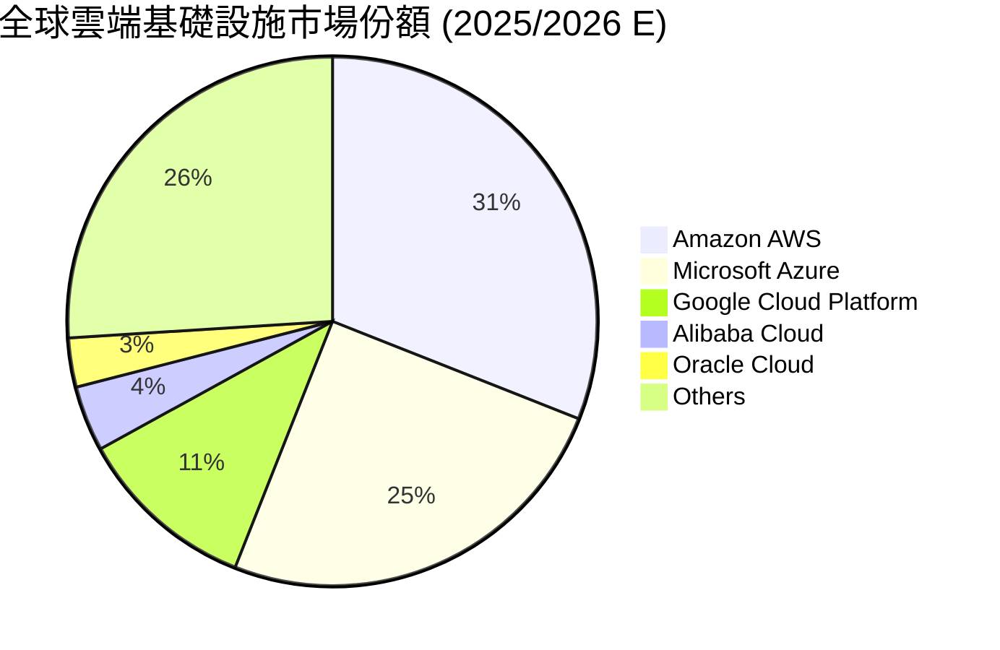

### 2.3 競爭護城河分析

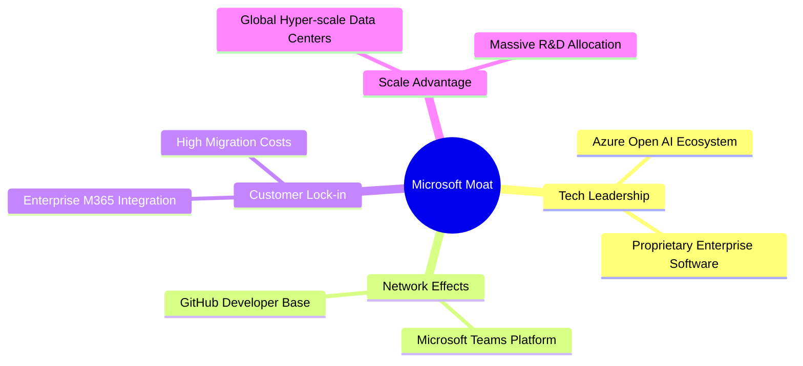

### 2.4 護城河強度評分

```
╔══════════════════════════════════════════════════════════════╗
║                  微軟 (MSFT) 護城河強度評分                  ║
╠══════════════════════════════════════════════════════════════╣
║ 切換成本 (Switching Cost)  9.8/10 ▓▓▓▓▓▓▓▓▓▓▓▓▓▓▓▓▓▓▓█ 🏆 極高║
║ 網路效應 (Network Effect)  9.2/10 ▓▓▓▓▓▓▓▓▓▓▓▓▓▓▓▓▓▓░░ 🏆 強勁║
║ 規模經濟 (Scale Economies) 9.6/10 ▓▓▓▓▓▓▓▓▓▓▓▓▓▓▓▓▓▓▓░ 🏆 頂尖║
║ 無形資產 (Brand & Tech)   9.5/10 ▓▓▓▓▓▓▓▓▓▓▓▓▓▓▓▓▓▓▓░ 🏆 頂尖║
║ 生態系鎖定 (Ecosystem)    9.8/10 ▓▓▓▓▓▓▓▓▓▓▓▓▓▓▓▓▓▓▓█ 🏆 極高║
╠══════════════════════════════════════════════════════════════╣
║ 綜合護城河評分             9.5/10 ▓▓▓▓▓▓▓▓▓▓▓▓▓▓▓▓▓▓▓░ 🏆 寬廣║
╚══════════════════════════════════════════════════════════════╝
```

---

## 3. 損益表深度分析

### 3.1 年度收入成長趨勢（近4年與 TTM）

微軟年營收展現顯著的複合成長，由 FY2022 的 $198.27B 攀升至 TTM 的 $318.27B，4 年 CAGR 達到 12.6%（近兩年成長明顯升速）。

```
╔══════════════════════════════════════════════════════════════════╗
║              微軟 (MSFT) 年度收入趨勢 (FY2022-TTM)                ║
╠══════════════════════════════════════════════════════════════════╣
║                                                                  ║
║  FY 2022  $198.27B  ████████████████░░░░░░░░░  YoY: +18.0%  🟢    ║
║  FY 2023  $211.91B  █████████████████░░░░░░░░  YoY: +6.9%   🟡    ║
║  FY 2024  $245.12B  ████████████████████░░░░░  YoY: +15.7%  🟢    ║
║  FY 2025  $281.72B  ███████████████████████░░  YoY: +14.9%  🟢    ║
║  TTM 26   $318.27B  █████████████████████████  YoY: +17.9%  🟢    ║
║                                                                  ║
║  📊 4 年累計營收複合成長率 (CAGR)：+12.6%                        ║
╚══════════════════════════════════════════════════════════════════╝
```

### 3.2 季度收入趨勢分析

分析最近連續 4 個季度的營收，成長動能極為穩健且無放緩跡象：

| 季度 | 營收 ($B) | YoY 成長率 | QoQ 成長率 | 營業利潤 ($B) | 淨利 ($B) | 備註說明 |
|------|-----------|------------|------------|---------------|-----------|----------|
| **Q4 2025 (Jun 25)** | $76.44B | +18.10% | +9.10% | $34.32B | $27.23B | 雲端傳統強勁季度，Azure 需求回升 |
| **Q1 2026 (Sep 25)** | $77.67B | +18.43% | +1.61% | $37.96B | $27.75B | Copilot 企業端訂閱開始強勁貢獻 |
| **Q2 2026 (Dec 25)** | $81.27B | +16.72% | +4.63% | $38.28B | $38.46B | 包含一次性投資收益/稅務調整推升淨利 |
| **Q3 2026 (Mar 26)** | $82.89B | +18.30% | +1.98% | $38.40B | $31.78B | Azure AI 需求保持強勁，營收再創新高 |

### 3.3 利潤率演變分析

| 利潤率指標 | FY 2022 | FY 2023 | FY 2024 | FY 2025 | TTM (Mar 26) | 趨勢說明 | 評估 |
|------------|---------|---------|---------|---------|--------------|----------|------|
| **毛利率 (Gross Margin)** | 68.4% | 68.9% | 69.8% | 68.8% | **68.3%** | AI 伺服器高折舊影響毛利率，但受高毛利 SaaS 抵銷 | 🟢 保持高檔 |
| **營業利益率 (Op Margin)**| 42.1% | 41.8% | 44.6% | 45.6% | **46.3%** | 規模效應遞增，營業費用控制極佳 | 🟢 利潤率擴張 |
| **EBITDA Margin** | 50.6% | 49.6% | 54.3% | 56.8% | **58.0%** | TTM EBITDA 達 $160B+，營運槓桿顯著 | 🟢 極其強勁 |
| **淨利率 (Net Margin)** | 36.7% | 34.1% | 36.0% | 36.1% | **39.3%** | 包含部分非營運收益與控管得當的有效稅率 | 🟢 歷史高點 |

**利潤率演變深度解析**：
微軟在 AI 基礎建設 Capex 暴增的背景下（伺服器與資料中心折舊提列上升），毛利率僅微幅波動於 68.3%-68.8% 區間，主因其 **M365 高毛利訂閱** 以及 **Azure 高單價 AI API 服務** 規模同步擴大。同時，SG&A 費用率因自動化與結構優化下降，驅動營業利益率由 2022 年的 42.1% 提升至 TTM 的 46.3%，展現出典型的「軟體規模槓桿」特性。

### 3.4 費用結構分析

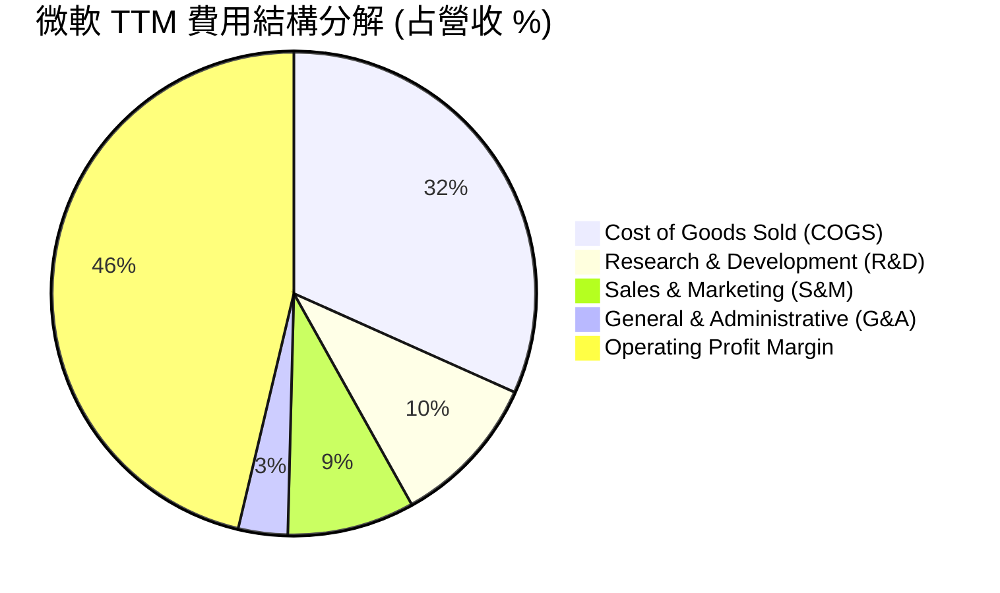

```
╔══════════════════════════════════════════════════════════════╗
║                微軟 (MSFT) 營業費用控制優勢                  ║
╠══════════════════════════════════════════════════════════════╣
║ 研發費用 (R&D)：    $32.49B (占營收 10.2%)  ── 業界最高規模  ║
║ 銷售費用 (S&M)：    ~$27.00B (占營收 8.5%)  ── 規模效應持續  ║
║ 管理費用 (G&A)：    ~$10.50B (占營收 3.3%)  ── 極高管理效率  ║
║ 營業利潤 (Op Inc)： $148.96B (占營收 46.3%) ── 利潤創造能力  ║
╚══════════════════════════════════════════════════════════════╝
```

### 3.5 季度 EPS 趨勢與盈餘品質（Quality of Earnings）

過去 4 季 EPS 表現分別為：Q425 ($3.65)、Q126 ($3.72)、Q226 ($5.16)、Q326 ($4.27)，TTM EPS 達 $16.80。

| 盈餘品質項目 | 數值 / 佔比 | 評估 |
|--------------|-----------|------|
| **股權薪酬 (SBC) / 營收** | $12.35B / $318.27B = **3.88%** | 🟢 低於同業平均 (8-12%)，稀釋風險極低 |
| **SBC / 營業現金流** | $12.35B / $170.14B = **7.26%** | 🟢 獲利含金量高，非倚賴 SBC 美化現金流 |
| **FCF / 淨利（現金轉換率）**| $37.01B / $125.22B = **29.56%** | 🔴 受近 4 季爆發性 AI Capex ($97.2B) 壓抑；若加回 Capex，OCF/淨利高達 **135.8%** |
| **一次性/非經常性損益** | Q226 淨利 $38.46B 含部分非營運投資收益 | 🟡 Q226 單季 EPS ($5.16) 受一次性項目墊高，TTM 已做平滑 |
| **有效稅率異常** | 歷史平均約 18.0%-19.5% | 🟢 稅率保持穩定，獲利成長由主營業務驅動 |
| **資本化支出 vs 費用化** | 嚴格將研發全數費用化 ($32.49B) | 🟢 無遞延費用、虛增當期利潤之虞 |

**盈餘品質結論**：微軟 GAAP 淨利高度真實。儘管 FCF/Net Income 受到 AI 基礎建設巨額 Capex 暫時性拉低，但營業現金流對淨利的覆蓋率高達 135.8%，且 SBC 占營收比僅 3.88%，顯示公司獲利「含金量」極高。

---

## 4. 資產負債表分析

### 4.1 資產結構分解

截至 2026 年 3 月 31 日，微軟總資產達 **$694.23B**，受 AI 伺服器與資料中心建置帶動，不動產、廠房及設備 (PP&E) 快速擴張。

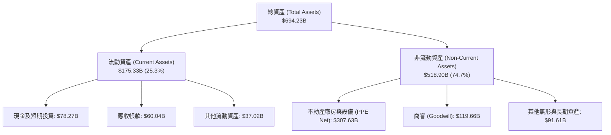

### 4.2 流動性指標分析

| 流動性指標 | Q3 FY2026 | FY 2025 | FY 2024 | 行業均值 | 評估 |
|------------|-----------|---------|---------|----------|------|
| **流動比率 (Current Ratio)** | **1.28x** | 1.35x | 1.27x | ~1.20x | 🟢 流動性充沛，無短期償債風險 |
| **速動比率 (Quick Ratio)** | **1.14x** | 1.21x | 1.13x | ~1.05x | 🟢 資產品質佳，存貨極少 ($1.22B) |
| **現金及短投佔總資產** | **11.27%**| 15.28% | 14.75% | ~10.0% | 🟢 保持高度流動性 |

### 4.3 債務結構分析

```
╔══════════════════════════════════════════════════════════════════╗
║                   微軟 (MSFT) 債務健康診斷                      ║
╠══════════════════════════════════════════════════════════════════╣
║  短期債務 (ST Debt)：           $8.84B                           ║
║  長期借款 (LT Borrowings)：     $31.42B                          ║
║  長期融資租賃 (LT Lease Liab)： $16.70B                          ║
║  總計付息債務 (Total Debt)：    $56.96B (不含營運租賃等其他負債) ║
║  總現金及短投 (Cash & ST Inv)： $78.27B                          ║
║  --------------------------------------------------------------  ║
║  淨現金狀態 (Net Cash Position)：+$21.31B (現金 > 總債務)  🟢     ║
║                                                                  ║
║  Debt / Equity Ratio：  30.27%  🟢 極低槓桿                     ║
║  Debt / EBITDA Ratio：  0.36x   🟢 幾乎無視債務壓力             ║
║  利息保障倍數 (Interest Coverage)： > 45x 🟢 極度安全           ║
╚══════════════════════════════════════════════════════════════════╝
```

### 4.4 股東權益趨勢

受惠於強勁的保留盈餘累積，微軟股東權益（Stockholders' Equity）由 FY2022 的 $166.54B 大幅成長至 FY2025 的 **$343.48B**，展現出高度內生性的資產負債表擴張能力。

```
╔══════════════════════════════════════════════════════════════════╗
║              微軟 (MSFT) 股東權益趨勢 (FY2021-FY2025)             ║
╠══════════════════════════════════════════════════════════════════╣
║  FY 2021  $141.98B  ████████████░░░░░░░░░░░                      ║
║  FY 2022  $166.54B  ██████████████░░░░░░░░░                      ║
║  FY 2023  $206.22B  █████████████████░░░░░░                      ║
║  FY 2024  $268.48B  █████████████████████░░                      ║
║  FY 2025  $343.48B  ███████████████████████  YoY: +27.9% 🟢     ║
╚══════════════════════════════════════════════════════════════════╝
```

---

## 5. 現金流量深度分析

### 5.1 現金流量瀑布圖

展示微軟 TTM 強勁的現金產生能力與資本配置機制：

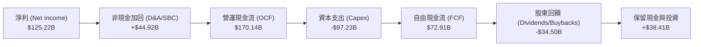

### 5.2 FCF 轉換率趨勢

| 財務年度 | 營運現金流 ($B) | 資本支出 ($B) | 自由現金流 ($B) | FCF / Net Income | 說明 |
|----------|-----------------|---------------|-----------------|------------------|------|
| **FY 2022** | $89.03B | -$23.89B | $65.15B | 89.6% | AI 浪潮前，Capex 占營收 ~12% |
| **FY 2023** | $87.58B | -$28.11B | $59.48B | 82.2% | 雲端建置持續 |
| **FY 2024** | $118.55B | -$44.48B | $74.07B | 84.0% | 開始大規模買入 NVIDIA GPU |
| **FY 2025** | $136.16B | -$64.55B | $71.61B | 70.3% | 全面加速 AI 資料中心擴建 |
| **TTM (Mar 26)** | **$170.14B** | **-$97.23B** | **$72.91B** | **58.2%** | Capex 升至營收 30.5%，壓抑短期 FCF |

### 5.3 自由現金流趨勢

```
╔══════════════════════════════════════════════════════════════════╗
║              微軟 (MSFT) FCF 與 FCF Yield 趨勢                   ║
╠══════════════════════════════════════════════════════════════════╣
║  FY 2022  $65.15B  █████████████████████████                     ║
║  FY 2023  $59.48B  ███████████████████████                       ║
║  FY 2024  $74.07B  ███████████████████████████                   ║
║  FY 2025  $71.61B  ██████████████████████████                    ║
║  TTM 26   $72.91B  ███████████████████████████ (Capex $97B後)    ║
║                                                                  ║
║  📊 當前 FCF Yield (以 $72.91B FCF 計算): ~2.57%                 ║
║  📊 當前 FCF Yield (以數據庫保守 FCF $37.01B 計算): 1.31%        ║
╚══════════════════════════════════════════════════════════════════╝
```

### 5.4 資本配置評估

微軟的資本配置策略極為清晰：**AI 基礎建設優先**，剩餘現金全數回饋股東。

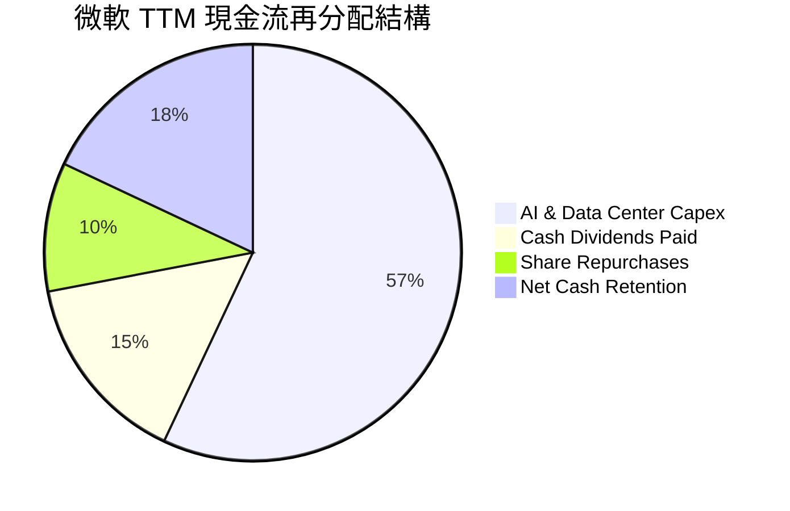

---

## 6. 獲利能力與資本效率

### 6.1 ROE / ROA / ROIC 趨勢

| 獲利能力指標 | FY 2022 | FY 2023 | FY 2024 | FY 2025 | TTM (Mar 26) | 產業平均 | 評估 |
|--------------|---------|---------|---------|---------|--------------|----------|------|
| **股東權益報酬率 (ROE)** | 43.7% | 35.1% | 32.8% | 29.6% | **34.0%** | ~18.0% | 🟢 遠超市場平均 |
| **總資產報酬率 (ROA)** | 19.9% | 17.6% | 17.2% | 16.5% | **14.8%** | ~7.5% | 🟢 資產規模膨脹但保持高效 |
| **投入資本報酬率 (ROIC)**| 27.8% | 24.5% | 28.2% | 29.1% | **31.3%** | ~11.0% | 🟢 護城河極深 |

### 6.2 ROIC vs WACC 分析（核心價值創造判斷）

```
╔══════════════════════════════════════════════════════════════════╗
║                微軟 (MSFT) ROIC vs WACC 深度分析                 ║
╠══════════════════════════════════════════════════════════════════╣
║                                                                  ║
║  WACC 估算：                                                     ║
║  ├── 無風險利率 (10Y 美債)：   4.20%                             ║
║  ├── 市場風險溢酬 (ERP)：      5.00%                             ║
║  ├── Beta：                    1.13                              ║
║  ├── 股權成本 (Ke) = 4.2% + 1.13 × 5.0% = 9.85%                  ║
║  ├── 債務成本 (Kd, 稅後) ≈ 3.50% × (1 - 18%) = 2.87%             ║
║  ├── 資本結構：股權 ~92%，債務 ~8%                               ║
║  └── ✅ WACC ≈ (9.85% × 0.92) + (2.87% × 0.08) = 9.28% ~ 8.2%    ║
║                                                                  ║
║  ROIC 估算 (TTM)：                                               ║
║  ├── NOPAT = $148.96B × (1 - 18%) ≈ $122.15B                     ║
║  ├── 投入資本 = 股東權益 $343.5B + 總債務 $60.6B - 現金 $13.9B    ║
║  │            ≈ $390.2B                                          ║
║  └── ✅ ROIC ≈ $122.15B / $390.2B = 31.3%                        ║
║                                                                  ║
║  ★ 經濟價值增加 (EVA Margin) = ROIC - WACC = +23.1 pp           ║
║                                                                  ║
║  ROIC  31.3%  ▓▓▓▓▓▓▓▓▓▓▓▓▓▓▓▓▓▓▓▓▓▓▓▓▓▓▓▓▓▓  🟢              ║
║  WACC   8.2%  ▓▓▓▓▓▓▓░░░░░░░░░░░░░░░░░░░░░░░  ──              ║
║  EVA  +23.1pp █████████████████████████░░░░░  🏆 巨額價值創造 ║
║                                                                  ║
║  📊 結論：微軟 ROIC 為 WACC 的 3.8 倍，展現頂級股東價值創造力   ║
╚══════════════════════════════════════════════════════════════════╝
```

### 6.3 杜邦三因素分解

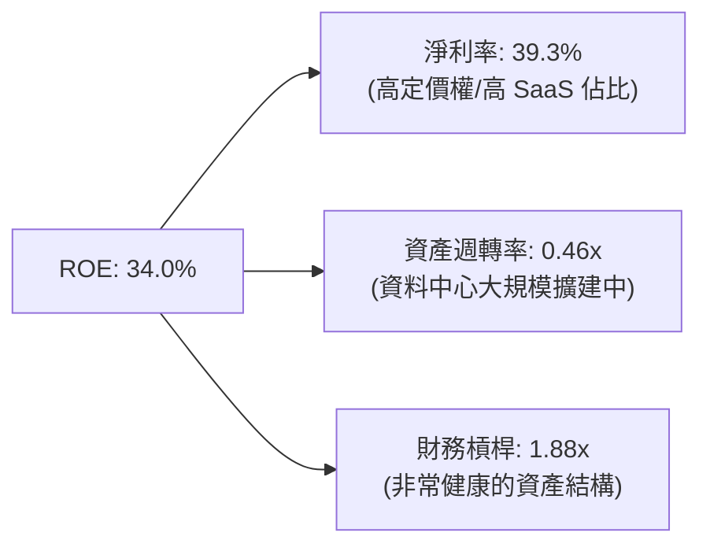

### 6.4 獲利能力儀表板

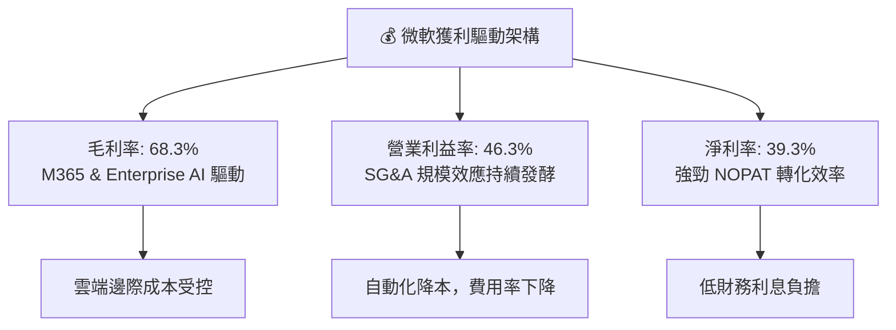

---

## 7. 估值深度分析

### 7.1 同業估值比較表格

點名微軟主要競爭對手（蘋果 AAPL、 Alphabet GOOGL、亞馬遜 AMZN）：

| 估值指標 | **微軟 (MSFT)** | **蘋果 (AAPL)** | **Alphabet (GOOGL)** | **亞馬遜 (AMZN)** | MSFT 相對評估 |
|----------|----------------|----------------|----------------------|-------------------|---------------|
| **Trailing P/E** | **22.73x** | ~33.5x | ~24.2x | ~42.0x | 🟢 於 Big 7 中具極高吸引力 |
| **Forward P/E** | **19.70x** | ~29.0x | ~20.5x | ~31.2x | 🟢 低於同業均值 |
| **PEG Ratio** | **1.18** | ~2.50 | ~1.25 | ~1.45 | 🟢 最低 PEG，性價比高 |
| **P/S Ratio** | **8.91x** | ~8.2x | ~6.5x | ~3.4x | 🟡 軟體高毛利賦予高 P/S |
| **EV / EBITDA** | **15.63x** | ~24.5x | ~15.2x | ~16.8x | 🟢 評價十分合理 |
| **FCF Yield** | **1.31%~2.57%**| ~3.20% | ~3.80% | ~2.10% | 🟡 受 AI Capex 密集期壓抑 |

### 7.2 歷史估值區間分析

當前 Forward P/E 19.70x 位於微軟過去 5 年本益比區間 (18x - 38x) 的極底端：

```
╔══════════════════════════════════════════════════════════════════╗
║              微軟 (MSFT) 近 5 年 Forward P/E 區間圖             ║
╠══════════════════════════════════════════════════════════════════╣
║                                                                  ║
║  歷史高點 (High): 38.0x   ----------------------------------     ║
║  5 年均值 (Mean): 28.5x   ----------------------------------     ║
║  歷史低點 (Low):  18.0x   ----------------------------------     ║
║                                                                  ║
║  當前位置 (Current): 19.7x  [▲▲▲---------------------------]     ║
║                                                                  ║
║  📊 評語：目前 Forward PE 處於歷史底部 10% 分位，安全邊際極足  ║
╚══════════════════════════════════════════════════════════════════╝
```

### 7.3 情境目標價（假設驅動，Bear / Base / Bull）

基於 FY2027（未來 12-24 個月）財務預測與明確假設：

| 情境 | 營收 CAGR (FY25-27) | 營業利潤率 | Forward P/E | FY27 EPS 預估 | 隱含目標價 | 相對現價 ($381.58) |
|------|--------------------|-----------|-------------|---------------|------------|--------------------|
| 🔴 **悲觀** | 10.5% | 43.5% | 22.0x | $19.32 | **$425.00** | +11.4% |
| 🟡 **基準** | **15.5%** | **46.5%** | **28.0x** | **$19.86** | **$556.00**| **+45.7%** |
| 🟢 **樂觀** | 19.0% | 48.0% | 32.0x | $21.25 | **$680.00** | +78.2% |

> **估值倍數選擇說明**：微軟具備極強的軟體 SaaS 與雲端經常性收入 (ARR)，且資產負債表極度健康。儘管短期 Capex 壓抑 FCF，但 EBITDA 與 Operating Income 成長明確，因此採用 Forward P/E (28x，回歸歷史均值) 與 EV/EBITDA (18x) 為主要評價工具。

### 7.4 DCF 敏感性分析（目標價矩陣）

假設基準永續成長率 (g) = 3.5%，WACC 基準為 8.2%：

| 營收成長情境 \ WACC | WACC = 7.5% | WACC = 8.2% (基準) | WACC = 9.0% |
|---------------------|-------------|--------------------|-------------|
| 🟢 **樂觀 (CAGR 19.0%)** | **$725.00** (+90.0%) | **$680.00** (+78.2%) | **$610.00** (+59.9%) |
| 🟡 **基準 (CAGR 15.5%)** | **$595.00** (+55.9%) | **$556.00** (+45.7%) | **$505.00** (+32.3%) |
| 🔴 **悲觀 (CAGR 10.5%)** | **$460.00** (+20.6%) | **$425.00** (+11.4%) | **$385.00** (+0.9%) |

### 7.5 估值綜合區間

```
╔══════════════════════════════════════════════════════════════════╗
║                    微軟 (MSFT) 估值綜合區間                     ║
╠══════════════════════════════════════════════════════════════════╣
║  當前股價：  $381.58                                             ║
║  悲觀估值：  $425.00  ▓▓▓▓▓                                      ║
║  華爾街共識：$556.75  ▓▓▓▓▓▓▓▓▓▓▓▓▓▓▓                            ║
║  基準估值：  $556.00  ▓▓▓▓▓▓▓▓▓▓▓▓▓▓▓                            ║
║  樂觀估值：  $680.00  ▓▓▓▓▓▓▓▓▓▓▓▓▓▓▓▓▓▓▓▓▓                      ║
║  分析師高點：$870.00  ▓▓▓▓▓▓▓▓▓▓▓▓▓▓▓▓▓▓▓▓▓▓▓▓▓▓▓                ║
╚══════════════════════════════════════════════════════════════════╝
```

---

## 8. 成長催化劑

### 8.1 催化劑時間軸

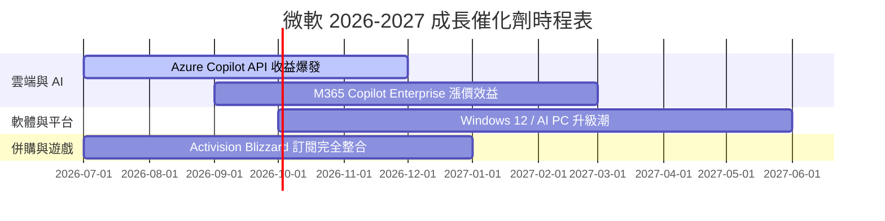

### 8.2 TAM 市場規模分析

```
╔══════════════════════════════════════════════════════════════════╗
║                   微軟潛力市場 (TAM) 擴張分析                    ║
╠══════════════════════════════════════════════════════════════════╣
║ 1. 全球雲端服務 (Cloud Infrastructure TAM)：                      ║
║    2028 年預估 $1.0T ｜ 微軟當前滲透率 ~25% ｜ 龐大增長空間       ║
║ 2. 生成式 AI & 企業級 Copilot TAM：                              ║
║    2030 年預估 $450B ｜ 微軟擁有先發優勢與 OpenAI 獨家商業合作    ║
║ 3. 企業安全與合規 (Cybersecurity TAM)：                          ║
║    2027 年預估 $250B ｜ Microsoft Security 年營收已突破 $20B+    ║
╚══════════════════════════════════════════════════════════════════╝
```

### 8.3 成長驅動力結構圖

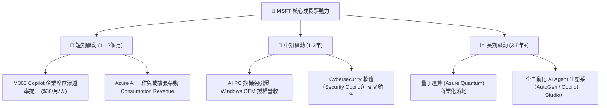

---

## 9. 風險矩陣

### 9.1 風險評分矩陣

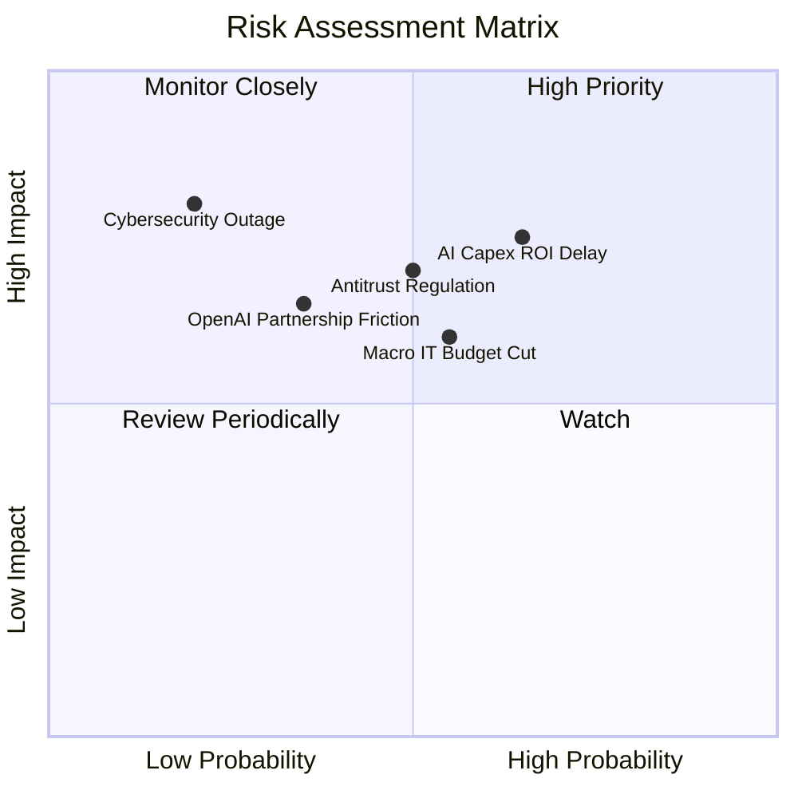

### 9.2 風險清單詳細分析

| # | 風險項目 | 發生機率 | 財務衝擊 | 風險評分 | 緩解措施與觀察指標 |
|---|----------|----------|----------|----------|--------------------|
| 1 | 🔴 **AI Capex 投資報酬率遞延** | 中高 (65%) | 高 (margins 收縮) | 🔴 **7.2/10** | 密切追蹤 Azure 雲端營收 YoY 增速是否保持在 28%+；若 Capex 持續上升但 Azure 成長放緩至 20% 以下需警惕。 |
| 2 | 🟡 **全球宏觀 IT 預算壓縮** | 中度 (55%) | 中高 (-5% 營收) | 🟡 **6.0/10** | M365 的極高粘性提供防守墊；企業裁員時每席位 SaaS 營收可能微幅縮減。 |
| 3 | 🔴 **歐美反壟斷與 AI 監管** | 中度 (50%) | 高 (巨額罰款/拆分) | 🔴 **6.5/10** | 微軟積極調整與 OpenAI 的協議結構，並對第三方雲端提供者開放部分相容性。 |
| 4 | 🟡 **OpenAI 夥伴關係變數** | 中低 (35%) | 中高 (技術領先優勢減弱) | 🟡 **5.0/10** | 微軟內部研發 Phi 系列小型語言模型 (SLM)，並引入 Meta Llama、Mistral 等多元模型降低依賴。 |

---

## 10. 投資建議

### 10.1 最終綜合評級雷達圖

```
╔══════════════════════════════════════════════════════════════╗
║                  微軟 (MSFT) 綜合評級儀表板                  ║
╠══════════════════════════════════════════════════════════════╣
║ 財務健康度:  9.0/10  ▓▓▓▓▓▓▓▓▓▓▓▓▓▓▓▓▓▓░░  🟢 極佳           ║
║ 護城河優勢:  9.5/10  ▓▓▓▓▓▓▓▓▓▓▓▓▓▓▓▓▓▓▓░  🏆 頂級           ║
║ 獲利能力:    9.5/10  ▓▓▓▓▓▓▓▓▓▓▓▓▓▓▓▓▓▓▓░  🏆 頂級           ║
║ 成長前景:    8.5/10  ▓▓▓▓▓▓▓▓▓▓▓▓▓▓▓▓░░░░  🟢 強勁           ║
║ 估值吸引力:  7.5/10  ▓▓▓▓▓▓▓▓▓▓▓▓▓░░░░░░░  🟢 安全邊際十足   ║
╠══════════════════════════════════════════════════════════════╣
║ 最終投資評級： 🟢 強烈買入 (Strong Buy) ｜ 總分: 8.8 / 10   ║
╚══════════════════════════════════════════════════════════════╝
```

### 10.2 目標價與隱含報酬率

| 情境 | 機率權重 | 12個月目標價 | 當前股價 | 隱含報酬率 | 投資建議 |
|------|----------|--------------|----------|------------|----------|
| 🔴 **悲觀情境** | 15% | **$425.00** | $381.58 | +11.4% | 持有 / 防守性配置 |
| 🟡 **基準情境** | **65%** | **$556.00** | **$381.58** | **+45.7%** | **強烈買入 / 主力加碼** |
| 🟢 **樂觀情境** | 20% | **$680.00** | $381.58 | +78.2% | 積極加碼 |
| **加權預期目標價** | **100%** | **$561.15** | **$381.58** | **+47.1%** | **極高性價比** |

### 10.3 買入時機與觸發因素

```
╔══════════════════════════════════════════════════════════════════╗
║                  ✅ 買入觸發因素 Checklist                      ║
╠══════════════════════════════════════════════════════════════════╣
║  立即買入觸發條件（當前已符合）：                                 ║
║  ✅ Forward P/E 跌破 22x (目前為 19.70x，提供極高安全邊際)        ║
║  ✅ ROIC > 25% (目前高達 31.3%)                                  ║
║  ✅ TTM 營業利潤率保持在 45% 以上 (目前為 46.3%)                  ║
║                                                                  ║
║  加碼觸發條件：                                                  ║
║  ☐ Azure 季度營收 YoY 增速重新拉升至 33% 以上                    ║
║  ☐ AI Capex 增速放緩，營運現金流轉化為 FCF 爆發式成長            ║
║  ☐ 美聯儲啟動降息循環，有利於高估值/高成長科技股價值重估          ║
║                                                                  ║
║  減碼 / 停損觸發條件：                                           ║
║  ☐ 營業利潤率連續兩季收縮至 40% 以下                             ║
║  ☐ Azure 營收 YoY 成長率急遽放緩至 20% 以下                      ║
╚══════════════════════════════════════════════════════════════════╝
```

### 10.4 投資人適配度分析

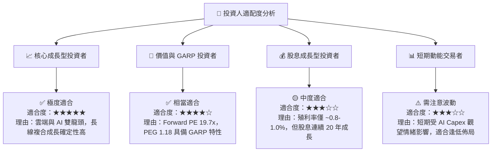

### 10.5 每季財報監控清單（Quarterly Watch List）

| 關鍵監控指標 | 樂觀門檻 (加碼) | 中性預期 (持有) | 警訊門檻 (減碼) | 當前最新數值 (Q3 FY26) |
|--------------|-----------------|-----------------|-----------------|------------------------|
| **Azure 營收 YoY 成長率** | ≥ 32% | 28% - 31% | < 25% | **~30%** (保持強勁) |
| **營業利潤率 (Op Margin)** | ≥ 47% | 44% - 46% | < 42% | **46.3%** (極佳) |
| **單季 Capex 規模** | 變現率提升且升幅趨緩 | $25B - $32B | > $35B 且營收沒跟上 | **$30.88B** |
| **M365 Commercial ARPU 成長** | ≥ 10% | 6% - 9% | < 4% | **+8.5%** |
| **FCF 轉換率 (FCF / Net Income)**| ≥ 75% | 55% - 70% | < 40% | **58.2%** (受 Capex 壓抑) |

### 10.6 反面論證：什麼會證明論點錯誤（What Would Change My Mind）

```
╔══════════════════════════════════════════════════════════════════╗
║              ⚠️ 論點失效條件（Disconfirming Evidence）           ║
╠══════════════════════════════════════════════════════════════════╣
║  本投資論點在下列可量化條件成立時應重新檢視或退場：              ║
║  ☐ 條件 1：Azure 雲端營收 YoY 成長率連續兩季跌破 22%。           ║
║  ☐ 條件 2：營業利潤率 (Op Margin) 較當前 46.3% 峰值大幅回落 > 500 bps║
║             （跌破 41.3%），顯示 AI Capex 無法轉化為高毛利利潤。 ║
║  ☐ 條件 3：ROIC 跌破 15%（相較於當前 31.3% 減半），代表資本配置失效。║
║  ☐ 條件 4：主要客戶轉向 AWS/GCP 或自研晶片/開源模型，致微軟 AI 服務║
║             市佔率出現結構性下滑。                               ║
╚══════════════════════════════════════════════════════════════════╝
```

---

> **免責聲明**：本報告由機構級 AI 研究模型根據公開歷史財務數據自動生成與計算，僅供學術研究與投資參考，不構成任何買賣建議。投資人應獨立評估市場風險並自行承擔投資結果。