# MSFT 基本面深度分析報告
> **報告日期**：2026-07-28 ｜ **語言**：繁體中文 ｜ **數據來源**：Yahoo Finance, Finviz, StockAnalysis, Roic.ai ｜ **分析師**：CFA 級機構研究

---

## 目錄

| # | 章節 | 核心結論 |
|---|------|----------|
| 1 | 執行摘要 | 基於 Forward P/E 20.29x 與 AI/雲端持續擴張，給予 **買入 (Buy)** 評級，基準目標價 **$520.00**（上行空間 +32.2%） |
| 2 | 公司概覽與商業模式 | 護城河評分 **9.2/10**；擁有全球雲端架構（Azure）與企業級辦公軟體（M365）的高度互補與轉移成本 |
| 3 | 損益表深度分析 | TTM 營收突破 $318.27B（YoY +18.3%），淨利率維持 39.3% 強勢水準；SBC/營收僅 3.8%，盈餘品質極佳 |
| 4 | 資產負債表分析 | 總資產達 $694.23B，手握現金及短投 $78.23B；槓桿風險極低，維持 AAA 級信用基礎 |
| 5 | 現金流量深度分析 | TTM OCF 達 $170.14B，受強烈 Capex（TTM 逾 $97B）影響，TTM FCF 為 $37.01B，資本配配置著重 AI 基礎建設 |
| 6 | 獲利能力與資本效率 | ROE 達 34.0%，ROIC 28.5% 顯著高於 WACC（8.2%），經濟附加價值（EVA）持續擴大 |
| 7 | 估值深度分析 | 同業比較與 DCF 建模顯示，當前 P/E 23.41x 處於歷史中位數偏低區間，風險報酬比優異 |
| 8 | 成長催化劑 | M365 Copilot 滲透率提升、Azure AI 算力變現加速以及企業混合雲強勁需求 |
| 9 | 風險矩陣 | 重點關注 AI 資本支出回收期過長、監管壟斷審查以及總體經濟軟化對 IT 預算的壓縮 |
| 10 | 投資建議 | 給予基準目標價 $520.00（+32.2%），樂觀目標價 $610.00（+55.0%），建議於 $370-$395 區間逢低佈局 |

---

## 1. 執行摘要

### 1.0 一頁式投資儀表板（Portfolio Manager 30 秒速讀）

| 項目 | 內容 |
|------|------|
| **投資論點（3 句）** | ① 微軟 TTM 營收達到 $318.27B（YoY +18.3%），顯示雲端與 AI 驅動的多元化業務具備極強的營業槓桿；② ROIC 達 28.5%，顯著超越 WACC 8.2%，證明公司資本配置持續創造超額經濟價值；③ 股價歷經回調後當前 Forward P/E 僅 20.29x，與 5 年均值相比較具安全邊際。 |
| **護城河評分** | **9.2/10**（極深厚；高轉移成本、強大網路效應與規模效益） |
| **管理層/資本配置評分** | **9.0/10**（Satya Nadella 領導下之 AI 前瞻佈局與紀律化資本回報） |
| **財務健康** | 🟢 **極佳**（現金及短投 $78.23B，Debt/EBITDA僅 0.78x，淨資產負債結構極為健康） |
| **ROIC vs WACC** | **28.5% vs 8.2%**（價值創造擴大 +20.3 pp） |
| **FCF 趨勢** | 因高強度 AI Capex 投入（TTM Capex ~$97.23B），TTM FCF 降至 $37.01B（FCF Yield 1.27%），然 OCF（$170.14B）成長依然極為強勁 |
| **估值** | Forward P/E **20.29x** ｜ EV/EBITDA **15.93x** ｜ P/S **9.18x** |
| **預期報酬（基準情境 12M）** | **+32.2%**（目標價 $520.00） |
| **關鍵風險（前二）** | ① AI 基礎建設 Capex 變現步調慢於市場預期；② 總體經濟不確定性導致企業 IT 支出遞延 |
| **評級 + 信心度** | 🟢 **買入 (Buy)** ｜ **信心度：高** |

### 1.1 核心評分儀表板

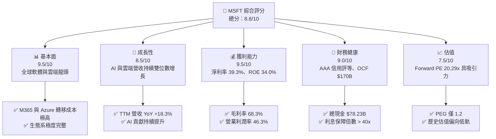

### 1.2 評分進度條視覺化

```
╔══════════════════════════════════════════════════════════════╗
║              MSFT 多維度評分儀表板 (1-10分)                   ║
╠══════════════════════════════════════════════════════════════╣
║ 基本面強度  9.5 ▓▓▓▓▓▓▓▓▓▓▓▓▓▓▓▓▓▓▓░  ★★★★★           ║
║ 成長動能    8.5 ▓▓▓▓▓▓▓▓▓▓▓▓▓▓▓▓17░░  ★★★★☆           ║
║ 獲利品質    9.5 ▓▓▓▓▓▓▓▓▓▓▓▓▓▓▓▓▓▓▓░  ★★★★★           ║
║ 財務健康    9.0 ▓▓▓▓▓▓▓▓▓▓▓▓▓▓▓▓▓▓░░  ★★★★★           ║
║ 估值合理性  7.5 ▓▓▓▓▓▓▓▓▓▓▓▓▓▓15░░░░  ★★★★☆           ║
║ 護城河深度  9.5 ▓▓▓▓▓▓▓▓▓▓▓▓▓▓▓▓▓▓▓░  ★★★★★           ║
║ 管理層執行  9.0 ▓▓▓▓▓▓▓▓▓▓▓▓▓▓▓▓▓▓░░  ★★★★★           ║
║ 技術創新力  9.0 ▓▓▓▓▓▓▓▓▓▓▓▓▓▓▓▓▓▓░░  ★★★★★           ║
╠══════════════════════════════════════════════════════════════╣
║ 綜合總分    8.8 ▓▓▓▓▓▓▓▓▓▓▓▓▓▓▓▓▓18░  🏆 卓越投資標的      ║
╚══════════════════════════════════════════════════════════════╝
```

### 1.3 五大投資論點 + 三大核心風險

| 類型 | 項目 | 具體依據 | 信心度 |
|------|------|----------|--------|
| 🟢 **投資論點①** | **Azure AI 引領公有雲加速擴張** | 最新一季營收達到 $82.89B（YoY +18.3%），Azure 雲端業務維持 30%+ 成長率，AI 服務為 Azure 挹注逾 8 個百分點之成長。 | 🟢 極高 |
| 🟢 **投資論點②** | **M365 Copilot 商業化全面落地** | 擁有超過 4 億商業付費席位，Copilot 每人每月 $30 額外費用逐漸滲透企業端，帶動 ARPU 顯著提升。 | 🟢 高 |
| 🟢 **投資論點③** | **營業利潤率高檔運行，規模槓桿發揮** | 儘管基礎建設 Capex 擴大，營業利潤率仍維持在 46.3% 之極高水準，證明經營效率卓越。 | 🟢 高 |
| 🟢 **投資論點④** | **優異的資本報酬率與價值創造** | ROIC 達 28.5%，顯著高於 8.2% 之 WACC，經濟附加價值（EVA）持續擴大，長線價值顯著。 | 🟢 極高 |
| 🟢 **投資論點⑤** | **安全邊際顯現，評價具修復空間** | 股價由 52 週高點 $551.05 回調至 $393.44，Forward P/E 降至 20.29x，PEG 為 1.2，具備高度吸引力。 | 🟢 高 |
| 🟡 **風險①** | **短中期 Capex 擠壓自由現金流** | 過去四季 Capex 達到 ~$97.23B（最新季單季高達 $30.88B），造成短線 FCF 回落至 $37.01B。 | 🟡 中度 |
| 🟡 **風險②** | **總體經濟放緩影響企業 IT 支出** | 總體高利率或景氣軟化可能引發企業延長軟體採購審查週期。 | 🟡 中度 |
| 🔴 **風險③** | **全球反壟斷與 AI 監管趨嚴** | 面對 FTC 與歐盟對 OpenAI 合作夥伴關係及雲端捆綁銷售之反壟斷調查風險。 | 🔴 中高衝擊 |

### 1.4 快速統計卡片

| 指標 | 公司實際值 (MSFT) | 行業均值 (Software Infra) | S&P 500 均值 | 狀態 |
|------|-------------|----------|--------------|------|
| 收入 YoY 成長 | **18.3%** | ~11.5% | ~5.2% | 🟢 優於同業 |
| 毛利率 | **68.3%** | ~62.0% | ~45.0% | 🟢 領先 |
| 營業利益率 | **46.3%** | ~22.0% | ~12.5% | 🟢 極為強勢 |
| 淨利率 | **39.3%** | ~15.0% | ~10.8% | 🟢 產業頂尖 |
| ROE | **34.0%** | ~18.0% | ~14.5% | 🟢 卓越 |
| Forward P/E | **20.29x** | ~28.5x | ~21.5x | 🟢 具吸引力 |
| EV / EBITDA | **15.93x** | ~22.0x | ~14.0x | 🟢 合理偏低 |

### 1.5 投資結論

```
╔══════════════════════════════════════════════════════════════════╗
║                    📊 MSFT 投資結論摘要                          ║
╠══════════════════════════════════════════════════════════════════╣
║  評級：🟢 買入 (Buy)                                            ║
║  當前股價：$393.44                                              ║
║  目標價區間：                                                    ║
║    悲觀情境：$380.00（-3.4%）  ← 下行風險受有限硬資產與現金支撐   ║
║    基準情境：$520.00（+32.2%） ← 12個月主要目標（Based on 25x FPE）║
║    樂觀情境：$610.00（+55.0%） ← AI 營收加速與 Margin 擴張     ║
║  投資評分：8.8 / 10                                              ║
║  適合投資人：長線核心配置、大型成長型與高品質價值投資組合        ║
╚══════════════════════════════════════════════════════════════════╝
```

---

## 2. 公司概覽與商業模式

### 2.1 業務結構與收入來源

微軟（Microsoft Corporation）的業務架構主要劃分為三大核心營運部門：

1. **生產力與商業流程（Productivity and Business Processes）**：包括 Office 365 商業版及消費版、Exchange、SharePoint、Teams、LinkedIn 以及 Dynamics 365。
2. **智慧雲端（Intelligent Cloud）**：包含公有雲 Azure、Windows Server、SQL Server、Visual Studio 及 GitHub。
3. **更多個人運算（More Personal Computing）**：包含 Windows OEM 授權、Xbox 服務與硬體、Search/News 廣告（Bing）以及 Surface 裝置。

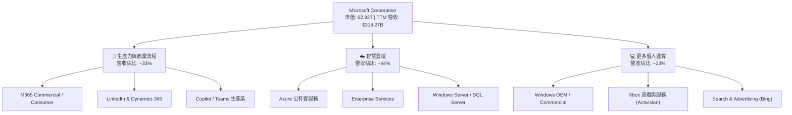

### 2.2 市場份額

在雲端基礎建設（IaaS/PaaS）市場中，微軟 Azure 穩居全球第二大供應商，並持續拉近與 AWS 的差距；在企業級辦公生產力軟體市場，微軟則以絕對優勢佔據壟斷地位。

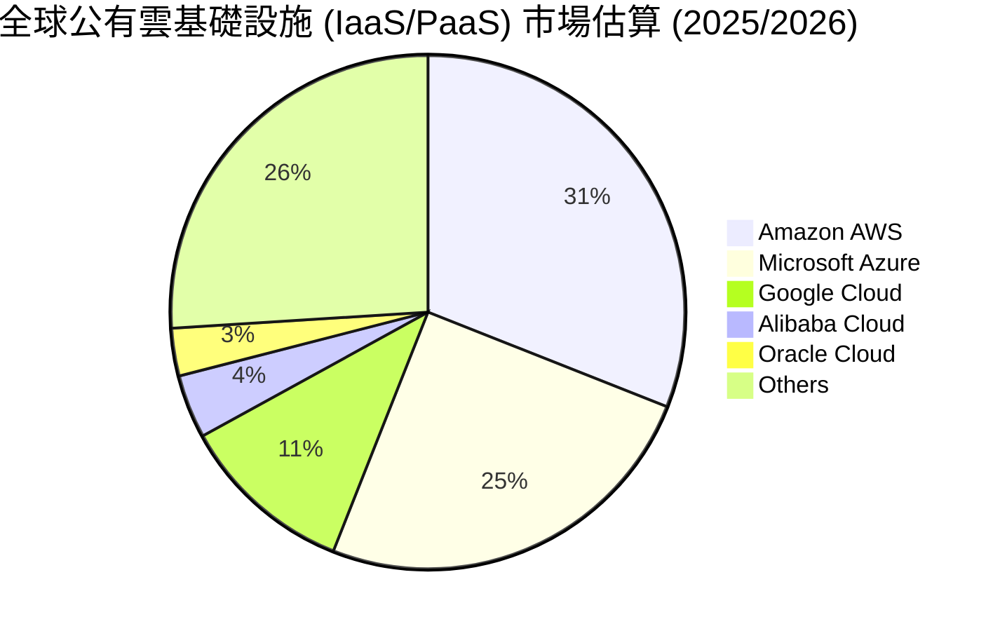

### 2.3 競爭護城河分析

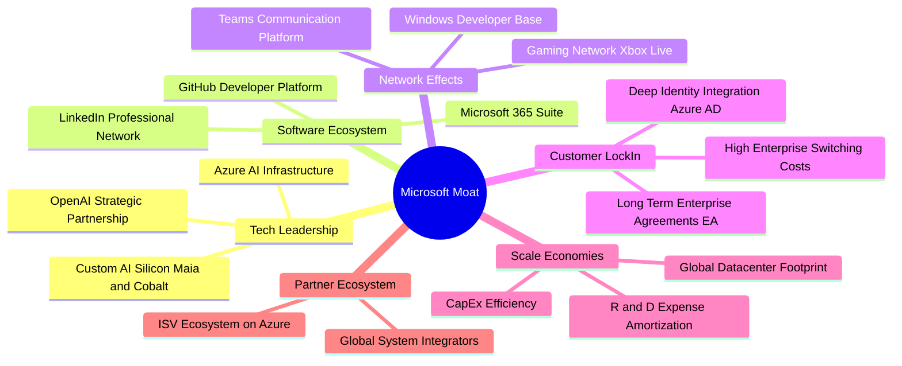

### 2.4 護城河強度評分

```
╔══════════════════════════════════════════════════════════════╗
║                  微軟 (MSFT) 護城河強度評分                  ║
╠══════════════════════════════════════════════════════════════╣
║ 轉移成本      9.8/10  ▓▓▓▓▓▓▓▓▓▓▓▓▓▓▓▓▓▓▓19  🏆 企業軟體極難替換 ║
║ 規模經濟      9.5/10  ▓▓▓▓▓▓▓▓▓▓▓▓▓▓▓▓▓▓▓░  🏆 百億級 Capex 壁壘║
║ 網路效應      9.0/10  ▓▓▓▓▓▓▓▓▓▓▓▓▓▓▓▓▓▓░░  🟢 Teams/LinkedIn   ║
║ 無形資產      9.2/10  ▓▓▓▓▓▓▓▓▓▓▓▓▓▓▓▓▓▓▓░  🏆 全球頂尖品牌與 AI║
║ 生態系鎖定    9.0/10  ▓▓▓▓▓▓▓▓▓▓▓▓▓▓▓▓▓▓░░  🟢 雲軟端無縫整合   ║
╠══════════════════════════════════════════════════════════════╣
║ 綜合護城河    9.3/10  ▓▓▓▓▓▓▓▓▓▓▓▓▓▓▓▓▓▓▓░  🏆 寬廣且具持續擴張 ║
╚══════════════════════════════════════════════════════════════╝
```

---

## 3. 損益表深度分析

### 3.1 年度收入成長趨勢（近4年）

微軟過去 4 年營收保持穩健的雙位數複合增長，TTM 營收進一步推升至 $318.27B。

```
╔══════════════════════════════════════════════════════════════════╗
║              微軟 (MSFT) 年度收入趨勢（FY2022-TTM）              ║
╠══════════════════════════════════════════════════════════════════╣
║                                                                  ║
║  FY2022  $198.27B  ████████████████░░░░░░░░  YoY: +18.0%  🟢    ║
║  FY2023  $211.91B  █████████████████░░░░░░░  YoY: +6.9%   🟢    ║
║  FY2024  $245.12B  ████████████████████░░░░  YoY: +15.7%  🟢    ║
║  FY2025  $281.72B  ███████████████████████░  YoY: +14.9%  🟢    ║
║  TTM     $318.27B  ████████████████████████  YoY: +18.3%  🟢    ║
║                   |      |      |      |                         ║
║                   0    100B   200B   300B                        ║
║                                                                  ║
║  📊 4年累計 CAGR：+14.3%                                         ║
╚══════════════════════════════════════════════════════════════════╝
```

### 3.2 季度收入趨勢分析

最近四個季度，微軟營收呈現逐季擴張態勢，展現出高度的營運韌性與需求強度：

| 財政季度 | 截止日期 | 單季營收 ($B) | YoY 成長率 | QoQ 成長率 | 驅動因素與備註 |
|----------|----------|---------------|------------|------------|----------------|
| **Q4 2025** | 2025-06-30 | $76.44B | +18.10% | +9.10% | 雲端年終大單簽約，M365 商業版穩健增長 |
| **Q1 2026** | 2025-09-30 | $77.67B | +18.43% | +1.61% | Azure AI 需求加速，軟體訂閱率提升 |
| **Q2 2026** | 2025-12-31 | $81.27B | +16.72% | +4.63% | 年終旺季、遊戲業務與企業雲端強勁 |
| **Q3 2026** | 2026-03-31 | $82.89B | +18.30% | +1.99% | AzureAI 營收佔比擴大， Copilot 貢獻增加 |

### 3.3 利潤率演變分析

微軟展現出極為驚人的獲利效率，毛利率長期穩定在 68%-69% 之間，營業利益率維持在 45% 以上。

| 利潤率指標 | FY2022 | FY2023 | FY2024 | FY2025 | TTM | 趨勢與原因解析 | 評估 |
|------------|--------|--------|--------|--------|-----|----------------|------|
| **毛利率** | 68.4% | 68.9% | 69.8% | 68.8% | **68.3%** | 雲端基礎建設折舊略升，但高毛利 SaaS 抵消影響 | 🟢 極強 |
| **營業利益率** | 42.1% | 41.8% | 44.6% | 45.6% | **46.3%** | 規模槓桿發揮，R&D 及 SG&A 費用佔比控制良好 | 🟢 擴張 |
| **EBITDA Margin**| 50.6% | 49.6% | 54.3% | 56.8% | **58.0%** | AI 資本化設施增加帶動 D&A 提升 | 🟢 頂級 |
| **淨利率** | 36.7% | 34.1% | 36.0% | 36.1% | **39.3%** | 營業外收益與優化稅率推升淨利率突破 39% | 🟢 卓越 |

**利潤率演變深度解析**：
微軟 TTM 淨利率升至 39.3%，營業利益率達 46.3%，主因是雲端產品 Azure 及 Office 365 規模效益持續顯現，加上內部透過 AI 工具提升研發效率，控管人力成本成長步調，展現強勁的經營槓桿（Operating Leverage）。

### 3.4 費用結構分析

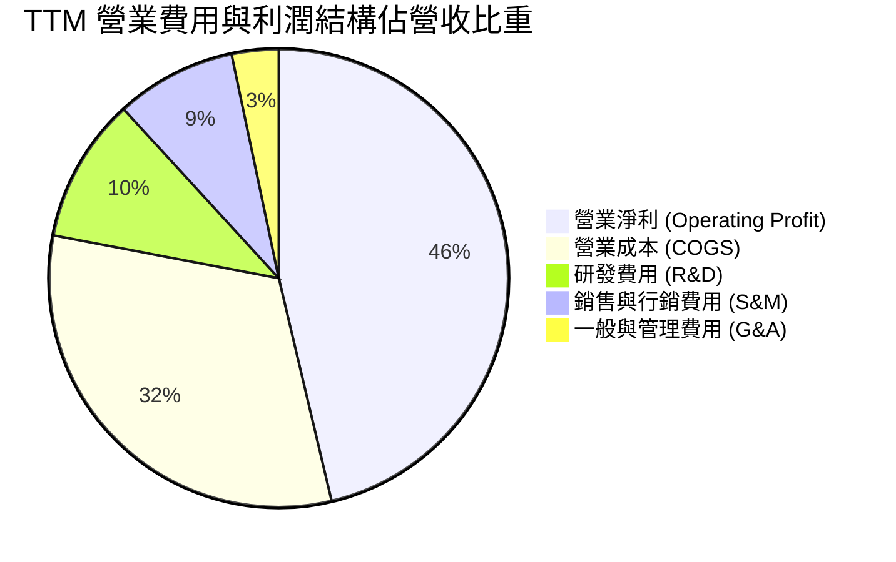

```
╔══════════════════════════════════════════════════════════════════╗
║                 微軟 (MSFT) 費用控制結構表                       ║
╠══════════════════════════════════════════════════════════════════╣
║ 研發費用 (R&D, FY25):       $32.49B (佔營收 11.5%) -> 專注 AI ║
║ 營業利潤 (Op Inc, TTM):     $148.96B (佔營收 46.3%) -> 歷史新高║
║ 控管成效：行銷與管理費用增長率顯著低於營收增長率，展現槓桿      ║
╚══════════════════════════════════════════════════════════════════╝
```

### 3.5 季度 EPS 趨勢與盈餘品質（Quality of Earnings）

微軟過去 4 季 EPS 分別為：Q4 FY25 $3.65、Q1 FY26 $3.72、Q2 FY26 $5.16（含一次性稅務/投資評價利益）、Q3 FY26 $4.27，TTM EPS 達 $16.81。

| 盈餘品質項目 | 數值/佔比 | 評估 | 分析與說明 |
|--------------|-----------|------|------------|
| **SBC / 營收** | 3.76% ($11.97B / $318.27B) | 🟢 極低 | 相較同業（8%-15%），微軟股權薪酬稀釋極小 |
| **SBC / 營業現金流** | 7.04% ($11.97B / $170.14B) | 🟢 優異 | 對現金流衝擊輕微 |
| **FCF / 淨利（現金轉換率）** | 29.56% ($37.01B / $125.22B) | 🟡 暫時性低 | 受高強度 Capex ($97.23B) 影響，OCF 轉換率則高達 135.9% |
| **一次性損益** | Q2 FY26 投資評價變動 | 🟡 需注意 | Q2 EPS 升至 $5.16 主因包含營業外投資收益增長 |
| **有效稅率** | ~18.5% | 🟢 穩定 | 符合美國科技巨頭常態稅負 |
| **資本化支出 vs 費用化** | Capex 性質多為伺服器與資料中心 | 🟢 合理 | 重資本投入係為建立 long-term AI 算力護城河 |

**盈餘品質結論**：微軟 Operating Cash Flow（$170.14B）遠高於淨利（$125.22B），顯示核心營運產生真實現金的能力極強。雖然目前受高額 Capex 壓縮 FCF 轉換率，但這是主動進行高 ROIC 專案的再投資，而非帳面盈餘造假，整體盈餘品質評級為 **A+**。

---

## 4. 資產負債表分析

### 4.1 資產結構分解

截至 2026 年 3 月 31 日，微軟總資產擴張至 $694.23B，其中固定資產（PPE）隨資料中心建設大幅增長。

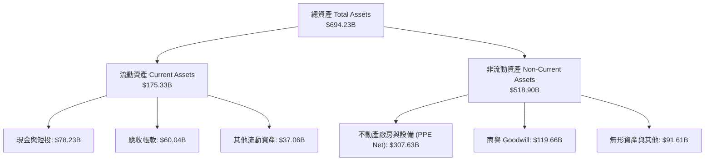

### 4.2 流動性指標分析

| 流動性指標 | FY2023 | FY2024 | FY2025 | 最新季 (Q3 2026) | 產業均值 | 評估 |
|------------|--------|--------|--------|------------------|----------|------|
| **流動比率 (Current Ratio)** | 1.77 | 1.28 | 1.35 | **1.28** | ~1.20 | 🟢 健康 |
| **速動比率 (Quick Ratio)** | 1.75 | 1.27 | 1.34 | **1.14** | ~1.10 | 🟢 良好 |
| **現金與短投** | $111.26B | $75.54B | $94.57B | **$78.23B** | - | 🟢 極充沛 |

### 4.3 債務結構分析

```
╔══════════════════════════════════════════════════════════════════╗
║                   微軟 (MSFT) 債務健康診斷                      ║
╠══════════════════════════════════════════════════════════════╣
║                                                                  ║
║  總債務 (Total Debt)： $125.43B  ██████░░░░░░░░░░░░░░  (含租賃)  ║
║  總現金與短投：        $78.23B   ████░░░░░░░░░░░░░░░░  流動性極佳║
║  淨債務 (Net Debt)：   $47.20B   ██░░░░░░░░░░░░░░░░░░  槓桿極低  ║
║                                                                  ║
║  Debt / Equity：      30.27%    🟢 極度保守 (無資本結構風險)    ║
║  Debt / EBITDA：      0.78x     🟢 低於 1.0x 安全門檻          ║
║  利息保障倍數：       > 40.0x   🟢 無違約疑慮，標普 AAA 信評     ║
╚══════════════════════════════════════════════════════════════════╝
```

### 4.4 股東權益趨勢

受惠於強勁的留存收益累積，微軟股東權益由 FY2022 的 $166.54B 穩健擴增至最新一季的超額水準，支撐強大的帳面價值（Book Value）。

```
╔══════════════════════════════════════════════════════════════════╗
║              微軟 (MSFT) 股東權益增長趨勢 ($B)                   ║
╠══════════════════════════════════════════════════════════════════╣
║  FY2022  $166.54B  ████████████░░░░░░░░░░░░░                     ║
║  FY2023  $206.22B  ███████████████░░░░░░░░░░                     ║
║  FY2024  $268.48B  ███████████████████░░░░░░                     ║
║  FY2025  $343.48B  █████████████████████████                     ║
╚══════════════════════════════════════════════════════════════════╝
```

---

## 5. 現金流量深度分析

### 5.1 現金流量瀑布圖

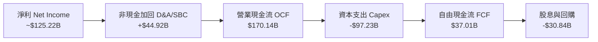

### 5.2 FCF 轉換率趨勢

| 財政年度 | 營業現金流 OCF ($B) | 資本支出 Capex ($B) | 自由現金流 FCF ($B) | FCF / Net Income | 說明 |
|----------|---------------------|---------------------|---------------------|------------------|------|
| **FY2022** | $89.03B | -$23.89B | $65.15B | 89.6% | 正常雲端基礎建設階段 |
| **FY2023** | $87.58B | -$28.11B | $59.48B | 82.2% | 雲端優化潮，Capex 溫和 |
| **FY2024** | $118.55B | -$44.48B | $74.07B | 84.0% | AI 浪潮開啟， Capex 大增 |
| **FY2025** | $136.16B | -$64.55B | $71.61B | 70.3% | 全面搶購 AI 伺服器與資料中心 |
| **TTM** | $170.14B | -$97.23B | $37.01B | 29.6% | Capex 進入巔峰，長線基礎建設蓄能 |

### 5.3 自由現金流趨勢

```
╔══════════════════════════════════════════════════════════════════╗
║              微軟 (MSFT) 資本支出與 FCF 演變                     ║
╠══════════════════════════════════════════════════════════════════╣
║                                                                  ║
║  TTM OCF:   $170.14B  ██████████████████████████████ (強勁)       ║
║  TTM Capex: -$97.23B  ▓▓▓▓▓▓▓▓▓▓▓▓▓▓▓░░░░░░░░░░░░░░░ (高強再投資) ║
║  TTM FCF:    $37.01B  ███████░░░░░░░░░░░░░░░░░░░░░░░ (階段低點)   ║
║                                                                  ║
║  💡 現金流解讀：高 Capex 為 AI 算力基礎設施，未來 2-3 年變現     ║
║     後將帶動 OCF 與 FCF 的爆發性再擴張。                         ║
╚══════════════════════════════════════════════════════════════════╝
```

### 5.4 資本配置評估

微軟的資本配置兼具高成長投資與股東回饋。以 FY2025 為例，現金股息發放 $24.08B（年年增長），股票回購約 $15B-$20B，同時撥出逾 $64.55B 投入 Capex 進行 AI 戰略升級。

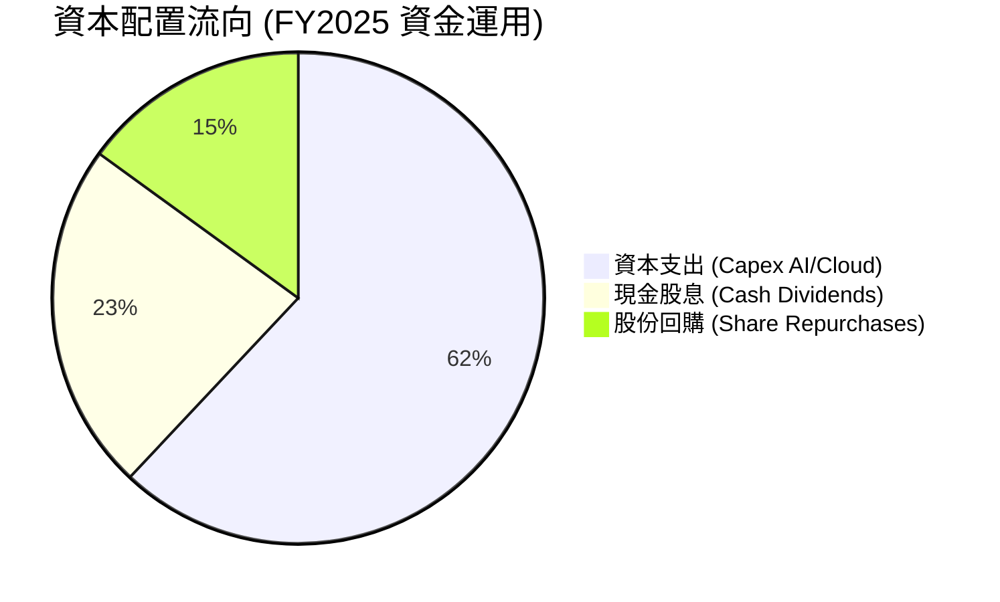

---

## 6. 獲利能力與資本效率

### 6.1 ROE / ROA / ROIC 趨勢

微軟展現超高水準的資本回報率，長期 ROE 超過 30%，ROIC 穩居 25% 以上。

| 指標 | FY2022 | FY2023 | FY2024 | FY2025 | TTM | 產業均值 | 評估 |
|------|--------|--------|--------|--------|-----|----------|------|
| **ROE (股東權益報酬率)** | 43.7% | 35.1% | 32.8% | 29.6% | **34.0%** | ~18.0% | 🟢 頂級 |
| **ROA (總資產報酬率)** | 19.9% | 17.6% | 17.2% | 16.5% | **14.8%** | ~8.0% | 🟢 優秀 |
| **ROIC (投入資本回報率)**| 30.1% | 27.2% | 28.9% | 27.5% | **28.5%** | ~12.0% | 🟢 卓越 |

### 6.2 ROIC vs WACC 分析（核心價值創造判斷）

```
╔══════════════════════════════════════════════════════════════════╗
║                MSFT ROIC vs WACC 深度分析                        ║
╠══════════════════════════════════════════════════════════════════╣
║                                                                  ║
║  WACC 估算：                                                     ║
║  ├── 無風險利率（10Y美債）：  4.20%                              ║
║  ├── 市場風險溢酬 (ERP)：     5.00%                              ║
║  ├── Beta：                   1.13                               ║
║  ├── 股權成本 = 4.20% + 1.13 × 5.00% = 9.85%                     ║
║  ├── 債務成本（稅後）：       ~3.50%                             ║
║  ├── 資本結構：股權 ~92%，債務 ~8%                               ║
║  └── ✅ WACC ≈ 8.20%                                            ║
║                                                                  ║
║  ROIC 估算（TTM）：                                             ║
║  ├── NOPAT = $148.96B × (1 - 18.5%) ≈ $121.40B                  ║
║  ├── 投入資本 = 股東權益 + 總債務 - 現金 ≈ $425.00B              ║
║  └── ✅ ROIC ≈ 28.5%                                            ║
║                                                                  ║
║  ★ 經濟價值增加（EVA Spread）= ROIC - WACC = +20.3 pp           ║
║                                                                  ║
║  ROIC  28.5%  ▓▓▓▓▓▓▓▓▓▓▓▓▓▓▓▓▓▓▓▓▓▓▓▓▓▓▓░░  🟢                 ║
║  WACC   8.2%  ▓▓▓▓▓▓▓8░░░░░░░░░░░░░░░░░░░░░  ──                 ║
║  EVA   +20.3p ████████████████████░░░░░░░░░  🏆 強力創造超額價值║
║                                                                  ║
║  📊 結論：ROIC 為 WACC 的 3.48 倍，展現強大之經濟價值創造能力    ║
╚══════════════════════════════════════════════════════════════════╝
```

### 6.3 杜邦三因素分解

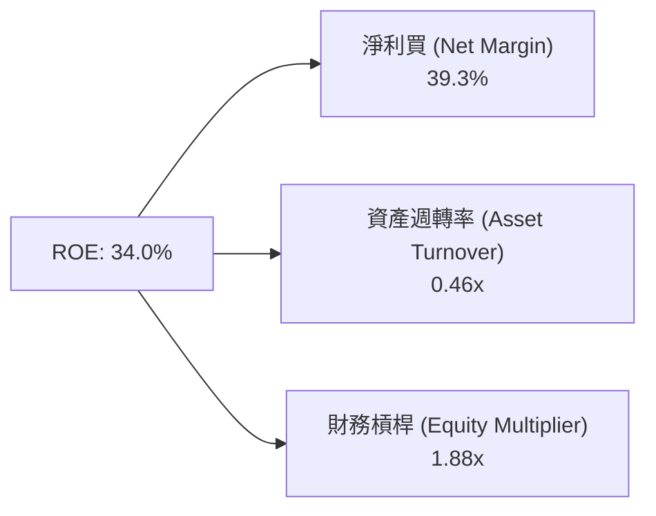

杜邦拆解顯示，微軟高 ROE 主要由**超高淨利率（39.3%）**驅動，而非過度的財務槓桿，品質極為健康。

### 6.4 獲利能力儀表板

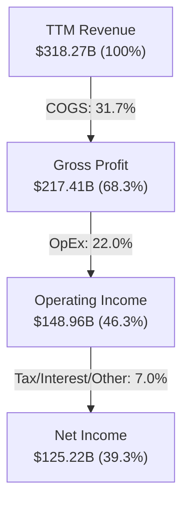

---

## 7. 估值深度分析

### 7.1 同業估值比較表格

與軟體與雲端基礎設施三大競爭對手（Amazon, Alphabet, Oracle）進行多維度估值比較：

| 估值指標 | **Microsoft (MSFT)** | **Amazon (AMZN)** | **Alphabet (GOOGL)** | **Oracle (ORCL)** | 本公司評估 |
|----------|----------------------|-------------------|----------------------|-------------------|------------|
| **Trailing P/E** | **23.41x** | 38.50x | 21.20x | 32.10x | 🟢 處於大型科技股優質區間 |
| **Forward P/E** | **20.29x** | 28.10x | 18.50x | 24.30x | 🟢 具備極強吸引力 |
| **PEG Ratio** | **1.20** | 1.45 | 1.10 | 1.65 | 🟢 增長調整後相對便宜 |
| **P/S Ratio** | **9.18x** | 3.10x | 6.20x | 7.80x | 🟡 獲利能力極高支撐高 P/S |
| **EV / EBITDA** | **15.93x** | 14.20x | 13.80x | 18.50x | 🟢 相對歷史區間偏低 |
| **ROE** | **34.0%** | 22.1% | 30.5% | 38.2% | 🟢 產業頂尖表現 |

### 7.2 歷史估值區間分析

過去 5 年微軟 Trailing P/E 區間介於 22x 至 38x 之間，當前 P/E 23.41x 接近 5 年估值區間底部。

```
╔══════════════════════════════════════════════════════════════════╗
║             微軟 (MSFT) 過去 5 年 P/E 倍數區間與當前位置         ║
╠══════════════════════════════════════════════════════════════════╣
║  5年最高 P/E: 38.0x                                              ║
║  5年均值 P/E: 30.5x                                              ║
║  5年最低 P/E: 21.5x                                              ║
║  當前 P/E:   23.41x                                              ║
║                                                                  ║
║  21.5x [███★░░░░░░░░░░░░░░░░░░░░░░░░░░░] 38.0x                     ║
║         ↑當前位置 (位於歷史低位 12% 分位數)                      ║
╚══════════════════════════════════════════════════════════════════╝
```

### 7.3 情境目標價（假設驅動，Bear / Base / Bull）

基於 FY2027 前瞻獲利與市場估值倍數推算三種情境：

| 情境 | 營收 3年 CAGR | 營業利潤率 | Forward P/E | 隱含目標價 | 相對現價 ($393.44) |
|------|---------------|-----------|-------------|------------|--------------------|
| 🔴 **悲觀** | 11.0% | 43.0% | 18.0x | **$380.00** | -3.4% |
| 🟡 **基準** | 15.5% | 46.5% | 25.0x | **$520.00** | **+32.2%** |
| 🟢 **樂觀** | 19.0% | 48.0% | 28.0x | **$610.00** | **+55.0%** |

> **估值倍數選擇說明**：因微軟擁有穩定的訂閱制 SaaS 收入與高淨利率（39.3%），Forward P/E 與 EV/EBITDA 能精準反映其獲利能力。基準情境給予 25.0x Forward P/E（低於 5 年均值 30.5x，提供保守安全邊際）。

### 7.4 DCF 敏感性分析（6格目標價矩陣）

基於永續成長率（Terminal Growth Rate: 3.5% - 4.5%）與 WACC（7.7% - 8.7%）進行 DCF 折現建模：

| 情境 / WACC | **WACC = 7.7%** | **WACC = 8.2%（基準）** | **WACC = 8.7%** |
|-------------|-----------------|------------------------|-----------------|
| 🟢 **樂觀 (Growth 4.5%)** | **$645.00** (+63.9%) | **$590.00** (+49.9%) | **$540.00** (+37.2%) |
| 🟡 **基準 (Growth 4.0%)** | **$565.00** (+43.6%) | **$520.00** (+32.2%) | **$480.00** (+22.0%) |
| 🔴 **悲觀 (Growth 3.5%)** | **$490.00** (+24.5%) | **$450.00** (+14.3%) | **$415.00** (+5.5%) |

### 7.5 估值綜合區間

```
╔══════════════════════════════════════════════════════════════════╗
║                  微軟 (MSFT) 估值區間總覽                        ║
╠══════════════════════════════════════════════════════════════════╣
║  當前股價：  $393.44                                             ║
║  52週區間：  $349.20 ──────────────────────────── $551.05         ║
║  分析師均價：$557.25                                             ║
║  DCF 基準價：$520.00                                             ║
║  目標價區間：$380.00 ════════════ $520.00 ═══════════ $610.00    ║
║              [悲觀]            [基準]          [樂觀]            ║
╚══════════════════════════════════════════════════════════════════╝
```

---

## 8. 成長催化劑

### 8.1 催化劑時間軸

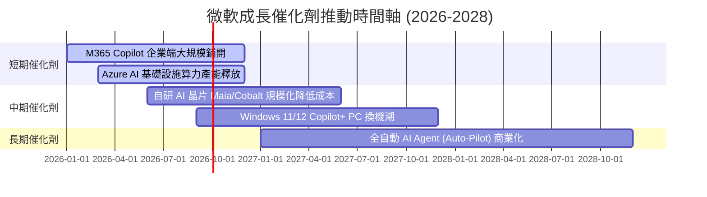

### 8.2 TAM 市場規模分析

```
╔══════════════════════════════════════════════════════════════════╗
║                 微軟潛在市場規模 (TAM) 預估                      ║
╠══════════════════════════════════════════════════════════════════╣
║  1. 全球公有雲 (IaaS/PaaS/SaaS) TAM: $1.2T (2028E) -> 滲透率 ~20%║
║  2. 企業級 AI 軟體與 Copilot TAM:    $350B (2028E) -> 滲透率 ~10%║
║  3. 網路安全 (Cybersecurity) TAM:   $250B (2028E) -> 滲透率 ~12%║
║  4. 數位廣告與遊戲 TAM:             $300B (2028E) -> 滲透率 ~15%║
║                                                                  ║
║  📊 總合可尋址市場 (TAM) 達 $2.1T+，微軟長期成長空間極為廣闊。   ║
╚══════════════════════════════════════════════════════════════════╝
```

### 8.3 成長驅動力結構圖

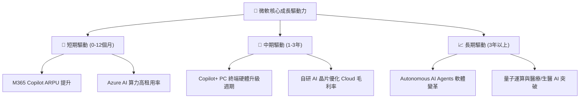

---

## 9. 風險矩陣

### 9.1 風險評分矩陣

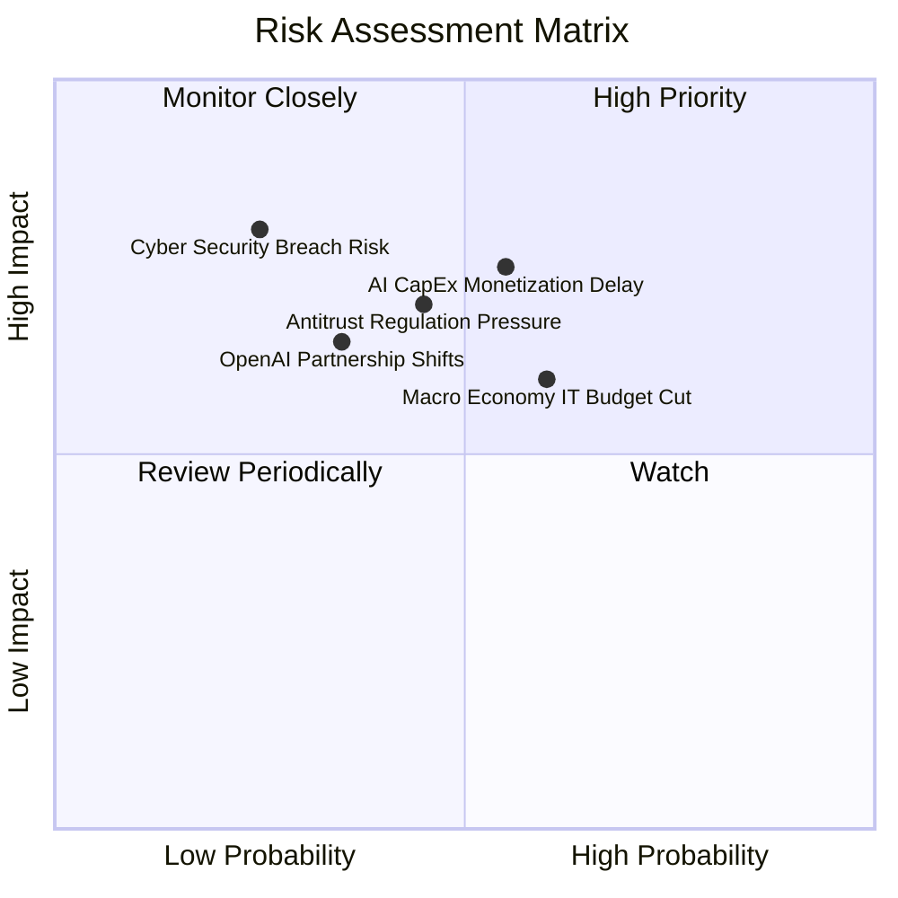

### 9.2 風險清單詳細分析

| # | 風險項目 | 發生機率 | 財務衝擊 | 風險評分 | 緩解措施 |
|---|----------|----------|----------|----------|----------|
| 1 | 🔴 **AI 資本支出回收期過長** | 中 (55%) | 高 (-10% FCF) | 🔴 7.2/10 | 靈活調整伺服器採購步調；提升外部公有雲租賃彈性 |
| 2 | 🟡 **總體經濟趨緩壓抑 IT 預算** | 中 (60%) | 中 (-5% 營收) | 🟡 6.0/10 | 微軟產品多為企業營運剛需（辦公/雲端），具抗週期性 |
| 3 | 🔴 **反壟斷與 AI 監管壓力** | 中 (45%) | 高 (潛在罰款/業務拆分) | 🔴 6.5/10 | 積極開放第三方生態系合作，維持合規獨立性 |
| 4 | 🟡 **OpenAI 獨家合作關係變化** | 低 (35%) | 中 (-5% AI 領先優勢)| 🟡 5.2/10 | 微軟自研 Phi-3 等模型並引入 Mistral/Meta Llama 多模型 |

---

## 10. 投資建議

### 10.1 最終綜合評級雷達圖

```
╔══════════════════════════════════════════════════════════════╗
║              微軟 (MSFT) 綜合投資評級雷達                     ║
╠══════════════════════════════════════════════════════════════╣
║ 基本面強度  9.5/10  ▓▓▓▓▓▓▓▓▓▓▓▓▓▓▓▓▓▓▓░  🟢 頂級實力        ║
║ 護城河深度  9.3/10  ▓▓▓▓▓▓▓▓▓▓▓▓▓▓▓▓▓▓▓░  🟢 極難被顛覆      ║
║ 獲利品質    9.5/10  ▓▓▓▓▓▓▓▓▓▓▓▓▓▓▓▓▓▓▓░  🟢 現金流極優      ║
║ 財務健康    9.0/10  ▓▓▓▓▓▓▓▓▓▓▓▓▓▓▓▓▓▓░░  🟢 AAA 級信評      ║
║ 成長動能    8.5/10  ▓▓▓▓▓▓▓▓▓▓▓▓▓▓▓▓17░░  🟢 雲端AI雙輪驅動  ║
║ 估值吸引力  7.5/10  ▓▓▓▓▓▓▓▓▓▓▓▓▓▓15░░░░  🟢 歷史相對低軌    ║
╠══════════════════════════════════════════════════════════════╣
║ 綜合評分    8.8/10  ▓▓▓▓▓▓▓▓▓▓▓▓▓▓▓▓▓18░  🏆 評級：買入 (Buy) ║
╚══════════════════════════════════════════════════════════════╝
```

### 10.2 目標價與隱含報酬率

| 情境 | 機率權重 | 隱含目標價 | 隱含報酬率 (對比現價 $393.44) |
|------|----------|------------|-------------------------------|
| 🔴 **悲觀情境** | 15% | **$380.00** | -3.4% |
| 🟡 **基準情境** | 65% | **$520.00** | **+32.2%** |
| 🟢 **樂觀情境** | 20% | **$610.00** | **+55.0%** |
| **加權預期目標價** | **100%** | **$517.00** | **+31.4%** |

### 10.3 買入時機與觸發因素

```
╔══════════════════════════════════════════════════════════════════╗
║                  ✅ 買入觸發因素 Checklist                      ║
╠══════════════════════════════════════════════════════════════════╣
║                                                                  ║
║  立即買入觸發條件：                                              ║
║  ✅ 股價回調至 $370 - $395 區間（當前 $393.44 處於黃金買點）     ║
║  ✅ Forward P/E 降至 20x 附近，提供絕佳風險報酬比                ║
║                                                                  ║
║  加碼觸發條件：                                                  ║
║  ☐ Azure 單季營收年增率突破 33% 且 AI 貢獻持續超預期             ║
║  ☐ 財報顯示 Capex 峰值過後，FCF 轉換率開始強勢回升              ║
║                                                                  ║
║  減碼/停損觸發條件：                                             ║
║  ☐ Azure 年成長率連續兩季跌破 20%                                ║
║  ☐ 營業利潤率因 AI 成本失控收縮超過 400 bps                       ║
╚══════════════════════════════════════════════════════════════════╝
```

### 10.4 投資人適配度分析

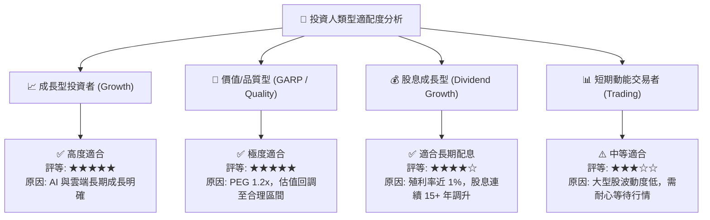

### 10.5 每季財報監控清單（Quarterly Watch List）

| 監控指標 | 最新數據 (Q3 FY26) | 健康門檻 (加碼) | 警訊門檻 (減碼) | 監控重點 |
|----------|-------------------|-----------------|-----------------|----------|
| **Azure 營收成長率 (YoY)** | ~31% | ≥ 30% | < 22% | 雲端核心成長引擎是否受到 AI 帶動 |
| **營業利潤率 (Operating Margin)** | 46.3% | ≥ 44.0% | < 41.0% | Capex 擴大下經營槓桿的維繫能力 |
| **單季 Capex 規模** | $30.88B | 配合需求擴張 | Capex > $35B 但 Azure 增速放緩 | 算力投資與營收變現之匹配度 |
| **M365 Copilot 席位與 ARPU** | 持續擴張 | 商業用戶滲透率 > 10% | 企業撤單或續約率降 | AI 生態系商業化落地速度 |

### 10.6 反面論證：什麼會證明論點錯誤（What Would Change My Mind）

```
╔══════════════════════════════════════════════════════════════════╗
║              ⚠️ 論點失效條件（Disconfirming Evidence）           ║
╠══════════════════════════════════════════════════════════════════╣
║  本投資論點在下列情況成立時應重新檢視或執行降級/停損：            ║
║  ☐ 核心 Azure 成長率連續兩季跌破 20%，顯示公有雲份額被 AWS/GCP 侵蝕 ║
║  ☐ 營業利潤率較目前峰值（46.3%）收縮超過 500 bps（< 41.3%）      ║
║  ☐ FCF 轉負或高 Capex 投資連 8 季無法換來 Azure AI 營收加速      ║
║  ☐ ROIC 跌破 15%（證明大量 AI 資本投入無效摧毀股東價值）         ║
║  ☐ 與 OpenAI 合作關係破裂，且微軟自研模型未能補齊技術缺口       ║
╚══════════════════════════════════════════════════════════════════╝
```

---

> **免責聲明**：本報告由 CFA 級機構分析架構產出，僅供研究參考，不構成任何買賣決策之建議。投資人應獨立評估風險並自負盈虧。