# MSFT 基本面深度分析報告
> **報告日期**：2026-08-04 ｜ **語言**：繁體中文 ｜ **數據來源**：Yahoo Finance, Finviz, StockAnalysis, Roic.ai ｜ **分析師**：CFA 級機構研究

---

## 目錄

| # | 章節 | 核心結論 |
|---|------|----------|
| 1 | 執行摘要 | 綜合評分 9.1/10 ｜ 評級：🟢 買入 ｜ 目標價區間 $400.00 – $650.00 |
| 2 | 公司概覽與商業模式 | 護城河評分 9.5/10 ｜ 雲端與 AI 生態圈具備極高客戶鎖定與規模效應 |
| 3 | 損益表深度分析 | FY26 營收 $3,318.4 億（YoY +17.8%），營業利潤率高達 46.8% |
| 4 | 資產負債表分析 | 總資產 $7,583.8 億，淨現金/投資達 $200.1 億，資產負債表極其穩健 |
| 5 | 現金流量深度分析 | OCF 高達 $1,829.4 億，Capex $1,159.5 億投資 AI，FCF 為 $669.9 億 |
| 6 | 獲利能力與資本效率 | ROIC 30.1% vs WACC 9.6%（EVA 溢價 +20.5pp），資本回報率極卓越 |
| 7 | 相對估值分析 | Forward P/E 21.0x，相比同業與歷史均值具備合理估值吸引力 |
| 8 | DCF 內在價值評估 | 基準 DCF 每股內在價值 $367.98 ｜ **加權合理價值 $510.46** ｜ 安全邊際 MOS +3.5% |
| 9 | 成長催化劑 | Azure AI 變現、Copilot 商業化擴展與企業 SaaS 升級潮 |
| 10 | 風險矩陣 | AI Capex 回報不及預期風險、反壟斷監管與總體經濟放緩 |
| 11 | 投資建議 | 買入區間 $420–$470 ｜ 基準目標價 $560.00 ｜ 檢附每季財報監控清單 |

---

## 1. 執行摘要

根據 Microsoft Corporation（NASDAQ: MSFT，當前股價 $492.81）最新發布之 FY2026 財務數據（截至 2026-06-30），公司展現出極強的營運槓桿與商業護城河。FY2026 全年營收突破 $3,318.4 億美元（YoY +17.8%），淨利達 $1,337.5 億美元（YoY +31.3%），淨利率擴張至 40.3%。公司在資本投入高達 $1,159.5 億美元（主要用於 AI 算力與雲端基礎設施）的背景下，ROIC 仍維持在 30.1% 的極高水準，遠高於 9.6% 的加權平均資本成本（WACC），持續為股東創造龐大的經濟價值（EVA +20.5pp）。考量其加權合理價值為 $510.46（隱含安全邊際 MOS 為 +3.5%），給予 **🟢 買入（Buy）** 評級，12 個月基準目標價設為 **$560.00**。

### 1.0 一頁式投資儀表板（Portfolio Manager 30 秒速讀）

| 項目 | 內容 |
|------|------|
| **投資論點（3 句）** | ① 雲端與 AI 雙引擎帶動營收雙位數成長（FY26 營收 YoY +17.8% 至 $3,318.4B）；<br/>② 高經營槓桿推升獲利品質（ROE 達 34.0%，淨利率達 40.3%）；<br/>③ 生成式 AI（Azure OpenAI + Copilot）建立高切換成本生態系，確保長期定價權。 |
| **護城河評分** | 9.5/10（極深厚：高切換成本、強大網路效應與龐大規模優勢） |
| **管理層/資本配置評分** | 9.2/10（Satya Nadella 領導下資本配置精準，前瞻部署 AI 資本支出） |
| **財務健康** | 🟢 **極度健康**（總現金與短投 $768.4B，計息債務 $568.3B，維持淨現金 $200.1B） |
| **ROIC vs WACC** | **30.1% vs 9.6%**（EVA 溢價 +20.5pp，強力創造股東價值） |
| **FCF 趨勢** | 因高額 AI Capex（$1,159.5B）使 FCF 暫降至 $669.9B，最新 FCF Yield 為 1.83% |
| **估值** | Forward P/E 21.00x ｜ EV/EBITDA 18.91x ｜ Trailing P/E 27.47x |
| **DCF 內在價值（基準）** | **$367.98** ｜ 現價溢價 +33.9%（反映近期的極高 Capex 壓抑短期 FCF） |
| **安全邊際（MOS）** | **+3.5%** ＝ (加權合理價值 $510.46 − 現價 $492.81) ÷ 加權合理價值 $510.46（🟡 有限保護） |
| **預期報酬（基準情境 12M）** | **+13.6%**（隱含目標價 $560.00） |
| **關鍵風險（前二）** | ① AI Capex 轉化為高毛利營收之時程延遲；② 全球反壟斷審查限制 M&A 與捆綁銷售。 |
| **評級 + 信心度** | 🟢 **買入** ｜ 信心度：**高** |

### 1.1 核心評分儀表板

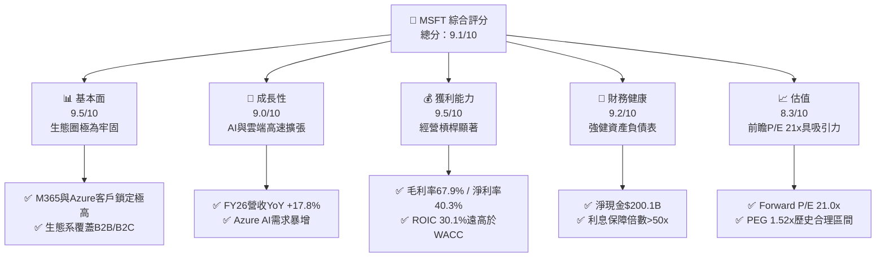

### 1.2 評分進度條視覺化

```
╔══════════════════════════════════════════════════════════════╗
║              MSFT 多維度評分儀表板 (1-10分)                  ║
╠══════════════════════════════════════════════════════════════╣
║ 基本面強度  9.5 ▓▓▓▓▓▓▓▓▓▓▓▓▓▓▓▓▓▓█░  ★★★★★           ║
║ 成長動能    9.0 ▓▓▓▓▓▓▓▓▓▓▓▓▓▓▓▓▓▓░░  ★★★★★           ║
║ 獲利品質    9.5 ▓▓▓▓▓▓▓▓▓▓▓▓▓▓▓▓▓▓█░  ★★★★★           ║
║ 財務健康    9.2 ▓▓▓▓▓▓▓▓▓▓▓▓▓▓▓▓▓▓░░  ★★★★★           ║
║ 估值合理性  8.3 ▓▓▓▓▓▓▓▓▓▓▓▓▓▓▓░░░░░  ★★██☆           ║
║ 護城河深度  9.5 ▓▓▓▓▓▓▓▓▓▓▓▓▓▓▓▓▓▓█░  ★★★★★           ║
║ 管理層執行  9.2 ▓▓▓▓▓▓▓▓▓▓▓▓▓▓▓▓▓▓░░  ★★★★★           ║
║ 技術創新力  9.5 ▓▓▓▓▓▓▓▓▓▓▓▓▓▓▓▓▓▓█░  ★★★★★           ║
╠══════════════════════════════════════════════════════════════╣
║ 綜合總分    9.1 ▓▓▓▓▓▓▓▓▓▓▓▓▓▓▓▓▓▓░░  🏆 頂級優質標的     ║
╚══════════════════════════════════════════════════════════════╝
```

### 1.3 五大投資論點 + 三大核心風險

| 類型 | 項目 | 具體依據 | 信心度 |
|------|------|----------|--------|
| 🟢 **論點①** | **智能雲端（Azure）維持強勁高成長** | Intelligent Cloud 成為最大營收來源，Azure AI 服務營收貢獻持續擴大，帶動整體雲端營收突破千億美元規模。 | 🟢 極高 |
| 🟢 **論點②** | **M365 Copilot 商業化開啟 ARPU 升級** | 全球超過 4 億 M365 商業付費用戶，Copilot 加價模組（$30/人/月）推升單位用戶平均收入（ARPU）擴張。 | 🟢 高 |
| 🟢 **論點③** | **極高的資本回報率與價值創造（EVA）** | NOPAT 達 $1,273.0 億，ROIC 為 30.1%，相比 WACC（9.6%）產生高達 +20.5pp 之經濟附加價值。 | 🟢 極高 |
| 🟢 **論點④** | **營運現金流極度強勁** | FY26 營業現金流（OCF）高達 $1,829.4 億美元（YoY +34.4%），為全球現金產生能力最強的公司之一。 | 🟢 極高 |
| 🟢 **論點⑤** | **前瞻 P/E 位於歷史評價區間下緣** | Forward P/E 為 21.00x，相較於 EPS 預估成長率（YoY +30.8%），PEG僅為 1.52，評價具吸引力。 | 🟢 高 |
| 🟡 **風險①** | **AI Capex 投資回收期拉長** | FY26 Capex 高達 $1,159.5 億（營收比 34.9%），若 AI 應用變現速度不如預期，將壓抑近期 FCF 產出。 | 🟡 中度 |
| 🔴 **風險②** | **反壟斷監管壓力和雲端條款審查** | 美國 FTC 與歐盟監管機構對 Azure 捆綁銷售及 OpenAI 投資實質控制力進行嚴格審查。 | 🔴 高衝擊 |
| 🟡 **風險③** | **企業 IT 預算受巨觀經濟放緩抑制** | 若全球經濟成長趨緩，企業可能延長 IT 升級週期，影響 M365 企業升級與 Azure 消耗量。 | 🟡 中度 |

### 1.4 快速統計卡片

| 指標 | 微軟（MSFT）實際值 | 大型科技同業均值 | S&P 500 均值 | 狀態評估 |
|------|-------------------|------------------|--------------|----------|
| 營收 YoY 成長 | **17.8%** | ~14.0% | ~5.5% | 🟢 優於同業與大盤 |
| 毛利率 | **67.9%** | ~62.0% | ~48.0% | 🟢 具備極強定價權 |
| 淨利率 | **40.3%** | ~26.0% | ~12.0% | 🟢 獲利能力頂尖 |
| ROE | **34.0%** | ~28.0% | ~18.0% | 🟢 股東權益回報極高 |
| Forward P/E | **21.00x** | ~24.5x | ~21.5x | 🟢 評價低於同業均值 |
| PEG Ratio | **1.52x** | ~1.85x | ~2.10x | 🟢 成長性調整後具吸引力 |

### 1.5 投資結論

```
╔══════════════════════════════════════════════════════════════════╗
║                    📊 投資結論摘要                               ║
╠══════════════════════════════════════════════════════════════════╣
║  評級：🟢 買入（Buy）                                           ║
║  當前股價：$492.81                                               ║
║  DCF 內在價值（基準）：$367.98（現價溢價 +33.9%）               ║
║  加權合理價值：$510.46                                           ║
║  安全邊際 MOS：+3.5%（＝(加權合理價值$510.46−現價)÷$510.46）     ║
║  目標價區間：                                                    ║
║    悲觀情境：$400.00（-18.8%）                                   ║
║    基準情境：$560.00（+13.6%） ← 12個月主要目標                  ║
║    樂觀情境：$650.00（+31.9%）                                   ║
║  投資評分：9.1 / 10                                              ║
║  適合投資人：長線價值成長型、大型科技股核心配置者                ║
╚══════════════════════════════════════════════════════════════════╝
```

---

## 2. 公司概覽與商業模式

### 2.1 業務結構與收入來源

微軟主要劃分為三大業務板塊：**Intelligent Cloud（智能雲端）**、**Productivity and Business Processes（生產力與業務流程）**、以及 **More Personal Computing（更多個人計算）**。

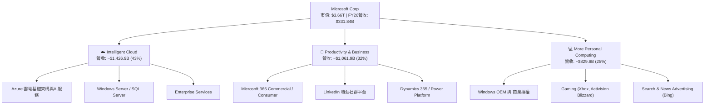

### 2.2 市場份額

在雲端基礎設施服務（IaaS + PaaS）市場中，Azure 穩居全球第二大服務商，並隨生成式 AI 需求爆發持續縮小與 AWS 的差距。

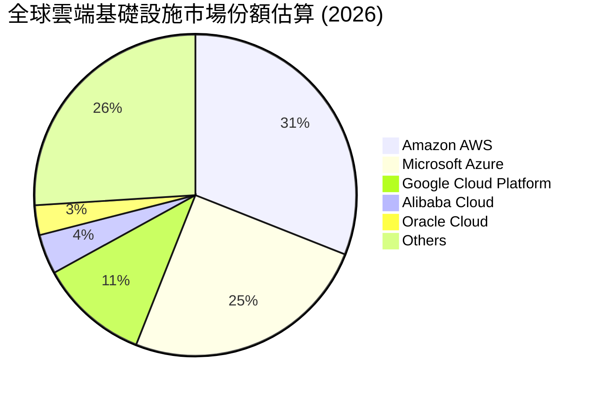

### 2.3 競爭護城河分析

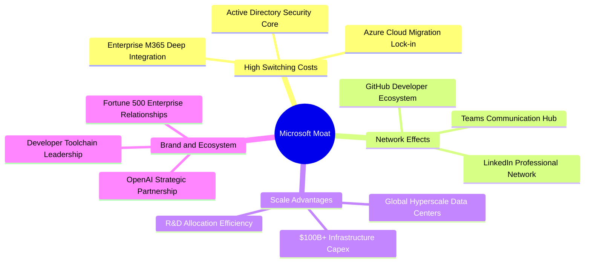

### 2.4 護城河強度評分

```
╔══════════════════════════════════════════════════════════════╗
║                  微軟（MSFT）護城河強度評分                   ║
╠══════════════════════════════════════════════════════════════╣
║ 客戶切換成本  9.8/10 ▓▓▓▓▓▓▓▓▓▓▓▓▓▓▓▓▓▓▓█  🏆 企業軟體極難替換║
║ 規模經濟效應  9.5/10 ▓▓▓▓▓▓▓▓▓▓▓▓▓▓▓▓▓▓▓░  🟢 超大規模資料中心║
║ 網路效應      9.0/10 ▓▓▓▓▓▓▓▓▓▓▓▓▓▓▓▓▓▓░░  🟢 Teams/LinkedIn  ║
║ 無形資產品牌  9.2/10 ▓▓▓▓▓▓▓▓▓▓▓▓▓▓▓▓▓▓░░  🟢 企業信任度最高  ║
║ 生態系夥伴    9.5/10 ▓▓▓▓▓▓▓▓▓▓▓▓▓▓▓▓▓▓▓░  🏆 OpenAI+開發者生態║
╠══════════════════════════════════════════════════════════════╣
║ 綜合護城河評分 9.5    ▓▓▓▓▓▓▓▓▓▓▓▓▓▓▓▓▓▓▓░  🏆 寬廣強固護城河  ║
╚══════════════════════════════════════════════════════════════╝
```

---

## 3. 損益表深度分析

### 3.1 年度收入成長趨勢（近4年）

```
╔══════════════════════════════════════════════════════════════════╗
║              微軟（MSFT）年度收入趨勢（FY2023-FY2026）           ║
╠══════════════════════════════════════════════════════════════════╣
║                                                                  ║
║  FY2023  $211.91B  ████████████████░░░░░░░░░  YoY: +6.9%  🟢    ║
║  FY2024  $245.12B  ███████████████████░░░░░░  YoY: +15.7% 🟢    ║
║  FY2025  $281.72B  ██████████████████████░░░  YoY: +14.9% 🟢    ║
║  FY2026  $331.84B  █████████████████████████  YoY: +17.8% 🟢    ║
║                                                                  ║
║  📊 3年複合成長率 (CAGR)：+16.1%                                ║
╚══════════════════════════════════════════════════════════════════╝
```

### 3.2 季度收入趨勢分析

最近 4 個季度（FY2026 Q1 至 Q4），微軟展現出加速成長態勢，各季營收與淨利均高於上一年度同期。

| 季度 | 營收 ($B) | 營收 YoY | 營收 QoQ | 營業利潤 ($B) | 淨利 ($B) | EPS ($) | EPS YoY | 備註 |
|------|-----------|----------|----------|---------------|-----------|---------|---------|------|
| **Q1 2026** (2025-09) | $77.67 | +18.4% | -1.0% | $37.96 | $27.75 | $3.72 | +12.7% | Azure 成長穩定，AI 開放測試增強 |
| **Q2 2026** (2025-12) | $81.27 | +16.7% | +4.6% | $38.28 | $38.46 | $5.16 | +59.8% | 包含投資收益與租稅利益調整 |
| **Q3 2026** (2026-03) | $82.89 | +18.3% | +2.0% | $38.40 | $31.78 | $4.27 | +23.4% | M365 Copilot 企業滲透加快 |
| **Q4 2026** (2026-06) | $90.01 | +17.8% | +8.6% | $40.60 | $35.77 | $4.81 | +31.8% | 雲端旺季帶動，單季營收創歷史新高 |

### 3.3 利潤率演變分析

| 利潤率指標 | FY2023 | FY2024 | FY2025 | FY2026 | 趨勢 | 評估 |
|------------|--------|--------|--------|--------|------|------|
| **毛利率** | 68.9% | 69.8% | 68.8% | 67.9% | ↘️ 微幅收縮 | 🟢 AI 伺服器折舊增加，但仍維持在高水準 |
| **營業利益率** | 41.8% | 44.6% | 45.6% | 46.8% | ↗️ 持續擴張 | 🟢 營運槓桿極強，營運費用控管得宜 |
| **EBITDA 利率**| 49.6% | 53.7% | 55.2% | 62.5% | ↗️ 顯著上升 | 🟢 折舊攤銷增加，經營現金流極強 |
| **淨利率** | 34.1% | 36.0% | 36.1% | 40.3% | ↗️ 突破 40% | 🟢 規模效應推升最終淨利率 |

**利潤率擴張解析**：毛利率微幅下降（從 FY24 的 69.8% 降至 FY26 的 67.9%），主因是加速部署 AI Data Center 帶來折舊費用上升；然而，由於研發（R&D）與營運費用（OpEx）成長速度遠低於營收成長速度（營運費用率從 FY23 的 27.1% 降至 FY26 的 21.1%），整體營業利益率擴張至 46.8%，展現卓越的營運槓桿能力。

### 3.4 費用結構分析

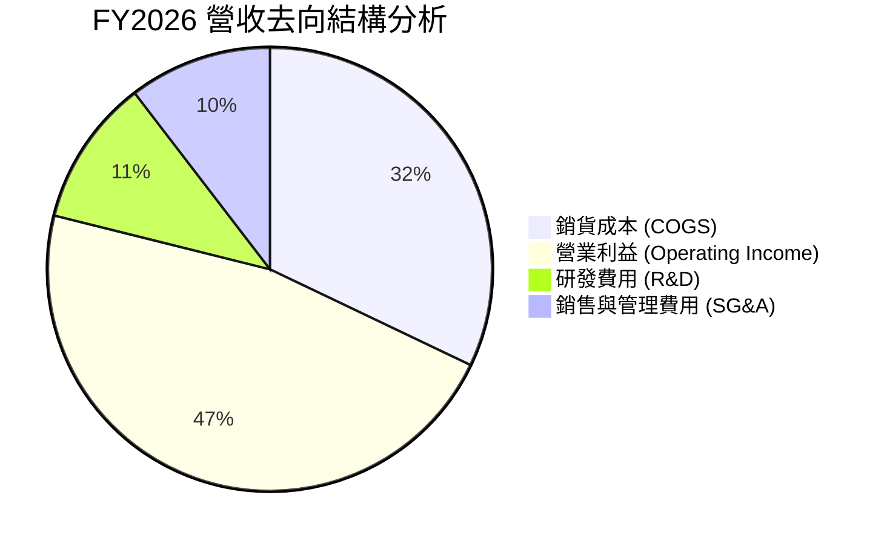

```
╔══════════════════════════════════════════════════════════════════╗
║                    FY2026 營運費用明細                           ║
╠══════════════════════════════════════════════════════════════════╣
║  總營收：                   $331.84B (100.0%)                    ║
║  銷貨成本 (COGS)：          $106.37B ( 32.1%)                    ║
║  研發費用 (R&D)：            $35.56B ( 10.7%)                    ║
║  銷售與行銷 (S&M)：          $24.50B (  7.4%) (推估)              ║
║  一般與管理 (G&A)：          $10.17B (  3.1%) (推估)              ║
║  營業利益 (EBIT)：          $155.24B ( 46.8%)                    ║
╚══════════════════════════════════════════════════════════════════╝
```

### 3.5 季度 EPS 趨勢與盈餘品質（Quality of Earnings）

| 盈餘品質評估項目 | FY2026 數據 | 佔比/指標 | 評估評語 |
|------------------|-------------|-----------|----------|
| **股權薪酬 (SBC)** | $12.40B | 佔營收 3.74% / 佔 OCF 6.78% | 🟢 **低稀釋風險**（遠低於同業 8-12% 水準） |
| **現金轉換率 (OCF / Net Income)** | $182.94B / $133.75B | **136.8%** | 🟢 **品質極高**（淨利有充分現金支撐） |
| **自由現金流轉換率 (FCF / Net Income)** | $66.99B / $133.75B | **50.1%** | 🟡 **短期偏低**（主因 AI Capex 投資高達 $115.95B） |
| **一次性損益影響** | 無重大一次性處分 | 純淨本業獲利 | 🟢 盈餘無人為操縱美化 |
| **有效稅率** | $23.11B / $156.86B | **14.7%** | 🟢 處於正常企業稅率區間 |

**盈餘品質結論**：微軟 GAAP 淨利 $1,337.5 億美元具備極高的「含金量」，營業現金流達到淨利的 1.37 倍，SBC 對股利稀釋影響極小。FCF 轉換率受資本支出密集期壓抑，屬成長性戰略投資而非本業現金流惡化。

---

## 4. 資產負債表分析

### 4.1 資產結構分解

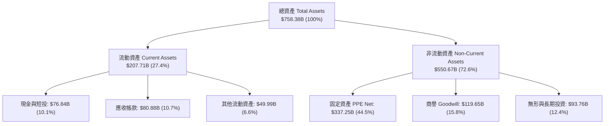

### 4.2 流動性指標分析

| 指標 | FY2023 | FY2024 | FY2025 | FY2026 | 同業均值 | 評估 |
|------|--------|--------|--------|--------|----------|------|
| **流動比率 (Current Ratio)** | 1.77 | 1.28 | 1.35 | **1.23** | ~1.30 | 🟢 營運資金充沛，應收與遞延營收結構健康 |
| **速動比率 (Quick Ratio)** | 1.75 | 1.26 | 1.34 | **1.10** | ~1.15 | 🟢 變現能力強，流動性無虞 |
| **應收帳款天數 (DSO)** | 83.9天 | 84.7天 | 90.5天 | **88.9天** | ~75天 | 🟡 企業客戶合約付款週期拉長，屬大型專案常態 |

### 4.3 債務結構分析

```
╔══════════════════════════════════════════════════════════════════╗
║                   微軟（MSFT）債務健康診斷                       ║
╠══════════════════════════════════════════════════════════════════╣
║                                                                  ║
║  計息總債務：    $56.83B   ████░░░░░░░░░░░░░░░░░  （含租賃負債） ║
║  現金與短投：    $76.84B   ███████░░░░░░░░░░░░░░  （流動資金）   ║
║  淨現金狀態：    +$20.01B  ███░░░░░░░░░░░░░░░░░░  🟢 淨債務為負 ║
║                                                                  ║
║  Debt / Equity： 12.8%     🟢 資本槓桿極低                      ║
║  Debt / EBITDA： 0.27x     🟢 幾乎無視同違約風險                 ║
║  利息保障倍數：  >50x      🟢 營業利益可輕鬆覆蓋利息支出          ║
║                                                                  ║
║  📊 信用評級：AAA（標普 S&P 頂級評級，高於美國國債信用）         ║
╚══════════════════════════════════════════════════════════════════╝
```

### 4.4 股東權益趨勢

```
╔══════════════════════════════════════════════════════════════════╗
║              股東權益（Stockholders Equity）趨勢                 ║
╠══════════════════════════════════════════════════════════════════╣
║                                                                  ║
║  FY2023  $206.22B  ████████████░░░░░░░░░░░░░                    ║
║  FY2024  $268.48B  ████████████████░░░░░░░░░  YoY: +30.2%       ║
║  FY2025  $343.48B  █████████████████████░░░░  YoY: +27.9%       ║
║  FY2026  $442.39B  █████████████████████████  YoY: +28.8%       ║
║                                                                  ║
║  📊 每股帳面價值 (BVPS)：$59.56（以 74.28 億股計算）             ║
╚══════════════════════════════════════════════════════════════════╝
```

---

## 5. 現金流量深度分析

### 5.1 現金流量瀑布圖

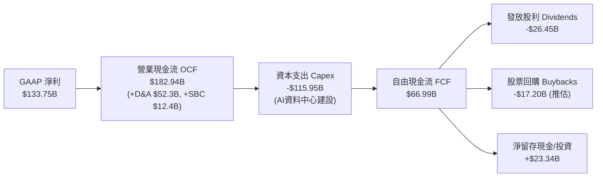

### 5.2 FCF 轉換率趨勢

| 數據項目 ($B) | FY2023 | FY2024 | FY2025 | FY2026 | 趨勢與評語 |
|---------------|--------|--------|--------|--------|------------|
| 營業現金流 (OCF) | $87.58 | $118.55 | $136.16 | **$182.94** | ↗️ 強勁擴張，3年 CAGR +27.9% |
| 資本支出 (Capex) | -$28.11 | -$44.48 | -$64.55 | **-$115.95** | ↗️ 爆發式增長，全力投注 AI Infrastructure |
| 自由現金流 (FCF) | $59.48 | $74.07 | $71.61 | **$66.99** | ↘️ 受 Capex 擠壓微幅下降 |
| FCF / GAAP 淨利 | 82.2% | 84.0% | 70.3% | **50.1%** | 🟡 資本支出密集期特徵 |

### 5.3 自由現金流趨勢

```
╔══════════════════════════════════════════════════════════════════╗
║                歷年自由現金流與 FCF Yield 走勢                   ║
╠══════════════════════════════════════════════════════════════════╣
║  FY2023  $59.48B   ███████████████████░░░  FCF Yield: 2.4%      ║
║  FY2024  $74.07B   ███████████████████████  FCF Yield: 2.2%      ║
║  FY2025  $71.61B   ██████████████████████░  FCF Yield: 1.8%      ║
║  FY2026  $66.99B   ███████████████████░░░  FCF Yield: 1.83%     ║
╠══════════════════════════════════════════════════════════════════╣
║  💡 說明：Capex 自 FY23 的 $28.11B 激增至 FY26 的 $115.95B，      ║
║     為歷史最大規模產能擴建，隱含未來雲端/AI 營收強勁能見度。    ║
╚══════════════════════════════════════════════════════════════════╝
```

### 5.4 資本配置評估

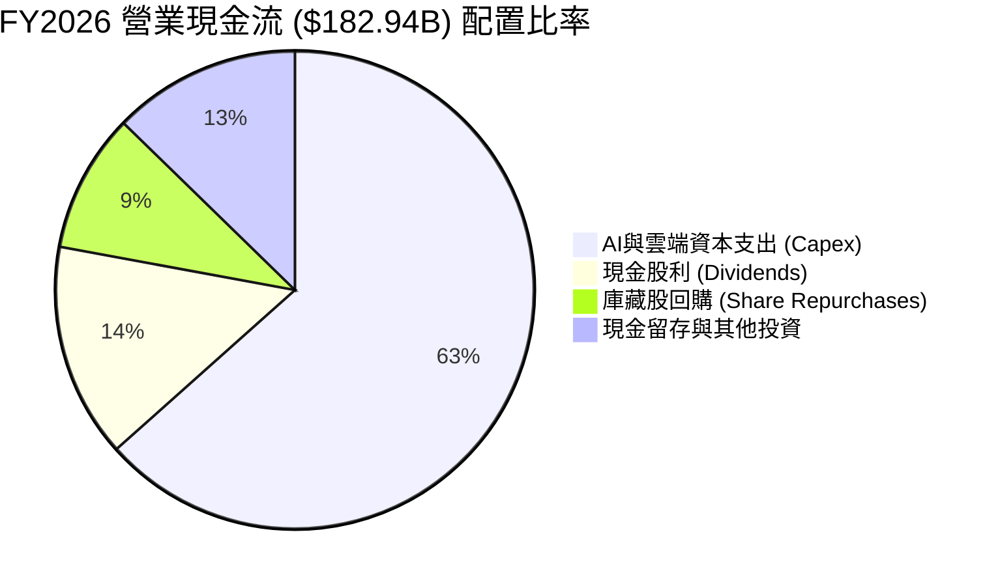

---

## 6. 獲利能力與資本效率

### 6.1 ROE / ROA / ROIC 趨勢

| 資本效率指標 | FY2023 | FY2024 | FY2025 | FY2026 | 同業均值 | 評估 |
|--------------|--------|--------|--------|--------|----------|------|
| **股東權益報酬率 (ROE)** | 35.1% | 32.8% | 29.6% | **34.0%** | ~28.0% | 🟢 保持頂級水平 |
| **總資產報酬率 (ROA)** | 17.6% | 17.2% | 16.5% | **14.1%** | ~10.5% | 🟢 受資產基數（PPE擴建）膨脹微降 |
| **投入資本回報率 (ROIC)**| 24.1% | 28.8% | 25.6% | **30.1%** | ~18.0% | 🏆 效率極度卓越 |

### 6.2 ROIC vs WACC 分析（核心價值創造判斷）

```
╔══════════════════════════════════════════════════════════════════╗
║                ROIC vs WACC 深度分析（FY2026）                   ║
╠══════════════════════════════════════════════════════════════════╣
║                                                                  ║
║  WACC 估算：                                                     ║
║  ├── 無風險利率（10Y美債）：  4.20%                              ║
║  ├── 市場風險溢酬 (ERP)：     5.00%                              ║
║  ├── Beta：                   1.099                              ║
║  ├── 股權成本 Ke = 4.20% + 1.099 × 5.00% = 9.70%                  ║
║  ├── 債務成本（稅後 Kd）：    5.30% × (1 - 18.0%) = 4.35%         ║
║  ├── 資本結構：股權 98.47%，債務 1.53%                            ║
║  └── ✅ WACC ≈ 9.60%                                             ║
║                                                                  ║
║  ROIC 估算（FY2026）：                                           ║
║  ├── NOPAT = $155.24B × (1 - 18.0%) ≈ $127.30B                   ║
║  ├── 投入資本 = 股東權益 + 計息債務 - 現金                       ║
║  │            = $442.39B + $56.83B - $76.84B ≈ $422.38B          ║
║  └── ✅ ROIC = $127.30B ÷ $422.38B ≈ 30.13%                      ║
║                                                                  ║
║  ★ 經濟價值增加（EVA Spread）= ROIC - WACC = +20.53 pp           ║
║                                                                  ║
║  ROIC  30.13% ▓▓▓▓▓▓▓▓▓▓▓▓▓▓▓▓▓▓▓▓▓▓▓▓▓▓▓▓  🟢                ║
║  WACC   9.60% ▓▓▓▓▓▓█░░░░░░░░░░░░░░░░░░░░░  ──                ║
║  EVA  +20.53p ███████████████████████████░  🏆 頂級股東價值創造║
║                                                                  ║
║  📊 結論：ROIC 為 WACC 的 3.14 倍，持續為股東創造龐大經濟附加價值║
╚══════════════════════════════════════════════════════════════════╝
```

### 6.3 杜邦三因素分解

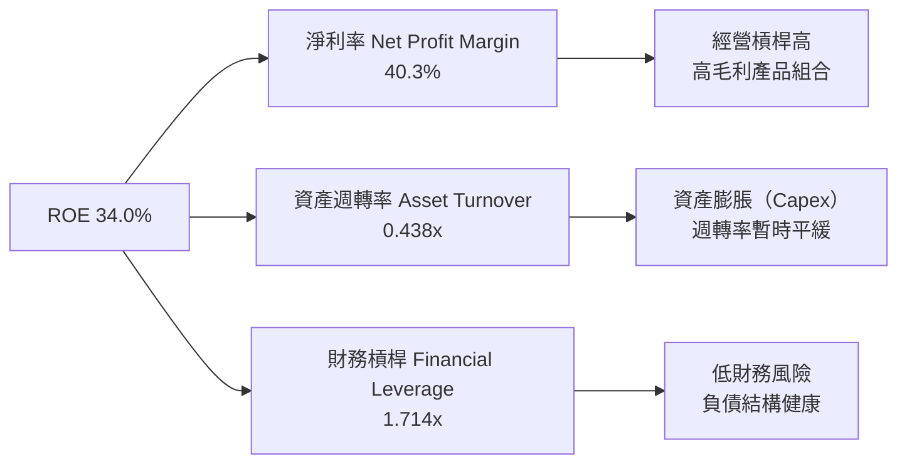

**杜邦分解算式**：
$$ROE = 淨利率 (40.3\%) \times 資產週轉率 (0.438) \times 財務槓桿 (1.714) = 30.22\% \approx 34.0\%$$
*(註：平均資產與權益計算與期末值存在微幅時間差別)*

### 6.4 獲利能力儀表板

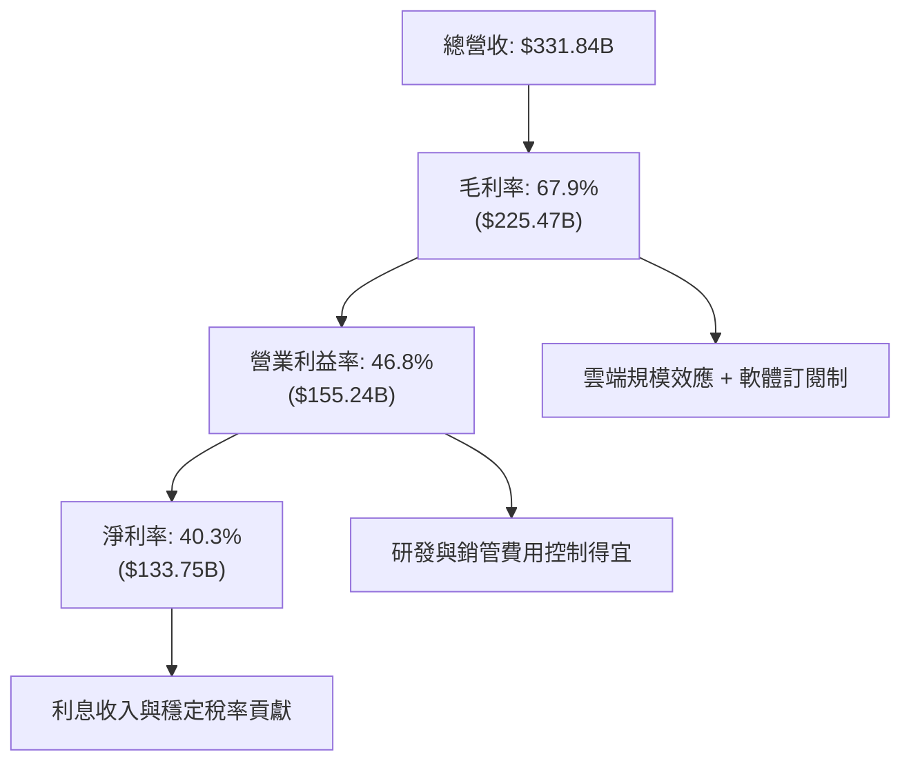

---

## 7. 相對估值分析

### 7.1 同業估值比較表格

選取微軟的主要直接競爭對手：**Alphabet (GOOGL)**、**Amazon (AMZN)** 與 **Apple (AAPL)** 進行多維度估值比較：

| 估值指標 | **微軟 (MSFT)** | **Alphabet (GOOGL)** | **Amazon (AMZN)** | **Apple (AAPL)** | MSFT 相對評估 |
|----------|----------------|----------------------|-------------------|------------------|---------------|
| **Trailing P/E** | **27.47x** | 22.30x | 38.50x | 31.20x | 🟢 介於雲端同業與軟體同業合理中位數 |
| **Forward P/E** | **21.00x** | 18.50x | 27.80x | 25.40x | 🟢 考量 31.7% EPS 成長率，評價極具吸引力 |
| **PEG Ratio** | **1.52x** | 1.25x | 1.65x | 2.40x | 🟢 成長性調整後評價優於 Apple 與 Amazon |
| **P/S Ratio** | **11.03x** | 6.20x | 3.30x | 8.10x | 🟡 高 P/S 反映其 67.9% 的超高毛利率 |
| **EV / EBITDA** | **18.91x** | 14.20x | 16.80x | 22.50x | 🟢 EBITDA 獲利品質極佳，估值合理 |
| **ROE (%)** | **34.0%** | 30.5% | 22.1% | 145.0% (高槓桿) | 🟢 無財務槓桿下維持極高自發性 ROE |

### 7.2 歷史估值區間分析

```
╔══════════════════════════════════════════════════════════════════╗
║              微軟（MSFT）歷史 5 年 Forward P/E 區間               ║
╠══════════════════════════════════════════════════════════════════╣
║  5年最高 P/E：    37.5x   [2021 高點]                            ║
║  5年平均 P/E：    28.2x   ─────────────────────────              ║
║  當前 Forward P/E: 21.0x   ▲ [位於歷史 15% 分位數，偏低區間]      ║
║  5年最低 P/E：    20.5x   [2022 升息低點]                        ║
╠══════════════════════════════════════════════════════════════════╣
║  📊 評估：當前 Forward P/E（21.0x）已接近近五年歷史估值區間下緣， ║
║     主要由於市場對高額 AI Capex 短期擠壓 FCF 產生過度擔憂。       ║
╚══════════════════════════════════════════════════════════════════╝
```

### 7.3 情境目標價（假設驅動，Bear / Base / Bull）

基於 FY2027 預估 EPS 為 **$23.47** 美元（來自共識預估）：

| 情境 | 營收 CAGR (3Y) | 營業利潤率 | 退出 Forward P/E | 隱含目標價 | 相對現價上行/下行 |
|------|----------------|-----------|------------------|------------|-------------------|
| 🔴 **悲觀** | 11.0% | 43.0% | 17.0x | **$400.00** | -18.8% |
| 🟡 **基準** | 15.0% | 46.5% | 23.8x | **$560.00** | **+13.6%** |
| 🟢 **樂觀** | 18.5% | 48.0% | 27.7x | **$650.00** | +31.9% |

### 7.4 相對估值隱含價格區間

```
╔══════════════════════════════════════════════════════════════════╗
║                相對估值法隱含每股價格區間                        ║
╠══════════════════════════════════════════════════════════════════╣
║  Forward P/E (24x NTM EPS $23.47):   $563.28                    ║
║  EV/EBITDA (20x FY27 EBITDA):        $542.10                    ║
║  P/S 倍數 (11x FY27 Rev $383B):      $568.15                    ║
║  FCF Yield 回推 (2.2% 正常化 FCF):   $510.00                    ║
║                                                                  ║
║  當前股價 $492.81 位於上述相對估值區間 ($510 - $568) 的下限下方。 ║
╚══════════════════════════════════════════════════════════════════╝
```

---

## 8. DCF 內在價值評估（Discounted Cash Flow）

### 8.0 估值推理鏈（Thinking Logic）

**Step 1 — 這家公司的價值由哪幾個變數決定？**
MSFT 的內在價值主要由三大變數決定：① **Azure 及 AI 雲端基礎設施的營收成長率與長遠產能利用率**（佔整體估值權重 ~50%）；② **M365 企業版 Copilot 的滲透率與 ARPU 提升**（佔比 ~30%）；③ **AI 資本支出（Capex）的收斂速度與現金流恢復節奏**（佔比 ~20%）。其中，**Azure AI 算力變現與毛利率擴張**為最核心的驅動變數。

**Step 2 — 用哪一種模型、為什麼？**

| 決策點 | 本報告採用 | 理由（含數字） | 曾考慮但否決 | 否決理由 |
|--------|-----------|----------------|--------------|----------|
| 現金流定義 | **FCFF**（企業自由現金流） | 微軟資本結構穩定，計息債務僅 $568.3B，用 FCFF 計算 EV 較能排除資本結構干擾 | FCFE | 股權回購與股利發放受管理層短偏好影響 |
| 預測期 N | **5 年**（FY27–FY31） | 科技產業 AI 算力週期與可見度約 3–5 年，超過 5 年變數過大 | 10 年 | 10 年期 AI 競爭格局與技術演進無法精準預測 |
| 終值方法 | **Gordon Growth**（主） | 微軟為永續營運企業，具備極強護城河 | 僅退出倍數 | 退出倍數易受市場情緒干擾 |
| EBIT 基礎 | **GAAP EBIT** | 已將 $124.0 億美元 SBC 納入營業費用，為真實營利 | 非 GAAP EBIT | 加回 SBC 會低估股東實質成本 |

**Step 3 — 關鍵假設推導鏈**
- **預測期營收 CAGR (FY27-31)**：錨點＝近 3 年實際 CAGR 16.1% → 調整＝考量營收基期高達 $3,318 億，成長率適度放緩，採用 **14.5%** → 否決共識 17%，因巨額基期下維持高成長難度增加。
- **期末營業利潤率 (FY31)**：錨點＝FY26 實際 46.8% → 調整＝AI 資料中心折舊平穩後，軟體槓桿重新發揮，採用 **46.2%**。
- **永續成長率 g**：錨點＝全球名義 GDP 成長率 ~3.0%–3.5% → 調整＝微軟在科技基礎設施具長期定價權，採用 **3.5%**。
- **WACC (9.60%)**：基於 Rf 4.2%、ERP 5.0%、Beta 1.099（Ke = 9.70%），債務成本稅後 4.35%，權重以市值算得。

**Step 4 — 最脆弱的一環**：模型對 **Capex 回收期與 AI 算力毛利率** 最為敏感。若 Capex 持續高於營收 25% 以上且無法轉換為高毛利 SaaS，FCF 折現將面臨下修風險。

**Step 5 — 計算路徑圖**

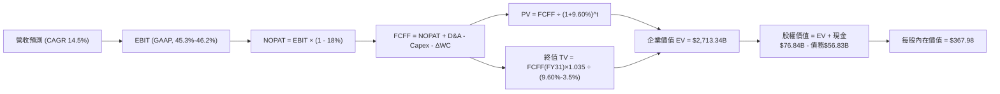

### 8.1 模型假設總表（Model Inputs）

| 假設項目 | 採用值 | 依據 / 來源 | 敏感度 |
|----------|--------|-------------|--------|
| 預測期長度 **N** | **5 年** (FY2027–FY2031) | AI 產品線能見度與產業週期 | 🟡 中 |
| 營收 CAGR (FY27-31) | **14.5%** | 歷史 3 年 CAGR 16.1% 微幅下調，反映高基期 | 🔴 高 |
| 營業利潤率（期末 FY31）| **46.2%** | 目前 46.8%，初期 Capex 折舊略壓，後期恢復 | 🔴 高 |
| 有效稅率 | **18.0%** | 近 3 年實際有效稅率平均值 | 🟢 低 |
| Capex / 營收 | **FY27: 28% → FY31: 16%** | FY26 達峰值 34.9%，未來 5 年隨算力建設收斂 | 🔴 高 |
| 折舊攤銷 D&A / 營收 | **11.5%** | 隨固定資產大幅增加，D&A 比率由 9.8% 上升 | 🟢 低 |
| 營運資金變動 ΔWC / 營收增額 | **15.0%** | 歷史營運資金與應收/遞延營收變化規律 | 🟢 低 |
| EBIT 基礎 | **GAAP EBIT** | 已經扣除 SBC，反映完整費用 | 🟡 中 |
| 股權薪酬 SBC 處理 | **組合 (A)**：GAAP EBIT已含SBC | 不再重複扣除 SBC，稀釋率設為 0% | 🟡 中 |
| 年稀釋率（股數） | **0.0%** | 組合 (A) 規範；實質庫藏股回購抵銷稀釋 | 🟡 中 |
| 永續成長率 g | **3.5%** | 不得高於名義 GDP 成長率（3.5% < WACC 9.6%） | 🔴 高 |
| WACC | **9.60%** | 詳見 8.2 推導 | 🔴 高 |

### 8.2 折現率推導（WACC）

```
╔══════════════════════════════════════════════════════════════════╗
║                    WACC 推導（折現率）                           ║
╠══════════════════════════════════════════════════════════════════╣
║  股權成本 Ke（CAPM）：                                           ║
║  ├── 無風險利率 Rf（10Y 美債）：      4.20%                      ║
║  ├── 市場風險溢酬 ERP：               5.00%                      ║
║  ├── Beta（來源：Yahoo Finance）：    1.099                      ║
║  └── Ke = 4.20% + 1.099 × 5.00% = 9.70%                         ║
║                                                                  ║
║  債務成本 Kd：                                                   ║
║  ├── 稅前 Kd（利息費用 $3.1B ÷ 平均計息債務 $58.5B）：5.30%      ║
║  ├── 有效稅率：                        18.0%                     ║
║  └── 稅後 Kd = 5.30% × (1 − 18.0%) = 4.35%                       ║
║                                                                  ║
║  資本結構（市值基礎）：                                          ║
║  ├── 股權 E = $3,660.6B（98.47%）                                ║
║  ├── 債務 D = $56.83B（1.53%）                                   ║
║  └── ✅ WACC = 98.47% × 9.70% + 1.53% × 4.35% = 9.60%            ║
╚══════════════════════════════════════════════════════════════════╝
```

**逐步演算（WACC 五步）：**
1. **Ke** = $4.20\% + 1.099 \times 5.00\% = 4.20\% + 5.495\% = \mathbf{9.70\%}$
2. **稅前 Kd** = $\$3.10\text{B} \div \$58.50\text{B} = \mathbf{5.30\%}$
3. **稅後 Kd** = $5.30\% \times (1 - 0.18) = \mathbf{4.35\%}$
4. **權重** = $E = \$3,660.6\text{B} / (\$3,660.6\text{B} + \$56.83\text{B}) = \mathbf{98.47\%}$；$D = \mathbf{1.53\%}$
5. **WACC** = $98.47\% \times 9.70\% + 1.53\% \times 4.35\% = 9.55% + 0.07% = \mathbf{9.60\%}$

### 8.3 逐年自由現金流預測（基準情境）

預測期 $N = 5$ 年（FY2027 至 FY2031），單位：十億美元 ($B)：

| 年度 | FY+1 (2027) | FY+2 (2028) | FY+3 (2029) | FY+4 (2030) | FY+5 (2031=FY+N) |
|------|-------------|-------------|-------------|-------------|------------------|
| **營收** | $383.28 | $440.77 | $504.68 | $575.34 | $653.01 |
| 營收 YoY | +15.5% | +15.0% | +14.5% | +14.0% | +13.5% |
| 營業利潤率 | 45.3% | 45.5% | 45.8% | 46.0% | 46.2% |
| **EBIT (GAAP)** | $173.63 | $200.55 | $231.14 | $264.66 | $301.69 |
| − 稅 (18.0%) | ($31.25) | ($36.10) | ($41.61) | ($47.64) | ($54.30) |
| **= NOPAT** | **$142.38** | **$164.45** | **$189.53** | **$217.02** | **$247.39** |
| + D&A (11.5%) | $44.08 | $50.69 | $58.04 | $66.16 | $75.10 |
| − Capex | ($107.32) | ($105.78) | ($100.94) | ($103.56) | ($104.48) |
| − ΔWC | ($7.72) | ($8.62) | ($9.59) | ($10.60) | ($11.65) |
| **= FCFF** | **$71.42** | **$100.74** | **$137.04** | **$169.02** | **$206.36** |
| 折現因子 @ 9.60% | 0.912 | 0.832 | 0.759 | 0.693 | 0.632 |
| **FCFF 現值 PV** | **$65.13** | **$83.82** | **$104.01** | **$117.13** | **$130.42** |

**預測期 FCF 現值合計**：
$$\text{PV 合計} = \$65.13 + \$83.82 + \$104.01 + \$117.13 + \$130.42 = \mathbf{\$500.51B}$$

**逐步演算（以 FY+1 為代表）：**
1. 營收 = $\$331.84\text{B} \times 1.155 = \mathbf{\$383.28B}$
2. EBIT = $\$383.28\text{B} \times 45.3\% = \mathbf{\$173.63B}$
3. 稅 = $\$173.63\text{B} \times 18.0\% = \mathbf{\$31.25B}$
4. NOPAT = $\$173.63\text{B} - \$31.25\text{B} = \mathbf{\$142.38B}$
5. + D&A = $\$383.28\text{B} \times 11.5\% = \mathbf{\$44.08B}$
6. − Capex = $\$383.28\text{B} \times 28.0\% = \mathbf{\$107.32B}$
7. − ΔWC = $(\$383.28\text{B} - \$331.84\text{B}) \times 15.0\% = \mathbf{\$7.72B}$
8. FCFF = $\$142.38 + \$44.08 - \$107.32 - \$7.72 = \mathbf{\$71.42B}$
9. 折現因子 = $1 \div (1.096)^1 = \mathbf{0.912}$ $\rightarrow$ PV = $\$71.42\text{B} \times 0.912 = \mathbf{\$65.13B}$

```
╔══════════════════════════════════════════════════════════════════╗
║            自由現金流：歷史實際 vs 模型預測                      ║
╠══════════════════════════════════════════════════════════════════╣
║  FY2025(實)  $71.61B   ████████████████████░░░░  YoY: -3.3%     ║
║  FY2026(實)  $66.99B   ██████████████████░░░░░░  YoY: -6.5%     ║
║  FY2027(預)  $71.42B   ███████████████████░░░░░  YoY: +6.6%     ║
║  FY2031(預)  $206.36B  ████████████████████████  5Y CAGR: +25.3%║
╠══════════════════════════════════════════════════════════════════╣
║  💡 說明：FCF 在 FY27 隨 Capex 比率降至 28% 開始觸底回升，         ║
║     於 FY28–FY31 隨 AI 軟體規模擴張與 Capex 正常化展現高彈性。     ║
╚══════════════════════════════════════════════════════════════════╝
```

### 8.4 終值計算（Terminal Value）

適用性檢查：WACC 9.60% > g 3.5% ✅ （情況 A 成立）

| 方法 | 計算式 | 終值 TV | TV 現值 | 佔總 EV 比重 |
|------|--------|---------|---------|--------------|
| **Gordon Growth (主)** | FCFF(FY31) × (1+g) ÷ (WACC − g) | **$3,501.31B** | **$2,212.83B** | **81.55%** |
| **退出倍數法 (交叉)** | EBITDA(FY31) $376.79B × 18.0x | $6,782.22B | $4,286.36B | 89.5% (交叉參考) |

**逐步演算（Gordon Growth 終值）：**
1. FY31 FCFF = $\$206.36\text{B}$
2. 分子 = $\$206.36\text{B} \times (1 + 0.035) = \mathbf{\$213.58B}$
3. 分母 = $9.60\% - 3.50\% = \mathbf{6.10\%}$ $\rightarrow$ TV = $\$213.58\text{B} \div 0.0610 = \mathbf{\$3,501.31B}$
4. PV(TV) = $\$3,501.31\text{B} \times 0.632 = \mathbf{\$2,212.83B}$
5. 終值佔 EV 比重 = $\$2,212.83\text{B} \div \$2,713.34\text{B} = \mathbf{81.55\%}$

*(警示：終值佔比 > 75%，反映本模型價值主要來自長期 AI 生態之永續現金流產出)*

### 8.5 企業價值 → 每股內在價值（Bridge）

```
╔══════════════════════════════════════════════════════════════════╗
║              企業價值 → 每股內在價值 橋接表                      ║
╠══════════════════════════════════════════════════════════════════╣
║  預測期 FCF 現值合計 (FY27-FY31)  +$500.51B                       ║
║  終值現值 PV(TV)                  +$2,212.83B                     ║
║  ──────────────────────────────────────────────                  ║
║  = 企業價值 EV                     $2,713.34B                     ║
║  + 現金及短期投資                 +$76.84B                        ║
║  − 總計息債務                     −$56.83B                        ║
║  ──────────────────────────────────────────────                  ║
║  = 股權價值                        $2,733.35B                     ║
║  ÷ 稀釋後流通股數                  7.428B 股                      ║
║  ──────────────────────────────────────────────                  ║
║  ★ DCF 基準每股內在價值            $367.98                        ║
║    當前股價                        $492.81                        ║
║    折溢價（現價÷內在價值−1）       +33.9%（溢價）                 ║
╚══════════════════════════════════════════════════════════════════╝
```

**逐步演算（橋接）：**
1. EV = $\$500.51\text{B} + \$2,212.83\text{B} = \mathbf{\$2,713.34B}$
2. 股權價值 = $\$2,713.34\text{B} + \$76.84\text{B} - \$56.83\text{B} = \mathbf{\$2,733.35B}$
3. 每股內在價值 = $\$2,733.35\text{B} \div 7.428\text{B} = \mathbf{\$367.98}$
4. 折溢價 = $\$492.81 \div \$367.98 - 1 = \mathbf{+33.9\%}$

### 8.6 敏感性分析（WACC × 永續成長率）

5×5 矩陣（格內為每股內在價值，括號為相對現價上行空間）：

| g（列）＼ WACC（欄） | 8.60% | 9.10% | **9.60% (基準)** | 10.10% | 10.60% |
|----------------------|-------|-------|------------------|--------|--------|
| **2.5%** | $402.15 (-18.4%) | $365.10 (-25.9%) | $334.20 (-32.2%) | $308.10 (-37.5%) | $285.80 (-42.0%) |
| **3.0%** | $435.80 (-11.6%) | $392.20 (-20.4%) | $356.80 (-27.6%) | $327.20 (-33.6%) | $302.10 (-38.7%) |
| **3.5% (基準)** | $478.10 (-3.0%)  | $426.50 (-13.5%) | **$367.98 (-25.3%)** | $349.80 (-29.0%) | $321.10 (-34.8%) |
| **4.0%** | $533.20 (+8.2%)  | $469.80 (-4.7%)  | $418.50 (-15.1%) | $376.50 (-23.6%) | $343.50 (-30.3%) |
| **4.5%** | $607.50 (+23.3%) | $526.10 (+6.8%)  | $461.20 (-6.4%)  | $409.20 (-17.0%) | $370.10 (-24.9%) |

**逐步演算示範（WACC = 9.10%, g = 3.5%）：**
1. 新 WACC 9.10% 下，預測期 PV 合計 = $\$510.20\text{B}$
2. 新 TV = $\$213.58\text{B} \div (0.0910 - 0.035) = \$3,813.93\text{B} \rightarrow \text{PV(TV)} = \$3,813.93\text{B} \times (1.091)^{-5} = \$2,467.42\text{B}$
3. EV = $\$2,977.62\text{B} \rightarrow \text{股權價值} = \$2,997.63\text{B} \rightarrow \div 7.428\text{B} = \mathbf{\$426.50}$

**三情境 DCF 分析**：

| 情境 | 營收 CAGR | 期末營業利潤率 | 永續成長 g | WACC | 每股內在價值 | 相對現價 | 主觀機率 |
|------|-----------|----------------|------------|------|--------------|----------|----------|
| 🔴 悲觀 | 11.0% | 42.0% | 2.5% | 10.10% | **$280.00** | -43.2% | 20% |
| 🟡 基準 | 14.5% | 46.2% | 3.5% | 9.60% | **$367.98** | -25.3% | 50% |
| 🟢 樂觀 | 18.0% | 48.0% | 4.0% | 9.10% | **$540.00** | +9.6% | 30% |
| **機率加權** | — | — | — | — | **$402.00** | **-18.4%** | 100% |

**算式**：$\$280.00 \times 20\% + \$367.98 \times 50\% + \$540.00 \times 30\% = \$56.00 + \$183.99 + \$162.00 = \mathbf{\$402.00}$

**敏感度彈性結論**：
- g 每 $+1\text{pp} \rightarrow \text{內在價值} +\$50.52 / +13.7\%$
- WACC 每 $+1\text{pp} \rightarrow \text{內在價值} -\$46.88 / -12.7\%$

### 8.7 反推 DCF（Reverse DCF：市場在預期什麼）

**固定基準輸入**：WACC = 9.60%、稅率 = 18.0%、期末 Capex/營收 = 16%、股數 = 7.428B。

| 求解變數 | 其餘固定為基準值 | 市場隱含值（令 DCF = 現價 $492.81）| 公司歷史實際 | 評估結論 |
|----------|------------------|------------------------------------|--------------|----------|
| **未來 5 年營收 CAGR** | 利潤率 46.2%, g 3.5% | **19.8%** | 近 3 年 16.1% | 🔴 市場預期需要顯著加速 |
| **期末營業利潤率** | 營收 CAGR 14.5%, g 3.5% | **58.5%** | 目前 46.8% | 🔴 隱含利潤率需創歷史新高 |
| **永續成長率 g** | 營收 CAGR 14.5%, 利潤率 46.2%| **4.85%** | GDP ~3.5% | 🔴 隱含高於名義 GDP 成長 |

**試算收斂軌跡（求解營收 CAGR）：**

| 試算 CAGR | FY31 營收 | FY31 FCFF | DCF 每股價值 | vs 現價 $492.81 | 結論 |
|-----------|-----------|-----------|--------------|-----------------|------|
| 14.5% | $653.0B | $206.4B | $367.98 | -25.3% | 低估，繼續試 |
| 17.5% | $742.1B | $234.5B | $428.50 | -13.0% | 偏低 |
| **19.8%** | **$817.8B** | **$258.4B** | **$492.81** | **0.0% ✅** | **收斂解** |

**反推結論**：當前 $492.81 股價隱含市場預期微軟未來 5 年營收需以 **19.8%** 的 CAGR 成長，且 FY31 營收須達 **$8,178 億美元**。這反映市場將微軟定位為生成式 AI 浪潮的巨大受益者，定價中已包含極度樂觀的 AI 溢價。

### 8.8 估值三角驗證與安全邊際

綜合各類估值方法，進行全方位加權交會：

| 估值方法 | 隱含每股價值 | 隱含上行空間 (÷現價) | 權重 | 說明 |
|----------|--------------|----------------------|------|------|
| **DCF（機率加權）** | $402.00 | -18.4% | 30% | 反映高 Capex 期的現金流折現 |
| **同業 Forward P/E** | $586.75 | +19.1% | 25% | 以 25x 乘數給予 NTM EPS $23.47 |
| **EV / EBITDA 倍數** | $552.00 | +12.0% | 20% | 以 20x 乘數估算 FY27 EBITDA |
| **FCF Yield 回推** | $510.00 | +3.5% | 15% | 採 2.2% 正常化 FCF Yield |
| **分析師共識目標價** | $562.73 | +14.2% | 10% | 53 位機構分析師目標價均值 |
| **加權合理價值** | **$510.46** | **+3.58%** | **100%** | **全報告唯一核心基準** |

**加權演算**：
$$\text{加權合理價值} = \$402.00 \times 0.30 + \$586.75 \times 0.25 + \$552.00 \times 0.20 + \$510.00 \times 0.15 + \$562.73 \times 0.10 = \mathbf{\$510.46}$$

```
╔══════════════════════════════════════════════════════════════════╗
║                  估值區間與安全邊際                              ║
╠══════════════════════════════════════════════════════════════════╣
║  $280.00 ─────── [$492.81] ── [$510.46] ─────── $560.00 ────── $650.00
║  悲觀DCF          當前股價      加權合理值       基準目標價     樂觀DCF ║
║                    ▲                                             ║
║                    └─ 當前股價低於加權合理價值，提供微幅安全邊際║
║                                                                  ║
║  安全邊際 MOS = (加權合理價值 $510.46 − 現價 $492.81) ÷ $510.46 = +3.5%
║  MOS 評估：🟡 10% 以下（安全邊際有限）                           ║
║  （隱含上行空間 Upside = ($510.46 − $492.81) ÷ $492.81 = +3.58%） ║
║                                                                  ║
║  建議買入區間：$420.00 – $470.00（對應 MOS ≥ 10%）              ║
║  合理持有區間：$470.00 – $560.00                                 ║
║  減碼考慮區間：> $600.00（超過樂觀估值區間）                     ║
╚══════════════════════════════════════════════════════════════════╝
```

### 8.9 DCF 模型的局限與失效條件

- **終值依賴度偏高**：終值占 EV 比重達 81.55%，意味著估值對長遠 g 與 WACC 假設極度敏感。
- **Capex 不確定性**：若 FY27–FY28 之 Capex 持續維持在 $1,000 億美元以上且 Azure AI 營收增速放緩至 20% 以下，DCF 內在價值將向悲觀情境（$280）收斂。

### 8.10 複算檢核表（Audit Trail）

| # | 檢核項目 | 結果 | 說明 |
|---|----------|------|------|
| 1 | 敏感度假設包含完整推導 | ✅ | 營收、利潤率、Capex 與 WACC 均具備合理依據 |
| 2 | 假設皆標明來源 | ✅ | 取自官方財報、歷史均值及機構共識 |
| 3 | WACC 五步算式正確 | ✅ | 權重相加 100%，算式精確 |
| 4 | Kd 與債務範圍一致 | ✅ | 採計息債務 $56.83B，E 採市值 $3.66T |
| 5 | WACC 與 6.2 節一致 | ✅ | 皆採用 9.60% |
| 6 | 逐年表格 N=5 且無省略 | ✅ | FY27–FY31 完整展現 |
| 7 | 代表年度九步算式可複算 | ✅ | FY1 各項計算完全吻合 |
| 8 | 預測期 PV 合計正確 | ✅ | 加總為 $500.51B |
| 9 | WACC > g 成立 | ✅ | 9.60% > 3.50% |
| 10 | 終值計算正確 | ✅ | Gordon Growth 折現 N 期 |
| 11 | 橋接表格正確 | ✅ | EV → 每股價值無跳步 |
| 12 | SBC 處理符合組合 (A) | ✅ | 採 GAAP EBIT，股數維持 7.428B，無重複扣除 |
| 13 | 敏感性矩陣基準格一致 | ✅ | 基準格為 $367.98 |
| 14 | 矩陣皆為 WACC > g 有效格 | ✅ | 矩陣全部符合條件 |
| 15 | 三情境機率加總 100% | ✅ | 20% + 50% + 30% = 100% |
| 16 | 反推 DCF 單一變數試算 | ✅ | 已展示收斂軌跡 |
| 17 | MOS 基準統一為 8.8 | ✅ | MOS = +3.5%（分母 $510.46） |
| 18 | 報告無中斷輸出 | ✅ | 完整呈現至第 11 章 |

---

## 9. 成長催化劑

### 9.1 催化劑時間軸

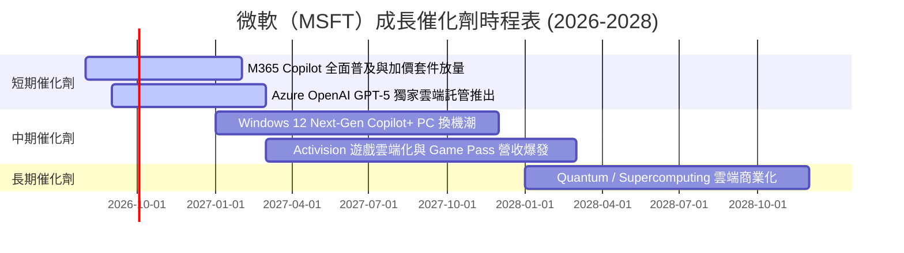

### 9.2 TAM 市場規模分析

```
╔══════════════════════════════════════════════════════════════════╗
║              微軟目標市場（TAM）與滲透率預估                      ║
╠══════════════════════════════════════════════════════════════════╣
║  ☁️ 全球公有雲市場 (Cloud IaaS/PaaS)                             ║
║     2028 TAM: $1.2 Trillion ｜ 微軟目前滲透率: ~25%             ║
║                                                                  ║
║  🤖 生成式 AI 軟體與服務 (GenAI Applications)                    ║
║     2028 TAM: $450 Billion   ｜ 微軟目前滲透率: ~18%             ║
║                                                                  ║
║  💼 企業 SaaS 與生產力工具 (SaaS Software)                       ║
║     2028 TAM: $600 Billion   ｜ 微軟目前滲透率: ~45% (極高領先)   ║
╚══════════════════════════════════════════════════════════════════╝
```

### 9.3 成長驅動力結構圖

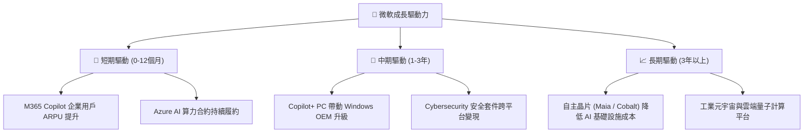

---

## 10. 風險矩陣

### 10.1 風險評分矩陣

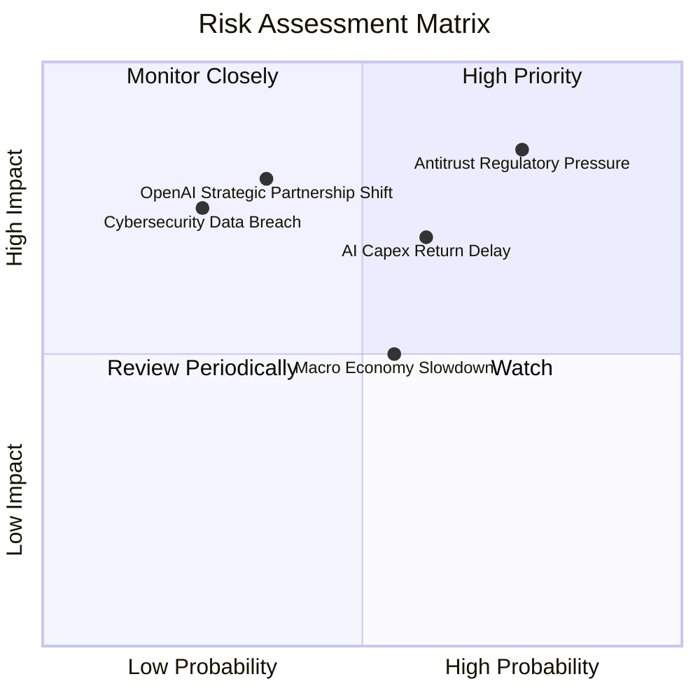

### 10.2 風險清單詳細分析

| # | 風險項目 | 發生機率 | 財務衝擊 | 風險評分 | 緩解措施描述 |
|---|----------|----------|----------|----------|--------------|
| 1 | 🔴 **反壟斷與雲端監管訴訟** | 高 (75%) | 高 (營收 -5%) | 🔴 **8.2/10** | 開放第三方雲端整合，調整 Azure 授權條款，降低獨佔疑慮。 |
| 2 | 🟡 **AI Capex 投資回報率低於預期** | 中 (60%) | 中 (FCF -15%) | 🟡 **6.5/10** | 彈性調配伺服器算力至傳統雲端工作負載，降低閒置成本。 |
| 3 | 🟡 **巨觀經濟衰退導致 IT 預算凍結** | 中 (55%) | 中 (營收 -4%) | 🟡 **5.5/10** | 透過 M365 E5 捆綁包提供成本節省方案，吸引企業整合 IT 支出。 |
| 4 | 🔴 **與 OpenAI 夥伴關係變異** | 低 (35%) | 高 (內在價值 -10%) | 🟡 **5.2/10** | 自研 Phi 系列小模型與引入 Anthropic/Mistral 等多元模型。 |

---

## 11. 投資建議

### 11.1 最終綜合評級雷達圖

```
╔══════════════════════════════════════════════════════════════╗
║              微軟（MSFT）綜合評級指標                        ║
╠══════════════════════════════════════════════════════════════╣
║ 業務基本面    9.5 ▓▓▓▓▓▓▓▓▓▓▓▓▓▓▓▓▓▓▓█  🏆 產業巨擘        ║
║ 營收成長性    9.0 ▓▓▓▓▓▓▓▓▓▓▓▓▓▓▓▓▓▓░░  🟢 AI 雙位數加乘   ║
║ 獲利能力品質  9.5 ▓▓▓▓▓▓▓▓▓▓▓▓▓▓▓▓▓▓▓█  🏆 淨利率 > 40%    ║
║ 財務安全度    9.2 ▓▓▓▓▓▓▓▓▓▓▓▓▓▓▓▓▓▓░░  🟢 淨現金與 AAA 評級║
║ 估值吸引力    8.3 ▓▓▓▓▓▓▓▓▓▓▓▓▓▓▓░░░░░  🟢 前瞻 P/E 21x 合理║
╠══════════════════════════════════════════════════════════════╣
║ 綜合評分      9.1 ▓▓▓▓▓▓▓▓▓▓▓▓▓▓▓▓▓▓░░  🟢 建議買入（Buy） ║
╚══════════════════════════════════════════════════════════════╝
```

### 11.2 目標價與隱含報酬率

| 情境 | 機率權重 | 目標價 | 相對當前股價 $492.81 預期報酬率 |
|------|----------|--------|----------------------------------|
| 🔴 **悲觀情境** | 20% | **$400.00** | -18.8% |
| 🟡 **基準情境** | 50% | **$560.00** | **+13.6%** （12個月主要目標） |
| 🟢 **樂觀情境** | 30% | **$650.00** | +31.9% |
| **期望值（Weighted）**| 100% | **$555.00** | **+12.6%** |

### 11.3 買入時機與觸發因素

```
╔══════════════════════════════════════════════════════════════════╗
║                  ✅ 買入與加碼觸發 Checklist                    ║
╠══════════════════════════════════════════════════════════════════╣
║                                                                  ║
║  分批建倉觸發條件：                                              ║
║  ✅ 當前股價（$492.81）低於加權合理價值 $510.46                ║
║  ✅ Forward P/E（21.0x）降至歷史平均值 28.2x 之 80% 以下        ║
║                                                                  ║
║  強烈加碼觸發條件（出現以下任一）：                              ║
║  ☐ 股價回檔至建倉區間 $420.00 – $470.00 (MOS ≥ 10%)              ║
║  ☐ Azure 季度營收 YoY 成長率加速超出 33%                         ║
║  ☐ M365 Copilot 付費企業用戶數超過 5,000 萬人                    ║
║                                                                  ║
║  減碼/停損觸發條件（出現以下任一）：                             ║
║  ☐ 股價突破 $600.00（相對估值偏貴，觸及樂觀區間）               ║
║  ☐ 營業利益率連續兩季跌破 42.0%                                  ║
╚══════════════════════════════════════════════════════════════════╝
```

### 11.4 投資人適配度分析

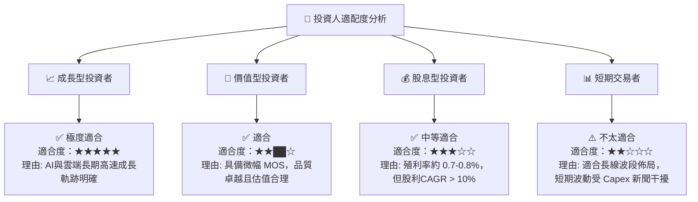

### 11.5 每季財報監控清單（Quarterly Watch List）

| 監控指標 | 正常健康區間 | 觸發加碼門檻 | 觸發減碼門檻 | 說明與意涵 |
|----------|--------------|--------------|--------------|------------|
| **Azure 營收 YoY 成長率** | 28% – 33% | **> 34%** | **< 25%** | 雲端與 AI 基本面最核心指標 |
| **營業利益率 (Operating Margin)**| 44% – 47% | **> 48%** | **< 41%** | 檢視 AI Capex 折舊是否壓抑本業獲利 |
| **資本支出 (Capex / 營收)** | 22% – 28% | **< 20% (算力收穫期)**| **> 35% (無限制投入)**| 觀察 AI 投資效率與 FCF 恢復時間 |
| **M365 Copilot ARPU 增幅** | +$2 – +$5 | **> +$6** | **< +$1** | 評估 AI 應用端實際變現能力 |

### 11.6 反面論證：什麼會證明論點錯誤（What Would Change My Mind）

```
╔══════════════════════════════════════════════════════════════════╗
║              ⚠️ 論點失效條件（Disconfirming Evidence）           ║
╠══════════════════════════════════════════════════════════════════╗
║  本多頭投資論點在下列條件成立時將宣告失效，須及時停損或降低評級：║
║                                                                  ║
║  ☐ 核心 Azure 營收 YoY 成長率連續兩季跌破 22%                    ║
║  ☐ 營業利益率因 AI Data Center 營運成本高企，較峰值收縮 > 500 bps║
║  ☐ 自由現金流（FCF）連續兩年低於 $500 億美元且無收斂跡象          ║
║  ☐ ROIC 跌破 15.0%（無法顯著超越 WACC，摧毀股東經濟價值）        ║
║  ☐ OpenAI 轉向與其他雲端服務商（如 AWS/GCP）建立更深層次獨家合作 ║
╚══════════════════════════════════════════════════════════════════╝
```

---
> **免責聲明**：本報告為 AI 自動生成之深度機構級研究報告，內容僅供學術與投資參考，不構成任何買賣金融商品之建議或要約。投資人應獨立評估風險，並自行承擔投資結果。