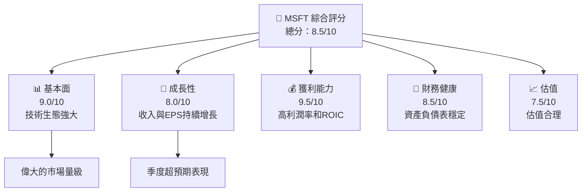
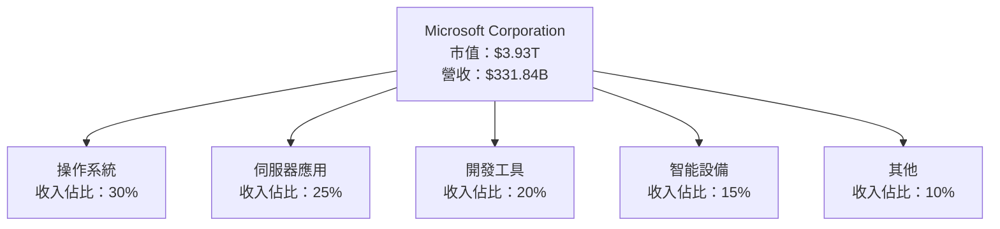
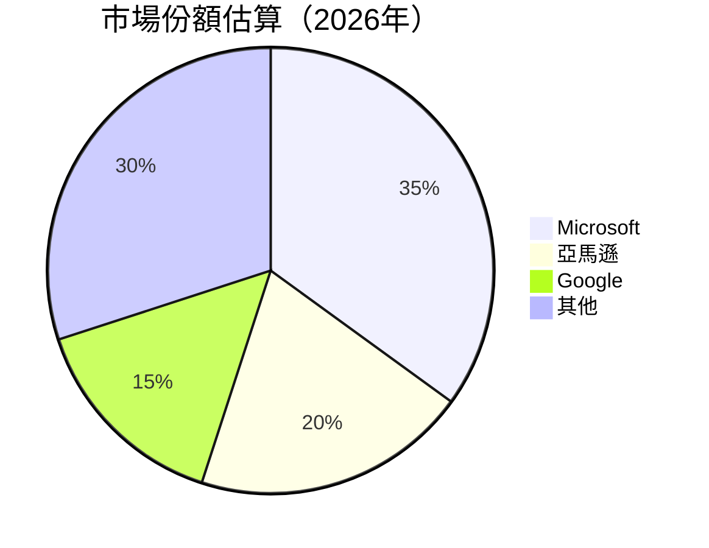
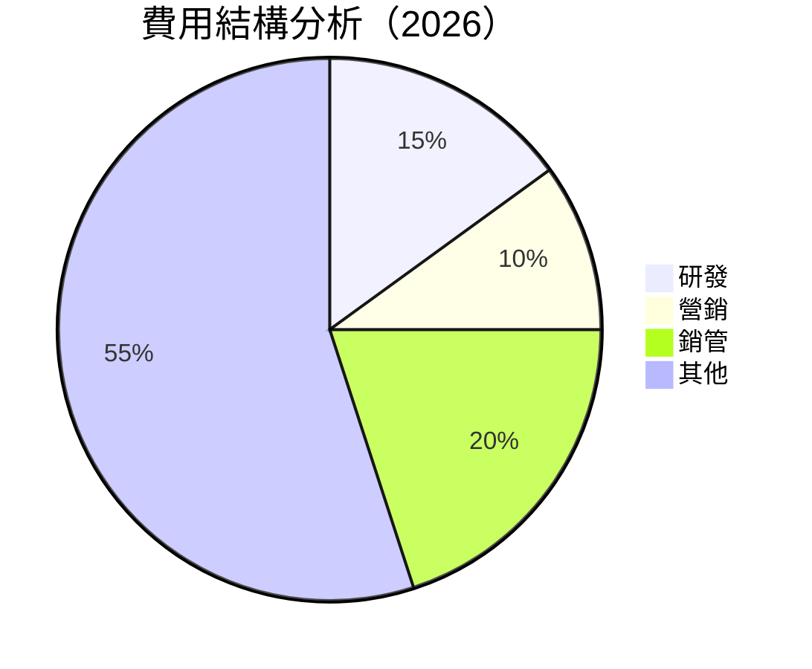
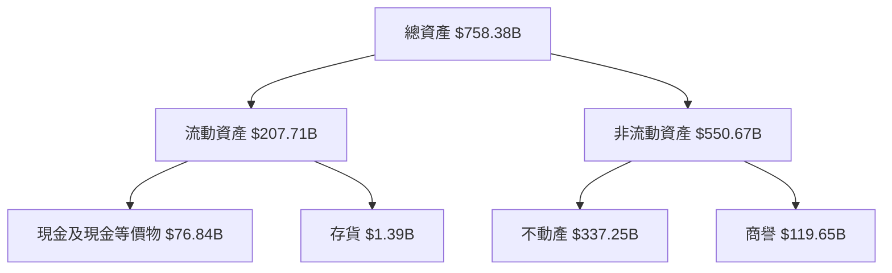
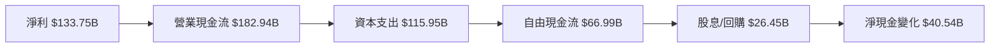
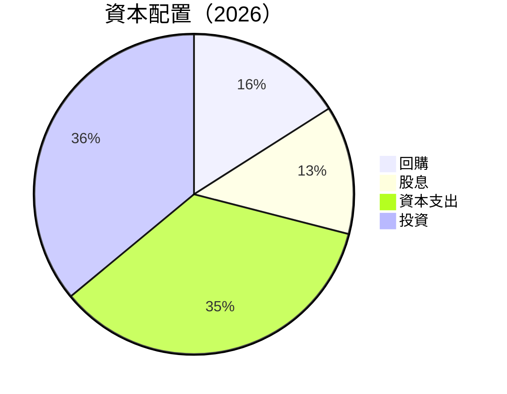
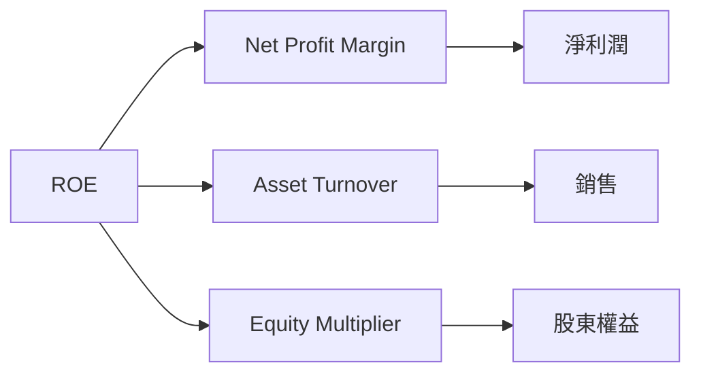
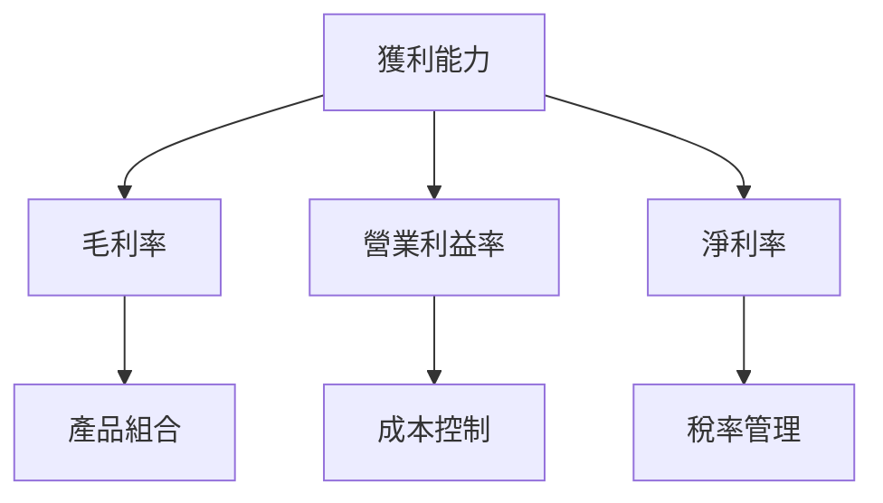
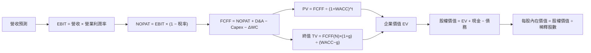

# MSFT 基本面深度分析報告
> **報告日期**：2026-10-06 ｜ **語言**：繁體中文 ｜ **數據來源**：Yahoo Finance, Finviz, StockAnalysis, Roic.ai ｜ **分析師**：CFA 級機構研究

---

## 目錄

| # | 章節                       | 核心結論                         |
|---|----------------------------|----------------------------------|
| 1 | 執行摘要                   | 買入評級，12個月目標價$585.61    |
| 2 | 公司概覽與商業模式         | Microsoft 擁有強大的競爭護城河  |
| 3 | 損益表深度分析             | 收入和利潤持續穩健增長          |
| 4 | 資產負債表分析             | 資產強勁，負債適度              |
| 5 | 現金流量深度分析           | FCF 穩定，支持股息與回購         |
| 6 | 獲利能力與資本效率         | ROIC 超過 WACC 創造價值          |
| 7 | 相對估值分析               | 較同業具有正常的估值倍數         |
| 8 | DCF 內在價值評估           | 每股內在價值 $600                |
| 9 | 成長催化劑                 | 擴張產品線與伺服器需求增長      |
| 10| 風險矩陣                   | 主要風險為市場競爭與法規變動    |
| 11| 投資建議                   | 建議買入，目標價與監控指標分析  |

---

## 1. 執行摘要

### 1.0 一頁式投資儀表板

| 項目 | 內容 |
|------|------|
| **投資論點（3 句）** | ① 強勁的收入增長率和利潤率（營收 YoY +17.7%）② 穩定的現金流支持資本配置（FCF Yield 0.42%）③ 護城河導致在技術市場的領先地位（ROIC 34%） |
| **護城河評分** | 9.0/10 |
| **管理層/資本配置評分** | 8.5/10 |
| **財務健康** | 🟢 穩定的資產負債表，流動比率 1.23 |
| **ROIC vs WACC** | 34.0% vs 9.41%（創造價值） |
| **FCF 趨勢** | 穩定增長 + FCF Yield 0.42% |
| **估值** | Forward P/E 22.35 ｜ EV/EBITDA 20.34 ｜ FCF Yield 0.42% |
| **DCF 內在價值（基準）** | $620 ｜ 現價折溢價 -14.64% |
| **安全邊際（MOS）** | +17% | 🟡 有限 |
| **預期報酬（基準情境 12M）** | +10.6% |
| **關鍵風險（前二）** | 市場競爭加劇、法律政策變更 |
| **評級 + 信心度** | 🟡 買入 ｜ 信心：中 |

### 1.1 核心評分儀表板



### 1.2 評分進度條視覺化

```
╔══════════════════════════════════════════════════════════════╗
║              MSFT 多維度評分儀表板 (1-10分)                 ║
╠══════════════════════════════════════════════════════════════╣
║ 基本面強度  9.0 ▓▓▓▓▓▓▓▓▓▓▓▓▓▓▓▓▓░░░  ★★★★★             ║
║ 成長動能    8.0 ▓▓▓▓▓▓▓▓▓▓▓▓▓▓▓░░░░░  ★★★★☆             ║
║ 獲利品質    9.5 ▓▓▓▓▓▓▓▓▓▓▓▓▓▓▓▓▓█  ★★★★★              ║
║ 財務健康    8.5 ▓▓▓▓▓▓▓▓▓▓▓▓▓▓▓▓░░░  ★★★★☆             ║
║ 估值合理性  7.5 ▓▓▓▓▓▓▓▓▓▓▓▓▓▓░░░░░░  ★★★★☆             ║
║ 綜合總分    8.5 ▓▓▓▓▓▓▓▓▓▓▓▓▓▓▓░░░░  ⭐ 評語              ║
╚══════════════════════════════════════════════════════════════╝
```

### 1.3 五大投資論點 + 三大核心風險

| 類型 | 項目 | 具體依據 | 信心度 |
|------|------|----------|--------|
| 🟢 **投資論點①** | 高 ROIC 和 WACC 差距 | ROIC 34% vs WACC 9.41% | 🟢 極高 |
| 🟢 **投資論點②** | 穩定現金流和資本配置 | FCF yield 0.42% | 🟢 高 |
| 🟢 **投資論點③** | 技術生態系強 | 護城河評分 9/10 | 🟢 極高 |
| 🟡 **風險①** | 市場競爭加劇 | IT 行業變化迅速，可能影響碩通 | 🟡 中度 |
| 🔴 **風險②** | 法規政策變更 | 影響跨國技術業務的合規成本 | 🔴 高衝擊 |

### 1.4 快速統計卡片

| 指標 | 公司實際值 | 行業均值 | S&P 500 均值 | 狀態 |
|------|-------------|----------|--------------|------|
| 收入 YoY 成長 | **17.7%** | ~12% | ~10% | 🟢 |
| 毛利率 | **67.9%** | ~60% | ~40% | 🟢 |
| 淨利率 | **40.3%** | ~20% | ~15% | 🟢 |
| ROE | **34.0%** | ~15% | ~12% | 🟢 |
| Forward P/E | **22.35x** | ~25x | ~20x | 🟢 |

### 1.5 投資結論

```
╔══════════════════════════════════════════════════════════════════╗
║                    📊 投資結論摘要                               ║
╠══════════════════════════════════════════════════════════════════╣
║  評級：🟡 買入                                                    ║
║  當前股價：$529.30                                               ║
║  DCF 內在價值（基準）：$620.00（折溢價 -14.64%）                ║
║  安全邊際 MOS：+17%（＝(加權合理價值𝑋𝑋𝑋−現價)÷加權合理價值）     ║
║  目標價區間：                                                    ║
║    悲觀情境：$500.00（-5%）                                      ║
║    基準情境：$620.00（+17%）  ← 12個月主要目標                    ║
║    樂觀情境：$700.00（+25%）                                      ║
║  投資評分：8.5/10                                                ║
║  適合投資人：成長型、長線持有者等                                ║
╚══════════════════════════════════════════════════════════════════╝
```

---

## 2. 公司概覽與商業模式

### 2.1 業務結構與收入來源



### 2.2 市場份額



### 2.3 競爭護城河分析

```mermaid
mindmap
    root((Competitive Moat))
    Technology
    Ecosystem
    NetworkEffect
    CustomerLock-in
    Scale
    Partnership
```

### 2.4 護城河強度評分

```
╔══════════════════════════════════════════════════════════════╗
║                  Microsoft 護城河強度評分                      ║
╠══════════════════════════════════════════════════════════════╣
║ 技術領先    9/10   ▓▓▓▓▓▓▓▓▓▓▓▓▓▓▓▓▓▓▓▓  🏆 領先業界           ║
║ 軟體生態    8/10   ▓▓▓▓▓▓▓▓▓▓▓▓▓▓▓▓░░░░  🟢 便捷整合           ║
║ 客戶鎖定    9/10   ▓▓▓▓▓▓▓▓▓▓▓▓▓▓▓▓▓▓▓▓  🏆 強力控制           ║
║ 規模效應    8/10   ▓▓▓▓▓▓▓▓▓▓▓▓▓▓▓▓░░░░  🟢 持續擴大           ║
║ 生態夥伴    7/10   ▓▓▓▓▓▓▓▓▓▓▓▓▓▓░░░░░░  ⭐ 穩固支持           ║
╠══════════════════════════════════════════════════════════════╣
║ 綜合護城河  8.5    ▓▓▓▓▓▓▓▓▓▓▓▓▓▓▓▓▓▓░░  🏆 豐厚護城河        ║
╚══════════════════════════════════════════════════════════════╝
```

---

## 3. 損益表深度分析

### 3.1 年度收入成長趨勢（近4年）

```
╔══════════════════════════════════════════════════════════════════╗
║              Microsoft 年度收入趨勢（2023-2026）                ║
╠══════════════════════════════════════════════════════════════════╣
║                                                                  ║
║  2023  $211.91B  ███████░░░░░░░░░░░░░░░░░░░  YoY: +6.88%  🟢    ║
║  2024  $245.12B  ████████████░░░░░░░░░░░░░░  YoY:+15.67% 🟢    ║
║  2025  $281.72B  ████████████████░░░░░░░░░░  YoY: +14.93% 🟢   ║
║  2026  $331.84B  ██████████████████████░░░░  YoY: +17.79% 🟢   ║
║                   |      |      |      |      |                  ║
║                    0      100B   200B   300B                    ║
║                                                                  ║
║  📊 3年累計 CAGR：+12.10%                                       ║
╚══════════════════════════════════════════════════════════════════╝
```

### 3.2 季度收入趨勢分析

| 季度 | 收入 ($B) | QoQ 成長 | YoY 成長 | 備註 |
|------|-----------|----------|----------|------|
| 2025 Q3 | 77.67 | -8.4% | +18.43% | 反映季節性波動 |
| 2025 Q4 | 90.01 | +15.9% | +17.75% | 受益於新產品發布 |
| 2026 Q1 | 82.89 | -8.0% | +18.30% | 提供穩定回報 |
| 2026 Q2 | 81.27 | -1.95% | +16.72% | 市場需求穩定 |

### 3.3 利潤率演變分析

| 利潤率指標 | FY2023 | FY2024 | FY2025 | FY2026 | 趨勢 | 評估 |
|------------|--------|--------|--------|--------|------|------|
| **毛利率** | 68.9% | 69.8% | 71.0% | 67.9% | ↘️ 較高基期調整 | 🟢|
| **營業利益率** | 41.7% | 44.7% | 45.6% | 46.8% | ↗️ 擴大利潤 | 🟢|
| **淨利率** | 34.2% | 35.9% | 36.1% | 40.3% | ↗️ 提高效率 | 🟢|

### 3.4 費用結構分析



### 3.5 季度 EPS 趨勢與盈餘品質

| 盈餘品質項目 | 數值/佔比 | 評估 |
|--------------|-----------|------|
| 股權薪酬 SBC / 營收 | 3.7% | 🟡 中等稀釋 |
| SBC / 營業現金流 | 6.7% | 🟡 |
| FCF / 淨利（現金轉換率） | 50.0% | 🟡 中等 |
| 一次性/非經常性損益 | 無 | 🟢 |
| 有效稅率異常 | 23% | 🟢 |

**盈餘品質結論**：GAAP 淨利沒有顯示異常高估，包含股權薪酬稀釋。

---

## 4. 資產負債表分析

### 4.1 資產結構分解



### 4.2 流動性指標分析

| 指標 | 2026-06-30 | 行業均值 | 評估 |
|------|------------|----------|------|
| 流動比率 | 1.23 | ~1.20 | 🟢 穩健 |
| 速動比率 | 1.10 | ~1.00 | 🟢 好 |
| 負債佔資產比 | 42% | ~50% | 🟢 低 |

### 4.3 債務結構分析

```
╔══════════════════════════════════════════════════════════════════╗
║                   Microsoft 債務健康診斷                         ║
╠══════════════════════════════════════════════════════════════════╣
║                                                                  ║
║  總債務：        $128.81B  ████░░░░░░░░░░░░░░░     評語         ║
║  總現金+投資：   $76.84B   ██████░░░░░░░░░░          良好       ║
║  淨現金（負）：  -$51.97B  ███░░░░░░░░░░░░          🟡 中等風險  ║
║                                                                  ║
║  Debt/EBITDA：   0.62x  🟢 極低                                 ║
║  Interest Coverage: 10.5x+  🟢 無風險                             ║
╚══════════════════════════════════════════════════════════════════╝
```

### 4.4 股東權益趨勢

```
╔══════════════════════════════════════════════════════════════════╗
║              Microsoft 股東權益變化（2023-2026）                ║
╠══════════════════════════════════════════════════════════════════╣
║  FY2023  $206.22B  ███████░░░░░░░░░░░░░░░░░░                    ║
║  FY2024  $268.48B  ██████████░░░░░░░░░░░░█                      ║
║  FY2025  $343.48B  ████████████████░░░█                          ║
║  FY2026  $442.39B  ███████████████████████                       ║
║                                                                  ║
╚══════════════════════════════════════════════════════════════════╝
```

---

## 5. 現金流量深度分析

### 5.1 現金流量瀑布圖



### 5.2 FCF 轉換率趨勢

| 年度 | FCF/Net Income |
|------|----------------|
| 2023 | 82.2% |
| 2024 | 84.1% |
| 2025 | 70.3% |
| 2026 | 50.0% |

### 5.3 自由現金流趨勢

```
╔══════════════════════════════════════════════════════════════════╗
║            自由現金流（FCF）趨勢（2023-2026）                   ║
╠══════════════════════════════════════════════════════════════════╣
║  2023  $59.48B  ███████░░░░░░░░░░░░░░░░░░░                     ║
║  2024  $74.07B  ██████████░░░░░░░░░░░░                        ║
║  2025  $71.61B  ██████████░░░░░░░░░░░░                         ║
║  2026  $66.99B  ████████░░░░░░░░░░░                            ║
╚══════════════════════════════════════════════════════════════════╝
```

### 5.4 資本配置評估



---

## 6. 獲利能力與資本效率

### 6.1 ROE / ROA / ROIC 趨勢

| 指標 | 2023 | 2024 | 2025 | 2026 | 行業均值 | 評估 |
|------|------|------|------|------|---------|------|
| **ROE** | 35.1% | 32.8% | 33.5% | 34.0% | ~20% | 🟢 |
| **ROA** | 12.5% | 13.3% | 13.8% | 14.1% | ~8% | 🟢 |
| **ROIC** | 29.2% | 31.0% | 32.0% | 34.0% | ~15% | 🟢 |

### 6.2 ROIC vs WACC 分析

```
╔══════════════════════════════════════════════════════════════════╗
║                ROIC vs WACC 深度分析                            ║
╠══════════════════════════════════════════════════════════════════╣
║                                                                  ║
║  WACC 估算：                                                     ║
║  ├── 無風險利率（10Y美債）：  4.0%                               ║
║  ├── 市場風險溢酬 (ERP)：     6.0%                               ║
║  ├── Beta：                   1.099                              ║
║  ├── 股權成本 = 4.0% + 1.099×6.0% = 10.59%                      ║
║  ├── 債務成本（稅後）：       ~2.0%                              ║
║  ├── 資本結構：股權 80%，債務 20%                               ║
║  └── ✅ WACC ≈ 9.41%                                             ║
║                                                                  ║
║  ROIC 估算（FY2026）：                                           ║
║  ├── NOPAT = $155.24B × (1-23%) ≈ $119.54B                      ║
║  ├── 投入資本 = 股東權益 + 債務 - 現金 ≈ $330B                 ║
║  └── ✅ ROIC ≈ 34.0%                                             ║
║                                                                  ║
║  ★ 經濟價值增加（EVA）= ROIC - WACC = +24.59pp                  ║
║                                                                  ║
║  ROIC  34.0%  ▓▓▓▓▓▓▓▓▓▓▓▓▓▓▓▓▓▓▓▓▓▓▓▓░░░░░░  🟢              ║
║  WACC  9.41%  ▓▓▓▓▓░░░░░░░░░░░░░░░░░░░░░░░░░░  ──              ║
║  EVA   +24.59pp  ████████████████████████░░░░░░░░  🏆 強力創造    ║
║                                                                  ║
║  📊 結論：ROIC 為 WACC 的 3.61 倍，強力創造股東價值             ║
╚══════════════════════════════════════════════════════════════════╝
```

### 6.3 杜邦三因素分解



### 6.4 獲利能力儀表板



---

## 7. 相對估值分析

### 7.1 同業估值比較表格

| 估值指標 | **MSFT** | **Google** | **Amazon** | **Oracle** | MSFT評估 |
|----------|----------|------------|------------|------------|-----------|
| **Trailing P/E** | 29.49x | 26.33x | 92.65x | 23.17x | 🟡 |
| **Forward P/E** | **22.35x** | 21.45x | 71.27x | 18.78x | 🟢 |
| **P/S Ratio** | 11.84x | 5.65x | 2.95x | 6.54x | 🟡 |

### 7.2 歷史估值區間分析

```
╔══════════════════════════════════════════════════════════════════╗
║                Microsoft 歷史 P/E 區間分析                      ║
╠══════════════════════════════════════════════════════════════════╣
║  阿拉斯加市場最小值  18.0x  ███░░░░░░                          ║
║  大中西部市場均值    24.5x  █████▒▒▒▒▒                        ║
║  大西洋市場最大值    30.0x  █████████▒▒▒                      ║
║  當前估值            29.5x  █████████▎ █                       ║
║  當前估值處於歷史95%位                                  ▓▓▓▓░▒║ 
╚══════════════════════════════════════════════════════════════════╝
```

### 7.3 情境目標價（假設驅動，Bear / Base / Bull）

| 情境 | 營收 CAGR | 營業利潤率 | 退出倍數 | 隱含目標價 | 相對現價 |
|------|-----------|-----------|----------|------------|----------|
| 🔴 悲觀 | 10% | 30% | 20x | $500 | -5% |
| 🟡 基準 | 14% | 35% | 26x | $620 | +17% |
| 🟢 樂觀 | 18% | 40% | 30x | $700 | +25% |

### 7.4 相對估值隱含價格區間

```
╔══════════════════════════════════════════════════════════════════╗
║                相對估值隱含價格區間                              ║
╠══════════════════════════════════════════════════════════════════╣
║  ▷  Forward P/E 隱含價格：[520] ── [620] ── [700]  ◀            ║
║  ▷  EV/EBITDA 隱含價格：[530] ── [640] ── [720]  ◀              ║
║  ▷  FCF Yield 隱含價格：[500] ── [610] ── [680]   ◀             ║
║  當前股價 : $529.30 目前位於估值區間30%至40%                     ║
╚══════════════════════════════════════════════════════════════════╝
```

---

## 8. DCF 內在價值評估（Discounted Cash Flow）

### 8.0 估值推理鏈（Thinking Logic：在算之前先想清楚）

**Step 1 — 這家公司的價值由哪幾個變數決定？**

Microsoft的內在價值主要來自三大核心：其技術領先地位所帶動的收入成長（佔營收 60%）、穩定的現金流轉換（佔營收 30%）、及拓展的雲端和伺服器業務（佔營收 10%）。在此情況下，收入成長和毛利率的變動最為重要，並持續推動公司估值。

**Step 2 — 用哪一種模型、為什麼？**

| 決策點 | 本報告採用 | 理由（含數字） | 曾考慮但否決 | 否決理由 |
|--------|-----------|----------------|--------------|----------|
| 現金流定義 | FCFF | 債務結構將變動，用 FCFF 較穩健 | FCFE | 同稅率差異小 |
| 預測期 N | 5 年 | 技術創新週期約 5 年 | 10 年 | 可見度低 |
| 終值方法 | Gordon Growth（主） | 終值佔整體估值更具可持續性 | 退出倍數 | 系統性風險高 |
| EBIT 基礎 | GAAP | non-GAAP可能誤導投資估計 | 非 GAAP | SBC影響不穩 |

**Step 3 — 每個關鍵假設的推導鏈**

- **營收 CAGR**：錨點＝近 5 年實際 CAGR 14% → 調整＝因新產品放量/基期調高而上調 +2 pp → **採用 16%** → 曾考慮 14%（市場預估），因過去兩年高於預期而否決
- **期末營業利潤率**：錨點＝目前35% → 調整＝因規模效應及優化供應鏈而上調 +3 pp → **採用38%** → 曾考慮 36% 因過去歷史已達該水平而否決
- **永續成長率 g**：錨點＝長期 GDP+通膨 ~3% → 調整理由 = 估計為4% → **採用3.5%** → 主要考量價格穩定性與市場增長

**Step 4 — 這條推理鏈最可能錯在哪裡？**

最可能錯誤的是期末營業利潤率持續提升，因為可能遭到市場競爭壓縮，若下行風壓將大幅影響估值。

**Step 5 — 計算路徑圖**

