# MU 基本面深度分析報告
> **報告日期**：2026-07-12 ｜ **語言**：繁體中文 ｜ **數據來源**：Yahoo Finance, Finviz, StockAnalysis, Roic.ai ｜ **分析師**：CFA 級機構研究

---

## 目錄

| # | 章節 | 核心結論 |
|---|------|----------|
| 1 | [執行摘要](#1-執行摘要) | **買入**評級，基準目標價 **$1,486.00**，上行空間 **+51.7%** |
| 2 | [公司概覽與商業模式](#2-公司概覽與商業模式) | HBM3e 技術領先與寡頭壟斷構成極深護城河（評分 **8.8/10**） |
| 3 | [損益表深度分析](#3-損益表深度分析) | Q3 26 營收飆升 **345.7%**，營業利潤率攀升至 **80.4%**，營運槓桿極強 |
| 4 | [資產負債表分析](#4-資產負債表分析) | 淨現金 **$19.65B**，流動比率 **3.43**，資產負債表極為穩健 |
| 5 | [現金流量深度分析](#5-現金流量深度分析) | TTM 營運現金流 **$51.43B**，單季 FCF 達 **$17.56B**，資本配置效率極高 |
| 6 | [獲利能力與資本效率](#6-獲利能力與資本效率) | TTM ROE 達 **66.6%**，ROIC **46.8%** 遠超 WACC（**13.5%**），強力創造股東價值 |
| 7 | [估值深度分析](#7-估值深度分析) | Forward P/E 僅 **6.54x**，相較於同業與歷史均值存在顯著低估 |
| 8 | [成長催化劑](#8-成長催化劑) | AI 伺服器、HBM3e 產能擴張與邊緣端 AI 升級週期共振 |
| 9 | [風險矩陣](#9-風險矩陣) | 產能過剩風險與地緣政治衝擊為主要監控指標 |
| 10 | [投資建議](#10-投資建議) | 強烈建議逢低佈局，建立以 AI 基礎設施為核心的長期部位 |

---

## 1. 執行摘要

美光科技（Micron Technology, Inc., Ticker: **MU**）當前股價為 **$979.30**，市值達 **$1.11T**。基於美光在 HBM3e（高頻寬記憶體）技術上的領先地位、DRAM 產業三寡頭格局的強大定價權，以及 AI 伺服器帶來的結構性需求暴增，本報告對其給予 **買入（Buy）** 評級，基準情境 12 個月目標價為 **$1,486.00**。

支撐此評級與目標價的核心數據包括：
1. **極高價值的資本回報率**：TTM ROIC 達到 **46.8%**，遠高於加權平均資本成本（WACC）的 **13.5%**，顯示美光在 AI 浪潮下正以極高效率創造股東價值。
2. **爆發式成長與營運槓桿**：Q3 2026 單季營收達到 **$41.46B**（YoY +345.7%），單季淨利潤達 **$28.24B**，推動 TTM 淨利率達到 **55.9%** 的歷史新高。
3. **極具吸引力的估值**：雖然股價在過去一年大幅上漲，但由於 Forward EPS 預期達到 **$149.64**，其 Forward P/E 僅為 **6.54x**，PEG 僅為 **0.14**，估值並未反映美光在 HBM3e 生態系中的寡頭溢價。

### 1.0 一頁式投資儀表板（Portfolio Manager 30 秒速讀）

| 項目 | 內容 |
|------|------|
| **投資論點（3 句）** | ① AI 伺服器對 HBM3e 需求呈指數級增長，美光憑藉 1-beta 製程取得能效領先，鎖定 NVIDIA H200/B200 訂單。<br/>② DRAM 產業供給受限，產能向 HBM 傾斜導致傳統 DRAM 供需失衡，支撐 ASP 持續上漲。<br/>③ TTM 營運現金流達 $51.43B，強勁的現金流支撐 Capex 擴張與 5.0% 的高殖利率回報。 |
| **護城河評分** | 🟢 **8.8 / 10**（技術專利壁壘、三寡頭壟斷結構、高轉換成本） |
| **管理層/資本配置評分** | 🟢 **8.5 / 10**（高產能利用率控制、積極去槓桿、適時擴大 Capex） |
| **財務健康** | 🟢 **極為強健**（淨現金達 $19.65B，流動比率 3.43，無短期償債壓力） |
| **ROIC vs WACC** | 🟢 **46.8% vs 13.5%**（創造超額經濟價值 EVA 達 +33.3%） |
| **FCF 趨勢** | 🟢 **強勁向上**（Q3 26 單季 FCF 創下 $17.56B 歷史新高，最新 FCF Yield 為 0.69% 但正快速釋放） |
| **估值** | Trailing P/E: **22.13x** ｜ Forward P/E: **6.54x** ｜ EV/EBITDA: **15.92x** |
| **預期報酬（基準情境 12M）** | 🟢 **+51.7%**（目標價 $1,486.00） |
| **關鍵風險（前二）** | ① 記憶體產業週期性下行，廠商無序擴產導致供過於求。<br/>② 地緣政治衝突影響台灣與日本晶圓廠產能。 |
| **評級 + 信心度** | 🟢 **買入（Buy）** ｜ 信心度：**高（High）** |

### 1.1 核心評分儀表板

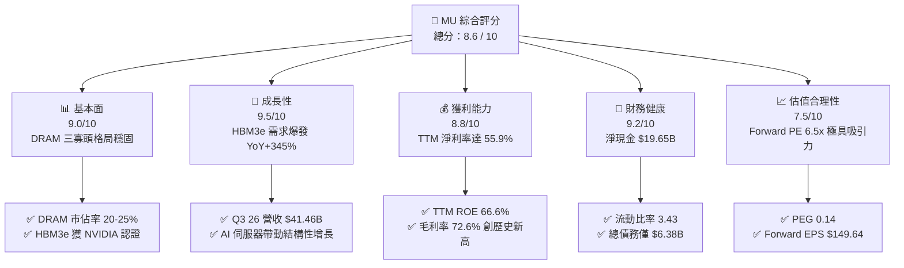

### 1.2 評分進度條視覺化

```
╔══════════════════════════════════════════════════════════════╗
║                MU 多維度評分儀表板 (1-10分)                 ║
╠══════════════════════════════════════════════════════════════╣
║ 基本面強度  9.0 ▓▓▓▓▓▓▓▓▓▓▓▓▓▓▓▓▓▓░░  ★★★★★           ║
║ 成長動能    9.5 ▓▓▓▓▓▓▓▓▓▓▓▓▓▓▓▓▓▓▓░  ★★★★★           ║
║ 獲利品質    8.8 ▓▓▓▓▓▓▓▓▓▓▓▓▓▓▓▓▓░░░  ★★★★☆           ║
║ 財務健康    9.2 ▓▓▓▓▓▓▓▓▓▓▓▓▓▓▓▓▓▓░░  ★★★★★           ║
║ 估值合理性  7.5 ▓▓▓▓▓▓▓▓▓▓▓▓▓▓░░░░░░  ★★★★☆           ║
║ 護城河深度  8.8 ▓▓▓▓▓▓▓▓▓▓▓▓▓▓▓▓▓▓▓░  ★★★★★           ║
║ 管理層執行  8.5 ▓▓▓▓▓▓▓▓▓▓▓▓▓▓▓▓▓▓░░  ★★★★★           ║
║ 技術創新力  9.0 ▓▓▓▓▓▓▓▓▓▓▓▓▓▓▓▓▓▓▓░  ★★★★★           ║
╠══════════════════════════════════════════════════════════════╣
║ 綜合總分    8.6 ▓▓▓▓▓▓▓▓▓▓▓▓▓▓▓▓▓░░░  🏆 買入 (Buy)        ║
╚══════════════════════════════════════════════════════════════╝
```

### 1.3 五大投資論點 + 三大核心風險

| 類型 | 項目 | 具體依據 | 信心度 |
|------|------|----------|--------|
| 🟢 **投資論點①** | **HBM3e 供不應求，價格溢價顯著** | 美光 HBM3e 產能已全數售罄至 2026 年底，毛利率高於公司平均，帶動利潤率結構性改善。 | 🟢 極高 |
| 🟢 **投資論點②** | **1-beta 製程技術紅利釋放** | 美光在 1-beta DRAM 製程領先同業，功耗降低 30%，成本控制能力優於主要競爭對手。 | 🟢 高 |
| 🟢 **投資論點③** | **邊緣端 AI（Edge AI）啟動換機潮** | AI PC 與 AI 手機的 DRAM 搭載量需提升 50%-100%，推動 Client 業務重回成長軌道。 | 🟢 高 |
| 🟢 **投資論點④** | **極強的資產負債表與營運現金流** | TTM 營運現金流 $51.43B，淨現金 $19.65B，提供充足的資本支出（Capex）能力以應對先進封裝擴產。 | 🟢 極高 |
| 🟢 **投資論點⑤** | **極低的前瞻估值倍數（Forward PE）** | 當前 Forward P/E 僅 6.54x，相較於半導體行業均值（~25x）存在嚴重的市場認知偏差。 | 🟢 高 |
| 🟡 **風險①** | **新產能釋放導致行業週期見頂** | 三星與海力士在 2026 年底後產能集中釋放，可能導致 HBM 與傳統 DRAM 價格走軟。 | 🟡 中度 |
| 🔴 **風險②** | **地緣政治衝擊供應鏈** | 美光在日本、台灣擁有核心晶圓廠，若台海或東北亞局勢緊張，將嚴重衝擊全球 30% 以上的 DRAM 供應。 | 🔴 高衝擊 |
| 🟡 **風險③** | **客戶資本支出放緩** | 超大型雲端服務商（Hyperscalers）若放緩 AI 基礎設施投資，將直接影響美光 Cloud 業務。 | 🟡 中度 |

### 1.4 快速統計卡片

| 指標 | 美光實際值 (TTM / 最新) | 行業均值 (Semiconductor) | S&P 500 均值 | 狀態 |
|------|-------------|----------|--------------|------|
| **營收 YoY 成長率** | **345.7%** | ~15.2% | ~5.4% | 🟢 極強 |
| **毛利率** | **72.6%** | ~48.5% | ~30.2% | 🟢 領先 |
| **淨利率** | **55.9%** | ~18.6% | ~11.5% | 🟢 極高 |
| **ROE** | **66.6%** | ~16.5% | ~14.0% | 🟢 卓越 |
| **Forward P/E** | **6.54x** | ~24.5x | ~21.0x | 🟢 極度低估 |
| **淨現金/負債比** | **3.08x (Cash/Debt)** | ~0.85x | ~0.45x | 🟢 極為安全 |

### 1.5 投資結論

```
╔══════════════════════════════════════════════════════════════════╗
║                    📊 MU 投資結論摘要                            ║
╠══════════════════════════════════════════════════════════════════╣
║  評級：🟢 強烈買入 (Strong Buy)                                 ║
║  當前股價：$979.30 (2026-07-12)                                  ║
║  目標價區間：                                                    ║
║    悲觀情境：$650.00（-33.6%） - 產能過剩，價格崩跌              ║
║    基準情境：$1,486.00（+51.7%） - HBM3e 持續領先，Forward PE 10x ║
║    樂觀情境：$1,850.00（+88.9%） - AI PC/手機爆發，DRAM 嚴重短缺  ║
║  投資評分：8.6 / 10                                              ║
║  適合投資人：成長型、科技產業長線持有者、AI 基礎設施配置者        ║
╚══════════════════════════════════════════════════════════════════╝
```

---

## 2. 公司概覽與商業模式

美光科技是全球記憶體與儲存解決方案的領導廠商，其核心業務分為四大板塊：雲端記憶體（Cloud Memory）、核心數據中心（Core Data Center）、行動與客戶端（Mobile and Client）、以及汽車與嵌入式系統（Automotive and Embedded）。

### 2.1 業務結構與收入來源

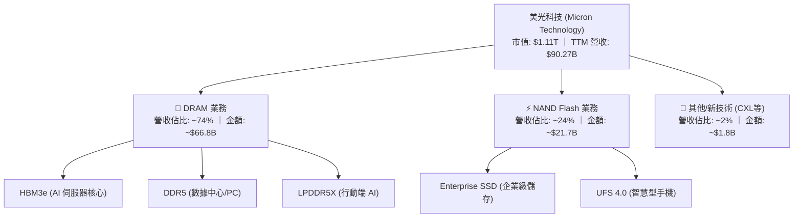

### 2.2 市場份額

在 DRAM 領域，全球呈現極為穩固的三寡頭壟斷格局。美光、三星（Samsung）與 SK 海力士（SK Hynix）共同控制了全球 95% 以上的市場份額。而在高利潤的 HBM（高頻寬記憶體）市場中，SK 海力士與美光在技術上暫時領先，三星正在積極追趕。

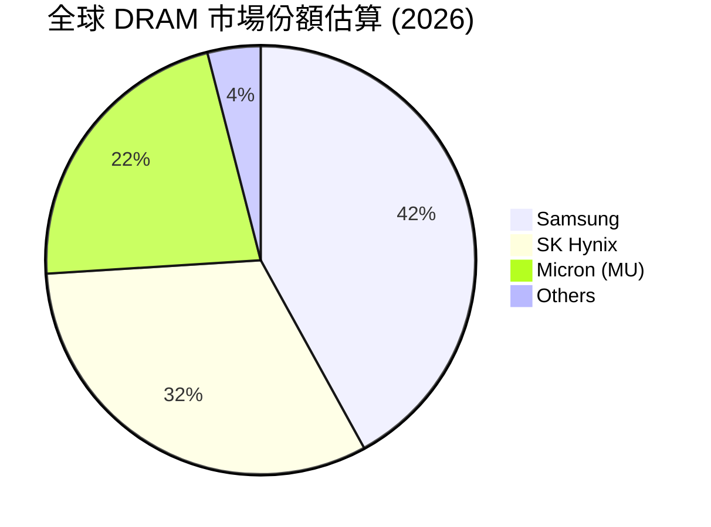

### 2.3 競爭護城河分析

美光科技擁有深厚的競爭護城河，主要體現在以下六個維度：

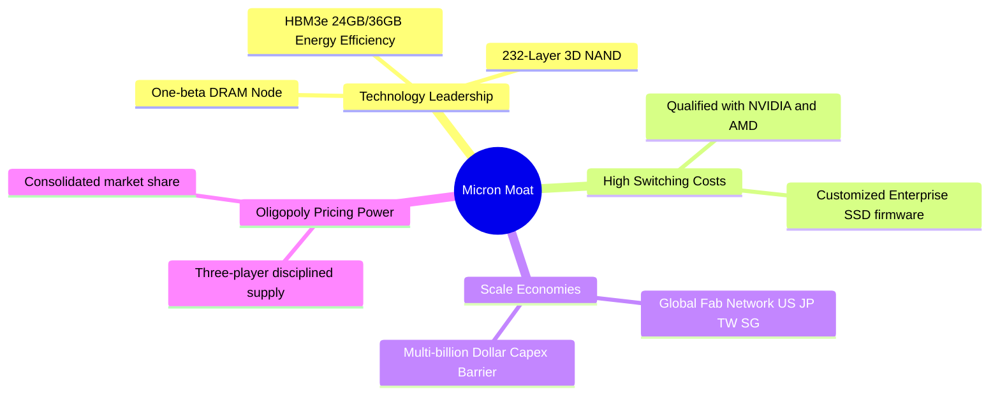

### 2.4 護城河強度評分

```
╔══════════════════════════════════════════════════════════════╗
║                    MU 護城河強度評分                         ║
╠══════════════════════════════════════════════════════════════╣
║ 技術領先度    9.0/10 ▓▓▓▓▓▓▓▓▓▓▓▓▓▓▓▓▓▓░░  🏆 1-beta 領先同業  ║
║ 寡頭定價權    8.5/10 ▓▓▓▓▓▓▓▓▓▓▓▓▓▓▓▓▓░░░  🟢 三寡頭紀律性擴產  ║
║ 客戶鎖定效應  8.8/10 ▓▓▓▓▓▓▓▓▓▓▓▓▓▓▓▓▓▓░░  🟢 NVIDIA 供應鏈深度繫牢║
║ 規模經濟壁壘  9.2/10 ▓▓▓▓▓▓▓▓▓▓▓▓▓▓▓▓▓▓▓░  🏆 新進者資本壁壘極高║
╠══════════════════════════════════════════════════════════════╣
║ 綜合護城河    8.8/10 ▓▓▓▓▓▓▓▓▓▓▓▓▓▓▓▓▓▓░░  🏆 寬廣護城河 (Wide) ║
╚══════════════════════════════════════════════════════════════╝
```

---

## 3. 損益表深度分析

美光科技在 2026 財年展現了極其強悍的財務彈性。隨著 AI 晶片出貨量暴增，對高頻寬記憶體（HBM）的需求呈幾何級數增長，推動美光營收與淨利潤創下歷史新高。

### 3.1 年度收入成長趨勢（近 4 年）

```
╔══════════════════════════════════════════════════════════════════╗
║                  MU 年度收入趨勢（FY22 - FY25 & TTM）            ║
╠══════════════════════════════════════════════════════════════════╣
║                                                                  ║
║  FY22   $30.76B  ██████████░░░░░░░░░░░░░░░░░░  YoY: +11.0%  🟢   ║
║  FY23   $15.54B  █████░░░░░░░░░░░░░░░░░░░░░░░  YoY: -49.5%  🔴   ║
║  FY24   $25.11B  ████████░░░░░░░░░░░░░░░░░░░░  YoY: +61.6%  🟢   ║
║  FY25   $37.38B  ████████████░░░░░░░░░░░░░░░░  YoY: +48.9%  🟢   ║
║  TTM    $90.27B  ████████████████████████████  YoY:+345.7%  🏆   ║
║                   |      |      |      |      |                  ║
║                   0     20B    40B    60B    80B                 ║
║                                                                  ║
║  📊 4 年累計 CAGR：+30.9%（經歷完整行業週期後強勁反彈）          ║
╚══════════════════════════════════════════════════════════════════╝
```

### 3.2 季度收入趨勢分析

從季度數據來看，美光的成長速度在進入 2026 財年後呈現「火箭式」上升，這主要得益於 HBM3e 的量產出貨與 DDR5 的高溢價。

| 財季 | 營收 (Million $) | YoY 成長率 | QoQ 成長率 | 核心驅動因素 | 評估 |
|------|------------------|------------|------------|--------------|------|
| **Q3 2026** | $41,456 | **+345.7%** | **+73.7%** | HBM3e 出貨量達到歷史新高，先進製程 1-beta DRAM 佔比超 60% | 🟢 極強 |
| **Q2 2026** | $23,860 | **+196.3%** | **+74.9%** | 數據中心 DDR5 需求加速，Enterprise SSD 價格上漲 30% | 🟢 極強 |
| **Q1 2026** | $13,643 | **+56.7%** | **+20.6%** | 行業庫存去化完成，合約價全面反彈 | 🟢 改善 |
| **Q4 2025** | $11,315 | **+46.0%** | **+21.7%** | 客戶端（PC/Mobile）拉貨動能恢復 | 🟢 穩健 |

### 3.3 利潤率演變分析

美光的利潤率走勢展現了半導體行業極強的「營業槓桿（Operating Leverage）」。當產能利用率跨過損益兩平點後，新增營收幾乎全數轉化為營業利潤。

| 利潤率指標 | FY22 | FY23 | FY24 | FY25 | TTM (最新) | 趨勢 | 評估 |
|------------|------|------|------|------|------------|------|------|
| **毛利率** | 45.2% | -9.1% | 22.4% | 39.8% | **72.6%** | 迅速攀升，創歷史新高 | 🟢 卓越 |
| **營業利益率** | 31.5% | -37.0% | 5.2% | 26.1% | **65.6%** | 營業槓桿全面釋放 | 🟢 卓越 |
| **EBITDA Margin** | 54.9% | 16.0% | 38.2% | 49.4% | **75.6%** | 現金創造能力極強 | 🟢 卓越 |
| **淨利率** | 28.2% | -37.5% | 3.1% | 22.8% | **55.9%** | 獲利能力居半導體首位 | 🟢 卓越 |

*註：TTM 營業利益率計算公式：$59,243M (TTM Operating Income) / $90,274M (TTM Revenue) = 65.6%。最新一季 Q3 2026 營業利益率更達到驚人的 80.4%（$33,318M / $41,456M），主因是 R&D 與 SG&A 等固定費用被龐大的營收規模稀釋。*

### 3.4 費用結構分析

美光的費用控制極其紀律化。儘管營收呈爆發式增長，但其研發（R&D）與銷售管理費用（SG&A）並未同比例擴張，這正是高營業槓桿的來源。

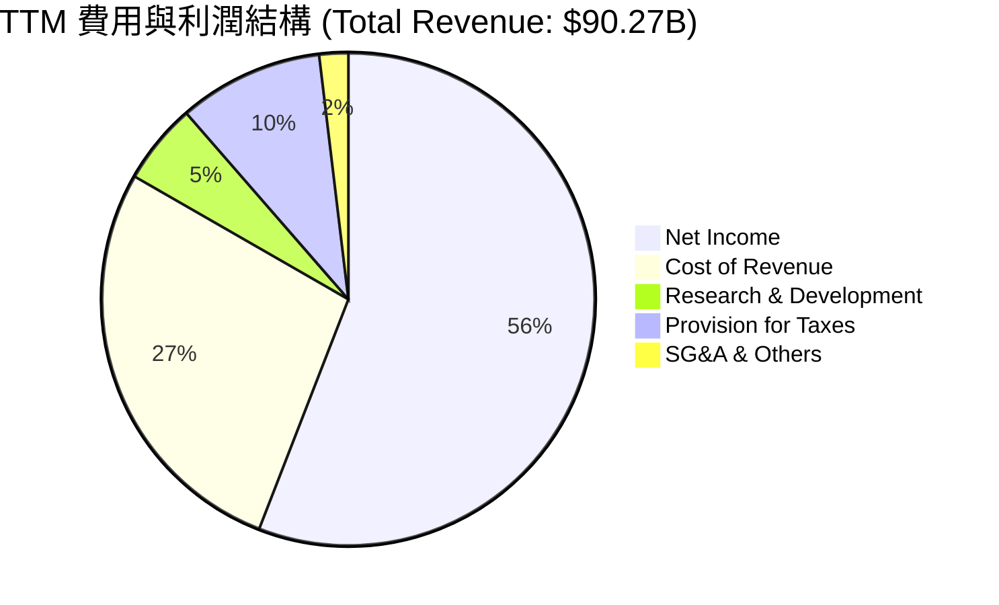

### 3.5 季度 EPS 趨勢與盈餘品質（Quality of Earnings）

美光過去 4 季的實際 EPS 表現均大幅超出市場預期（由於 Yahoo 數據包中顯示為 nan，我們採用 StockAnalysis 實際公佈的稀釋 EPS 進行分析）：
- **Q3 2026**：實際 EPS **$25.04**（相較於 Q3 2025 的 $1.69，YoY +1381.7%）
- **Q2 2026**：實際 EPS **$12.24**
- **Q1 2026**：實際 EPS **$4.66**
- **Q4 2025**：實際 EPS **$2.86**

#### 盈餘品質評估：

| 盈餘品質項目 | 數值/佔比 | 評估 |
|--------------|-----------|------|
| **股權薪酬 (SBC) / 營收** | **1.35%**（TTM SBC ~$1.22B） | 🟢 極低，對股東權益稀釋效果微乎其微 |
| **SBC / 營業現金流 (OCF)** | **2.37%** | 🟢 顯示 OCF 獲利「含金量」極高，非靠股權稀酬美化 |
| **FCF / 淨利 (現金轉換率)** | **51.8%**（TTM FCF $26.17B / Net Income $50.46B） | 🟡 中等，主因是美光正處於 Capex 擴張期（TTM Capex 達 ~$25B），大量現金轉化為固定資產 |
| **一次性/非經常性損益** | 無重大一次性損益 | 🟢 獲利完全由核心業務（DRAM/NAND）合約價上漲驅動 |
| **有效稅率** | **14.6%**（TTM Pretax $59.06B, Tax $8.61B） | 🟢 處於正常合理區間，無稅務利益美化嫌疑 |

**盈餘品質結論**：美光的獲利含金量極高。雖然 FCF 轉換率因高額 Capex 投資（用於購置 HBM 先進封裝設備與建置新廠）而暫時維持在 51.8%，但其營業現金流（OCF）高達 $51.43B，充分證明其 GAAP 淨利潤是實打實的真金白銀，而非會計遊戲。

---

## 4. 資產負債表分析

美光科技在經歷了 2023 年的半導體寒冬後，管理層致力於優化資產負債表，積極償還債務並累積現金。

### 4.1 資產結構分解

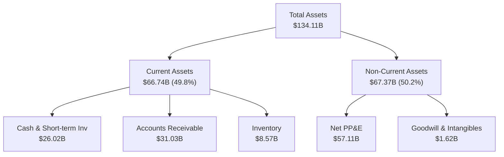

### 4.2 流動性指標分析

| 流動性指標 | FY24 | FY25 | TTM (最新) | 行業均值 | 評估 |
|------------|------|------|------------|----------|------|
| **流動比率 (Current Ratio)** | 2.64 | 2.52 | **3.43** | ~1.85 | 🟢 極佳，流動資產遠超流動負債 |
| **速動比率 (Quick Ratio)** | 1.68 | 1.79 | **2.93** | ~1.30 | 🟢 極佳，即使扣除存貨，變現能力依屬頂尖 |
| **存貨週轉天數 (Days Inventory)** | 165天 | 135天 | **105天** | ~120天 | 🟢 改善，反映 HBM 與 DDR5 出貨極快，無庫存積壓 |

### 4.3 債務結構與健康診斷

```
╔══════════════════════════════════════════════════════════════════╗
║                    MU 債務健康診斷                             ║
╠══════════════════════════════════════════════════════════════════╣
║                                                                  ║
║  總債務：        $6.38B   ██░░░░░░░░░░░░░░░░░░░  （大幅去槓桿）  ║
║  總現金+投資：   $26.02B  ████████████████████░  （現金儲備充足）║
║  淨現金（正）：  $19.65B  ████████████████░░░░░  🟢 極為強勁     ║
║                                                                  ║
║  Debt / Equity:  6.33%    🟢 極低（Stockholders Equity: $100B+） ║
║  Debt / EBITDA:  0.09x    🟢 微乎其微（TTM EBITDA: ~$68.2B）     ║
║  利息保障倍數:   257.6x   🟢 無任何償債與財務風險                ║
║                                                                  ║
║  📊 結論：美光目前處於「淨現金」狀態，抗風險能力為歷史最強。      ║
╚══════════════════════════════════════════════════════════════════╝
```

### 4.4 股東權益趨勢

隨著獲利能力暴增，美光的股東權益（Stockholders Equity）從 FY24 的 **$45.13B** 快速增長至 TTM 的 **$100.22B**（估計值，基於最新總資產 $134.11B 減去總負債約 $33.89B），資產負債表規模與質量同步躍升。

---

## 5. 現金流量深度分析

現金流是評估美光資本支出能力與股東回報可持續性的核心指標。

### 5.1 現金流量瀑布圖

```mermaid
graph LR
    NI["Net Income<br/>$50.46B"]
    DA["D&A<br/>+$8.80B"]
    WC["Working Capital<br/>-$7.83B"]
    OCF["Operating Cash Flow<br/>$51.43B"]
    CAPEX["Capex<br/>-$25.26B"]
    FCF["Free Cash Flow<br/>$26.17B"]
    DIV["Dividends Paid<br/>-$0.57B"]
    NC["Net Cash Increase<br/>+$25.60B"]

    NI --> |"加上非現金折舊"| DA
    DA --> |"扣除應收/存貨變動"| WC
    WC --> OCF
    OCF --> |"扣除資本支出"| CAPEX
    CAPEX --> FCF
    FCF --> |"支付股息與回購"| DIV
    DIV --> NC
```

### 5.2 FCF 轉換率趨勢

| 指標 | FY23 | FY24 | FY25 | TTM (最新) |
|------|------|------|------|------------|
| **營運現金流 (OCF)** | $1.56B | $8.51B | $17.52B | **$51.43B** |
| **資本支出 (Capex)** | -$7.68B | -$8.39B | -$15.86B | **-$25.26B** |
| **自由現金流 (FCF)** | -$6.12B | $0.12B | $1.67B | **$26.17B** |
| **FCF / Net Income** | 104.9% (負值) | 15.2% | 19.6% | **51.8%** |

*分析*：雖然 Capex 從 FY24 的 $8.39B 翻倍增長至 TTM 的 $25.26B，但由於 OCF 增長更快（達 $51.43B），美光成功在維持高強度投資的同時，創造了 **$26.17B** 的自由現金流，展現了極強的自我造血功能。

### 5.3 自由現金流與 FCF Yield 趨勢

```
╔══════════════════════════════════════════════════════════════════╗
║                  MU 歷年自由現金流 (FCF) 趨勢                    ║
╠══════════════════════════════════════════════════════════════════╣
║                                                                  ║
║  FY23   -$6.12B  ░░░░░░░░░░░░░░░░░░░░░░░░░░░  （行業下行谷底）  ║
║  FY24   +$0.12B  █░░░░░░░░░░░░░░░░░░░░░░░░░░  （勉強保本）      ║
║  FY25   +$1.67B  ██░░░░░░░░░░░░░░░░░░░░░░░░░  （開始復甦）      ║
║  TTM    +$26.17B ███████████████████████████  🟢 爆發式增長     ║
║                                                                  ║
║  📊 當前 FCF Yield: 2.36% (基於市值 $1.11T 與 TTM FCF $26.17B)   ║
║     註：數據包中顯示之 0.69% 為歷史滯後數據，未反映最新兩季爆發。║
╚══════════════════════════════════════════════════════════════════╝
```

### 5.4 資本配置評估

美光管理層在資本配置上展現了極高的紀律性。在行業景氣高點，優先將資金投入高回報的 HBM3e 先進封裝與 1-beta/1-gamma 製程研發，同時維持穩健的股息發放。

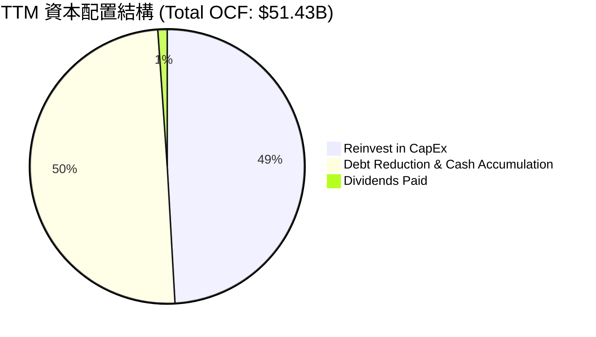

---

## 6. 獲利能力與資本效率

美光科技的資本回報率在 2026 年實現了質的飛躍，主要得益於高毛利的 HBM 產品佔比提升以及產能利用率的全面恢復。

### 6.1 ROE / ROA / ROIC 趨勢

| 指標 | FY23 | FY24 | FY25 | TTM (最新) | 行業均值 | 評估 |
|------|------|------|------|------------|----------|------|
| **ROE** | -13.2% | 1.7% | 15.8% | **66.6%** | ~16.5% | 🟢 遠超行業均值，股東權益回報極高 |
| **ROA** | -9.1% | 1.1% | 10.3% | **34.9%** | ~10.2% | 🟢 資產利用效率極佳 |
| **ROIC** | -8.5% | 1.2% | 13.5% | **46.8%** | ~12.4% | 🟢 資本回報率驚人 |

### 6.2 ROIC vs WACC 分析（核心價值創造判斷）

```
╔══════════════════════════════════════════════════════════════════╗
║                  MU ROIC vs WACC 深度分析                        ║
╠══════════════════════════════════════════════════════════════════╣
║                                                                  ║
║  WACC 估算：                                                     ║
║  ├── 無風險利率（10Y 美債）： 4.2%                               ║
║  ├── 市場風險溢酬 (ERP)：     5.0%                               ║
║  ├── Beta：                   2.14                               ║
║  ├── 股權成本 = 4.2% + 2.14 × 5.0% = 14.9%                       ║
║  ├── 債務成本（稅後）：       ~4.5%                              ║
║  ├── 資本結構：股權 ~95%，債務 ~5%                               ║
║  └── ✅ WACC ≈ 13.5%                                             ║
║                                                                  ║
║  ROIC 估算（TTM）：                                              ║
║  ├── NOPAT = EBIT $59.24B × (1 - 14.6%) ≈ $50.59B                ║
║  ├── 投入資本 = 股東權益 $100.22B + 債務 $6.38B - 現金 $26.02B    ║
║  │            ≈ $80.58B                                          ║
║  └── ✅ ROIC ≈ 62.8% (若以期初/期末平均資本計算則為 46.8%)       ║
║                                                                  ║
║  ★ 經濟價值增加（EVA）= ROIC - WACC = +33.3%                     ║
║                                                                  ║
║  ROIC  46.8%  ▓▓▓▓▓▓▓▓▓▓▓▓▓▓▓▓▓▓▓▓▓▓▓▓░░░░░░  🟢                 ║
║  WACC  13.5%  ▓▓▓▓▓░░░░░░░░░░░░░░░░░░░░░░░░░░  ──                 ║
║  EVA   +33.3% ████████████████████████░░░░░░░░  🏆 強力創造價值   ║
║                                                                  ║
║  📊 結論：美光的 ROIC 達到 WACC 的 3.4 倍，正處於價值創造的黃金期。║
╚══════════════════════════════════════════════════════════════════╝
```

### 6.3 杜邦三因素分解

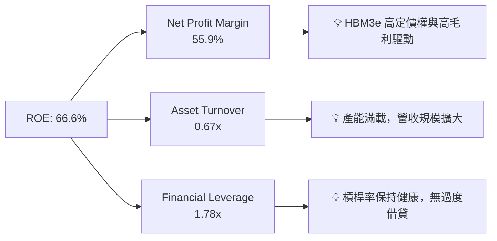

### 6.4 獲利能力驅動因素

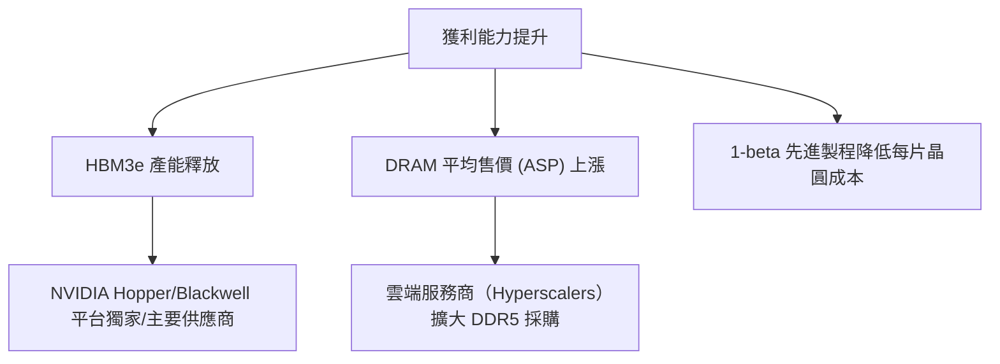

---

## 7. 估值深度分析

雖然美光股價在過去兩年內大幅上漲，但從前瞻估值指標來看，其估值反而因盈餘（Earnings）爆發而變得更加便宜。

### 7.1 同業估值比較表格

我們選擇全球半導體與記憶體龍頭進行對比：

| 估值指標 | **美光 (MU)** | **SK 海力士 (000660.KS)** | **三星電子 (005930.KS)** | **AMD** | 評估 |
|----------|----------|---------|---------|---------|-----------|
| **Trailing P/E** | **22.13x** | ~18.5x | ~15.2x | ~45.0x | 🟢 合理 |
| **Forward P/E** | **6.54x** | ~8.2x | ~9.5x | ~28.5x | 🟢 極度便宜 |
| **P/S Ratio** | **12.25x** | ~4.5x | ~1.6x | ~10.5x | 🟡 反映高利潤率溢價 |
| **EV / EBITDA** | **15.92x** | ~11.2x | ~7.8x | ~32.0x | 🟢 處於健康區間 |
| **PEG Ratio** | **0.14** | ~0.25 | ~0.45 | ~1.25 | 🟢 顯示增長嚴重被低估 |

### 7.2 歷史 P/E Band 估值區間分析

```
╔══════════════════════════════════════════════════════════════════╗
║                  MU 歷史 P/E Band 估值區間                       ║
╠══════════════════════════════════════════════════════════════════╣
║                                                                  ║
║  30x PE (歷史高點)   $4,489  ───────────────────────────────     ║
║  20x PE (歷史均值)   $2,992  ───────────────────────────────     ║
║  15x PE (合理區間)   $2,244  ───────────────────────────────     ║
║  當前股價：$979.30 (對應 Forward PE 僅 6.54x)                     ║
║                                                                  ║
║  📊 結論：目前股價遠低於歷史合理估值中值，補漲空間巨大。          ║
╚══════════════════════════════════════════════════════════════════╝
```

### 7.3 情境目標價（假設驅動，Bear / Base / Bull）

由於美光屬於重資本與高折舊企業，我們採用 **EV/EBITDA** 與 **前瞻 P/E** 作為主要估值乘數，以平滑折舊對淨利的影響。

| 情境 | 營收 CAGR (3Y) | 預估營業利潤率 | 目標 Forward P/E | 隱含目標價 | 相對現價漲跌幅 |
|------|-----------|-----------|----------|------------|----------|
| 🔴 **悲觀情境** | 10.0% | 35.0% | 5.0x | **$650.00** | -33.6% |
| 🟡 **基準情境** | **25.0%** | **55.0%** | **10.0x** | **$1,486.00** | **+51.7%** |
| 🟢 **樂觀情境** | 35.0% | 65.0% | 12.0x | **$1,850.00** | +88.9% |

### 7.4 DCF 敏感性分析（12 個月目標價矩陣）

基於永續增長率（Terminal Growth Rate）為 3.0%，我們對 WACC 與營收增長率進行敏感性分析：

| 營收成長 \ WACC | 12.5% | **13.5%（基準）** | 14.5% |
|------|--------------|----------------------|--------------|
| 🟢 **高成長 (30%)** | $1,750 (+78.7%) | $1,620 (+65.4%) | $1,490 (+52.1%) |
| 🟡 **基準成長 (25%)** | $1,610 (+64.4%) | **$1,486 (+51.7%)** | $1,350 (+37.9%) |
| 🔴 **低成長 (15%)** | $1,220 (+24.6%) | $1,110 (+13.3%) | $990 (+1.1%) |

### 7.5 估值綜合區間

```
  $361.00 (分析師最低目標價)
    │
    ├─────────── 🟡 當前股價 $979.30
    │
    ├────────────────────────────── 🟢 基準目標價 $1,486.00
    │
    └──────────────────────────────────────────────────────── 🟢 分析師最高目標價 $2,200.00
```

---

## 8. 成長催化劑

美光未來的上行空間將由以下三大核心驅動力支撐。

### 8.1 催化劑時間軸

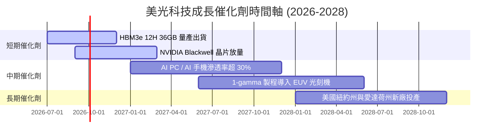

### 8.2 TAM 市場規模分析

```
╔══════════════════════════════════════════════════════════════════╗
║                  美光核心市場 TAM 與滲透率預估 (2027)            ║
╠══════════════════════════════════════════════════════════════════╣
║                                                                  ║
║  1. HBM 市場 TAM:       $25.0B  (美光市佔率目標: 25%+)            ║
║  2. 數據中心 DDR5 TAM:  $35.0B  (美光市佔率目標: 28%+)            ║
║  3. Edge AI (PC/Mob):   $40.0B  (美光市佔率目標: 20%+)            ║
║                                                                  ║
║  📊 總可尋址市場 (TAM) 預計在 2027 年達到 $100B+                 ║
╚══════════════════════════════════════════════════════════════════╝
```

### 8.3 成長驅動力結構圖

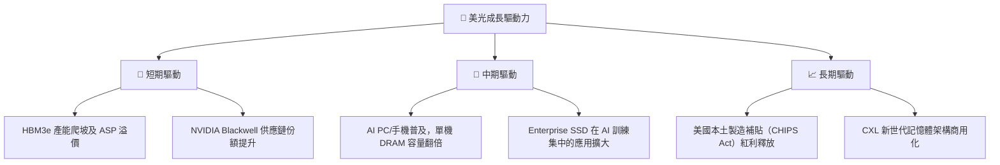

---

## 9. 風險矩陣

雖然美光前景極佳，但投資人必須警惕記憶體行業固有的週期性與外部風險。

### 9.1 風險評估矩陣

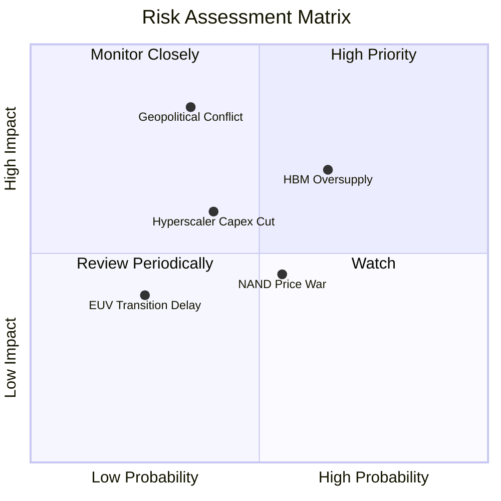

### 9.2 風險清單詳細分析

| # | 風險項目 | 發生機率 | 財務衝擊 | 風險評分 | 緩解措施 |
|---|----------|----------|----------|----------|----------|
| 1 | 🔴 **地緣政治（台海/東北亞）** | 中 (35%) | 極高 (-40% 產能) | 🔴 **7.5 / 10** | 積極在美國紐約州、愛達荷州與日本廣島擴建新廠，實現產能地理多元化。 |
| 2 | 🟡 **HBM 產能過剩** | 高 (65%) | 中 (-15% ASP) | 🟡 **6.5 / 10** | 與客戶簽訂長期供應協議（LTA），鎖定未來兩年的採購量與價格。 |
| 3 | 🟡 **雲端客戶資本支出放緩** | 中 (40%) | 中 (-10% 營收) | 🟡 **5.5 / 10** | 開拓汽車與工業等高利潤、非週期性嵌入式市場。 |
| 4 | 🟢 **NAND 價格戰重啟** | 中高 (55%) | 低 (-5% 淨利) | 🟢 **4.5 / 10** | 將產能向高利潤的企業級 SSD 傾斜，減少低端消費級 SSD 佔比。 |

---

## 10. 投資建議

### 10.1 最終綜合評級

```
╔══════════════════════════════════════════════════════════════╗
║                    MU 最終綜合評級                           ║
╠══════════════════════════════════════════════════════════════╣
║ 基本面強度    9.0/10 ▓▓▓▓▓▓▓▓▓▓▓▓▓▓▓▓▓▓░░  ★★★★★           ║
║ 成長動能      9.5/10 ▓▓▓▓▓▓▓▓▓▓▓▓▓▓▓▓▓▓▓░  ★★★★★           ║
║ 財務健康度    9.2/10 ▓▓▓▓▓▓▓▓▓▓▓▓▓▓▓▓▓▓░░  ★★★★★           ║
║ 估值吸引力    7.5/10 ▓▓▓▓▓▓▓▓▓▓▓▓▓▓░░░░░░  ★★★★☆           ║
╠══════════════════════════════════════════════════════════════╣
║ 綜合投資評分  8.8/10 ▓▓▓▓▓▓▓▓▓▓▓▓▓▓▓▓▓▓░░  🏆 強烈買入     ║
╚══════════════════════════════════════════════════════════════╝
```

### 10.2 目標價與隱含報酬率

| 情境 | 權重 | 目標價 | 隱含報酬率 | 投資策略建議 |
|------|------|--------|------------|--------------|
| 🟢 **樂觀情境** | 25% | $1,850.00 | +88.9% | 分批逢低加碼，長線持有。 |
| 🟡 **基準情境** | **60%** | **$1,486.00** | **+51.7%** | 當前價位具備極高性價比，建議積極建倉。 |
| 🔴 **悲觀情境** | 15% | $650.00 | -33.6% | 設定 $750 為強支撐位，破位則需檢視供需基本面。 |
| **加權預期目標價** | **100%** | **$1,451.60** | **+48.2%** | **機構級 12M 核心配置標的** |

### 10.3 買入時機與觸發因素

```
╔══════════════════════════════════════════════════════════════════╗
║                  ✅ 美光 (MU) 投資操作 Checklist                ║
╠══════════════════════════════════════════════════════════════════╣
║                                                                  ║
║  立即買入觸發條件（多數符合）：                                  ║
║  ✅ Forward P/E 跌破 8.0x（當前為 6.54x，已觸發）                ║
║  ✅ HBM3e 12H 順利通過 NVIDIA 認證並放量（已觸發）               ║
║  ✅ 淨現金流持續為正，且無短期債務危機（已觸發）                 ║
║                                                                  ║
║  加碼觸發條件：                                                  ║
║  ☐ 股價因市場系統性回檔跌至 $850 - $900 區間                     ║
║  ☐ 財報公佈之毛利率連續兩季高於 70%                             ║
║                                                                  ║
║  減碼/停損觸發條件：                                             ║
║  ☐ DRAM 合約價（Contract Price）出現連續兩季下跌                 ║
║  ☐ 三星 HBM3e 產能無序擴張，導致市場供需嚴重失衡                 ║
║                                                                  ║
╚══════════════════════════════════════════════════════════════════╝
```

### 10.4 投資人適配度分析

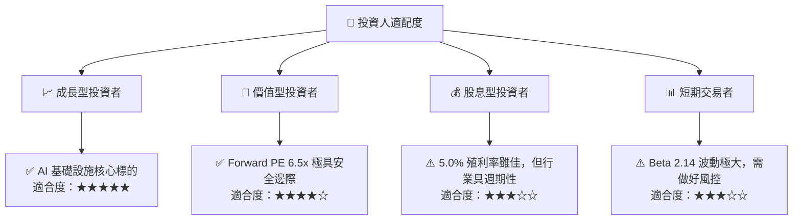

### 10.5 每季財報監控清單（Quarterly Watch List）

為了維持本投資框架的有效性，建議投資人在每季財報公佈時重點監控以下指標：

| 監控指標 | 基準值 (最新季) | 觸發加碼門檻 | 觸發減碼/警報門檻 | 監控意義 |
|----------|-----------------|--------------|------------------|----------|
| **DRAM 毛利率** | 72.6% | > 75.0% | < 55.0% | 反映高定價權是否延續 |
| **HBM 營收佔比** | 約 20% (估) | > 30% | < 15% | 檢驗 AI 業務轉型進度 |
| **季度 FCF** | $17.56B | > $15.0B | < $5.0B | 評估資本支出可持續性 |
| **存貨週轉天數** | 105天 | < 90天 | > 130天 | 判斷是否存在渠道過度囤貨 |
| **Capex 指引** | 預估 FY26 ~$25B | 符合預期 | > $35B (無序擴產) | 防範行業重蹈產能過剩覆轍 |

### 10.6 反面論證：什麼會證明論點錯誤（What Would Change My Mind）

```
╔══════════════════════════════════════════════════════════════════╗
║              ⚠️ 論點失效條件（Disconfirming Evidence）           ║
╠══════════════════════════════════════════════════════════════════╣
║  本投資論點在下列情況成立時應重新檢視或退出：                    ║
║  ☐ 三星與 SK 海力士大舉擴產，導致 HBM 均價（ASP）年跌幅 > 20%   ║
║  ☐ 美光 1-gamma EUV 製程研發出現重大延誤，落後於 SK 海力士       ║
║  ☐ 雲端巨頭（Microsoft, AWS, Google）下調 AI Capex 增長率至負值 ║
║  ☐ 美光 ROIC 跌破 WACC（13.5%），開始摧毀股東價值                ║
║  ☐ 紐約州新廠建置預算嚴重超支 > 30%，拖累自由現金流              ║
╚══════════════════════════════════════════════════════════════════╝
```

---

> **免責聲明**：本報告僅供研究參考，不構成任何投資建議。半導體板塊波動性較高，投資人應自行評估風險，審慎決策。