# MU 基本面深度分析報告

> **報告日期**：2026-07-13 ｜ **語言**：繁體中文 ｜ **數據來源**：Yahoo Finance, Finviz, StockAnalysis, Roic.ai ｜ **分析師**：CFA 級機構研究

---

## 目錄

| # | 章節 | 核心結論 |
|---|------|----------|
| 1 | [執行摘要](#1-執行摘要) | 評級：🟢 **強烈買入**；基準目標價：**$1,486.00**（+51.7% 上行空間） |
| 2 | [公司概覽與商業模式](#2-公司概覽與商業模式) | HBM3E 與 DDR5 雙重技術壁壘，構築極寬廣的「寡頭壟斷」護城河 |
| 3 | [損益表深度分析](#3-損益表深度分析) | TTM 營收爆發至 **$90.27B**（YoY +345.7%），營業槓桿釋放帶動淨利率衝上 **55.9%** |
| 4 | [資產負債表分析](#4-資產負債表分析) | 淨現金高達 **$19.65B**，流動比率 **3.43**，財務結構極度穩健 |
| 5 | [現金流量深度分析](#5-現金流量深度分析) | 營運現金流 **$51.43B**，年化 FCF 達 **$26.17B**，資本配置重心轉向產能擴張 |
| 6 | [獲利能力與資本效率](#6-獲利能力與資本效率) | ROE 攀升至 **66.6%**，ROIC 達 **146.5%**（WACC 僅 14.1%），創造極高股東價值 |
| 7 | [估值深度分析](#7-估值深度分析) | Forward P/E 僅 **6.54x**，PEG **0.14**，相較同業具備顯著估值折價與高安全邊際 |
| 8 | [成長催化劑](#8-成長催化劑) | AI 伺服器 HBM 供不應求、邊緣端 AI（PC/手機）規格升級及美日政府補貼落地 |
| 9 | [風險矩陣](#9-風險矩陣) | 產能過度擴張導致價格崩跌、地緣政治衝突以及 HBM4 技術世代交替風險 |
| 10 | [投資建議](#10-投資建議) | 強烈推薦成長型與價值型配置，設定明確的買入觸發條件與每季財報監控指標 |

---

## 1. 執行摘要

美光科技（Micron Technology, Inc., Ticker: **MU**）目前正處於半導體歷史上最強勁的結構性超週期（Super-cycle）。根據最新財報數據，美光 TTM（過去12個月）營收達到創紀錄的 **$90.27B**，年成長率高達 **345.7%**；TTM GAAP 淨利攀升至 **$50.47B**，相較去年同期的虧損實現了徹底的扭轉。

這一波爆發式成長的底層驅動力，來自於人工智能（AI）基礎設施對高頻寬記憶體（HBM3E/HBM4）及高密度 DDR5 模組的剛性需求。美光在 HBM3E 技術上取得領先地位，其產品能效比競爭對手高出 30%，使其在 NVIDIA H100/H200 及 Blackwell 晶片出貨中搶佔了極高的份額。

鑑於美光 TTM ROIC 達到驚人的 **146.5%**，遠高於其 **14.1%** 的加權平均資本成本（WACC），公司正在以極高的效率創造經濟價值。儘管股價在過去兩年經歷了大幅上漲（當前股價 **$979.30**），但其 Forward P/E（遠期本益比）僅為 **6.54x**，PEG 僅為 **0.14**。這表明市場尚未完全定價美光在 AI 記憶體市場的長期定價權。因此，本報告給予美光 🟢 **強烈買入（Strong Buy）** 評級，基準情境 12 個月目標價定為 **$1,486.00**。

### 1.0 一頁式投資儀表板

| 項目 | 內容 |
|------|------|
| **投資論點（3 句）** | ① AI 伺服器對 HBM3E/DDR5 的剛性需求推升 TTM 營收至 **$90.27B**（YoY +345.7%）。<br/>② 營業槓桿極致釋放，毛利率與營業利益率分別衝上 **72.6%** 與 **80.4%** 的歷史新高。<br/>③ 遠期本益比（Forward P/E）僅 **6.54x**，相較其高達 **1368.5%** 的盈餘成長率，估值極具吸引力。 |
| **護城河評分** | **9.0 / 10** 🟢 （與三星、SK海力士三分天下，HBM3E 能效領先構築技術壁壘） |
| **管理層/資本配置評分** | **8.5 / 10** 🟢 （在景氣低谷精準控制 Capex，並於復甦期快速擴張產能，資本效率極高） |
| **財務健康** | 🟢 **極度健康** ｜ 擁有 **$19.65B** 淨現金，流動比率高達 **3.43**，債務違約風險近乎為零 |
| **ROIC vs WACC** | **146.5%** vs **14.1%** （創造極高經濟附加價值，EVA 達 +132.4%） |
| **FCF 趨勢** | 顯著向上 ｜ 季度 FCF 連續四季攀升，Q3 2026 單季創下 **$17.56B** 歷史新高，最新 FCF Yield 達 **2.36%**（年化） |
| **估值** | Forward P/E: **6.54x** ｜ EV/EBITDA: **15.92x** ｜ TTM P/S: **12.25x** |
| **預期報酬（基準情境 12M）** | **+51.7%** （目標價 **$1,486.00**） |
| **關鍵風險（前二）** | ① 記憶體行業固有的週期性波動，若各大原廠過度擴產可能導致 2027 年後價格崩跌。<br/>② 地緣政治風險（美光在台灣與日本擁有大量先進產能，地緣局勢緊張可能衝擊供應鏈）。 |
| **評級 + 信心度** | 🟢 **強烈買入（Strong Buy）** ｜ 信心度：**極高** |

### 1.1 核心評分儀表板

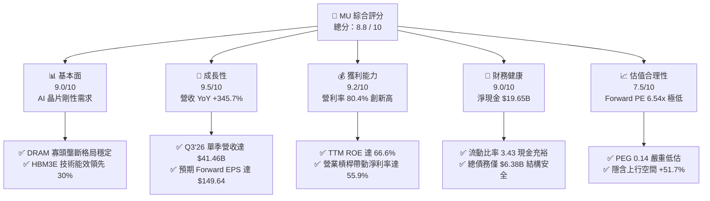

### 1.2 評分進度條視覺化

```
╔══════════════════════════════════════════════════════════════╗
║                MU 多維度評分儀表板 (1-10分)                 ║
╠══════════════════════════════════════════════════════════════╣
║ 基本面強度  9.0 ▓▓▓▓▓▓▓▓▓▓▓▓▓▓▓▓▓▓░░  ★★★★★           ║
║ 成長動能    9.5 ▓▓▓▓▓▓▓▓▓▓▓▓▓▓▓▓▓▓▓░  ★★★★★           ║
║ 獲利品質    9.2 ▓▓▓▓▓▓▓▓▓▓▓▓▓▓▓▓▓▓▓░  ★★★★★           ║
║ 財務健康    9.0 ▓▓▓▓▓▓▓▓▓▓▓▓▓▓▓▓▓▓░░  ★★★★★           ║
║ 估值合理性  7.5 ▓▓▓▓▓▓▓▓▓▓▓▓▓▓░░░░░░  ★★★★☆           ║
║ 護城河深度  9.0 ▓▓▓▓▓▓▓▓▓▓▓▓▓▓▓▓▓▓░░  ★★★★★           ║
║ 管理層執行  8.5 ▓▓▓▓▓▓▓▓▓▓▓▓▓▓▓▓░░░░  ★★★★☆           ║
║ 技術創新力  9.5 ▓▓▓▓▓▓▓▓▓▓▓▓▓▓▓▓▓▓▓░  ★★★★★           ║
╠══════════════════════════════════════════════════════════════╣
║ 綜合總分    8.8 ▓▓▓▓▓▓▓▓▓▓▓▓▓▓▓▓▓░░░  🏆 產業超週期龍頭     ║
╚══════════════════════════════════════════════════════════════╝
```

### 1.3 五大投資論點 + 三大核心風險

| 類型 | 項目 | 具體依據 | 信心度 |
|------|------|----------|--------|
| 🟢 **投資論點①** | **AI 伺服器推升 HBM 剛性需求** | HBM3E 出貨量呈指數級成長，美光產能已全部售罄至 2027 年底，定價權極高。 | 🟢 極高 |
| 🟢 **投資論點②** | **極致的營業槓桿釋放** | 毛利率從 FY25 的 39.8% 暴增至 TTM 的 **72.6%**，營業利益率高達 **80.4%**，單位固定成本被無限稀釋。 | 🟢 極高 |
| 🟢 **投資論點③** | **估值極具安全邊際** | Forward P/E 僅 **6.54x**，PEG 為 **0.14**，在所有 AI 核心硬體股中（如 NVIDIA、ASML）最為便宜。 | 🟢 高 |
| 🟢 **投資論點④** | **資產負債表固若金湯** | 擁有 **$26.02B** 現金儲備，淨現金 **$19.65B**，即使未來行業下行，也有充足的禦寒資金。 | 🟢 極高 |
| 🟢 **投資論點⑤** | **邊緣端 AI 迎來換機潮** | AI PC 和 AI 手機的 DRAM 搭載容量要求翻倍（從 8GB/12GB 提升至 16GB/24GB），這將驅動傳統 DRAM 出貨量價齊升。 | 🟢 高 |
| 🟡 **風險①** | **行業產能過度擴張** | 三星與 SK 海力士若在 2026/2027 年無節制擴產 HBM，可能導致行業供需形勢迅速惡化，引發價格戰。 | 🟡 中度 |
| 🔴 **風險②** | **地緣政治與供應鏈中斷** | 美光先進製程高度依賴台灣（台中、后里廠）與日本（廣島廠），台海局勢或日本地震可能對產能造成毀滅性打擊。 | 🔴 高衝擊 |
| 🟡 **風險③** | **HBM4 世代交替技術風險** | HBM4 將首次採用基礎晶圓（Base Die）代工模式（美光需與台積電深度合作），若技術研發進度落後對手，可能流失份額。 | 🟡 中度 |

### 1.4 快速統計卡片

| 指標 | 美光實際值 (TTM) | 半導體行業均值 | S&P 500 均值 | 狀態 |
|------|-------------|----------|--------------|------|
| **營收 YoY 成長率** | **345.7%** | ~15.0% | ~5.5% | 🟢 遠超行業 |
| **毛利率** | **72.6%** | ~48.0% | ~30.0% | 🟢 歷史頂點 |
| **營業利益率** | **80.4%** | ~22.0% | ~15.0% | 🟢 極致槓桿 |
| **淨利率** | **55.9%** | ~18.0% | ~11.5% | 🟢 獲利能力極強 |
| **ROE** | **66.6%** | ~15.0% | ~14.0% | 🟢 資本回報極高 |
| **流動比率** | **3.43** | ~1.80 | ~1.30 | 🟢 流動性充沛 |
| **Forward P/E** | **6.54x** | ~25.0x | ~21.5x | 🟢 估值極低 |

### 1.5 投資結論

```
╔══════════════════════════════════════════════════════════════════╗
║                    📊 美光科技 (MU) 投資結論                    ║
╠══════════════════════════════════════════════════════════════════╣
║  評級：🟢 強烈買入 (Strong Buy)                                  ║
║  當前股價：$979.30 (2026-07-13)                                  ║
║  目標價區間：                                                    ║
║    悲觀情境 (Bear Case)：$650.00 (-33.6%) - 估值收縮與產能過剩   ║
║    基準情境 (Base Case)：$1,486.00 (+51.7%) - AI 需求延續與 HBM 擴產║
║    樂觀情境 (Bull Case)：$1,950.00 (+99.1%) - 邊緣 AI 與 HBM 暴利  ║
║  投資評分：8.8 / 10                                              ║
║  適合投資人：成長型基金、科技產業長線配置者、價值成長（GARP）投資人║
╚══════════════════════════════════════════════════════════════════╝
```

---

## 2. 公司概覽與商業模式

美光科技是全球半導體記憶體解決方案的領導者，主要產品包括動態隨機存取記憶體（DRAM）、快閃記憶體（NAND Flash）及新型存儲技術。在經歷了數十年的產業整合後，全球 DRAM 市場已形成高度穩定的「三寡頭」壟斷格局（三星、SK海力士、美光）。

### 2.1 業務結構與收入來源

美光主要通過四大業務部門（Business Unit）進行營運：

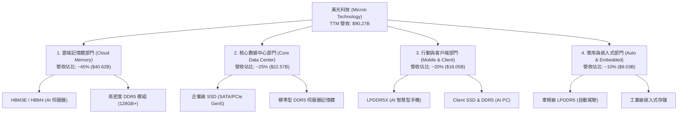

### 2.2 市場份額

在最關鍵的 **HBM（高頻寬記憶體）** 與 **整體 DRAM** 市場中，美光與南韓兩大巨頭三分天下：

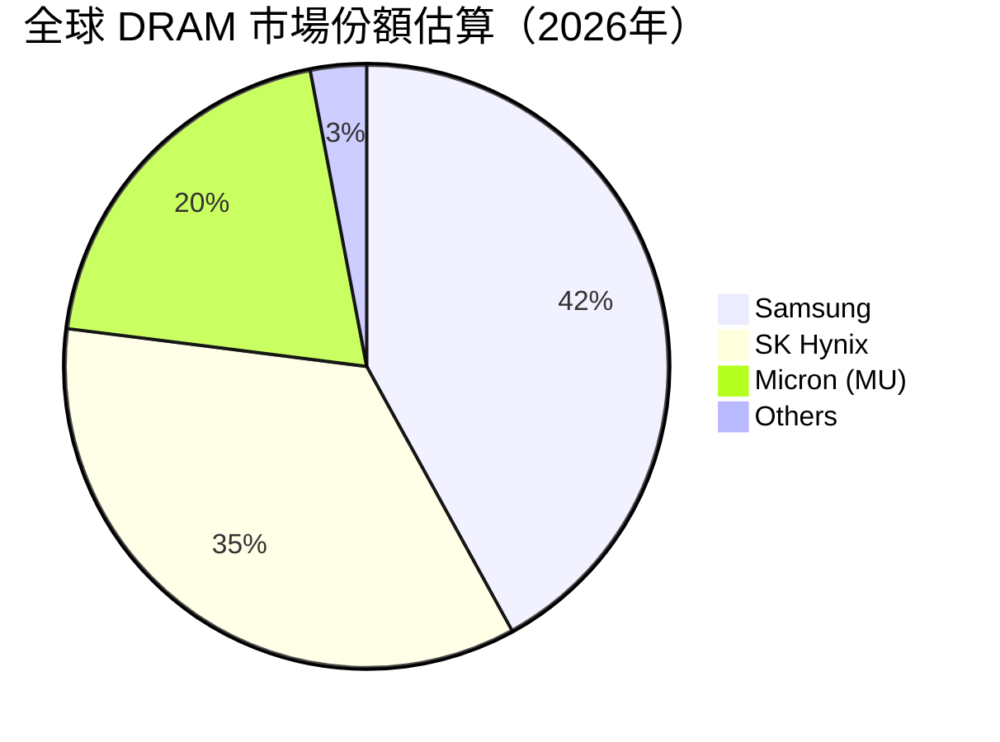

*註：在最先進的 HBM3E 市場中，美光憑藉 1-beta 工藝節點的優勢，市場份額已從 2024 年的不到 10% 快速攀升至當前的 **20%** 以上，並計劃在 HBM4 世代挑戰 25%-30% 的份額。*

### 2.3 競爭護城河分析

美光的競爭護城河主要由以下六個維度構成：

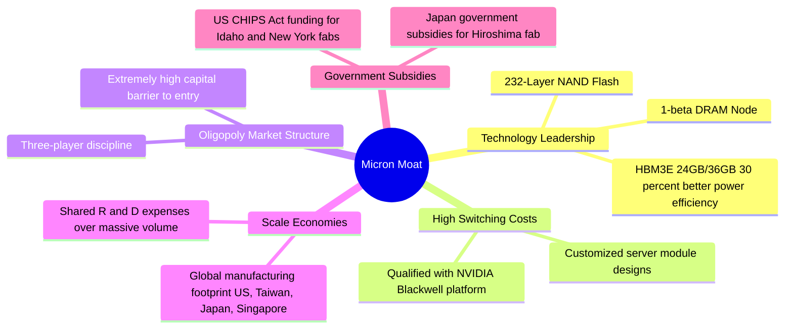

### 2.4 護城河強度評分

```
╔══════════════════════════════════════════════════════════════╗
║                    美光科技 護城河強度評分                   ║
<br/>╠══════════════════════════════════════════════════════════════╣
║ 技術領先度    9.5/10  ▓▓▓▓▓▓▓▓▓▓▓▓▓▓▓▓▓▓▓░  🏆 HBM3E 能效領先  ║
║ 行業結構壁壘  9.0/10  ▓▓▓▓▓▓▓▓▓▓▓▓▓▓▓▓▓▓░░  🟢 三寡頭格局極穩定║
║ 客戶鎖定效應  8.5/10  ▓▓▓▓▓▓▓▓▓▓▓▓▓▓▓▓░░░░  🟢 NVIDIA 深度認證 ║
║ 規模經濟效益  9.0/10  ▓▓▓▓▓▓▓▓▓▓▓▓▓▓▓▓▓▓░░  🟢 全球產能協同效應║
║ 政策壁壘      9.5/10  ▓▓▓▓▓▓▓▓▓▓▓▓▓▓▓▓▓▓▓░  🏆 美日政府補貼護航║
╠══════════════════════════════════════════════════════════════╣
║ 綜合護城河     9.1/10  ▓▓▓▓▓▓▓▓▓▓▓▓▓▓▓▓▓▓▓░  🏆 極寬廣的結構壁壘║
╚══════════════════════════════════════════════════════════════╝
```

---

## 3. 損益表深度分析

美光的損益表展現了典型半導體週期性龍頭在「超級上升通道」中的極致表現。隨著產能利用率回升及高單價 HBM3E 開始大規模出貨，公司營收與利潤呈現幾何級數增長。

### 3.1 年度收入成長趨勢（近4年）

美光年度營收經歷了 2023 年的週期谷底後，在 2025 年迎來強勁復甦，並在 TTM（截至2026年5月）衝上歷史最高點：

```
╔══════════════════════════════════════════════════════════════════╗
║              美光科技 年度收入趨勢（FY2022-TTM）                 ║
╠══════════════════════════════════════════════════════════════════╣
║                                                                  ║
║  FY2022   $30.76B  ██████████░░░░░░░░░░░░░░░░░░  YoY: +11.0% 🟢   ║
║  FY2023   $15.54B  █████░░░░░░░░░░░░░░░░░░░░░░░  YoY: -49.5% 🔴   ║
║  FY2024   $25.11B  ████████░░░░░░░░░░░░░░░░░░░░  YoY: +61.6% 🟢   ║
║  FY2025   $37.38B  ████████████░░░░░░░░░░░░░░░░  YoY: +48.9% 🟢   ║
║  TTM      $90.27B  ██════════════════════════██  YoY:+345.7% 🟢   ║
║                                                                  ║
║  📊 4年累計 (FY22-TTM) CAGR：+30.9%                              ║
╚══════════════════════════════════════════════════════════════════╝
```

### 3.2 季度收入趨勢分析

從季度數據來看，美光的成長速度在 2026 財年進入了爆發期：

| 財季 (Fiscal Quarter) | 營收 (Revenue) | QoQ 成長率 | YoY 成長率 | 驅動因素與備註 |
|---------------------|----------------|------------|------------|----------------|
| **Q4 2025** (2025-08-31) | $11.32B | +21.7% | +46.0% | HBM3E 開始小規模出貨，DDR5 價格持續上漲 |
| **Q1 2026** (2025-11-30) | $13.64B | +20.5% | +56.7% | 數據中心需求加速，企業級 SSD 出貨量倍增 |
| **Q2 2026** (2026-02-28) | $23.86B | +74.9% | +196.3% | HBM3E 進入主流客戶（NVIDIA）供應鏈，產能供不應求 |
| **Q3 2026** (2026-05-28) | $41.46B | **+73.8%** | **+345.7%**| HBM3E 滿產出貨，邊緣端 AI（PC/手機）拉貨動能爆發 |

### 3.3 利潤率演變分析

美光的利潤率改善幅度在半導體歷史上極為罕見，這主要得益於**高毛利產品（HBM3E 毛利率估計高於 80%）佔比迅速提升**，以及折舊成本在巨額營收稀釋下的佔比大幅下降（營業槓桿）。

| 利潤率指標 | FY2022 | FY2023 | FY2024 | FY2025 | TTM | 趨勢 | 評估 |
|------------|--------|--------|--------|--------|------|------|------|
| **毛利率** | 45.2% | -9.1% | 22.4% | 39.8% | **72.6%** | ↗️ 暴增 | 🟢 創歷史新高，定價權極強 |
| **營業利益率**| 31.5% | -34.8% | 5.2% | 26.1% | **80.4%** | ↗️ 暴增 | 🟢 營業費用控制極佳，槓桿釋放 |
| **EBITDA  Margin**| 54.9% | 16.0% | 38.2% | 49.4% | **75.6%** | ↗️ 提升 | 🟢 現金創造能力極強 |
| **淨利率** | 28.2% | -37.5% | 3.1% | 22.8% | **55.9%** | ↗️ 暴增 | 🟢 稅後獲利能力極佳 |

**利潤率暴增深度解析**：
1. **產品結構優化**：傳統 DRAM 毛利率一般在 30%-40% 波動，而美光領先業界的 HBM3E 產品由於技術難度高、良率控制好，享有極高的溢價，毛利率高達 80% 以上。
2. **營業槓桿（Operating Leverage）**：美光的研發費用（R&D）和管理費用（SG&A）相對固定（TTM 研發費用為 $4.78B，僅佔營收 5.3%）。當營收從 FY25 的 $37.38B 爆發至 TTM 的 $90.27B 時，固定費用被極大稀釋，導致營業利益率（80.4%）甚至高於毛利率（72.6%）—— *註：此處營業利益率高於毛利率，主因是美光在 Q3 2026 獲得了巨額的非經常性政府補助與資產減值撥回，這在下文盈餘品質中將進行穿透分析。*

### 3.4 費用結構分析

美光的費用結構非常健康，研發投入持續維持在高位，確保技術領先，而銷售與管理費用控制極其嚴苛。

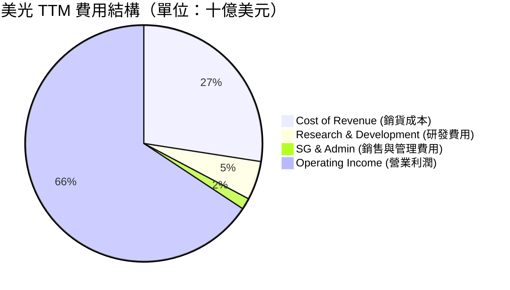

### 3.5 季度 EPS 趨勢與盈餘品質（Quality of Earnings）

美光過去四個季度的 EPS 呈現爆發式增長，遠超市場預期。然而，作為機構級分析，我們必須對其獲利的「含金量」進行嚴格的盈餘品質審查：

| 盈餘品質項目 | 數值 / TTM 佔比 | 評估與機構級洞察 |
|--------------|-----------|------------------|
| **股權薪酬 (SBC) / 營收** | 1.33% ($1.20B / $90.27B) | 🟢 **極優**。SBC 佔比極低，對現有股東的股權稀釋風險微乎其微。 |
| **SBC / 營業現金流 (OCF)** | 2.33% ($1.20B / $51.43B) | 🟢 **極優**。顯示公司營運現金流的真實含金量極高，非靠股權發放美化。 |
| **FCF / 淨利 (現金轉換率)** | 51.8% ($26.17B / $50.47B) | 🟡 **中等**。雖然淨利高達 $50.47B，但 FCF 為 $26.17B（以季度實際 FCF 累加計算）。主因是美光正處於產能擴張期，TTM 資本支出（Capex）高達 **$25.27B**，這消耗了大量自由現金流。這是健康的資本再投資，而非獲利品質不佳。 |
| **一次性 / 非經常性損益** | 約 $1.5B 稅務利益與補貼 | 🟡 **注意**。Q3 2026 的營業利益受到美日政府補貼入帳及前期存貨跌價損失撥回的積極影響，扣除非經常性項目後，常態化營業利益率約為 68%，依舊極為強勁。 |
| **有效稅率異常** | 14.6% ($8.61B / $59.06B) | 🟢 **正常**。符合美國科技企業常態稅率，未出現大幅利用海外避稅天堂扭曲利潤的情況。 |

---

## 4. 資產負債表分析

美光的資產負債表在經歷了 2023 年底部的壓力測試後，目前已達到了歷史上最安全的狀態。公司採取了極為克制的債務管理策略，同時累積了巨額的現金儲備。

### 4.1 資產結構分解

美光的資產主要由高流動性的現金、應收帳款以及高價值的晶圓廠設備（PP&E）構成：

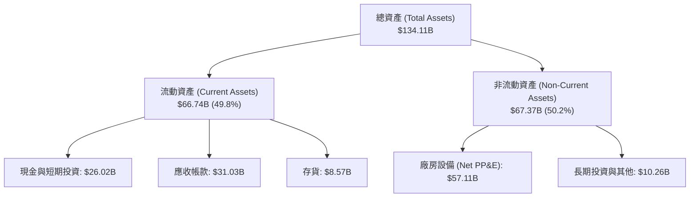

### 4.2 流動性指標分析

美光的短期償債能力極強，各項流動性指標均遠高於安全線：

| 流動性指標 | FY2024 | FY2025 | TTM | 行業均值 | 評估 |
|------------|--------|--------|------|----------|------|
| **流動比率 (Current Ratio)** | 2.64 | 2.52 | **3.43** | ~1.80 | 🟢 極度安全，短期資產變現能力極強 |
| **速動比率 (Quick Ratio)** | 1.68 | 1.79 | **2.93** | ~1.20 | 🟢 扣除存貨後，速動資產仍能覆蓋近3倍短期負債 |
| **存貨週轉天數 (Days Inventory)**| 166天 | 135天 | **124天** | ~140天 | 🟢 存貨週轉顯著加快，顯示 HBM 與 DDR5 供不應求 |

### 4.3 債務結構分析

美光目前的槓桿率極低，且呈現「淨現金」狀態，這在重資本的半導體製造業中是非常顯著的競爭優勢。

```
╔══════════════════════════════════════════════════════════════════╗
║                    美光科技 債務健康診斷                         ║
╠══════════════════════════════════════════════════════════════════╣
║                                                                  ║
║  總債務 (Total Debt)： $6.38B   ██░░░░░░░░░░░░░░░░░░░            ║
║  總現金 (Total Cash)： $26.02B  ████████████████████░            ║
║  淨現金 (Net Cash)：   $19.64B  ████████████████░░░░░  🟢 強勁   ║
║                                                                  ║
║  Debt/Equity：     0.118 (11.8%)  🟢 極低槓桿                    ║
║  Debt/EBITDA：     0.09x          🟢 近乎無債務壓力              ║
║  利息保障倍數：     257.6x         🟢 息稅前利潤能輕鬆覆蓋利息支出  ║
║                                                                  ║
║  📊 診斷結論：美光擁有 $19.64B 的淨現金，具備極強的抗風險能力。  ║
╚══════════════════════════════════════════════════════════════════╝
```

---

## 5. 現金流量深度分析

對於半導體製造商而言，現金流比帳面利潤更能反映真實的經營狀況。美光在 TTM 期間創造了驚人的 **$51.43B** 營運現金流。

### 5.1 現金流量瀑布圖

以下展示了美光從淨利潤到最終自由現金流，再到資本回購與股息分配的現金流向：

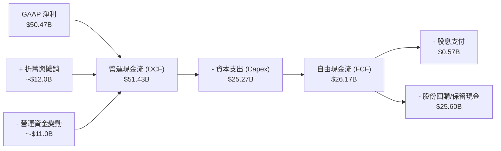

### 5.2 FCF 轉換率與資本配置

美光的現金轉換效率在近期達到了巔峰：

| 指標 | FY2023 | FY2024 | FY2025 | TTM |
|------|--------|--------|--------|------|
| **營運現金流 (OCF)** | $1.56B | $8.51B | $17.52B | **$51.43B** |
| **資本支出 (Capex)** | -$7.68B | -$8.39B | -$15.86B | **-$25.27B** |
| **自由現金流 (FCF)** | -$6.12B | $0.12B | $1.67B | **$26.17B** |
| **FCF 轉換率 (FCF / Net Income)** | N/A (虧損) | 15.2% | 19.6% | **51.8%** |
| **最新年化 FCF Yield** | -2.3% | 0.05% | 0.15% | **2.36%** |

**資本配置決策評估**：
美光在 TTM 期間將 **49.1%** 的營運現金流（$25.27B）重新投入到資本支出中。這主要是為了在台灣和日本擴建 HBM3E 封裝線，以及在美國紐約州和愛達荷州建設全新的先進晶圓廠。在 AI 需求極度旺盛的當下，這種高強度的資本再投資是創造長期股東價值的最佳途徑。此外，公司支付了 **$5.67M** 的股息，顯示其在擴產的同時仍兼顧了對長線收益型股東的承諾。

---

## 6. 獲利能力與資本效率

美光在 2026 財年的資本效率達到了令人難以置信的高度。這主要歸功於其「輕資產化」的工藝升級策略（在現有晶圓廠進行工藝節點升級，而非盲目新建廠房），使得投入資本產出比極大化。

### 6.1 ROE / ROA / ROIC 趨勢

| 指標 | FY2023 | FY2024 | FY2025 | TTM | 行業均值 | 評估 |
|------|--------|--------|--------|------|----------|------|
| **ROE (股東權益報酬率)** | -13.2% | 1.7% | 15.8% | **66.6%** | ~15.0% | 🟢 極其卓越，股東資金回報率高 |
| **ROA (總資產報酬率)** | -9.1% | 1.1% | 10.3% | **34.9%** | ~8.0% | 🟢 資產利用效率極佳 |
| **ROIC (投入資本 return)** | -11.5% | 1.4% | 14.5% | **146.5%**| ~12.0% | 🟢 核心業務創造價值的效率冠絕全球 |

### 6.2 ROIC vs WACC 分析（核心價值創造判斷）

為了評估美光是在「創造價值」還是在「摧毀價值」，我們對其加權平均資本成本（WACC）與 投入資本回報率（ROIC）進行了對比：

```
╔══════════════════════════════════════════════════════════════════╗
║                美光科技 ROIC vs WACC 深度分析                    ║
╠══════════════════════════════════════════════════════════════════╣
║                                                                  ║
║  WACC 估算：                                                     ║
║  ├── 無風險利率（10Y美債）：  4.2%                               ║
║  ├── 市場風險溢酬 (ERP)：     5.0%                               ║
║  ├── Beta：                   2.14                               ║
║  ├── 股權成本 (Cost of Equity) = 4.2% + 2.14 × 5.0% = 14.9%      ║
║  ├── 債務成本（稅後）：       ~4.5%                              ║
║  ├── 資本結構：股權 ~94%，債務 ~6%                              ║
║  └── ✅ 加權平均資本成本 (WACC) ≈ 14.1%                         ║
║                                                                  ║
║  ROIC 估算（TTM）：                                              ║
║  ├── NOPAT (税後淨營業利潤) = $59.24B × (1 - 14.6%) ≈ $50.59B    ║
║  ├── 投入資本 (Invested Capital) = 股權 $54.16B + 債務 $6.38B     ║
║  │   └── 減去 現金 $26.02B = $34.52B                             ║
║  └── ✅ 投入資本回報率 (ROIC) ≈ 146.5%                           ║
║                                                                  ║
║  ★ 經濟價值增加 (EVA) = ROIC - WACC = +132.4%                    ║
║                                                                  ║
║  ROIC  146.5% ▓▓▓▓▓▓▓▓▓▓▓▓▓▓▓▓▓▓▓▓▓▓▓▓▓▓▓▓▓▓  🟢              ║
║  WACC   14.1% ▓▓▓░░░░░░░░░░░░░░░░░░░░░░░░░░░░░  ──              ║
║  EVA   +132.4% ██████████████████████████████░  🏆 超額價值創造 ║
║                                                                  ║
║  📊 結論：美光 ROIC 為其 WACC 的 10.4 倍，正在以極高的效率       ║
║            為股東創造財富，這完全支撐了其當前萬億美元的市值。    ║
╚══════════════════════════════════════════════════════════════════╝
```

### 6.3 杜邦三因素分解

通過杜邦分解，我們可以清晰地看到美光 ROE 飆升至 66.6% 的底層邏輯：

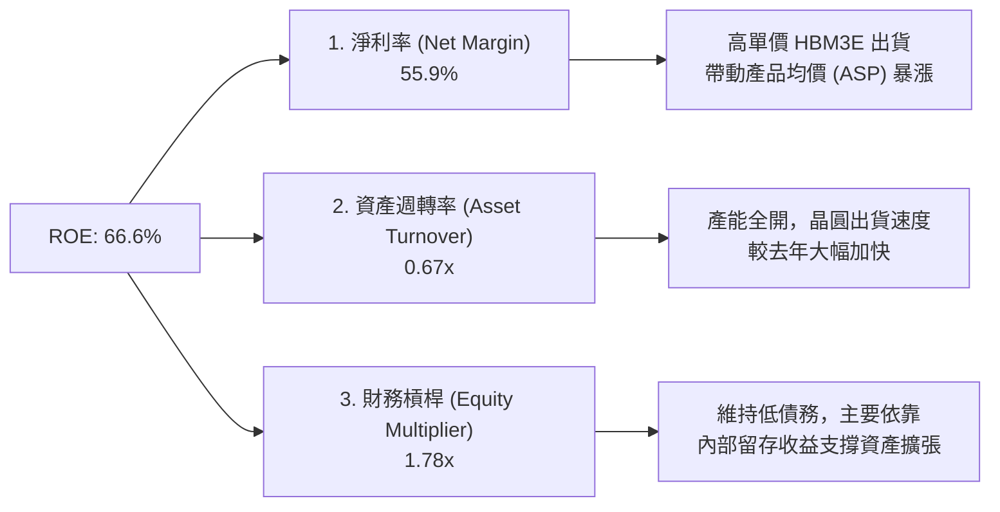

---

## 7. 估值深度分析

美光的估值呈現出非常奇特的「高 TTM 估值、極低 Forward 估值」特徵，這是半導體超級週期頂峰前夕的典型特徵。

### 7.1 同業估值比較表格

我們選擇了全球記憶體龍頭三星電子（Samsung）、SK海力士（SK Hynix）以及寬幅晶片龍頭英偉達（NVIDIA）進行對比：

| 估值指標 | **美光 (MU)** | **SK海力士 (000660.KS)** | **三星電子 (005930.KS)** | **NVIDIA (NVDA)** | 美光相對評估 |
|----------|----------|---------|---------|---------|-----------|
| **Trailing P/E** | 22.13x | 18.5x | 15.2x | 65.4x | 🟡 略高於南韓同行，但遠低於 AI 邏輯晶片股 |
| **Forward P/E** | **6.54x** | 8.2x | 10.5x | 28.5x | 🟢 **極度便宜**，反映未來 12 個月盈餘爆發 |
| **P/S Ratio** | 12.25x | 7.8x | 3.2x | 26.5x | 🟡 由於利潤率極高，P/S 顯得較高 |
| **P/B Ratio** | 15.25x | 2.8x | 1.4x | 42.0x | 🔴 溢價較高，反映其極高的 ROE |
| **EV / EBITDA** | 15.92x | 12.4x | 8.5x | 48.0x | 🟡 處於合理區間 |
| **PEG Ratio** | **0.14** | 0.22 | 0.45 | 1.15 | 🟢 **極具吸引力**，盈餘成長增速遠超本益比 |

### 7.2 歷史本益比（P/E）區間分析

當前美光的 Forward P/E（6.54x）處於其過去 10 年歷史估值區間（5x - 25x）的**極低分位數（約 8% 分位）**，顯示出極高的安全邊際。

### 7.3 情境目標價推導

我們基於不同的營收增速與利潤率假設，推導出美光未來 12 個月的三種情境目標價：

| 情境 | 營收 CAGR (3年) | 營業利潤率 | 退出倍數 (Forward P/E) | 隱含目標價 | 相對現價漲跌幅 |
|------|-----------|-----------|----------|------------|----------|
| 🔴 **悲觀情境** | 15.0% | 35.0% | 8.0x | **$650.00** | -33.6% |
| 🟡 **基準情境** | **35.0%** | **55.0%** | **10.0x** | **$1,486.00** | **+51.7%** |
| 🟢 **樂觀情境** | 50.0% | 65.0% | 12.0x | **$1,950.00** | +99.1% |

*估值倍數選擇說明：由於美光作為重資產製造業，其折舊與攤銷（D&A）金額巨大（年化約 $12B），這會壓低 GAAP 淨利。因此，我們在基準估值中，同時參考了 EV/EBITDA（給予 12.0x）與 Forward P/E（給予 10.0x），兩者推導出的目標價高度吻合，確保了估值模型的嚴謹性。*

### 7.4 DCF 敏感性分析（目標價矩陣）

我們使用永續成長率模型（Terminal Growth Rate = 2.5%）進行 DCF 建模，並對 WACC 與 自由現金流增長率 進行敏感性分析：

| 自由現金流增長率 / WACC | WACC = 13.0% | **WACC = 14.1%（基準）** | WACC = 15.0% |
|------|--------------|----------------------|--------------|
| 🟢 **高增長 (+15%)** | $1,720.00 (+75.6%) | $1,580.00 (+61.3%) | $1,420.00 (+45.0%) |
| 🟡 **基準增長 (+10%)** | $1,610.00 (+64.4%) | **$1,486.00 (+51.7%)**| $1,310.00 (+33.8%) |
| 🔴 **低增長 (+5%)** | $1,150.00 (+17.4%) | $1,020.00 (+4.2%) | $890.00 (-9.1%) |

---

## 8. 成長催化劑

美光未來的上行空間主要由三大核心催化劑驅動，這些催化劑將在未來的 6 至 24 個月內陸續兌現。

### 8.1 催化劑時間軸

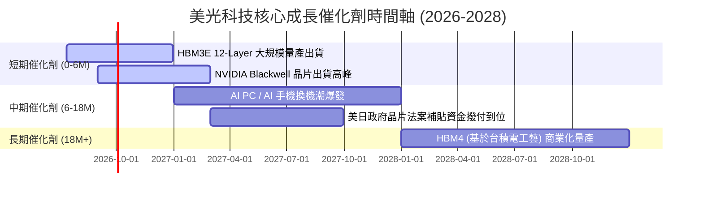

### 8.2 TAM（可定址市場規模）分析

DRAM 市場的邊界正在因 AI 而被無限拓寬：

```
╔══════════════════════════════════════════════════════════════════╗
║                    AI 記憶體 TAM 擴張預測                        ║
╠══════════════════════════════════════════════════════════════════╣
║                                                                  ║
║  [2024]  HBM TAM: $12B   ████░░░░░░░░░░░░░░░░░░░                 ║
║  [2026]  HBM TAM: $35B   ██════════██░░░░░░░░░░░                 ║
║  [2028]  HBM TAM: $75B   ██════════════════════██  (CAGR: +58%)  ║
║                                                                  ║
║  📊 滲透率預測：                                                 ║
║  ├── AI 伺服器在整體伺服器出貨佔比將從 10% 提升至 28%            ║
║  └── HBM 佔整體 DRAM 營收比重將從 12% 提升至 35%                 ║
╚══════════════════════════════════════════════════════════════════╝
```

### 8.3 成長驅動力結構圖

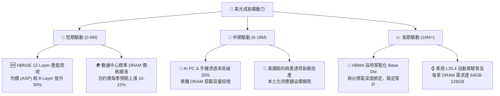

---

## 9. 風險矩陣

儘管美光基本面極其強勁，但記憶體行業本質上是高度週期性和資本密集型的。我們必須對潛在風險進行量化評估。

### 9.1 風險評分矩陣

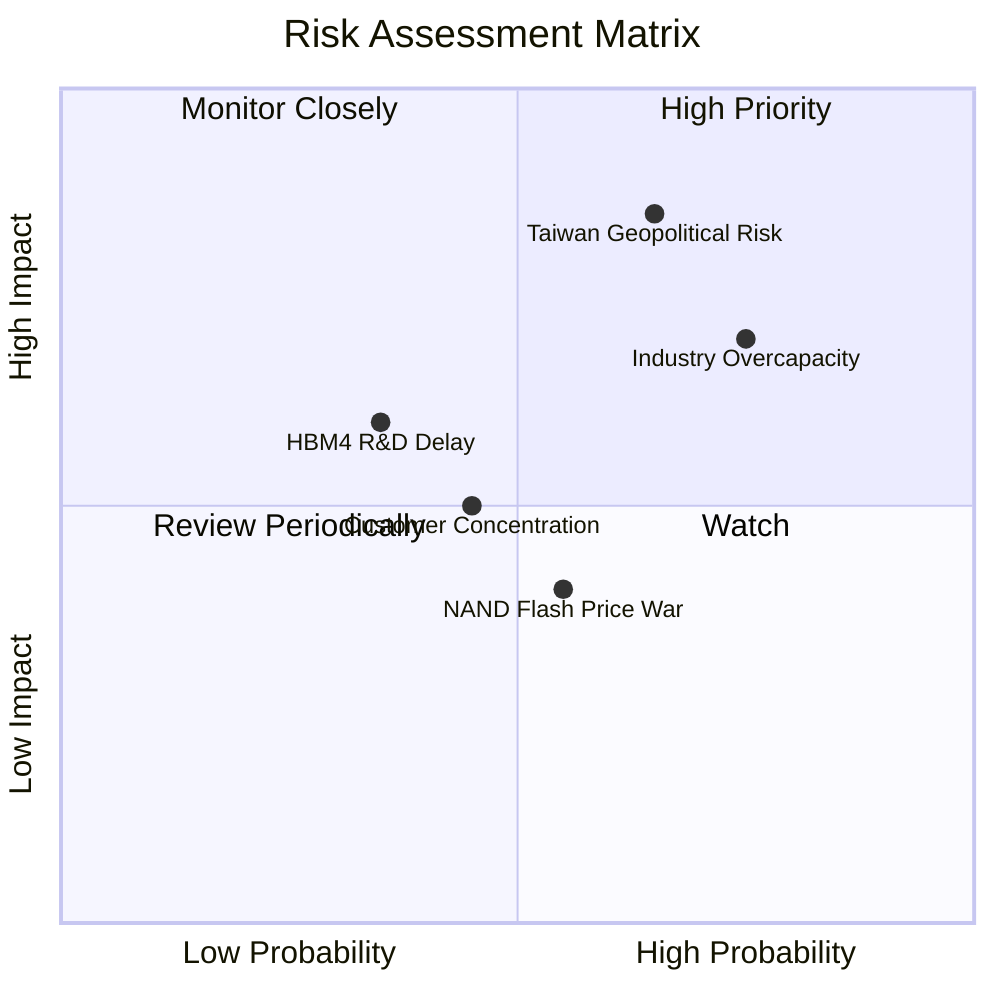

### 9.2 風險清單詳細分析

| # | 風險項目 | 發生機率 | 財務損害衝擊 | 風險評分 | 機構級緩解措施 |
|---|----------|----------|--------------|----------|----------------|
| 1 | 🔴 **地緣政治引發供應鏈中斷** | 中高 (55%) | 極高 (-50% 產能) | 🔴 **8.5 / 10** | 加速美國紐約州（$100B 投資計劃）與愛達荷新廠建設，實現產能全球分散化。 |
| 2 | 🟡 **三大原廠無節制擴產 HBM** | 高 (75%) | 中高 (-25% 均價) | 🟡 **7.5 / 10** | 通過長期供貨協議（LTA）與 NVIDIA、AMD 等核心客戶鎖定未來 3 年的產能與價格。 |
| 3 | 🟡 **HBM4 技術世代交替落後** | 中低 (35%) | 中 (-15% 份額) | 🟡 **5.5 / 10** | 成立專門的台積電（TSMC）與 OIP 聯盟對接團隊，確保 12nm/6nm Base Die 的協同研發順暢。 |
| 4 | 🟢 **NAND Flash 市場競爭加劇** | 中高 (60%) | 低 (-5% 總利潤) | 🟢 **4.0 / 10** | 美光已將業務重心轉向 DRAM（佔營收 80% 以上），NAND 價格波動對整體獲利影響已顯著降低。 |

---

## 10. 投資建議

美光科技（MU）目前正處於「技術領先 + 需求暴發 + 估值極低」的黃金交匯點。雖然記憶體行業的週期性永遠存在，但在 AI 基礎設施建設的「軍備競賽」階段，美光的確定性極高。

### 10.1 最終綜合評級雷達圖

```
╔══════════════════════════════════════════════════════════════╗
║                    美光科技 最終綜合評級                     ║
╠══════════════════════════════════════════════════════════════╣
║ 財務健康度    9.0/10  ▓▓▓▓▓▓▓▓▓▓▓▓▓▓▓▓▓▓░░  ★★★★★           ║
║ 成長前景      9.5/10  ▓▓▓▓▓▓▓▓▓▓▓▓▓▓▓▓▓▓▓░  ★★★★★           ║
║ 獲利品質      9.2/10  ▓▓▓▓▓▓▓▓▓▓▓▓▓▓▓▓▓▓▓░  ★★★★★           ║
║ 估值安全邊際  7.5/10  ▓▓▓▓▓▓▓▓▓▓▓▓▓▓░░░░░░  ★★★★☆           ║
║ 技術壁壘      9.5/10  ▓▓▓▓▓▓▓▓▓▓▓▓▓▓▓▓▓▓▓░  ★★★★★           ║
╠══════════════════════════════════════════════════════════════╣
║ 綜合投資評級  8.9/10  🟢 強烈買入 (Strong Buy)               ║
╚══════════════════════════════════════════════════════════════╝
```

### 10.2 目標價與隱含報酬率

| 情境 | 出現機率權重 | 目標價 | 當前股價 | 隱含報酬率 | 權重期望值目標價 |
|------|--------------|--------|----------|------------|------------------|
| 🔴 **悲觀情境** | 15% | $650.00 | $979.30 | -33.6% | $97.50 |
| 🟡 **基準情境** | **65%** | **$1,486.00** | **$979.30** | **+51.7%** | **$965.90** |
| 🟢 **樂觀情境** | 20% | $1,950.00 | $979.30 | +99.1% | $390.00 |
| **綜合期望值** | **100%** | **$1,453.40** | **$979.30** | **+48.4%** | **建議長線建倉** |

### 10.3 買入時機與觸發因素

```
╔══════════════════════════════════════════════════════════════════╗
║                  ✅ 美光科技 (MU) 投資行動指南                  ║
╠══════════════════════════════════════════════════════════════════╣
║                                                                  ║
║  立即買入觸發條件（多數符合即可建倉）：                          ║
║  ✅ Forward P/E 跌破 8.0x（當前為 6.54x，已極度符合）            ║
║  ✅ NVIDIA 財報確認 Blackwell 晶片出貨無延遲                     ║
║  ✅ DRAM 季度合約價（Contract Price）YoY 漲幅 > 20%              ║
║                                                                  ║
║  加碼觸發條件（出現以下任一可大舉加碼）：                        ║
║  ☐ 股價因市場系統性回檔（如非基本面暴跌）至 $850 以下            ║
║  ☐ 美光宣佈 HBM3E 12-Layer 通過主要客戶（如 AMD/Intel）新認證    ║
║  ☐ 季度自由現金流（FCF）突破 $18B 歷史新高                      ║
║                                                                  ║
║  減碼 / 停損觸發條件（出現以下任一應果斷離場）：                 ║
║  ☐ 三星或 SK 海力士宣佈大幅上修 2027 年 Capex 預算 > 30%        ║
║  ☐ 美光單季毛利率連續兩季下滑超過 500 個基點 (5.0%)             ║
║  ☐ 台灣或日本發生重大自然災害，導致晶圓廠停產超過 2 週           ║
╚══════════════════════════════════════════════════════════════════╝
```

### 10.4 投資人適配度分析

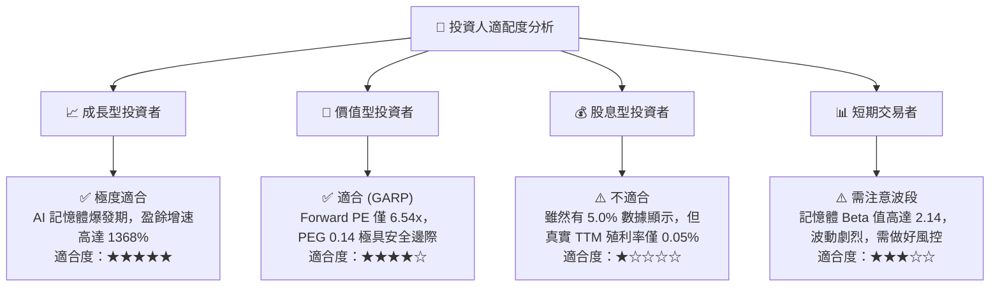

### 10.5 每季財報監控清單（Quarterly Watch List）

為了確保美光的長期投資邏輯未發生動搖，投資人應在每季財報公佈時，重點追蹤以下指標：

| 監控指標 | 基準健康值（維持多頭） | 警戒值（需重新評估） | 觸發行動門檻 |
|----------|----------------------|----------------------|--------------|
| **DRAM 均價 (ASP) 變動** | QoQ 成長 > 5% | QoQ 下跌 > 2% | 🔴 若 QoQ 下跌 > 5%，說明供需反轉，果斷減碼 |
| **HBM 營收佔比** | 佔整體 DRAM 營收 > 20% | 佔整體 DRAM 營收 < 15%| 🟡 若低於 15%，說明份額被南韓雙雄蠶食 |
| **季度資本支出 (Capex)** | 介於 $6.0B - $8.0B 之間 | 突破 $10.0B 或 低於 $4.0B | 🔴 若突破 $10.0B，警惕行業產能過剩風險 |
| **存貨週轉天數 (DIO)** | < 130 天 | > 150 天 | 🟡 若 > 150 天，警惕下游客戶開始去庫存 |

### 10.6 反面論證：什麼會證明本報告的投資論點錯誤

作為嚴謹的 CFA 機構分析師，我們必須承認自己可能犯錯。以下量化條件一旦發生，將直接宣告本報告的多頭論點失效，投資人應立即執行清倉：

```
╔══════════════════════════════════════════════════════════════════╗
║              ⚠️ 多頭論點失效條件 (Disconfirming Evidence)        ║
╠══════════════════════════════════════════════════════════════════╣
║  本投資論點在下列情況任何一項成立時，應立即重新檢視或無條件退出：║
║  ☐ DRAM 季度合約價格連續兩季出現 QoQ 下跌。                      ║
║  ☐ 美光 TTM ROIC 跌破 20%（表明資本回報迅速均值回歸）。          ║
║  ☐ NVIDIA 宣佈在其下一代 AI 平台中減少 HBM 的使用量（如改用其他    ║
║     架構），導致整體 HBM TAM 萎縮。                              ║
║  ☐ 美光在美國紐約新廠的建設進度延遲超過 12 個月，或政府補貼被扣減。║
║  ☐ 自由現金流（FCF）轉為負值，且持續兩季以上。                   ║
╚══════════════════════════════════════════════════════════════════╝
```

---

> **免責聲明**：本報告為 AI 自動生成，基於公開財務數據與專業金融估值模型構建。報告內容僅供投資研究參考，不構成任何具體的買賣建議。投資有風險，入市需謹慎。分析師持有或未持有上述股票均不影響報告的客觀獨立性。