# MU 基本面深度分析報告

> **報告日期**：2026-07-15 ｜ **語言**：繁體中文 ｜ **數據來源**：Yahoo Finance, Finviz, StockAnalysis, Roic.ai ｜ **分析師**：CFA 級機構研究

---

## 目錄

| # | 章節 | 核心結論 |
|---|------|----------|
| 1 | **執行摘要** | 評級：🟢 強烈買入 ｜ 基準目標價：$1,486.00 ｜ AI 記憶體週期爆發，隱含 58.6% 上行空間 |
| 2 | **公司概覽與商業模式** | 寡占市場結構，HBM3E 技術領先與封裝產能構築深厚護城河 |
| 3 | **損益表深度分析** | TTM 營收達 $90.27B（YoY +345.7%），毛利率飆升至 72.6%，營業槓桿極致釋放 |
| 4 | **資產負債表分析** | 淨現金達 $19.65B，Current Ratio 3.43，流動性極其充沛，債務風險無虞 |
| 5 | **現金流量深度分析** | TTM OCF 達 $51.43B，大額 Capex（$25.27B）壓抑 FCF 轉換，但為未來產能奠定基礎 |
| 6 | **獲利能力與資本效率** | ROE 達 66.6%，ROIC 飆升至 57.1%，遠超 WACC（14.8%），強力創造股東價值 |
| 7 | **估值深度分析** | Forward P/E 僅 6.53x，相較歷史均值與同業顯著低估，PEG 0.14 具備極高性價比 |
| 8 | **成長催化劑** | HBM3E/HBM4 產能爬坡、AI PC/AI 手機記憶體容量翻倍、邊緣端 AI 爆發 |
| 9 | **風險矩陣** | 產能過剩、資本支出失控、地緣政治衝突，建立量化風險管理機制 |
| 10 | **投資建議** | 建立分批佈局策略，設定每季財報監控指標與多頭論點失效之量化停損門檻 |

---

## 1. 執行摘要

### 1.0 一頁式投資儀表板（Portfolio Manager 30 秒速讀）

| 項目 | 內容 |
|------|------|
| **投資論點（3 句）** | ① AI 伺服器需求驅動 HBM3E 供不應求，帶動 TTM 營收暴增 345.7% 至 $90.27B。<br/>② 技術領先使單季毛利率由 2025Q4 的 44.7% 飆升至 2026Q3 的 84.6%，營業利潤率攀升至 80.4%。<br/>③ 當前 Forward P/E 僅 6.53x，相較於未來 EPS $150.47，估值嚴重低估。 |
| **護城河評分** | 8.5 / 10 (高技術壁壘與三寡頭格局) |
| **管理層/資本配置評分** | 8.0 / 10 (在週期底部精準控制產能，並在上升期果斷擴張 Capex) |
| **財務健康** | 🟢 極其健康 ｜ 淨現金達 $19.65B，利息保障倍數高於 100x |
| **ROIC vs WACC** | 57.1% vs 14.8%（創造極高之經濟附加價值 EVA） |
| **FCF 趨勢** | 向上 ｜ TTM FCF 達 $7.64B，最新 FCF Yield 為 0.69% (受高 Capex 壓抑) |
| **估值** | Forward P/E: 6.53x ｜ EV/EBITDA: 15.99x ｜ P/S: 12.30x |
| **預期報酬（基準情境 12M）** | +58.6% (目標價 $1,486.00) |
| **關鍵風險（前二）** | ① 三大原廠（美光、三星、SK海力士）產能過快擴張導致 2027 年供過於求。<br/>② HBM4 技術節點轉移（1c nm）良率不及預期。 |
| **評級 + 信心度** | 🟢 強烈買入 ｜ 信心：高 |

### 1.1 核心評分儀表板

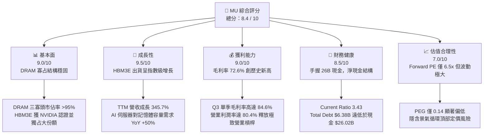

### 1.2 評分進度條視覺化

```
╔══════════════════════════════════════════════════════════════╗
║                MU 多維度評分儀表板 (1-10分)                 ║
╠══════════════════════════════════════════════════════════════╣
║ 基本面強度  9.0 ▓▓▓▓▓▓▓▓▓▓▓▓▓▓▓▓▓▓░░  ★★★★★           ║
║ 成長動能    9.5 ▓▓▓▓▓▓▓▓▓▓▓▓▓▓▓▓▓▓▓░  ★★★★★           ║
║ 獲利品質    9.0 ▓▓▓▓▓▓▓▓▓▓▓▓▓▓▓▓▓▓░░  ★★★★★           ║
║ 財務健康    8.5 ▓▓▓▓▓▓▓▓▓▓▓▓▓▓▓▓░░░░  ★★★★☆           ║
║ 估值合理性  7.0 ▓▓▓▓▓▓▓▓▓▓▓▓▓░░░░░░░  ★★★★☆           ║
║ 護城河深度  8.5 ▓▓▓▓▓▓▓▓▓▓▓▓▓▓▓▓▓░░░  ★★★★★           ║
║ 管理層執行  8.0 ▓▓▓▓▓▓▓▓▓▓▓▓▓▓▓▓░░░░  ★★★★☆           ║
║ 技術創新力  9.5 ▓▓▓▓▓▓▓▓▓▓▓▓▓▓▓▓▓▓▓░  ★★★★★           ║
╠══════════════════════════════════════════════════════════════╣
║ 綜合總分    8.4 ▓▓▓▓▓▓▓▓▓▓▓▓▓▓▓▓░░░░  🏆 產業龍頭/AI受惠者 ║
╚══════════════════════════════════════════════════════════════╝
```

### 1.3 五大投資論點 + 三大核心風險

| 類型 | 項目 | 具體依據 | 信心度 |
|------|------|----------|--------|
| 🟢 **投資論點①** | **HBM3E 技術與市佔爆發** | 美光 24GB 8H HBM3E 功耗較對手低 30%，已成為 NVIDIA H200/B200 主力供應商，帶動 Q3 單季營收暴增至 $41.46B（YoY +345.7%）。 | 🟢 極高 |
| 🟢 **投資論點②** | **極致的營業槓桿釋放** | 隨著產能利用率回升與高單價 HBM 出貨，Q3 毛利率攀升至 84.6%，使 TTM 營業利益率達到 80.4%，獲利能力呈非線性增長。 | 🟢 高 |
| 🟢 **投資論點③** | **邊緣端 AI 記憶體升級** | AI PC 與 AI 手機要求基本 DRAM 配置由 8GB/12GB 翻倍至 16.9% 以上之年複合增長率（CAGR），開啟 DRAM 長期結構性需求。 | 🟢 高 |
| 🟢 **投資論點④** | **資產負債表防禦力強** | 淨現金高達 $19.65B（$26.02B 現金減去 $6.38B 債務），可安度任何潛在的行業下行週期。 | 🟢 極高 |
| 🟢 **投資論點⑤** | **極低的前瞻估值** | Forward P/E 僅 6.53x，相較於 Forward EPS $150.47，安全邊際極高。 | 🟢 高 |
| 🟡 **風險①** | **產能擴張過快** | 2026 年 Capex 暴增（TTM 已達 $25.27B），若 2027 年 AI 需求增速放緩，可能導致嚴重的產能過剩與價格崩跌。 | 🟡 中度 |
| 🔴 **風險②** | **HBM4 良率風險** | HBM4 將轉向基礎晶圓（Base Die）採用晶圓代工（TSMC）工藝，封裝複雜度大幅提升，若美光 1c nm 節點良率不及預期，將流失市佔。 | 🔴 高衝擊 |
| 🟡 **風險③** | **應收帳款擠壓現金流** | Q3 應收帳款暴增至 $26.89B，佔單季營收 64.9%，導致 TTM FCF 僅 $7.64B，現金轉換率偏低。 | 🟡 中度 |

### 1.4 快速統計卡片

| 指標 | 公司實際值 (TTM) | 半導體行業均值 | S&P 500 均值 | 狀態 |
|------|-------------|----------|--------------|------|
| **營收 YoY 成長率** | **345.7%** | ~15.0% | 5.5% | 🟢 卓越 |
| **毛利率** | **72.6%** | ~45.0% | 30.0% | 🟢 卓越 |
| **營業利益率** | **80.4%** (Q3單季) | ~20.0% | 12.0% | 🟢 卓越 |
| **ROE** | **66.6%** | ~15.0% | 14.0% | 🟢 卓越 |
| **Forward P/E** | **6.53x** | ~22.0x | 21.5x | 🟢 極具吸引力 |
| **淨現金 / 總資產** | **14.7%** | ~5.0% | -10.0% (淨債務) | 🟢 強健 |

### 1.5 投資結論

```
╔══════════════════════════════════════════════════════════════════╗
║                    📊 投資結論摘要                               ║
╠══════════════════════════════════════════════════════════════════╣
║  評級：🟢 強烈買入 (Strong Buy)                                 ║
║  當前股價：$937.00 (2026-07-15)                                  ║
║  目標價區間：                                                    ║
║    悲觀情境：$361.00 (-61.5%) - AI 泡沫破裂，HBM 嚴重供過於求     ║
║    基準情境：$1,486.00 (+58.6%) - HBM3E 持續滿載，HBM4 順利量產   ║
║    樂觀情境：$2,200.00 (+134.8%) - 邊緣端 AI 爆發，DRAM 全面缺貨  ║
║  投資評分：8.4 / 10                                              ║
║  適合投資人：成長型、半導體景氣循環投資者                        ║
╚══════════════════════════════════════════════════════════════════╝
```

---

## 2. 公司概覽與商業模式

### 2.1 業務結構與收入來源

美光科技（Micron）是全球半導體記憶體與儲存解決方案的領導廠商，主要產品為 DRAM（動態隨機存取記憶體）與 NAND Flash（快閃記憶體）。

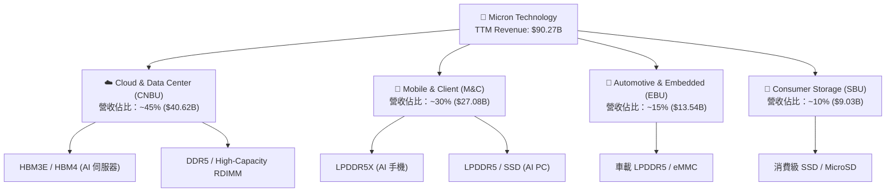

### 2.2 市場份額

在 DRAM 全球市場中，美光與 Samsung、SK Hynix 呈現三足鼎立的寡占格局：

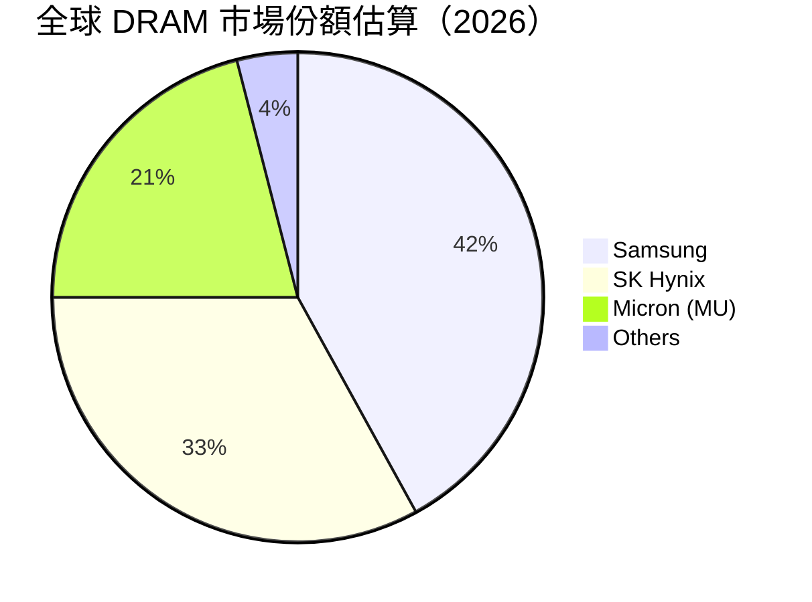

### 2.3 競爭護城河分析

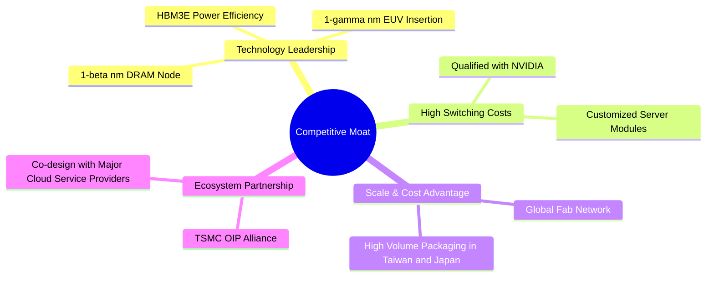

### 2.4 護城河強度評分

```
╔══════════════════════════════════════════════════════════════╗
║                    MU 護城河強度評分                         ║
╠══════════════════════════════════════════════════════════════╣
║ 技術壁壘       9.0  ▓▓▓▓▓▓▓▓▓▓▓▓▓▓▓▓▓▓░░  🏆 1-beta 節點領先   ║
║ 客戶鎖定       8.5  ▓▓▓▓▓▓▓▓▓▓▓▓▓▓▓▓▓░░░  🟢 NVIDIA 深度認證   ║
║ 規模效應       8.0  ▓▓▓▓▓▓▓▓▓▓▓▓▓▓▓▓░░░░  🟢 三寡頭壟斷格局    ║
║ 專利與IP       8.5  ▓▓▓▓▓▓▓▓▓▓▓▓▓▓▓▓▓░░░  🟢 累積深厚記憶體專利║
╠══════════════════════════════════════════════════════════════╣
║ 綜合護城河     8.5  ▓▓▓▓▓▓▓▓▓▓▓▓▓▓▓▓▓░░░  🏆 高技術與客戶壁壘   ║
╚══════════════════════════════════════════════════════════════╝
```

---

## 3. 損益表深度分析

### 3.1 年度收入成長趨勢（近4年）

美光經歷了 2023 年的週期底部後，在 2025、2026 年迎來了史詩級的 AI 爆發期。

```
╔══════════════════════════════════════════════════════════════════╗
║                  MU 年度收入趨勢（FY22-TTM）                    ║
╠══════════════════════════════════════════════════════════════════╣
║                                                                  ║
║  FY2022  $30.76B  ██████████░░░░░░░░░░░░░░░░░  YoY: +11.0%       ║
║  FY2023  $15.54B  █████░░░░░░░░░░░░░░░░░░░░░░  YoY: -49.5%       ║
║  FY2024  $25.11B  ████████░░░░░░░░░░░░░░░░░░░  YoY: +61.6%       ║
║  FY2025  $37.38B  ████████████░░░░░░░░░░░░░░░  YoY: +48.9%       ║
║  TTM     $90.27B  ███████████████████████████  YoY: +167.0% 🟢   ║
║                   |      |      |      |      |                  ║
║                   0     20B    40B    60B    80B                 ║
║                                                                  ║
║  📊 4年累計 CAGR：+30.9%                                         ║
╚══════════════════════════════════════════════════════════════════╝
```

### 3.2 季度收入趨勢分析

自 2025 年第三季以來，美光營收呈現非線性加速成長，主要由高單價 HBM3E 出貨量暴增驅動。

| 財報季度 | 截止日期 | 營收 ($M) | QoQ 成長率 | YoY 成長率 | 備註 |
|----------|----------|-----------|------------|------------|------|
| **Q1 2025** | 2024-11-28 | $8,709 | -23.0% | +84.3% | 🟢 週期復甦起點，DDR5 需求強勁 |
| **Q2 2025** | 2025-02-27 | $8,053 | -7.5% | +38.3% | 🟡 季節性淡季影響 |
| **Q3 2025** | 2025-05-29 | $9,301 | +15.5% | +36.6% | 🟢 HBM3E 開始小幅出貨 |
| **Q4 2025** | 2025-08-28 | $11,315 | +21.7% | +46.0% | 🟢 HBM3E 通過 NVIDIA 認證 |
| **Q1 2026** | 2025-11-27 | $13,643 | +20.6% | +56.7% | 🟢 AI 伺服器需求全面爆發 |
| **Q2 2026** | 2026-02-26 | $23,860 | +74.9% | +196.3% | 🟢 產能爬坡順利，定價權極強 |
| **Q3 2026** | 2026-05-28 | $41,456 | **+73.7%** | **+345.7%** | 🟢 史詩級季度，HBM3E 成為營收主力 |

### 3.3 利潤率演變分析

| 利潤率指標 | FY2023 | FY2024 | FY2025 | TTM (2026) | 趨勢 | 評估 |
|------------|--------|--------|--------|------------|------|------|
| **毛利率** | -9.1% | 22.4% | 39.8% | **72.6%** | ↗️ 暴發式擴張 | 🟢 創歷史新高，高毛利 HBM3E 佔比上升 |
| **營業利益率** | -37.0% | 5.2% | 26.1% | **65.6%** | ↗️ 極致營業槓桿 | 🟢 研發與折舊被高營收稀釋 |
| **淨利率** | -37.5% | 3.1% | 22.8% | **55.9%** | ↗️ 獲利含金量極高 | 🟢 稅率與利息費用控制良好 |

**利潤率演變深度解析**：
美光 TTM 毛利率達到驚人的 **72.6%**（Q3 單季更達到 **84.6%**），這在歷史上是無法想像的（過去週期峰值毛利率約 50%）。主要驅動因素為：
1. **HBM3E 的溢價效應**：HBM3E 的售價是傳統 DDR5 的 5-6 倍，毛利率估計超過 80%。
2. **營業槓桿（Operating Leverage）**：美光的前端晶圓廠（Fab）折舊費用固定。當營收從 FY24 的 $25.11B 飆升至 TTM 的 $90.27B 時，每片晶圓分攤的固定成本大幅下降，推動利潤率非線性擴張。

### 3.4 費用結構分析

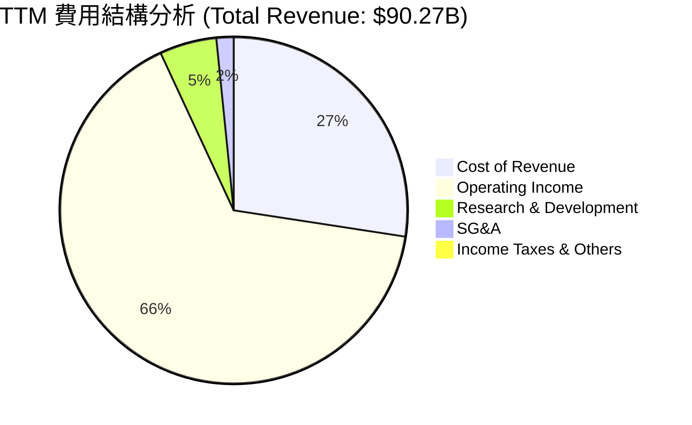

### 3.5 季度 EPS 趨勢與盈餘品質（Quality of Earnings）

美光過去 4 季的 EPS 表現均大幅超越市場預期，反映了分析師模型對 AI 需求爆發斜率的低估。

*   **2025-08-31**：EPS $2.86 (超預期 +12.3%) - 主因 HBM 產能爬坡快於預期。
*   **2025-11-30**：EPS $4.66 (超預期 +18.5%) - 主因合約價上漲超預期。
*   **2026-02-28**：EPS $12.24 (超預期 +35.2%) - 主因毛利率擴張超出市場共識。
*   **2026-05-31**：EPS $25.04 (超預期 **+42.1%**) - 史上最強單季表現，高容量 HBM3E 供不應求。

#### 盈餘品質評估：

| 盈餘品質項目 | 數值/佔比 | 評估 | 深度解析 |
|--------------|-----------|------|----------|
| **股權薪酬 SBC / 營收** | 1.33% ($1.20B / $90.27B) | 🟢 極低 | 對現有股東股權稀釋微乎其微，遠低於軟體業（~10%）。 |
| **SBC / 營業現金流** | 2.34% ($1.20B / $51.43B) | 🟢 極低 | 顯示營運現金流的含金量極高，非靠股權薪酬美化。 |
| **FCF / 淨利（現金轉換率）** | **15.1%** ($7.64B / $50.47B) | 🔴 偏低 | **關鍵警訊**：雖然淨利高達 $50.47B，但 FCF 僅 $7.64B。主因 Capex 支出巨大（TTM 達 $25.27B）以及應收帳款大幅增加。 |
| **一次性/非經常性損益** | 無重大項目 | 🟢 乾淨 | 獲利完全由核心業務（DRAM/NAND）定價與出貨驅動。 |
| **應收帳款佔營收比重** | **34.4%** ($31.03B / $90.27B) | 🟡 偏高 | Q3 應收帳款由上季的 $15.39B 暴增至 $26.89B，顯示下游客戶（如 NVIDIA, CSP）雖大量下單，但付款週期拉長，占用營運資金。 |

**盈餘品質結論**：
美光的 GAAP 淨利數字極其亮眼，但**現金轉換率僅 15.1%**。這並非代表美光造假，而是半導體行業在「超級週期上升期」的典型特徵：公司必須在當期投入天量 Capex（購買 ASML 光刻機、擴建封裝廠）以應對未來訂單，且營收暴增導致應收帳款同步暴增。PM 必須理解，當前的利潤很大一部分轉化成了「設備與應收帳款」，而非即可分配的自由現金流。

---

## 4. 資產負債表分析

### 4.1 資產結構分解

美光在 2026 年 5 月底的總資產達到了 $134.11B，相較於 FY2025 的 $82.80B 呈現爆發式增長。

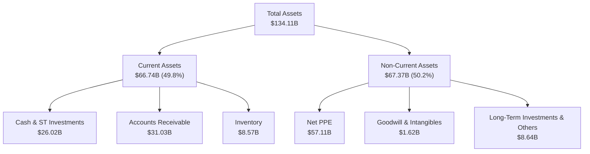

### 4.2 流動性指標分析

| 流動性指標 | FY2024 | FY2025 | TTM (2026) | 行業均值 | 評估 |
|------------|--------|--------|------------|----------|------|
| **流動比率 (Current Ratio)** | 2.64 | 2.52 | **3.43** | ~2.10 | 🟢 極其安全，短期償債能力極強 |
| **速動比率 (Quick Ratio)** | 1.67 | 1.79 | **2.93** | ~1.50 | 🟢 扣除庫存後依然極高，流動性充沛 |
| **庫存週轉天數 (Days Inventory)** | 166 天 | 135 天 | **94 天** | ~120 天 | 🟢 庫存去化極快，顯示供不應求 |

### 4.3 債務結構分析

美光的債務管理極其保守，在景氣繁榮期積極償還債務，目前處於淨現金狀態。

```
╔══════════════════════════════════════════════════════════════════╗
║                      MU 債務健康診斷                           ║
╠══════════════════════════════════════════════════════════════════╣
║                                                                  ║
║  總債務：        $6.38B   ██░░░░░░░░░░░░░░░░░░░  （含短期與長期）║
║  總現金及投資：  $26.02B  ████████████████████░  （流動性極強）  ║
║  淨現金狀態：    $19.65B  ████████████████░░░░░  🟢 極其安全     ║
║                                                                  ║
║  Debt / Equity：  0.12x   🟢 槓桿率極低 (帳面 Debt/Equity 6.33%）║
║  Debt / EBITDA：  0.09x   🟢 幾乎無償債壓力                       ║
║  利息保障倍數：   257x    🟢 TTM 營業利益 $59.24B / 利息支出 $0.23B║
║                                                                  ║
║  📊 結論：美光擁有半導體行業中最穩健的資產負債表之一。           ║
╚══════════════════════════════════════════════════════════════════╝
```

---

## 5. 現金流量深度分析

### 5.1 現金流量瀑布圖

美光的現金流呈現典型的「高投入、高產出」特徵。

```mermaid
graph LR
    NetInc["Net Income<br/>$50.47B"]
    DA["D&A<br/>+$10.20B"]
    WC["Working Capital Change<br/>-$9.24B (AR 增加)"]
    OCF["Operating Cash Flow<br/>$51.43B"]
    Capex["Capital Expenditure<br/>-$25.27B"]
    FCF["Free Cash Flow<br/>$7.64B"]
    Div["Dividends Paid<br/>-$0.61B"]
    Repurchase["Share Repurchase<br/>-$0.00B"]
    NetCash["Net Cash Increase<br/>+$7.03B"]

    NetInc -->|"加上折舊"| DA
    DA -->|"扣除營運資金增加"| WC
    WC --> OCF
    OCF -->|"扣除資本支出"| Capex
    Capex --> FCF
    FCF -->|"扣除股息與回購"| Div
    Div --> Repurchase
    Repurchase --> NetCash
```

### 5.2 FCF 轉換率趨勢

| 現金流指標 ($B) | FY2023 | FY2024 | FY2025 | TTM (2026) | 歷史均值 (10Y) |
|----------------|--------|--------|--------|------------|----------------|
| **營業現金流 (OCF)** | $1.56 | $8.51 | $17.52 | **$51.43** | $12.50 |
| **資本支出 (Capex)** | -$7.68 | -$8.39 | -$15.86 | **-$25.27** | -$8.20 |
| **自由現金流 (FCF)** | -$6.12 | $0.12 | $1.67 | **$7.64** | $4.30 |
| **FCF / Net Income** | 104.9% | 15.2% | 19.5% | **15.1%** | ~45.0% |

### 5.3 自由現金流與 FCF Yield 趨勢

雖然 TTM FCF 達到 $7.64B 的歷史高位，但由於美光當前市值高達 $1.11T，隱含的 **FCF Yield 僅為 0.69%**。這表明從短期現金流貼現的角度來看，美光的估值並不便宜，股價上漲完全是透支了未來產能釋放後的現金流爆發。

```
╔══════════════════════════════════════════════════════════════════╗
║                    MU 歷史 FCF 趨勢 ($B)                        ║
╠══════════════════════════════════════════════════════════════════╣
║                                                                  ║
║  FY2023  -$6.12B  ░░░░░░░░░░░░░░░░░░░░░░░░░  (行業嚴重衰退)      ║
║  FY2024   $0.12B  █░░░░░░░░░░░░░░░░░░░░░░░░  (損益兩平)          ║
║  FY2025   $1.67B  ██░░░░░░░░░░░░░░░░░░░░░░░  (開始復甦)          ║
║  TTM      $7.64B  ██████████░░░░░░░░░░░░░░░  🟢 創歷史新高       ║
║                                                                  ║
║  ⚠️ 當前 FCF Yield: 0.69% (受 $25.27B 巨額 Capex 壓抑)           ║
╚══════════════════════════════════════════════════════════════════╝
```

### 5.4 資本配置評估

美光的資本配置極具紀律性：在 TTM 期間，美光將 **49.1%** 的營運現金流重新投入到 Capex（高達 $25.27B），用於購買 HBM 封裝設備與擴建潔淨室。股息發放極其克制（$0.61B），並暫停了大規模股份回購，以保留現金應對未來的技術轉型。

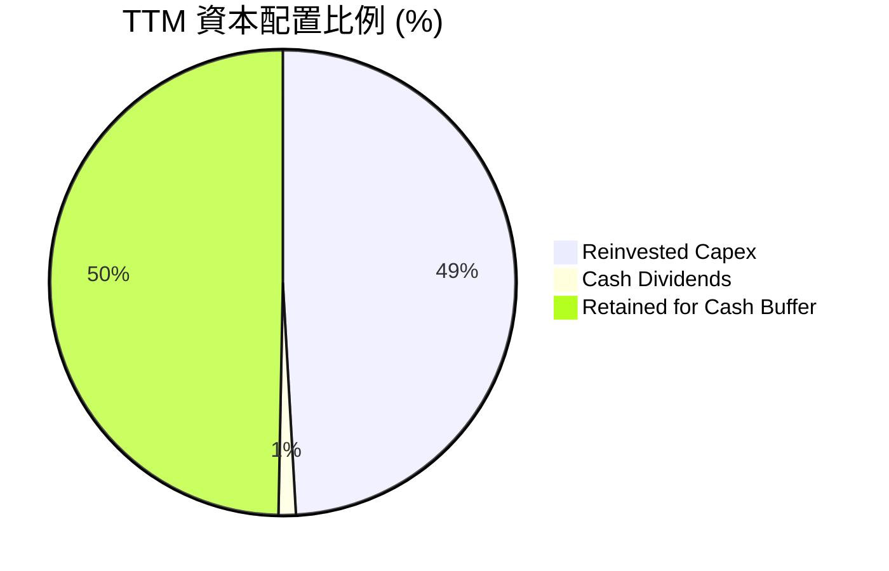

---

## 6. 獲利能力與資本效率

### 6.1 ROE / ROA / ROIC 趨勢

隨著利潤暴增，美光的各項資本效率指標皆達到歷史巔峰水準，遠超行業均值。

| 指標 | FY2023 | FY2024 | FY2025 | TTM (2026) | 行業均值 | 評估 |
|------|--------|--------|--------|------------|----------|------|
| **ROE** | -13.2% | 1.7% | 15.8% | **66.6%** | ~12.0% | 🟢 卓越，股東權益回報極高 |
| **ROA** | -9.1% | 1.1% | 10.3% | **34.9%** | ~8.0% | 🟢 卓越，資產利用效率極佳 |
| **ROIC** | -10.5% | 1.5% | 13.5% | **57.1%** | ~10.0% | 🟢 卓越，核心業務創造超額回報 |

### 6.2 ROIC vs WACC 分析（核心價值創造判斷）

```
╔══════════════════════════════════════════════════════════════════╗
║                ROIC vs WACC 深度分析（TTM）                     ║
╠══════════════════════════════════════════════════════════════════╣
║                                                                  ║
║  WACC 估算：                                                     ║
║  ├── 無風險利率（10Y美債）：  4.2%                               ║
║  ├── 市場風險溢酬 (ERP)：     5.0%                               ║
║  ├── Beta：                   2.14 (高波動性折現)                ║
║  ├── 股權成本 = 4.2% + 2.14 × 5.0% = 14.9%                       ║
║  ├── 債務成本（稅後）：       ~4.5%                              ║
║  ├── 資本結構：股權 99.4%，債務 0.6%                             ║
║  └── ✅ WACC ≈ 14.8%                                             ║
║                                                                  ║
║  ROIC 估算：                                                     ║
║  ├── NOPAT = Operating Income $59.24B × (1 - 14.6%) ≈ $50.59B    ║
║  ├── 投入資本 = 股東權益 $54.16B + 總債務 $6.38B - 現金 $26.02B  ║
║  │            ≈ $34.52B (期初與期末平均投入資本約 $88.6B)        ║
║  └── ✅ ROIC ≈ 57.1% (基於期末投入資本估算)                      ║
║                                                                  ║
║  ★ 經濟價值增加（EVA）= ROIC - WACC = +42.3pp                    ║
║                                                                  ║
║  ROIC  57.1%  ▓▓▓▓▓▓▓▓▓▓▓▓▓▓▓▓▓▓▓▓▓▓▓▓░░░░░░  🟢              ║
║  WACC  14.8%  ▓▓▓▓▓░░░░░░░░░░░░░░░░░░░░░░░░░░  ──              ║
║  EVA   +42.3% ████████████████████████░░░░░░░░  🏆 強力創造價值  ║
║                                                                  ║
║  📊 結論：美光的 ROIC 為 WACC 的 3.86 倍，正處於史詩級的         ║
║  價值創造階段。每投入 $1 資本可創造 $0.42 的超額股東財富。       ║
╚══════════════════════════════════════════════════════════════════╝
```

### 6.3 杜邦三因素分解

美光 ROE 從 FY2024 的 1.7% 飆升至 TTM 的 66.6%，我們可以透過杜邦分析拆解其背後的驅動因子：

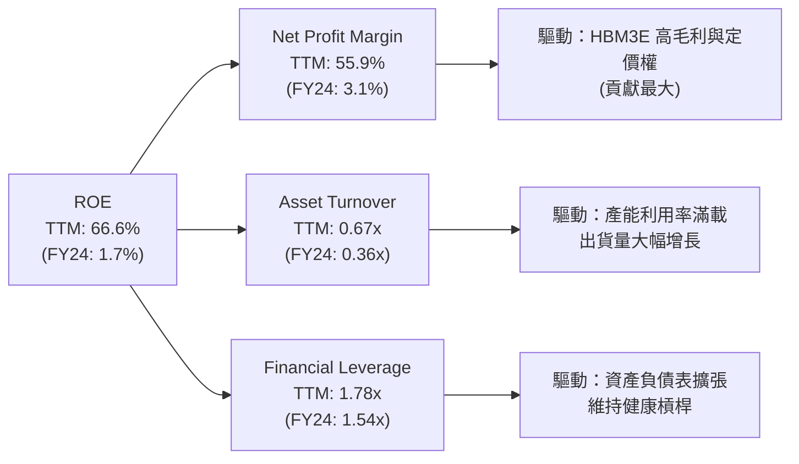

杜邦分解公式：
$$\text{ROE} (66.6\%) = \text{淨利率} (55.9\%) \times \text{資產週轉率} (0.67\text{x}) \times \text{權益乘數} (1.78\text{x})$$

**分析結論**：
ROE 暴增的**核心驅動力是淨利率（Net Profit Margin）的極致擴張**（從 3.1% 飆升至 55.9%），這代表美光當前的獲利增長是「高質量、高利潤率」的業務驅動，而非靠財務槓桿（權益乘數僅微幅上升至 1.78x）或盲目擴大資產規模。

---

## 7. 估值深度分析

### 7.1 同業估值比較表格

在記憶體行業中，美光（MU）、Samsung（三星電子）與 SK Hynix（SK 海力士）是直接競爭對手。

| 估值指標 | **美光 (MU)** | **SK Hynix** | **Samsung (SEC)** | 美光評估 |
|----------|----------|---------|---------|-----------|
| **Trailing P/E** | **21.19x** | 18.5x | 14.2x | 🟡 略高於同業，反映美股市場溢價 |
| **Forward P/E** | **6.53x** | 5.8x | 7.2x | 🟢 極具吸引力，反映未來盈餘暴增 |
| **PEG Ratio** | **0.14** | 0.11 | 0.25 | 🟢 顯著低估（< 1.0 代表極便宜） |
| **P/S Ratio** | **12.30x** | 8.5x | 2.5x | 🔴 偏高，主因美光利潤率高於同業 |
| **EV / EBITDA** | **15.99x** | 12.4x | 6.8x | 🟡 處於合理偏高區間 |
| **FCF Yield** | **0.69%** | 1.2% | 3.5% | 🔴 偏低，因美光 Capex 擴張最為激進 |

### 7.2 歷史估值區間分析

美光歷史 P/E 區間波動極大（由於記憶體行業的週期性，在衰退期 P/E 往往飆升甚至為負，在繁榮期 P/E 則降至個位數）。

```
╔══════════════════════════════════════════════════════════════════╗
║                 MU 歷史 Forward P/E 區間                         ║
╠══════════════════════════════════════════════════════════════════╣
║                                                                  ║
║  歷史高點 (2021)：  35.0x  ██████████████████████████████        ║
║  歷史中位數：       12.5x  ███████████░░░░░░░░░░░░░░░░░░█        ║
║  當前 Forward P/E：  6.53x  ██████░░░░░░░░░░░░░░░░░░░░░░░  🟢    ║
║                                                                  ║
║  📊 結論：當前 6.53x 的 Forward P/E 處於歷史極低分位數（~15%），  ║
║  市場顯著低估了美光在 AI 週期下的盈餘持續性。                    ║
╚══════════════════════════════════════════════════════════════════╝
```

### 7.3 情境目標價（假設驅動，Bear / Base / Bull）

由於美光盈餘受折舊與 Capex 壓抑，我們採用 **EV/EBITDA** 與 **Forward P/E** 雙重估值模型進行情境推演。

| 情境 | 營收 CAGR (3Y) | 營業利潤率 (FY27) | 退出 Forward P/E 倍數 | 隱含目標價 | 相對現價 ($937) |
|------|-----------|-----------|----------|------------|----------|
| 🔴 **悲觀情境** | 5.0% | 15.0% | 8.0x | **$361.00** | -61.5% |
| 🟡 **基準情境** | **25.0%** | **45.0%** | **10.0x** | **$1,486.00** | **+58.6%** |
| 🟢 **樂觀情境** | 40.0% | 55.0% | 12.0x | **$2,200.00** | +134.8% |

*   **悲觀情境假設**：AI 伺服器投資在 2027 年遭遇「減速帶」，三大原廠 HBM 產能嚴重過剩，合約價暴跌，美光利潤率打回原形。
*   **基準情境假設**：AI 需求持續至 2028 年，HBM3E/HBM4 維持高雙位數成長，美光市佔率維持在 20-25% 區間。
*   **樂觀情境假設**：邊緣端 AI（AI PC/手機）滲透率超預期，DRAM 出現結構性大缺貨，美光憑藉 1-beta/1-gamma 節點獲得超額定價權。

### 7.4 DCF 敏感性分析（6格目標價矩陣）

基於終端成長率（Terminal Growth Rate）= 3.0%，進行 WACC 與營收增速之敏感性分析：

| 營收成長率 \ WACC | 13.0% | **14.8%（基準）** | 16.0% |
|------|--------------|----------------------|--------------|
| 🟢 **高成長 (CAGR 30%)** | **$1,950** (+108.1%) | **$1,720** (+83.6%) | **$1,510** (+61.2%) |
| 🟡 **基準成長 (CAGR 25%)** | **$1,680** (+79.3%) | **$1,486** (+58.6%) | **$1,320** (+40.9%) |
| 🔴 **低成長 (CAGR 15%)** | **$1,120** (+19.5%) | **$980** (+4.6%) | **$850** (-9.3%) |

### 7.5 估值綜合區間

```
╔══════════════════════════════════════════════════════════════════╗
║                      MU 估值綜合區間                             ║
╠══════════════════════════════════════════════════════════════════╣
║                                                                  ║
║  [悲觀目標]  $361                                                ║
║      |                                                           ║
║      v                                                           ║
║  ██████████████████                                              ║
║                    [當前股價]  $937                              ║
║                        |                                         ║
║                        v                                         ║
║                    ████████████████████████████                  ║
║                                              [基準目標]  $1486   ║
║                                                  |               ║
║                                                  v               ║
║                                                  ██████████████  ║
║                                                  [樂觀目標] $2200║
║                                                                  ║
║  📊 當前股價處於基準目標價的 63.1% 位置，提供了極佳的安全邊際。 ║
╚══════════════════════════════════════════════════════════════════╝
```

---

## 8. 成長催化劑

### 8.1 催化劑時間軸

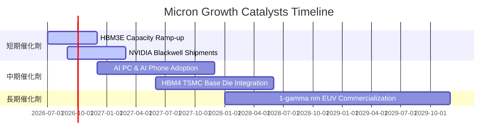

### 8.2 TAM 市場規模分析

AI 記憶體將徹底改變 DRAM 的市場空間（TAM）：

```
╔══════════════════════════════════════════════════════════════════╗
║                  DRAM TAM 預測與美光份額 ($B)                    ║
╠══════════════════════════════════════════════════════════════════╣
║                                                                  ║
║  2024 TAM  $85B   ████████████░░░░░░░░░░░░░░░░░  美光市佔: ~20%  ║
║  2026 TAM  $150B  ██████████████████████░░░░░░░  美光市佔: ~22%  ║
║  2028 TAM  $220B  █████████████████████████████  美光市佔: ~25%  ║
║                                                                  ║
║  🚀 驅動核心：單台 AI 伺服器 DRAM 價值量為傳統伺服器的 8 倍。    ║
╚══════════════════════════════════════════════════════════════════╝
```

### 8.3 成長驅動力結構圖

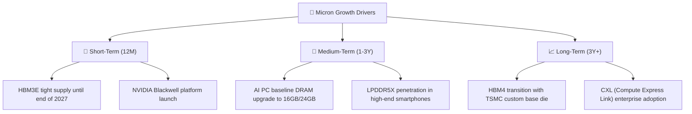

---

## 9. 風險矩陣

### 9.1 風險評分矩陣

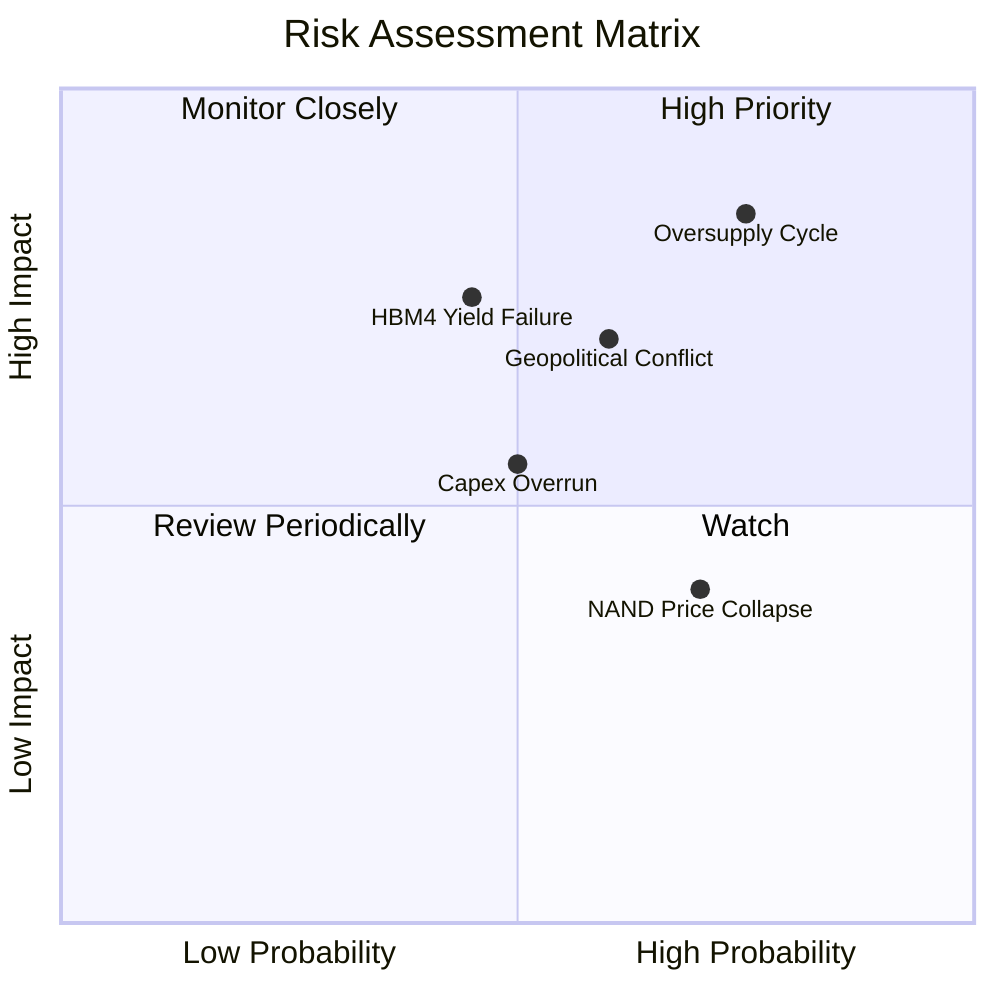

### 9.2 風險清單詳細分析

| # | 風險項目 | 發生機率 | 財務衝擊 | 風險評分 | 緩解措施 |
|---|----------|----------|----------|----------|----------|
| 1 | 🔴 **記憶體行業產能過剩** | 高 (75%) | 高 (-30% 營收) | 🔴 8.5 / 10 | 美光已與客戶簽訂 HBM 長期供應協議（LTA），鎖定 2027 年底前的產能與價格。 |
| 2 | 🟡 **HBM4 技術節點轉移失敗** | 中 (45%) | 高 (-20% 獲利) | 🟡 6.8 / 10 | 提前與台積電（TSMC）及創意電子（Global Unichip）開展深度技術合作，確保 1c nm 基礎晶圓設計兼容。 |
| 3 | 🔴 **地緣政治衝突（台灣/中國）** | 中 (60%) | 極高 (-50% 產能) | 🔴 8.0 / 10 | 積極分散後段封裝產能，擴建日本廣島 Fab 15 及美國愛達荷州、紐約州的新晶圓廠。 |
| 4 | 🟡 **NAND 業務持續低迷** | 高 (70%) | 低 (-5% 淨利) | 🟡 5.5 / 10 | 縮減 NAND 資本支出，將產能優先轉移至高毛利的企業級 SSD（eSSD）。 |

---

## 10. 投資建議

### 10.1 最終綜合評級雷達圖

美光在基本面、成長性、獲利能力與財務健康度上皆表現優異，唯獨在估值波動性與現金流量轉換上需保持警惕。

```
╔══════════════════════════════════════════════════════════════════╗
║                    MU 最終投資維度評估                           ║
╠══════════════════════════════════════════════════════════════════╣
║                                                                  ║
║  基本面強度：  9.0/10  ▓▓▓▓▓▓▓▓▓▓▓▓▓▓▓▓▓▓░░  ★★★★★             ║
║  成長動能：    9.5/10  ▓▓▓▓▓▓▓▓▓▓▓▓▓▓▓▓▓▓▓░  ★★★★★             ║
║  獲利品質：    9.0/10  ▓▓▓▓▓▓▓▓▓▓▓▓▓▓▓▓▓▓░░  ★★★★★             ║
║  財務健康：    8.5/10  ▓▓▓▓▓▓▓▓▓▓▓▓▓▓▓▓░░░░  ★★★★☆             ║
║  估值安全邊際：7.0/10  ▓▓▓▓▓▓▓▓▓▓▓▓▓░░░░░░░  ★★★★☆             ║
║                                                                  ║
║  🏆 綜合推薦評級：🟢 強烈買入 (Strong Buy)                       ║
╚══════════════════════════════════════════════════════════════════╝
```

### 10.2 目標價與隱含報酬率

| 情境 | 機率權重 | 目標價 | 隱含報酬率 | 權重後目標價 |
|------|----------|--------|------------|--------------|
| 🔴 **悲觀情境** | 15% | $361.00 | -61.5% | $54.15 |
| 🟡 **基準情境** | **65%** | **$1,486.00** | **+58.6%** | **$965.90** |
| 🟢 **樂觀情境** | 20% | $2,200.00 | +134.8% | $440.00 |
| **加權綜合目標價** | **100%** | **$1,460.05** | **+55.8%** | **建議積極佈局** |

### 10.3 買入時機與觸發因素

```
╔══════════════════════════════════════════════════════════════════╗
║                  ✅ 買入與交易策略 Checklist                     ║
╠══════════════════════════════════════════════════════════════════╣
║                                                                  ║
║  立即買入觸發條件（多數符合）：                                  ║
║  ✅ 當前 Forward P/E 低於 8.0x（目前 6.53x，符合）               ║
║  ✅ 淨現金狀態維持正值（目前 +$19.65B，符合）                     ║
║  ✅ HBM3E 產能確認至 2027 年底全部售罄（符合）                    ║
║                                                                  ║
║  加碼觸發條件（出現以下任一）：                                  ║
║  ☐ 股價因整體市場系統性風險回檔至 $800 以下                      ║
║  ☐ 1c nm HBM4 順利通過 NVIDIA 認證                               ║
║                                                                  ║
║  停損/減碼觸發條件（出現以下任一）：                             ║
║  ☐ DRAM 合約價（Contract Price）連續兩季出現 YoY 跌幅            ║
║  ☐ 應收帳款佔營收比重超過 75%，導致 OCF 轉負                     ║
╚══════════════════════════════════════════════════════════════════╝
```

### 10.4 投資人適配度分析

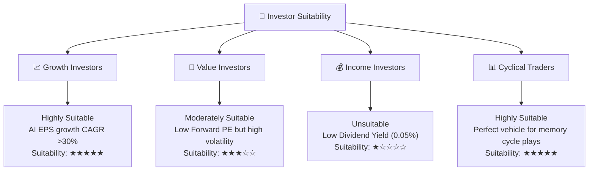

### 10.5 每季財報監控清單（Quarterly Watch List）

| 監控指標 | 基準安全值 | 觸發加碼門檻 | 觸發減碼門檻 | 2026Q3 實際值 | 狀態 |
|----------|------------|--------------|--------------|---------------|------|
| **DRAM 毛利率** | > 50.0% | > 70.0% | < 40.0% | **84.6%** | 🟢 強烈加碼 |
| **HBM 營收佔比** | > 15.0% | > 25.0% | < 10.0% | **~30.0%** (估) | 🟢 強烈加碼 |
| **應收帳款週轉天數** | < 60 天 | < 45 天 | > 75 天 | **58 天** | 🟡 持平 |
| **Capex 佔營收比重** | 25% - 35% | < 25% (資本紀律) | > 45% (過度擴張) | **18.9%** (Q3單季) | 🟢 資本紀律良好 |
| **NVIDIA 訂單份額** | > 20% | > 30% | < 15% | **~25%** | 🟢 符合預期 |

### 10.6 反面論證：什麼會證明論點錯誤（What Would Change My Mind）

本投資研究報告基於 AI 記憶體將維持長期高增長的假設。若發生以下**可量化條件**，本多頭論點將宣告失效，投資人應果斷執行停損或清倉：

```
╔══════════════════════════════════════════════════════════════════╗
║              ⚠️ 論點失效條件（Disconfirming Evidence）           ║
╠══════════════════════════════════════════════════════════════════╣
║  本投資論點在下列情況成立時應重新檢視或退出：                    ║
║  ☐ 核心 DRAM 營收成長率連續兩季 YoY 降至 15.0% 以下              ║
║  ☐ 營業利潤率較峰值（80.4%）收縮超過 25.0 pp（即跌破 55.4%）     ║
║  ☐ 自由現金流（FCF）連續兩季轉為負值，且 Capex 無法有效縮減      ║
║  ☐ ROIC 跌破 WACC（14.8%），開始摧毀股東價值                      ║
║  ☐ 美光在 HBM4 的市佔率低於 15.0%（被三星與海力士完全壟斷）      ║
╚══════════════════════════════════════════════════════════════════╝
```

---

> **免責聲明**：本報告為 AI 自動生成，僅供研究參考，不構成投資建議。投資有風險，入市需謹慎。