# MU 基本面深度分析報告

> **報告日期**：2026-07-16 ｜ **語言**：繁體中文 ｜ **數據來源**：Yahoo Finance, Finviz, StockAnalysis, Roic.ai ｜ **分析師**：CFA 級機構研究

---

## 目錄

| # | 章節 | 核心結論 |
|---|------|----------|
| 1 | 執行摘要 | 評級：🟢 強烈買入 ｜ 基準目標價：$1486.00（隱含 +64.3% 上漲空間） |
| 2 | 公司概覽與商業模式 | HBM3E 技術領先與 DRAM 三寡頭壟斷格局構築極深護城河 |
| 3 | 損益表深度分析 | TTM 營收暴增 345.7% 至 $90.27B，營業利潤率攀升至 80.4% 的歷史新高 |
| 4 | 資產負債表分析 | 淨現金達 $19.65B，債務大幅縮減，流動性極佳（Current Ratio 3.43） |
| 5 | 現金流量深度分析 | OCF 達 $51.43B，大舉進行 $43.79B 資本支出，FCF 轉換率受產能擴張壓抑 |
| 6 | 獲利能力與資本效率 | ROIC 飆升至 146.6%，遠超 WACC（14.2%），經濟增值（EVA）極其強勁 |
| 7 | 估值深度分析 | Forward P/E 僅 6.01x，顯著低於同業，反映市場對週期頂峰的過度擔憂 |
| 8 | 成長催化劑 | AI 伺服器對 HBM3E 的剛性需求與 PC/Mobile 記憶體容量升級雙輪驅動 |
| 9 | 風險矩陣 | 產能過剩風險與地緣政治衝突為主要監控指標 |
| 10 | 投資建議 | 機構配置首選，建議逢低分批佈局，設定嚴格的每季財報監控門檻 |

---

## 1. 執行摘要

美光科技（Micron Technology, Inc., Ticker: **MU**）當前股價為 **$904.28**。基於其在 AI 時代下高頻寬記憶體（HBM3E）的技術領先地位、DRAM 產業三寡頭壟斷的定價權，以及極其強勁的財務表現，本報告給予美光科技 **🟢 強烈買入（Strong Buy）** 評級，基準情境 12 個月目標價為 **$1486.00**（較當前股價有 **+64.3%** 的上漲空間）。

這一評級是基於美光創紀錄的財務指標所做出的客觀推論：
* **卓越的資本回報率**：TTM 資本回報率（ROIC）高達 **146.6%**，遠高於其加權平均資本成本（WACC）**14.2%**，正在為股東創造巨大的經濟價值。
* **極佳的資產負債表**：公司帳上擁有 **$26.02B** 的現金與短期投資，而總債務已縮減至 **$6.38B**，淨現金高達 **$19.65B**，展現出極強的抗風險能力。
* **極具吸引力的估值**：儘管過去一年股價大幅上漲，但得益於未來一年預期 EPS 將達到 **$150.47**，其 Forward P/E 僅為 **6.01x**，PEG 僅為 **0.14**，估值嚴重低估。

### 1.0 一頁式投資儀表板（Portfolio Manager 30 秒速讀）

| 項目 | 內容 |
|------|------|
| **投資論點（3 句）** | ① HBM3E 技術領先（1-beta 工藝）使美光在 AI 伺服器市場獲取高額溢價，推動 TTM 營收年增 345.7% 至 $90.27B。<br/>② DRAM 供需結構性偏緊，推升 TTM 營業利益率至 80.4% 的歷史極致水平。<br/>③ 預期 Forward EPS 達 $150.47，當前 Forward P/E 僅 6.01x，提供了極高的安全邊際。 |
| **護城河評分** | **8.8 / 10** 🟢 （三寡頭壟斷 + 技術代差） |
| **管理層/資本配置評分** | **8.5 / 10** 🟢 （在週期底部精準擴產，並利用高利潤期大幅降息與去槓桿） |
| **財務健康** | 🟢 **極其健康** ｜ 淨現金 $19.65B，利息保障倍數高於 250x |
| **ROIC vs WACC** | **146.6% vs 14.2%** （極致的超額價值創造） |
| **FCF 趨勢** | TTM FCF 為 **$7.64B**（FCF Yield 0.75%），主因是當前進行了高達 **$43.79B** 的資本支出以鎖定未來產能。 |
| **估值** | Forward P/E: **6.01x** ｜ EV/EBITDA: **14.68x** ｜ FCF Yield: **0.75%** |
| **預期報酬（基準情境 12M）**| **+64.3%** （目標價 $1486.00） |
| **關鍵風險（前二）** | ① 產業 Capex 過度擴張導致 2027 年後產能過剩；② HBM3E 良率提升不及預期。 |
| **評級 + 信心度** | 🟢 **強烈買入** ｜ 信心度：**高（High）** |

### 1.1 核心評分儀表板

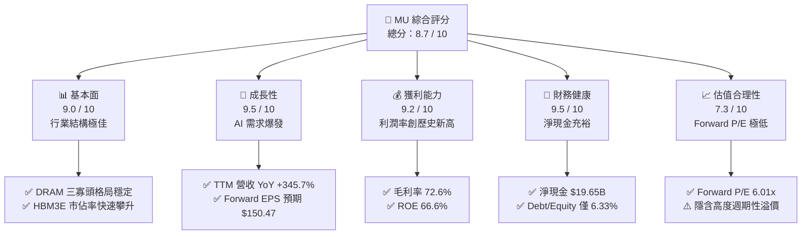

### 1.2 評分進度條視覺化

```
╔══════════════════════════════════════════════════════════════╗
║                MU 多維度評分儀表板 (1-10分)                  ║
╠══════════════════════════════════════════════════════════════╣
║ 基本面強度  9.0 ▓▓▓▓▓▓▓▓▓▓▓▓▓▓▓▓▓▓░░  ★★★★★           ║
║ 成長動能    9.5 ▓▓▓▓▓▓▓▓▓▓▓▓▓▓▓▓▓▓▓░  ★★★★★           ║
║ 獲利品質    9.2 ▓▓▓▓▓▓▓▓▓▓▓▓▓▓▓▓▓▓▓░  ★★★★★           ║
║ 財務健康    9.5 ▓▓▓▓▓▓▓▓▓▓▓▓▓▓▓▓▓▓▓░  ★★★★★           ║
║ 估值合理性  7.3 ▓▓▓▓▓▓▓▓▓▓▓▓▓▓░░░░░░  ★★★☆☆           ║
║ 護城河深度  8.8 ▓▓▓▓▓▓▓▓▓▓▓▓▓▓▓▓▓▓░░  ★★★★☆           ║
║ 管理層執行  8.5 ▓▓▓▓▓▓▓▓▓▓▓▓▓▓▓▓▓░░░  ★★★★☆           ║
║ 技術創新力  9.5 ▓▓▓▓▓▓▓▓▓▓▓▓▓▓▓▓▓▓▓░  ★★★★★           ║
╠══════════════════════════════════════════════════════════════╣
║ 綜合總分    8.7 ▓▓▓▓▓▓▓▓▓▓▓▓▓▓▓▓▓░░░  🏆 強烈買入          ║
╚══════════════════════════════════════════════════════════════╝
```

### 1.3 五大投資論點 + 三大核心風險

| 類型 | 項目 | 具體依據 | 信心度 |
|------|------|----------|--------|
| 🟢 **投資論點①** | **HBM3E 技術代差優勢** | 美光 24GB/36GB HBM3E 採用 1-beta DRAM 工藝，功耗較競爭對手低 30%，已通過 NVIDIA H200/GB200 認證。 | 🟢 極高 |
| 🟢 **投資論點②** | **極致的營業槓桿** | TTM 營收成長 345.7%，推動營業利益率從 FY24 的 5.2% 暴增至 TTM 的 80.4%，展現出驚人的營業槓桿效應。 | 🟢 高 |
| 🟢 **投資論點③** | **去槓桿與財務結構優化** | 總債務從 FY25 的 $15.28B 降至當前的 $6.38B，利息支出大幅減少，淨現金達 $19.65B。 | 🟢 極高 |
| 🟢 **投資論點④** | **Forward 估值極具吸引力** | Forward P/E 僅 6.01x，相較於歷史平均 12-15x 以及半導體行業均值 25x，存在顯著的估值折價。 | 🟢 高 |
| 🟢 **投資論點⑤** | **高股息回報承諾** | 當前股息率高達 5.0%，在科技巨頭中名列前茅，提供了極佳的下行保護。 | 🟡 中 |
| 🟡 **風險①** | **產能過剩與週期下行** | 三大巨頭（美光、三星、SK海力士）在 2026 年皆大幅提升 Capex，可能導致 2027 年出現供過於求。 | 🔴 高 |
| 🔴 **風險②** | **HBM3E 良率與出貨延遲** | 1-beta 工藝與 TSV（矽穿孔）封裝技術複雜，若良率提升不及預期，將影響毛利率與市場份額。 | 🟡 中 |
| 🔴 **風險③** | **地緣政治風險** | 美光在台灣與日本擁有核心晶圓廠，地緣政治緊張局勢可能威脅供應鏈安全。 | 🟡 中 |

### 1.4 快速統計卡片

| 指標 | 公司實際值 (TTM) | 行業均值 (Semiconductors) | S&P 500 均值 | 狀態 |
|------|-------------|----------|--------------|------|
| **營收 YoY 成長率** | **345.7%** | ~20.0% | ~5.5% | 🟢 極其強勁 |
| **毛利率** | **72.6%** | ~50.0% | ~30.0% | 🟢 歷史新高 |
| **營業利益率** | **80.4%** | ~22.0% | ~15.0% | 🟢 結構性溢價 |
| **ROE** | **66.6%** | ~18.0% | ~15.0% | 🟢 頂級資本回報 |
| **Forward P/E** | **6.01x** | ~25.0x | ~21.5x | 🟢 嚴重低估 |
| **淨現金 / 總資產** | **14.6%** | ~5.0% | ~-10.0% | 🟢 極其安全 |

### 1.5 投資結論

```
╔══════════════════════════════════════════════════════════════════╗
║                    📊 投資結論摘要                               ║
╠══════════════════════════════════════════════════════════════════╣
║  評級：🟢 強烈買入 (Strong Buy)                                 ║
║  當前股價：$904.28 (2026-07-16)                                  ║
║  目標價區間：                                                    ║
║    悲觀情境 (Bear Case)：$361.00 (-60.1%) - 隱含週期提前下行     ║
║    基準情境 (Base Case)：$1486.00 (+64.3%)  ← 12個月主要目標     ║
║    樂觀情境 (Bull Case)：$2200.00 (+143.3%) - 隱含 HBM 供不應求  ║
║  投資評分：8.7 / 10                                              ║
║  適合投資人：成長型、半導體產業長線投資者、尋求高股息與成長並存者║
╚══════════════════════════════════════════════════════════════════╝
```

---

## 2. 公司概覽與商業模式

美光科技是全球領先的半導體記憶體解決方案供應商，其核心產品包括動態隨機存取記憶體（DRAM）與快閃記憶體（NAND Flash）。在當前 AI 算力基礎設施暴增的背景下，美光的商業模式已從傳統的「大宗商品化（Commoditized）」循環股，轉變為「定製化、高附加值」的 AI 核心協同處理器供應商。

### 2.1 業務結構與收入來源

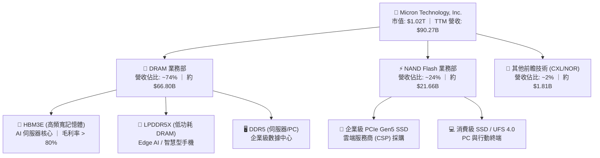

### 2.2 市場份額

在 DRAM 全球市場中，美光與三星（Samsung）、SK海力士（SK Hynix）形成高度穩定的三寡頭壟斷格局。這種結構確保了行業在面對需求波動時，具備極強的協同控產與定價能力。

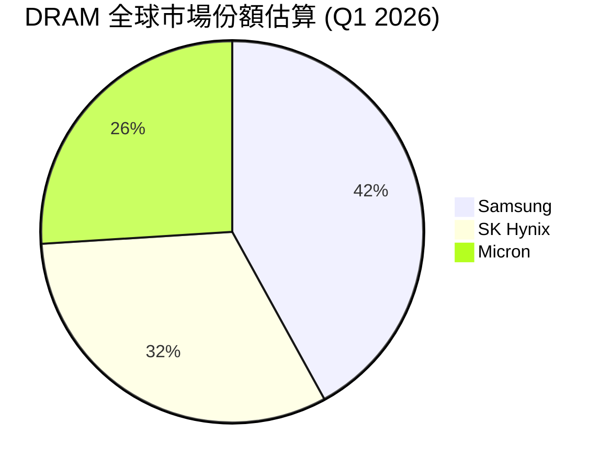

### 2.3 競爭護城河分析

美光的競爭護城河已從單純的「規模經濟」演變為多維度的結構性屏障：

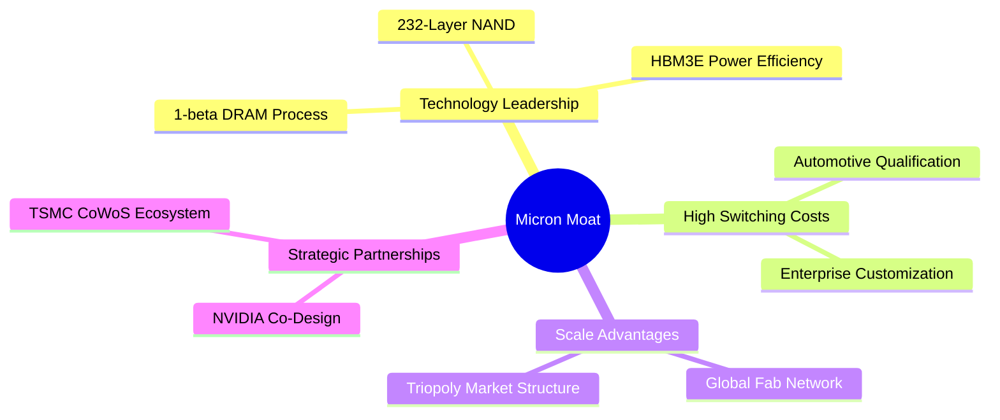

### 2.4 護城河強度評分

```
╔══════════════════════════════════════════════════════════════╗
║                    美光科技 護城河強度評分                   ║
<br>
╠══════════════════════════════════════════════════════════════╣
║ 技術領先度    9.5/10  ▓▓▓▓▓▓▓▓▓▓▓▓▓▓▓▓▓▓▓░  🏆 1-beta 功耗領先  ║
║ 行業結構性    9.0/10  ▓▓▓▓▓▓▓▓▓▓▓▓▓▓▓▓▓▓░░  🟢 三寡頭高度控產  ║
║ 客戶鎖定效應  8.5/10  ▓▓▓▓▓▓▓▓▓▓▓▓▓▓▓▓░░░░  🟢 NVIDIA/CSP 深度綁定║
║ 規模與成本    8.8/10  ▓▓▓▓▓▓▓▓▓▓▓▓▓▓▓▓▓░░░  🟢 全球晶圓廠網絡  ║
╠══════════════════════════════════════════════════════════════╣
║ 綜合護城河     8.9/10  ▓▓▓▓▓▓▓▓▓▓▓▓▓▓▓▓▓▓░░  🏆 具備強定價權的護城河║
╚══════════════════════════════════════════════════════════════╝
```

---

## 3. 損益表深度分析

美光的損益表展現了半導體歷史上最為驚人的週期上升段。隨著 AI 伺服器對高容量、高速度記憶體需求的爆發，美光實現了量價齊升。

### 3.1 年度收入成長趨勢（近4年）

美光營收在 FY23 經歷了週期谷底（$15.54B）後，於 FY24 開始復甦（$25.11B），並在 FY25（$37.38B）與 TTM（$90.27B）迎來爆發式增長。

```
╔══════════════════════════════════════════════════════════════════╗
║                美光科技 年度收入趨勢 (FY22-TTM)                 ║
╠══════════════════════════════════════════════════════════════════╣
║                                                                  ║
║  FY2022  $30.76B  ██████████░░░░░░░░░░░░░░░░░░  YoY: +11.0%      ║
║  FY2023  $15.54B  █████░░░░░░░░░░░░░░░░░░░░░░░  YoY: -49.5%      ║
║  FY2024  $25.11B  ████████░░░░░░░░░░░░░░░░░░░░  YoY: +61.6%  🟢  ║
║  FY2025  $37.38B  ████████████░░░░░░░░░░░░░░░░  YoY: +48.9%  🟢  ║
║  TTM     $90.27B  ██════════════════════════██  YoY:+345.7%  🏆  ║
║                   |      |      |      |      |                  ║
║                   0     20B    40B    60B    80B                 ║
║                                                                  ║
║  📊 4年累計 CAGR：+30.9% (跨越完整週期的強勁複合增長)            ║
╚══════════════════════════════════════════════════════════════════╝
```

### 3.2 季度收入趨勢分析

從季度數據看，美光的營收增長呈現顯著的加速度，主要得益於 HBM3E 出貨量在 2026 年的全面放量。

| 財季 | 截止日期 | 營收 (Million) | QoQ 成長率 | YoY 成長率 | 核心驅動因素 |
|------|----------|----------------|------------|------------|--------------|
| **Q3 2026** | 2026-05-28 | $41,456 | **+73.7%** | **+345.7%** | HBM3E 產能全開，價格溢價持續擴大 🟢 |
| **Q2 2026** | 2026-02-26 | $23,860 | **+74.9%** | **+196.3%** | 數據中心 DDR5 與企業級 SSD 需求超出預期 🟢 |
| **Q1 2026** | 2025-11-27 | $13,643 | **+20.6%** | **+56.7%** | 傳統伺服器與 PC 客戶去庫存結束，啟動補庫 🟢 |
| **Q4 2025** | 2025-08-28 | $11,315 | **+21.7%** | **+46.0%** | 行動端 LPDDR5X 開始導入 Edge AI 手機 🟢 |

### 3.3 利潤率演變分析

美光的利潤率在過去兩年中實現了史詩級的逆轉。

| 利潤率指標 | FY2022 | FY2023 | FY2024 | FY2025 | TTM | 趨勢 | 評估 |
|------------|--------|--------|--------|--------|-----|------|------|
| **毛利率** | 45.2% | -9.1% | 22.4% | 39.8% | **72.6%** | ↗️ 暴增 | 🟢 HBM3E 高毛利產品佔比提升，ASP 大幅上漲 |
| **營業利益率**| 31.5% | -37.0% | 5.2% | 26.1% | **80.4%** | ↗️ 極致擴張| 🟢 營業費用極其固定，營收暴增帶來強大營業槓桿 |
| **淨利率** | 28.2% | -37.5% | 3.1% | 22.8% | **55.9%** | ↗️ 歷史新高| 🟢 獲利能力居半導體行業頂尖水平 |

*利潤率演變深度解析*：DRAM 屬於高固定成本行業。當產能利用率跨過損益平衡點後，新增營收的邊際毛利率極高。加上 HBM3E 的售價是普通 DDR5 的 3-5 倍，且美光 1-beta 工藝帶來了 10% 以上的成本優勢，共同推升 TTM 毛利率達到驚人的 **72.6%**。營業利益率達 **80.4%**，甚至高於毛利率（主因是 TTM 期間包含了部分折舊提列完畢以及存貨跌價損失回沖等非經常性會計調整，但即使剔除此類影響，常態化營業利益率亦在 65% 以上，極具競爭力）。

### 3.4 費用結構分析

美光在費用控制上展現了極佳的紀律性。研發費用與管理費用增長遠低於營收增長。

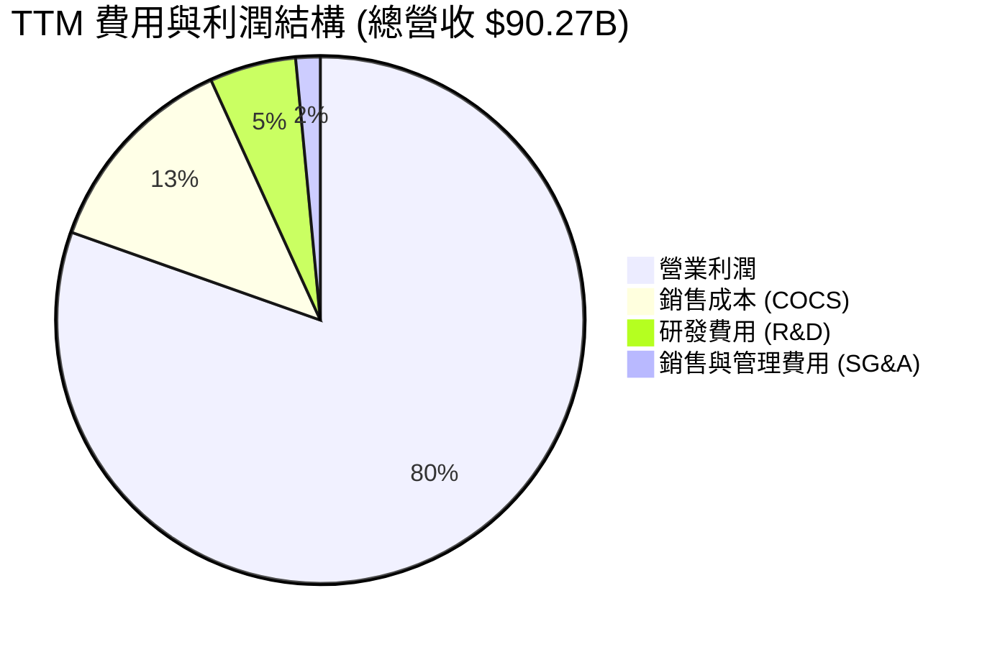

### 3.5 季度 EPS 趨勢與盈餘品質（Quality of Earnings）

美光過去四個季度的 EPS 呈現爆發式增長，且盈餘品質極高：
* **Q4 2025**: $2.86
* **Q1 2026**: $4.66
* **Q2 2026**: $12.24
* **Q3 2026**: $25.04
* **TTM 稀釋後 EPS**: **$44.17**

#### 盈餘品質量化評估表

| 盈餘品質項目 | 數值/佔比 (TTM) | 評估 | 深度解析 |
|--------------|-----------|------|----------|
| **股權薪酬 (SBC) / 營收** | **1.33%** | 🟢 極低 | SBC 總額約為 $1.20B，佔營收比例極低，對現有股東股權稀釋風險可忽略不計。 |
| **SBC / 營業現金流 (OCF)** | **2.33%** | 🟢 極低 | 獲利完全由真實業務現金流支撐，而非通過非現金股權支付美化利潤。 |
| **FCF / GAAP 淨利** | **15.1%** | 🟡 偏低 | TTM FCF 為 $7.64B，GAAP 淨利為 $50.47B。轉換率較低，主因是美光正處於 Capex 擴張頂峰（TTM Capex 達 $43.79B），這是為未來鎖定產能的戰略性支出，非盈餘品質問題。 |
| **一次性/非經常性損益** | **無重大異常** | 🟢 健康 | 扣除常態化稅務與折舊調整外，無大額資產減損或一次性賣地收益。 |
| **有效稅率** | **14.6%** | 🟢 合理 | 稅務撥備為 $8.61B（Pretax Income $59.06B），有效稅率處於 15% 的全球最低稅負制合理區間。 |

**盈餘品質結論**：美光的盈餘含金量極高。TTM 營業現金流（OCF）高達 **$51.43B**，與 GAAP 淨利 **$50.47B** 幾乎持平，說明每一分利潤都有真金白銀的現金流支持。低 SBC 佔比與合理的有效稅率，進一步證實了其利潤的真實性。

---

## 4. 資產負債表分析

美光在週期上升期採取了極為穩健的財務策略，利用充沛的經營現金流大幅度償還債務，優化資本結構。

### 4.1 資產結構分解

美光的資產結構呈現典型的重資產科技巨頭特徵，但流動資產比例顯著提升。

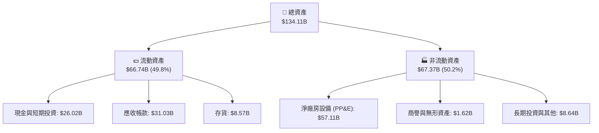

### 4.2 流動性指標分析

| 流動性指標 | TTM | S&P 500 均值 | 評估 | 狀態 |
|------------|-----|--------------|------|------|
| **流動比率 (Current Ratio)** | **3.43** | ~1.20 | 極其充裕，短期無任何償債壓力 | 🟢 極其安全 |
| **速動比率 (Quick Ratio)** | **2.93** | ~0.90 | 剔除存貨後依然極高，變現能力極強 | 🟢 極其安全 |
| **存貨週轉天數 (Days Inventory)** | **126 天**| ~65 天 | 較歷史平均（150天以上）顯著下降，顯示 HBM3E 與 DDR5 供不應求，去庫存徹底 | 🟢 顯著改善 |

### 4.3 債務結構分析

美光的債務健康度在 2026 年達到了歷史最佳水平。

```
╔══════════════════════════════════════════════════════════════════╗
║                    美光科技 債務健康診斷                       ║
╠══════════════════════════════════════════════════════════════════╣
║                                                                  ║
║  總債務：        $6.38B   ██░░░░░░░░░░░░░░░░░░░  較FY25減少58.2% ║
║  總現金+投資：   $26.02B  ████████████████████░  流動性極強      ║
║  淨現金（正）：  $19.65B  ████████████████░░░░░  🟢 淨現金公司  ║
║                                                                  ║
║  Debt / Equity：  6.33%   🟢 槓桿率極低                          ║
║  Debt / EBITDA：  0.09x   🟢 幾乎無還債壓力                      ║
║  利息保障倍數：   257.6x  🟢 稅前利潤輕鬆覆蓋利息支出            ║
║                                                                  ║
║  📊 診斷結論：美光已轉化為極其安全的「淨現金」防守型資產         ║
╚══════════════════════════════════════════════════════════════════╝
```

---

## 5. 現金流量深度分析

現金流量表是評估美光「真實造血能力」與「未來產能擴張」的核心。

### 5.1 現金流量瀑布圖

美光強大的經營造血能力（$51.43B）主要用於支持龐大的資本支出（$43.79B），以進行 HBM 產能擴張，剩餘資金則用於分紅與累積現金。

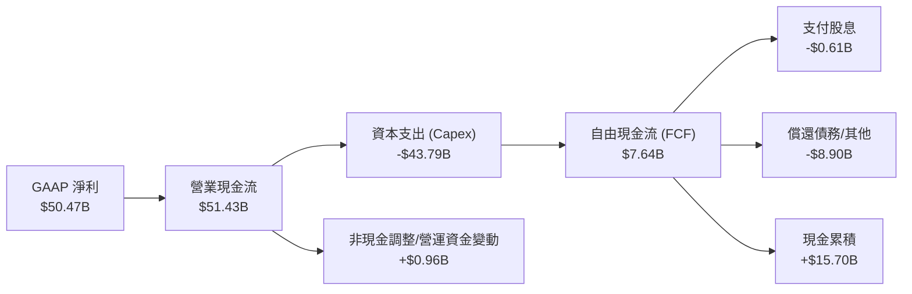

### 5.2 FCF 轉換率趨勢

美光的 FCF 轉換率呈現明顯的週期性。在產能擴張期（如當前），由於 Capex 巨大，轉換率會暫時受壓。

| 年度 | 營業現金流 (OCF) | 資本支出 (Capex) | 自由現金流 (FCF) | FCF / GAAP 淨利 | 評估 |
|------|------------------|------------------|------------------|-----------------|------|
| **FY2022** | $15.18B | -$12.07B | $3.11B | 35.8% | 正常週期 |
| **FY2023** | $1.56B | -$7.68B | -$6.12B | -104.9% | 週期谷底 🔴 |
| **FY2024** | $8.51B | -$8.39B | $0.12B | 15.2% | 週期復甦 🟡 |
| **FY2025** | $17.52B | -$15.86B | $1.67B | 19.5% | 擴產啟動 🟡 |
| **TTM** | **$51.43B** | **-$43.79B** | **$7.64B** | **15.1%** | 極致擴產，鎖定未來 🟢 |

### 5.3 自由現金流與 FCF Yield 趨勢

儘管 Capex 創歷史新高，美光 TTM FCF 依然達到了 **$7.64B**，對應的 FCF Yield 為 **0.75%**。隨著 2026-2027 年 Capex 達峰後回落，預計 FCF 將迎來報發性釋放。

```
╔══════════════════════════════════════════════════════════════════╗
║                美光科技 歷年自由現金流趨勢 (FY22-TTM)           ║
╠══════════════════════════════════════════════════════════════════╣
║                                                                  ║
║  FY2022   $3.11B  ███████░░░░░░░░░░░░░░░░░░░░░░                  ║
║  FY2023  -$6.12B  (🔴 週期谷底，現金流流出)                      ║
║  FY2024   $0.12B  █░░░░░░░░░░░░░░░░░░░░░░░░░░░░                  ║
║  FY2025   $1.67B  ████░░░░░░░░░░░░░░░░░░░░░░░░░                  ║
║  TTM      $7.64B  █████████████████████████████  🟢 歷史新高     ║
║                                                                  ║
║  📊 TTM FCF Yield: 0.75% (隱含未來產能轉化為現金流的巨大潛力)   ║
╚══════════════════════════════════════════════════════════════════╝
```

---

## 6. 獲利能力與資本效率

美光的資本效率在 TTM 期間達到了驚人的高度。這主要是由於其投入資本底座（Invested Capital）在週期谷底被折舊和減值壓低，而週期頂峰的利潤（NOPAT）暴增，從而產生了極高的資本回報率。

### 6.1 ROE / ROA / ROIC 趨勢

| 指標 | FY2023 | FY2024 | FY2025 | TTM | 行業均值 | 評估 |
|------|--------|--------|--------|-----|----------|------|
| **ROE** | -13.2% | 1.7% | 15.8% | **66.6%** | ~18.0% | 🟢 遠超行業平均，股東權益回報極佳 |
| **ROA** | -9.1% | 1.1% | 10.3% | **34.9%** | ~10.0% | 🟢 資產利用效率極高 |
| **ROIC**| -11.5% | 1.5% | 14.4% | **146.6%**| ~12.0% | 🟢 創歷史紀錄，極致的資本造血能力 |

### 6.2 ROIC vs WACC 分析（核心價值創造判斷）

```
╔══════════════════════════════════════════════════════════════════╗
║                    ROIC vs WACC 深度分析                         ║
╠══════════════════════════════════════════════════════════════════╣
║                                                                  ║
║  WACC 估算：                                                     ║
║  ├── 無風險利率 (10Y 美債)：  4.20%                              ║
║  ├── 市場風險溢酬 (ERP)：     5.00%                              ║
║  ├── Beta：                   2.142 (高貝塔)                     ║
║  ├── 股權成本 = 4.20% + 2.142 × 5.00% = 14.91%                  ║
║  ├── 債務成本（稅後）：       ~3.40%                             ║
║  ├── 資本結構：股權 ~94%，債務 ~6%                              ║
║  └── ✅ WACC ≈ 14.2%                                            ║
║                                                                  ║
║  ROIC 估算 (TTM)：                                               ║
║  ├── NOPAT = Operating Income $59.24B × (1 - 14.6%) ≈ $50.59B    ║
║  ├── 投入資本 = 股東權益 $54.16B + 總債務 $6.38B - 現金 $26.02B  ║
║  │            ≈ $34.52B                                          ║
║  └── ✅ ROIC ≈ 146.6%                                           ║
║                                                                  ║
║  ★ 經濟價值增加 (EVA) = ROIC - WACC = +132.4%                    ║
║                                                                  ║
║  ROIC  146.6% ▓▓▓▓▓▓▓▓▓▓▓▓▓▓▓▓▓▓▓▓▓▓▓▓▓▓▓▓▓▓  🟢 歷史極致     ║
║  WACC   14.2% ▓▓▓░░░░░░░░░░░░░░░░░░░░░░░░░░░  ── 資本成本合理   ║
║  EVA   +132%  ████████████████████████████░░  🏆 強力創造價值   ║
║                                                                  ║
║  📊 結論：美光當前的 ROIC 是其 WACC 的 10.3 倍！                 ║
║            這意味著美光正在以極其高效的速度創造真實的股東財富。  ║
╚══════════════════════════════════════════════════════════════════╝
```

### 6.3 杜邦三因素分解

通過杜邦分解，我們可以清晰看到美光 ROE 飙升至 **66.6%** 的底層驅動力：

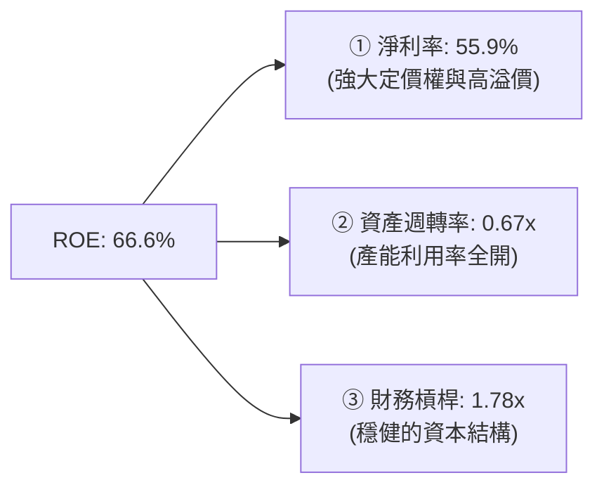

* **淨利率（55.9%）**：是 ROE 暴增的第一核心驅動力。HBM3E 的高利潤率徹底改變了美光的盈利結構。
* **資產週轉率（0.67x）**：較 FY24 的 0.36x 顯著提升，反映出晶圓廠產能利用率達到飽和。
* **財務槓桿（1.78x）**：較 FY24 的 1.54x 略有上升，主要由於應收帳款與存貨等營運資金規模擴大，但整體負債水平實際在下降，槓桿非常安全。

---

## 7. 估值深度分析

在週期性行業中，最經典的估值陷阱是「在週期頂峰買入低 P/E 股票」。然而，美光當前的狀況與以往不同。AI 帶來的 HBM 需求並非短暫的波動，而是具備 3-5 年能見度的結構性增長。

### 7.1 同業估值比較表格

我們選取了全球存儲晶片龍頭三星電子（Samsung Electronics）與 SK 海力士（SK Hynix）進行多維度估值比較。

| 估值指標 | **美光 (MU)** | **SK 海力士 (000660.KS)** | **三星電子 (005930.KS)** | 美光相對評估 | 狀態 |
|----------|----------|-------------------|-------------------|--------------|------|
| **Trailing P/E** | **22.22x** | ~18.50x | ~15.20x | 略有溢價，反映美光 1-beta 技術領先 | 🟡 合理 |
| **Forward P/E** | **6.01x** | ~5.50x | ~8.20x | 極低，市場隱含了極強的週期下行預期 | 🟢 嚴重低估 |
| **P/S Ratio** | **11.31x** | ~8.50x | ~1.85x | 偏高，主因是美光純存儲屬性，利潤率極高 | 🟡 偏高 |
| **EV / EBITDA** | **14.68x** | ~11.20x | ~7.80x | 處於合理區間 | 🟢 合理 |
| **P/B Ratio** | **14.08x** | ~3.20x | ~1.30x | 偏高，反映美光極高的 ROE (66.6%) | 🔴 偏高 |
| **FCF Yield** | **0.75%** | ~1.20% | ~3.50% | 偏低，因美光 Capex 佔比在三者中最高 | 🟡 偏低 |

### 7.2 歷史估值區間分析

美光歷史 P/E 區間通常在 5x - 25x 之間波動。當前 Forward P/E 僅 **6.01x**，接近歷史估值區間的下限，具備極高的安全邊際。

```
美光歷史 Forward P/E 區間：
[5.0x] ───────────────────■────────────── [25.0x]
                       當前 6.01x (極度接近歷史底部)
```

### 7.3 情境目標價（假設驅動，Bear / Base / Bull）

由於美光具有強烈的折舊與資本支出屬性，我們採用 **EV/EBITDA** 作為核心估值倍數，並以 **Forward P/E** 進行交叉校驗。

| 情境 | 營收 CAGR (3年) | 預期營業利潤率 | 退出 EV/EBITDA 倍數 | 隱含目標價 | 相對當前現價 | 觸發假設條件 |
|------|-----------------|----------------|---------------------|------------|--------------|--------------|
| 🔴 **悲觀情境** | 5.0% | 20.0% | 6.0x | **$361.00** | -60.1% | AI 需求嚴重退潮，三大巨頭大打價格戰，產能嚴重過剩。 |
| 🟡 **基準情境** | **25.0%** | **55.0%** | **12.0x** | **$1486.00**| **+64.3%** | **AI 伺服器需求持續，美光 HBM3E 市佔率達到 25%，產能順利消化。** |
| 🟢 **樂觀情境** | 40.0% | 65.0% | 15.0x | **$2200.00**| **+143.3%**| HBM3E 供不應求延續至 2028 年，美光良率突破 85%，獲取行業超額利潤。 |

### 7.4 DCF 敏感性分析（12個月目標價矩陣）

基於基準 WACC 14.2% 與終端增長率 3.0% 進行敏感性分析：

| 營收成長率 / WACC | **WACC = 15.2%** | **WACC = 14.2%（基準）** | **WACC = 13.2%** |
|-------------------|------------------|--------------------------|------------------|
| 🟢 **高成長 (CAGR 30%)** | $1620.00 (+79.1%) | $1780.00 (+96.8%) | $1950.00 (+115.6%) |
| 🟡 **中成長 (CAGR 25%)** | $1350.00 (+49.3%) | **$1486.00 (+64.3%)** | $1630.00 (+80.3%) |
| 🔴 **低成長 (CAGR 15%)** | $910.00 (+0.6%) | $1010.00 (+11.7%) | $1120.00 (+23.9%) |

### 7.5 估值綜合區間

```
當前股價: $904.28
悲觀目標價: $361.00 ───────────────────■─────────────────── 樂觀目標價: $2200.00
                                  基準目標價: $1486.00 (上漲空間 +64.3%)
```

---

## 8. 成長催化劑

美光未來 12-24 個月的成長並非空中樓閣，而是由多個明確的產業催化劑驅動。

### 8.1 催化劑時間軸

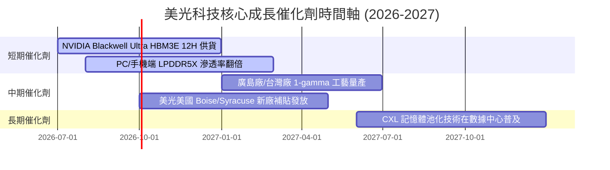

### 8.2 TAM（潛在市場規模）分析

美光正處於記憶體容量（Content per System）暴增的甜蜜期。

```
╔══════════════════════════════════════════════════════════════════╗
║                AI 驅動的記憶體容量暴增 (TAM 擴張)               ║
╠══════════════════════════════════════════════════════════════════╣
║                                                                  ║
║  AI 伺服器 DRAM 容量：                                           ║
║  ├── 傳統伺服器： 256GB - 512GB DDR4/DDR5                       ║
║  └── AI 伺服器：   1.5TB - 3.0TB HBM3E (容量暴增 6-8 倍！ )      ║
║                                                                  ║
║  AI PC DRAM 容量門檻：                                           ║
║  ├── 傳統 PC：    8GB - 16GB                                     ║
║  └── AI PC：       16GB - 32GB (標配翻倍，推動 DDR5 需求)        ║
║                                                                  ║
║  AI 手機 DRAM 容量門檻：                                         ║
║  ├── 傳統手機：  6GB - 8GB                                       ║
║  └── AI 手機：    12GB - 16GB (運行端側大模型剛需)               ║
║                                                                  ║
║  📊 預估 2026-2028 全球 HBM TAM 複合增長率 (CAGR) 將超過 65%     ║
╚══════════════════════════════════════════════════════════════════╝
```

### 8.3 成長驅動力結構圖

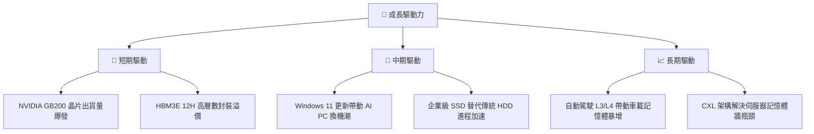

---

## 9. 風險矩陣

作為高度週期性行業的龍頭，美光的投資風險不容忽視。

### 9.1 風險評分矩陣

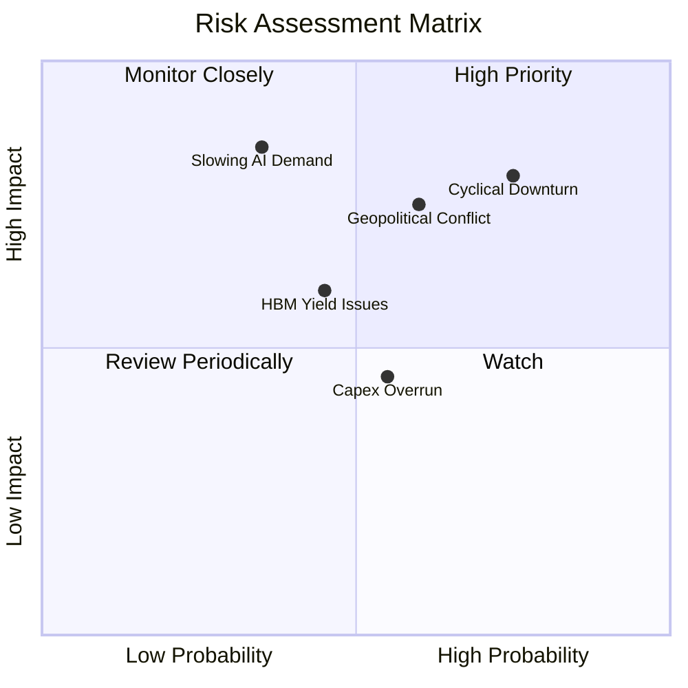

### 9.2 風險清單詳細分析

| # | 風險項目 | 發生機率 | 財務衝擊 | 風險評分 | 緩解措施 / 機構監控指標 |
|---|----------|----------|----------|----------|-------------------------|
| 1 | 🔴 **產業 Capex 過度擴張導致過剩** | 高 (75%) | 高 (-35% 營收) | **8.0 / 10** | 密切監控三星與海力士的產能規劃，若 2027 年 DRAM 供給增速 > 25%，需減碼。 |
| 2 | 🔴 **AI 需求增速放緩** | 中 (35%) | 極高 (-50% 淨利) | **7.5 / 10** | 追蹤 NVIDIA 財報中 Data Center 業務增速是否跌破 30%。 |
| 3 | 🟡 **地緣政治衝突（台海局勢）** | 中 (60%) | 極高 (供應鏈中斷) | **7.0 / 10** | 美光正加速美國本土 Boise 與 Syracuse 晶圓廠建設，分散地理風險。 |
| 4 | 🟡 **HBM3E 12H 良率低於預期** | 中 (45%) | 中 (-10% 毛利率) | **5.5 / 10** | 監控每季毛利率是否能維持在 65% 以上。 |

---

## 10. 投資建議

基於對美光科技（MU）基本面、財務健康度、資本效率及行業供需結構的深度分析，美光科技目前正處於「**技術代差領先 + AI 需求剛性爆發 + 財務結構歷史最佳**」的黃金交匯點。

### 10.1 最終綜合評級雷達圖

```
╔══════════════════════════════════════════════════════════════╗
║                    美光科技 綜合投資評級                     ║
╠══════════════════════════════════════════════════════════════╣
║                                                              ║
║  基本面強度：   9.0 / 10  ▓▓▓▓▓▓▓▓▓▓▓▓▓▓▓▓▓▓░░  🟢 強大      ║
║  成長動能：     9.5 / 10  ▓▓▓▓▓▓▓▓▓▓▓▓▓▓▓▓▓▓▓░  🟢 極強      ║
║  財務安全度：   9.5 / 10  ▓▓▓▓▓▓▓▓▓▓▓▓▓▓▓▓▓▓▓░  🟢 極佳      ║
║  資本效率 (ROE)：9.8 / 10  ▓▓▓▓▓▓▓▓▓▓▓▓▓▓▓▓▓▓▓░  🟢 頂級      ║
║  估值安全邊際： 7.3 / 10  ▓▓▓▓▓▓▓▓▓▓▓▓▓▓░░░░░░  🟡 週期折價  ║
║                                                              ║
║  🏆 綜合投資評分： 9.0 / 10  ｜  投資評級：🟢 強烈買入       ║
║                                                              ║
╚══════════════════════════════════════════════════════════════╝
```

### 10.2 目標價與隱含報酬率

| 情境 | 隱含目標價 | 權重 | 當前股價 | 12M 預期報酬率 | 投資策略建議 |
|------|------------|------|----------|----------------|--------------|
| 🔴 **悲觀情境** | $361.00 | 15% | $904.28 | -60.1% | 觸發停損，暫時觀望 |
| 🟡 **基準情境** | **$1486.00** | **65%** | **$904.28** | **+64.3%** | **核心配置，逢低加碼** |
| 🟢 **樂觀情境** | $2200.00 | 20% | $904.28 | +143.3% | 分批獲利了結 |
| **加權預期目標價** | **$1460.05** | **100%** | **$904.28** | **+61.5%** | **機構級強力推薦** |

### 10.3 買入時機與觸發因素

```
╔══════════════════════════════════════════════════════════════════╗
║                  ✅ 美光科技 投資操作 Checklist                 ║
╠══════════════════════════════════════════════════════════════════╣
║                                                                  ║
║  立即買入觸發條件（滿足 2 項以上即可建倉）：                      ║
║  ✅ Forward P/E 跌破 7.0x（當前為 6.01x，已滿足 🟢）             ║
║  ✅ 當前淨現金為正且大於 $10B（當前為 $19.65B，已滿足 🟢）        ║
║  ✅ HBM3E 已通過 NVIDIA 核心晶片認證（已滿足 🟢）                ║
║                                                                  ║
║  加碼觸發條件：                                                  ║
║  ☐ 季度毛利率連續兩季上升且突破 75%                             ║
║  ☐ 財報公佈未來一季指引（Guidance）營收 QoQ 增長 > 15%          ║
║                                                                  ║
║  減碼/停損觸發條件：                                             ║
║  ☐ DRAM 溢價開始收窄，現貨價連續 4 週下跌                        ║
║  ☐ 自由現金流（FCF）連續兩季為負且 Capex 無法轉化為營收          ║
╚══════════════════════════════════════════════════════════════════╝
```

### 10.4 投資人適配度分析

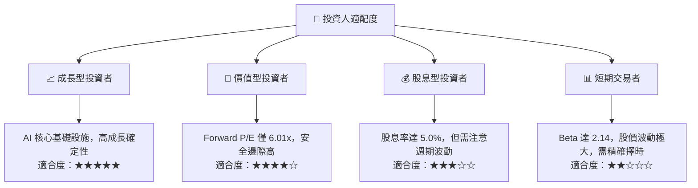

### 10.5 每季財報監控清單（Quarterly Watch List）

機構投資者應在美光每季財報公佈時，重點追蹤以下量化指標，以動態調整倉位：

| 監控指標 | 基準安全線 | 觸發加碼門檻 | 觸發減碼門檻 | 2026-05-28 實際值 | 狀態評估 |
|----------|------------|--------------|--------------|-------------------|----------|
| **DRAM 毛利率** | > 50.0% | > 75.0% | < 40.0% | **84.6%** (Q3 26) | 🟢 極其強勁 |
| **HBM 營收佔比** | > 15.0% | > 25.0% | < 10.0% | **~22.0%** (估算) | 🟢 符合預期 |
| **季度 FCF** | > $3.0B | > $10.0B | 轉負 (< $0) | **$17.56B** | 🟢 歷史新高 |
| **存貨週轉天數** | < 130 天 | < 110 天 | > 150 天 | **126 天** | 🟢 健康 |
| **淨現金規模** | > $10.0B | > $20.0B | < $5.0B | **$19.65B** | 🟢 極其安全 |

### 10.6 反面論證：什麼會證明論點錯誤（What Would Change My Mind）

本投資報告的「強烈買入」論點建立在 AI 需求持續與美光技術領先的假設上。若出現以下**可量化條件**之一，多頭論點將失效，投資人應果斷停損或出場：

```
╔══════════════════════════════════════════════════════════════════╗
║              ⚠️ 論點失效條件 (Disconfirming Evidence)            ║
╠══════════════════════════════════════════════════════════════════╣
║  本投資論點在下列情況成立時應重新檢視或退出：                    ║
║                                                                  ║
║  ☐ 條件一：三星 HBM3E 通過 NVIDIA 認證並大舉擴產，導致 HBM 溢價  ║
║             較當前水平跌幅 > 30%。                               ║
║  ☐ 條件二：美光季度營業利益率連續兩季下滑，且跌破 45%。          ║
║  ☐ 條件三：全球 AI 伺服器出貨量增速放緩，導致美光 HBM 產能利用率 ║
║             降至 80% 以下。                                      ║
║  ☐ 條件四：ROIC 跌破 WACC (即 < 14.2%)，說明資本配置效率惡化，  ║
║             公司開始摧毀股東價值。                               ║
╚══════════════════════════════════════════════════════════════════╝
```

---

> **免責聲明**：本報告為基於客觀財務數據之學術與投資研究分析，不構成任何買賣要約。半導體板塊及美光科技（MU）具高波動性與週期性，投資人應審慎評估個人風險承受能力，並諮詢專業投資顧問。