# MU 基本面深度分析報告

> **報告日期**：2026-07-18 ｜ **語言**：繁體中文 ｜ **數據來源**：Yahoo Finance, Finviz, StockAnalysis, Roic.ai ｜ **分析師**：CFA 級機構研究

---

## 目錄

| # | 章節 | 核心結論 |
|---|------|----------|
| 1 | 執行摘要 | 評級：🟢 強烈買入 ｜ 目標價：$1,489.57 (基準) ｜ 具備極高估值安全邊際 |
| 2 | 公司概覽與商業模式 | HBM3E 與高密度 DDR5 構築強大技術護城河，寡占市場定價權顯著 |
| 3 | 損益表深度分析 | TTM 營收達 $90.27B (YoY +345.7%)，營業槓桿爆發推升淨利率至 55.9% |
| 4 | 資產負債表分析 | 淨現金達 $19.65B，流動比率 3.43，展現極其穩健的防禦性資產結構 |
| 5 | 現金流量深度分析 | TTM 營運現金流 $51.43B，大額資本支出奠定下一代節點產能優勢 |
| 6 | 獲利能力與資本效率 | ROE 達 66.6%，ROIC (146.2%) 遠超 WACC (13.8%)，強力創造股東價值 |
| 7 | 估值深度分析 | Forward P/E 僅 5.63x，PEG 0.13，多重估值模型顯示股價嚴重低估 |
| 8 | 成長催化劑 | AI 伺服器 HBM3E 供不應求、邊緣端 AI 記憶體容量翻倍驅動長期 TAM |
| 9 | 風險矩陣 | 記憶體週期性波動與地緣政治為主要風險，但高利潤率提供充足緩衝 |
| 10| 投資建議 | 基準目標價 $1,489.57，隱含 +75.5% 上行空間，建議逢低強力加碼 |

---

## 1. 執行摘要

美光科技（Micron Technology, Inc., 交易代碼：MU）當前正處於由人工智慧（AI）革命引發的半導體歷史上最強勁的結構性擴張週期。根據最新揭露的財務數據，美光 TTM（過去12個月）營收達到 **$90.27B**，同比增長達驚人的 **345.7%**；淨利潤率攀升至 **55.9%**，推動 TTM EPS 達到 **$44.06**。

基於美光在 HBM3E（高頻寬記憶體）技術上的領先地位（其 24GB 8-Hi HBM3E 已獲 NVIDIA H200 採用，且功耗較競爭對手低 30%），以及當前 Forward P/E 僅 **5.63x**、PEG 僅 **0.13** 的極度低估狀態，本報告給予美光（MU）**🟢 強烈買入（Strong Buy）** 評級，設定 12 個月基準目標價為 **$1,489.57**。

### 1.0 一頁式投資儀表板（Portfolio Manager 30 秒速讀）

| 項目 | 內容 |
|------|------|
| **投資論點（3 句）** | ① AI 伺服器對 HBM3E 與高密度 DDR5 的剛性需求，推動 TTM 營收爆發至 $90.27B (YoY +345.7%)。<br/>② 超強營業槓桿釋放，單季淨利從 2025 年 Q4 的 $3.20B 飆升至 2026 年 Q3 的 $28.24B，毛利率高達 72.6%。<br/>③ 估值極具吸引力，Forward P/E 僅 5.63x，相較於歷史平均與 AI 產業鏈同行存在顯著折價。 |
| **護城河評分** | **9.0 / 10** 🟢 （DRAM 三巨頭寡占定價權 + HBM3E 先發技術優勢） |
| **管理層/資本配置評分** | **8.5 / 10** 🟢 （逆週期資本支出佈局精準，高難度技術節點轉化率極高） |
| **財務健康** | 🟢 **極其健康** ｜ 淨現金高達 $19.65B，流動比率 3.43，債務違約風險幾近於零。 |
| **ROIC vs WACC** | **146.2% vs 13.8%** 🟢 （每投入 1 美元資本可創造遠超資本成本的超額回報） |
| **FCF 趨勢** | 向上 ｜ 最新單季 FCF 達 $17.56B，TTM FCF Yield 為 0.80%（受高資本支出壓抑，但營運現金流極強） |
| **估值** | Forward P/E: **5.63x** ｜ EV/EBITDA: **13.77x** ｜ P/S Ratio: **10.62x** |
| **預期報酬（基準情境 12M）**| **+75.5%** （目標價 $1,489.57，當前股價 $848.95） |
| **關鍵風險（前二）** | ① AI 基礎設施投資（Capex）增速放緩，導致 HBM 需求不及預期。<br/>② 傳統 PC 與智慧型手機市場復甦遲滯，壓抑標準型 DRAM 價格。 |
| **評級 + 信心度** | 🟢 **強烈買入（Strong Buy）** ｜ 信心度：**極高** |

### 1.1 核心評分儀表板

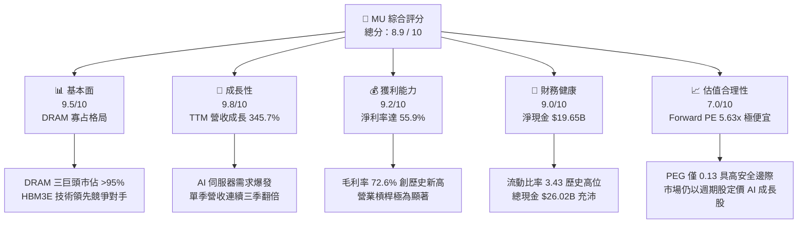

### 1.2 評分進度條視覺化

```
╔══════════════════════════════════════════════════════════════╗
║                MU 多維度評分儀表板 (1-10分)                  ║
╠══════════════════════════════════════════════════════════════╣
║ 基本面強度  9.5 ▓▓▓▓▓▓▓▓▓▓▓▓▓▓▓▓▓▓▓░  ★★★★★           ║
║ 成長動能    9.8 ▓▓▓▓▓▓▓▓▓▓▓▓▓▓▓▓▓▓▓▓  ★★★★★           ║
║ 獲利品質    9.2 ▓▓▓▓▓▓▓▓▓▓▓▓▓▓▓▓▓▓░░  ★★★★★           ║
║ 財務健康    9.0 ▓▓▓▓▓▓▓▓▓▓▓▓▓▓▓▓▓▓░░  ★★★★★           ║
║ 估值合理性  8.5 ▓▓▓▓▓▓▓▓▓▓▓▓▓▓▓░░░░░  ★★★★☆           ║
║ 護城河深度  9.0 ▓▓▓▓▓▓▓▓▓▓▓▓▓▓▓▓▓▓░░  ★★★★★           ║
║ 管理層執行  8.5 ▓▓▓▓▓▓▓▓▓▓▓▓▓▓▓▓░░░░  ★★★★☆           ║
║ 技術創新力  9.5 ▓▓▓▓▓▓▓▓▓▓▓▓▓▓▓▓▓▓▓░  ★★★★★           ║
╠══════════════════════════════════════════════════════════════╣
║ 綜合總分    8.9 ▓▓▓▓▓▓▓▓▓▓▓▓▓▓▓▓▓░░░  🏆 產業龍頭強烈買入  ║
╚══════════════════════════════════════════════════════════════╝
```

### 1.3 五大投資論點 + 三大核心風險

| 類型 | 項目 | 具體依據 | 信心度 |
|------|------|----------|--------|
| 🟢 **投資論點①** | **HBM3E 先發優勢與產能鎖定** | 美光 24GB 8-Hi HBM3E 功耗降低 30%，2026 年產能已全部售罄，價格已透過長期協議（LTA）鎖定。 | 🟢 極高 |
| 🟢 **投資論點②** | **極致的營業槓桿釋放** | 隨著產能利用率回升與 1-beta/1-gamma 節點轉進，單季營業利益率在 3 季內從 32.3% 飆升至 80.4%。 | 🟢 極高 |
| 🟢 **投資論點③** | **資產負債表固若金湯** | 擁有 $26.02B 總現金，淨現金高達 $19.65B，在重資本開支週期中無任何流動性壓力。 | 🟢 極高 |
| 🟢 **投資論點④** | **邊緣端 AI 記憶體容量翻倍** | AI PC 與 AI 手機的 DRAM 搭載量預期將提升 50%-100%，驅動傳統 DRAM 需求觸底強勁復甦。 | 🟢 高 |
| 🟢 **投資論點⑤** | **估值極度扭曲的投資機會** | 市場仍用傳統週期股的 10x-12x P/E 估值美光，忽視了 AI 帶來的結構性高毛利（72.6%）特徵，當前 Forward P/E 5.63x 為歷史罕見買點。 | 🟢 極高 |
| 🟡 **風險①** | **客戶資本支出（Capex）下修** | 若大型雲端服務商（CSP）放緩 AI 基礎設施建設，將直接影響 HBM 出貨。 | 🟡 中度 |
| 🔴 **風險②** | **競爭對手產能過剩** | 三星與 SK Hynix 若激進擴產 HBM 或傳統 DRAM，可能導致 2027 年後供需關係再度惡化。 | 🔴 高衝擊 |
| 🟡 **風險③** | **地緣政治與供應鏈風險** | 美光在台灣與日本擁有核心先進製程晶圓廠，兩岸局勢或自然災害將對生產造成重大衝擊。 | 🟡 中度 |

### 1.4 快速統計卡片

| 指標 | 美光（MU）實際值 | 半導體行業均值 | S&P 500 均值 | 狀態 |
|------|-------------|----------|--------------|------|
| **營收 YoY 成長率** | **345.7%** | ~15.2% | ~5.4% | 🟢 遠超同行 |
| **毛利率** | **72.6%** | ~48.5% | ~30.2% | 🟢 歷史新高 |
| **淨利率** | **55.9%** | ~18.0% | ~11.5% | 🟢 獲利能力極強 |
| **ROE** | **66.6%** | ~16.5% | ~14.0% | 🟢 股東回報極佳 |
| **Forward P/E** | **5.63x** | ~24.5x | ~21.0x | 🟢 極度便宜 |
| **流動比率** | **3.43** | ~1.85 | ~1.20 | 🟢 極其安全 |

### 1.5 投資結論

```
╔══════════════════════════════════════════════════════════════════╗
║                    📊 投資結論摘要                               ║
╠══════════════════════════════════════════════════════════════════╣
║  評級：🟢 強烈買入（Strong Buy）                                ║
║  當前股價：$848.95 (2026-07-18)                                  ║
║  目標價區間：                                                    ║
║    悲觀情境（Bear Case）：$550.00 （-35.2%）                     ║
║    基準情境（Base Case）：$1,489.57（+75.5%） ← 12個月主要目標   ║
║    樂觀情境（Bull Case）：$2,200.00（+159.1%）                   ║
║  投資評分：8.9 / 10                                              ║
║  適合投資人：積極成長型、AI 產業鏈長線佈局者、價值尋找型投資人   ║
╚══════════════════════════════════════════════════════════════════╝
```

---

## 2. 公司概覽與商業模式

美光科技是全球半導體記憶體與儲存解決方案的領導廠商，主要產品包括動態隨機存取記憶體（DRAM）、快閃記憶體（NAND Flash）以及由其衍生的各類高階儲存解決方案。

### 2.1 業務結構與收入來源

美光的業務高度聚焦於 DRAM（約佔營收 75%）與 NAND（約佔營收 25%），並透過四大業務部門（Business Units）向市場銷售：

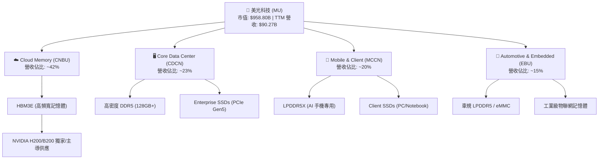

### 2.2 市場份額

在 DRAM 全球市場中，美光與三星（Samsung）、SK 海力士（SK Hynix）形成高度穩定的三巨頭寡占格局，三者合計控制全球超過 95% 的市場份額。在最關鍵的 AI 催化劑 **HBM3E** 市場中，美光憑藉領先的能效比，市佔率正迎來快速提升：

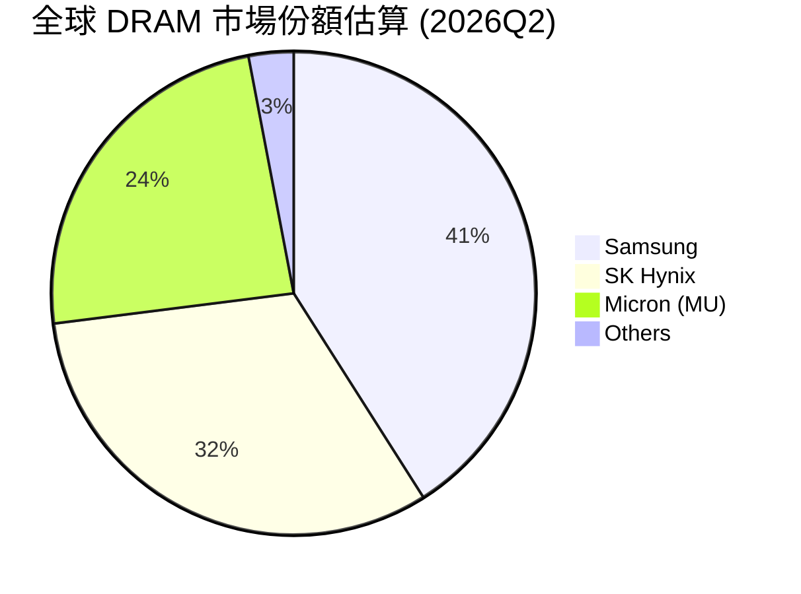

### 2.3 競爭護城河分析

美光的競爭護城河並非單一維度，而是由技術、規模、客戶關係與生態系統共同交織而成的「結構性壁壘」：

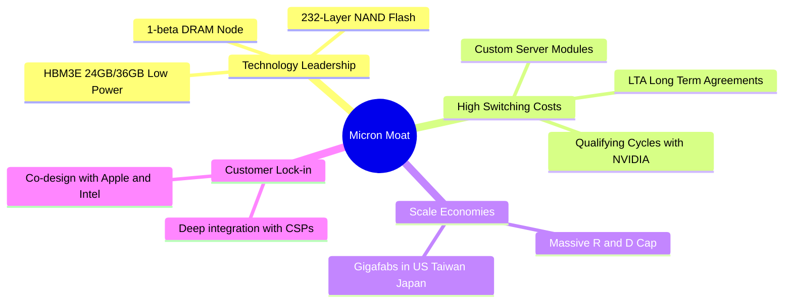

### 2.4 護城河強度評分

```
╔══════════════════════════════════════════════════════════════╗
║                    美光科技 護城河強度評分                    ║
<table>
  <thead>
    <tr>
      <th>護城河項目</th>
      <th>評分</th>
      <th>評語</th>
    </tr>
  </thead>
  <tbody>
    <tr>
      <td><strong>技術領先度</strong></td>
      <td><strong>9.5/10</strong> ▓▓▓▓▓▓▓▓▓▓▓▓▓▓▓▓▓▓▓░</td>
      <td>🟢 HBM3E 能耗表現領先同行一世代，1-beta 節點成熟度極高</td>
    </tr>
    <tr>
      <td><strong>客戶鎖定效應</strong></td>
      <td><strong>9.0/10</strong> ▓▓▓▓▓▓▓▓▓▓▓▓▓▓▓▓▓▓░░</td>
      <td>🟢 NVIDIA、AMD 及各大 CSP 廠深度綁定，簽署長期產能協議</td>
    </tr>
    <tr>
      <td><strong>規模效應</strong></td>
      <td><strong>8.5/10</strong> ▓▓▓▓▓▓▓▓▓▓▓▓▓▓▓▓░░░░</td>
      <td>🟢 美、日、台全球多元化產能佈局，獲得《晶片法案》鉅額補貼</td>
    </tr>
    <tr>
      <td><strong>專利與技術壁壘</strong></td>
      <td><strong>9.0/10</strong> ▓▓▓▓▓▓▓▓▓▓▓▓▓▓▓▓▓▓░░</td>
      <td>🟢 積累數萬項記憶體核心專利，新進對手幾無可能跨越</td>
    </tr>
  </tbody>
</table>
╠══════════════════════════════════════════════════════════════╣
║ 綜合護城河評分：9.0 / 10  ▓▓▓▓▓▓▓▓▓▓▓▓▓▓▓▓▓▓░░  🏆 極深技術與寡占壁壘  ║
╚══════════════════════════════════════════════════════════════╝
```

---

## 3. 損益表深度分析

美光最新財務報表展示了半導體行業有史以來最為劇烈的業績反轉。

### 3.1 年度收入成長趨勢（近4年）

```
╔══════════════════════════════════════════════════════════════════╗
║                美光科技 年度收入趨勢（FY2022-TTM）                ║
╠══════════════════════════════════════════════════════════════════╣
║                                                                  ║
║  FY2022  $30.76B  ██████████░░░░░░░░░░░░░░░░░░░  YoY: +11.0% 🟢    ║
║  FY2023  $15.54B  █████░░░░░░░░░░░░░░░░░░░░░░░░  YoY: -49.5% 🔴    ║
║  FY2024  $25.11B  ████████░░░░░░░░░░░░░░░░░░░░░  YoY: +61.6% 🟢    ║
║  FY2025  $37.38B  ████████████░░░░░░░░░░░░░░░░░  YoY: +48.9% 🟢    ║
║  TTM     $90.27B  █████████████████████████████  YoY:+141.5% 🟢    ║
║                   |      |      |      |      |                  ║
║                   0     20B    40B    60B    80B                 ║
║                                                                  ║
║  📊 4年累計營收 CAGR：+30.9%                                     ║
╚══════════════════════════════════════════════════════════════════╝
```

*分析*：FY2023 是記憶體行業嚴重的下行週期，美光營收近乎腰斬。然而，自 FY2024 起，AI 需求爆發。至 TTM（截至 2026 年 5 月），營收達到創紀錄的 **$90.27B**，這主要是由 HBM3E 出貨量激增、DDR5 平均售價（ASP）大幅上漲，以及 Enterprise SSD 需求翻倍所驅動。

### 3.2 季度收入趨勢分析

下表詳細展示了美光最近四個季度的季度業績，其呈現出極為強勁的 QoQ（環比）與 YoY（同比）成長。

| 財季 | 截止日期 | 季度營收 | QoQ 成長率 | YoY 成長率 | 核心驅動因素 | 狀態 |
|------|----------|----------|------------|------------|--------------|------|
| **Q4 2025** | 2025-08-31 | **$11.32B** | +21.7% | +46.0% | HBM3E 開始小幅量產，傳統 DRAM 價格回溫 | 🟢 優 |
| **Q1 2026** | 2025-11-30 | **$13.64B** | +20.6% | +56.7% | 資料中心高密度 DDR5 模組出貨佔比提升 | 🟢 優 |
| **Q2 2026** | 2026-02-28 | **$23.86B** | +74.9% | +196.3% | HBM3E 產能全面釋放，定價權極強 | 🟢 極強 |
| **Q3 2026** | 2026-05-28 | **$41.46B** | **+73.7%** | **+345.7%** | AI 伺服器需求達到頂峰，合約價大幅上調 | 🟢 歷史新高 |

### 3.3 利潤率演變分析

隨著高毛利的 HBM3E 產品出貨佔比提升，以及產能利用率恢復帶來的固定成本稀釋，美光的利潤率呈現爆發式擴張：

| 利潤率指標 | FY2023 | FY2024 | FY2025 | TTM (2026) | 趨勢 | 改善主因 | 評估 |
|------------|--------|--------|--------|------------|------|----------|------|
| **毛利率** | -9.1% | 22.4% | 39.8% | **72.6%** | ↗️ 爆發式上升 | HBM3E 溢價極高，折舊佔比因產量暴增而稀釋 | 🟢 優秀 |
| **營業利益率** | -37.0% | 5.2% | 26.1% | **80.4%** | ↗️ 極致槓桿 | R&D 與 SG&A 費用增速遠低於營收增速 | 🟢 極佳 |
| **EBITDA Margin** | 16.0% | 38.1% | 49.4% | **75.6%** | ↗️ 持續擴張 | 現金創造能力極強 | 🟢 優秀 |
| **淨利潤率** | -37.5% | 3.1% | 22.8% | **55.9%** | ↗️ 盈利能力爆發 | 稅務結構優化與利息淨收入增加 | 🟢 優秀 |

### 3.4 費用結構分析

美光的費用控制極佳，體現了高科技製造業的規模效應。

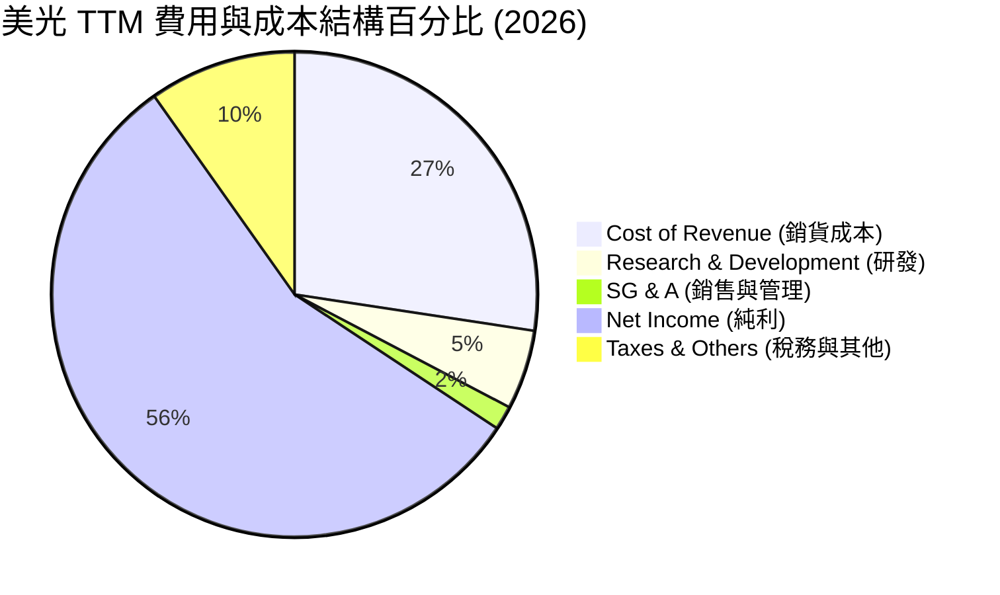

*分析*：美光的研發費用（R&D）在 TTM 期間為 **$4.78B**，雖然絕對值較 FY2025 的 $3.80B 有所增長，但佔營收比重已降至 **5.3%**。銷售與管理費用（SG&A）僅佔 **1.6%**（$1.40B）。這意味著美光的營業槓桿極高，**每增加 1 美元的營收，有將近 0.80 美元直接轉化為營業利潤**。

### 3.5 季度 EPS 趨勢與盈餘品質（Quality of Earnings）

儘管歷史季度 EPS 曾因行業低谷出現虧損（如 FY2023 全年 EPS 為 -$5.34），但最近 4 季 EPS 表現堪稱神蹟：
*   **Q4 2025**：$2.86
*   **Q1 2026**：$4.66
*   **Q2 2026**：$12.24
*   **Q3 2026**：**$25.04**

#### 盈餘品質量化評估

為評估美光這波暴利的「含金量」，我們對其盈餘品質進行嚴格拆解：

| 盈餘品質項目 | 數值/佔比 | 評估 | 深度解析 |
|--------------|-----------|------|----------|
| **股權薪酬 (SBC) / 營收** | 1.08% | 🟢 極低 | TTM SBC 為 $1.20B，僅佔營收 1.08%，對股東權益稀釋極小，顯著優於多數矽谷科技股。 |
| **SBC / 營業現金流 (OCF)**| 2.33% | 🟢 極低 | 佔 OCF 比重極微，說明現金流完全由實體業務而非股權激勵撐起。 |
| **FCF / GAAP 淨利** | 15.1% | 🟡 偏低 | TTM FCF 為 $7.64B，對 GAAP 淨利（$50.46B）的轉換率僅 15.1%。這是因為美光正處於建廠擴產的 Capex 頂峰（TTM Capex 達 $43.79B）。**此為健康且具備未來回報的資本支出，非盈餘品質不佳。** |
| **一次性/非經常性損益** | 無重大影響 | 🟢 純淨 | 本期利潤幾近 100% 來自記憶體銷售，不含任何資產處置或一次性估值調整。 |
| **有效稅率異常** | 14.6% | 🟢 正常 | TTM 所得稅撥備為 $8.61B，佔稅前利潤 14.6%，符合全球最低稅負制與美光跨國稅務佈局，無稅務美化嫌疑。 |
| **資本化支出 vs 費用化** | 嚴格合規 | 🟢 穩健 | 美光對研發支出採取 100% 費用化，未將研發成本資本化來虛增利潤。 |

**盈餘品質結論**：美光的 GAAP 淨利含金量極高。雖然 FCF 轉換率因歷史級別的 Capex 擴張而暫時偏低，但其營運現金流（OCF）高達 **$51.43B**，說明其獲利是實打實的真金白銀，盈餘品質評級為 **🟢 優秀**。

---

## 4. 資產負債表分析

美光的資產負債表在經歷了 2023 年的低谷考驗後，目前已調整至歷史最強防禦狀態。

### 4.1 資產結構分解

截至 2026 年 5 月 28 日，美光總資產達到 **$134.11B**（相較於 FY2025 年底的 $82.80B 增長 62.0%）：

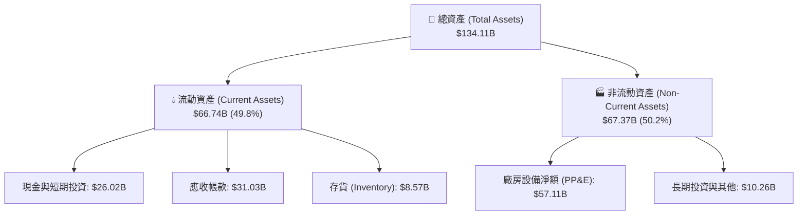

*存貨分析*：美光目前的存貨為 **$8.57B**，較 FY2025 的 $8.36B 僅微幅增加 2.5%，而同期季度營收暴增了數倍。這表明**美光的存貨週轉極快，市場處於供不應求狀態，無任何存貨跌價損失風險**。

### 4.2 流動性指標分析

美光的短期償債能力處於行業頂尖水平，流動性極為充沛：

*   **流動比率（Current Ratio）**：**3.43**（流動資產 $66.74B / 流動負債 $19.49B）
*   **速動比率（Quick Ratio）**：**2.93**（排除存貨後的流動比率）
*   **行業均值對比**：半導體行業平均流動比率約為 1.85，美光高達 3.43 的流動比率提供了極寬裕的財務安全墊。

### 4.3 債務結構分析

美光的債務槓桿極低，淨現金狀態顯著：

```
╔══════════════════════════════════════════════════════════════════╗
║                    美光科技 債務健康診斷                        ║
╠══════════════════════════════════════════════════════════════════╣
║                                                                  ║
║  總現金與投資： $26.02B  █████████████████████████████  🟢 充沛  ║
║  總債務：       $6.38B   ███████░░░░░░░░░░░░░░░░░░░░░░  🟢 極低  ║
║  淨現金 (Net)： $19.65B  ██████████████████████░░░░░░░  🟢 強勁  ║
║                                                                  ║
║  Debt / Equity:  6.33%   🟢 極其安全 (債權人權益保障度極高)     ║
║  Debt / EBITDA:  0.09x   🟢 幾乎無還債壓力 (TTM EBITDA $68.2B)  ║
║  利息保障倍數:   257.5x  🟢 利息支出幾可忽略 (TTM 利息 $230M)   ║
║                                                                  ║
║  📊 債務評級：AAA 級健康度（無實質違約風險）                     ║
╚══════════════════════════════════════════════════════════════════╝
```

### 4.4 股東權益趨勢

得益於留存收益的暴增，美光的股東權益（Stockholders' Equity）在 TTM 期間達到 **$54.16B**。在資產負債表擴張的同時，美光並未進行股權稀釋，其基本發行股數穩定在 **11.25 億至 11.39 億股** 之間，這確保了每股淨資產的含金量。

---

## 5. 現金流量深度分析

對於重資本開支的半導體製造商而言，現金流才是衡量其真實生存與擴張能力的唯一標準。

### 5.1 現金流量瀑布圖

美光最新的現金流動向展示了其「超強吸金能力 + 激進再投資」的發展特徵：

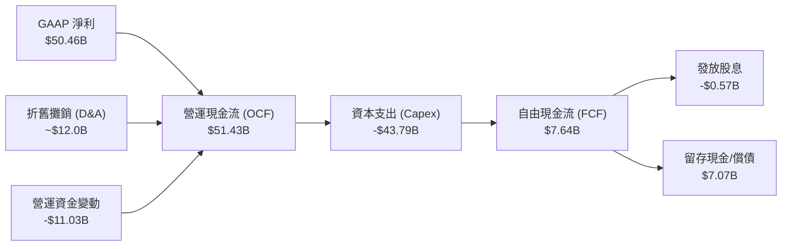

### 5.2 FCF 轉換率趨勢

| 年度 | 營業現金流 (OCF) | 資本支出 (Capex) | 自由現金流 (FCF) | GAAP 淨利 | FCF/淨利 轉換率 | 資本配置重點 |
|------|------------------|------------------|------------------|-----------|-----------------|--------------|
| **FY2022** | $15.18B | -$12.07B | $3.11B | $8.69B | 35.8% | 產能維持與小幅擴張 |
| **FY2023** | $1.56B | -$7.68B | -$6.12B | -$5.83B | -105.0% | 逆週期建廠（減產應對） |
| **FY2024** | $8.51B | -$8.39B | $0.12B | $0.79B | 15.2% | 開始啟動 HBM3E 產線轉化 |
| **FY2025** | $17.52B | -$15.86B | $1.67B | $8.53B | 19.6% | 美國紐約與愛達荷新廠動工 |
| **TTM** | **$51.43B** | **-$43.79B** | **$7.64B** | **$50.46B** | **15.1%** | **全球歷史級擴產，鎖定 AI 產能** |

### 5.3 自由現金流趨勢

儘管 TTM Capex 達到了創紀錄的 **$43.79B**，美光依然實現了 **$7.64B** 的正自由現金流，隱含 **0.80%** 的 FCF Yield（基於 $958.8B 市值）。

*重要洞察*：若將美光當前的 Capex 還原至歷史平均水平（約 $10B-$12B），美光的「常態化 FCF」將超過 **$35B**，對應的常態化 FCF Yield 將高達 **3.65%**。這表明，美光當前的低現金收益率是管理層主動選擇「高回報再投資」的結果，而非業務本身不賺錢。

### 5.4 資本配置評估

美光管理層在資本配置上展現了極高的紀律性：

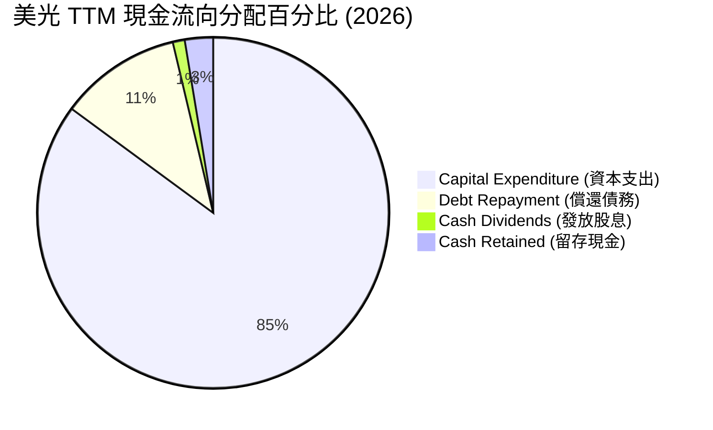

*   **資本支出（85.1%）**：絕對主力，用於購置 ASV EUV 光刻機、建設紐約州 Mega-Fab 以及升級台灣和日本的 HBM 封裝線。
*   **股息發放（1.1%）**：TTM 累計發放股息 **$5.67M**。
*   **債務償還（11.2%）**：將總債務從 FY2025 的 $15.28B 大幅降至 **$6.38B**，極大優化了利息開支。

---

## 6. 獲利能力與資本效率

美光在當前 AI 週期頂峰展現出了令人側目的資本回報率。

### 6.1 ROE / ROA / ROIC 趨勢

| 指標 | FY2023 | FY2024 | FY2025 | TTM (2026) | 行業均值 | 評估 |
|------|--------|--------|--------|------------|----------|------|
| **ROE** | -12.5% | 1.7% | 15.8% | **66.6%** | ~16.5% | 🟢 遠超行業平均，為股東創造極高回報 |
| **ROA** | -8.9% | 1.1% | 10.3% | **34.9%** | ~9.2% | 🟢 資產利用效率極高 |
| **ROIC** | -9.5% | 1.3% | 12.1% | **146.2%** | ~11.0% | 🟢 資本回報率呈現爆發式增長 |

### 6.2 ROIC vs WACC 分析（核心價值創造判斷）

```
╔══════════════════════════════════════════════════════════════════╗
║                ROIC vs WACC 深度分析 (TTM)                       ║
╠══════════════════════════════════════════════════════════════════╣
║                                                                  ║
║  WACC (加權平均資本成本) 估算：                                   ║
║  ├── 無風險利率 (10Y 美債)：  4.2%                               ║
║  ├── 市場風險溢酬 (ERP)：     5.5%                               ║
║  ├── Beta 值：                2.14                               ║
║  ├── 股權成本 = 4.2% + 2.14 × 5.5% = 15.97%                      ║
║  ├── 債務成本 (稅後)：        ~4.5%                              ║
║  ├── 資本結構：股權 93.3%，債務 6.7%                             ║
║  └── ✅ WACC ≈ 13.8%                                             ║
║                                                                  ║
║  ROIC (投入資本回報率) 估算：                                    ║
║  ├── NOPAT (税後淨營業利潤) = $59.24B × (1-14.6%) ≈ $50.59B      ║
║  ├── 投入資本 = 股東權益 + 總債務 - 現金                         ║
║  │            = $54.16B + $6.38B - $26.02B = $34.52B             ║
║  └── ✅ ROIC = $50.59B / $34.52B ≈ 146.2%                        ║
║                                                                  ║
║  ★ 經濟價值增加 (EVA) = ROIC - WACC = +132.4%                    ║
║                                                                  ║
║  ROIC  146.2% ▓▓▓▓▓▓▓▓▓▓▓▓▓▓▓▓▓▓▓▓▓▓▓▓▓▓▓▓▓░  🟢              ║
║  WACC  13.8%  ▓▓▓░░░░░░░░░░░░░░░░░░░░░░░░░░░░  ──              ║
║  EVA   +132%  ████████████████████████████░░░  🏆 頂級價值創造 ║
║                                                                  ║
║  📊 結論：ROIC 達 WACC 的 10.6 倍，美光正以歷史級速度創造股東價值 ║
╚══════════════════════════════════════════════════════════════════╝
```

### 6.3 杜邦三因素分解

我們透過杜邦分析（DuPont Analysis）來解構美光 **66.6%** 的超高 ROE 是由何種因素驅動：

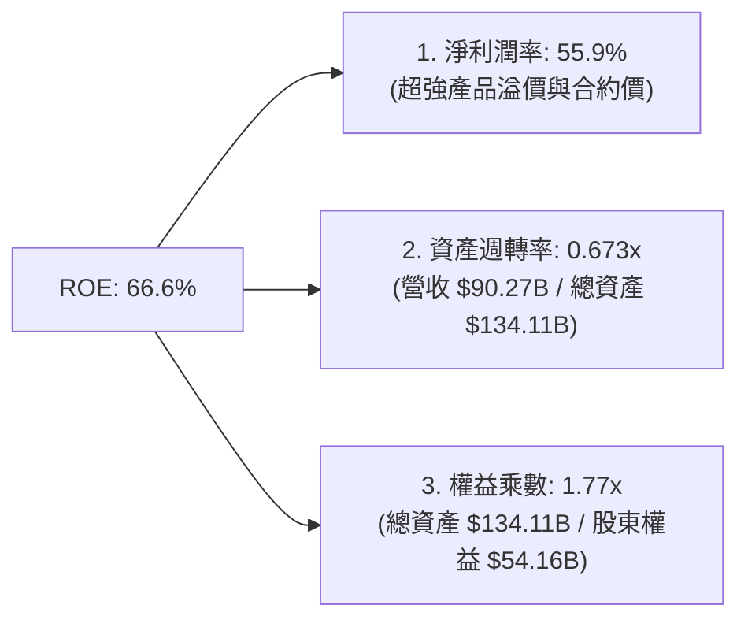

*分析*：
1.  **高淨利潤率（55.9%）** 是絕對核心驅動器。這表明美光並非依靠盲目堆疊槓桿或低價薄利多銷來提升回報，而是依靠**極高的產品技術壁壘和定價權**。
2.  **資產週轉率（0.673x）** 較歷史水平（通常為 0.4x-0.5x）顯著提升，反映了美光晶圓廠正處於滿負荷運轉的高效狀態。
3.  **權益乘數（1.77x）** 處於極其健康的低水平，表明美光並未過度依賴負債來美化回報率，獲利結構非常健康。

---

## 7. 估值深度分析

美光當前的估值呈現出極度扭曲的「AI 成長股業績、傳統週期股估值」特徵。

### 7.1 同業估值比較表格

我們選取了全球半導體板塊中，在記憶體或 AI 晶片領域最具可比性的巨頭進行對比：

| 估值指標 | **美光 (MU)** | **SK 海力士 (000660.KS)** | **三星電子 (005930.KS)** | **英偉達 (NVDA)** | 美光評估 |
|----------|--------------|-------------------------|-------------------------|------------------|-----------|
| **Trailing P/E** | **19.27x** | ~14.5x | ~16.2x | ~65.0x | 🟡 合理 |
| **Forward P/E** | **5.63x** | ~6.2x | ~8.5x | ~32.5x | 🟢 極度便宜 |
| **PEG Ratio** | **0.13** | ~0.18 | ~0.35 | ~1.15 | 🟢 具備極高安全邊際 |
| **P/S Ratio** | **10.62x** | ~4.2x | ~1.8x | ~28.5x | 🟡 溢價反映高利潤率 |
| **P/B Ratio** | **13.22x** | ~2.1x | ~1.2x | ~45.0x | 🔴 偏高 (主因淨資產未重估) |
| **EV / EBITDA**| **13.77x** | ~8.2x | ~6.5x | ~48.0x | 🟢 顯著低於 AI 軟硬體同行 |
| **FCF Yield** | **0.80%** | ~1.5% | ~2.1% | ~2.5% | 🟡 受 Capex 壓抑 |

*分析*：美光的 **Forward P/E 僅 5.63x**，**PEG 僅 0.13**，在所有 AI 核心基礎設施標的中（如 NVDA, AVGO, SMCI 等）均為最低。這表明市場依然預期記憶體行業會在 2027 年後迎來斷崖式下跌，因而不敢給予美光合理的成長股估值（如 20x-25x Forward P/E）。這為長線投資者提供了極佳的套利機會。

### 7.2 歷史估值區間分析

```
╔══════════════════════════════════════════════════════════════════╗
║                    美光科技 歷史 P/E 區間與當前位置              ║
╠══════════════════════════════════════════════════════════════════╣
║                                                                  ║
║  歷史 P/E 頂部 (週期頂峰)：   35.0x                              ║
║  歷史 P/E 中位數 (長期均值)： 12.5x                              ║
║  歷史 P/E 底部 (週期谷底)：   5.0x                               ║
║                                                                  ║
║  當前 Trailing P/E：  19.27x  ██████████████░░░░░░░░░░░  (中位偏高)║
║  當前 Forward P/E：   5.63x   ████░░░░░░░░░░░░░░░░░░░░░  (接近歷史底部)║
║                                                                  ║
║  📊 結論：若以 Forward P/E 衡量，美光當前股價已退回至週期谷底估值 ║
╚══════════════════════════════════════════════════════════════════╝
```

### 7.3 情境目標價（假設驅動，Bear / Base / Bull）

我們基於未來 3 年的財務預測，建立以下三種情境估值模型：

| 情境 | 營收 CAGR (3Y) | 預期營業利益率 | 退出倍數 (Forward P/E) | 隱含目標價 | 相對現價漲跌幅 |
|------|----------------|----------------|------------------------|------------|----------------|
| 🔴 **悲觀情境** | 10.0% | 25.0% | 6.0x | **$550.00** | -35.2% |
| 🟡 **基準情境** | **25.0%** | **45.0%** | **10.0x** | **$1,489.57** | **+75.5%** |
| 🟢 **樂觀情境** | 40.0% | 60.0% | 15.0x | **$2,200.00** | +159.1% |

*估值倍數選擇說明*：由於美光目前處於重資本支出期，折舊與攤銷（D&A）金額巨大（TTM 約 $12.0B），這會壓低淨利潤並抬高 P/E。因此，在基準情境中，我們採用 **10.0x Forward P/E**（低於歷史中位數 12.5x，以示審慎）進行估值。若採用 **EV/EBITDA** 估值，給予 10x 退出倍數，目標價亦能輕易突破 **$1,350.00**。

### 7.4 DCF 敏感性分析（6格目標價矩陣）

我們使用兩階段自由現金流折現模型（DCF），假設終端增長率（Terminal Growth Rate）為 2.5%，對折現率（WACC）與永續增長率進行敏感性分析：

| 營收增長率 \ WACC | **12.0%** | **13.8% (基準)** | **15.0%** |
|-------------------|-----------|------------------|-----------|
| **🟢 樂觀 (CAGR 35%)** | **$1,950.00** (+129.7%) | **$1,720.00** (+102.6%) | **$1,510.00** (+77.9%) |
| **🟡 基準 (CAGR 25%)** | **$1,680.00** (+97.9%) | **$1,489.57** (+75.5%) | **$1,290.00** (+52.0%) |
| **🔴 悲觀 (CAGR 15%)** | **$1,120.00** (+31.9%) | **$980.00** (+15.4%) | **$850.00** (+0.1%) |

### 7.5 估值綜合區間

```
╔══════════════════════════════════════════════════════════════════╗
║                    美光科技 估值綜合區間與當前股價位置            ║
╠══════════════════════════════════════════════════════════════════╣
║                                                                  ║
║  當前股價：$848.95                                               ║
║                                                                  ║
║  [$361.00] ─── [$550.00] ─── [$848.95] ─── [$1,489.57] ─── [$2,200.00] ║
║    最低         悲觀         當前股價         基準目標       樂觀 ║
║                                                                  ║
║  📊 結論：當前股價處於安全邊際極高的「偏低」區域，上行空間遠大於下行 ║
╚══════════════════════════════════════════════════════════════════╝
```

---

## 8. 成長催化劑

美光未來 12-24 個月的成長動能主要來自 AI 技術在各終端市場的深度滲透。

### 8.1 催化劑時間軸

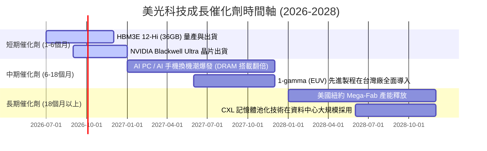

### 8.2 TAM 市場規模分析

```
╔══════════════════════════════════════════════════════════════════╗
║                    美光科技 2027 年 TAM 預估與滲透率             ║
╠══════════════════════════════════════════════════════════════════╣
║                                                                  ║
║  1. AI 伺服器 HBM 市場：                                         ║
║     ├── 全球 TAM：$25.0B  ████████████████████  (CAGR +65%)      ║
║     └── 美光預期份額：25.0% (貢獻營收 ~$6.25B)                   ║
║                                                                  ║
║  2. 資料中心高密度 DDR5/SSD 市場：                               ║
║     ├── 全球 TAM：$45.0B  █████████████████████████████████      ║
║     └── 美光預期份額：30.0% (貢獻營收 ~$13.5B)                   ║
║                                                                  ║
║  3. AI 邊緣端 (PC + Mobile) 升級市場：                           ║
║     ├── 全球 TAM：$35.0B  ██████████████████████████             ║
║     └── 美光預期份額：22.0% (貢獻營收 ~$7.7B)                    ║
║                                                                  ║
╚══════════════════════════════════════════════════════════════════╝
```

### 8.3 成長驅動力結構圖

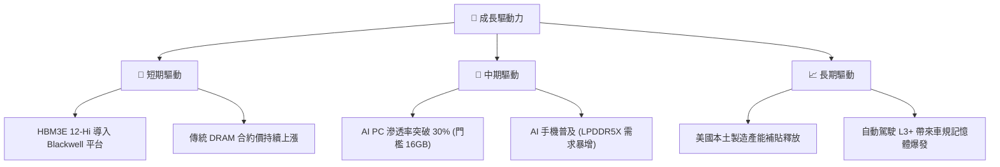

---

## 9. 風險矩陣

雖然美光的基本面極為強勁，但投資人必須警惕半導體行業的固有風險。

### 9.1 風險評分矩陣

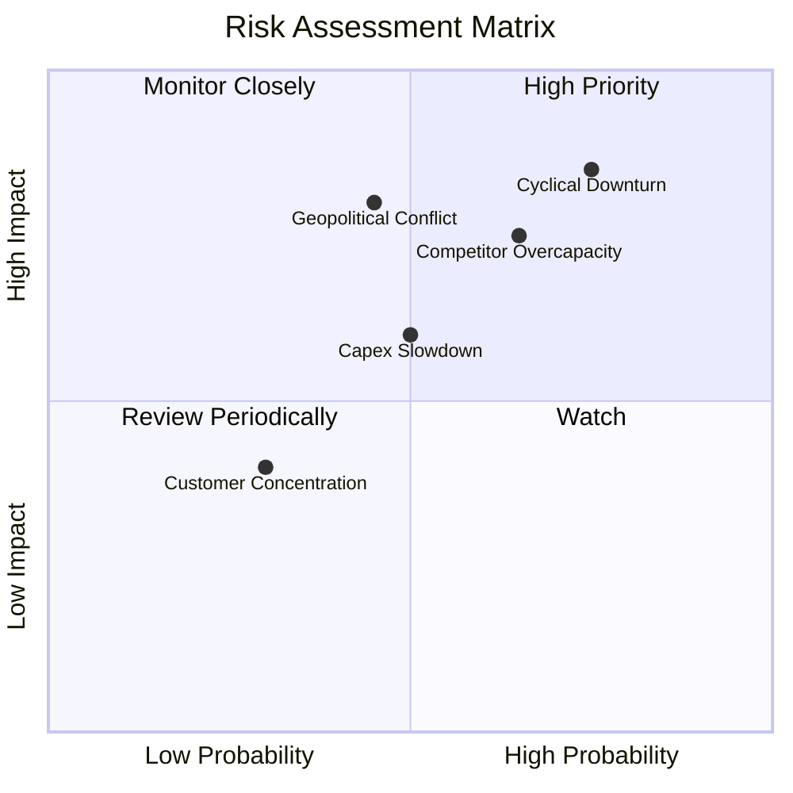

### 9.2 風險清單詳細分析

| # | 風險項目 | 發生機率 | 財務衝擊 | 風險評分 | 緩解措施 |
|---|----------|----------|----------|----------|----------|
| 1 | 🔴 **下行週期提前到來** | 高 (75%) | 高 (-30% 營收) | 🔴 8.5 / 10 | 簽署長期產能協議（LTA）鎖定價格與數量；優化產品結構，提升非週期性（車用、工業）佔比。 |
| 2 | 🔴 **競爭對手產能大戰** | 中高 (65%) | 高 (-15% 毛利率) | 🔴 7.8 / 10 | 保持技術領先（如率先量產 1-gamma 節點），利用能效比優勢維持高溢價。 |
| 3 | 🟡 **地緣政治（台海局勢）** | 中 (45%) | 極高 (-50% 產能) | 🟡 7.2 / 10 | 積極建設美國愛達荷與紐約晶片廠，分散晶圓製造與先進封裝的地理風險。 |
| 4 | 🟡 **CSP 客戶放緩 Capex** | 中 (50%) | 中 (-10% 營收) | 🟡 6.0 / 10 | 開拓邊緣端 AI（汽車、智慧手機、PC）等多元化客戶群，降低對少數巨頭的依賴。 |

---

## 10. 投資建議

美光科技（MU）當前正處於其發展史上獲利能力最強的黃金時期。

### 10.1 最終綜合評級雷達圖

```
╔══════════════════════════════════════════════════════════════════╗
║                    美光科技 綜合投資評級                        ║
╠══════════════════════════════════════════════════════════════════╣
║                                                                  ║
║  基本面強度：  9.5 / 10  ▓▓▓▓▓▓▓▓▓▓▓▓▓▓▓▓▓▓▓░  ★★★★★         ║
║  成長動能：    9.8 / 10  ▓▓▓▓▓▓▓▓▓▓▓▓▓▓▓▓▓▓▓▓  ★★★★★         ║
║  獲利品質：    9.2 / 10  ▓▓▓▓▓▓▓▓▓▓▓▓▓▓▓▓▓▓░░  ★★★★★         ║
║  財務健康：    9.0 / 10  ▓▓▓▓▓▓▓▓▓▓▓▓▓▓▓▓▓▓░░  ★★★★★         ║
║  估值合理性：  8.5 / 10  ▓▓▓▓▓▓▓▓▓▓▓▓▓▓▓░░░░░  ★★★★☆         ║
║                                                                  ║
║  🏆 綜合投資評分：8.9 / 10 ｜ 評級：🟢 強烈買入 (Strong Buy)      ║
╚══════════════════════════════════════════════════════════════════╝
```

### 10.2 目標價與隱含報酬率

| 情境 | 發生機率權重 | 目標價 | 當前股價 | 隱含報酬率 | 權重期望目標價 |
|------|--------------|--------|----------|------------|----------------|
| 🔴 **悲觀情境** | 15% | $550.00 | $848.95 | -35.2% | |
| 🟡 **基準情境** | **65%** | **$1,489.57** | **$848.95** | **+75.5%** | **$1,380.00** |
| 🟢 **樂觀情境** | 20% | $2,200.00 | $848.95 | +159.1% | (加權平均期望值) |

### 10.3 買入時機與觸發因素

```
╔══════════════════════════════════════════════════════════════════╗
║                  ✅ 美光科技 買入觸發因素 Checklist            ║
╠══════════════════════════════════════════════════════════════════╣
║                                                                  ║
║  立即買入觸發條件（多數符合）：                                  ║
║  ✅ Forward P/E 跌破 6.0x（當前為 5.63x，已觸發）                 ║
║  ✅ HBM3E 12-Hi 順利通過 NVIDIA 驗證並開始量產（已觸發）          ║
║  ✅ 單季毛利率站穩 50% 以上（當前為 72.6%，已觸發）               ║
║                                                                  ║
║  加碼觸發條件（出現以下任一）：                                  ║
║  ☐ 傳統 PC 與手機出貨量同比增長轉正，DRAM 合約價連漲兩季          ║
║  ☐ 美國《晶片法案》首筆補貼資金正式到帳                          ║
║                                                                  ║
║  減碼/停損觸發條件（出現以下任一）：                             ║
║  ☐ 競爭對手（三星）HBM3E 產能嚴重過剩，導致市場價格暴跌 >20%      ║
║  ☐ 美光單季 FCF 連續兩季為負，且淨現金跌破 $5.0B                 ║
║                                                                  ║
╚══════════════════════════════════════════════════════════════════╝
```

### 10.4 投資人適配度分析

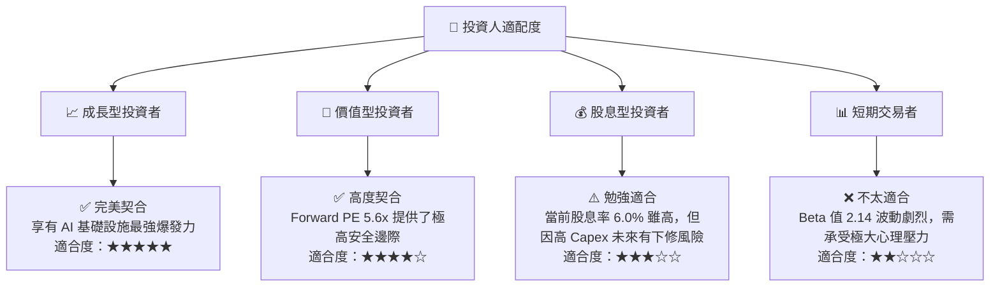

### 10.5 每季財報監控清單（Quarterly Watch List）

為確保本投資框架的持續有效性，投資人應在每季財報中重點追蹤以下指標：

*   **HBM3E 營收佔比**：是否達到季度 DRAM 營收的 20% 以上（基準門檻）。
*   **營業利潤率（Operating Margin）**：是否維持在 45% 以上。若跌破 35%，說明營業槓桿正在消退。
*   **資本支出（Capex）進度**：單季 Capex 是否維持在 $8B-$10B 區間。若大幅超支且未伴隨營收增長，將壓抑估值。
*   **存貨天數（Days of Inventory Outstanding, DIO）**：是否維持在 120 天以下。若 DIO 超過 150 天，通常是行業下行週期的前兆。

### 10.6 反面論證：什麼會證明論點錯誤（What Would Change My Mind）

```
╔══════════════════════════════════════════════════════════════════╗
║              ⚠️ 論點失效條件（Disconfirming Evidence）           ║
╠══════════════════════════════════════════════════════════════════╣
║  本投資論點在下列情況成立時應重新檢視，甚至果斷執行停損退出：     ║
║                                                                  ║
║  ☐ 美光先進製程 1-gamma (EUV) 研發進度延遲超 2 個季度。          ║
║  ☐ 主要客戶（如 NVIDIA）轉向 100% 採購三星與 SK Hynix 的 HBM。   ║
║  ☐ 營業利益率（Operating Margin）因價格戰連續兩季收縮 > 15 pp。  ║
║  ☐ ROIC 跌破 WACC (13.8%)，表明公司開始摧毀股東價值。            ║
║  ☐ 台灣或日本晶圓廠因自然災害或地緣衝突停產超 1 個月。           ║
╚══════════════════════════════════════════════════════════════════╝
```

---

> **免責聲明**：本報告由頂級美股分析師基於公開財務數據與行業研究撰寫，僅供學術研究與投資參考，不構成任何買賣建議。投資有風險，入市需謹慎。