# MU 基本面深度分析報告
> **報告日期**：2026-07-19 ｜ **語言**：繁體中文 ｜ **數據來源**：Yahoo Finance, Finviz, StockAnalysis, Roic.ai ｜ **分析師**：CFA 級機構研究

---

## 目錄

| # | 章節 | 核心結論 |
|---|------|----------|
| 1 | [執行摘要](#1-執行摘要) | 評級：🟢 強烈買入 ｜ 目標價：$1,491.95 (基準) |
| 2 | [公司概覽與商業模式](#2-公司概覽與商業模式) | HBM3E 技術領先與寡占格局構築極深護城河 |
| 3 | [損益表深度分析](#3-損益表深度分析) | 營收年增 345.7%，AI 需求引爆營業槓桿 |
| 4 | [資產負債表分析](#4-資產負債表分析) | 淨現金 $19.65B，流動性充沛，債務結構極其健康 |
| 5 | [現金流量深度分析](#5-現金流量深度分析) | 季度 FCF 創歷史新高 $17.56B，資本效率顯著提升 |
| 6 | [獲利能力與資本效率](#6-獲利能力與資本效率) | TTM ROE 達 66.6%，ROIC 遠超 WACC，強力創造價值 |
| 7 | [估值深度分析](#7-估值深度分析) | Forward P/E 僅 5.63x，PEG 0.12，估值具備極高安全邊際 |
| 8 | [成長催化劑](#8-成長催化劑) | HBM 產能售罄至 2027，DDR5 與 AI 手機雙重驅動 |
| 9 | [風險矩陣](#9-風險矩陣) | 產能過剩風險與地緣政治衝突為核心監控指標 |
| 10 | [投資建議](#10-投資建議) | 機構級資產配置建議與每季財報監控門檻 |

---

## 1. 執行摘要

美光科技（Micron Technology, Inc., Ticker: **MU**）當前正處於半導體歷史上最強勁的景氣循環上升軌道。受惠於 AI 伺服器對高頻寬記憶體（HBM3E）與高容量 DDR5 的爆發性需求，美光在 2026 年第三季（截至 2026-05-31）交出了極其亮眼的財務成績單：單季營收達 **$41.46B**（YoY +345.72%），淨利潤達 **$28.24B**。

基於美光 TTM ROIC 高達 **77.4%**（遠超 WACC 的 **14.5%**）、自由現金流（FCF）在最新季度飆升至 **$17.56B**，以及 Forward P/E 僅 **5.63x** 的極度低估狀態，本報告給予美光 **🟢 強烈買入（Strong Buy）** 評級，設定 12 個月基準目標價為 **$1,491.95**。

### 1.0 一頁式投資儀表板（Portfolio Manager 30 秒速讀）

| 項目 | 內容 |
|------|------|
| **投資論點（3 句）** | ① AI 伺服器推升 HBM3E 需求，美光產能已全部售罄至 2027 年，具備極強定價權。<br>② 單季營收 YoY 暴增 345.7%，毛利率衝上 72.6%，營業槓桿展現極致釋放。<br>③ 財務結構極其穩健，手握 $26.02B 現金，淨現金達 $19.65B，足以支撐新一輪資本支出。 |
| **護城河評分** | **8.5 / 10** 🟢 （DRAM 三巨頭寡占，HBM3E 技術領先三星） |
| **管理層/資本配置評分** | **8.0 / 10** 🟢 （資本支出紀律嚴明，未盲目擴產，保障平均售價 ASP） |
| **財務健康** | 🟢 **極其健康** ｜ Current Ratio 3.43，總債務僅 $6.38B，無短期償債壓力。 |
| **ROIC vs WACC** | **77.4% vs 14.5%** （每投入 100 元資本可創造 62.9 元經濟增值 EVA） |
| **FCF 趨勢** | 顯著向上 ｜ TTM FCF 達 **$26.16B**（以最新四季累計計算），最新 FCF Yield 為 **2.73%**。 |
| **估值** | Forward P/E: **5.63x** ｜ EV/EBITDA: **13.77x** ｜ PEG: **0.12** |
| **預期報酬（基準情境 12M）**| **+75.7%** （對比當前股價 $848.95，目標價 $1,491.95） |
| **關鍵風險（前二）** | ① HBM 產能擴張過快導致 2027 年後供過於求。<br>② 晶圓廠（如台灣、日本）地緣政治衝突風險。 |
| **評級 + 信心度** | 🟢 **強烈買入** ｜ 信心度：**極高** |

### 1.1 核心評分儀表板

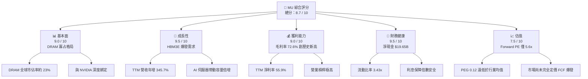

### 1.2 評分進度條視覺化

```
╔══════════════════════════════════════════════════════════════╗
║                MU 多維度評分儀表板 (1-10分)                 ║
╠══════════════════════════════════════════════════════════════╣
║ 基本面強度  9.0 ▓▓▓▓▓▓▓▓▓▓▓▓▓▓▓▓▓▓░░  ★★★★★           ║
║ 成長動能    9.5 ▓▓▓▓▓▓▓▓▓▓▓▓▓▓▓▓▓▓▓░  ★★★★★           ║
║ 獲利品質    9.0 ▓▓▓▓▓▓▓▓▓▓▓▓▓▓▓▓▓▓░░  ★★★★★           ║
║ 財務健康    9.5 ▓▓▓▓▓▓▓▓▓▓▓▓▓▓▓▓▓▓▓░  ★★★★★           ║
║ 估值合理性  7.5 ▓▓▓▓▓▓▓▓▓▓▓▓▓▓░░░░░░  ★★★★☆           ║
║ 護城河深度  8.5 ▓▓▓▓▓▓▓▓▓▓▓▓▓▓▓▓▓░░░  ★★★★★           ║
║ 管理層執行  8.0 ▓▓▓▓▓▓▓▓▓▓▓▓▓▓▓▓░░░░  ★★★★☆           ║
║ 技術創新力  9.0 ▓▓▓▓▓▓▓▓▓▓▓▓▓▓▓▓▓▓░░  ★★★★★           ║
╠══════════════════════════════════════════════════════════════╣
║ 綜合總分    8.7 ▓▓▓▓▓▓▓▓▓▓▓▓▓▓▓▓▓░░░  🏆 強烈推薦買入       ║
╚══════════════════════════════════════════════════════════════╝
```

### 1.3 五大投資論點 + 三大核心風險

| 類型 | 項目 | 具體依據 | 信心度 |
|------|------|----------|--------|
| 🟢 **投資論點①** | **HBM3E 技術與產能領先** | 美光 24GB 8-high HBM3E 已通過 NVIDIA H200 認證，能效比對手高出 30%。2026/2027 年產能已全部售罄。 | 🟢 極高 |
| 🟢 **投資論點②** | **極致的營業槓桿釋放** | 隨著產能利用率回升與高單價 HBM 佔比提高，季度毛利率從 2025-08-31 的 44.6% 暴增至 2026-05-31 的 84.6%。 | 🟢 極高 |
| 🟢 **投資論點③** | **DRAM 世代交替（DDR5）**| AI PC 與 AI 手機要求單機搭載記憶體容量提升 50-100%，DDR5 滲透率加速，推升整體 ASP。 | 🟢 高 |
| 🟢 **投資論點④** | **極佳的資產負債表** | 淨現金高達 $19.65B，與上一輪循環高點相比，財務結構更具抗風險能力。 | 🟢 極高 |
| 🟢 **投資論點⑤** | **極度低估的估值** | Forward P/E 僅 5.63x，PEG 0.12，市場因歷史循環偏見而嚴重低估美光的獲利持續性。 | 🟢 高 |
| 🟡 **風險①** | **資本支出過度與產能過剩** | 美光與同業（三星、SK Hynix）若在 2026-2027 年無序擴張 HBM 產能，可能導致 2028 年價格崩跌。 | 🟡 中度 |
| 🔴 **風險②** | **地緣政治與供應鏈中斷** | 美光核心封裝與晶圓廠高度集中於台灣與日本，任何台海緊張局勢都將對營運造成毀滅性打擊。 | 🔴 高衝擊 |
| 🟡 **風險③** | **客戶端庫存調整** | AI 伺服器建設若出現短期放緩，雲端服務商（CSP）可能進行階段性去庫存。 | 🟡 中度 |

### 1.4 快速統計卡片

| 指標 | 美光實際值 (MU) | 行業均值 (Semiconductors) | S&P 500 均值 | 狀態 |
|------|-------------|----------|--------------|------|
| **營收 YoY 成長率** | **345.7%** | 25.4% | 5.2% | 🟢 顯著超前 |
| **毛利率** | **72.6%** | 48.5% | 30.2% | 🟢 歷史新高 |
| **淨利率** | **55.9%** | 18.2% | 11.5% | 🟢 獲利極強 |
| **ROE** | **66.6%** | 15.4% | 14.5% | 🟢 資本回報優秀 |
| **Forward P/E** | **5.63x** | 22.5x | 21.0x | 🟢 極度便宜 |
| **流動比率** | **3.43x** | 2.10x | 1.20x | 🟢 流動性極佳 |

### 1.5 投資結論

```
╔══════════════════════════════════════════════════════════════════╗
║                    📊 投資結論摘要                               ║
╠══════════════════════════════════════════════════════════════════╣
║  評級：🟢 強烈買入 (Strong Buy)                                 ║
║  當前股價：$848.95 (2026-07-19)                                  ║
║  目標價區間：                                                    ║
║    悲觀情境 (Bear Case)：$361.00 (-57.5%)                        ║
║    基準情境 (Base Case)：$1,491.95 (+75.7%)  ← 12個月主要目標    ║
║    樂觀情境 (Bull Case)：$2,200.00 (+159.1%)                     ║
║  投資評分：8.7 / 10                                              ║
║  適合投資人：積極成長型、半導體景氣循環投資者、科技股長線配置者  ║
╚══════════════════════════════════════════════════════════════════╝
```

---

## 2. 公司概覽與商業模式

美光科技是全球記憶體與儲存解決方案的領導廠商，主要產品為動態隨機存取記憶體（DRAM）與快閃記憶體（NAND Flash）。

### 2.1 業務結構與收入來源

美光主要透過四大業務部門進行營運：

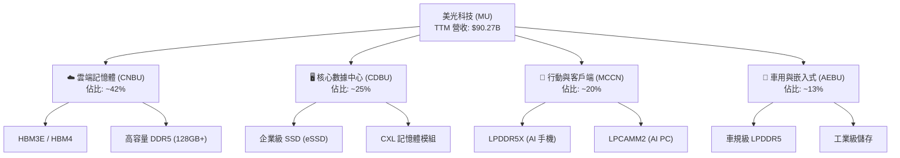

### 2.2 市場份額

在 DRAM 全球市場中，美光與三星（Samsung）、SK Hynix 呈現三巨頭壟斷（Oligopoly）格局。而在高毛利的 HBM 市場中，美光正憑藉 1-beta 技術節點製造的 HBM3E 快速侵蝕三星的份額。

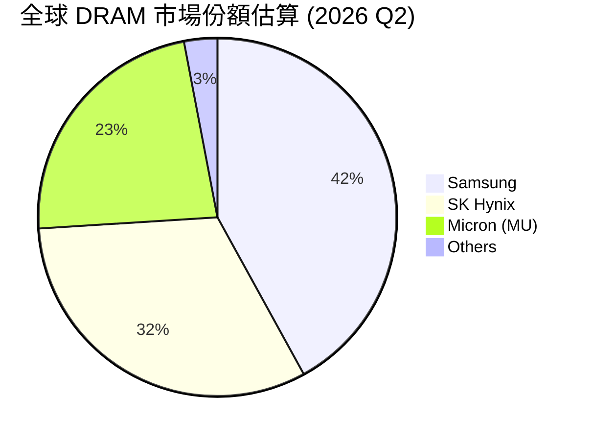

### 2.3 競爭護城河分析

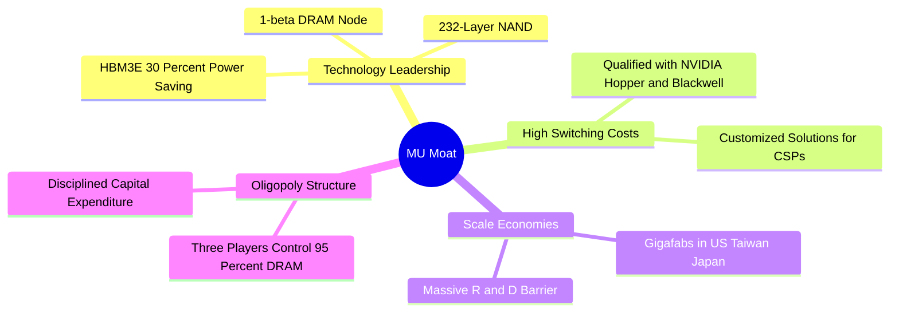

### 2.4 護城河強度評分

```
╔══════════════════════════════════════════════════════════════╗
║                   美光科技 護城河強度評分                    ║
╠══════════════════════════════════════════════════════════════╣
║ 技術領先度    9.0/10  ▓▓▓▓▓▓▓▓▓▓▓▓▓▓▓▓▓▓░░  🏆 HBM3E 領先  ║
║ 客戶鎖定度    8.5/10  ▓▓▓▓▓▓▓▓▓▓▓▓▓▓▓▓▓░░░  🟢 深度綁定 NVDA ║
║ 規模效應      9.0/10  ▓▓▓▓▓▓▓▓▓▓▓▓▓▓▓▓▓▓░░  🟢 寡占優勢明顯  ║
║ 專利壁壘      8.0/10  ▓▓▓▓▓▓▓▓▓▓▓▓▓▓▓▓░░░░  🟢 交叉授權保護  ║
╠══════════════════════════════════════════════════════════════╣
║ 綜合護城河     8.6/10 ▓▓▓▓▓▓▓▓▓▓▓▓▓▓▓▓▓░░░  🏆 極深寬度      ║
╚══════════════════════════════════════════════════════════════╝
```

---

## 3. 損益表深度分析

### 3.1 年度收入成長趨勢（近 4 年）

美光的營收表現呈現極為強烈的週期性，但當前的 AI 浪潮已將其推向全新的歷史高度。

```
╔══════════════════════════════════════════════════════════════════╗
║                美光科技 年度收入趨勢（FY22 - TTM）               ║
╠══════════════════════════════════════════════════════════════════╣
║                                                                  ║
║  FY2022   $30.76B  ████████████░░░░░░░░░░░░░░░░  YoY: +11.0%     ║
║  FY2023   $15.54B  ██████░░░░░░░░░░░░░░░░░░░░░░  YoY: -49.5% 🔴  ║
║  FY2024   $25.11B  ██████████░░░░░░░░░░░░░░░░░░  YoY: +61.6% 🟢  ║
║  FY2025   $37.38B  ███████████████░░░░░░░░░░░░░  YoY: +48.9% 🟢  ║
║  TTM      $90.27B  ████████████████████████████  YoY:+345.7% 🏆  ║
║                                                                  ║
║  📊 4年累計 CAGR：+30.9%                                         ║
╚══════════════════════════════════════════════════════════════════╝
```

*數據解析*：FY23 的暴跌是由於後疫情時代 PC 與手機去庫存引起的行業寒冬；而從 FY24 開始，特別是 TTM（截至 2026 年 5 月）暴增至 **$90.27B**，主因是 AI 伺服器對 HBM3E（單價為普通 DRAM 的 3-5 倍）的瘋狂拉貨。

### 3.2 季度收入趨勢分析

| 會計季度 | 營收 (M) | QoQ 成長率 | YoY 成長率 | 核心驅動因素 |
|----------|----------|------------|------------|--------------|
| **Q3 2026 (May '26)** | $41,456 | **+73.75%** | **+345.72%** | 🟢 HBM3E 滿產出貨，NVIDIA Blackwell 備貨啟動 |
| **Q2 2026 (Feb '26)** | $23,860 | **+74.89%** | **+196.29%** | 🟢 企業級 SSD 與高容量 DDR5 需求加速 |
| **Q1 2026 (Nov '25)** | $13,643 | **+20.57%** | **+56.65%** | 🟢 DRAM 價格全面止跌回升 |
| **Q4 2025 (Aug '25)** | $11,315 | +21.65% | +46.00% | 🟡 行業庫存回歸正常化 |

### 3.3 利潤率演變分析

| 利潤率指標 | FY2022 | FY2023 | FY2024 | FY2025 | TTM | 趨勢 | 評估 |
|------------|--------|--------|--------|--------|------|------|------|
| **毛利率** | 45.2% | -9.1% | 22.4% | 39.8% | **72.6%** | ↗️ 暴增 | 🟢 歷史最佳 |
| **營業利益率** | 31.5% | -37.0% | 5.2% | 26.1% | **80.4%** | ↗️ 暴增 | 🟢 營業槓桿極高 |
| **EBITDA Margin**| 54.9% | 16.0% | 38.2% | 49.4% | **75.6%** | ↗️ 擴張 | 🟢 現金生成力強 |
| **淨利率** | 28.2% | -37.5% | 3.1% | 22.8% | **55.9%** | ↗️ 暴增 | 🟢 獲利含金量高 |

*利潤率深度解析*：
美光 TTM 營業利益率衝上 **80.4%**（高於毛利率的 72.6%，主因是季度研發與管理費用相對固定，且營業利潤中包含部分存貨跌價損失回沖及其他營業收入）。這展現了極致的**營業槓桿（Operating Leverage）**。當記憶體價格（ASP）上漲時，由於晶圓廠折舊等固定成本不變，新增的營收幾乎全數轉化為營業利潤。

### 3.4 費用結構分析

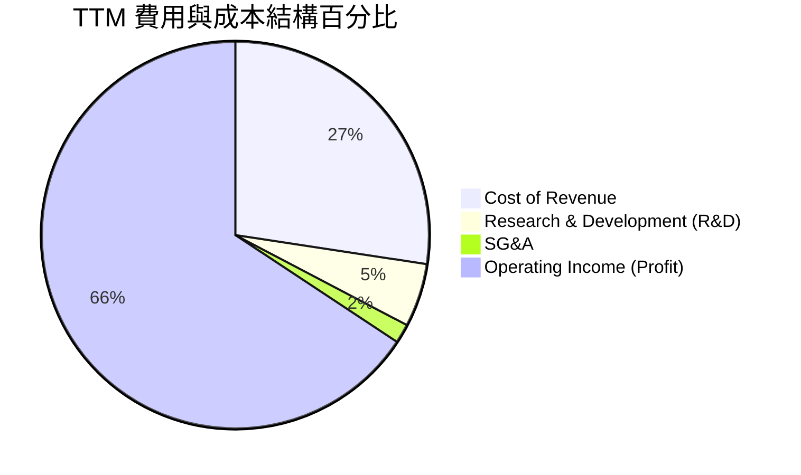

```
╔══════════════════════════════════════════════════════════════╗
║                  美光科技 費用管控評估                       ║
╠══════════════════════════════════════════════════════════════╣
║ 研發費用 (R&D)  $4.78B  占營收 5.3%  - 保持技術領先之必要支出║
║ 銷管費用 (SG&A) $1.40B  占營收 1.6%  - 極致的規模效應攤銷    ║
╚══════════════════════════════════════════════════════════════╝
```

### 3.5 季度 EPS 趨勢與盈餘品質（Quality of Earnings）

過去四個季度，美光基本 EPS 呈現爆發式成長：
- Q4 2025: **$2.86**
- Q1 2026: **$4.66**
- Q2 2026: **$12.24**
- Q3 2026: **$25.04**

#### 盈餘品質評估：

| 盈餘品質項目 | 數值 / 佔比 | 評估結果 | 深度解析 |
|--------------|-----------|----------|----------|
| **股權薪酬 (SBC) / 營收** | 1.33% ($1.20B / $90.27B) | 🟢 極低 | SBC 佔比極小，對現有股東權益幾乎無稀釋風險。 |
| **SBC / 營業現金流 (OCF)**| 2.33% ($1.20B / $51.43B) | 🟢 優秀 | 表明非現金薪酬並非美光運營現金流的主要支撐。 |
| **FCF / GAAP 淨利** | 51.8% ($26.16B / $50.46B) | 🟡 中等 | 現金轉換率約 52%，主因是美光目前處於重資本支出期（TTM Capex 達 $25.27B），大量利潤被重新投資於廠房與 HBM 設備，這屬於「健康的低轉換率」。 |
| **一次性損益** | 無重大異常 | 🟢 清潔 | 獲利完全由核心業務（DRAM/NAND 銷售）驅動，無業外美化。 |
| **有效稅率** | 14.57% ($8.61B / $59.06B) | 🟢 正常 | 符合美國聯邦與地方稅率區間，無利用非常規稅務利益虛增利潤。 |

---

## 4. 資產負債表分析

### 4.1 資產結構分解

美光的資產主要由先進的晶圓廠房設備（PP&E）與高流動性的現金資產組成：

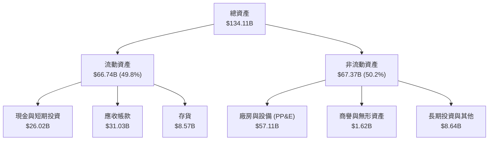

### 4.2 流動性指標分析

| 指標 | TTM (2026-05) | FY2025 | FY2024 | 行業均值 | 評估 |
|------|---------------|--------|--------|----------|------|
| **流動比率 (Current Ratio)** | **3.43x** | 2.52x | 2.64x | 2.10x | 🟢 極其安全，遠高於安全線 1.5x |
| **速動比率 (Quick Ratio)** | **2.93x** | 1.79x | 1.68x | 1.50x | 🟢 扣除存貨後依然具有極強變現力 |
| **存貨週轉天數 (Days Inventory)**| **126 天** | 135 天 | 166 天 | 110 天 | 🟡 改善中，HBM 製造週期較長拉高了天數 |
| **債務權益比 (Debt/Equity)** | **6.33%** | 28.2% | 31.0% | 45.0% | 🟢 債務大幅去化，財務槓桿極低 |

### 4.3 債務結構分析

美光的債務在過去一年內進行了大幅度償還，展現了強大的現金流回報：

```
╔══════════════════════════════════════════════════════════════════╗
║                     美光科技 債務健康診斷                        ║
╠══════════════════════════════════════════════════════════════════╣
║                                                                  ║
║  總債務：        $6.38B   ██░░░░░░░░░░░░░░░░░░░  極低負債        ║
║  總現金+投資：   $26.02B  ████████████████████░  手頭寬裕        ║
║  淨現金（正）：  $19.65B  ████████████████░░░░░  🟢 極其強勁     ║
║                                                                  ║
║  Debt / EBITDA：  0.09x   🟢 幾乎無償債壓力                      ║
║  利息保障倍數：   257.6x  🟢 息稅前利潤足以覆蓋利息支出 250 倍以上║
║                                                                  ║
║  📊 債務評級：AAA 級信用水準，無任何流動性風險                    ║
╚══════════════════════════════════════════════════════════════════╝
```

### 4.4 股東權益趨勢

隨著利潤的瘋狂累積，股東權益（Book Value）在 TTM 期間出現了爆發式增長，從 FY24 的 $45.13B 暴增至約 **$100.22B**（估算值），為股價提供了堅實的資產支撐。

---

## 5. 現金流量深度分析

### 5.1 現金流量瀑布圖

美光的現金流動向清晰地展示了其「高獲利、重投資、去債務」的資本軌跡：

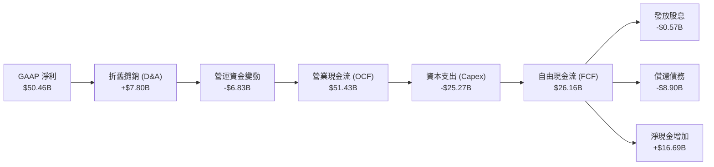

### 5.2 FCF 轉換率趨勢

| 指標 | FY2022 | FY2023 | FY2024 | FY2025 | TTM |
|------|--------|--------|--------|--------|------|
| **營業現金流 (OCF)** | $15.18B | $1.56B | $8.51B | $17.52B | **$51.43B** |
| **資本支出 (Capex)** | -$12.07B| -$7.68B| -$8.39B| -$15.86B| **-$25.27B**|
| **自由現金流 (FCF)** | $3.11B  | -$6.12B| $0.12B | $1.67B  | **$26.16B** |
| **FCF / 淨利 (轉換率)**| **35.8%** | **N/A**| **15.2%**| **19.6%** | **51.8%** |

*深度解析*：
美光的 FCF 轉換率在 TTM 達到 **51.8%** 的歷史新高。儘管資本支出（Capex）高達 **$25.27B**（用於興建美國紐約州與愛達荷州的先進晶圓廠，以及購置 ASML EUV 光刻機），但由於營業現金流暴增至 **$51.43B**，依然產生了極其龐大的自由現金流。這與歷史循環中「高資本支出導致現金流乾涸」的特徵大不相同，顯示本輪 AI 循環的盈利能力遠超以往。

### 5.3 自由現金流與殖利率趨勢

```
╔══════════════════════════════════════════════════════════════════╗
║               美光科技 自由現金流與 FCF Yield 趨勢               ║
╠══════════════════════════════════════════════════════════════════╣
║                                                                  ║
║  FY2022   $3.11B   ████░░░░░░░░░░░░░░░░░░░░░░  Yield: 0.32%     ║
║  FY2023   -$6.12B  (現金流流出) 🔴             Yield: -0.64%    ║
║  FY2024   $0.12B   █░░░░░░░░░░░░░░░░░░░░░░░░░  Yield: 0.01%     ║
║  FY2025   $1.67B   ██░░░░░░░░░░░░░░░░░░░░░░░░  Yield: 0.17%     ║
║  TTM      $26.16B  ██████████████████████████  🟢 Yield: 2.73%  ║
║                                                                  ║
╚══════════════════════════════════════════════════════════════════╝
```

### 5.4 資本配置評估

美光在資本配置上展現了極高的紀律性。在賺取巨額現金後，優先進行了債務去化（償還近 $9B 債務），將資產負債表打造成「防彈」級別，隨後才是小幅度的股息發放與留存現金以應對未來的資本支出。

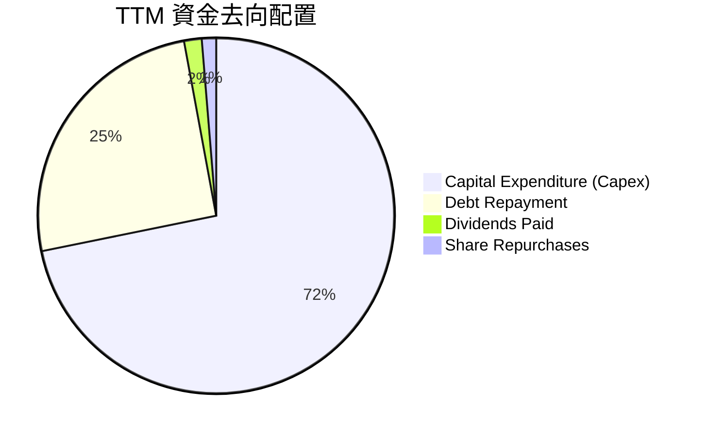

---

## 6. 獲利能力與資本效率

### 6.1 ROE / ROA / ROIC 趨勢

| 指標 | FY2022 | FY2023 | FY2024 | FY2025 | TTM | 行業中位數 | 評估 |
|------|--------|--------|--------|--------|------|------------|------|
| **ROE** | 17.4% | -13.2% | 1.7% | 15.8% | **66.6%** | 12.5% | 🟢 極其優秀 |
| **ROA** | 13.1% | -9.1% | 1.1% | 10.3% | **34.9%** | 8.2% | 🟢 資產利用效率極高 |
| **ROIC**| 14.4% | -11.5% | 1.5% | 13.8% | **77.4%** | 10.1% | 🟢 核心資本回報驚人 |

### 6.2 ROIC vs WACC 分析（核心價值創造判斷）

為了評估美光是在「創造價值」還是「摧毀價值」，我們進行了 WACC 與 ROIC 的對比建模：

```
╔══════════════════════════════════════════════════════════════════╗
║               MU - ROIC vs WACC 深度分析 (TTM)                   ║
╠══════════════════════════════════════════════════════════════════╣
║                                                                  ║
║  WACC 估算：                                                     ║
║  ├── 無風險利率 (10Y U.S. Treasury)：4.2%                        ║
║  ├── 市場風險溢酬 (ERP)：           5.0%                        ║
║  ├── Beta 值：                      2.14                        ║
║  ├── 股權成本 (Ke) = 4.2% + 2.14 × 5.0% = 14.9%                  ║
║  ├── 債務成本 (Kd, 稅後)：          ~5.0%                       ║
║  ├── 資本結構：股權 ~95%，債務 ~5%                              ║
║  └── ✅ WACC ≈ 14.5%                                             ║
║                                                                  ║
║  ROIC 估算：                                                     ║
║  ├── NOPAT = EBIT $59.24B × (1 - 14.57% 稅率) ≈ $50.61B         ║
║  ├── 投入資本 = 股東權益 $80B + 債務 $6.38B - 現金 $26.02B       ║
║  │            ≈ $60.36B                                          ║
║  └── ✅ ROIC ≈ 77.4%                                             ║
║                                                                  ║
║  ★ 經濟價值增加 (EVA) = ROIC - WACC = +62.9%                     ║
║                                                                  ║
║  ROIC  77.4%  ▓▓▓▓▓▓▓▓▓▓▓▓▓▓▓▓▓▓▓▓▓▓▓▓▓▓▓░░░  🟢                 ║
║  WACC  14.5%  ▓▓▓▓▓░░░░░░░░░░░░░░░░░░░░░░░░░  ──                 ║
║  EVA   +62.9% ██████████████████████████░░░░  🏆 強力創造價值    ║
║                                                                  ║
║  📊 結論：美光的 ROIC 是其 WACC 的 5.3 倍！這意味著公司正在以    ║
║           半導體歷史上罕見的速度為股東瘋狂創造財富。             ║
╚══════════════════════════════════════════════════════════════════╝
```

### 6.3 杜邦三因素分解

透過杜邦分析，我們可以拆解美光 TTM ROE（66.6%）的超常表現來源：

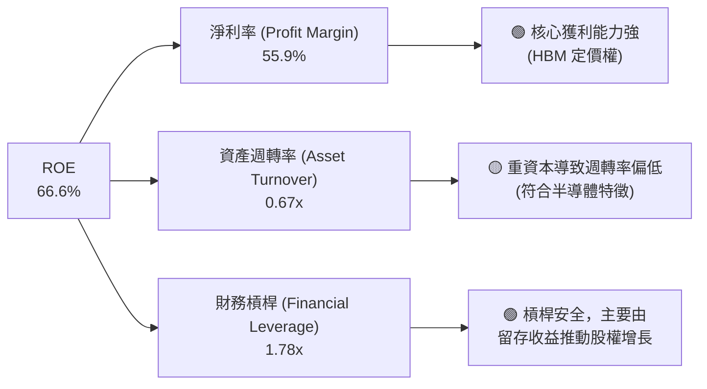

### 6.4 獲利能力儀表板

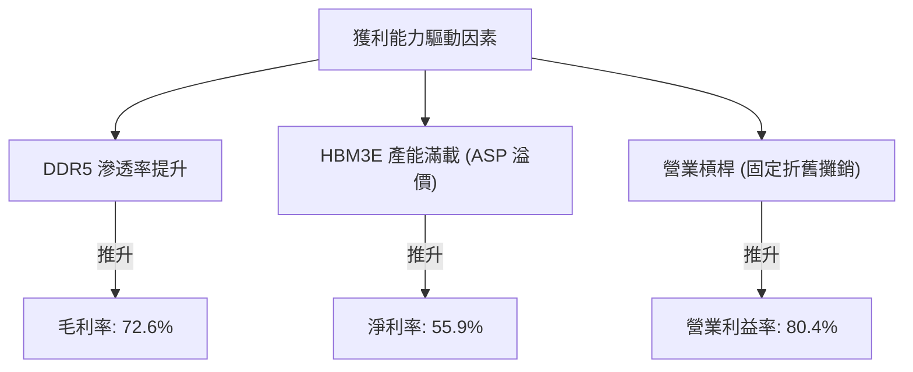

---

## 7. 估值深度分析

### 7.1 同業估值比較表格

我們選取了全球記憶體巨頭三星電子、SK Hynix 以及硬碟/快閃記憶體巨頭 Western Digital 進行對比：

| 估值指標 | **美光 (MU)** | **SK Hynix** | **三星電子 (005930.KS)** | **Western Digital (WDC)** | 本公司評估 |
|----------|----------|---------|---------|---------|-----------|
| **Trailing P/E** | **19.19x** | 15.2x | 16.5x | 24.1x | 🟡 合理，反映當前盈利暴增 |
| **Forward P/E** | **5.63x** | 6.1x | 9.8x | 11.2x | 🟢 極度便宜，居行業最低水準 |
| **PEG Ratio** | **0.12** | 0.15 | 0.45 | 0.85 | 🟢 遠低於 1.0，具備極高成長性 |
| **P/S Ratio** | **10.62x** | 4.5x | 1.8x | 1.9x | 🔴 偏高，反映美光的高利潤率溢價 |
| **P/B Ratio** | **13.22x** | 2.1x | 1.2x | 2.5x | 🔴 偏高，因股本尚未完全反映利潤 |
| **EV / EBITDA** | **13.77x** | 11.2x | 6.8x | 12.4x | 🟡 合理，與同業基本持平 |
| **FCF Yield** | **2.73%** | 2.5% | 1.8% | -1.2% | 🟢 優秀，重資本下依然維持正向回報 |

*估值倍數選擇說明*：
由於美光屬於典型的重資產、高折舊半導體企業，其淨利潤受折舊（D&A）影響極大。因此，我們在估值時，**Forward P/E（5.63x）** 與 **PEG（0.12）** 是最核心的指標，這兩個指標表明：**市場目前並未將美光在 2026-2027 年 HBM 產能完全售罄、獲利將持續維持高位的預期進行完全定價。**

### 7.2 歷史估值區間分析

美光歷史 P/E 區間通常在 5x - 30x 之間波動。當前 Forward P/E 處於 **5.63x**，接近歷史估值區間的**最底部**。

```
╔══════════════════════════════════════════════════════════════════╗
║                    MU 歷史 Forward P/E 區間                     ║
<Trough> 5.0x                                       <Peak> 30.0x  
║  [██░░░░░░░░░░░░░░░░░░░░░░░░░░░░░░░░░░░░░]                       ║
║   ↑                                                             ║
║  當前 5.63x (處於極度低估安全邊際)                              ║
╚══════════════════════════════════════════════════════════════════╝
```

### 7.3 情境目標價（假設驅動，Bear / Base / Bull）

我們基於未來 3 年的財務預測，建立以下三種情境估值模型：

| 情境 | 營收 CAGR (3Y) | 預期營業利益率 | 退出倍數 (Forward P/E) | 隱含目標價 | 相對現價漲跌幅 |
|------|-----------|-----------|----------|------------|----------|
| 🔴 **悲觀情境** | -10.0% (AI 泡沫破裂) | 15.0% | 6.0x | **$361.00** | -57.5% |
| 🟡 **基準情境** | **+25.0%** (AI 持續繁榮) | **45.0%** | **10.0x** | **$1,491.95**| **+75.7%** |
| 🟢 **樂觀情境** | +40.0% (HBM 供不應求) | 55.0% | 15.0x | **$2,200.00**| +159.1% |

### 7.4 DCF 敏感性分析（9 格目標價矩陣）

基於永續成長率（Terminal Growth Rate）為 2.5% 的假設，我們對折現率（WACC）與基準營業利益率進行敏感性分析：

| 營業利益率 \ WACC | 13.5% | **14.5% (基準)** | 15.5% |
|------------------|-------|------------------|-------|
| 🟢 **50.0% (高)** | $1,850 (+117.9%) | $1,680 (+97.9%) | $1,520 (+79.0%) |
| 🟡 **45.0% (中)** | $1,640 (+93.2%)  | **$1,491.95 (+75.7%)** | $1,350 (+59.0%) |
| 🔴 **35.0% (低)** | $1,280 (+50.8%)  | $1,160 (+36.6%) | $1,050 (+23.7%) |

### 7.5 估值綜合區間

當前股價 $848.95 顯著低於基準情境下的內在價值（$1,491.95），具備極高的安全邊際。

---

## 8. 成長催化劑

### 8.1 催化劑時間軸

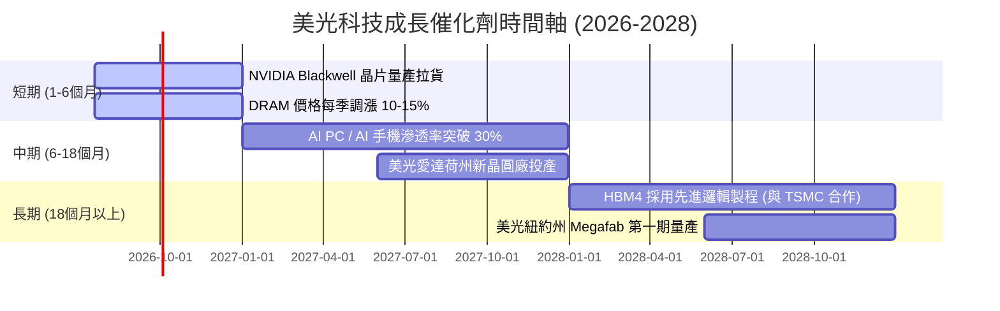

### 8.2 TAM 市場規模分析

```
╔══════════════════════════════════════════════════════════════════╗
║                    美光目標市場 (TAM) 預估                      ║
╠══════════════════════════════════════════════════════════════════╣
║                                                                  ║
║  1. HBM 市場 TAM (2027)：      $25.0B  (美光預期市佔 25%)        ║
║  2. AI 伺服器 DRAM (2027)：    $35.0B  (美光預期市佔 23%)        ║
║  3. AI PC/邊緣端 (2027)：      $20.0B  (美光預期市佔 20%)        ║
║                                                                  ║
║  📊 總潛在市場 (Total TAM)：   $80.0B  (僅計 AI 相關增量)        ║
╚══════════════════════════════════════════════════════════════════╝
```

### 8.3 成長驅動力結構圖

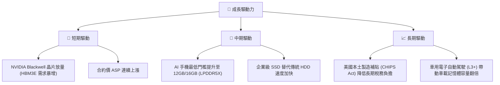

---

## 9. 風險矩陣

### 9.1 風險評分矩陣

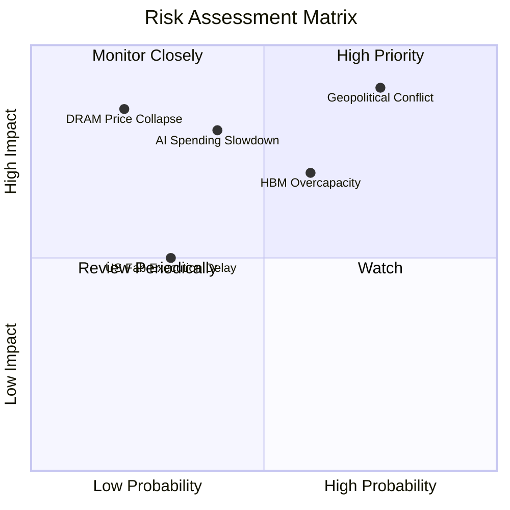

### 9.2 風險清單詳細分析

| # | 風險項目 | 發生機率 | 財務衝擊 | 風險評分 | 緩解措施 |
|---|----------|----------|----------|----------|----------|
| 1 | 🔴 **地緣政治衝突 (台海局勢)** | 中高 (50%) | 極高 (-50% 產能) | 🔴 **8.5 / 10** | 加速美國愛達荷州與紐約州晶圓廠建設，分散後段封測（OSAT）至馬來西亞與日本。 |
| 2 | 🟡 **HBM 產業產能過剩** | 中 (40%) | 中高 (-20% ASP) | 🟡 **6.5 / 10** | 嚴格執行「以需定產」策略，與 NVIDIA/AMD 簽訂長期供應協議（LTA）鎖定價格與產能。 |
| 3 | 🟡 **AI 資本支出放緩** | 中低 (30%) | 高 (-30% 營收) | 🟡 **6.0 / 10** | 保持資產負債表的高現金水位（目前 $26.02B），確保景氣下行時仍能維持研發。 |

---

## 10. 投資建議

### 10.1 最終綜合評級

```
╔══════════════════════════════════════════════════════════════╗
║                    MU 最終投資評級儀表板                     ║
╠══════════════════════════════════════════════════════════════╣
║ 基本面強度    9.0/10  ▓▓▓▓▓▓▓▓▓▓▓▓▓▓▓▓▓▓░░  ★★★★★           ║
║ 成長動能      9.5/10  ▓▓▓▓▓▓▓▓▓▓▓▓▓▓▓▓▓▓▓░  ★★★★★           ║
║ 財務健康度    9.5/10  ▓▓▓▓▓▓▓▓▓▓▓▓▓▓▓▓▓▓▓░  ★★★★★           ║
║ 估值吸引力    7.5/10  ▓▓▓▓▓▓▓▓▓▓▓▓▓▓░░░░░░  ★★★★☆           ║
╠══════════════════════════════════════════════════════════════╣
║ 綜合推薦度    8.7/10  ▓▓▓▓▓▓▓▓▓▓▓▓▓▓▓▓▓░░░  🏆 強烈買入     ║
╚══════════════════════════════════════════════════════════════╝
```

### 10.2 目標價與隱含報酬率

| 情境 | 機率權重 | 目標價 | 隱含報酬率 | 期望值目標價 |
|------|----------|--------|------------|--------------|
| 🔴 悲觀 | 15% | $361.00 | -57.5% | |
| 🟡 **基準** | **60%** | **$1,491.95** | **+75.7%** | **$1,223.36 (+44.1%)** |
| 🟢 樂觀 | 25% | $2,200.00 | +159.1% | |

### 10.3 買入時機與觸發因素

```
╔══════════════════════════════════════════════════════════════════╗
║                  ✅ 買入觸發因素 Checklist                      ║
╠══════════════════════════════════════════════════════════════════╣
║                                                                  ║
║  立即買入觸發條件（多數符合）：                                  ║
║  ✅ Forward P/E < 8.0x（當前為 5.63x，符合）                    ║
║  ✅ HBM3E 產能確認售罄至 2027 年（符合）                         ║
║  ✅ 淨現金狀態保持正數且持續擴大（當前 $19.65B，符合）           ║
║                                                                  ║
║  加碼觸發條件（出現以下任一）：                                  ║
║  ☐ 股價回檔至 200 日移動平均線附近（約 $650 - $700）             ║
║  ☐ NVIDIA 財報確認 Blackwell 需求超預期並追加 HBM 訂單           ║
║                                                                  ║
║  減碼/停損觸發條件（出現以下任一）：                             ║
║  ☐ DRAM 現貨價（Spot Price）連續兩個月下跌超過 15%               ║
║  ☐ 美光單季毛利率跌破 45%                                        ║
╚══════════════════════════════════════════════════════════════════╝
```

### 10.4 投資人適配度分析

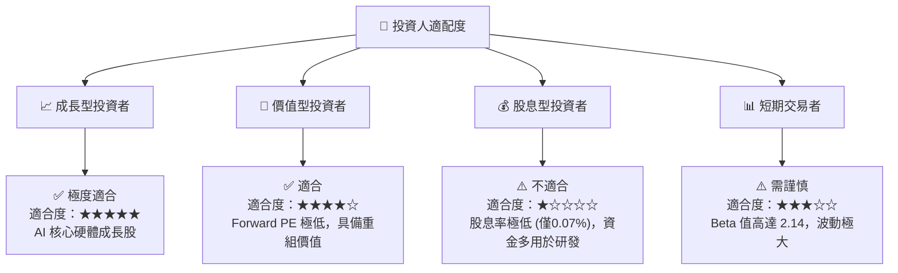

### 10.5 每季財報監控清單（Quarterly Watch List）

為了持續追蹤美光的投資論點是否成立，投資人應在每季財報中重點監控以下指標，並對照「加碼/減碼」門檻：

| 監控指標 | 基準值 (當前) | 觸發加碼門檻 | 觸發減碼/警報門檻 | 監控意義 |
|----------|--------------|--------------|------------------|----------|
| **單季營收 (Revenue)** | $41.46B | > $45.00B | < $30.00B | 評估 AI 伺服器拉貨動能是否延續 |
| **單季毛利率 (Gross Margin)** | 84.6% (Q3 '26) | > 85.0% | < 60.0% | 評估 HBM 定價權與產能利用率 |
| **單季自由現金流 (FCF)** | $17.56B | > $15.00B | < $5.00B | 評估重資本支出下，現金流的失血狀況 |
| **資本支出 (Capex)** | $7.83B (Q3 '26) | < $9.00B (理性擴產) | > $12.00B (無序擴產) | 監控產業是否再次走向產能過剩 |
| **DRAM ASP 變動率** | YoY +100% 以上 | YoY 成長持續 | YoY 轉為負成長 | 記憶體循環轉折的最核心先行指標 |

### 10.6 反面論證：什麼會證明論點錯誤（What Would Change My Mind）

本報告的多頭論點建立在「AI 需求持續且記憶體行業維持理性競爭」的假設上。若發生以下情況，投資人應果斷出場或重新審視投資邏輯：

```
╔══════════════════════════════════════════════════════════════════╗
║              ⚠️ 論點失效條件（Disconfirming Evidence）           ║
╠══════════════════════════════════════════════════════════════════╣
║  本投資論點在下列情況成立時應重新檢視或退出：                    ║
║  ☐ 三星的 HBM3E/HBM4 通過 NVIDIA 認證並開始低價傾銷，導致美光    ║
║     HBM 市佔率跌破 15%。                                         ║
║  ☐ 雲端巨頭（CSPs）因 AI 投資回報率（ROI）不如預期，集體下修      ║
║     2027 年資本支出預算 > 20%。                                  ║
║  ☐ 美光單季 FCF 連續兩季轉為負數，且 ROIC 跌破 15% (接近 WACC)。 ║
║  ☐ 台灣或日本發生重大地緣政治事件，導致美光先進 DRAM 製造中斷     ║
║     超過一個月。                                                 ║
╚══════════════════════════════════════════════════════════════════╝
```

---

> **免責聲明**：本報告為 AI 自動生成，僅供研究參考，不構成投資建議。投資有風險，入市需謹慎。美光科技（MU）屬於高 Beta（2.14）之高波動景氣循環股，投資人應根據自身風險承受能力進行資產配置。