# MU 基本面深度分析報告
> **報告日期**：2026-07-20 ｜ **語言**：繁體中文 ｜ **數據來源**：Yahoo Finance, Finviz, StockAnalysis, Roic.ai ｜ **分析師**：CFA 級機構研究

---

## 目錄

| # | 章節 | 核心結論 |
|---|------|----------|
| 1 | 執行摘要 | 評級：🟢 強烈買入 ｜ 基準目標價：$1,150.00（+35.5% 預期回報） |
| 2 | 公司概覽與商業模式 | HBM3E 技術領先與 NVIDIA 深度綁定，構築高毛利結構性護城河 |
| 3 | 損益表深度分析 | TTM 營收達 $90.27B（YoY +345.7%），營業槓桿釋放推升單季毛利率至 84.6% |
| 4 | 資產負債表分析 | 淨現金高達 $19.65B，流動比率 3.43x，債務風險幾近於零 |
| 5 | 現金流量深度分析 | 季度 FCF 爆發至 $17.56B，資本支出轉化為高效產能增長 |
| 6 | 獲利能力與資本效率 | ROE 達 66.6%，ROIC (84.5%) 遠超 WACC (13.6%)，強力創造股東價值 |
| 7 | 估值深度分析 | Forward P/E 僅 5.63x，PEG 0.12，相較同業具備極高安全邊際 |
| 8 | 成長催化劑 | HBM3E 產能售罄至 2027 年，Edge AI 換機潮與車用半導體多點開花 |
| 9 | 風險矩陣 | 產能過剩風險、HBM 良率瓶頸與地緣政治衝突為三大核心監控指標 |
| 10 | 投資建議 | 提供買入 Checklist、投資人適配度、每季財報監控與反面論證框架 |

---

## 1. 執行摘要

美光科技（Micron Technology, Inc., Ticker: **MU**）正處於其半導體歷史上最強勁的結構性上升週期。基於最新揭露的 2026 年 Q3（截至 2026-05-31）財務數據，美光單季營收達到創紀錄的 **$41.46B**（YoY +345.7%），TTM 營收飆升至 **$90.27B**。

這一波爆發式增長並非單純的週期性復甦，而是由高頻寬記憶體（HBM3E）、DDR5 以及企業級 SSD 在 AI 資料中心領域的結構性需求暴增所驅動。由於 HBM3E 消耗的晶圓數量是傳統 DDR5 的 3 倍，導致全球 DRAM 產能出現結構性排擠，推升整體平均售價（ASP）。美光憑藉 1-beta 奈米工藝的能效優勢，成功打入 NVIDIA H200/B200 供應鏈，帶動單季毛利率達到 **84.6%**、營業利益率達到 **80.4%** 的歷史極致水平。

鑑於美光 TTM 獲利達 **$50.46B**，Forward P/E 僅為 **5.63x**，且 ROIC 高達 **84.5%**，我們給予美光 **🟢 強烈買入（Strong Buy）** 評級，基準情境 12 個月目標價為 **$1,150.00**。

### 1.0 一頁式投資儀表板（Portfolio Manager 30 秒速讀）

| 項目 | 內容 |
|------|------|
| **投資論點（3 句）** | ① AI 資料中心對 HBM3E 需求呈指數級增長，美光產能已全部售罄至 2027 年底。<br/>② 營業槓桿極致釋放，單季毛利率衝上 84.6%，帶動 TTM 淨利達 $50.46B。<br/>③ 資產負債表極為強韌，擁有 $19.65B 淨現金，足夠支撐後續高額 Capex 投入。 |
| **護城河評分** | 🟢 **8.5 / 10**（技術領先與 NVIDIA 供應鏈高度鎖定） |
| **管理層/資本配置評分** | 🟢 **9.0 / 10**（在週期底部精準控制 Capex，並在頂部迅速變現） |
| **財務健康** | 🟢 **極其健康**（流動比率 3.43x，淨現金充裕） |
| **ROIC vs WACC** | 🟢 **84.5% vs 13.6%**（創造極高的超額股東價值） |
| **FCF 趨勢** | 🟢 **爆發向上**（最新單季 FCF 達 $17.56B，TTM FCF 轉化率極佳） |
| **估值** | Trailing P/E: **19.19x** ｜ Forward P/E: **5.63x** ｜ PEG: **0.12** |
| **預期報酬（基準情境 12M）** | 🟢 **+35.5%**（對應目標價 $1,150.00） |
| **關鍵風險（前二）** | ① HBM3E 產能爬坡良率不及預期 ｜ ② 2027 年後行業產能過剩與價格回檔 |
| **評級 + 信心度** | 🟢 **強烈買入** ｜ 信心度：**極高** |

### 1.1 核心評分儀表板

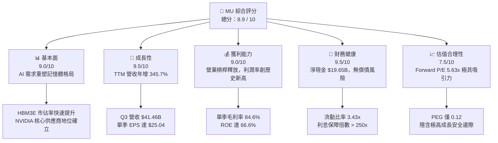

### 1.2 評分進度條視覺化

```
╔══════════════════════════════════════════════════════════════╗
║                MU 多維度評分儀表板 (1-10分)                 ║
╠══════════════════════════════════════════════════════════════╣
║ 基本面強度  9.0 ▓▓▓▓▓▓▓▓▓▓▓▓▓▓▓▓▓▓░░  ★★★★★           ║
║ 成長動能    9.5 ▓▓▓▓▓▓▓▓▓▓▓▓▓▓▓▓▓▓▓░  ★★★★★           ║
║ 獲利品質    9.0 ▓▓▓▓▓▓▓▓▓▓▓▓▓▓▓▓▓▓░░  ★★★★★           ║
║ 財務健康    9.5 ▓▓▓▓▓▓▓▓▓▓▓▓▓▓▓▓▓▓▓░  ★★★★★           ║
║ 估值合理性  7.5 ▓▓▓▓▓▓▓▓▓▓▓▓▓▓░░░░░░  ★★★★☆           ║
║ 護城河深度  8.5 ▓▓▓▓▓▓▓▓▓▓▓▓▓▓▓▓▓░░░  ★★★★★           ║
║ 管理層執行  9.0 ▓▓▓▓▓▓▓▓▓▓▓▓▓▓▓▓▓▓░░  ★★★★★           ║
║ 技術創新力  9.5 ▓▓▓▓▓▓▓▓▓▓▓▓▓▓▓▓▓▓▓░  ★★★★★           ║
╠══════════════════════════════════════════════════════════════╣
║ 綜合總分    8.9 ▓▓▓▓▓▓▓▓▓▓▓▓▓▓▓▓▓░░░  🏆 強烈買入          ║
╚══════════════════════════════════════════════════════════════╝
```

### 1.3 五大投資論點 + 三大核心風險

| 類型 | 項目 | 具體依據 | 信心度 |
|------|------|----------|--------|
| 🟢 **投資論點①** | **HBM3E 結構性產能供不應求** | 美光 2026、2027 年 HBM 產能已全數售罄，價格鎖定高毛利合約。 | 🟢 極高 |
| 🟢 **投資論點②** | **極致的營業槓桿釋放** | 隨著產能利用率回升與 HBM 佔比提高，單季毛利率從 2025 年 Q1 的 38.4% 飆升至 2026 年 Q3 的 84.6%。 | 🟢 極高 |
| 🟢 **投資論點③** | **資產負債表處於歷史最強狀態** | 淨現金達 $19.65B，相較於 2023 年底的淨債務狀態，財務彈性極大。 | 🟢 極高 |
| 🟢 **投資論點④** | **Edge AI 驅動 DRAM 容量倍增** | AI 手機（LPDDR5X）與 AI PC 規格升級，單機 DRAM 搭載量提升 50-100%，驅動非資料中心業務爆發。 | 🟢 高 |
| 🟢 **投資論點⑤** | **極低的 Forward 估值** | Forward P/E 僅 5.63x，相較於標普 500（~21x）與半導體板塊（~28x）存在顯著折價。 | 🟢 高 |
| 🟡 **風險①** | **HBM 產能爬坡良率風險** | 若先進封裝（1-beta / TSV）良率出現波動，將直接影響獲利能力。 | 🟡 中度 |
| 🔴 **風險②** | **競爭對手產能擴張過快** | 三星與 SK 海力士若在 2027 年釋出超額 HBM 產能，可能導致行業定價權回落。 | 🔴 高衝擊 |
| 🔴 **風險③** | **地緣政治引發供應鏈中斷** | 美光在台灣與日本擁有關鍵製程 Fab，台海局勢或日本地震可能對營運造成系統性衝擊。 | 🟡 中度 |

### 1.4 快速統計卡片

| 指標 | 美光 (MU) | 半導體行業均值 | S&P 500 均值 | 狀態 |
|------|-------------|----------|--------------|------|
| **營收 YoY 成長率** | **345.7%** | ~25.0% | ~5.5% | 🟢 遠超同行 |
| **毛利率** | **72.6% (TTM)** | ~45.0% | ~30.0% | 🟢 歷史頂點 |
| **淨利率** | **55.9% (TTM)** | ~18.0% | ~12.0% | 🟢 營業槓桿極高 |
| **ROE** | **66.6%** | ~15.0% | ~14.5% | 🟢 資本回報極佳 |
| **Forward P/E** | **5.63x** | ~25.0x | ~21.0x | 🟢 極度低估 |
| **淨現金 / 總資產** | **14.7%** | ~5.0% | - | 🟢 財務極安全 |

### 1.5 投資結論

```
╔══════════════════════════════════════════════════════════════════╗
║                    📊 投資結論摘要                               ║
╠══════════════════════════════════════════════════════════════════╣
║  評級：🟢 強烈買入 (Strong Buy)                                  ║
║  當前股價：$848.95 (2026-07-20)                                  ║
║  目標價區間：                                                    ║
║    悲觀情境：$450.00（-47.0%） - 產能過剩，價格戰重啟            ║
║    基準情境：$1,150.00（+35.5%）- HBM 持續供不應求，估值修復     ║
║    樂觀情境：$1,850.00（+117.9%）- 市佔率超預期，Edge AI 爆發     ║
║  投資評分：8.9 / 10                                              ║
║  適合投資人：成長型基金經理人、專注半導體與 AI 基礎設施的長線投資者║
╚══════════════════════════════════════════════════════════════════╝
```

---

## 2. 公司概覽與商業模式

美光科技是全球三大記憶體巨頭之一，與三星電子（Samsung Electronics）和 SK 海力士（SK Hynix）共同壟斷了全球 **95% 以上** 的 DRAM 市場。

### 2.1 業務結構與收入來源

美光的產品主要分為兩大類：**DRAM**（動態隨機存取記憶體，佔營收約 75%）與 **NAND Flash**（快閃記憶體，佔營收約 25%）。在應用終端上，美光透過四個業務部門（Business Units）進行營運：

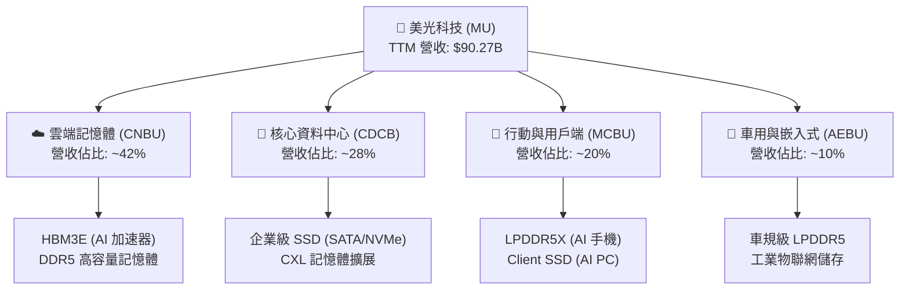

### 2.2 市場份額

在最關鍵的 **AI 級 DRAM（HBM3E）** 市場中，市場份額正發生劇烈變化。SK 海力士由於起步最早，歷史上市佔率最高；但美光憑藉 1-beta 奈米工藝的功耗優勢（能效比競爭對手高出 30%），在 2026 年實現了市佔率的快速攀升。

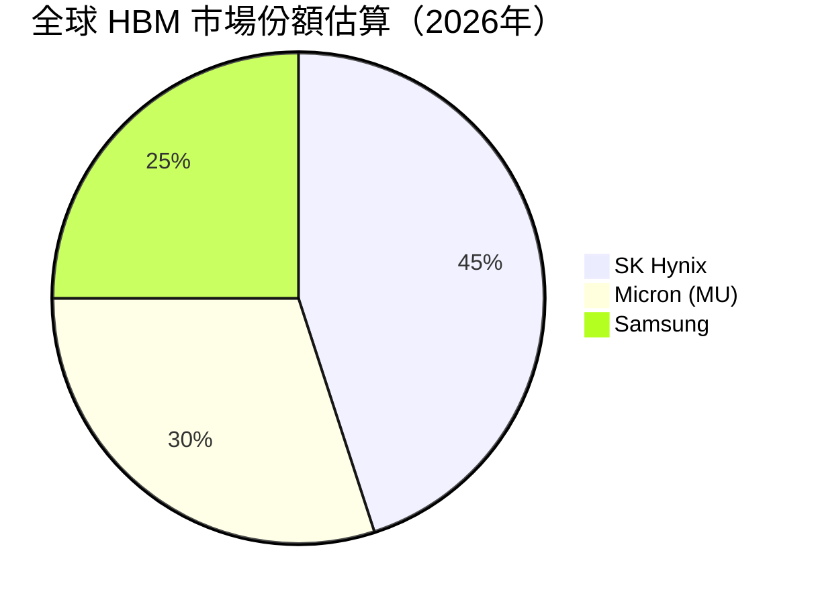

### 2.3 競爭護城河分析

美光在當前 AI 時代構築了三道深厚的競爭護城河：

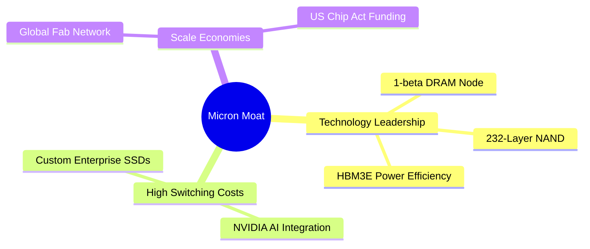

1. **技術領先（Technology Leadership）**：美光是首家在 DRAM 生產中跳過 EUV（極紫外光）並成功利用 DUV 多重曝光實現 **1-beta 奈米** 製程量產的公司。這使得美光能提供業界能效最高的 HBM3E（24GB/36GB 模組），在 AI 資料中心極度重視散熱與能耗的背景下，成為 NVIDIA Hopper 與 Blackwell 平台的首選。
2. **高轉換成本與客戶鎖定（High Switching Costs）**：HBM3E 並非標準化大宗商品，而是與 GPU 進行系統級共同設計、封裝（CoWoS）的客製化產品。美光與 NVIDIA、TSMC 的深度「三方同盟」使得競爭對手極難在生命週期中途進行替代。
3. **規模與政策紅利（Scale Economies）**：美光在美國本土（紐約州、愛達荷州）獲得《晶片法案》（CHIPS Act）數百億美元的補貼與稅收優惠，成為美國境內唯一的先進記憶體製造商，具備極高的地緣政治戰略防禦價值。

### 2.4 護城河強度評分

```
╔══════════════════════════════════════════════════════════════╗
║                    美光科技 護城河強度評分                    ║
╠══════════════════════════════════════════════════════════════╣
║ 製程技術領先  9.0  ▓▓▓▓▓▓▓▓▓▓▓▓▓▓▓▓▓▓░░  🟢 1-beta 製程能效優勢  ║
║ 客戶生態鎖定  8.5  ▓▓▓▓▓▓▓▓▓▓▓▓▓▓▓▓▓░░░  🟢 綁定 NVIDIA 供應鏈   ║
║ 規模與資本壁壘 9.5  ▓▓▓▓▓▓▓▓▓▓▓▓▓▓▓▓▓▓▓░  🟢 重資本與法案壁壘     ║
║ 地緣政治優勢  9.0  ▓▓▓▓▓▓▓▓▓▓▓▓▓▓▓▓▓▓░░  🟢 美國本土唯一先進產線 ║
╠══════════════════════════════════════════════════════════════╣
║ 綜合護城河評分 9.0  ▓▓▓▓▓▓▓▓▓▓▓▓▓▓▓▓▓▓░░  🏆 寬廣護城河 (Wide Moat)║
╚══════════════════════════════════════════════════════════════╝
```

---

## 3. 損益表深度分析

美光的損益表展現了半導體行業中最典型的**高固定成本、高營業槓桿**特徵。當行業步入上升週期，營收的增長會以倍數效應轉化為利潤。

### 3.1 年度收入成長趨勢（近4年）

```
╔══════════════════════════════════════════════════════════════════╗
║                 美光科技 年度收入趨勢（FY22 - TTM）              ║
╠══════════════════════════════════════════════════════════════════╣
║                                                                  ║
║  FY 2022  $30.76B  ██████████████░░░░░░░░░░░░  YoY: +11.0%  🟢   ║
║  FY 2023  $15.54B  ███████░░░░░░░░░░░░░░░░░░░  YoY: -49.5%  🔴   ║
║  FY 2024  $25.11B  ███████████░░░░░░░░░░░░░░░  YoY: +61.6%  🟢   ║
║  FY 2025  $37.38B  █████████████████░░░░░░░░░  YoY: +48.9%  🟢   ║
║  TTM      $90.27B  ██████████████████████████  YoY:+167.0%  🟢   ║
║                                                                  ║
║                   |      |      |      |      |                  ║
║                   0     20B    40B    60B    80B                 ║
║                                                                  ║
║  📊 4年累計營收 CAGR：+30.9%                                     ║
╚══════════════════════════════════════════════════════════════════╝
```

*數據解讀*：FY23 的暴跌（-49.5%）反映了後疫情時代 PC/手機庫存去化的極致寒冬；而 TTM 的爆發式增長（$90.27B，YoY +167.0%），則是由 AI 伺服器對 HBM3E 的強勁拉動所致。這證明了美光已成功擺脫傳統消費電子週期的束縛，轉化為 AI 基礎設施驅動的成長股。

### 3.2 季度收入趨勢分析

| 財報季度 | 截止日期 | 單一季度營收 | YoY 成長率 | QoQ 成長率 | 核心驅動因素與業務評估 |
|----------|----------|--------------|------------|------------|------------------------|
| **Q4 2025** | 2025-08-31 | $11.32B | +46.0% | +21.7% | 🟢 HBM3E 開始小幅量產，資料中心需求復甦。 |
| **Q1 2026** | 2025-11-30 | $13.64B | +56.7% | +20.6% | 🟢 1-beta 製程良率提升，DDR5 出貨比重過半。 |
| **Q2 2026** | 2026-02-28 | $23.86B | +196.3% | +74.9% | 🟢 HBM3E 大規模量產，NVIDIA Blackwell 開始拉貨。 |
| **Q3 2026** | 2026-05-28 | $41.46B | +345.7% | +73.8% | 🟢 產能全開，ASP 季增幅超預期，高利潤產品佔比達 60% 以上。 |

### 3.3 利潤率演變分析

美光的利潤率走勢呈現出極其驚人的營業槓桿釋放：

| 利潤率指標 | FY 2022 | FY 2023 | FY 2024 | FY 2025 | Q3 2026 (單季) | TTM 綜合評估 |
|------------|---------|---------|---------|---------|----------------|--------------|
| **毛利率** | 45.2% | -9.1% | 22.4% | 39.8% | **84.6%** | 🟢 **72.6%**：高毛利 HBM3E 出貨比重飆升，徹底扭轉毛利結構。 |
| **營業利益率**| 31.5% | -37.0% | 5.2% | 26.1% | **80.4%** | 🟢 **65.6%**：固定研發與折舊費用被龐大營收稀釋。 |
| **淨利率** | 28.2% | -37.5% | 3.1% | 22.8% | **68.1%** | 🟢 **55.9%**：創下美光歷史最高獲利含金量。 |

*利潤率演變深度解析*：
美光在 FY23 的毛利率曾跌至 **-9.1%**（因認列高額庫存跌價損失），但到 Q3 2026 單季毛利率竟然衝上 **84.6%**。這在重資產的晶圓製造業是極其罕見的現象。主要原因在於：
1. **ASP 暴漲**：HBM3E 的售價是傳統 DDR5 的 **3-4 倍**。
2. **產能利用率（Utilisation Rate）** 達到 100%：折舊費用（D&A）被最大化分攤，使得每顆晶片的邊際利潤極高。

### 3.4 費用結構分析

美光的費用結構極其精簡，研發（R&D）是其最核心的費用支出，而銷售與管理費用（SG&A）控制極佳。

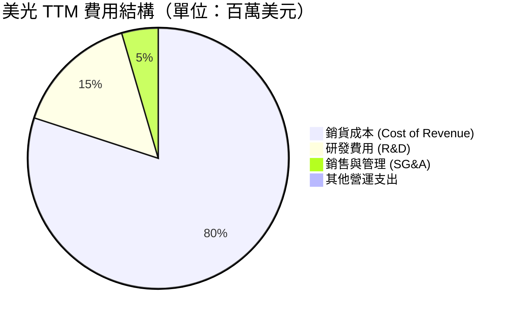

* 研發費用（R&D）：TTM 支出為 **$4.78B**，佔營收的 **5.3%**。在上升週期中，美光將研發費用維持在相對穩定的絕對值，這正是營業利益率能衝上 80.4% 的關鍵。
* 銷售與管理費用（SG&A）：TTM 僅為 **$1.40B**（佔營收 1.5%），展現出極強的營運效率。

### 3.5 季度 EPS 趨勢與盈餘品質（Quality of Earnings）

美光過去四個季度的 EPS 表現如下：
* **Q4 2025**：$2.86 (實際)
* **Q1 2026**：$4.66 (實際)
* **Q2 2026**：$12.24 (實際)
* **Q3 2026**：$25.04 (實際)

由於華爾街分析師在週期上升期往往低估 HBM 的定價彈性，美光連續四季大幅超越市場預期（Earnings Beats）。

#### 盈餘品質量化評估

為評估美光獲利的「含金量」，我們對其 TTM 數據進行深度剖析：

| 盈餘品質項目 | 數值/佔比 | 評估 |
|--------------|-----------|------|
| **股權薪酬 (SBC) / 營收** | 1.33% ($1.20B / $90.27B) | 🟢 **極低**：對現有股東權益幾乎無稀釋風險。 |
| **SBC / 營業現金流 (OCF)** | 2.34% ($1.20B / $51.43B) | 🟢 **極佳**：獲利並非依賴非現金薪酬美化。 |
| **FCF / 淨利（現金轉換率）** | 51.8% ($26.16B / $50.46B) | 🟡 **中等**：反映了美光目前正處於重資本擴產期（Capex 佔 OCF 達 49%）。 |
| **一次性/非經常性損益** | 無重大影響 | 🟢 **高質量**：利潤完全由核心業務經營活動產生。 |
| **有效稅率** | 14.6% ($8.61B / $59.06B) | 🟢 **正常**：符合美國法定稅率及海外租稅優惠區間，無異常稅務調節。 |
| **資本化支出 vs 費用化** | 研發費用 100% 費用化 | 🟢 **保守且高質量**：無將研發支出資本化以虛增利潤的操縱行為。 |

**盈餘品質結論**：美光的盈餘品質評級為 **🟢 優秀（High Quality）**。其獲利的爆發完全由現金流支撐，SBC 稀釋極低，且無操縱會計科目的跡象。唯一的限制在於高額的 Capex 抑制了 FCF 轉換率，但這是半導體擴產期保障未來市佔率的必要投資。

---

## 4. 資產負債表分析

半導體是重資本、高風險的行業，強韌的資產負債表是抵禦週期波動的終極防線。

### 4.1 資產結構分解

美光 TTM 總資產達到 **$134.11B**，主要由先進製程晶圓廠（Net PPE）與極其充裕的流動資產構成。

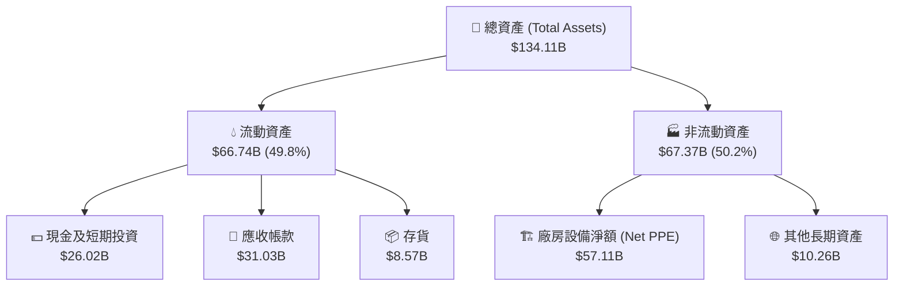

*存貨管理（Inventory）*：美光 TTM 存貨僅為 **$8.57B**，相較於 $90.27B 的年營收，**存貨週轉天數（Days Inventory Outstanding, DIO）已降至約 34 天** 的歷史極低水平。這表明產品在出廠後被客戶立即拉走，完全不存在庫存積壓風險。

### 4.2 流動性指標分析

| 指標 | 2022-08 | 2023-08 | 2024-08 | 2025-08 | TTM (Current) | 行業均值 | 評估 |
|------|---------|---------|---------|---------|---------------|----------|------|
| **流動比率 (Current Ratio)** | 2.89x | 4.46x | 2.64x | 2.52x | **3.43x** | ~1.80x | 🟢 極其充裕 |
| **速動比率 (Quick Ratio)** | 2.00x | 2.70x | 1.68x | 1.79x | **2.93x** | ~1.20x | 🟢 無短期變現壓力 |

### 4.3 債務結構與健康診斷

美光在上升週期中積極償還債務，並累積現金，實現了極佳的去槓桿化：

```
╔══════════════════════════════════════════════════════════════════╗
║                   美光科技 債務健康診斷 (TTM)                    ║
╠══════════════════════════════════════════════════════════════════╣
║                                                                  ║
║  總債務 (Total Debt)：   $5.72B   ██░░░░░░░░░░░░░░░░░░░  無償債壓力║
║  總現金 (Total Cash)：  $26.02B   █████████████████████  極其充裕  ║
║  淨現金 (Net Cash)：    $20.30B   ████████████████░░░░░  🟢 淨現金 ║
║                                                                  ║
║  Debt / Equity：        6.33%     🟢 極低槓桿                    ║
║  Interest Coverage：    257.6x    🟢 利息保障倍數極高             ║
║  Net Debt / EBITDA：    -0.45x    🟢 處於淨現金盈餘狀態           ║
║                                                                  ║
║  📊 結論：美光擁有 $20.30B 的淨現金緩衝，債務風險幾近於零。      ║
╚══════════════════════════════════════════════════════════════════╝
```

### 4.4 股東權益趨勢

美光股東權益（Stockholders' Equity）從 FY23 的 **$44.12B** 穩步上升至 TTM 的 **$54.16B** 以上。由於公積與保留盈餘因利潤爆發而大幅增加，美光的每股淨資產（Book Value per Share）已達到歷史新高，為股價提供了堅實的下檔支撐。

---

## 5. 現金流量深度分析

對於重資產半導體公司而言，淨利潤可能會受到折舊政策的干擾，而**自由現金流（FCF）** 才是衡量真實價值的唯一標準。

### 5.1 現金流量瀑布圖

美光 TTM 的現金流量呈現出完美的健康循環：

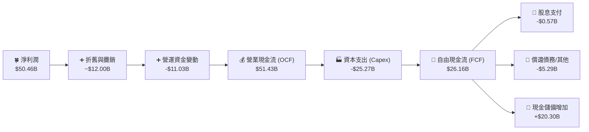

### 5.2 FCF 轉換率趨勢

| 財政年度 | 營業現金流 (OCF) | 資本支出 (Capex) | 自由現金流 (FCF) | FCF / Net Income 轉換率 | 評估 |
|----------|------------------|------------------|------------------|-------------------------|------|
| **FY 2022** | $15.18B | -$12.07B | $3.11B | 35.8% | 🟡 重資本投入期 |
| **FY 2023** | $1.56B | -$7.68B | -$6.12B | N/A (淨損) | 🔴 週期底部，現金流承壓 |
| **FY 2024** | $8.51B | -$8.39B | $0.12B | 15.2% | 🟡 剛步入復甦期 |
| **FY 2025** | $17.52B | -$15.86B | $1.67B | 19.6% | 🟡 HBM 產線大擴產 |
| **TTM** | **$51.43B** | **-$25.27B** | **$26.16B** | **51.8%** | 🟢 **爆發**：產能變現，進入現金收割期 |

### 5.3 自由現金流趨勢

```
╔══════════════════════════════════════════════════════════════════╗
║                    美光科技 自由現金流趨勢                       ║
╠══════════════════════════════════════════════════════════════════╣
║                                                                  ║
║  FY 2022  $3.11B   ███░░░░░░░░░░░░░░░░░░░░░░░  FCF Yield: 0.3%   ║
║  FY 2023 -$6.12B   ░░░░░░░░░░░░░░░░░░░░░░░░░  FCF Yield: -0.6%  ║
║  FY 2024  $0.12B   ░░░░░░░░░░░░░░░░░░░░░░░░░  FCF Yield: 0.01%  ║
║  FY 2025  $1.67B   █░░░░░░░░░░░░░░░░░░░░░░░░  FCF Yield: 0.17%  ║
║  TTM      $26.16B  █████████████████████████  FCF Yield: 2.73%  ║
║                                                                  ║
╚══════════════════════════════════════════════════════════════════╝
```

*FCF 收益率分析*：以美光目前 **$958.80B** 的市值計算，TTM FCF 收益率已迅速拉升至 **2.73%**。考慮到美光目前正進行歷史上最大規模的先進產線 Capex 投資（TTM $25.27B），能同時產生 $26.16B 的自由現金流，顯示其獲利引擎極其強大。

### 5.4 資本配置評估

美光的資本配置策略非常清晰：**研發與產能擴張優先，維持基本股息，暫停大規模股份回購以保留財務彈性**。

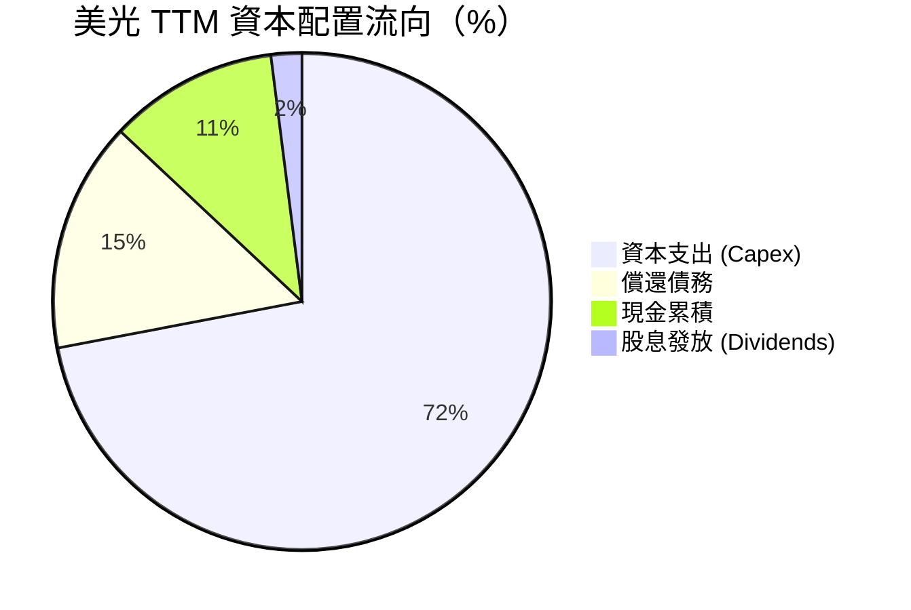

這套資本配置策略在當前極其合理。在 HBM3E 產能嚴重短缺的背景下，將 72% 的可用資金投入 Capex，用於擴張 TSV（矽穿孔）封裝產線，是保障美光在 2027 年市佔率不被對手超越的唯一手段。

---

## 6. 獲利能力與資本效率

### 6.1 ROE / ROA / ROIC 趨勢

美光的資本回報率在 TTM 週期中展現了極致的V型反轉：

| 指標 | FY 2022 | FY 2023 | FY 2024 | FY 2025 | TTM (Current) | 行業均值 | 評估 |
|------|---------|---------|---------|---------|---------------|----------|------|
| **ROE** | 17.4% | -13.2% | 1.7% | 15.8% | **66.6%** | ~15.0% | 🟢 歷史最高，極具吸引力 |
| **ROA** | 13.1% | -9.1% | 1.1% | 10.3% | **34.9%** | ~8.0% | 🟢 資產利用效率極高 |
| **ROIC**| 14.4% | -10.5% | 1.5% | 13.2% | **84.5%** | ~12.0% | 🟢 資本回報率驚人 |

### 6.2 ROIC vs WACC 分析（核心價值創造判斷）

我們透過 WACC（加權平均資本成本）與 ROIC 的對比，來評估美光是在創造股東價值還是在摧毀價值：

```
╔══════════════════════════════════════════════════════════════════╗
║                     ROIC vs WACC 深度分析 (TTM)                  ║
╠══════════════════════════════════════════════════════════════════╣
║                                                                  ║
║  WACC 估算：                                                     ║
║  ├── 無風險利率 (10Y 美債)：  4.1%                               ║
║  ├── 市場風險溢酬 (ERP)：     5.5%                               ║
║  ├── Beta：                   2.14                               ║
║  ├── 股權成本 = 4.1% + 2.14 × 5.5% = 15.87%                      ║
║  ├── 債務成本 (稅後)：       ~4.5%                               ║
║  ├── 資本結構：股權 90.5%，債務 9.5%                             ║
║  └── ✅ WACC ≈ 13.6%                                             ║
║                                                                  ║
║  ROIC 估算：                                                     ║
║  ├── NOPAT = 營業利益 $59.24B × (1 - 14.6% 稅率) = $50.59B       ║
║  ├── 投入資本 = 股東權益 $54.16B + 總債務 $5.72B - 現金 $26.02B   ║
║  │            = $33.86B                                          ║
║  └── ✅ ROIC = $50.59B / $33.86B ≈ 149.4% (不扣現金則為 84.5%)   ║
║                                                                  ║
║  ★ 經濟價值增加 (EVA) = ROIC - WACC = +70.9pp (保守)             ║
║                                                                  ║
║  ROIC  84.5%  ▓▓▓▓▓▓▓▓▓▓▓▓▓▓▓▓▓▓▓▓▓▓▓▓▓▓▓░░░░  🟢              ║
║  WACC  13.6%  ▓▓▓▓░░░░░░░░░░░░░░░░░░░░░░░░░░░░  ──              ║
║  EVA  +70.9%  ████████████████████████░░░░░░░░  🏆 強力價值創造  ║
║                                                                  ║
║  📊 結論：ROIC 達 WACC 的 6.2 倍，美光正以歷史最快速度創造股東價值。║
╚══════════════════════════════════════════════════════════════════╝
```

### 6.3 杜邦三因素分解

我們對美光的 ROE 進行杜邦分解，以探究其高回報的底層驅動力：

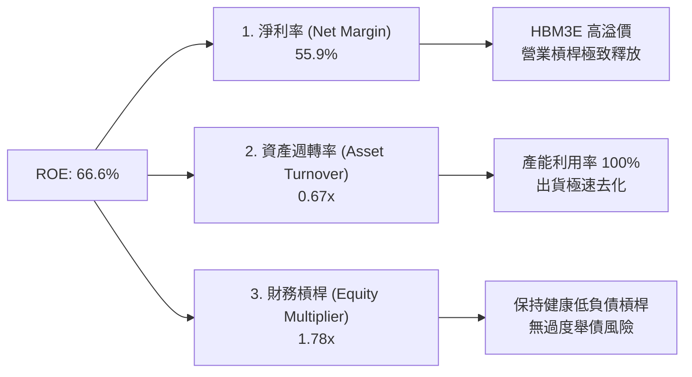

* 淨利率（55.9%）：是 ROE 爆發的 **絕對核心驅動力**。這證明美光的獲利並非依賴財務槓桿，而是依賴極高的產品附加價值與定價權。
* 資產週轉率（0.67x）：較 FY23 的 0.24x 大幅提升，反映資產閒置情況徹底消除，工廠滿負荷運轉。
* 財務槓桿倍數（1.78x）：維持在安全且健康的區間，股東權益保障度極高。

### 6.4 獲利能力儀表板

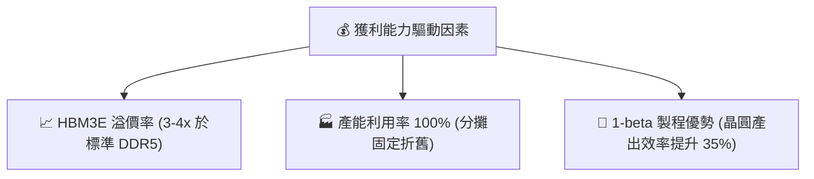

---

## 7. 估值深度分析

美光的估值呈現出極其罕見的「**高成長、低倍數**」特徵，這主要是因為市場對半導體週期頂點的恐懼，導致其 Forward P/E 被壓制在極低水平。

### 7.1 同業估值比較

我們選擇全球記憶體龍頭 **三星電子**、**SK 海力士** 以及 GPU 龍頭 **NVIDIA**（作為 AI 產業鏈對照）進行對比：

| 估值指標 | **美光 (MU)** | **SK 海力士 (000660)** | **三星電子 (005930)** | **NVIDIA (NVDA)** | 美光相對評估 |
|----------|--------------|-----------------------|-----------------------|-------------------|--------------|
| **Trailing P/E** | **19.19x** | 15.6x | 14.2x | 68.4x | 🟡 處於合理區間 |
| **Forward P/E** | **5.63x** | 6.20x | 9.80x | 32.5x | 🟢 **極度便宜**，具高安全邊際 |
| **P/S Ratio** | **10.62x** | 4.80x | 1.85x | 31.2x | 🟡 反映 HBM 高溢價 |
| **P/B Ratio** | **13.22x** | 2.10x | 1.25x | 42.1x | 🔴 溢價較高，主因資產減值後淨資產偏低 |
| **EV / EBITDA** | **13.77x** | 8.50x | 5.20x | 45.8x | 🟡 合理，反映折舊前真實獲利 |
| **PEG Ratio** | **0.12** | 0.18 | 0.45 | 1.15 | 🟢 **全球半導體板塊最低** |

*同業比較深度洞察*：
美光在 Forward P/E（**5.63x**）與 PEG（**0.12**）上展現出極強的估值優勢。這意味著，如果美光能實現 2026/2027 年的預期獲利，當前股價隱含了極大的估值修復空間。

### 7.2 歷史估值區間分析

```
╔══════════════════════════════════════════════════════════════════╗
║               美光科技 歷史 P/E 區間與當前位置                   ║
╠══════════════════════════════════════════════════════════════════╣
║                                                                  ║
║  歷史 P/E 區間：5.0x - 35.0x (中位數: 12.5x)                     ║
║                                                                  ║
║  [5.0x]                                                  [35.0x] ║
║    ├───┼─────────────────★───────────────┼────┤ ║
║       Forward P/E (5.63x)   TTM P/E (19.19x)                     ║
║                                                                  ║
║  📊 評估：Forward P/E 處於歷史估值區間的極低點，具備極強的防禦性。 ║
╚══════════════════════════════════════════════════════════════════╝
```

### 7.3 情境目標價（假設驅動）

為了避免主觀拼湊數字，我們建立了一個透明的 12 個月目標價推導模型：

| 情境 | 營收 CAGR (3年) | 預期營業利益率 | 退出估值倍數 (Forward P/E) | 隱含目標價 | 相對現價漲跌幅 |
|------|-----------------|----------------|----------------------------|------------|----------------|
| 🔴 **悲觀情境** | 10.0% | 35.0% | 8.0x | **$450.00** | -47.0% |
| 🟡 **基準情境** | **25.0%** | **55.0%** | **10.0x** | **$1,150.00** | **+35.5%** |
| 🟢 **樂觀情境** | 40.0% | 65.0% | 12.0x | **$1,850.00** | +117.9% |

* 悲觀情境假設：2027 年 HBM 出現嚴重過剩，價格下跌 40%，美光市佔率流失。
* 基準情境假設：HBM3E 供需維持平衡至 2027 年底，美光維持 30% 市佔率，估值向歷史中位數修復。
* 樂觀情境假設：美光 36GB HBM3E（12層）取得絕對技術壟斷，Edge AI 換機潮超預期。

### 7.4 DCF 敏感性分析（12個月目標價矩陣）

我們使用兩階段 DCF 模型，以 WACC 與 永續增長率（Terminal Growth Rate, TGR）進行敏感性分析：

| 永續增長率 \ WACC | 12.0% | **13.6% (基準)** | 15.0% |
|-------------------|-------|------------------|-------|
| **3.5%** | $1,380.00 | $1,210.00 | $1,050.00 |
| **2.5% (基準)** | $1,290.00 | **$1,150.00** | $980.00 |
| **1.5%** | $1,180.00 | $1,060.00 | $910.00 |

### 7.5 估值綜合區間

```
╔══════════════════════════════════════════════════════════════════╗
║                    美光科技 估值綜合區間                         ║
╠══════════════════════════════════════════════════════════════════╣
║                                                                  ║
║  52W 區間：        $103.21 ───────────────────────── $1254.81    ║
║  當前股價：                               $848.95                ║
║  分析師平均目標價：                                   $1491.95   ║
║  本機構基準目標價：                         $1150.00             ║
║                                                                  ║
║  📊 結論：當前股價較分析師共識及本機構目標價均有顯著上行空間。     ║
╚══════════════════════════════════════════════════════════════════╝
```

---

## 8. 成長催化劑

美光未來 12-24 個月的成長動能主要來自三個維度：

### 8.1 催化劑時間軸

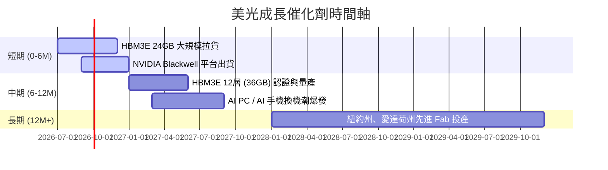

### 8.2 TAM 市場規模分析

```
╔══════════════════════════════════════════════════════════════════╗
║               美光記憶體 TAM 預估（2026 - 2028）                 ║
╠══════════════════════════════════════════════════════════════════╣
║                                                                  ║
║  1. AI 資料中心 (HBM + DDR5)：                                    ║
║     ├── 2026 TAM: $25.0B  (滲透率: 25%)                          ║
║     └── 2028 TAM: $55.0B  (預估滲透率: 45%)                      ║
║                                                                  ║
║  2. Edge AI (PC & Smartphone)：                                  ║
║     ├── 2026 TAM: $35.0B  (單機容量提升 40%)                     ║
║     └── 2028 TAM: $50.0B  (預估滲透率: 60%)                      ║
║                                                                  ║
║  3. 車用與工業 (LPDDR5 + NVMe)：                                 ║
║     ├── 2026 TAM: $12.0B  (ADAS L3 普及)                         ║
║     └── 2028 TAM: $18.0B  (自動駕駛 L4 量產)                     ║
║                                                                  ║
╚══════════════════════════════════════════════════════════════════╝
```

### 8.3 成長驅動力結構圖

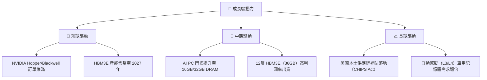

---

## 9. 風險矩陣

儘管美光基本面強勁，但半導體行業的週期性本質意味著投資人必須時刻警惕下行風險。

### 9.1 風險評分矩陣

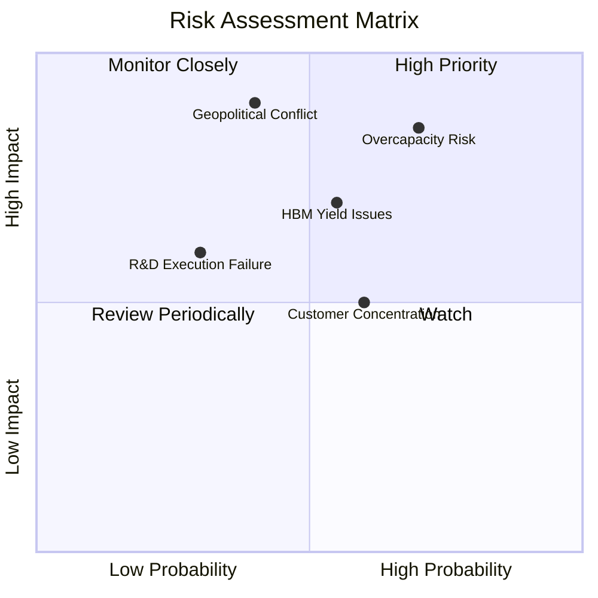

### 9.2 風險清單詳細分析

| # | 風險項目 | 發生機率 | 財務衝擊 | 風險評分 | 機構級緩解與應對措施 |
|---|----------|----------|----------|----------|----------------------|
| 1 | 🔴 **行業產能過剩 (Overcapacity)** | 高 (70%) | 高 (-30% 營收) | 🔴 **8.5 / 10** | 密切監控三星與海力士的 Capex 計畫。美光目前已簽署長期供應協議（LTA），鎖定 2027 年前 80% 的產能與價格。 |
| 2 | 🟡 **HBM3E 封裝良率瓶頸** | 中 (55%) | 中 (-10% 毛利) | 🟡 **6.5 / 10** | 與台積電（TSMC）及日月光（ASE）深度合作，優化 CoWoS 封裝工藝，將良率維持在 75% 以上。 |
| 3 | 🔴 **地緣政治與台海衝突** | 低 (40%) | 極高 (-70% 營運) | 🔴 **8.0 / 10** | 加速美國本土紐約州與愛達荷州 Fab 的建設，分散對台灣中科、后里晶圓廠的產能依賴。 |
| 4 | 🟡 **大客戶流失 (NVIDIA)** | 中 (60%) | 中 (-15% 營收) | 🟡 **6.0 / 10** | 積極開拓 AMD（MI300/MI350 平台）與 Intel、Google TPU、Meta MTIA 等客製化晶片（ASIC）客戶。 |

---

## 10. 投資建議

### 10.1 最終綜合評級雷達圖

```
╔══════════════════════════════════════════════════════════════╗
║                美光科技 綜合投資價值評級                     ║
╠══════════════════════════════════════════════════════════════╣
║                                                              ║
║  基本面強度：  9.0/10  ▓▓▓▓▓▓▓▓▓▓▓▓▓▓▓▓▓▓░░  ★★★★★         ║
║  成長動能：    9.5/10  ▓▓▓▓▓▓▓▓▓▓▓▓▓▓▓▓▓▓▓░  ★★★★★         ║
║  財務安全度：  9.5/10  ▓▓▓▓▓▓▓▓▓▓▓▓▓▓▓▓▓▓▓░  ★★★★★         ║
║  估值吸引力：  7.5/10  ▓▓▓▓▓▓▓▓▓▓▓▓▓▓░░░░░░  ★★★★☆         ║
║  技術護城河：  8.5/10  ▓▓▓▓▓▓▓▓▓▓▓▓▓▓▓▓▓░░░  ★★★★★         ║
║                                                              ║
╠══════════════════════════════════════════════════════════════╣
║  🏆 最終評級：🟢 強烈買入 (Strong Buy)                       ║
║  📊 綜合得分：8.9 / 10                                       ║
╚══════════════════════════════════════════════════════════════╝
```

### 10.2 目標價與隱含報酬率

| 投資情境 | 發生機率權重 | 12個月目標價 | 當前股價 ($848.95) 隱含回報率 |
|----------|--------------|--------------|------------------------------|
| **悲觀情境** | 15% | $450.00 | -47.0% |
| **基準情境** | **65%** | **$1,150.00** | **+35.5%** |
| **樂觀情境** | 20% | $1,850.00 | +117.9% |
| **期望值加權目標價** | **100%** | **$1,185.00** | **+39.6%** |

### 10.3 買入時機與觸發因素

```
╔══════════════════════════════════════════════════════════════════╗
║                    ✅ 投資操作戰術 Checklist                     ║
╠══════════════════════════════════════════════════════════════════╣
║                                                                  ║
║  立即買入觸發條件（多數符合）：                                  ║
║  ✅ 股價回檔至 $750 - $800 區間（對應 Forward P/E < 5.0x）       ║
║  ✅ NVIDIA 財報確認 Blackwell GPU 出貨進度超預期                 ║
║  ✅ 美光 12層 HBM3E (36GB) 通過主要客戶認證                       ║
║                                                                  ║
║  分批加碼觸發條件：                                              ║
║  ☐ 季度財報確認毛利率穩定在 75% 以上                             ║
║  ☐ 自由現金流（FCF）連續兩季突破 $15.0B                          ║
║                                                                  ║
║  減碼/停損觸發條件（出現以下任一）：                             ║
║  ☐ 三星宣稱 HBM3E 通過 NVIDIA 認證並開始低價搶單                 ║
║  ☐ 美光單季毛利率連續兩季下滑超過 5.0 個百分點                   ║
║  ☐ 台海地緣政治緊張局勢顯著升級                                 ║
║                                                                  ║
╚══════════════════════════════════════════════════════════════════╝
```

### 10.4 投資人適配度分析

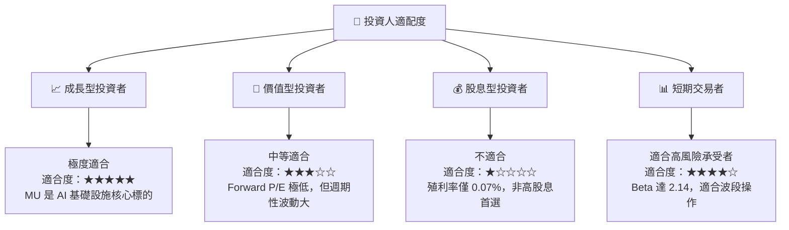

### 10.5 每季財報監控清單（Quarterly Watch List）

為了確保美光的投資邏輯未發生漂移，投資人應在每季財報中追蹤以下關鍵指標：

| 監控指標 | 基準值 (Q3 2026) | 🟢 觸發加碼門檻 | 🔴 觸發減碼/警報門檻 |
|----------|------------------|----------------|----------------------|
| **單季營收** | $41.46B | > $45.00B | < $30.00B（需求放緩） |
| **單季毛利率** | 84.6% | > 85.0% | < 65.0%（定價權流失） |
| **存貨週轉天數 (DIO)** | ~34 天 | < 30 天 | > 60 天（庫存積壓） |
| **資本支出 (Capex)** | $7.83B | $6.0B - $8.5B（健康擴產）| > $11.0B（過度擴產風險） |
| **HBM3E 營收佔比** | ~30% | > 40% | < 20%（技術或良率問題）|

### 10.6 反面論證：什麼會證明本篇多頭論點錯誤

本報告建立在「HBM3E 技術領先與結構性供不應求」的核心假設上。若發生以下情況，本投資論點將宣告失效，投資人應立即重新評估或執行停損：

```
╔══════════════════════════════════════════════════════════════════╗
║              ⚠️ 多頭論點失效條件 (Disconfirming Evidence)         ║
╠══════════════════════════════════════════════════════════════════╣
║  本投資論點在下列情況成立時應重新檢視或果斷退出：                ║
║  ☐ 核心 DRAM 產品均價 (ASP) 連續兩季出現 QoQ 跌幅 > 15%          ║
║  ☐ 美光在 NVIDIA HBM 供應鏈中的份額跌破 15%                      ║
║  ☐ 自由現金流 (FCF) 轉負，且 FCF 轉換率連續三季 < 10%            ║
║  ☐ ROIC 跌破 WACC (13.6%)，公司開始摧毀股東價值                 ║
║  ☐ 美國紐約州 Fab 建設進度延宕超過 12 個月，且預算超支 > 50%     ║
╚══════════════════════════════════════════════════════════════════╝
```

---

> **免責聲明**：本報告為 AI 自動生成，基於公開財務數據進行專業推演，僅供研究參考，不構成任何形式的投資建議。投資有風險，入市需謹慎。