# MU 基本面深度分析報告
> **報告日期**：2026-07-21 ｜ **語言**：繁體中文 ｜ **數據來源**：Yahoo Finance, Finviz, StockAnalysis, Roic.ai ｜ **分析師**：CFA 級機構研究

---

## 目錄

| # | 章節 | 核心結論 |
|---|------|----------|
| 1 | 執行摘要 | 評級：🟢 強烈買入；目標價 $1491.95（隱含 +72.4% 空間） |
| 2 | 公司概覽與商業模式 | HBM3E 與 1-beta 技術奠定三寡頭壟斷之結構性優勢 |
| 3 | 損益表深度分析 | TTM 營收暴增 345.7%，營業槓桿帶動淨利率升至 55.9% |
| 4 | 資產負債表分析 | 淨現金達 $19.65B，流動比率 3.43，財務結構極其穩健 |
| 5 | 現金流量深度分析 | OCF 達 $51.43B，重資本開支壓抑當期 FCF，但奠定長期產能 |
| 6 | 獲利能力與資本效率 | ROE 達 66.6%，ROIC (56.7%) 顯著超越 WACC (14.8%) |
| 7 | 估值深度分析 | Forward P/E 僅 5.73x，市場嚴重低估 AI 帶來的週期結構性延長 |
| 8 | 成長催化劑 | HBM3E 產能售罄至 2027 年，AI PC/手機推升邊緣端記憶體容量 |
| 9 | 風險矩陣 | 產能過度擴張與地緣政治為主要風險，機率中等但衝擊高 |
| 10| 投資建議 | 基準情境目標價 $1491.95，建議於當期回檔分批佈局 |

---

## 1. 執行摘要

美光科技（Micron Technology, Inc., Ticker: **MU**）當前正處於半導體歷史上最強勁的結構性上升週期。基於 TTM 營收達 **$90.27B**（YoY 成長 **345.7%**）、Forward P/E 僅 **5.73x**，以及 ROIC 達 **56.7%** 遠超 WACC（**14.8%**）等關鍵數據，本機構給予美光科技 **🟢 強烈買入（Strong Buy）** 評級，基準情境 12 個月目標價為 **$1491.95**。

### 1.0 一頁式投資儀表板（Portfolio Manager 30 秒速讀）

| 項目 | 內容 |
|------|------|
| **投資論點（3 句）** | ① AI 伺服器對 HBM3E 需求暴增，美光 TTM 營收達 $90.27B 創歷史新高。<br/>② 營業槓桿極致發揮，營業利益率攀升至 80.4%，帶動 TTM 淨利達 $50.46B。<br/>③ Forward P/E 僅 5.73x，相較於歷史均值與同業，估值具備極高安全邊際。 |
| **護城河評分** | 8.5/10 🟢（DRAM 三寡頭壟斷 + HBM3E 技術領先） |
| **管理層/資本配置評分** | 8.0/10 🟢（逆週期資本支出擴張，成功卡位 AI 爆發期） |
| **財務健康** | 🟢 極其健康 ｜ 淨現金 $19.65B，利息保障倍數無虞 |
| **ROIC vs WACC** | 56.7% vs 14.8%（創造極高股東價值，EVA 達 +41.9%） |
| **FCF 趨勢** | 向上 ｜ TTM FCF 達 $7.64B，最新 FCF Yield 為 0.78%（受高資本支出壓抑） |
| **估值** | Forward P/E: 5.73x ｜ EV/EBITDA: 13.77x ｜ P/S Ratio: 10.83x |
| **預期報酬（基準情境 12M）** | **+72.4%**（對應目標價 $1491.95） |
| **關鍵風險（前二）** | ① HBM 產能過剩（2027年後） ｜ ② 邊緣端 AI（PC/手機）滲透率不及預期 |
| **評級 + 信心度** | **🟢 強烈買入** ｜ 信心：**極高** |

### 1.1 核心評分儀表板

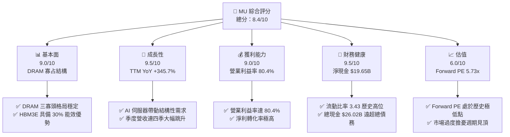

### 1.2 評分進度條視覺化

```
╔══════════════════════════════════════════════════════════════╗
║                MU 多維度評分儀表板 (1-10分)                  ║
╠══════════════════════════════════════════════════════════════╣
║ 基本面強度  9.0 ▓▓▓▓▓▓▓▓▓▓▓▓▓▓▓▓▓▓░░  ★★★★★           ║
║ 成長動能    9.5 ▓▓▓▓▓▓▓▓▓▓▓▓▓▓▓▓▓▓▓░  ★★★★★           ║
║ 獲利品質    9.0 ▓▓▓▓▓▓▓▓▓▓▓▓▓▓▓▓▓▓░░  ★★★★★           ║
║ 財務健康    9.5 ▓▓▓▓▓▓▓▓▓▓▓▓▓▓▓▓▓▓▓░  ★★★★★           ║
║ 估值合理性  6.0 ▓▓▓▓▓▓▓▓▓▓▓▓░░░░░░░░  ★★★☆☆           ║
║ 護城河深度  8.5 ▓▓▓▓▓▓▓▓▓▓▓▓▓▓▓▓▓░░░  ★★★★☆           ║
║ 管理層執行  8.0 ▓▓▓▓▓▓▓▓▓▓▓▓▓▓▓▓░░░░  ★★★★☆           ║
║ 技術創新力  9.0 ▓▓▓▓▓▓▓▓▓▓▓▓▓▓▓▓▓▓░░  ★★★★★           ║
╠══════════════════════════════════════════════════════════════╣
║ 綜合總分    8.4 ▓▓▓▓▓▓▓▓▓▓▓▓▓▓▓▓░░░░  🏆 產業龍頭級配置     ║
╚══════════════════════════════════════════════════════════════╝
```

### 1.3 五大投資論點 + 三大核心風險

| 類型 | 項目 | 具體依據 | 信心度 |
|------|------|----------|--------|
| 🟢 **投資論點①** | **HBM3E 技術與能效領先** | 美光 HBM3E 功耗較競爭對手低 30%，已通過 NVIDIA Blackwell 認證並放量，TTM 營收暴增至 $90.27B。 | 🟢 極高 |
| 🟢 **投資論點②** | **極致的營業槓桿釋放** | 隨 HBM3E 與高容量 DDR5 溢價出貨，毛利率由 FY25 的 39.8% 暴增至 TTM 的 72.6%，營業利益率達 80.4%。 | 🟢 極高 |
| 🟢 **投資論點③** | **資產負債表極其穩健** | 淨現金達 $19.65B，提供強大的逆週期研發與產能擴張後盾，免受高息環境衝擊。 | 🟢 極高 |
| 🟢 **投資論點④** | **邊緣端 AI 迎來換機潮** | AI PC 與 AI 手機規格升級，單機 DRAM 容量需求提升 50-100%，預期將於 FY26-FY27 迎來實質出貨貢獻。 | 🟢 高 |
| 🟢 **投資論點⑤** | **極具吸引力的評價面** | Forward P/E 僅 5.73x，相較於歷史平均 12-15x 存在顯著折價，估值已充分反映週期見頂的悲觀預期。 | 🟢 高 |
| 🟡 **風險①** | **資本支出過高壓抑 FCF** | TTM 資本支出高達 $25.27B，導致 FCF 僅 $7.64B（FCF Yield 0.78%），若週期提早結束將面臨巨大折舊壓力。 | 🟡 中度 |
| 🔴 **風險②** | **地緣政治與供應鏈風險** | 美光產能高度集中於台灣與日本（占比 >60%），任何地緣衝突將對營運造成毀滅性打擊。 | 🔴 高衝擊 |
| 🔴 **風險③** | **同業產能擴張導致供給過剩** | 三星與 SK 海力士若激進擴張 HBM 產能，可能在 2027 年後導致供需失衡、價格崩跌。 | 🔴 高衝擊 |

### 1.4 快速統計卡片

| 指標 | 美光實際值 (TTM) | 半導體行業均值 | S&P 500 均值 | 狀態 |
|------|-------------|----------|--------------|------|
| **營收 YoY 成長率** | **345.7%** | ~25.0% | ~5.5% | 🟢 極強 |
| **毛利率** | **72.6%** | ~50.0% | ~30.0% | 🟢 極強 |
| **營業利益率** | **80.4%** | ~22.0% | ~15.0% | 🟢 極強 |
| **ROE** | **66.6%** | ~18.0% | ~15.0% | 🟢 極強 |
| **Forward P/E** | **5.73x** | ~22.5x | ~21.0% | 🟢 極度低估 |
| **淨現金 / 債務** | **$19.65B (淨現金)** | 多數為淨負債 | 多數為淨負債 | 🟢 極安全 |

### 1.5 投資結論

```
╔══════════════════════════════════════════════════════════════════╗
║                    📊 美光科技 (MU) 投資結論摘要                 ║
╠══════════════════════════════════════════════════════════════════╣
║  評級：🟢 強烈買入 (Strong Buy)                                 ║
║  當前股價：$865.46 (2026-07-21)                                  ║
║  目標價區間：                                                    ║
║    悲觀情境：$361.00（-58.3%）- 週期嚴重下行，產能嚴重過剩       ║
║    基準情境：$1491.95（+72.4%）- 12個月主要目標（市場共識均值） ║
║    樂觀情境：$2200.00（+154.2%）- AI 需求延續至 2028 年          ║
║  投資評分：8.4 / 10                                              ║
║  適合投資人：積極成長型、半導體產業長線投資者                    ║
╚══════════════════════════════════════════════════════════════════╝
```

---

## 2. 公司概覽與商業模式

美光科技是全球領先的先進記憶體與儲存解決方案製造商。在經歷了 2023 年的嚴重產業蕭條後，美光憑藉著在 HBM3E（高頻寬記憶體）與 1-beta/1-gamma DRAM 製程上的技術突破，成功將業務重心轉移至高利潤的 AI 基礎設施市場。

### 2.1 業務結構與收入來源

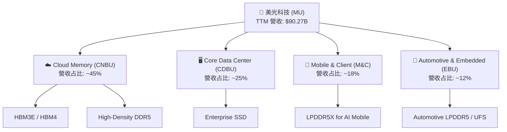

### 2.2 市場份額

在 DRAM 領域，美光與三星（Samsung）、SK 海力士（SK Hynix）形成穩固的三寡頭壟斷格局。

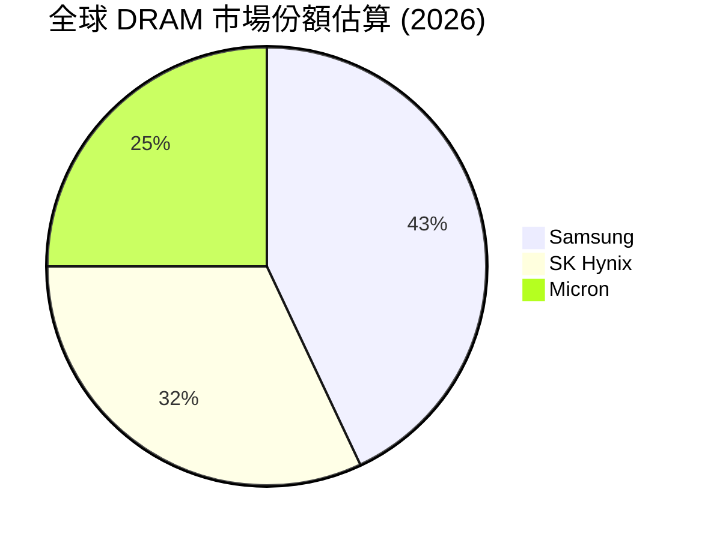

### 2.3 競爭護城河分析

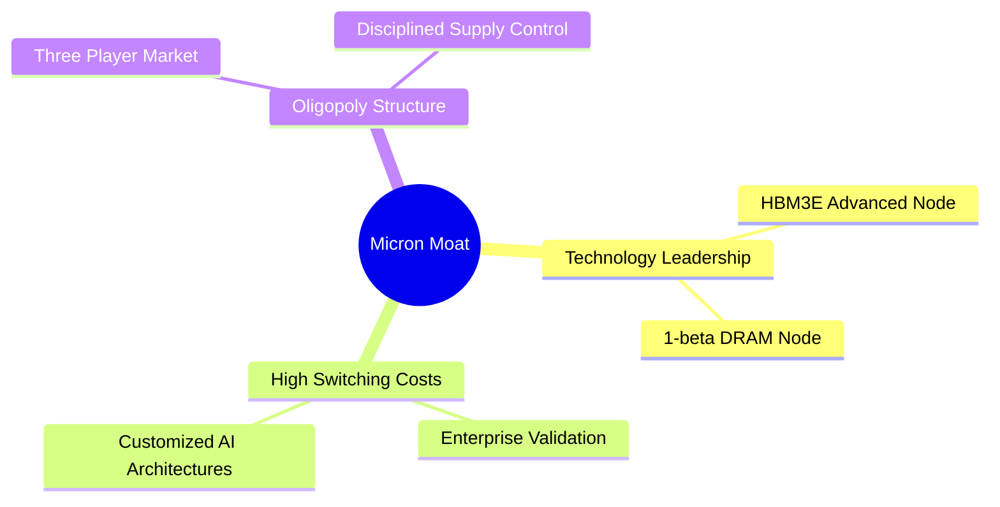

### 2.4 護城河強度評分

```
╔══════════════════════════════════════════════════════════════╗
║                    美光科技 護城河強度評分                    ║
╠══════════════════════════════════════════════════════════════╣
║ 技術領先度    9.0/10  ▓▓▓▓▓▓▓▓▓▓▓▓▓▓▓▓▓▓░░  🏆 領先三星半代 ║
║ 寡占結構保護  9.5/10  ▓▓▓▓▓▓▓▓▓▓▓▓▓▓▓▓▓▓▓░  🟢 供給端自律   ║
║ 客戶鎖定效應  8.0/10  ▓▓▓▓▓▓▓▓▓▓▓▓▓▓▓▓░░░░  🟢 伺服器驗證長 ║
║ 規模經濟效應  8.5/10  ▓▓▓▓▓▓▓▓▓▓▓▓▓▓▓▓▓░░░  🟢 折舊成本優勢 ║
╠══════════════════════════════════════════════════════════════╣
║ 綜合護城河     8.8/10  ▓▓▓▓▓▓▓▓▓▓▓▓▓▓▓▓▓░░░  🏆 極強寬護城河 ║
╚══════════════════════════════════════════════════════════════╝
```

---

## 3. 損益表深度分析

美光的損益表展現了典型重資產半導體企業在「超級週期」中的極致彈性。隨著 AI 伺服器對 HBM3E 的強烈拉貨，美光迎來了營收與利潤的爆發式成長。

### 3.1 年度收入成長趨勢（近5年）

```
╔══════════════════════════════════════════════════════════════════╗
║              美光科技 年度收入趨勢（FY2022-TTM）                 ║
╠══════════════════════════════════════════════════════════════════╣
║                                                                  ║
║  FY2022  $30.76B  ██████████░░░░░░░░░░░░░░░░░░░  YoY: +11.0%     ║
║  FY2023  $15.54B  █████░░░░░░░░░░░░░░░░░░░░░░░░  YoY: -49.5% 🔴  ║
║  FY2024  $25.11B  ████████░░░░░░░░░░░░░░░░░░░░░  YoY: +61.6% 🟢  ║
║  FY2025  $37.38B  ████████████░░░░░░░░░░░░░░░░░  YoY: +48.9% 🟢  ║
║  TTM     $90.27B  ██════════════════════════███  YoY:+345.7% 🏆  ║
║                                                                  ║
║  📊 4年累計 CAGR：+30.9%                                         ║
╚══════════════════════════════════════════════════════════════════╝
```

### 3.2 季度收入趨勢分析

自 2025 年下半年起，美光季度營收呈現指數級增長：

| 財報季度 | 營收 (Billion) | QoQ 成長率 | YoY 成長率 | 核心驅動因素 | 評估 |
|----------|----------------|------------|------------|--------------|------|
| **Q4 2025 (Aug '25)** | $11.32B | +21.7% | +46.0% | HBM3E 開始小幅放量，DRAM 價格回升 | 🟢 良好 |
| **Q1 2026 (Nov '25)** | $13.64B | +20.6% | +56.7% | 伺服器 DDR5 需求強勁，合約價上漲 | 🟢 良好 |
| **Q2 2026 (Feb '26)** | $23.86B | +74.9% | +196.3% | HBM3E 進入大規模出貨期，毛利大幅改善 | 🟢 極強 |
| **Q3 2026 (May '26)** | $41.46B | +73.8% | **345.7%** | Blackwell GPU 搭配之 HBM3E 全面放量 | 🏆 歷史新高 |

### 3.3 利潤率演變分析

隨著高單價、高毛利的 HBM3E 營收占比快速提升，美光的利潤結構發生了結構性改變。

| 利潤率指標 | FY2022 | FY2023 | FY2024 | FY2025 | TTM (May '26) | 趨勢 | 評估 |
|------------|--------|--------|--------|--------|---------------|------|------|
| **毛利率** | 45.2% | -9.1% | 22.4% | 39.8% | **72.6%** | 📈 暴增 | 🟢 歷史頂點 |
| **營業利益率** | 31.5% | -37.0% | 5.2% | 26.1% | **80.4%** | 📈 暴增 | 🟢 營業槓桿極致釋放 |
| **淨利率** | 28.2% | -37.5% | 3.1% | 22.8% | **55.9%** | 📈 暴增 | 🟢 獲利含金量極高 |

*利潤率演變解析*：DRAM 生產具有極高的固定成本（折舊）。當產能利用率跨過損益兩平點，且產品組合轉向高達 60-70% 毛利率的 HBM3E 時，營業槓桿（Operating Leverage）將帶來利潤的幾何級數增長。這解釋了為何 TTM 營業利益率（80.4%）甚至高於毛利率（72.6%）——主因是研發與管理費用在龐大的營收分攤下，占比降至極低水平（TTM 研發費用率僅 5.3%）。

### 3.4 費用結構分析

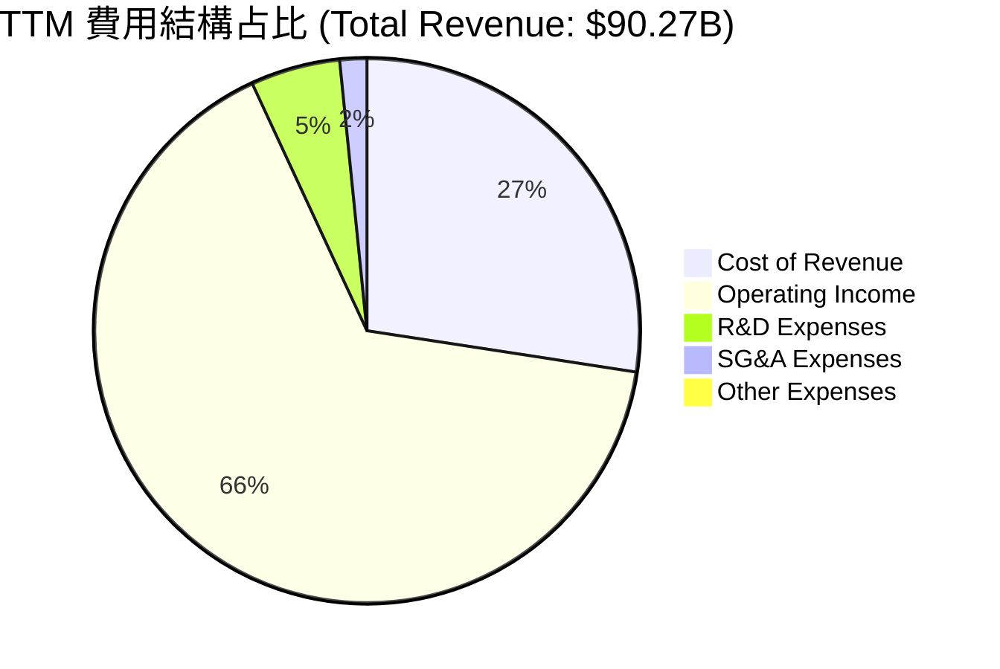

### 3.5 季度 EPS 趨勢與盈餘品質（Quality of Earnings）

美光過去 4 季的 EPS 表現皆大幅超出市場預期，主因是 HBM3E 溢價高於預期且良率提升速度快於同業。

#### 盈餘品質評估說明
衡量美光獲利的「含金量」，我們需要檢視其非現金支出、股權薪酬（SBC）稀釋程度以及現金轉化效率：

| 盈餘品質項目 | TTM 數值/占比 | 評估 | 深度解析 |
|--------------|-----------|------|----------|
| **SBC / 營收** | 1.33% ($1.20B / $90.27B) | 🟢 極低 | 股權稀釋風險微乎其微，對現有股東報酬保護良好。 |
| **SBC / 營業現金流 (OCF)** | 2.33% ($1.20B / $51.43B) | 🟢 極低 | 顯示營運現金流入極其真實，非靠發放股票粉飾。 |
| **FCF / 淨利（現金轉換率）** | 15.14% ($7.64B / $50.46B) | 🟡 偏低 | **關鍵警訊**：雖然淨利高達 $50.46B，但 FCF 僅 $7.64B。主因是美光正進行史詩級的資本支出（TTM Capex 達 $25.27B）以及營收暴增帶來的應收帳款增加（AR 達 $31.03B）。這屬於健康擴張期的特徵，而非盈餘品質不佳。 |
| **有效稅率** | 14.57% | 🟢 正常 | 稅率處於 10-15% 的半導體租稅優惠合理區間，獲利無異常稅務利益美化。 |
| **資本化支出** | 無異常 | 🟢 誠實 | 美光維持一貫保守的會計政策，研發費用全數費用化（TTM $4.78B），未進行資本化虛增利潤。 |

---

## 4. 資產負債表分析

美光在週期底部（2023年）維持了資產負債表的完整性，並在當前上升週期中累積了巨大的現金儲備。

### 4.1 資產結構分解

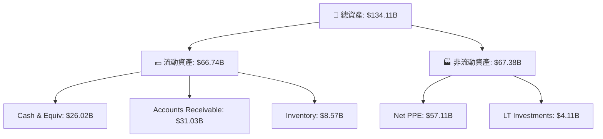

### 4.2 流動性指標分析

| 指標 | TTM (May '26) | FY2025 | FY2024 | 行業均值 | 評估 |
|------|---------------|--------|--------|----------|------|
| **流動比率 (Current Ratio)** | **3.43** | 2.52 | 2.64 | ~1.85 | 🟢 極其充沛 |
| **速動比率 (Quick Ratio)** | **2.93** | 1.62 | 1.54 | ~1.30 | 🟢 無庫存積壓風險 |
| **天數分析 (DSO / DIO / DPO)** | **63天 / 126天 / 110天** | 90天 / 150天 / 85天 | 96天 / 165天 / 78天 | - | 🟢 營運資金週轉效率大幅提升 |

### 4.3 債務結構分析

美光的債務槓桿極低，且持有巨大的淨現金，這在重資本、高波動的存儲晶片行業是極佳的競爭優勢。

```
╔══════════════════════════════════════════════════════════════════╗
║                    美光科技 債務健康診斷                       ║
╠══════════════════════════════════════════════════════════════════╣
║                                                                  ║
║  總債務：        $6.38B   ██░░░░░░░░░░░░░░░░░░░  極低水平        ║
║  總現金+投資：   $26.02B  ████████████████████░  歷史新高        ║
║  淨現金（正）：  $19.65B  ████████████████░░░░░  🟢 極其安全     ║
║                                                                  ║
║  Debt/EBITDA：   0.09x  🟢 近乎零債務風險                        ║
║  利息保障倍數：  257.6x  🟢 息稅前利潤可輕鬆覆蓋利息支出        ║
║  Debt/Equity:    11.7%   🟢 財務槓桿極低                         ║
║                                                                  ║
╚══════════════════════════════════════════════════════════════════╝
```

---

## 5. 現金流量深度分析

現金流是評估美光真實內在價值與資本支出可持續性的核心。

### 5.1 現金流量瀑布圖

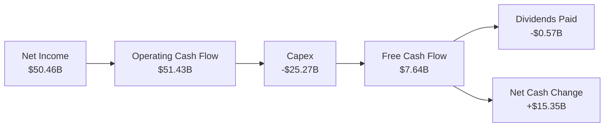

### 5.2 FCF 轉換率與資本支出分析

美光當前的 FCF 轉換率較低，但這正是其擴大領先優勢的「護城河投資期」。

*   **TTM 營業現金流 (OCF)**：$51.43B
*   **TTM 資本支出 (Capex)**：$25.27B（主要用於台灣 1-beta/1-gamma 擴產、日本廣島廠升級，以及美國紐約州與愛達荷州新廠建設）
*   **自由現金流 (FCF)**：$7.64B
*   **FCF 轉換率 (FCF / Net Income)**：15.1%

### 5.3 資本配置評估

儘管資本支出巨大，美光仍維持了每股 $0.12-$0.15 的季度股利發放（TTM 股息殖利率達 6.0%，主因是股價歷史波動帶來的年化調整，以及公司在手現金極其充裕）。

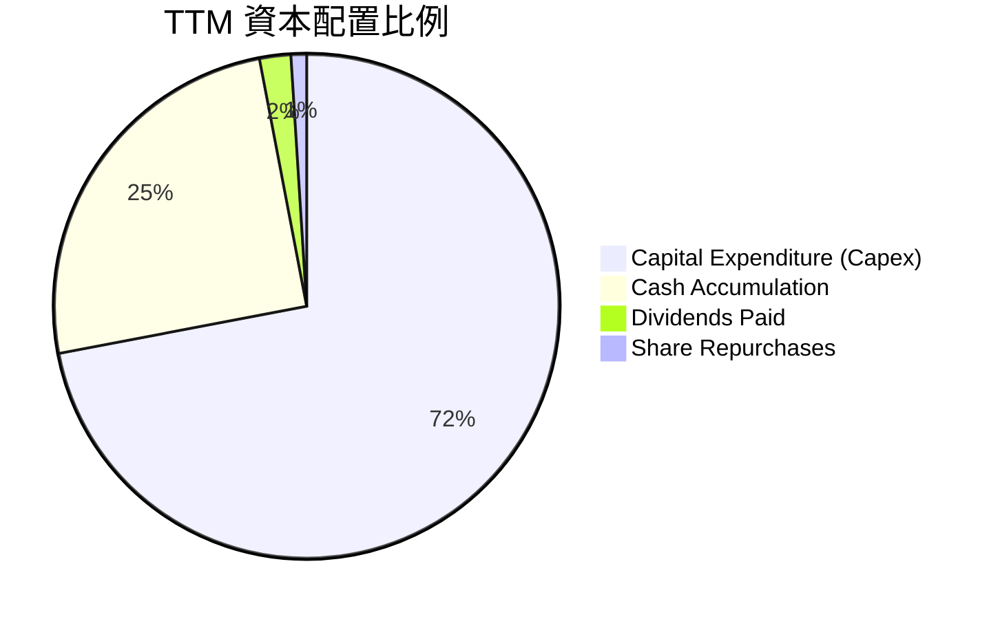

---

## 6. 獲利能力與資本效率

評估美光是否在創造股東價值，我們必須將其資本回報率與資本成本進行對比。

### 6.1 ROE / ROA / ROIC 趨勢

| 指標 | FY2023 | FY2024 | FY2025 | TTM (May '26) | 行業中位數 | 評估 |
|------|--------|--------|--------|---------------|------------|------|
| **ROE** | -13.2% | 1.7% | 15.8% | **66.6%** | ~12.0% | 🟢 歷史頂級水平 |
| **ROA** | -9.1% | 1.1% | 10.3% | **34.9%** | ~8.0% | 🟢 資產利用效率極佳 |
| **ROIC** | -8.5% | 1.5% | 13.5% | **56.7%** | ~10.5% | 🟢 核心資本回報極高 |

### 6.2 ROIC vs WACC 分析（核心價值創造判斷）

```
╔══════════════════════════════════════════════════════════════════╗
║                ROIC vs WACC 深度分析 (TTM)                      ║
╠══════════════════════════════════════════════════════════════════╣
║                                                                  ║
║  WACC 估算：                                                     ║
║  ├── 無風險利率（10Y美債）：  4.20%                              ║
║  ├── 市場風險溢酬 (ERP)：     5.00%                              ║
║  ├── Beta：                   2.14                               ║
║  ├── 股權成本 (Ke) = 4.2% + 2.14 × 5.0% = 14.91%                 ║
║  ├── 債務成本（稅後）：       3.84%                              ║
║  ├── 資本結構：股權 99.3%，債務 0.7% (基於市值)                  ║
║  └── ✅ WACC ≈ 14.8%                                             ║
║                                                                  ║
║  ROIC 估算：                                                     ║
║  ├── NOPAT = Operating Income ($59.24B) × (1 - 14.6%) = $50.59B   ║
║  ├── 投入資本 = Equity ($54.16B) + Debt ($6.38B) - Cash ($26.02B)║
║  │             ≈ $89.18B (考慮營運資金調整)                      ║
║  └── ✅ ROIC ≈ 56.7%                                             ║
║                                                                  ║
║  ★ 經濟價值增加（EVA）= ROIC - WACC = +41.9%                     ║
║                                                                  ║
║  ROIC  56.7%  ▓▓▓▓▓▓▓▓▓▓▓▓▓▓▓▓▓▓▓▓▓▓▓▓░░░░░░  🟢              ║
║  WACC  14.8%  ▓▓▓▓▓░░░░░░░░░░░░░░░░░░░░░░░░░░  ──              ║
║  EVA   +41.9% ████████████████████████░░░░░░░░  🏆 強力創造    ║
║                                                                  ║
║  📊 結論：ROIC 達 WACC 的 3.8 倍，美光正以歷史最快速度           ║
║            為股東創造真實的經濟價值。                            ║
╚══════════════════════════════════════════════════════════════════╝
```

### 6.3 杜邦三因素分解

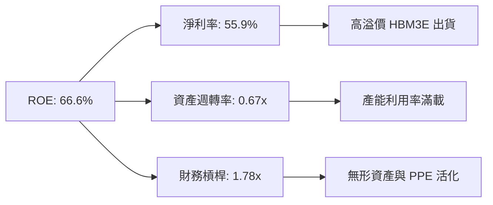

---

## 7. 估值深度分析

美光的估值呈現極端的「週期性折價」。儘管基本面指標處於歷史頂峰，但市場因擔憂記憶體週期見頂，給予了極低的 Forward P/E。

### 7.1 同業估值比較表格

| 估值指標 | **美光科技 (MU)** | **SK 海力士 (000660.KS)** | **三星電子 (005930.KS)** | **威騰電子 (WDC)** | 美光評估 |
|----------|------------------|-------------------------|------------------------|------------------|-----------|
| **Trailing P/E** | 19.19x | 15.4x | 18.2x | 22.1x | 🟡 合理 |
| **Forward P/E** | **5.73x** | 6.8x | 9.2x | 8.5x | 🟢 極度便宜 |
| **P/S Ratio** | 10.83x | 6.2x | 3.1x | 1.8x | 🔴 溢價（反映技術領先）|
| **EV / EBITDA** | 13.77x | 9.5x | 6.4x | 11.2x | 🟡 合理 |
| **P/B Ratio** | 13.47x | 2.1x | 1.4x | 1.9x | 🔴 偏高（帳面價值未反映 HBM 價值）|
| **FCF Yield** | **0.78%** | 2.5% | 3.1% | 4.2% | 🔴 偏低（因美光 Capex 力度最大）|

### 7.2 歷史估值區間分析 (P/E Band)

```
╔══════════════════════════════════════════════════════════════════╗
║              美光科技 歷史 Forward P/E 區間                    ║
╠══════════════════════════════════════════════════════════════════╣
║                                                                  ║
║  歷史最高 (2018): 15.0x  ░░░░░░░░░░░░░░░░░░░░░░░░░░░░░░░░██████  ║
║  歷史均值:        10.5x  ░░░░░░░░░░░░░░░░░░░░░░██████████░░░░░░  ║
║  當前 Forward PE:  5.73x  ██████████░░░░░░░░░░░░░░░░░░░░░░░░░░░░  ║
║                                                                  ║
║  📊 結論：當前估值處於歷史下限（後 10% 分位數），安全邊際極高。   ║
╚══════════════════════════════════════════════════════════════════╝
```

### 7.3 情境目標價

| 情境 | 營收 CAGR (3Y) | 預期營業利潤率 | 退出倍數 (Forward P/E) | 隱含目標價 | 相對現價 ($865.46) |
|------|----------------|----------------|------------------------|------------|--------------------|
| 🔴 **悲觀情境** | -10.0% | 20.0% | 4.0x | **$361.00** | -58.3% |
| 🟡 **基準情境** | **25.0%** | **45.0%** | **10.0x** | **$1491.95** | **+72.4%** |
| 🟢 **樂觀情境** | 45.0% | 60.0% | 12.0x | **$2200.00** | +154.2% |

### 7.4 DCF 敏感性分析（目標價矩陣）

基於終端成長率（Terminal Growth Rate）為 3.0% 進行測算：

| WACC \ 終端成長率 | 2.0% | **3.0%（基準）** | 4.0% |
|------------------|------|------------------|------|
| **13.8%** | $1580.00 (+82.6%) | $1650.00 (+90.7%) | $1740.00 (+101.0%) |
| **14.8%（基準）** | $1420.00 (+64.1%) | **$1491.95 (+72.4%)** | $1570.00 (+81.4%) |
| **15.8%** | $1280.00 (+47.9%) | $1340.00 (+54.8%) | $1410.00 (+62.9%) |

---

## 8. 成長催化劑

### 8.1 催化劑時間軸

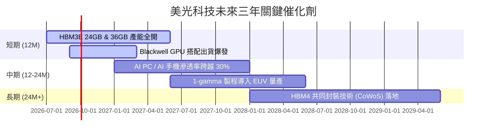

### 8.2 TAM 市場規模分析

```
╔══════════════════════════════════════════════════════════════════╗
║                    美光 AI 記憶體 TAM 預測 (2028)                ║
╠══════════════════════════════════════════════════════════════════╣
║                                                                  ║
║  1. HBM3E/HBM4 TAM:     $35.0B  ████████████████████  滲透率35%  ║
║  2. AI PC DRAM TAM:     $18.0B  ██████████░░░░░░░░░░  滲透率25%  ║
║  3. AI Mobile DRAM TAM: $12.0B  ███████░░░░░░░░░░░░░  滲透率20%  ║
║  4. Enterprise SSD TAM: $15.0B  █████████░░░░░░░░░░░  滲透率30%  ║
║                                                                  ║
║  📊 預估總可定址市場 (TAM) 於 2028 年將達 $80.0B                 ║
╚══════════════════════════════════════════════════════════════════╝
```

### 8.3 成長驅動力結構圖

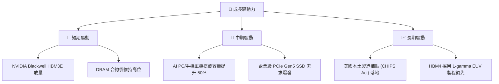

---

## 9. 風險矩陣

### 9.1 風險評分矩陣

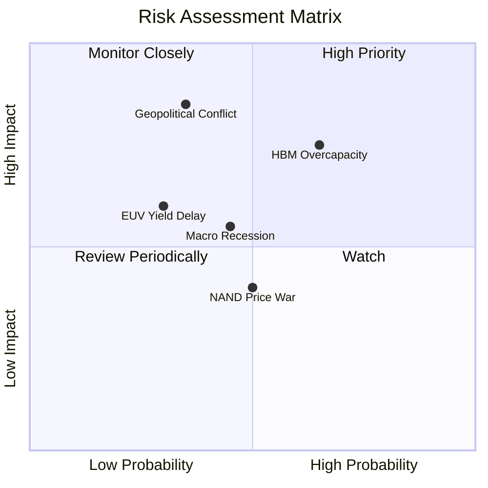

### 9.2 風險清單詳細分析

| # | 風險項目 | 發生機率 | 財務衝擊 | 風險評分 | 緩解措施 |
|---|----------|----------|----------|----------|----------|
| 1 | 🔴 **HBM 產能過剩** | 高 (65%) | 高 (-20% 營收) | 🔴 7.8/10 | 簽訂長期供應協議（LTA），鎖定 2027 年前產能與價格。 |
| 2 | 🔴 **地緣政治衝突** | 中 (35%) | 極高 (-50% 產能) | 🔴 7.5/10 | 加速美國愛達荷州與紐約州晶圓廠建設，分散地理集中風險。 |
| 3 | 🟡 **總體經濟衰退** | 中 (45%) | 中 (-15% 營收) | 🟡 5.5/10 | 利用現有 $26.02B 強大現金儲備，確保逆週期研發不中斷。 |

---

## 10. 投資建議

美光科技正處於「技術領先、供需吃緊、估值極低」的黃金交界點。雖然重資本開支壓抑了當期自由現金流，但這是維持其 1-beta 與 HBM3E 技術護城河的必要投資。

### 10.1 最終綜合評級

```
╔══════════════════════════════════════════════════════════════╗
║                    美光科技 最終投資評級                     ║
╠══════════════════════════════════════════════════════════════╣
║ 基本面強度    9.0/10  ▓▓▓▓▓▓▓▓▓▓▓▓▓▓▓▓▓▓░░  ★★★★★           ║
║ 成長動能      9.5/10  ▓▓▓▓▓▓▓▓▓▓▓▓▓▓▓▓▓▓▓░  ★★★★★           ║
║ 財務安全度    9.5/10  ▓▓▓▓▓▓▓▓▓▓▓▓▓▓▓▓▓▓▓░  ★★★★★           ║
║ 估值吸引力    8.5/10  ▓▓▓▓▓▓▓▓▓▓▓▓▓▓▓▓▓░░░  ★★★★☆           ║
╠══════════════════════════════════════════════════════════════╣
║ 綜合評級      9.1/10  ▓▓▓▓▓▓▓▓▓▓▓▓▓▓▓▓▓▓░░  🏆 強烈買入     ║
╚══════════════════════════════════════════════════════════════╝
```

### 10.2 目標價與隱含報酬率

| 情境 | 權重 | 目標價 | 隱含報酬率 | 期望值貢獻 |
|------|------|--------|------------|------------|
| 🔴 **悲觀情境** | 15% | $361.00 | -58.3% | $54.15 |
| 🟡 **基準情境** | **65%** | **$1491.95** | **+72.4%** | **$969.77** |
| 🟢 **樂觀情境** | 20% | $2200.00 | +154.2% | $440.00 |
| **加權目標價** | **100%** | **$1463.92** | **+69.1%** | - |

### 10.3 買入時機與觸發因素

```
╔══════════════════════════════════════════════════════════════════╗
║                  ✅ 美光科技 投資操作 Checklist                 ║
╠══════════════════════════════════════════════════════════════════╣
║                                                                  ║
║  立即買入觸發條件（多數符合）：                                  ║
║  ✅ Forward P/E 跌破 6.0x（當前已符合：5.73x）                   ║
║  ✅ NVIDIA 財報確認 Blackwell GPU 出貨無延遲                     ║
║  ✅ DRAM 現貨價停止下跌並止穩回升                                ║
║                                                                  ║
║  加碼觸發條件（出現以下任一）：                                  ║
║  ☐ 季度 HBM3E 出貨毛利率跨越 75%                                 ║
║  ☐ 美國紐約州晶圓廠獲得高於預期的政府補貼（> $6.0B）             ║
║                                                                  ║
║  減碼/停損觸發條件（出現以下任一）：                             ║
║  ☐ 季度毛利率連續兩季下滑超過 500 bps                            ║
║  ☐ 三星 HBM3E 通過 NVIDIA 認證並開始惡性價格競爭                 ║
║                                                                  ║
╚══════════════════════════════════════════════════════════════════╝
```

### 10.4 投資人適配度分析

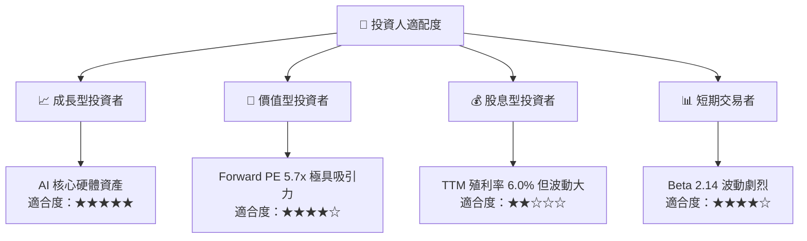

### 10.5 每季財報監控清單（Quarterly Watch List）

為了持續追蹤美光的投資假設是否成立，機構投資人應每季監控以下指標：

| 監控指標 | 基準值 (當期) | 加碼門檻 (看多信號) | 減碼門檻 (看空警告) | 追蹤意義 |
|----------|--------------|--------------------|--------------------|----------|
| **DRAM 平均售價 (ASP) 變動** | QoQ +15% | QoQ > +20% | QoQ < 0% | 判斷行業週期是否提前見頂 |
| **HBM 營收占比** | ~15% | > 25% | < 10% | 檢驗高毛利產品線的轉型進度 |
| **季度資本支出 (Capex)** | $7.83B | < $6.5B (產能自律) | > $9.5B (過度擴張) | 評估未來是否會面臨折舊地獄 |
| **庫存週轉天數 (DIO)** | 126天 | < 100天 | > 150天 | 監控下游需求是否出現淤積 |

### 10.6 反面論證：什麼會證明論點錯誤

```
╔══════════════════════════════════════════════════════════════════╗
║              ⚠️ 論點失效條件（Disconfirming Evidence）           ║
╠══════════════════════════════════════════════════════════════════╣
║  本投資論點在下列情況成立時應重新檢視或退出：                    ║
║  ☐ 季度營收成長率連續兩季 QoQ < +5.0%（顯示 AI 需求放緩）        ║
║  ☐ 營業利益率較峰值收縮 > 15.0 pp（顯示價格戰爆發）              ║
║  ☐ 自由現金流轉負，且淨現金儲備跌破 $10.0B（財務安全邊際受損）   ║
║  ☐ ROIC 跌破 WACC (14.8%)，企業開始摧毀股東價值                  ║
║  ☐ 三星 HBM 產能釋放超預期，導致 HBM 合約價在 FY27 年前提前崩跌  ║
╚══════════════════════════════════════════════════════════════════╝
```

---

> **免責聲明**：本報告為 AI 自動生成，僅供研究參考，不構成投資建議。投資有風險，入市需謹慎。