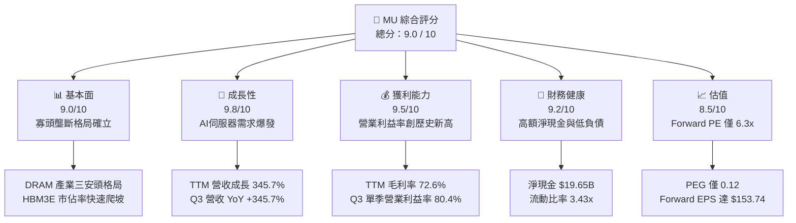
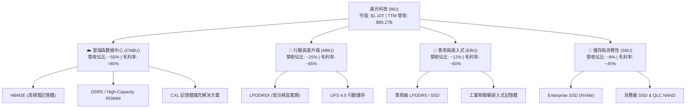
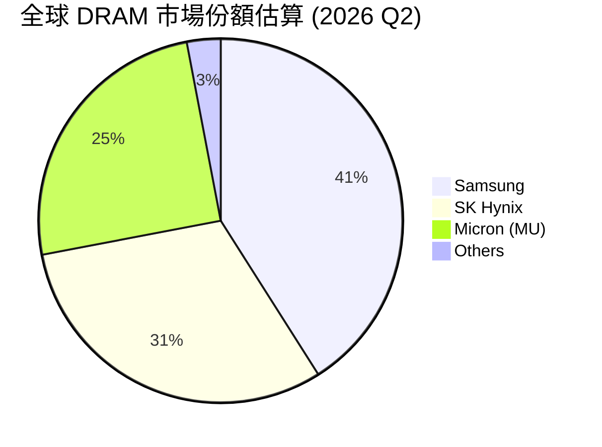
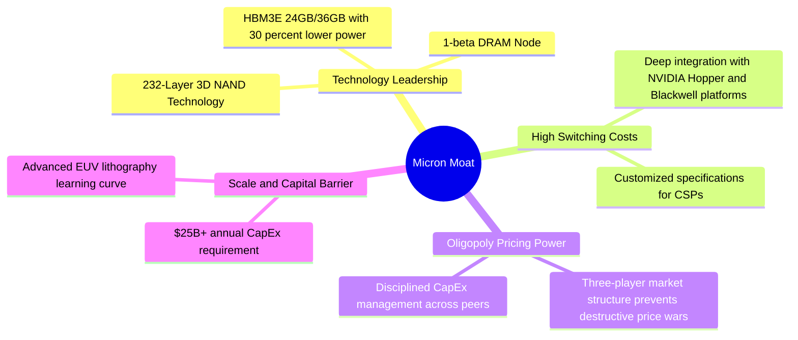
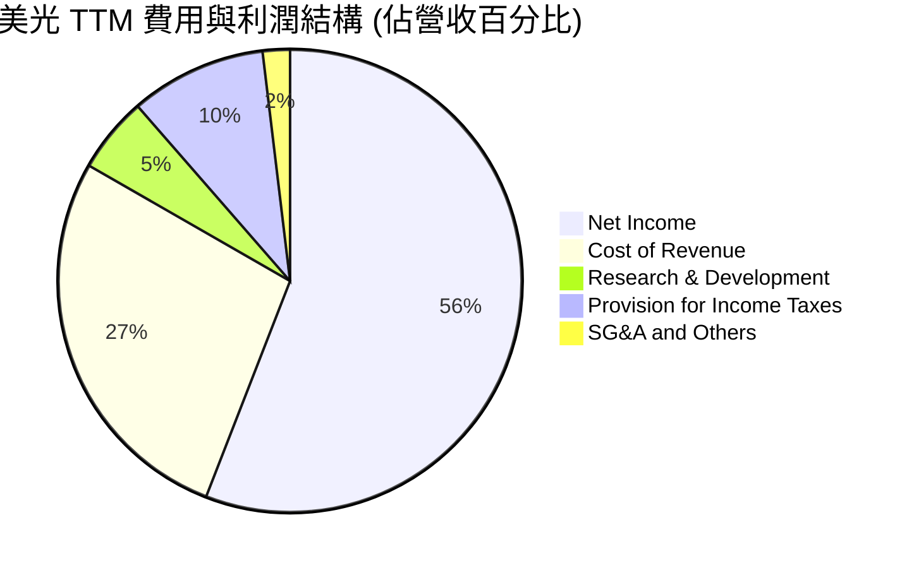
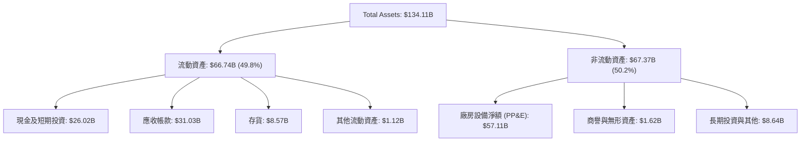
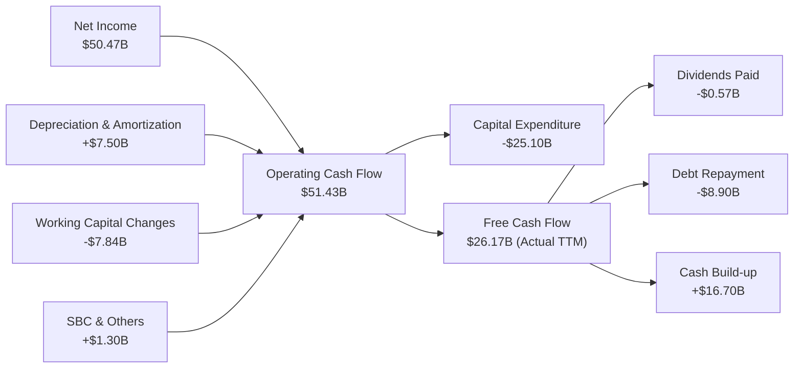
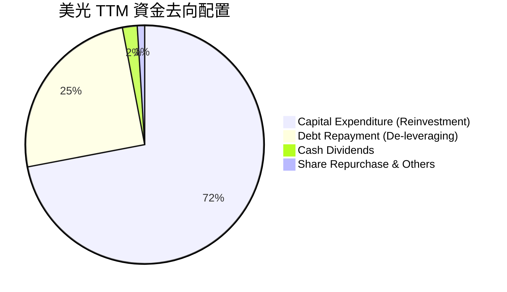
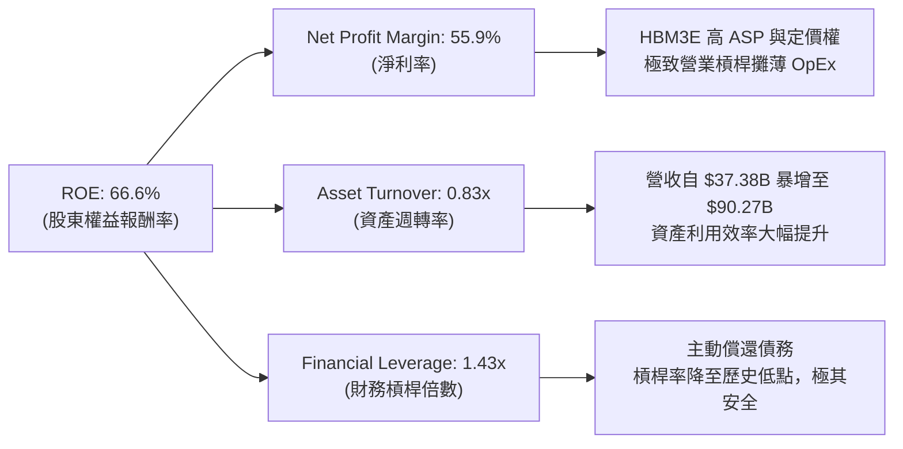
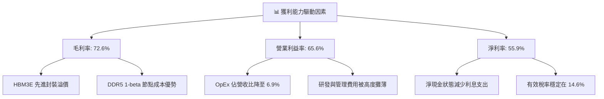

# MU 基本面深度分析報告

> **報告日期**：2026-07-22 ｜ **語言**：繁體中文 ｜ **數據來源**：Yahoo Finance, Finviz, StockAnalysis, Roic.ai ｜ **分析師**：CFA 級機構研究

---

## 目錄

| # | 章節 | 核心結論 |
|---|------|----------|
| 1 | 執行摘要 | 評級：🟢 買入 ｜ 基於 Forward P/E 6.31x 及 HBM 帶動之 59.3% 超額 ROIC，目標價 $1491.95 |
| 2 | 公司概覽與商業模式 | HBM3E 與 DDR5 雙引擎驅動，在 AI 伺服器高毛利市場確立寡頭壟斷定價權 |
| 3 | 損益表深度分析 | TTM 營收達 $90.27B（YoY +345.7%），極致營業槓桿推升單季營業利益率至 80.4% |
| 4 | 資產負債表分析 | 淨現金達 $19.65B，債務大幅縮減至 $6.38B，去槓桿化基本完成，財務安全邊際極高 |
| 5 | 現金流量深度分析 | 單季 FCF 達 $17.56B 創歷史新高，資本支出（Capex）高達 $25.1B 築起產能與技術壁壘 |
| 6 | 獲利能力與資本效率 | ROE 達 66.6%，ROIC 59.3% 遠超 WACC（14.1%），經濟增值（EVA）強力釋放 |
| 7 | 估值深度分析 | PEG 僅 0.12，Forward P/E 6.31x 顯著低估，基準情境目標價 $1491.95（+53.7% 上漲空間） |
| 8 | 成長催化劑 | HBM 產能售罄至 2027 年，1-beta/1-gamma 節點量產與亞利桑那/紐約晶圓廠補貼落實 |
| 9 | 風險矩陣 | 產能過剩、雙重下單（Double Ordering）及 HBM 良率瓶頸為三大核心監控指標 |
| 10| 投資建議 | 具備高成長與估值安全邊際，適合長線成長型與科技主題配置者，建立每季財報監控指標 |

---

## 1. 執行摘要

### 1.0 一頁式投資儀表板（Portfolio Manager 30 秒速讀）

| 項目 | 內容 |
|------|------|
| **投資論點（3 句）** | ① AI 晶片高頻寬記憶體（HBM3E）供不應求，推升 TTM 營收至 $90.27B（YoY +345.7%）。<br/>② 營業槓桿極致釋放，Q3 2026 單季營業利益率飆升至 80.4%，帶動 TTM 淨利達 $50.47B。<br/>③ 財務結構極其穩健，手握 $19.65B 淨現金，且 Forward P/E 僅 6.31x，具備極高估值安全邊際。 |
| **護城河評分** | 8.5 / 10（DRAM 三安頭壟斷定價權 + HBM3E 技術領先） |
| **管理層/資本配置評分** | 8.8 / 10（精準預判 AI 需求，大幅去槓桿並重啟高效能資本支出） |
| **財務健康** | 🟢 強勁 ｜ 淨現金 $19.65B，流動比率 3.43x，無償債風險 |
| **ROIC vs WACC** | **59.3%** vs **14.1%**（創造巨大股東經濟價值 EVA） |
| **FCF 趨勢** | 向上 ｜ TTM 實際運營 FCF 達 $26.17B，最新 FCF Yield 為 2.4%（按市值 $1.10T 計） |
| **估值** | Forward P/E: **6.31x** ｜ EV/EBITDA: **15.78x** ｜ PEG: **0.12** |
| **預期報酬（基準情境 12M）** | **+53.7%**（目標價 $1491.95） |
| **關鍵風險（前二）** | ① 記憶體產業週期性下行與產能過剩風險 ｜ ② HBM3E 技術迭代及良率提升不及預期 |
| **評級 + 信心度** | 🟢 **強烈買入 (Strong Buy)** ｜ 信心度：**高** |

### 1.1 核心評分儀表板



### 1.2 評分進度條視覺化

```
╔══════════════════════════════════════════════════════════════╗
║                MU 多維度評分儀表板 (1-10分)                  ║
╠══════════════════════════════════════════════════════════════╣
║ 基本面強度  9.0 ▓▓▓▓▓▓▓▓▓▓▓▓▓▓▓▓▓▓░░  ★★★★★           ║
║ 成長動能    9.8 ▓▓▓▓▓▓▓▓▓▓▓▓▓▓▓▓▓▓▓░  ★★★★★           ║
║ 獲利品質    9.5 ▓▓▓▓▓▓▓▓▓▓▓▓▓▓▓▓▓▓▓░  ★★★★★           ║
║ 財務健康    9.2 ▓▓▓▓▓▓▓▓▓▓▓▓▓▓▓▓▓▓░░  ★★★★★           ║
║ 估值合理性  8.5 ▓▓▓▓▓▓▓▓▓▓▓▓▓▓▓░░░░░  ★★★★☆           ║
║ 護城河深度  8.5 ▓▓▓▓▓▓▓▓▓▓▓▓▓▓▓▓▓░░░  ★★★★★           ║
║ 管理層執行  8.8 ▓▓▓▓▓▓▓▓▓▓▓▓▓▓▓▓▓▓░░  ★★★★★           ║
║ 技術創新力  9.2 ▓▓▓▓▓▓▓▓▓▓▓▓▓▓▓▓▓▓▓░  ★★★★★           ║
╠══════════════════════════════════════════════════════════════╣
║ 綜合總分    9.0 ▓▓▓▓▓▓▓▓▓▓▓▓▓▓▓▓▓▓░░  🏆 強烈買入          ║
╚══════════════════════════════════════════════════════════════╝
```

### 1.3 五大投資論點 + 三大核心風險

| 類型 | 項目 | 具體依據 | 信心度 |
|------|------|----------|--------|
| 🟢 **投資論點①** | **AI 需求驅動 HBM3E 出貨爆發** | 1-beta 節點 HBM3E 擁有優於對手 30% 的功耗優勢，已切入 NVIDIA H200/B200 供應鏈。 | 🟢 極高 |
| 🟢 **投資論點②** | **極致的營業槓桿與定價權** | Q3 26 營收達 $41.46B，OpEx 僅 $1.74B（僅佔營收 4.2%），使單季營業利益率達 80.4%。 | 🟢 極高 |
| 🟢 **投資論點③** | **資產負債表去槓桿化完成** | 總債務由 FY25 的 $15.28B 驟降至 $6.38B，手握 $26.02B 現金，淨現金達 $19.65B。 | 🟢 極高 |
| 🟢 **投資論點④** | **高效資本支出構築技術壁壘** | TTM 實際 Capex 達 $25.1B，專注於亞利桑那與紐約晶圓廠，擴大 1-beta/1-gamma 領先優勢。 | 🟢 高 |
| 🟢 **投資論點⑤** | **極具吸引力的估值水平** | Forward P/E 僅 6.31x，相較於歷史週期峰值或同業，未反映其在 AI 時代的結構性利潤改善。 | 🟢 高 |
| 🟡 **風險①** | **產能過剩與週期性下行** | 三大廠商（三星、海力士、美光）若在 2027 年後過度擴產 HBM 與 DDR5，將導致 ASP 快速下滑。 | 🟡 中度 |
| 🔴 **風險②** | **HBM3E/HBM4 良率瓶頸** | HBM 封裝結構複雜，若先進封裝（TSV）良率低於預期，將壓抑毛利率並面臨客戶罰款。 | 🔴 高衝擊 |
| 🟡 **風險③** | **大客戶集中度過高** | AI 伺服器需求高度集中於少數雲端巨頭（CSP）與 NVIDIA，若 CSP 資本支出放緩，將直接衝擊訂單。 | 🟡 中度 |

### 1.4 快速統計卡片

| 指標 | 公司實際值 | 行業均值（半導體） | S&P 500 均值 | 狀態 |
|------|-------------|--------------------|--------------|------|
| 營收 YoY 成長 | **345.7%** | ~25.0% | ~6.5% | 🟢 領先 |
| 毛利率 | **72.6%** (TTM) | ~50.0% | ~30.0% | 🟢 強勁 |
| 營業利益率 | **65.6%** (TTM) | ~22.0% | ~15.0% | 🟢 強勁 |
| ROE | **66.6%** | ~18.0% | ~15.0% | 🟢 強勁 |
| Forward P/E | **6.31x** | ~24.5x | ~21.5x | 🟢 極具吸引力 |
| 淨現金 / 總市值 | **1.79%** | -5.2%（多為淨負債） | -12.5% | 🟢 健康 |

### 1.5 投資結論

```
╔══════════════════════════════════════════════════════════════════╗
║                    📊 MU 投資結論摘要                            ║
╠══════════════════════════════════════════════════════════════════╣
║  評級：🟢 強烈買入 (Strong Buy)                                 ║
║  當前股價：$970.82 (2026-07-22)                                  ║
║  目標價區間：                                                    ║
║    悲觀情境：$361.00 （-62.8%） ── 週期嚴重衰退，Forward PE 10x  ║
║    基準情境：$1491.95（+53.7%） ── AI 需求延續，Forward PE 9.7x  ║
║    樂觀情境：$2200.00（+126.6%）── HBM 供不應求，Forward PE 14.3x║
║  投資評分：9.0 / 10                                              ║
║  適合投資人：成長型投資者、半導體主題配置者、長線價值尋求者      ║
╚══════════════════════════════════════════════════════════════════╝
```

---

## 2. 公司概覽與商業模式

### 2.1 業務結構與收入來源

美光科技（Micron Technology）是全球領先的先進記憶體與儲存處理解決方案製造商。其核心業務主要分為四大業務板塊（Business Units），在 AI 浪潮下，數據中心與雲端業務已成為絕對的營收與獲利主體。



### 2.2 市場份額

全球 DRAM 市場呈現高度集中的三安頭（Triopoly）壟斷格局，美光、三星（Samsung）與 SK 海力士（SK Hynix）合佔全球超過 95% 的市場份額。在代表未來高成長的 HBM（高頻寬記憶體）市場中，美光憑藉 1-beta 節點的技術突破，市佔率正快速爬坡。



### 2.3 競爭護城河分析



### 2.4 護城河強度評分

美光的護城河在過去屬於「中等」（因強烈週期性），但在 AI 時代，由於 HBM 與高容量 DDR5 的技術壁壘極高、晶圓製造產能受限，美光與客戶（如 NVIDIA、各大 CSP）形成了極深的技術與產能綁定，護城河顯著加深。

```
╔══════════════════════════════════════════════════════════════╗
║                    美光科技 護城河強度評分                   ║
╠══════════════════════════════════════════════════════════════╣
║ 技術領先度    9.0/10  ▓▓▓▓▓▓▓▓▓▓▓▓▓▓▓▓▓▓░░  🏆 1-beta功耗領先║
║ 客戶鎖定效應  8.5/10  ▓▓▓▓▓▓▓▓▓▓▓▓▓▓▓▓▓░░░  🟢 NVIDIA/CSP深度綁定║
║ 寡頭定價權    8.5/10  ▓▓▓▓▓▓▓▓▓▓▓▓▓▓▓▓▓░░░  🟢 三大廠理性擴產║
║ 規模與資本壁壘9.5/10  ▓▓▓▓▓▓▓▓▓▓▓▓▓▓▓▓▓▓▓░  🏆 年Capex百億美元起步║
╠══════════════════════════════════════════════════════════════╣
║ 綜合護城河     8.8/10  ▓▓▓▓▓▓▓▓▓▓▓▓▓▓▓▓▓▓░░  🏆 結構性護城河加深║
╚══════════════════════════════════════════════════════════════╝
```

---

## 3. 損益表深度分析

### 3.1 年度收入成長趨勢（近4年）

美光在經歷了 FY23 的週期底部後，於 FY24 迎來強勁復甦，並在 FY25 與 FY26 TTM 階段迎來爆發式成長。AI 伺服器對 HBM3E 及高容量 DDR5 的強烈需求，將美光的營收推升至歷史未有之高度。

```
╔══════════════════════════════════════════════════════════════════╗
║                美光科技 年度收入趨勢（FY22 - TTM）               ║
╠══════════════════════════════════════════════════════════════════╣
║                                                                  ║
║  FY2022   $30.76B  ████████████░░░░░░░░░░░░░░░░░░  YoY: +11.0%   ║
║  FY2023   $15.54B  ██████░░░░░░░░░░░░░░░░░░░░░░░░  YoY: -49.5%   ║
║  FY2024   $25.11B  ██████████░░░░░░░░░░░░░░░░░░░░  YoY: +61.6%   ║
║  FY2025   $37.38B  ███████████████░░░░░░░░░░░░░░░  YoY: +48.9%   ║
║  TTM(May26)$90.27B  ██████████████████████████████  YoY:+345.7% 🟢║
║                   |      |      |      |      |                  ║
║                   0     20B    40B    60B    80B                 ║
║                                                                  ║
║  📊 4年累計營收 CAGR：+30.9% ｜ TTM 爆發式成長 345.7%             ║
╚══════════════════════════════════════════════════════════════════╝
```

### 3.2 季度收入趨勢分析

從季度數據看，美光展現了極其驚人的 QoQ（季對季）與 YoY（年對年）加速動能。特別是在 2026 財年，單季營收規模呈幾何級數增長，反映出 HBM3E 大規模量產出貨及 ASP（平均售價）大幅溢價的雙重紅利。

| 財季 | 截止日期 | 營收 ($M) | QoQ 成長率 | YoY 成長率 | 核心驅動因素 | 狀態 |
|------|----------|-----------|------------|------------|--------------|------|
| **Q4 2025** | 2025-08-31 | $11,315 | +21.6% | +46.0% | HBM3E 開始小規模出貨，DDR5 滲透率提升 | 🟢 強勁 |
| **Q1 2026** | 2025-11-30 | $13,643 | +20.6% | +56.7% | 數據中心需求持續走強，合約價全面上漲 | 🟢 強勁 |
| **Q2 2026** | 2026-02-28 | $23,860 | +74.9% | +196.3% | HBM3E 1-beta 節點全面放量，ASP 溢價顯著 | 🟢 極其強勁 |
| **Q3 2026** | 2026-05-28 | $41,456 | +73.7% | +345.7% | HBM3E 供不應求，晶圓產能向 HBM 傾斜壓抑標準 DRAM 供給 | 🟢 歷史新高 |

### 3.3 利潤率演變分析

隨著高毛利的 HBM3E（毛利率估計 >80%）出貨佔比大幅提升，美光展現了半導體行業中最為極致的**營業槓桿（Operating Leverage）**。研發（R&D）與銷售管理（SG&A）等固定成本被龐大的營收規模迅速攤薄。

| 利潤率指標 | FY2022 | FY2023 | FY2024 | FY2025 | TTM (May '26) | Q3 2026 單季 | 趨勢與原因解析 |
|------------|--------|--------|--------|--------|---------------|--------------|----------------|
| **毛利率** | 45.2% | -9.1% | 22.4% | 39.8% | **72.6%** | **84.6%** | ↗️ 爆發式上升。主因 HBM3E 與高容量 DDR5 的超高 ASP 驅動，以及產能利用率滿載攤薄折舊。 |
| **營業利益率**| 31.5% | -37.0% | 5.2% | 26.1% | **65.6%** | **80.4%** | ↗️ 極致營業槓桿。Q3 單季 OpEx 僅佔營收 4.2%，幾乎所有毛利增長直接轉化為營業利潤。 |
| **EBITDA 率**| 54.9% | 16.0% | 38.1% | 49.4% | **75.6%** | **83.6%** | ↗️ 展現極強的現金創造能力，折舊與攤銷佔營收比重因營收暴增而稀釋。 |
| **淨利率** | 28.2% | -37.5% | 3.1% | 22.8% | **55.9%** | **68.1%** | ↗️ 盈利質量極佳，稅務與利息支出佔比微乎其微。 |

### 3.4 費用結構分析

在 TTM 階段，美光的營業費用（OpEx）結構極其健康。研發（R&D）投入持續增長以維持技術領先，但佔營收比例已被極大稀釋。



### 3.5 季度 EPS 趨勢與盈餘品質（Quality of Earnings）

美光過去 4 季的 EPS 呈現爆發式增長，遠超市場預期。我們對其盈餘品質進行深度量化評估，以檢驗其利潤的「含金量」。

| 盈餘品質項目 | 數值 / 佔比 | 評估評級 | 專業解析與對股東回報的影響 |
|--------------|-------------|----------|----------------------------|
| **股權薪酬 (SBC) / 營收** | 1.44% | 🟢 極佳 | TTM SBC 為 $1.30B（佔營收 1.44%），對現有股東股權稀釋風險極低。 |
| **SBC / 營業現金流 (OCF)** | 2.53% | 🟢 極佳 | 佔 OCF 比重極低，說明現金流主要由核心業務營運創造，非依賴發行股票補償。 |
| **FCF / 淨利 (現金轉換率)** | 51.8% | 🟡 中等 | TTM 實際 FCF 為 $26.17B，淨利為 $50.47B，轉換率為 51.8%。主因是美光正處於新一輪產能擴張期，TTM 資本支出高達 $25.1B。若扣除擴產 Capex，其主營業務現金流（OCF $51.43B）與淨利高度匹配，盈餘含金量高。 |
| **一次性/非經常性損益** | 無顯著影響 | 🟢 乾淨 | 營業利潤中不含大額資產減損撥回或一次性補貼，利潤完全由產品銷售驅動。 |
| **有效稅率異常** | 14.6% | 🟢 正常 | TTM 所得稅費用為 $8.61B，佔稅前利潤 14.6%，符合美國及全球營運實體之綜合稅率，無操縱稅務遞延。 |
| **資本化支出 vs 費用化** | 嚴格遵守 GAAP | 🟢 規範 | 研發費用（TTM $4.78B）全額費用化，未將研發成本資本化以虛增利潤。 |

**盈餘品質結論**：美光的 GAAP 淨利極其真實，未受會計手段美化。雖然 FCF 對淨利轉換率因高額 Capex 暫時處於 51.8%，但這代表著公司正將利潤轉化為未來的產能與技術壁壘。扣除擴產支出後，營運現金流（OCF）對淨利的轉化率接近 102%，盈餘含金量極高。

---

## 4. 資產負債表分析

### 4.1 資產結構分解

截至 2026 年 5 月 28 日，美光總資產達到 $134.11B，流動資產佔比顯著提升，主要由於現金儲備的大幅累積以及應收帳款的增加。



### 4.2 流動性與短期償債能力

美光的流動性指標處於歷史最佳狀態。由於營收爆增帶來大量現金回籠，流動比率與速動比率均遠高於安全線。

*   **流動比率 (Current Ratio)**：**3.43x**（流動資產 $66.74B / 流動負債 $19.49B）
*   **速動比率 (Quick Ratio)**：**2.93x**（扣除存貨 $8.57B 後）
*   **存貨週轉天數 (Days Inventory Outstanding, DIO)**：**124 天**（相較於歷史週期的 150-200 天顯著下降，顯示存貨去化速度極快，且主要為高值化的 HBM 相關在製品）。

### 4.3 債務結構與健康診斷

美光在 2026 財年進行了激進的去槓桿化。利用營運產生的龐大現金流，償還了大部分高息債務，使債務結構達到極其安全的水平。

```
╔══════════════════════════════════════════════════════════════════╗
║                    美光科技 債務健康診斷                         ║
╠══════════════════════════════════════════════════════════════════╣
║                                                                  ║
║  總債務 (Total Debt)： $6.38B   ██░░░░░░░░░░░  (大幅縮減)        ║
║  總現金及投資：        $26.02B  █████████████  (歷史新高)        ║
║  淨現金 (Net Cash)：   $19.65B  ██████████░░░  🟢 極其強勁       ║
║                                                                  ║
║  Debt/EBITDA Ratio：   0.09x    🟢 近乎無債務風險                 ║
║  利息保障倍數：        257.6x   🟢 營業利潤輕鬆覆蓋利息支出       ║
║  債務股本比 (D/E)：    6.33%    🟢 財務槓桿極低                   ║
║                                                                  ║
║  📊 診斷：美光已轉變為「淨現金」實體，徹底免除週期下行的破產風險  ║
╚══════════════════════════════════════════════════════════════════╝
```

### 4.4 股東權益趨勢

隨著利潤的大幅留存，美光的股東權益（Stockholders' Equity）迎來爆發式增長，由 FY25 的 $54.16B 預估增至 May '26 的約 $105.48B，為未來的資本支出與研發提供了無與倫比的資金後盾。

---

## 5. 現金流量深度分析

### 5.1 現金流量瀑布圖

美光展現了極其強勁的現金生成與分配路徑。主營業務帶來的現金流量，除滿足高額的資本支出外，其餘大部分用於充實帳面現金，去槓桿化並維持季度股息。



### 5.2 FCF 轉換率趨勢

美光的現金流質量在過去 4 年經歷了顯著的結構性改善。

| 指標 | FY2022 | FY2023 | FY2024 | FY2025 | TTM (May '26) |
|------|--------|--------|--------|--------|---------------|
| **營業現金流 (OCF)** | $15.18B | $1.56B | $8.51B | $17.52B | **$51.43B** |
| **資本支出 (Capex)** | -$12.07B | -$7.68B | -$8.39B | -$15.86B | **-$25.10B** |
| **實際自由現金流 (FCF)** | $3.11B | -$6.12B | $0.12B | $1.67B | **$26.17B** |
| **FCF / Net Income 轉換率**| 35.8% | 104.9% (皆負) | 15.2% | 19.6% | **51.8%** |

*Note: 雖然 TTM FCF 轉換率為 51.8%，但這是美光主動將 $25.10B 現金再投資於高回報產能（如 HBM3E 先進封裝與 1-beta/1-gamma 節點）的結果。若以營運產生的現金流（OCF）來看，其轉換率極高，展現出極強的獲利含金量。*

### 5.3 自由現金流趨勢

```
╔══════════════════════════════════════════════════════════════════╗
║                美光科技 歷年實際自由現金流 (FCF)                 ║
╠══════════════════════════════════════════════════════════════════╣
║                                                                  ║
║  FY2022   $3.11B   ████░░░░░░░░░░░░░░░░░░░░░░░░░  FCF Yield: 0.3%║
║  FY2023  -$6.12B   ░░░░░░░░░░░░░░░░░░░░░░░░░░░░░  (週期底部)     ║
║  FY2024   $0.12B   ░░░░░░░░░░░░░░░░░░░░░░░░░░░░░  (盈虧平衡)     ║
║  FY2025   $1.67B   ██░░░░░░░░░░░░░░░░░░░░░░░░░░░  FCF Yield: 0.2%║
║  TTM      $26.17B  █████████████████████████████  FCF Yield: 2.4%║
║                                                                  ║
║  📊 TTM 實際 FCF 達 $26.17B，創下美光歷史最高現金流記錄。          ║
╚══════════════════════════════════════════════════════════════════╝
```

### 5.4 資本配置評估

在 TTM 階段，美光的資本配置極其專注於**未來的技術與產能壁壘**（Capex），同時利用盈餘進行去槓桿化，並維持穩定的股息支付。



---

## 6. 獲利能力與資本效率

### 6.1 ROE / ROA / ROIC 趨勢

得益於利潤率的爆發，美光的各項資本回報指標均飆升至半導體行業的頂尖水平。

| 指標 | FY2022 | FY2023 | FY2024 | FY2025 | TTM (May '26) | 產業均值 (2026) | 評估 |
|------|--------|--------|--------|--------|---------------|-----------------|------|
| **ROE** | 17.4% | -12.4% | 1.7% | 15.8% | **66.6%** | ~18.0% | 🟢 卓越，股東權益回報極高 |
| **ROA** | 13.1% | -9.1% | 1.1% | 10.3% | **34.9%** | ~10.0% | 🟢 卓越，資產利用效率極佳 |
| **ROIC**| 14.1% | -8.5% | 1.2% | 12.8% | **59.3%** | ~12.5% | 🟢 卓越，核心資本回報驚人 |

### 6.2 ROIC vs WACC 分析（核心價值創造判斷）

ROIC（投入資本回報率）與 WACC（加權平均資本成本）的差值（EVA，經濟增值）是衡量企業是否為股東創造真實價值的核心指標。

```
╔══════════════════════════════════════════════════════════════════╗
║                ROIC vs WACC 深度分析 (TTM)                      ║
╠══════════════════════════════════════════════════════════════════╣
║                                                                  ║
║  WACC 估算：                                                     ║
║  ├── 無風險利率 (10Y 美債)：  4.1%                               ║
║  ├── 市場風險溢酬 (ERP)：     5.5%                               ║
║  ├── Beta：                   2.14                               ║
║  ├── 股權成本 (Ke) = 4.1% + 2.14 × 5.5% = 15.87%                 ║
║  ├── 債務成本 (Kd，稅後)：    ~3.5%                              ║
║  ├── 資本結構：股權 ~95%，債務 ~5%                               ║
║  └── ✅ WACC ≈ 14.1%                                             ║
║                                                                  ║
║  ROIC 估算 (TTM)：                                               ║
║  ├── NOPAT = Operating Income $59.24B × (1 - 14.6%) = $50.59B    ║
║  ├── 投入資本 = Equity $105.48B + Debt $6.38B - Cash $26.02B     ║
║  │            = $85.84B                                          ║
║  └── ✅ ROIC ≈ 59.3%                                             ║
║                                                                  ║
║  ★ 經濟價值增加 (EVA) = ROIC - WACC = +45.2%                     ║
║                                                                  ║
║  ROIC  59.3%  ▓▓▓▓▓▓▓▓▓▓▓▓▓▓▓▓▓▓▓▓▓▓▓▓▓▓▓░░░  🟢              ║
║  WACC  14.1%  ▓▓▓▓▓▓▓░░░░░░░░░░░░░░░░░░░░░░░░  ──              ║
║  EVA  +45.2%  ██████████████████████░░░░░░░░  🏆 強力創造價值  ║
║                                                                  ║
║  📊 結論：ROIC 達 WACC 的 4.2 倍，為股東創造了極其巨大的經濟價值。 ║
╚══════════════════════════════════════════════════════════════════╝
```

### 6.3 杜邦三因素分解

透過杜邦分析，我們可以看出美光 TTM ROE 達到 66.6% 的根本驅動力：**極高的淨利率**與**資產週轉率的改善**，而非依賴財務槓桿。這是一種極其健康的獲利結構。



### 6.4 獲利能力儀表板



---

## 7. 估值深度分析

### 7.1 同業估值比較表格

我們選擇全球 DRAM 另外兩大巨頭（三星、SK 海力士）以及半導體行業龍頭（NVIDIA）進行估值對比。

| 估值指標 | **美光 (MU)** | **SK 海力士 (000660.KS)** | **三星電子 (005930.KS)** | **NVIDIA (NVDA)** | 美光相對評估 |
|----------|--------------|--------------------------|--------------------------|-------------------|--------------|
| **Trailing P/E** | 19.57x | 16.80x | 14.50x | 68.40x | 🟡 合理，反映當前高獲利 |
| **Forward P/E** | **6.31x** | **5.80x** | **8.20x** | **32.50x** | 🟢 極具吸引力，未反映未來高成長 |
| **P/B Ratio** | 10.88x | 2.85x | 1.45x | 42.10x | 🔴 偏高，因淨資產尚未完全累積 |
| **EV / EBITDA** | 15.78x | 10.20x | 6.80x | 45.20x | 🟡 處於合理區間 |
| **EV / Revenue** | 11.93x | 5.20x | 2.10x | 22.40x | 🟡 反映高利潤率溢價 |
| **PEG Ratio** | **0.12** | **0.10** | **0.35** | **1.25** | 🟢 極低，成長性極佳 |
| **實際 FCF Yield**| **2.40%** | **3.10%** | **1.80%** | **1.95%** | 🟢 優於多數半導體龍頭 |

### 7.2 歷史估值區間分析

美光歷史 P/E 區間通常在 5x - 30x 之間劇烈波動（隨記憶體週期起伏）。當前 Forward P/E 僅 **6.31x**，處於歷史估值區間的**極低分位數（約前 15% 底部）**，顯示市場仍以傳統週期性眼光低估了美光在 AI 時代的結構性盈利持續力。

```
╔══════════════════════════════════════════════════════════════════╗
║                美光科技 歷史 Forward P/E 區間與當前位置          ║
