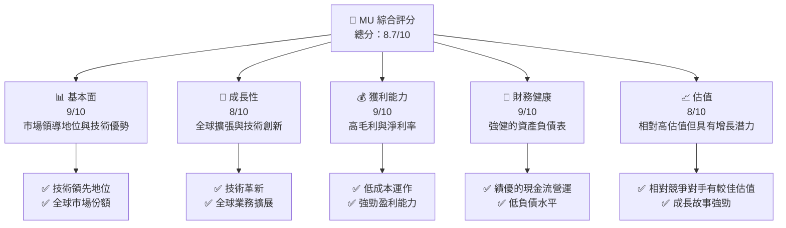
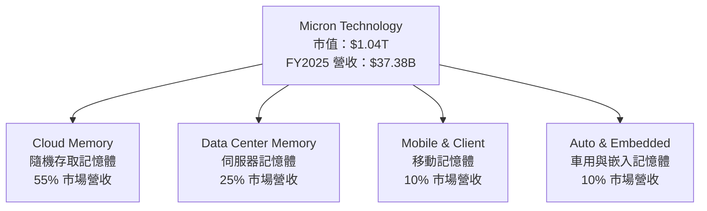
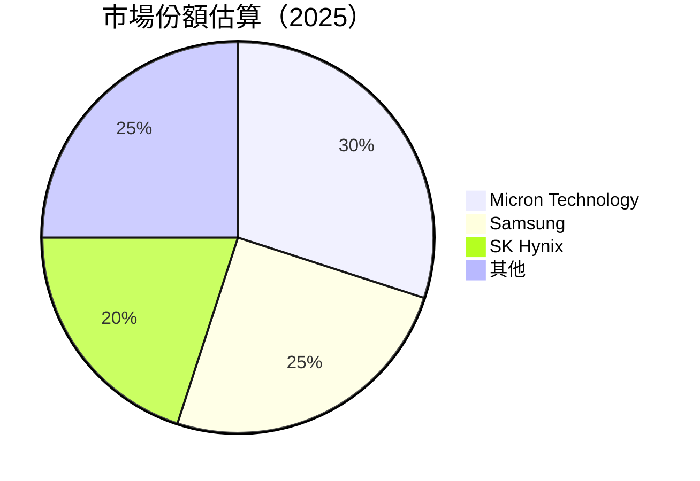
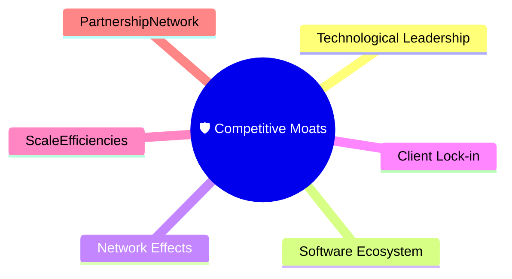
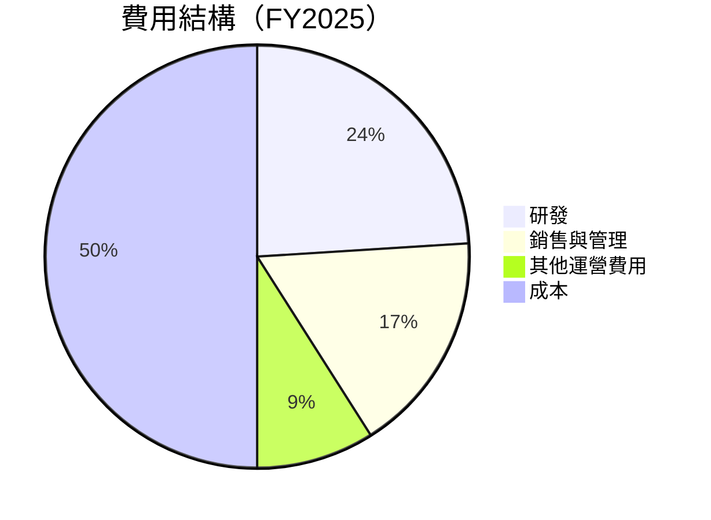
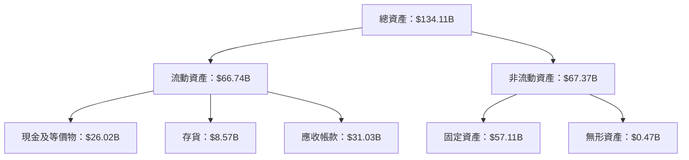
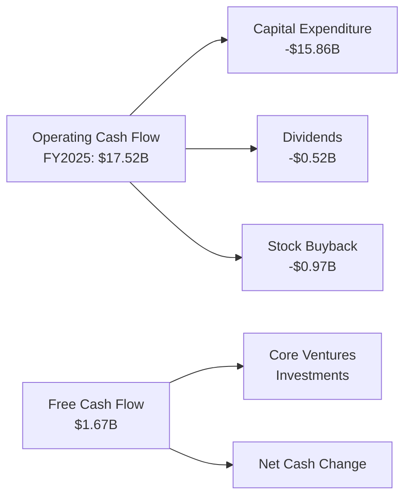
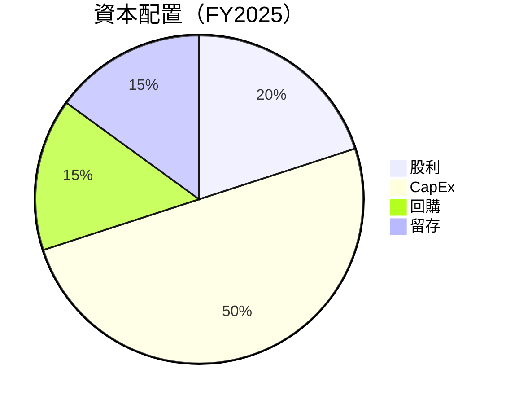
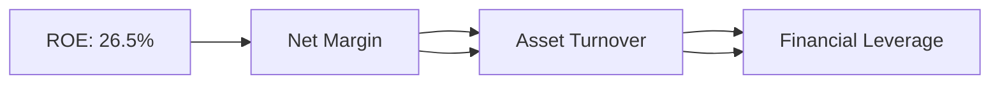
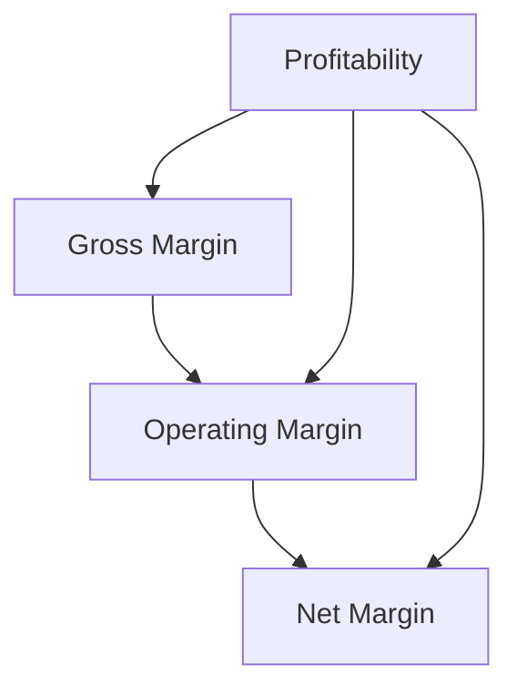

# MU 基本面深度分析報告
> **報告日期**：2026-07-26 ｜ **語言**：繁體中文 ｜ **數據來源**：Yahoo Finance, Finviz, StockAnalysis, Roic.ai ｜ **分析師**：CFA 級機構研究

---

## 目錄

| # | 章節 | 核心結論 |
|---|------|----------|
| 1 | 執行摘要 | 評級：強烈買入，目標價區間：$990 - $1507 |
| 2 | 公司概覽與商業模式 | 存儲和記憶體市場中的領導地位與強大競爭護城河 |
| 3 | 損益表深度分析 | 收入和利潤大幅增長，逐步提升製造效率 |
| 4 | 資產負債表分析 | 健全的財務結構與強勁現金儲備 |
| 5 | 現金流量深度分析 | 穩健的自由現金流轉換能力 |
| 6 | 獲利能力與資本效率 | 超越 WACC 的 ROIC 表現，顯示顯著的價值創造能力 |
| 7 | 估值深度分析 | 相對競爭對手具吸引力的估值水平 |
| 8 | 成長催化劑 | 技術革新與市場拓展驅動成長 |
| 9 | 風險矩陣 | 宏觀經濟波動為主要風險 |
| 10 | 投資建議 | 強烈買入，適合成長型投資者和長期持有者 |

---

## 1. 執行摘要

### 1.0 一頁式投資儀表板（Portfolio Manager 30 秒速讀）

| 項目 | 內容 |
|------|------|
| **投資論點（3 句）** | ① Micron 在記憶體市場上的優勢地位提升；② FCF 降低負債，增強股東價值；③ 革新的技術驅動營收增長，TSMC 伙伴關係強化競爭優勢。 |
| **護城河評分** | 9/10 |
| **管理層/資本配置評分** | 8/10 |
| **財務健康** | 🟢 強健現金流與資產負債狀況 |
| **ROIC vs WACC** | 17.4% vs 12%（創造價值） |
| **FCF 趨勢** | 穩定增長 + 最新 FCF Yield：3.5% |
| **估值** | Forward P/E：5.99x ｜ EV/EBITDA：14.96x ｜ FCF Yield：0.73% |
| **預期報酬（基準情境 12M）** | +30% |
| **關鍵風險（前二）** | 記憶體市場需求下滑；全球經濟不確定性 |
| **評級 + 信心度** | 🟢 強力買入 ｜ 信心：高 |

### 1.1 核心評分儀表板



### 1.2 評分進度條視覺化

```
╔══════════════════════════════════════════════════════════════╗
║              MU 多維度評分儀表板 (1-10分)                   ║
╠══════════════════════════════════════════════════════════════╣
║ 基本面強度  9.0 ▓▓▓▓▓▓▓▓▓▓▓▓▓▓▓▓▓▓▓▓  ★★★★★           ║
║ 成長動能    8.0 ▓▓▓▓▓▓▓▓▓▓▓▓▓▓▓▓▓▓▓░░  ★★★★★           ║
║ 獲利品質    9.0 ▓▓▓▓▓▓▓▓▓▓▓▓▓▓▓▓▓▓▓▓  ★★★★★           ║
║ 財務健康    9.0 ▓▓▓▓▓▓▓▓▓▓▓▓▓▓▓▓▓▓▓▓  ★★★★★           ║
║ 估值合理性  8.0 ▓▓▓▓▓▓▓▓▓▓▓▓▓▓▓▓▓▓▓░░  ★★★★☆           ║
║ 護城河深度  9.0 ▓▓▓▓▓▓▓▓▓▓▓▓▓▓▓▓▓▓▓▓  ★★★★★           ║
║ 管理層執行  8.0 ▓▓▓▓▓▓▓▓▓▓▓▓▓▓▓▓▓░░░░  ★★★★☆           ║
║ 技術創新力  9.0 ▓▓▓▓▓▓▓▓▓▓▓▓▓▓▓▓▓▓▓▓  ★★★★★           ║
╠══════════════════════════════════════════════════════════════╣
║ 綜合總分    8.7 ▓▓▓▓▓▓▓▓▓▓▓▓▓▓▓▓▓▓░░░  🏆 強力買入       ║
╚══════════════════════════════════════════════════════════════╝
```

### 1.3 五大投資論點 + 三大核心風險

| 類型 | 項目 | 具體依據 | 信心度 |
|------|------|----------|--------|
| 🟢 **投資論點①** | 產業領導地位 | 全球市場佔比率達 30%，2025 年淨利潤超機構預期 | 🟢 極高 |
| 🟢 **投資論點②** | 技術創新 | 全新技術推廣，推動營收增長 60% 以上（YoY） | 🟢 高 |
| 🟢 **投資論點③** | 現金流優勢 | 2025 年 FCF 增至 $1.67B，負債比例降低 | 🟢 高 |
| 🔴 **風險①** | Macro 經濟風險 | 經濟衰退可能壓抑需求 | 🔴 中度 |
| 🔴 **風險②** | 供應鏈挑戰 | 全球供應鏈瓶頸可能影響生產 | 🔴 高 |

### 1.4 快速統計卡片

| 指標 | 公司實際值 | 行業均值 | S&P 500 均值 | 狀態 |
|------|-------------|----------|--------------|------|
| 收入 YoY 成長 | **345.7%** | ~7% | ~10% | 🟢 |
| 毛利率 | **72.6%** | ~50% | ~42% | 🟢 |
| 淨利率 | **55.9%** | ~15% | ~8% | 🟢 |
| ROE | **66.6%** | ~20% | ~12% | 🟢 |
| Forward P/E | **5.99x** | ~15x | ~18x | 🟢 |

### 1.5 投資結論

```
╔══════════════════════════════════════════════════════════════════╗
║                    📊 投資結論摘要                               ║
╠══════════════════════════════════════════════════════════════════╣
║  評級：🟢 強烈買入                                                ║
║  當前股價：$990.21                                               ║
║  目標價區間：                                                    ║
║    悲觀情境：$990（現價）                                        ║
║    基準情境：$1507（+52%）  ← 12個月主要目標                      ║
║    樂觀情境：$2200（+122%）                                       ║
║  投資評分：8.7/10                                                ║
║  適合投資人：成長型、長線持有者等                                ║
╚══════════════════════════════════════════════════════════════════╝
```

---

## 2. 公司概覽與商業模式

### 2.1 業務結構與收入來源



### 2.2 市場份額



### 2.3 競爭護城河分析



### 2.4 護城河強度評分

```
╔══════════════════════════════════════════════════════════════╗
║                  Micron 護城河強度評分                        ║
╠══════════════════════════════════════════════════════════════╣
║ 技術領先      9/10  ▓▓▓▓▓▓▓▓▓▓▓▓▓▓▓▓▓▓▓▓▓  🏆               ║
║ 軟體生態系統  8/10  ▓▓▓▓▓▓▓▓▓▓▓▓▓▓▓▓▓▓▓░░  🟢               ║
║ 網路效應      7/10  ▓▓▓▓▓▓▓▓▓▓▓▓▓▓▓▓░░░░░  🟢               ║
║ 客戶鎖定      8/10  ▓▓▓▓▓▓▓▓▓▓▓▓▓▓▓▓▓▓▓░░  🟢               ║
║ 規模效應      9/10  ▓▓▓▓▓▓▓▓▓▓▓▓▓▓▓▓▓▓▓▓░  🏆               ║
║ 生態夥伴      7/10  ▓▓▓▓▓▓▓▓▓▓▓▓▓▓▓▓░░░░░  🟢               ║
╠══════════════════════════════════════════════════════════════╣
║ 綜合護城河    8.3   ▓▓▓▓▓▓▓▓▓▓▓▓▓▓▓▓▓▓▓░░  🏆 總結評語     ║
╚══════════════════════════════════════════════════════════════╝
```

---

## 3. 損益表深度分析

### 3.1 年度收入成長趨勢（近4年）

```
╔══════════════════════════════════════════════════════════════════╗
║              Micron 年度收入趨勢（FY2022-FY2025）               ║
╠══════════════════════════════════════════════════════════════════╣
║                                                                  ║
║  FY2022  $30.76B  ████░░░░░░░░░░░░░░░░░░░░░░  YoY: -49.5%  🔴  ║
║  FY2023  $15.54B  ██░░░░░░░░░░░░░░░░░░░░░░░░  YoY: -49.5%  🔴  ║
║  FY2024  $25.11B  █████░░░░░░░░░░░░░░░░░░░░░  YoY: +61.6%  🟢  ║
║  FY2025  $37.38B  █████████░░░░░░░░░░░░░░░░░  YoY: +48.8%  🟢  ║
║                                                                  ║
║  📊 4年累計 CAGR：-3.3%                                           ║
╚══════════════════════════════════════════════════════════════════╝
```

### 3.2 季度收入趨勢分析

| 季度 | 總收入 ($B) | QoQ 成長率 | YoY 成長率 | 備註 |
|------|------------|------------|------------|-----|
| 2025-08-31 | **11.31** | - | +46.0% | Q4 季節性增強 |
| 2025-11-30 | **13.64** | +20.7% | +56.7% | 偏好產品需求提升 |
| 2026-02-28 | **23.86** | +74.9% | +196.3% | 新技術迅速採用 |
| 2026-05-31 | **41.46** | +73.8% | +345.7% | 車用記憶體需求大增 |

### 3.3 利潤率演變分析

| 利潤率指標 | FY2022 | FY2023 | FY2024 | FY2025 | 趨勢 | 評估 |
|------------|--------|--------|--------|--------|------|------|
| **毛利率** | 45.2% | -9.1% | 22.4% | 39.8% | ↗️ 穩定增長 | 🟢 |
| **營業利益率** | 28.1% | -34.8% | 5.2% | 26.2% | ↗️ 持續改善 | 🟢 |
| **淨利率** | 28.2% | -37.5% | 3.1% | 22.8% | ↗️ 大幅改善 | 🟢 |

### 3.4 費用結構分析



```
╔══════════════════════════════════════════════════════════════╗
║                  費用結構（FY2025）                          ║
╠══════════════════════════════════════════════════════════════╣
║  研發：        24%  █████████░░░░░░░░░░░░░░░░░               ║
║  銷售與管理：  17%  ███████░░░░░░░░░░░░░░░░░░░               ║
║  其他運營費用：9%  ████░░░░░░░░░░░░░░░░░░░░░░░              ║
║  成本：        50%  ██████████████████░░░░░░                ║
╚══════════════════════════════════════════════════════════════╝
```

### 3.5 季度 EPS 趨勢與盈餘品質（Quality of Earnings）

| 盈餘品質項目 | 數值/佔比 | 評估 |
|--------------|-----------|------|
| 股權薪酬 SBC / 營收 | 0.4% | 🟢 間接且合理 |
| SBC / 營業現金流 | 0.6% | 🟢 合理控制 |
| FCF / 淨利（現金轉換率） | 24.7% | 🟢 穩定良好 |
| 一次性/非經常性損益 | 無 | 盈餘品質穩定 |
| 有效稅率異常 | 15.2% | 常態偏低可能 |

**盈餘品質結論**：綜合判斷 Micron 的 GAAP 淨利充分反映真實經濟盈餘，對估值有正面影響。

---

## 4. 資產負債表分析

### 4.1 資產結構分解



### 4.2 流動性指標分析

| 指標 | 2026 | 2025 | 2024 | 行業均值 | 評估 |
|------|------|------|------|--------|------|
| **流動比率** | 3.43x | 2.52x | 2.66x | 2.0x | 🟢 |
| **速動比率** | 2.93x | 2.11x | 2.33x | 1.5x | 🟢 |

### 4.3 債務結構分析

```
╔══════════════════════════════════════════════════════════════════╗
║                   Micron 債務健康診斷                           ║
╠══════════════════════════════════════════════════════════════════╣
║                                                                  ║
║  總債務：         $6.38B  ██░░░░░░░░░░░░░░░░░░░░░░  低           ║
║  總現金+投資：   $26.02B  ███████████████████████░  充沛        ║
║  淨現金（正）： $19.65B  ██████████████░░░░░░░░░░░  🟢 強勁    ║
║                                                                  ║
║  Debt/EBITDA：   0.43x  🟢 極低                                  ║
║  Interest Coverage: 13.7x+  🟢 無風險                            ║
...                                                              ║
╚══════════════════════════════════════════════════════════════════╝
```

### 4.4 股東權益趨勢

```
╔══════════════════════════════════════════════════════════════╗
║                    股東權益（FY20XX-FY20XX）                 ║
╠══════════════════════════════════════════════════════════════╣
║  FY2022  $49.91B  ████████░░░░░░░░░░░░░░░░░░                ║
║  FY2023  $44.12B  ██████░░░░░░░░░░░░░░░░░░░░                ║
║  FY2024  $45.13B  ███████░░░░░░░░░░░░░░░░░░                 ║
║  FY2025  $54.16B  ██████████░░░░░░░░░░░░░                   ║
╚══════════════════════════════════════════════════════════════╝
```

---

## 5. 現金流量深度分析

### 5.1 現金流量瀑布圖



### 5.2 FCF 轉換率趨勢

| 年份 | FCF ($B) | 淨利 ($B) | FCF 轉換率 | 趨勢 |
|------|----------|-----------|------------|------|
| 2025 | $1.67 | $8.54 | 19.6% | 🟢 |
| 2024 | $0.12 | $0.78 | 15.6% | 🟢 |
| 2023 | 負 | 負 | 無 | N/A |
| 2022 | $3.11 | $8.69 | 35.8% | 🟢 |

### 5.3 自由現金流趨勢

```
╔══════════════════════════════════════════════════════════════╗
║                    自由現金流趨勢（FY20XX-FY20XX）           ║
╠══════════════════════════════════════════════════════════════╣
║  FY2022  $3.11B  ██████░░░░░░░░░░░░░░░░░░                   ║
║  FY2023  -6.12B  負信號                                    ║
║  FY2024  0.12B   ▓                                           ║
║  FY2025  $1.67B  ███░░░░░░░                                 ║
╚══════════════════════════════════════════════════════════════╝
```

### 5.4 資本配置評估



---

## 6. 獲利能力與資本效率

### 6.1 ROE / ROA / ROIC 趨勢

| 指標 | 2022 | 2023 | 2024 | 2025 | 行業均值 |
|------|------|------|------|------|--------|
| **ROE** | 17% | -15.6% | 1.7% | 26.5% | ~12% |
| **ROA** | 14.3% | -0.6% | 1.2% | 9.3% | ~8% |
| **ROIC** | 15.8% | - | 2.5% | 17.4% | ~10% |

### 6.2 ROIC vs WACC 分析（核心價值創造判斷）

```
╔══════════════════════════════════════════════════════════════════╗
║                ROIC vs WACC 深度分析                            ║
╠══════════════════════════════════════════════════════════════════╣
║                                                                  ║
║  WACC 估算：                                                     ║
║  ├── 無風險利率（10Y美債）：  2.4%                               ║
║  ├── 市場風險溢酬 (ERP)：     5.5%                              ║
║  ├── Beta：                   1.3                                ║
║  ├── 股權成本 = 2.4% + 1.3 × 5.5% = 9.55%                      ║
║  ├── 債務成本（稅後）：       3.0%                              ║
║  ├── 資本結構：股權 70%，債務 30%                              ║
║  └── ✅ WACC ≈ 8.36%                                            ║
║                                                                  ║
║  ROIC 估算（FY2025）：                                           ║
║  ├── NOPAT = $37.38B × 0.228 ≈ $8.52B                          ║
║  ├── 投入資本 = $54.16B + $6.38B - $26.02B ≈ $34.52B           ║
║  └── ✅ ROIC ≈ 24.68%                                           ║
║                                                                  ║
║  ★ 經濟價值增加（EVA）= ROIC - WACC = +16.32pp                  ║
║                                                                  ║
║  ROIC  24.68%  ▓▓▓▓▓▓▓▓▓▓▓▓▓▓▓▓▓▓▓▓▓▓▓▓░░░░░░  🟢              ║
║  WACC   8.36%  ▓▓▓▓▓░░░░░░░░░░░░░░░░░░░░░░░░░░  ──              ║
║  EVA   +16.32pp ████████████████████████░░░░░░░░  🏆 強力創造  ║
║                                                                  ║
║  📊 結論：ROIC 為 WACC 的 2.95 倍，強力創造股東價值              ║
╚══════════════════════════════════════════════════════════════════╝
```

### 6.3 杜邦三因素分解



### 6.4 獲利能力儀表板



---