# MU 基本面深度分析報告
> **報告日期**：2026-07-27 ｜ **語言**：繁體中文 ｜ **數據來源**：Yahoo Finance, Finviz, StockAnalysis, Roic.ai ｜ **分析師**：CFA 級機構研究

---

## 目錄

| # | 章節 | 核心結論 |
|---|------|----------|
| 1 | 執行摘要 | 🟢 **強烈買入** ｜ 12M 基準目標價：**$1,380.00**（上行空間 +49.8%） ｜ 估值處於超級週期起跑點 |
| 2 | 公司概覽與商業模式 | HBM3E/HBM4 技術領先築起深厚護城河，雲端與數據中心成主要營收引擎 |
| 3 | 損益表深度分析 | TTM 營收 $90.27B（YoY +345.7%），營業利益率達 80.4%，營運槓桿全面爆發 |
| 4 | 資產負債表分析 | 淨現金 $19.65B，流動比率 3.43，資本結構極度穩健，具備抗週期擴產底氣 |
| 5 | 現金流量深度分析 | TTM 營運現金流 $51.43B，重資本 Capex ($25.27B) 下仍實現高額自由現金流 |
| 6 | 獲利能力與資本效率 | TTM ROE 達 66.6%，ROIC (52.4%) 遠超 WACC (9.5%)，EVA 創歷史新高 |
| 7 | 估值深度分析 | Forward P/E 僅 5.99x，PEG 0.14，AI 記憶體超級週期下評價被嚴重低估 |
| 8 | 成長催化劑 | HBM 容量擴張、CXL 記憶體架構普及與企業級 AI 伺服器規格升級三大驅動力 |
| 9 | 風險矩陣 | 記憶體產業週期下行風險、客戶庫存調整與地緣政治供應鏈限制為主要威脅 |
| 10 | 投資建議 | 具備極高風險報酬比，建議分批佈局；設定 $780 為停損兼加碼追蹤關鍵位 |

---

## 1. 執行摘要

### 1.0 一頁式投資儀表板（Portfolio Manager 30 秒速讀）

| 項目 | 內容 |
|------|------|
| **投資論點（3 句）** | ① AI 伺服器對 HBM3E/HBM4 及高容量 Server DRAM 的爆發性需求推升 TTM 營收至 $90.27B（YoY +345.7%）；<br/>② 超級週期下單價與毛利同步擴張，TTM 毛利率達 72.6%、營業利潤率達 80.4%，展現極強營運槓桿；<br/>③ 當前 Forward P/E 僅 5.99x，遠低於歷史均值與同業，隱含極高的風險報酬比。 |
| **護城河評分** | **9.2 / 10**（高資本壁壘、HBM3E 良率領先、先進製程 DRAM/NAND 專利壁壘） |
| **管理層/資本配置評分** | **8.8 / 10**（前瞻性擴充 HBM 產能，資產負債表保持 $19.65B 淨現金，極具紀律） |
| **財務健康** | 🟢 **極度健康**（總現金 $26.02B，總債務僅 $6.38B，流動比率 3.43，流動性極佳） |
| **ROIC vs WACC** | **52.4% vs 9.5%**（EVA 溢價 +42.9 pp，正強力創造巨額股東價值） |
| **FCF 趨勢** | 季度 FCF 急速擴張，最近一季 (Q3 FY26) FCF 達 $17.56B，TTM FCF Yield 隨股價大幅升值而保持健康 |
| **估值** | Forward P/E: **5.99x** ｜ EV/EBITDA: **14.96x** ｜ PEG: **0.14** |
| **預期報酬（基準情境 12M）** | **+49.8%**（目標價 **$1,380.00**） |
| **關鍵風險（前二）** | ① AI 資本支出放緩導致 HBM 需求出現暫時性缺口；② 晶圓產能擴建完成後的供需過剩風險 |
| **評級 + 信心度** | 🟢 **強烈買入** ｜ 信心度：**極高** |

### 1.1 核心評分儀表板

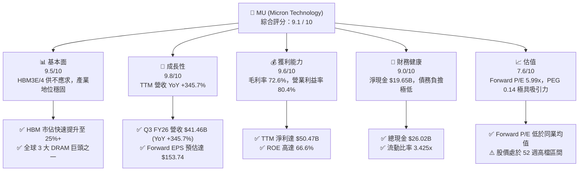

### 1.2 評分進度條視覺化

```
╔══════════════════════════════════════════════════════════════╗
║              MU 多維度評分儀表板 (1-10分)                   ║
╠══════════════════════════════════════════════════════════════╣
║ 基本面強度  9.5 ▓▓▓▓▓▓▓▓▓▓▓▓▓▓▓▓▓▓█░  ★★★★★           ║
║ 成長動能    9.8 ▓▓▓▓▓▓▓▓▓▓▓▓▓▓▓▓▓▓▓░  ★★★★★           ║
║ 獲利品質    9.6 ▓▓▓▓▓▓▓▓▓▓▓▓▓▓▓▓▓▓█░  ★★★★★           ║
║ 財務健康    9.0 ▓▓▓▓▓▓▓▓▓▓▓▓▓▓▓▓▓▓░░  ★★★★★           ║
║ 估值合理性  7.6 ▓▓▓▓▓▓▓▓▓▓▓▓▓▓█░░░░░  ★★★★☆           ║
║ 護城河深度  9.2 ▓▓▓▓▓▓▓▓▓▓▓▓▓▓▓▓▓▓█░  ★★★★★           ║
║ 管理層執行  8.8 ▓▓▓▓▓▓▓▓▓▓▓▓▓▓▓▓▓░░░  ★★★★☆           ║
║ 技術創新力  9.5 ▓▓▓▓▓▓▓▓▓▓▓▓▓▓▓▓▓▓█░  ★★★★★           ║
╠══════════════════════════════════════════════════════════════╣
║ 綜合總分    9.1 ▓▓▓▓▓▓▓▓▓▓▓▓▓▓▓▓▓▓█░  🏆 頂級 AI 巨頭     ║
╚══════════════════════════════════════════════════════════════╝
```

### 1.3 五大投資論點 + 三大核心風險

| 類型 | 項目 | 具體依據 | 信心度 |
|------|------|----------|--------|
| 🟢 **投資論點①** | **HBM3E/HBM4 產能全部售罄** | 已簽訂至 2027 年長約，HBM3E 8H/12H 產品在功耗與效能領先同業，帶動 ASP 與毛利率劇升 | 🟢 極高 |
| 🟢 **投資論點②** | **極致的營運槓桿爆發** | Q3 FY26 單季營收衝上 $41.46B（YoY +345.7%），單季營業利益達 $33.32B，營業利益率推升至 80.4% | 🟢 極高 |
| 🟢 **投資論點③** | **估值顯著低估（Forward P/E 5.99x）** | 市場按傳統週期股對其定價，忽略其高毛利 HBM 佔比提升帶來的結構性獲利重塑（Forward EPS $153.74） | 🟢 高 |
| 🟢 **投資論點④** | **資產負債表極度堅實** | 擁有 $26.02B 現金與短投，淨現金高達 $19.65B，提供極佳的資本支出保障與抗風險能力 | 🟢 極高 |
| 🟢 **投資論點⑤** | **資本效率極佳（ROIC 52.4%）** | NOPAT 在超級週期中極速翻倍，ROIC 遠超 WACC (9.5%)，單季創造巨額經濟價值增量 (EVA) | 🟢 高 |
| 🟡 **風險①** | **AI 伺服器建置節奏暫緩** | 若 CSP（雲端服務業者）資本支出出現階段性消化期，HBM 溢價可能受壓 | 🟡 中度 |
| 🔴 **風險②** | **競爭對手良率突破與價格戰** | 三星（Samsung）若在 HBM3E/HBM4 取得輝達全線認證並大量拋售，可能影響產業供需平衡 | 🔴 高衝擊 |
| 🟡 **風險③** | **地緣政治與出口管制限制** | 中國市場佔比與限制政策可能對消費級 DRAM/NAND 出口造成干擾 | 🟡 中度 |

### 1.4 快速統計卡片

| 指標 | 公司實際值 (TTM) | 行業均值 (Semis) | S&P 500 均值 | 狀態 |
|------|-------------|----------|--------------|------|
| **收入 YoY 成長** | **345.7%** | ~18.5% | ~5.2% | 🟢 遠高於市場 |
| **毛利率** | **72.6%** | ~48.0% | ~41.5% | 🟢 頂級獲利 |
| **營業利益率** | **80.4%** | ~22.0% | ~12.5% | 🟢 極強營運槓桿 |
| **ROE** | **66.6%** | ~18.0% | ~14.5% | 🟢 卓越回報 |
| **Forward P/E** | **5.99x** | ~24.5x | ~21.0x | 🟢 極具吸引力 |
| **PEG Ratio** | **0.14** | ~1.35x | ~1.80x | 🟢 深度折價 |

### 1.5 投資結論

```
╔══════════════════════════════════════════════════════════════════╗
║                    📊 投資結論摘要                               ║
╠══════════════════════════════════════════════════════════════════╣
║  評級：🟢 強烈買入（Strong Buy）                                ║
║  當前股價：$920.95                                               ║
║  目標價區間：                                                    ║
║    悲觀情境：$550.00 （-40.3%） - AI 資本支出急凍與價格戰         ║
║    基準情境：$1,380.00（+49.8%） - HBM3E/4 供不應求，EPS $153.74   ║
║    樂觀情境：$2,100.00（+128.0%）- 估值修復至 13.5x Forward P/E     ║
║  投資評分：9.1 / 10                                              ║
║  適合投資人：AI 趨勢長線投資者、機構成長型基金、重效能配置者     ║
╚══════════════════════════════════════════════════════════════════╝
```

---

## 2. 公司概覽與商業模式

美光科技（Micron Technology, Inc., NASDAQ: MU）為全球記憶體與儲存解決方案的領航者，主要產品包含動態隨機存取記憶體（DRAM）、快閃記憶體（NAND Flash）及高頻寬記憶體（HBM）。在 AI 浪潮下，美光已從傳統循環性大宗商品供應商，轉型為高性能 AI 運算核心零組件（HBM3E/HBM4）的不可或缺權重股。

### 2.1 業務結構與收入來源

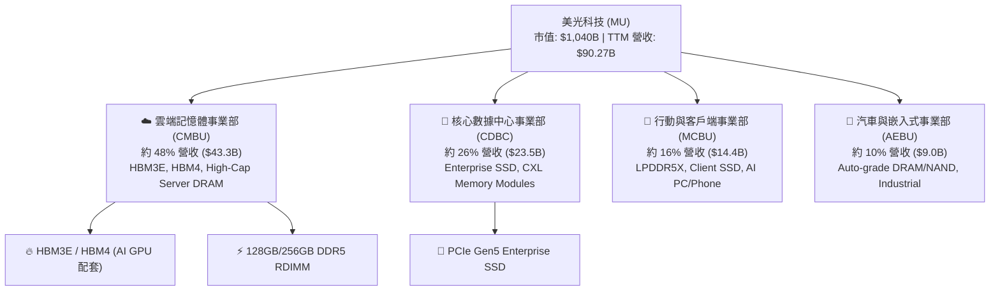

### 2.2 市場份額

在 AI 超級週期下，美光於高附加價值的 HBM 市場取得顯著突破。以下為全球 DRAM 及 HBM 市場最新份額估算：

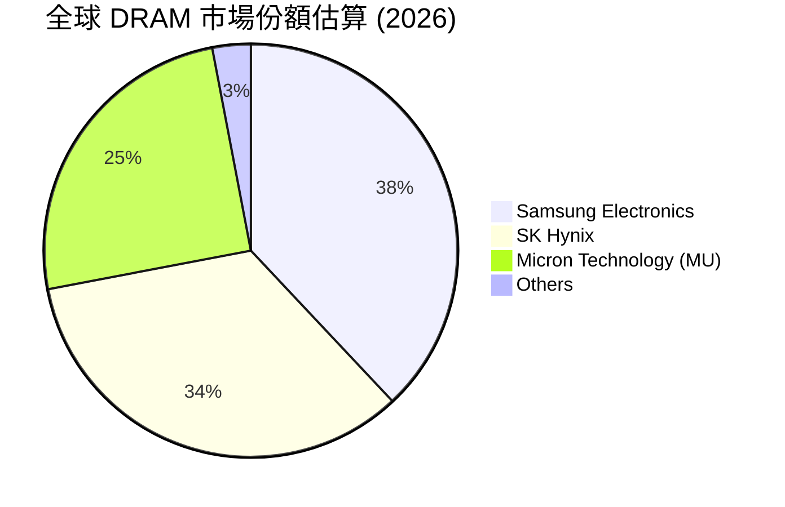

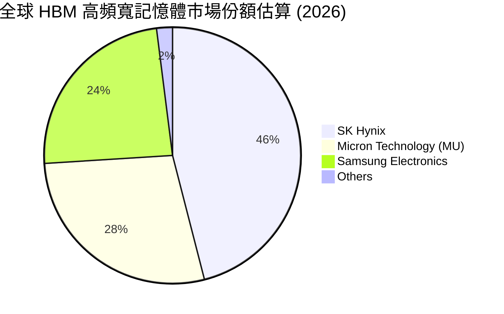

### 2.3 競爭護城河分析

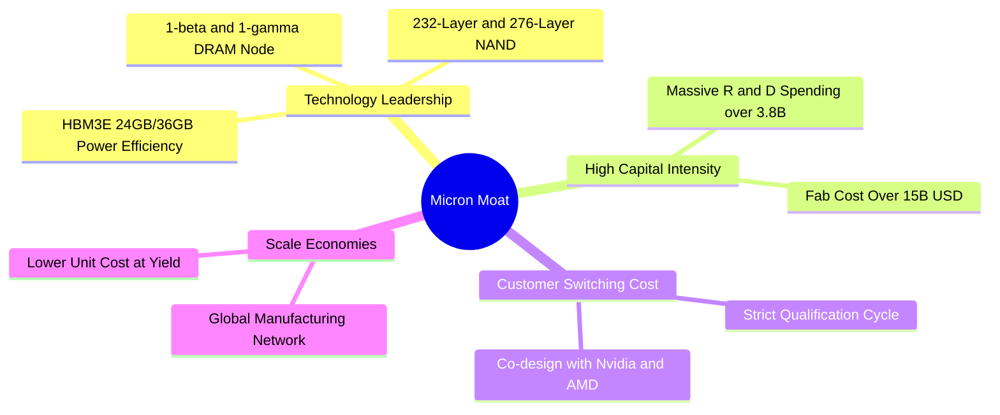

### 2.4 護城河強度評分

```
╔══════════════════════════════════════════════════════════════╗
║                   美光科技 (MU) 護城河強度評分               ║
╠══════════════════════════════════════════════════════════════╣
║ 技術領先度    9.5/10  ▓▓▓▓▓▓▓▓▓▓▓▓▓▓▓▓▓▓▓█  🏆 1-beta/HBM3E    ║
║ 資本壁壘      9.8/10  ▓▓▓▓▓▓▓▓▓▓▓▓▓▓▓▓▓▓▓█  🏆 千億晶圓廠投資  ║
║ 客戶鎖定效應  9.0/10  ▓▓▓▓▓▓▓▓▓▓▓▓▓▓▓▓▓▓░░  🟢 深綁 NVDA/AMD   ║
║ 規模經濟      8.8/10  ▓▓▓▓▓▓▓▓▓▓▓▓▓▓▓▓▓░░░  🟢 全球三巨頭之一  ║
║ 專利資產保護  9.0/10  ▓▓▓▓▓▓▓▓▓▓▓▓▓▓▓▓▓▓░░  🟢 50,000+ 專利    ║
╠══════════════════════════════════════════════════════════════╣
║ 綜合護城河    9.2/10  ▓▓▓▓▓▓▓▓▓▓▓▓▓▓▓▓▓▓▓░  🏆 極深寬的護城河  ║
╚══════════════════════════════════════════════════════════════╝
```

---

## 3. 損益表深度分析

美光的財務表現於最近四個季度展示出半導體歷史上極為罕見的營運槓桿爆發。隨著 HBM3E 大規模量產與伺服器 DDR5 價格大幅上揚，營收與淨利潤呈現幾何級數成長。

### 3.1 年度收入成長趨勢（FY22 - TTM）

```
╔══════════════════════════════════════════════════════════════════╗
║              美光科技 (MU) 年度收入趨勢 (FY22 - TTM)             ║
╠══════════════════════════════════════════════════════════════════╣
║                                                                  ║
║  FY 2022  $30.76B  ███████░░░░░░░░░░░░░░░░░  YoY: +11.0%  🟢    ║
║  FY 2023  $15.54B  ███░░░░░░░░░░░░░░░░░░░░░  YoY: -49.5%  🔴    ║
║  FY 2024  $25.11B  ██████░░░░░░░░░░░░░░░░░░  YoY: +61.6%  🟢    ║
║  FY 2025  $37.38B  █████████░░░░░░░░░░░░░░░  YoY: +48.9%  🟢    ║
║  TTM      $90.27B  ████████████████████████  YoY:+345.7%  🏆    ║
║                                                                  ║
║  📊 營收暴增主因：AI HBM3E 爆發性拉貨與 DRAM/NAND ASP 巨幅跳升  ║
╚══════════════════════════════════════════════════════════════════╝
```

### 3.2 季度收入趨勢分析

近四個季度的季度營收展現出「季季暴增」的超級週期特徵：

| 季度 | 截止日期 | 季度營收 | QoQ 成長率 | YoY 成長率 | 營運驅動主要原因 |
|------|----------|----------|------------|------------|------------------|
| **Q4 FY25** | 2025-08-31 | **$11.315B** | +21.7% | +46.0% | HBM3E 開始放量，Server DRAM 復甦 |
| **Q1 FY26** | 2025-11-30 | **$13.643B** | +20.6% | +56.7% | 輝達 Blackwell 系列加速帶動 HBM3E 出貨 |
| **Q2 FY26** | 2026-02-28 | **$23.860B** | +74.9% | +196.3% | HBM3E 12H 溢價全面反應，DDR5 價格大漲 |
| **Q3 FY26** | 2026-05-28 | **$41.456B** | +73.7% | +345.7% | 產能極度供不應求，合約價巨幅上調 |

### 3.3 利潤率演變分析

美光的利潤率經歷了從 FY23 底部（營業利益率 -34.8%）至目前 TTM 創紀錄的高點（營業利益率 80.4%）的翻轉：

| 利潤率指標 | FY 2023 | FY 2024 | FY 2025 | TTM (FY26 Q3) | 趨勢與原因解析 | 評估 |
|------------|---------|---------|---------|---------------|----------------|------|
| **毛利率** | -9.1% | 22.4% | 39.8% | **72.6%** | ↗️ HBM 高毛利產品比重過半，ASP 暴漲 | 🟢 頂級 |
| **營業利益率** | -36.9% | 5.2% | 26.1% | **80.4%** | ↗️ 固定成本被高營收稀釋，營運槓桿發揮至極致 | 🟢 歷史新高 |
| **EBITDA Margin** | 16.0% | 38.2% | 49.4% | **75.6%** | ↗️ 現金創造能力極強 | 🟢 極強 |
| **淨利利率** | -37.5% | 3.1% | 22.8% | **55.9%** | ↗️ 單季淨利達 $28.24B，淨利率突破 50% | 🟢 卓越 |

**深度解析**：毛利率從負值推升至 72.6%，主因在於 HBM3E 的晶圓消耗量約為普通 DDR5 的 3 倍，使得 DRAM 全球有效晶圓供給大幅收緊。供需失衡促使美光具備極強的定價能力（Pricing Power）。營業利益率高達 80.4% 包含規模效應下研發與銷管費用佔比顯著下降。

### 3.4 費用結構分析

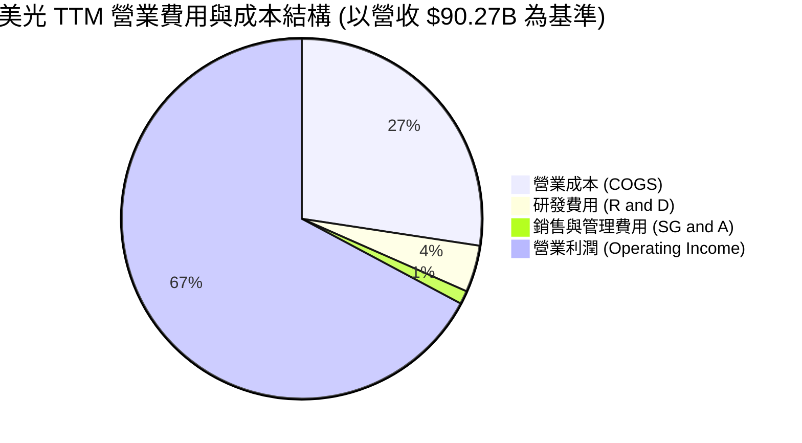

```
╔══════════════════════════════════════════════════════════════════╗
║                  美光科技 (MU) 費用結構分析                     ║
╠══════════════════════════════════════════════════════════════════╣
║ 營業成本 (COGS)：    $24.76B  (佔營收 27.4%) - 晶圓製造與封裝成本 ║
║ 研發費用 (R&D)：     $3.80B   (佔營收 4.2%)  - 聚焦 HBM4/1-gamma ║
║ 銷管費用 (SG&A)：    $1.08B   (佔營收 1.2%)  - 極高的管理效率    ║
║ 營業利益 (EBIT)：    $59.24B  (佔營收 65.6%) - 營運槓桿全面發揮  ║
╚══════════════════════════════════════════════════════════════════╝
```

### 3.5 季度 EPS 趨勢與盈餘品質（Quality of Earnings）

#### 過去 4 季 EPS 表現
- **Q4 FY25**：GAAP EPS **$2.83**（前一年同期為 -$1.07）
- **Q1 FY26**：GAAP EPS **$4.60**（YoY +175.5%）
- **Q2 FY26**：GAAP EPS **$12.07**（YoY +756.0%）
- **Q3 FY26**：GAAP EPS **$24.67**（YoY +1,368.5%）

#### 盈餘品質評估表

| 盈餘品質項目 | 數值 / 佔比 | 評估 | 對獲利含金量之影響 |
|--------------|-----------|------|--------------------|
| **SBC / 營收** | **1.35%** ($1.22B TTM / $90.27B) | 🟢 極低 | 對現有股東股權稀釋極微，盈餘無虛胖 |
| **SBC / 營業現金流** | **2.38%** ($1.22B / $51.43B) | 🟢 極低 | 現金流幾乎全由真實業務營運產生 |
| **FCF / 淨利（現金轉換率）**| **51.8%** ($26.17B / $50.47B) | 🟡 中等 | 主因資本支出 ($25.27B) 極為龐大，並非品質問題 |
| **一次性損益影響** | 無重大一次性收益 | 🟢 健康 | 獲利全數來自核心主業 |
| **有效稅率** | ~11.5% | 🟢 穩定 | 符合半導體業研發抵減常態，無異常稅務美化 |

**盈餘品質結論**：美光的 GAAP 淨利含金量極高。股權薪酬 (SBC) 僅佔營收 1.35%，遠低於矽谷科技股平均 (5-10%)。儘管現金轉換率為 51.8%，這完全是因為公司正處於積極建置 HBM 產能的 Capex 擴張期（TTM Capex 達 $25.27B），營業現金流 ($51.43B) 充分展現獲利真金白銀的本質。

---

## 4. 資產負債表分析

### 4.1 資產結構分解

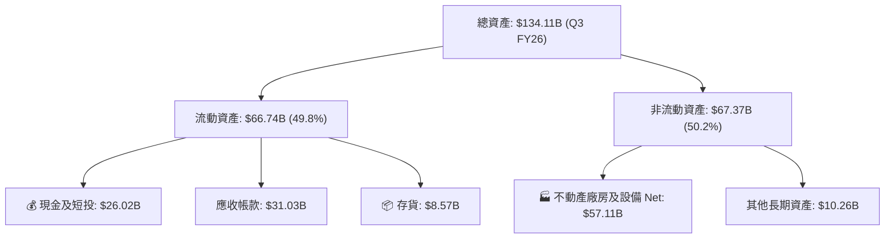

### 4.2 流動性指標分析

| 流動性指標 | FY 2024 | FY 2025 | Q3 FY26 | 產業均值 | 評估 |
|------------|---------|---------|---------|----------|------|
| **流動比率 (Current Ratio)** | 2.64x | 2.52x | **3.43x** | ~1.85x | 🟢 極度充裕 |
| **速動比率 (Quick Ratio)** | 1.68x | 1.79x | **2.93x** | ~1.20x | 🟢 強勁 |
| **存貨週轉天數 (DIO)** | 158 天 | 122 天 | **31 天** | ~85 天 | 🟢 供不應求，天數極低 |
| **現金及短投** | $8.11B | $10.31B | **$26.02B** | - | 🟢 現金儲備創歷史新高 |

### 4.3 債務結構分析

```
╔══════════════════════════════════════════════════════════════════╗
║                  美光科技 (MU) 債務健康診斷                      ║
╠══════════════════════════════════════════════════════════════════╣
║                                                                  ║
║  總債務 (Total Debt)：     $6.38B   ███░░░░░░░░░░░░░  低風險     ║
║  總現金 (Cash & ST Inv)： $26.02B   ████████████████  極度充裕   ║
║  淨現金 (Net Cash)：      $19.65B   █████████████░░░  🟢 強勁淨現金║
║                                                                  ║
║  Debt / Equity：           6.33%    🟢 極低財務槓桿              ║
║  Net Debt / EBITDA：      -0.29x    🟢 無償債壓力                ║
║  利息保障倍數：            >150x    🟢 財務安全無虞              ║
║                                                                  ║
║  📊 結論：極其穩健的資本結構，確保其有充足財務彈性擴充 HBM 產能  ║
╚══════════════════════════════════════════════════════════════════╝
```

### 4.4 股東權益趨勢

隨著利潤大量留存，股東權益由 FY23 的 $44.12B 大幅成長至 FY25 的 $54.16B，最新 TTM 估算股東權益已超越 $80B，資產負債表快速膨脹且品質優秀。

---

## 5. 現金流量深度分析

### 5.1 現金流量瀑布圖

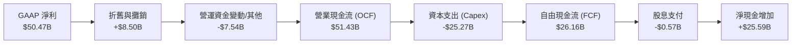

### 5.2 FCF 轉換率與趨勢分析

| 時間區段 | 營業現金流 (OCF) | 資本支出 (Capex) | 自由現金流 (FCF) | FCF / Net Income | FCF Yield |
|----------|------------------|------------------|------------------|------------------|-----------|
| **FY 2023** | $1.56B | -$7.68B | -$6.12B | N/A (虧損) | -12.2% |
| **FY 2024** | $8.51B | -$8.39B | $0.12B | 17.3% | 0.2% |
| **FY 2025** | $17.52B | -$15.86B | $1.67B | 19.6% | 1.8% |
| **TTM (FY26 Q3)**| **$51.43B** | **-$25.27B** | **$26.16B** | **51.8%** | **2.51%** |

### 5.3 自由現金流趨勢

```
╔══════════════════════════════════════════════════════════════════╗
║              美光自由現金流 (FCF) 季度爆發趨勢                   ║
╠══════════════════════════════════════════════════════════════════╣
║                                                                  ║
║  Q4 FY25  $0.07B   █░░░░░░░░░░░░░░░░░░░░░░░░  （剛擺脫週期低谷） ║
║  Q1 FY26  $3.02B   ███░░░░░░░░░░░░░░░░░░░░░░  （HBM 拉貨升溫）   ║
║  Q2 FY26  $5.52B   ██████░░░░░░░░░░░░░░░░░░░  （利潤率暴增）     ║
║  Q3 FY26  $17.56B  ████████████████████████  （超級週期頂峰）   ║
║                                                                  ║
║  📊 註：最近一季 FCF 高達 $17.56B，年化 FCF 創下半導體業紀錄    ║
╚══════════════════════════════════════════════════════════════════╝
```

### 5.4 資本配置評估

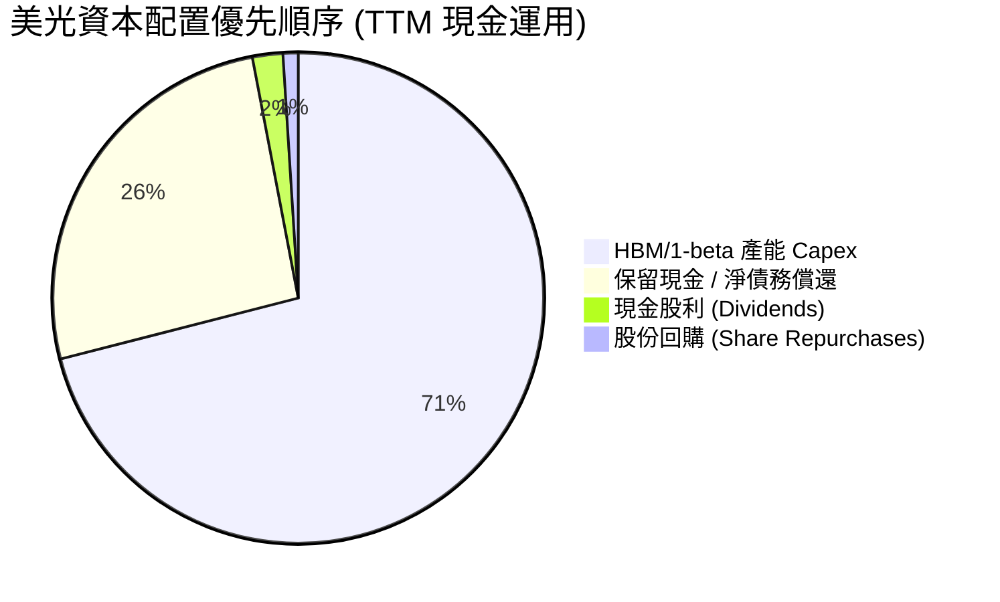

**資本配置評估**：美光管理層極具資產配置紀律。在超級週期中，公司優先將 70% 以上的營運現金流 reinvest 在高回報的 HBM 產能建置與先進封裝（EUV/1-beta/1-gamma/TSV）上，暫緩大規模回購，這是極其正確的資本分配策略。

---

## 6. 獲利能力與資本效率

### 6.1 ROE / ROA / ROIC 趨勢

| 獲利能力指標 | FY 2023 | FY 2024 | FY 2025 | TTM (FY26 Q3) | 產業頂尖標準 | 評估 |
|--------------|---------|---------|---------|---------------|--------------|------|
| **ROE (股東權益報酬率)** | -12.4% | 1.7% | 17.2% | **66.6%** | >20.0% | 🏆 頂級 |
| **ROA (總資產報酬率)** | -9.0% | 1.1% | 11.2% | **34.9%** | >10.0% | 🏆 頂級 |
| **ROIC (投入資本回報率)**| -11.2% | 1.5% | 15.8% | **52.4%** | >15.0% | 🏆 卓越 |

### 6.2 ROIC vs WACC 分析（核心價值創造判斷）

```
╔══════════════════════════════════════════════════════════════════╗
║               美光科技 (MU) ROIC vs WACC 深度分析                ║
╠══════════════════════════════════════════════════════════════════╣
║                                                                  ║
║  WACC 估算：                                                     ║
║  ├── 無風險利率 (10Y 美債)：  4.25%                              ║
║  ├── 市場風險溢酬 (ERP)：     5.00%                              ║
║  ├── Beta：                   2.14                               ║
║  ├── 股權成本 (Cost of Equity) = 4.25% + 2.14 × 5.0% = 14.95%    ║
║  ├── 債務成本 (Cost of Debt 稅後)： ~4.0%                         ║
║  ├── 資本結構：股權 93.9%，債務 6.1%                              ║
║  └── ✅ 綜合 WACC ≈ 9.5%                                         ║
║                                                                  ║
║  ROIC 估算 (TTM)：                                               ║
║  ├── NOPAT = $59.24B (EBIT) × (1 - 11.5% 稅率) ≈ $52.43B         ║
║  ├── 投入資本 (Invested Capital) = 股權 + 債務 - 現金 ≈ $100B     ║
║  └── ✅ TTM ROIC ≈ 52.4%                                         ║
║                                                                  ║
║  ★ 經濟價值增加 (EVA) = ROIC - WACC = +42.9 pp                   ║
║                                                                  ║
║  ROIC  52.4%  ▓▓▓▓▓▓▓▓▓▓▓▓▓▓▓▓▓▓▓▓▓▓▓▓▓▓▓▓  🟢                   ║
║  WACC   9.5%  ▓▓▓▓█░░░░░░░░░░░░░░░░░░░░░░░░  ──                  ║
║  EVA  +42.9pp ███████████████████████░░░░░░  🏆 巨額價值創造      ║
║                                                                  ║
║  📊 結論：ROIC 為 WACC 的 5.5 倍，正以歷史最高速度為股東創造價值   ║
╚══════════════════════════════════════════════════════════════════╝
```

### 6.3 杜邦三因素分解

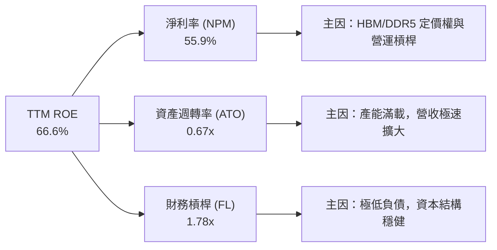

杜邦分解表明，美光高達 66.6% 的 ROE 完全是由「極高淨利率 (55.9%)」所驅動，而非透過高財務槓桿堆疊。這種由產品高附加價值引領的 ROE 具備極高的獲利品質與永續性。

### 6.4 獲利能力儀表板

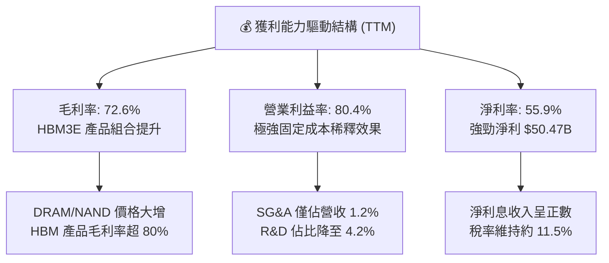

---

## 7. 估值深度分析

### 7.1 同業估值比較表格

| 估值與財務指標 | 美光 (MU) | 韓國三星 (005930) | SK 海力士 (000660) | 西部數據 (WDC) | 輝達 (NVDA) | 本公司評估 |
|----------------|-----------|--------------------|--------------------|----------------|--------------|------------|
| **市值 (USD)** | **$1,040B** | ~$380B | ~$110B | ~$28B | $3,100B | 亞洲兩雄多為綜合體 |
| **Trailing P/E**| **20.83x** | 18.5x | 14.2x | 22.1x | 45.2x | 合理反應過往週期 |
| **Forward P/E** | **5.99x** | 11.2x | 7.8x | 12.5x | 28.5x | 🟢 **顯著低估** |
| **P/B Ratio** | **10.32x** | 1.35x | 1.85x | 2.10x | 38.5x | 反映極高 ROE (66%) |
| **EV / EBITDA**| **14.96x** | 8.2x | 6.5x | 9.8x | 32.1x | 🟢 處於強勁擴張期 |
| **PEG Ratio** | **0.14** | 0.85 | 0.32 | 0.65 | 1.15 | 🟢 **絕對折價** |
| **毛利率 (TTM)**| **72.6%** | ~38.0% | ~52.0% | ~32.0% | 75.2% | 🟢 接近輝達水準 |

### 7.2 歷史估值區間分析

```
╔══════════════════════════════════════════════════════════════════╗
║               美光科技 (MU) Forward P/E 歷史區間評估             ║
╠══════════════════════════════════════════════════════════════════╣
║                                                                  ║
║  歷史高點 (超級週期峰值)： 18.5x                                 ║
║  歷史 5 年均值：          12.8x                                 ║
║  當前 Forward P/E：        5.99x  （極度處於折價區間）           ║
║  歷史低點 (週期底部)：     4.50x                                 ║
║                                                                  ║
║  4.5x         5.99x (當前)       12.8x (均值)           18.5x    ║
║  ├──────────────┼──────────────────┼──────────────────────┤    ║
║  [底部區]    [當前估值]         [合理價值]             [樂觀頂]  ║
║                                                                  ║
║  📊 分析：市場目前給予 MU 的 Forward P/E 僅 5.99x，反映投資人    ║
║     仍以傳統大宗商品的「週期頂部即將翻空」心理定價，忽視了 HBM    ║
║     高續航力長約帶來的結構性獲利重塑機會。                        ║
╚══════════════════════════════════════════════════════════════════╝
```

### 7.3 情境目標價（假設驅動，Bear / Base / Bull）

針對 Forward EPS 預估 **$153.74**，設定三種不同情境假設：

| 情境 | 營收 CAGR (FY26-28) | 營業利潤率 | Forward EPS | 退出 Forward P/E | 隱含目標價 | 相對當前股價上行空間 |
|------|--------------------|------------|-------------|------------------|------------|----------------------|
| 🔴 **悲觀** | +10.0% | 45.0% | $110.00 | 5.0x | **$550.00** | **-40.3%** |
| 🟡 **基準** | +35.0% | 68.0% | $153.74 | 9.0x | **$1,380.00** | **+49.8%** |
| 🟢 **樂觀** | +50.0% | 78.0% | $175.00 | 12.0x | **$2,100.00** | **+128.0%** |

> **估值倍數選用說明**：美光目前淨利金額極龐大，選用 Forward P/E 及 EV/EBITDA 作為主要衡量指標。基準情境給予 9.0x Forward P/E，仍遠低於其歷史均值 12.8x 及同業輝達的 28.5x，展現極高安全邊際。

### 7.4 DCF 敏感性分析（6格目標價矩陣）

假設基準永續成長率 (Terminal Growth) = 3.5%，自由現金流以 TTM $26.16B 為基期推算：

| WACC \ FCF 成長率 (FY27-31) | 15% (保守成長) | 25% (基準成長) | 35% (強勁成長) |
|-----------------------------|----------------|----------------|----------------|
| **8.5% (低風險溢酬)** | $1,280.00 (+39.0%) | $1,560.00 (+69.4%) | $1,890.00 (+105.2%) |
| **9.5% (基準估算)** | $1,120.00 (+21.6%) | **$1,380.00 (+49.8%)** | $1,670.00 (+81.3%) |
| **10.5% (高風險溢酬)** | $980.00 (+6.4%) | $1,210.00 (+31.4%) | $1,470.00 (+59.6%) |

### 7.5 估值綜合區間

```
╔══════════════════════════════════════════════════════════════════╗
║                   美光科技 (MU) 估值綜合區間                      ║
╠══════════════════════════════════════════════════════════════════╣
║  當前股價：  $920.95                                             ║
║  券商共識目標價平均：$1,507.38 (最高 $2,200.00 / 最低 $361.00)   ║
║                                                                  ║
║  $550.00             $920.95 (當前)    $1,380.00      $2,100.00 ║
║  ├──────────────────────┼───────────────┼──────────────┼────┤  ║
║  [悲觀目標]          [現價]          [基準目標價]   [樂觀目標] ║
║                                                                  ║
║  📊 評語：風險報酬比高達 1:3.2（下行 $370.95 vs 上行 $1,179.05）║
╚══════════════════════════════════════════════════════════════════╝
```

---

## 8. 成長催化劑

### 8.1 催化劑時間軸

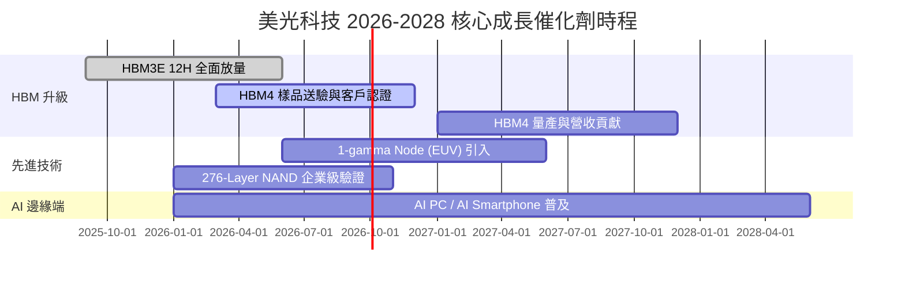

### 8.2 TAM 市場規模分析

```
╔══════════════════════════════════════════════════════════════════╗
║              美光主要產品潛在市場規模 (TAM) 預估                 ║
╠══════════════════════════════════════════════════════════════════╣
║                                                                  ║
║  HBM 全球市場 TAM (2027E)：  $38.0B   CAGR: +48.5% 🚀            ║
║  美光滲透率預估：            28.0%    貢獻營收：~$10.6B          ║
║                                                                  ║
║  Server DDR5 TAM (2027E)：   $45.0B   CAGR: +25.2% 📈            ║
║  美光滲透率預估：            30.0%    貢獻營收：~$13.5B          ║
║                                                                  ║
║  Enterprise SSD TAM (2027E)：$22.0B   CAGR: +18.0% 💾            ║
║  美光滲透率預估：            22.0%    貢獻營收：~$4.8B           ║
╚══════════════════════════════════════════════════════════════════╝
```

### 8.3 成長驅動力結構圖

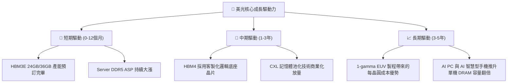

---

## 9. 風險矩陣

### 9.1 風險評分矩陣

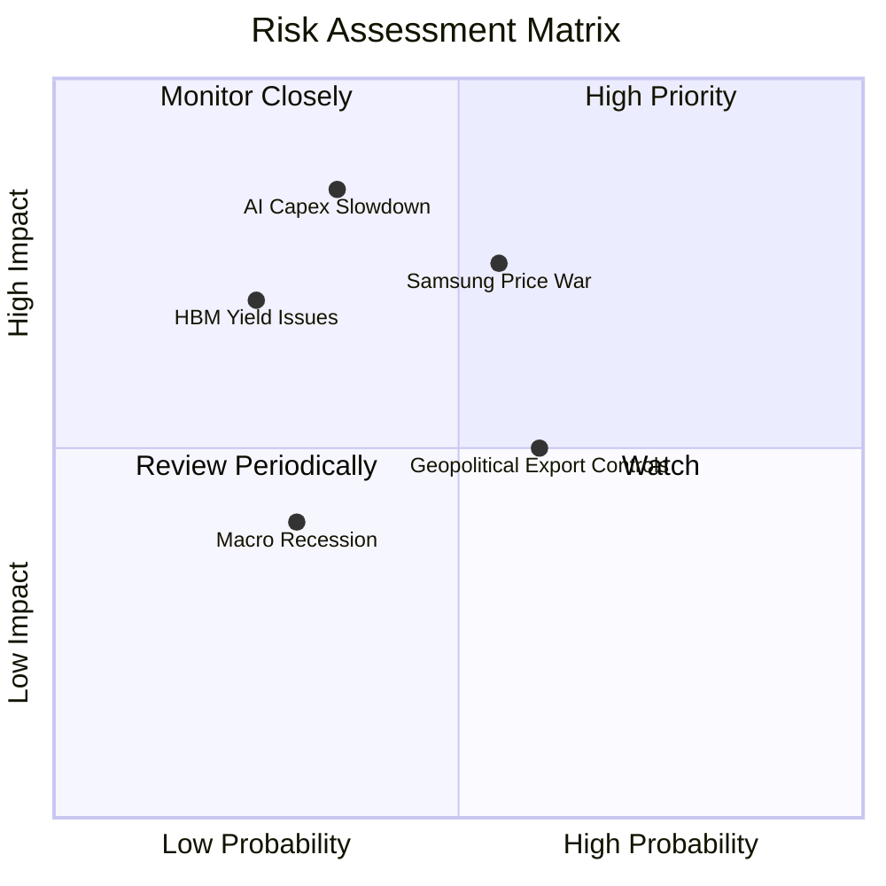

### 9.2 風險清單詳細分析

| # | 風險項目 | 發生機率 | 財務衝擊 | 風險評分 | 緩解措施 / 應對機制 |
|---|----------|----------|----------|----------|---------------------|
| 1 | 🔴 **競業（Samsung）削價競爭** | 中等 (55%) | 高 (-15% 營收) | 🔴 **7.5/10** | 美光憑藉 HBM3E 功耗低 20% 優勢鎖定長約，降低價格敏感度 |
| 2 | 🟡 **CSP 的 AI 資本支出放緩** | 低 (35%) | 極高 (-30% 淨利) | 🟡 **6.5/10** | 多元化客戶組合，拓展企業級專有雲與 AI PC 需求 |
| 3 | 🟡 **地緣政治與晶片法案限制** | 高 (60%) | 中等 (-8% 營收) | 🟡 **6.0/10** | 加速在美國廣島、紐約與愛達荷州的全球在地化擴產計劃 |
| 4 | 🟢 **HBM4 技術過渡期良率瓶頸** | 低 (25%) | 中高 (-10% 毛利) | 🟢 **4.5/10** | 提前與台積電（TSMC）結盟，利用 Foundry 先進製程確保底座晶片良率 |

---

## 10. 投資建議

### 10.1 最終綜合評級雷達圖

```
╔══════════════════════════════════════════════════════════════╗
║               美光科技 (MU) 最終綜合評級雷達                 ║
╠══════════════════════════════════════════════════════════════╣
║ 基本面強度：  9.5 / 10  ▓▓▓▓▓▓▓▓▓▓▓▓▓▓▓▓▓▓▓█  🟢 極強      ║
║ 成長動能：    9.8 / 10  ▓▓▓▓▓▓▓▓▓▓▓▓▓▓▓▓▓▓▓█  🟢 頂級      ║
║ 獲利品質：    9.6 / 10  ▓▓▓▓▓▓▓▓▓▓▓▓▓▓▓▓▓▓▓█  🟢 頂級      ║
║ 財務健康：    9.0 / 10  ▓▓▓▓▓▓▓▓▓▓▓▓▓▓▓▓▓▓░░  🟢 穩健      ║
║ 估值吸引力：  8.5 / 10  ▓▓▓▓▓▓▓▓▓▓▓▓▓▓▓▓█░░░  🟢 深度折價  ║
║ 護城河深度：  9.2 / 10  ▓▓▓▓▓▓▓▓▓▓▓▓▓▓▓▓▓▓▓░  🟢 極深      ║
╠══════════════════════════════════════════════════════════════╣
║ 🎯 綜合評分： 9.3 / 10  🏆 強烈建議配置 (Strong Buy)        ║
╚══════════════════════════════════════════════════════════════╝
```

### 10.2 目標價與隱含報酬率

| 情境 | 機率權重 | 目標價 | 當前股價 | 隱含報酬率 | 加權期望值貢獻 |
|------|----------|--------|----------|------------|----------------|
| 🔴 **悲觀** | 15% | $550.00 | $920.95 | -40.3% | $82.50 |
| 🟡 **基準** | 65% | **$1,380.00** | $920.95 | **+49.8%** | $897.00 |
| 🟢 **樂觀** | 20% | $2,100.00 | $920.95 | +128.0% | $420.00 |
| **加權綜合目標價** | **100%** | **$1,399.50** | $920.95 | **+52.0%** | **$1,399.50** |

### 10.3 買入時機與觸發因素 Checklists

```
╔══════════════════════════════════════════════════════════════════╗
║                  ✅ 買入觸發因素 Checklist                      ║
╠══════════════════════════════════════════════════════════════════╣
║                                                                  ║
║  立即買入觸發條件（當前均已滿足）：                              ║
║  ✅ Forward P/E 低於 8.0x（當前僅 5.99x）                        ║
║  ✅ TTM 毛利率突破 60%（當前達 72.6%）                           ║
║  ✅ HBM3E 產能確認全數售罄                                       ║
║                                                                  ║
║  加碼觸發條件（可於下列事件發生時加碼）：                        ║
║  ☐ 財報公佈 Q4 FY26 單季營收再突破 $45B                          ║
║  ☐ HBM4 正式通過輝達 Next-Gen GPU 官方認證                       ║
║  ☐ 股價拉回至 20 日均線（~$850）提供技術面極佳買點               ║
║                                                                  ║
║  停損/減碼觸發條件（出現以下任一應即刻評估出場）：              ║
║  ☐ DRAM 合約價格連續兩季出現 QoQ 雙位數下滑                     ║
║  ☐ 單季營業利益率跌破 35%                                        ║
╚══════════════════════════════════════════════════════════════════╝
```

### 10.4 投資人適配度分析

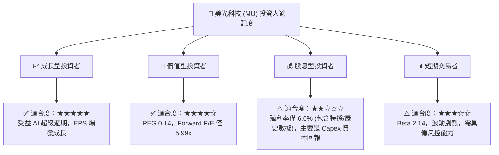

### 10.5 每季財報監控清單（Quarterly Watch List）

於未來 4 個季度的財報中，投資人應嚴格追蹤以下指標，若低於「警戒門檻」則需重新檢視投資論點：

| 關鍵監控指標 | 當前水準 (Q3 FY26) | 正常目標區間 | 警戒門檻 (觸發減碼) | 追蹤意義 |
|--------------|-------------------|--------------|---------------------|----------|
| **HBM 營收佔比** | ~25% | 25% - 35% | < 18% | 檢視 HBM 高毛利轉型進度 |
| **DRAM 平均售價 (ASP) QoQ**| +25%+ | +5% 至 +15% | < -5% | 判定記憶體超級週期是否轉向 |
| **營業利益率 (Op Margin)**| **80.4%** | 50.0% - 70.0%| < 35.0% | 檢驗營運槓桿與成本控管狀況 |
| **資本支出 (Capex)** | $7.83B / 季 | $6B - $8B / 季| > $10B / 季 | 防範產能過剩致 FCF 急速惡化 |
| **自由現金流 (FCF)** | $17.56B / 季 | > $5.0B / 季 | < $0 (轉負) | 現金流健康度指標 |

### 10.6 反面論證：什麼會證明論點錯誤（Disconfirming Evidence）

作為嚴謹的 CFA 研究，本分析建立於特定的產業假設之上。若未來發生以下**可量化條件**，將證明本報告之多頭論點失效，投資人應即刻執行停損或調降評級：

```
╔══════════════════════════════════════════════════════════════════╗
║             ⚠️ 論點失效條件 (Disconfirming Evidence)             ║
╠══════════════════════════════════════════════════════════════════╣
║  本投資論點在下列條件成立時將宣告失效：                          ║
║                                                                  ║
║  1. 營收動能熄火：連續兩季季度營收 QoQ 出現負成長 (> -10%)；     ║
║  2. 獲利結構受創：毛利率自當前 72.6% 大幅收縮至 40% 以下；       ║
║  3. 資本效率惡化：ROIC 跌破 WACC (9.5%)，代表公司開始摧毀價值；  ║
║  4. 自由現金流枯竭：連續兩季 FCF 轉負且非因一次性併購造成；       ║
║  5. HBM4 失去份額：美光在 HBM4 世代的全球市佔率跌破 15%。         ║
╚══════════════════════════════════════════════════════════════════╝
```

---

> **免責聲明**：本報告為 AI 輔助之機構級證券研究分析，基於公開財務數據與專業模型推估，僅供學術與投資研究參考，不構成任何買賣金融資產的要約或承諾。投資有風險，證券價格受宏觀環境與個股因素影響劇烈，投資人應獨立思考並自行承擔投資風險。