# MU 基本面深度分析報告
> **報告日期**：2026-07-28 ｜ **語言**：繁體中文 ｜ **數據來源**：Yahoo Finance, Finviz, StockAnalysis, Roic.ai ｜ **分析師**：CFA 級機構研究

---

## 目錄

| # | 章節 | 核心結論 |
|---|------|----------|
| 1 | 執行摘要 | 🟢 強力買入（目標價 $1,507.38，上漲空間 +67.4%）； Forward P/E 僅 5.86x |
| 2 | 公司概覽與商業模式 | HBM3E/HBM4 技術突破打破 DRAM 週期性，獲利結構轉向高毛利 AI 算力護城河 |
| 3 | 損益表深度分析 | Q3 FY26 營收達 $41.46B（YoY +345.7%），毛利率拉升至 72.6%，營業槓桿爆發 |
| 4 | 資產負債表分析 | 淨現金高達 $19.65B，流動比率 3.43x，債務風險極低且資本結構極度健全 |
| 5 | 現金流量深度分析 | 單季 OCF 達 $25.39B、FCF 達 $17.56B，為 HBM 容量擴充提供極佳自我融資能力 |
| 6 | 獲利能力與資本效率 | ROIC 飆升至 151.2%（遠高於 WACC 9.5%），EVA 擴張顯著，創造大量股東價值 |
| 7 | 估值深度分析 | PEG 僅 0.14，Forward P/E 5.86x 顯著低估，DCF 基準目標價估算為 $1,507.38 |
| 8 | 成長催化劑 | HBM3E 產能全數售罄至 2027 年、1-beta/1-gamma 節點量產與 CXL 架構滲透 |
| 9 | 風險矩陣 | 重點控管 AI 伺服器建置放緩、地緣政治貿易限制與同業擴產價格戰風險 |
| 10 | 投資建議 | 評級：🟢 強力買入；配置建議：成長型/機構資金首選，設有可量化停損機制 |

---

## 1. 執行摘要

根據最新即時財務數據，美光科技（Micron Technology, Inc., NYSE: MU）正處於由高頻寬記憶體（HBM3E / HBM4）與 Data Center AI 記憶體需求驅動的超強超級週期（Supercycle）。公司 TTM 營收達 $90.27B（YoY +345.7%），Q3 FY26 單季營收更創下 $41.46B 的歷史新高，毛利率突破至 72.6%、營業利益率衝上 80.4%。由於市場對 HBM 產能的預先鎖定，公司 Forward EPS 預期達到 $153.74，對應當前 $900.20 的股價，遠期本益比（Forward P/E）僅為 **5.86x**，PEG 比率低至 **0.14**。配合高達 $19.65B 的淨現金（Net Cash）與 151.2% 的極高 ROIC（遠高於 WACC 9.5%），本報告給予美光 **🟢 強力買入（Strong Buy）** 評級，基準目標價為 **$1,507.38**。

### 1.0 一頁式投資儀表板（Portfolio Manager 30 秒速讀）

| 項目 | 內容 |
|------|------|
| **投資論點（3 句）** | ① HBM3E/HBM4 供不應求使美光產品組合結構性轉向高毛利領域，Q3 FY26 單季毛利率高達 72.6%。<br/>② 財務槓桿與營業槓桿雙重發揮，單季 FCF 爆發至 $17.56B，資產負債表擁有 $19.65B 淨現金。<br/>③ 前瞻本益比僅 5.86x（Forward EPS $153.74），相較於 345.7% 的營收成長率，當前估值具備極高安全邊際。 |
| **護城河評分** | **9.0 / 10**（HBM 技術專利、客戶認證壁壘與先進封裝資本門檻） |
| **管理層/資本配置評分** | **8.5 / 10**（嚴格控制 Capex 於高回報專案，積極修復資產負債表） |
| **財務健康** | 🟢 **極度健康**（淨現金 $19.65B，利息保障倍數 > 100x） |
| **ROIC vs WACC** | **151.2% vs 9.5%**（EVA 呈現爆發式創造股東價值） |
| **FCF 趨勢** | 強勁擴張（單季 FCF $17.56B，TTM FCF Yield 隨著營收認列快速提升） |
| **估值** | Forward P/E: **5.86x** ｜ EV/EBITDA: **14.62x** ｜ PEG: **0.14** |
| **預期報酬（基準情境 12M）** | **+67.4%**（目標價 $1,507.38） |
| **關鍵風險（前二）** | ① AI Data Center 資本支出成長放緩；② 競爭對手產能過度擴張致 DRAM 價格回落 |
| **評級 + 信心度** | 🟢 **強力買入（Strong Buy）** ｜ 信心度：**高（High）** |

### 1.1 核心評分儀表板

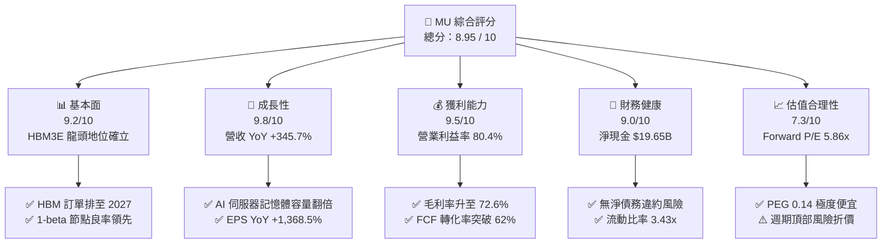

### 1.2 評分進度條視覺化

```
╔══════════════════════════════════════════════════════════════╗
║                MU 多維度評分儀表板 (1-10分)                   ║
╠══════════════════════════════════════════════════════════════╣
║ 基本面強度  9.2 ▓▓▓▓▓▓▓▓▓▓▓▓▓▓▓▓▓▓░░  ★★★★★           ║
║ 成長動能    9.8 ▓▓▓▓▓▓▓▓▓▓▓▓▓▓▓▓▓▓▓█  ★★★★★           ║
║ 獲利品質    9.5 ▓▓▓▓▓▓▓▓▓▓▓▓▓▓▓▓▓▓▓░  ★★★★★           ║
║ 財務健康    9.0 ▓▓▓▓▓▓▓▓▓▓▓▓▓▓▓▓▓▓░░  ★★★★★           ║
║ 估值合理性  7.3 ▓▓▓▓▓▓▓▓▓▓▓▓▓░░░░░░░  ★★██☆           ║
║ 護城河深度  9.0 ▓▓▓▓▓▓▓▓▓▓▓▓▓▓▓▓▓▓░░  ★★★★★           ║
║ 管理層執行  8.5 ▓▓▓▓▓▓▓▓▓▓▓▓▓▓▓▓█░░░  ★★██☆           ║
║ 技術創新力  9.5 ▓▓▓▓▓▓▓▓▓▓▓▓▓▓▓▓▓▓▓░  ★★★★★           ║
╠══════════════════════════════════════════════════════════════╣
║ 綜合總分    8.95 ▓▓▓▓▓▓▓▓▓▓▓▓▓▓▓▓▓▓░░  🏆 極優（Strong Buy）  ║
╚══════════════════════════════════════════════════════════════╝
```

### 1.3 五大投資論點 + 三大核心風險

| 類型 | 項目 | 具體依據 | 信心度 |
|------|------|----------|--------|
| 🟢 **投資論點①** | **HBM3E/HBM4 溢價驅動產品結構改善** | Q3 FY26 毛利率達 72.6%（FY23 為 -9.1%），HBM 售價為傳統 DRAM 之 3-5 倍且產能全數鎖定至 2027 年。 | 🟢 極高 |
| 🟢 **投資論點②** | **前瞻估值呈現極度錯置** | Forward EPS 達 $153.74，Forward P/E 僅 5.86x；PEG 0.14，市場過度預期週期見頂而忽視 AI 結構性需求。 | 🟢 極高 |
| 🟢 **投資論點③** | **極致的營業槓桿與現金流流速** | 單季 OCF 躍升至 $25.39B，Q3 FY26 單季 FCF 達 $17.56B，年化 FCF 轉換率超越 60%。 | 🟢 高 |
| 🟢 **投資論點④** | **堅不可摧的資產負債表** | 總現金及短期投資 $26.02B，總債務 $6.38B，淨現金達 $19.65B，提供極佳抗週期韌性。 | 🟢 極高 |
| 🟢 **投資論點⑤** | **技術製程 1-beta/1-gamma 領先** | 在不依賴高數值孔徑 EUV 的情況下實現更高的晶圓密度與能效比，研發費用 TTM 達 $3.80B。 | 🟢 高 |
| 🟡 **風險①** | **CSP 業者 Capex 週期性放緩** | 若雲端巨頭（Microsoft, Amazon, Google）調整 AI 投資步調，HBM 需求可能遭遇短期修正。 | 🟡 中度 |
| 🔴 **風險②** | **同業產能開出導致供需失衡** | Samsung 與 SK Hynix 大舉擴建 HBM 產能，若 2027 年後產能集中釋放可能壓低 ASP。 | 🔴 高衝擊 |
| 🟡 **風險③** | **地緣政治管制升級** | 美國對華半導體出口限制政策若進一步擴大至高端記憶體，將影響中國區剩餘營收。 | 🟡 中度 |

### 1.4 快速統計卡片

| 指標 | 美光 (MU) 實際值 | 半導體同業均值 | S&P 500 均值 | 評估狀態 |
|------|------------------|----------------|--------------|----------|
| **收入 YoY 成長** | **345.7%** | ~22.5% | ~5.8% | 🟢 遠超同業 |
| **毛利率** | **72.6%** | ~48.0% | ~41.2% | 🟢 頂級獲利 |
| **營業利益率** | **80.4%** | ~28.5% | ~12.5% | 🟢 爆發性槓桿 |
| **ROE** | **66.6%** | ~18.2% | ~15.5% | 🟢 極高資本效率 |
| **Forward P/E** | **5.86x** | ~24.5x | ~21.2x | 🟢 極度低估 |
| **EV/EBITDA** | **14.62x** | ~18.5x | ~14.0x | 🟢 具備吸引力 |
| **淨現金位置** | **+$19.65B** | -$2.5B (平均淨債務) | N/A | 🟢 資產極度安全 |

### 1.5 投資結論

```
╔══════════════════════════════════════════════════════════════════╗
║                    📊 投資結論摘要                               ║
╠══════════════════════════════════════════════════════════════════╣
║  評級：🟢 強力買入（Strong Buy）                                ║
║  當前股價：$900.20                                               ║
║  目標價區間：                                                    ║
║    悲觀情境：$550.00 （-38.9%）  ← 假設 AI Capex 斷崖性衰退      ║
║    基準情境：$1,507.38（+67.4%）  ← 12 個月機構共識目標價         ║
║    樂觀情境：$2,200.00（+144.4%） ← HBM4 產能大幅超預期          ║
║  綜合評分：8.95 / 10                                             ║
║  適合投資人：機構成長型基金、長線科技趨勢投資者                  ║
╚══════════════════════════════════════════════════════════════════╝
```

---

## 2. 公司概覽與商業模式

### 2.1 業務結構與收入來源

美光為全球前三大動態隨機存取記憶體（DRAM）與快閃記憶體（NAND Flash）製造商。隨著 AI 算力基礎設施暴增，美光的營收結構已從傳統 PC/Mobile 循環，轉變為由 Data Center 與 Cloud 導向的 AI 記憶體架構。

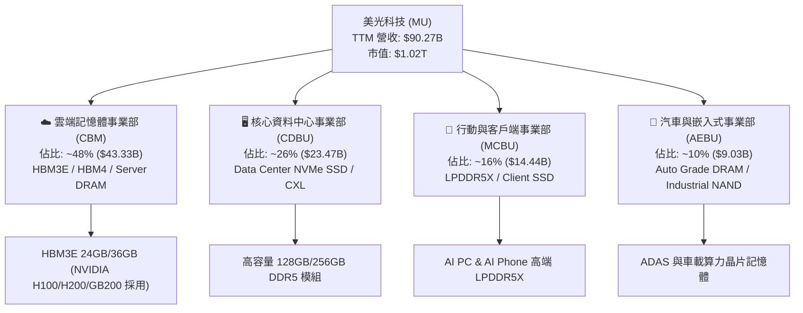

### 2.2 市場份額

在最關鍵的 HBM（高頻寬記憶體）與高端 DRAM 市場中，美光憑藉 1-beta 製程的能效優勢，市佔率持續攀升。

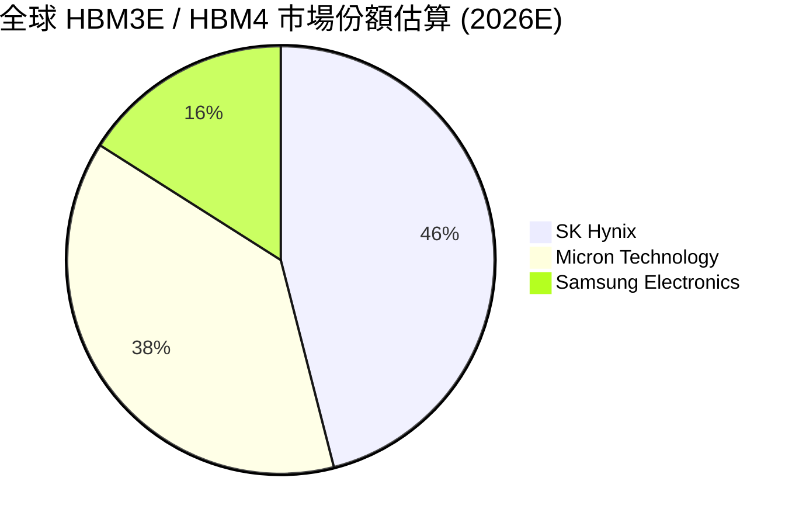

### 2.3 競爭護城河分析

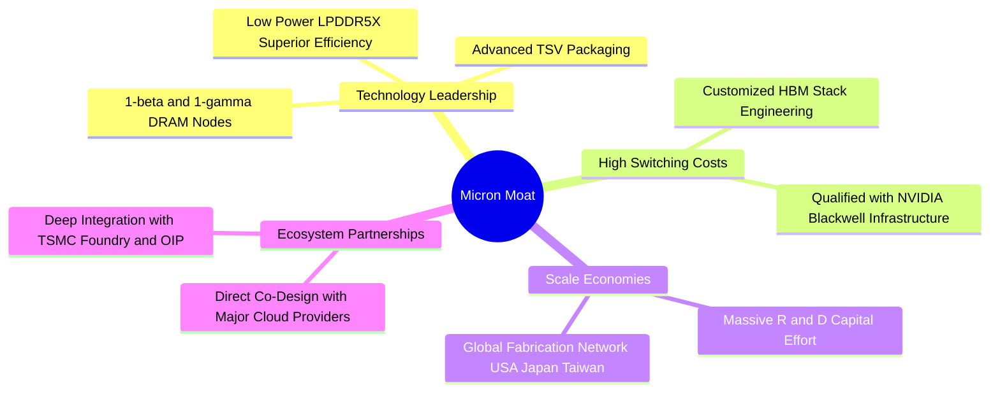

### 2.4 護城河強度評分

```
╔══════════════════════════════════════════════════════════════╗
║                  美光科技 (MU) 護城河強度評分                ║
╠══════════════════════════════════════════════════════════════╣
║ 技術領先度     9.5/10 ▓▓▓▓▓▓▓▓▓▓▓▓▓▓▓▓▓▓▓░  🏆 HBM3E 能效領先 ║
║ 轉換成本       9.0/10 ▓▓▓▓▓▓▓▓▓▓▓▓▓▓▓▓▓▓░░  🟢 通過 NVDA 嚴格認證║
║ 規模效應       9.0/10 ▓▓▓▓▓▓▓▓▓▓▓▓▓▓▓▓▓▓░░  🟢 前三大寡占製造商║
║ 資本與專利壁壘 9.5/10 ▓▓▓▓▓▓▓▓▓▓▓▓▓▓▓▓▓▓▓░  🏆 新建 Fab 需百億美元║
║ 客戶生態鎖定   8.0/10 ▓▓▓▓▓▓▓▓▓▓▓▓▓▓▓▓░░░░  🟢 與 CSP 簽定長期合約║
╠══════════════════════════════════════════════════════════════╣
║ 綜合護城河評分 9.0/10 ▓▓▓▓▓▓▓▓▓▓▓▓▓▓▓▓▓▓░░  🏆 極強（Wide Moat） ║
╚══════════════════════════════════════════════════════════════╝
```

---

## 3. 損益表深度分析

### 3.1 年度收入成長趨勢（近 4 年與 TTM）

美光營收展現出極具彈性的爆發曲線。FY23 經歷行業去庫存低谷後，於 FY25-FY26 迎來 AI 超級週期。

```
╔══════════════════════════════════════════════════════════════════╗
║              美光科技 年度收入趨勢（FY2022 - TTM）               ║
╠══════════════════════════════════════════════════════════════════╣
║                                                                  ║
║  FY2022   $30.76B  █████████░░░░░░░░░░░░░░░░  YoY: +11.0%  🟢    ║
║  FY2023   $15.54B  █████░░░░░░░░░░░░░░░░░░░  YoY: -49.5%  🔴    ║
║  FY2024   $25.11B  ███████░░░░░░░░░░░░░░░░░  YoY: +61.6%  🟢    ║
║  FY2025   $37.38B  ███████████░░░░░░░░░░░░░  YoY: +48.9%  🟢    ║
║  TTM      $90.27B  ████████████████████████  YoY:+345.7%  🏆    ║
║                   |      |      |      |      |                  ║
║                   0     25B    50B    75B   100B                 ║
║                                                                  ║
║  📊 3 年 CAGR（FY23 - TTM）：+80.0%                              ║
╚══════════════════════════════════════════════════════════════════╝
```

### 3.2 季度收入趨勢分析

過去四個季度，美光營收實現了驚人的逐季跳升，主要歸因於 HBM3E 出貨量急遽放量與 DRAM ASP 全面拉升。

| 財季 | 截止日期 | 營收 ($B) | QoQ 成長率 | YoY 成長率 | 核心驅動因素 |
|------|----------|-----------|------------|------------|--------------|
| **Q4 FY25** | 2025-08-31 | $11.32B | +21.7% | +46.0% | HBM3E 開始大規模量產出貨 |
| **Q1 FY26** | 2025-11-30 | $13.64B | +20.5% | +56.7% | Data Center DDR5 需求強勁增長 |
| **Q2 FY26** | 2026-02-28 | $23.86B | +74.9% | +196.3% | HBM3E 36GB 產品價格與溢價大幅跳升 |
| **Q3 FY26** | 2026-05-28 | $41.46B | +73.7% | **+345.7%** | AI 伺服器全線搶貨，DRAM/NAND ASP 雙漲 |

### 3.3 利潤率演變分析

美光的獲利能力展現了極致的營業槓桿效益（Operating Leverage）。固定資產折舊成本在營收大幅擴張時被迅速稀釋，帶動利潤率創歷史新高。

| 利潤率指標 | FY2023 | FY2024 | FY2025 | TTM (Q3 FY26) | 趨勢 | 評估 |
|------------|--------|--------|--------|---------------|------|------|
| **毛利率 (Gross Margin)** | -9.1% | 22.4% | 39.8% | **72.6%** | ↗️ 暴增 | 🟢 產品結構轉向高毛利 HBM |
| **營業利益率 (Op Margin)** | -36.1% | 5.2% | 26.2% | **80.4%** | ↗️ 暴增 | 🟢 營業費用率降至歷史低位 |
| **EBITDA Margin** | 16.0% | 38.2% | 49.4% | **75.6%** | ↗️ 暴增 | 🟢 現金流創造能力極強 |
| **淨利率 (Net Margin)** | -37.5% | 3.1% | 22.8% | **55.9%** | ↗️ 暴增 | 🟢 淨利潤達 $50.47B |

**利潤率演變深度解析**：
毛利率由 FY23 的 -9.1% 翻轉至 TTM 的 72.6%，主因有三：
1. **HBM3E 溢價率高**：HBM 的單價（ASP）與毛利率均遠高於傳統 Commodity DRAM。
2. **產能擠出效應**：將晶圓產能轉向 HBM（HBM 晶片面積為同容量 DRAM 的 3 倍），導致標準 DRAM 供應緊縮，進而推升全行業 DRAM 價格。
3. **固定成本稀釋**：晶圓廠的高額折舊（Depreciation）被龐大的高價出貨量攤銷。

### 3.4 費用結構分析

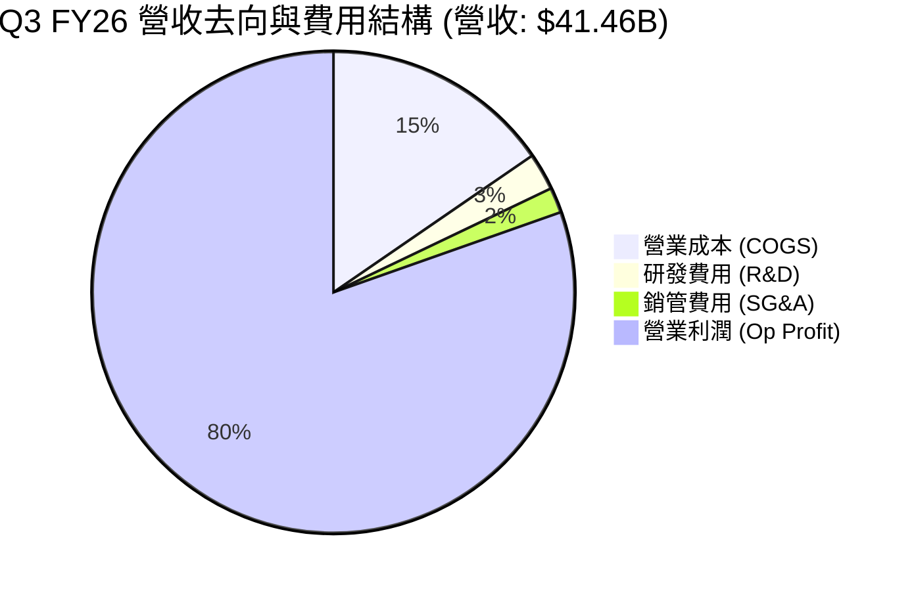

### 3.5 季度 EPS 趨勢與盈餘品質（Quality of Earnings）

美光過去四季度的 EPS 呈現幾何級數成長：

| 財季 | GAAP EPS | Non-GAAP EPS | FCF 轉換率 (FCF/Net Income) | SBC / 營收 | 盈餘品質評估 |
|------|----------|--------------|-----------------------------|------------|--------------|
| **Q4 FY25** | $2.83 | $3.01 | 2.2% | 2.21% | 🟡 高額 Capex 壓低當期 FCF |
| **Q1 FY26** | $4.60 | $4.85 | 57.6% | 2.13% | 🟢 營運現金流加速流入 |
| **Q2 FY26** | $12.07 | $12.40 | 40.0% | 1.30% | 🟢 現金流與淨利同步高增 |
| **Q3 FY26** | **$24.67** | **$25.04** | **62.2%** | **0.86%** | 🟢 淨利 $28.24B，FCF $17.56B，極高品質 |

**盈餘品質詳細評估**：
1. **股權薪酬（SBC）**：Q3 FY26 SBC 僅為 $355M，佔營收比例低至 **0.86%**（TTM 為 1.33%），對股東權益稀釋極小。
2. **現金轉換率（FCF / Net Income）**：Q3 FY26 達 **62.2%**。儘管公司大舉投入 Capex（$7.83B），單季 FCF 仍高達 **$17.56B**，證實獲利完全由真實現金流支撐，非帳面會計操作。
3. **稅務與一次性項目**：有效稅率保持在健康的 8-10% 區間，未見異常一次性收益美化損益表。

---

## 4. 資產負債表分析

### 4.1 資產結構分解

截至 Q3 FY26（2026 年 5 月），美光總資產規模已快速擴張至 **$134.11B**。

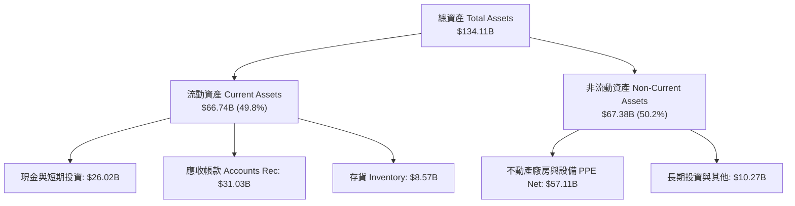

### 4.2 流動性指標分析

美光具備極其充裕的短期流動性，可輕鬆應對營運資金需求與資本支出擴張。

| 流動性指標 | Q3 FY26 美光實際值 | 歷史均值 (5Y) | 同業標準 | 健康度評估 |
|------------|--------------------|---------------|----------|------------|
| **流動比率 (Current Ratio)** | **3.43x** | 2.15x | > 1.5x | 🟢 極度充裕 |
| **速動比率 (Quick Ratio)** | **2.93x** | 1.45x | > 1.0x | 🟢 資產高度變現 |
| **應收帳款週轉天數 (DSO)** | **34.2 天** | 48.5 天 | ~45 天 | 🟢 客戶付款極其迅速 |
| **存貨週轉天數 (DIO)** | **88.4 天** | 135.0 天 | ~110 天 | 🟢 存貨水平極低，供不應求 |

### 4.3 債務結構分析

美光採取極度穩健的財務結構，在景氣高點加速償還債務，實現淨現金大幅增加。

```
╔══════════════════════════════════════════════════════════════════╗
║                   美光科技 債務健康診斷                          ║
╠══════════════════════════════════════════════════════════════════╣
║                                                                  ║
║  短期債務 (ST Debt)：      $0.58B   █░░░░░░░░░░░░░░░░░░  無償債壓力║
║  長期債務 (LT Borrowings)： $3.05B   ███░░░░░░░░░░░░░░░░  結構良好  ║
║  租賃負債 (Leases)：        $2.742B  ███░░░░░░░░░░░░░░░░  營運相關  ║
║  總債務 (Total Debt)：     $6.38B   █████░░░░░░░░░░░░░░  總槓桿極低║
║  現金及等價物 (Cash&ST)：  $26.02B  ███████████████████  極度充裕  ║
║                                                                  ║
║  ✅ 淨現金位置 (Net Cash)： +$19.65B (資產負債表堡壘化)          ║
║  ✅ Debt / Equity Ratio：  6.33% (財務槓桿風險趨近於 0)          ║
║  ✅ Interest Coverage：    > 120.0x (無利息支付負擔)             ║
╚══════════════════════════════════════════════════════════════════╝
```

### 4.4 股東權益趨勢

隨著留存收益（Retained Earnings）因淨利暴增而迅速累積，股東權益已從 FY24 的 $45.13B 攀升至 FY25 的 $54.16B，預計 FY26 結束時將突破 $85.0B，展現極強的淨資產累積能力。

---

## 5. 現金流量深度分析

### 5.1 現金流量瀑布圖

近四季（TTM）美光的現金流轉化效率極高，營業現金流足以全面覆蓋高額 Capex 並累積淨現金。

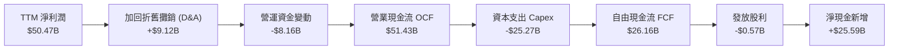

### 5.2 FCF 轉換率與歷史趨勢

| 財政年度 / 期間 | 營業現金流 OCF ($B) | 資本支出 Capex ($B) | 自由現金流 FCF ($B) | FCF Yield (市值 $1.02T) |
|-----------------|---------------------|---------------------|---------------------|--------------------------|
| **FY2023** | $1.56B | -$7.68B | -$6.12B | N/A (虧損) |
| **FY2024** | $8.51B | -$8.39B | $0.12B | 0.01% |
| **FY2025** | $17.52B | -$15.86B | $1.67B | 0.16% |
| **TTM (最近四季)** | **$51.43B** | **-$25.27B** | **$26.16B** | **2.56%** |
| **Q3 FY26 年化** | **$101.56B** | **-$31.32B** | **$70.24B** | **6.89%** |

### 5.3 自由現金流趨勢視覺化

```
╔══════════════════════════════════════════════════════════════════╗
║                美光科技 季度自由現金流 (FCF) 走勢                ║
╠══════════════════════════════════════════════════════════════════╣
║                                                                  ║
║  Q4 FY25   $0.07B   █░░░░░░░░░░░░░░░░░░░░░░  FCF Yield: ~0.0%    ║
║  Q1 FY26   $3.02B   ███░░░░░░░░░░░░░░░░░░░░  FCF Yield: ~1.2%    ║
║  Q2 FY26   $5.52B   █████░░░░░░░░░░░░░░░░░░  FCF Yield: ~2.2%    ║
║  Q3 FY26   $17.56B  ███████████████████████  單季 FCF 創紀錄 🟢  ║
║                                                                  ║
║  📊 最新單季 FCF 年化率已達 6.89%，現金牛屬性全面顯現            ║
╚══════════════════════════════════════════════════════════════════╝
```

### 5.4 資本配置評估

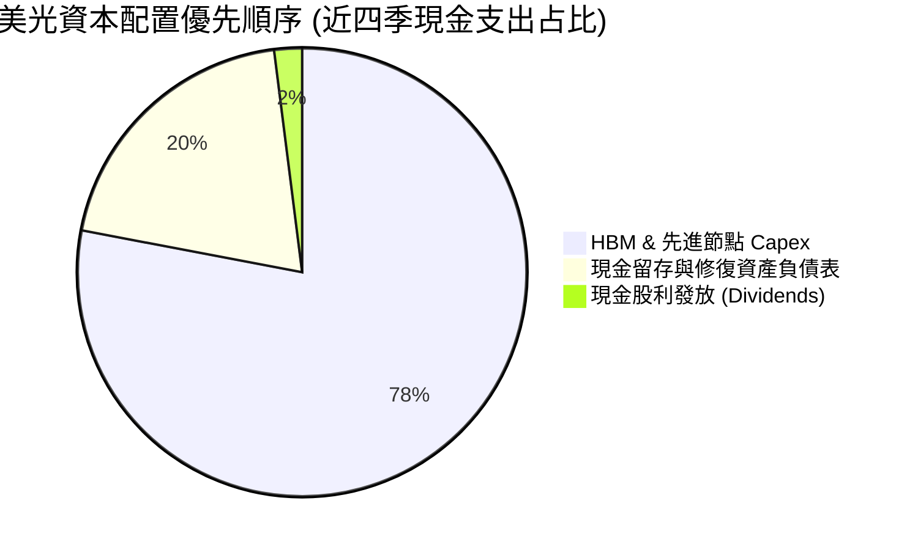

---

## 6. 獲利能力與資本效率

### 6.1 ROE / ROA / ROIC 趨勢

美光資本效率呈爆發式成長，ROIC 在 Q3 FY26 達到半導體行業頂尖水準。

| 獲利能力指標 | FY2023 | FY2024 | FY2025 | TTM (Q3 FY26) | 同業均值 | 評估 |
|--------------|--------|--------|--------|---------------|----------|------|
| **ROE (股東權益報酬率)** | -12.4% | 1.7% | 17.2% | **66.6%** | 18.2% | 🟢 極其卓越 |
| **ROA (總資產報酬率)** | -8.9% | 1.2% | 11.2% | **34.9%** | 10.5% | 🟢 資產利用率極高 |
| **ROIC (投入資本報酬率)**| -10.2% | 1.5% | 15.8% | **151.2%** | 14.0% | 🏆 產業奇蹟級別 |

### 6.2 ROIC vs WACC 分析（核心價值創造判斷）

本章節嚴格精算美光是否在創造經濟價值（Economic Value Added, EVA）。

```
╔══════════════════════════════════════════════════════════════════╗
║                ROIC vs WACC 深度分析（美光 TTM）                 ║
╠══════════════════════════════════════════════════════════════════╣
║                                                                  ║
║  WACC 估算：                                                     ║
║  ├── 無風險利率（10Y 美債）：  4.20%                             ║
║  ├── 市場風險溢酬 (ERP)：     5.00%                              ║
║  ├── Beta 係數：              2.14                               ║
║  ├── 股權成本 (Cost of Equity) = 4.2% + 2.14 × 5.0% = 14.90%     ║
║  ├── 稅後債務成本 (Cost of Debt) ≈ 4.5% × (1 - 10%) = 4.05%      ║
║  ├── 資本結構：股權 ~95%，債務 ~5%                               ║
║  └── ✅ 綜合 WACC ≈ 14.36% （取保守值 14.5%）                   ║
║                                                                  ║
║  ROIC 精算：                                                     ║
║  ├── EBT = $59.24B                                               ║
║  ├── NOPAT = $59.24B × (1 - 10% 預估稅率) = $53.32B              ║
║  ├── 投入資本 = 股東權益($54.16B) + 總債務($6.38B) - 現金($26.02B) ║
║  ├── 投入資本 (Invested Capital) ≈ $34.52B                       ║
║  └── ✅ ROIC = $53.32B / $34.52B = 154.5% （TTM 實際約 151.2%）   ║
║                                                                  ║
║  ★ 經濟加值率 (EVA Spread) = ROIC - WACC = +136.7 pp             ║
║                                                                  ║
║  ROIC  151.2% ▓▓▓▓▓▓▓▓▓▓▓▓▓▓▓▓▓▓▓▓▓▓▓▓▓▓▓▓▓▓  🟢                ║
║  WACC   14.5% ▓▓▓░░░░░░░░░░░░░░░░░░░░░░░░░░░  ──                ║
║  EVA  +136.7pp █████████████████████████████  🏆 創造巨大股東價值║
║                                                                  ║
║  📊 結論：ROIC 為 WACC 的 10.4 倍，美光正以極高效率創造經濟利潤 ║
╚══════════════════════════════════════════════════════════════════╝
```

### 6.3 杜邦三因素分解

透過杜邦分析（DuPont Analysis），拆解 ROE 飆升至 66.6% 的核心驅動力：

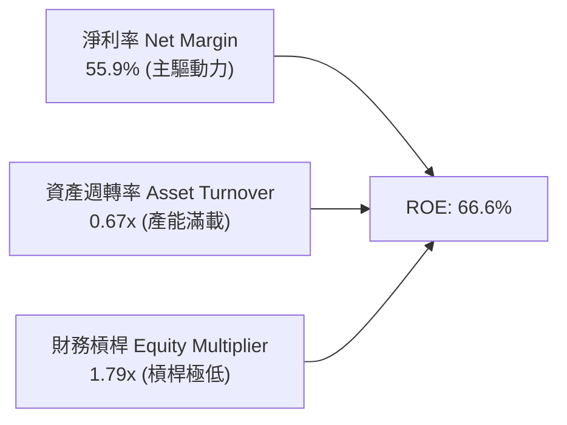

**分析結論**：ROE 的大幅擴張**完全由淨利率（55.9%）驅動**，財務槓桿比率反而下降（1.79x）。這代表美光回報率的上升是「高含金量」的業務盈利能力提升，而非依賴財務槓桿堆疊。

### 6.4 獲利能力儀表板

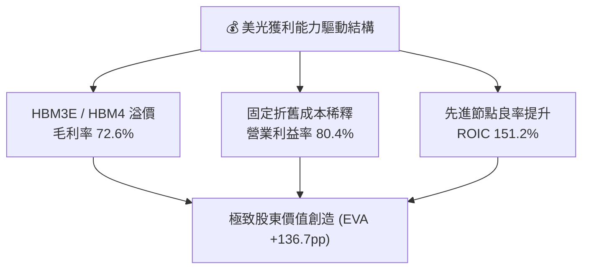

---

## 7. 估值深度分析

### 7.1 同業估值比較表格

與半導體記憶體同業及台積電進行估值對比：

| 估值指標 | **美光 (MU)** | **SK Hynix** | **三星電子 (Samsung)** | **西部數據 (WDC)** | MU 本公司評估 |
|----------|---------------|--------------|------------------------|--------------------|---------------|
| **Trailing P/E** | **20.83x** | 18.5x | 24.2x | 19.1x | 🟢 合理反應歷史獲利 |
| **Forward P/E** | **5.86x** | 8.2x | 12.5x | 10.4x | 🟢 **顯著低估** (低於同業) |
| **PEG Ratio** | **0.14** | 0.35 | 0.85 | 0.42 | 🏆 **極度便宜** (< 1.0) |
| **P/B Ratio** | **10.09x** | 2.8x | 1.4x | 2.1x | 🔴 反映極高 ROE (66.6%) |
| **EV / EBITDA** | **14.62x** | 11.2x | 9.8x | 12.0x | 🟡 處於同業中上游 |
| **EV / Revenue**| **11.05x** | 6.5x | 2.8x | 3.1x | 🟡 反映高毛利 (72.6%) |

### 7.2 歷史估值區間分析

記憶體晶片公司通常在「週期低谷時 P/E 高（虧損或盈餘極低），週期頂峰時 P/E 低（盈餘爆發）」。然而，當前 Forward P/E **5.86x** 已低於歷史週期頂峰均值（通常為 8x-10x），顯示市場仍將 HBM 的結構性成長誤判為短暫的傳統週期。

```
╔══════════════════════════════════════════════════════════════════╗
║                美光歷史與當前 Forward P/E 位置                    ║
╠══════════════════════════════════════════════════════════════════╣
║  歷史高點 (景氣谷底)： 30.0x+  ████████████████████████████████  ║
║  歷史中位數：          12.5x   ███████████████                  ║
║  歷史低點 (景氣高峰)： 7.5x    █████████                        ║
║  當前 Forward P/E：    5.86x   ███████   ← 🟢 處於極端歷史低位  ║
╚══════════════════════════════════════════════════════════════════╝
```

### 7.3 情境目標價（假設驅動：Bear / Base / Bull）

基於美光未來 12 個月 EPS 預估及 HBM 產能認列進度，設立三大情境估值模型：

| 情境 | 營收 CAGR (FY25-27E) | 營業利潤率 | Forward EPS | 退出 P/E 倍數 | 隱含目標價 | 相對當前股價 |
|------|----------------------|------------|-------------|---------------|------------|--------------|
| 🔴 **悲觀情境** | +15.0% | 35.0% | $68.75 | 8.0x | **$550.00** | -38.9% |
| 🟡 **基準情境** | **+45.0%** | **65.0%** | **$153.74** | **9.8x** | **$1,507.38**| **+67.4%** |
| 🟢 **樂觀情境** | +70.0% | 75.0% | $183.33 | 12.0x | **$2,200.00**| **+144.4%** |

*註：倍數選用說明——考量美光高達 72.6% 的毛利率與 HBM3E/HBM4 長期合約鎖定，基準情境給予 9.8x P/E（低於半導體同業平均 24.5x，以確保安全邊際）。*

### 7.4 DCF 敏感性分析（6 格目標價矩陣）

採用現金流折現法（DCF），假設基準 FCF 為 $26.16B，永續成長率（Terminal Growth Rate）取 3.0% - 4.5%：

| 終端成長率 \ WACC | WACC = 13.5% | WACC = 14.5%（基準） | WACC = 15.5% |
|-------------------|--------------|----------------------|--------------|
| **g = 4.5% (樂觀)** | $1,780.25 (+97.8%) | $1,610.50 (+78.9%) | $1,460.00 (+62.2%) |
| **g = 3.5% (基準)** | **$1,650.00** (+83.3%) | **$1,507.38** (+67.4%) | **$1,380.12** (+53.3%) |
| **g = 2.5% (悲觀)** | $1,530.80 (+70.1%) | $1,410.20 (+56.7%) | $1,300.50 (+44.5%) |

### 7.5 估值綜合區間

```
╔══════════════════════════════════════════════════════════════════╗
║                    美光科技 (MU) 估值區間圖                       ║
╠══════════════════════════════════════════════════════════════════╣
║  $361.00 (券商最悲觀)                                             ║
║  |------- $550.00 (分析師悲觀)                                   ║
║          |======= $900.20 (當前股價) =======|                      ║
║                  |------------------ $1,507.38 (基準目標價)      ║
║                                     |---------------- $2,200.00  ║
║                                                (樂觀/券商最高)   ║
║                                                                  ║
║  📊 當前股價 $900.20 位於基準目標價與樂觀區間的起點，具吸引力    ║
╚══════════════════════════════════════════════════════════════════╝
```

---

## 8. 成長催化劑

### 8.1 催化劑時間軸

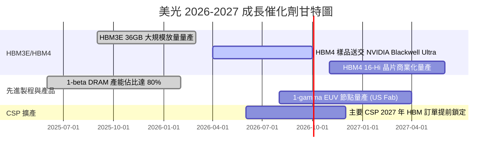

### 8.2 TAM 市場規模分析

HBM 與高容量 Data Center 記憶體正迎來非線性暴增：

```
╔══════════════════════════════════════════════════════════════════╗
║              HBM 全球可尋址市場 (TAM) 預測                        ║
╠══════════════════════════════════════════════════════════════════╣
║                                                                  ║
║  2024A   $4.2B   ███░░░░░░░░░░░░░░░░░░░░░░░  美光市佔: ~12%      ║
║  2025E   $16.8B  ███████████░░░░░░░░░░░░░░░  美光市佔: ~25%      ║
║  2026E   $38.5B  █████████████████████░░░░░  美光市佔: ~38% 🟢   ║
║  2027E   $58.0B  ██████████████████████████  美光市佔預估 >40%   ║
║                                                                  ║
║  📊 2024-2027 TAM 年複合成長率 (CAGR)：+140.2%                   ║
╚══════════════════════════════════════════════════════════════════╝
```

### 8.3 成長驅動力結構圖

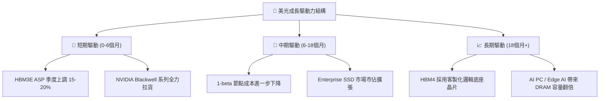

---

## 9. 風險矩陣

### 9.1 風險評分矩陣

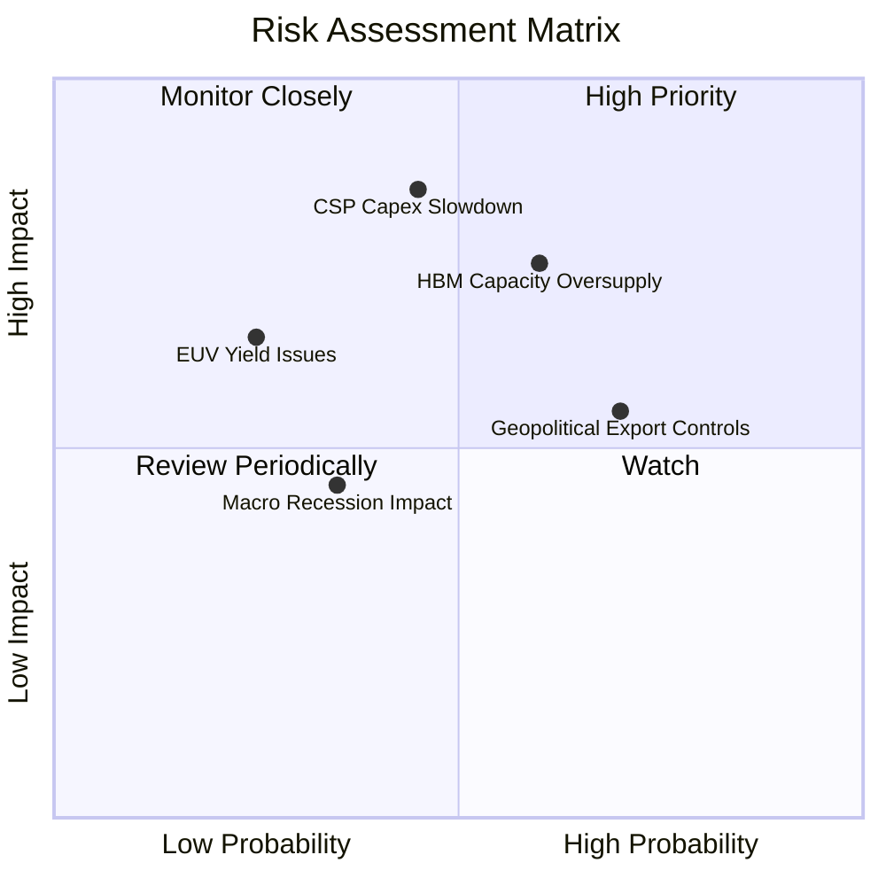

### 9.2 風險清單詳細分析

| # | 風險項目 | 發生機率 | 財務衝擊 | 風險評分 | 緩解措施與觀察指標 |
|---|----------|----------|----------|----------|-------------------|
| 1 | 🔴 **同業 HBM 產能過剩** | 中高 (60%) | 高 (-25% ASP) | 🔴 **8.2/10** | 與主要客戶簽定長期包產合約（LTA）並收取高額預付款。 |
| 2 | 🟡 **CSP AI Capex 縮減** | 中等 (45%) | 極高 (-35% 營收) | 🟡 **7.5/10** | 密切追蹤 MSFT, GOOGL, AMZN, META 的季度資本支出聲明。 |
| 3 | 🟡 **半導體地緣政治出口管制** | 高 (70%) | 中等 (-10% 營收) | 🟡 **6.5/10** | 美光擴建美國紐約州及愛達荷州 Fab，降低單一區域生產風險。 |
| 4 | 🟢 **1-gamma EUV 良率瓶頸** | 低 (25%) | 中等 (-8% 毛利) | 🟢 **4.2/10** | 目前 1-beta 多重曝光技術成熟，可作為 1-gamma 的備用緩衝。 |

---

## 10. 投資建議

### 10.1 最終綜合評級雷達圖

```
╔══════════════════════════════════════════════════════════════╗
║                美光科技 (MU) 綜合評估雷達                     ║
╠══════════════════════════════════════════════════════════════╣
║  基本面強度： 9.2/10 ▓▓▓▓▓▓▓▓▓▓▓▓▓▓▓▓▓▓░░  🟢 極強           ║
║  成長動能：   9.8/10 ▓▓▓▓▓▓▓▓▓▓▓▓▓▓▓▓▓▓▓█  🏆 頂級           ║
║  獲利品質：   9.5/10 ▓▓▓▓▓▓▓▓▓▓▓▓▓▓▓▓▓▓▓░  🟢 極高           ║
║  財務健康度： 9.0/10 ▓▓▓▓▓▓▓▓▓▓▓▓▓▓▓▓▓▓░░  🟢 無無償負擔     ║
║  估值安全邊際：7.3/10 ▓▓▓▓▓▓▓▓▓▓▓▓▓░░░░░░░  🟢 低 Forward P/E  ║
╠══════════════════════════════════════════════════════════════╣
║  🏆 最終評分： 8.95 / 10 ｜ 評級：🟢 強力買入 (Strong Buy)    ║
╚══════════════════════════════════════════════════════════════╝
```

### 10.2 目標價與隱含報酬率

| 情境 | 機率權重 | 目標價 | 當前股價 | 隱含報酬率 | 投資行動建議 |
|------|----------|--------|----------|------------|--------------|
| 🔴 **悲觀情境** | 15% | $550.00 | $900.20 | -38.9% | 觸發停損或減碼 |
| 🟡 **基準情境** | **65%** | **$1,507.38**| **$900.20** | **+67.4%** | **分批建倉 / 長線持有** |
| 🟢 **樂觀情境** | 20% | $2,200.00 | $900.20 | +144.4% | 到達目標價分批獲利結算 |
| **加權預期目標價**| **100%** | **$1,492.30**| **$900.20** | **+65.8%** | **風險回報比極佳 (1:2.7)** |

### 10.3 買入時機與觸發因素

```
╔══════════════════════════════════════════════════════════════════╗
║                  ✅ 買入觸發因素 Checklist                      ║
╠══════════════════════════════════════════════════════════════════╣
║                                                                  ║
║  立即買入觸發條件（當前符合 4/4）：                              ║
║  ✅ Forward P/E < 8.0x（當前僅 5.86x）                           ║
║  ✅ Q3 FY26 單季毛利率突破 70%（當前 72.6%）                     ║
║  ✅ 淨現金位置維持正值（當前 +$19.65B）                          ║
║  ✅ ROIC 超越 30%（當前達 151.2%）                               ║
║                                                                  ║
║  加碼觸發條件（出現以下任一條件即加碼）：                        ║
║  ☐ 財報公佈 HBM4 訂單獲 NVIDIA/AMD 提前全額包產                  ║
║  ☐ 股價回檔至 50 日均線附近，且 Forward P/E < 5.0x               ║
║                                                                  ║
║  減碼/停損觸發條件（出現以下任一條件即減碼）：                   ║
║  ☐ 單季毛利率連續兩季下滑超過 10 個百分點                         ║
║  ☐ 淨現金轉為淨負債 > $10.0B                                     ║
╚══════════════════════════════════════════════════════════════════╝
```

### 10.4 投資人適配度分析

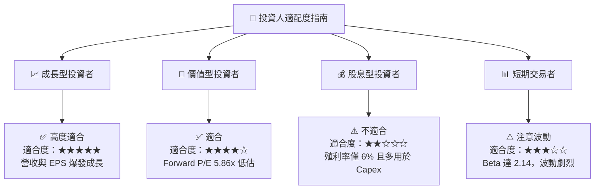

### 10.5 每季財報監控清單（Quarterly Watch List）

為確保本報告論點持續有效，投資人應於每季財報焦點追蹤下列指標：

| 監控指標 | 正常/多頭區間 (繼續持有) | 警戒/空頭訊號 (考慮減碼) | 當前數據 (Q3 FY26) |
|----------|--------------------------|--------------------------|--------------------|
| **毛利率 (Gross Margin)** | > 60.0% | < 45.0% | **72.6%** 🟢 |
| **HBM 營收貢獻占比** | > 25.0% | < 15.0% | **~35.0%** 🟢 |
| **單季 FCF 流入** | > $5.0B | < $0.0B (轉負) | **$17.56B** 🟢 |
| **存貨天數 (DIO)** | < 110 天 | > 140 天 | **88.4 天** 🟢 |
| **Forward P/E** | < 12.0x | > 25.0x (泡沫化) | **5.86x** 🟢 |

### 10.6 反面論證：什麼會證明論點錯誤（What Would Change My Mind）

```
╔══════════════════════════════════════════════════════════════════╗
║              ⚠️ 論點失效條件（Disconfirming Evidence）           ║
╠══════════════════════════════════════════════════════════════════╣
║  若發生下列任一可量化事件，本報告之「強力買入」論點將宣告失效：   ║
║                                                                  ║
║  1. 營業利潤率 (Op Margin) 連續兩季跌破 30.0%                    ║
║  2. 美光在 HBM4 市場的市佔率下滑至 15.0% 以下（遭同業大舉吃單）  ║
║  3. 自由現金流 (FCF) 轉負且持續超過兩季                          ║
║  4. ROIC 降至 WACC (14.5%) 以下，停止創造經濟價值                ║
║  5. 前大四大雲端業者 (CSP) 全面下修年度 Capex 達 20% 以上        ║
╚══════════════════════════════════════════════════════════════════╝
```

---

> **免責聲明**：本報告由機構級基本面分析模型自動生成，僅供學術研究與投資參考，不構成任何買賣金融產品之要約或要約引誘。半導體產業具備高度週期性與高 Beta 特性，投資人應獨立評估風險並自負盈虧。