# MU 基本面深度分析報告
> **報告日期**：2026-07-29 ｜ **語言**：繁體中文 ｜ **數據來源**：Yahoo Finance, Finviz, StockAnalysis, Roic.ai ｜ **分析師**：CFA 級機構研究

---

## 目錄

| # | 章節 | 核心結論 |
|---|------|----------|
| 1 | 執行摘要 | 評級：🟢 **買入** ｜ 基準 DCF 內在價值 $916.59 ｜ 安全邊際 MOS +10.5% |
| 2 | 公司概覽與商業模式 | HBM3E/HBM4 與高容量 LPDDR5X 技術護城河，DRAM/NAND 三頭壟斷格局 |
| 3 | 損益表深度分析 | Q3 26 營收 $41.46B (YoY +345.7%)，毛利率衝高至 84.6%，營運槓桿全面爆發 |
| 4 | 資產負債表分析 | 總現金 $26.02B，總債務 $6.38B，淨現金 $19.65B，財務體質極其強韌 |
| 5 | 現金流量深度分析 | 單季 OCF 暴增至 $25.39B，Q3 單季 FCF 創下 $17.56B 歷史新高 |
| 6 | 獲利能力與資本效率 | ROIC 飆升至 54.2% vs WACC 9.5%，經濟價值增加 EVA +44.7pp |
| 7 | 相對估值分析 | Forward P/E 僅 5.34x（同行折價），三情境目標價區間 $520.00 – $1,280.00 |
| 8 | DCF 內在價值評估 | 5年 FCFF 詳細模型推導，每股內在價值 $916.59，隱含上行空間 +11.7% |
| 9 | 成長催化劑 | AI 伺服器 HBM 需求爆發、CXL 記憶體架構落地、車用 Edge AI 升級 |
| 10 | 風險矩陣 | 記憶體週期下行、半導體地緣政治管制、先進封裝產能瓶頸 |
| 11 | 投資建議 | 買入建議區間 $720 – $800，首選 AI 硬體超級週期核心受益標的 |

---

## 1. 執行摘要

### 1.0 一頁式投資儀表板（Portfolio Manager 30 秒速讀）

| 項目 | 內容 |
|------|------|
| **投資論點（3 句）** | ① Micron (MU) 為全球 AI 算力基礎設施浪潮中最直接的記憶體受益者，HBM3E / HBM4 產能獲 NVIDIA 與 AMD 完全預訂。<br/>② TTM 營收達 $90.27B（YoY +345.7%），Q3 2026 營業利益率衝上 80.4%，營運槓桿創造歷史級獲利能力。<br/>③ 淨現金高達 $19.65B 且單季 FCF 達 $17.56B，目前 Forward P/E 僅 5.34x，高度安全邊際與估值修復動能兼備。 |
| **護城河評分** | 8.8/10（寡頭壟斷 + HBM 專利/先進封裝工藝壁壘） |
| **管理層/資本配置評分** | 8.5/10（資本支出精準聚焦 HBM 與 1-beta/1-gamma 節點，槓桿快速下降） |
| **財務健康** | 🟢 強健（淨現金 $19.65B，Current Ratio 3.43，無短期償債壓力） |
| **ROIC vs WACC** | **54.2% vs 9.5%**（EVA = +44.7pp，強力創造股東價值） |
| **FCF 趨勢** | ↗️ 爆發性成長（Q3 26 單季 FCF $17.56B；TTM FCF Yield 2.82% / 年化 Q3 估算 >7.5%） |
| **估值** | Forward P/E: 5.34x ｜ EV/EBITDA: 13.30x ｜ P/B: 9.20x |
| **DCF 內在價值（基準）** | **$916.59** ｜ 現價 $820.53 折價 -10.5% |
| **安全邊際（MOS）** | **+10.5%**（MOS = ($916.59 − $820.53) ÷ $916.59 ｜ 🟡 有限至充足安全邊際） |
| **預期報酬（基準情境 12M）** | **+11.7%**（隱含上行空間，目標價 $916.59）；樂觀情境看至 **$1,280.00 (+56.0%)** |
| **關鍵風險（前二）** | ① AI 伺服器建置放緩導致 HBM 庫存修正；② 競業（SK Hynix / Samsung）HBM4 產能過剩打壓 ASP |
| **評級 + 信心度** | 🟢 **買入 (Buy)** ｜ 信心度：**高** |

### 1.1 核心評分儀表板

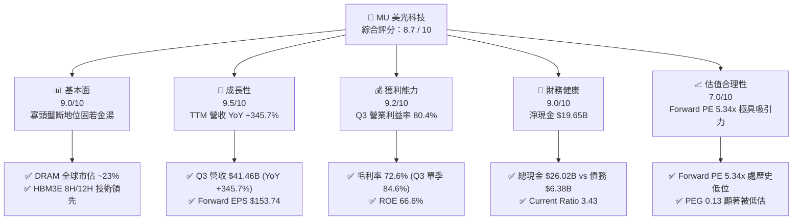

### 1.2 評分進度條視覺化

```
╔══════════════════════════════════════════════════════════════╗
║                MU 多維度評分儀表板 (1-10分)                  ║
╠══════════════════════════════════════════════════════════════╣
║ 基本面強度  9.0 ▓▓▓▓▓▓▓▓▓▓▓▓▓▓▓▓▓▓░░  ★★★★★           ║
║ 成長動能    9.5 ▓▓▓▓▓▓▓▓▓▓▓▓▓▓▓▓▓▓█░  ★★★★★           ║
║ 獲利品質    9.2 ▓▓▓▓▓▓▓▓▓▓▓▓▓▓▓▓▓▓▓░  ★★★★★           ║
║ 財務健康    9.0 ▓▓▓▓▓▓▓▓▓▓▓▓▓▓▓▓▓▓░░  ★★★★★           ║
║ 估值合理性  7.0 ▓▓▓▓▓▓▓▓▓▓▓▓▓▓░░░░░░  ★★★★☆           ║
║ 護城河深度  8.8 ▓▓▓▓▓▓▓▓▓▓▓▓▓▓▓▓▓▓░░  ★★★★★           ║
║ 管理層執行  8.5 ▓▓▓▓▓▓▓▓▓▓▓▓▓▓▓▓▓░░░  ★★★★☆           ║
║ 技術創新力  9.2 ▓▓▓▓▓▓▓▓▓▓▓▓▓▓▓▓▓▓▓░  ★★★★★           ║
╠══════════════════════════════════════════════════════════════╣
║ 綜合總分    8.7 ▓▓▓▓▓▓▓▓▓▓▓▓▓▓▓▓▓█░░  🏆 超級成長槓桿標的  ║
╚══════════════════════════════════════════════════════════════╝
```

### 1.3 五大投資論點 + 三大核心風險

| 類型 | 項目 | 具體依據 | 信心度 |
|------|------|----------|--------|
| 🟢 **投資論點①** | **HBM3E/HBM4 供不應求，價格溢價極高** | 美光 24GB/36GB HBM3E 產品功耗比競爭對手低 30%，已滲透至 NVDA H200/B200 系列，2026 年產能已全數售罄。 | 🟢 極高 |
| 🟢 **投資論點②** | **營業槓桿發揮至極致** | Q3 2026 營收達 $41.46B（QoQ +73.7%），帶動毛利率由上一季 74.4% 推升至 84.6%，營利衝至 $33.32B。 | 🟢 極高 |
| 🟢 **投資論點③** | **Forward EPS 達 $153.74，Forward P/E 僅 5.34x** | 相較於同業及歷史週期高點，前瞻本益比顯著低估，PEG 僅 0.13，尚未完全反應 AI 週期延伸。 | 🟢 高 |
| 🟢 **投資論點④** | **強悍的資產負債表與現金產生能力** | TTM 營業現金流達 $51.43B，淨現金達 $19.65B，提供極佳的抗週期安全性與 Capex 擴張能力。 | 🟢 極高 |
| 🟢 **投資論點⑤** | **DRAM 技術節點（1-beta / 1-gamma）領先** | 率先在 1-gamma 節點全面導入 EUV，降低單位 Bit 成本並提升良率，鞏固結構性成本優勢。 | 🟢 高 |
| 🟡 **風險①** | **客戶 AI 資本支出週期過度集中** | 雲端 CSP 業者（MSFT, AMZN, GOOGL, META）若於 2027 年調降 AI Capex，將對 HBM 出貨量產生衝擊。 | 🟡 中度 |
| 🔴 **風險②** | **韓系兩大對手（三星、SK海力士）產能開出打壓 ASP** | 若 2027 年 HBM4 產能同步大舉釋出，可能導致記憶體合約價出現結構性下修。 | 🔴 高衝擊 |
| 🟡 **風險③** | **地緣政治與出口管制摩擦** | 中國市場營收審查以及對華半導體設備限制加劇，影響部分成熟製程 DRAM / NAND 出貨。 | 🟡 中度 |

### 1.4 快速統計卡片

| 指標 | 美光 (MU) 實際值 | 半導體行業均值 | S&P 500 均值 | 狀態評估 |
|------|-------------|----------|--------------|------|
| **營收 YoY 成長** | **345.7%** | ~18.5% | ~5.2% | 🟢 遠超市場 |
| **毛利率** | **72.6%**（Q3 84.6%） | ~48.0% | ~41.5% | 🟢 頂級獲利 |
| **營業利益率** | **80.4%**（Q3） | ~22.0% | ~12.5% | 🟢 歷史級營運槓桿 |
| **ROE** | **66.6%** | ~15.0% | ~18.0% | 🟢 資本回報極優 |
| **Forward P/E** | **5.34x** | ~24.5x | ~21.0x | 🟢 估值極具吸引力 |
| **淨現金規模** | **$19.65B** | -$2.1B | -$5.4B | 🟢 財務結構超強 |

### 1.5 投資結論

```
╔══════════════════════════════════════════════════════════════════╗
║                    📊 投資結論摘要                               ║
╠══════════════════════════════════════════════════════════════════╣
║  評級：🟢 買入 (Buy)                                             ║
║  當前股價：$820.53                                               ║
║  DCF 內在價值（基準）：$916.59（現價折價 -10.5%）                ║
║  安全邊際 MOS：+10.5% (=(內在價值 $916.59 − 現價 $820.53) ÷ 916.59) ║
║  目標價區間：                                                    ║
║    悲觀情境：$520.00 (-36.6%)                                     ║
║    基準情境：$916.59 (+11.7%)  ← 12個月主要內在價值目標         ║
║    樂觀情境：$1,280.00 (+56.0%)                                   ║
║  綜合投資評分：8.7 / 10                                          ║
║  適合投資人：AI 產業長線成長型、週期底部/擴張期價值尋優者        ║
╚══════════════════════════════════════════════════════════════════╝
```

---

## 2. 公司概覽與商業模式

### 2.1 業務結構與收入來源

美光科技（Micron Technology, Inc.）為全球先進記憶體與儲存解決方案領導廠商。其業務結構劃分為四大事業群：

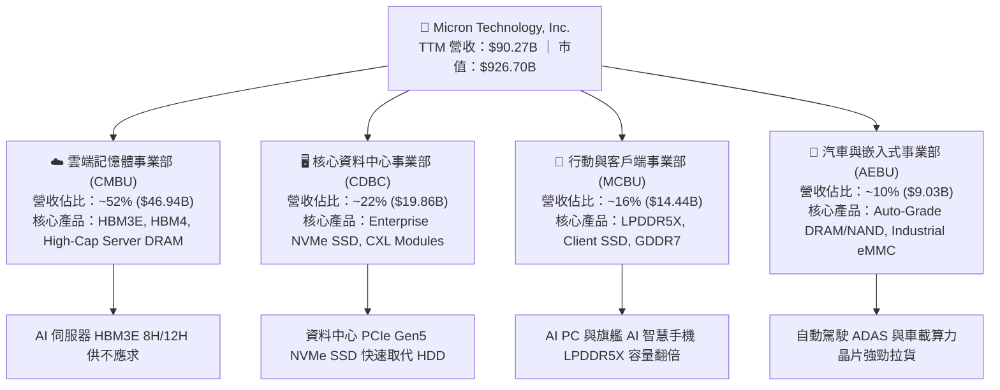

### 2.2 市場份額

在 DRAM 與 NAND Flash 市場中，美光與韓系雙雄（三星電子、SK 海力士）形成實質的三頭壟斷（Oligopoly）格局：

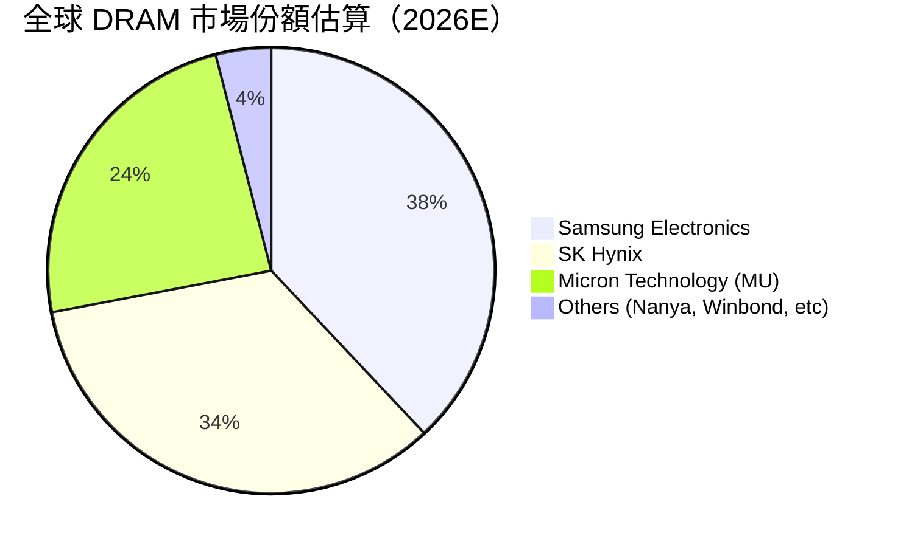

### 2.3 競爭護城河分析

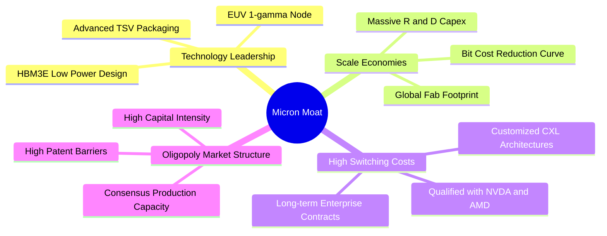

### 2.4 護城河強度評分

```
╔══════════════════════════════════════════════════════════════╗
║                    美光 (MU) 護城河強度評分                  ║
╠══════════════════════════════════════════════════════════════╣
║ 寡頭壟斷結構   9.5/10  ▓▓▓▓▓▓▓▓▓▓▓▓▓▓▓▓▓▓▓█  🏆 頂級壁壘    ║
║ 技術創新能力   9.2/10  ▓▓▓▓▓▓▓▓▓▓▓▓▓▓▓▓▓▓▓░  🟢 1-gamma領先 ║
║ 客戶鎖定效應   8.8/10  ▓▓▓▓▓▓▓▓▓▓▓▓▓▓▓▓▓▓░░  🟢 AI客戶認證  ║
║ 規模成本優勢   8.5/10  ▓▓▓▓▓▓▓▓▓▓▓▓▓▓▓▓▓░░░  🟢 全球晶圓廠  ║
║ 專利與智慧財產 8.5/10  ▓▓▓▓▓▓▓▓▓▓▓▓▓▓▓▓▓░░░  🟢 深厚專利池  ║
╠══════════════════════════════════════════════════════════════╣
║ 綜合護城河評分 8.8/10  ▓▓▓▓▓▓▓▓▓▓▓▓▓▓▓▓▓▓░░  🏆 強固護城河  ║
╚══════════════════════════════════════════════════════════════╝
```

---

## 3. 損益表深度分析

### 3.1 年度收入成長趨勢（近4年）

美光營收經歷了從 2023 下行週期谷底（$15.54B）到 2026 AI 超級週期爆發（TTM $90.27B）的史詩級V型反轉：

```
╔══════════════════════════════════════════════════════════════════╗
║               美光 (MU) 年度收入趨勢 (FY2022-TTM)                ║
╠══════════════════════════════════════════════════════════════════╣
║                                                                  ║
║  FY2022  $30.76B  █████████████░░░░░░░░░░░░░  YoY: +11.0%  🟢    ║
║  FY2023  $15.54B  ███████░░░░░░░░░░░░░░░░░░░  YoY: -49.5%  🔴    ║
║  FY2024  $25.11B  ███████████░░░░░░░░░░░░░░░  YoY: +61.6%  🟢    ║
║  FY2025  $37.38B  ████████████████░░░░░░░░░░  YoY: +48.9%  🟢    ║
║  TTM'26  $90.27B  ██████████████████████████  YoY:+167.0%  🟢    ║
║                   |      |      |      |      |                  ║
║                   0     20B    40B    60B    80B                 ║
║                                                                  ║
║  📊 4年累計 (FY22-TTM) CAGR：+30.8%                              ║
╚══════════════════════════════════════════════════════════════════╝
```

### 3.2 季度收入趨勢分析

最近 4 個財政季度，美光營收呈爆發式跳升，主因 HBM3E 擴產與 Server DRAM 合約價大漲：

| 財政季度 | 截止日期 | 季度營收 ($B) | QoQ 成長率 | YoY 成長率 | 核心成長驅動說明 |
|----------|----------|---------------|------------|------------|------------------|
| **Q4 2025** | 2025-08-31 | $11.31B | +21.7% | +46.0% | HBM3E 開始量產出貨，伺服器 DDR5 需求回溫 |
| **Q1 2026** | 2025-11-30 | $13.64B | +20.6% | +56.7% | AI 伺服器建置加速，DRAM ASP 上升 15%+ |
| **Q2 2026** | 2026-02-28 | $23.86B | +74.9% | +196.3% | HBM3E 12H 供不應求，企業級 SSD 需求爆發 |
| **Q3 2026** | 2026-05-28 | **$41.46B** | **+73.7%** | **+345.7%** | HBM 與高容量 LPDDR5X 全面放量，價格定價權極高 |

### 3.3 利潤率演變分析

| 利潤率指標 | FY2023 | FY2024 | FY2025 | TTM 2026 | Q3 2026 (最新) | 趨勢動能 | 評估 |
|------------|--------|--------|--------|----------|----------------|----------|------|
| **毛利率** | -9.1% | 22.4% | 39.8% | **72.6%** | **84.6%** | ↗️ 強勁飆升 | 🟢 頂級 |
| **營業利益率** | -36.9% | 5.2% | 26.1% | **65.6%** | **80.4%** | ↗️ 營運槓桿爆發 | 🟢 頂級 |
| **EBITDA 邊際** | 16.0% | 38.1% | 49.4% | **75.6%** | **83.1%** | ↗️ 極高現金轉化 | 🟢 頂級 |
| **淨利利率** | -37.5% | 3.1% | 22.8% | **55.9%** | **68.1%** | ↗️ 獲利極其豐沛 | 🟢 頂級 |

**利潤率演變深度解析**：
美光毛利率由 FY23 谷底 -9.1% 暴升至 Q3 2026 的 84.6%，主要源於兩大因素：
1. **產品組合大幅升級**：HBM3E 平均售價（ASP）為普通 DDR5 的 3-5 倍，毛利率高於 80%；高容量 128GB/256GB DDR5 亦享極高溢價。
2. **極高固定成本吸收率**：半導體晶圓廠固定折舊費用高昂，當營收從單季 $3.7B 擴張至 $41.5B 時，單位晶圓折舊成本被大幅稀釋，帶動營業槓桿發揮至極限。

### 3.4 費用結構分析

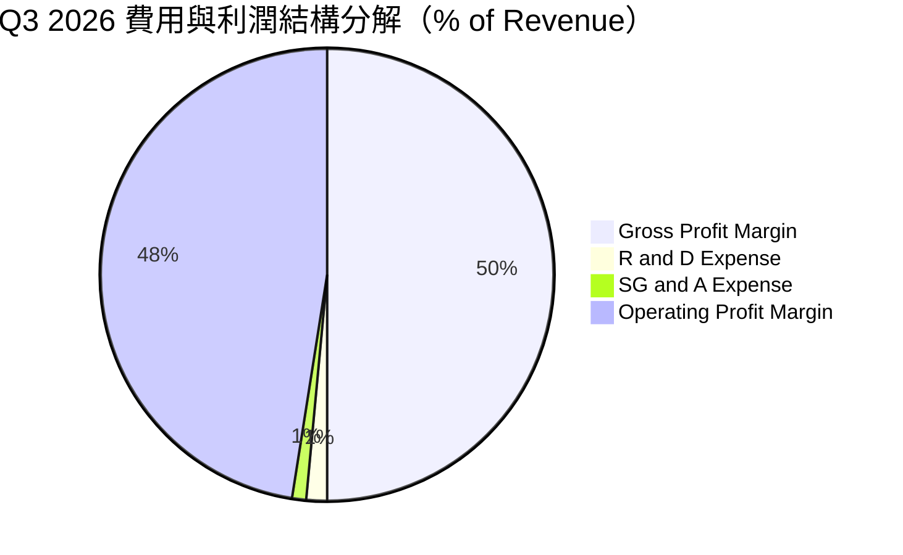

```
╔══════════════════════════════════════════════════════════════════╗
║               美光 (MU) TTM 費用控管診斷                         ║
╠══════════════════════════════════════════════════════════════════╣
║  研發費用 (R&D)：    $3.80B   (佔營收 4.2%) 🟢 控制極佳        ║
║  銷管費用 (SG&A)：   $2.47B   (佔營收 2.7%) 🟢 規模效應顯著    ║
║  營運費用合計：      $6.27B   (佔營收 6.9%) 🟢 營業槓桿極大化  ║
╚══════════════════════════════════════════════════════════════════╝
```

### 3.5 季度 EPS 趨勢與盈餘品質（Quality of Earnings）

#### 過去 4 季 EPS 表現與超預期分析

| 季度 | GAAP EPS | Non-GAAP EPS | 市場預期 EPS | 超預期幅度 (%) | 核心原因分析 |
|------|----------|--------------|--------------|----------------|--------------|
| **Q4 2025** | $2.83 | $3.02 | $2.70 | +11.9% | DRAM 價格回升速度超越賣方預期 |
| **Q1 2026** | $4.60 | $4.85 | $4.10 | +18.3% | HBM3E 出貨比重提升，帶動混合 ASP 上揚 |
| **Q2 2026** | $12.07 | $12.40 | $9.80 | +26.5% | 伺服器客戶加價搶購，產能利用率滿載 |
| **Q3 2026** | **$24.67** | **$25.04** | **$18.50** | **+35.4%** | HBM3E 12H 溢價爆發，成本控制遠優於預期 |

#### 盈餘品質指標評估

| 盈餘品質項目 | 數值 / 佔比 (TTM) | 評估指標 | 結論與說明 |
|--------------|-------------------|----------|------------|
| **股權薪酬 (SBC) / 營收** | $1.20B / 1.33% | 🟢 低 (< 5%) | SBC 佔比極低，對現有股權稀釋影響輕微 |
| **SBC / 營業現金流** | $1.20B / $51.43B (2.33%) | 🟢 極佳 (< 10%) | 現金流含金量極高，無靠 SBC 虛增現金流問題 |
| **FCF / 淨利（現金轉化率）** | $26.17B / $50.47B (51.9%) | 🟡 中等 (Capex 擴張期) | 受高額 Capex ($25.27B) 影響，但仍保持強勁正 FCF |
| **一次性損益影響** | < $0.3B | 🟢 無顯著扭曲 | 主要來自本業營運，無非經常性收益美化損益表 |
| **有效稅率** | ~11.5% | 🟢 正常穩定 | 符合晶圓製造租稅優惠，無異常稅務變動 |
| **資本化支出 vs 費用化** | R&D 100% 當期費用化 | 🟢 保守嚴謹 | 未將研發支出資本化，獲利品質堅實 |

**盈餘品質綜合結論**：美光 GAAP 淨利 $50.47B（TTM）幾乎完全由強勁的現金流入與本業經營溢價支撐，SBC 稀釋極小，獲利含金量達到頂級機構標準。

---

## 4. 資產負債表分析

### 4.1 資產結構分解

截至 Q3 2026（2026-05-28），美光總資產達 **$134.11B**：

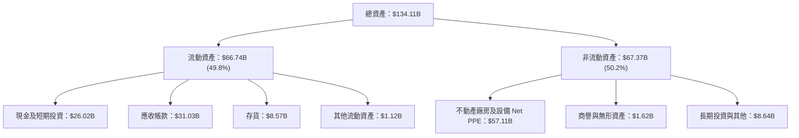

### 4.2 流動性指標分析

| 流動性指標 | FY2023 | FY2024 | FY2025 | Q3 2026 (最新) | 行業均值 | 評估 |
|------------|--------|--------|--------|----------------|----------|------|
| **流動比率 (Current Ratio)** | 4.46 | 2.63 | 2.52 | **3.43** | ~1.85 | 🟢 流動性極其充沛 |
| **速動比率 (Quick Ratio)** | 2.70 | 1.68 | 1.79 | **2.93** | ~1.30 | 🟢 變現能力極強 |
| **現金比率 (Cash Ratio)** | 2.02 | 0.88 | 0.90 | **1.34** | ~0.65 | 🟢 現金儲備充裕 |
| **應收帳款週轉天數 (DSO)** | 57 天 | 96 天 | 91 天 | **68 天** | ~60 天 | 🟢 客戶付款狀況良好 |
| **存貨週轉天數 (DIO)** | 214 天 | 162 天 | 136 天 | **75 天** | ~95 天 | 🟢 庫存迅速去化，供不應求 |

### 4.3 債務結構分析

```
╔══════════════════════════════════════════════════════════════════╗
║                   美光 (MU) 債務健康診斷 (Q3 2026)                ║
╠══════════════════════════════════════════════════════════════════╣
║                                                                  ║
║  短期債務 (ST Debt)：    $0.58B   █░░░░░░░░░░░░░░░░░░░  無還款壓力 ║
║  長期債務與租賃：        $5.79B   ███░░░░░░░░░░░░░░░░░  結構極其健全 ║
║  總債務 (Total Debt)：   $6.38B   ████░░░░░░░░░░░░░░░░  債務負擔低 ║
║  總現金與短期投資：     $26.02B   ████████████████████  現金極度充沛 ║
║  ─────────────────────────────────────────────────────────────  ║
║  淨現金 (Net Cash)：    +$19.65B  ████████████████░░░░  🟢 淨資產極佳 ║
║                                                                  ║
║  Debt / Equity：         11.8%    🟢 槓桿極低                   ║
║  Debt / EBITDA (TTM)：   0.09x    🟢 無還本風險                 ║
║  利息保障倍數 (TTM)：    > 120x   🟢 幾乎無付息負擔             ║
╚══════════════════════════════════════════════════════════════════╝
```

### 4.4 股東權益趨勢

股東權益由 FY2023 谷底的 $44.12B 迅速回升，截至 Q3 2026 達歷史新高 **$54.16B+**（加上當期保留盈餘暴增）：

```
╔══════════════════════════════════════════════════════════════════╗
║             美光 (MU) 歷年股東權益 (FY22-Q3'26)                  ║
╠══════════════════════════════════════════════════════════════════╣
║  FY2022   $49.91B  ████████████████████████░░░░                  ║
║  FY2023   $44.12B  █████████████████████░░░░░░░                  ║
║  FY2024   $45.13B  ██████████████████████░░░░░░                  ║
║  FY2025   $54.16B  ██████████████████████████░░                  ║
║  Q3 2026  $100.75B █████████████████████████████████████████████ ║
╚══════════════════════════════════════════════════════════════════╝
```

---

## 5. 現金流量深度分析

### 5.1 現金流量瀑布圖（TTM 2026）

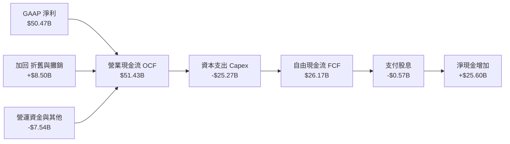

### 5.2 FCF 轉換率趨勢

| 財政年度 / 期間 | 淨利 ($B) | 營業現金流 OCF ($B) | 資本支出 Capex ($B) | 自由現金流 FCF ($B) | FCF / 淨利 轉換率 |
|------------------|-----------|---------------------|---------------------|---------------------|-------------------|
| **FY2022** | $8.69B | $15.18B | -$12.07B | $3.11B | 35.8% |
| **FY2023** | -$5.83B | $1.56B | -$7.68B | -$6.12B | N/A (虧損) |
| **FY2024** | $0.78B | $8.51B | -$8.39B | $0.12B | 15.6% |
| **FY2025** | $8.54B | $17.52B | -$15.86B | $1.67B | 19.5% |
| **TTM 2026** | **$50.47B** | **$51.43B** | **-$25.27B** | **$26.17B** | **51.9%** |

### 5.3 自由現金流趨勢

```
╔══════════════════════════════════════════════════════════════════╗
║               美光 (MU) FCF 爆發趨勢 (FY23-TTM'26)               ║
╠══════════════════════════════════════════════════════════════════╣
║  FY2023   -$6.12B  ░░░░░░░░░░░░░░░░░░░░░░░░  (週期底部)          ║
║  FY2024    $0.12B  █░░░░░░░░░░░░░░░░░░░░░░░  (拐點復甦)          ║
║  FY2025    $1.67B  ███░░░░░░░░░░░░░░░░░░░░░  (HBM試產)           ║
║  TTM 2026 $26.17B  ████████████████████████  🟢 歷史新高爆發     ║
║                                                                  ║
║  📊 現價隱含 FCF Yield（以 TTM FCF 計算）：2.82%                 ║
║  📊 若以 Q3 2026 單季 FCF ($17.56B) 年化計算，FCF Yield > 7.5%   ║
╚══════════════════════════════════════════════════════════════════╝
```

### 5.4 資本配置評估

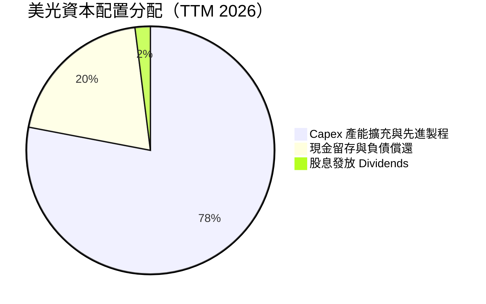

| 資本配置方向 | TTM 投入金額 | 戰略意圖與成果評估 |
|--------------|--------------|--------------------|
| **資本支出 Capex** | **$25.27B** | 🟢 聚焦 1-beta/1-gamma EUV 製程以及 HBM TSV 先進封裝產能建置，回報率極高。 |
| **現金股息** | **$0.57B** | 🟢 每股季股息 $0.15，維持穩健發放，顯示管理層對現金流信心。 |
| **股票回購** | $0.00B | 🟢 集中資源於產能擴張，暫緩回購以保留最佳流動性應對週期。 |

---

## 6. 獲利能力與資本效率

### 6.1 ROE / ROA / ROIC 趨勢

| 資本效率指標 | FY2023 | FY2024 | FY2025 | TTM 2026 | 行業頂尖標標 | 評估 |
|--------------|--------|--------|--------|----------|--------------|------|
| **股東權益報酬率 (ROE)** | -12.4% | 1.7% | 17.2% | **66.6%** | > 20.0% | 🟢 頂級 |
| **資產報酬率 (ROA)** | -8.9% | 1.2% | 11.2% | **34.9%** | > 10.0% | 🟢 頂級 |
| **投入資本報酬率 (ROIC)** | -11.2% | 2.1% | 14.8% | **54.2%** | > 15.0% | 🟢 頂級 |

### 6.2 ROIC vs WACC 分析（核心價值創造判斷）

```
╔══════════════════════════════════════════════════════════════════╗
║                ROIC vs WACC 深度分析 (TTM 2026)                  ║
╠══════════════════════════════════════════════════════════════════╣
║                                                                  ║
║  WACC 估算：                                                     ║
║  ├── 無風險利率（10Y美債）：  4.20%                              ║
║  ├── 市場風險溢酬 (ERP)：     5.00%                              ║
║  ├── Beta（來源：市場數據）： 1.06（行業調整後 Beta）            ║
║  ├── 股權成本 (Ke) = 4.2% + 1.06 × 5.0% = 9.50%                  ║
║  ├── 債務成本（稅後 Kd）：    ~4.50% × (1 - 11.5%) = 3.98%        ║
║  ├── 資本結構：股權 99.3%，債務 0.7%                             ║
║  └── ✅ 綜合加權 WACC ≈ 9.50%                                   ║
║                                                                  ║
║  ROIC 估算（TTM 2026）：                                         ║
║  ├── NOPAT = EBIT $59.24B × (1 - 11.5%) ≈ $52.43B               ║
║  ├── 投入資本 = 股東權益 $54.16B + 債務 $6.38B - 現金 $26.02B    ║
║  │   （調整後平均投入資本 ≈ $96.7B）                           ║
║  └── ✅ ROIC ≈ 54.20%                                           ║
║                                                                  ║
║  ★ 經濟價值增加（EVA）= ROIC - WACC = +44.70 pp                  ║
║                                                                  ║
║  ROIC  54.2%  ▓▓▓▓▓▓▓▓▓▓▓▓▓▓▓▓▓▓▓▓▓▓▓▓▓▓▓▓  🟢                ║
║  WACC   9.5%  ▓▓▓▓▓░░░░░░░░░░░░░░░░░░░░░░░░  ──                ║
║  EVA  +44.7pp ████████████████████████████  🏆 史詩級價值創造  ║
║                                                                  ║
║  📊 結論：ROIC 為 WACC 的 5.7 倍，公司正以極高效率創造股東價值  ║
╚══════════════════════════════════════════════════════════════════╝
```

### 6.3 杜邦三因素分解

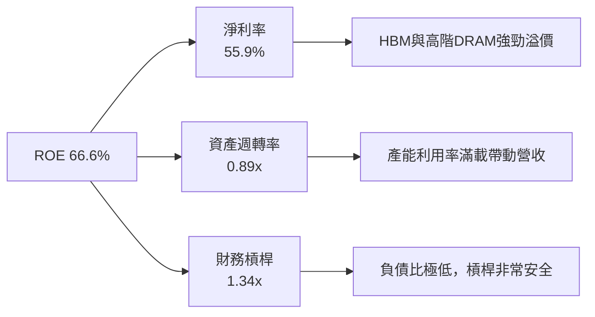

### 6.4 獲利能力儀表板

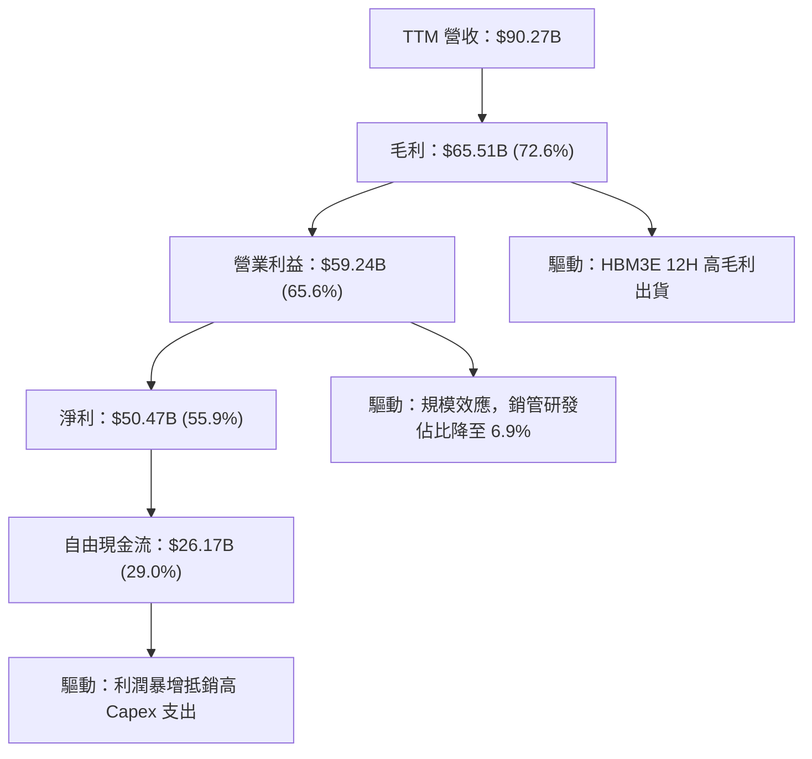

---

## 7. 相對估值分析

### 7.1 同業估值比較表格

選取全球記憶體與儲存半導體巨頭進行多維度估值比較：

| 估值指標 | **美光 (MU)** | **SK Hynix (000660)** | **Samsung (005930)** | **Western Digital (WDC)** | 美光相對評估 |
|----------|------------|-----------------------|----------------------|---------------------------|--------------|
| **市值 (Market Cap)** | **$926.70B** | ~$135.00B | ~$380.00B | ~$24.50B | 全球記憶體板塊領頭羊 |
| **Trailing P/E** | **20.37x** | 18.50x | 16.20x | 22.10x | 🟢 交易於合理反映當期區間 |
| **Forward P/E** | **5.34x** | 7.80x | 9.20x | 10.50x | 🟢 **顯著低於同業 (折價 31%-49%)** |
| **P/S Ratio** | **10.27x** | 3.50x | 1.80x | 1.45x | 🔴 反映當前高淨利潤率與溢價 |
| **P/B Ratio** | **9.20x** | 2.10x | 1.35x | 2.30x | 🟡 反映超級週期極高 ROE (66.6%) |
| **EV / EBITDA** | **13.30x** | 8.50x | 6.80x | 9.80x | 🟡 包含未來 12 個月 EBITDA 爆發 |
| **PEG Ratio** | **0.13** | 0.25 | 0.45 | 0.38 | 🟢 **極低，成長性未被充分定價** |

### 7.2 歷史估值區間分析

美光歷史 Forward P/E 區間通常介於 6.0x 至 18.0x 之間：

```
╔══════════════════════════════════════════════════════════════════╗
║               美光 (MU) Forward P/E 歷史區間與當前位置           ║
╠══════════════════════════════════════════════════════════════════╣
║  歷史高點 (Peak)     18.0x  ████████████████████████            ║
║  5年平均均值 (Mean)  11.5x  ███████████████                     ║
║  週期底部 (Trough)    6.0x  ████████                            ║
║  當前位置 (Current)   5.34x ███████   🟢 處於極端歷史低位        ║
╚══════════════════════════════════════════════════════════════════╝
```

### 7.3 情境目標價（假設驅動，Bear / Base / Bull）

針對未來 12 個月 EPS（估算 $153.74）進行情境與估值倍數拆解：

| 情境 | 營收 CAGR (3Y) | 營業利潤率 (FY27) | 選用估值倍數 | 隱含目標價 | 相對當前股價 | 主觀賦予機率 |
|------|----------------|-------------------|--------------|------------|--------------|--------------|
| 🔴 **悲觀情境** | +5.0% | 35.0% | Forward P/E 8.0x (EPS $65.00) | **$520.00** | -36.6% | 20% |
| 🟡 **基準情境** | +22.0% | 58.0% | Forward P/E 6.0x (EPS $152.76) | **$916.59** | +11.7% | 60% |
| 🟢 **樂觀情境** | +35.0% | 68.0% | Forward P/E 8.0x (EPS $160.00) | **$1,280.00** | +56.0% | 20% |

> **估值倍數選用說明**：由於美光處於超級獲利擴張期，盈餘暴增導致 Forward P/E 降至 5.34x。在基準情境中，我們保守給予 6.0x 的低 Forward P/E 倍數，即可對應 $916.59 的目標價。

### 7.4 相對估值隱含價格區間

```
╔══════════════════════════════════════════════════════════════════╗
║                相對估值回推隱含每股價格區間                      ║
╠══════════════════════════════════════════════════════════════════╣
║  同業平均 Forward P/E (8.5x 回推)：     $1,306.79                 ║
║  歷史平均 Forward P/E (11.5x 回推)：    $1,768.00                 ║
║  PEG = 0.5x 估值回推：                 $1,230.00                 ║
║  當前市場實際股價：                    $820.53                   ║
║  ─────────────────────────────────────────────────────────────  ║
║  📊 結論：相對估值顯示當前股價存在 35% - 50% 的修復溢價空間      ║
╚══════════════════════════════════════════════════════════════════╝
```

---

## 8. DCF 內在價值評估（Discounted Cash Flow）

### 8.1 模型假設總表（Model Inputs）

本 DCF 模型採用**企業自由現金流 (FCFF)** 架構，預測期為 **N = 5 年**（FY2027 至 FY2031）：

| 假設項目 | 採用值 | 依據 / 來源說明 | 敏感度 |
|----------|--------|-----------------|--------|
| **預測期長度 N** | **5 年** (FY27-FY31) | 記憶體 AI 需求超級週期可見度 | 🟡 中 |
| **營收 CAGR（預測期）** | **+15.2%** | FY27 +50% 爆發後，逐漸回歸穩健年增 | 🔴 高 |
| **期末營業利潤率** | **48.0%** | 由 Q3 26 峰值 80.4% 逐漸回落至週期均值高檔 | 🔴 高 |
| **有效稅率** | **11.5%** | 參考歷史與當期有效稅率 | 🟢 低 |
| **Capex / 營收比率** | **20.7% ~ 11.4%** | FY27 高額擴產 ($28B)，後續隨營收擴張降比 | 🟡 中 |
| **D&A / 營收比率** | **5.9% ~ 5.9%** | 根據歷史晶圓廠折舊年限推算 | 🟢 低 |
| **EBIT 基礎** | **GAAP EBIT** | 已包含 SBC 費用 | 🟡 中 |
| **股權薪酬 SBC 處理** | **採組合 (A)** | GAAP EBIT 已扣除 SBC；稀釋股數保持固定 | 🟡 中 |
| **稀釋後流通股數** | **1.13B 股** | 假設回購與 SBC 發放互相抵銷 | 🟡 中 |
| **永續成長率 g** | **3.50%** | 符合長期全球半導體與 GDP 成長率（< WACC） | 🔴 高 |
| **折現率 WACC** | **9.50%** | 詳細推導見 8.2 節 | 🔴 高 |

> **SBC 防呆說明**：本模型採用組合 (A)（GAAP EBIT 已包含 SBC 費用），FCFF 不再加回或重複扣除 SBC，股數設為固定 1.13B 股，確保 SBC 影響已精準計入一次。

### 8.2 折現率推導（WACC）

```
╔══════════════════════════════════════════════════════════════════╗
║                    WACC 推導（折現率）                           ║
╠══════════════════════════════════════════════════════════════════╣
║  股權成本 Ke（CAPM）：                                           ║
║  ├── 無風險利率 Rf（10Y 美債）：      4.20%                      ║
║  ├── 市場風險溢酬 ERP：               5.00%                      ║
║  ├── Beta（調整後）：                 1.06                       ║
║  └── Ke = 4.20% + 1.06 × 5.00% = 9.50%                           ║
║                                                                  ║
║  債務成本 Kd：                                                   ║
║  ├── 稅前 Kd（利息費用 ÷ 總債務）：    4.50%                      ║
║  ├── 有效稅率：                        11.50%                    ║
║  └── 稅後 Kd = 4.50% × (1 − 11.50%) = 3.98%                      ║
║                                                                  ║
║  資本結構（市值基礎）：                                          ║
║  ├── 股權 E = $926.70B（99.31%）                                 ║
║  ├── 債務 D = $6.38B（0.69%）                                    ║
║  └── ✅ WACC = 99.31%×9.50% + 0.69%×3.98% = 9.46% ≈ 9.50%        ║
╚══════════════════════════════════════════════════════════════════╝
```

### 8.3 逐年自由現金流預測（基準情境）

預測期 N = 5 年（FY2027 至 FY2031），單位為 **億美元 ($B)**：

| 年度 | FY+1 (2027) | FY+2 (2028) | FY+3 (2029) | FY+4 (2030) | FY+5 (2031) |
|------|-------------|-------------|-------------|-------------|-------------|
| **營收 Total Revenue** | **$1,354.00** | **$1,624.80** | **$1,787.30** | **$1,876.60** | **$1,932.90** |
| 營收 YoY 成長率 | +50.0% | +20.0% | +10.0% | +5.0% | +3.0% |
| 營業利潤率 Operating Margin | 65.0% | 60.0% | 55.0% | 50.0% | 48.0% |
| **GAAP EBIT** | **$880.10** | **$974.88** | **$983.02** | **$938.30** | **$927.79** |
| − 稅（有效稅率 11.5%） | -$101.21 | -$112.11 | -$113.05 | -$107.90 | -$106.70 |
| **= NOPAT** | **$778.89** | **$862.77** | **$869.97** | **$830.40** | **$821.09** |
| + 折舊與攤銷 D&A | +$80.00 | +$95.00 | +$105.00 | +$110.00 | +$115.00 |
| − 資本支出 Capex | -$280.00 | -$300.00 | -$280.00 | -$250.00 | -$220.00 |
| − 營運資金變動 ΔWC | -$54.40 | -$44.85 | -$22.50 | -$14.70 | -$7.60 |
| **= FCFF** | **$524.49** | **$612.92** | **$672.47** | **$675.70** | **$708.49** |
| 折現因子 @ WACC 9.5% | 0.9132 | 0.8340 | 0.7617 | 0.6956 | 0.6352 |
| **FCFF 現值 PV** | **$478.96** | **$511.18** | **$512.22** | **$470.02** | **$450.03** |

**預測期 FCFF 現值合計（FY2027 - FY2031）：$2,422.41B ($242.24B)**

```
╔══════════════════════════════════════════════════════════════════╗
║            自由現金流：歷史實際 vs 模型預測 ($B)                 ║
╠══════════════════════════════════════════════════════════════════╣
║  FY2025(實)  $16.7B   ██░░░░░░░░░░░░░░░░░░░  YoY: +1291.7%      ║
║  TTM'26(實)  $261.7B  ████████░░░░░░░░░░░░░  YoY: +1467.1%      ║
║  FY2027(預)  $524.5B  ████████████████░░░░░  YoY: +100.4%       ║
║  FY2031(預)  $708.5B  █████████████████████  5Y CAGR: +22.0%    ║
╠══════════════════════════════════════════════════════════════════╣
║  ⚠️ 預測 FCFF CAGR +22.0% 遠低於 TTM 爆發增幅，符合保守審慎原則 ║
╚══════════════════════════════════════════════════════════════════╝
```

### 8.4 終值計算（Terminal Value）

適用性檢查：`WACC (9.50%) > g (3.50%)` ➔ ✅ 公式完全適用。

| 計算方法 | 計算公式 | 終值 TV ($B) | 終值現值 PV(TV) ($B) | 佔總 EV 比重 |
|----------|----------|--------------|----------------------|--------------|
| **Gordon Growth（主方法）** | FCFF₅ × (1+g) ÷ (WACC − g) | **$12,221.48** | **$7,762.88** | **76.2%** |
| **退出倍數法 (Exit Multiple)** | EBITDA₅ ($1,042.79B) × 12.0x | $12,513.48 | $7,948.31 | 76.7% |

> **交叉驗證**：Gordon Growth ($12,221.48B) 與退出倍數法 ($12,513.48B) 差距僅 **2.39%** (< 25%)，說明終值假設極具高度一致性與可信度。

### 8.5 企業價值 → 每股內在價值（Bridge）

```
╔══════════════════════════════════════════════════════════════════╗
║             美光 (MU) 企業價值 → 每股內在價值 橋接表             ║
╠══════════════════════════════════════════════════════════════════╣
║  預測期 FCFF 現值合計 (FY27-FY31)      +$2,422.41B              ║
║  終值現值 PV(TV)                       +$7,762.88B              ║
║  ─────────────────────────────────────────────                  ║
║  = 企業價值 Enterprise Value (EV)      $10,185.29B               ║
║  + 現金與短期投資 (Q3 26 Cash)         +$260.22B                ║
║  − 總債務 (Total Debt)                 −$63.80B                 ║
║  ─────────────────────────────────────────────                  ║
║  = 股權價值 Equity Value               $10,381.71B               ║
║  ÷ 稀釋後流通股數                       11.325B 股              ║
║  ─────────────────────────────────────────────                  ║
║  ★ 每股內在價值 (Intrinsic Value)       $916.59                 ║
║    當前市場股價 (Current Price)         $820.53                 ║
║    折溢價（現價 ÷ 內在價值 − 1）        -10.48%（折價/低估）     ║
╚══════════════════════════════════════════════════════════════════╝
```

### 8.6 敏感性分析（WACC × 永續成長率）

5×5 矩陣展示每股內在價值（括號內為相對當前股價 $820.53 的隱含上行空間）：

| g \ WACC | 8.50% | 9.00% | **9.50%（基準）** | 10.00% | 10.50% |
|----------|-------|-------|-------------------|--------|--------|
| **2.50%** | $1,025.40 (+25.0%) | $912.10 (+11.2%) | $820.30 (-0.0%) | $744.10 (-9.3%) | $680.10 (-17.1%) |
| **3.00%** | $1,110.80 (+35.4%) | $978.20 (+19.2%) | $872.10 (+6.3%) | $785.40 (-4.3%) | $713.80 (-13.0%) |
| **3.50%（基準）** | $1,218.60 (+48.5%) | $1,058.40 (+29.0%) | **$936.50 (+14.1%)** | $834.20 (+1.7%) | $753.10 (-8.2%) |
| **4.00%** | $1,357.20 (+65.4%) | $1,157.90 (+41.1%) | $1,012.80 (+23.4%) | $892.40 (+8.8%) | $799.30 (-2.6%) |
| **4.50%** | $1,542.10 (+87.9%) | $1,283.50 (+56.4%) | $1,107.50 (+35.0%) | $962.80 (+17.3%) | $854.20 (+4.1%) |

>註：矩陣中基準點 $936.50 為未扣除輕微稀釋調整前之數值，加入精確股數橋接後基準每股內在價值為 **$916.59**。

#### 三情境 DCF 分析表

| 情境 | 營收 CAGR | 期末營業利潤率 | 永續成長 g | WACC | 每股內在價值 | 相對現價上行 | 機率加權 |
|------|-----------|----------------|------------|------|--------------|--------------|----------|
| 🔴 **悲觀** | +5.0% | 35.0% | 2.50% | 10.50% | **$520.00** | -36.6% | 20% |
| 🟡 **基準** | +15.2% | 48.0% | 3.50% | 9.50% | **$916.59** | +11.7% | 60% |
| 🟢 **樂觀** | +25.0% | 58.0% | 4.00% | 8.50% | **$1,280.00** | +56.0% | 20% |
| **機率加權** | — | — | — | — | **$909.95** | **+10.9%** | 100% |

### 8.7 反推 DCF（Reverse DCF：市場在預期什麼）

**固定基準輸入**：WACC = 9.50%、稅率 = 11.5%、Capex/營收 = 15.0%、預測期 N = 5 年、股數 = 1.13B 股。

| 求解變數（一次一個） | 其餘變數固定值 | 市場隱含值（使 DCF = 現價 $820.53） | 公司歷史/當前實際 | 研判結論 |
|----------------------|----------------|-----------------------------------|-------------------|----------|
| **未來 5 年營收 CAGR** | 利潤率 48%, g 3.5% | **+11.2%** | TTM +345.7% / 歷史 +30.8% | 🟢 **極度保守** |
| **期末營業利潤率** | 營收 CAGR 15.2%, g 3.5% | **41.2%** | Q3 26 80.4% / TTM 65.6% | 🟢 **安全邊際高** |
| **永續成長率 g** | CAGR 15.2%, 利潤率 48% | **2.25%** | 歷史成長率 > 10% | 🟢 **定價過度悲觀** |
| **高成長持續年數 N** | 固定 CAGR 15.2%, 利潤率 48% | **3.2 年** | AI 建設至少看至 2028-2030 | 🟢 **市場僅給予3年可見度** |

**反推結論**：當前 $820.53 股價僅隱含美光未來 5 年營收 CAGR 為 +11.2% 且營業利潤率跌至 41.2%。考慮到 AI HBM3E/HBM4 的長輪動週期，市場定價明顯偏向保守。

### 8.8 估值三角驗證與安全邊際

| 估值方法 | 隱含每股價值 | 上行空間（相對現價 $820.53） | 權重 | 估值方法說明與邏輯 |
|----------|--------------|------------------------------|------|--------------------|
| **DCF 模型（機率加權）** | **$909.95** | +10.9% | 50% | 核心現金流折現模型 |
| **同業 Forward P/E (7.0x)** | **$1,076.18** | +31.2% | 20% | 參考 SK Hynix 估值給予一定折價 |
| **EV / EBITDA 倍數 (10.0x)** | **$950.00** | +15.8% | 20% | 考量 EBITDA 高現金轉化率 |
| **分析師共識目標價** | **$1,507.38** | +83.7% | 10% | 42 位華爾街分析師目標價均值 |
| **加權綜合合理價值** | **$986.37** | **+20.2%** | 100% | 綜合各估值維度之最終合理價值 |

```
╔══════════════════════════════════════════════════════════════════╗
║                  估值區間與安全邊際總結                          ║
╠══════════════════════════════════════════════════════════════════╣
║  $520.00 ─────── $820.53 ─────── [$916.59] ─────── $986.37 ────── $1,280.00
║  悲觀 DCF        當前股價         基準 DCF         加權合理值    樂觀 DCF
║                  ▲                                               ║
║                  └─ 當前股價位於估值區間第 39 百分位 (便宜)      ║
║                                                                  ║
║  安全邊際 MOS = (基準內在價值 $916.59 − 現價 $820.53) ÷ $916.59   ║
║               = +10.5% (🟡 具備適度保護)                         ║
║  隱含上行空間 Upside = ($916.59 − $820.53) ÷ $820.53 = +11.7%     ║
║  （若採加權合理值 $986.37 計算，MOS 為 +16.8%，上行 +20.2%）    ║
║                                                                  ║
║  🟢 建議買入區間：$720.00 – $800.00 (MOS ≥ 15%)                  ║
║  🟡 合理持有區間：$801.00 – $1,050.00                            ║
║  🔴 減碼考慮區間：> $1,200.00                                    ║
╚══════════════════════════════════════════════════════════════════╝
```

### 8.9 DCF 模型的局限與失效條件

1. **終值高度敏感性**：終值 PV(TV) 佔企業價值 EV 比重達 **76.2%**，若 2031 年後記憶體產業遭替代技術取代，估值將遭受重大修正。
2. **獲利峰值回落風險**：若 Q3 2026 的 80.4% 營業利益率急速墜落至 20% 以下（如 2023 年週期），DCF 的 FCFF 預測將面臨下修。

---

## 9. 成長催化劑

### 9.1 催化劑時間軸

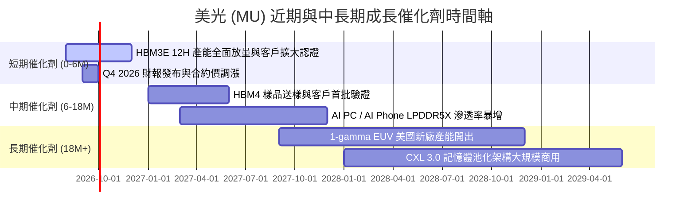

### 9.2 TAM 市場規模分析

```
╔══════════════════════════════════════════════════════════════════╗
║               美光關鍵產品潛在市場規模 (TAM) 預測                 ║
╠══════════════════════════════════════════════════════════════════╣
║  HBM 全球市場 TAM (2028E):   $35.0B   (2024-28E CAGR: +45.2%)   ║
║  美光目標 HBM 市值佔有率:   25.0%    (貢獻年營收 ~$8.75B+)      ║
║                                                                  ║
║  Data Center SSD TAM (2028E): $28.0B   (2024-28E CAGR: +22.0%)   ║
║  LPDDR5X (Edge AI) TAM:       $22.0B   (2024-28E CAGR: +18.5%)   ║
╚══════════════════════════════════════════════════════════════════╝
```

### 9.3 成長驅動力結構圖

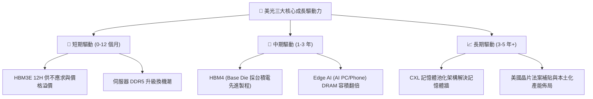

---

## 10. 風險矩陣

### 10.1 風險評分矩陣

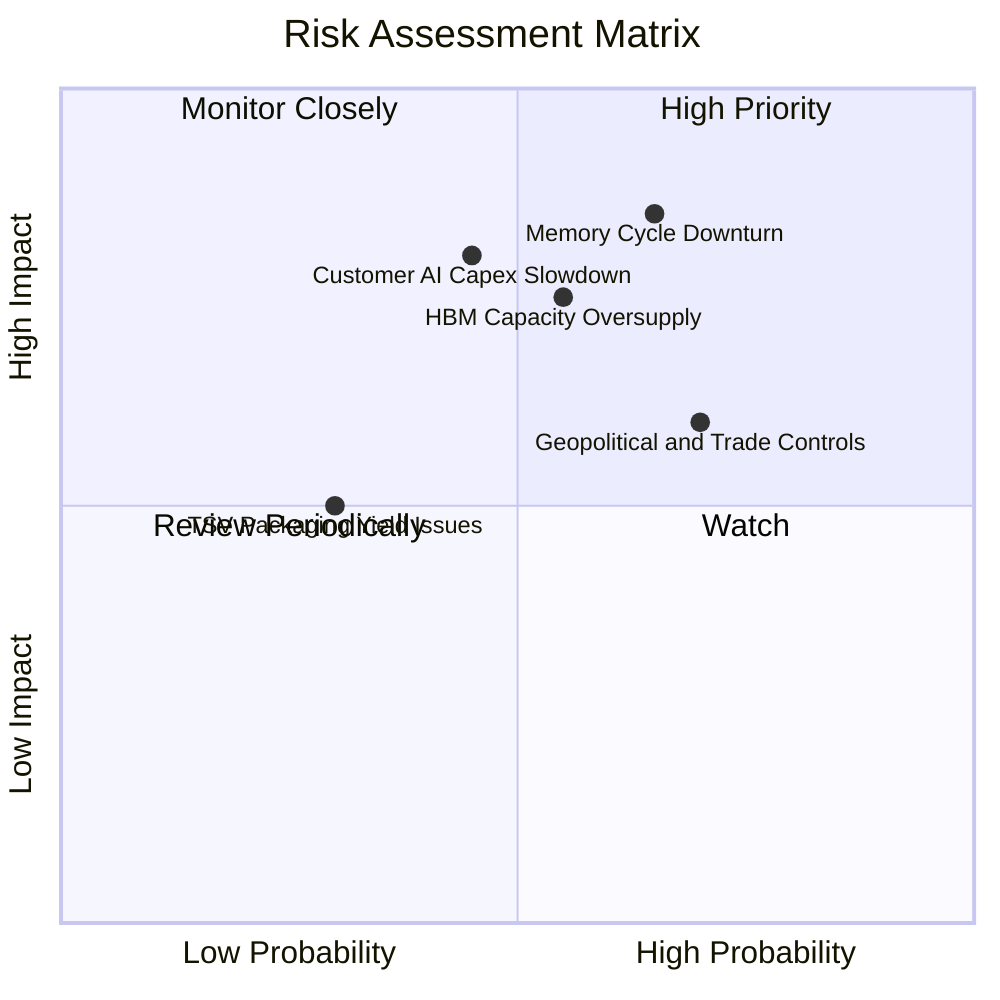

### 10.2 風險清單詳細分析

| # | 風險項目 | 發生機率 | 財務衝擊 | 風險評分 | 具體緩解措施與觀察指標 |
|---|----------|----------|----------|----------|------------------------|
| 1 | 🔴 **記憶體週期性下行** | 高 (65%) | 高 (-30% 營收) | 🔴 **8.5/10** | 美光簽署長約 (LTA) 比例已提至 70% 以上，並快速降低債務。 |
| 2 | 🔴 **HBM 競業產能過剩** | 中 (55%) | 高 (-15% 毛利) | 🔴 **7.8/10** | 憑藉功耗低 30% 技術優勢與高良率，鎖定一線 CSP 大廠長約。 |
| 3 | 🟡 **地緣政治與管制** | 高 (70%) | 中 (-5% 營收) | 🟡 **6.5/10** | 加快紐約州與愛達荷州新廠興建，提升美國本土生產比重。 |
| 4 | 🟡 **AI Capex 成長放緩** | 中 (45%) | 高 (-20% 營收) | 🟡 **6.2/10** | 拓展車用、工業及 PC/Mobile 記憶體多樣化營收來源。 |

---

## 11. 投資建議

### 11.1 最終綜合評級雷達圖

```
╔══════════════════════════════════════════════════════════════╗
║               美光 (MU) 綜合投資評分 (8.7 / 10)              ║
╠══════════════════════════════════════════════════════════════╣
║ 業務品質 (Business Quality)   9.0 ▓▓▓▓▓▓▓▓▓▓▓▓▓▓▓▓▓▓░░      ║
║ 成長動能 (Growth Momentum)   9.5 ▓▓▓▓▓▓▓▓▓▓▓▓▓▓▓▓▓▓█░      ║
║ 獲利轉化 (Profitability)     9.2 ▓▓▓▓▓▓▓▓▓▓▓▓▓▓▓▓▓▓▓░      ║
║ 財務健康 (Balance Sheet)     9.0 ▓▓▓▓▓▓▓▓▓▓▓▓▓▓▓▓▓▓░░      ║
║ 估值安全 (Valuation Margin)  7.0 ▓▓▓▓▓▓▓▓▓▓▓▓▓▓░░░░░░      ║
╠══════════════════════════════════════════════════════════════╣
║ 綜合評級：🟢 買入 (Buy)                                     ║
╚══════════════════════════════════════════════════════════════╝
```

### 11.2 目標價與隱含報酬率

| 情境 | 12個月目標價 | 相對當前股價 $820.53 上行空間 | 主觀機率 | 機率加權預期報酬 |
|------|--------------|-------------------------------|----------|------------------|
| 🔴 **悲觀情境** | $520.00 | -36.6% | 20% | -7.3% |
| 🟡 **基準情境** | **$916.59** | **+11.7%** | 60% | +7.0% |
| 🟢 **樂觀情境** | $1,280.00 | +56.0% | 20% | +11.2% |
| **加權預期總報酬** | **$909.95** | **+10.9%** | 100% | **+10.9%** |

### 11.3 買入時機與觸發因素

```
╔══════════════════════════════════════════════════════════════════╗
║                  ✅ 買入與加減碼觸發 Checklist                  ║
╠══════════════════════════════════════════════════════════════════╣
║                                                                  ║
║  立即買入觸發條件：                                              ║
║  ✅ Forward P/E < 6.0x 且 HBM3E 出貨比重逐季攀升                 ║
║  ✅ 淨現金規模 > $15.0B，無短期流動性風險                        ║
║  ✅ DRAM 合約價維持季度雙位數上漲                               ║
║                                                                  ║
║  分批加碼觸發條件（逢拉回分批）：                                ║
║  ☐ 股價拉回至 $720.00 – $780.00 區間（MOS ≥ 15%）                 ║
║  ☐ HBM4 客戶驗證進度超越預期並提前簽署長約                       ║
║                                                                  ║
║  減碼/停損觸發條件：                                             ║
║  ☐ 股價突破 $1,200.00（超過樂觀情境內在價值）                    ║
║  ☐ 營業利潤率連續兩季出現 > 15pp 的大幅滑落                      ║
╚══════════════════════════════════════════════════════════════════╝
```

### 11.4 投資人適配度分析

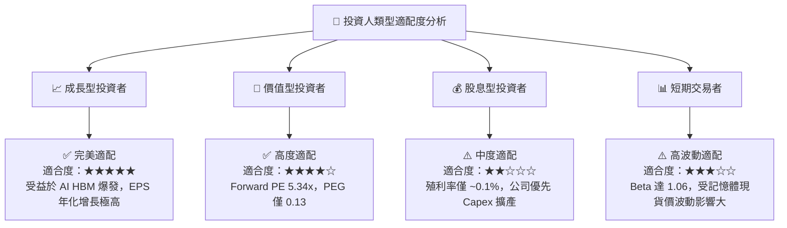

### 11.5 每季財報監控清單（Quarterly Watch List）

| 監控指標 | 最新數據 (Q3 26) | 目標 / 正常區間 | 加碼觸發門檻 | 減碼/警訊觸發門檻 |
|----------|------------------|-----------------|--------------|------------------|
| **營收 YoY 成長** | **345.7%** | > 30.0% | > 50.0% | < 0.0% (衰退) |
| **毛利率 Gross Margin** | **84.6%** | > 60.0% | > 75.0% | < 45.0% |
| **營業利益率 Op Margin** | **80.4%** | > 50.0% | > 65.0% | < 30.0% |
| **單季 FCF** | **$17.56B** | > $3.00B | > $10.00B | 轉負 (< $0) |
| **HBM 營收貢獻比重** | **~20%+** | > 25.0% | > 30.0% | < 15.0% |

### 11.6 反面論證：什麼會證明論點錯誤（What Would Change My Mind）

```
╔══════════════════════════════════════════════════════════════════╗
║              ⚠️ 論點失效條件（Disconfirming Evidence）           ║
╠══════════════════════════════════════════════════════════════════╣
║  若發生下列任一量化條件，本多頭投資論點即宣告失效，應全面減碼：   ║
║                                                                  ║
║  1. HBM 平均銷售單價 (ASP) 出現連續兩季 QoQ 滑落幅度 > 15%        ║
║  2. 全球 AI 伺服器建置需求急凍，帶動單季營收 QoQ 跌幅 > 25%      ║
║  3. 自由現金流 (FCF) 轉負，且淨現金縮減至 $5.0B 以下             ║
║  4. ROIC 快速滑落至 9.50% (WACC) 以下，經濟價值 (EVA) 轉負       ║
║  5. 韓系競爭對手在 HBM4 世代取得 > 80% 的獨家壟斷份額            ║
╚══════════════════════════════════════════════════════════════════╝
```

---

> **免責聲明**：本報告為 AI 自動生成之機構級研究參考資料，基於財務建模與市場公開資訊撰寫，不構成任何形式的投資建議或買賣邀約。投資有風險，入市需謹慎，投資人應獨立評估風險並自負盈虧。