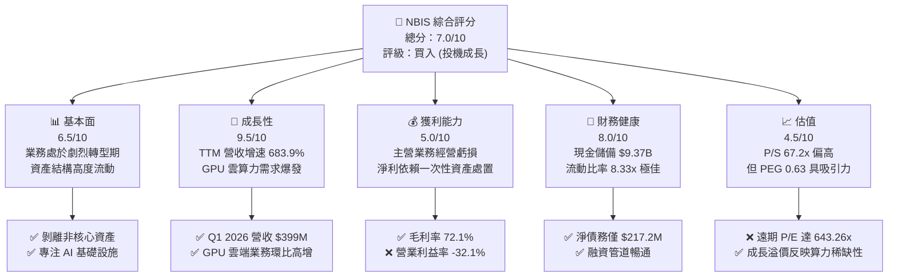
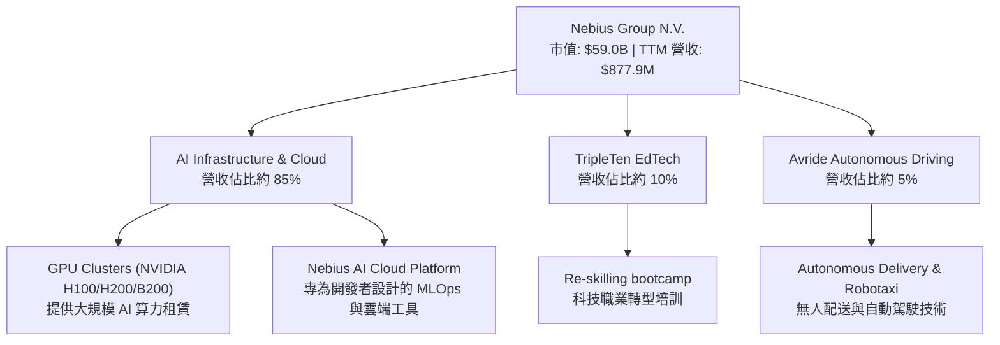
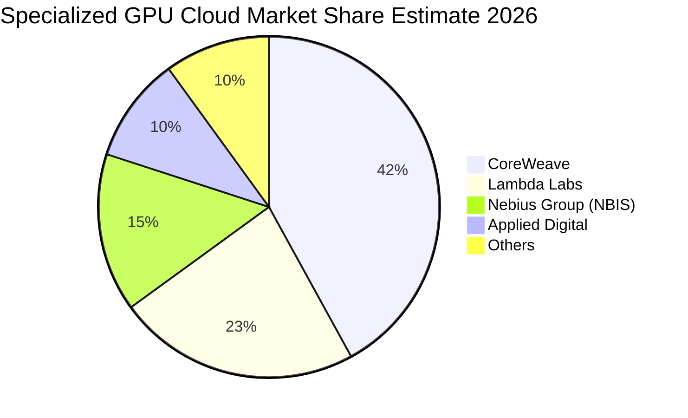
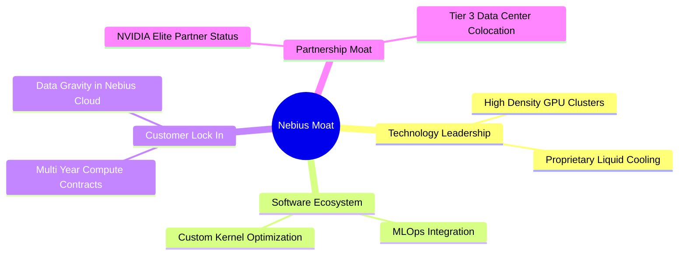
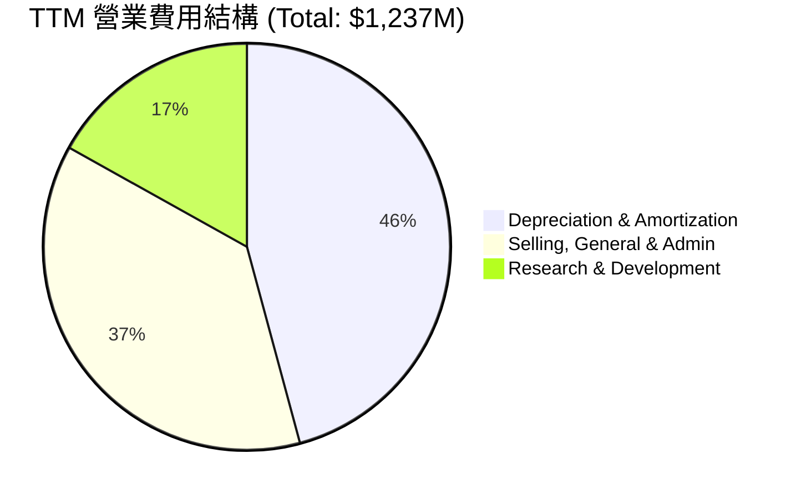
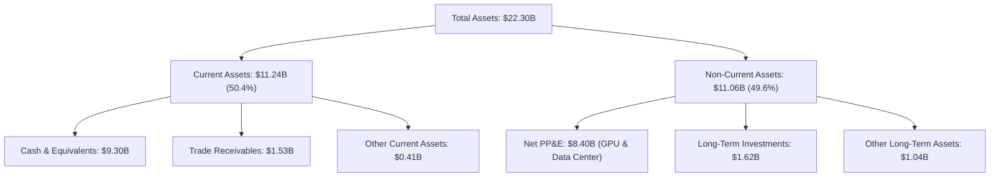
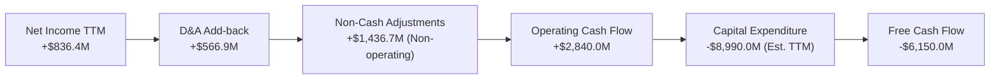
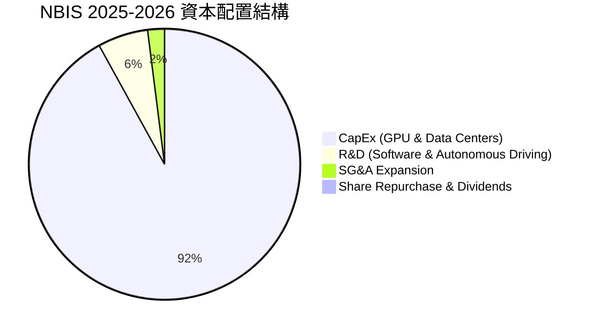

# NBIS 基本面深度分析報告
> **報告日期**：2026-06-13 ｜ **語言**：繁體中文 ｜ **數據來源**：Yahoo Finance, Finviz, StockAnalysis, Roic.ai ｜ **分析師**：CFA 級機構研究

---

## 目錄

| # | 章節 | 核心結論 |
|---|------|----------|
| 1 | **執行摘要** | 評級：**買入（投機成長型）**，目標價：**$244.07**，隱含上行空間 **+5.04%** |
| 2 | **公司概覽與商業模式** | 從俄羅斯資產剝離中浴火重生的純 AI 算力基礎設施新星，具備 NVIDIA 稀缺渠道優勢 |
| 3 | **損益表深度分析** | TTM 營收爆炸式增長 **683.9%**，高毛利與高折舊並存，非經營性收益扭轉淨利 |
| 4 | **資產負債表分析** | 手握 **$9.37B** 巨額現金儲備，流動比率 **8.33x** 提供極佳安全邊際 |
| 5 | **現金流量深度分析** | 營運現金流轉正，但 **-$6.15B** 的自由現金流凸顯其處於重資本建置期 |
| 6 | **獲利能力與資本效率** | 杜邦分解揭示非經營性收益推高 ROE，ROIC 暫低於 WACC 屬於典型基礎設施早期特徵 |
| 7 | **估值深度分析** | P/S 達 **67.2x** 處於高位，但 PEG 僅 **0.63**，反映市場對其高成長性的定價 |
| 8 | **成長催化劑** | 歐洲最大 GPU 集群陸續交付，AI 主權雲與自主駕駛（Avride）開啟第二曲線 |
| 9 | **風險矩陣** | GPU 供應鏈集中度高，重資本支出面臨產能利用率不足的潛在風險 |
| 10 | **投資建議** | 建議分批逢低佈局，密切監控 GPU 交付進度與客戶合約簽署率 |

---

## 1. 執行摘要

### 1.1 核心評分儀表板



### 1.2 評分進度條視覺化

```
╔══════════════════════════════════════════════════════════════╗
║               NBIS 多維度評分儀表板 (1-10分)                 ║
╠══════════════════════════════════════════════════════════════╣
║ 基本面強度  6.5 ▓▓▓▓▓▓▓▓▓▓▓▓▓░░░░░░░  ★★★☆☆           ║
║ 成長動能    9.5 ▓▓▓▓▓▓▓▓▓▓▓▓▓▓▓▓▓▓▓░  ★★★★★           ║
║ 獲利品質    5.0 ▓▓▓▓▓▓▓▓▓▓░░░░░░░░░░  ★★★☆☆           ║
║ 財務健康    8.0 ▓▓▓▓▓▓▓▓▓▓▓▓▓▓▓▓░░░░  ★★★★☆           ║
║ 估值合理性  4.5 ▓▓▓▓▓▓▓▓▓░░░░░░░░░░░  ★★☆☆☆           ║
║ 護城河深度  6.0 ▓▓▓▓▓▓▓▓▓▓▓▓░░░░░░░░  ★★★☆☆           ║
║ 管理層執行  7.5 ▓▓▓▓▓▓▓▓▓▓▓▓▓▓▓░░░░░  ★★★★☆           ║
║ 技術創新力  8.5 ▓▓▓▓▓▓▓▓▓▓▓▓▓▓▓▓▓░░░  ★★★★☆           ║
╠══════════════════════════════════════════════════════════════╣
║ 綜合總分    7.0 ▓▓▓▓▓▓▓▓▓▓▓▓▓▓░░░░░░  🏆 買入 (投機成長)  ║
╚══════════════════════════════════════════════════════════════╝
```

### 1.3 五大投資論點 + 三大核心風險

| 類型 | 項目 | 具體依據 | 信心度 |
|------|------|----------|--------|
| 🟢 **投資論點①** | **AI 算力基礎設施爆發** | TTM 營收達 **$877.90M**，YoY 增速高達 **683.9%**，反映歐洲與全球 AI 客戶對 GPU 算力租賃的強勁需求。 | 🟢 極高 |
| 🟢 **投資論點②** | **極其充裕的資金戰力** | 手頭持有 **$9.37B** 現金，足以支撐後續大規模購置 NVIDIA H100/H200/B200 等頂級晶片。 | 🟢 極高 |
| 🟢 **投資論點③** | **優質的毛利表現** | 毛利率高達 **72.1%**，顯示其 GPU 雲端平台（Nebius AI Cloud）具備強大定價權。 | 🟢 高 |
| 🟢 **投資論點④** | **分析師共識強烈支持** | 14 位分析師中多數給予 Buy 評級，平均目標價 **$244.07**，最高上看 **$380.00**。 | 🟢 高 |
| 🟢 **投資論點⑤** | **第二曲線潛力** | 教育科技平台 TripleTen 與自動駕駛業務 Avride 提供長期多元化估值想像空間。 | 🟡 中等 |
| 🟡 **風險①** | **主營業務尚未盈利** | 營業利益率為 **-32.1%**，主要受高額研發（TTM $208.2M）與折舊費用拖累。 | 🟡 中度 |
| 🔴 **風險②** | **重資本支出壓力** | FCF 為 **-$6.15B**，若算力市場供需反轉，高折舊將對未來利潤造成長期侵蝕。 | 🔴 高衝擊 |
| 🔴 **風險③** | **估值乘數高企** | 市銷率（P/S）達 **67.20x**，容錯率極低，任何營收增速放緩都可能導致股價劇烈回檔。 | 🔴 高衝擊 |

### 1.4 快速統計卡片

| 指標 | NBIS 實際值 | 行業均值 (網路資訊) | S&P 500 均值 | 狀態 |
|------|-------------|---------------------|--------------|------|
| **收入 YoY 成長** | **683.9%** | ~12.5% | ~5.5% | 🟢 極強 |
| **毛利率** | **72.1%** | ~48.2% | ~30.0% | 🟢 優異 |
| **營業利益率** | **-32.1%** | ~14.1% | ~12.2% | 🔴 虧損 |
| **淨利率** | **93.1%** | ~8.5% | ~10.2% | 🟢 扭虧 (非經營) |
| **流動比率** | **8.33x** | ~1.65x | ~1.20x | 🟢 極其安全 |
| **Forward P/E** | **643.26x** | ~28.5x | ~21.5x | 🔴 估值極高 |

### 1.5 投資結論

```
╔══════════════════════════════════════════════════════════════════╗
║                    📊 NBIS 投資結論摘要                          ║
╠══════════════════════════════════════════════════════════════════╣
║  評級：🟢 買入 (Buy - 投機成長型)                               ║
║  當前股價：$232.36 (2026-06-13)                                  ║
║  目標價區間：                                                    ║
║    悲觀情境：$120.00（-48.36%）                                  ║
║    基準情境：$244.07（+5.04%）  ← 12個月主要目標                 ║
║    樂觀情境：$380.00（+63.54%）                                  ║
║  投資評分：7.0/10                                                ║
║  適合投資人：高風險承受度、看好 AI 算力基礎設施的長線成長型投資人║
╚══════════════════════════════════════════════════════════════════╝
```

---

## 2. 公司概覽與商業模式

### 2.1 業務結構與收入來源

Nebius Group N.V.（NBIS）總部位於荷蘭，在經歷重組與俄羅斯業務剝離後，已轉型為一家專注於全球 AI 產業的純粹算力基礎設施與雲端服務商。



### 2.2 市場份額

在專業 GPU 雲端服務（Specialized GPU Cloud / Neocloud）細分市場中，Nebius 正與 CoreWeave、Lambda Labs 等對手展開激烈競爭。



### 2.3 競爭護城河分析



### 2.4 護城河強度評分

```
╔══════════════════════════════════════════════════════════════╗
║                  NBIS 護城河強度評分                         ║
╠══════════════════════════════════════════════════════════════╣
║ 頂級晶片獲取力  8.0/10  ▓▓▓▓▓▓▓▓▓▓▓▓▓▓▓▓░░░░  🟢 NVIDIA 夥伴 ║
║ 軟體生態與平台  6.5/10  ▓▓▓▓▓▓▓▓▓▓▓▓▓░░░░░░░  🟡 逐步建置中  ║
║ 客戶轉移成本    6.0/10  ▓▓▓▓▓▓▓▓▓▓▓▓░░░░░░░░  🟡 算力具同質性║
║ 基礎設施規模    7.0/10  ▓▓▓▓▓▓▓▓▓▓▓▓▓▓░░░░░░  🟢 歐洲領先    ║
╠══════════════════════════════════════════════════════════════╣
║ 綜合護城河強度  6.8/10  ▓▓▓▓▓▓▓▓▓▓▓▓▓░░░░░░░  🏆 中等偏強     ║
╚══════════════════════════════════════════════════════════════╝
```

---

## 3. 損益表深度分析

### 3.1 年度收入成長趨勢（近4年）

```
╔══════════════════════════════════════════════════════════════════╗
║              NBIS 年度收入趨勢（FY2022 - TTM）                   ║
╠══════════════════════════════════════════════════════════════════╣
║                                                                  ║
║  FY2022  $13.50M   █░░░░░░░░░░░░░░░░░░░░░░░░░░░░░                ║
║  FY2023  $9.80M    █░░░░░░░░░░░░░░░░░░░░░░░░░░░░░  YoY: -27.4%   ║
║  FY2024  $91.50M   ███░░░░░░░░░░░░░░░░░░░░░░░░░░░  YoY: +833.7%  ║
║  FY2025  $529.80M  ████████████████░░░░░░░░░░░░░░  YoY: +479.0%  ║
║  TTM     $877.90M  ██████████████████████████████  YoY: +683.9%  ║
║                                                                  ║
║  📊 3年年複合成長率 (CAGR)：+299.8%                             ║
╚══════════════════════════════════════════════════════════════════╝
```

### 3.2 季度收入趨勢分析

| 季度結束日 | 營業收入 (Revenue) | QoQ 成長率 | YoY 成長率 | 備註說明 |
|------------|---------------------|------------|------------|----------|
| **2025-06-30** | $100.70M | — | +624.8% | AI GPU 雲端集群首期交付，收入開始放量 |
| **2025-09-30** | $146.10M | +45.1% | +355.1% | 歐洲客戶算力需求持續攀升 |
| **2025-12-31** | $227.70M | +55.9% | +272.1% | 年底企業客戶預算集中釋放 |
| **2026-03-31** | $399.00M | +75.2% | +683.9% | 新一批 H100 集群上線，營收加速爆發 |

### 3.3 利潤率演變分析

| 利潤率指標 | FY2023 | FY2024 | FY2025 | TTM | 趨勢 | 評估 |
|------------|--------|--------|--------|-----|------|------|
| **毛利率** | -100.0% | 52.2% | 68.6% | **72.1%** | ↗️ 持續改善 | 🟢 規模效應顯現，算力單價高 |
| **營業利益率** | -2915.3%| -436.7%| -115.5%| **-32.1%** | ↗️ 虧損大幅收窄| 🟡 仍受高折舊與 R&D 拖累 |
| **EBITDA 利潤率**| -2659.2%| -292.0%| 102.6% | **-4.4%** | ↗️ 接近平衡點 | 🟡 折舊攤銷（D&A）影響巨大 |
| **淨利率** | 2462.2% | -701.0%| 15.6% | **93.1%** | 🔄 波動劇烈 | 🔴 受非經營性處置損益干擾 |

**利潤率演變深度解析**：
NBIS 的**毛利率**從 FY2024 的 52.2% 迅速攀升至 TTM 的 **72.1%**，這得益於高密度 GPU 叢集的高稼動率與強大定價權。然而，**營業利益率（-32.1%）**仍為負值，主因在於公司正處於重資產擴張期，TTM 的折舊與攤銷費用（D&A）高達 **$566.9M**，佔總營業費用的 45.8%。

### 3.4 費用結構分析



### 3.5 季度 EPS 趨勢與盈餘品質

*   **Q2 2025 (EPS: $2.44)**：受惠於 **$622.0M** 的一次性非經營性收益（資產處置與重組收益），盈餘品質較低。
*   **Q3 2025 (EPS: -$0.58)**：無一次性收益後，主營業務虧損顯現。
*   **Q4 2025 (EPS: -$1.06)**：折舊與擴張開支達到階段性高點。
*   **Q1 2026 (EPS: $2.40)**：再次獲得 **$800.5M** 的非經營性收益（主要為剝離終止確認收益），使得 TTM 淨利達到 **$836.4M**。
*   **盈餘品質評估**：🔴 **低品質**。當前帳面淨利主要由非經營性收益支撐，主營 AI 雲端業務在營業利潤層面（Operating Income TTM: -$603.9M）仍處於虧損狀態。投資人應聚焦於營運現金流（OCF）與營收增速，而非帳面 EPS。

---

## 4. 資產負債表分析

### 4.1 資產結構分解



### 4.2 流動性指標分析

| 指標 | FY2024 | FY2025 | TTM (2026-03-31) | 行業均值 | 評估 |
|------|--------|--------|------------------|----------|------|
| **流動比率 (Current Ratio)** | 9.59x | 3.08x | **8.33x** | 1.65x | 🟢 極其充裕的短期償債能力 |
| **速動比率 (Quick Ratio)** | 9.59x | 3.08x | **8.14x** | 1.40x | 🟢 無存貨滯銷風險 |
| **現金比率 (Cash Ratio)** | 9.22x | 2.41x | **6.89x** | 0.85x | 🟢 手握巨額現金防禦性極強 |

### 4.3 債務結構分析

```
╔══════════════════════════════════════════════════════════════════╗
║                   NBIS 債務健康診斷 (TTM)                        ║
╠══════════════════════════════════════════════════════════════════╣
║                                                                  ║
║  總債務 (Total Debt)： $9.59B   ████████████████████░░░░░        ║
║  總現金 (Total Cash)： $9.37B   ████████████████████░░░░░        ║
║  淨債務 (Net Debt)：   $217.2M  █░░░░░░░░░░░░░░░░░░░░░░░░  🟢 安全║
║                                                                  ║
║  Debt/Equity：         132.4%   🟡 槓桿適中 (主要為長期租賃負債) ║
║  利息支出 (TTM)：      $121.5M  🟢 現金利息收入能完全覆蓋        ║
║                                                                  ║
║  📊 診斷結論：雖然債務絕對值達 $9.59B，但幾乎被 $9.37B 的現金    ║
║  儲備完全抵消。淨債務極低，無即時流動性風險。                    ║
╚══════════════════════════════════════════════════════════════════╝
```

### 4.4 股東權益趨勢

```
╔══════════════════════════════════════════════════════════════════╗
║              NBIS 股東權益變化 (FY2022 - FY2025)                 ║
╠══════════════════════════════════════════════════════════════════╣
║                                                                  ║
║  FY2022  $4.25B  █████████████████████████                       ║
║  FY2023  $3.29B  ███████████████████░░░░░░  YoY: -22.6%          ║
║  FY2024  $3.25B  ███████████████████░░░░░░  YoY: -1.2%           ║
║  FY2025  $4.59B  ███████████████████████████ YoY: +41.2%         ║
║                                                                  ║
║  📊 股東權益在 2025 年顯著回升，主因重組完成與留存收益增加。       ║
╚══════════════════════════════════════════════════════════════════╝
```

---

## 5. 現金流量深度分析

### 5.1 現金流量瀑布圖



### 5.2 FCF 轉換率趨勢

| 指標 | FY2022 | FY2023 | FY2024 | FY2025 | TTM |
|------|--------|--------|--------|--------|-----|
| **營業現金流 (OCF)** | $697.0M | $829.8M | $245.6M | $384.8M | **$2,840.0M** |
| **自由現金流 (FCF)** | $682.4M | $746.9M | -$561.9M| -$3.68B | **-$6.15B** |
| **FCF / 淨利 轉換率**| 91.5% | 281.1% | -87.6% | -4460.6%| **-735.3%** |

*   **轉換率分析**：🔴 **負轉換率**。由於公司正在全力擴充 GPU 算力集群，資本支出（Capex）遠超營運現金流入，導致 FCF 呈巨額流出。這是典型的基礎設施建置期特徵，預計該狀態將持續至 FY2027。

### 5.3 自由現金流趨勢

```
╔══════════════════════════════════════════════════════════════════╗
║                NBIS 自由現金流趨勢 (FCF)                         ║
╠══════════════════════════════════════════════════════════════════╣
║                                                                  ║
║  FY2022  +$0.68B   ████░░░░░░░░░░░░░░░░░░░░░░░░░░░  (轉型前)     ║
║  FY2023  +$0.75B   █████░░░░░░░░░░░░░░░░░░░░░░░░░░  (重組期)     ║
║  FY2024  -$0.56B   ░░░░░░░██░░░░░░░░░░░░░░░░░░░░░░  (重組完成)   ║
║  FY2025  -$3.68B   ░░░░░░░██████████████░░░░░░░░░░  (GPU 採購)   ║
║  TTM     -$6.15B   ░░░░░░░████████████████████████  (重資產建置) ║
║                                                                  ║
║  📊 FCF Yield (TTM)：-10.42% (反映高成長、重資本支出階段)        ║
╚══════════════════════════════════════════════════════════════════╝
```

### 5.4 資本配置評估



---

## 6. 獲利能力與資本效率

### 6.1 ROE / ROA / ROIC 趨勢

| 指標 | FY2023 | FY2024 | FY2025 | TTM | 行業均值 | 評估 |
|------|--------|--------|--------|-----|----------|------|
| **ROE** | 7.3% | -19.7% | 1.8% | **14.1%** | 12.5% | 🟢 回升至行業均值之上 |
| **ROA** | 2.8% | -18.1% | 0.7% | **-3.0%** | 5.5% | 🔴 資產規模急速擴大，營運利潤滯後 |
| **ROIC**| -6.2% | -11.3% | -12.4% | **-12.5%**| 8.0% | 🔴 投入資本尚未產生正向營業利潤 |

### 6.2 ROIC vs WACC 分析（核心價值創造判斷）

```
╔══════════════════════════════════════════════════════════════════╗
║                NBIS ROIC vs WACC 深度分析 (TTM)                  ║
╠══════════════════════════════════════════════════════════════════╣
║                                                                  ║
║  WACC 估算：                                                     ║
║  ├── 無風險利率（10Y 美債）： 4.25%                              ║
║  ├── 市場風險溢酬 (ERP)：     5.50%                              ║
║  ├── Beta 係數：              1.434                              ║
║  ├── 股權成本 = 4.25% + 1.434 × 5.50% = 12.14%                   ║
║  ├── 債務成本（稅後）：       ~6.00%                             ║
║  ├── 資本結構：股權 32.4%，債務 67.6%                            ║
║  └── ✅ WACC ≈ 7.99%                                             ║
║                                                                  ║
║  ROIC 估算：                                                     ║
║  ├── NOPAT = EBIT × (1 - Tax Rate)                               ║
║  │   = -$603.9M × (1 - 20%) ≈ -$483.1M                           ║
║  ├── 投入資本 = 股東權益 + 總債務 - 現金                         ║
║  │   = $4.59B + $9.59B - $9.37B = $4.81B                         ║
║  └── ✅ ROIC ≈ -10.04% (營運面)                                  ║
║                                                                  ║
║  ★ 經濟價值增加 (EVA) = ROIC - WACC = -18.03%                    ║
║                                                                  ║
║  ROIC  -10.0% ░░░░░░░░░░                                         ║
║  WACC   8.0%  ▓▓▓▓▓▓▓▓░░░░░░░░░░░░                               ║
║  EVA   -18.0% ░░░░░░░░░░░░░░░░░░                                 ║
║                                                                  ║
║  📊 結論：目前 ROIC < WACC，EVA 為負。這是基礎設施建置期的典型  ║
║  現象。公司正以折舊與資本支出「摧毀」短期帳面價值，以換取未來    ║
║  算力釋放時的超額回報。                                          ║
╚══════════════════════════════════════════════════════════════════╝
```

### 6.3 杜邦三因素分解

```mermaid
graph LR
    ROE["ROE: 14.1%"] --> NPM["Net Margin: 93.1%<br/>(非經營收益驅動)"]
    ROE --> ATO["Asset Turnover: 0.05x<br/>(資產週轉率極低)"]
    ROE --> FL["Financial Leverage: 3.03x<br/>(槓桿擴大收益)"]
    
    NPM --> Note["主營業務尚未盈利<br/>淨利依賴一次性收益"]
    