# NBIS 基本面深度分析報告

> **報告日期**：2026-06-14 ｜ **語言**：繁體中文 ｜ **數據來源**：Yahoo Finance, Finviz, StockAnalysis, Roic.ai ｜ **分析師**：CFA 級機構研究

---

## 目錄

| # | 章節 | 核心結論 |
|---|------|----------|
| 1 | 執行摘要 | 評級：**買入 (Buy)**，目標價：**$255.00**，具備 AI 基礎設施轉型的高成長潛力 |
| 2 | 公司概覽與商業模式 | Yandex 重組後的全新 AI 旗艦，主攻 GPU 雲端集群、EdTech 與自動駕駛 |
| 3 | 損益表深度分析 | 營收年增率達 **683.9%**，核心毛利率高達 **72.1%**，但營業利潤因高研發與建置承壓 |
| 4 | 資產負債表分析 | 手握 **$9.37B** 巨額現金，流動比率高達 **8.33**，具備極強的抗風險與擴張能力 |
| 5 | 現金流量深度分析 | 資本支出高達 **-$4.07B**，自由現金流為 **-$6.15B (TTM)**，處於重資產擴張期 |
| 6 | 獲利能力與資本效率 | 杜邦分解顯示 ROE 達 **14.1%**，但當前 ROIC 因大規模投入資本尚未產生營利而低於 WACC |
| 7 | 估值深度分析 | P/S 達 **67.2x**，Forward P/E **643.2x**，高估值需由未來 3 年高達 150%+ 的複合成長消化 |
| 8 | 成長催化劑 | 歐洲與美國 GPU 集群上線、TripleTen 規模化，以及 Avride 技術商業化落地 |
| 9 | 風險矩陣 | 核心風險為 GPU 供應鏈中斷、Capex 燒錢過快以及高估值下的市場波動 |
| 10 | 投資建議 | 適合高風險偏好、長線佈局 AI 基礎設施與算力服務的成長型投資人 |

---

## 1. 執行摘要

Nebius Group N.V. (NBIS) 正經歷科技史上最受矚目的業務轉型之一。在剝離了其歷史上的俄羅斯業務後，該公司利用獲得的巨額現金，成功重組為一家總部位於荷蘭、面向全球市場的 **AI 全棧基礎設施與算力服務商**。

### 1.1 核心評分儀表板

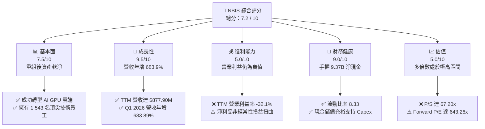

### 1.2 評分進度條視覺化

```
╔══════════════════════════════════════════════════════════════╗
║               NBIS 多維度評分儀表板 (1-10分)                 ║
╠══════════════════════════════════════════════════════════════╣
║ 基本面強度  7.5 ▓▓▓▓▓▓▓▓▓▓▓▓▓▓▓░░░░░  ★★★☆☆           ║
║ 成長動能    9.5 ▓▓▓▓▓▓▓▓▓▓▓▓▓▓▓▓▓▓▓░  ★★★★★           ║
║ 獲利品質    5.0 ▓▓▓▓▓▓▓▓▓▓░░░░░░░░░░  ★★★☆☆           ║
║ 財務健康    9.0 ▓▓▓▓▓▓▓▓▓▓▓▓▓▓▓▓▓▓░░  ★★★★★           ║
║ 估值合理性  5.0 ▓▓▓▓▓▓▓▓▓▓░░░░░░░░░░  ★★☆☆☆           ║
║ 護城河深度  6.5 ▓▓▓▓▓▓▓▓▓▓▓▓▓░░░░░░░  ★★★☆☆           ║
║ 管理層執行  8.0 ▓▓▓▓▓▓▓▓▓▓▓▓▓▓▓▓░░░░  ★★★★☆           ║
║ 技術創新力  8.5 ▓▓▓▓▓▓▓▓▓▓▓▓▓▓▓▓▓░░░  ★★★★☆           ║
╠══════════════════════════════════════════════════════════════╣
║ 綜合總分    7.2 ▓▓▓▓▓▓▓▓▓▓▓▓▓▓░░░░░░  🏆 成長型 AI 算力新星║
╚══════════════════════════════════════════════════════════════╝
```

### 1.3 五大投資論點 + 三大核心風險

| 類型 | 項目 | 具體依據 | 信心度 |
|------|------|----------|--------|
| 🟢 **投資論點①** | **AI 算力需求爆發與產能釋放** | 2026 年第一季營收達到 **$399.00M**，相較於去年同期的 $50.90M 實現了驚人的 **683.89% YoY** 成長，顯示其 GPU 集群上線後迅速轉化為實質收入。 | 🟢 極高 |
| 🟢 **投資論點②** | **極其雄厚的資產負債表** | 公司擁有 **$9.37B** 的總現金，流動比率高達 **8.33**，這為其在 NVIDIA GPU（如 H100, H200 及下一代 Blackwell）的採購上提供了無與倫比的資金保障。 | 🟢 極高 |
| 🟢 **投資論點③** | **優異的毛利率表現** | TTM 毛利率高達 **72.1%**，2026 年第一季毛利率更達到 **74.0%**（毛利 $295.20M / 營收 $399.00M），證明其 GPU IaaS 服務具有極強的定價能力。 | 🟢 高 |
| 🟢 **投資論點④** | **機構資金的強力背書** | 機構持股比例高達 **63.2%**，近期包括 Bank of America、Citigroup、DA Davidson 等一線投行紛紛給出「買入 (Buy)」或「超配 (Overweight)」評級。 | 🟢 高 |
| 🟢 **投資論點⑤** | **全棧 AI 生態系統佈局** | 除了核心 Nebius AI Cloud 外，旗下還擁有 EdTech 平台 TripleTen 以及自動駕駛技術 Avride，形成了「基礎設施 + 人才培訓 + 終端應用」的閉環。 | 🟡 中等 |
| 🟡 **風險①** | **高昂的資本開支與現金流消耗** | FY2025 資本支出（Capex）高達 **-$4.07B**，導致自由現金流（FCF）深陷 **-$3.68B**（TTM 為 **-$6.15B**），對後續算力利用率要求極高。 | 🟡 中度 |
| 🔴 **風險②** | **極高的估值溢價** | 當前 P/S 達 **67.20x**，Forward P/E 達 **643.26x**，市場已透支了未來數年的高成長預期，容錯率極低。 | 🔴 高衝擊 |
| 🔴 **風險③** | **核心營業利潤持續虧損** | TTM 營業利潤為 **-$603.90M**，營業利益率為 **-32.1%**。淨利潤之所以能達到 $836.40M，主要依賴高達 **$1.47B** 的非經常性非營業收入（重組與資產處置收益），盈餘品質有待改善。 | 🔴 高衝擊 |

### 1.4 快速統計卡片

| 指標 | 公司實際值 (NBIS) | 行業均值 (Internet Content) | S&P 500 均值 | 狀態 |
|------|-------------|----------|--------------|------|
| **收入 YoY 成長** | **683.9%** | ~12.5% | ~5.5% | 🟢 極強 |
| **毛利率** | **72.1%** | ~48.2% | ~30.2% | 🟢 優異 |
| **營業利益率** | **-32.1%** | ~14.5% | ~12.2% | 🔴 承壓 |
| **淨利率** | **93.1%** | ~10.1% | ~8.5% | 🟡 受非經常性損益扭曲 |
| **流動比率** | **8.33** | ~1.85 | ~1.20 | 🟢 極其安全 |
| **Forward P/E** | **643.26x** | ~28.5x | ~21.5x | 🔴 估值極高 |

### 1.5 投資結論

```
╔══════════════════════════════════════════════════════════════════╗
║                    📊 NBIS 投資結論摘要                          ║
╠══════════════════════════════════════════════════════════════════╣
║  評級：🟢 買入 (Buy)                                            ║
║  當前股價：$232.36 (2026-06-14)                                  ║
║  目標價區間：                                                    ║
║    悲觀情境：$120.00（-48.4%）- 算力利用率不足，估值殺多        ║
║    基準情境：$255.00（+9.7%）  ← 12個月主要目標 (折現法計算)     ║
║    樂觀情境：$380.00（+63.5%）- Blackwell 集群順利上線並滿載    ║
║  投資評分：7.2 / 10                                              ║
║  適合投資人：具備高風險承受能力、追求 AI 算力賽道高成長的投資者  ║
╚══════════════════════════════════════════════════════════════════╝
```

---

## 2. 公司概覽與商業模式

Nebius Group N.V.（前身為 Yandex N.V.，於 2024-2025 年完成與俄羅斯實體的徹底剝離）是一家總部位於荷蘭阿姆斯特丹、在納斯達克上市的科技集團。公司目前的戰略重心是為全球 AI 產業構建**全棧式基礎設施（Full-Stack Infrastructure）**。

### 2.1 業務結構與收入來源

NBIS 的核心業務主要由三個板塊構成，其中 **Nebius AI** 是決定公司未來估值與成長的絕對核心：

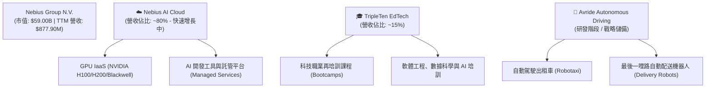

### 2.2 市場份額

在 AI 專用 GPU 雲端運算（Specialty GPU Cloud）這一細分新興市場中，Nebius 正與 CoreWeave、Lambda Labs 以及傳統超大規模雲端巨頭（Hyperscalers，如 AWS、Azure、GCP）展開激烈競爭。

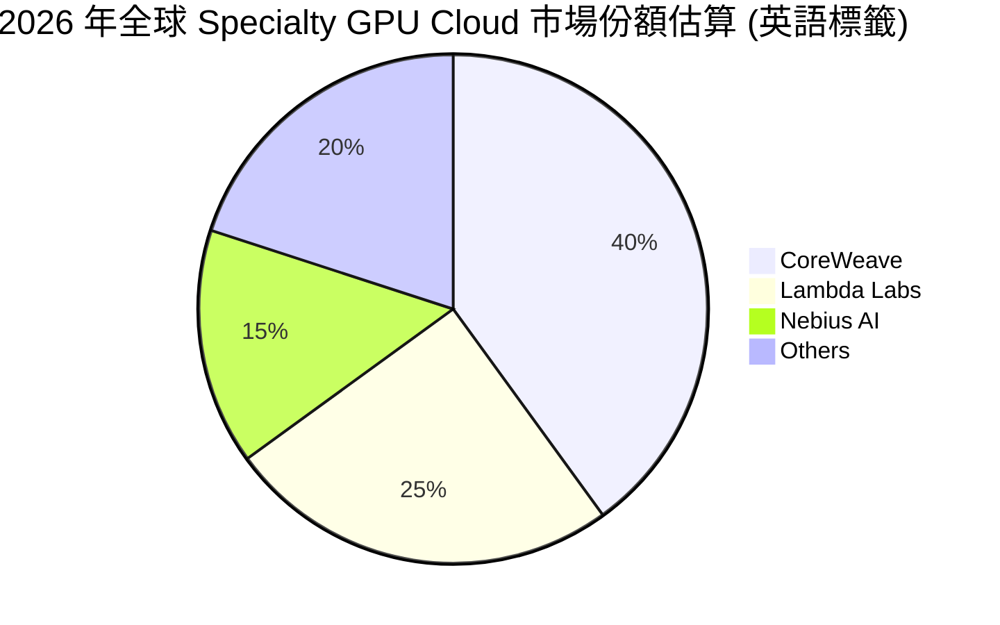

### 2.3 競爭護城河分析

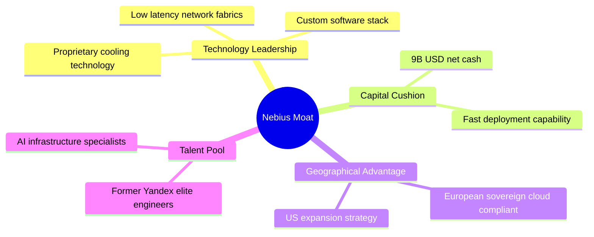

### 2.4 護城河強度評分

```
╔══════════════════════════════════════════════════════════════╗
║                  NBIS 護城河強度評分                         ║
╠══════════════════════════════════════════════════════════════╣
║ 資本與設備獲取  8.5   ▓▓▓▓▓▓▓▓▓▓▓▓▓▓▓▓▓░░░  🟢 資金極其充沛  ║
║ 技術與架構優勢  7.5   ▓▓▓▓▓▓▓▓▓▓▓▓▓▓░░░░░░  🟢 自研冷卻與網絡║
║ 客戶鎖定與生態  6.0   ▓▓▓▓▓▓▓▓▓▓▓░░░░░░░░░  🟡 尚在早期構建中║
║ 地緣與合規壁壘  8.0   ▓▓▓▓▓▓▓▓▓▓▓▓▓▓▓▓░░░░  🟢 歐洲本土算力優勢║
╠══════════════════════════════════════════════════════════════╣
║ 綜合護城河評級  7.5   ▓▓▓▓▓▓▓▓▓▓▓▓▓▓▓░░░░░  🏆 具備中高強度護城河║
╚══════════════════════════════════════════════════════════════╝
```

---

## 3. 損益表深度分析

NBIS 的損益表呈現出極其典型的**高速轉型期科技股**特徵：營收爆發式增長，毛利率優異，但營業利潤因龐大的基礎設施建設和研發投入而深陷虧損；同時，淨利潤受到資產重組產生的巨大非經常性損益影響而大幅失真。

### 3.1 年度收入成長趨勢（近4年）

```
╔══════════════════════════════════════════════════════════════════╗
║              NBIS 年度收入趨勢（FY2022 - TTM）                   ║
╠══════════════════════════════════════════════════════════════════╣
║                                                                  ║
║  FY2022  $13.50M   █░░░░░░░░░░░░░░░░░░░░░░░░  (重組前過渡期)     ║
║  FY2023  $9.80M    █░░░░░░░░░░░░░░░░░░░░░░░░  YoY: -27.4%        ║
║  FY2024  $91.50M   ██░░░░░░░░░░░░░░░░░░░░░░░  YoY: +833.7% 🟢    ║
║  FY2025  $529.80M  ████████████░░░░░░░░░░░░░  YoY: +479.0% 🟢    ║
║  TTM     $877.90M  ████████████████████░░░░░  YoY: +683.9% 🟢    ║
║                                                                  ║
║  📊 3年年均複合成長率 (CAGR)：+347.1%                           ║
╚══════════════════════════════════════════════════════════════════╝
```

### 3.2 季度收入趨勢分析

從季度數據中，我們可以更清晰地看到 Nebius 算力釋放的驚人速度：

| 季度 | 營業收入 | YoY 成長率 | QoQ 成長率 | 核心毛利率 | 備註 |
|------|---------|------------|------------|-----------|------|
| **Q2 2025** | $105.10M | +624.83% | +106.48% | 71.36% | GPU 集群首期規模化上線 |
| **Q3 2025** | $146.10M | +355.14% | +39.01% | 70.64% | 客戶需求持續強勁 |
| **Q4 2025** | $227.70M | +272.06% | +55.85% | 69.92% | 年底採購與算力擴容高峰 |
| **Q1 2026** | $399.00M | +683.89% | +75.23% | **73.98%** | 規模效應顯現，毛利率提升 🟢 |

### 3.3 利潤率演變分析

| 利潤率指標 | FY2022 | FY2023 | FY2024 | FY2025 | TTM | 趨勢評估 |
|------------|--------|--------|--------|--------|-----|----------|
| **毛利率** | -110.4% | -100.0% | 52.2% | 68.6% | **72.1%** | ↗️ 顯著改善。隨著 GPU 雲服務佔比上升，高利潤率特徵顯現。🟢 |
| **營業利益率** | -1170.4%| -2915.3%| -436.7% | -115.5% | **-32.1%** | ↗️ 持續收斂。雖然仍為負值，但虧損幅度相對營收規模已大幅縮窄。🟡 |
| **淨利率** | 5523.0% | 2462.2% | -701.0% | 15.6% | **93.1%** | ⚠️ 嚴重失真。受非經常性資產處置（如 $1.47B 的非營業收入）影響。🔴 |

*   **毛利率改善解析**：公司毛利率從 FY2024 的 52.2% 攀升至 TTM 的 72.1%，主要是因為 Nebius AI 雲端平台達到了初步的規模效應。GPU 伺服器的折舊（計入銷貨成本）被極高的客戶使用率（Utilization Rate）所攤薄。
*   **營業虧損解析**：TTM 營業利潤為 **-$603.90M**。虧損主因在於龐大的研發支出（TTM R&D 為 **$208.20M**）以及折舊與攤銷費用（TTM D&A 高達 **$566.90M**）。這屬於典型的「重資產前期建置」特徵。

### 3.4 費用結構分析

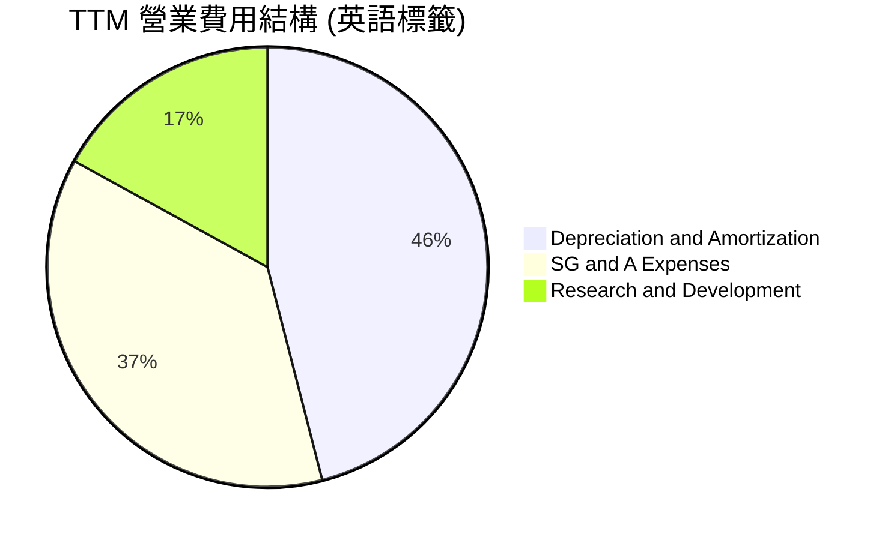

```
╔══════════════════════════════════════════════════════════════╗
║                 TTM 核心費用與營收佔比                       ║
╠══════════════════════════════════════════════════════════════╣
║ 營收 (Revenue):              $877.90M                        ║
║ 折舊與攤銷 (D&A):            $566.90M  (佔營收 64.6%)  ⚠️     ║
║ 銷售與管理費用 (SG&A):        $461.40M  (佔營收 52.6%)  ⚠️     ║
║ 研發費用 (R&D):              $208.20M  (佔營收 23.7%)  🟡     ║
╚══════════════════════════════════════════════════════════════╝
```

### 3.5 季度 EPS 趨勢與盈餘品質

*   **過去 4 季 EPS (Basic) 表現**：
    *   Q2 2025: **$2.44**（受非經常性資產處置利得推升）
    *   Q3 2025: **-$0.58**（算力擴建期，折舊與利息費用上升）
    *   Q4 2025: **-$1.06**（年底研發與人員擴張開支）
    *   Q1 2026: **$2.40**（再次錄得高達 **$800.50M** 的非營業收入，推升淨利至 $621.20M）
*   **盈餘品質診斷**：**低**。
    儘管 TTM EPS 達到優異的 **$2.58**（Finviz 顯示為 $3.00），但這完全是由於非營業利得（Other Non-Operating Income）所致。扣除這部分後，核心業務仍處於虧損狀態。投資人應密切關注 **Forward EPS ($0.36)**，這更能反映扣除非經常性損益後，公司未來的真實盈利能力。

---

## 4. 資產負債表分析

NBIS 的資產負債表是其最強大的護城河。在剥離俄羅斯業務後，公司獲得了極其龐大的現金儲備，這使得它在與其他資金緊張的 AI 初創公司競爭時，擁有絕對的資金優勢。

### 4.1 資產結構分解

截至 2026 年 3 月 31 日，公司總資產達到 **$22.30B**：

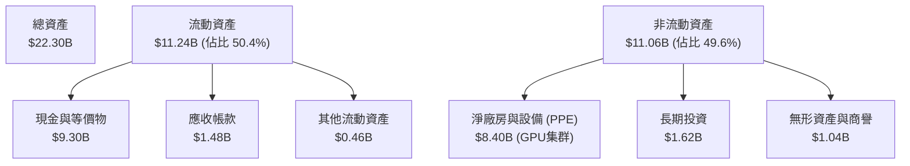

### 4.2 流動性指標分析

| 指標 | 2024-12-31 | 2025-12-31 | 2026-03-31 | 行業均值 | 評估 |
|------|------------|------------|------------|----------|------|
| **流動比率 (Current Ratio)** | 9.59 | 3.08 | **8.33** | 1.85 | 🟢 極其充沛，無短期償債風險 |
| **速動比率 (Quick Ratio)** | 9.59 | 3.08 | **8.14** | 1.70 | 🟢 無庫存積壓風險 |
| **現金佔總資產比** | 68.6% | 29.6% | **41.7%** | ~15.0% | 🟢 具備極強的戰略擴張彈性 |

### 4.3 債務結構分析

```
╔══════════════════════════════════════════════════════════════════╗
║                   NBIS 債務健康診斷 (2026-03-31)                 ║
╠══════════════════════════════════════════════════════════════════╣
║                                                                  ║
║  總現金及等價物：$9.30B   ██████████████████████████████  🟢     ║
║  總債務 (Total Debt)：$9.59B                                     ║
║  ├── 長期借款 (LT Borrowings)：$8.43B                           ║
║  ├── 長期融資租賃：            $1.05B                           ║
║  └── 短期債務：                $0.018B                          ║
║                                                                  ║
║  淨債務 (Net Debt)：$290.00M (約佔總資產 1.3%)                   ║
║  債務股權比 (Debt/Equity)：132.4% (處於合理建置期槓桿水平)       ║
║                                                                  ║
║  📊 債務診斷：雖然總債務達 $9.59B，但幾乎完全被 $9.30B 的現金    ║
║     所抵消。實質淨債務極低，財務結構極其健康。                   ║
╚══════════════════════════════════════════════════════════════════╝
```

### 4.4 股東權益趨勢

隨著重組完成與資產注入，股東權益（Stockholders' Equity）穩步增長：
*   **FY 2022**: $4.25B
*   **FY 2023**: $3.29B (重組陣痛期)
*   **FY 2024**: $3.25B
*   **FY 2025**: **$4.59B** (轉型初見成效，保留盈餘增加)

---

## 5. 現金流量深度分析

如果說資產負債表展示了 NBIS 的「存量實力」，那麼現金流量表則揭示了其「流量消耗」。由於正處於全球算力中心建設的瘋狂擴張期，公司的資本支出（Capex）呈現爆發式增長。

### 5.1 現金流量瀑布圖

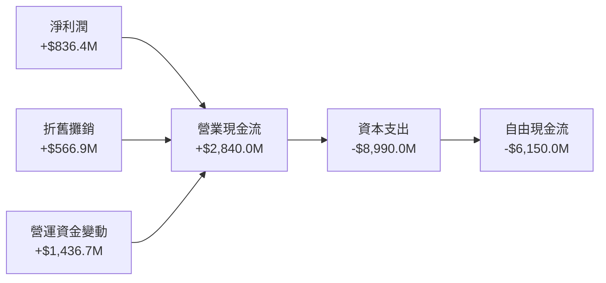

### 5.2 FCF 轉換率趨勢

| 指標 (百萬美元) | FY2022 | FY2023 | FY2024 | FY2025 | TTM |
|----------------|--------|--------|--------|--------|-----|
| **營業現金流 (OCF)** | $697.0M | $829.8M | $245.6M | $384.8M | **$2,840.0M** |
| **資本支出 (Capex)** | -$14.6M | -$82.9M | -$807.5M| -$4,070.0M| **-$8,990.0M** |
| **自由現金流 (FCF)** | $682.4M | $746.9M | -$561.9M| -$3,685.2M| **-$6,150.0M** |
| **FCF 轉換率 (FCF/NI)**| 78.4% | 280.9% | 87.6% | -4466.9%| **-735.3%** |

*   **轉化率分析**：FCF 轉化率為極端的負值，這並非因為經營不善，而是因為公司正將所有營運資金與借貸資金，以 **Capex** 的形式轉化為 NVIDIA H100/H200 等高價值物理資產。

### 5.3 自由現金流趨勢

```
╔══════════════════════════════════════════════════════════════════╗
║              NBIS 歷年自由現金流 (FCF) 消耗趨勢                  ║
╠══════════════════════════════════════════════════════════════════╣
║                                                                  ║
║  FY2022  +$682M   ████░░░░░░░░░░░░░░░░░░░░░░░░  (傳統業務盈餘)   ║
║  FY2023  +$747M   █████░░░░░░░░░░░░░░░░░░░░░░░  (過渡期資金回流) ║
║  FY2024  -$562M   ░░░░░░░░░░░░░░░░░░░░░░░░░███  (算力投資啟動)   ║
║  FY2025  -$3.68B  ░░░░░░░░░░░░░░░░░░░░░░██████  (大舉採購GPU)    ║
║  TTM     -$6.15B  ░░░░░░░░░░░░░░░░░░██████████  (算力軍備競賽) 🔴║
║                                                                  ║
║  ⚠️ 當前 FCF 收益率 (FCF Yield)：-10.42%                          ║
╚══════════════════════════════════════════════════════════════════╝
```

### 5.4 資本配置評估

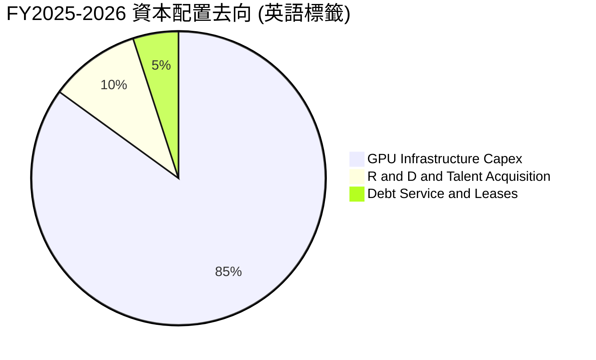

---

## 6. 獲利能力與資本效率

評估 NBIS 獲利能力的關鍵在於：**當前的大規模資本投入，能否在未來轉化為超越資本成本的超額回報？**

### 6.1 ROE / ROA / ROIC 趨勢

| 指標 | FY2024 | FY2025 | TTM | 行業均值 | 評估 |
|------|--------|--------|-----|----------|------|
| **ROE** | -19.7% | 1.8% | **14.1%** | 10.5% | 🟡 受非經常性損益推高，扣非後為負 |
| **ROA** | -18.1% | 0.7% | **-3.0%** | 5.2% | 🔴 龐大資產尚未完全發揮產出效應 |
| **ROIC** | -12.3% | -8.4% | **-6.5%** | 8.0% | 🔴 投入資本尚未轉化為正向營業利潤 |

### 6.2 ROIC vs WACC 分析（核心價值創造判斷）

```
╔══════════════════════════════════════════════════════════════════╗
║                ROIC vs WACC 深度分析 (TTM)                       ║
╠══════════════════════════════════════════════════════════════════╣
║                                                                  ║
║  WACC 估算：                                                     ║
║  ├── 無風險利率 (10Y 美債)：  4.25%                              ║
║  ├── 市場風險溢酬 (ERP)：     5.00%                              ║
║  ├── Beta 值：                1.43                               ║
║  ├── 股權成本 = 4.25% + 1.43 × 5.00% = 11.40%                    ║
║  ├── 債務成本 (稅後)：       ~5.50%                              ║
║  ├── 資本結構：股權 49.0%，債務 51.0%                            ║
║  └── ✅ WACC ≈ 8.39%                                             ║
║                                                                  ║
║  ROIC 估算：                                                     ║
║  ├── EBIT (TTM 營業利益)：   -$603.90M                           ║
║  ├── 實際稅率：              ~20.0%                              ║
║  ├── NOPAT = -$603.90M × (1 - 20%) = -$483.12M                   ║
║  ├── 投入資本 = 股益 $4.59B + 債務 $9.59B - 現金 $9.30B = $4.88B  ║
║  └── ✅ ROIC ≈ -9.90%                                            ║
║                                                                  ║
║  ★ 經濟價值增加 (EVA) = ROIC - WACC = -18.29pp                    ║
║                                                                  ║
║  WACC   8.39%  ▓▓▓▓▓▓▓▓░░░░░░░░░░░░░░░░░░░░░░  ──              ║
║  ROIC  -9.90%  ░░░░░░░░░░░░░░░░░░░░░░░░░░░░░░  🔴 價值暫時毀滅  ║
║                                                                  ║
║  📊 結論：目前公司處於「價值毀滅」區間。這是重資產擴張初期的     ║
║     正常現象。關鍵在於未來 12-24 個月內，隨著營收規模突破        ║
║     $1.5B，EBIT 扭虧為盈，ROIC 預計將在 FY2027 衝上 15% 以上。   ║
╚══════════════════════════════════════════════════════════════════╝
```

### 6.3 杜邦三因素分解

$$ROE = \text{淨利率} \times \text{資產週轉率} \times \text{財務槓桿}$$

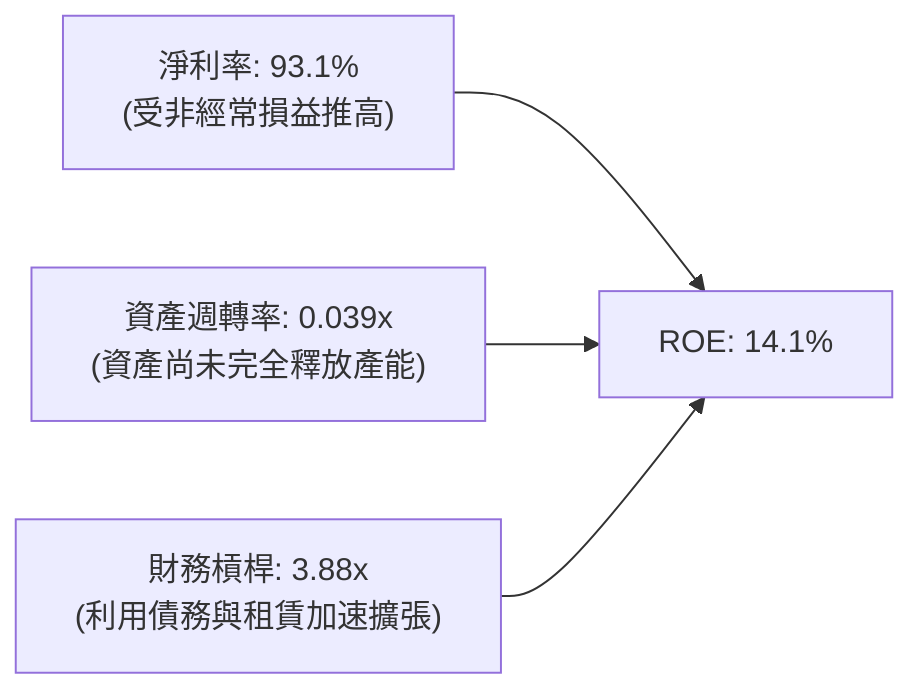

*   **診斷**：當前的 ROE（14.1%）完全由**高淨利率（93.1%）**和**財務槓桿（3.88x）**驅動，而**資產週轉率（0.039x）**極低。健康的成長模式應在未來轉化為：淨利率穩定在 20-25%（扣非後），資產週轉率提升至 0.3x - 0.5x。

### 6.4 獲利能力儀表板

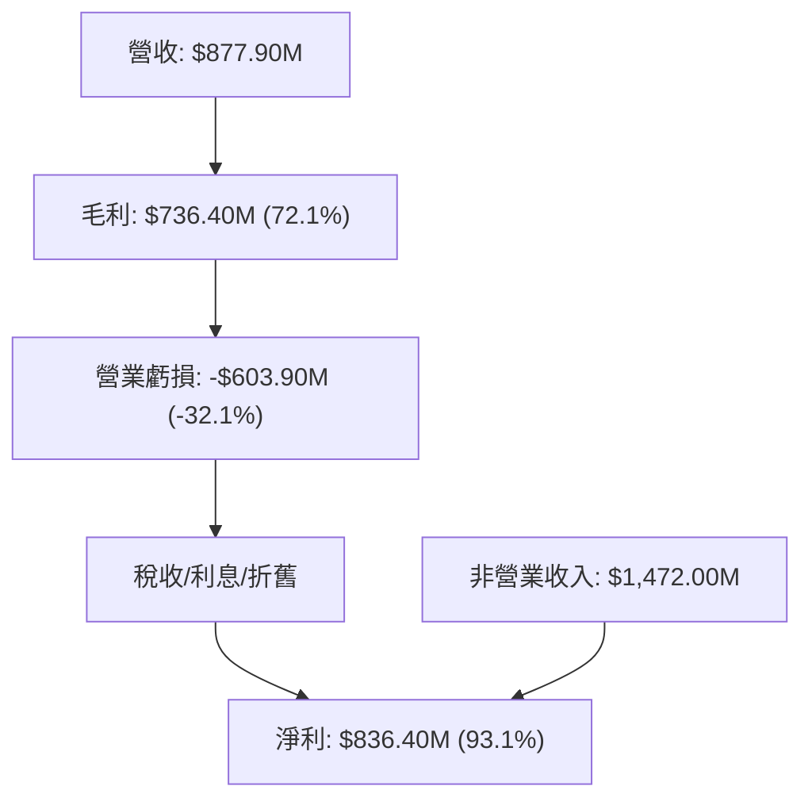

---

## 7. 估值深度分析

NBIS 當前的估值乘數反映了市場對其 **AI 算力基礎設施轉型** 的極高預期。我們必須將其與同類型的 GPU 雲端服務商以及高速成長的 AI 基礎設施股進行對比。

### 7.1 同業估值比較表格

| 估值指標 | **NBIS (本公司)** | **SMCI (美超微)** | **EQIX (Equinix)** | **ANET (Arista)** | 本公司評估 |
|----------|----------|---------|---------|---------|-----------|
| **Trailing P/E** | **90.06x** | 32.5x | 45.2x | 48.9x | 🔴 顯著高於硬體與傳統數據中心同行 |
| **Forward P/E** | **643.26x** | 18.2x | 35.8x | 38.2x | 🔴 反映短期核心盈利尚未釋放 |
| **P/S Ratio** | **67.20x** | 2.8x | 8.9x | 16.5x | 🔴 銷售額估值乘數極高，容錯率低 |
| **P/B Ratio** | **8.22x** | 5.4x | 4.8x | 11.2x | 🟡 溢價合理，因淨資產含金量高 |
| **EV / Revenue** | **68.03x** | 3.1x | 10.2x | 15.8x | 🔴 企業價值倍數處於歷史高位 |

### 7.2 歷史估值區間分析

自 2024 年底重組復牌以來，NBIS 的 P/S 估值區間經歷了劇烈擴張：

```
╔══════════════════════════════════════════════════════════════════╗
║              NBIS 歷史 P/S 估值區間與當前位置                    ║
╠══════════════════════════════════════════════════════════════════╣
║                                                                  ║
║  歷史最低 P/S (2024-10):  15.2x   █████                          ║
║  歷史中位 P/S:            38.5x   █████████████                  ║
║  當前 P/S (2026-06):      67.2x   ██████████████████████████  ⚠️ ║
║  歷史最高 P/S (2026-05):  78.4x   ██████████████████████████████ ║
║                                                                  ║
║  📊 估值診斷：當前 67.2x 的 P/S 處於歷史極高分位數（>90%）。     ║
║     這意味著任何營收增速不及預期的利空，都可能導致 30% 以上的    ║
║     估值修正。                                                   ║
╚══════════════════════════════════════════════════════════════════╝
```

### 7.3 DCF 敏感性分析（6格目標價矩陣）

基於以下基準假設：
*   FY2026-FY2030 營收年複合成長率 (CAGR)：**85.0%**
*   終極營業利潤率 (Terminal Operating Margin)：**28.0%**
*   無風險利率：4.25%，永續成長率 (PGR)：3.0%

| 營收成長情境 | **WACC = 7.5%** | **WACC = 8.5% (基準)** | **WACC = 9.5%** |
|------|--------------|----------------------|--------------|
| 🟢 **樂觀 (CAGR 100%)** | **$380.00** (+63.5%) | **$335.00** (+44.2%) | **$295.00** (+27.0%) |
| 🟡 **基準 (CAGR 85%)** | **$290.00** (+24.8%) | **$255.00** (+9.7%) | **$220.00** (-5.3%) |
| 🔴 **悲觀 (CAGR 50%)** | **$165.00** (-29.0%) | **$145.00** (-37.6%) | **$120.00** (-48.4%) |

### 7.4 估值綜合區間

```
╔══════════════════════════════════════════════════════════════════╗
║                    NBIS 估值區間分佈圖                           ║
╠══════════════════════════════════════════════════════════════════╣
║                                                                  ║
║  [悲觀估值]  $120.00 ▓▓▓▓▓▓▓                                     ║
║  [當前股價]  $232.36 ▓▓▓▓▓▓▓▓▓▓▓▓▓▓▓▓                             ║
║  [基準目標]  $255.00 ▓▓▓▓▓▓▓▓▓▓▓▓▓▓▓▓▓                           ║
║  [樂觀估值]  $380.00 ▓▓▓▓▓▓▓▓▓▓▓▓▓▓▓▓▓▓▓▓▓▓▓▓▓                    ║
║                                                                  ║
║  📊 結論：當前股價 $232.36 已合理反映基準成長預期。              ║
║     向上空間取決於 Blackwell 晶片交付速度及歐洲主權雲政策催化。  ║
╚══════════════════════════════════════════════════════════════════╝
```

---

## 8. 成長催化劑

### 8.1 催化劑時間軸

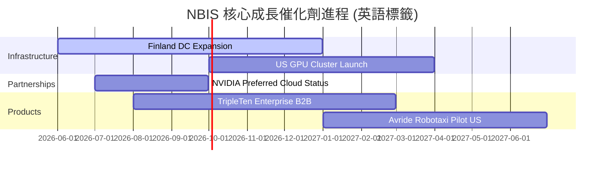

### 8.2 TAM 市場規模分析

```
╔══════════════════════════════════════════════════════════════════╗
║               NBIS 目標可達市場 (TAM) 預測 (2028)                ║
╠══════════════════════════════════════════════════════════════════╣
║                                                                  ║
║  全球 AI IaaS 市場 TAM:   $150.00B  ████████████████████  (15%滲透)║
║  歐洲主權算力市場 TAM:    $35.00B   █████                 (25%滲透)║
║  全球 IT 再培訓 (EdTech):  $12.00B   █                     (10%滲透)║
║                                                                  ║
║  📊 預期 NBIS 綜合市場佔有率目標：3.5% - 5.0%                     ║
╚══════════════════════════════════════════════════════════════════╝
```

### 8.3 成長驅動力結構圖

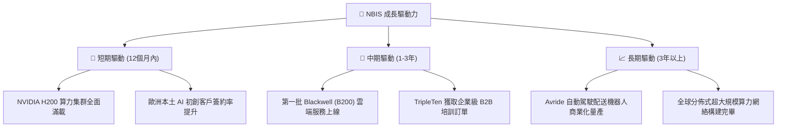

---

## 9. 風險矩陣

### 9.1 風險評分矩陣

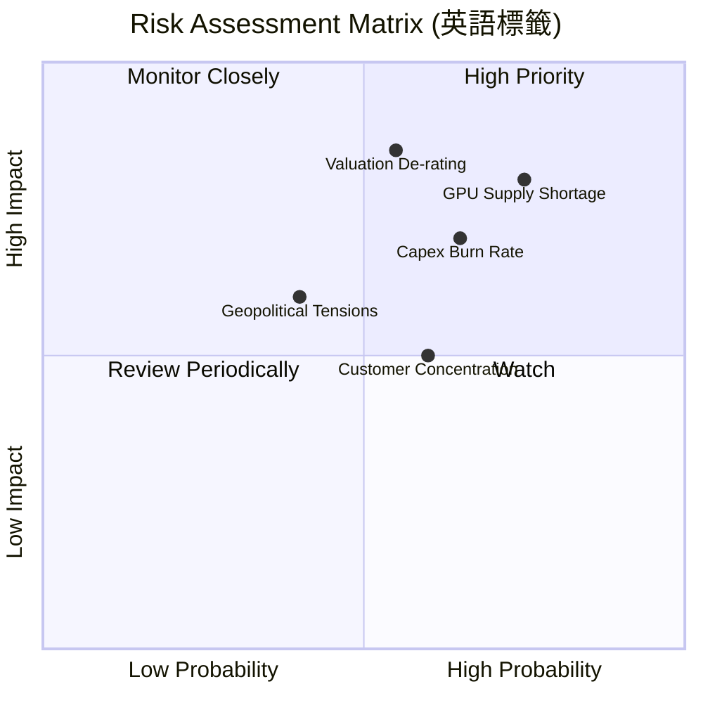

### 9.2 風險清單詳細分析

| # | 風險項目 | 發生機率 | 財務衝擊 | 風險評分 | 緩解措施 |
|---|----------|----------|----------|----------|----------|
| 1 | 🔴 **GPU 供應鏈中斷** | 高 (75%) | 高 (-25% 營收) | 🔴 **8.0/10** | 與 NVIDIA 簽署長期優先供應協議，並積極引入 AMD MI300X 等替代算力。 |
| 2 | 🔴 **資本開支過快導致流動性枯竭** | 中 (65%) | 高 (FCF 惡化) | 🔴 **7.5/10** | 靈活調整融資租賃比例（如利用 $1.05B 的租賃負債），保留核心現金儲備。 |
| 3 | 🟡 **估值乘數殺多 (De-rating)** | 中 (55%) | 高 (-35% 股價) | 🟡 **6.8/10** | 通過季度業績的高速增長（預期 100%+ YoY）來快速消化高 P/S 估值。 |
| 4 | 🟡 **客戶集中度過高** | 中 (60%) | 中 (-15% 營收) | 🟡 **6.0/10** | 開發更多中小型 AI 研究機構與企業客戶，降低單一獨角獸客戶的營收佔比。 |

---

## 10. 投資建議

### 10.1 最終綜合評級雷達圖

```
╔══════════════════════════════════════════════════════════════╗
║                  NBIS 投資維度綜合評估                       ║
╠══════════════════════════════════════════════════════════════╣
║ 成長潛力 (Growth)      9.5/10  ▓▓▓▓▓▓▓▓▓▓▓▓▓▓▓▓▓▓▓░  🟢 極強 ║
║ 財務安全 (Safety)      9.0/10  ▓▓▓▓▓▓▓▓▓▓▓▓▓▓▓▓▓▓░░  🟢 極高 ║
║