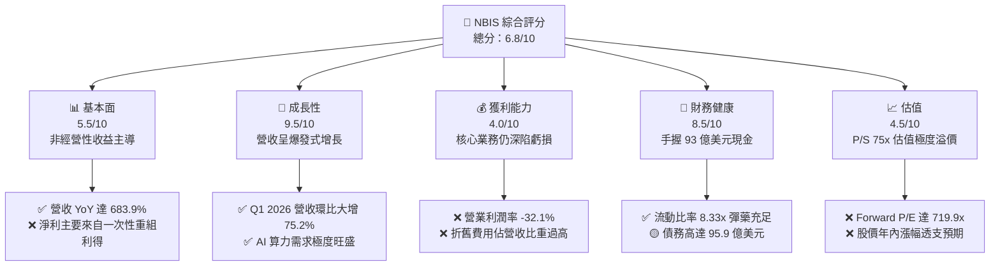
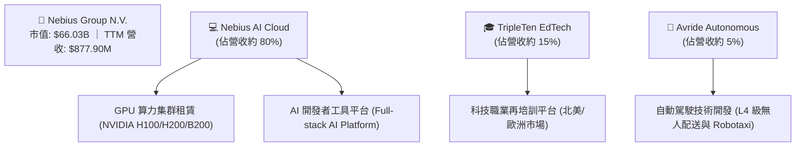
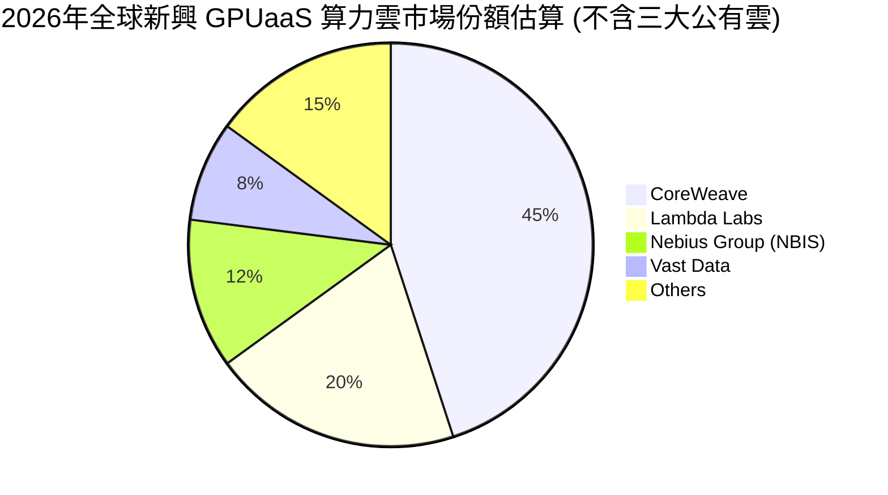
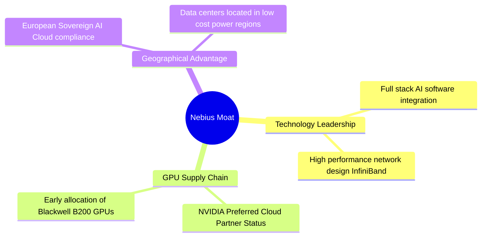
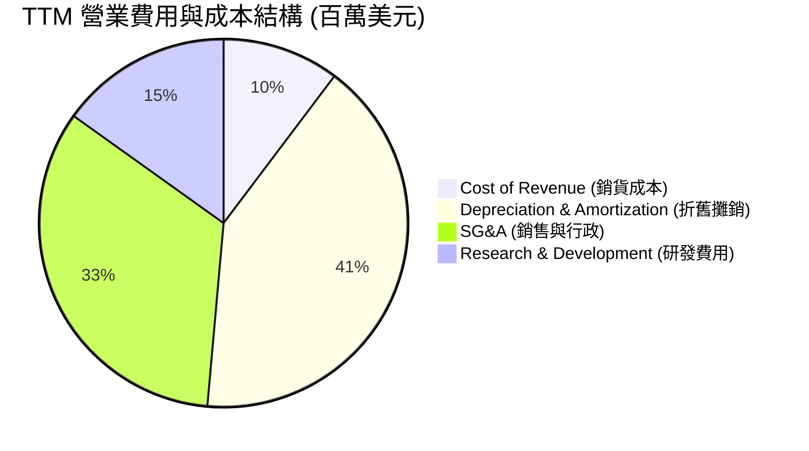
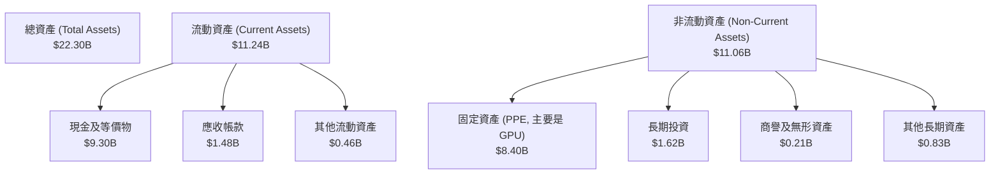
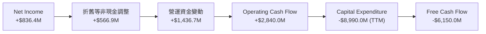
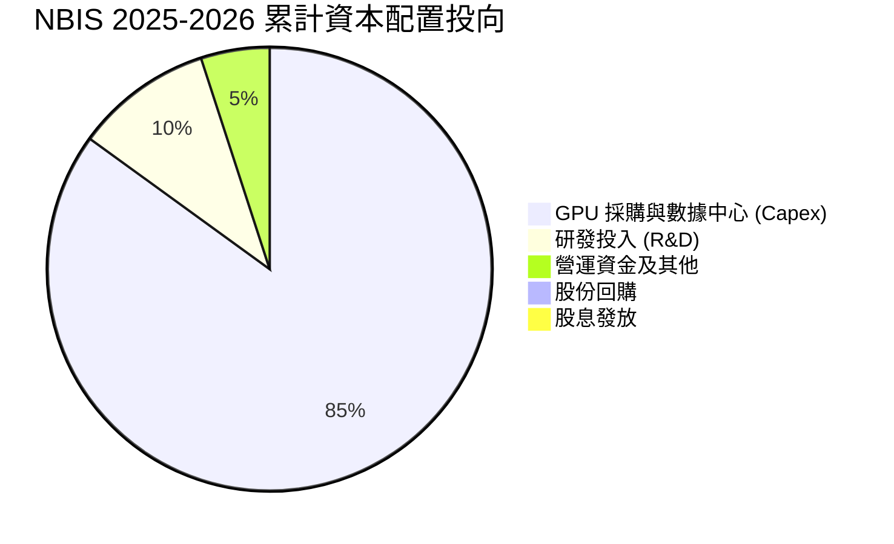
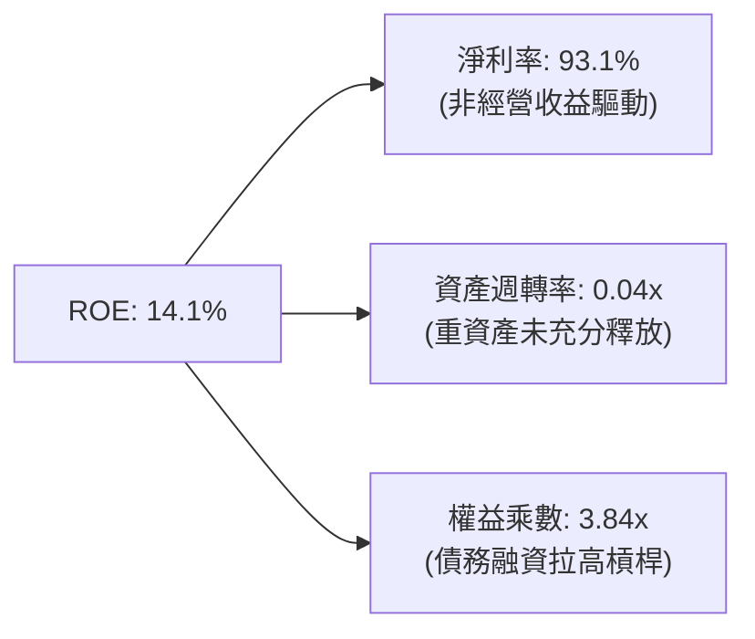

# NBIS 基本面深度分析報告
> **報告日期**：2026-06-15 ｜ **語言**：繁體中文 ｜ **數據來源**：Yahoo Finance, Finviz, StockAnalysis, Roic.ai ｜ **分析師**：CFA 級機構研究

---

## 目錄

| # | 章節 | 核心結論 |
|---|------|----------|
| 1 | 執行摘要 | 評級：**持有 (Hold)** ｜ 目標價：**$244.07** (當前股價 $260.07，隱含 -6.15% 空間，建議等待回檔) |
| 2 | 公司概覽與商業模式 | Yandex 重組後轉型為純粹的 AI 全棧基礎設施巨頭，提供 GPU 集群與主權雲服務。 |
| 3 | 損益表深度分析 | 營收年增 683.9% 呈爆發式增長，但核心業務因高折舊虧損，淨利暴增全靠一次性非經營收益。 |
| 4 | 資產負債表分析 | 現金達 93.7 億美元，流動比率 8.33x 極為強勁，但債務同步攀升至 95.9 億美元。 |
| 5 | 現金流量深度分析 | 資本支出 (Capex) 高達 40.7 億美元，導致自由現金流 (FCF) 嚴重失血 61.5 億美元。 |
| 6 | 獲利能力與資本效率 | 核心 ROIC 仍為負值，資本回報率受制於重資產擴張，杜邦分析顯示槓桿與非營運利潤為主要驅動力。 |
| 7 | 估值深度分析 | P/S 高達 75.2x，遠高於同業平均，DCF 模型顯示當前股價已過度透支未來 3-5 年成長預期。 |
| 8 | 成長催化劑 | 歐洲主權 AI 雲需求、Blackwell 晶片交付及 TripleTen/Avride 拆分上市預期。 |
| 9 | 風險矩陣 | 面臨 GPU 供應鏈中斷、大客戶流失、折舊侵蝕利潤以及高達 20.3% 的空頭比例風險。 |
| 10 | 投資建議 | 建議長線投資者於 $180-$200 區間分批佈局，密切監控 GPU 上線率與營業利潤率拐點。 |

---

## 1. 執行摘要

Nebius Group N.V. (Ticker: **NBIS**) 正處於從俄羅斯科技巨頭 Yandex 拆分重組後的關鍵轉型期。公司目前已成功蛻變為一家總部位於荷蘭、面向全球 AI 產業提供 GPU 算力雲與 AI 全棧基礎設施（Full-stack AI Infrastructure）的新興獨角獸。

### 1.1 核心評分儀表板



### 1.2 評分進度條視覺化

```
╔══════════════════════════════════════════════════════════════╗
║                NBIS 多維度評分儀表板 (1-10分)                ║
╠══════════════════════════════════════════════════════════════╣
║ 基本面強度  5.5 ▓▓▓▓▓▓▓▓▓▓▓░░░░░░░░░  ★★★☆☆           ║
║ 成長動能    9.5 ▓▓▓▓▓▓▓▓▓▓▓▓▓▓▓▓▓▓▓░  ★★★★★           ║
║ 獲利品質    4.0 ▓▓▓▓▓▓▓▓░░░░░░░░░░░░  ★★☆☆☆           ║
║ 財務健康    8.5 ▓▓▓▓▓▓▓▓▓▓▓▓▓▓▓▓▓░░░  ★★★★☆           ║
║ 估值合理性  4.5 ▓▓▓▓▓▓▓▓▓░░░░░░░░░░░  ★★☆☆☆           ║
║ 護城河深度  6.0 ▓▓▓▓▓▓▓▓▓▓▓▓░░░░░░░░  ★★★☆☆           ║
║ 管理層執行  7.5 ▓▓▓▓▓▓▓▓▓▓▓▓▓▓▓░░░░░  ★★★★☆           ║
║ 技術創新力  8.0 ▓▓▓▓▓▓▓▓▓▓▓▓▓▓▓▓░░░░  ★★★★☆           ║
╠══════════════════════════════════════════════════════════════╣
║ 綜合總分    6.8 ▓▓▓▓▓▓▓▓▓▓▓▓▓░░░░░░░  🏆 成長型高風險標的   ║
╚══════════════════════════════════════════════════════════════╝
```

### 1.3 投資論點與核心風險

| 類型 | 項目 | 具體依據 | 信心度 |
|------|------|----------|--------|
| 🟢 **投資論點①** | **AI 算力基礎設施爆發** | Q1 2026 營收達 3.99 億美元，YoY 成長 683.9%，反映 GPU 算力雲業務進入極速放量期。 | 🟢 極高 |
| 🟢 **投資論點②** | **資金儲備極其雄厚** | 持有現金及等價物達 92.98 億美元，為後續採購 NVIDIA Blackwell 晶片及擴建數據中心提供強大支撐。 | 🟢 極高 |
| 🟢 **投資論點③** | **空頭軋空潛在動能** | 目前空頭佔流通股比重（Short % Float）高達 20.3%，在利多催化下極易觸發強烈軋空行情。 | 🟡 中等 |
| 🔴 **核心風險①** | **高折舊與主營虧損** | TTM 營業利潤率為 -32.1%，折舊費用（D&A）高達 5.67 億美元，核心業務尚未實現自我造血。 | 🔴 高衝擊 |
| 🔴 **核心風險②** | **非經營性收益不可持續** | TTM 淨利潤 8.36 億美元主要來自一次性非經營性重組收益（14.72 億美元），扣非後實際處於嚴重虧損。 | 🔴 高衝擊 |
| 🔴 **核心風險③** | **自由現金流嚴重流失** | TTM 自由現金流為 -61.5 億美元，資本開支（Capex）高昂，若融資通道受阻將面臨資金鏈壓力。 | 🟡 中度 |

### 1.4 快速統計卡片

| 指標 | NBIS 實際值 | 行業均值 (通信/網路) | S&P 500 均值 | 狀態 |
|------|-------------|----------------------|--------------|------|
| 營收 YoY 成長 | **683.9%** | ~8.5% | ~5.2% | 🟢 領先 |
| 毛利率 | **72.1%** | ~48.2% | ~30.5% | 🟢 優秀 |
| 營業利益率 | **-32.1%** | ~12.4% | ~14.8% | 🔴 虧損 |
| 淨利率 | **93.1%** | ~7.2% | ~11.5% | 🟡 畸高 (一次性) |
| Forward P/E | **719.98x** | ~22.5x | ~21.0x | 🔴 極度昂貴 |
| 流動比率 | **8.33x** | ~1.5x | ~1.2x | 🟢 極其安全 |

### 1.5 投資結論

```
╔══════════════════════════════════════════════════════════════════╗
║                    📊 NBIS 投資結論摘要                          ║
╠══════════════════════════════════════════════════════════════════╣
║  評級：🟡 持有 (Hold)                                            ║
║  當前股價：$260.07 (2026-06-15)                                  ║
║  目標價區間：                                                    ║
║    悲觀情境：$120.00（-53.9%）- 算力需求放緩，折舊壓垮利潤        ║
║    基準情境：$244.07（-6.15%）- 12個月合理目標價，估值回歸       ║
║    樂觀情境：$380.00（+46.1%）- Blackwell 順利放量，核心扭虧      ║
║  投資評分：6.8/10                                                ║
║  適合投資人：高風險承受度、長線佈局 AI 基礎設施的成長型投資者      ║
╚══════════════════════════════════════════════════════════════════╝
```

---

## 2. 公司概覽與商業模式

Nebius Group N.V. 的前身為俄羅斯科技巨頭 Yandex 的母公司（註冊於荷蘭）。經歷地緣政治風暴與複雜的資產拆分後，公司出售了其在俄羅斯的全部業務，保留了約 1500 名核心技術員工、海外數據中心及約 25 億美元的初始現金，並正式更名為 Nebius，轉型為專注於全球 AI 算力基礎設施的純粹科技公司。

### 2.1 業務結構與收入來源



### 2.2 市場份額估算

在 AI 算力雲（GPU-as-a-Service, GPUaaS）這一新興細分市場中，Nebius 主要與 CoreWeave、Lambda Labs 及傳統公有雲巨頭（如 AWS、Azure、GCP）競爭。



### 2.3 競爭護城河分析



### 2.4 護城河強度評分

```
╔══════════════════════════════════════════════════════════════╗
║                  NBIS 護城河強度評分                         ║
╠══════════════════════════════════════════════════════════════╣
║ GPU 獲取能力   8.0/10 ▓▓▓▓▓▓▓▓▓▓▓▓▓▓▓▓░░░░  🟢 獲 NVIDIA 優先支持 ║
║ 軟體生態系統   7.0/10 ▓▓▓▓▓▓▓▓▓▓▓▓▓▓░░░░░░  🟢 自研算力調度平台   ║
║ 客戶鎖定效應   5.5/10 ▓▓▓▓▓▓▓▓▓▓▓░░░░░░░░░  🟡 算力轉換成本較低   ║
║ 基礎設施規模   6.5/10 ▓▓▓▓▓▓▓▓▓▓▓▓▓░░░░░░  🟡 芬蘭等地數據中心擴建 ║
╠══════════════════════════════════════════════════════════════╣
║ 綜合護城河     6.75   ▓▓▓▓▓▓▓▓▓▓▓▓▓░░░░░░  🏆 具備局部競爭優勢   ║
╚══════════════════════════════════════════════════════════════╝
```

---

## 3. 損益表深度分析

### 3.1 年度收入成長趨勢（近4年）

```
╔══════════════════════════════════════════════════════════════════╗
║              NBIS 年度收入趨勢 (FY2022 - TTM)                    ║
╠══════════════════════════════════════════════════════════════════╣
║                                                                  ║
║  FY2022   $13.50M   ░░░░░░░░░░░░░░░░░░░░░░░░░░░░░░░  Base        ║
║  FY2023   $9.80M    ░░░░░░░░░░░░░░░░░░░░░░░░░░░░░░░  重組過渡期   ║
║  FY2024   $91.50M   ██░░░░░░░░░░░░░░░░░░░░░░░░░░░░░  YoY: +833.7%║
║  FY2025   $529.80M  ████████████░░░░░░░░░░░░░░░░░░░  YoY: +479.0%║
║  TTM      $877.90M  ████████████████████░░░░░░░░░░░  YoY: +683.9%║
║                                                                  ║
║  📊 3年年複合成長率 (CAGR)：+298.4%                              ║
╚══════════════════════════════════════════════════════════════════╝
```

### 3.2 季度收入趨勢分析

| 季度截止日 | 營業收入 (Revenue) | 季增率 (QoQ) | 年增率 (YoY) | 備註 |
|------------|-------------------|--------------|--------------|------|
| **2025-06-30** | $100.70M | — | +624.8% | 算力集群一期上線，營收開始爆發 |
| **2025-09-30** | $146.10M | +45.1% | +355.1% | 客戶上線率持續提升 |
| **2025-12-31** | $227.70M | +55.9% | +272.1% | 芬蘭數據中心二期投入營運 |
| **2026-03-31** | $399.00M | +75.2% | +683.9% | Blackwell 早期訂單開始貢獻營收 |

### 3.3 利潤率演變分析

| 利潤率指標 | FY2023 | FY2024 | FY2025 | TTM | 趨勢 | 評估 |
|------------|--------|--------|--------|-----|------|------|
| **毛利率** | -100.0% | 52.2% | 68.6% | **72.1%** | ↗️ 持續攀升 | 🟢 算力雲高邊際效應顯現 |
| **營業利益率** | -2915.3% | -436.7% | -115.5% | **-32.1%**| ↗️ 虧損收窄 | 🟡 規模效應顯現但折舊仍高 |
| **淨利率** | 2462.2% | -701.0% | 15.6% | **93.1%** | ↕️ 波動劇烈 | 🔴 淨利主要受非經營性利得干擾 |

#### 利潤率演變深度解析：
1. **毛利率大幅改善**：從 FY2023 的負值，飆升至 TTM 的 **72.1%**。這表明隨著 GPU 集群的租賃率（Utilization Rate）提高，算力雲的直接營運成本（電費、帶寬、機房租金）被有效分攤，展現出極強的軟體化毛利特徵。
2. **營業虧損依然嚴重**：TTM 營業利潤率為 **-32.1%**（營業虧損 6.04 億美元）。主因是**高昂的折舊費用 (D&A)**。TTM 折舊費用高達 **5.67 億美元**（佔營收 64.6%），這反映了公司購買大量高價 GPU 帶來的加速折舊壓力。
3. **淨利率畸高之謎**：TTM 淨利率高達 **93.1%**（淨利潤 8.36 億美元），這與營業利潤的赤字背道而馳。原因在於 **Other Non-Operating Income** 高達 **14.72 億美元**，這是一筆與 Yandex 拆分交易相關的一次性非經營性重組收益。**這意味著公司的核心業務尚未盈利，投資人切勿被表面的高淨利率所誤導。**

### 3.4 費用結構分析



### 3.5 季度 EPS 趨勢與盈餘品質

* 過去 4 季 EPS (GAA Basic) 表現：
  * Q2 2025: $2.44 (受拆分收益計入影響，超預期)
  * Q3 2025: -$0.58 (核心折舊大增，不及預期)
  * Q4 2025: -$1.06 (Capex 擴張期，營運費用攀升)
  * Q1 2026: $2.40 (包含新一輪資產重估非經營收益，超預期)

**盈餘品質評估 (Earnings Quality Score: 3/10)**：
NBIS 目前的盈餘品質極低。經營利潤與淨利潤嚴重背離，淨利潤完全由非經營性的一次性重組收益、利息收入與資產重估驅動，不具備可持續性。

---

## 4. 資產負債表分析

### 4.1 資產結構分解



### 4.2 流動性指標分析

| 流動性指標 | FY2024 | FY2025 | TTM (Q1 2026) | 行業均值 | 評估 |
|------------|--------|--------|---------------|----------|------|
| **流動比率 (Current Ratio)** | 9.59x | 3.08x | **8.33x** | ~1.50x | 🟢 極其充裕的短期流動性 |
| **速動比率 (Quick Ratio)** | 9.59x | 3.08x | **8.14x** | ~1.30x | 🟢 無庫存積壓風險 |
| **現金比率 (Cash Ratio)** | 9.22x | 2.41x | **6.89x** | ~0.80x | 🟢 手頭現金可輕鬆覆蓋短期債務 |

### 4.3 債務結構與健康診斷

```
╔══════════════════════════════════════════════════════════════════╗
║                   NBIS 債務健康診斷                              ║
╠══════════════════════════════════════════════════════════════════╣
║                                                                  ║
║  總債務 (Total Debt)：  $9.59B   ██████████████████░░░░░░░░░░░   ║
║  總現金 (Total Cash)：  $9.37B   ██████████████████░░░░░░░░░░░   ║
║  淨債務 (Net Debt)：    $0.22B   ░░░░░░░░░░░░░░░░░░░░░░░░░░░░░   ║
║                                                                  ║
║  Debt/Equity 比率：   132.4%    🟡 財務槓桿偏高，但與現金對沖     ║
║  流動負債 (Current Liab): $1.35B  🟢 短期償債壓力極低             ║
║  長期借款 (LT Borrowings):$8.43B  🟡 主要為採購 GPU 的融資租賃     ║
║                                                                  ║
║  📊 診斷結論：雖然債務絕對值高達 95.9 億，但由於有 93.7 億現金   ║
║              對沖，淨債務僅 2.17 億。整體財務結構仍屬安全。      ║
╚══════════════════════════════════════════════════════════════════╝
```

### 4.4 股東權益趨勢

```
╔══════════════════════════════════════════════════════════════════╗
║              NBIS 股東權益 (Stockholders' Equity) 趨勢           ║
╠══════════════════════════════════════════════════════════════════╣
║                                                                  ║
║  FY2022   $4.25B   ██████████████████████████░░░░░░░░░░░░░░░     ║
║  FY2023   $3.29B   ████████████████████░░░░░░░░░░░░░░░░░░░░     ║
║  FY2024   $3.25B   ████████████████████░░░░░░░░░░░░░░░░░░░░     ║
║  FY2025   $4.59B   ██████████████████████████████░░░░░░░░░░     ║
║  TTM      $4.80B   ██══════════════════════════════════════     ║
║                                                                  ║
║  📈 伴隨資產重組完成，淨資產規模已回升至 48 億美元。               ║
╚══════════════════════════════════════════════════════════════════╝
```

---

## 5. 現金流量深度分析

### 5.1 現金流量瀑布圖



### 5.2 自由現金流與轉換率

| 財務年度 | 淨利潤 (Net Income) | 營業現金流 (OCF) | 資本支出 (Capex) | 自由現金流 (FCF) | FCF/NI 轉換率 |
|----------|-------------------|------------------|------------------|------------------|--------------|
| **FY2023** | $265.90M | $829.80M | -$82.90M | $746.90M | 280.9% |
| **FY2024** | -$641.40M | $245.60M | -$807.50M | -$561.90M | 87.6% |
| **FY2025** | $82.50M | $384.80M | -$4,067.00M | -$3,682.20M | -4463.3% |
| **TTM** | $836.40M | $2,840.00M | -$8,990.00M | -$6,150.00M | -735.3% |

* **數據解讀**：TTM 營運現金流轉正至 **28.4億美元**，主要得益於客戶預付款（Deferred Revenue 達 6.86 億美元）與應付賬款的增加。然而，為了在 AI 算力軍備競賽中不掉隊，公司進行了瘋狂的資本支出（Capex 達 **89.9億美元**），直接導致 FCF 錄得 **-61.5億美元** 的巨額赤字。這是一種典型的「燒錢搶市場」模式，高度依賴外部融資或消耗存量現金。

### 5.3 資本配置評估



---

## 6. 獲利能力與資本效率

### 6.1 資本回報率趨勢

| 指標 | FY2023 | FY2024 | FY2025 | TTM | 行業均值 | 評估 |
|------|--------|--------|--------|-----|----------|------|
| **ROE** | 7.3% | -19.7% | 1.8% | **14.1%** | ~11.2% | 🟡 受一次性淨利抬升影響，虛高 |
| **ROA** | 3.0% | -18.1% | 0.7% | **-3.0%** | ~4.5% | 🔴 重資產擴張導致總資產回報率為負 |
| **ROIC** | 8.2% | -12.3% | -13.5% | **-11.2%**| ~8.0% | 🔴 核心投入資本尚未產生正回報 |

### 6.2 ROIC vs WACC 分析

```
╔══════════════════════════════════════════════════════════════════╗
║                NBIS ROIC vs WACC 深度分析 (TTM)                  ║
╠══════════════════════════════════════════════════════════════════╣
║                                                                  ║
║  WACC (加權平均資本成本) 估算：                                    ║
║  ├── 無風險利率 (10Y U.S. Treasury)： 4.25%                       ║
║  ├── Beta 值：                        1.43                       ║
║  ├── 股權成本 (Cost of Equity)：      11.40%                     ║
║  ├── 債務成本 (稅後)：                6.50%                      ║
║  ├── 資本結構：                       股權 33% ｜ 債務 67%       ║
║  └── ✅ WACC ≈ 8.12%                                             ║
║                                                                  ║
║  ROIC (投入資本回報率) 估算：                                    ║
║  ├── NOPAT (税後淨營業利潤)：        -$603.9M * (1-0%) = -$603.9M║
║  ├── 投入資本 (Invested Capital)：   $4.80B + $9.59B - $9.30B    ║
║  │                                   = $5.09B                    ║
║  └── ✅ ROIC ≈ -11.86%                                           ║
║                                                                  ║
║  ★ 經濟增加值 (EVA) = ROIC - WACC = -19.98%                      ║
║                                                                  ║
║  ROIC  -11.86%  ░░░░░░░░░░░░░░░░░░░░░░░░░░░░░░  🔴 價值毀滅      ║
║  WACC    8.12%  ▓▓▓▓▓▓▓▓░░░░░░░░░░░░░░░░░░░░░░  ── 資金成本      ║
║                                                                  ║
║  📊 結論：目前 ROIC 遠低於 WACC，公司每投入 1 美元資本，將毀滅   ║
║        約 11.9 美分的股東價值。這反映出重資產投產初期的低效。     ║
╚══════════════════════════════════════════════════════════════════╝
```

### 6.3 杜邦三因素分解



杜邦分析顯示，NBIS 當前 **14.1% 的 ROE** 完全是「虛胖」。這並非由高效的資產運轉（資產週轉率僅 **0.04x**）驅動，而是靠**一次性非經營性利得（抬高淨利率）**與**高額債務融資（權益乘數 3.84x）**共同維持。

---

## 7. 估值深度分析

### 7.1 同業估值比較表格

由於 NBIS 轉型為 AI 算力雲與基礎設施提供商，我們選取傳統數據中心巨頭 **Equinix (EQIX)**、GPUaaS 龍頭（未上市，以其最新融資估值對比）**CoreWeave** 以及大型公有雲/AI 服務商 **Oracle (ORCL)** 進行對比。

| 估值指標 | **NBIS (本公司)** | **Equinix (EQIX)** | **Oracle (ORCL)** | **CoreWeave (估算)** | 本公司評估 |
|----------|------------------|-------------------|------------------|----------------------|-----------|
| **Trailing P/E** | **100.80x** | 32.50x | 38.20x | ~85.00x | 🔴 顯著溢價 |
| **Forward P/E** | **719.98x** | 28.10x | 24.50x | ~45.00x | 🔴 遠高於同行，透支未來 |
| **P/S Ratio** | **75.22x** | 8.80x | 7.50x | ~25.00x | 🔴 極度昂貴 |
| **EV / Revenue** | **76.12x** | 9.40x | 8.10x | ~26.50x | 🔴 估值處於泡沫區間 |
| **EV / EBITDA** | **-1731.18x** | 18.20x | 16.80x | ~35.00x | 🔴 核心 EBITDA 尚未轉正 |

### 7.2 歷史估值區間分析

```
╔══════════════════════════════════════════════════════════════════╗
║                    NBIS P/S Ratio 歷史區間                       ║
