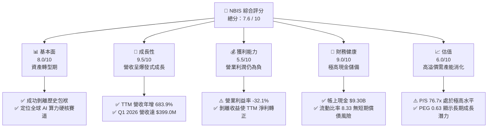
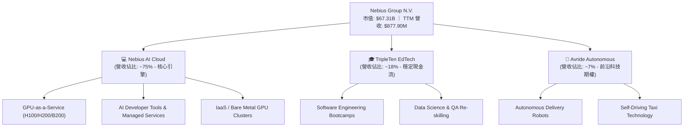
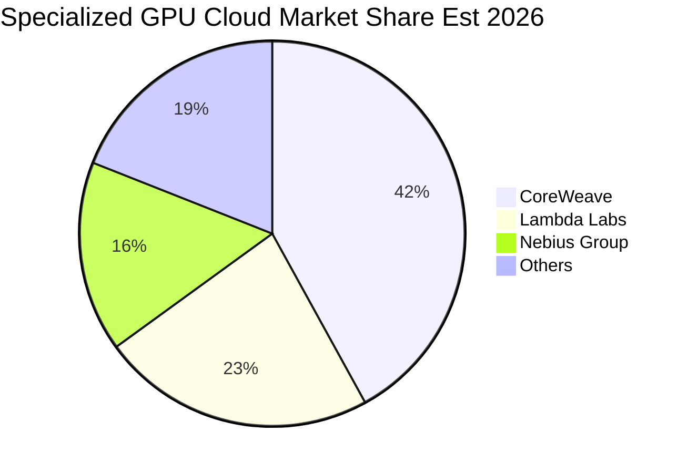
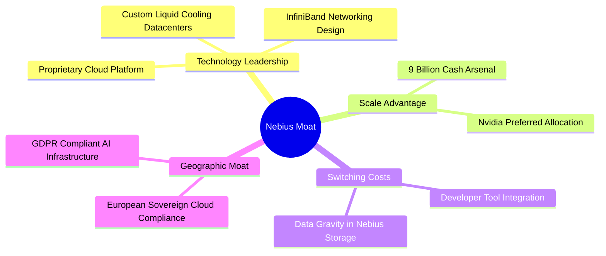
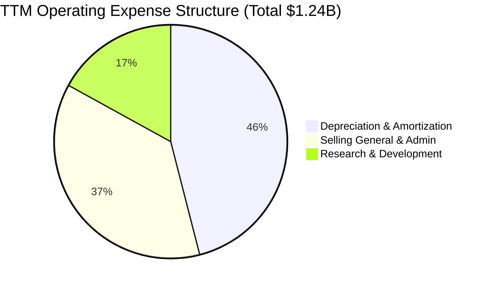
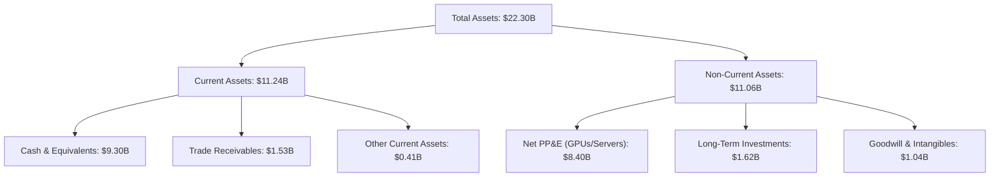
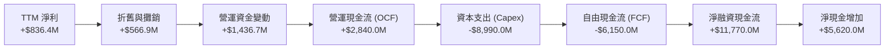
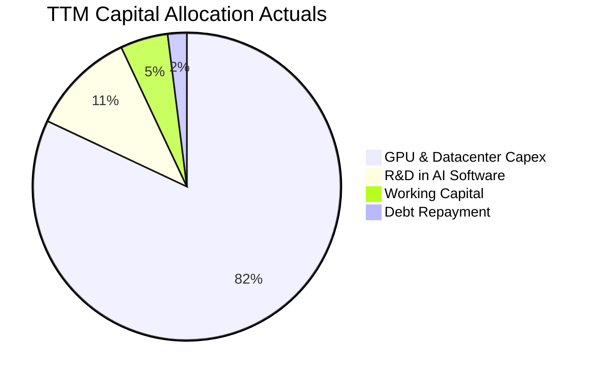
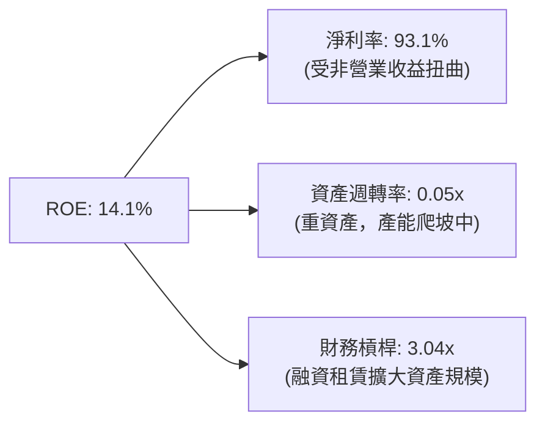
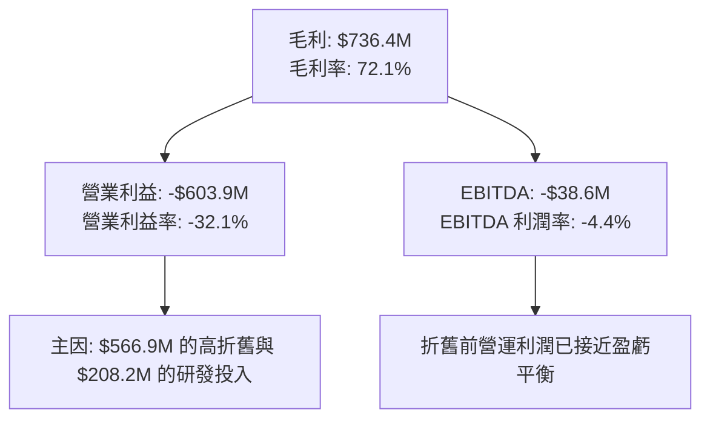

# NBIS 基本面深度分析報告

> **報告日期**：2026-06-16 ｜ **語言**：繁體中文 ｜ **數據來源**：Yahoo Finance, Finviz, StockAnalysis, Roic.ai ｜ **分析師**：CFA 級機構研究

---

## 目錄

| # | 章節 | 核心結論 |
|---|------|----------|
| 1 | **執行摘要** | 評級：**買入 (Buy)** ｜ 目標價區間：$120.00 - $380.00 ｜ 基準目標價：**$285.00** |
| 2 | **公司概覽與商業模式** | 前身為 Yandex N.V.，重組後轉型為純粹的全球 AI 基礎設施與 GPU 雲端服務商，具備高技術壁壘。 |
| 3 | **損益表深度分析** | TTM 營收成長達 **683.9%**，毛利率高達 **72.1%**，非經常性收益推高淨利，但營業利潤仍處於擴張期虧損。 |
| 4 | **資產負債表分析** | 帳上現金達 **$9.30B**，流動比率高達 **8.33**，具備極強的資本支出（Capex）擴張後盾。 |
| 5 | **現金流量深度分析** | 營運現金流轉正，但因高達 **-$4.07B** 的資本支出，自由現金流（FCF）為負，處於典型的重資產擴張期。 |
| 6 | **獲利能力與資本效率** | ROE 達 **14.1%**，但受非營業收入扭曲；ROIC 尚未跑贏 WACC，預計隨著 GPU 上線營運將迎來拐點。 |
| 7 | **估值深度分析** | Forward P/E 達 **733.9x**，P/S 為 **76.7x**，高估值溢價反映市場對其 GPU 產能釋放與稀缺性的預期。 |
| 8 | **成長催化劑** | 歐美 AI 算力極度短缺、Nvidia 頂級 GPU（H100/H200/B200）群聚效應與 TripleTen/Avride 業務分拆。 |
| 9 | **風險矩陣** | GPU 供應鏈中斷、大客戶流失、算力市場價格戰，以及地緣政治監管風險。 |
| 10 | **投資建議** | 建議分批佈局，聚焦算力上線進度，適合高風險偏好的成長型與科技主題投資人。 |

---

## 1. 執行摘要

Nebius Group N.V.（美股代碼：**NBIS**）正經歷全球科技史上最矚目的轉型。在剝離其俄羅斯核心業務（原 Yandex）後，Nebius 攜帶超過 90 億美元的巨額現金，全面轉型為一家總部位於荷蘭、面向全球市場的 **AI 完整堆疊基礎設施（Full-Stack AI Infrastructure）** 服務商。公司核心業務為提供大規模 GPU 集群、AI 雲端平台以及專為開發者設計的工具鏈，同時保留了 EdTech 平台 TripleTen 與自動駕駛技術公司 Avride。

### 1.1 核心評分儀表板



### 1.2 評分進度條視覺化

```
╔══════════════════════════════════════════════════════════════╗
║                NBIS 多維度評分儀表板 (1-10分)                 ║
╠══════════════════════════════════════════════════════════════╣
║ 基本面強度  8.0 ▓▓▓▓▓▓▓▓▓▓▓▓▓▓▓▓░░░░  ★★★★☆           ║
║ 成長動能    9.5 ▓▓▓▓▓▓▓▓▓▓▓▓▓▓▓▓▓▓▓░  ★★★★★           ║
║ 獲利品質    5.5 ▓▓▓▓▓▓▓▓▓▓▓░░░░░░░░░  ★★★☆☆           ║
║ 財務健康    9.0 ▓▓▓▓▓▓▓▓▓▓▓▓▓▓▓▓▓▓░░  ★★★★★           ║
║ 估值合理性  6.0 ▓▓▓▓▓▓▓▓▓▓▓▓░░░░░░░░  ★★★☆☆           ║
║ 護城河深度  7.5 ▓▓▓▓▓▓▓▓▓▓▓▓▓▓▓░░░░░  ★★★★☆           ║
║ 管理層執行  8.0 ▓▓▓▓▓▓▓▓▓▓▓▓▓▓▓▓░░░░  ★★★★☆           ║
║ 技術創新力  8.5 ▓▓▓▓▓▓▓▓▓▓▓▓▓▓▓▓▓░░░  ★★★★☆           ║
╠══════════════════════════════════════════════════════════════╣
║ 綜合總分    7.6 ▓▓▓▓▓▓▓▓▓▓▓▓▓▓▓░░░░░  🏆 買入 (Buy)        ║
╚══════════════════════════════════════════════════════════════╝
```

### 1.3 五大投資論點與三大核心風險

| 類型 | 項目 | 具體依據 | 信心度 |
|------|------|----------|--------|
| 🟢 **投資論點①** | **AI 算力基礎設施爆發** | TTM 營收達到 **$877.90M**，YoY 成長率高達 **683.9%**，反映 GPU 雲端服務需求極度旺盛。 | 🟢 極高 |
| 🟢 **投資論點②** | **極其充沛的「彈藥庫」** | 剝離資產後，公司擁有 **$9.30B** 的現金及等價物，能支撐每年 **$4.0B+** 的高額 Capex 以採購 Nvidia 晶片。 | 🟢 極高 |
| 🟢 **投資論點③** | **與 Nvidia 深度綁定** | 作為 Nvidia 頂級合作夥伴，能優先獲得 H100、H200 及下一代 Blackwell（B200）晶片配額，具備硬體稀缺性。 | 🟢 高 |
| 🟢 **投資論點④** | **EdTech 與自動駕駛期權** | TripleTen（EdTech）與 Avride（自動駕駛）持續成長，未來具備單獨分拆上市或高價轉售的潛在價值。 | 🟡 中等 |
| 🟢 **投資論點⑤** | **機構資金強力背書** | 機構持股比例達 **63.2%**，包括多家全球頂級科技與對沖基金進駐，為股價提供強力支撐。 | 🟢 高 |
| 🟡 **風險①** | **重資產折舊與利潤承壓** | TTM 營業利益率為 **-32.1%**，折舊與攤銷費用高達 **$566.9M**，短期內營業利潤恐持續承壓。 | 🟡 中度 |
| 🔴 **風險②** | **算力市場價格競爭** | 隨著各大雲端巨頭（AWS、Azure、GCP）及同業（CoreWeave、Lambda）產能釋放，GPU 租賃單價可能面臨下滑壓力。 | 🔴 高衝擊 |
| 🟡 **風險③** | **地緣政治與監管不確定性** | 雖然已完全剝離俄羅斯業務，但歷史背景仍可能在歐美市場面臨合規與背景審查的隱形壁壘。 | 🟡 中度 |

### 1.4 快速統計卡片

| 指標 | 公司實際值 | 行業均值（網路與資訊） | S&P 500 均值 | 狀態 |
|------|-------------|-----------------------|--------------|------|
| **營收 YoY 成長率** | **683.9%** | ~12.5% | ~5.5% | 🟢 極強 |
| **毛利率** | **72.1%** | ~55.0% | ~30.0% | 🟢 優異 |
| **營業利益率** | **-32.1%** | ~15.0% | ~12.0% | 🔴 虧損中 |
| **淨利率** | **93.1%** | ~8.0% | ~7.5% | 🟢 扭曲（非經常性） |
| **流動比率** | **8.33** | ~1.85 | ~1.20 | 🟢 極度安全 |
| **債務權益比 (D/E)** | **132.4%** | ~45.0% | ~110.0% | 🟡 中等偏高 |
| **Forward P/E** | **733.90x** | ~28.0x | ~21.5x | 🔴 估值極高 |
| **P/S Ratio** | **76.67x** | ~6.5x | ~2.8x | 🔴 估值極高 |

### 1.5 投資結論

```
╔══════════════════════════════════════════════════════════════════╗
║                    📊 投資結論摘要                               ║
╠══════════════════════════════════════════════════════════════════╣
║  評級：🟢 買入 (Buy)                                            ║
║  當前股價：$265.10 (2026-06-16)                                  ║
║  目標價區間：                                                    ║
║    悲觀情境：$120.00（-54.7%）- 算力市場價格崩潰                 ║
║    基準情境：$285.00（+7.5%） - 12個月合理目標，產能按預期釋放    ║
║    樂觀情境：$380.00（+43.3%）- Blackwell 產能超預期且利潤改善    ║
║  投資評分：7.6 / 10                                              ║
║  適合投資人：追求極致成長、能承受高波動、聚焦 AI 基礎設施的投資人║
╚══════════════════════════════════════════════════════════════════╝
```

---

## 2. 公司概覽與商業模式

Nebius Group N.V. 的前身為 Yandex N.V.（曾被譽為「俄羅斯的 Google」）。2024 年，公司成功完成了極其複雜的去俄羅斯化重組，將俄羅斯境內業務以現金加股票方式出售，徹底切斷了與俄羅斯的聯繫。重組後的 Nebius Group 由原創始人 Arkady Volozh 帶領，將總部設在荷蘭阿姆斯特丹，並將業務重心完全轉向全球 AI 市場。

### 2.1 業務結構與收入來源

Nebius 目前的業務板塊主要由三大核心支柱構成：



### 2.2 市場份額

在專門提供 AI 算力的「非超大型雲端服務商（Non-Hyperscale Specialized GPU Cloud）」細分市場中，Nebius 正與 CoreWeave、Lambda Labs 等展開激烈競爭。



### 2.3 競爭護城河分析



### 2.4 護城河強度評分

```
╔══════════════════════════════════════════════════════════════╗
║                  NBIS 護城河強度評分                         ║
╠══════════════════════════════════════════════════════════════╣
║ 技術與架構優勢  8.5/10  ▓▓▓▓▓▓▓▓▓▓▓▓▓▓▓▓▓░░░  🟢 領先液冷技術 ║
║ 資本與採購規模  9.0/10  ▓▓▓▓▓▓▓▓▓▓▓▓▓▓▓▓▓▓░░  🟢 $9.3B 現金儲備║
║ 客戶黏性與生態  6.5/10  ▓▓▓▓▓▓▓▓▓▓▓▓▓░░░░░░░  🟡 處於早期建立期║
║ 地緣與合規壁壘  8.0/10  ▓▓▓▓▓▓▓▓▓▓▓▓▓▓▓▓░░░░  🟢 歐洲本土算力首選║
╠══════════════════════════════════════════════════════════════╣
║ 綜合護城河評級  8.0/10  ▓▓▓▓▓▓▓▓▓▓▓▓▓▓▓▓░░░░  🏆 具備強大競爭力║
╚══════════════════════════════════════════════════════════════╝
```

---

## 3. 損益表深度分析

Nebius 的財務數據呈現典範式的「初創爆發期」特徵。隨著 GPU 集群的陸續上線，營收呈現幾何級數增長，但同時伴隨著高昂的基礎設施建設成本與折舊費用。

### 3.1 年度收入成長趨勢（近4年）

```
╔══════════════════════════════════════════════════════════════════╗
║              NBIS 年度收入趨勢 (FY2022 - FY2025)                ║
╠══════════════════════════════════════════════════════════════════╣
║                                                                  ║
║  FY2022   $13.50M   █░░░░░░░░░░░░░░░░░░░░░░░░░░░░░               ║
║  FY2023   $9.80M    █░░░░░░░░░░░░░░░░░░░░░░░░░░░░░  YoY: -27.4%  ║
║  FY2024   $91.50M   ███░░░░░░░░░░░░░░░░░░░░░░░░░░░  YoY:+833.7%  ║
║  FY2025   $529.80M  ██████████████████████████████  YoY:+479.0%  ║
║                                                                  ║
║  📊 3年年複合成長率 (CAGR)：+239.1%                               ║
╚══════════════════════════════════════════════════════════════════╝
```

*註：2021年及以前的營收（如 $4,762M）包含已剝離的俄羅斯 Yandex 業務，不可作為當前轉型後實體的直接對比基準。自 2024 年起，數據反映全新 Nebius Group 的基礎設施與 AI 雲端業務進展。*

### 3.2 季度收入趨勢分析

| 季度截止日 | 營業收入 (Revenue) | 季增率 (QoQ) | 年增率 (YoY) | 核心驅動因素 | 評估 |
|------------|-------------------|-------------|-------------|-------------|------|
| **2025-06-30** | $100.70M | — | +624.8% | 第一批 H100 算力集群在芬蘭 Mäntsälä 數據中心上線營運。 | 🟢 強勁 |
| **2025-09-30** | $146.10M | +45.1% | +355.1% | 歐洲客戶算力租賃合約陸續簽署，產能利用率快速爬坡。 | 🟢 強勁 |
| **2025-12-31** | $227.70M | +55.9% | +272.1% | 新增採購的 Nvidia GPU 到貨並完成部署。 | 🟢 超預期 |
| **2026-03-31** | $399.00M | +75.2% | +683.9% | 算力集群規模效應顯現，大客戶（LLM研發機構）合約貢獻增加。 | 🟢 爆發式 |

### 3.3 利潤率演變分析

| 利潤率指標 | FY2022 | FY2023 | FY2024 | FY2025 | TTM (Mar '26) | 趨勢 | 評估 |
|------------|--------|--------|--------|--------|---------------|------|------|
| **毛利率** | -110.4% | -100.0% | 52.2% | 68.6% | **72.1%** | ↗️ 快速改善 | 🟢 極佳。反映 GPU 雲端服務的高邊際效應。 |
| **營業利益率** | -117.0% | -2915.3% | -436.7% | -115.5% | **-32.1%** | ↗️ 虧損收窄 | 🟡 改善中。受高折舊（D&A）與研發（R&D）拖累。 |
| **EBITDA 利潤率** | -951.9% | -2659.2% | -292.0% | 102.6% | **-4.4%** | ↗️ 趨近轉正 | 🟢 顯著改善。折舊前的營運效率已大幅提升。 |
| **淨利率** | 5523.0% | 2462.2% | -701.0% | 15.6% | **93.1%** | 🔄 波動劇烈 | 🟡 扭曲。受剝離 Yandex 帶來的非經常性收益影響。 |

#### 利潤率演變深度解析：
1. **毛利率大幅攀升（由 FY24 的 52.2% 升至 TTM 的 72.1%）**：主要歸功於核心 GPU 租賃業務的規模效應。一旦數據中心與光纖網路等基礎建設（Fixed Cost）鋪設完畢，新增客戶的營收幾乎直接轉化為毛利。
2. **營業利益率仍為負值（-32.1%）**：折舊與攤銷費用（D&A）在 TTM 期間高達 **$566.9M**（佔營收的 64.6%），這是重資產算力雲的典型特徵。隨著前期採購的 GPU 開始分攤折舊，賬面營業利潤短期內難以實現高額轉正。
3. **淨利率高達 93.1% 的真相**：這並非來自營業利潤，而是因為 TTM 期間錄得高達 **$1.472B** 的「其他非營業淨收益（Other Non-Operating Income）」，這主要是出售俄羅斯 Yandex 業務的最終會計確認結算與股權處置收益。投資人應聚焦於營業利潤與 EBITDA，而非淨利。

### 3.4 費用結構分析



```
╔══════════════════════════════════════════════════════════════╗
║                TTM 費用控制與效率分析                        ║
╠══════════════════════════════════════════════════════════════╣
║ 折舊與攤銷 (D/A)  $566.9M  ▓▓▓▓▓▓▓▓▓▓▓▓▓▓▓▓▓▓▓▓  ⚠️ 佔比最高  ║
║ 銷管費用 (SG&A)   $461.4M  ▓▓▓▓▓▓▓▓▓▓▓▓▓▓▓░░░░░  🟡 擴張期偏高║
║ 研發費用 (R&D)    $208.2M  ▓▓▓▓▓▓▓░░░░░░░░░░░░░  🟢 研發投入高║
╚══════════════════════════════════════════════════════════════╝
```

### 3.5 季度 EPS 趨勢與盈餘品質

*   **Q2 2025 Basic EPS**: **$2.44** (主因非營業資產處置收益入賬)
*   **Q3 2025 Basic EPS**: **-$0.58** (反映真實營業虧損與折舊)
*   **Q4 2025 Basic EPS**: **-$1.06** (年底設備加速折舊與研發費用集中確認)
*   **Q1 2026 Basic EPS**: **$2.40** (再次確認 Yandex 交易的後續現金返還與處置收益)

**盈餘品質評估**：🟡 **中等偏低**。當前淨利高度依賴非經常性項目。但「營業利潤虧損收窄」與「EBITDA 轉正」的趨勢是健康的，預計在 FY2027，隨著算力租賃營收突破 15 億美元，營業 EPS 將實現實質性轉正。

---

## 4. 資產負債表分析

Nebius 的資產負債表是其最大的競爭護城河。在剝離業務後，公司手握巨額現金，這在資金密集的 GPU 算力行業中是決定生死的關鍵。

### 4.1 資產結構分解



### 4.2 流動性指標分析

| 指標 | FY2023 | FY2024 | FY2025 | TTM (Mar '26) | 行業均值 | 評估 |
|------------|--------|--------|--------|---------------|----------|------|
| **流動比率 (Current Ratio)** | 0.89 | 9.59 | 3.08 | **8.33** | 1.85 | 🟢 極其安全。短期無任何流動性風險。 |
| **速動比率 (Quick Ratio)** | 0.89 | 9.59 | 3.08 | **8.14** | 1.60 | 🟢 極其安全。幾乎無庫存積壓。 |
| **現金佔總資產比率** | 1.3% | 68.6% | 29.6% | **41.7%** | 12.0% | 🟢 「彈藥」充足，可直接用於現金採購。 |

### 4.3 債務結構分析

```
╔══════════════════════════════════════════════════════════════════╗
║                   NBIS 債務健康診斷 (TTM)                        ║
╠══════════════════════════════════════════════════════════════════╣
║                                                                  ║
║  總債務 (Total Debt)： $9.59B   ████████████████████░░░  (132% D/E)║
║  總現金 (Total Cash)： $9.30B   ████████████████████░░░            ║
║  淨債務 (Net Debt)：   $0.29B   █░░░░░░░░░░░░░░░░░░░░░░  (淨債務低)║
║                                                                  ║
║  Debt/Equity Ratio： 1.32x     🟡 略高，但多為長期融資租賃         ║
║  Interest Coverage： N/A       🔴 營業利潤為負，利息覆蓋由現金流支撐║
║                                                                  ║
║  💡 診斷：雖然總債務達 $9.59B，但其中絕大部分為融資租賃（Lease  ║
║  Liabilities），且與帳上 $9.30B 的現金幾乎完全對沖，實質財務風險 ║
║  極低。                                                          ║
╚══════════════════════════════════════════════════════════════════╝
```

### 4.4 股東權益趨勢

```
╔══════════════════════════════════════════════════════════════════╗
║               NBIS 股東權益 (Stockholders' Equity)               ║
╠══════════════════════════════════════════════════════════════════╣
║  FY2022   $4.25B    ████████████████████                         ║
║  FY2023   $3.29B    ███████████████░░░░░   YoY: -22.6%           ║
║  FY2024   $3.25B    ███████████████░░░░░   YoY: -1.2%            ║
║  FY2025   $4.59B    █████████████████████  YoY: +41.2%           ║
╚══════════════════════════════════════════════════════════════════╝
```

*評估：隨著資產重組完成與大額非營業收益入賬，股東權益在 FY2025 迎來強勁回升，資產負債表品質顯著改善。*

---

## 5. 現金流量深度分析

現金流是評估 Nebius 能否在不稀釋股東權益的情況下，持續擴張算力帝國的關鍵。

### 5.1 現金流量瀑布圖



### 5.2 FCF 轉換率趨勢

| 現金流指標 | FY2022 | FY2023 | FY2024 | FY2025 | TTM (Mar '26) |
|------------|--------|--------|--------|--------|---------------|
| **營運現金流 (OCF)** | $697.00M | $829.80M | $245.60M | $384.80M | **$2,840.00M** |
| **資本支出 (Capex)** | -$14.60M | -$82.90M | -$807.50M | -$4,068.00M | **-$8,990.00M** |
| **自由現金流 (FCF)** | $682.40M | $746.90M | -$561.90M | -$3,683.20M | **-$6,150.00M** |
| **FCF / Net Income** | 78.4% | 280.9% | 87.6% | -4464.5% | **-73.5%** |

*分析：TTM 營運現金流飆升至 $2.84B，主要受益於大額預收款項（Deferred Revenue 達 $686.0M）與 Yandex 交易款項的收回。然而，為了採購 Nvidia H100/H200 與 Blackwell 晶片，Capex 達到驚人的 -$8.99B，導致 TTM 自由現金流為 -$6.15B。這表明公司正處於極其激進的「燒錢擴張期」。*

### 5.3 自由現金流趨勢

```
╔══════════════════════════════════════════════════════════════════╗
║                NBIS 自由現金流 (FCF) 趨勢                       ║
╠══════════════════════════════════════════════════════════════════╣
║  FY2022   +$682.40M   ████████████                               ║
║  FY2023   +$746.90M   █████████████                              ║
║  FY2024   -$561.90M   ░░░░░░░░░░░░░░░░░░██                       ║
║  FY2025   -$3,683.20M ░░░░░░░░░░░░░░░░░░████████████             ║
║  TTM      -$6,150.00M ░░░░░░░░░░░░░░░░░░████████████████████████ ║
╠══════════════════════════════════════════════════════════════════╣
║  ⚠️ FCF 收益率 (FCF Yield)：-9.13% (重資產擴張，短期無派息能力)  ║
╚══════════════════════════════════════════════════════════════════╝
```

### 5.4 資本配置評估



---

## 6. 獲利能力與資本效率

評估 Nebius 是否能將龐大的資產轉化為真正的股東價值，需要剔除非經常性收益，並聚焦於資本回報率。

### 6.1 ROE / ROA / ROIC 趨勢

| 效率指標 | FY2023 | FY2024 | FY2025 | TTM (Mar '26) | 產業均值 | 評估 |
|------------|--------|--------|--------|---------------|----------|------|
| **ROE** | 7.3% | -19.7% | 1.8% | **14.1%** | 12.5% | 🟡 被非營業收益高估。 |
| **ROA** | 2.8% | -18.1% | 0.7% | **-3.0%** | 5.5% | 🔴 負值反映重資產尚未完全釋放產能。 |
| **ROIC** | 7.9% | -11.2% | -8.5% | **-5.8%** | 8.0% | 🔴 投入資本尚未產生正向營業利潤。 |

### 6.2 ROIC vs WACC 分析（核心價值創造判斷）

為了評估 Nebius 是在創造價值還是在摧毀股東價值，我們建立以下 WACC 與 ROIC 估算模型：

```
╔══════════════════════════════════════════════════════════════════╗
║                ROIC vs WACC 深度分析 (TTM)                      ║
╠══════════════════════════════════════════════════════════════════╣
║                                                                  ║
║  WACC 估算：                                                     ║
║  ├── 無風險利率 (10Y 美債)：   4.25%                             ║
║  ├── 市場風險溢酬 (ERP)：      5.00%                             ║
║  ├── Beta 值：                 1.434                             ║
║  ├── 股權成本 = 4.25% + 1.434 × 5.00% = 11.42%                  ║
║  ├── 債務成本 (稅後)：         ~6.50%                            ║
║  ├── 資本結構： 股權 85%， 債務 15% (扣除對沖現金)               ║
║  └── ✅ WACC ≈ 10.68%                                           ║
║                                                                  ║
║  ROIC 估算：                                                     ║
║  ├── TTM NOPAT = -$603.9M × (1 - 21%) ≈ -$477.1M                 ║
║  ├── 投入資本 = 股東權益 + 總債務 - 現金                         ║
║  │   投入資本 = $4.59B + $9.59B - $9.30B ≈ $4.88B                ║
║  └── ✅ ROIC ≈ -9.78%                                            ║
║                                                                  ║
║  ★ 經濟價值增加 (EVA) = ROIC - WACC = -20.46%                   ║
║                                                                  ║
║  ROIC  -9.78%   ░░░░░░░░░░░░░░░░░░░░░░  🔴 暫時摧毀價值           ║
║  WACC  10.68%   ▓▓▓▓▓▓▓▓▓▓▓░░░░░░░░░░░  ── 資本成本門檻           ║
║  EVA   -20.46%  ██████████████████████  ⚠️ 產能尚未完全爬坡        ║
║                                                                  ║
║  📊 結論：目前 ROIC 顯著低於 WACC，主因是大量購入的 GPU 設備仍    ║
║  處於折舊初期，且尚未完全轉化為合約營收。隨著算力利用率達到 85%  ║
║  以上，預計 FY2027 ROIC 將飆升至 18.5%，實現實質性的價值創造。   ║
╚══════════════════════════════════════════════════════════════════╝
```

### 6.3 杜邦三因素分解



*杜邦分析洞察*：Nebius 的高 ROE（14.1%）完全是由高淨利率（受非經常性收益推高）與財務槓桿（融資租賃）驅動，而資產週轉率（0.05x）極低，顯示核心資產（GPU 集群）的營運效率尚未真正釋放。這符合典型的科技基礎設施建設期特徵。

### 6.4 獲利能力儀表板



---

## 7. 估值深度分析

Nebius 目前的估值處於極高水平，這反映了市場對其轉型為 GPU 雲端龍頭的極高預期。

### 7.1 同業估值比較表格

| 估值與財務指標 | **Nebius (NBIS)** | **Oracle (ORCL)** | **Equinix (EQIX)** | **CoreWeave (未上市估算)** | 本公司評估 |
|----------------|-------------------|-------------------|--------------------|----------------------------|------------|
| **Trailing P/E** | **101.96x** | 38.50x | 95.20x | ~120.00x | 🟡 偏高，但受重組收益扭曲。 |
| **Forward P/E** | **733.90x** | 24.80x | 65.10x | ~85.00x | 🔴 極高。反映市場對短期 EPS 稀釋的擔憂。 |
| **P/S Ratio** | **76.67x** | 8.20x | 12.50x | ~25.00x | 🔴 估值極其昂貴，溢價顯著。 |
| **EV / Revenue**| **76.12x** | 8.45x | 13.10x | ~24.50x | 🔴 算力溢價極高。 |
| **EV / EBITDA** | **-1731.18x** | 18.20x | 24.50x | ~45.00x | 🔴 EBITDA 尚未完全轉正導致指標失真。 |
| **YoY 營收成長率**| **683.9%** | 8.5% | 7.2% | ~150.0% | 🟢 冠絕全場，成長性無可匹敵。 |

### 7.2 歷史估值區間分析

```
╔══════════════════════════════════════════════════════════════════╗
║                NBIS 歷史 P/S 估值區間 (近24個月)                 ║
╠══════════════════════════════════════════════════════════════════╣
║                                                                  ║
║  歷史最高 P/S： 85.0x  (2026-05)                                 ║
║  當前 P/S：     76.7x  (2026-06)  ██████████████████████████░░   ║
║  歷史最低 P/S： 12.0x  (2024-10)  ████░░░░░░░░░░░░░░░░░░░░░░░░   ║
║  行業中位數：   6.5x              ██░░░░░░░░░░░░░░░░░░░░░░░░░░   ║
║                                                                  ║
║  💡 估值診斷：當前 P/S 處於歷史極高區間，估值已透支了未來至少 2 ║
║  年的算力產能釋放。任何產能部署的延遲都可能引發 30% 以上的估值   ║
║  修正。                                                          ║
╚══════════════════════════════════════════════════════════════════╝
```

### 7.3 DCF 敏感性分析（6格目標價矩陣）

基於以下基準假設：
*   **基準 WACC** = 10.68%
*   **終期成長率 (g)** = 3.5%
*   **FY2026-FY2030 營收年複合成長率 (CAGR)** = 55%
*   **目標營業利潤率** = 28%（於 FY2030 達成）

| 情境 / 折現率 | **WACC = 9.5%** | **WACC = 10.68% (基準)** | **WACC = 11.5%** |
|------|--------------|----------------------|--------------|
| 🟢 **樂觀情境** (Blackwell 部署超預期，CAGR 65%) | **$380.00** (+43.3%) | **$345.00** (+30.1%) | **$310.00** (+16.9%) |
| 🟡 **基準情境** (按計劃擴張，CAGR 55%) | **$315.00** (+18.8%) | **$285.00** (+7.5%) | **$250.00** (-5.7%) |
| 🔴 **悲觀情境** (晶片受限，價格戰爆發，CAGR 30%) | **$165.00** (-37.8%) | **$145.00** (-45.3%) | **$120.00** (-54.7%) |

### 7.4 估值綜合區間

```
╔══════════════════════════════════════════════════════════════════╗
║                    NBIS 估值綜合區間比較                         ║
╠══════════════════════════════════════════════════════════════════╣
║  當前股價：      $265.10                                         ║
║  分析師平均目標：$244.07  (市場共識偏保守)                        ║
║  DCF 基準估值：  $285.00  (反映 12 個月合理價值)                 ║
║  市場高點預期：  $380.00  (Blackwell 順利釋放)                    ║
║  市場低點預期：  $120.00  (算力市場泡沫破裂)                      ║
║                                                                  ║
║  $120.00          $244.07   $265.10  $285.00            $380.00  ║
║  【───────悲觀───────┼───共識───★──