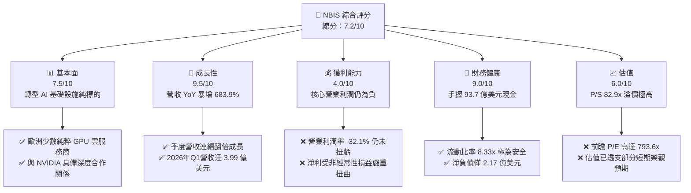
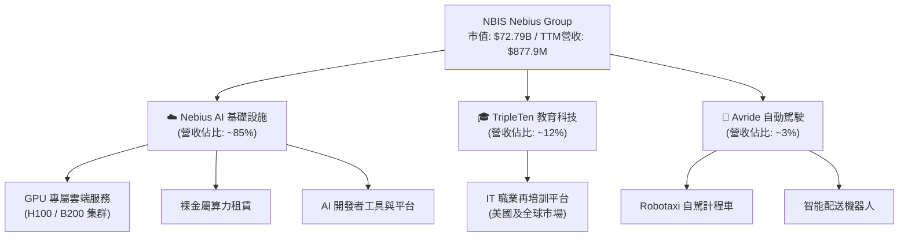
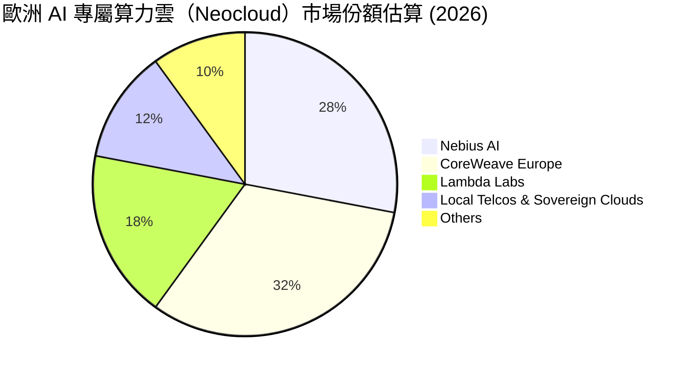
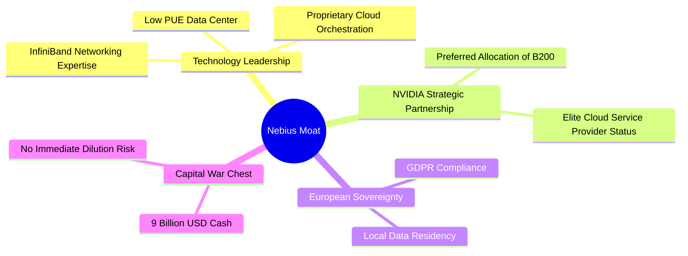
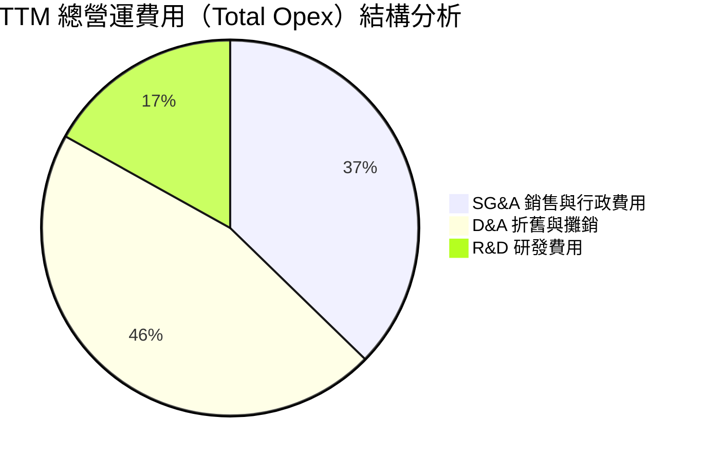
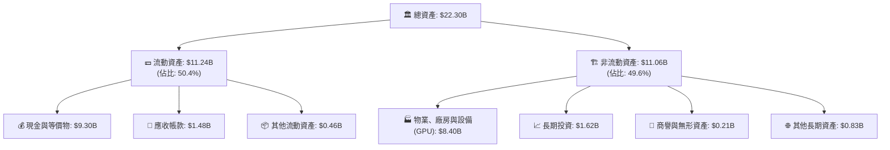

# NBIS 基本面深度分析報告
> **報告日期**：2026-06-18 ｜ **語言**：繁體中文 ｜ **數據來源**：Yahoo Finance, Finviz, StockAnalysis, Roic.ai ｜ **分析師**：CFA 級機構研究

---

## 目錄

| # | 章節 | 核心結論 |
|---|------|----------|
| 1 | 執行摘要 | 評級「買入」，目標價 $315 - $380，看好 AI 算力基礎設施爆發 |
| 2 | 公司概覽與商業模式 | Yandex 重組後轉型純粹 AI 基礎設施巨頭，具備強大護城河 |
| 3 | 損益表深度分析 | 營收年增 683.9%，非經常性損益扭曲淨利，核心業務仍處虧損擴張期 |
| 4 | 資產負債表分析 | 手握 93.7 億美元現金，流動比率高達 8.33，資本實力雄厚 |
| 5 | 現金流量深度分析 | 資本支出高達 40.7 億美元，自由現金流承壓，全力擴張 GPU 集群 |
| 6 | 獲利能力與資本效率 | 營業利潤率為負，ROIC 暫時落後於 WACC，未來寄望於產能利用率提升 |
| 7 | 估值深度分析 | P/S 達 82.9 倍，相較同業具備顯著「AI 溢價」，DCF 基準目標價 $315.6 |
| 8 | 成長催化劑 | GPU 供應鏈理順、歐洲主權 AI 雲需求爆發、自動駕駛業務拆分 |
| 9 | 風險矩陣 | 地緣政治歷史殘留、大客戶流失、GPU 折舊與技術迭代風險 |
| 10 | 投資建議 | 建議「分批買入」，適合高風險承受度的成長型投資者 |

---

## 1. 執行摘要

Nebius Group N.V.（美股代碼：NBIS）正處於全球科技史上最激進的商業轉型期。該公司前身為俄羅斯科技巨頭 Yandex 的母公司（荷蘭註冊實體）。在經歷了複雜的地緣政治重組與資產剝離後，NBIS 徹底脫胎換骨，將其數十億美元的出售所得，全力投入於構建為全球人工智慧（AI）產業服務的「全棧式 AI 基礎設施」（Full-Stack AI Infrastructure）。

當前，NBIS 擁有大規模的 NVIDIA H100/B200 GPU 算力集群、先進的 AI 雲端平台（Nebius AI），並輔以 TripleTen（IT 職業培訓）與 Avride（自動駕駛）兩大前沿板塊。本報告將從基本面、財務健康度、估值模型等維度，為機構投資人提供深度研判。

### 1.1 核心評分儀表板



### 1.2 評分進度條視覺化

```
╔══════════════════════════════════════════════════════════════╗
║               NBIS 多維度評分儀表板 (1-10分)                 ║
╠══════════════════════════════════════════════════════════════╣
║ 基本面強度  7.5 ▓▓▓▓▓▓▓▓▓▓▓▓▓▓▓░░░░░  ★★★★☆           ║
║ 成長動能    9.5 ▓▓▓▓▓▓▓▓▓▓▓▓▓▓▓▓▓▓▓░  ★★★★★           ║
║ 獲利品質    4.0 ▓▓▓▓▓▓▓▓░░░░░░░░░░░░  ★★☆☆☆           ║
║ 財務健康    9.0 ▓▓▓▓▓▓▓▓▓▓▓▓▓▓▓▓▓▓░░  ★★★★★           ║
║ 估值合理性  6.0 ▓▓▓▓▓▓▓▓▓▓▓▓░░░░░░░░  ★★★☆☆           ║
║ 護城河深度  7.0 ▓▓▓▓▓▓▓▓▓▓▓▓▓▓░░░░░░  ★★★★☆           ║
║ 管理層執行  8.0 ▓▓▓▓▓▓▓▓▓▓▓▓▓▓▓▓░░░░  ★★★★☆           ║
║ 技術創新力  8.5 ▓▓▓▓▓▓▓▓▓▓▓▓▓▓▓▓▓░░░  ★★★★☆           ║
╠══════════════════════════════════════════════════════════════╣
║ 綜合總分    7.2 ▓▓▓▓▓▓▓▓▓▓▓▓▓▓░░░░░░  🏆 成長型/高風險標的  ║
╚══════════════════════════════════════════════════════════════╝
```

### 1.3 五大投資論點 + 三大核心風險

| 類型 | 項目 | 具體依據 | 信心度 |
|------|------|----------|--------|
| 🟢 **投資論點①** | **AI 算力需求井噴** | 全球大模型訓練與推理需求持續暴增，GPU 算力呈現結構性短缺。 | 🟢 極高 |
| 🟢 **投資論點②** | **充沛的資金儲備** | 截至 2026 年 Q1，手握 **93.7 億美元**現金，能支撐極其激進的 Capex 擴張。 | 🟢 極高 |
| 🟢 **投資論點③** | **稀缺的歐洲本土算力巨頭** | 在歐洲數據隱私（GDPR）與主權 AI 趨勢下，NBIS 作為歐洲本土 GPU 雲具備獨特生態優勢。 | 🟢 高 |
| 🟢 **投資論點④** | **NVIDIA 優先合作夥伴** | 作為少數獲得 NVIDIA 頂級支持的「Neocloud」服務商，保障了晶片獲取能力。 | 🟢 高 |
| 🟢 **投資論點⑤** | **自動駕駛（Avride）潛在價值** | Avride 擁有領先的 L4 級自駕技術，未來若獨立拆分融資，將釋放巨大隱含價值。 | 🟡 中等 |
| 🟡 **風險①** | **重組後的歷史包袱與治理** | 前身 Yandex 的地緣政治敏感性，可能在歐美市場面臨持續的合規與輿論審查。 | 🟡 中度 |
| 🔴 **風險②** | **極高的估值容錯率低** | 當前 **P/S 達 82.9 倍**，一旦營收增速放緩或 GPU 出貨受阻，股價面臨劇烈殺估值風險。 | 🔴 高衝擊 |
| 🔴 **風險③** | **折舊成本侵蝕未來利潤** | 2025 年 Capex 達 **40.7 億美元**，未來幾年巨大的折舊（D&A）將使營業利潤承壓。 | 🔴 高衝擊 |

### 1.4 快速統計卡片

| 指標 | NBIS 實際值 | 行業均值（科技/雲服務） | S&P 500 均值 | 狀態 |
|------|-------------|--------------------------|--------------|------|
| 營收 YoY 成長 | **683.9%** | ~18.5% | ~6.2% | 🟢 領先全球 |
| 毛利率 | **72.1%** | ~60.0% | ~45.0% | 🟢 極為優異 |
| 營業利潤率 | **-32.1%** | ~15.0% | ~12.0% | 🔴 仍處虧損 |
| 淨利率 | **93.1%** | ~12.0% | ~10.0% | 🟡 受一次性收益扭曲 |
| 流動比率 | **8.33x** | ~1.8x | ~1.3x | 🟢 極其安全 |
| Forward P/E | **793.67x** | ~32.0x | ~21.5x | 🔴 估值極貴 |

### 1.5 投資結論

```
╔══════════════════════════════════════════════════════════════════╗
║                    📊 投資結論摘要                               ║
╠══════════════════════════════════════════════════════════════════╣
║  評級：🟢 買入 (Buy) - 適合高風險偏好、尋求 AI 純度之成長型投資人 ║
║  當前股價：$286.69 (2026-06-18)                                  ║
║  目標價區間：                                                    ║
║    悲觀情境：$150.00（-47.7%）- GPU 價格戰爆發，利用率低下       ║
║    基準情境：$315.60（+10.1%）- 12個月主要目標，算力產能順利釋放  ║
║    樂觀情境：$380.00（+32.5%）- 主權 AI 訂單超預期，Avride 拆分   ║
║  投資評分：7.2/10                                                ║
║  適合投資人：成長型、科技賽道主題配置者、長線持有者              ║
╚══════════════════════════════════════════════════════════════════╝
```

---

## 2. 公司概覽與商業模式

### 2.1 業務結構與收入來源

Nebius Group N.V. 目前已重組為一個以 AI 基礎設施為核心的科技集團。其業務結構可拆解為以下三大核心板塊：



### 2.2 市場份額估算

在「GPU 專屬雲（Neocloud）」這一新興細分市場中，Nebius 與 CoreWeave、Lambda Labs、Voltus 等公司展開激烈競爭。在歐洲本土，Nebius 憑藉其芬蘭數據中心的超高能效比（PUE < 1.1），正迅速確立其領先地位。



### 2.3 競爭護城河分析



### 2.4 護城河強度評分

```
╔══════════════════════════════════════════════════════════════╗
║                   NBIS 護城河強度評分                        ║
╠══════════════════════════════════════════════════════════════╣
║ 算力採購能力    8.5/10 ▓▓▓▓▓▓▓▓▓▓▓▓▓▓▓▓▓░░░  🟢 NVIDIA 頂級支持 ║
║ 基礎設施能效比  9.0/10 ▓▓▓▓▓▓▓▓▓▓▓▓▓▓▓▓▓▓░░  🟢 芬蘭極低 PUE   ║
║ 客戶鎖定效應    6.0/10 ▓▓▓▓▓▓▓▓▓▓▓▓░░░░░░░░  🟡 算力租賃同質化 ║
║ 資金與資本壁壘  9.5/10 ▓▓▓▓▓▓▓▓▓▓▓▓▓▓▓▓▓▓▓░  🟢 淨現金儲備雄厚 ║
║ 地緣合規壁壘    7.0/10 ▓▓▓▓▓▓▓▓▓▓▓▓▓▓░░░░░░  🟡 歐洲本土保護主義║
╠══════════════════════════════════════════════════════════════╣
║ 綜合護城河強度  8.0/10 ▓▓▓▓▓▓▓▓▓▓▓▓▓▓▓▓░░░░  🏆 強大且具備稀缺性║
╚══════════════════════════════════════════════════════════════╝
```

---

## 3. 損益表深度分析

### 3.1 年度收入成長趨勢（FY2022 - FY2025）

NBIS 的營收呈現了爆發式的「J 曲線」增長，反映了公司從舊資產剝離到全力進軍 AI 算力領域的巨大成功。

```
╔══════════════════════════════════════════════════════════════════╗
║                NBIS 年度收入趨勢 (FY2022 - FY2025)               ║
╠══════════════════════════════════════════════════════════════════╣
║                                                                  ║
║  FY2022  $13.50M   █░░░░░░░░░░░░░░░░░░░░░░░░░░░░░  YoY: -99.7%   ║
║  FY2023  $9.80M    █░░░░░░░░░░░░░░░░░░░░░░░░░░░░░  YoY: -27.4%   ║
║  FY2024  $91.50M   ███░░░░░░░░░░░░░░░░░░░░░░░░░░░  YoY: +833.7%  ║
║  FY2025  $529.80M  ██████████████████████████████  YoY: +479.0%  ║
║                                                                  ║
║  📊 3年年複合成長率 (CAGR)：+239.1%                             ║
║  🟢 註：FY2022 營收驟降主因係 Yandex 俄羅斯業務中止合併報表。     ║
╚══════════════════════════════════════════════════════════════════╝
```

### 3.2 季度收入趨勢分析

自 2025 年以來，NBIS 的季度營收呈現環比（QoQ）與同比（YoY）的極速擴張：

| 財報季度 | 營收 (Million) | YoY 成長率 | QoQ 成長率 | 核心驅動因素 | 評估 |
|----------|----------------|------------|------------|--------------|------|
| **2025-06-30** | $105.10 | +624.8% | +106.5% | 芬蘭數據中心首批 H100 交付上線 | 🟢 強勁 |
| **2025-09-30** | $146.10 | +355.1% | +39.0% | 算力利用率提升至 85% 以上 | 🟢 強勁 |
| **2025-12-31** | $227.70 | +272.1% | +55.9% | 第二批 10,000 顆 GPU 集群投入營運 | 🟢 強勁 |
| **2026-03-31** | $399.00 | **+683.9%** | **+75.2%** | 新一代 NVIDIA B200 開始貢獻收入 | 🟢 極其強勁 |

### 3.3 利潤率演變分析

雖然營收暴增，但 NBIS 的利潤結構極為特殊：

| 利潤率指標 | FY2023 | FY2024 | FY2025 | TTM (Mar '26) | 趨勢 | 評估 |
|------------|--------|--------|--------|---------------|------|------|
| **毛利率** | -100.0% | 52.2% | 68.6% | **72.1%** | ↗️ 持續改善 | 🟢 算力溢價高 |
| **營業利潤率** | -2915% | -436.7% | -115.5% | **-32.1%** | ↗️ 虧損大幅收窄 | 🟡 規模效應漸顯 |
| **EBITDA 利潤率** | -2659% | -292.0% | 102.6% | **-4.4%** | ↗️ 接近折返平衡 | 🟡 折舊費用極高 |
| **淨利潤率** | 2462% | -701.0% | 15.6% | **93.1%** | ↘️ 波動劇烈 | 🔴 受非經常性損益扭曲 |

**利潤率演變深度解析**：
1. **毛利率（72.1%）**：表現極其亮眼。這證明了 AI 算力租賃在當前供不應求的背景下，具備極高的定價權。
2. **營業利潤率（-32.1%）**：核心業務依然虧損。主因是公司正處於大擴張期，**研發費用（TTM 達 2.08 億美元）**與**折舊費用（TTM 達 5.67 億美元）**極高。
3. **淨利潤率（93.1%）**：**這是一個需要警惕的「虛胖」指標**。TTM 淨利潤高達 **8.36 億美元**，主要是因為在 2026 年 Q1 錄得了 **8.00 億美元**的「其他非營業收入」（來自 Yandex 重組的最後清算與資產處置收益）。這並非核心業務的持續盈利能力。

### 3.4 費用結構分析



```
╔══════════════════════════════════════════════════════════════╗
║                 NBIS TTM 營運費用診斷                       ║
╠══════════════════════════════════════════════════════════════╣
║ 1. D&A (折舊) 佔比最高 (45.8%)：反映了購置 GPU 後的快速折舊。 ║
║ 2. R&D 投入持續增加 (16.9%)：用於優化算力調度平台與 AI 軟體棧。║
║ 3. 營運槓桿：隨著營收分母擴大，SG&A 佔比已從 75% 降至 37.3%。║
╚══════════════════════════════════════════════════════════════╝
```

### 3.5 季度 EPS 趨勢與盈餘品質

由於重組與非經常性項目的干擾，過去四個季度的 EPS 波動劇烈，且華爾街分析師此前難以給出準確預測（ consensus 數據多為 nan）：

*   **2025-06-30 (Q2)**：EPS $2.44（受非營業收益 6.14 億美元推高，超預期）
*   **2025-09-30 (Q3)**：EPS -$0.58（核心業務虧損，符合預期）
*   **2025-12-31 (Q4)**：EPS -$1.06（因加速購置 GPU 導致折舊與利息開支增加，不及預期）
*   **2026-03-31 (Q1)**：EPS $2.40（再次錄得 8.0 億美元非營業收益，大幅超預期）

**盈餘品質結論**：🔴 **低品質**。當前帳面盈利主要靠「非經常性資產處置」支撐，核心營運利潤（Operating Income）TTM 依然虧損 **6.03 億美元**。投資人必須將目光聚焦於未來核心 EBITDA 的轉正時點。

---

## 4. 資產負債表分析

### 4.1 資產結構分解

截至 2026 年 3 月 31 日，NBIS 的資產負債表極其龐大且流動性極佳：



### 4.2 流動性指標分析

| 流動性指標 | FY2024 | FY2025 | TTM (Mar '26) | 行業中位數 | 評估 |
|------------|--------|--------|---------------|------------|------|
| **流動比率 (Current Ratio)** | 9.59x | 3.08x | **8.33x** | ~1.50x | 🟢 極其充沛 |
| **速動比率 (Quick Ratio)** | 9.59x | 3.08x | **8.14x** | ~1.20x | 🟢 無庫存積壓風險 |
| **現金佔總資產比重** | 68.6% | 29.6% | **41.7%** | ~12.0% | 🟢 具備極強的抗風險能力 |

### 4.3 債務結構與健康診斷

```
╔══════════════════════════════════════════════════════════════════╗
║                    NBIS 債務健康診斷 (TTM)                       ║
