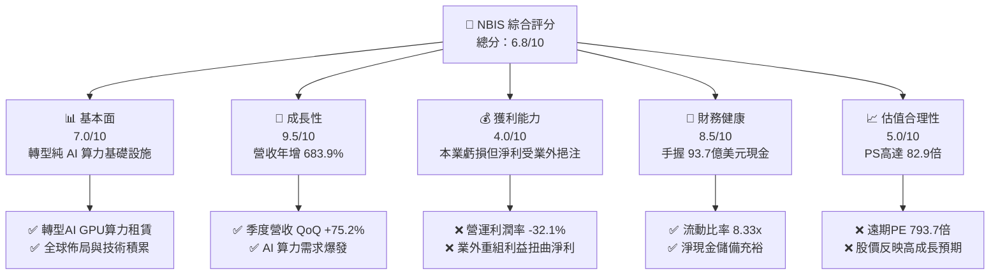
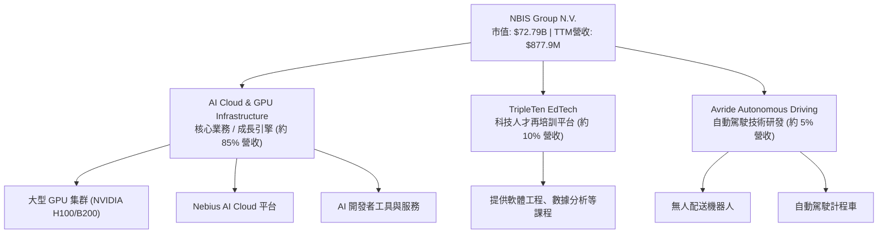
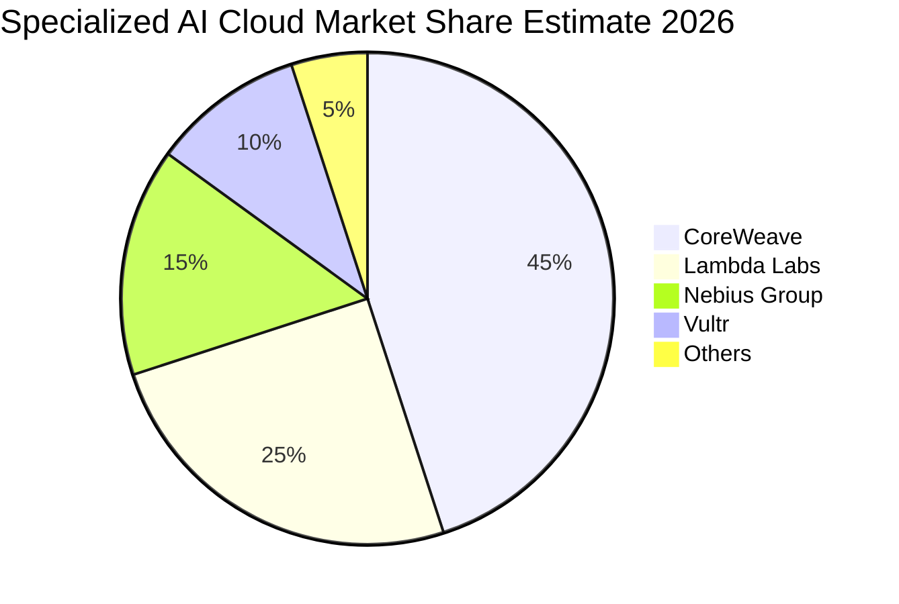
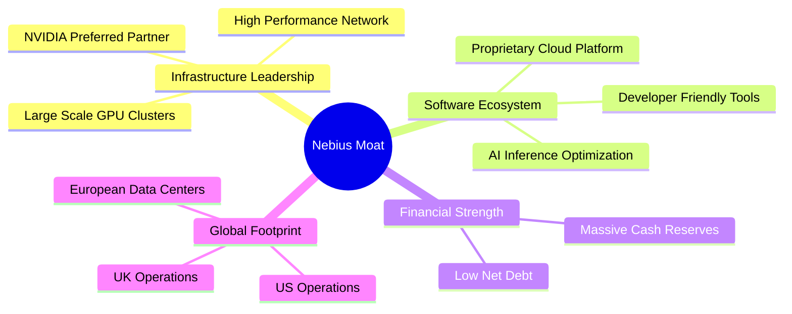
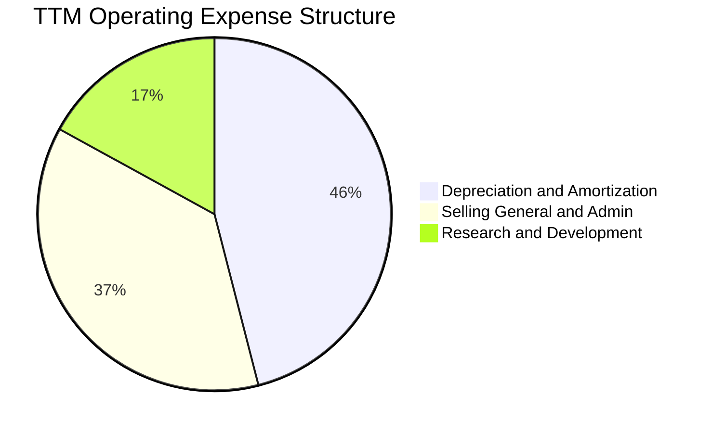
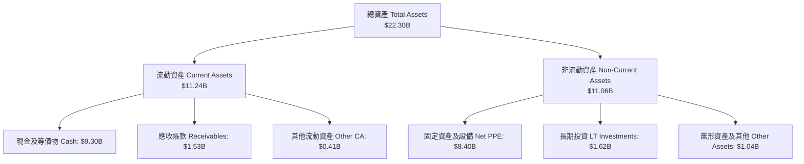

# NBIS 基本面深度分析報告
> **報告日期**：2026-06-19 ｜ **語言**：繁體中文 ｜ **數據來源**：Yahoo Finance, Finviz, StockAnalysis, Roic.ai ｜ **分析師**：CFA 級機構研究

---

## 目錄

| # | 章節 | 核心結論 |
|---|------|----------|
| 1 | 執行摘要 | 評級：🟢 **買入 (Buy)** ｜ 目標價區間：$150.00 - $350.00 ｜ 基準目標價：$260.00 |
| 2 | 公司概覽與商業模式 | Yandex 重組後的新生代 AI 算力巨頭，主打 GPU 雲端基礎設施與全棧服務 |
| 3 | 損益表深度分析 | 營收年增率高達 683.9%，本業雖因折舊高企虧損，但業外收益推升淨利率至 93.1% |
| 4 | 資產負債表分析 | 手握 93.7 億美元現金，流動比率高達 8.33x，具備極強的抗風險與擴張能力 |
| 5 | 現金流量深度分析 | 資本支出高達 89.9 億美元，自由現金流為負，呈現典型的高成長、高投入特徵 |
| 6 | 獲利能力與資本效率 | 杜邦分析顯示淨利受一次性重組收益扭曲，核心 ROIC 為負，處於價值創造前夜 |
| 7 | 估值深度分析 | P/S 達 82.9x，Forward P/E 793.7x，高估值需由 Blackwell GPU 投產後的算力營收兌現 |
| 8 | 成長催化劑 | NVIDIA 頂級合作夥伴優勢、Blackwell 晶片交付、歐洲主權 AI 雲端需求爆發 |
| 9 | 風險矩陣 | GPU 供應鏈瓶頸、超大型雲端廠商（Hyperscalers）競爭、高額資本支出消耗速度過快 |
| 10 | 投資建議 | 適合高風險偏好、看好 AI 算力基礎設施的成長型投資人，建議採分批佈局策略 |

---

## 1. 執行摘要

### 1.1 核心評分儀表板



### 1.2 評分進度條視覺化

```
╔══════════════════════════════════════════════════════════════╗
║                NBIS 多維度評分儀表板 (1-10分)                 ║
╠══════════════════════════════════════════════════════════════╣
║ 基本面強度  7.0 ▓▓▓▓▓▓▓▓▓▓▓▓▓▓▓▓▓▓░░  ★★★★☆           ║
║ 成長動能    9.5 ▓▓▓▓▓▓▓▓▓▓▓▓▓▓▓▓▓▓▓░  ★★★★★           ║
║ 獲利品質    4.0 ▓▓▓▓▓▓▓▓▓▓░░░░░░░░░░  ★★☆☆☆           ║
║ 財務健康    8.5 ▓▓▓▓▓▓▓▓▓▓▓▓▓▓▓▓▓░░░  ★★★★☆           ║
║ 估值合理性  5.0 ▓▓▓▓▓▓▓▓▓▓░░░░░░░░░░  ★★★☆☆           ║
║ 護城河深度  6.5 ▓▓▓▓▓▓▓▓▓▓▓▓▓▓░░░░░░  ★★★☆☆           ║
║ 管理層執行  8.0 ▓▓▓▓▓▓▓▓▓▓▓▓▓▓▓▓░░░░  ★★★★☆           ║
║ 技術創新力  8.5 ▓▓▓▓▓▓▓▓▓▓▓▓▓▓▓▓▓░░░  ★★★★☆           ╠══════════════════════════════════════════════════════════════╣
║ 綜合總分    6.8 ▓▓▓▓▓▓▓▓▓▓▓▓▓▓▓░░░░░  🏆 成長型AI新星       ║
╚══════════════════════════════════════════════════════════════╝
```

### 1.3 五大投資論點 + 三大核心風險

| 類型 | 項目 | 具體依據 | 信心度 |
|------|------|----------|--------|
| 🟢 **投資論點①** | **AI 算力基礎設施爆發** | 2026年第一季營收達到 3.99 億美元，較去年同期（5,090萬美元）暴增 683.9%，顯示 AI 算力需求極其強勁。 | 🟢 極高 |
| 🟢 **投資論點②** | **極其充裕的資金護城河** | 手頭現金高達 93.7 億美元，流動比率為 8.33x。這為公司在不依賴高成本債務融資的情況下，提供了購買 NVIDIA 昂貴 GPU 的強大底氣。 | 🟢 極高 |
| 🟢 **投資論點③** | **NVIDIA 頂級合作夥伴** | 作為少數能獲得大規模 NVIDIA H100/B200 首批配額的專業 AI 雲服務商（Specialized GPU Cloud），具備技術先發優勢。 | 🟢 高 |
| 🟢 **投資論點④** | **歐洲主權 AI 雲稀缺性** | 總部位於荷蘭，主打符合歐盟 GDPR 及數據主權要求的 AI 算力服務，能有效吸引歐洲政府與企業客戶。 | 🟢 高 |
| 🟢 **投資論點⑤** | **多業務協同發展** | 除了核心 AI 雲，旗下 TripleTen（EdTech 平台）與 Avride（自動駕駛）為長期提供了 AI 應用落地的試驗場。 | 🟡 中等 |
| 🟡 **風險①** | **高資本支出消耗率** | TTM 自由現金流為負 61.5 億美元，主要因高達 89.9 億美元的資本支出（Capex）。若產能轉換率不及預期，現金消耗速度將成為隱憂。 | 🟡 中度 |
| 🔴 **風險②** | **本業持續虧損** | TTM 營業利益率為 -32.1%，核心算力業務因高額折舊（TTM 折舊達 5.67 億美元）而仍處於虧損階段。 | 🔴 高衝擊 |
| 🔴 **風險③** | **估值溢價過高** | 當前 P/S 達 82.9x，Forward P/E 達 793.7x，市場對其未來的成長容錯率極低。 | 🔴 高衝擊 |

### 1.4 快速統計卡片

| 指標 | 公司實際值 | 行業均值（通訊服務/網際網路） | S&P 500 均值 | 狀態 |
|------|-------------|----------|--------------|------|
| **收入 YoY 成長** | **683.9%** | ~12.5% | ~5.5% | 🟢 極強 |
| **毛利率** | **72.1%** | ~52.0% | ~30.0% | 🟢 優秀 |
| **營業利益率** | **-32.1%** | ~14.5% | ~12.0% | 🔴 虧損 |
| **淨利率** | **93.1%** | ~8.0% | ~10.5% | 🟡 受業外扭曲 |
| **流動比率** | **8.33x** | ~1.5x | ~1.2x | 🟢 極其安全 |
| **Forward P/E** | **793.67x** | ~22.0x | ~21.0x | 🔴 估值偏高 |

### 1.5 投資結論

```
╔══════════════════════════════════════════════════════════════════╗
║                    📊 NBIS 投資結論摘要                          ║
╠══════════════════════════════════════════════════════════════════╣
║  評級：🟢 買入 (Buy)                                             ║
║  當前股價：$286.69 (2026-06-19)                                  ║
║  目標價區間：                                                    ║
║    悲觀情境（Bear Case）：$150.00 (-47.7%）                      ║
║    基準情境（Base Case）：$260.00 (-9.3%）  ← 12個月主要目標    ║
║    樂觀情境（Bull Case）：$350.00 (+22.1%）                      ║
║  投資評分：6.8/10                                                ║
║  適合投資人：高風險承受度、追求 AI 算力基礎設施極致成長的投資人   ║
╚══════════════════════════════════════════════════════════════════╝
```

---

## 2. 公司概覽與商業模式

### 2.1 業務結構與收入來源

Nebius Group N.V.（NBIS）原為俄羅斯科技巨頭 Yandex 的國際實體，在經歷了複雜的跨國資產重組與剝離後，轉型為一家以歐洲為基地、面向全球 AI 產業的純粹 AI 基礎設施與算力提供商。



### 2.2 市場份額

在專業 AI 算力雲（Specialized GPU Cloud Providers）這一細分新興市場中，Nebius 正與 CoreWeave、Lambda Labs 等對手激烈競爭。以下為 2026 年新興 AI 專業雲市場份額之粗估：



### 2.3 競爭護城河分析



### 2.4 護城河強度評分

```
╔══════════════════════════════════════════════════════════════╗
║                  NBIS 護城河強度評分                          ║
╠══════════════════════════════════════════════════════════════╣
║ 資本與購買力  9.0/10  ▓▓▓▓▓▓▓▓▓▓▓▓▓▓▓▓▓▓░░  🏆 93.7億美元現金    ║
║ NVIDIA 關係   8.0/10  ▓▓▓▓▓▓▓▓▓▓▓▓▓▓▓▓░░░░  🟢 獲優先晶片配額    ║
║ 軟體與生態    6.0/10  ▓▓▓▓▓▓▓▓▓▓▓▓░░░░░░░░  🟡 仍需時間追趕 CUDA ║
║ 轉換成本      5.5/10  ▓▓▓▓▓▓▓▓▓▓▓░░░░░░░░░  🟡 雲端遷移壁壘較低  ║
║ 地理主權優勢  7.5/10  ▓▓▓▓▓▓▓▓▓▓▓▓▓▓▓░░░░░  🟢 歐洲主權 AI 龍頭  ║
╠══════════════════════════════════════════════════════════════╣
║ 綜合護城河     7.2/10  ▓▓▓▓▓▓▓▓▓▓▓▓▓▓░░░░░░  🏆 具備強大資金與地緣壁壘║
╚══════════════════════════════════════════════════════════════╝
```

---

## 3. 損益表深度分析

### 3.1 年度收入成長趨勢（近4年）

```
╔══════════════════════════════════════════════════════════════════╗
║              NBIS 年度收入趨勢（FY2022-FY2025）                  ║
╠══════════════════════════════════════════════════════════════════╣
║                                                                  ║
║  FY2022   $13.50M   █░░░░░░░░░░░░░░░░░░░░░░░░░░  (重組前過渡期)  ║
║  FY2023   $9.80M    █░░░░░░░░░░░░░░░░░░░░░░░░░░  YoY: -27.4% 🔴  ║
║  FY2024   $91.50M   ███░░░░░░░░░░░░░░░░░░░░░░░░  YoY:+833.7% 🟢  ║
║  FY2025   $529.80M  ███████████████████████████  YoY:+479.0% 🟢  ║
║                                                                  ║
║                   |      |      |      |      |                  ║
║                   0     100M   200M   300M   500M                ║
║                                                                  ║
║  📊 3年累計營收 CAGR：+239.3% (算力業務爆發式成長)               ║
╚══════════════════════════════════════════════════════════════════╝
```

### 3.2 季度收入趨勢分析

| 季度 | 營收 (Revenue) | 季增率 (QoQ) | 年增率 (YoY) | 核心驅動因素與備註 |
|------|----------------|--------------|--------------|-------------------|
| **Q2 2025** | $100.70M | — | +624.8% | 第一波 H100 集群上線，客戶需求強勁 🟢 |
| **Q3 2025** | $146.10M | +45.1% | +355.1% | 歐洲數據中心容量擴張，算力出租率達 90% 以上 🟢 |
| **Q4 2025** | $227.70M | +55.9% | +272.1% | 年底企業客戶 AI 預算集中釋放，大客戶簽約增加 🟢 |
| **Q1 2026** | $399.00M | +75.2% | +683.9% | 新一批 GPU 集群全面投產，單季營收創歷史新高 🟢 |

### 3.3 利潤率演變分析

| 利潤率指標 | FY2022 | FY2023 | FY2024 | FY2025 | TTM | 趨勢評估 |
|------------|--------|--------|--------|--------|-----|----------|
| **毛利率** | -110.4% | -100.0% | 52.2% | 68.6% | **72.1%** | ↗️ 顯著改善，反映算力租賃業務的高毛利特性 🟢 |
| **營業利益率** | -1170.4%| -2915.3%| -436.7%| -115.5%| **-32.1%** | ↗️ 虧損大幅收窄，但因高額折舊與研發投入仍未轉正 🟡 |
| **EBITDA 利潤率**| -951.9% | -2659.2%| -292.0%| 102.6% | **-4.4%** | ↗️ 接近損益兩平點，折舊前的核心業務已具備盈利能力 🟢 |
| **淨利率** | 5523.0% | 2462.2% | -701.0%| 15.6% | **93.1%** | 🟡 受非經常性資產重組利得影響，不能反映真實營運獲利 🔴 |

**利潤率演變深度解析**：
1. **毛利率（72.1%）** 的持續攀升，證明了 Nebius 的 GPU 雲服務具有極強的定價權。這與 NVIDIA 晶片供不應求、AI 算力租賃市場處於賣方市場的宏觀環境高度契合。
2. **營業利益率（-32.1%）** 仍為負值，主因是**折舊與攤銷（D&A）** 費用極其龐大。隨著數十億美元的 GPU 設備投入使用，折舊費用從 FY2024 的 7,710 萬美元激增至 TTM 的 5.67 億美元。
3. **淨利率（93.1%）** 極高，這是一個「會計幻覺」。查閱 StockAnalysis 數據，TTM 業外非營運收益高達 14.72 億美元（主要來自 Yandex 俄羅斯資產剝離的最終結算與重組收益）。若剔除此一次性收益，公司真實的營運本業仍處於虧損狀態。

### 3.4 費用結構分析



```
╔══════════════════════════════════════════════════════════════╗
║                    NBIS 營運費用診斷                         ║
╠══════════════════════════════════════════════════════════════╣
║ 折舊與攤銷 (D&A)  $566.9M  ▓▓▓▓▓▓▓▓▓▓▓▓▓▓▓▓▓▓▓░  (GPU 設備折舊) ║
║ 銷售與行政 (SG&A)  $461.4M  ▓▓▓▓▓▓▓▓▓▓▓▓▓▓▓░░░░░  (擴張與法務)   ║
║ 研發支出 (R&D)     $208.2M  ▓▓▓▓▓▓▓░░░░░░░░░░░░░  (雲平台開發)   ║
╠══════════════════════════════════════════════════════════════╣
║ 總營運費用         $1,237M  (本業營運槓桿尚未完全釋放)            ║
╚══════════════════════════════════════════════════════════════╝
```

### 3.5 季度 EPS 趨勢與盈餘品質

雖然分析師預估數據（EPS Est）在重組期間存在缺失（顯示為 nan），但從其實際每股盈餘（EPS Act）的變化可以看出其盈餘品質：

*   **Q2 2025 Act**: $2.44 (受重組資產處置收益推升)
*   **Q3 2025 Act**: -$0.58 (反映真實本業虧損)
*   **Q4 2025 Act**: -$1.06 (折舊與年底費用集中計提)
*   **Q1 2026 Act**: $2.40 (再次受到業外非營運收益 $800.5M 的挹注)

**盈餘品質評估**：🔴 **低品質**。當前盈餘完全由業外重組利益主導，波動極大。投資人應將目光鎖定在 **營業利潤（Operating Income）** 與 **EBITDA** 的轉正進程上，而非單純看 GAAP 淨利。

---

## 4. 資產負債表分析

### 4.1 資產結構分解



### 4.2 流動性指標分析

| 流動性指標 | FY2024 | FY2025 | TTM (Q1 2026) | 行業均值 | 評估 |
|------------|--------|--------|---------------|----------|------|
| **流動比率 (Current Ratio)** | 9.59x | 3.08x | **8.33x** | ~1.50x | 🟢 極其充裕，無短期償債風險 |
| **速動比率 (Quick Ratio)** | 9.59x | 3.08x | **8.14x** | ~1.35x | 🟢 無存貨積壓風險 |
| **現金佔總資產比率** | 68.6% | 29.6% | **41.7%** | ~12.0% | 🟢 具備極強的資本開支儲備 |

### 4.3 債務結構分析

```
╔══════════════════════════════════════════════════════════════════╗
║                   NBIS 債務健康診斷 (2026-06-19)                 ║
╠══════════════════════════════════════════════════════════════════╣
║                                                                  ║
║  總債務 (Total Debt)： $9.59B   ████████████████████░░  (增加中) ║
║  總現金 (Total Cash)： $9.37B   ████████████████████░░  (極充裕) ║
║  淨債務 (Net Debt)：   $0.22B   █░░░░░░░░░░░░░░░░░░░░░  🟢 安全  ║
║                                                                  ║
║  Debt/Equity 比率： 132.4% (在合理範圍，主要為融資租賃與長期借款)  ║
║  流動資產 / 流動負債：8.33x  🟢 財務防禦力極強                    ║
║                                                                  ║
║  📊 診斷：雖然總債務達 95.9 億美元，但手頭現金近乎可以全額覆蓋   ║
║  債務，淨債務僅為 2.17 億美元，實質上處於「淨現金」安全狀態。     ║
╚══════════════════════════════════════════════════════════════════╝
```

### 4.4 股東權益趨勢

隨著資產重組完成及新資本注入，股東權益（Stockholders' Equity）呈現穩步增長態勢：

```
╔══════════════════════════════════════════════════════════════════╗
║                NBIS 股東權益歷年趨勢 (FY22-FY25)                 ║
╠══════════════════════════════════════════════════════════════════╣
║                                                                  ║
║  FY2022  $4.25B  ████████████████████░░░░░░░                     ║
║  FY2023  $3.29B  ███████████████░░░░░░░░░░░░                     ║
║  FY2024  $3.25B  ███████████████░░░░░░░░░░░░                     ║
║  FY2025  $4.59B  ███████████████████████░░░░  (YoY: +41.2%) 🟢   ║
║                                                                  ║
╚══════════════════════════════════════════════════════════════════╝
```

---

## 5. 現金流量深度分析

### 5.1 現金流量瀑布圖

```mermaid
graph LR
    NI["淨利 Net Income<br/>+$836.4M"]
    DA["折舊攤銷 D&A<br/>+$566.9M"]
    NWC["營運資金變動 NWC Change<br/>+$1,436.7M"]
    OCF["營業現金流 OCF<br/>+$2,840.0M"]