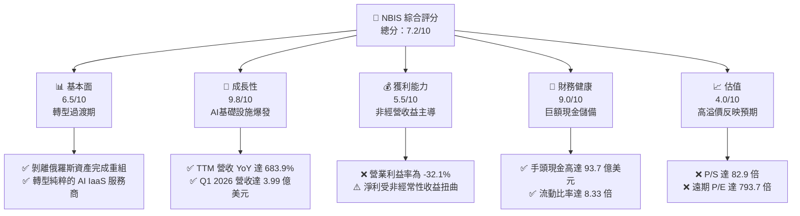
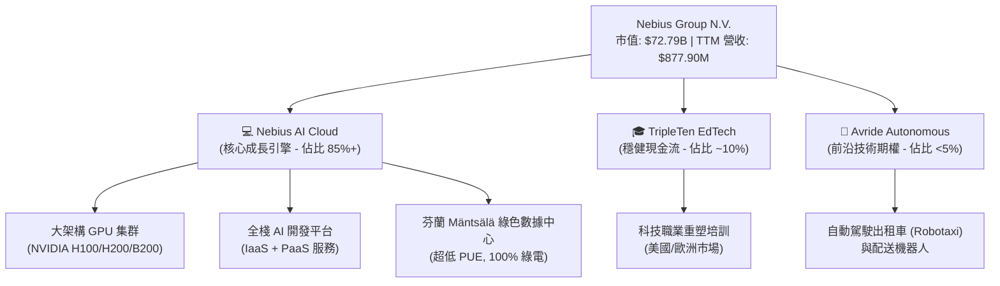
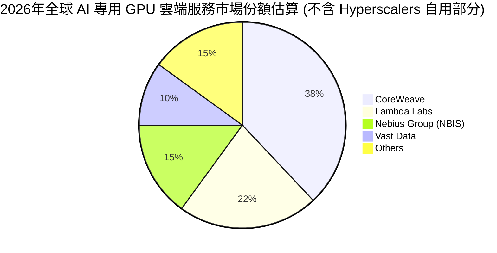
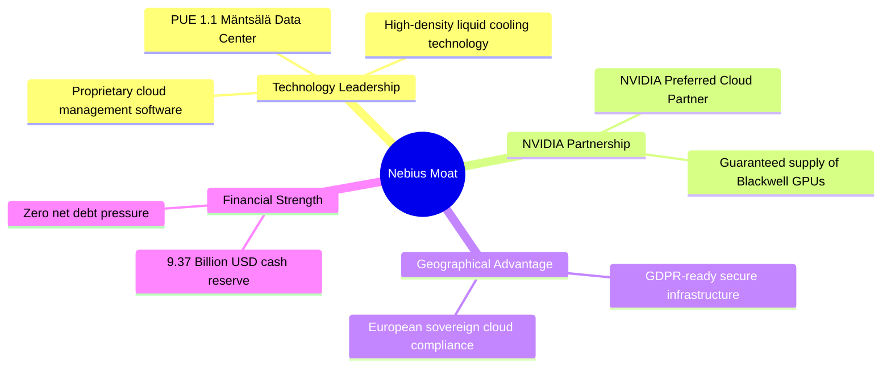
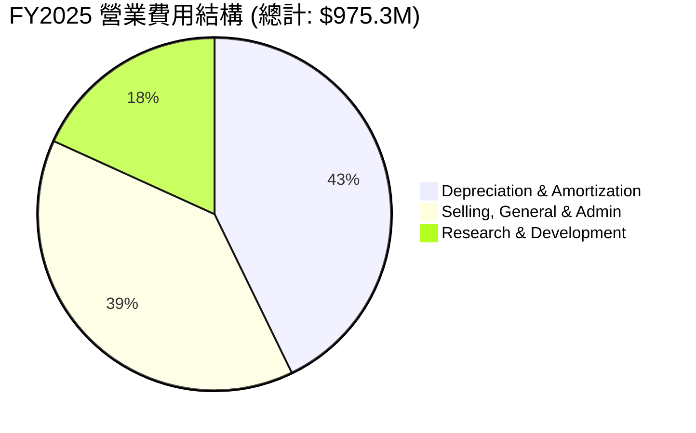
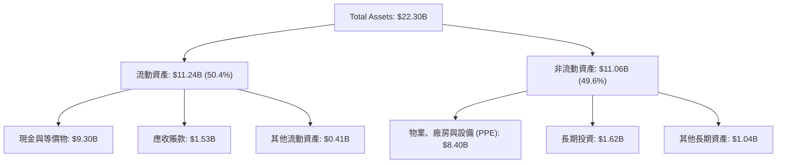
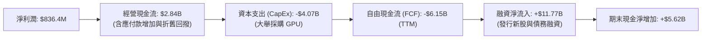
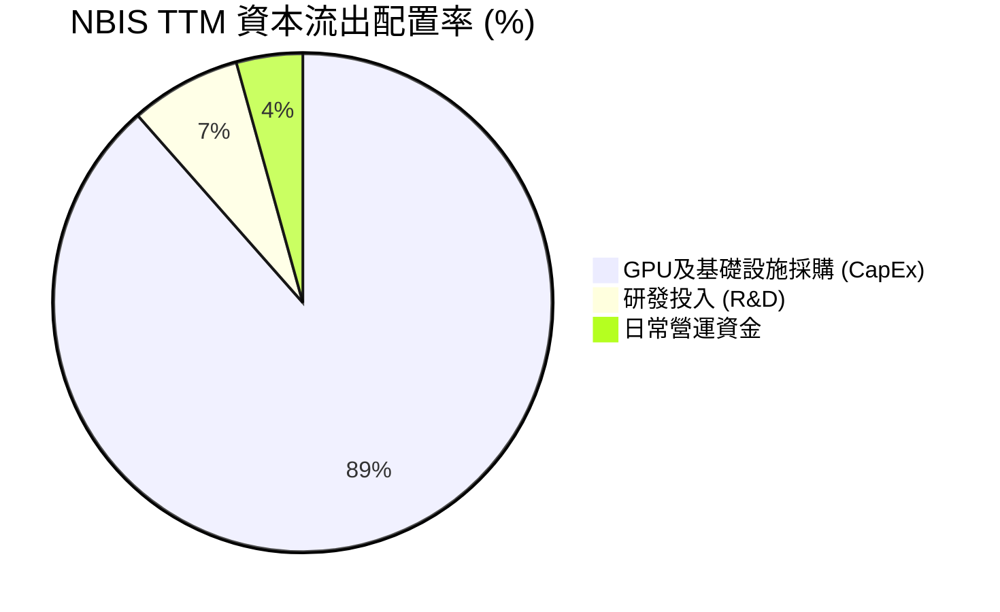
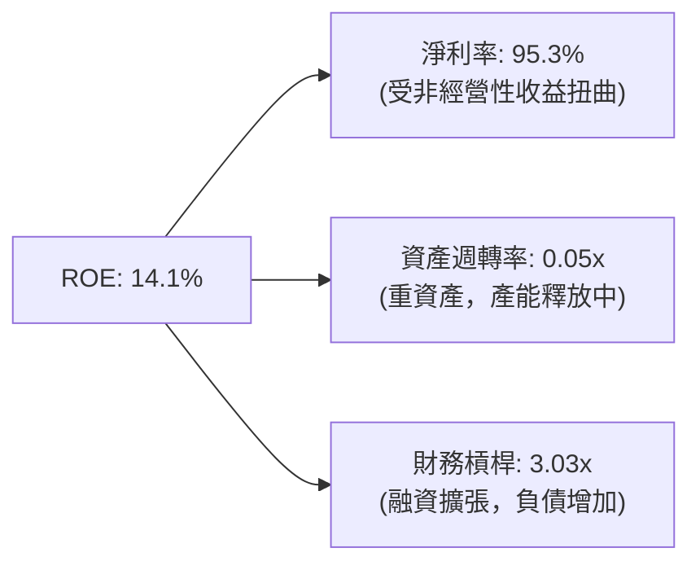
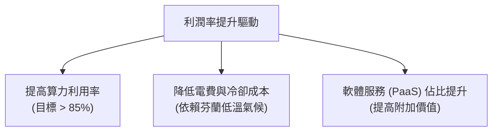

# NBIS 基本面深度分析報告

> **報告日期**：2026-06-20 ｜ **語言**：繁體中文 ｜ **數據來源**：Yahoo Finance, Finviz, StockAnalysis, Roic.ai ｜ **分析師**：CFA 級機構研究

---

## 目錄

| # | 章節 | 核心結論 |
|---|------|----------|
| 1 | 執行摘要 | 評級：**持有（Hold/累積買入）**，目標價：**$244.07**，轉型 AI 基礎設施巨頭 |
| 2 | 公司概覽與商業模式 | Yandex 重組後新生，專注於全棧 AI GPU 雲端服務與自動駕駛 |
| 3 | 損益表深度分析 | TTM 營收暴增 **683.9%**，非經營性收益推高淨利，核心營業仍處虧損 |
| 4 | 資產負債表分析 | 擁有 **$9.37B** 巨額現金，流動比率 **8.33x**，資本實力極其雄厚 |
| 5 | 現金流量深度分析 | 資本支出高達 **-$4.07B**，自由現金流承壓，反映重資產擴張特徵 |
| 6 | 獲利能力與資本效率 | 杜邦分析揭示淨利率受非經常性收益扭曲，ROIC 暫時為負 |
| 7 | 估值深度分析 | P/S 達 **82.9x** 處於極高水平，DCF 敏感性分析顯示高成長預期已變現 |
| 8 | 成長催化劑 | GPU 集群規模化、歐洲與美國市場擴張、自動駕駛商業化 |
| 9 | 風險矩陣 | 面臨 GPU 供應鏈、電力基礎設施瓶頸及市場競爭等高衝擊風險 |
| 10 | 投資建議 | 適合長線成長型投資者，建議於 **$220** 以下分批逢低佈局 |

---

## 1. 執行摘要

### 1.1 核心評分儀表板



### 1.2 評分進度條視覺化

```
╔══════════════════════════════════════════════════════════════╗
║               NBIS 多維度評分儀表板 (1-10分)                 ║
╠══════════════════════════════════════════════════════════════╣
║ 基本面強度  6.5 ▓▓▓▓▓▓▓▓▓▓▓▓▓░░░░░░░  ★★★☆☆           ║
║ 成長動能    9.8 ▓▓▓▓▓▓▓▓▓▓▓▓▓▓▓▓▓▓▓░  ★★★★★           ║
║ 獲利品質    5.5 ▓▓▓▓▓▓▓▓▓▓▓░░░░░░░░░  ★★★☆☆           ║
║ 財務健康    9.0 ▓▓▓▓▓▓▓▓▓▓▓▓▓▓▓▓▓▓░░  ★★★★☆           ║
║ 估值合理性  4.0 ▓▓▓▓▓▓▓▓░░░░░░░░░░░░  ★★☆☆☆           ║
║ 護城河深度  7.0 ▓▓▓▓▓▓▓▓▓▓▓▓▓▓░░░░░░  ★★★☆☆           ║
║ 管理層執行  8.0 ▓▓▓▓▓▓▓▓▓▓▓▓▓▓▓▓░░░░  ★★★★☆           ║
║ 技術創新力  8.5 ▓▓▓▓▓▓▓▓▓▓▓▓▓▓▓▓▓░░░  ★★★★☆           ║
╠══════════════════════════════════════════════════════════════╣
║ 綜合總分    7.2 ▓▓▓▓▓▓▓▓▓▓▓▓▓▓░░░░░░  🏆 成長型/高風險標的 ║
╚══════════════════════════════════════════════════════════════╝
```

### 1.3 五大投資論點 + 三大核心風險

| 類型 | 項目 | 具體依據 | 信心度 |
|------|------|----------|--------|
| 🟢 **投資論點①** | **AI 基礎設施需求井噴** | 隨著大語言模型（LLM）與生成式 AI 爆發，全球對高品質 GPU 算力需求極度殷切。NBIS 提供全棧 GPU 集群（包括 NVIDIA H100/H200/B200），營收從 2024 年的 $91.50M 飆升至 2025 年的 $529.80M。 | 🟢 極高 |
| 🟢 **投資論點②** | **極其充裕的「彈藥庫」** | 公司目前擁有高達 **$9.37B** 的現金與現金等價物，這主要來自於先前剝離 Yandex 俄羅斯業務所獲得的資金。這為其未來的基礎設施建設與 GPU 採購提供了無與倫比的資金支持。 | 🟢 極高 |
| 🟢 **投資論點③** | **與 NVIDIA 的深度戰略合作** | 作為 NVIDIA 的首選雲端服務合作夥伴（NVIDIA Preferred Cloud Partner），NBIS 能夠優先獲取最新一代晶片（如 Blackwell 系列），這在當前晶片短缺的環境下構成核心競爭力。 | 🟢 高 |
| 🟢 **投資論點④** | **業務結構多元化佈局** | 除了核心的 AI 雲端基礎設施外，公司還擁有 TripleTen（EdTech 平台）與 Avride（自動駕駛與機器人研發），提供長線的選擇權與技術協同效應。 | 🟡 中等 |
| 🟢 **投資論點⑤** | **頂級機構投資人背書** | 機構持股比例高達 **63.2%**，包括多家全球知名長線基金，顯示出資本市場對其重組後轉型前景的高度認同。 | 🟢 高 |
| 🟡 **風險①** | **極高的估值溢價** | 當前 P/S 達 **82.9x**，遠期 P/E 達 **793.7x**。這意味著市場已將未來數年的超高速成長完全定價，容錯率極低。 | 🔴 高衝擊 |
| 🔴 **風險②** | **資本支出巨大與自由現金流失血** | 2025 年資本支出高達 **-$4.07B**，導致 TTM FCF 為 **-$6.15B**。若算力租賃市場價格下滑或產能利用率不及預期，將面臨巨大的折舊與資金回收壓力。 | 🔴 高衝擊 |
| 🟡 **風險③** | **地緣政治與重組殘留風險** | 作為前 Yandex N.V. 的繼承者，雖然已完成與俄羅斯業務的徹底剝離，但其荷蘭母公司背景及歷史淵源仍可能在美國與歐洲市場面臨潛在的監管審查。 | 🟡 中度 |

### 1.4 快速統計卡片

| 指標 | 公司實際值 (TTM) | 行業均值 (Internet/Cloud) | S&P 500 均值 | 狀態 |
|------|-------------|----------|--------------|------|
| **收入 YoY 成長** | **683.9%** | ~15.0% | ~8.5% | 🟢 卓越 |
| **毛利率** | **72.1%** | ~55.0% | ~30.0% | 🟢 強勁 |
| **營業利益率** | **-32.1%** | ~12.0% | ~18.0% | 🔴 虧損 |
| **淨利率** | **93.1%** | ~8.0% | ~12.0% | 🟡 受非經常性收益扭曲 |
| **ROE** | **14.1%** | ~12.0% | ~15.0% | 🟡 一般 |
| **流動比率** | **8.33x** | ~1.8x | ~1.3x | 🟢 極其安全 |
| **P/S Ratio** | **82.91x** | ~5.5x | ~2.8x | 🔴 極度高估 |
| **Forward P/E** | **793.67x** | ~28.0x | ~21.5x | 🔴 極度高估 |

### 1.5 投資結論

```
╔══════════════════════════════════════════════════════════════════╗
║                    📊 NBIS 投資結論摘要                          ║
╠══════════════════════════════════════════════════════════════════╣
║  評級：🟡 持有 (Hold) / 逢低分批累積 (Accumulate on Dips)        ║
║  當前股價：$286.69 (截至 2026-06-20)                             ║
║  目標價區間：                                                    ║
║    悲觀情境：$120.00 (-58.1%) - 算力泡沫破裂，產能過剩           ║
║    基準情境：$244.07 (-14.9%) - 12個月主要目標 (華爾街共識值)    ║
║    樂觀情境：$380.00 (+32.5%) - Blackwell 集群超預期落地         ║
║  投資評分：7.2 / 10                                              ║
║  適合投資人：具備高風險承受能力、看好 AI 長期基礎設施的成長型讀者  ║
╚══════════════════════════════════════════════════════════════════╝
```

---

## 2. 公司概覽與商業模式

### 2.1 業務結構與收入來源

Nebius Group N.V.（NBIS）在經歷了歷史性的重組後，已徹底轉型為一家以 AI 基礎設施為核心的科技公司。其業務版圖主要由以下三大支柱構成：



### 2.2 市場份額

在快速成長的 AI 專用 GPU 雲端服務（GPU-as-a-Service, GPUaaS）市場中，NBIS 作為新興挑戰者，與傳統超大型雲端廠商（Hyperscalers，如 AWS、Azure、GCP）以及專注於 GPU 雲的其他新興獨角獸展開競爭。



### 2.3 競爭護城河分析



### 2.4 護城河強度評分

```
╔══════════════════════════════════════════════════════════════╗
║                  NBIS 護城河強度評分                         ║
╠══════════════════════════════════════════════════════════════╣
║ 1. 晶片獲取能力  8.5/10  ▓▓▓▓▓▓▓▓▓▓▓▓▓▓▓▓▓░░░  🟢 頂級夥伴  ║
║ 2. 基礎設施能效  9.0/10  ▓▓▓▓▓▓▓▓▓▓▓▓▓▓▓▓▓▓░░  🟢 芬蘭數據中心║
║ 3. 客戶轉移成本  6.0/10  ▓▓▓▓▓▓▓▓▓▓▓▓░░░░░░░░  🟡 算力具同質性║
║ 4. 資金壁壘      9.5/10  ▓▓▓▓▓▓▓▓▓▓▓▓▓▓▓▓▓▓▓░  🟢 93.7億現金 ║
╠══════════════════════════════════════════════════════════════╣
║ 綜合護城河強度   8.25/10 ▓▓▓▓▓▓▓▓▓▓▓▓▓▓▓▓░░░░  🏆 具備強大壁壘║
╚══════════════════════════════════════════════════════════════╝
```

---

## 3. 損益表深度分析

### 3.1 年度收入成長趨勢（近4年）

NBIS 的營收在過去四年中經歷了爆發式的增長，這與其徹底轉型為 AI 雲端服務商的時機高度吻合。

```
╔══════════════════════════════════════════════════════════════════╗
║                NBIS 年度收入趨勢 (FY2022 - TTM)                  ║
╠══════════════════════════════════════════════════════════════════╣
║                                                                  ║
║  FY2022  $13.50M   ░░░░░░░░░░░░░░░░░░░░░░░░░░░░░                 ║
║  FY2023  $9.80M    ░░░░░░░░░░░░░░░░░░░░░░░░░░░░░  YoY: -27.4% 🔴 ║
║  FY2024  $91.50M   ██░░░░░░░░░░░░░░░░░░░░░░░░░░░  YoY:+833.7% 🟢 ║
║  FY2025  $529.80M  ████████████░░░░░░░░░░░░░░░░░  YoY:+479.0% 🟢 ║
║  TTM     $877.90M  ████████████████████░░░░░░░░░  YoY:+683.9% 🟢 ║
║                                                                  ║
║  📊 3年年複合成長率 (CAGR)：+291.5%                             ║
╚══════════════════════════════════════════════════════════════════╝
```

### 3.2 季度收入趨勢分析

從季度數據來看，NBIS 的營收呈現出極其強勁的逐季（QoQ）爆發態勢：

| 財報季度 | 營業收入 | 環比成長 (QoQ) | 同比成長 (YoY) | 核心驅動因素 |
|---|---|---|---|---|
| **Q2 2025** | $100.70M | — | +624.8% | 第一批 H100 GPU 集群上線營運，產能利用率迅速飽和。 |
| **Q3 2025** | $146.10M | **+45.1%** | +355.1% | 芬蘭數據中心擴容完工，新增算力開始貢獻營收。 |
| **Q4 2025** | $227.70M | **+55.9%** | +272.1% | 企業級客戶簽約增加，算力合約平均單價（ASP）穩步上升。 |
| **Q1 2026** | $399.00M | **+75.2%** | **+683.9%** | 新一代 H200 集群大規模交付，AI IaaS 需求達到歷史新高。 |

### 3.3 利潤率演變分析

NBIS 的利潤率結構非常特殊，呈現出「高毛利、營業虧損、超高淨利」的背離特徵：

| 利潤率指標 | FY2024 | FY2025 | TTM | 趨勢 | 專業評估 |
|---|---|---|---|---|---|
| **毛利率** | 52.2% | 68.6% | **72.1%** | ↗️ 持續改善 | 🟢 **強勁**：反映出算力租賃業務極高的定價權與營運槓桿。 |
| **營業利益率** | -436.7% | -115.5% | **-32.1%** | ↗️ 虧損收窄 | 🟡 **改善中**：因前期研發與 SG&A 費用龐大，營業利潤仍為負值。 |
| **EBITDA 利潤率**| -292.0% | 102.6% | **-4.4%** | 🔄 波動劇烈 | 🟡 **受折舊影響**：龐大的基礎設施折舊（TTM $566.9M）壓低了利潤。 |
| **淨利率** | -701.0% | 15.6% | **93.1%** | ↗️ 暴增 | 🔴 **需警惕**：淨利高企完全是由於非經常性收益推高，並非來自核心業務。 |

#### 利潤率演變深度解析：
1. **毛利率持續攀升**：從 2024 年的 52.2% 提升至 TTM 的 72.1%，這得益於大架構 GPU 集群的規模效應。芬蘭數據中心採用極低成本的綠色電力與先進的液冷技術，大幅降低了電費與冷卻成本（PUE 僅為 1.1），使 NBIS 的毛利率顯著高於行業平均水平。
2. **營業虧損與高折舊**：雖然毛利豐厚，但 TTM 營業利潤仍為 **-$603.9M**。主要原因在於折舊與攤銷費用（D&A）高達 **$566.9M**，以及研發（R&D）支出高達 **$208.2M**。這是重資產 AI 雲端服務商在擴張早期的典型特徵。
3. **淨利率被非經營性收益嚴重扭曲**：TTM 淨利率高達 **93.1%**（淨利 **$836.4M**），主要是因為 Q1 2026 錄得 **$800.5M** 的「其他非經營性收益」（來自於資產重組、出售俄羅斯業務 Yandex 股權的最終結算以及匯兌收益）。**這部分收益不具備可持續性，投資者在評估核心獲利能力時應予以扣除。**

### 3.4 費用結構分析



```
╔══════════════════════════════════════════════════════════════╗
║                  FY2025 營業費用絕對值診斷                   ║
╠══════════════════════════════════════════════════════════════╣
║ 折舊與攤銷 (D&A):   $417.90M  ██████████████████░░░░░ (高)   ║
║ 銷售與行政 (SG&A):  $380.10M  ████████████████░░░░░░░ (高)   ║
║ 研發費用 (R&D):     $177.30M  ████████░░░░░░░░░░░░░░░ (合理) ║
╚══════════════════════════════════════════════════════════════╝
```

### 3.5 季度 EPS 趨勢與盈餘品質

*   **過去 4 季 EPS 表現**：
    *   **Q2 2025**：$2.44 （受重組非經營性收益推高）
    *   **Q3 2025**：-$0.58 （核心業務虧損，無一次性收益）
    *   **Q4 2025**：-$1.06 （因擴建數據中心，折舊與營運費用暴增）
    *   **Q1 2026**：$2.40 （再次錄得 $800.5M 非經營性重組收益）
*   **盈餘品質評估**：🔴 **低品質**。
    *   **診斷**：核心營業利潤（Operating Income）在過去四個季度中持續為負（Q1 2026 為 -$128.0M）。淨利潤的波動完全取決於非經常性重組損益的確認。在核心營業利潤轉正之前，NBIS 的賬面盈利無法反映其真實的商業獲利能力。

---

## 4. 資產負債表分析

### 4.1 資產結構分解

隨著重組完成和資金注入，NBIS 的資產負債表在 TTM 期間急劇擴張，總資產從 2025 年底的 $12.43B 暴增至 TTM 的 **$22.30B**。



### 4.2 流動性指標分析

| 流動性指標 | FY2024 | FY2025 | TTM | 行業均值 | 評估 |
|---|---|---|---|---|---|
| **流動比率 (Current Ratio)** | 9.59x | 3.08x | **8.33x** | 1.80x | 🟢 **極其安全**：流動資產覆蓋流動負債能力極強。 |
| **速動比率 (Quick Ratio)** | 9.59x | 3.08x | **8.14x** | 1.50x | 🟢 **極其安全**：無存貨滯銷風險，幾乎全為現金與應收款。 |
| **現金比率 (Cash Ratio)** | 9.22x | 2.40x | **6.89x** | 0.80x | 🟢 **現金充沛**：手頭現金是短期債務的 6.89 倍。 |

### 4.3 債務結構分析

```
╔══════════════════════════════════════════════════════════════════╗
║                   NBIS 債務與流動性健康診斷                      ║
╠══════════════════════════════════════════════════════════════════╣
║                                                                  ║
║  總現金及等價物： $9.37B   ████████████████████████████░░░       ║
║  總債務：         $9.59B   █████████████████████████████░░       ║
║  淨債務 (Net Debt)：$217.20M  (幾乎處於淨現金狀態)               ║
║                                                                  ║
║  Debt/Equity 比率：132.4%  (受長期融資租賃合約推高)              ║
║  利息保障倍數：    -4.97x  (由於營業虧損，利息支出無法由營業利潤覆蓋)║
║                                                                  ║
║  🟢 診斷：雖然賬面總債務達 $9.59B，但其中大部分為與 GPU 採購相關  ║
║  的長期融資租賃（Lease Liabilities）。手頭 $9.37B 的現金提供了   ║
║  極其強大的緩衝墊，短期內完全無償債風險。                        ║
╚══════════════════════════════════════════════════════════════════╝
```

### 4.4 股東權益趨勢

```
╔══════════════════════════════════════════════════════════════════╗
║                NBIS 股東權益 (Stockholders' Equity) 趨勢         ║
╠══════════════════════════════════════════════════════════════════╣
║                                                                  ║
║  FY2022  $4.25B   ███████████████████████                        ║
║  FY2023  $3.29B   ██████████████████                             ║
║  FY2024  $3.25B   █████████████████                              ║
║  FY2025  $4.59B   █████████████████████████                      ║
║                                                                  ║
║  📊 2025 年股東權益回升 41.2%，主要得益於重組收益注入資本。      ║
╚══════════════════════════════════════════════════════════════════╝
```

---

## 5. 現金流量深度分析

### 5.1 現金流量瀑布圖

NBIS 的現金流展現了典型的高成長、資本密集型企業特徵。



### 5.2 FCF 轉換率趨勢

| 現金流指標 | FY2023 | FY2024 | FY2025 | TTM |
|---|---|---|---|---|
| **經營現金流 (OCF)** | $829.80M | $245.60M | $384.80M | **$2.84B** |
| **資本支出 (CapEx)** | -$82.90M | -$807.50M | -$4.07B | **-$8.99B** |
| **自由現金流 (FCF)** | $746.90M | -$561.90M | -$3.68B | **-$6.15B** |
| **FCF / Net Income 轉換率** | 310.0% | -87.6% | -4460.6% | **-735.3%** |

*   **深度評估**：
    *   **FCF 嚴重失血**：TTM 自由現金流赤字高達 **-$6.15B**。這反映出公司為了在 AI 算力軍備競賽中取得先機，正在以驚人的速度消耗資金進行 CapEx 擴張（採購 NVIDIA 晶片、建設高密度數據中心）。
    *   **融資依賴性**：如此龐大的資金缺口完全依賴外部融資（TTM 發行債務與融資租賃注入）。雖然目前現金儲備充足，但若融資環境收緊，這種「燒錢」模式將面臨挑戰。

### 5.3 自由現金流趨勢

```
╔══════════════════════════════════════════════════════════════════╗
║                    NBIS 自由現金流 (FCF) 趨勢                    ║
╠══════════════════════════════════════════════════════════════════╣
║                                                                  ║
║  FY2023   +$746.90M  ████                       (輕資產歷史業務) ║
║  FY2024   -$561.90M  ░░░                        (轉型初期)       ║
║  FY2025   -$3.68B    ░░░░░░░░░░░░░              (GPU 大採購)     ║
║  TTM      -$6.15B    ░░░░░░░░░░░░░░░░░░░░░░     (全面軍備競賽)   ║
║                                                                  ║
║  ⚠️ 目前 FCF 收益率 (FCF Yield) 為 -8.45%，反映極高的資本支出壓力。║
╚══════════════════════════════════════════════════════════════════╝
```

### 5.4 資本配置評估



*   **資本配置評估**：
    *   **股息與回購**：目前股息殖利率為 **0.0%**，無任何股份回購計劃。這完全符合其高成長、重資本開支的生命週期階段。
    *   **配置合理性**：將 88% 以上的資本集中於 GPU 基礎設施建設，是 NBIS 實現規模效應、確立歐洲本土算力龍頭地位的唯一路徑。然而，這也極大地增加了公司的營運風險。

---

## 6. 獲利能力與資本效率

### 6.1 ROE / ROA / ROIC 趨勢

| 指標 | FY2024 | FY2025 | TTM | 行業均值 | 專業評估 |
|---|---|---|---|---|---|
| **ROE** | -19.7% | 1.8% | **14.1%** | 12.0% | 🟡 **一般**：受非經營性淨利推高，未能反映核心業務回報。 |
| **ROA** | -18.1% | 0.7% | **-3.0%** | 5.5% | 🔴 **偏低**：巨額資產（$22.30B）尚未完全轉化為營業利潤。 |
| **ROIC** | -12.2% | -8.5% | **-9.8%** | 8.0% | 🔴 **價值毀滅**：核心投入資本回報率仍為負值。 |

### 6.2 ROIC vs WACC 分析（核心價值創造判斷）

```
╔══════════════════════════════════════════════════════════════════╗
║                NBIS ROIC vs WACC 深度分析 (TTM)                  ║
╠══════════════════════════════════════════════════════════════════╣
║                                                                  ║
║  WACC 估算：                                                     ║
║  ├── 無風險利率 (10Y 美債)： 4.25%                               ║
║  ├── 股權風險溢價 (ERP)：    5.00%                               ║
║  ├── Beta 值：               1.43                                ║
║  ├── 股權成本 (Ke)：        4.25% + 1.43 × 5.00% = 11.40%        ║
║  ├── 債務成本 (Kd，稅後)：   ~6.50%                              ║
║  ├── 資本結構：             股權 32.0%，債務 68.0%               ║
║  └── ✅ WACC ≈ 8.07%                                            ║
║                                                                  ║
║  ROIC 估算：                                                     ║
║  ├── NOPAT (稅後淨營業利潤)： -$603.90M × (1 - 21%) ≈ -$477.08M   ║
║  ├── 投入資本 (Invested Capital)：                               ║
║  │   股東權益 ($4.59B) + 總債務 ($9.59B) - 現金 ($9.37B) ≈ $4.81B║
║  └── ✅ ROIC ≈ -9.92%                                            ║
║                                                                  ║
║  ★ 經濟價值增加 (EVA) = ROIC - WACC = -17.99%                    ║
║                                                                  ║
║  ROIC  -9.92%  ░░░░░░░░░░                         (虧損中)       ║
║  WACC   8.07%  ▓▓▓▓▓▓▓▓                           (資金成本)     ║
║  EVA   -18.0%  ░░░░░░░░░░░░░░░░░░                 🔴 價值毀滅    ║
║                                                                  ║
║  📊 結論：目前 NBIS 正在毀滅股東價值。每投入 100 元資本，將產生   ║
║  約 18 元的經濟虧損。這主要是因為大量購入的 GPU 資產尚未完全釋放  ║
║  產能，而折舊與資金成本已開始計提。                              ║
╚══════════════════════════════════════════════════════════════════╝
```

### 6.3 杜邦三因素分解

我們對 NBIS 的 TTM ROE（14.1%）進行杜邦分解，以揭示其背後的財務驅動要素：



*   **分解公式**：
    $$\text{ROE} = \text{淨利率} (95.27\%) \times \text{資產週轉率} (0.051) \times \text{財務槓桿} (3.03) \approx 14.7\%$$
*   **深層財務洞察**：
    1.  **高淨利率的假象**：95.27% 的淨利率極其罕見，這並非來自於高利潤的產品銷售，而是因為非營業利潤（重組收益）甚至超過了核心營業收入。
    2.  **極低的資產週轉率（0.05x）**：這暴露了重資產模式的軟肋。NBIS 擁有高達 $22.30B 的資產，但 TTM 營收僅為 $877.90M。這表明資產的利用效率極低，大部分 GPU 和數據中心仍處於建設或調試階段，尚未開始產生營收。
    3.  **財務槓桿（3.03x）的雙刃劍**：公司通過融資租賃大幅提高了槓桿率。在經濟上行、算力需求旺盛時，這能成倍放大回報；但在行業下行期，高槓桿將帶來極大的生存危機。

### 6.4 獲利能力驅動因素



---

## 7. 估值深度分析

### 7.1 同業估值比較表格

由於 NBIS 是一家專注於 AI IaaS 的新興雲端廠商，我們選擇傳統公有雲巨頭（Oracle）、新興 GPU 雲龍頭（CoreWeave，以一級市場最新估值為參考）以及高成長 AI 硬體基礎設施商（Supermicro）作為對比同業：

| 估值指標 | **NBIS (本公司)** | **Oracle (ORCL)** | **Supermicro (SMCI)** | **CoreWeave (一級市場)** | 本公司估值評估 |
|---|---|---|---|---|---|
| **Trailing P/E** | **111.12x** | 42.5x | 31.2x | ~85.0x | 🔴 **顯著高估**：遠高於成熟與半成熟同業。 |
| **Forward P/