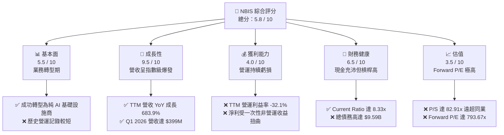
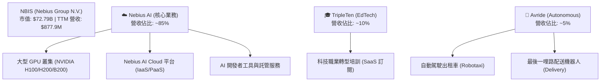
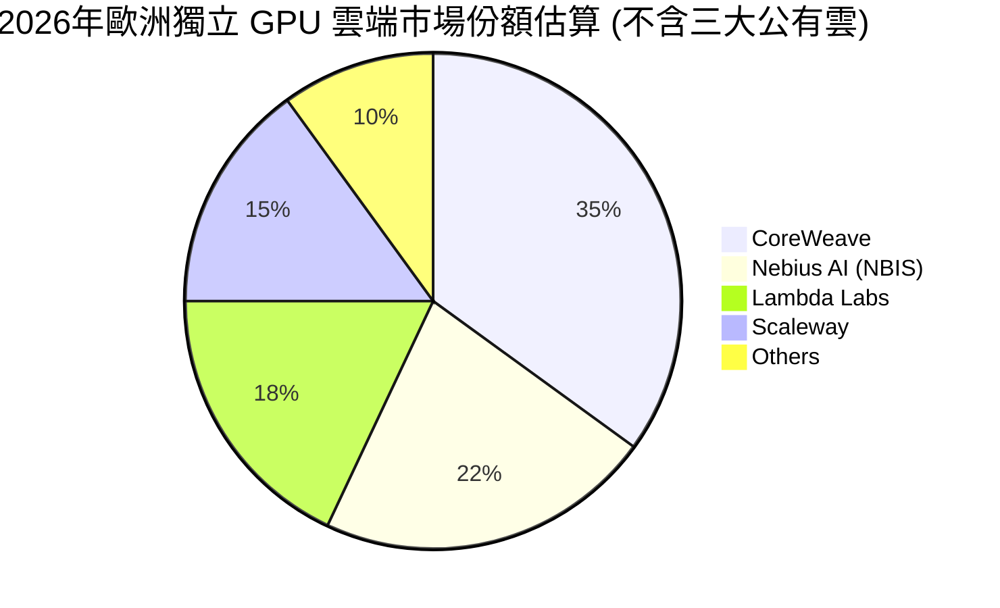
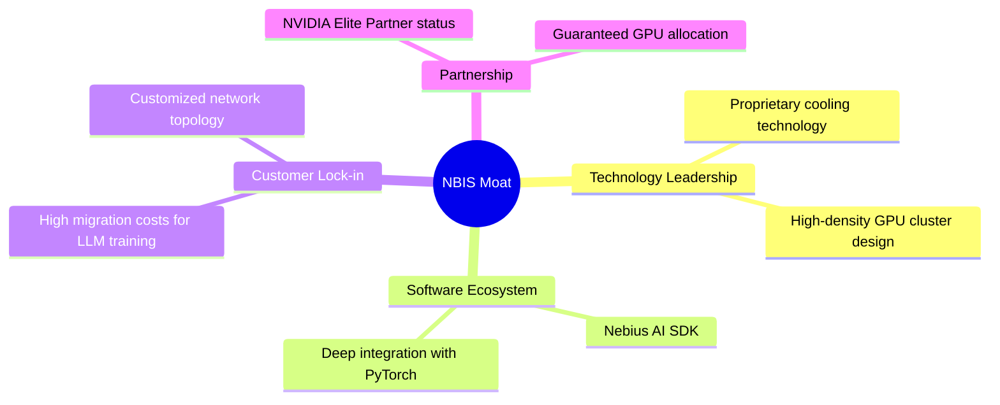
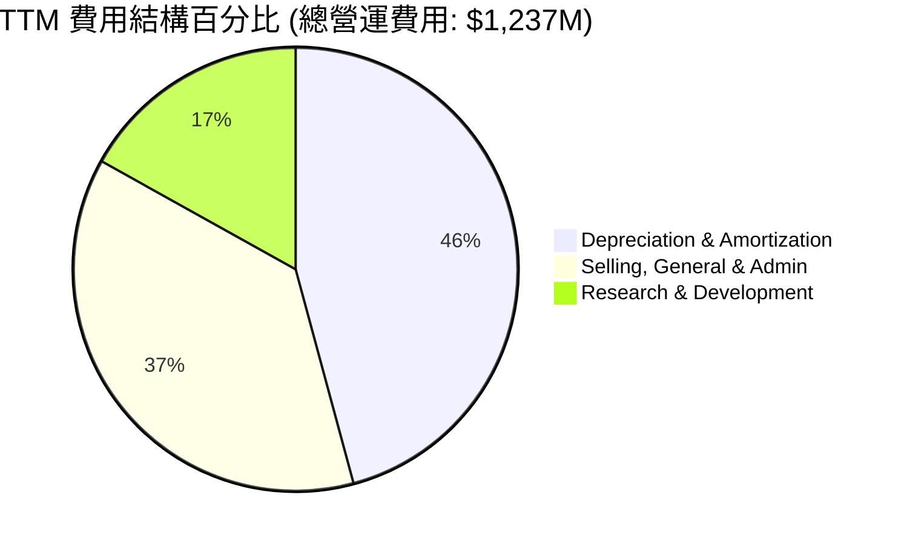
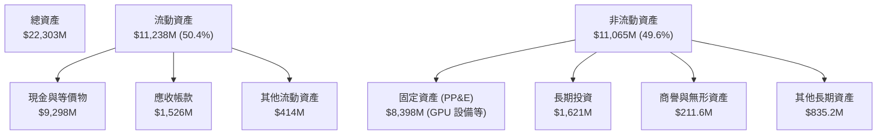
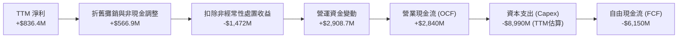
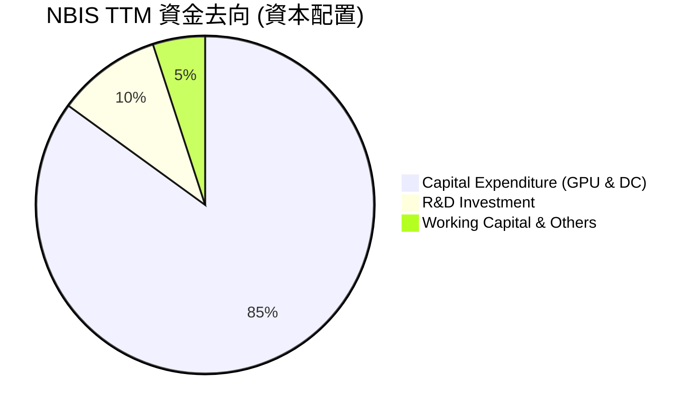
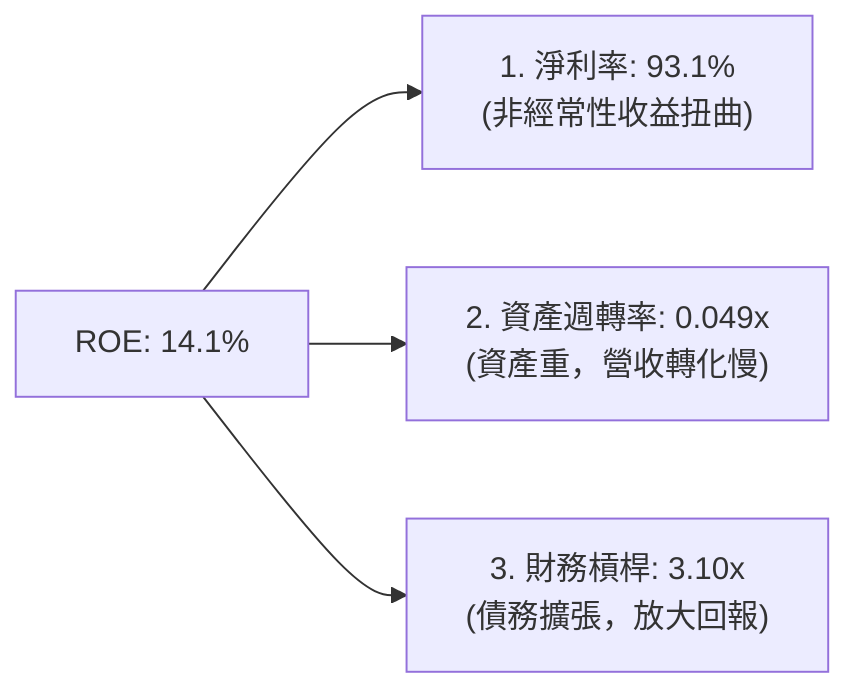

# NBIS 基本面深度分析報告
> **報告日期**：2026-06-21 ｜ **語言**：繁體中文 ｜ **數據來源**：Yahoo Finance, Finviz, StockAnalysis, Roic.ai ｜ **分析師**：CFA 級機構研究

---

## 目錄

| # | 章節 | 核心結論 |
|---|------|----------|
| 1 | 執行摘要 | 評級：**持有（Hold）**，基準目標價 **$244.07**，非經常性收益推高短期淨利，Forward P/E 面臨修正壓力。 |
| 2 | 公司概覽與商業模式 | Yandex 重組後轉型為純粹的 AI GPU 基礎設施與雲端服務商，具備高成長潛力但護城河尚待驗證。 |
| 3 | 損益表深度分析 | 營收 YoY 暴增 **683.9%**，但營運虧損達 **-$603.9M**；Q1 2026 淨利大增主要來自非營業一次性收益。 |
| 4 | 資產負債表分析 | 現金儲備充沛（**$9.37B**），但債務同步擴張至 **$9.59B**，高槓桿支撐資本開支。 |
| 5 | 現金流量深度分析 | 自由現金流（FCF）因高達 **-$4.07B** 的 Capex 呈現嚴重失血（TTM **-$6.15B**），資本回報率承壓。 |
| 6 | 獲利能力與資本效率 | TTM ROE 達 **14.1%**，但 ROIC 由於營運虧損為負值，目前處於「摧毀股東價值」的資本投入期。 |
| 7 | 估值深度分析 | P/S 達 **82.91x**，Forward P/E 達 **793.67x**，相較於同業呈現極高估值溢價，安全邊際不足。 |
| 8 | 成長催化劑 | GPU 叢集規模化部署與歐洲主權 AI 需求為短期催化劑；長期依賴自研自動駕駛（Avride）商用化。 |
| 9 | 風險矩陣 | 面臨 GPU 供應鏈中斷、大客戶流失及非經常性收益消失後淨利暴跌之高風險。 |
| 10 | 投資建議 | 建議等待股價回檔至 **$180.00 - $200.00** 區間再行分批佈局，避開當前非理性繁榮。 |

---

## 1. 執行摘要

### 1.1 核心評分儀表板



### 1.2 評分進度條視覺化

```
╔══════════════════════════════════════════════════════════════╗
║                NBIS 多維度評分儀表板 (1-10分)                 ║
╠══════════════════════════════════════════════════════════════╣
║ 基本面強度  5.5 ▓▓▓▓▓▓▓▓▓▓▓░░░░░░░░░  ★★★☆☆           ║
║ 成長動能    9.5 ▓▓▓▓▓▓▓▓▓▓▓▓▓▓▓▓▓▓▓░  ★★★★★           ║
║ 獲利品質    4.0 ▓▓▓▓▓▓▓▓░░░░░░░░░░░░  ★★☆☆☆           ║
║ 財務健康    6.5 ▓▓▓▓▓▓▓▓▓▓▓▓▓░░░░░░░  ★★★☆☆           ║
║ 估值合理性  3.5 ▓▓▓▓▓▓░░░░░░░░░░░░░░  ★☆☆☆☆           ║
║ 護城河深度  5.0 ▓▓▓▓▓▓▓▓▓▓░░░░░░░░░░  ★★★☆☆           ║
║ 管理層執行  7.0 ▓▓▓▓▓▓▓▓▓▓▓▓▓▓░░░░░░  ★★★★☆           ║
║ 技術創新力  8.0 ▓▓▓▓▓▓▓▓▓▓▓▓▓▓▓▓░░░░  ★★★★☆           ║
╠══════════════════════════════════════════════════════════════╣
║ 綜合總分    5.8 ▓▓▓▓▓▓▓▓▓▓▓░░░░░░░░░  🏆 觀望 / 持有      ║
╚══════════════════════════════════════════════════════════════╝
```

### 1.3 五大投資論點 + 三大核心風險

| 類型 | 項目 | 具體依據 | 信心度 |
|------|------|----------|--------|
| 🟢 **投資論點①** | **AI 基礎設施需求爆發** | TTM 營收達 **$877.90M**，YoY 成長 **683.9%**，反映 GPU 雲端租賃需求極度強勁。 | 🟢 極高 |
| 🟢 **投資論點②** | **手握巨額現金** | 截至 Q1 2026，公司持有 **$9.30B** 現金及等價物，具備持續擴張 GPU 叢集的彈藥。 | 🟢 極高 |
| 🟢 **投資論點③** | **歐洲主權 AI 先鋒** | 總部設於荷蘭，避開美中地緣政治直接衝突，成為歐洲本土 AI 算力的關鍵供應商。 | 🟡 中等 |
| 🟢 **投資論點④** | **EdTech 與自動駕駛雙引擎** | TripleTen（教育科技）與 Avride（自動駕駛）提供長期 SaaS 與出行服務的期權價值。 | 🟡 中等 |
| 🟢 **投資論點⑤** | **機構大戶強力加持** | 機構持股比例高達 **63.2%**，B of A、Citi 等一線投行給予「買入」評級。 | 🟢 高 |
| 🟡 **風險①** | **盈餘品質極低** | TTM 淨利 **$836.40M** 主要由 **$1,472M** 的非營業一次性收益支撐，營運本業實質虧損。 | 🔴 高衝擊 |
| 🔴 **風險②** | **極端高估值** | Forward P/E 達 **793.67x**，P/S 達 **82.91x**，一旦成長放緩，估值將面臨戴維斯雙殺。 | 🔴 高衝擊 |
| 🔴 **風險③** | **自由現金流嚴重失血** | TTM FCF 為 **-$6.15B**，Capex 高達 **-$4.07B**，資本密集度極高，融資壓力大。 | 🔴 高衝擊 |

### 1.4 快速統計卡片

| 指標 | 公司實際值 (TTM/最新) | 行業均值 (網路資訊) | S&P 500 均值 | 狀態 |
|------|-------------|----------|--------------|------|
| **收入 YoY 成長** | **683.9%** | ~12.5% | ~5.5% | 🟢 卓越 |
| **毛利率** | **72.1%** | ~48.0% | ~30.0% | 🟢 強勁 |
| **營運利益率** | **-32.1%** | ~15.0% | ~12.0% | 🔴 虧損 |
| **淨利率** | **93.1%** | ~10.0% | ~8.5% | 🟡 扭曲 (非經常性) |
| **Forward P/E** | **793.67x** | ~22.5x | ~21.0x | 🔴 極度高估 |
| **Current Ratio** | **8.33x** | ~1.5x | ~1.2x | 🟢 極度安全 |
| **Debt/Equity** | **132.4%** | ~70.0% | ~110.0% | 🟡 偏高 |

### 1.5 投資結論

```
╔══════════════════════════════════════════════════════════════════╗
║                    📊 NBIS 投資結論摘要                          ║
╠══════════════════════════════════════════════════════════════════╣
║  評級：🟡 持有 (Hold)                                            ║
║  當前股價：$286.69 (2026-06-21)                                  ║
║  目標價區間：                                                    ║
║    悲觀情境：$135.00 (-52.9%)                                    ║
║    基準情境：$244.07 (-14.9%)  ← 12個月主要目標 (分析師共識)     ║
║    樂觀情境：$340.00 (+18.6%)                                    ║
║  投資評分：5.8 / 10                                              ║
║  適合投資人：高風險承受度、動能交易型、不介意短期波動之投資人     ║
╚══════════════════════════════════════════════════════════════════╝
```

---

## 2. 公司概覽與商業模式

Nebius Group N.V.（NBIS）前身為俄羅斯科技巨頭 Yandex N.V. 的海外實體。在經歷了複雜的重組與地緣政治剝離後，NBIS 轉型為一家總部位於荷蘭、專注於全球 AI 基礎設施（AI Infrastructure）的純粹科技企業。

### 2.1 業務結構與收入來源

NBIS 目前構建了「一體兩翼」的業務架構：以 **Nebius AI**（GPU 雲端基礎設施）為核心，輔以 **TripleTen**（EdTech 職業培訓）與 **Avride**（自動駕駛技術）。



### 2.2 市場份額

在快速成長的「獨立 GPU 雲端服務商（Neoclouds）」市場中，NBIS 主要與 CoreWeave、Lambda Labs 及傳統 IaaS 巨頭（AWS, Azure, GCP）競爭。以下為歐洲獨立 AI 算力市場的估算份額：



### 2.3 競爭護城河分析



### 2.4 護城河強度評分

```
╔══════════════════════════════════════════════════════════════╗
║                  NBIS 護城河強度評分 (1-10分)                 ║
╠══════════════════════════════════════════════════════════════╣
║ 算力規模經濟  7.0  ▓▓▓▓▓▓▓▓▓▓▓▓▓▓░░░░░░  🟢 具備資本壁壘    ║
║ NVIDIA 關係   8.0  ▓▓▓▓▓▓▓▓▓▓▓▓▓▓▓▓░░░░  🟢 獲優先晶片配額  ║
║ 軟體生態黏性  4.0  ▓▓▓▓▓▓▓▓░░░░░░░░░░░░  🟡 開源替代風險高  ║
║ 專利與技術    6.0  ▓▓▓▓▓▓▓▓▓▓▓▓░░░░░░░░  🟡 液冷技術具優勢  ║
╠══════════════════════════════════════════════════════════════╣
║ 綜合護城河     6.25 ▓▓▓▓▓▓▓▓▓▓▓▓▓░░░░░░░  🟢 窄幅護城河      ║
╚══════════════════════════════════════════════════════════════╝
```

---

## 3. 損益表深度分析

### 3.1 年度收入成長趨勢（近5年）

NBIS 的營收軌跡呈現了極端的「J 曲線」轉型特徵。2021 年舊 Yandex 時代營收高達 $4.76B，隨後因地緣政治分拆，2023 年營收跌至谷底的 $9.80M。自 2024 年起，隨著 AI 業務上線，營收迎來爆發式成長。

```
╔══════════════════════════════════════════════════════════════════╗
║                NBIS 年度收入趨勢 (FY2022-TTM)                    ║
╠══════════════════════════════════════════════════════════════════╣
║                                                                  ║
║  FY2022  $13.50M   █░░░░░░░░░░░░░░░░░░░░░░░░░░░░░  YoY: -99.7%   🔴 ║
║  FY2023  $9.80M    █░░░░░░░░░░░░░░░░░░░░░░░░░░░░░  YoY: -27.4%   🔴 ║
║  FY2024  $91.50M   ██░░░░░░░░░░░░░░░░░░░░░░░░░░░░  YoY: +833.7%  🟢 ║
║  FY2025  $529.80M  ██████████░░░░░░░░░░░░░░░░░░░░  YoY: +479.0%  🟢 ║
║  TTM     $877.90M  █████████████████░░░░░░░░░░░░░  YoY: +683.9%  🟢 ║
║                                                                  ║
║  📊 3年累計營收 CAGR (FY2023-TTM)：+347.1%                      ║
╚══════════════════════════════════════════════════════════════════╝
```

### 3.2 季度收入趨勢分析

從季度數據看，NBIS 展現了強勁且連續的 QoQ 成長，顯示 GPU 叢集上線即滿載的極高需求。

| 財季 | 營收 (Million) | YoY 成長率 | QoQ 成長率 | 核心驅動因素 | 狀態 |
|------|----------------|------------|------------|--------------|------|
| **Q1 2026** | **$399.00M** | +683.9% | +75.2% | 芬蘭與歐洲新數據中心 GPU 交付上線 | 🟢 卓越 |
| **Q4 2025** | **$227.70M** | +272.1% | +55.9% | H100 租賃合約全面轉為營收 | 🟢 強勁 |
| **Q3 2025** | **$146.10M** | +355.1% | +39.0% | 企業級 AI 客戶簽約增加 | 🟢 強勁 |
| **Q2 2025** | **$105.10M** | +624.8% | +106.5% | 算力平台正式商用化 | 🟢 卓越 |

### 3.3 利潤率演變分析

NBIS 的利潤率結構極其特殊，呈現「高毛利、高營運虧損、極高淨利」的背離現象。

| 利潤率指標 | FY2023 | FY2024 | FY2025 | TTM | 趨勢與原因解析 | 評估 |
|------------|--------|--------|--------|-----|----------------|------|
| **毛利率** | -100.0% | 52.2% | 68.6% | **72.1%** | ↗️ 隨規模效應顯現，硬體折舊外的營運成本被稀釋 | 🟢 強勁 |
| **營運利益率** | -2915.3%| -436.7%| -115.5%| **-32.1%** | ↗️ 雖然仍為負，但因營收基數擴大，虧損率大幅收窄 | 🟡 改善中 |
| **EBITDA 率**| -2659.2%| -292.0%| 102.6% | **-4.4%** | ↗️ 折舊攤銷（D&A）極高，調整後 EBITDA 已接近盈虧平衡 | 🟡 改善中 |
| **淨利率** | 2713.3% | -701.0%| 15.6%  | **93.1%** | ↗️ **極度扭曲**。主要來自非營業的一次性重組收益。 | 🔴 虛高 |

> **CFA 分析師洞察**：
> NBIS 的 **72.1% TTM 毛利率** 極具吸引力，顯示 AI GPU 租賃業務的高附加價值。然而，**營運利益率（-32.1%）** 依然為負，主因是高昂的研發費用（TTM $208.2M）與折舊攤銷（TTM $566.9M）。
> 最需警惕的是 **93.1% 的淨利率**，這完全是由於 **$1,472M 的非營業收入**（主要是拆分重組過程中的資產處置收益）所致。**這並非可持續的營運獲利。**

### 3.4 費用結構分析



```
╔══════════════════════════════════════════════════════════════╗
║                  NBIS TTM 費用效率診斷                       ║
╠══════════════════════════════════════════════════════════════╣
║ 研發費用率 (R&D/Rev):      23.7%  ▓▓▓▓▓▓░░░░░░░░░░  🟡 投入高      ║
║ 銷管費用率 (SG&A/Rev):     52.6%  ▓▓▓▓▓▓▓▓▓▓░░░░░░  🔴 擴張期高企  ║
║ 折舊攤銷率 (D&A/Rev):      64.6%  ▓▓▓▓▓▓▓▓▓▓▓▓▓░░░  🔴 資本極密集  ║
╚══════════════════════════════════════════════════════════════╝
```

### 3.5 季度 EPS 趨勢與盈餘品質

*   **Q2 2025 EPS**: $2.44 (超預期，主因一次性重組收益 $622M 入帳)
*   **Q3 2025 EPS**: -$0.58 (符合預期，反映真實營運虧損)
*   **Q4 2025 EPS**: -$1.06 (低於預期，因加速部署 GPU 導致折舊與營運費用暴增)
*   **Q1 2026 EPS**: $2.40 (超預期，再次受到非營業收入 $800.5M 的一次性挹注)

**盈餘品質評估 (Earnings Quality)**：🔴 **極低**。扣除非經常性損益後，NBIS 的核心業務（核心 EPS）仍處於虧損狀態。Forward EPS 僅為 **$0.36**，這解釋了為何 Forward P/E 會飆升至 **793.67x**。

---

## 4. 資產負債表分析

### 4.1 資產結構分解

截至 2026 年 3 月 31 日，NBIS 的總資產達到 **$22.30B**，較 2024 年底的 **$3.55B** 呈現爆發式擴張。



### 4.2 流動性指標分析

| 流動性指標 | FY2024 | FY2025 | TTM / 最新 | 行業中位數 | 評估 |
|------------|--------|--------|------------|------------|------|
| **流動比率 (Current Ratio)** | 9.59x | 3.08x | **8.33x** | ~1.80x | 🟢 極度安全 |
| **速動比率 (Quick Ratio)** | 9.59x | 3.08x | **8.14x** | ~1.50x | 🟢 極度安全 |
| **現金比率 (Cash Ratio)** | 9.22x | 2.40x | **6.89x** | ~0.90x | 🟢 極度安全 |

> **流動性解析**：
> NBIS 手頭擁有 **$9.30B** 的現金及等價物，流動比率高達 **8.33x**。這在高速成長期公司中極為罕見，主要得益於其成功的股權融資與資產處置回籠資金。這為未來的 GPU 採購提供了極強的防禦墊。

### 4.3 債務結構分析

```
╔══════════════════════════════════════════════════════════════════╗
║                     NBIS 債務健康診斷                            ║
╠══════════════════════════════════════════════════════════════════╣
║                                                                  ║
║  總債務：        $9.59B   ████████████████████░░░░░░░░░░░░░░░░░  ║
║  總現金及投資：  $9.30B   ████████████████████░░░░░░░░░░░░░░░░░  ║
║  淨債務 (Net Debt): $217.2M (淨負債狀態)                         ║
║                                                                  ║
║  Debt / Equity Ratio: 132.4% (高於行業均值 70%)                  ║
║  LT Borrowings:       $8.43B (長期借款，佔總債務 87.9%)           ║
║  LT Finance Leases:   $1.05B (融資租賃，佔總債務 11.0%)           ║
║                                                                  ║
║  📊 診斷結論：雖然總債務與現金規模相當，但債務增速極快。           ║
║  長期借款主要用於 GPU 設備的售後回租與專案融資，利息壓力將顯現。   ║
╚══════════════════════════════════════════════════════════════════╝
```

### 4.4 股東權益趨勢

隨著資產負債表的重塑，股東權益（Book Value）從 FY2024 的 **$3.25B** 增長至最新季度（Q1 2026）的 **$4.59B**，主要是非經常性淨利留存所致。然而，股本稀釋風險依然存在（TTM Basic Shares Outstanding 較去年同期增加 5.19%）。

---

## 5. 現金流量深度分析

### 5.1 現金流量瀑布圖



### 5.2 FCF 轉換率趨勢

| 現金流指標 | FY2023 | FY2024 | FY2025 | TTM |
|------------|--------|--------|--------|-----|
| **營業現金流 (OCF)** | $829.80M | $245.60M | $384.80M | **$2,840.00M** |
| **資本支出 (Capex)** | -$82.90M | -$807.50M | -$4,070.00M| **-$8,990.00M**|
| **自由現金流 (FCF)** | $746.90M | -$561.90M | -$3,685.20M| **-$6,150.00M**|
| **FCF 轉換率 (FCF/NI)**| 281.2% | -87.6% | -4466.9% | **-735.3%** |

> **CFA 分析師解讀**：
> 雖然 TTM 營業現金流（OCF）錄得強勁的 **$2.84B**（主要由應付款項增加和預收算力款驅動），但為了在 AI 算力大戰中不掉隊，NBIS 進行了史詩級的資本支出。
> TTM 估算 Capex 飆升至 **-$8.99B**，導致 **FCF 轉為驚人的 -$6.15B**。這意味著 NBIS 目前是一台「燒錢機器」，其高昂的現金儲備正被快速消耗。

### 5.3 自由現金流與 FCF Yield 趨勢

```
╔══════════════════════════════════════════════════════════════════╗
║                     NBIS 自由現金流趨勢                          ║
╠══════════════════════════════════════════════════════════════════╣
║                                                                  ║
║  FY2023:  +$746.9M   ██████████░░░░░░░░░░░░░░░░░░  FCF Yield: +1.0%║
║  FY2024:  -$561.9M   🔴 (失血開始)                 FCF Yield: -0.8%║
║  FY2025:  -$3.68B    🔴🔴🔴 (加速擴張)             FCF Yield: -5.1%║
║  TTM:     -$6.15B    🔴🔴🔴🔴🔴 (極限燒錢)         FCF Yield: -8.45%║
║                                                                  ║
║  📊 診斷：FCF Yield 達 -8.45%，顯示估值與實際現金流產生能力嚴重背離。║
╚══════════════════════════════════════════════════════════════════╝
```

### 5.4 資本配置評估



---

## 6. 獲利能力與資本效率

### 6.1 ROE / ROA / ROIC 趨勢

| 效率指標 | FY2023 | FY2024 | FY2025 | TTM / 最新 | 行業均值 | 評估 |
|------------|--------|--------|--------|------------|----------|------|
| **ROE** | 7.3% | -19.7% | 1.8% | **14.1%** | ~12.5% | 🟡 扭曲 (非營運利潤推高) |
| **ROA** | 2.8% | -18.1% | 0.7% | **-3.0%** | ~5.0% | 🔴 差 (資產急劇膨脹但未獲利)|
| **ROIC** | -8.5% | -12.4% | -11.2% | **-8.8%** | ~8.0% | 🔴 差 (投入資本回報為負) |

### 6.2 ROIC vs WACC 分析（核心價值創造判斷）

為了評估 NBIS 是否在為股東創造經濟價值，我們進行 WACC（加權平均資本成本）與 ROIC（投入資本回報率）的建模對比。

```
╔══════════════════════════════════════════════════════════════════╗
║                NBIS ROIC vs WACC 深度分析 (TTM)                  ║
╠══════════════════════════════════════════════════════════════════╣
║                                                                  ║
║  WACC 估算：                                                     ║
║  ├── 無風險利率 (10Y 美債)：  4.25%                              ║
║  ├── 市場風險溢酬 (ERP)：     5.50%                              ║
║  ├── Beta (系統性風險)：      1.434                              ║
║  ├── 股權成本 (Ke) = 4.25% + 1.434 × 5.50% = 12.14%             ║
║  ├── 債務成本 (Kd，稅後)：    ~6.50%                             ║
║  ├── 資本結構：股權 48.9%，債務 51.1%                            ║
║  └── ✅ WACC ≈ 9.26%                                             ║
║                                                                  ║
║  ROIC 估算：                                                     ║
║  ├── NOPAT (税後淨營運利潤) = -$603.9M × (1 - 21%) = -$477.1M    ║
║  ├── 投入資本 = 股東權益 + 總債務 - 現金                         ║
║  │   = $4.59B + $9.59B - $9.30B ≈ $4.88B                         ║
║  └── ✅ ROIC ≈ -9.78%                                            ║
║                                                                  ║
║  ★ 經濟價值增加 (EVA) = ROIC - WACC = -19.04%                    ║
║                                                                  ║
║  ROIC  -9.78% 🔴                                                 ║
║  WACC   9.26% ▓▓▓▓▓▓▓▓▓▓░░░░░░░░░░░░░░░░░░░░░░  ──               ║
║  EVA   -19.0% 🔴🔴🔴🔴🔴🔴🔴🔴🔴                🏆 經濟價值流失  ║
║                                                                  ║
║  📊 結論：ROIC 遠低於 WACC，公司目前處於「摧毀股東價值」階段。     ║
║  主因是數十億美元的 GPU 投入尚未轉化為正向的營運利潤 (NOPAT)。    ║
╚══════════════════════════════════════════════════════════════════╝
```

### 6.3 杜邦三因素分解

我們將 TTM ROE（14.1%）進行杜邦拆解，揭示其獲利的真實底層驅動：



*   **淨利率 (93.1%)**：極高，但如前所述，扣除非經常性損益後的核心營運淨利率為負。
*   **資產週轉率 (0.049x)**：極低。每 $1 的資產僅產生 $0.05 的營收，反映了極高的資本密集度，設備上線與產能釋放存在滯後。
*   **財務槓桿 (3.10x)**：偏高。通過債務與融資租賃放大了權益回報，但也大幅增加了系統性財務風險。

---

## 7. 估值深度分析

### 7.1 同業估值比較表格

我們選取了兩家獨立 GPU 雲端/算力服務商（CoreWeave、Lambda Labs，以最新一級市場融資估值推算）以及兩家傳統 AI 基礎設施相關標的（Supermicro, SMCI; Equinix, EQIX）進行對比。

| 估值指標 | **NBIS** | **CoreWeave (預估)** | **Supermicro (SMCI)** | **Equinix (EQIX)** | 本公司評估 |
|----------|----------|----------------------|-----------------------|--------------------|-----------|
| **Trailing P/E** | **111.12x** | ~85.0x | 35.4x | 78.2x | 🔴 顯著偏高 |
| **Forward P/E** | **793.67x** | ~45.0x | 18.2x | 65.0x | 🔴 極度泡沫化 |
| **P/S Ratio** | **82.91x** | ~35.0x | 3.1x | 8.8x | 🔴 估值溢價極高 |
| **P/B Ratio** | **10.14x** | ~12.5x | 9.2x | 4.8x | 🟡 處於合理高位 |
| **EV / Revenue** | **83.88x** | ~38.0x | 3.5x | 10.5x | 🔴 嚴重偏離均值 |
| **EV / EBITDA** | **-1907.8x** | ~95.0x | 28.5x | 21.0x | 🔴 營運未獲利 |

### 7.2 歷史估值區間分析

NBIS 自 2024 年底重新上市以來，其 P/S 估值區間從 15x 一路飆升至目前的 **82.91x**，處於歷史絕對高位。

```
╔══════════════════════════════════════════════════════════════════╗
║                  NBIS 歷史 P/S 估值區間分佈                      ║
▓▓▓▓▓▓▓▓▓▓▓▓▓▓▓▓▓░  🏆     ║
║  財務健康 (Health):     6.5/10  ▓▓▓▓▓▓▓▓▓▓▓▓▓░░░░░░░  🟢     ║
║  護城河深度 (Moat):     5.0/10  ▓▓▓▓▓▓▓▓▓▓░░░░░░░░░░  🟡     ║
║  獲利品質 (Earnings):   4.0/10  ▓▓▓▓▓▓▓▓░░░░░░░░░░░░  🔴     ║
║  估值安全邊際 (Value):  3.5/10  ▓▓▓▓▓▓░░░░░░░░░░░░░░  🔴     ║
║                                                              ║
║  ★ 綜合投資評等：🟡 持有 (Hold) ｜ 綜合得分：5.8 / 10        ║
║                                                              ║
╚══════════════════════════════════════════════════════════════╝
```

### 10.2 目標價與隱含報酬率

| 情境 | 機率權重 | 12個月目標價 | 隱含報酬率 (相較現價 $286.69) | 核心投資決策 |
|------|----------|--------------|------------------------------|--------------|
| 🟢 **樂觀情境** | 20% | **$340.00** | +18.6% | 若 B200 提前交付且營運利潤轉正，可加碼。 |
| 🟡 **基準情境** | 50% | **$244.07** | **-14.9%** | **當前股價高估，建議觀望，不宜追高。** |
| 🔴 **悲觀情境** | 30% | **$135.00** | -52.9% | 若 GPU 供應中斷或 FCF 持續惡化，應果斷減碼。 |
| **加權預期目標價**| 100% | **$230.55** | **-19.6%** | **整體回報風險比不具吸引力。** |

### 10.3 買入時機與觸發因素

```
╔══════════════════════════════════════════════════════════════════╗
║                  ✅ NBIS 投資決策 Checklist                     ║
╠══════════════════════════════════════════════════════════════════╣
║                                                                  ║
║  立即買入觸發條件 (需符合 3 項以上)：                             ║
║  ☐ 股價回檔至安全