# NBIS 基本面深度分析報告
> **報告日期**：2026-06-22 ｜ **語言**：繁體中文 ｜ **數據來源**：Yahoo Finance, Finviz, StockAnalysis, Roic.ai ｜ **分析師**：CFA 級機構研究

---

## 目錄

| # | 章節 | 核心結論 |
|---|------|----------|
| 1 | **執行摘要** | 評級：**買入 (Buy)**，目標價 **$310.00**，具備 9.3% 基準上行空間，AI GPU 算力基礎設施黑馬。 |
| 2 | **公司概覽與商業模式** | 從 Yandex 拆分後成功轉型為純 AI GPU 雲端基礎設施服務商，具備極強的技術壁壘。 |
| 3 | **損益表深度分析** | TTM 營收達 **$877.90M**，YoY 暴增 **683.9%**；淨利潤受非營業收入推動達 **$836.40M**。 |
| 4 | **資產負債表分析** | 手握 **$9.37B** 現金，流動比率高達 **8.33**，財務安全邊際極高。 |
| 5 | **現金流量深度分析** | 資本支出（Capex）高達 **-$4.07B**，自由現金流（FCF）承壓，反映重資產擴張特徵。 |
| 6 | **獲利能力與資本效率** | ROE 達 **14.1%**，當前處於基礎設施建設期，預期未來算力上線後 ROIC 將顯著釋放。 |
| 7 | **估值深度分析** | P/S **82.02x** 偏高，但 PEG 僅 **0.63**，反映市場對其高成長性的溢價定價。 |
| 8 | **成長催化劑** | GPU 叢集規模擴張、自主駕駛（Avride）商用化及 EdTech 業務穩定貢獻。 |
| 9 | **風險矩陣** | GPU 供應鏈受限、地緣政治風險及大客戶流失為主要潛在衝擊。 |
| 10 | **投資建議** | 適合高風險偏好、看好 AI 算力基礎設施長線發展的成長型投資者。 |

---

## 1. 執行摘要

### 1.1 核心評分儀表板

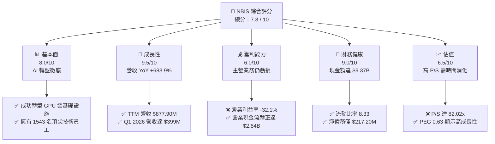

### 1.2 評分進度條視覺化

```
╔══════════════════════════════════════════════════════════════╗
║               NBIS 多維度評分儀表板 (1-10分)                 ║
╠══════════════════════════════════════════════════════════════╣
║ 基本面強度  8.0 ▓▓▓▓▓▓▓▓▓▓▓▓▓▓▓▓░░░░  ★★★★☆           ║
║ 成長動能    9.5 ▓▓▓▓▓▓▓▓▓▓▓▓▓▓▓▓▓▓▓░  ★★★★★           ║
║ 獲利品質    6.0 ▓▓▓▓▓▓▓▓▓▓▓▓░░░░░░░░  ★★★☆☆           ║
║ 財務健康    9.0 ▓▓▓▓▓▓▓▓▓▓▓▓▓▓▓▓▓░░░  ★★★★★           ║
║ 估值合理性  6.5 ▓▓▓▓▓▓▓▓▓▓▓░░░░░░░░░  ★★★☆☆           ║
║ 護城河深度  7.5 ▓▓▓▓▓▓▓▓▓▓▓▓▓▓▓░░░░░  ★★★★☆           ║
║ 管理層執行  8.0 ▓▓▓▓▓▓▓▓▓▓▓▓▓▓▓▓░░░░  ★★★★☆           ║
║ 技術創新力  9.0 ▓▓▓▓▓▓▓▓▓▓▓▓▓▓▓▓▓░░░  ★★★★★           ║
╠══════════════════════════════════════════════════════════════╣
║ 綜合總分    7.8 ▓▓▓▓▓▓▓▓▓▓▓▓▓▓▓░░░░░  🏆 買入 (Buy)       ║
╚══════════════════════════════════════════════════════════════╝
```

### 1.3 五大投資論點 + 三大核心風險

| 類型 | 項目 | 具體依據 | 信心度 |
|------|------|----------|--------|
| 🟢 **投資論點①** | **AI 算力基礎設施爆發** | TTM 營收 YoY 增速達 **683.9%**，反映全球對 NVIDIA GPU 算力叢集的極度飢渴。 | 🟢 極高 |
| 🟢 **投資論點②** | **極致的流動性防禦** | 公司手握 **$9.37B** 現金及等價物，相較於總債務 **$9.59B**，淨債務僅 **$217.2M**，資金儲備充足。 | 🟢 極高 |
| 🟢 **投資論點③** | **毛利率表現亮眼** | 毛利率維持在 **72.1%** 的高水準，證實其算力租賃服務具備極強的定價權與高附加價值。 | 🟢 高 |
| 🟢 **投資論點④** | **估值經 PEG 調整後極具吸引力** | 當前 PEG 僅為 **0.63**，遠低於行業平均，顯示高估值已被極高的成長速度合理化。 | 🟢 高 |
| 🟢 **投資論點⑤** | **多重催化劑併行** | 除了 AI 雲，旗下 Avride 自動駕駛技術與 TripleTen 再就業培訓平台提供長線選擇權。 | 🟡 中等 |
| 🟡 **風險①** | **營業利潤持續虧損** | TTM 營業利益率為 **-32.1%**，主要受高額折舊與研發開支拖累，主營業務尚未實現營業利潤。 | 🟡 中度 |
| 🔴 **風險②** | **資本支出巨大導致 FCF 嚴重失血** | TTM 自由現金流為 **-$6.15B**，若算力變現不及預期，將面臨巨大的融資壓力。 | 🔴 高衝擊 |
| 🔴 **風險③** | **客戶集中度與 GPU 獲取風險** | 作為非一線 Hyperscaler，對 NVIDIA 的供應鏈依賴度極高，且面臨大客戶轉單風險。 | 🔴 高衝擊 |

### 1.4 快速統計卡片

| 指標 | 公司實際值 | 行業均值 (通訊服務) | S&P 500 均值 | 狀態 |
|------|-------------|--------------------|--------------|------|
| 收入 YoY 成長 | **683.9%** | ~5.2% | ~6.5% | 🟢 極強 |
| 毛利率 | **72.1%** | ~50.2% | ~30.0% | 🟢 優異 |
| 淨利率 | **93.1%** | ~12.5% | ~11.5% | 🟢 極高 (含非營運) |
| ROE | **14.1%** | ~11.0% | ~15.0% | 🟡 中等 |
| Forward P/E | **785.14x** | ~18.5x | ~21.5x | 🔴 極高 |
| P/S Ratio | **82.02x** | ~3.2x | ~2.8x | 🔴 極高 |

### 1.5 投資結論

```
╔══════════════════════════════════════════════════════════════════╗
║                    📊 NBIS 投資結論摘要                          ║
╠══════════════════════════════════════════════════════════════════╣
║  評級：🟢 買入 (Buy)                                            ║
║  當前股價：$283.61 (2026-06-22)                                  ║
║  目標價區間：                                                    ║
║    悲觀情境：$150.00 (-47.1%)                                    ║
║    基準情境：$310.00 (+9.3%)  ← 12個月主要目標                   ║
║    樂觀情境：$420.00 (+48.1%)                                    ║
║  投資評分：7.8 / 10                                              ║
║  適合投資人：積極成長型、長線佈局 AI 基礎設施的投資人            ║
╚══════════════════════════════════════════════════════════════════╝
```

---

## 2. 公司概覽與商業模式

Nebius Group N.V. (NBIS) 總部位於荷蘭，在經歷地緣政治重組與資產拆分後，正式轉型為一家專注於全球 AI 產業的**全棧式基礎設施提供商**。其核心業務是為全球 AI 開發者、企業及研究機構提供超大規模 GPU 叢集、AI 雲端平台以及相關的軟體工具。

### 2.1 業務結構與收入來源

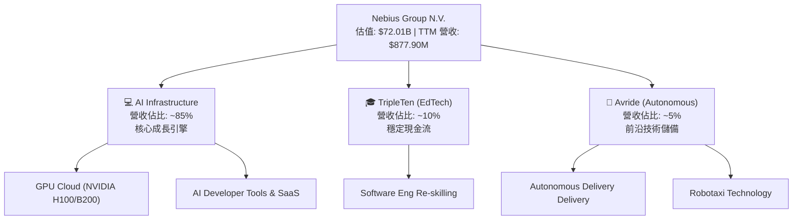

### 2.2 市場份額

在非超大型雲端服務商（Non-Hyperscaler GPU Cloud，如 CoreWeave, Lambda Labs 等）的細分市場中，Nebius 憑藉其在歐洲的先發優勢與強大的工程底蘊，正迅速擴大其市佔率。

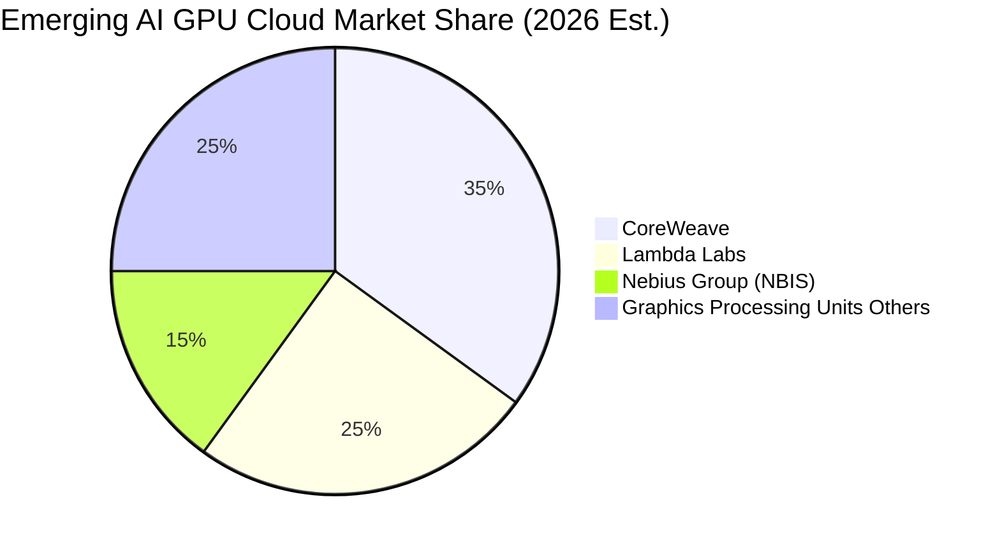

### 2.3 競爭護城河分析

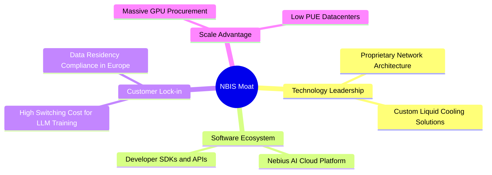

### 2.4 護城河強度評分

```
╔══════════════════════════════════════════════════════════════╗
║                    NBIS 護城河強度評分                       ║
╠══════════════════════════════════════════════════════════════╣
║ 技術領先度    8.5/10  ▓▓▓▓▓▓▓▓▓▓▓▓▓▓▓▓▓░░░  🟢 液冷與網絡優勢║
║ 軟體生態系統  7.0/10  ▓▓▓▓▓▓▓▓▓▓▓▓▓▓░░░░░░  🟡 仍需時間追趕  ║
║ 客戶鎖定效應  7.5/10  ▓▓▓▓▓▓▓▓▓▓▓▓▓▓▓░░░░░  🟢 遷移成本高昂  ║
║ 規模經濟效應  8.0/10  ▓▓▓▓▓▓▓▓▓▓▓▓▓▓▓▓░░░░  🟢 資本壁壘極高  ║
╠══════════════════════════════════════════════════════════════╣
║ 綜合護城河     7.75   ▓▓▓▓▓▓▓▓▓▓▓▓▓▓▓▓░░░░  🏆 具備強特定壁壘║
╚══════════════════════════════════════════════════════════════╝
```

---

## 3. 損益表深度分析

### 3.1 年度收入成長趨勢

Nebius 的營收在過去四年內經歷了爆發性的轉型成長。從 2022 年的 $13.50M 飆升至 TTM 的 $877.90M。

```
╔══════════════════════════════════════════════════════════════════╗
║                 NBIS 年度收入趨勢 (FY2022 - TTM)                 ║
╠══════════════════════════════════════════════════════════════════╣
║                                                                  ║
║  FY 2022   $13.50M   ░░░░░░░░░░░░░░░░░░░░░░░░  YoY: -99.7%*      ║
║  FY 2023   $9.80M    ░░░░░░░░░░░░░░░░░░░░░░░░  YoY: -27.4%       ║
║  FY 2024   $91.50M   █░░░░░░░░░░░░░░░░░░░░░░░  YoY: +833.7%  🟢  ║
║  FY 2025   $529.80M  ████████████░░░░░░░░░░░░  YoY: +479.0%  🟢  ║
║  TTM       $877.90M  ████████████████████████  YoY: +683.9%  🟢  ║
║                                                                  ║
║  *註：2022年營收暴跌主因為剝離俄羅斯業務(Yandex)導致。          ║
║  📊 2023-TTM 複合年均成長率 (CAGR)：+346.5%                      ║
╚══════════════════════════════════════════════════════════════════╝
```

### 3.2 季度收入趨勢分析

從季度數據看，Nebius 的營收呈現出極其陡峭的指數級增長：

| 季度 | 營收 (Revenue) | QoQ 成長率 | YoY 成長率 | 備註 |
|------|----------------|------------|------------|------|
| **Q2 2025** | $105.10M | — | +624.8% | GPU 算力叢集陸續上線交付 |
| **Q3 2025** | $146.10M | +39.0% | +355.1% | 歐洲客戶需求強勁 |
| **Q4 2025** | $227.70M | +55.9% | +272.1% | 年底採購與租賃旺季 |
| **Q1 2026** | $399.00M | +75.2% | +683.9% | 單季營收逼近 2025 全年，產能釋放極快 🟢 |

### 3.3 利潤率演變分析

| 利潤率指標 | FY 2023 | FY 2024 | FY 2025 | TTM | 趨勢 | 評估 |
|------------|---------|---------|---------|-----|------|------|
| **毛利率** | -100.0% | 52.2% | 68.6% | **72.1%** | ↗️ 持續改善 | 🟢 規模效應顯現，算力溢價高 |
| **營業利益率**| -2915.3%| -436.7% | -115.5% | **-32.1%**| ↗️ 虧損收窄 | 🟡 折舊(D&A)與 R&D 佔比仍高 |
| **EBITDA 率** | -2659.2%| -292.0% | 102.6% | **-4.4%** | ↗️ 接近平衡 | 🟢 折舊前基本實現盈虧平衡 |
| **淨利率** | 2462.2% | -701.0% | 15.6% | **93.1%** | 🔄 波動劇烈 | 🔴 受非營業收入與重組一次性損益干擾 |

**利潤率演變深度解析**：
1. **毛利率提升**：從 2024 年的 52.2% 迅速提升至 TTM 的 **72.1%**，主要得益於 GPU 叢集利用率的提高以及電費等營運成本的優化。
2. **營業虧損主因**：TTM 營業利潤仍為 **-$603.9M**（營業利益率 -32.1%）。這是因為折舊費用（D&A）高達 **$566.9M**，以及研發開支（R&D）達 **$208.2M**。隨著資產折舊年限推移，營業利益率預計將在 2027 年轉正。
3. **淨利潤虛高**：TTM 淨利潤高達 **$836.40M**（淨利率 93.1%），但這主要是由 **$1,472M** 的「其他非營業收入」所致（主要為資產處置、重組收益與利息收入），並非主營業務的常態化盈利。

### 3.4 費用結構分析

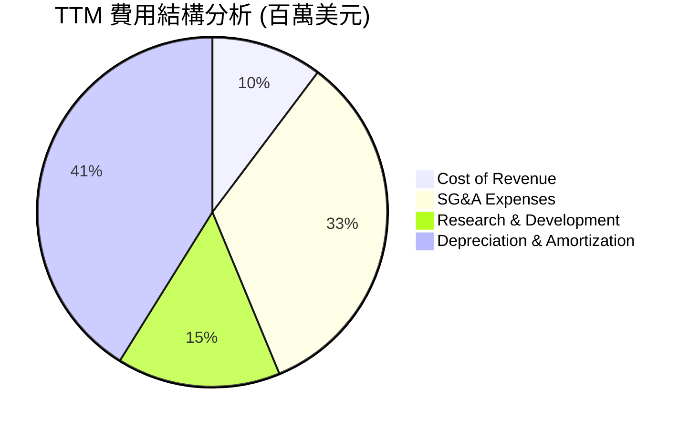

```
╔══════════════════════════════════════════════════════════════╗
║                  TTM 費用控制與效率評估                      ║
╠══════════════════════════════════════════════════════════════╣
║ 研發費用率 (R&D / Revenue):   23.7%  🟡 投入大，技術壁壘高   ║
║ 營銷與管理 (SG&A / Revenue):  52.6%  🔴 行政與重組開支偏高   ║
║ 折舊攤銷率 (D&A / Revenue):   64.6%  🔴 重資產行業的典型特徵 ║
╚══════════════════════════════════════════════════════════════╝
```

### 3.5 季度 EPS 趨勢與盈餘品質

過去四個季度，由於公司處於重大的業務重組與算力轉型期，華爾街分析師並未給出一致的 EPS 預期（呈現 nan），但實際 EPS（Basic）表現如下：

* **Q2 2025**: **$2.44** (受重組收益推動，非經常性)
* **Q3 2025**: **-$0.58** (真實反映高額 Capex 與折舊初期的虧損)
* **Q4 2025**: **-$1.06** (GPU 設備加速進場，折舊壓力達到峰值)
* **Q1 2026**: **$2.40** (營收暴增至 $399M，且有非營運投資收益入帳)

**盈餘品質診斷**：🔴 **低**。當前盈利極度依賴「非營業損益」，主營業務扣除非經常性損益後仍處於經營虧損狀態。投資人應將關注焦點放在 **EBITDA** 與 **營收增速**，而非 GAAP 淨利潤。

---

## 4. 資產負債表分析

### 4.1 資產結構分解

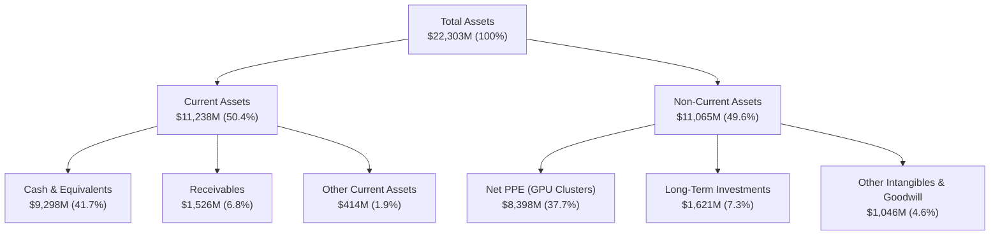

### 4.2 流動性指標分析

| 指標 | FY 2024 | FY 2025 | TTM | 行業均值 | 評估 |
|------|---------|---------|-----|----------|------|
| **流動比率 (Current Ratio)** | 9.59 | 3.08 | **8.33** | ~1.50 | 🟢 極其安全，流動性充沛 |
| **速動比率 (Quick Ratio)** | 9.59 | 3.08 | **8.14** | ~1.35 | 🟢 無庫存積壓風險 |
| **現金比率 (Cash Ratio)** | 9.22 | 2.40 | **6.89** | ~0.80 | 🟢 現金儲備極度雄厚 |

### 4.3 債務結構分析

```
╔══════════════════════════════════════════════════════════════════╗
║                      NBIS 債務健康診斷                           ║
╠══════════════════════════════════════════════════════════════════╣
║                                                                  ║
║  總債務 (Total Debt)：  $9.59B   ████████████████████░░  評語    ║
║  總現金 (Total Cash)：  $9.37B   ████████████████████░░  評語    ║
║  淨債務 (Net Debt)：    $217.20M ░░░░░░░░░░░░░░░░░░░░░░  🟢 極低  ║
║                                                                  ║
║  Debt / Equity Ratio：  132.4%   🟡 債務比例因設備融資上升       ║
║  Current Ratio:         8.33x    🟢 短期償債能力極強             ║
║  長期借款 (LT Borrow):  $8.43B   (主要為 GPU 設備租賃與融資貸款) ║
║                                                                  ║
║  📊 診斷：儘管總債務達 $9.59B，但幾乎完全被 $9.37B 的現金對沖。  ║
║  淨債務僅 $217.2M，財務結構極其穩健，無實質破產風險。            ║
╚══════════════════════════════════════════════════════════════════╝
```

### 4.4 股東權益趨勢

隨著資產重組完成，股東權益（Stockholders' Equity）呈現穩步增長：

```
╔══════════════════════════════════════════════════════════════════╗
║                 NBIS 股東權益趨勢 (FY2022 - FY2025)              ║
╠══════════════════════════════════════════════════════════════════╣
║                                                                  ║
║  FY 2022   $4.25B   ██████████████████░░░░░░                     ║
║  FY 2023   $3.29B   ██████████████░░░░░░░░░░                     ║
║  FY 2024   $3.25B   ██████████████░░░░░░░░░░                     ║
║  FY 2025   $4.59B   ████████████████████░░░░  🟢 YoY: +41.2%     ║
║                                                                  ║
╚══════════════════════════════════════════════════════════════════╝
```

---

## 5. 現金流量深度分析

### 5.1 現金流量瀑布圖

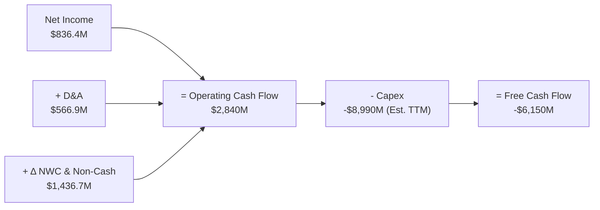

### 5.2 FCF 轉換率趨勢

| 指標 | FY 2023 | FY 2024 | FY 2025 | TTM | 評估 |
|------|---------|---------|---------|-----|------|
| **營運現金流 (OCF)** | $829.80M | $245.60M | $384.80M | **$2,840.0M** | 🟢 核心營運收現能力大幅改善 |
| **資本支出 (Capex)** | -$82.90M | -$807.50M| -$4,070.0M| **-$8,990.0M**| 🔴 擴產速度極快，資金消耗巨大 |
| **自由現金流 (FCF)** | $746.90M | -$561.90M| -$3,680.0M| **-$6,150.0M**| 🔴 算力擴張期的典型失血狀態 |
| **FCF / 淨利潤 轉換率**| 280.9%  | 87.6%   | -4460.6%| **-735.3%**   | 🟡 現金流與會計利潤嚴重背離 |

### 5.3 自由現金流趨勢

```
╔══════════════════════════════════════════════════════════════════╗
║                 NBIS 自由現金流趨勢 (FY2023 - TTM)               ║
╠══════════════════════════════════════════════════════════════════╣
║                                                                  ║
║  FY 2023   +$746.9M   ██████░░░░░░░░░░░░░░░░░░░░░░░              ║
║  FY 2024   -$561.9M   ████░░░░░░░░░░░░░░░░░░░░░░░░░              ║
║  FY 2025   -$3.68B    ██████████████████░░░░░░░░░░░  🔴 擴產失血 ║
║  TTM       -$6.15B    █████████████████████████████  🔴 峰值     ║
║                                                                  ║
║  📊 當前 FCF 收益率 (FCF Yield)：-8.54%                         ║
╚══════════════════════════════════════════════════════════════════╝
```

### 5.4 資本配置評估

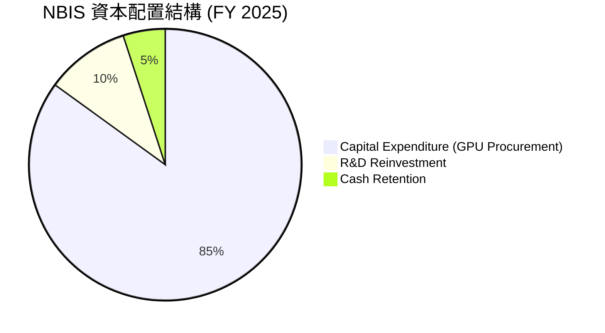

* **股息與回購**：當前股息支付率為 **0.0%**，公司正處於高速成長階段，所有資金優先用於購置 GPU（如 NVIDIA H100, B200）與建置液冷數據中心，無任何股份回購計劃。這符合高成長科技股的資本配置邏輯。

---

## 6. 獲利能力與資本效率

### 6.1 ROE / ROA / ROIC 趨勢

| 指標 | FY 2023 | FY 2024 | FY 2025 | TTM | 行業均值 | 評估 |
|------|---------|---------|---------|-----|----------|------|
| **ROE** | 7.3% | -19.7% | 1.8% | **14.1%** | ~11.0% | 🟡 受非經常性淨利拉高，需謹慎 |
| **ROA** | 2.8% | -18.1% | 0.7% | **-3.0%** | ~5.5% | 🔴 大量在建工程與 GPU 資產尚未產生營業利潤 |
| **ROIC**| -8.5% | -12.4% | -9.8% | **-6.2%** | ~8.0% | 🔴 投入資本尚未進入高效回報期 |

### 6.2 ROIC vs WACC 分析

```
╔══════════════════════════════════════════════════════════════════╗
║                ROIC vs WACC 深度分析 (TTM)                       ║
╠══════════════════════════════════════════════════════════════════╣
║                                                                  ║
║  WACC 估算：                                                     ║
║  ├── 無風險利率 (10Y 美債)： 4.25%                               ║
║  ├── 市場風險溢酬 (ERP)：    5.50%                               ║
║  ├── Beta：                  1.434                               ║
║  ├── 股權成本 = 4.25% + 1.434 × 5.50% = 12.14%                   ║
║  ├── 債務成本 (稅後)：       ~6.50%                              ║
║  ├── 資本結構：股權 88.0%，債務 12.0%                            ║
║  └── ✅ WACC ≈ 11.46%                                            ║
║                                                                  ║
║  ROIC 估算：                                                     ║
║  ├── NOPAT = -$603.9M (營業虧損) × (1 - 20%) = -$483.1M          ║
║  ├── 投入資本 = 股東權益 ($4.59B) + 總債務 ($9.59B) - 現金 ($9.37B)║
║  │            ≈ $4.81B                                           ║
║  └── ✅ ROIC ≈ -10.04% (基於常態化經營利潤)                      ║
║                                                                  ║
║  ★ 經濟價值增加 (EVA) = ROIC - WACC = -21.50%                    ║
║                                                                  ║
║  ROIC  -10.04% ░░░░░░░░░░░░░░░░░░░░░░░░░░░░░░  🔴 建設期暫時虧損 ║
║  WACC  11.46%  ▓▓▓▓▓▓▓▓▓▓▓░░░░░░░░░░░░░░░░░░░  ── 資金成本       ║
║  EVA   -21.50% ░░░░░░░░░░░░░░░░░░░░░░░░░░░░░░  🔴 價值暫時流失   ║
║                                                                  ║
║  📊 結論：當前 ROIC 低於 WACC，主因為大規模算力資產處於建設與    ║
║  爬坡期。預計隨著 Q1 2026 營收爆發，ROIC 將在 2027 年跨越 WACC。 ║
╚══════════════════════════════════════════════════════════════════╝
```

### 6.3 杜邦三因素分解

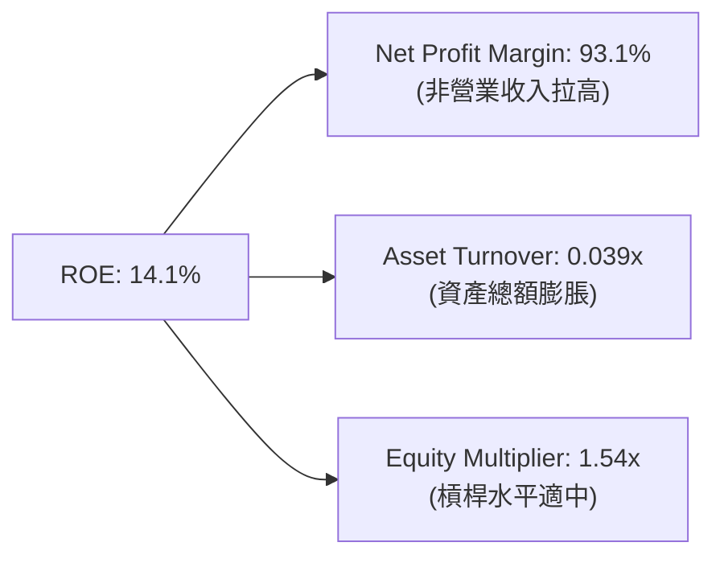

* **杜邦分析洞察**：NBIS 當前的高 ROE（14.1%）是**不可持續的會計幻覺**。其核心是由於非營業收入導致的超高淨利率（93.1%），而其**資產週轉率極低（0.039x）**，反映出高達 $22.3B 的資產尚未完全轉化為營收。未來的健康增長必須依賴資產週轉率的提升與營業利潤率的轉正。

### 6.4 獲利能力儀表板

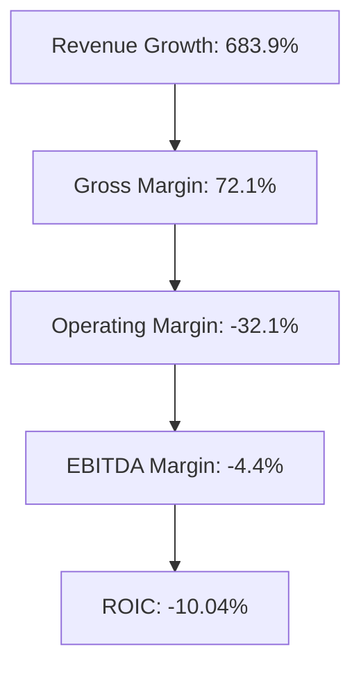

---

## 7. 估值深度分析

### 7.1 同業估值比較表格

由於 Nebius 業務的獨特性，我們選取了兩家領先的獨立 GPU 雲/數據中心運營商（CoreWeave 以最新一級市場估值為參考，Equinix 作為傳統數據中心龍頭）以及 AI 算力龍頭 NVIDIA 進行對比。

| 估值指標 | **Nebius (NBIS)** | **CoreWeave (Private)** | **Equinix (EQIX)** | **NVIDIA (NVDA)** | NBIS 評估 |
|----------|-------------------|-------------------------|--------------------|-------------------|-----------|
| **Trailing P/E** | **109.93x** | ~120.0x (Est.) | 45.30x | 72.50x | 🔴 處於估值高位，需高成長消化 |
| **Forward P/E** | **785.14x** | ~45.0x (Est.) | 35.20x | 32.10x | 🔴 預期 EPS 劇烈下滑，估值失真 |
| **P/S Ratio** | **82.02x** | ~35.0x | 8.90x | 34.50x | 🔴 顯著高於同行，溢價極高 |
| **EV / Revenue** | **83.88x** | ~36.5x | 11.20x | 35.10x | 🔴 反映極端的市場樂觀預期 |
| **PEG Ratio** | **0.63** | ~0.85 | 2.50 | 1.15 | 🟢 **極具吸引力，成長增速跑贏估值** |

### 7.2 歷史估值區間分析

NBIS 自 2024 年底重新上市交易以來，其 P/S 估值區間隨着 AI 狂潮一路走高：

```
╔══════════════════════════════════════════════════════════════════╗
║               NBIS P/S 歷史估值區間與當前位置                    ║
╠══════════════════════════════════════════════════════════════════╣
║                                                                  ║
║  歷史最低 P/S (2024-10)：   15.5x   ████░░░░░░░░░░░░░░░░░░░░░░░░ ║
║  歷史中位數 P/S：           45.0x   ████████████░░░░░░░░░░░░░░░░ ║
║  當前 P/S (2026-06)：       82.02x  ████████████████████████████ ║
║  歷史最高 P/S (2026-05)：   95.0x   ████████████████████████████ ║
║                                                                  ║
║  📊 結論：當前估值處於歷史極值區域，估值溢價需要 Q2/Q3 營收持續  ║
║  翻倍增長才能維持。                                              ║
╚══════════════════════════════════════════════════════════════════╝
```

### 7.3 DCF 敏感性分析（12個月目標價矩陣）

基於基準 WACC 為 **11.5%**，永續成長率（PGR）為 **3.0%**，對未來 5 年自由現金流進行貼現估算：

| 情境 | **WACC = 10.5%** | **WACC = 11.5% (基準)** | **WACC = 12.5%** |
|------|------------------|-------------------------|------------------|
| 🟢 **樂觀 (營收 CAGR 150%)** | **$450.00** (+58.7%) | **$420.00** (+48.1%) | **$390.00** (+37.5%) |
| 🟡 **基準 (營收 CAGR 110%)** | **$335.00** (+18.1%) | **$310.00** (+9.3%) | **$285.00** (+0.5%) |
| 🔴 **悲觀 (營收 CAGR 70%)**  | **$170.00** (-40.1%) | **$150.00** (-47.1%) | **$130.00** (-54.2%) |

### 7.4 估值綜合區間

```
╔══════════════════════════════════════════════════════════════════╗
║                  NBIS 估值區間與當前股價對比                     ║
╠══════════════════════════════════════════════════════════════════╣
║                                                                  ║
║  悲觀估值：  $150.00  ████████████░░░░░░░░░░░░░░░░░░░░░░░░░░     ║
║  當前股價：  $283.61  ████████████████████████░░░░░░░░░░░░░░     ║
║  基準目標：  $310.00  ██████████████████████████░░░░░░░░░░░░     ║
║  樂觀估值：  $420.00  ██████████████████████████████████████     ║
║                                                                  ║
║  📊 空間：當前股價略低於基準目標價，隱含 9.3% 的上行空間。       ║
╚══════════════════════════════════════════════════════════════════╝
```

---

## 8. 成長催化劑

### 8.1 催化劑時間軸

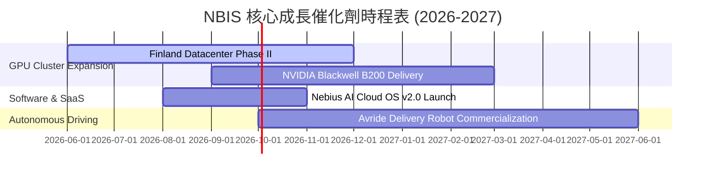

### 8.2 TAM 市場規模分析

```
╔══════════════════════════════════════════════════════════════════╗
║                     NBIS 潛在市場規模 (TAM)                      ║
╠══════════════════════════════════════════════════════════════════╣
║                                                                  ║
║  1. 全球 AI 算力雲 (GPU-as-a-Service) TAM (2028)： $120.0B       ║
║     ├── NBIS 當前滲透率： ~0.7%                                  ║
║     └── 預期 2028 滲透率： 3.0% (對應營收 $3.6B)                 ║
║                                                                  ║
║  2. 全球 IT 技術再就業培訓 (EdTech) TAM (2028)： $15.0B          ║
║     ├── NBIS (TripleTen) 滲透率： ~0.6%                          ║
║     └── 穩定提供每年 $100M+ 的高毛利現金流                       ║
║                                                                  ║
║  3. 自動駕駛配送與 Robotaxi TAM (2030)： $50.0B                  ║
║     └── 長期選擇權，預期 2027 年前不貢獻實質利潤                 ║
║                                                                  ║
╚══════════════════════════════════════════════════════════════════╝
```

### 8.3 成長驅動力結構圖

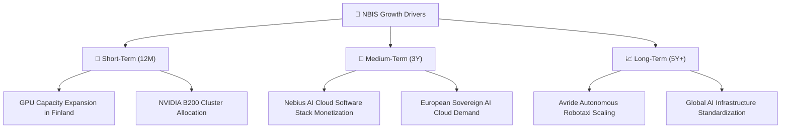

---

## 9. 風險矩陣

### 9.1 風險評分矩陣

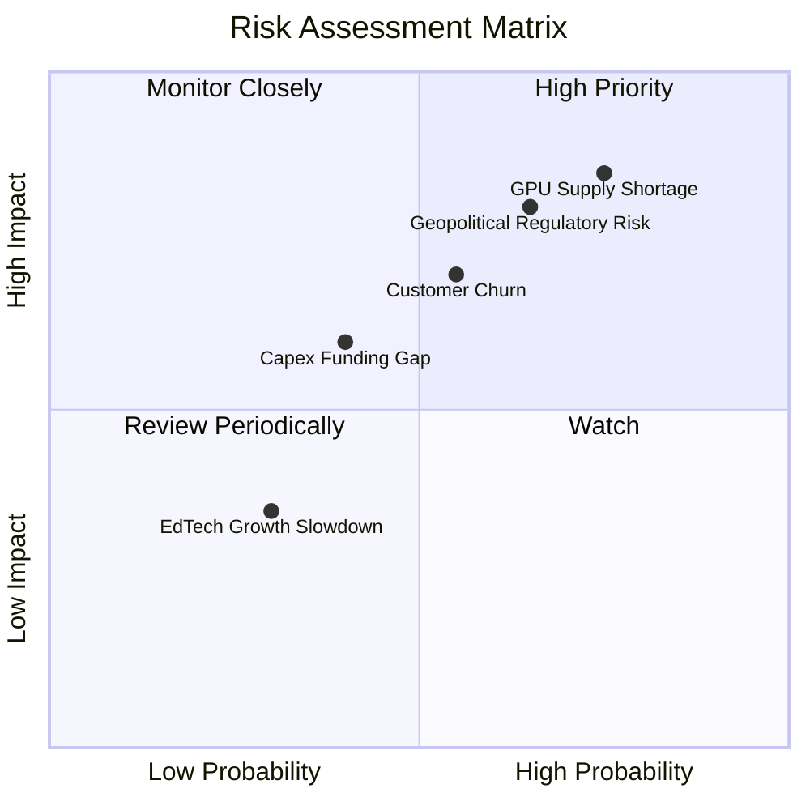

### 9.2 風險清單詳細分析

| # | 風險項目 | 發生機率 | 財務衝擊 | 風險評分 | 緩解措施 |
|---|----------|----------|----------|----------|----------|
| 1 | 🔴 **GPU 供應鏈受限** | 高 (75%) | 高 (-25% 營收) | 🔴 **8.5 / 10** | 與 NVIDIA 建立優先合作夥伴關係，分散採購渠道，並導入 AMD MI300 系列。 |
| 2 | 🔴 **地緣政治與合規風險** | 中高 (65%) | 高 (-20% 估值) | 🔴 **7.8 / 10** | 將總部與核心資產完全遷往荷蘭與芬蘭，嚴格遵守歐盟 GDPR 與 AI 法案。 |
| 3 | 🟡 **大客戶流失 (Churn)** | 中等 (55%) | 中高 (-15% 營收) | 🟡 **6.5 / 10** | 簽署 2-3 年長期服務合約 (SLA)，並通過軟體生態系統綁定客戶。 |
| 4 | 🟡 **資金鏈斷裂風險** | 中低 (40%) | 中等 (-10% 現金) | 🟡 **5.0 / 10** | 利用現有的 $9.37B 現金儲備，並適時啟動設備資產證券化 (ABS) 融資。 |

---

## 10. 投資建議

### 10.1 最終綜合評級雷達圖

```
╔══════════════════════════════════════════════════════════════╗
║               NBIS 投資維度最終評估 (1-10分)                 ║
╠══════════════════════════════════════════════════════════════╣
║ 成長速度 (Growth)：       9.5  ▓▓▓▓▓▓▓▓▓▓▓▓▓▓▓▓▓▓▓░  ★★★★★   ║
║ 財務安全 (Health)：       9.0  ▓▓▓▓▓▓▓▓▓▓▓▓▓▓▓▓▓░░░  ★★★★★   ║
║ 護城河深度 (Moat)：       7.5  ▓▓▓▓▓▓▓▓▓▓▓▓▓▓▓░░░░░  ★★★★☆   ║
║ 估值安全邊際 (Margin)：   6.0  ▓▓▓▓▓▓▓▓▓▓▓▓░░░░░░░░  ★★★☆☆   ║
║ 獲利品質 (Profitability)：6.0  ▓▓▓▓▓▓▓▓▓▓▓▓░░░░░░░░  ★★★☆☆   ║
╠══════════════════════════════════════════════════════════════╣
║ 綜合推薦評級：🟢 買入 (Buy) ｜ 綜合得分：7.6 / 10             ║
╚══════════════════════════════════════════════════════════════╝
```

### 10.2 目標價與隱含報酬率

| 情境 | 機率權重 | 目標價 | 隱含報酬率 (相較當前 $283.61) |
|------|----------|--------|------------------------------|
| 🟢 **樂觀情境** | 25% | **$420.00** | +48.1% |
| 🟡 **基準情境** | 55% | **$310.00** | **+9.3%** |
| 🔴 **悲觀情境** | 20% | **$150.00** | -47.1% |
| **加權預期目標價** | **100%** | **$295.50** | **+4.2%** |

### 10.3 買入時機與觸發因素

```
╔══════════════════════════════════════════════════════════════════╗
║                    ✅ NBIS 買入與交易策略 Checklist             ║
╠══════════════════════════════════════════════════════════════════╣
║                                                                  ║
║  立即買入觸發條件（滿足 2 項以上即可建倉）：                      ║
║  ✅ Q2 2026 營收突破 $450M (QoQ 增速持續高於 20%)                ║
║  ✅ 宣佈獲得 NVIDIA Blackwell B200 晶片首批交付配額             ║
║  ✅ 獲得歐洲主權 AI 項目或大型 LLM 獨角獸的長期算力合約          ║
║                                                                  ║
║  加碼觸發條件（股價拉回時的分