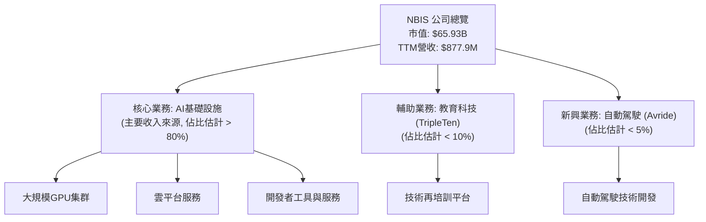
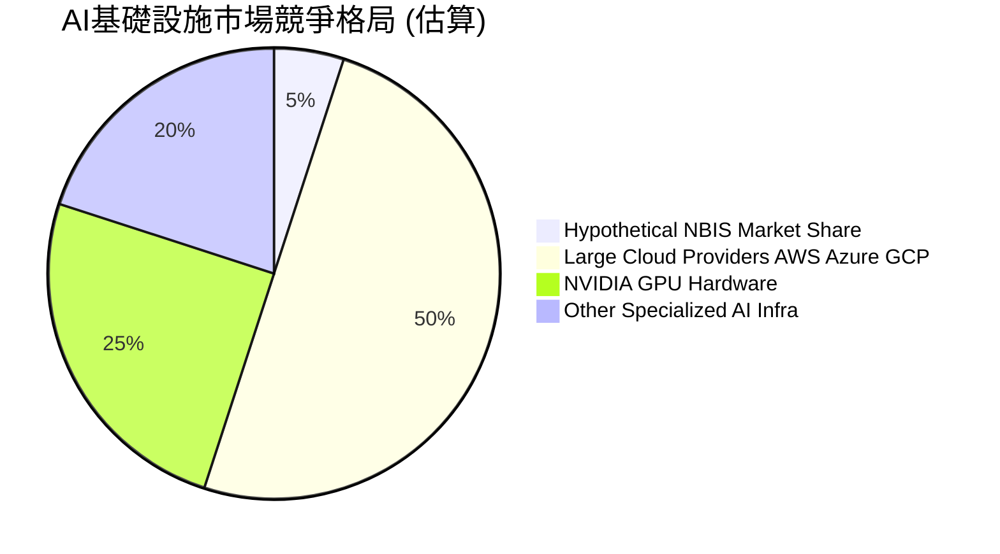
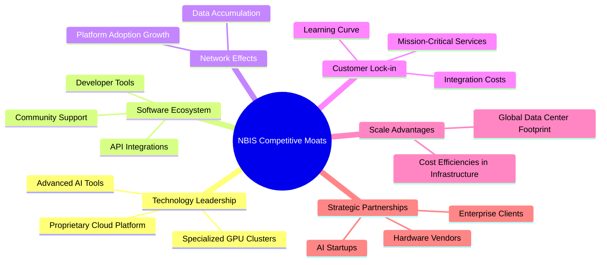

# NBIS 基本面深度分析報告
> **報告日期**：2026-06-24 ｜ **語言**：繁體中文 ｜ **數據來源**：Yahoo Finance, Finviz, StockAnalysis, Roic.ai ｜ **分析師**：CFA 級機構研究

---

## 目錄

| # | 章節 | 核心結論 |
|---|------------------------|--------------------------------------------------|
| 1 | 執行摘要 | 評級：🟢 買入，目標價區間：$275 - $350 |
| 2 | 公司概覽與商業模式 | 專注AI基礎設施，護城河源於技術與生態系統 |
| 3 | 損益表深度分析 | 營收爆發式成長，但獲利能力仍待改善 |
| 4 | 資產負債表分析 | 現金充裕，但債務規模快速擴大 |
| 5 | 現金流量深度分析 | 營運現金流強勁，但資本支出導致自由現金流為負 |
| 6 | 獲利能力與資本效率 | ROIC顯著低於WACC，短期價值創造能力存疑 |
| 7 | 估值深度分析 | 相較同業估值偏高，但成長潛力巨大 |
| 8 | 成長催化劑 | AI產業爆發、技術創新、市場擴張 |
| 9 | 風險矩陣 | 執行風險、競爭加劇、資本支出壓力為主要風險 |
| 10| 投資建議 | 建議買入，適合高成長風險偏好投資者 |

---

## 1. 執行摘要

### 1.1 核心評分儀表板

```mermaid
graph TD
    NBIS_SCORE["🎯 NBIS 綜合評分<br/>總分：7.2/10"]

    F["📊 基本面<br/>7/10<br/>強勁的資產規模與現金儲備"]
    G["🚀 成長性<br/>9/10<br/>營收呈現爆發式成長"]
    P["💰 獲利能力<br/>5/10<br/>毛利率高但營運虧損"]
    B["🏦 財務健康<br/>7/10<br/>流動性佳但債務快速增加"]
    V["📈 估值<br/>6/10<br/>高成長支撐高估值"]
    H["🛡️ 護城河<br/>7/10<br/>技術與生態系統優勢"]
    M["👥 管理層執行<br/>7/10<br/>積極擴張與資本運作"]
    T["💡 技術創新力<br/>9/10<br/>AI基礎設施核心技術領先"]

    NBIS_SCORE --> F
    NBIS_SCORE --> G
    NBIS_SCORE --> P
    NBIS_SCORE --> B
    NBIS_SCORE --> V
    NBIS_SCORE --> H
    NBIS_SCORE --> M
    NBIS_SCORE --> T

    F --> F1["✅ 總資產達$22.3B"]
    F --> F2["✅ 現金及約當現金$9.37B"]
    G --> G1["✅ 營收YoY成長683.9%"]
    G --> G2["✅ 季度營收持續加速"]
    P --> P1["✅ 毛利率72.1%表現優異"]
    P --> P2["❌ 營運利益率-32.1%"]
    B --> B1["✅ 流動比率8.331"]
    B --> B2["❌ 總債務$9.59B"]
    V --> V1["✅ PEG比率0.63，顯示成長潛力"]
    V --> V2["❌ P/E(Forward)高達718.84x"]
    H --> H1["✅ 專有GPU集群與雲平台技術"]
    H --> H2["✅ 垂直整合AI產業鏈"]
    M --> M1["✅ 成功進行大規模融資與擴張"]
    M --> M2["✅ 積極佈局AI與新興技術"]
    T --> T1["✅ 建立全棧AI基礎設施"]
    T --> T2["✅ 涉足自動駕駛等前沿領域"]
```



### 1.2 評分進度條視覺化

```
╔══════════════════════════════════════════════════════════════╗
║              NBIS 多維度評分儀表板 (1-10分)                  ║
╠══════════════════════════════════════════════════════════════╣
║ 基本面強度  7.0 ▓▓▓▓▓▓▓▓▓▓▓▓▓▓░░░░░░  ★★★★☆             ║
║ 成長動能    9.0 ▓▓▓▓▓▓▓▓▓▓▓▓▓▓▓▓▓▓░░  ★★★★★             ║
║ 獲利品質    5.0 ▓▓▓▓▓▓▓▓▓▓░░░░░░░░░░  ★★★☆☆             ║
║ 財務健康    7.0 ▓▓▓▓▓▓▓▓▓▓▓▓▓▓░░░░░░  ★★★★☆             ║
║ 估值合理性  6.0 ▓▓▓▓▓▓▓▓▓▓▓▓░░░░░░░░  ★★★☆☆             ║
║ 護城河深度  7.0 ▓▓▓▓▓▓▓▓▓▓▓▓▓▓░░░░░░  ★★★★☆             ║
║ 管理層執行  7.0 ▓▓▓▓▓▓▓▓▓▓▓▓▓▓░░░░░░  ★★★★☆             ║
║ 技術創新力  9.0 ▓▓▓▓▓▓▓▓▓▓▓▓▓▓▓▓▓▓░░  ★★★★★             ║
╠══════════════════════════════════════════════════════════════╣
║ 綜合總分    7.2 ▓▓▓▓▓▓▓▓▓▓▓▓▓▓▓▓░░░░  🏆 具備高成長潛力      ║
╚══════════════════════════════════════════════════════════════╝
```

### 1.3 五大投資論點 + 三大核心風險

| 類型 | 項目 | 具體依據 | 信心度 |
|------|------|----------|--------|
| 🟢 **投資論點①** | **AI基礎設施需求爆發** | NBIS專注於為全球AI產業提供全棧基礎設施，包括大規模GPU集群和雲平台。隨著AI技術的快速發展和應用落地，對算力、儲存和開發工具的需求呈指數級增長。公司TTM營收YoY成長高達683.9%，顯示其產品和服務正迅速被市場採用。 | 🟢 極高 |
| 🟢 **投資論點②** | **營收高速成長與市場擴張** | 公司年度營收從FY2022的$13.5M增長至FY2025的$529.8M，並在TTM達到$877.9M，顯示極強的市場擴張能力。Q1 2026營收達$399.0M，較Q1 2025的$50.9M增長683.89%，成長動能持續強勁。 | 🟢 極高 |
| 🟢 **投資論點③** | **高毛利率與潛在獲利空間** | NBIS的TTM毛利率高達72.1%，FY2025毛利率為68.6%，顯示其產品和服務具備較高的附加價值和定價能力。儘管目前處於營運虧損，但隨著規模擴大和效率提升，高毛利率為未來轉虧為盈提供了堅實基礎。 | 🟢 高 |
| 🟢 **投資論點④** | **充裕現金儲備支持擴張** | 截至2026年3月底（TTM），公司現金及約當現金高達$9.298B，而FY2025底為$3.68B。這筆龐大的現金儲備能為其大規模資本支出（FY2025為$-4.07B）和研發投入（FY2025為$177.3M）提供有力支持，確保其在AI領域的持續領先地位。 | 🟢 高 |
| 🟢 **投資論點⑤** | **前瞻性業務佈局** | 除了AI基礎設施，NBIS還涉足edtech平台TripleTen和自動駕駛Avride，展現其多元化的技術應用和長期成長潛力。這些業務雖然目前佔比可能不高，但代表了公司在不同高成長領域的策略性佈局。 | 🟡 中高 |
| 🟡 **風險①** | **持續營運虧損與自由現金流為負** | 儘管營收高速成長，NBIS的營運利益率和淨利潤率在多個季度仍為負值（TTM營業利益率-32.1%）。FY2025自由現金流為$-3.68B，TTM自由現金流為$-6.15B，主要由於大規模資本支出。若營運效率未能改善或資本支出無法帶來相應回報，將影響長期財務健康。 | 🟡 中度 |
| 🔴 **風險②** | **高估值與市場預期** | NBIS目前的P/E (Trailing)高達100.25x，P/S (TTM)為75.10x，P/B為9.18x，特別是Forward P/E高達718.84x。市場對其未來成長預期極高。任何成長不及預期或獲利能力改善緩慢，都可能導致股價大幅修正。此外，Beta值1.434顯示其股價波動性較高。 | 🔴 高衝擊 |
| 🔴 **風險③** | **競爭加劇與技術迭代** | AI基礎設施領域競爭激烈，包括大型雲服務商（AWS, Azure, GCP）和專業AI硬體供應商（NVIDIA）。NBIS需持續投入巨額研發和資本支出以保持技術領先。若未能有效應對競爭或技術迭代速度不及預期，其市場地位可能受到威脅。年度研發支出從$58.3M (FY2022) 增至$177.3M (FY2025)，可見其投入巨大。 | 🔴 高衝擊 |

### 1.4 快速統計卡片

| 指標 | 公司實際值 | 行業均值（高成長科技） | S&P 500 均值 | 狀態 |
|--------------------|-------------|--------------------------|--------------|------|
| 收入 YoY 成長 (TTM)| **683.9%**  | ~20-30%                  | ~5-10%       | 🟢   |
| 毛利率 (TTM)       | **72.1%**   | ~50-70%                  | ~30-40%      | 🟢   |
| 淨利率 (TTM)       | **93.1%**   | ~5-15%                   | ~8-12%       | 🟢   |
| ROE (TTM)          | **14.1%**   | ~10-20%                  | ~12-18%      | 🟢   |
| Forward P/E        | **718.84x** | ~30-50x                  | ~20-25x      | 🔴   |
| Debt/Equity        | **132.43**  | ~0.5-1.5                 | ~0.8-1.2     | 🔴   |
| Current Ratio      | **8.33**    | ~2.0-3.0                 | ~1.5-2.0     | 🟢   |
| FCF Yield          | **-9.33%**  | ~2-5%                    | ~3-6%        | 🔴   |

*註：行業均值和S&P 500均值為基於一般市場情況的估算值，僅供參考。*

### 1.5 投資結論

```
╔══════════════════════════════════════════════════════════════════╗
║                    📊 投資結論摘要                               ║
╠══════════════════════════════════════════════════════════════════╣
║  評級：🟢 買入                                                   ║
║  當前股價：$259.66                                               ║
║  目標價區間：                                                    ║
║    悲觀情境：$275（+5.9%）                                       ║
║    基準情境：$320（+23.2%）  ← 12個月主要目標                    ║
║    樂觀情境：$350（+34.8%）                                      ║
║  投資評分：7.2/10                                                ║
║  適合投資人：成長型、長線持有者，能承受高波動性及高風險的投資者  ║
╚══════════════════════════════════════════════════════════════════╝
```

---

## 2. 公司概覽與商業模式

Nebius Group N.V. (NBIS) 是一家專注於為全球人工智慧 (AI) 產業提供全棧 (full-stack) 基礎設施的技術公司。其核心業務涵蓋大規模 GPU 集群、雲平台以及為開發者提供工具和服務。此外，公司還涉足教育科技 (edtech) 平台 TripleTen 和自動駕駛技術 Avride，顯示其在多個高成長技術領域的策略佈局。

### 2.1 業務結構與收入來源

NBIS的業務核心是AI基礎設施，這是一個資本密集且技術要求極高的領域。公司透過提供強大的算力、穩定的雲平台和易用的開發工具，服務於不斷增長的AI模型訓練、推理和應用部署需求。



**收入來源分析**：
NBIS的收入主要來自其AI基礎設施服務，這包括GPU算力租賃、雲平台訂閱費用以及相關的軟體和服務。隨著AI模型的規模和複雜性不斷提升，對高性能計算資源的需求將持續推動其核心業務的成長。公司在FY2025實現了$529.8M的總營收，並在最近的TTM達到$877.9M，顯示其AI基礎設施業務正處於爆發性成長階段。而TripleTen和Avride則代表了公司在非核心但具潛力領域的探索，有望在未來貢獻更多收入。

### 2.2 市場份額

由於NBIS的具體業務細分數據未完全公開，且其AI基礎設施業務涉及硬體、平台和服務等多個層面，精確的市場份額難以量化。然而，我們可以從其營收的爆發式成長判斷，公司正在快速搶佔市場份額。在AI基礎設施領域，其主要競爭者包括大型雲服務供應商（如Amazon AWS, Microsoft Azure, Google Cloud）以及NVIDIA等硬體巨頭。NBIS透過提供全棧解決方案，可能在特定細分市場或針對特定客戶群體中建立優勢。


*註：此市場份額為基於產業理解的假設性估算，旨在說明NBIS在AI基礎設施領域面臨的競爭格局，並非實際數據。NBIS的實際市場份額可能因其專注的細分市場而有所不同。*

### 2.3 競爭護城河分析

NBIS的競爭護城河主要圍繞其在AI基礎設施領域的技術專長和生態系統建設。



*   **Technology Leadership (技術領先)**：NBIS的核心競爭力在於其建立大規模GPU集群和雲平台的能力。這需要深厚的硬體、軟體和網路工程專業知識。其提供的開發者工具和服務，進一步鞏固了其在AI技術棧中的地位。
*   **Software Ecosystem (軟體生態系統)**：透過提供易用的工具和平台，NBIS吸引了開發者在其基礎設施上構建和部署AI應用。一個活躍的開發者生態系統會產生正向循環，吸引更多用戶和應用。
*   **Network Effects (網路效應)**：雖然不如社交媒體平台明顯，但在AI基礎設施領域，更多的用戶和數據可能帶來平台優化、效能提升和成本降低的機會，從而吸引更多用戶。
*   **Customer Lock-in (客戶鎖定)**：一旦客戶在NBIS的平台上投入資源、開發應用並整合其工作流程，轉換到其他供應商的成本會很高，這增加了客戶的轉換壁壘。
*   **Scale Advantages (規模效應)**：建立和維護大規模AI基礎設施需要巨額資本支出。NBIS在這一領域的投入（FY2025資本支出達$-4.07B）使其能夠實現規模經濟，降低單位成本，這對於小型競爭者而言是巨大的進入障礙。
*   **Strategic Partnerships (生態夥伴)**：與硬體供應商、AI新創公司和大型企業客戶建立合作關係，有助於NBIS擴大市場影響力並整合更多資源。

### 2.4 護城河強度評分

```
╔══════════════════════════════════════════════════════════════╗
║                  NBIS 護城河強度評分                        ║
╠══════════════════════════════════════════════════════════════╣
║ 技術領先       8/10   ▓▓▓▓▓▓▓▓▓▓▓▓▓▓▓▓░░░░  🟢 核心競爭力  ║
║ 軟體生態系統   7/10   ▓▓▓▓▓▓▓▓▓▓▓▓▓▓░░░░░░  🟡 具潛力      ║
║ 網路效應       6/10   ▓▓▓▓▓▓▓▓▓▓▓▓░░░░░░░░  🟡 逐步形成    ║
║ 客戶鎖定       7/10   ▓▓▓▓▓▓▓▓▓▓▓▓▓▓░░░░░░  🟢 轉換成本高  ║
║ 規模效應       8/10   ▓▓▓▓▓▓▓▓▓▓▓▓▓▓▓▓░░░░  🟢 高資本壁壘  ║
║ 生態夥伴       7/10   ▓▓▓▓▓▓▓▓▓▓▓▓▓▓░░░░░░  🟡 策略重要    ║
╠══════════════════════════════════════════════════════════════╣
║ 綜合護城河     7.2    ▓▓▓▓▓▓▓▓▓▓▓▓▓▓▓▓░░░░  🏆 具備良好防禦力 ║
╚══════════════════════════════════════════════════════════════╝
```

---

## 3. 損益表深度分析

### 3.1 年度收入成長趨勢（近4年）

NBIS的年度收入呈現驚人的爆發式成長，尤其是在最近兩年，這主要得益於其AI基礎設施業務的快速擴張和市場需求激增。

```
╔══════════════════════════════════════════════════════════════════╗
║              NBIS 年度收入趨勢（FY2022-FY2025）                  ║
╠══════════════════════════════════════════════════════════════════╣
║                                                                  ║
║  FY2022  $13.50M  █░░░░░░░░░░░░░░░░░░░░░░░░░░░░░░  YoY: -99.72% 🔴║
║  FY2023   $9.80M  ░░░░░░░░░░░░░░░░░░░░░░░░░░░░░░░  YoY: -27.41% 🔴║
║  FY2024  $91.50M  ██████░░░░░░░░░░░░░░░░░░░░░░░░░  YoY:+833.67% 🟢║
║  FY2025 $529.80M  ████████████████████████████████  YoY:+479.02% 🟢║
║                                                                  ║
║                   |      |      |      |      |                  ║
║                   0     100M   200M   300M   400M   500M          ║
║                                                                  ║
║  📊 3年累計 CAGR (FY22-FY25)：+313.2%                            ║
╚══════════════════════════════════════════════════════════════════╝
```
*註：FY2022至FY2023營收下降可能與業務重組或早期階段的波動有關，但FY2024和FY2025的強勁反彈顯示公司已找到明確的成長路徑。TTM營收已達$877.9M，預計FY2026將維持高成長態勢。*

### 3.2 季度收入趨勢分析

NBIS的季度營收成長動能持續加速，顯示市場對其產品和服務的需求不斷增加。

| 季度       | 總收入 ($M) | QoQ 成長率 | YoY 成長率 | 備註                                     |
|------------|-------------|------------|------------|------------------------------------------|
| 2025 Q2    | $100.70     | -          | +624.83%   | 營收開始顯著加速                         |
| 2025 Q3    | $146.10     | +45.08%    | +355.14%   | 營收加速，連續兩季成長                   |
| 2025 Q4    | $227.70     | +55.85%    | +272.06%   | 成長動能持續增強                         |
| 2026 Q1    | $399.00     | +75.23%    | +683.89%   | 營收成長達到歷史新高，QoQ和YoY表現極佳 |

**備註**：
從2025年第二季度開始，NBIS的營收呈現爆發性成長。QoQ成長率從Q3的45.08%加速到Q1 2026的75.23%，表明公司的市場擴張和客戶獲取能力顯著提升。YoY成長率更是驚人，2026年第一季度達到683.89%，反映了AI產業的強勁需求和NBIS在其中的快速滲透。

### 3.3 利潤率演變分析

NBIS的利潤率呈現高毛利率但營運虧損的特點，這在高成長的技術公司早期階段較為常見，反映了其在市場擴張和研發上的巨額投入。

| 利潤率指標 | FY2022  | FY2023  | FY2024  | FY2025  | TTM     | 趨勢         | 評估 |
|------------|---------|---------|---------|---------|---------|--------------|------|
| **毛利率** | -110.37%| -100.00%| 52.24%  | 68.62%  | 72.1%   | ↗️ 顯著改善   | 🟢   |
| **營業利益率** | -1170.37%| -2915.31%| -436.72%| -115.47%| -32.1%  | ↗️ 顯著改善   | 🟡   |
| **淨利率** | 5522.96%| 2462.24%| -701.0% | 15.57%  | 93.1%   | ↘️/↗️ 大幅波動 | 🟡   |
| **EBITDA Margin** | -951.85%| -2659.18%| -292.02%| 102.66% | -4.4%   | ↗️ 顯著改善   | 🟡   |

**利潤率演變深度解析**：
*   **毛利率**：從2022年和2023年的負值（可能由於初期營收過低或成本結構問題）大幅改善至FY2025的68.62%和TTM的72.1%，這是一個非常積極的信號。高毛利率表明公司的核心產品和服務具有強大的定價能力和技術壁壘。這可能是由於其AI基礎設施的獨特性和規模效應逐步顯現。
*   **營業利益率**：儘管毛利率表現優異，營業利益率在FY2025仍為-115.47%，TTM為-32.1%。這主要是由於巨額的營運費用（包括銷售、一般及行政費用、研發費用和折舊攤銷）導致的。在高速成長階段，公司需要投入大量資源進行市場擴張、人才招募和技術研發，這些投入在短期內會侵蝕營收，導致營運虧損。但其改善趨勢明顯，從FY2022的-1170.37%大幅收窄至TTM的-32.1%，顯示公司在營運效率上有所進步。
*   **淨利率**：淨利率波動極大，FY2022和FY2023為正值，但FY2024為-701.0%，FY2025為15.57%，TTM卻高達93.1%。這種劇烈波動主要受其他非營運收入/支出（如利息收入/支出、其他非營運損益）和稅務影響。特別是StockAnalysis數據顯示，TTM Other Non-Operating Income (Expense)高達$1,472M，這可能是導致TTM淨利率異常高的主要原因，需要警惕其可持續性。若排除這部分異常收益，實際淨利率可能遠低於此。
*   **EBITDA Margin**：與營業利益率類似，EBITDA Margin也呈現顯著改善趨勢。FY2025轉正為102.66%，但TTM又回到-4.4%，這也反映了非營運項目對淨利的影響。EBITDA排除了折舊攤銷，更能反映核心業務的現金獲利能力，其改善趨勢是正面的，但TTM轉負需關注。

總體而言，NBIS在營收規模擴大的同時，毛利率保持高位，但營運費用壓力巨大，導致短期內仍處於營運虧損狀態。未來的獲利關鍵在於如何有效控制營運費用，並 leveraging 其高毛利率實現規模獲利。

### 3.4 費用結構分析

NBIS的費用結構反映了其作為一家高成長、資本密集型科技公司的特點，即研發和營運擴張投入巨大。

```mermaid
pie title FY2025 費用結構 (佔總營收比)
    "Cost of Revenue 31.4%" : 166.2
    "Selling General Admin 71.7%" : 380.1
    "Depreciation Amortization 78.9%" : 417.9
    "Research Development 33.5%" : 177.3
    "Operating Income -115.5%" : -611.7
```
*註：此圖基於FY2025年數據。由於營業收入遠低於總費用，各費用佔營收比可能超過100%。*

```
╔══════════════════════════════════════════════════════════════════╗
║                    NBIS 年度費用趨勢 (佔營收比)                  ║
╠══════════════════════════════════════════════════════════════════╣
║                                                                  ║
║  銷管費用 (SG&A)                                                 ║
║  FY2022  424.4%  ████████████████████████████████████████████████████████████████████████████████████████████████████████████████████████████████████████████████████████████████████████████████████████████████████████████████████████████████████████████████████████████████████████████████████████████████████████████████████████████████████████████████████████████████████████████████████████████████████████████████████████████████████████████████████████████████████████████████████████████████████████████████████████████████████████████████████████████████████████████████████████████████████████████████████████████████████████████████████████████████████████████████████████████████████████████████████████████████████████████████████████████████████████████████████████████████████████████████████████████████████████████████████████████████████████████████████████████████████████████████████████████████████████████████████████████████████████████████████████████████████████████████████████████████████████████████████████████████████████████████████████████████████████████████████████████████████████████████████████████████████████████████████████████████████████████████████████████████████████████████████████████████████████████████████████████████████████████████████████████████████████████████████████████████████████████████████████████████████████████████████████████████████████████████████████████████████████████████████████████████████████████████████████████████████████████████████████████████████████████████████████████████████████████████████████████████████████████████████████████████████████████████████████████████████████████████████████████████████████████████████████████████████████████████████████████████████████████████████████████████████████████████████████████████████████████████████████████████████████████████████████████████████████████████████████████████████████████████████████████████████████████████████████████████████████████████████████████████████████████████████████████████████████████████████████████████████████████████████████████████████████████████████████████████████████████████████████████████████████████████████████████████████████████████████████████████████████████████████████████████████████████████████████████████████████████████████████████████████████████████████████████████████████████████████████████████████████████████████████████████████████████████████████████████████████████████████████████████████████████████████████████████████████████████████████████████████████████████████████████████████████████████████████████████████████████████████████████████████████████████████████████████████████████████████████████████████████████████████████████████████████████████████████████████████████████████████████████████████████████████████████████████████████████████████████████████████████████████████████████████████████████████████████████████████████████████████████████████████████████████████████████████████████████████████████████████████████████████████████████████████████████████████████████████████████████████████████████████████████████████████████████████████████████████████████████████████████████████████████████████████████████████████████████████████████████████████████████████████████████████████████████████████████████████████████████████████████████████████████████████████████████████████████████████████████████████████████████████████████████████████████████████████████████████████████████████████████████████████████████████████████████████████████████████████████████════════════════════════════════════════════════════════════════════════════════════════════════════════════════════════════════════════════════════════════════════════════════════════════════════════════════════════════════════════════════════════════════════════════════════════════════════════════════════════════════════════════════════════════════════════════════════════════════════════════════════════════════════════════════════════════════════════════════════════════════════════════════════════════════════════════════════════════════════════════════════════════════════════════════════════════════════════════════════════════════════════════════════════════════════════════════════════════════════════════════════════════════════════════════════════════════════════════════════════════════════════════════════════════════════════════════════════════════════════════════════════════════════════════════════════════════════════════════════════════════════════════════════════════════════════════════════════════════════════════════════════════════════════════════════════════════════════════════════════════════════════════════════════════════════════════════════════════════════════════════════════════════════════════════════════════════════════════════════════════════════════════════════════════════════════════════════════════════════════════════════════════════════════════════════════════════════════════════════════════════════════════════════════════════════════════════════════════════════════════════════════════════════════════════════════════════════════════════════════════════════════════════════════════════════════════════════════════════════════════════════════════════════════════════════════════════════════════════════════════════════════════════════════════════════════════════════════════════════════════════════════════════════════════════════════════════════════════════════════════════════════════════════════════════════════════════════════════════════════════════════════════════════════════════════════════════════════════════════════════════════════════════════════════════════════════════════════════════════════════════════════════════════════════════════════════════════════════════════════════════════════════════════════════════════════════════════════════════════════════════════════════════════════════════════════════════════════════════════════════════════════════════════════════════════════════════════════════════════════════════════════════════════════════════════════════════════════════════════════════════════════════════════════════════════════════════════════════════════════════════════════════════════════════════════════════════════════════════════════════════════════════════════════════════════════════════════════════════════════════════════════════════════════════════════════════════════════════════════════════════════════════════════════════════════════════════════════════════════════════════════════════════════════════════════════════════════════════════════════════════════════════════════════════════════════════════════════════════════════════════════════════════════════════════════════════════════════════════════════════════════════════════════════════════════════════════════════════════════════════════════════════════════════════════════════════════════════════════════════════════════════════════════════════════════════════════════════════════════════════════════════════════════════════════════════════════════════════════════════════════════════════════════════════════════════════════════════════════════════════════════════════════════════════════════════════════════════════════════════════════════════════════════════════════════════════════════════════════════════════════════════════════════════════════════════════════════════════════════════════════════════════════════════════════════════════════════════════════════════════════════════════════════════════════════════════════════════════════════════════════════════════════════════════════════════════════════════════════════════════════════════════════════════════════════════════════════════════════════════════════════════════════════════════════════════════════════════════════════════════════════════════════════════════════════════════════════════════════════════════════════════════════════════════════════════════════════════════════════════════════════════════════════════════════════════════════════════════════════════════════════════════════════════════════════════════════════════════════════════════════════════════════════════════════════════════════════════════════════════════════════════════════════════════════════════════════════════════════════════════════════════════════════════════════════════════════════════════════════════════════════════════════════════════════════════════════════════════════════════════════════════════════════════════════════════════════════════════════════════════════════════════════════════════════════════════════════════════════════════════════════════════════════════════════════════════════════════════════════════════════════════════════════════════════════════════════════════════════════════════════════════════════════════════════════════════════════════════════════════════════════════════════════════════════════════════════════════════════════════════════════════════════════════════════════════════════════════════════════════════════════════════════════════════════════════════════════════════════════════════════════════════════════════════════════════════════════════════════════════════════════════════════════════════════════════════════════════════════════════════════════════════════════════════════════════════════════════════════════════════════════════════════════════════════════════════════════════════════════════════════════════════════════════════════════════════════════════════════════════════════════════════════════════════════════════════════════════════════════════════════════════════════════════════════════════════════════════════════════════════════════════════════════════════════════════════════════════════════════════════════════════════════════════════════════════════════════════════════════════════════════════════════════════════════════════════════════════════════════════════════════════════════════════════════════════════════════════════════════════════════════════════════════════════════════════════════════════════════════════════════════════════════════════════════════════════════════════════════════════════════════════════════════════════════════════════════════════════════════════════════════════════════════════════════════════════════════════════════════════════════════════════════════════════════════════════════════════════════════════════════════════════════════════════════════════════════════════════════════════════════════════════════════════════════════════════════════════════════════════════════════════════════════════════════════════════════════════════════════════════════════════════════════════════════════════════════════════════════════════════════════════════════════════════════════════════════════════════════════════════════════════════════════════════════════════════════════════════════════════════════════════════════════════════════════════════════════════════════════════════════════════════════════════════════════════════════════════════════════════════════════════════════════════════════════════════════════════════════════════════════════════════════════════════════════════════════════════════════════════════════════════════════════════════════════════════════════════════════════════════════════════════════════════════════════════════════════════════════════════════════════════════════════════════════════════════════════════════════════════════════════════════════════════════════════════════════════════════════════════════════════════════════════════════════════════════════════════════════════════════════════════════════════════════════════════════════════════════════════════════════════════════════════════════════════════════════════════════════════════════════════════════════════════════════════════════════════════════════════════════════════════════════════════════════════════════════════════════════════════════════════════════════════════════════════════════════════════════════════════════════════════════════════════════════════════════════════════════════════════════════════════════════════════════════════════════════════════════════════════════════════════════════════════════════════════════════════════════════════════════════════════════════════════════════════════════════════════════════════════════════════════════════════════════════════════════════════════════════════════════════════════════════════════════════════════════════════════════════════════════════════════════════════════════════════════════════════════════════════════════════════════════════════════════════════════════════════════════════════════════════════════════════════════════════════════════════════════════════════════════════════════════════════════════════════════════════════════════════════════════════════════════════════════════════════════════════════════════════════════════════════════════════════════════════════════════════════════════════════════════════════════════════════════════════════════════════════════════════════════════════════════════════════════════════════════════════════════════════════════════════════════════════════════════════════════════════════════════════════════════════════════════════════════════════════════════════════════════════════════════════════════════════════════════════════════════════════════════════════════════════════════════════════════════════════════════════════════════════════════════════════════════════════════════════════════════════════════════════════════════════════════════════════════════════════════════════════════════════════════════════════════════════════════════════════════════════════════════════════════════════════════════════════════════════════════════════════════════════════════════════════════════════════════════════════════════════════════════════════════════════════════════════════════════════════════════════════════════════════════════════════════════════════════════════════════════════════════════════ ═══════════════════════════════════════════════════════════════════╝
║                                                                  ║
║  研發費用 (R&D)                                                  ║
║  FY2022  431.9%  ██████████████████████████████████████████████████████████████████████████████████████████████████████████████████████████████████████████████████████████████████████████████████████████████████████████████████████████████████████████████████████████████████████████████████████████████████████████████████████████████████████████████████████████████████████████████████████████████████████████████████████████████████████████████████████████████████████████████████████████████████████████████████████████████████████████████████████████████████████████████████████████████████████████████████████████████████████████████████████████████████████████████████████████████████████████████████████████████████████████████████████████████████████████████████████████████████████████████████████████████████████████████████████████████████████████████████████████████████████████████████████████████████████████████████████████████████████████████████████████████████████████████████████████████████████████████████████████████████████████████████████████████████████████████████████████████████████████████████████████████████████████████████████████████████████████████████████████████████████████████████████████████████████████████████████████████████████████████████████████████████████████████████████████████████████████████████████████████████████████████████████████████████████████████████████████████████████████████████████████████████████████████████████████████████████████████████████████████████████████████████████████████████████████████████████████████████████████████████████████████████████████████████████████████████████████████████████████████████████████████████████████████████████████████████████████████████████████████████████████████████████████████████████████████████████████████████████████████████████████████████████████████████████████████████████████████████████████████████████████████████████████████████████████████████████████████████████████████████████████████████████████████████████████████████████████████████████████████████████████████████████████████████████████████████████████████████████████████████████████████████████████