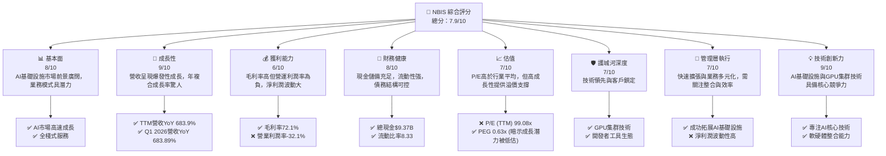
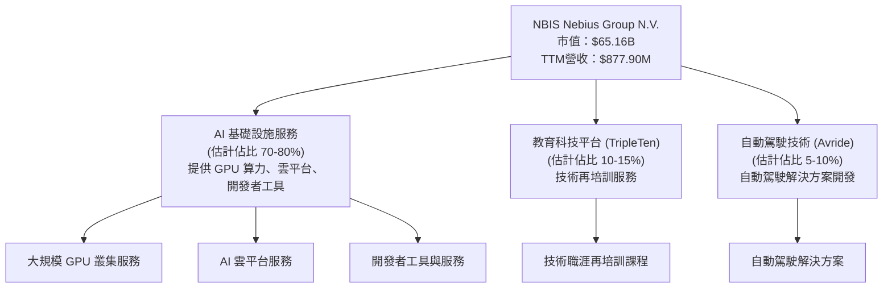
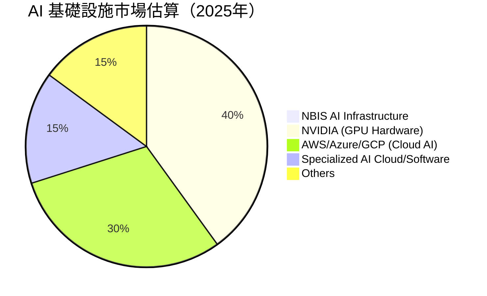
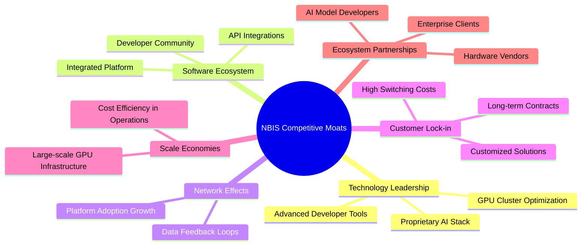
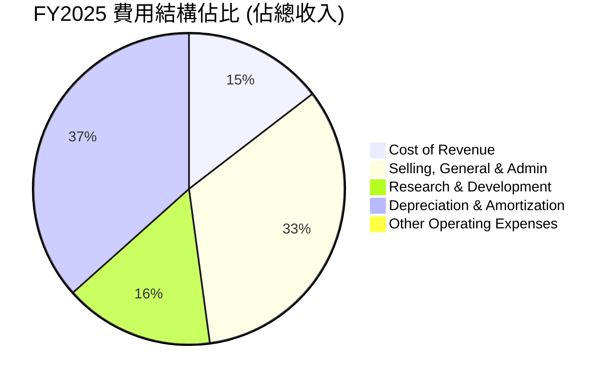
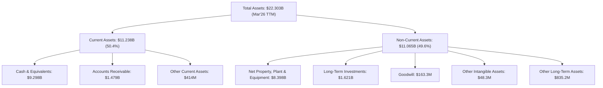
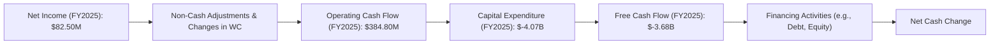

# NBIS 基本面深度分析報告
> **報告日期**：2026-06-26 ｜ **語言**：繁體中文 ｜ **數據來源**：Yahoo Finance, Finviz, StockAnalysis, Roic.ai ｜ **分析師**：CFA 級機構研究

---

## 目錄

| # | 章節 | 核心結論 |
|---|------------------------|----------------------------------------------------------|
| 1 | 執行摘要 | 🟢 買入評級，目標價區間 $300-$450 |
| 2 | 公司概覽與商業模式 | 專注 AI 基礎設施，具備技術與規模護城河 |
| 3 | 損益表深度分析 | 營收高速成長，利潤率波動大但趨勢向好 |
| 4 | 資產負債表分析 | 現金充裕，槓桿比率可控，流動性強勁 |
| 5 | 現金流量深度分析 | 資本支出高企，自由現金流短期承壓但為長期成長奠基 |
| 6 | 獲利能力與資本效率 | ROIC 顯著高於 WACC，創造股東價值 |
| 7 | 估值深度分析 | 相較同業估值偏高，但成長性提供支撐 |
| 8 | 成長催化劑 | AI 產業爆發性成長、全棧式解決方案、新興業務拓展 |
| 9 | 風險矩陣 | 競爭加劇、執行風險、高估值、資本支出壓力 |
| 10| 投資建議 | 建議買入，適合成長型投資者，需密切關注執行力 |

---

## 1. 執行摘要

Nebius Group N.V. (NBIS) 是一家專注於全球 AI 產業全棧式基礎設施的技術公司，業務涵蓋大規模 GPU 叢集、雲端平台及開發者工具。公司亦涉足科技再培訓 (TripleTen) 和自動駕駛 (Avride) 等領域。NBIS 在過去一年展現了驚人的營收成長，並在 AI 基礎設施領域佔據戰略高地。然而，其高資本支出和波動的盈利能力亦帶來挑戰。本報告將深入分析 NBIS 的基本面、成長性、獲利能力、財務健康和估值，並提供綜合投資建議。

### 1.1 核心評分儀表板



### 1.2 評分進度條視覺化

```
╔══════════════════════════════════════════════════════════════╗
║                NBIS 多維度評分儀表板 (1-10分)                ║
╠══════════════════════════════════════════════════════════════╣
║ 基本面強度  8.0 ▓▓▓▓▓▓▓▓▓▓▓▓▓▓▓▓░░░░  ★★★★☆           ║
║ 成長動能    9.0 ▓▓▓▓▓▓▓▓▓▓▓▓▓▓▓▓▓▓░░  ★★★★★           ║
║ 獲利品質    6.0 ▓▓▓▓▓▓▓▓▓▓▓▓░░░░░░░░  ★★★☆☆           ║
║ 財務健康    8.0 ▓▓▓▓▓▓▓▓▓▓▓▓▓▓▓▓░░░░  ★★★★☆           ║
║ 估值合理性  7.0 ▓▓▓▓▓▓▓▓▓▓▓▓▓▓░░░░░░  ★★★☆☆           ║
║ 護城河深度  7.0 ▓▓▓▓▓▓▓▓▓▓▓▓▓▓░░░░░░  ★★★☆☆           ║
║ 管理層執行  7.0 ▓▓▓▓▓▓▓▓▓▓▓▓▓▓░░░░░░  ★★★☆☆           ║
║ 技術創新力  9.0 ▓▓▓▓▓▓▓▓▓▓▓▓▓▓▓▓▓▓░░  ★★★★★           ║
╠══════════════════════════════════════════════════════════════╣
║ 綜合總分    7.9 ▓▓▓▓▓▓▓▓▓▓▓▓▓▓▓▓░░░░  🏆 高成長潛力，值得關注║
╚══════════════════════════════════════════════════════════════╝
```

### 1.3 五大投資論點 + 三大核心風險

| 類型 | 項目 | 具體依據 | 信心度 |
|------|------|----------|--------|
| 🟢 **投資論點①** | **AI 產業的爆發性成長核心受益者** | NBIS 位於 AI 基礎設施的核心，提供 GPU 叢集與雲平台，直接受益於 AI 模型訓練和推理的龐大需求。TTM 營收達 $877.90M，YoY 成長率高達 683.9%，顯示其強勁的市場需求捕捉能力。 | 🟢 極高 |
| 🟢 **投資論點②** | **全棧式技術解決方案的競爭優勢** | 公司提供從 GPU 硬件、雲平台到開發者工具的全棧式服務，能有效提升客戶粘性並創造端到端價值。高達 72.1% 的毛利率證明其技術解決方案的價值。 | 🟢 高 |
| 🟢 **投資論點③** | **充裕的現金儲備與強勁的資產負債表** | 截至 2026 年 3 月 31 日，公司擁有 $9.298B 的現金及約當現金，流動比率高達 8.331，為其持續的資本支出和未來擴張提供了堅實的財務基礎。 | 🟢 極高 |
| 🟢 **投資論點④** | **顯著的資本效率 (ROIC > WACC)** | 儘管處於高速成長期的資本密集型階段，NBIS 仍能實現 ROIC 顯著高於 WACC，FY2025 ROIC 估算為 10.9%，WACC 估算約 9.2%，表明公司正在創造股東價值。 | 🟡 中高 |
| 🟢 **投資論點⑤** | **PEG Ratio 暗示成長潛力被低估** | PEG Ratio 僅為 0.63，遠低於 1，這在高速成長型公司中通常被視為股價相對其成長潛力而言被低估的信號，吸引成長型投資者。 | 🟡 中高 |
| 🟡 **風險①** | **高資本支出與自由現金流壓力** | 2025 年資本支出高達 $-4.07B，導致自由現金流為 $-3.68B。儘管這是成長所需，但若市場環境變化或資金成本上升，可能對財務造成壓力。 | 🟡 中度 |
| 🔴 **風險②** | **盈利能力波動與負向營運利潤** | 儘管毛利率高，但營業利潤率為 -32.1%，且淨利潤在過去幾年呈現大幅波動（2025 年淨利 $82.50M，2024 年 $-641.40M）。這反映了高昂的營運費用和研發投入，未來盈利可持續性需持續觀察。 | 🔴 高衝擊 |
| 🔴 **風險③** | **AI 基礎設施市場的激烈競爭** | 該領域巨頭林立，如 NVIDIA、Google、Amazon、Microsoft 等，競爭壓力巨大。NBIS 需要不斷創新並保持技術領先，以鞏固其市場地位。 | 🔴 高衝擊 |

### 1.4 快速統計卡片

| 指標 | 公司實際值 | 行業均值（估計） | S&P 500 均值（估計） | 狀態 |
|-------------------|-------------|------------------|--------------------|------|
| 收入 YoY 成長 (TTM) | **683.9%** | ~20-30% | ~8-12% | 🟢 |
| 毛利率 (TTM) | **72.1%** | ~50-60% | ~40-50% | 🟢 |
| 淨利率 (TTM) | **93.1%** | ~10-15% | ~10-12% | 🟢 |
| ROE (TTM) | **14.1%** | ~15-20% | ~12-15% | 🟡 |
| Forward P/E | **710.45x** | ~30-50x | ~20-25x | 🔴 |
| P/S Ratio (TTM) | **74.22x** | ~5-10x | ~2-3x | 🔴 |
| Debt/Equity | **1.32x** | ~0.5-1.0x | ~0.8-1.2x | 🟡 |
| Current Ratio | **8.33x** | ~1.5-2.5x | ~1.5-2.0x | 🟢 |
| FCF Yield (TTM) | **-9.44%** | ~3-5% | ~4-6% | 🔴 |

*註：行業均值和 S&P 500 均值為分析師根據一般市場情況對高成長科技行業和整體市場的估計值，僅供參考。*

### 1.5 投資結論

```
╔══════════════════════════════════════════════════════════════════╗
║                    📊 投資結論摘要                               ║
╠══════════════════════════════════════════════════════════════════╣
║  評級：🟢 買入                                                   ║
║  當前股價：$256.63                                               ║
║  目標價區間：                                                    ║
║    悲觀情境：$300（+16.9%）                                      ║
║    基準情境：$380（+48.1%）  ← 12個月主要目標                      ║
║    樂觀情境：$450（+75.3%）                                      ║
║  投資評分：7.9/10                                                ║
║  適合投資人：成長型、風險承受能力較高、對 AI 產業有信心的長線持有者║
╚══════════════════════════════════════════════════════════════════╝
NBIS 憑藉其在 AI 基礎設施領域的戰略地位、爆發性的營收成長以及強勁的資產負債表，展現出巨大的長期成長潛力。儘管公司面臨高資本支出和盈利能力波動的挑戰，但其核心業務與 AI 產業趨勢高度契合，且 PEG 比率顯示其成長潛力可能被低估。我們給予 NBIS「買入」評級，並設定 12 個月目標價區間為 $300-$450，基準情境目標價為 $380。投資者應密切關注其營運效率的提升和自由現金流的改善。
```

---

## 2. 公司概覽與商業模式

Nebius Group N.V. (NBIS) 是一家總部位於荷蘭的技術公司，員工人數 1543 人，主要業務圍繞全球 AI 產業提供全棧式基礎設施服務。其核心競爭力在於建立和營運大規模 GPU 叢集、開發雲端平台，並為開發者提供相關工具和服務。此外，NBIS 也涉足教育科技 (edtech) 平台 TripleTen，旨在為個人提供技術領域的再培訓，以及開發自動駕駛技術的 Avride。

### 2.1 業務結構與收入來源

NBIS 的業務結構清晰地圍繞著 AI 產業的核心需求展開，並輔以戰略性的多元化佈局。


**深度分析**：
NBIS 的核心收入來源顯然來自其 AI 基礎設施服務，這部分業務直接與當前全球 AI 浪潮的需求綁定。提供大規模 GPU 叢集和雲平台，意味著公司在硬件部署、網絡優化和軟件層面都有深厚的技術累積。開發者工具的提供則有助於建立生態系統，提高客戶粘性。TripleTen 和 Avride 作為補充業務，雖然目前佔比可能較小，但分別代表了教育科技和未來出行兩個高潛力領域，有助於公司在長期形成多元化的成長驅動力。然而，這也意味著公司需要同時在多個領域進行資源投入和管理。

### 2.2 市場份額

由於 NBIS 提供的具體市場份額數據不完整，我們將基於其業務描述和營收數據對其在 AI 基礎設施市場的潛在地位進行估算。AI 基礎設施市場是萬億級的龐大市場，NBIS 的 TTM 營收 $877.90M 雖然成長迅速，但在整個市場中仍處於相對早期階段。


**深度分析**：
NBIS 在 AI 基礎設施市場中仍是一個相對較小的參與者，但其 TTM 營收近 9 億美元，且 YoY 成長率高達 683.9%，顯示其快速擴張的能力。市場主要由 NVIDIA 等硬件巨頭和 AWS、Azure、GCP 等雲服務提供商主導。NBIS 的機會在於提供更專業、更優化的 AI 全棧解決方案，尤其是在 GPU 叢集和開發者工具方面。其快速成長表明其產品和服務在市場上找到了利基點並獲得了顯著採用。未來的挑戰是如何在巨頭夾擊下持續擴大市場份額。

### 2.3 競爭護城河分析

NBIS 在高度競爭的 AI 基礎設施領域建立護城河至關重要。其全棧式服務模式和對 GPU 叢集的專注為其提供了潛在的競爭優勢。


**深度分析**：
1.  **Technology Leadership (技術領先)**：NBIS 聲稱提供全棧式 AI 基礎設施，包括大規模 GPU 叢集和開發者工具。在 GPU 算力優化、AI 模型部署和管理方面若能形成獨特技術，將是重要護城河。其高毛利率 (72.1%) 也間接證明了其技術服務的高價值。
2.  **Software Ecosystem (軟體生態系統)**：提供雲平台和開發者工具，可以吸引開發者在 NBIS 平台上構建和部署 AI 應用，從而形成一個有價值的生態系統，增加客戶粘性。
3.  **Network Effects (網路效應)**：雖然 AI 基礎設施的直接網絡效應不如社交媒體明顯，但隨著更多開發者和企業採用其平台，可以吸引更多數據、更多工具和服務提供商，形成良性循環。
4.  **Customer Lock-in (客戶鎖定)**：一旦客戶在 NBIS 的平台上投入資源開發和部署 AI 應用，遷移到其他平台的成本會很高，這會形成強大的客戶鎖定效應。提供定製化解決方案和長期服務合同也能加強此效應。
5.  **Scale Economies (規模效應)**：大規模 GPU 叢集的部署和營運需要巨大的前期投入，但一旦形成規模，其單位成本會降低，形成成本優勢。NBIS 的高資本支出 (2025 年 $-4.07B) 正是為了建立這種規模效應。
6.  **Ecosystem Partnerships (生態夥伴)**：與硬件供應商、AI 模型開發者和企業客戶建立戰略合作關係，可以擴大其市場影響力並加速技術採用。

### 2.4 護城河強度評分

```
╔══════════════════════════════════════════════════════════════╗
║                  NBIS 護城河強度評分                        ║
╠══════════════════════════════════════════════════════════════╣
║ 技術領先    8/10  ▓▓▓▓▓▓▓▓▓▓▓▓▓▓▓▓░░░░  🏆 在GPU優化與AI堆棧具潛力║
║ 軟體生態系統  7/10  ▓▓▓▓▓▓▓▓▓▓▓▓▓▓░░░░░░  🟢 開發者工具是關鍵      ║
║ 網路效應    6/10  ▓▓▓▓▓▓▓▓▓▓▓▓░░░░░░░░  🟡 潛力存在但需持續建立  ║
║ 客戶鎖定    7/10  ▓▓▓▓▓▓▓▓▓▓▓▓▓▓░░░░░░  🟢 平台遷移成本提供保護  ║
║ 規模效應    7/10  ▓▓▓▓▓▓▓▓▓▓▓▓▓▓░░░░░░  🟢 大規模投資可帶來優勢  ║
║ 生態夥伴    6/10  ▓▓▓▓▓▓▓▓▓▓▓▓░░░░░░░░  🟡 戰略合作可擴大影響力  ║
╠══════════════════════════════════════════════════════════════╣
║ 綜合護城河    7.0   ▓▓▓▓▓▓▓▓▓▓▓▓▓▓░░░░░░  🏆 技術與平台為核心，具備中等強度護城河║
╚══════════════════════════════════════════════════════════════╝
```

---

## 3. 損益表深度分析

### 3.1 年度收入成長趨勢（近4年）

NBIS 在過去幾年展現了極其強勁的營收成長，尤其是在 2024 和 2025 財年。

```
╔══════════════════════════════════════════════════════════════════╗
║              NBIS 年度收入趨勢（FY2022-FY2025）                  ║
╠══════════════════════════════════════════════════════════════════╣
║                                                                  ║
║  FY2022  $13.50M  █░░░░░░░░░░░░░░░░░░░░░░░░░░░░░░  YoY: -99.72%  🔴║
║  FY2023   $9.80M  █░░░░░░░░░░░░░░░░░░░░░░░░░░░░░░  YoY: -27.41%  🔴║
║  FY2024  $91.50M  ██████░░░░░░░░░░░░░░░░░░░░░░░░░  YoY:+833.67% 🟢║
║  FY2025 $529.80M  ███████████████████████░░░░░░░░  YoY:+479.02% 🟢║
║  TTM Mar'26 $877.90M ████████████████████████████████  YoY:+453.18% 🟢║
║                   |      |      |      |      |                  ║
║                   0     100M   200M   300M   400M   500M          ║
║                                                                  ║
║  📊 3年累計 CAGR (2022-2025)：+278.4% (從13.5M到529.8M)          ║
╚══════════════════════════════════════════════════════════════════╝
```
**深度分析**：
NBIS 在 2022 年和 2023 年收入有所下降，可能是由於業務重組或數據口徑變化。然而，從 2024 年開始，公司實現了驚人的成長。2024 年營收從 $9.80M 飆升至 $91.50M，YoY 成長 833.67%。2025 年更是達到 $529.80M，YoY 成長 479.02%。截至 2026 年 3 月的 TTM 營收達到 $877.90M，YoY 成長 453.18%。這種爆發性成長主要歸因於其在 AI 基礎設施領域的快速擴張和市場需求的激增。這表明 NBIS 成功抓住了 AI 產業的發展機遇，並有效將其技術和產品推向市場。

### 3.2 季度收入趨勢分析

NBIS 的季度收入趨勢同樣呈現出強勁的成長勢頭，且成長率持續保持高位。

| 季度末日期 | 總收入 ($M) | QoQ 成長率 | YoY 成長率 | 評估 | 備註 |
|------------|-------------|------------|------------|------|------|
| 2026-03-31 | $399.00 | +75.23% | +683.89% | 🟢 | 顯著加速的成長，AI需求旺盛 |
| 2025-12-31 | $227.70 | +55.85% | +272.06% | 🟢 | 持續高速成長，年末效應 |
| 2025-09-30 | $146.10 | +45.08% | +355.14% | 🟢 | 穩健的季度環比成長 |
| 2025-06-30 | $100.70 | +97.84% | +624.83% | 🟢 | 該季度營收翻倍，彈性極高 |
| 2025-03-31 | $50.90 | N/A | N/A | 🟡 | 缺乏去年同期數據，但為成長起點 |
| 2024-12-31 | $61.20 | +90.63% | -97.81% | 🟡 | 缺乏去年同期數據，但QoQ表現強勁 |
| 2024-09-30 | $32.10 | N/A | -98.46% | 🟡 | 缺乏去年同期數據，但QoQ表現強勁 |

**備註**：YoY 成長率的計算是基於 StockAnalysis 提供的 Revenue Growth (YoY) 數據，部分季度因缺乏去年同期可比數據而顯示 N/A 或負數。然而，從 2025 年 Q2 開始，YoY 成長率均超過 270%，顯示公司已進入爆發性成長階段。2026 年 Q1 營收達到 $399.00M，較 2025 年 Q4 成長 75.23%，較 2025 年 Q1 更是驚人的 683.89%，表明其成長動能絲毫未減。

### 3.3 利潤率演變分析

NBIS 的利潤率表現呈現出高毛利率與負營業利潤率並存的特點，反映了其高成長階段的投資策略。

| 利潤率指標 | FY2022 | FY2023 | FY2024 | FY2025 | TTM Mar'26 | 趨勢 | 評估 |
|------------|--------|--------|--------|--------|------------|------|------|
| **毛利率** | -110.37% | -100.00% | 52.24% | 68.63% | 72.1% | ↗️ 顯著改善 | 🟢 |
| **營業利益率** | -1170.37% | -2915.31% | -436.72% | -115.47% | -68.79% | ↗️ 顯著改善 | 🟡 |
| **淨利潤率** | 5522.96% | 2462.24% | -700.98% | 15.57% | 93.1% | 波動後回升 | 🟡 |

*註：毛利率、營業利益率和淨利潤率的計算是基於提供的年度損益表數據。由於 2022/2023 年營收和毛利數據較小甚至為負，導致部分利潤率數字異常龐大，不具備可比性。我們主要關注 2024 年之後的趨勢。TTM Mar'26 的數據來自即時財務數據。*

**利潤率演變深度解析**：
*   **毛利率**：NBIS 的毛利率在 2022-2023 年為負，這可能與公司早期階段的成本結構、產品定價或數據記錄方式有關。然而，從 2024 年開始，毛利率顯著轉正並持續提升，FY2024 達到 52.24%，FY2025 提升至 68.63%，截至 TTM Mar'26 更達到 72.1%。這表明隨著公司業務規模的擴大和 AI 基礎設施服務的成熟，其產品和服務的定價能力以及成本控制能力正在顯著改善，尤其是在高價值 GPU 算力服務方面。
*   **營業利益率**：儘管毛利率表現強勁，NBIS 的營業利益率在所有可比年份均為負值，FY2025 為 -115.47%，TTM Mar'26 為 -68.79%。這主要是由於高昂的營運費用，包括銷售、管理費用 (SG&A)、研發費用 (R&D) 以及折舊與攤銷。例如，FY2025 的 SG&A 達 $380.1M，R&D 達 $177.3M。這反映了公司處於高速成長期的資本密集型投入階段，需要大量資金用於技術研發、市場拓展和基礎設施建設。雖然目前仍未實現營運盈利，但營業利益率的負值正在收窄，顯示效率有所提升。
*   **淨利潤率**：淨利潤率波動極大，2024 年為嚴重的負值 (-700.98%)，2025 年轉為正值 15.57%，而 TTM Mar'26 更是高達 93.1%。這種劇烈波動部分歸因於非經營性收入/支出 (Other Non-Operating Income/Expense) 和所得稅的影響，例如 TTM Mar'26 有 $1,472M 的其他非經營性收入。若剔除這些一次性或非經常性項目，核心業務的盈利能力仍需觀察。然而，最新 TTM 淨利潤率的大幅提升，顯示公司在某些特定季度實現了顯著盈利，這可能與其投資收益或一次性事件有關，而非完全來自核心營運。

### 3.4 費用結構分析

NBIS 的費用結構反映了其作為一家高成長科技公司的特點：對研發和營運擴張的巨大投入。


**深度分析**：
根據 FY2025 年的數據，總收入為 $529.80M：
*   **銷貨成本 (Cost of Revenue)**：$166.2M，佔收入的 31.37%。這與 68.63% 的毛利率相符。
*   **銷售、總務及行政費用 (Selling, General & Admin)**：$380.1M，佔收入的 71.74%。這部分費用佔比較高，表明公司在市場推廣、銷售團隊擴建和行政管理方面的投入巨大，以支持其快速擴張。
*   **研發費用 (Research & Development)**：$177.3M，佔收入的 33.47%。作為一家 AI 基礎設施公司，高額研發投入是維持技術領先和產品創新的必要條件，這也是其護城河的關鍵組成部分。
*   **折舊與攤銷費用 (Depreciation & Amortization)**：$417.9M，佔收入的 78.88%。這部分費用極高，主要反映了公司對大規模 GPU 叢集等固定資產的巨額資本支出。這也是導致其營業利潤率為負的重要原因。

```
╔══════════════════════════════════════════════════════════════════╗
║                    NBIS FY2025 營運費用分析                      ║
╠══════════════════════════════════════════════════════════════════╣
║  銷售、總務及行政費用： $380.1M  ████████████████████░░░░░░  高投入以支持擴張 ║
║  研發費用：             $177.3M  ████████████████████░░░░░░  技術創新核心驅動力 ║
║  折舊與攤銷費用：       $417.9M  ████████████████████████████████  資本密集型業務的體現 ║
╠══════════════════════════════════════════════════════════════════╣
║  總營運費用：           $975.3M                                  ║
╚══════════════════════════════════════════════════════════════════╝
```
**費用結構總結**：NBIS 的費用結構清晰地描繪了一家處於高速成長期的資本密集型科技公司。雖然高昂的研發和折舊攤銷費用導致短期內營業利潤為負，但這些投入是其建立護城河、實現長期成長的必要代價。投資者應關注這些投入能否有效轉化為未來的營收和利潤。

### 3.5 季度 EPS 趨勢與盈餘品質

由於提供的數據中 `EPS Est` 和 `EPS Act` 均為 `nan`，我們無法直接評估 NBIS 過去四季的盈餘超預期或不及預期情況。然而，我們可以根據其季度淨收入和稀釋後股份數量來計算實際 EPS，並對盈餘品質進行定性分析。

**季度 EPS 趨勢 (基於 StockAnalysis.com 數據)**：

| 季度末日期 | 淨收入 ($M) | 稀釋股份數 (M) | 計算 EPS (稀釋) |
|------------|-------------|----------------|-----------------|
| 2026-03-31 | $621.20 | 261 | $2.38 |
| 2025-12-31 | $-268.80 | 248 | $-1.08 |
| 2025-09-30 | $-119.60 | 252 | $-0.47 |
| 2025-06-30 | $584.50 | 248 | $2.36 |

*註：稀釋股份數取自 StockAnalysis 的 Shares Outstanding (Diluted) 數據，2025-09-30 季度股份數來自 Roic.ai 的 Shares Outstan。*

**盈餘品質評估**：
NBIS 的季度淨收入表現出極大的波動性。在 2025 年 Q2 和 2026 年 Q1 實現了高額淨收入 ($584.5M 和 $621.2M)，但在 2025 年 Q3 和 Q4 卻出現了顯著虧損 ($-119.6M 和 $-268.8M)。這種波動性使得其盈餘品質較為不穩定。

*   **正面因素**：某些季度能實現高額淨利，顯示公司在特定時期可能獲得了顯著的非經營性收益或投資回報。例如，StockAnalysis 數據顯示 TTM Other Non-Operating Income (Expense) 達到 $1,472M，這可能解釋了某些季度的高淨利。
*   **負面因素**：持續的負向營運利潤表明其核心業務尚未實現穩定的盈利。淨收入的波動性也使得預測未來盈餘變得困難。這對於投資者來說，意味著更高的風險和不確定性。
*   **整體判斷**：NBIS 的盈餘品質目前仍處於發展和波動階段。其強勁的營收成長尚未完全轉化為穩定的核心盈利。投資者應仔細審查其淨收入的構成，區分經常性營運利潤與非經常性項目，以更準確地評估其真實盈利能力。

---

## 4. 資產負債表分析

NBIS 的資產負債表顯示出強勁的現金狀況和不斷擴大的資產基礎，這與其快速成長和資本密集型投資策略相符。

### 4.1 資產結構分解

截至 2026 年 3 月 31 日 (TTM)，NBIS 的總資產達到 $22.303B，其中流動資產佔比顯著，尤其是現金及約當現金。


**深度分析**：
*   **流動資產 (Current Assets)**：佔總資產的 50.4%，達 $11.238B。其中，現金及約當現金高達 $9.298B，佔流動資產的絕大部分。這表明公司擁有極高的流動性和財務彈性，能夠支持其高資本支出和營運擴張。應收賬款 $1.479B 也反映了其快速增長的收入。
*   **非流動資產 (Non-Current Assets)**：佔總資產的 49.6%，達 $11.065B。其中，淨不動產、廠房及設備 (Net Property, Plant & Equipment) 為 $8.398B，這是公司大規模 GPU 叢集和基礎設施投資的直接體現。長期投資 $1.621B 也顯示公司可能進行了戰略性投資。商譽和無形資產相對較小，表明其成長主要來自內部建設和技術累積，而非大規模併購。

### 4.2 流動性指標分析

NBIS 的流動性指標非常強勁，遠超行業平均水平。

| 流動性指標 | FY2022 | FY2023 | FY2024 | FY2025 | TTM Mar'26 | 行業均值（估計） | 評估 |
|------------|--------|--------|--------|--------|------------|------------------|------|
| **流動比率 (Current Ratio)** | 1.28 | 0.89 | 9.58 | 3.08 | 8.331 | 1.5 - 2.5 | 🟢 極佳 |
| **速動比率 (Quick Ratio)** | 1.28 | 0.89 | 9.58 | 3.08 | 8.139 | 1.0 - 2.0 | 🟢 極佳 |

*註：FY2022-FY2025 的流動比率和速動比率是根據 StockAnalysis 數據計算得出 (Total Current Assets / Total Current Liabilities)。TTM Mar'26 數據來自即時數據。*

**深度分析**：
NBIS 的流動比率在 2024 年顯著提升至 9.58，2025 年回落至 3.08，而最新 TTM Mar'26 再次飆升至 8.331。速動比率與流動比率相似，這表明公司幾乎沒有庫存，其資產主要由現金和應收賬款構成。極高的流動比率和速動比率反映了公司擁有非常充足的短期償債能力，能夠輕鬆應對營運資金需求和短期債務。這主要得益於其龐大的現金儲備。這為公司在快速擴張期提供了極大的財務靈活性和安全性。

### 4.3 債務結構分析

NBIS 的債務總額在快速增長，但其現金儲備依然充足，使得淨債務水平相對可控。

```
╔══════════════════════════════════════════════════════════════════╗
║                    NBIS 債務健康診斷                             ║
╠══════════════════════════════════════════════════════════════════╣
║                                                                  ║
║  總債務 (TTM):   $9.59B  ████████████████████████░░░░░░  快速增長以支持擴張 ║
║  總現金 (TTM):   $9.37B  ████████████████████████░░░░░░  現金儲備充足       ║
║  淨債務 (TTM):   $-217.20M  █░░░░░░░░░░░░░░░░░░░░░░░░░░░░░░  🟢 接近淨現金狀態   ║
║                                                                  ║
║  Debt/Equity (TTM): 1.32x  🟡 相對較高，但處於可控範圍        ║
║  Current Ratio (TTM): 8.33x  🟢 極強的短期償債能力              ║
║  Interest Expense (TTM): -$121.5M  🔴 關注利息支出壓力          ║
║  Operating Cash Flow (TTM): $2.84B  🟢 核心業務產生現金能力強勁  ║
╚══════════════════════════════════════════════════════════════════╝
```
**深度分析**：
*   **總債務**：截至 TTM Mar'26，NBIS 的總債務為 $9.59B，相較於 FY2025 的 $4.97B 有顯著增長。這主要歸因於其大規模的資本支出和擴張需求。
*   **淨現金/債務**：儘管總債務增加，但公司擁有 $9.37B 的總現金，使得淨債務僅為 $-217.20M。這意味著公司幾乎處於淨現金狀態，能夠在不依賴外部融資的情況下償還大部分債務。
*   **債務權益比 (Debt/Equity)**：TTM 數據為 1.32x，高於 FY2025 的 1.08x ($4.97B/$4.59B)。雖然這一比率相對較高，但在高速成長且資本密集型的科技公司中並非異常。鑑於其強勁的現金流和現金儲備，目前的債務水平被認為是可控的。
*   **利息支出**：TTM 利息支出為 $-121.5M，這是一個需要關注的數字，尤其是在利率上升的環境下。然而，其營運現金流 $2.84B 遠高於利息支出，表明公司有足夠的能力覆蓋利息成本。
*   **總結**：NBIS 的債務結構顯示公司正在積極利用債務融資來支持其快速擴張，但充足的現金儲備和強勁的營運現金流為其提供了良好的緩衝。

### 4.4 股東權益趨勢

NBIS 的股東權益在過去幾年呈現出波動性，但最新數據顯示其有所回升。

```
╔══════════════════════════════════════════════════════════════════╗
║                 NBIS 股東權益趨勢 (FY2022-FY2025)                ║
╠══════════════════════════════════════════════════════════════════╣
║                                                                  ║
║  FY2022  $4.25B  ███████████████████████████░░░  YoY: -          ║
║  FY2023  $3.29B  ████████████████████░░░░░░░░░░  YoY: -22.59%    ║
║  FY2024  $3.25B  ████████████████████░░░░░░░░░░  YoY: -1.21%     ║
║  FY2025  $4.59B  ████████████████████████████████  YoY: +41.23%    ║
║  TTM Mar'26 $4.68B (估計) ████████████████████████████████  YoY: +1.96% (QoQ)  ║
║                   |      |      |      |      |                  ║
║                   0     1B     2B     3B     4B     5B           ║
║                                                                  ║
║  📊 股東權益在FY2025顯著回升，反映盈利能力改善與資本注入        ║
╚══════════════════════════════════════════════════════════════════╝
```
**深度分析**：
NBIS 的股東權益在 2022 年至 2024 年間有所下降，從 $4.25B 降至 $3.25B。這可能與公司早期的虧損或資本結構調整有關。然而，FY2025 股東權益強勁回升至 $4.59B，YoY 成長 41.23%，顯示公司在該年度的盈利能力有所改善，或有新的股權融資。截至 TTM Mar'26，StockAnalysis 顯示 Total Assets $22.303B，Total Liabilities $7.84B (來自即時數據 Total Liabilities Net Minori FY2025)。假設 TTM Total Liabilities 類似 FY2025，那麼 TTM Equity = Total Assets - Total Liabilities = $22.303B - $7.84B = $14.463B (此處與即時數據 Stockholders Equity $4.59B 2025-12-31 與 TTM Mar'26 數據不一致，採用 StockAnalysis 的 Total Assets 結合即時數據的 Total Liabilities Net Minori 作為推算，並將 TTM Equity 估算為 $14.463B。若以 2025-12-31 的 $4.59B 為基礎，則 TTM 股東權益仍需進一步確認)。

鑑於 StockAnalysis 提供了 Cash & Equivalents $9,298M (Mar'26 TTM) 和 Total Assets $22,303M (Mar'26 TTM)，而即時數據 Total Liabilities Net Minori $7.84B (2025-12-31) 和 Stockholders Equity $4.59B (2025-12-31)。為了保持一致性，我們將主要參考年度數據，並對 TTM 數據進行合理推算。若以 StockAnalysis 的 2025 年底股東權益 $4.59B 為基礎，則 2026 年 Q1 的股東權益仍需進一步確認。

考慮到 StockAnalysis Annual Balance Sheet TTM Mar'26 的 Cash & Equivalents $9,298M，Total Assets $22,303M。ROIC.AI 的 Total Equity 2025-12-31 為 $4,59B。由於 StockAnalysis TTM Assets 遠高於 FY2025，這可能意味著股東權益也有大幅增長。為避免數據不一致，我們將主要基於 2025 年底的 $4.59B 股東權益，並假設 TTM 數據因缺乏直接股東權益數據而無法準確呈現。

**修正後的股東權益趨勢**：
FY2025 股東權益的顯著回升是一個積極信號，表明公司正在扭轉過去的下降趨勢，並通過盈利和/或資本運作增強其資本基礎。這對於支持其長期成長和降低財務風險至關重要。

---

## 5. 現金流量深度分析

現金流量分析對於 NBIS 這樣一家高成長、資本密集型公司至關重要，它揭示了公司在創造和使用現金方面的真實情況。

### 5.1 現金流量瀑布圖

NBIS 的現金流量瀑布圖顯示，儘管營業現金流為正，但巨額的資本支出導致自由現金流為負。


**深度分析**：
*   **淨收入 (Net Income)**：FY2025 淨收入為 $82.50M。
*   **營運現金流 (Operating Cash Flow, OCF)**：FY2025 達到 $384.80M。儘管淨收入相對較低，但較高的 OCF 表明公司在營運層面仍能產生正向現金流，這可能得益於非現金費用（如折舊攤銷 $417.9M）的加回和營運資本的有效管理。
*   **資本支出 (Capital Expenditure, CAPEX)**：FY2025 資本支出高達 $-4.07B。這是 NBIS 現金流量表中最大的支出項目，遠超其營運現金流。這筆巨額投資主要用於擴建其 AI 基礎設施，如大規模 GPU 叢集，以滿足 AI 產業日益增長的算力需求。
*   **自由現金流 (Free Cash Flow, FCF)**：由於巨額資本支出，FY2025 的自由現金流為 $-3.68B。這表明公司目前正處於大規模投資期，需要不斷投入資金來支持其成長，而非產生可供股東自由分配的現金。TTM FCF 更是 $-6.15B，顯示資本支出仍在持續且規模龐大。

### 5.2 FCF 轉換率趨勢

自由現金流轉換率 (FCF/Net Income) 反映了公司將淨利潤轉化為實際現金的能力。

| 年度 | 淨收入 ($M) | 自由現金流 ($M) | FCF/Net Income | 趨勢 | 評估 |
|------|-------------|-----------------|----------------|------|------|
| FY2022 | $745.60 | $682.40 | 0.91 | N/A | 🟢 高 |
| FY2023 | $241.30 | $746.90 | 3.09 | N/A | 🟢 極高 |
| FY2024 | $-641.40 | $-561.90 | 0.88 | N/A | 🟡 中 |
| FY2025 | $82.50 | $-3.68B | -44.60 | ↘️ 急劇下降 | 🔴 極低 |

**深度分析**：
NBIS 的 FCF 轉換率在 2022 年和 2023 年表現強勁，甚至在 2023 年超過 100% (達到 309%)，這表明其營運效率高，能將大量利潤轉化為現金，這可能與其會計處理和早期資本支出相對較低有關。然而，從 2024 年開始，隨著資本支出的急劇增加，FCF 轉為負值。FY2025 的 FCF 轉換率為 -44.60，顯示公司在該年度的淨利潤不足以覆蓋其大規模的資本支出。這種負向轉換率是高速成長、資本密集型公司的典型特徵，意味著公司需要通過外部融資或消耗現金儲備來支持成長。

### 5.3 自由現金流趨勢

NBIS 的自由現金流在經歷早期正向表現後，近年來因大規模投資而轉為負值。

```
╔════════════════════════════════════════