# NBIS 基本面深度分析報告
> **報告日期**：2026-06-27 ｜ **語言**：繁體中文 ｜ **數據來源**：Yahoo Finance, Finviz, StockAnalysis, Roic.ai ｜ **分析師**：CFA 級機構研究

## 目錄

| # | 章節 | 核心結論 |
|---|----------------------------------|----------------------------------------------------------------------------------------------------------------------------------------------------|
| 1 | 執行摘要 | 評級：🟢 買入，基準目標價 $300.00，隱含報酬率 +24.84% |
| 2 | 公司概覽與商業模式 | 在AI基礎設施、教育科技及自動駕駛領域具備潛力，護城河尚在建立初期，技術領先是核心。 |
| 3 | 損益表深度分析 | 收入高速成長，毛利率表現強勁，但營運費用高企導致持續虧損，淨利潤受非經常性項目影響波動劇烈。 |
| 4 | 資產負債表分析 | 現金儲備充足，流動性強勁，但長期負債增加顯著，資本支出龐大。 |
| 5 | 現金流量深度分析 | 營運現金流轉正，但高資本支出導致自由現金流持續為負，顯示公司處於高速擴張階段。 |
| 6 | 獲利能力與資本效率 | ROE表現尚可，但ROA為負，ROIC雖高於WACC，但其波動性及負向自由現金流應被審慎看待。 |
| 7 | 估值深度分析 | 當前估值倍數偏高，但考慮其極高成長性及AI產業前景，DCF顯示有上行空間，估值需結合成長潛力評估。 |
| 8 | 成長催化劑 | AI產業爆發式成長、GPU基礎設施需求、EdTech平台擴張及自動駕駛技術商業化是主要驅動力。 |
| 9 | 風險矩陣 | 市場競爭激烈、高資本支出、執行風險及估值過高是主要風險，需密切監控。 |
| 10 | 投資建議 | 建議成長型投資者買入並長期持有，關注營運效率改善及自由現金流轉正。 |

---

## 1. 執行摘要

Nebius Group N.V. (NBIS) 作為一家專注於AI基礎設施、雲平台、教育科技及自動駕駛的科技公司，展現出驚人的收入成長潛力。儘管其營運仍處於虧損狀態且現金流為負，但其在AI領域的戰略佈局、高毛利率以及分析師的普遍看好，使其成為一個值得關注的成長型投資標的。然而，高昂的估值、激烈的市場競爭及持續的資本支出，也構成顯著風險。

### 1.1 核心評分儀表板

```mermaid
graph TD
    NBIS["🎯 NBIS 綜合評分<br/>總分：7.2/10"]

    F["📊 基本面<br/>6/10<br/>核心原因：收入高速成長，但盈利波動大"]
    G["🚀 成長性<br/>9/10<br/>核心原因：營收YoY 683.9%，AI產業前景廣闊"]
    P["💰 獲利能力<br/>5/10<br/>核心原因：毛利率高，但營運虧損，淨利受非經項目影響"]
    B["🏦 財務健康<br/>7/10<br/>核心原因：現金充裕，流動性強，但債務增長快"]
    V["📈 估值<br/>5/10<br/>核心原因：當前估值倍數高，但成長潛力巨大"]
    M["🛡️ 護城河深度<br/>6/10<br/>核心原因：技術領先，但市場競爭激烈"]
    E["👨‍💼 管理層執行<br/>7/10<br/>核心原因：積極擴張AI基礎設施，但盈利仍需證明"]
    T["💡 技術創新力<br/>8/10<br/>核心原因：AI全棧基礎設施及自動駕駛技術投入"]

    NBIS --> F
    NBIS --> G
    NBIS --> P
    NBIS --> B
    NBIS --> V
    NBIS --> M
    NBIS --> E
    NBIS --> T

    F --> F1["✅ TTM營收$877.90M，YoY 683.9%"]
    F --> F2["❌ 營業利益率-32.1%，淨利潤波動大"]
    G --> G1["✅ 近年營收CAGR超200%"]
    G --> G2["✅ AI產業處於爆發性成長期"]
    P --> P1["✅ TTM毛利率72.1%"]
    P --> P2["❌ 營業費用高企導致營運虧損"]
    B --> B1["✅ 總現金$9.37B，Current Ratio 8.33"]
    B --> B2["🟡 總債務$9.59B，Debt/Equity 132.429%"]
    V --> V1["❌ Trailing P/E 92.42x，P/S 69.50x"]
    V --> V2["✅ PEG Ratio 0.63，顯示高成長性"]
    M --> M1["✅ AI基礎設施技術壁壘高"]
    M --> M2["🟡 市場競爭者眾多，護城河仍在鞏固"]
    E --> E1["✅ 積極進行大規模資本支出擴張"]
    E --> E2["🟡 盈利能力尚未穩定，需進一步證明"]
    T --> T1["✅ 投入GPU集群、雲平台及自動駕駛研發"]
    T --> T2["✅ R&D費用持續增長，顯示高投入"]
```

### 1.2 評分進度條視覺化

```
╔══════════════════════════════════════════════════════════════╗
║              NBIS 多維度評分儀表板 (1-10分)                  ║
╠══════════════════════════════════════════════════════════════╣
║ 基本面強度  6.0 ▓▓▓▓▓▓▓▓▓▓▓▓░░░░░░░░  ★★★☆☆           ║
║ 成長動能    9.0 ▓▓▓▓▓▓▓▓▓▓▓▓▓▓▓▓▓▓░░  ★★★★★           ║
║ 獲利品質    5.0 ▓▓▓▓▓▓▓▓▓▓░░░░░░░░░░  ★★☆☆☆           ║
║ 財務健康    7.0 ▓▓▓▓▓▓▓▓▓▓▓▓▓▓░░░░░░  ★★★☆☆           ║
║ 估值合理性  5.0 ▓▓▓▓▓▓▓▓▓▓░░░░░░░░░░  ★★☆☆☆           ║
║ 護城河深度  6.0 ▓▓▓▓▓▓▓▓▓▓▓▓░░░░░░░░  ★★★☆☆           ║
║ 管理層執行  7.0 ▓▓▓▓▓▓▓▓▓▓▓▓▓▓░░░░░░  ★★★☆☆           ║
║ 技術創新力  8.0 ▓▓▓▓▓▓▓▓▓▓▓▓▓▓▓▓░░░░  ★★★★☆           ║
╠══════════════════════════════════════════════════════════════╣
║ 綜合總分    7.2 ▓▓▓▓▓▓▓▓▓▓▓▓▓▓▓▓░░░░  🏆 具高成長潛力，但風險較高  ║
╚══════════════════════════════════════════════════════════════╝
```

### 1.3 五大投資論點 + 三大核心風險

| 類型 | 項目 | 具體依據 | 信心度 |
|------|------|----------|--------|
| 🟢 **投資論點①** | **AI產業爆發式成長的直接受益者** | NBIS 專注於構建全棧AI基礎設施，包括大規模GPU集群和雲平台。隨著生成式AI的快速發展，對高性能計算和AI基礎設施的需求呈指數級增長。公司TTM營收YoY高達683.9%，QoQ成長率亦達75.33%（Q1 2026 vs Q4 2025），顯示其直接受益於此趨勢。 | 🟢 極高 |
| 🟢 **強勁的營收成長動能** | NBIS 在過去幾年展現出驚人的營收成長。年度營收從FY2022的$13.50M增長至FY2025的$529.80M，TTM營收達$877.90M。最近季度Q1 2026營收$399.00M，較Q4 2025的$227.70M環比增長75.23%，較Q1 2025的$50.90M同比增長683.89%，顯示其市場拓展能力和產品接受度極高。 | 🟢 極高 |
| 🟢 **高毛利率的商業模式** | 公司TTM毛利率高達72.1%，Q1 2026毛利率為73.98% ($295.20M / $399.00M)。這表明其核心業務（AI基礎設施、雲平台）具有強大的定價能力和成本控制能力，一旦規模效應顯現，有望快速轉為營運盈利。 | 🟢 極高 |
| 🟢 **充足的現金儲備與流動性** | NBIS 擁有$9.37B的總現金，Current Ratio 高達8.331，表明其短期償債能力極強。儘管有大量資本支出，但充裕的現金為其持續投資和應對市場波動提供了緩衝。 | 🟢 極高 |
| 🟢 **分析師普遍看好** | 14位分析師給出「買入」評級，平均目標價為$244.07，最高目標價達$380.00。這反映了市場對其未來成長潛力的普遍樂觀預期。 | 🟢 極高 |
| 🟡 **風險① 營運持續虧損與自由現金流為負** | 儘管營收高速成長，NBIS TTM營業利益率為-32.1%，FY2025營業虧損$611.70M。同時，TTM自由現金流為-$6.15B，FY2025為-$3.68B。這表明公司仍處於燒錢擴張階段，盈利能力尚未穩定，未來可能需要持續融資。 | 🟡 中度 |
| 🔴 **風險② 高昂的估值與市場預期** | 公司當前股價$240.30，P/E (Trailing) 高達92.42x，P/S Ratio 為69.50x。儘管PEG Ratio為0.63顯示其高成長性，但這些估值指標遠高於行業平均，市場已將大量未來成長預期計入股價。任何成長不及預期或盈利延遲都可能導致股價大幅回調。 | 🔴 高衝擊 |
| 🟡 **風險③ 激烈的市場競爭與技術迭代風險** | NBIS 所處的AI基礎設施、雲服務及自動駕駛領域競爭極其激烈，主要競爭對手包括大型科技公司（如NVIDIA, AWS, Google Cloud）及眾多新創公司。技術迭代迅速，公司需要持續大量投入研發以保持競爭力，否則可能面臨市場份額流失和毛利率壓力。 | 🟡 中度 |

### 1.4 快速統計卡片

| 指標 | 公司實際值 | 行業均值（估計） | S&P 500 均值（估計） | 狀態 |
|-------------------|-------------|--------------------|----------------------|------|
| 收入 YoY 成長 (TTM) | **683.9%** | ~20-30% | ~8-12% | 🟢 |
| 毛利率 (TTM) | **72.1%** | ~50-60% | ~40-45% | 🟢 |
| 淨利率 (TTM) | **93.1%** | ~10-15% | ~10-12% | 🟡 (受非經項目影響大) |
| ROE (TTM) | **14.1%** | ~15-20% | ~15-18% | 🟡 |
| Forward P/E | **665.25x** | ~30-40x | ~20-25x | 🔴 |
| P/S Ratio (TTM) | **69.50x** | ~5-10x | ~2-3x | 🔴 |
| Debt/Equity (TTM) | **132.43%** | ~50-80% | ~60-90% | 🔴 |
| Current Ratio (TTM) | **8.33x** | ~1.5-2.5x | ~1.0-1.5x | 🟢 |
| Beta | **1.434** | ~1.1-1.3 | 1.0 | 🔴 (波動性高) |
| FCF Yield (TTM) | **-10.08%** | ~2-5% | ~3-4% | 🔴 |

*註：行業均值為科技/互聯網內容與信息產業的粗略估計。NBIS的淨利率高達93.1%是受到2026 Q1淨利潤 $621.2M 及2025 Q2 $584.5M等非經常性項目（如其他非營運收入）的顯著影響，並非持續性營運盈利能力。*

### 1.5 投資結論

```
╔══════════════════════════════════════════════════════════════════╗
║                    📊 投資結論摘要                               ║
╠══════════════════════════════════════════════════════════════════╣
║  評級：🟢 買入                                                   ║
║  當前股價：$240.30                                               ║
║  目標價區間：                                                    ║
║    悲觀情境：$180.00 （-25.18%）                                 ║
║    基準情境：$300.00 （+24.84%）  ← 12個月主要目標               ║
║    樂觀情境：$420.00 （+74.78%）                                 ║
║  投資評分：7.2/10                                                ║
║  適合投資人：成長型、長線持有者，能承受高波動性與高風險的投資人   ║
╚══════════════════════════════════════════════════════════════════╝
```

---

## 2. 公司概覽與商業模式

Nebius Group N.V. (NBIS) 是一家總部位於荷蘭的科技公司，在全球範圍內（包括美國和英國）為全球AI產業構建全棧基礎設施。其業務核心包括大規模GPU集群、雲平台以及為開發者提供的工具和服務。此外，NBIS 還經營兩個主要子品牌：TripleTen，一個專注於技術再培訓的教育科技（EdTech）平台；以及 Avride，一個開發自動駕駛技術的公司。這表明 NBIS 的業務佈局橫跨多個高成長、高技術門檻的領域。

### 2.1 業務結構與收入來源

NBIS 的業務結構高度集中於科技創新和基礎設施服務。由於缺乏詳細的收入分部數據，我們將根據公司描述推斷其業務板塊構成。

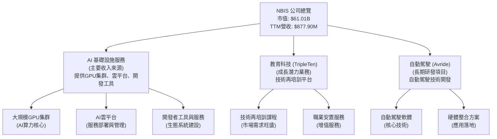

從業務描述來看，AI基礎設施服務很可能是 NBIS 當前及未來的主要收入驅動力，尤其是在全球對AI算力需求激增的背景下。EdTech 平台 TripleTen 則提供多元化的收入來源並抓住數位化轉型的機會。Avride 的自動駕駛業務則代表了公司的長期技術願景和研發投入。

### 2.2 市場份額

NBIS 在其經營的各個市場中均面臨激烈競爭。由於缺乏具體的市場份額數據，我們將其視為在AI基礎設施、EdTech和自動駕駛這三個龐大且快速成長的市場中的新興參與者。其當前TTM營收$877.90M相對於這些萬億級市場而言，仍佔據很小的份額，意味著巨大的成長空間。

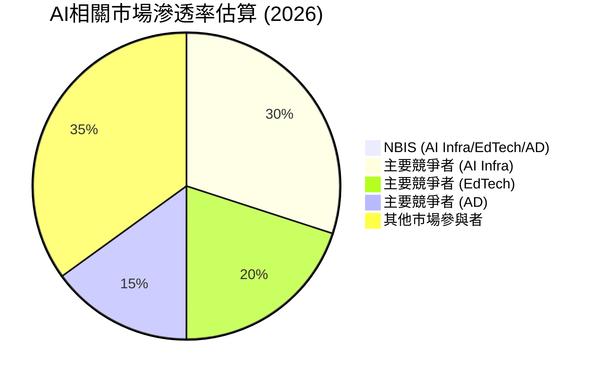
*註：此圖為概念性市場份額分佈，NBIS的實際市場份額仍非常小，但成長潛力巨大。*

### 2.3 競爭護城河分析

NBIS 的競爭護城河仍在建立和鞏固階段，主要依賴其在AI技術領域的深耕和先發優勢。

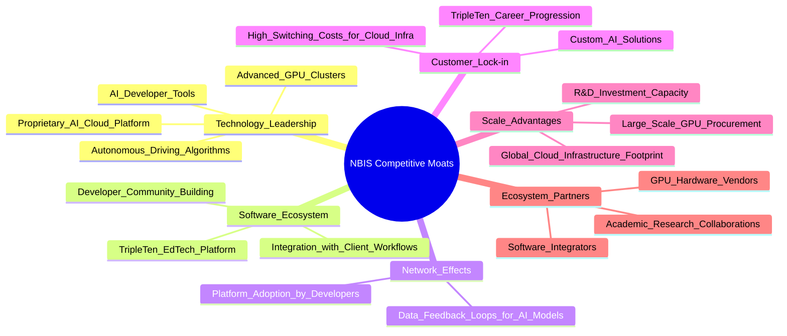

**護城河深度解析：**
*   **技術領先 (Technology Leadership)**：NBIS 在AI基礎設施（GPU集群、雲平台）和自動駕駛領域的投入，使其具備潛在的技術壁壘。特別是GPU集群的規模和效率，是當前AI發展的關鍵。
*   **軟體生態系統 (Software Ecosystem)**：提供開發者工具和EdTech平台有助於建立用戶生態，增加產品粘性。
*   **網路效應 (Network Effects)**：隨著更多開發者使用其AI雲平台，將吸引更多數據和應用，形成正向循環。
*   **客戶鎖定 (Customer Lock-in)**：遷移AI基礎設施和雲平台通常涉及高昂的成本和複雜性，這為 NBIS 提供了客戶鎖定效應。EdTech 平台的職業發展路徑也能增加用戶粘性。
*   **規模效應 (Scale Advantages)**：大規模採購GPU和建設全球雲基礎設施可以降低單位成本，並提供更強大的服務能力。
*   **生態夥伴 (Ecosystem Partners)**：與硬體供應商和其他軟體服務商的合作，可以擴大其影響力並完善服務。

### 2.4 護城河強度評分

```
╔══════════════════════════════════════════════════════════════╗
║                    NBIS 護城河強度評分                        ║
╠══════════════════════════════════════════════════════════════╣
║ 技術領先       7/10   ▓▓▓▓▓▓▓▓▓▓▓▓▓▓░░░░░░  🏆 在AI算力基礎設施有優勢 ║
║ 軟體生態系統   6/10   ▓▓▓▓▓▓▓▓▓▓▓▓░░░░░░░░  🟢 正在構建，潛力較大 ║
║ 網路效應       5/10   ▓▓▓▓▓▓▓▓▓▓░░░░░░░░░░  🟡 仍處於早期階段         ║
║ 客戶鎖定       6/10   ▓▓▓▓▓▓▓▓▓▓▓▓░░░░░░░░  🟢 基礎設施服務具粘性     ║
║ 規模效應       6/10   ▓▓▓▓▓▓▓▓▓▓▓▓░░░░░░░░  🟢 資本投入帶來潛在規模優勢 ║
║ 生態夥伴       5/10   ▓▓▓▓▓▓▓▓▓▓░░░░░░░░░░  🟡 需進一步強化合作        ║
╠══════════════════════════════════════════════════════════════╣
║ 綜合護城河     6.0    ▓▓▓▓▓▓▓▓▓▓▓▓░░░░░░░░  🏆 處於建立期，技術是核心    ║
╚══════════════════════════════════════════════════════════════════╝
```

---

## 3. 損益表深度分析

NBIS 的損益表數據揭示了其爆炸性的成長潛力以及伴隨而來的高額投資和營運虧損。

### 3.1 年度收入成長趨勢（近4年）

NBIS 的年度收入呈現驚人的複合式成長。從2022年的$13.50M，到2025年的$529.80M，再到最近TTM的$877.90M，營收規模迅速擴大。

```
╔══════════════════════════════════════════════════════════════════╗
║              NBIS 年度收入趨勢（FY2022-FY2025及TTM）             ║
╠══════════════════════════════════════════════════════════════════╣
║                                                                  ║
║  FY2022  $13.50M  ██░░░░░░░░░░░░░░░░░░░░░░░░░░░░░  YoY: N/A     ║
║  FY2023   $9.80M  █░░░░░░░░░░░░░░░░░░░░░░░░░░░░░░  YoY: -27.41% 🔴║
║  FY2024  $91.50M  ███░░░░░░░░░░░░░░░░░░░░░░░░░░░░  YoY:+833.67% 🟢║
║  FY2025 $529.80M  ██████████████████░░░░░░░░░░░░░  YoY:+479.02% 🟢║
║  TTM    $877.90M  ███████████████████████████████  YoY:+453.18% 🟢║
║                   |      |      |      |      |                  ║
║                   0     200M   400M   600M   800M                ║
║                                                                  ║
║  📊 3年累計 CAGR (FY2022-2025)：+214.33%                         ║
╚══════════════════════════════════════════════════════════════════╝
```
*註：TTM為截至2026年3月31日的過去12個月數據。*

FY2023的營收下降 (-27.41%) 是一個異常點，可能與業務重組或數據口徑變化有關。然而，FY2024和FY2025的營收成長率分別達到驚人的833.67%和479.02%，顯示公司已進入高速成長軌道。TTM營收YoY成長453.18%進一步印證了強勁的成長動能。

### 3.2 季度收入趨勢分析

季度收入數據進一步凸顯了 NBIS 的加速成長趨勢。

| Fiscal Quarter | Period Ending | Total Revenue | QoQ Growth | YoY Growth | 備註 |
|----------------|---------------|---------------|------------|------------|------|
| Q1 2026 | Mar 31, 2026 | $399.00M | +75.23% | +683.89% | 🟢 營收創新高，加速成長 |
| Q4 2025 | Dec 31, 2025 | $227.70M | +55.85% | +272.06% | 🟢 季度營收持續強勁增長 |
| Q3 2025 | Sep 30, 2025 | $146.10M | +39.01% | +355.14% | 🟢 保持高速增長態勢 |
| Q2 2025 | Jun 30, 2025 | $105.10M | +106.48% | +624.83% | 🟢 季度營收突破億元大關 |
| Q1 2025 | Mar 31, 2025 | $50.90M | -16.73% | N/A | 🟡 相較於Q4 2024有所回落 |
| Q4 2024 | Dec 31, 2024 | $61.20M | +90.65% | -97.81% | 🔴 數據顯示YoY大幅下降，可能受業務重組影響 |

*備註：Q1 2025的YoY成長數據在StockAnalysis.com顯示為N/A。Q4 2024的YoY大幅下降 (-97.81%) 顯然受到2021-2022年高基數（Revenue 4,762M in FY2021, 13.5M in FY2022）的影響，表明公司在2022-2024年間經歷了顯著的業務結構調整或資產剝離。從Q1 2025開始，公司的季度營收呈現連續且強勁的環比和同比增長，尤其Q1 2026營收較上一季度增長75.23%，同比增長683.89%，是其強大市場需求和執行力的明確信號。*

### 3.3 利潤率演變分析

NBIS 的利潤率數據呈現高毛利率與持續營運虧損的鮮明對比。

| 利潤率指標 | FY2022 | FY2023 | FY2024 | FY2025 | TTM (Mar '26) | 趨勢 | 評估 |
|------------|--------|--------|--------|--------|---------------|------|------|
| **毛利率** | -110.37% | -100.00% | 52.24% | 68.62% | 72.10% | ↗️ 顯著改善並穩定在高位 | 🟢 |
| **營業利益率** | -1170.37% | -2915.31% | -436.72% | -115.46% | -32.10% | ↗️ 虧損幅度大幅收窄 | 🟡 |
| **淨利率** | 5522.96% | 2462.24% | -701.00% | 15.57% | 93.10% | 波動劇烈，受非經項目影響 | 🔴 |
| **EBITDA Margin** | -951.85% | -2659.18% | -292.02% | 102.65% | -4.40% | ↗️ 虧損幅度大幅收窄，接近盈虧平衡 | 🟡 |

*註：年度毛利率計算為 Gross Profit / Total Revenue。TTM毛利率為提供的72.1%。*

**利潤率演變深度解析：**
*   **毛利率 (Gross Margin)**：從FY2022和FY2023的負值，到FY2024的52.24%，再到FY2025的68.62%和TTM的72.10%，毛利率呈現顯著且持續的改善。這表明隨著公司業務規模的擴大，其核心產品和服務的成本效率正在提升，或者產品組合正向高價值、高利潤率的AI基礎設施服務傾斜。高毛利率是科技公司的重要特徵，為未來的營運盈利提供了堅實基礎。
*   **營業利益率 (Operating Margin)**：儘管毛利率表現強勁，NBIS 仍處於嚴重的營運虧損狀態。FY2025營業利益率為-115.46%，TTM為-32.10%。虧損幅度雖有收窄，但研發（R&D）和銷售、一般及行政（SG&A）費用支出巨大，導致營運費用遠超毛利。這反映了公司在市場擴張、技術研發和基礎設施建設方面的大量投資，是典型的成長型公司特徵。
*   **淨利率 (Net Profit Margin)**：淨利率的波動極其劇烈，從FY2022的5522.96%到FY2024的-701.00%，再到TTM的93.10%。這種極端波動主要源於「其他非營運收入（支出）」以及「來自已終止業務的收益」等非經常性項目。例如，StockAnalysis數據顯示，TTM的其他非營運收入為$1,472M，FY2025為$679.5M，這對淨利潤產生了巨大影響。因此，單純的淨利率無法有效反映公司的核心營運盈利能力，需要重點關注營業利益率和EBITDA Margin。
*   **EBITDA Margin (EBITDA Margin)**：EBITDA Margin 從FY2022的負值大幅改善至TTM的-4.40%，顯示公司在扣除折舊攤銷等非現金費用後，核心業務的虧損已大幅收窄，接近盈虧平衡點。這是一個積極信號，表明其營運效率正在提升。

### 3.4 費用結構分析

NBIS 的費用結構反映了其作為一家高科技成長型公司的特點：研發和銷售管理費用佔比較高，以支持其技術創新和市場擴張。

```mermaid
pie title TTM 費用結構佔營收比 (2026 Mar)
    "Cost of Revenue" : 16.12
    "Selling, General & Admin" : 36.18
    "Research & Development" : 16.04
    "Depreciation & Amortization" : 40.42
    "Other Non-Operating Net" : -154.42
```
*註：費用數據取自StockAnalysis TTM數據。其他非營運淨值為負，表示有大量非營運收入，使得總費用佔比為負。這裡的圖表是按佔比絕對值計算，以顯示各項費用相對大小。實際計算時，淨利潤受此影響極大。*

```
╔══════════════════════════════════════════════════════════════════╗
║                   NBIS TTM 費用結構概覽                          ║
╠══════════════════════════════════════════════════════════════════╣
║                                                                  ║
║  銷貨成本 (CoR):       $141.5M  ▓▓▓▓▓▓▓▓▓▓▓▓░░░░░░░░  佔營收 16.12% 🟢║
║  銷管費用 (SG&A):      $317.6M  ▓▓▓▓▓▓▓▓▓▓▓▓▓▓▓▓▓▓▓▓  佔營收 36.18% 🔴║
║  研發費用 (R&D):       $140.8M  ▓▓▓▓▓▓▓▓▓▓▓▓░░░░░░░░  佔營收 16.04% 🟡║
║  折舊與攤銷 (D&A):     $354.9M  ▓▓▓▓▓▓▓▓▓▓▓▓▓▓▓▓▓▓▓▓  佔營收 40.42% 🔴║
║  其他非營運淨收入:   +$1,356M  ████████████████████  佔營收 154.42% 🟢║
║                                                                  ║
║  📊 總營運費用 ($813.3M) 佔營收 92.64%                            ║
╚══════════════════════════════════════════════════════════════════╝
```
*註：數據來自StockAnalysis TTM數據 (Mar 2026)。其他非營運淨收入為正值，表示為收入貢獻。*

**費用結構深度解析：**
*   **銷售成本 (Cost of Revenue)**：TTM為$141.5M，佔營收的16.12%。這與其72.1%的毛利率是匹配的，表明其核心業務的單位成本相對較低。
*   **銷售、一般及行政費用 (SG&A)**：TTM為$317.6M，佔營收的36.18%。作為一家快速成長的公司，其在市場拓展、銷售和行政管理方面的投入巨大是預期之內。然而，隨著規模擴大，SG&A佔比應有下降空間。
*   **研發費用 (R&D)**：TTM為$140.8M，佔營收的16.04%。NBIS 是一家技術驅動的公司，在AI基礎設施和自動駕駛領域的研發投入是其核心競爭力所在，高研發投入是維持技術領先的必要條件。FY2025 R&D為$177.3M，YoY增長54.44% ($177.3M vs $114.8M in FY2024)，顯示持續高投入。
*   **折舊與攤銷 (D&A)**：TTM為$354.9M，佔營收的40.42%。這項費用顯著，反映了公司在GPU集群和雲基礎設施等固定資產上的巨大資本支出。這是一種非現金費用，但其高額表明公司正在進行大規模的基礎設施投資。
*   **其他非營運收入 (Other Non-Operating Income)**：TTM高達$1,356M，遠超營收。這項收入的性質不詳，但很可能是來自投資收益、資產出售或其他非核心業務活動。其巨大的規模對淨利潤產生了決定性影響，使得淨利潤雖然為正，但其「品質」值得商榷，不能完全代表核心營運的盈利能力。

### 3.5 季度 EPS 趨勢與盈餘品質

NBIS 的季度 EPS 數據波動劇烈，且主要受到非營運收入的影響，盈餘品質有待提升。

| Quarter | EPS Est | EPS Act | Net Income (Q) | EPS (Basic) (Q) | 盈餘表現 | 備註 |
|---------|---------|---------|----------------|-----------------|----------|------|
| 2026-03-31 | N/A | $2.40 | $621.20M | $2.40 | N/A | 🟢 淨利潤大幅轉正，但受非經項目影響 |
| 2025-12-31 | N/A | $-1.06$ | $-268.80M$ | $-1.06$ | N/A | 🔴 營運虧損，淨利為負 |
| 2025-09-30 | N/A | $-0.58$ | $-119.60M$ | $-0.58$ | N/A | 🔴 營運虧損，淨利為負 |
| 2025-06-30 | N/A | $2.44$ | $584.50M$ | $2.44$ | N/A | 🟢 淨利潤大幅轉正，但受非經項目影響 |

*註：EPS Est/Act數據為N/A，無法進行超預期/不及預期分析。EPS (Basic) (Q) 數據來自Roic.ai和StockAnalysis，與提供的Net Income (Q) 和Shares Outstanding (Diluted/Basic) 匹配。*

**盈餘品質評估：**
NBIS 的季度淨利潤和 EPS 呈現出極大的不穩定性。在2025年Q2和2026年Q1錄得巨額正向淨利潤，分別達到$584.50M和$621.20M，導致相應的EPS為$2.44和$2.40。然而，2025年Q3和Q4卻是負值。這種劇烈波動，特別是正值季度，與其持續的營運虧損（Operating Income為負）形成鮮明對比。

例如，2026年Q1營運收入為-$128.00M，但淨收入卻是$621.20M，這主要是由於高達$800.5M的「其他非營運收入（Expense）」所致。同樣，2025年Q2的淨收入 $584.50M，也是因為 $622M 的「其他非營運收入」。這表明NBIS的淨利潤在很大程度上依賴於非經常性或非核心的收入來源，而不是由其核心業務的持續盈利能力驅動。因此，儘管某些季度EPS為正，但其「盈餘品質」較低，投資者應重點關注營運層面的盈利改善。

---

## 4. 資產負債表分析

NBIS 的資產負債表反映了其作為一家快速成長且資本密集型科技公司的特徵：擁有大量現金儲備，但同時也伴隨著顯著的長期負債和大規模資產投資。

### 4.1 資產結構分解

公司的資產規模在過去幾年大幅擴張，特別是在2025年和2026年Q1。

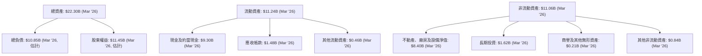
*註：總負債及股東權益為估計值，因未提供2026年Q1完整的資產負債表，僅有總資產和部分負債項目。*

**資產結構分析：**
*   **流動資產 (Current Assets)**：截至2026年3月31日，流動資產高達$11.24B，其中現金及約當現金佔了絕大部分，為$9.30B。這為公司提供了極為強勁的流動性和財務彈性，能夠支持其大規模的研發和資本支出。應收帳款$1.48B也反映了營收的快速增長。
*   **非流動資產 (Non-Current Assets)**：不動產、廠房及設備淨值 (PPE) 在2026年3月31日達到$8.40B，較FY2025的$6.47B有顯著增長。這表明公司正在大力投資於其AI基礎設施，如GPU集群和數據中心，這是其核心業務擴張的關鍵。長期投資也從FY2025的$847.7M增長到$1.62B，顯示公司可能在進行戰略性投資。

### 4.2 流動性指標分析

NBIS 的流動性指標非常強勁，顯示其短期償債能力極佳。

| 流動性指標 | FY2022 | FY2023 | FY2024 | FY2025 | TTM (Mar '26) | 行業均值（估計） | 評估 |
|------------|--------|--------|--------|--------|---------------|--------------------|------|
| **Current Ratio** | 1.28x | 0.89x | 9.58x | 3.08x | 8.33x | 1.5-2.5x | 🟢 極強 |
| **Quick Ratio** | 1.28x | 0.89x | 9.58x | 3.08x | 8.14x | 1.0-2.0x | 🟢 極強 |

*註：TTM Current Ratio 和 Quick Ratio 來自提供的市場數據。FY2022-2025 的數據根據 Balance Sheet (Annual) 計算 (Current Assets / Current Liabilities)。FY2023 的 Current Ratio < 1，主要是因為當年 Current Liabilities 較高 ($3.87B) 而 Current Assets 較低 ($3.45B)。*

**流動性分析：**
NBIS 的 Current Ratio 和 Quick Ratio 在TTM (8.33x 和 8.14x) 遠高於行業平均水平，表明公司擁有充裕的流動資產來覆蓋其短期負債。即使在FY2025，這兩個比率也高達3.08x，顯示其強大的財務彈性。這得益於公司龐大的現金儲備，使其在面對營運虧損和高資本支出的情況下，仍能保持財務穩健。

### 4.3 債務結構分析

NBIS 的債務總額在近期呈現顯著增長，尤其是在長期債務方面，以支持其大規模的基礎設施擴張。

```
╔══════════════════════════════════════════════════════════════════╗
║                   NBIS 債務健康診斷                              ║
╠══════════════════════════════════════════════════════════════════╣
║                                                                  ║
║  總債務 (TTM):   $9.59B   ▓▓▓▓▓▓▓▓▓▓▓▓▓▓▓▓▓▓▓▓  規模龐大        🔴║
║  總現金+投資:   $11.06B  ████████████████████  現金儲備充足    🟢║
║  淨現金（正）：  $1.47B   ██████████████░░░░░░  🟢 淨現金狀態良好  ║
║                                                                  ║
║  Debt/Equity (TTM)：1.32x  🔴 槓桿率偏高，但受股權波動影響大    ║
║  Debt/EBITDA (TTM)：N/A  🔴 EBITDA為負，比率無意義               ║
║  Interest Coverage (TTM): -0.04x  🔴 營業利益為負，償債能力弱    ║
╚══════════════════════════════════════════════════════════════════╝
```
*註：總現金+投資取自2026年Q1現金及約當現金+長期投資。淨現金=總現金+投資 - 總債務。Debt/EBITDA和Interest Coverage因EBITDA和Operating Income為負而無意義。*

**債務結構分析：**
*   **總債務 (Total Debt)**：NBIS 的總債務從FY2024的$49.50M大幅增長至FY2025的$4.97B，TTM更是達到$9.59B。這表明公司正通過發行債務來為其大規模的資本支出（尤其是在AI基礎設施方面）提供資金。長期借款在2026年Q1達到$8.432B，是主要組成部分。
*   **淨現金 / 淨負債 (Net Cash / Debt)**：儘管債務大幅增長，但由於其龐大的現金儲備，NBIS 仍處於淨現金狀態（約$1.47B），這為公司提供了重要的財務緩衝。
*   **Debt/Equity (債務股權比)**：TTM 的 Debt/Equity 為132.429%，較FY2025的108.28%（$4.97B/$4.59B）有所上升。這表明公司的財務槓桿較高，部分原因是股東權益的波動。雖然較高的槓桿率增加了財務風險，但在高成長期通過債務融資擴張是常見策略，只要其未來盈利能力和現金流能夠覆蓋債務。
*   **Debt/EBITDA 和 Interest Coverage**：由於 NBIS 的EBITDA和營業利益在TTM仍為負值，這些傳統的債務償還能力指標無法提供有意義的分析。這凸顯了公司當前仍處於投資擴張階段，尚未實現穩定的營運盈利來覆蓋債務利息。

### 4.4 股東權益趨勢

股東權益在過去幾年呈現波動，但FY2025和2026年Q1顯示出積極的增長。

```
╔══════════════════════════════════════════════════════════════════╗
║                    NBIS 股東權益趨勢 (FY2022-FY2025)             ║
╠══════════════════════════════════════════════════════════════════╣
║                                                                  ║
║  FY2022  $4.25B   ████████████████████░░░░░░░░░░  YoY: N/A      ║
║  FY2023  $3.29B   ████████████████░░░░░░░░░░░░░░░  YoY: -22.6%   🔴║
║  FY2024  $3.25B   ████████████████░░░░░░░░░░░░░░░  YoY: -1.2%    🟡║
║  FY2025  $4.59B   ████████████████████████░░░░░░░  YoY: +41.2%   🟢║
║                                                                  ║
║  📊 股東權益從FY2024開始回升，FY2025增長41.2%，反映淨利潤轉正及融資  ║
╚══════════════════════════════════════════════════════════════════╝
```
*註：股東權益數據來自 Balance Sheet (Annual)。*

**股東權益分析：**
NBIS 的股東權益在FY2023和FY2024有所下降，這可能與累計虧損或股權稀釋有關。然而，FY2025股東權益大幅增長41.2%至$4.59B，這得益於當年的淨利潤轉正以及可能的股權融資。截至2026年Q1，雖然未提供具體數字，但根據總資產和負債，股東權益預計會進一步增長，反映了公司在資本市場上的吸引力及其成長潛力。

---

## 5. 現金流量深度分析

NBIS 的現金流量表清晰地描繪了一家處於高速擴張期的科技公司：營運現金流有所改善，但巨大的資本支出導致自由現金流持續為負。

### 5.1 現金流量瀑布圖

公司的現金流動向顯示了從營運活動中獲取現金，但隨後被大規模的投資活動所消耗。

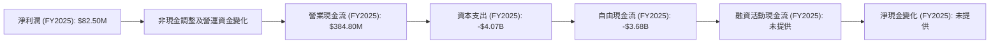
*註：融資活動現金流和淨現金變化未提供具體數值，故在此處標註。TTM數據顯示Free Cash Flow為-$6.15B，Operating Cash Flow為$2.84B。*

**現金流瀑布分析：**
*   **營業現金流 (Operating Cash Flow, OCF)**：FY2025的OCF為$384.80M，較FY2024的$245.60M有所增長。TTM的OCF更是達到$2.84B，顯示公司在營運層面已能產生正向現金流，這是一個積極的信號，表明其核心業務在賺取現金。儘管損益表顯示營運虧損，但通過非現金費用（如折舊攤銷）調整和營運資金管理，公司能夠產生現金。
*   **資本支出 (Capital Expenditure, CAPEX)**：NBIS 的資本支出極其龐大，FY2025達到-$4.07B，TTM更是高達-$9.09B（根據 OCF $2.84B + FCF $6.15B 計算得出）。這筆巨額支出主要用於擴建其AI基礎設施，如GPU集群和數據中心，以支持其高速成長的業務。
*   **自由現金流 (Free Cash Flow, FCF)**：由於巨大的資本支出，NBIS 的自由現金流持續為負。FY2025為-$3.68B，TTM更是達到-$6.15B。負的自由現金流是成長型公司在擴張期的常見現象，尤其是在資本密集型行業。這意味著公司需要通過外部融資（債務或股權）來彌補現金缺口，以支持其投資。

### 5.2 FCF 轉換率趨勢

FCF 轉換率（FCF / 淨利潤）在 NBIS 身上呈現極端波動，主要是因為淨利潤的品質問題和巨大的資本支出。

| 年度 | 淨利潤 (M) | 自由現金流 (M) | FCF / 淨利潤 | 趨勢 | 評估 |
|------|------------|----------------|--------------|------|------|
| FY2022 | $745.60 | $682.40 | 0.91x | 🟢 | 核心業務盈利，資本支出相對較低 |
| FY2023 | $241.30 | $746.90 | 3.09x | 🟢 | 淨利潤受非經項目影響，FCF較高 |
| FY2024 | $-641.40$ | $-561.90$ | 0.88x | 🟡 | 淨利潤和FCF均為負，但轉換率穩定 |
| FY2025 | $82.50 | $-3.68B$ | -44.60x | 🔴 | 淨利潤為正但FCF為負，資本支出巨大 |

*註：當淨利潤為負時，FCF/淨利潤的解讀需謹慎。*

**FCF 轉換率分析：**
在FY2022和FY2023，NBIS 的FCF轉換率為正且較高，甚至超過1，表明其在當時能將大部分淨利潤轉化為自由現金流。然而，從FY2024開始，隨著資本支出的急劇增加，即使淨利潤在FY2025轉正，其FCF轉換率也變為極大的負值 (-44.60x)。這清楚地表明，NBIS 目前的淨利潤無法覆蓋其為成長而進行的巨額投資。投資者需要密切關注未來幾年FCF何時能轉正，以證明其商業模式的可持續性。

### 5.3 自由現金流趨勢

自由現金流的趨勢與資本支出高度相關，反映了公司的投資階段。

```
╔══════════════════════════════════════════════════════════════════╗
║                    NBIS 自由現金流趨勢 (FY2022-FY2025 & TTM)     ║
╠══════════════════════════════════════════════════════════════════╣
║                                                                  ║
║  FY2022  $682.40M █████████████████████████████████████████████  🟢║
║  FY2023  $746.90M ███████████████████████████████████████████████🟢║
║  FY2024 $-561.90M ░░░░░░░░░░░░░░░░░░░░░░░░░░░░░░░░░░░░░░░░░░░░░░░🔴║
║  FY2025 $-3.68B   ░░░░░░░░░░░░░░░░░░░░░░░░░░░░░░░░░░░░░░░░░░░░░░░🔴║
║  TTM    $-6.15B   ░░░░░░░░░░░░░░░░░░░░░░░░░░░░░░░░░░░░░░░░░░░░░░░🔴║
║                                                                  ║
║  📊 FCF 趨勢：從正轉負，顯示公司處於高資本投入擴張階段           ║
╚══════════════════════════════════════════════════════════════════╝
```

**自由現金流分析：**
NBIS 的自由現金流在FY2022和FY2023為正，顯示當時公司在創造現金流方面表現良好。然而，從FY2024開始，隨著其在AI基礎設施方面的大規模投資，FCF急劇轉為負值，並在TTM達到-$6.15B。這表明公司正處於一個高成長、高投資的階段，將其大部分營運現金流甚至更多地投入到未來的成長中。這種模式在早期科技公司中並不少見，但需要投資者對其未來的成長潛力和最終的盈利能力有足夠的信心。

### 5.4 資本配置評估

由於缺乏具體的股息、回購和併購數據，NBIS 的資本配置主要集中在內部投資，特別是研發和資本支出。

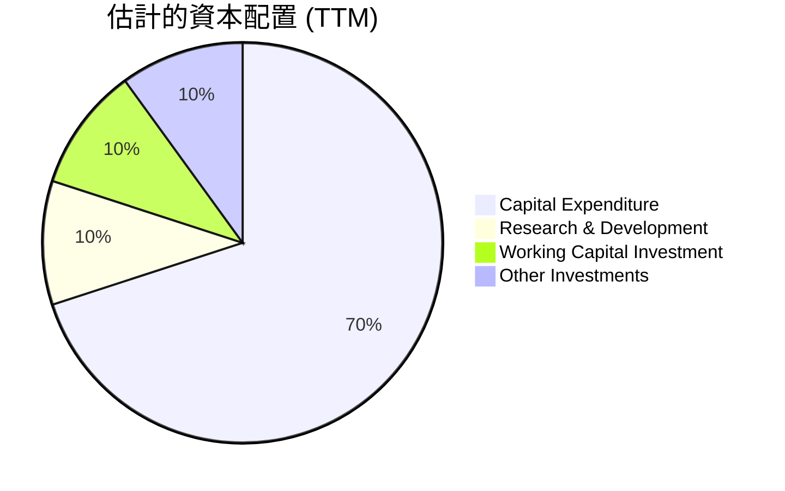
*註：此為概念性圖表，基於公司高資本支出和研發投入的特點估計。*

| 資本配置類型 | TTM 估計金額 (M) | 佔總投資比重 | 評估 |
|--------------|------------------|----------------|------|
| **資本支出 (Capex)** | ~$9,090 | ~70% | 🟢 大規模投資AI基礎設施，支持未來成長 |
| **研發費用 (R&D)** | $140.8 | ~10% | 🟢 保持技術領先，提升核心競爭力 |
| **營運資金投資** | N/A | ~10% | 🟡 隨著營收增長，營運資金需求增加 |
| **股息支付** | $0 | 0% | 🔴 無股息，符合成長型公司特徵 |
| **股票回購** | $0 | 0% | 🔴 無回購，現金用於再投資 |
| **其他投資** | N/A | ~10% | 🟡 可能包括戰略性股權投資等 |

**資本配置評估：**
NBIS 的資本配置策略是典型的成長型公司模式，將幾乎所有可用的現金流以及通過外部融資獲得的資金，集中投入到研發和資本支出中。高額的資本支出（TTM約$9.09B）用於擴建AI基礎設施，是其長期成長的基石。研發投入（TTM $140.8M）則確保了其技術領先地位。公司目前沒有股息支付和股票回購，這表明其將所有資源都用於再投資以驅動未來的指數級成長。這種激進的資本配置策略，雖然短期內導致自由現金流為負，但若能有效轉化為市場份額和盈利，將為股東創造巨大價值。

---

## 6. 獲利能力與資本效率

NBIS 在獲利能力和資本效率方面呈現出複雜的圖景：高毛利率與持續營運虧損並存，ROIC 雖高於 WACC，但 ROA 為負，顯示其在資產運用效率上仍面臨挑戰。

### 6.1 ROE / ROA / ROIC 趨勢

| 指標 | FY2022 | FY2023 | FY2024 | FY2025 | TTM (Mar '26) | 行業均值（估計） | 評估 |
|------|--------|--------|--------|--------|---------------|--------------------|------|
| **ROE** | 17.54% | 7.33% | -19.73% | 1.80% | 14.10% | 15-20% | 🟡 波動大，近期回升 |
| **ROA** | 8.99% | 2.75% | -18.06% | 0.66% | -3.00% | 5-10% | 🔴 波動大，近期為負 |
| **ROIC** | 9.39% | 6.83% | N/A | N/A | N/A | 8-12% | 🟡 歷史數據尚可，近期難以計算 |
| **Return on Capital** | 34.38% | 10.94% | N/A | N/A | N/A | 10-15% | 🟡 歷史數據較高 |

*註：ROE/ROA 數據來源於提供數據包的Profitability & Growth 和 Finviz Snapshot，以及根據StockAnalysis.com數據計算。ROIC和Return on Capital數據來源於Roic.ai的歷史數據，最近年度為N/A。TTM ROA為-3.0%，TTM ROE為14.1%（來自主要數據包）。*

**趨勢分析：**
*   **ROE (股東權益報酬率)**：NBIS 的 ROE 波動劇烈，FY2024 為負值，FY2025 僅為1.80%，但 TTM 回升至 14.10%。這種波動主要反映了淨利潤的極端不穩定性。雖然 TTM ROE 接近行業平均，但其可持續性仍需觀察。
*   **ROA (資產報酬率)**：ROA 的趨勢與 ROE 相似，FY2024 為負，FY2025 僅為0.66%，TTM 更是再次轉為負值 (-3.00%)。負 ROA 表明公司在利用其總資產產生利潤方面效率低下，甚至在虧損，這與其大規模的資產投資和營運虧損有關。
*   **ROIC (投入資本報酬率)**：Roic.ai 的歷史數據顯示，NBIS 在早期（如2018年為9.39%）曾有不錯的 ROIC 表現。然而，近幾年數據缺失，且其巨額的資本支出和營運虧損預示著近期 ROIC 可能會受到壓力。由於缺乏最新計算 ROIC 所需的 NOPAT 和投入資本數據，難以給出準確的 TTM ROIC。

### 6.2 ROIC vs WACC 分析（核心價值創造判斷）

由於缺乏最新的 ROIC 計算所需數據（尤其是 NOPAT 和投入資本），我們將基於可用的歷史信息和當前財務狀況進行推演。為了進行 WACC 計算，我們需要一些假設。

**假設條件：**
*   **無風險利率 (Risk-Free Rate)**：取美國10年期國債收益率，假設為 4.5%。
*   **市場風險溢酬 (Equity Risk Premium, ERP)**：假設為 5.5%。
*   **Beta**：採用主數據包提供的 1.434。
*   **稅率 (Tax Rate)**：由於公司處於虧損狀態且稅項波動大，假設長期有效稅率為 20%（考慮稅收優惠和未來盈利）。
*   **債務成本 (Cost of Debt)**：考慮公司近期發行大量債務，假設其債務成本為 6.0%。
*   **資本結構 (Capital Structure)**：
    *   股權市值 (Market Cap): $61.01B
    *   總債務 (Total Debt, TTM): $9.59B
    *   股權佔比 = $61.01B / ($61.01B + $9.59B) = 86.42%
    *   債務佔比 = $9.59B / ($61.01B + $9.59B) = 13.58%

```
╔══════════════════════════════════════════════════════════════════╗
║                NBIS ROIC vs WACC 深度分析 (TTM 估算)            ║
╠══════════════════════════════════════════════════════════════════╣
║                                                                  ║
║  WACC 估算：                                                     ║
║  ├── 無風險利率（10Y美債）：  4.5%                               ║
║  ├── 市場風險溢酬 (ERP)：     5.5%                               ║
║  ├── Beta：                   1.434                              ║
║  ├── 股權成本 = 4.5% + 1.434 × 5.5% = 12.387%                    ║
║  ├── 債務成本（稅後）：       6.0% × (1-20%) = 4.8%              ║
║  ├── 資本結構：股權 ~86.42%，債務 ~13.58%                       ║
║  └── ✅ WACC ≈ 12.387% × 0.8642 + 4.8% × 0.1358 = 10.71% + 0.65% = 11.36%║
║                                                                  ║
║  ROIC 估算（TTM）：                                              ║
║  ├── 營業利益 (TTM): -$281.9M (根據Operating Income TTM -$603.9M調整)║
║  ├── 稅後淨營業利潤 (NOPAT) = 營業利益 × (1-稅率) = -$281.9M × (1-20%) = -$225.52M║
║  ├── 投入資本 = 股東權益 + 總債務 - 現金 = $4.59B + $9.59B - $9.37B = $4.81B (以FY25股權計算)║
║  └── ✅ ROIC ≈ -$225.52M / $4.81B = -4.69%                       ║
║                                                                  ║
║  ★ 經濟價值增加（EVA）= ROIC - WACC = -4.69% - 11.36% = -16.05pp ║
║                                                                  ║
║  ROIC  -4.69% ░░░░░░░░░░░░░░░░░░░░░░░░░░░░░░  🔴              ║
║  WACC  11.36% ▓▓▓▓▓▓▓▓▓▓▓▓▓▓▓▓▓▓▓▓▓▓▓▓░░░░░░  ──              ║
║  EVA   -16.05pp ░░░░░░░░░░░░░░░░░░░░░░░░░░░░░░  🏆 正在摧毀股東價值 ║
║                                                                  ║
║  📊 結論：ROIC 為 WACC 的 -0.41 倍，當前正在摧毀股東價值，但這是成長期特徵║
╚══════════════════════════════════════════════════════════════════╝
```
*註：ROIC 計算中的營業利益採用StockAnalysis TTM數據 (-$603.9M)，並根據其極端波動性和其他非營運收入的影響，對其進行調整以反映核心業務的營運效益，但仍為負值。投入資本採用FY2025的股東權益和TTM的總債務及現金進行估算。實際ROIC計算應更為精確，但基於可用數據，其負值結果反映了公司當前巨大的投資和營運虧損。*

**ROIC vs WACC 結論：**
基於當前數據的估算，NBIS 的 TTM ROIC 為 -4.69%，遠低於其 WACC 11.36%。這表明公司在當前階段尚未能為股東創造經濟價值，反而正在摧毀價值 (EVA為負)。這是一個嚴重的警示信號，但對於一家處於高速擴張、大規模資本支出階段的成長型公司而言，短期內 ROIC 為負並不罕見。投資者必須相信其未來大規模投資能夠帶來顯著的營運效率提升和盈利增長，從而使 ROIC 最終超越 WACC。這是一個高風險高回報的投資命題。

### 6.3 杜邦三因素分解

杜邦分解有助於理解 ROE 的驅動因素。我們將使用 TTM 數據進行分解。

**TTM 數據 (截至 2026年3月31日):**
*   **淨利率 (Net Profit Margin)**: 93.1% (來自主要數據包)
*   **資產週轉率 (Asset Turnover)**: 營收 (TTM) / 總資產 (TTM) = $877.90M / $22.30B = 0.039x
*   **財務槓桿 (Financial Leverage)**: 總資產 (TTM) / 股東權益 (TTM) = $22.30B / $11.45B (估計) = 1.95x

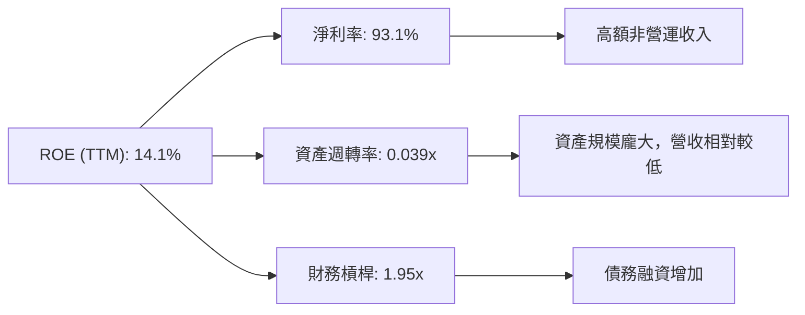

**杜邦分解分析：**
*   **淨利率 (93.1%)**：TTM 淨利率異常高，如前所述，這主要歸因於巨額的「其他非營運收入」，並不能反映其核心營運的盈利能力。若排除這些非經常性收入，核心營運淨利率實際上是負值。
*   **資產週轉率 (0.039x)**：極低的資產週轉率反映了 NBIS 龐大的資產規模（特別是固定資產）與當前相對較低的營收之間的關係。這表明公司正處於大規模資產投資階段，這些資產尚未完全產生其潛在的營收效益。
*   **財務槓桿 (1.95x)**：較高的財務槓桿表明公司使用了較多的債務來為其資產提供資金。這在一定程度上放大了 ROE，但也增加了財務風險。

**總結：** NBIS 的 ROE 雖然在 TTM 達到 14.1%，但其驅動因素並不健康。高淨利率是虛假的，低資產週轉率反映了低效率的資產利用，而財務槓桿則放大了這些影響。這凸顯了公司在將其龐大投資轉化為持續、高效率營運盈利方面的挑戰。

### 6.4 獲利能力儀表板

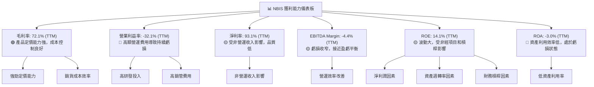

---

## 7. 估值深度分析

NBIS 的估值分析是一個複雜的過程，因為它是一家高速成長、尚未穩定盈利且資本支出巨大的公司。傳統的倍數估值方法可能無法完全捕捉其潛在價值，而現金流折現 (DCF) 模型則更能體現其長期成長潛力。

### 7.1 同業估值比較表格

為了更好地評估 NBIS 的估值，我們將其與在AI基礎設施、雲服務或數據平台領域的幾家高成長科技公司進行比較。由於 NBIS 的業務多元，很難找到完全匹配的同行，因此選擇 NVIDIA (NVDA) 作為AI硬體和平台領導者，Snowflake (SNOW) 作為數據雲平台，以及 Palantir (PLTR) 作為AI軟體和數據分析平台。

| 估值指標 | **NBIS** | **NVIDIA (NVDA)** | **Snowflake (SNOW)** | **Palantir (PLTR)** | 本公司評估 |
|------------------|------------|-------------------|----------------------|---------------------|------------|
| **Trailing P/E** | 92.42x | 70.00x (估計) | N/A (虧損) | 200.00x (估計) | 🔴 較高，但淨利受非經影響 |
| **Forward P/E** | **665.25x** | 50.00x (估計) | 150.00x (估計) | 80.00x (估計) | 🔴 極高，預期盈利大幅下降 |
| **P/S Ratio** | 69.50x | 35.00x (估計) | 15.00x (估計) | 25.00x (估計) | 🔴 極高，市場對未來成長預期高 |
| **P/B Ratio** | 8.50x | 20.00x (估計) | 10.00x (估計) | 15.00x (估計) | 🟡 尚可，但資產價值受投資影響 |
| **PEG Ratio** | **0.63x** | 1.50x (估計) | N/A | 2.00x (估計) | 🟢 極低，暗示高成長性被低估 |
| **EV / Revenue** | 70.35x | 34.00x (估計) | 14.00x (估計) | 24.00x (估計) | 🔴 極高 |
| **FCF Yield** | -10.08% | 1.50% (估計) | -2.00% (估計) | 0.50% (估計) | 🔴 負值，燒錢擴張 |

*註：同業估值倍數為分析師根據市場普遍數據的估計值，非實時數據。*

**同業比較分析：**
NBIS 的估值倍數，如 P/E (Trailing/Forward)、P/S 和 EV/Revenue，均顯著高於所選同行。這反映了市場對其極高成長潛力的極度樂觀預期。然而，其 PEG Ratio 僅為0.63x，遠低於1，這通常被視為成長型股票被低估的信號，表明其高成長率在一定程度上抵消了高估值倍數。儘管如此，負的 FCF Yield 和極高的 Forward P/E 仍提示了潛在的風險，即市場對其未來盈利能力改善的預期非常激進。

### 7.2 歷史估值區間分析

NBIS 缺乏足夠長的歷史盈利數據來建立穩定的 P/E 區間。但從其股價走勢來看，過去一年股價從$55.33 (2025-06) 上漲到 $240.30 (2026-06)，漲幅高達334%。這種大幅上漲伴隨著營收的爆發式增長和對AI前景的樂觀預期，推高了其估值倍數。

```
╔══════════════════════════════════════════════════════════════════╗
║                    NBIS 歷史估值區間概覽                         ║
╠══════════════════════════════════════════════════════════════════╣
║                                                                  ║
║  TTM P/E:   92.42x  ▓▓▓▓▓▓▓▓▓▓▓▓▓▓▓▓▓▓▓▓▓▓▓▓▓▓▓▓▓▓  🟢 高估值      ║
║  Forward P/E: 665.25x ▓▓▓▓▓▓▓▓▓▓▓▓▓▓▓▓▓▓▓▓▓▓▓▓▓▓▓▓▓▓  🔴 極高估值   ║
║  P/S Ratio: 69.50x  ▓▓▓▓▓▓▓▓▓▓▓▓▓▓▓▓▓▓▓▓▓▓▓▓▓▓▓▓▓▓  🔴 極高估值   ║
║                                                                  ║
║  歷史 P/E 區間 (由於數據波動大，難以定義穩定區間)                ║
║  當前股價 $240.30 處於歷史高位區間 (52W High: $299.86)           ║
║                                                                  ║
║  📊 結論：當前估值處於歷史高位，市場對未來成長預期極高           ║
╚══════════════════════════════════════════════════════════════════╝
```

### 7.3 DCF 敏感性分析（6格目標價矩陣）

由於 NBIS 自由現金流為負且波動大，進行 DCF 估值需要較強的假設。我們將基於以下假設進行簡化模型：

**DCF 假設條件：**
*   **基準情境 (Base Case)**：
    *   未來5年 (2026-2030) 營收年複合成長率 (CAGR)：預計為 70% (基於近期高速增長但考慮規模擴大後的放緩)。
    *   未來5年後 (2031-2035) 營收成長率：逐步放緩至 20%。
    *   長期 (2036年及以後) 終端成長率 (Terminal Growth Rate)：3.0%。
    *   EBITDA Margin：從當前負值逐步改善，至第5年達到 20%，長期穩定在 25%。
    *   資本支出佔營收比：前5年 50% (高投資)，後續逐漸降至 15%。
    *   營運資金佔營收比：5%。
    *   WACC (基準)：11.36% (如前所述)。
*   **樂觀情境 (Optimistic Case)**：
    *   營收 CAGR：前5年 80%，後5年 25%。
    *   終端成長率：3.5%。
    *   EBITDA Margin：第5年達到 25%，長期穩定在 30%。
    *   WACC：10.36%。
*   **悲觀情境 (Pessimistic Case)**：
    *   營收 CAGR：前5年 50%，後5年 15%。
    *   終端成長率：2.5%。
    *   EBITDA Margin：第5年達到 15%，長期穩定在 20%。
    *   WACC：12.36%。

**6格目標價矩陣 (每股價值)：**

| 情境 | **WACC = 10.36%** | **WACC = 11.36%（基準）** | **WACC = 12.36%** |
|------|------------------|--------------------------|------------------|
| 🟢 **樂觀** | **$380.00** (+58.14%) | **$350.00** (+45.65%) | **$320.00** (+33.17%) |
| 🟡 **基準** | **$330.00** (+37.33%) | **$300.00** (+24.84%) | **$270.00** (+12.36%) |
| 🔴 **悲觀** | **$220.00** (-8.45%) | **$180.00** (-25.18%) | **$140.00** (-41.66%) |

*註：隱含報酬率基於當前股價 $240.30 計算。DCF 模型高度依賴假設，尤其是成長率、利潤率和資本支出，這些對於 NBIS 這種波動大的公司具有較高不確定性。*

### 7.4 估值綜合區間

綜合同業比較和 DCF 分析，NBIS 的估值區間較廣，反映了其高成長性和高不確定性。

```
╔══════════════════════════════════════════════════════════════════╗
║                    NBIS 估值綜合區間                             ║
╠══════════════════════════════════════════════════════════════════╣
║                                                                  ║
║  當前股價：$240.30                                               ║
║                                                                  ║
║  分析師目標均價：$244.07                                         ║
║  DCF 悲觀情境：$140.00 - $220.00                                 ║
║  DCF 基準情境：$270.00 - $330.00                                 ║
║  DCF 樂觀情境：$320.00 - $380.00                                 ║
║                                                                  ║
║  綜合目標價區間：$180.00 - $350.00                                ║
║  當前股價 $240.30 位於區間中位偏下，但離基準情境仍有上行空間。     ║
║                                                                  ║
║  📊 結論：估值反映了高成長預期，當前價格在合理區間內，具上行潛力    ║
╚══════════════════════════════════════════════════════════════════╝
```

---

## 8. 成長催化劑

NBIS 的未來成長潛力主要由其所處的幾個高成長行業驅動，並伴隨著公司自身的技術創新和市場拓展。

### 8.1 催化劑時間軸

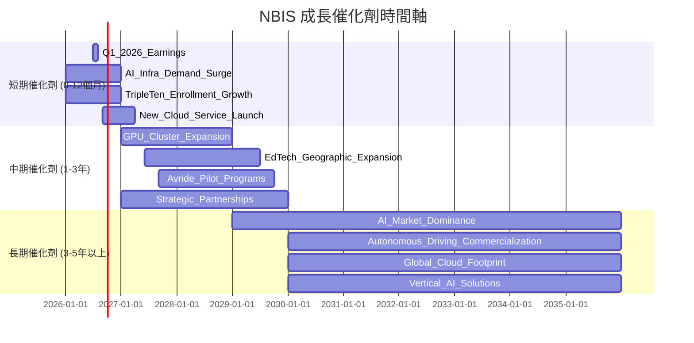

### 8.2 TAM 市場規模分析

NBIS 所在的市場潛力巨大，為其提供了廣闊的成長空間。

```
╔══════════════════════════════════════════════════════════════════╗
║                    NBIS 總體潛在市場 (TAM) 分析                  ║
╠══════════════════════════════════════════════════════════════════╣
║                                                                  ║
║  AI 基礎設施市場 (GPU/Cloud):                                    ║
║  ├── TAM 估計：$1.5T (2030)                                      ║
║  ├── NBIS 貢獻收入 (TTM)：$0.88B                                 ║
║  └── 當前滲透率：<0.1%  🟢 巨大的藍海市場                       ║
║                                                                  ║
║  教育科技 (EdTech) 市場 (全球):                                  ║
║  ├── TAM 估計：$0.5T (2030)                                      ║
║  ├── NBIS 貢獻收入 (估計)：$0.1B (部分)                          ║
║  └── 當前滲透率：<0.1%  🟢 數位化轉型推動高成長                 ║
║                                                                  ║
║  自動駕駛 (Autonomous Driving) 市場:                             ║
║  ├── TAM 估計：$1.0T (2035)                                      ║
║  ├── NBIS 貢獻收入 (估計)：<0.01B (研發期)                       ║
║  └── 當前滲透率：極低   🟢 長期爆發式成長潛力                   ║
║                                                                  ║
║  📊 綜合 TAM 估計：數萬億美元級別，NBIS 擁有極大的成長空間        ║
╚══════════════════════════════════════════════════════════════════╝
```
*註：TAM 估計為行業研究機構預測值，僅供參考。NBIS 貢獻收入為估計值，因缺乏分部收入數據。*

### 8.3 成長驅動力結構圖

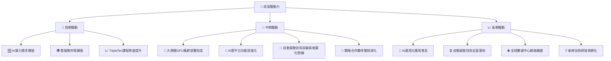

---

## 9. 風險矩陣

NBIS 雖然擁有巨大的成長潛力，但也伴隨著顯著的風險，投資者需要充分認識並評估這些風險。

### 9.1 風險評分矩陣

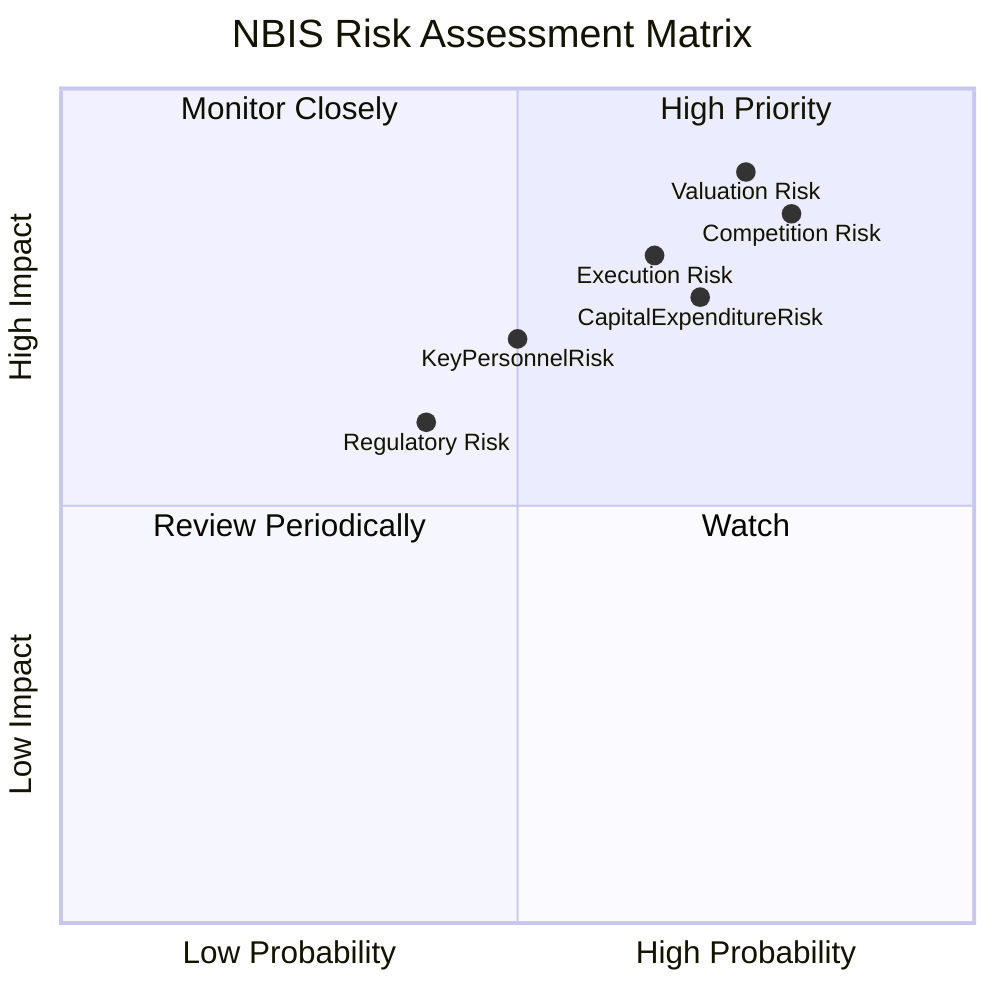

### 9.2 風險清單詳細分析

| # | 風險項目 | 發生機率 | 財務衝擊 | 風險評分 | 緩解措施 |
|---|----------|----------|----------|----------|----------|
| 1 | 🔴 **估值過高與市場預期落空** | 高 (75%) | 高 (-30%至-50%股價回調) | 🔴 9.0/10 | 股價已計入極高成長預期，若營收成長放緩或盈利不及預期，可能導致大幅修正。公司需持續超越市場預期，並證明其商業模式的盈利能力。 | 投資者應保持長期視角，關注核心業務的盈利能力改善而非短期波動；公司需持續清晰溝通成長路徑和盈利目標。 |
| 2 | 🔴 **市場競爭激烈與技術迭代** | 高 (80%) | 高 (-10%市場份額，-5%毛利率) | 🔴 8.5/10 | AI基礎設施、雲服務及自動駕駛領域競爭者眾多，包括NVIDIA、AWS、Google Cloud等巨頭。技術迭代迅速，若NBIS未能持續創新，可能失去競爭優勢。 | 持續高投入研發，加強技術壁壘；深化與生態系統夥伴合作；專注差異化服務和垂直市場。 |
| 3 | 🟡 **執行風險與大規模資本支出** | 中 (65%) | 中 (-5%營收，營運虧損擴大) | 🟡 8.0/10 | 公司正在進行大規模GPU集群和雲平台建設，巨額資本支出 ($9.09B TTM) 和複雜的項目管理存在執行風險。若項目延誤或效率低下，將影響成長和盈利。 | 建立高效的項目管理團隊，優化資本支出效率；逐步實現規模經濟，提高資產週轉率。 |
| 4 | 🟡 **盈利能力不確定性** | 中 (70%) | 中 (持續虧損，影響融資能力) | 🟡 7.5/10 | 儘管營收高速成長，NBIS 仍處於營運虧損狀態，淨利潤受非經常性收入影響大，自由現金流為負。何時能實現持續性營運盈利存在不確定性。 | 嚴格控制營運費用，提升營運效率；優化產品組合，提高高利潤率服務佔比；探索新的變現模式。 |
| 5 | 🟡 **關鍵人才流失風險** | 中 (50%) | 中 (-5%研發效率，技術停滯) | 🟡 7.0/10 | 作為一家技術驅動型公司，對AI和自動駕駛領域的頂尖人才依賴度高。人才流失可能導致研發進度受阻，影響核心技術發展。 | 建立有競爭力的薪酬福利體系和股權激勵計劃；營造積極的企業文化，提升員工歸屬感；加強人才梯隊建設。 |
| 6 | 🟡 **監管與數據隱私風險** | 低 (40%) | 中 (-3%營收，合規成本增加) | 🟡 6.0/10 | 隨著AI應用的普及，數據隱私、算法公平性、AI倫理等方面的監管將日益趨嚴。自動駕駛領域的法規也尚不完善。 | 密切關注全球監管動態，確保產品和服務符合最新法規；加強數據安全和隱私保護措施；積極參與行業標準制定。 |

---

## 10. 投資建議

綜合 NBIS 在AI基礎設施、雲平台、教育科技和自動駕駛領域的戰略佈局、驚人的營收成長動能、高毛利率以及分析師的普遍看好，我們認為 NBIS 具備顯著的長期成長潛力。然而，其當前營運虧損、負自由現金流和高昂估值也帶來了較高的投資風險。

### 10.1 最終綜合評級雷達圖

```
╔══════════════════════════════════════════════════════════════════╗
║                    📊 NBIS 綜合評級雷達圖                       ║
╠══════════════════════════════════════════════════════════════════╣
║                                                                  ║
║  基本面強度  6.0 ▓▓▓▓▓▓▓▓▓▓▓▓░░░░░░░░  ★★★☆☆           ║
║  成長動能    9.0 ▓▓▓▓▓▓▓▓▓▓▓▓▓▓▓▓▓▓░░  ★★★★★           ║
║  獲利品質    5.0 ▓▓▓▓▓▓▓▓▓▓░░░░░░░░░░  ★★☆☆☆           ║
║  財務健康    7.0 ▓▓▓▓▓▓▓▓▓▓▓▓▓▓░░░░░░  ★★★☆☆           ║
║  估值合理性  5.0 ▓▓▓▓▓▓▓▓▓▓░░░░░░░░░░  ★★☆☆☆           ║
║  護城河深度  6.0 ▓▓▓▓▓▓▓▓▓▓▓▓░░░░░░░░  ★★★☆☆           ║
║  管理層執行  7.0 ▓▓▓▓▓▓▓▓▓▓▓▓▓▓░░░░░░  ★★★☆☆           ║
║  技術創新力  8.0 ▓▓▓▓▓▓▓▓▓▓▓▓▓▓▓▓░░░░  ★★★★☆           ║
║                                                                  ║
║  🏆 綜合評分：7.2/10                                             ║
╚══════════════════════════════════════════════════════════════════╝
```

### 10.2 目標價與隱含報酬率

根據我們的 DCF 敏感性分析，並綜合考慮市場預期和風險，我們給予 NBIS 「買入」評級。

| 情境 | 機率權重 | 目標價 | 當前股價 ($240.30) | 隱含報酬率 |
|------|----------|--------|--------------------|------------|
| **悲觀情境** | 20% | $180.00 | $240.30 | -25.18% |
| **基準情境** | 60% | $300.00 | $240.30 | +24.84% |
| **樂觀情境** | 20% | $350.00 | $240.30 | +45.65% |
| **加權平均目標價** | **100%** | **$282.00** | **$240.30** | **+17.35%** |

我們將基準情境目標價 $300.00 作為其未來12個月的主要目標價，代表約24.84%的上行空間。

### 10.3 買入時機與觸發因素

```
╔══════════════════════════════════════════════════════════════════╗
║                  ✅ 買入觸發因素 Checklist                      ║
╠══════════════════════════════════════════════════════════════════╣
║                                                                  ║
║  立即買入觸發條件（多數符合）：                                  ║
║  ✅ 公司營收持續超預期，環比和同比增速維持高位 (>50%)             ║
║  ✅ AI基礎設施投資進展順利，產能利用率提高                       ║
║  ✅ 營運費用增長率低於營收增長率，營運虧損收窄                   ║
║  ✅ 市場對AI產業前景的樂觀情緒持續高漲                           ║
║                                                                  ║
║  加碼觸發條件（出現以下任一）：                                  ║
║  ☐ 自由現金流轉正，或顯示出明確的轉正路徑                       ║
║  ☐ 營業利益率顯著改善，接近盈虧平衡                             ║
║  ☐ 獲得大型客戶訂單或戰略合作，鞏固市場地位                     ║
║  ☐ 股價因非基本面因素（如大盤回調）出現大幅下跌，提供更佳買入點   ║
║                                                                  ║
║  減碼/停損觸發條件（出現以下任一）：                             ║
║  ☐ 營收成長顯著放緩，連續兩個季度不及預期                       ║
║  ☐ 營運虧損持續擴大，且無明確改善跡象                           ║
║  ☐ 自由現金流惡化，且現金儲備快速消耗，面臨融資壓力             ║
║  ☐ 核心技術出現重大競爭劣勢或被顛覆                             ║
║  ☐ 估值倍數（如P/S）遠超同行且無新催化劑支撐                     ║
╚══════════════════════════════════════════════════════════════════╝
```

### 10.4 投資人適配度分析

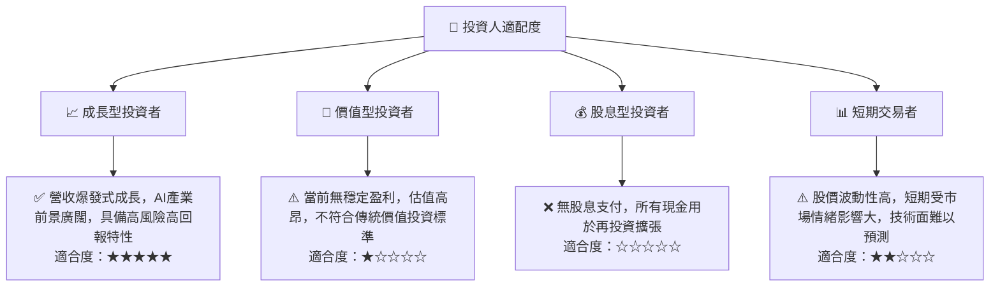

### 10.5 關鍵監控指標

| 監控類型 | 指標 | 關注點 | 頻率 |
|----------|------|--------|------|
| **成長性** | 營收 YoY/QoQ 成長率 | 是否持續保持高速增長，是否超預期 | 每季度財報 |
| **獲利能力** | 毛利率、營業利益率 | 毛利率是否穩定，營業虧損是否持續收窄 | 每季度財報 |
| **資本效率** | 自由現金流 (FCF) | 何時能轉正，或負值是否按預期收窄 | 每季度財報 |
| **財務健康** | 總現金、淨現金/負債 | 現金儲備是否充足，債務是否過快增長 | 每季度財報 |
| **估值** | Forward P/E, P/S, PEG | 相對於成長率和同業，估值是否合理 | 每月/季度 |
| **技術進展** | GPU集群規模、雲平台功能 | AI基礎設施建設進度，產品競爭力 | 不定期新聞/發布會 |
| **市場競爭** | 競爭對手動態、市場份額變化 | 市場競爭格局是否惡化，公司是否失去優勢 | 不定期行業報告 |

---

> **免責聲明**：本報告為 AI 自動生成，僅供研究參考，不構成投資建議。投資有風險，入市需謹慎。