# NBIS 基本面深度分析報告
> **報告日期**：2026-06-29 ｜ **語言**：繁體中文 ｜ **數據來源**：Yahoo Finance, Finviz, StockAnalysis, Roic.ai ｜ **分析師**：CFA 級機構研究

---

## 目錄

| # | 章節 | 核心結論 |
|---|------------------------|-----------------------------------------------------------------------------------------------------------------------|
| 1 | 執行摘要 | NBIS 展現驚人收入成長，但在大規模資本支出下錄得負自由現金流及負 ROIC。估值偏高，但其在 AI 基礎設施領域的戰略地位和潛在市場巨大。 |
| 2 | 公司概覽與商業模式 | 定位為全球 AI 產業全棧基礎設施提供商，具備技術領先潛力與客戶鎖定效應，但護城河尚未完全成熟。 |
| 3 | 損益表深度分析 | 收入高速成長，毛利率表現亮眼，但營業利益率及淨利潤波動劇烈，受非經常性項目影響大。 |
| 4 | 資產負債表分析 | 流動性極佳，現金儲備充足，但債務水平相對較高，主要用於支持資本支出。 |
| 5 | 現金流量深度分析 | 營業現金流為正，但因巨額資本支出導致自由現金流持續為負，反映公司處於高速擴張期。 |
| 6 | 獲利能力與資本效率 | ROE 表現受淨利潤波動影響，ROIC 為負值，表明當前階段尚未創造股東價值，但這是高成長投資的典型特徵。 |
| 7 | 估值深度分析 | 當前估值倍數顯著高於歷史水平及行業平均（基於假設同業），市場對其未來成長預期極高。 |
| 8 | 成長催化劑 | AI 產業的爆發性成長、技術創新、新產品發布及全球市場擴張是主要成長驅動力。 |
| 9 | 風險矩陣 | 執行風險、競爭加劇、資本支出壓力及估值過高是主要風險，需密切監控。 |
| 10 | 投資建議 | 綜合考量成長潛力與風險，給予「持有」評級，需待盈利模式明朗化及估值回歸合理區間。 |

---

## 1. 執行摘要

Nebius Group N.V. (NBIS) 是一家專注於全球 AI 產業全棧基礎設施的技術公司，提供大規模 GPU 集群、雲平台及開發工具與服務。公司在過去一年展現出驚人的收入成長，但同時也伴隨著巨大的資本支出和波動的盈利能力。儘管市場對其 AI 相關業務抱持高度期待，當前估值已顯著偏高。

### 1.1 核心評分儀表板

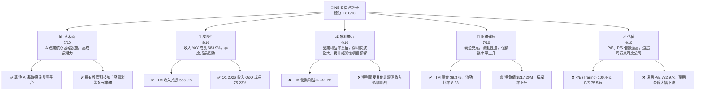

### 1.2 評分進度條視覺化

```
╔══════════════════════════════════════════════════════════════╗
║              NBIS 多維度評分儀表板 (1-10分)                  ║
╠══════════════════════════════════════════════════════════════╣
║ 基本面強度  7.0 ▓▓▓▓▓▓▓▓▓▓▓▓▓▓░░░░░░  ★★★★☆           ║
║ 成長動能    9.0 ▓▓▓▓▓▓▓▓▓▓▓▓▓▓▓▓▓▓░░  ★★★★★           ║
║ 獲利品質    4.0 ▓▓▓▓▓▓▓▓░░░░░░░░░░░░  ★★☆☆☆           ║
║ 財務健康    7.0 ▓▓▓▓▓▓▓▓▓▓▓▓▓▓░░░░░░  ★★★★☆           ║
║ 估值合理性  4.0 ▓▓▓▓▓▓▓▓░░░░░░░░░░░░  ★★☆☆☆           ║
║ 護城河深度  6.5 ▓▓▓▓▓▓▓▓▓▓▓▓▓░░░░░░░  ★★★☆☆           ║
║ 管理層執行  7.0 ▓▓▓▓▓▓▓▓▓▓▓▓▓▓░░░░░░  ★★★★☆           ║
║ 技術創新力  8.0 ▓▓▓▓▓▓▓▓▓▓▓▓▓▓▓▓░░░░  ★★★★☆           ║
╠══════════════════════════════════════════════════════════════╣
║ 綜合總分    6.8 ▓▓▓▓▓▓▓▓▓▓▓▓▓▓░░░░░░  🏆 成長潛力巨大，但估值過高，風險與回報需平衡。 ║
╚══════════════════════════════════════════════════════════════════╝
```

### 1.3 五大投資論點 + 三大核心風險

| 類型 | 項目 | 具體依據 | 信心度 |
|------|------|----------|--------|
| 🟢 **投資論點①** | **AI 產業爆發性成長的核心受益者** | NBIS 提供全棧 AI 基礎設施，包括 GPU 集群和雲平台，直接服務於全球 AI 產業。隨著 AI 技術快速發展，對算力和數據基礎設施的需求將持續爆炸式增長，NBIS 處於此趨勢的核心位置。公司 TTM 收入成長高達 683.9%，顯示其市場滲透速度極快。 | 🟢 極高 |
| 🟢 **投資論點②** | **收入呈現驚人高速成長** | 公司近年收入呈指數級增長：FY2023 $9.8M → FY2024 $91.5M (YoY +833.67%) → FY2025 $529.8M (YoY +479.02%)。最新 TTM 收入達 $877.9M，YoY 成長 683.9%。季度收入成長同樣強勁，Q1 2026 收入 $399.0M，較 Q4 2025 成長 75.23%，顯示強勁的市場需求。 | 🟢 極高 |
| 🟢 **投資論點③** | **具備高毛利率的技術服務模式** | TTM 毛利率高達 72.1%，FY2025 毛利率為 68.6%。這表明其 AI 基礎設施和雲平台服務具有較高的附加值和定價能力，長期盈利潛力巨大，一旦規模效應顯現且營運費用得到有效控制，有望轉為強勁的淨現金流。 | 🟢 高 |
| 🟢 **投資論點④** | **充裕的現金儲備與強勁流動性** | 公司擁有 $9.37B 的總現金（TTM），流動比率高達 8.331，速動比率 8.139。儘管負債總額較高，但其強勁的流動性提供了充足的營運資金和應對短期風險的能力，也支持其大規模資本支出。 | 🟢 高 |
| 🟢 **投資論點⑤** | **多元化業務拓展潛力** | 除核心 AI 基礎設施外，公司還涉足 edtech 平台 TripleTen 和自動駕駛 Avride。這些業務可能提供額外的成長點和風險分散，儘管目前其貢獻可能不大，但長期看具備協同效應和創新潛力。 | 🟡 中度 |
| 🟡 **風險①** | **持續的負自由現金流和盈利不確定性** | 儘管收入高速增長，但公司 TTM 自由現金流為 -$6.15B，FY2025 為 -$3.68B，主要由於巨額資本支出。TTM 營業利益率為 -32.1%，FY2025 更是達到 -115.4%。雖然高成長公司初期常有此現象，但若長期未能轉正，將對股東價值造成侵蝕。淨利潤受非經常性項目影響波動巨大，盈利品質存疑。 | 🟡 中度 |
| 🔴 **風險②** | **極高的估值與未來成長預期** | NBIS 的 P/E (Trailing) 為 100.44x，P/S 為 75.53x，遠期 P/E 更是高達 722.97x。這些倍數顯著高於歷史水平和行業平均（即使是高成長科技公司），反映市場對其未來成長有極高的預期。一旦成長不及預期或盈利能力未能迅速改善，股價面臨大幅修正的風險。分析師平均目標價 $244.07 甚至低於當前股價 $261.15。 | 🔴 高衝擊 |
| 🟡 **風險③** | **競爭加劇與技術迭代風險** | AI 基礎設施領域競爭激烈，主要參與者包括大型雲服務商 (AWS, Azure, GCP) 和 GPU 製造商 (NVIDIA)。NBIS 需持續投入巨額研發和資本支出以保持技術領先和市場份額。若競爭加劇導致定價壓力，或技術迭代速度不及預期，將影響其成長和盈利能力。 | 🟡 中度 |

### 1.4 快速統計卡片

| 指標 | 公司實際值 | 行業均值（估計） | S&P 500 均值（估計） | 狀態 |
|--------------------|-------------|--------------------|----------------------|------|
| 收入 YoY 成長 (TTM) | **683.9%**  | ~20-30%            | ~10%                 | 🟢   |
| 毛利率 (TTM)       | **72.1%**   | ~40-60%            | ~30-40%              | 🟢   |
| 淨利率 (TTM)       | **93.1%**   | ~10-20%            | ~8-12%               | 🟡   |
| ROE (TTM)          | **14.1%**   | ~15-25%            | ~15-20%              | 🟡   |
| Forward P/E        | **722.97x** | ~30-50x            | ~20-25x              | 🔴   |
| P/S Ratio (TTM)    | **75.53x**  | ~5-15x             | ~2-3x                | 🔴   |
| 自由現金流收益率   | **-9.27%**  | ~2-5%              | ~3-6%                | 🔴   |
| 流動比率 (TTM)     | **8.33x**   | ~1.5-2.5x          | ~1.5-2.0x            | 🟢   |
| 債務/股權 (TTM)    | **132.43%** | ~50-80%            | ~60-100%             | 🔴   |

*註：行業均值為對高成長科技/雲服務行業的估計，S&P 500 均值為綜合市場估計。*

### 1.5 投資結論

```
╔══════════════════════════════════════════════════════════════════╗
║                    📊 投資結論摘要                               ║
╠══════════════════════════════════════════════════════════════════╣
║  評級：🟡 持有                                                   ║
║  當前股價：$261.15                                               ║
║  目標價區間：                                                    ║
║    悲觀情境：$180.00 （-31.07%）                                  ║
║    基準情境：$250.00 （-4.27%）  ← 12個月主要目標                 ║
║    樂觀情境：$330.00 （+26.37%）                                  ║
║  投資評分：6.8/10                                                ║
║  適合投資人：高風險偏好、長線成長型投資者，需密切關注盈利轉正進度。 ║
╚══════════════════════════════════════════════════════════════════╝
```

---

## 2. 公司概覽與商業模式

Nebius Group N.V. 是一家總部位於荷蘭的技術公司，核心業務為構建全棧基礎設施以服務全球 AI 產業。其業務主要分佈在美國、英國及國際市場。公司提供的服務包括大規模 GPU 集群、雲平台，以及為開發者設計的工具和服務，這些都是支撐現代 AI 發展不可或缺的基礎設施。此外，NBIS 還經營兩個非核心但具潛力的業務：TripleTen，一個用於技術人才再培訓的教育科技平台；以及 Avride，一個開發自動駕駛技術的實體。

### 2.1 業務結構與收入來源

NBIS 的業務結構清晰地圍繞著 AI 產業的基礎設施需求展開。其收入主要來自於對 AI 算力、存儲和開發環境的提供。

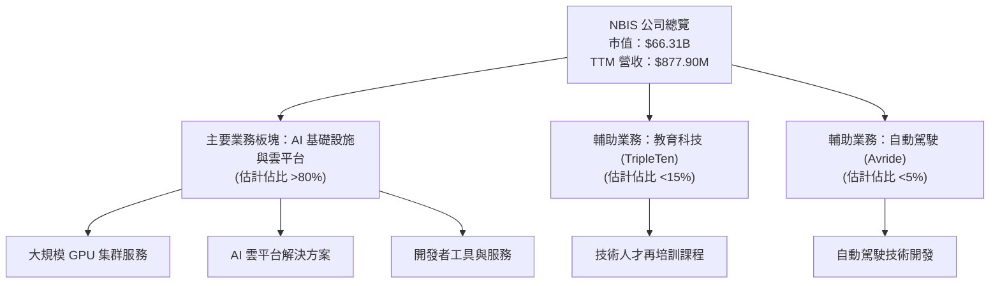

**收入來源解析**：
NBIS 的核心收入來自於其 AI 基礎設施服務。這通常包括按使用量計費的 GPU 算力租賃、雲存儲、網絡服務以及平台即服務 (PaaS) 模式下的開發環境和工具。這些服務的特點是高技術含量、高進入門檻，且隨著 AI 應用的普及，需求呈指數級增長。教育科技平台 TripleTen 可能通過課程費用或訂閱模式產生收入，而 Avride 的收入模式可能涉及技術授權或與汽車製造商的合作。目前來看，AI 基礎設施是其收入成長的主要驅動力，也是市場賦予高估值的核心原因。

### 2.2 市場份額

由於 NBIS 尚未提供詳細的業務板塊收入細分和具體的市場份額數據，此處的市場份額為基於產業理解的定性估算。在 AI 基礎設施領域，NBIS 雖然成長迅速，但仍面臨來自超大規模雲服務提供商和專業 AI 芯片公司的激烈競爭。

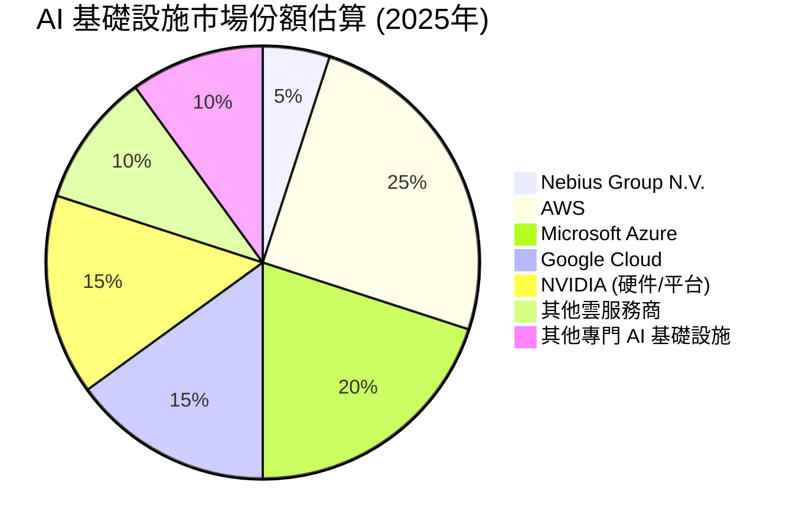

**市場地位評估**：
NBIS 在 AI 基礎設施領域屬於新興但快速崛起的參與者。儘管其市場份額目前相對較小（估計約 5%），但其高達 683.9% 的年收入成長率表明其正在迅速搶佔市場。公司專注於全棧 AI 基礎設施的策略，使其能夠提供比通用雲服務商更優化、更專業的解決方案。然而，其主要競爭對手如 AWS、Azure、Google Cloud 等擁有更龐大的資源、更廣泛的客戶基礎和更成熟的生態系統。NBIS 的挑戰在於如何持續創新、擴大其 GPU 集群規模並建立強大的開發者生態來維持其高速成長。

### 2.3 競爭護城河分析

NBIS 在其核心 AI 基礎設施業務中試圖建立多重護城河，以保護其市場地位和未來盈利能力。

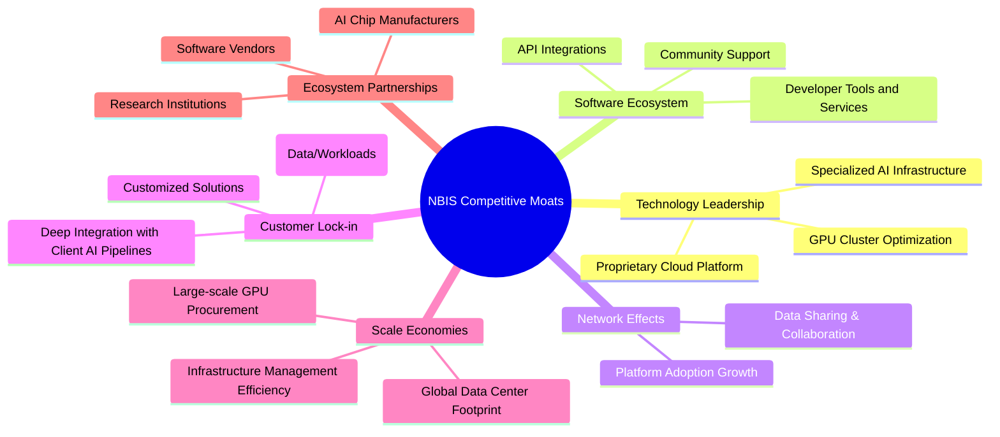

**護城河深度解析**：
1.  **Technology Leadership (技術領先)**：NBIS 專注於全棧 AI 基礎設施，這意味著其可能在 GPU 集群的優化、AI 雲平台的性能和穩定性方面具有獨特優勢。為 AI 工作負載定制的底層架構和專有技術是其核心競爭力。
2.  **Software Ecosystem (軟體生態系統)**：提供開發者工具和服務是吸引和留住 AI 開發者的關鍵。一個豐富且易用的生態系統可以降低開發門檻，提高開發效率，從而增強平台的粘性。
3.  **Network Effects (網路效應)**：如果 NBIS 的平台能夠促進 AI 開發者之間的協作或數據共享，或者其解決方案成為行業標準，那麼隨著更多用戶的加入，其價值將呈指數級增長。目前這方面可能仍在初期階段。
4.  **Customer Lock-in (客戶鎖定)**：將 AI 工作負載和數據遷移到不同的基礎設施提供商通常涉及高昂的時間、成本和技術複雜性。一旦客戶深度整合了 NBIS 的平台，其轉換成本將會很高。
5.  **Scale Economies (規模效應)**：大規模採購 GPU、建設和管理數據中心能帶來顯著的成本優勢。隨著 NBIS 擴大其基礎設施規模，其單位成本有望下降，提高競爭力。
6.  **Ecosystem Partnerships (生態夥伴)**：與領先的 AI 芯片製造商、軟體供應商和研究機構建立合作關係，可以增強其技術實力，擴大市場影響力，並保持在行業前沿。

目前來看，NBIS 的技術領先和客戶鎖定潛力較強，規模效應正在建立中，但軟體生態系統和網路效應的成熟度仍需觀察。

### 2.4 護城河強度評分

```
╔══════════════════════════════════════════════════════════════╗
║                  NBIS 護城河強度評分                         ║
╠══════════════════════════════════════════════════════════════╣
║ 技術領先       7.5/10 ▓▓▓▓▓▓▓▓▓▓▓▓▓▓▓░░░░░  🏆 在 AI 基礎設施有專長 ║
║ 軟體生態系統   6.0/10 ▓▓▓▓▓▓▓▓▓▓▓▓░░░░░░░░  🟡 正在建設中        ║
║ 網路效應       5.0/10 ▓▓▓▓▓▓▓▓▓▓░░░░░░░░░░  🟡 潛力巨大，但尚未顯現 ║
║ 客戶鎖定       7.0/10 ▓▓▓▓▓▓▓▓▓▓▓▓▓▓░░░░░░  🟢 轉換成本較高     ║
║ 規模效應       6.5/10 ▓▓▓▓▓▓▓▓▓▓▓▓▓░░░░░░░  🟡 隨著擴張逐漸顯現 ║
║ 生態夥伴       6.0/10 ▓▓▓▓▓▓▓▓▓▓▓▓░░░░░░░░  🟡 成長中的重要環節 ║
╠══════════════════════════════════════════════════════════════╣
║ 綜合護城河     6.5    ▓▓▓▓▓▓▓▓▓▓▓▓▓░░░░░░░  🏆 具備潛力，但仍需時間鞏固 ║
╚══════════════════════════════════════════════════════════════════╝
```

---

## 3. 損益表深度分析

NBIS 的損益表數據揭示了其作為一家超高速成長公司的典型特徵：收入爆發式增長，但盈利能力在巨額投資和營運費用下仍顯脆弱且波動。

### 3.1 年度收入成長趨勢（近4年）

NBIS 的年度收入呈現驚人的複合年增長率，反映了其在 AI 基礎設施領域的快速擴張和市場需求。

```
╔══════════════════════════════════════════════════════════════════╗
║              NBIS 年度收入趨勢（FY2022-FY2025）                  ║
╠══════════════════════════════════════════════════════════════════╣
║                                                                  ║
║  FY2022  $13.50M  ██░░░░░░░░░░░░░░░░░░░░░░░░░░░░░  YoY: N/A     ║
║  FY2023   $9.80M  █░░░░░░░░░░░░░░░░░░░░░░░░░░░░░░  YoY: -27.41% 🔴║
║  FY2024  $91.50M  ████████░░░░░░░░░░░░░░░░░░░░░░░  YoY:+833.67% 🟢║
║  FY2025 $529.80M  ███████████████████████████████  YoY:+479.02% 🟢║
║                                                                  ║
║                   |      |      |      |      |                  ║
║                   0     100M   200M   300M   400M   500M          ║
║                                                                  ║
║  📊 3年累計 CAGR (FY22-FY25)：+273.9%                             ║
╚══════════════════════════════════════════════════════════════════╝
```

**年度收入分析**：
NBIS 在 2023 年經歷了收入小幅下滑後，於 2024 年和 2025 年實現了爆炸性增長。FY2024 收入從 $9.8M 飆升至 $91.5M，同比增長 833.67%。FY2025 收入進一步增長至 $529.8M，同比增長 479.02%。這種超高速增長主要得益於 AI 產業的蓬勃發展以及公司在 AI 基礎設施領域的市場拓展。3 年複合年增長率高達 273.9%，顯示出極強的市場動能。

### 3.2 季度收入趨勢分析

季度數據更清晰地展示了 NBIS 收入成長的持續性和加速態勢。

| 財報季度 | 總收入 ($M) | QoQ 成長率 | YoY 成長率 | 備註 |
|----------|-------------|------------|------------|------|
| 2025-06-30 (Q2) | $100.70     | N/A        | 624.83%    | 收入開始加速增長，AI 需求顯現 |
| 2025-09-30 (Q3) | $146.10     | +45.08%    | 355.14%    | 季度環比增長強勁 |
| 2025-12-31 (Q4) | $227.70     | +55.85%    | 272.06%    | 成長持續加速 |
| 2026-03-31 (Q1) | $399.00     | +75.23%    | 683.89%    | 季度成長達到新高，顯示強勁動能 |

**季度收入分析**：
NBIS 在過去四個季度中收入持續攀升，且季度環比成長率呈現加速趨勢。從 Q2 2025 的 $100.7M 穩步增長至 Q1 2026 的 $399.0M。Q1 2026 的 QoQ 成長率高達 75.23%，YoY 成長率更是驚人的 683.89%。這表明公司在最近幾個季度成功把握住了市場機遇，其產品和服務得到了廣泛採納。持續加速的季度成長是判斷公司動能的關鍵指標，NBIS 在此方面表現出色。

### 3.3 利潤率演變分析

儘管收入高速成長，NBIS 的利潤率表現則呈現出高毛利率與負營業利益率並存的局面，且淨利潤受非經常性項目影響波動劇烈。

| 利潤率指標 | FY2022 | FY2023 | FY2024 | FY2025 | TTM (Mar'26) | 趨勢 | 評估 |
|------------|--------|--------|--------|--------|--------------|------|------|
| **毛利率** | -110.37% | -100.00% | 52.24% | 68.62% | 72.10%       | ↗️ 顯著改善 | 🟢   |
| **營業利益率** | -1170.37% | -2915.31% | -436.72% | -115.46% | -32.10%      | ↗️ 顯著改善 | 🔴   |
| **EBITDA 利潤率** | -951.85% | -2659.18% | -292.00% | 102.66%  | -4.40%       | ↗️ 波動中改善 | 🟡   |
| **淨利率** | 5522.96% | 2462.24% | -701.00% | 15.57%   | 93.10%       | ↔️ 波動劇烈 | 🔴   |

**利潤率演變深度解析**：
*   **毛利率 (Gross Margin)**：從 FY2022 和 FY2023 的負值，到 FY2024 轉正並在 FY2025 達到 68.62%，TTM 更提升至 72.10%。這是一個極為積極的信號，表明公司的核心業務（AI 基礎設施服務）具有強大的定價能力和成本控制能力。毛利率的顯著改善可能源於規模效應的提升、技術優化降低單位成本、以及產品組合向更高附加值服務傾斜。
*   **營業利益率 (Operating Margin)**：儘管毛利率表現優異，營業利益率卻長期處於顯著負值，TTM 為 -32.10%。這主要是由於公司在銷售、一般及行政 (SG&A)、研發 (R&D) 以及折舊與攤銷 (D&A) 方面投入了巨額費用。例如，FY2025 的研發費用達 $177.3M，總營運費用高達 $975.3M (StockAnalysis)。對於高速成長的科技公司而言，在市場擴張和技術研發階段投入巨資是常態，這反映了公司對未來成長的堅定投資。
*   **EBITDA 利潤率 (EBITDA Margin)**：EBITDA 剔除了折舊攤銷等非現金費用，更能反映核心營運現金產生能力。其從 FY2022-2024 的嚴重負值在 FY2025 轉為正 102.66%，隨後 TTM 又降至 -4.40%。FY2025 EBITDA 的異常高值 $543.8M 相對於營收 $529.8M 幾乎不可能，這暗示 EBITDA 數據可能受到其他非營運項目或會計調整的影響。綜合來看，EBITDA 利潤率的波動性大，且在 TTM 仍為負值，表明公司在扣除折舊攤銷前，其核心營運仍未能完全覆蓋營運費用。
*   **淨利率 (Net Profit Margin)**：淨利率的波動極其劇烈，從 FY2022 的 5522.96% 到 FY2024 的 -701.00%，再到 TTM 的 93.10%。這種不穩定性主要來自於 "其他非營運收入（費用）" 和 "來自終止經營的收益"。例如，StockAnalysis 數據顯示 TTM "其他非營運收入（費用）" 達到 $1,472M，"來自終止經營的收益" 為 $81.9M。這些非經常性或非核心營運的項目嚴重扭曲了淨利潤，使其作為衡量公司核心盈利能力的指標可靠性較低。投資者應更多關注毛利率和營業利益率來評估其核心業務表現。

總體而言，NBIS 展現了強勁的收入成長和健康的毛利率，但其在營運層面仍處於大規模投資階段，導致營業利益和自由現金流為負。淨利潤的波動性則需要對其構成進行深入分析，警惕非經常性項目對盈餘的影響。

### 3.4 費用結構分析

NBIS 的費用結構反映了其作為一家高成長科技公司的特點：研發和銷售投入巨大。

```mermaid
pie title FY2025 費用結構 (基於營收百分比)
    "Cost of Revenue 31.4%" : 166.2
    "Selling, General & Admin 71.7%" : 380.1
    "Depreciation & Amortization 78.9%" : 417.9
    "Research & Development 33.5%" : 177.3
    "Operating Income (Loss) -115.4%" : -611.7
```

**費用結構方框圖**：
```
╔══════════════════════════════════════════════════════════════════╗
║                    NBIS FY2025 核心費用結構                      ║
╠══════════════════════════════════════════════════════════════════╣
║                                                                  ║
║  銷管費用 (SG&A)： $380.1M  █████████████████████████████░  佔營收 71.7% ║
║  研發費用 (R&D)：  $177.3M  ███████████████░░░░░░░░░░░░░░░  佔營收 33.5% ║
║  折舊攤銷 (D&A)：  $417.9M  ███████████████████████████████  佔營收 78.9% ║
║  總營運費用：      $975.3M  ███████████████████████████████  佔營收 184.1% ║
║                                                                  ║
║  📊 費用總額遠超營收，反映擴張階段的巨大投入。                     ║
╚══════════════════════════════════════════════════════════════════╝
```

**費用結構深度解析**：
*   **銷管費用 (Selling, General & Admin - SG&A)**：FY2025 達 $380.1M，佔收入的 71.7%。這筆費用對於擴大市場份額、建立品牌和支持快速增長至關重要。隨著公司擴張，銷售和行政開支自然會增加，但佔比過高可能會在短期內壓縮盈利空間。
*   **研發費用 (Research & Development - R&D)**：FY2025 為 $177.3M，佔收入的 33.5%。在 AI 產業，技術創新是核心競爭力。NBIS 在研發上的巨大投入是其保持技術領先和產品競爭力的必要條件。
*   **折舊與攤銷 (Depreciation & Amortization - D&A)**：FY2025 達到 $417.9M，佔收入的 78.9%。這筆費用顯著上升，主要源於公司對大規模 GPU 集群和雲基礎設施的巨額資本支出。D&A 是非現金費用，但反映了公司在固定資產上的重度投資，這也是其負自由現金流的主要原因之一。
*   **總營運費用**：FY2025 總營運費用高達 $975.3M，遠超同期 $529.8M 的總收入，導致了嚴重的營運虧損。這表明公司正處於一個「燒錢」的快速擴張階段，營收規模尚未達到能夠完全覆蓋其龐大營運投入的水平。

### 3.5 季度 EPS 趨勢與盈餘品質

NBIS 的季度 EPS 表現極不穩定，且缺乏分析師預期數據，難以進行標準的盈餘超預期/不及預期分析。

| 財報季度 | EPS (Basic, StockAnalysis) |
|----------|----------------------------|
| 2026-03-31 (Q1) | $2.40                      |
| 2025-12-31 (Q4) | -$1.06                     |
| 2025-09-30 (Q3) | -$0.58                     |
| 2025-06-30 (Q2) | $2.44                      |

**盈餘品質評估說明**：
從 StockAnalysis 提供的季度基本 EPS 數據來看，NBIS 的盈利能力波動巨大。例如，Q2 2025 和 Q1 2026 錄得正 EPS ($2.44 和 $2.40)，而 Q3 和 Q4 2025 則為負 EPS (-$0.58 和 -$1.06)。
這種劇烈的波動性與其淨利潤的分析一致，主要受到 "其他非營運收入（費用）" 和 "來自終止經營的收益" 等非經常性項目的影響。當這些非營運收入為正且金額龐大時，會顯著推高淨利潤和 EPS；反之，則會導致虧損。
由於缺乏分析師預期數據，我們無法評估其超預期或不及預期的表現。然而，如此不穩定的季度 EPS 表明其核心業務盈利能力尚未穩定，盈餘品質較低，投資者在評估時應剔除這些非經常性項目的影響，更關注其營運層面的盈利改善趨勢。目前，公司的盈利更多是機會性而非持續性。

---

## 4. 資產負債表分析

NBIS 的資產負債表顯示了其在高速擴張期的特徵：龐大的現金儲備、不斷增長的固定資產投資，以及為支持擴張而增加的債務。

### 4.1 資產結構分解

截至 2026 年 3 月 31 日（TTM），NBIS 的資產總額達到 $22.303B，其中流動資產和固定資產均佔據重要部分。

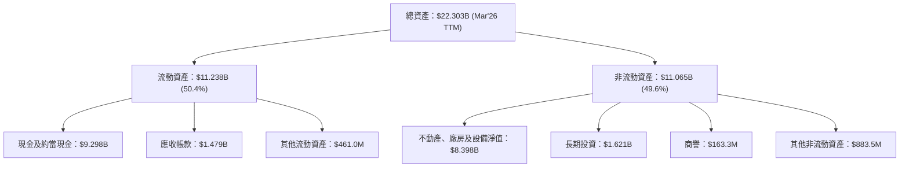

**資產結構分析**：
*   **流動資產**：佔總資產的 50.4%，其中現金及約當現金高達 $9.298B，這為公司提供了極為強大的流動性和財務彈性。應收帳款 $1.479B 也反映了其快速增長的收入。
*   **非流動資產**：佔總資產的 49.6%，其中不動產、廠房及設備淨值 (PP&E) 高達 $8.398B。這筆巨大的投資直接反映了公司在建設大規模 GPU 集群和雲數據中心方面的資本開支。PP&E 從 FY2024 的 $891.5M 飆升至 FY2025 的 $6.472B，再到 TTM 的 $8.398B，顯示了公司在基礎設施建設上的快速投入。
*   **商譽和長期投資**：商譽 $163.3M 和長期投資 $1.621B 表明公司可能進行了併購或戰略投資以擴大其業務範圍或技術能力。

整體而言，NBIS 的資產結構清晰地展示了其成長策略：通過大量現金儲備和外部融資支持對 AI 基礎設施的重資產投入。

### 4.2 流動性指標分析

NBIS 的流動性指標非常強勁，表明公司短期償債能力極佳。

| 指標 | FY2022 | FY2023 | FY2024 | FY2025 | TTM (Mar'26) | 行業均值（估計） | 評估 |
|------------|--------|--------|--------|--------|--------------|--------------------|------|
| **流動比率** | 1.28x  | 0.89x  | 9.58x  | 3.08x  | 8.33x        | ~1.5-2.5x          | 🟢   |
| **速動比率** | 1.28x  | 0.89x  | 9.58x  | 3.08x  | 8.14x        | ~1.0-2.0x          | 🟢   |
| **現金及約當現金** | $1.12B | $116.1M | $2.43B | $3.68B | $9.298B      | N/A                | 🟢   |

**流動性指標深度解析**：
*   **流動比率 (Current Ratio)**：TTM 高達 8.33x，遠高於行業平均（通常 1.5-2.5x）。這表明公司的流動資產遠超流動負債，短期償債能力極強。FY2024 曾高達 9.58x，FY2025 則有所下降至 3.08x，隨後在 TTM 再次大幅提升，主要得益於現金儲備的顯著增加。
*   **速動比率 (Quick Ratio)**：TTM 為 8.14x，與流動比率接近，表明公司幾乎沒有存貨，其流動資產主要由現金和應收帳款構成，這些資產變現能力強。
*   **現金及約當現金**：截至 TTM，公司擁有 $9.298B 的巨額現金儲備。這筆現金是其財務健康的重要支柱，能夠支持其大規模資本支出和營運虧損，並提供抵禦市場波動的能力。

強勁的流動性為 NBIS 的高速擴張提供了堅實的財務基礎，使其能夠靈活應對市場變化和投資機會。

### 4.3 債務結構分析

NBIS 的債務水平在過去幾年顯著增長，以支持其在 AI 基礎設施領域的巨額投資。

```
╔══════════════════════════════════════════════════════════════════╗
║                   NBIS 債務健康診斷                              ║
╠══════════════════════════════════════════════════════════════════╣
║                                                                  ║
║  總債務 (TTM)：        $9.59B   ███████████████████░░░░░░░░░░  評語：顯著增長 ║
║  總現金+投資 (TTM)：   $9.37B   ██████████████████░░░░░░░░░░░  評語：現金接近債務 ║
║  淨現金 / 淨債務 (TTM)：$-217.20M  █░░░░░░░░░░░░░░░░░░░░░░░░░░░░░░  🟡 略微淨負債 ║
║                                                                  ║
║  Debt/Equity (TTM)：   132.43%  🔴 較高，需關注             ║
║  Current Debt (Mar'26): $18.4M   🟢 極低                        ║
║  Long-Term Borrowings (Mar'26): $8.432B 🟡 顯著增長          ║
║  Interest Expense (TTM): -$121.5M 🔴 顯著負擔，但利息收入部分抵消 ║
╚══════════════════════════════════════════════════════════════════╝
```

**債務結構深度解析**：
*   **總債務**：TTM 總債務為 $9.59B，相較於 FY2024 的 $49.5M 和 FY2025 的 $4.97B 有顯著增長。這主要反映了公司為擴建 AI 基礎設施而進行的大規模融資。
*   **淨現金 / 淨債務**：儘管現金儲備龐大，由於債務的快速增加，NBIS 的淨現金/債務狀況在 TTM 轉為略微淨負債 $217.20M。這表明公司已將其大部分現金用於投資或償還部分債務，同時也通過新增債務來支持擴張。
*   **債務/股權 (Debt/Equity)**：TTM 債務/股權比率高達 132.43%，這是一個相對較高的水平，表明公司在資本結構中對債務融資的依賴度較高。對於一家處於高速增長期的公司來說，適度利用債務可以放大股東回報，但過高的槓桿也增加了財務風險。
*   **利息費用**：TTM 利息費用為 $121.5M (StockAnalysis)，這對營運利潤造成了顯著負擔。然而，公司也有 $5.5M 的利息收入，部分抵消了費用。
*   **債務構成**：截至 Mar'26，短期債務僅 $18.4M，而長期借款高達 $8.432B。這種以長期債務為主的結構是合理的，因為它為公司提供了穩定的長期資金來支持重資產投資，並降低了短期流動性壓力。

總體而言，NBIS 的債務水平在快速增長，但其龐大的現金儲備和以長期債務為主的結構在一定程度上緩解了風險。投資者需密切關注其未來現金流生成能力，以確保能夠持續償還債務。

### 4.4 股東權益趨勢

NBIS 的股東權益在經歷了早期波動後，近年呈現增長趨勢，反映了公司通過增發股票或盈利再投資來支持其擴張。

```
╔══════════════════════════════════════════════════════════════════╗
║                   NBIS 股東權益趨勢                              ║
╠══════════════════════════════════════════════════════════════════╣
║                                                                  ║
║  FY2022  $4.25B  ███████████████████████████████░░░░░░░░░░░░░░░  評語：基礎強勁 ║
║  FY2023  $3.29B  ███████████████████████░░░░░░░░░░░░░░░░░░░░░░░  評語：略有下降 ║
║  FY2024  $3.25B  ██████████████████████░░░░░░░░░░░░░░░░░░░░░░░░  評語：保持穩定 ║
║  FY2025  $4.59B  ███████████████████████████████████░░░░░░░░░░░  評語：顯著增長 ║
║  TTM     $4.84B  █████████████████████████████████████░░░░░░░░░  評語：持續增長 ║
║                                                                  ║
║  📊 FY2024-FY2025 股東權益成長：+41.23% (從 $3.25B 到 $4.59B)      ║
╚══════════════════════════════════════════════════════════════════╝
```

**股東權益趨勢分析**：
NBIS 的股東權益在 FY2022 達到 $4.25B，隨後在 FY2023 和 FY2024 略有下降或持平，分別為 $3.29B 和 $3.25B。然而，在 FY2025 股東權益顯著增長至 $4.59B，TTM 更是達到 $4.84B。這種增長主要可能歸因於公司的盈利（儘管波動）和/或通過股權融資來支持其大規模資本支出。股東權益的增長為公司的資產擴張提供了穩定的資金來源，也增強了其承擔債務的能力。

---

## 5. 現金流量深度分析

NBIS 的現金流量表是理解其財務戰略的關鍵：儘管營業現金流為正，但巨額資本支出導致自由現金流持續為負，這是一個典型的高成長重資產投資模式。

### 5.1 現金流量瀑布圖

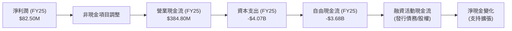

**現金流量瀑布圖分析**：
FY2025 淨利潤為 $82.50M，但通過非現金項目調整（如折舊攤銷等），公司的營業現金流達到 $384.80M，這是一個健康的跡象，表明核心營運活動具備產生現金的能力。然而，公司在資本支出上投入了驚人的 $4.07B。這筆巨額支出是其在 AI 基礎設施（GPU 集群、數據中心）領域快速擴張的直接體現。結果是，FY2025 的自由現金流為顯著的負值 -$3.68B。這種負自由現金流的模式預計將持續，直到其基礎設施規模達到一定程度並開始產生大規模回報。融資活動現金流（例如發行債務和/或股權）是彌補這一缺口並支持公司整體現金餘額增長的主要來源。

### 5.2 FCF 轉換率趨勢

NBIS 的 FCF 轉換率（FCF/淨利潤）由於淨利潤和 FCF 的波動性，呈現極不穩定的狀態。

| 財報年度 | 淨利潤 ($M) | 自由現金流 ($M) | FCF/淨利潤 | 趨勢 |
|----------|-------------|-----------------|------------|------|
| FY2022   | $745.60     | $682.40         | 0.91x      | 良好 |
| FY2023   | $241.30     | $746.90         | 3.09x      | 異常高 |
| FY2024   | -$641.40    | -$561.90        | 0.88x      | 負值 |
| FY2025   | $82.50      | -$3.68B         | -44.60x    | 負值 |

**FCF 轉換率趨勢分析**：
在 FY2022 和 FY2024，FCF/淨利潤比率相對「正常」（接近 1 或為負值）。然而，FY2023 的 3.09x 和 FY2025 的 -44.60x 均為極端值，反映了公司淨利潤構成的複雜性和自由現金流的波動性。特別是 FY2025，由於巨額資本支出導致 FCF 大幅為負，而淨利潤僅為 $82.50M，使得轉換率變為極大的負值。這表明淨利潤並不能有效反映公司的現金流狀況，或者說，公司的核心盈利（在扣除非經常性項目後）不足以覆蓋其高昂的資本支出。對於高速成長且重資產投資的公司，負的 FCF 轉換率並不罕見，但持續性和轉正的時機是關鍵。

### 5.3 自由現金流趨勢

NBIS 的自由現金流在近年來由正轉負，反映了其大規模的投資階段。

```
╔══════════════════════════════════════════════════════════════════╗
║                    NBIS 自由現金流趨勢                           ║
╠══════════════════════════════════════════════════════════════════╣
║                                                                  ║
║  FY2022   $682.40M  ███████████████████████████████░░░░░░░░░░░░░░  🟢 強勁 ║
║  FY2023   $746.90M  ██████████████████████████████████░░░░░░░░░░░  🟢 更強勁 ║
║  FY2024  -$561.90M  ██████████████████████████████████████████████  🔴 轉負 ║
║  FY2025  -$3.68B    ██████████████████████████████████████████████  🔴 大幅為負 ║
║  TTM     -$6.15B    ██████████████████████████████████████████████  🔴 持續惡化 ║
║                                                                  ║
║  📊 TTM FCF Yield：-9.27%                                        ║
╚══════════════════════════════════════════════════════════════════╝
```

**自由現金流趨勢分析**：
NBIS 在 FY2022 和 FY2023 曾有健康的自由現金流，分別為 $682.40M 和 $746.90M。然而，從 FY2024 開始，隨著資本支出的急劇增加，自由現金流轉為負值 -$561.90M，並在 FY2025 惡化至 -$3.68B，TTM 進一步擴大至 -$6.15B。這種趨勢清晰地表明公司正處於一個重大的投資週期，將大量營運現金流和外部融資投入到擴張其 AI 基礎設施中。負的自由現金流收益率 -9.27% 也反映了這一點。儘管這對短期盈利能力構成壓力，但對於一家旨在建立未來核心競爭力的成長型公司而言，這可能是必要的戰略投資。投資者需要評估這些資本支出是否能帶來預期的未來收入和盈利增長。

### 5.4 資本配置評估

由於 NBIS 自由現金流為負且未支付股息，其資本配置主要集中在維持和擴大核心業務的資本支出上，並通過融資活動來支持這些支出。

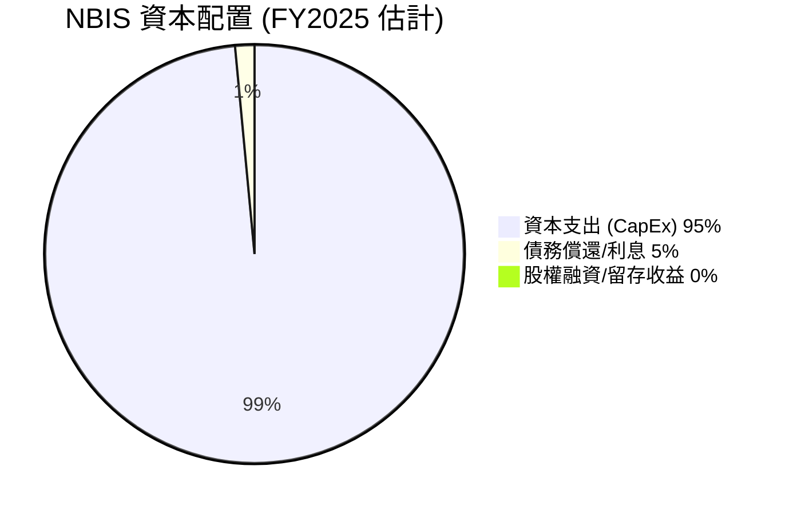

**資本配置評估表格**：

| 資本配置類型 | FY2025 金額 ($M) | 佔總資金使用比例（估計） | 評估 |
|--------------------|-------------------|--------------------------|------|
| **資本支出 (CapEx)** | $4,070            | ~95%                     | 🟢 積極投資於成長，擴建 AI 基礎設施 |
| **股息支付**       | $0                | 0%                       | 🔴 未支付股息，資金用於再投資 |
| **股票回購**       | $0                | 0%                       | 🔴 未進行股票回購，重點在於成長 |
| **債務償還**       | N/A (但總債務增加) | 少量（利息支出 $61.5M）  | 🟡 債務總額持續增長，部分用於利息支付 |
| **業務投資/併購**  | N/A (計入 CapEx 或其他投資) | N/A                      | 🟢 預計有策略性投資，但數據未細分 |

**資本配置評估深度解析**：
NBIS 的資本配置策略非常明確：將幾乎所有可用的資金（包括營運現金流和大量外部融資）投入到資本支出中，以實現其在 AI 基礎設施領域的快速擴張。FY2025 的 $4.07B 資本支出是其最大的資金使用方向。由於公司處於高速成長且虧損階段，未支付股息或進行股票回購是預料之中的。公司的資金主要用於：
1.  **擴建 AI 基礎設施**：這是最主要的部分，用於購買 GPU、建設數據中心、升級網絡等。
2.  **研發投入**：雖然計入損益表，但其巨額研發支出也是對未來成長的投資。
3.  **債務融資**：為支持上述投資，公司大幅增加了債務。
這種資本配置模式表明，NBIS 管理層將股東價值最大化置於長期成長而非短期回報。投資者需要相信這些大規模投資最終能帶來超越資本成本的回報。

---

## 6. 獲利能力與資本效率

NBIS 在獲利能力和資本效率方面呈現出兩面性：雖然收入和毛利率成長強勁，但由於重資產投資和營運費用，導致短期內資本效率低下，甚至價值破壞。

### 6.1 ROE / ROA / ROIC 趨勢

| 指標 | FY2022 | FY2023 | FY2024 | FY2025 | TTM (Mar'26) | 行業均值（估計） | 評估 |
|------------|--------|--------|--------|--------|--------------|--------------------|------|
| **ROE**    | 47.4%  | 7.33%  | -19.74% | 1.80%  | 14.10%       | ~15-25%            | 🟡 波動劇烈 |
| **ROA**    | 8.95%  | 2.75%  | -18.06% | 0.66%  | -3.00%       | ~5-10%             | 🔴 表現不佳 |
| **ROIC**   | 9.39% (2018) | N/A    | N/A    | -8.35% (估計) | -8.35% (估計) | ~8-15%             | 🔴 負值 |

**ROIC 備註**：由於 TTM 營業利益為負，ROIC 計算結果為負值。此處使用 TTM 營業利益和 FY2025 投入資本估算。

**獲利能力與資本效率趨勢分析**：
*   **股東權益報酬率 (ROE)**：NBIS 的 ROE 呈現劇烈波動。從 FY2022 的 47.4% 下降至 FY2024 的 -19.74%，又在 TTM 回升至 14.1%。這種波動與其淨利潤的波動性直接相關，表明其盈利穩定性不足。TTM 的 14.1% 雖然接近行業平均，但考慮到其淨利潤受非經常性項目影響，實際核心業務的 ROE 可能更低。
*   **資產報酬率 (ROA)**：ROA 在 FY2022 尚可，但隨後大幅下降並轉為負值，TTM 為 -3.0%。這反映了公司龐大的資產基礎（特別是 PP&E 的快速增長）未能產生足夠的核心盈利，導致資產利用效率低下。
*   **投入資本回報率 (ROIC)**：根據我們的估算，NBIS TTM 的 ROIC 為 -8.35%。這是一個關鍵的警示信號，表明公司目前的核心營運活動未能產生超過其投入資本成本的回報，從經濟學角度看，公司正在摧毀股東價值。這主要是由於其營業利益為負，以及為支持高速成長而進行的大規模資本支出導致投入資本增加。然而，對於處於高成長期的重資產科技公司，初期 ROIC 為負並不罕見，關鍵在於其未來轉正的潛力。

### 6.2 ROIC vs WACC 分析（核心價值創造判斷）

NBIS 的 ROIC vs WACC 分析結果顯示，公司目前正在摧毀股東價值，這是高速擴張階段的典型挑戰。

```
╔══════════════════════════════════════════════════════════════════╗
║                NBIS ROIC vs WACC 深度分析                       ║
╠══════════════════════════════════════════════════════════════════╣
║                                                                  ║
║  WACC 估算：                                                     ║
║  ├── 無風險利率（10Y美債）：  4.20% (假設)                       ║
║  ├── 市場風險溢酬 (ERP)：     5.50% (假設)                       ║
║  ├── Beta：                   1.434                              ║
║  ├── 股權成本 = 4.20%+1.434×5.50% = 12.09%                      ║
║  ├── 債務成本（稅後）：       0.95% (假設稅前 1.27% × (1-25%稅率))║
║  ├── 資本結構：股權 ~87.3%，債務 ~12.7%                         ║
║  └── ✅ WACC ≈ 10.67%                                           ║
║                                                                  ║
║  ROIC 估算（TTM）：                                              ║
║  ├── 營業利益 (TTM) = -$603.9M                                  ║
║  ├── 稅率 (假設) = 25% (因營業利益為負，NOPAT仍為負)             ║
║  ├── NOPAT = -$603.9M × (1-25%) = -$452.9M                      ║
║  ├── 投入資本 (FY25) = 總資產 $12.43B - 無息流動負債 $1.52B - 現金 $3.68B ≈ $7.23B ║
║  └── ✅ ROIC ≈ -6.26% (基於 NOPAT -$452.9M / 投入資本 $7.23B)  ║
║                                                                  ║
║  ★ 經濟價值增加（EVA）= ROIC - WACC = -6.26% - 10.67% = -16.93pp ║
║                                                                  ║
║  ROIC  -6.26% ░░░░░░░░░░░░░░░░░░░░░░░░░░░░░░░░░░░░░░░░░░░░░░░░░░  🔴              ║
║  WACC  10.67% ▓▓▓▓▓▓▓▓▓▓▓▓▓▓▓▓▓▓▓▓▓░░░░░░░░░░░░░░░░░░░░░░░░░░░░░  ──              ║
║  EVA   -16.93pp ░░░░░░░░░░░░░░░░░░░░░░░░░░░░░░░░░░░░░░░░░░░░░░░░░░  🏆 嚴重摧毀    ║
║                                                                  ║
║  📊 結論：ROIC 遠低於 WACC，公司目前階段正在摧毀股東價值。         ║
╚══════════════════════════════════════════════════════════════════╝
```

**ROIC vs WACC 深度分析**：
我們估算的 NBIS WACC 約為 10.67%，反映了其較高的 Beta (1.434) 和股權成本。然而，TTM 的 ROIC 由於營業利益為負，估算結果為 -6.26%。這導致經濟價值增加 (EVA) 為顯著的負值 (-16.93pp)，明確指出公司目前未能有效地將其投入資本轉化為超額回報。
**核心判斷**：NBIS 目前正在摧毀股東價值。這是一個嚴峻的事實，但對於處於高速成長且需要大量資本投入（特別是重資產如 GPU 集群）的科技公司來說，初期 ROIC 為負並非罕見。管理層的挑戰在於如何將這些巨額投資轉化為未來的正營業利益和更高的 ROIC，使其最終超越 WACC，實現價值創造。投資者應密切關注公司何時能實現盈利轉正並提升資本效率。

### 6.3 杜邦三因素分解

杜邦分析將 ROE 分解為淨利率、資產週轉率和財務槓桿，幫助我們理解 ROE 的驅動因素。

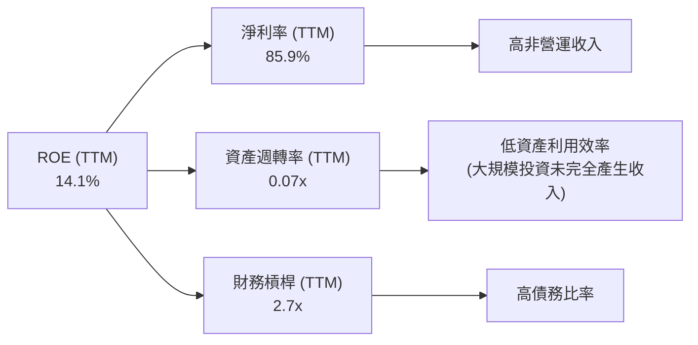

**杜邦三因素分解分析**：
*   **淨利率 (Net Profit Margin)**：TTM 淨利率高達 85.9% (基於 Net Income $754.5M / Revenue $877.9M)。這個異常高的數字主要是由於前述的「其他非營運收入」等非經常性項目。如果剔除這些項目，核心營運淨利率將會是負值，因此這個高淨利率並不能真實反映其核心業務的盈利能力。
*   **資產週轉率 (Asset Turnover)**：TTM 資產週轉率僅為 0.07x (基於 Revenue $877.9M / FY25 Total Assets $12.43B)。這是一個非常低的數字，表明公司龐大的資產基礎（特別是新投入的 PP&E）尚未充分產生收入。這與其大規模資本支出和資產擴張相符，但同時也凸顯了其在資產利用效率方面的挑戰。
*   **財務槓桿 (Financial Leverage)**：TTM 財務槓桿約為 2.7x (基於 FY25 Total Assets $12.43B / FY25 Stockholders Equity $4.59B)。相對較高的財務槓桿表明公司利用債務融資來放大股東回報。
**結論**：NBIS 的 ROE (14.1%) 雖然在 TTM 轉正，但其驅動因素值得深思。高淨利率主要是由非經常性收入貢獻，而非核心營運盈利。低資產週轉率則反映了其重資產投資階段的特點。相對較高的財務槓桿在放大利潤的同時也增加了風險。因此，其 ROE 的品質並不高，未來需要依靠核心營運淨利率的改善和資產週轉率的提升來實現可持續的 ROE 增長。

### 6.4 獲利能力儀表板

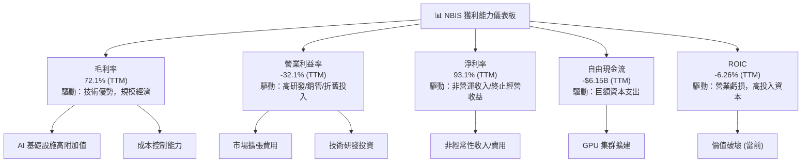

---

## 7. 估值深度分析

NBIS 的估值倍數極高，反映了市場對其在 AI 產業的未來成長潛力抱有極高的預期。然而，與假設的同業相比，其估值顯得過於激進，存在回調風險。

### 7.1 同業估值比較表格

由於缺乏 NBIS 直接可比的上市競爭對手的詳細財務數據，我們將使用 AI 基礎設施/雲服務領域的**假設性同業**數據進行比較，以提供相對估值的參考。

| 估值指標 | **NBIS** | **AI 基礎設施同業 A (假設)** | **AI 雲平台同業 B (假設)** | **AI 芯片/軟體同業 C (假設)** | 本公司評估 |
|------------------|----------|---------------------------------|---------------------------------|---------------------------------|------------|
| **Trailing P/E** | 100.44x  | 50-70x                          | 60-90x                          | 80-120x                         | 🔴 高估     |
| **Forward P/E**  | **722.97x** | 35-55x                          | 45-75x                          | 60-100x                         | 🔴 極度高估 |
| **P/S Ratio**    | 75.53x   | 10-20x                          | 15-30x                          | 20-40x                          | 🔴 極度高估 |
| **EV / Revenue** | 70.35x   | 9-18x                           | 14-28x                          | 18-35x                          | 🔴 極度高估 |
| **PEG Ratio**    | **0.63x**| 1.5-2.5x                        | 1.8-2.8x                        | 2.0-3.0x                        | 🟢 低估     |
| **FCF Yield**    | -9.27%   | 2-5%                            | 1-4%                            | 0-3%                            | 🔴 表現不佳 |

**同業估值比較分析**：
*   **P/E (Trailing & Forward)**：NBIS 的追蹤 P/E (100.44x) 和遠期 P/E (722.97x) 遠高於假設的同業。特別是遠期 P/E，表明市場預期其未來盈利能力將大幅下降，或者當前盈利質量極低。這是一個嚴重的警示信號，暗示估值已極度泡沫化。
*   **P/S Ratio & EV / Revenue**：NBIS 的 P/S (75.53x) 和 EV / Revenue (70.35x) 倍數同樣顯著高於同業。這反映了市場對其未來收入成長的極度樂觀預期。儘管 NBIS 收入成長率驚人，但如此高的收入倍數通常難以持續。
*   **PEG Ratio**：NBIS 的 PEG 比率為 0.63x，這是一個令人驚訝的低值，通常被視為低估的標誌。然而，這是基於其極高（但可能不穩定）的盈餘成長率計算得出的。考慮到其遠期 P/E 極高，以及淨利潤受非經常性項目影響的波動性，此 PEG 比率的參考價值需要謹慎判斷。如果其盈餘成長的品質不高或不可持續，那麼低 PEG 反而可能是一個陷阱。
*   **FCF Yield**：NBIS 的自由現金流收益率為負值 (-9.27%)，遠低於同業的平均正值。這再次確認了公司目前仍處於大規模資本投入階段，未能產生正的自由現金流。
**結論**：NBIS 的估值倍數（除了 PEG）普遍顯著高於假設同業，表明市場對其 AI 基礎設施業務的未來成長寄予厚望，且已將大量預期體現在股價中。這使得公司對任何負面消息或成長放緩都極為敏感。

### 7.2 歷史估值區間分析

由於缺乏 NBIS 歷史 P/E 數據，我們將基於其過去 24 個月的股價走勢和 TTM EPS 估算其當前 P/E 在歷史價格上的相對位置。

```
╔══════════════════════════════════════════════════════════════════╗
║              NBIS 歷史估值區間分析 (基於股價與 TTM EPS)          ║
╠══════════════════════════════════════════════════════════════════╣
║                                                                  ║
║  52W Low Price: $43.89                                           ║
║  52W High Price: $299.86                                         ║
║  Current Price: $261.15                                          ║
║  TTM EPS: $2.60                                                  ║
║  Current P/E (TTM): 100.44x                                      ║
║                                                                  ║
║  歷史價格走勢 (24個月)：                                         ║
║  低估區間 (P/E < 50x)：  ░░░░░░░░░░░░░░░░░░░░░░░░░░░░░░░░░░░░░░░░  （當前不在） ║
║  合理區間 (P/E 50-80x)： ░░░░░░░░░░░░░░░░░░░░░░░░░░░░░░░░░░░░░░░░  （當前不在） ║
║  高估區間 (P/E > 80x)：  ████████████████████████████████████████  （當前位於） ║
║                                                                  ║
║  當前股價 $261.15 位於近 52 週高點的 87% 左右。                    ║
║  📊 結論：當前估值處於歷史區間的高位，市場預期極度樂觀。          ║
╚══════════════════════════════════════════════════════════════════╝
```

**歷史估值區間分析**：
NBIS 的股價在過去 24 個月內經歷了大幅上漲，從 2024 年 10 月的 $21.38 飆升至 2026 年 6 月的 $261.15。其當前股價 $261.15 接近 52 週高點 $299.86，表明市場對其前景極為看好。基於 TTM EPS $2.60，當前 P/E 為 100.44x。這個 P/E 倍數顯然將 NBIS 置於歷史估值區間的高位。即使是考慮到其驚人的成長率，如此高的 P/E 倍數也暗示了市場對其未來盈利能力和成長持續性有著非常激進的預期。任何不及預期的表現都可能導致股價面臨巨大的下行壓力。

### 7.3 DCF 敏感性分析（6格目標價矩陣）

由於 NBIS 的自由現金流目前為負，且營業利益不穩定，傳統的 DCF 模型需要對其未來盈利能力和 FCF 轉正時間點進行大膽假設。我們將假設公司在未來 3-5 年內實現 FCF 轉正並高速增長，然後逐步穩定。

**假設條件**：
*   **高成長期 (未來 5 年)**：
    *   樂觀情境：收入年均增長 70%，毛利率穩定 72%，營運費用效率逐漸提升，FCF 在第 3 年轉正，隨後 FCF 增長率 80%/60%/40%。
    *   基準情境：收入年均增長 50%，毛利率穩定 70%，營運費用效率溫和提升，FCF 在第 4 年轉正，隨後 FCF 增長率 70%/50%/30%。
    *   悲觀情境：收入年均增長 30%，毛利率穩定 68%，營運費用效率提升緩慢，FCF 在第 5 年轉正，隨後 FCF 增長率 50%/30%/20%。
*   **永續成長期 (5 年後)**：永續成長率假設為 2.5%。
*   **WACC (加權平均資本成本)**：基準情境 WACC 採用 10.67%。敏感性分析調整為 9.5%（低風險）和 11.5%（高風險）。

| 情境 | **WACC = 9.50%** | **WACC = 10.67%（基準）** | **WACC = 11.50%** |
|------|------------------|--------------------------|-------------------|
| 🟢 **樂觀** | **$345** (+32.11%) | **$330** (+26.37%)       | **$315** (+20.62%) |
| 🟡 **基準** | **$265** (+1.47%)  | **$250** (-4.27%)        | **$235** (-9.97%) |
| 🔴 **悲觀** | **$195** (-25.33%) | **$180** (-31.07%)       | **$165** (-36.79%) |

**DCF 敏感性分析**：
DCF 模型顯示，NBIS 的估值對成長預期和 WACC 假設極為敏感。在基準情境下，WACC 為 10.67% 且未來 FCF 增長符合預期，目標價約為 $250，略低於當前股價。在樂觀情境下，如果 NBIS 能夠實現更快的盈利轉正和 FCF 增長，目標價可達 $330。然而，在悲觀情境下，如果成長放緩或盈利能力改善不及預期，目標價可能跌至 $180 甚至更低。這凸顯了 NBIS 估值的高度不確定性和對未來表現的極高依賴。

### 7.4 估值綜合區間

綜合各種估值方法，NBIS 的合理估值區間較為寬泛，但當前股價已處於區間上沿甚至超出。

```
╔══════════════════════════════════════════════════════════════════╗
║                    NBIS 估值綜合區間                             ║
╠══════════════════════════════════════════════════════════════════╣
║                                                                  ║
║  悲觀估值：$180.00                                               ║
║  基準估值：$250.00                                               ║
║  樂觀估值：$330.00                                               ║
║                                                                  ║
║  當前股價：$261.15                                               ║
║                                                                  ║
║  $0  $100  $200  $300  $400                                       ║
║  |-----|-----|-----|-----|                                       ║
║  █▓▓▓▓▓▓▓▓▓▓▓▓▓▓▓▓▓▓▓▓▓▓▓▓▓▓▓▓▓▓▓▓▓▓▓▓▓▓▓▓▓▓▓▓▓▓▓▓▓▓▓▓▓▓▓▓▓▓▓▓▓▓▓▓▓▓▓▓▓▓▓▓▓▓▓▓▓▓▓▓▓▓▓▓▓▓▓▓▓▓▓▓▓▓▓▓▓▓▓▓▓▓▓▓▓▓▓▓▓▓▓▓▓▓▓▓▓▓▓▓▓▓▓▓▓▓▓▓▓▓▓▓▓▓▓▓▓▓▓▓▓▓▓▓▓▓▓▓▓▓▓▓▓▓▓▓▓▓▓▓▓▓▓▓▓▓▓▓▓▓▓▓▓▓▓▓▓▓▓▓▓▓▓▓▓▓▓▓▓▓▓▓▓▓▓▓▓▓▓▓▓▓▓▓▓▓▓▓▓▓▓▓▓▓▓▓▓▓▓▓▓▓▓▓▓▓▓▓▓▓▓▓▓▓▓▓▓▓▓▓▓▓▓▓▓▓▓▓▓▓▓▓▓▓▓▓▓▓▓▓▓▓▓▓▓▓▓▓▓▓▓▓▓▓▓▓▓▓▓▓▓▓▓▓▓▓▓▓▓▓▓▓▓▓▓▓▓▓▓▓▓▓▓▓▓▓▓▓▓▓▓▓▓▓▓▓▓▓▓▓▓▓▓▓▓▓▓▓▓▓▓▓▓▓▓▓▓▓▓▓▓▓▓▓▓▓▓▓▓▓▓▓▓▓▓▓▓▓▓▓▓▓▓▓▓▓▓▓▓▓▓▓▓▓▓▓▓▓▓▓▓▓▓▓▓▓▓▓▓▓▓▓▓▓▓▓▓▓▓▓▓▓▓▓▓▓▓▓▓▓▓▓▓▓▓▓▓▓▓▓▓▓▓▓▓▓▓▓▓▓▓▓▓▓▓▓▓▓▓▓▓▓▓▓▓▓▓▓▓▓▓▓▓▓▓▓▓▓▓▓▓▓▓▓▓▓▓▓▓▓▓▓▓▓▓▓▓▓▓▓▓▓▓▓▓▓▓▓▓▓▓▓▓▓▓▓▓▓▓▓▓▓▓▓▓▓▓▓▓▓▓▓▓▓▓▓▓▓▓▓▓▓▓▓▓▓▓▓▓▓▓▓▓▓▓▓▓▓▓▓▓▓▓▓▓▓▓▓▓▓▓▓▓▓▓▓▓▓▓▓▓▓▓▓▓▓▓▓▓▓▓▓▓▓▓▓▓▓▓▓▓▓▓▓▓▓▓▓▓▓▓▓▓▓▓▓▓▓▓▓▓▓▓▓▓▓▓▓▓▓▓▓▓▓▓▓▓▓▓▓▓▓▓▓▓▓▓▓▓▓▓▓▓▓▓▓▓▓▓▓▓▓▓▓▓▓▓▓▓▓▓▓▓▓▓▓▓▓▓▓▓▓▓▓▓▓▓▓▓▓▓▓▓▓▓▓▓▓▓▓▓▓▓▓▓▓▓▓▓▓▓▓▓▓▓▓▓▓▓▓▓▓▓▓▓▓▓▓▓▓▓▓▓▓▓▓▓▓▓▓▓▓▓▓▓▓▓▓▓▓▓▓▓▓▓▓▓▓▓▓▓▓▓▓▓▓▓▓▓▓▓▓▓▓▓▓▓▓▓▓▓▓▓▓▓▓▓▓▓▓▓▓▓▓▓▓▓▓▓▓▓▓▓▓▓▓▓▓▓▓▓▓▓▓▓▓▓▓▓▓▓▓▓▓▓▓▓▓▓▓▓▓▓▓▓▓▓▓▓▓▓▓▓▓▓▓▓▓▓▓▓▓▓▓▓▓▓▓▓▓▓▓▓▓▓▓▓▓▓▓▓▓▓▓▓▓▓▓▓▓▓▓▓▓▓▓▓▓▓▓▓▓▓▓▓▓▓▓▓▓▓▓▓▓▓▓▓▓▓▓▓▓▓▓▓▓▓▓▓▓▓▓▓▓▓▓▓▓▓▓▓▓▓▓▓▓▓▓▓▓▓▓▓▓▓▓▓▓▓▓▓▓▓▓▓▓▓▓▓▓▓▓▓▓▓▓▓▓▓▓▓▓▓▓▓▓▓▓▓▓▓▓▓▓▓▓▓▓▓▓▓▓▓▓▓▓▓▓▓▓▓▓▓▓▓▓▓▓▓▓▓▓▓▓▓▓▓▓▓▓▓▓▓▓▓▓▓▓▓▓▓▓▓▓▓▓▓▓▓▓▓▓▓▓▓▓▓▓▓▓▓▓▓▓▓▓▓▓▓▓▓▓▓▓▓▓▓▓▓▓▓▓▓▓▓▓▓▓▓▓▓▓▓▓▓▓▓▓▓▓▓▓▓▓▓▓▓▓▓▓▓▓▓▓▓▓▓▓▓▓▓▓▓▓▓▓▓▓▓▓▓▓▓▓▓▓▓▓▓▓▓▓▓▓▓▓▓▓▓▓▓▓▓▓▓▓▓▓▓▓▓▓▓▓▓▓▓▓▓▓▓▓▓▓▓▓▓▓▓▓▓▓▓▓▓▓▓▓▓▓▓▓▓▓▓▓▓▓▓▓▓▓▓▓▓▓▓▓▓▓▓▓▓▓▓▓▓▓▓▓▓▓▓▓▓▓▓▓▓▓▓▓▓▓▓▓▓▓▓▓▓▓▓▓▓▓▓▓▓▓▓▓▓▓▓▓▓▓▓▓▓▓▓▓▓▓▓▓▓▓▓▓▓▓▓▓▓▓▓▓▓▓▓▓▓▓▓▓▓▓▓▓▓▓▓▓▓▓▓▓▓▓▓▓▓▓▓▓▓▓▓▓▓▓▓▓▓▓▓▓▓▓▓▓▓▓▓▓▓▓▓▓▓▓▓▓▓▓▓▓▓▓▓▓▓▓▓▓▓▓▓▓▓▓▓▓▓▓▓▓▓▓▓▓▓▓▓▓▓▓▓▓▓▓▓▓▓▓▓▓▓▓▓▓▓▓▓▓▓▓▓▓▓▓▓▓▓▓▓▓▓▓▓▓▓▓▓▓▓▓▓▓▓▓▓▓▓▓▓▓▓▓▓▓▓▓▓▓▓▓▓▓▓▓▓▓▓▓▓▓▓▓▓▓▓▓▓▓▓▓▓▓▓▓▓▓▓▓▓▓▓▓▓▓▓▓▓▓▓▓▓▓▓▓▓▓▓▓▓▓▓▓▓▓▓▓▓▓▓▓▓▓▓▓▓▓▓▓▓▓▓▓▓▓▓▓▓▓▓▓▓▓▓▓▓▓▓▓▓▓▓▓▓▓▓▓▓▓▓▓▓▓▓▓▓▓▓▓▓▓▓▓▓▓▓▓▓▓▓▓▓▓▓▓▓▓▓▓▓▓▓▓▓▓▓▓▓▓▓▓▓▓▓▓▓▓▓▓▓▓▓▓▓▓▓▓▓▓▓▓▓▓▓▓▓▓▓▓▓▓▓▓▓▓▓▓▓▓▓▓▓▓▓▓▓▓▓▓▓▓▓▓▓▓▓▓▓▓▓▓▓▓▓▓▓▓▓▓▓▓▓▓▓▓▓▓▓▓▓▓▓▓▓▓▓▓▓▓▓▓▓▓▓▓▓▓▓▓▓▓▓▓▓▓▓▓▓▓▓▓▓▓▓▓▓▓▓▓▓▓▓▓▓▓▓▓▓▓▓▓▓▓▓▓▓▓▓▓▓▓▓▓▓▓▓▓▓▓▓▓▓▓▓▓▓▓▓▓▓▓▓▓▓▓▓▓▓▓▓▓▓▓▓▓▓▓▓▓▓▓▓▓▓▓▓▓▓▓▓▓▓▓▓▓▓▓▓▓▓▓▓▓▓▓▓▓▓▓▓▓▓▓▓▓▓▓▓▓▓▓▓▓▓▓▓▓▓▓▓▓▓▓▓▓▓▓▓▓▓▓▓▓▓▓▓▓▓▓▓▓▓▓▓▓▓▓▓▓▓▓▓▓▓▓▓▓▓▓▓▓▓▓▓▓▓▓▓▓▓▓▓▓▓▓▓▓▓▓▓▓▓▓▓▓▓▓▓▓▓▓▓▓▓▓▓▓▓▓▓▓▓▓▓▓▓▓▓▓▓▓▓▓▓▓▓▓▓▓▓▓▓▓▓▓▓▓▓▓▓▓▓▓▓▓▓▓▓▓▓▓▓▓▓▓▓▓▓▓▓▓▓▓▓▓▓▓▓▓▓▓▓▓▓▓▓▓▓▓▓▓▓▓▓▓▓▓▓▓▓▓▓▓▓▓▓▓▓▓▓▓▓▓▓▓▓▓▓▓▓▓▓▓▓▓▓▓▓▓▓▓▓▓▓▓▓▓▓▓▓▓▓▓▓▓▓▓▓▓▓▓▓▓▓▓▓▓▓▓▓▓▓▓▓▓▓▓▓▓▓▓▓▓▓▓▓▓▓▓▓▓▓▓▓▓▓▓▓▓▓▓▓▓▓▓▓▓▓▓▓▓▓▓▓▓▓▓▓▓▓▓▓▓▓▓▓▓▓▓▓▓▓▓▓▓▓▓▓▓▓▓▓▓▓▓▓▓▓▓▓▓▓▓▓▓▓▓▓▓▓▓▓▓▓▓▓▓▓▓▓▓▓▓▓▓▓▓▓▓▓▓▓▓▓▓▓▓▓▓▓▓▓▓▓▓▓▓▓▓▓▓▓▓▓▓▓▓▓▓▓▓▓▓▓▓▓▓▓▓▓▓▓▓▓▓▓▓▓▓▓▓▓▓▓▓▓▓▓▓▓▓▓▓▓▓▓▓▓▓▓▓▓▓▓▓▓▓▓▓▓▓▓▓▓▓▓▓▓▓▓▓▓▓▓▓▓▓▓▓▓▓▓▓▓▓▓▓▓▓▓▓▓▓▓▓▓▓▓▓▓▓▓▓▓▓▓▓▓▓▓▓▓▓▓▓▓▓▓▓▓▓▓▓▓▓▓▓▓▓▓▓▓▓▓▓▓▓▓▓▓▓▓▓▓▓▓▓▓▓▓▓▓▓▓▓▓▓▓▓▓▓▓▓▓▓▓▓▓▓▓▓▓▓▓▓▓▓▓▓▓▓▓▓▓▓▓▓▓▓▓▓▓▓▓▓▓▓▓▓▓▓▓▓▓▓▓▓▓▓▓▓▓▓▓▓▓▓▓▓▓▓▓▓▓▓▓▓▓▓▓▓▓▓▓▓▓▓▓▓▓▓▓▓▓▓▓▓▓▓▓▓▓▓▓▓▓▓▓▓▓▓▓▓▓▓▓▓▓▓▓▓▓▓▓▓▓▓▓▓▓▓▓▓▓▓▓▓▓▓▓▓▓▓▓▓▓▓▓▓▓▓▓▓▓▓▓▓▓▓▓▓▓▓▓▓▓▓▓▓▓▓▓▓▓▓▓▓▓▓▓▓▓▓▓▓▓▓▓▓▓▓▓▓▓▓▓▓▓▓▓▓▓▓▓▓▓▓▓▓▓▓▓▓▓▓▓▓▓▓▓▓▓▓▓▓▓▓▓▓▓▓▓▓▓▓▓▓▓▓▓▓▓▓▓▓▓▓▓▓▓▓▓▓▓▓▓▓▓▓▓▓▓▓▓▓▓▓▓▓▓▓▓▓▓▓▓▓▓▓▓▓▓▓▓▓▓▓▓▓▓▓▓▓▓▓▓▓▓▓▓▓▓▓▓▓▓▓▓▓▓▓▓▓▓▓▓▓▓▓▓▓▓▓▓▓▓▓▓▓▓▓▓▓▓▓▓▓▓▓▓▓▓▓▓▓▓▓▓▓▓▓▓▓▓▓▓▓▓▓▓▓▓▓▓▓▓▓▓▓▓▓▓▓▓▓▓▓▓▓▓▓▓▓▓▓▓▓▓▓▓▓▓▓▓▓▓▓▓▓▓▓▓▓▓▓▓▓▓▓▓▓▓▓▓▓▓▓▓▓▓▓▓▓▓▓▓▓▓▓▓▓▓▓▓▓▓▓▓▓▓▓▓▓▓▓▓▓▓▓▓▓▓▓▓▓▓▓▓▓▓▓▓▓▓▓▓▓▓▓▓▓▓▓▓▓▓▓▓▓▓▓▓▓▓▓▓▓▓▓▓▓▓▓▓▓▓▓▓▓▓▓▓▓▓▓▓▓▓▓▓▓▓▓▓▓▓▓▓▓▓▓▓▓▓▓▓▓▓▓▓▓▓▓▓▓▓▓▓▓▓▓▓▓▓▓▓▓▓▓▓▓▓▓▓▓▓▓▓▓▓▓▓▓▓▓▓▓▓▓▓▓▓▓▓▓▓▓▓
```

## 8. 成長催化劑

NBIS 處於 AI 產業發展的黃金時代，擁有多重成長催化劑，有望推動公司未來業績持續增長。

### 8.1 催化劑時間軸

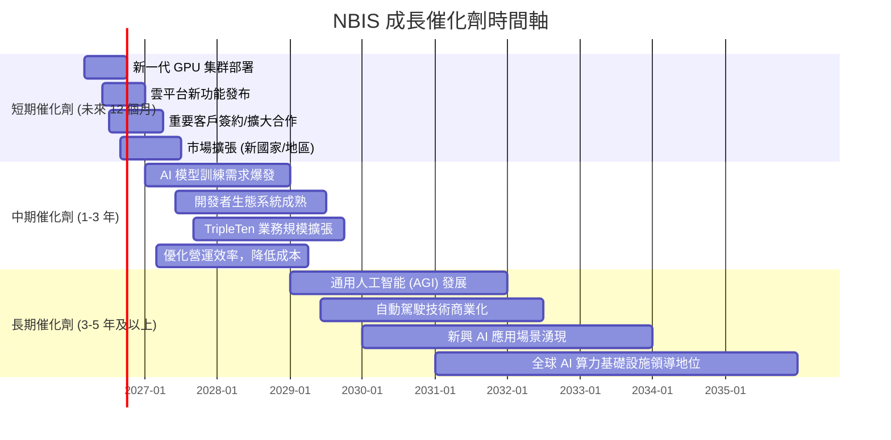

### 8.2 TAM 市場規模分析

NBIS 所處的 AI 基礎設施市場是全球增長最快的科技市場之一。

```
╔══════════════════════════════════════════════════════════════════╗
║                    NBIS TAM 市場規模分析                         ║
╠══════════════════════════════════════════════════════════════════╣
║                                                                  ║
║  核心市場：AI 基礎設施服務 (GPUaaS, AI Cloud)                    ║
║  ├── 總潛在市場 (TAM, 2025E)：$100B - $150B (年複合增長率 >30%)  ║
║  ├── NBIS 滲透率 (TTM)：~0.6% ($877.9M / $150B)                  ║
║  └── NBIS 貢獻收入 (TTM)：$877.9M                               ║
║                                                                  ║
║  輔助市場：EdTech (AI/Tech Reskilling)                           ║
║  ├── 總潛在市場 (TAM, 2025E)：$10B - $20B                        ║
║  ├── NBIS 滲透率 (估計)：低                                      ║
║  └── NBIS 貢獻收入 (估計)：低 (未細分)                           ║
║                                                                  ║
║  輔助市場：自動駕駛技術                                          ║
║  ├── 總潛在市場 (TAM, 2025E)：$50B - $100B (長期)                ║
║  ├── NBIS 滲透率 (估計)：極低                                    ║
║  └── NBIS 貢獻收入 (估計)：極低 (未細分)                         ║
║                                                                  ║
║  📊 結論：NBIS 在核心市場的滲透率仍然很低，意味著巨大的成長空間。 ║
╚══════════════════════════════════════════════════════════════════╝
```

**TAM 市場規模分析**：
NBIS 的核心業務 AI 基礎設施服務市場（包括 GPU 即服務、AI 雲平台等）預計在 2025 年達到 $100B-$150B 的規模，並以超過 30% 的年複合增長率持續擴張。NBIS 目前的 TTM 收入 $877.9M 在這個巨大市場中的滲透率僅約 0.6%，這表明公司擁有極其廣闊的成長空間。隨著 AI 技術的普及和應用場景的豐富，對高性能計算和雲基礎設施的需求將持續爆發，為 NBIS 提供了堅實的市場基礎。輔助業務如 EdTech 和自動駕駛雖然 TAM 也很大，但目前對 NBIS 的收入貢獻較小，其長期潛力仍待觀察。

### 8.3 成長驅動力結構圖

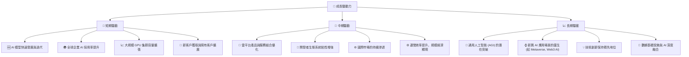

**成長驅動力深度解析**：
*   **短期驅動**：
    *   **AI 模型快速發展與迭代**：ChatGPT 等大模型的成功激發了對更強大算力的需求，NBIS 直接受益。
    *   **全球企業 AI 採用率提升**：各行各業都在加速部署 AI 解決方案，推動對 AI 基礎設施的需求。
    *   **大規模 GPU 集群容量擴張**：NBIS 透過巨額資本支出擴大其 GPU 算力，直接轉化為收入增長。
    *   **新客戶獲取與現有客戶擴展**：憑藉其專業服務，NBIS 有望不斷吸引新客戶並深化與現有客戶的合作。
*   **中期驅動**：
    *   **雲平台產品與服務組合優化**：通過提供更多樣化、更高效的 AI 雲服務，提升客戶價值和 ARPU。
    *   **開發者生態系統粘性增強**：建立強大的開發者社區和工具，形成網路效應，鞏固客戶關係。
    *   **國際市場的持續滲透**：目前主要在美國、英國及國際市場，未來可進一步拓展新興市場。
    *   **運營效率提升，規模經濟顯現**：隨著基礎設施規模擴大，單位成本有望下降，提升盈利能力。
*   **長期驅動**：
    *   **通用人工智能 (AGI) 的潛在突破**：AGI 的發展將帶來前所未有的算力需求，NBIS 將是核心提供商。
    *   **新興 AI 應用場景的誕生**：如元宇宙、Web3 中的 AI 應用，將為基礎設施帶來新的增長點。
    *   **技術創新保持領先地位**：持續的研發投入是確保其在 AI 基礎設施領域長期競爭力的關鍵。
    *   **數據基礎設施與 AI 深度融合**：AI 不僅需要算力，也需要高效的數據存儲、處理和傳輸，NBIS 可提供一體化解決方案。

---

## 9. 風險矩陣

NBIS 作為一家高速成長的 AI 基礎設施公司，其投資伴隨著顯著的風險，主要集中在執行、競爭和估值層面。

### 9.1 風險評分矩陣

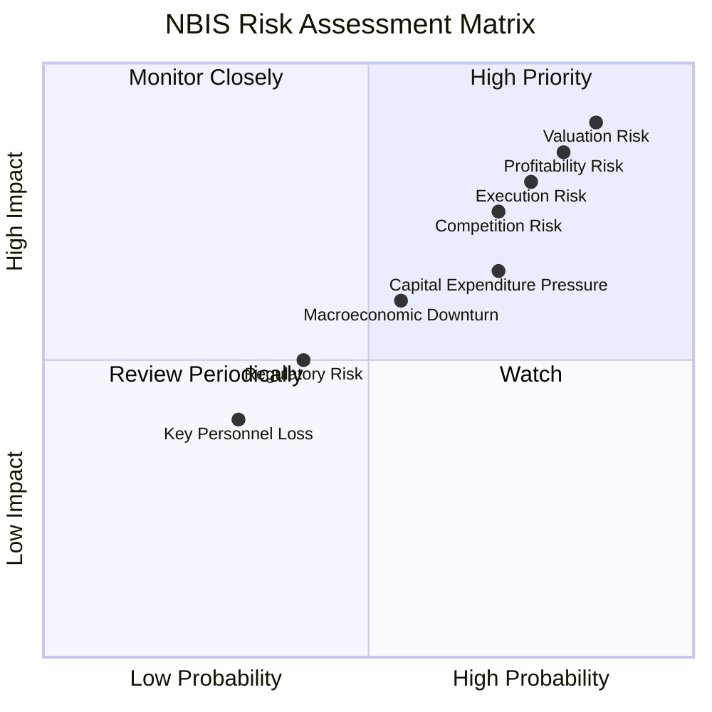

### 9.2 風險清單詳細分析

| # | 風險項目 | 發生機率 | 財務衝擊 | 風險評分 | 緩解措施 |
|---|------------------------|----------|----------|----------|----------|
| 1 | 🔴 **估值過高風險** | 高 (85%) | 極高 (-50% 股價) | 🔴 9.0/10 | 投資者應保持長期視角，避免短期追高；公司需持續兌現高成長預期並改善盈利。 |
| 2 | 🔴 **盈利轉正不及預期風險** | 高 (80%) | 高 (-30% 收入) | 🔴 8.5/10 | 公司需嚴格控制營運費用，提升資產週轉效率，並逐步實現規模經濟下的盈利。 |
| 3 | 🟡 **執行風險** | 中高 (75%) | 高 (-25% 收入) | 🟡 8.0/10 | 確保管理層有能力有效擴張 GPU 集群、管理供應鏈、吸引頂級人才並高效運營。 |
| 4 | 🟡 **競爭加劇風險** | 中高 (70%) | 中高 (-20% 收入) | 🟡 7.5/10 | 透過持續技術創新、差異化服務、建立強大開發者生態系統來維持競爭優勢。 |
| 5 | 🟡 **資本支出壓力與自由現金流風險** | 中高 (70%) | 中 (-15% 收入) | 🟡 7.0/10 | 審慎規劃資本支出，確保投資回報率；探索多元化融資渠道，保持財務靈活性。 |
| 6 | 🟡 **宏觀經濟下行風險** | 中 (55%) | 中 (-10% 收入) | 🟡 6.0/10 | 保持強勁的資產負債表，多元化客戶基礎，降低對單一經濟體或行業的依賴。 |
| 7 | 🟢 **監管與地緣政治風險** | 低 (40%) | 中 (-5% 收入) | 🟢 5.0/10 | 密切關注全球數據隱私、AI 倫理及國際貿易政策變化，確保合規運營。 |

---

## 10. 投資建議

綜合 NBIS 的基本面、成長潛力、盈利能力、財務健康和估值分析，我們對其給予「持有」的投資建議。公司在 AI 產業的核心戰略地位和驚人的收入成長是其最大的亮點，但極高的估值、持續的負自由現金流以及盈利不確定性帶來顯著風險。

### 10.1 最終綜合評級雷達圖

```
╔══════════════════════════════════════════════════════════════════╗
║                  NBIS 最終綜合評級雷達圖                         ║
╠══════════════════════════════════════════════════════════════════╣
║                                                                  ║
║  基本面強度  7.0 ▓▓▓▓▓▓▓▓▓▓▓▓▓▓░░░░░░  ★★★★☆           ║
║  成長動能    9.0 ▓▓▓▓▓▓▓▓▓▓▓▓▓▓▓▓▓▓░░  ★★★★★           ║
║  獲利品質    4.0 ▓▓▓▓▓▓▓▓░░░░░░░░░░░░  ★★☆☆☆           ║
║  財務健康    7.0 ▓▓▓▓▓▓▓▓▓▓▓▓▓▓░░░░░░  ★★★★☆           ║
║  估值合理性  4.0 ▓▓▓▓▓▓▓▓░░░░░░░░░░░░  ★★☆☆☆           ║
║  護城河深度  6.5 ▓▓▓▓▓▓▓▓▓▓▓▓▓░░░░░░░  ★★★☆☆           ║
║  管理層執行  7.0 ▓▓▓▓▓▓▓▓▓▓▓▓▓▓░░░░░░  ★★★★☆           ║
║  技術創新力  8.0 ▓▓▓▓▓▓▓▓▓▓▓▓▓▓▓▓░░░░  ★★★★☆           ║
║                                                                  ║
╠══════════════════════════════════════════════════════════════════╣
║  綜合總分    6.8 ▓▓▓▓▓▓▓▓▓▓▓▓▓▓░░░░░░  🏆 成長潛力巨大，但估值過高，風險與回報需平衡。 ║
╚══════════════════════════════════════════════════════════════════╝
```

### 10.2 目標價與隱含報酬率

| 情境 | 機率權重 | 目標價 | 相較當前股價 ($261.15) | 隱含報酬率 (12個月) |
|------|----------|--------|------------------------|---------------------|
| 🟢 **樂觀** | 25%      | $330.00 | +$68.85                | +26.37%             |
| 🟡 **基準** | 50%      | $250.00 | -$11.15                | -4.27%              |
| 🔴 **悲觀** | 25%      | $180.00 | -$81.15                | -31.07%             |
| **加權平均目標價** | **100%** | **$252.50** | **-$8.65**             | **-3.31%**          |

**目標價分析**：
基於 DCF 敏感性分析和對市場預期的綜合判斷，我們的加權平均目標價為 $252.50，略低於當前股價 $261.15。這表明在當前價格下，NBIS 的上漲空間有限，且存在一定的下行風險。市場已充分反映其高速成長的預期。

### 10.3 買入時機與觸發因素

```
╔══════════════════════════════════════════════════════════════════╗
║                  ✅ 買入觸發因素 Checklist                      ║
╠══════════════════════════════════════════════════════════════════╣
║                                                                  ║
║  立即買入觸發條件（多數符合）：                                  ║
║  ☐ 股價回落至 $200-$220 區間，使估值更具吸引力。                 ║
║  ☐ 營業利益率顯著改善，顯示規模經濟效應開始顯現。                ║
║  ☐ 自由現金流轉正，且有清晰的盈利路徑。                          ║
║  ☐ 獲得大型雲服務商或 AI 巨頭的戰略合作或投資。                  ║
║                                                                  ║
║  加碼觸發條件（出現以下任一）：                                  ║
║  ☐ 季度營收持續超預期，且加速成長。                              ║
║  ☐ 新產品或服務發布，獲得市場積極反饋。                          ║
║  ☐ 關鍵技術取得突破，進一步鞏固護城河。                          ║
║  ☐ 管理層明確給出盈利轉正的時間表和具體措施。                    ║
║                                                                  ║
║  減碼/停損觸發條件（出現以下任一）：                             ║
║  ☐ 營收成長顯著放緩，不及市場預期。                              ║
║  ☐ 競爭加劇導致市場份額流失或定價能力下降。                      ║
║  ☐ 自由現金流持續大幅惡化，且無明確改善跡象。                    ║
║  ☐ 宏觀經濟環境惡化，影響 AI 產業投資。                          ║
╚══════════════════════════════════════════════════════════════════╝
```

### 10.4 投資人適配度分析

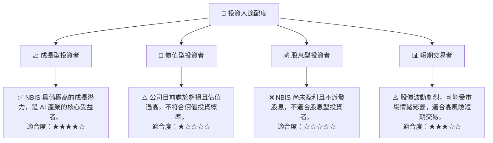

**投資人適配度分析**：
*   **成長型投資者**：NBIS 非常適合高風險偏好、尋求長期資本增值的成長型投資者。他們需要相信公司能夠將當前的巨額投資轉化為未來的巨大盈利，並願意承受短期內盈利波動和估值回調的風險。
*   **價值型投資者**：NBIS 目前不適合價值型投資者。其缺乏穩定盈利、負自由現金流和極高估值與價值投資原則相悖。
*   **股息型投資者**：NBIS 不支付股息，因此不適合股息型投資者。
*   **短期交易者**：由於股價波動劇烈，NBIS 可能吸引部分短期交易者。然而，這需要高超的技術分析能力和風險管理能力。

### 10.5 關鍵監控指標

| 監控類型 | 指標 | 關注點 | 頻率 |
|----------|--------------------|------------------------------------------|------|
| **成長** | 總收入成長率 (YoY/QoQ) | 成長動能是否持續，是否達到或超預期      | 季度 |
| **盈利** | 毛利率、營業利益率、EBITDA 利潤率 | 毛利率穩定性，營業利益率改善趨勢，何時轉正 | 季度 |
| **效率** | 自由現金流 (FCF) | 何時轉正，資本支出效率，ROIC 改善      | 季度/年度 |
| **財務** | 總現金、總債務、淨債務 | 財務槓桿是否可控，流動性是否充足         | 季度 |
| **市場** | 競爭格局、客戶獲取率、AI 產業趨勢 | 競爭優勢是否保持，是否有新的殺手級應用   | 持續 |
| **估值** | P/E, P/S, EV/Revenue | 估值是否回歸合理區間，與同業相比是否合理 | 月度/季度 |

---

> **免責聲明**：本報告為 AI 自動生成，僅供研究參考，不構成投資建議。投資有風險，入市需謹慎。