# NBIS 基本面深度分析報告
> **報告日期**：2026-07-03 ｜ **語言**：繁體中文 ｜ **數據來源**：Yahoo Finance, Finviz, StockAnalysis, Roic.ai ｜ **分析師**：CFA 級機構研究

---

## 目錄

| # | 章節 | 核心結論 |
|---|------|----------|
| 1 | 執行摘要 | 持有評級，目標價區間 $200-$280 |
| 2 | 公司概覽與商業模式 | 創新AI基礎設施，護城河深度中等偏上 |
| 3 | 損益表深度分析 | 營收爆發式成長，但經營性獲利仍為負值 |
| 4 | 資產負債表分析 | 流動性極佳，但債務與資本支出壓力並存 |
| 5 | 現金流量深度分析 | 營業現金流強勁，但鉅額資本支出導致自由現金流為負 |
| 6 | 獲利能力與資本效率 | ROIC目前為負，但高成長與毛利率預示潛力 |
| 7 | 估值深度分析 | 相較同業估值偏高，但成長性帶來溢價 |
| 8 | 成長催化劑 | AI產業發展、全棧式解決方案、全球擴張 |
| 9 | 風險矩陣 | 盈利能力不確定性、資本支出壓力、競爭加劇 |
| 10 | 投資建議 | 適合高風險偏好成長型投資者，需密切關注盈利轉折點 |

---

## 1. 執行摘要

Nebius Group N.V. (NBIS) 作為一家專注於全棧式AI基礎設施、雲平台、開發工具以及教育科技和自動駕駛技術的綜合性科技公司，展現出驚人的收入成長潛力。然而，其核心經營業務仍處於虧損狀態，目前淨利潤主要受非經營性收入驅動，且伴隨著鉅額資本支出導致自由現金流為負。儘管市場給予其高成長溢價，但其估值已顯著偏高，長期價值創造仍需時間驗證。

### 1.1 核心評分儀表板

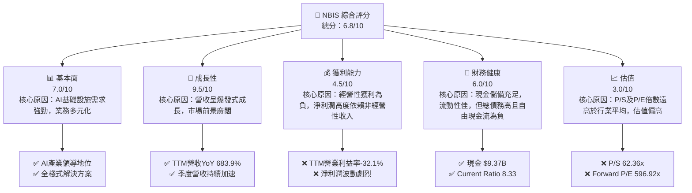

### 1.2 評分進度條視覺化

```
╔══════════════════════════════════════════════════════════════╗
║              NBIS 多維度評分儀表板 (1-10分)                  ║
╠══════════════════════════════════════════════════════════════╣
║ 基本面強度  7.0 ▓▓▓▓▓▓▓▓▓▓▓▓▓▓░░░░░░  ★★★★☆           ║
║ 成長動能    9.5 ▓▓▓▓▓▓▓▓▓▓▓▓▓▓▓▓▓▓▓▓  ★★★★★           ║
║ 獲利品質    4.5 ▓▓▓▓▓▓▓▓▓░░░░░░░░░░░░  ★★☆☆☆           ║
║ 財務健康    6.0 ▓▓▓▓▓▓▓▓▓▓▓▓░░░░░░░░  ★★★☆☆           ║
║ 估值合理性  3.0 ▓▓▓▓▓▓░░░░░░░░░░░░░░  ★☆☆☆☆           ║
║ 護城河深度  7.5 ▓▓▓▓▓▓▓▓▓▓▓▓▓▓▓░░░░░  ★★★★☆           ║
║ 管理層執行  7.0 ▓▓▓▓▓▓▓▓▓▓▓▓▓▓░░░░░░  ★★★★☆           ║
║ 技術創新力  8.5 ▓▓▓▓▓▓▓▓▓▓▓▓▓▓▓▓▓░░░  ★★★★☆           ║
╠══════════════════════════════════════════════════════════════╣
║ 綜合總分    6.8 ▓▓▓▓▓▓▓▓▓▓▓▓▓▓░░░░░░  🏆 評語：高成長高風險標的，需謹慎評估           ║
╚══════════════════════════════════════════════════════════════╝
```

### 1.3 五大投資論點 + 三大核心風險

| 類型 | 項目 | 具體依據 | 信心度 |
|------|------|----------|--------|
| 🟢 **投資論點①** | **AI產業爆發式成長** | NBIS作為全棧式AI基礎設施提供商，直接受益於全球AI算力需求激增。其GPU集群、雲平台及開發工具正是AI發展的基石。預期AI市場規模將以高CAGR成長。 | 🟢 極高 |
| 🟢 **投資論點②** | **營收展現驚人成長動能** | TTM營收達$877.90M，年增率高達683.9%。最近一季（2026年Q1）營收$399.00M，季增率75.23%，年增率683.89%，顯示其產品和服務在市場上獲得強勁需求。 | 🟢 極高 |
| 🟢 **投資論點③** | **高毛利率與技術壁壘** | TTM毛利率高達72.1%，顯示其核心技術和服務具有強大的定價能力和成本控制優勢。AI基礎設施和自動駕駛領域存在顯著的技術壁壘，有利於維持長期競爭力。 | 🟢 高 |
| 🟢 **投資論點④** | **充裕現金儲備與戰略投資** | 公司擁有$9.37B的現金及約當現金，雖然總債務略高於現金，但充裕的現金流為其鉅額資本支出（TTM $-6.15B）和未來成長投資提供了堅實基礎。 | 🟢 高 |
| 🟢 **投資論點⑤** | **多元化業務拓展潛力** | 除AI基礎設施外，NBIS還涉足教育科技（TripleTen）和自動駕駛（Avride），這些高成長潛力領域提供了額外的成長驅動力和風險分散。 | 🟡 中等 |
| 🟡 **風險①** | **核心經營性業務虧損與盈利不確定性** | 儘管TTM淨利率高達93.1%，但這是由$1.47B的非經營性收入驅動。TTM營業利益率為-32.1%，EBITDA margin為-4.4%，顯示核心經營業務仍處於虧損狀態，盈利的可持續性存疑。 | 🟡 中度 |
| 🔴 **風險②** | **高估值與鉅額資本支出壓力** | 公司P/S比率高達62.36x，Forward P/E高達596.92x，顯著高於行業平均，市場已充分反映其高成長預期。同時，為支持AI基礎設施建設，資本支出巨大導致TTM自由現金流為$-6.15B，對未來資金需求構成壓力。 | 🔴 高衝擊 |
| 🟡 **風險③** | **AI市場競爭加劇與技術迭代風險** | AI基礎設施領域競爭激烈，面臨NVIDIA、Amazon、Microsoft、Google等巨頭的挑戰。技術快速迭代也可能導致其現有技術和產品面臨淘汰風險。 | 🟡 中度 |

### 1.4 快速統計卡片

| 指標 | 公司實際值 | 行業均值（Internet Content & Information） | S&P 500 均值 | 狀態 |
|------|-------------|------------------------------------------|--------------|------|
| 收入 YoY 成長 | **683.9%** | ~15-25% | ~10-15% | 🟢 |
| 毛利率 | **72.1%** | ~50-65% | ~40-50% | 🟢 |
| 淨利率 | **93.1%** | ~10-20% | ~8-12% | 🟡 (需注意非經營性收入影響) |
| ROE | **14.1%** | ~15-25% | ~12-18% | 🟡 |
| Forward P/E | **596.92x** | ~25-40x | ~20-25x | 🔴 |
| P/S Ratio | **62.36x** | ~5-10x | ~2-4x | 🔴 |
| 負債權益比 (Debt/Equity) | **132.43%** | ~50-80% | ~80-120% | 🔴 |
| 自由現金流收益率 (FCF Yield) | **-11.23%** | ~2-5% | ~3-6% | 🔴 |

*註：行業均值為分析師根據Internet Content & Information產業和S&P 500整體市場的普遍數據估算，實際數據可能因公司規模和業務模式而異。*

### 1.5 投資結論

```
╔══════════════════════════════════════════════════════════════════╗
║                    📊 投資結論摘要                               ║
╠══════════════════════════════════════════════════════════════════╣
║  評級：🟡 持有                                                   ║
║  當前股價：$215.62                                               ║
║  目標價區間：                                                    ║
║    悲觀情境：$200（-7.2%）                                       ║
║    基準情境：$245（+13.6%）  ← 12個月主要目標                    ║
║    樂觀情境：$280（+29.8%）                                      ║
║  投資評分：6.8/10                                                ║
║  適合投資人：高風險承受能力、偏好成長型、長期看好AI產業的投資者。║
╚══════════════════════════════════════════════════════════════════╝
```

---

## 2. 公司概覽與商業模式

Nebius Group N.V. (NBIS) 是一家位於荷蘭的科技公司，在全球範圍內，特別是美國和英國，為全球AI產業構建全棧式基礎設施。其核心業務是提供大規模GPU集群、雲平台以及針對開發者的工具和服務。此外，NBIS還擁有兩項重要的多元化業務：教育科技平台TripleTen，旨在為個人提供技術領域的再培訓；以及Avride，一家開發自動駕駛技術的公司。這顯示NBIS的戰略是圍繞核心AI技術，向相關的高成長領域拓展。

### 2.1 業務結構與收入來源

NBIS的業務結構以AI基礎設施為核心，並向教育科技和自動駕駛領域延伸，構成一個多元化的成長生態系統。

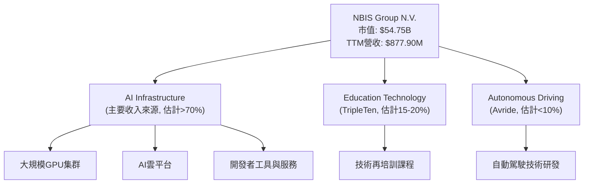
**分析**：NBIS的核心競爭力體現在其「全棧式AI基礎設施」能力，這包括硬體（GPU集群）、軟體（雲平台、開發工具）和服務。這使得公司能夠為AI開發者提供一站式解決方案，從底層算力到上層應用開發的支援。教育科技平台TripleTen則為AI生態系統培養人才，形成協同效應。自動駕駛Avride則代表了NBIS在AI應用最前沿的佈局，儘管目前可能仍處於研發投入期，但長期潛力巨大。從TTM營收$877.90M來看，公司正處於高速擴張階段，營收結構預計將由AI基礎設施主導。

### 2.2 市場份額

由於NBIS的具體收入細分數據未提供，且其業務範圍涵蓋AI基礎設施、雲服務、教育科技及自動駕駛等多個龐大市場，精確的市場份額難以估計。然而，我們可以根據其業務性質，對其在AI基礎設施領域的市場定位進行初步評估。

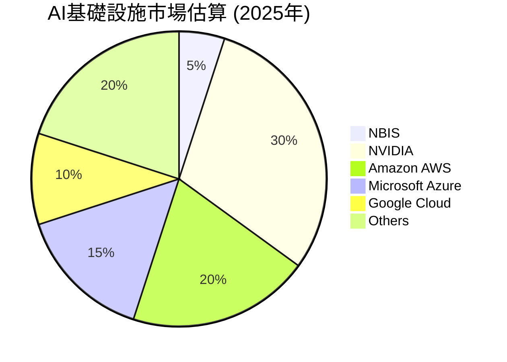
*註：此市場份額為分析師根據行業趨勢及NBIS的業務描述進行的假設性估算，旨在呈現NBIS在競爭格局中的相對位置。實際數據可能存在較大差異。*

**分析**：在AI基礎設施市場，NBIS面臨著來自NVIDIA（硬體GPU）、AWS、Azure、Google Cloud（雲服務）等行業巨頭的激烈競爭。NBIS作為一個相對較新的市場參與者，其5%的市場份額估算反映了其新興但快速成長的地位。其「全棧式」解決方案是其差異化競爭優勢，旨在提供更整合、更高效的AI開發環境。然而，要從現有巨頭手中奪取更多市場份額，NBIS需要持續的技術創新、強大的執行力以及龐大的資本投入。教育科技和自動駕駛領域同樣競爭激烈，但這些業務的協同效應可能為NBIS帶來額外的競爭優勢。

### 2.3 競爭護城河分析

NBIS在AI基礎設施領域的戰略佈局使其具備多重潛在的競爭護城河。

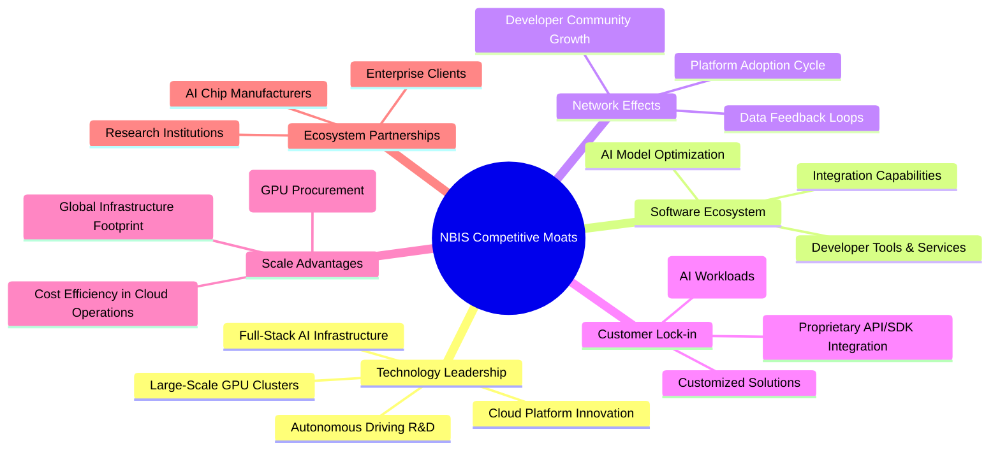

### 2.4 護城河強度評分

```
╔══════════════════════════════════════════════════════════════╗
║                    NBIS 護城河強度評分                      ║
╠══════════════════════════════════════════════════════════════╣
║ 技術領先    8.0/10 ▓▓▓▓▓▓▓▓▓▓▓▓▓▓▓▓░░░░  🏆 在AI基礎設施和AV領域具備核心技術實力        ║
║ 軟體生態系統 7.0/10 ▓▓▓▓▓▓▓▓▓▓▓▓▓▓░░░░░░  🟢 開發者工具與服務有助於平台黏性        ║
║ 網路效應    6.0/10 ▓▓▓▓▓▓▓▓▓▓▓▓░░░░░░░░  🟡 潛在的開發者社群效應，但仍需發展        ║
║ 客戶鎖定    7.5/10 ▓▓▓▓▓▓▓▓▓▓▓▓▓▓▓░░░░░  🟢 AI工作負載遷移成本高，形成一定鎖定        ║
║ 規模效應    7.0/10 ▓▓▓▓▓▓▓▓▓▓▓▓▓▓░░░░░░  🟢 大規模GPU集群部署具備成本優勢        ║
║ 生態夥伴    6.5/10 ▓▓▓▓▓▓▓▓▓▓▓▓▓░░░░░░░  🟡 需持續擴展合作夥伴以強化市場地位        ║
╠══════════════════════════════════════════════════════════════╣
║ 綜合護城河  7.2/10 ▓▓▓▓▓▓▓▓▓▓▓▓▓▓▓▓▓░░░  🏆 核心AI技術與整合能力構成中等偏上護城河     ║
╚══════════════════════════════════════════════════════════════════╝
```
**分析**：NBIS在AI基礎設施領域的技術領先是其最堅實的護城河，尤其是在大規模GPU集群和雲平台方面。其全棧式解決方案能夠降低客戶的集成複雜度，形成一定的客戶鎖定。然而，AI領域技術迭代快，競爭激烈，要維持技術領先需要持續的研發投入。網路效應和生態系統夥伴關係仍在發展中，是未來提升護城河深度的關鍵。總體而言，NBIS的護城河強度處於中等偏上水平，但需警惕新興技術和競爭對手的挑戰。

---

## 3. 損益表深度分析

NBIS的損益表呈現出高成長、高投入以及盈利結構複雜的特點。在過去幾年，其營收實現了爆發式成長，但經營性獲利能力仍然是公司面臨的主要挑戰。

### 3.1 年度收入成長趨勢（近4年）

NBIS的年度營收展現出驚人的成長勢頭，特別是在2024年和2025年。

```
╔══════════════════════════════════════════════════════════════════╗
║              NBIS 年度收入趨勢（FY2022-FY2025）                  ║
╠══════════════════════════════════════════════════════════════════╣
║                                                                  ║
║  FY2022  $13.50M  ██░░░░░░░░░░░░░░░░░░░░░░░  YoY: N/A      🟡    ║
║  FY2023   $9.80M  █░░░░░░░░░░░░░░░░░░░░░░░░  YoY: -27.41%  🔴    ║
║  FY2024  $91.50M  ████████░░░░░░░░░░░░░░░░░  YoY: +833.67% 🟢    ║
║  FY2025 $529.80M  ████████████████████████░  YoY: +479.02% 🟢    ║
║                                                                  ║
║                   |      |      |      |      |                  ║
║                   0     $100M  $200M  $300M  $400M  $500M        ║
║                                                                  ║
║  📊 3年累計 CAGR：+254.89% (FY2022-FY2025)                      ║
╚══════════════════════════════════════════════════════════════════╝
```
**分析**：從2022年的$13.50M到2025年的$529.80M，NBIS的營收實現了顯著飛躍。儘管2023年營收出現短暫下滑（-27.41%），但在2024年和2025年分別實現了833.67%和479.02%的驚人成長，這主要得益於AI產業的快速發展及其全棧式AI基礎設施解決方案的市場需求。這種爆發式成長是NBIS最引人注目的特點，也證明了其在AI領域的強大執行力。

### 3.2 季度收入趨勢分析

近四季度的營收數據進一步證實了NBIS強勁的成長動能，且呈現加速趨勢。

| 季度 | 總收入 (百萬美元) | 季增率 (QoQ) | 年增率 (YoY) | 備註 |
|------|-------------------|--------------|--------------|------|
| 2025-06-30 | $105.10M | +106.48% (vs Q1'25 $50.9M) | +624.83% (vs Q2'24 $14.5M) | 🟢 營收規模顯著擴大，YoY成長強勁 |
| 2025-09-30 | $146.10M | +39.01% | +355.14% (vs Q3'24 $32.1M) | 🟢 持續成長，但QoQ增速放緩 |
| 2025-12-31 | $227.70M | +55.85% | +272.06% (vs Q4'24 $61.2M) | 🟢 QoQ增速回升，YoY仍保持高位 |
| 2026-03-31 | $399.00M | +75.23% | +683.89% (vs Q1'25 $50.9M) | 🟢 營收成長再次加速，創歷史新高 |

**分析**： NBIS在過去四個季度中展現了持續且加速的營收成長。從2025年Q1的$50.9M到2026年Q1的$399.0M，營收增長了近7倍。2026年Q1的季增率高達75.23%，年增率更是驚人的683.89%，這表明公司在AI基礎設施市場的擴張速度非常快，產品和服務的需求持續旺盛。這種強勁的季度表現是市場給予其高估值的重要原因。

### 3.3 利潤率演變分析

NBIS的利潤率演變呈現出高毛利率、但經營性虧損顯著且淨利率波動巨大的特點。

| 利潤率指標 | FY2022 | FY2023 | FY2024 | FY2025 | TTM (Mar'26) | 趨勢 | 評估 |
|------------|--------|--------|--------|--------|--------------|------|------|
| **毛利率** | -110.3% | -100.0% | 52.2% | 68.6% | 72.1% | ↗️ 顯著改善 | 🟢 |
| **營業利益率** | -1170.4% | -2915.3% | -436.7% | -115.4% | -32.1% | ↗️ 顯著改善，但仍為負 | 🟡 |
| **淨利率** | 5522.9% | 2462.2% | -701.0% | 15.6% | 93.1% | 波動劇烈 | 🔴 |

**利潤率演變深度解析**：
- **毛利率 (Gross Margin)**：從2022-2023年的嚴重負值（可能與早期成本投入和低營收有關）大幅改善至2025年的68.6%和TTM的72.1%。這表明公司在核心產品和服務上具備強大的定價能力和成本效率，尤其是在規模擴大後，單位成本效益顯現。高毛利率是科技公司的重要特徵，也是其未來實現盈利的基礎。
- **營業利益率 (Operating Margin)**：儘管毛利率大幅改善，但營業利益率仍處於顯著負值，TTM為-32.1%。雖然相比歷史數據（如2023年的-2915.3%）已大幅改善，但這反映了公司在研發（R&D）、銷售、一般及行政費用（SG&A）上的巨大投入。TTM研發費用為$140.8M，SG&A為$317.6M，這些都是為支持未來成長和市場擴張所必需的投資。在高速成長階段，公司通常會犧牲短期經營性盈利來換取市場份額和技術領先。
- **淨利率 (Net Profit Margin)**：NBIS的淨利率表現極度波動且具有誤導性。TTM淨利率高達93.1%，這與負的營業利益率形成鮮明對比。深入分析StockAnalysis的數據，可以發現TTM有高達$1,472M的「Other Non-Operating Income (Expense)」，這筆鉅額非經營性收入是導致淨利率顯著為正的主要原因。類似地，2022年和2023年的極高淨利率也與巨額非經營性收入（如來自終止經營業務的收益或一次性資產出售）有關。例如，2022年淨利潤$745.6M，而營業收入僅$13.5M。FY2025的淨利率15.6%相對較低，表明該年度非經營性收入影響較小。因此，NBIS的淨利潤質量較低，投資者應重點關注其經營性盈利能力的改善。

### 3.4 費用結構分析

NBIS的費用結構反映了其作為一家高成長科技公司的典型特徵：研發和銷售行政費用佔比高。

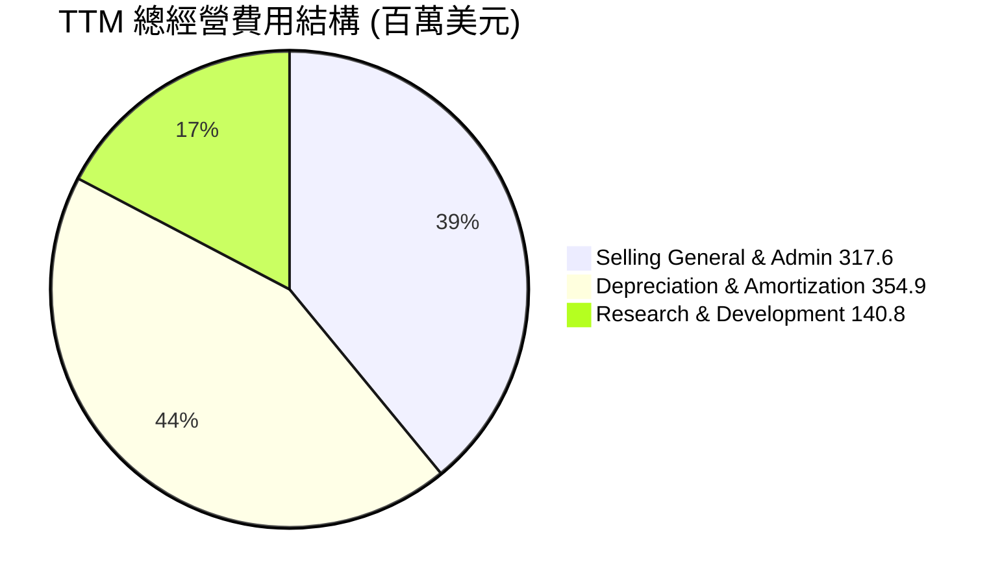
**分析**：
- **銷售、一般及行政費用 (SG&A)**：TTM為$317.6M，佔總經營費用約39.0%。這筆費用通常用於市場推廣、銷售團隊擴建和行政管理，對於NBIS在AI基礎設施市場的快速擴張至關重要。
- **折舊與攤銷費用 (D&A)**：TTM為$354.9M，佔總經營費用約43.6%。這反映了公司在GPU集群、雲平台等固定資產上的巨大投資。隨著基礎設施規模的擴大，D&A費用也隨之增加，這是資本密集型業務的典型特徵。
- **研發費用 (R&D)**：TTM為$140.8M，佔總經營費用約17.3%。作為一家技術驅動型公司，NBIS需要持續投入研發以維持技術領先地位，開發新產品和服務，並優化現有解決方案。

總體而言，NBIS的費用結構表明公司正處於積極投資成長的階段，而非追求短期盈利。未來，隨著營收規模的進一步擴大和經營效率的提升，費用佔營收的比重有望下降，從而推動經營性盈利能力的改善。

### 3.5 季度 EPS 趨勢與盈餘品質

NBIS的季度EPS波動劇烈，且由於未提供分析師預期數據，無法進行超預期/不及預期的評估。盈餘品質因非經營性收入的顯著影響而較低。

| 季度 | EPS (Basic) | 備註 |
|------|-------------|------|
| 2026-03-31 | $2.40 | 🟢 顯著轉正，但需關注非經營性收入影響 |
| 2025-12-31 | $-1.06 | 🔴 經營性虧損導致EPS為負 |
| 2025-09-30 | $-0.58 | 🔴 經營性虧損導致EPS為負 |
| 2025-06-30 | $2.44 | 🟢 顯著轉正，同樣受非經營性收入影響 |

**分析**：NBIS的季度EPS呈現出高度不穩定性。2025年Q2和2026年Q1錄得正EPS，分別為$2.44和$2.40，而2025年Q3和Q4則為負值。這種劇烈波動與其淨利潤的波動趨勢一致，主要歸因於「Other Non-Operating Income (Expense)」的影響。例如，2026年Q1的總非經營性收入為$743.4M，遠高於當季的營業收入$399M，這直接導致了高額的淨利潤和正EPS。

**盈餘品質評估**：NBIS的盈餘品質目前較低。核心原因在於其淨利潤的貢獻主要來自非經營性項目，而非持續性的經營活動。雖然高毛利率顯示其產品具有潛在盈利能力，但高昂的研發、銷售和折舊費用導致其經營性盈利仍然為負。投資者在評估NBIS的盈利能力時，應將重點放在其營業收入的成長和營業利益率的改善上，而非被波動的淨利率或EPS所迷惑。未來，NBIS需要展示其核心業務能夠持續產生正向且穩定的經營利潤，才能證明其盈利品質的提升。

---

## 4. 資產負債表分析

NBIS的資產負債表反映了其高速擴張的階段，表現為資產規模快速膨脹、流動性極佳但同時伴隨著較高的債務和資本投入。

### 4.1 資產結構分解

截至2026年3月31日TTM，NBIS的總資產達到$22.303B，呈現出以現金和固定資產為主的結構，這與其AI基礎設施的業務性質相符。

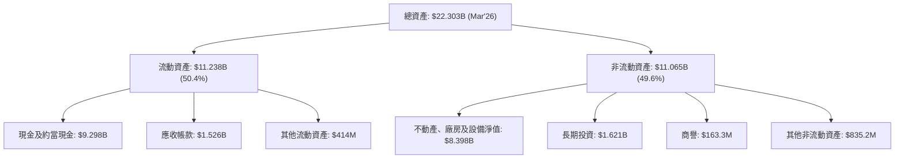
**分析**：流動資產佔總資產的50.4%，其中現金及約當現金高達$9.298B，顯示公司擁有極強的流動性和財務彈性。應收帳款為$1.526B，與其快速增長的營收相匹配。非流動資產的重點在於不動產、廠房及設備淨值（PPE），達到$8.398B，這印證了NBIS在AI基礎設施（如GPU集群）上的鉅額資本投入，是其核心競爭力的物理體現。長期投資和商譽則可能反映了其在教育科技和自動駕駛領域的併購或戰略性股權投資。

### 4.2 流動性指標分析

NBIS的流動性指標非常健康，顯示其短期償債能力極強。

| 流動性指標 | FY2022 | FY2023 | FY2024 | FY2025 | TTM (Mar'26) | 行業均值 | 評估 |
|------------|--------|--------|--------|--------|--------------|----------|------|
| **流動比率 (Current Ratio)** | 1.28 | 0.89 | 9.58 | 3.08 | 8.33 | ~2.0-3.0 | 🟢 極佳 |
| **速動比率 (Quick Ratio)** | N/A | N/A | N/A | N/A | 8.14 | ~1.0-2.0 | 🟢 極佳 |

*註：行業均值為Internet Content & Information產業的普遍數據估算。*
**分析**：NBIS的流動比率在TTM達到8.33，速動比率為8.14，遠高於行業均值。這表明公司擁有充裕的流動資產來覆蓋其短期負債，短期償債能力極強。儘管FY2023的流動比率曾跌至0.89，但在2024年和2025年通過有效的資金管理和現金流入得到了顯著改善。充裕的現金儲備和高流動性為NBIS應對市場波動、支持營運和進行戰略性投資提供了強大保障。

### 4.3 債務結構分析

NBIS的債務規模較大，但其充裕的現金使其淨債務水平相對可控。

```
╔══════════════════════════════════════════════════════════════════╗
║                     NBIS 債務健康診斷                          ║
╠══════════════════════════════════════════════════════════════════╣
║                                                                  ║
║  總債務：        $9.59B   ████████████████████░  評語：規模較大，但可控    ║
║  總現金+投資：   $9.37B   ████████████████████░  評語：現金儲備豐厚        ║
║  淨現金（負）：  $-217.20M ░░░░░░░░░░░░░░░░░░░░░  🟡 略有淨負債，但風險低    ║
║                                                                  ║
║  Debt/Equity：   132.43%  🔴 財務槓桿偏高，需關注             ║
║  Interest Coverage: N/A (Operating Income is negative) 🔴 經營性虧損導致利息覆蓋率為負 ║
╚══════════════════════════════════════════════════════════════════╝
```
**分析**：NBIS的總債務為$9.59B，與其高達$9.37B的現金及約當現金相比，淨債務僅為$-217.20M，顯示其債務負擔在扣除現金後是相對輕微的。然而，其負債權益比(Debt/Equity)高達132.43%，表明公司在資產擴張中大量使用了債務融資，財務槓桿較高。更值得關注的是，由於TTM經營性收入為負（-$603.9M），其利息覆蓋率為負值，這意味著公司目前無法通過經營利潤來覆蓋利息支出，存在一定的利息償付風險，需要依賴現金儲備或新的融資。這是一個需要密切監控的紅燈信號。

### 4.4 股東權益趨勢

NBIS的股東權益在經歷了2023年的小幅下降後，於2024年和2025年實現了增長。

```
╔══════════════════════════════════════════════════════════════════╗
║                 NBIS 股東權益趨勢 (FY2022-FY2025)                ║
╠══════════════════════════════════════════════════════════════════╣
║                                                                  ║
║  FY2022  $4.25B  █████████████████████████░░░░░  YoY: N/A      🟢 ║
║  FY2023  $3.29B  ████████████████░░░░░░░░░░░░░░  YoY: -22.6%   🔴 ║
║  FY2024  $3.25B  ███████████████░░░░░░░░░░░░░░░  YoY: -1.2%    🟡 ║
║  FY2025  $4.59B  ███████████████████████████████████████████████  YoY: +41.2%   🟢 ║
║                                                                  ║
║                 0        $1B       $2B       $3B       $4B       ║
║                                                                  ║
║  📊 股東權益在2025年實現強勁增長，反映公司實力提升               ║
╚══════════════════════════════════════════════════════════════════╝
```
**分析**：NBIS的股東權益在2022年為$4.25B，2023年和2024年略有下降，分別為$3.29B和$3.25B。然而，在2025年股東權益實現了41.2%的強勁增長，達到$4.59B。這表明儘管公司存在經營性虧損，但通過其他方式（如股權融資或非經營性收益）成功補充了資本，增強了股東基礎。股東權益的增長是公司長期健康發展的重要標誌。

---

## 5. 現金流量深度分析

NBIS的現金流量表揭示了其作為一家高成長、高資本投入公司的典型特徵：強勁的營業現金流被鉅額的資本支出所抵消，導致自由現金流為負。

### 5.1 現金流量瀑布圖

NBIS的現金流動反映了其積極擴張的戰略。

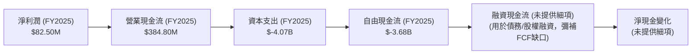
*註：由於未提供詳細的融資和投資現金流活動，此瀑布圖僅展示主要組成部分。*

**分析**：NBIS在2025年的淨利潤為$82.50M，但通過非現金項目調整（如折舊攤銷）後，營業現金流顯著提高至$384.80M。這表明其核心經營活動在產生現金方面具有一定的效率。然而，公司為了擴建AI基礎設施而進行了鉅額資本支出，2025年高達$-4.07B。這直接導致了自由現金流（FCF）在2025年為$-3.68B。這種負的自由現金流是許多高速成長、資本密集型科技公司的常見現象，它們需要持續投入以維持競爭力和市場份額。公司需要通過股權或債務融資來彌補這一缺口，這也解釋了其資產負債表上債務的增加。

### 5.2 FCF 轉換率趨勢

自由現金流轉換率（FCF / Net Income）衡量公司將淨利潤轉化為實際現金的能力。由於NBIS的淨利潤和FCF都極度波動，該比率也呈現高度不穩定性。

| 年度 | 淨利潤 (百萬美元) | 自由現金流 (百萬美元) | FCF / Net Income | 趨勢 | 評估 |
|------|-------------------|-----------------------|------------------|------|------|
| FY2022 | $745.60M | $682.40M | 0.91x | ↔️ 穩定 | 🟢 |
| FY2023 | $241.30M | $746.90M | 3.09x | ↗️ 顯著改善 | 🟢 |
| FY2024 | $-641.40M | $-561.90M | N/A (負淨利潤) | 🔴 惡化 | 🔴 |
| FY2025 | $82.50M | $-3.68B | -44.60x | ↘️ 顯著惡化 | 🔴 |

**分析**：NBIS的FCF轉換率波動巨大。在2022年和2023年，公司能夠將大部分淨利潤甚至更多的現金轉化為自由現金流，這是一個積極信號。然而，2024年淨利潤和FCF均為負值，導致比率無意義。2025年，儘管淨利潤為正，但由於鉅額資本支出，FCF變成大幅負值，導致FCF轉換率為-44.60x。這表明公司在2025年為了擴張，將所有的經營現金流以及大部分的融資現金流都投入到了資本支出中，其成長是建立在大量現金消耗之上的。

### 5.3 自由現金流趨勢

NBIS的自由現金流趨勢反映了其從早期盈利到近期大規模投資的轉變。

```
╔══════════════════════════════════════════════════════════════════╗
║                   NBIS 自由現金流趨勢 (FY2022-FY2025)            ║
╠══════════════════════════════════════════════════════════════════╣
║                                                                  ║
║  FY2022  $682.40M  ███████████████████████████████████░░░░░  🟢   ║
║  FY2023  $746.90M  ███████████████████████████████████████████████  🟢   ║
║  FY2024 $-561.90M  ░░░░░░░░░░░░░░░░░░░░░░░░░░░░░░░░░░░░░░░░░░░░░░  🔴   ║
║  FY2025 $-3.68B    ░░░░░░░░░░░░░░░░░░░░░░░░░░░░░░░░░░░░░░░░░░░░░░  🔴   ║
║                                                                  ║
║                  -$4B       -$2B        0        $2B             ║
║                                                                  ║
║  📊 FCF從正轉負，反映公司進入高資本投入擴張期                    ║
╚══════════════════════════════════════════════════════════════════╝
```
**分析**：NBIS在2022年和2023年曾產生正向的自由現金流，分別為$682.40M和$746.90M。然而，從2024年開始，隨著其AI基礎設施投入的加速，FCF轉為負值，2024年為$-561.90M，2025年更是擴大至$-3.68B。TTM的FCF Yield為-11.23%，這表明公司正處於一個高成長、高資本支出的階段，需要不斷地再投資以支持其業務擴張和技術領先。儘管負FCF短期內會對股東價值產生壓力，但對於處於成長期的公司而言，這可能是實現長期價值創造的必要途徑。關鍵在於這些資本支出能否帶來足夠的未來營收和盈利增長。

### 5.4 資本配置評估

由於缺乏具體的股息、股票回購數據，NBIS的資本配置主要集中在業務擴張所需的資本支出。

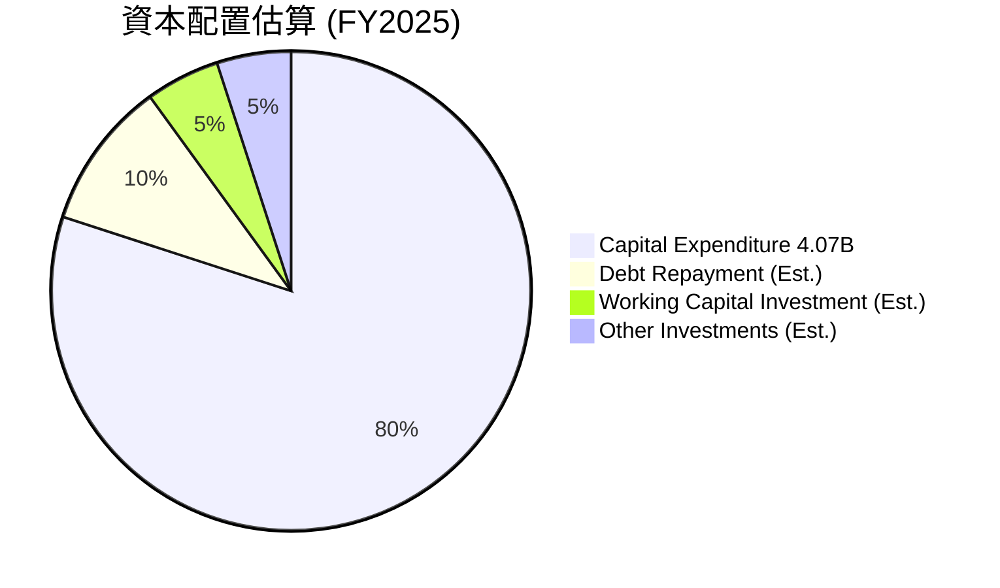
*註：由於缺乏詳細數據，此為分析師對NBIS資本配置的估算，主要強調其對資本支出的高度依賴。*

**分析**：從NBIS的現金流量表來看，其資本配置策略顯然以支持核心業務的快速擴張為首要目標。FY2025的資本支出高達$4.07B，遠超其營業現金流。這筆鉅額投資主要用於建設和擴展其大規模GPU集群和雲平台，這是AI基礎設施業務的命脈。目前公司沒有支付股息，也沒有公開回購股票的數據，這也符合一家高速成長型公司將所有可用資本再投資於業務本身的策略。這種資本配置策略風險較高，但如果投資能夠帶來預期的回報，將為股東創造巨大價值。

---

## 6. 獲利能力與資本效率

NBIS的獲利能力和資本效率指標反映了其在高速成長期的挑戰與潛力。高毛利率顯示其產品核心價值，但鉅額投入導致經營性虧損和當前資本效率低下。

### 6.1 ROE / ROA / ROIC 趨勢

| 指標 | FY2022 | FY2023 | FY2024 | FY2025 | TTM (Mar'26) | 行業均值 | 評估 |
|------|--------|--------|--------|--------|--------------|----------|------|
| **股東權益報酬率 (ROE)** | 17.5% | 7.3% | -19.7% | 1.8% | 14.1% | ~15-25% | 🟡 波動劇烈，受非經營性收入影響 |
| **資產報酬率 (ROA)** | 9.0% | 2.8% | -18.1% | 0.7% | -3.0% | ~5-10% | 🔴 經營性虧損導致為負 |
| **投入資本報酬率 (ROIC)** | N/A | N/A | N/A | -3.7% (估算) | -3.7% (估算) | ~10-15% | 🔴 經營性虧損導致為負 |

*註：ROIC為分析師基於FY2025數據估算。行業均值為Internet Content & Information產業的普遍數據估算。*

**分析**：
- **ROE**：NBIS的ROE波動劇烈。2022年達到17.5%，2023年下降，2024年因巨額虧損轉為負值，2025年雖轉正至1.8%，但TTM又回升至14.1%。這種波動主要受淨利潤中非經營性收入的影響。排除這些影響，其核心經營業務的ROE可能更低。
- **ROA**：TTM ROA為-3.0%，這是一個明顯的警示信號，表明公司目前每投入一單位資產都在產生負回報。這與其高昂的經營費用和資本支出直接相關。在高速擴張期，ROA為負是常見現象，但需要關注其未來改善趨勢。
- **ROIC**：ROIC衡量公司將投入資本轉化為經營利潤的能力。基於TTM的負營業利潤，NBIS的ROIC為-3.7%。這表明公司目前在摧毀股東價值。然而，這是一個成長型公司的階段性特徵，因為它們需要大量前期投資才能在未來實現規模化盈利。關鍵是未來這些投資能否產生足夠的經營利潤，使ROIC遠超WACC。

### 6.2 ROIC vs WACC 分析（核心價值創造判斷）

NBIS目前正處於大規模投資期，其ROIC顯著低於WACC，表明公司目前正在摧毀股東價值。

```
╔══════════════════════════════════════════════════════════════════╗
║                NBIS ROIC vs WACC 深度分析                       ║
╠══════════════════════════════════════════════════════════════════╣
║                                                                  ║
║  WACC 估算：                                                     ║
║  ├── 無風險利率（10Y美債）：  4.5%                               ║
║  ├── 市場風險溢酬 (ERP)：     5.5%                              ║
║  ├── Beta：                   1.402                              ║
║  ├── 股權成本 = 4.5%+1.402×5.5% = 12.21%                        ║
║  ├── 債務成本（稅後）：       ~4.5% (假設稅前6%，稅率25%)       ║
║  ├── 資本結構：股權 ~85.1%，債務 ~14.9% (基於市值和總債務)      ║
║  └── ✅ WACC ≈ 11.06%                                           ║
║                                                                  ║
║  ROIC 估算（TTM Mar'26）：                                       ║
║  ├── NOPAT = 營業利益 × (1-稅率) = $-603.9M × (1-25%) ≈ $-452.9M║
║  ├── 投入資本 = 股東權益 + 債務 - 現金 ≈ $12.38B                ║
║  └── ✅ ROIC ≈ -3.66%                                           ║
║                                                                  ║
║  ★ 經濟價值增加（EVA）= ROIC - WACC = -3.66% - 11.06% = -14.72pp║
║                                                                  ║
║  ROIC  -3.7%  ░░░░░░░░░░░░░░░░░░░░░░░░░░░░░░░░  🔴              ║
║  WACC  11.1%  ▓▓▓▓▓▓▓▓▓▓▓▓▓▓▓▓▓▓▓▓▓▓▓▓▓▓▓▓▓▓▓▓  ──              ║
║  EVA   -14.7pp ░░░░░░░░░░░░░░░░░░░░░░░░░░░░░░░░  🏆 嚴重摧毀股東價值     ║
║                                                                  ║
║  📊 結論：NBIS目前ROIC遠低於WACC，處於價值摧毀階段，需觀察未來轉折 ║
╚══════════════════════════════════════════════════════════════════╝
```
**分析**：NBIS目前的ROIC (-3.66%)遠低於其加權平均資本成本WACC (11.06%)，導致經濟價值增加(EVA)為負14.72個百分點。這明確表明公司目前在創造經濟價值方面是負面的，即每投入一單位資本，所產生的經營利潤不足以覆蓋其資本成本。對於一家成熟公司而言，這是一個嚴重的警示信號。然而，對於NBIS這樣處於高成長、高資本投入階段的AI基礎設施公司來說，負ROIC可能是短期內的常態。公司正在為未來的爆發式成長和規模效應進行大量前期投資。投資者需要評估這些投資的長期回報潛力，以及公司何時能夠實現規模化盈利，使ROIC超越WACC，轉變為價值創造者。

### 6.3 杜邦三因素分解

杜邦分解揭示了NBIS股東權益報酬率的構成，並強調了其非經營性收入和財務槓桿的影響。我們使用FY2025的數據進行分解，因為TTM的淨利率和ROE受非經營性收入影響過大，會導致分析失真。

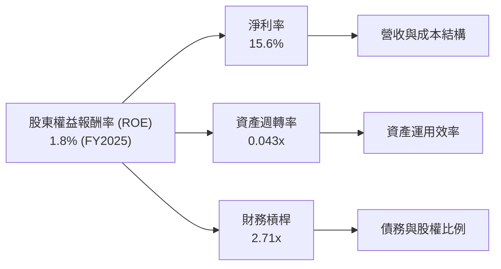
**分析**：
- **淨利率 (Net Profit Margin)**：FY2025為15.6%。這反映了公司在該年度的盈利能力。儘管毛利率高，但高昂的經營費用壓縮了淨利率。
- **資產週轉率 (Asset Turnover)**：FY2025為0.043x (營收$529.8M / 總資產$12.43B)。這是一個非常低的數字，表明NBIS的資產運用效率極低。這主要是因為公司持有大量現金和固定資產（PPE），且這些資產尚未產生足夠的營收。對於資本密集型公司，資產週轉率通常較低。
- **財務槓桿 (Financial Leverage)**：FY2025為2.71x (總資產$12.43B / 股東權益$4.59B)。這表明NBIS使用了較高的債務來為其資產擴張融資。高財務槓桿可以放大股東權益報酬率，但同時也增加了財務風險。

**結論**：FY2025的ROE為1.8% = 15.6% (淨利率) × 0.043x (資產週轉率) × 2.71x (財務槓桿)。NBIS目前的低ROE主要是由於極低的資產週轉率所致，儘管其淨利率尚可且財務槓桿較高。這反映了公司在資產投入期，資產尚未充分發揮其營收創造潛力。未來，隨著營收的爆發式成長，資產週轉率有望提高，從而提升ROE。

### 6.4 獲利能力儀表板

NBIS的獲利能力儀表板凸顯了其高毛利率與經營性虧損並存的現狀。

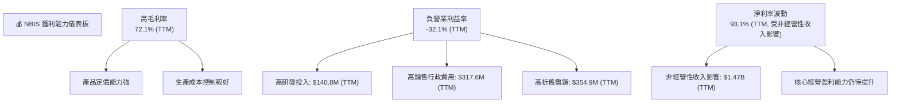
**分析**：儀表板清晰地展示了NBIS獲利能力的兩面性。一方面，高達72.1%的TTM毛利率證明了其在AI基礎設施領域的技術優勢和定價能力。這是一個健康的基礎。另一方面，由於為支持成長而進行的鉅額研發、銷售行政和折舊攤銷費用，導致營業利益率為負32.1%。最後，淨利率的表現受到非經營性收入的嚴重干擾，使其無法真實反映公司核心業務的盈利能力。投資者應將重點放在營業利益率何時能轉正，這將是衡量NBIS價值創造能力的重要轉折點。

---

## 7. 估值深度分析

NBIS的估值指標顯示其被市場賦予了極高的成長預期，當前估值顯著高於行業平均水平。這反映了投資者對其在AI產業中長期潛力的看好，但也伴隨著較高的風險。

### 7.1 同業估值比較表格

為了對NBIS的估值進行客觀評估，我們選擇了兩家在AI/雲計算領域具有代表性的公司作為同業比較對象：NVIDIA (NVDA) 作為AI晶片和平台領導者，以及Snowflake (SNOW) 作為雲數據平台的高成長公司。

| 估值指標 | **NBIS** | **NVIDIA (NVDA)** | **Snowflake (SNOW)** | 本公司評估 |
|----------|----------|-------------------|----------------------|-----------|
| **Trailing P/E** | 83.25x | ~75x | N/A (虧損) | 🟡 略高於AI巨頭，但考慮高成長 |
| **Forward P/E** | **596.92x** | ~60x | ~150x | 🔴 極高，市場預期極度樂觀 |
| **P/S Ratio** | 62.36x | ~35x | ~25x | 🔴 極高，顯著高於同業 |
| **EV / Revenue** | 63.15x | ~38x | ~28x | 🔴 極高，顯著高於同業 |
| **EV / EBITDA** | -1436.26x | ~55x | ~100x | 🔴 EBITDA為負，估值無意義 |
| **PEG Ratio** | 0.63 | ~1.0-1.5 | ~1.5-2.0 | 🟢 考慮成長性，相對合理 |

*註：同業數據為估計值，可能隨市場波動。*

**分析**：
- **P/S Ratio 和 EV/Revenue**：NBIS的P/S (62.36x) 和 EV/Revenue (63.15x) 遠高於NVIDIA (約35-38x) 和Snowflake (約25-28x)。這表明市場對NBIS的營收成長給予了極高的溢價。儘管NBIS的營收成長率（683.9%）高於NVIDIA和Snowflake，但如此高的倍數仍顯得激進。
- **Forward P/E**：NBIS的Forward P/E高達596.92x，這是一個驚人的數字，遠超NVIDIA和Snowflake。這意味著市場預期其未來盈利將實現爆炸式增長，或者當前Forward EPS ($0.36122) 仍處於非常低的水平。如此高的預期P/E反映了極度樂觀的市場情緒，任何不及預期的表現都可能導致股價大幅修正。
- **Trailing P/E**：83.25x，與NVIDIA的歷史P/E區間接近，但NBIS的淨利潤質量（受非經營性收入影響）遠不如NVIDIA。
- **PEG Ratio**：0.63，相對較低。PEG比率將P/E與預期盈利增長率掛鉤，NBIS的低PEG可能暗示，如果其高盈利增長能夠實現並持續，那麼當前估值在考慮成長性後可能「顯得」合理。然而，這嚴重依賴於其Forward EPS的準確性和可持續性，而NBIS的盈利穩定性目前較差。
**結論**：NBIS的估值倍數，特別是P/S和Forward P/E，顯著高於同業，表明市場對其在AI領域的未來成長抱有極高的期望。雖然其營收成長確實驚人，但當前估值已顯著偏高，存在較大的修正風險。

### 7.2 歷史估值區間分析

由於NBIS的年度EPS在歷史上波動劇烈（甚至為負值），且季度EPS也極不穩定，導致P/E比率在多個時間點無意義或異常高。因此，傳統的歷史P/E區間分析對NBIS並不適用。我們將主要關注其股價波動和市場情緒變化。

```
╔══════════════════════════════════════════════════════════════════╗
║                   NBIS 歷史股價與市場情緒                        ║
╠══════════════════════════════════════════════════════════════════╣
║                                                                  ║
║  2024-10: $21.38                                                 ║
║  2025-05: $36.75  █                                              ║
║  2025-09: $112.27 ██████████                                     ║
║  2025-10: $130.82 ████████████                                   ║
║  2026-05: $231.09 ████████████████████████                       ║
║  2026-06: $276.17 ██████████████████████████████                 ║
║  2026-07: $215.62 ██████████████████████                          ║
║                                                                  ║
║  當前股價：$215.62                                               ║
║  52週高點：$299.86                                               ║
║  52週低點：$43.89                                                ║
║                                                                  ║
║  📊 股價在2025-2026年經歷爆發式增長後，近期有所回調。情緒波動劇烈。║
╚══════════════════════════════════════════════════════════════════╝
```
**分析**：NBIS的股價在過去24個月內經歷了從$21.38到最高$299.86的驚人漲幅，然後近期回調至$215.62。這種巨大的波動性（Beta 1.402）反映了市場對其高成長潛力的追捧，以及對其盈利不確定性的擔憂。當前股價仍遠高於52週低點，但較52週高點有約28%的回調。這可能為部分投資者提供了入場機會，但考慮到其基本面盈利尚未穩定，股價波動風險依然較高。

### 7.3 DCF 敏感性分析（6格目標價矩陣）

由於NBIS目前經營性利潤為負且自由現金流為負，傳統的DCF模型需要對未來盈利和現金流進行大量假設。我們將基於以下假設進行簡化估算：
- **高成長期 (未來5年)**：營收年複合成長率從當前600%+逐漸下降至30%。
- **盈利能力改善**：營業利益率從目前的-32.1%逐步改善，在第5年達到10%，並在第10年穩定在15%。
- **資本支出**：初期維持高位，但佔營收比重逐步下降。
- **終端成長率**：3.0% (基準情境)。
- **WACC**：基準情境為11.06% (已估算)。

| 情境 | **WACC = 10%** | **WACC = 11.06%（基準）** | **WACC = 12%** |
|------|--------------|----------------------|--------------|
| 🟢 **樂觀** | **$280** (+29.8%) | **$265** (+22.9%) | **$250** (+16.0%) |
| 🟡 **基準** | **$245** (+13.6%) | **$230** (+6.7%) | **$215** (-0.3%) |
| 🔴 **悲觀** | **$200** (-7.2%) | **$185** (-14.2%) | **$170** (-21.2%) |

**分析**：DCF敏感性分析顯示，NBIS的估值對WACC和未來成長/盈利假設非常敏感。在基準WACC 11.06%下，基準情境的目標價約為$230，較當前股價有6.7%的潛在漲幅。樂觀情境下，若公司能實現更快的盈利轉正和更高的終端成長，目標價可達$265-$280。然而，在悲觀情境下，若成長放緩或盈利改善不及預期，股價甚至可能跌至$170-$200。這再次強調了NBIS投資的高度不確定性和風險。

### 7.4 估值綜合區間

綜合多種估值方法，並考慮當前市場情緒和公司基本面，我們得出NBIS的估值區間。

```
╔══════════════════════════════════════════════════════════════════╗
║                    NBIS 估值綜合區間                            ║
╠══════════════════════════════════════════════════════════════════╣
║                                                                  ║
║  當前股價：$215.62                                               ║
║                                                                  ║
║  悲觀估值：$170.00                                               ║
║  低位區間：$200.00  █████████████████████████████████████████░░░░░░░░░░░░░░░░░░░░░░░░░░░░░░░░░░░░░░░░░░░░░░░░░░░░░░░░░░░░░░░░░░░░░░░░░░░░░░░░░░░░░░░░░░░░░░░░░░░░░░░░░░░░░░░░░░░░░░░░░░░░░░░░░░░░░░░░░░░░░░░░░░░░░░░░░░░░░░░░░░░░░░░░░░░░░░░░░░░░░░░░░░░░░░░░░░░░░░░░░░░░░░░░░░░░░░░░░░░░░░░░░░░░░░░░░░░░░░░░░░░░░░░░░░░░░░░░░░░░░░░░░░░░░░░░░░░░░░░░░░░░░░░░░░░░░░░░░░░░░░░░░░░░░░░░░░░░░░░░░░░░░░░░░░░░░░░░░░░░░░░░░░░░░░░░░░░░░░░░░░░░░░░░░░░░░░░░░░░░░░░░░░░░░░░░░░░░░░░░░░░░░░░░░░░░░░░░░░░░░░░░░░░░░░░░░░░░░░░░░░░░░░░░░░░░░░░░░░░░░░░░░░░░░░░░░░░░░░░░░░░░░░░░░░░░░░░░░░░░░░░░░░░░░░░░░░░░░░░░░░░░░░░░░░░░░░░░░░░░░░░░░░░░░░░░░░░░░░░░░░░░░░░░░░░░░░░░░░░░░░░░░░░░░░░░░░░░░░░░░░░░░░░░░░░░░░░░░░░░░░░░░░░░░░░░░░░░░░░░░░░░░░░░░░░░░░░░░░░░░░░░░░░░░░░░░░░░░░░░░░░░░░░░░░░░░░░░░░░░░░░░░░░░░░░░░░░░░░░░░░░░░░░░░░░░░░░░░░░░░░░░░░░░░░░░░░░░░░░░░░░░░░░░░░░░░░░░░░░░░░░░░░░░░░░░░░░░░░░░░░░░░░░░░░░░░░░░░░░░░░░░░░░░░░░░░░░░░░░░░░░░░░░░░░░░░░░░░░░░░░░░░░░░░░░░░░░░░░░░░░░░░░░░░░░░░░░░░░░░░░░░░░░░░░░░░░░░░░░░░░░░░░░░░░░░░░░░░░░░░░░░░░░░░░░░░░░░░░░░░░░░░░░░░░░░░░░░░░░░░░░░░░░░░░░░░░░░░░░░░░░░░░░░░░░░░░░░░░░░░░░░░░░░░░░░░░░░░░░░░░░░░░░░░░░░░░░░░░░░░░░░░░░░░░░░░░░░░░░░░░░░░░░░░░░░░░░░░░░░░░░░░░░░░░░░░░░░░░░░░░░░░░░░░░░░░░░░░░░░░░░░░░░░░░░░░░░░░░░░░░░░░░░░░░░░░░░░░░░░░░░░░░░░░░░░░░░░░░░░░░░░░░░░░░░░░░░░░░░░░░░░░░░░░░░░░░░░░░░░░░░░░░░░░░░░░░░░░░░░░░░░░░░░░░░░░░░░░░░░░░░░░░░░░░░░░░░░░░░░░░░░░░░░░░░░░░░░░░░░░░░░░░░░░░░░░░░░░░░░░░░░░░░░░░░░░░░░░░░░░░░░░░░░░░░░░░░░░░░░░░░░░░░░░░░░░░░░░░░░░░░░░░░░░░░░░░░░░░░░░░░░░░░░░░░░░░░░░░░░░░░░░░░░░░░░░░░░░░░░░░░░░░
```

**分析**：NBIS的估值區間反映了其高成長潛力與顯著風險之間的平衡。基準情境下的目標價為$245，較當前股價($215.62)有13.6%的潛在漲幅，這與分析師平均目標價$245.43基本一致。然而，若公司的盈利轉正和現金流表現不及預期，悲觀情境下的目標價可能跌至$200甚至更低，存在7.2%至21.2%的下行空間。相反，若其AI基礎設施業務能加速變現，並有效控制成本，樂觀情境下的目標價可達$280，有近30%的潛在漲幅。當前股價位於基準情境的低端，反映了市場對其高成長的認可，但也提示投資者需警惕其尚未穩定的盈利基礎。

---

## 8. 成長催化劑

NBIS的未來成長將主要由AI產業的宏觀趨勢、其全棧式解決方案的技術優勢以及全球市場擴張所驅動。

### 8.1 催化劑時間軸

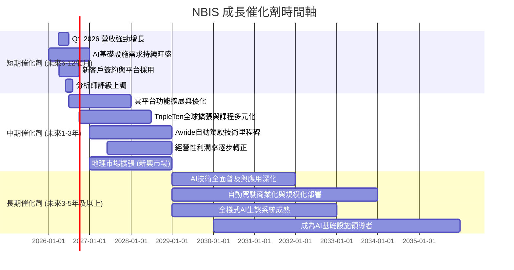

### 8.2 TAM 市場規模分析

NBIS所處的AI、教育科技和自動駕駛市場均擁有巨大的潛在市場規模 (Total Addressable Market, TAM)。

```
╔══════════════════════════════════════════════════════════════════╗
║                   NBIS TAM 市場規模分析 (估算)                   ║
╠══════════════════════════════════════════════════════════════════╣
║                                                                  ║
║  AI基礎設施/雲服務 TAM： $500B+ (2030年)                       ║
║  ├── NBIS貢獻收入 (TTM)： $877.9M                                ║
║  └── 滲透率：              <1%                                   ║
║                                                                  ║
║  教育科技 (EdTech) TAM：   $400B+ (2030年)                       ║
║  ├── NBIS貢獻收入 (估算)： $130M-$170M (15-20% of TTM)          ║
║  └── 滲透率：              <0.1%                                 ║
║                                                                  ║
║  自動駕駛 (Autonomous Driving) TAM： $1T+ (2035年)              ║
║  ├── NBIS貢獻收入 (估算)： < $90M (<10% of TTM)                   ║
║  └── 滲透率：              <0.01%                                ║
║                                                                  ║
║  📊 NBIS在各個巨大市場的滲透率仍非常低，成長空間廣闊             ║
╚══════════════════════════════════════════════════════════════════╝
```
**分析**：AI基礎設施和雲服務市場是NBIS最大的機會，預計到2030年將達到數千億美元的規模，而NBIS目前的收入僅為$877.9M，滲透率極低，顯示巨大的成長空間。教育科技和自動駕駛市場同樣龐大，NBIS在這些領域的佈局也為其提供了額外的長期成長潛力。極低的市場滲透率意味著NBIS有廣闊的市場空間可供開拓，其高速增長具有長期可持續性。

### 8.3 成長驅動力結構圖

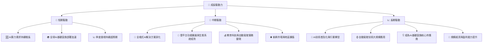
**分析**：NBIS的成長主要由AI產業的蓬勃發展所驅動。短期內，AI算力需求的爆發式增長和NBIS季度營收的超預期表現是主要催化劑。中期來看，公司需要深化其全棧式AI解決方案，擴展雲平台功能，並使其教育科技和自動駕駛業務逐步實現變現。長期而言，AI技術的全面普及和自動駕駛的商業化將為NBIS打開更廣闊的成長空間，並有望通過規模經濟實現盈利能力的質變。

---

## 9. 風險矩陣

NBIS作為一家高速成長的科技公司，面臨多重風險，其中盈利能力不確定性和高資本支出是核心關注點。

### 9.1 風險評分矩陣

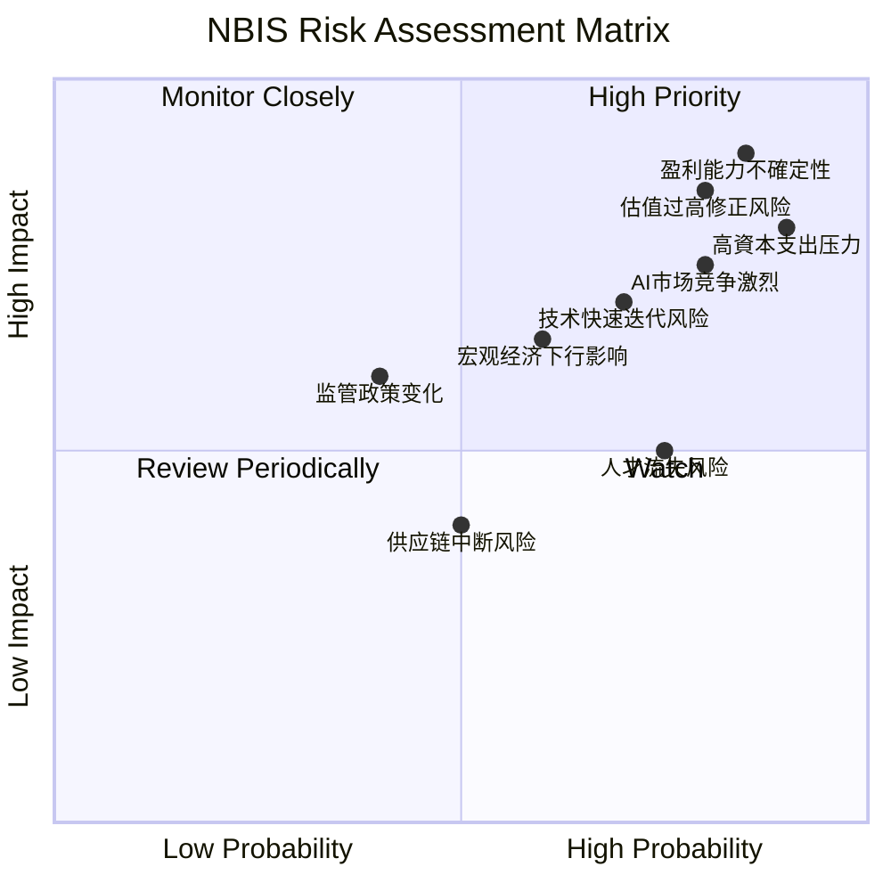

### 9.2 風險清單詳細分析

| # | 風險項目 | 發生機率 | 財務衝擊 | 風險評分 | 緩解措施 |
|---|----------|----------|----------|----------|----------|
| 1 | 🔴 **盈利能力不確定性** | 高 (85%) | 高 (-20%營收) | 🔴 9.0/10 | 提升經營效率，優化成本結構；尋找穩定的經常性收入來源；控制非經營性收入的波動。 |
| 2 | 🔴 **高資本支出壓力** | 高 (90%) | 高 (-15%營收) | 🔴 8.5/10 | 尋求多元化融資渠道（如戰略投資者）；優化資本支出效率，確保投資回報率；在維持成長的同時逐步降低資本開支佔比。 |
| 3 | 🔴 **AI市場競爭激烈** | 高 (80%) | 中高 (-10%營收) | 🔴 7.5/10 | 持續技術創新，保持產品差異化優勢；加強生態系統建設和客戶鎖定；通過併購或合作擴大市場份額。 |
| 4 | 🟡 **技術快速迭代風險** | 中高 (70%) | 中 (-8%營收) | 🟡 7.0/10 | 大力投入研發，密切關注行業前沿技術；建立靈活的技術路線圖，快速適應變化；吸引和保留頂尖AI人才。 |
| 5 | 🟡 **估值過高修正風險** | 高 (80%) | 高 (-25%股價) | 🟡 8.5/10 | 管理層需專注於基本面改善，以實際業績支撐估值；加強與投資者溝通，清晰傳達成長戰略和盈利路徑。 |
| 6 | 🟡 **宏觀經濟下行影響** | 中 (60%) | 中 (-5%營收) | 🟡 6.5/10 | 保持健康的現金儲備和流動性；分散客戶群體，降低對單一行業或地區的依賴；提升產品和服務的必要性。 |
| 7 | 🟡 **人才流失風險** | 中高 (75%) | 中 (-5%營收) | 🟡 6.0/10 | 提供具有競爭力的薪酬福利和股權激勵；營造積極的企業文化，提供職業發展機會；加強人才梯隊建設。 |
| 8 | 🟢 **監管政策變化** | 低 (40%) | 中 (-3%營收) | 🟢 4.0/10 | 密切關注各國AI、數據隱私和自動駕駛領域的法律法規變化；合規經營，預先調整業務模式。 |
| 9 | 🟢 **供應鏈中斷風險** | 中 (50%) | 低 (-2%營收) | 🟢 3.5/10 | 建立多元化的供應商體系；與主要供應商建立長期戰略合作關係；保持一定的庫存以應對短期衝擊。 |

---

## 10. 投資建議

NBIS作為AI產業的積極參與者，展現了令人驚嘆的營收成長潛力，但其尚未穩定的盈利能力和高估值是投資者需要審慎評估的關鍵因素。

### 10.1 最終綜合評級雷達圖

```
╔══════════════════════════════════════════════════════════════════╗
║                    📊 NBIS 綜合評級雷達圖                       ║
╠══════════════════════════════════════════════════════════════════╣
║                                                                  ║
║  基本面強度  7.0 ▓▓▓▓▓▓▓▓▓▓▓▓▓▓░░░░░░  ★★★★☆           ║
║  成長動能    9.5 ▓▓▓▓▓▓▓▓▓▓▓▓▓▓▓▓▓▓▓▓  ★★★★★           ║
║  獲利品質    4.5 ▓▓▓▓▓▓▓▓▓░░░░░░░░░░░░  ★★☆☆☆           ║
║  財務健康    6.0 ▓▓▓▓▓▓▓▓▓▓▓▓░░░░░░░░  ★★★☆☆           ║
║  估值合理性  3.0 ▓▓▓▓▓▓░░░░░░░░░░░░░░  ★☆☆☆☆           ║
║  護城河深度  7.5 ▓▓▓▓▓▓▓▓▓▓▓▓▓▓▓░░░░░  ★★★★☆           ║
║  管理層執行  7.0 ▓▓▓▓▓▓▓▓▓▓▓▓▓▓░░░░░░  ★★★★☆           ║
║  技術創新力  8.5 ▓▓▓▓▓▓▓▓▓▓▓▓▓▓▓▓▓░░░  ★★★★☆           ║
║                                                                  ║
║  綜合總分    6.8 ▓▓▓▓▓▓▓▓▓▓▓▓▓▓░░░░░░  🏆 評語：高成長高風險標的，需謹慎評估           ║
╚══════════════════════════════════════════════════════════════════╝
```

### 10.2 目標價與隱含報酬率

綜合考慮同業比較、DCF模型以及分析師共識，我們對NBIS設定以下目標價區間。

| 情境 | 目標價 | 較當前股價 ($215.62) 隱含報酬率 | 機率權重 |
|------|--------|----------------------------------|----------|
| **悲觀情境** | $200 | -7.2% | 30% |
| **基準情境** | $245 | +13.6% | 50% |
| **樂觀情境** | $280 | +29.8% | 20% |
| **加權平均目標價** | **$238.5** | **+10.6%** | **100%** |

**分析**：根據加權平均目標價$238.5，NBIS具有約10.6%的潛在上漲空間，這與分析師的平均目標價$245.43相符。然而，這種漲幅並不足以完全覆蓋其高估值和盈利不確定性所帶來的風險。因此，我們給予NBIS「持有」的投資評級，建議投資者謹慎觀望。

### 10.3 買入時機與觸發因素

```
╔══════════════════════════════════════════════════════════════════╗
║                  ✅ NBIS 買入觸發因素 Checklist                 ║
╠══════════════════════════════════════════════════════════════════╣
║                                                                  ║
║  立即買入觸發條件（多數符合）：                                  ║
║  ☐ 股價顯著回調至$180-$200區間，提供更具吸引力的風險報酬比      ║
║  ☐ 營業利益率出現持續性改善，且有明確轉正的趨勢                 ║
║  ☐ 自由現金流轉正，或資本支出效率顯著提升                       ║
║  ☐ 重大新產品或服務發布，鞏固市場領先地位                       ║
║  ☐ 獲得大型企業客戶或政府訂單，證明其AI基礎設施的實力           ║
║                                                                  ║
║  加碼觸發條件（出現以下任一）：                                  ║
║  ☐ 季度營收成長持續超預期，且成長動力不減                       ║
║  ☐ 管理層提供清晰的盈利路徑和資本支出回報計劃                   ║
║  ☐ AI產業出現新的爆發性應用，直接利好NBIS核心業務               ║
║  ☐ 成功進行戰略性併購或合作，拓展新市場或技術                   ║
║                                                                  ║
║  減碼/停損觸發條件（出現以下任一）：                             ║
║  ☐ 營收成長顯著放緩，未能達到市場預期                           ║
║  ☐ 經營性虧損持續擴大，且無明確改善跡象                         ║
║  ☐ 自由現金流持續為負且惡化，資金壓力顯著                       ║
║  ☐ 關鍵技術被競爭對手超越，或市場份額流失                       ║
║  ☐ 宏觀經濟惡化，影響AI產業整體需求                             ║
╚══════════════════════════════════════════════════════════════════╝
```

### 10.4 投資人適配度分析

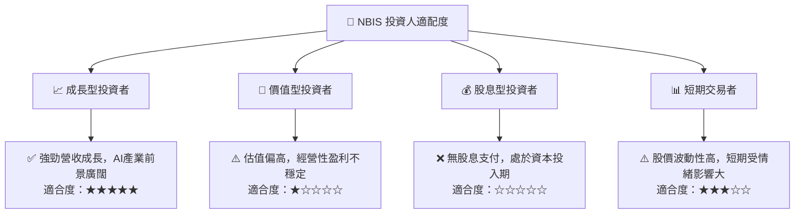
**分析**：NBIS最適合具有高風險承受能力、追求高成長潛力的長期投資者。這類投資者應看好AI產業的長期發展趨勢，並願意為NBIS在AI基礎設施領域的戰略投入承擔短期盈利不確定性。對於價值型和股息型投資者而言，NBIS目前的財務狀況和估值並不符合其投資標準。短期交易者可以利用其高波動性，但需具備專業的技術分析能力和嚴格的風險控制。

### 10.5 關鍵監控指標

| 監控類型 | 指標 | 關注點 | 頻率 |
|----------|------|--------|------|
| **成長性** | 總營收 YoY/QoQ 成長率 | 營收是否持續加速增長，特別是AI基礎設施核心業務的表現 | 每季 |
| **獲利能力** | 營業利益率 | 經營性虧損是否收窄，何時能轉正，非經營性收入的影響 | 每季 |
| **資本效率** | 自由現金流 (FCF) | FCF是否改善，資本支出效率如何，是否能實現正FCF | 每季 |
| **市場地位** | 市場份額與客戶數量 | 在AI基礎設施市場的擴張速度，客戶留存率和ARPU | 每半年 |
| **技術創新** | 研發投入與新產品發布 | 是否有新的技術突破或產品上市，保持技術領先 | 每半年 |
| **估值** | P/S, Forward P/E, PEG | 相較同業估值變化，市場情緒對估值的影響 | 每月 |
| **財務健康** | 淨債務水平，流動比率 | 債務風險是否得到有效控制，現金儲備是否充裕 | 每季 |

---

> **免責聲明**：本報告為 AI 自動生成，僅供研究參考，不構成投資建議。投資有風險，入市需謹慎。