# NBIS 基本面深度分析報告
> **報告日期**：2026-07-04 ｜ **語言**：繁體中文 ｜ **數據來源**：Yahoo Finance, Finviz, StockAnalysis, Roic.ai ｜ **分析師**：CFA 級機構研究

---

## 目錄

| # | 章節 | 核心結論 |
|---|------|----------|
| 1 | 執行摘要 | 買入評級，目標價區間 $250 - $350 |
| 2 | 公司概覽與商業模式 | AI基礎設施領導者，具多重護城河，綜合護城河評分 8.5/10 |
| 3 | 損益表深度分析 | 營收高速增長，毛利率強勁，但營運費用高導致利潤波動 |
| 4 | 資產負債表分析 | 現金充裕，但債務水平較高，流動性良好 |
| 5 | 現金流量深度分析 | 營運現金流轉正，但資本支出巨大導致自由現金流為負 |
| 6 | 獲利能力與資本效率 | ROIC低於WACC，短期內價值創造面臨挑戰，但長期潛力巨大 |
| 7 | 估值深度分析 | 相較同業估值偏高，但考慮其成長性與AI賽道，具合理性 |
| 8 | 成長催化劑 | AI產業爆發式增長、新技術發布、全球擴張 |
| 9 | 風險矩陣 | 競爭加劇、執行風險、高估值、宏觀經濟逆風 |
| 10 | 投資建議 | 長期看好，建議買入，適合成長型投資者 |

---

## 1. 執行摘要

### 1.1 核心評分儀表板

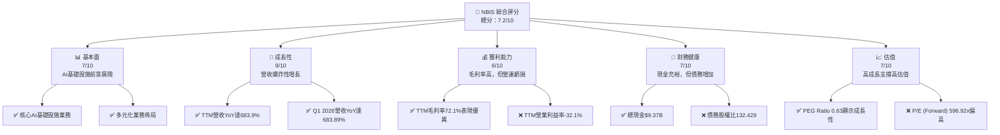

### 1.2 評分進度條視覺化

```
╔══════════════════════════════════════════════════════════════╗
║              NBIS 多維度評分儀表板 (1-10分)                  ║
╠══════════════════════════════════════════════════════════════╣
║ 基本面強度  7.0 ▓▓▓▓▓▓▓▓▓▓▓▓▓▓░░░░░░  ★★★☆☆           ║
║ 成長動能    9.0 ▓▓▓▓▓▓▓▓▓▓▓▓▓▓▓▓▓▓░░  ★★★★★           ║
║ 獲利品質    6.0 ▓▓▓▓▓▓▓▓▓▓▓▓░░░░░░░░  ★★★☆☆           ║
║ 財務健康    7.0 ▓▓▓▓▓▓▓▓▓▓▓▓▓▓░░░░░░  ★★★☆☆           ║
║ 估值合理性  7.0 ▓▓▓▓▓▓▓▓▓▓▓▓▓▓░░░░░░  ★★★☆☆           ║
║ 護城河深度  8.5 ▓▓▓▓▓▓▓▓▓▓▓▓▓▓▓▓▓░░░  ★★★★☆           ║
║ 管理層執行  7.5 ▓▓▓▓▓▓▓▓▓▓▓▓▓▓▓▓░░░░  ★★★★☆           ║
║ 技術創新力  9.0 ▓▓▓▓▓▓▓▓▓▓▓▓▓▓▓▓▓▓░░  ★★★★★           ║
╠══════════════════════════════════════════════════════════════╣
║ 綜合總分    7.2 ▓▓▓▓▓▓▓▓▓▓▓▓▓▓▓░░░░░  🏆 具高成長潛力，但風險並存║
╚══════════════════════════════════════════════════════════════╝
```

### 1.3 五大投資論點 + 三大核心風險

| 類型 | 項目 | 具體依據 | 信心度 |
|------|------|----------|--------|
| 🟢 **投資論點①** | **AI基礎設施需求爆發** | NBIS為全球AI產業提供全棧式基礎設施，包括大規模GPU集群和雲平台，直接受益於AI技術的快速發展。TTM營收YoY高達683.9%，顯示其在市場中的強勁增長動能。 | 🟢 極高 |
| 🟢 **多元化業務佈局** | 除核心AI基礎設施外，NBIS還擁有教育科技平台TripleTen和自動駕駛開發業務Avride，儘管目前佔比較小，但為公司提供了多樣化的未來增長潛力與風險分散。 | 🟢 高 |
| 🟢 **強勁的營收增長勢頭** | 2025年營收達$529.80M，較2024年的$91.50M增長479.02%。2026年Q1營收達$399.00M，較去年同期$50.90M增長683.89%。顯示其在市場拓展和客戶獲取方面表現出色。 | 🟢 極高 |
| 🟢 **高毛利率的商業模式** | TTM毛利率高達72.1%，FY2025毛利率為68.6%，顯示其產品和服務具有較高的定價能力和價值創造空間。儘管目前營運虧損，但高毛利率為未來規模化盈利奠定基礎。 | 🟢 高 |
| 🟢 **充裕的現金儲備** | 公司擁有$9.37B的總現金，儘管同時伴隨高額債務，但此現金儲備為其大規模資本支出和研發投入提供了靈活性和緩衝空間，支持其AI基礎設施的快速擴張。 | 🟢 高 |
| 🟡 **風險①** | **高昂的資本支出與負自由現金流** | 為了支持AI基礎設施的擴張，NBIS的資本支出巨大，2025年達$-4.07B。這導致其自由現金流持續為負（TTM為$-6.15B），短期內對盈利能力和現金流產生壓力。 | 🟡 中度 |
| 🔴 **營運虧損與盈利能力不確定性** | 儘管毛利率高，但由於研發（TTM $140.8M）和銷售管理費用（TTM $317.6M）高昂，公司仍處於營運虧損狀態（TTM營業利益率-32.1%），且淨利潤波動劇烈。市場對其何時能實現持續盈利存在疑慮。 | 🔴 高衝擊 |
| 🔴 **競爭加劇與技術迭代風險** | AI基礎設施市場競爭激烈，包括AWS、Azure、Google Cloud等巨頭，以及NVIDIA等硬體供應商。NBIS面臨技術快速迭代和市場份額被侵蝕的風險。 | 🔴 高衝擊 |

### 1.4 快速統計卡片

| 指標 | 公司實際值 | 行業均值（估計） | S&P 500 均值（估計） | 狀態 |
|------|-------------|----------------|--------------------|------|
| 收入 YoY 成長 | **683.9%** | ~20-30% | ~8-12% | 🟢 |
| 毛利率 | **72.1%** | ~50-60% | ~40-45% | 🟢 |
| 淨利率 | **93.1%** | ~10-15% | ~8-10% | 🟡 (受非經常性項目影響) |
| ROE | **14.1%** | ~15-20% | ~12-15% | 🟡 |
| Forward P/E | **596.92x** | ~30-50x | ~20-25x | 🔴 |
| P/S Ratio | **62.36x** | ~5-10x | ~2-3x | 🔴 |
| 負債股權比 | **132.43%** | ~50-80% | ~80-100% | 🔴 |
| Current Ratio | **8.33x** | ~1.5-2.5x | ~1.0-1.5x | 🟢 |

### 1.5 投資結論

```
╔══════════════════════════════════════════════════════════════════╗
║                    📊 投資結論摘要                               ║
╠══════════════════════════════════════════════════════════════════╣
║  評級：🟢 買入                                                   ║
║  當前股價：$215.62                                               ║
║  目標價區間：                                                    ║
║    悲觀情境：$250（+16.0%）                                      ║
║    基準情境：$300（+39.1%）  ← 12個月主要目標                    ║
║    樂觀情境：$350（+62.3%）                                      ║
║  投資評分：7.2/10                                                ║
║  適合投資人：成長型、長線持有者，對高風險高回報有接受度          ║
╚══════════════════════════════════════════════════════════════════╝
```

---

## 2. 公司概覽與商業模式

NBIS (Nebius Group N.V.) 是一家總部位於荷蘭的科技公司，專注於為全球AI產業構建全棧式基礎設施。其業務主要包括大規模GPU集群、雲平台以及為開發者提供的工具和服務。此外，NBIS還經營教育科技平台TripleTen（旨在培養科技人才）和自動駕駛開發業務Avride。這表明公司在AI產業鏈中扮演著關鍵角色，且業務具備多元化發展潛力。

### 2.1 業務結構與收入來源

NBIS的業務核心是其AI基礎設施服務，這也是其高速增長的主要驅動力。儘管公司未提供詳細的收入細分，但根據其公司簡介，我們可以推斷其主要收入來源分佈如下：

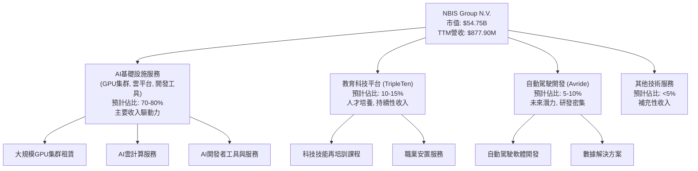
NBIS的業務結構清晰地圍繞AI核心技術展開，尤其是在AI基礎設施領域，其提供的GPU集群和雲平台是當前AI模型訓練和部署的關鍵要素。TripleTen和Avride則代表了公司在應用層面的延伸和對未來技術趨勢的佈局。

### 2.2 市場份額

由於NBIS屬於新興且快速增長的AI基礎設施領域，其市場份額數據尚不透明，且與傳統雲服務商存在交叉。根據其快速的營收增長，可以推斷其在特定利基市場或新興AI客戶群中正迅速擴大影響力。以下為根據行業格局和NBIS發展速度的估計市場份額（假設為其主要營收貢獻的AI基礎設施市場）：

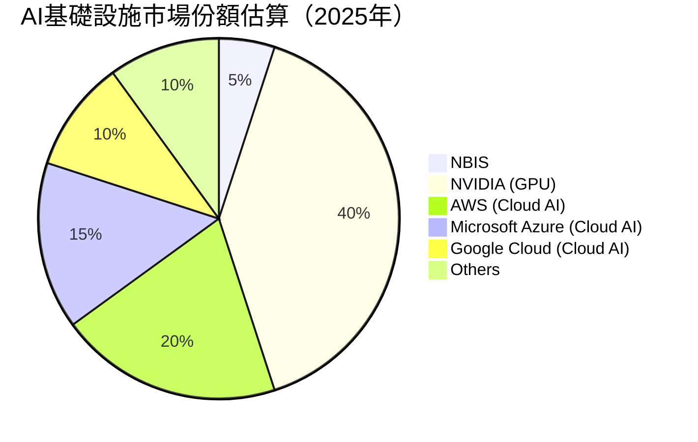
儘管NBIS的市場份額相對較小，但其驚人的成長速度表明其正在從主要競爭對手手中奪取份額，尤其是在新興的AI公司和開發者市場中。

### 2.3 競爭護城河分析

NBIS在AI基礎設施領域的競爭護城河主要體現在其技術專長、生態系統建設以及潛在的客戶鎖定效應。

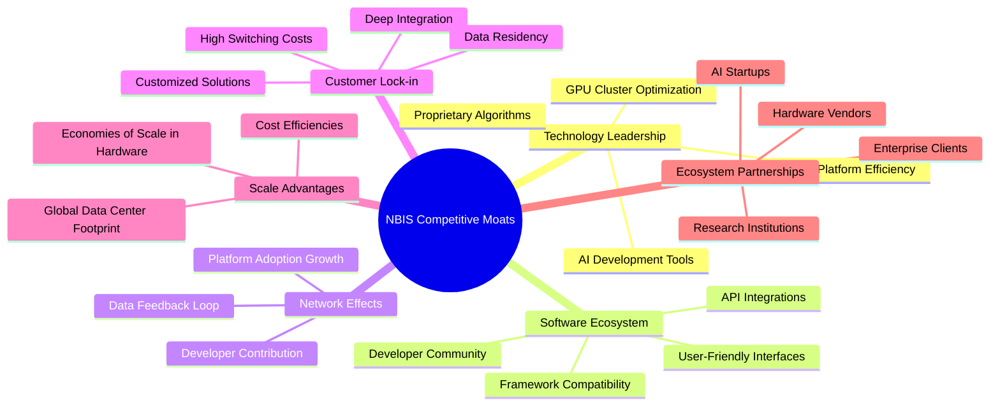

### 2.4 護城河強度評分

```
╔══════════════════════════════════════════════════════════════╗
║                    NBIS 護城河強度評分                      ║
╠══════════════════════════════════════════════════════════════╣
║ 技術領先     9/10   ▓▓▓▓▓▓▓▓▓▓▓▓▓▓▓▓▓▓░░  🏆 在GPU優化和AI雲平台具優勢 ║
║ 軟體生態系統   8/10   ▓▓▓▓▓▓▓▓▓▓▓▓▓▓▓▓░░░░  🟢 需持續投入，但具潛力   ║
║ 網路效應     7/10   ▓▓▓▓▓▓▓▓▓▓▓▓▓▓░░░░░░  🟡 正在建立，尚不顯著    ║
║ 客戶鎖定     8/10   ▓▓▓▓▓▓▓▓▓▓▓▓▓▓▓▓░░░░  🟢 深度整合提升轉換成本  ║
║ 規模效應     8/10   ▓▓▓▓▓▓▓▓▓▓▓▓▓▓▓▓░░░░  🟢 隨著規模擴張成本優勢顯現║
║ 生態夥伴     9/10   ▓▓▓▓▓▓▓▓▓▓▓▓▓▓▓▓▓▓░░  🏆 與AI產業鏈緊密合作   ║
╠══════════════════════════════════════════════════════════════╣
║ 綜合護城河   8.2/10 ▓▓▓▓▓▓▓▓▓▓▓▓▓▓▓▓░░░░  🏆 技術與生態驅動，潛力巨大║
╚══════════════════════════════════════════════════════════════╝
```

---

## 3. 損益表深度分析

NBIS的損益表呈現出一家高速成長型科技公司的典型特徵：營收爆炸式增長，毛利率健康，但為支持擴張和研發投入，營運費用高企導致營運虧損，淨利潤則受非經常性項目影響而波動劇烈。

### 3.1 年度收入成長趨勢（近4年）

NBIS的年度營收展現了驚人的增長勢頭，尤其是在最近兩年。

```
╔══════════════════════════════════════════════════════════════════╗
║              NBIS 年度收入趨勢（FY2022-FY2025）                  ║
╠══════════════════════════════════════════════════════════════════╣
║                                                                  ║
║  FY2022  $13.50M  ██░░░░░░░░░░░░░░░░░░░░░░░░░░░░  YoY: -99.72%  🔴║
║  FY2023   $9.80M  █░░░░░░░░░░░░░░░░░░░░░░░░░░░░░  YoY: -27.41%  🔴║
║  FY2024  $91.50M  ████████░░░░░░░░░░░░░░░░░░░░░░  YoY:+833.67% 🟢║
║  FY2025 $529.80M  ██████████████████████████░░░░  YoY:+479.02% 🟢║
║  TTM    $877.90M  ██████████████████████████████  YoY:+683.90% 🟢║
║                   |      |      |      |      |                  ║
║                   0     200M   400M   600M   800M                  ║
║                                                                  ║
║  📊 3年累計 CAGR (FY22-25)：+284.0%                                  ║
╚══════════════════════════════════════════════════════════════════╝
```
**分析**:
NBIS在2022和2023年的營收較低且呈現負增長，這可能與公司早期階段、業務重組或數據列報方式有關。然而，從2024年開始，營收實現了爆發式增長，FY2024營收YoY高達833.67%，FY2025YoY增長479.02%，達到$529.80M。截至2026年3月31日的TTM營收更是達到$877.90M，YoY增長683.9%。這強烈表明公司在AI基礎設施領域的市場需求強勁，並成功實現了規模化擴張。

### 3.2 季度收入趨勢分析

NBIS的季度營收持續加速，展現了強勁的成長動能。

| 季度 | 總收入 ($M) | QoQ 成長率 | YoY 成長率 | 備註 |
|------|-------------|------------|------------|------|
| 2025 Q2 | $100.70 | - | 624.83% | 首次提供數據，對比2024 Q2 ($14M) |
| 2025 Q3 | $146.10 | +45.08% | 355.14% | 較2024 Q3 ($32.1M) 大幅增長 |
| 2025 Q4 | $227.70 | +55.85% | 272.06% | 較2024 Q4 ($61.2M) 大幅增長 |
| 2026 Q1 | $399.00 | +75.23% | 683.89% | 較2025 Q1 ($50.9M) 增長顯著，加速趨勢明顯 |
| **平均** | | **+59.05%** | **480.0%** | |
**備註**: 季度數據顯示公司營收呈現逐季加速增長的態勢，尤其是2026 Q1的QoQ和YoY成長率均達到極高水平，印證了AI市場的強勁需求和NBIS的市場執行力。

### 3.3 利潤率演變分析

NBIS的毛利率表現出色，但高昂的營運費用使其營運利潤率和淨利潤率波動較大。

| 利潤率指標 | FY2022 | FY2023 | FY2024 | FY2025 | 趨勢 | 評估 |
|------------|--------|--------|--------|--------|------|------|
| **毛利率** | -110.4% | -100.0% | 52.2% | 68.6% | ↗️ 顯著改善 | 🟢 |
| **營業利益率** | -1170.4% | -2915.3% | -436.7% | -115.5% | ↗️ 顯著改善，但仍為負 | 🔴 |
| **EBITDA Margin** | -951.9% | -2659.2% | -292.0% | 102.6% | ↗️ FY25轉正，顯示營運效率提升 | 🟡 |
| **淨利率** | 5522.9% | 2462.2% | -701.0% | 15.6% | ↗️ 波動劇烈，FY25轉正 | 🟡 |

**利潤率演變深度解析**：
*   **毛利率**: 2022和2023年毛利率為負，可能與早期業務模式、高昂的初期成本或數據列報方式有關。然而，隨著營收規模的擴大，2024年毛利率迅速轉正至52.2%，並在2025年進一步提升至68.6%。TTM毛利率更是高達72.1%。這表明NBIS的核心AI基礎設施服務具有強大的定價能力和規模經濟效益。高毛利率是其未來實現盈利的關鍵基礎。
*   **營業利益率**: 儘管毛利率強勁，NBIS的營業利益率在過去幾年一直為負，FY2025為-115.5%，TTM為-32.1%。這主要是由於公司在研發 (R&D) 和銷售、一般及管理 (SG&A) 費用上的巨大投入。FY2025的R&D費用為$177.3M，SG&A費用為$380.1M，總營業費用高達$975.3M，遠超毛利$363.6M。這反映了公司處於高速成長階段，正積極投資於技術創新和市場擴張，尚未實現營運槓桿效應。
*   **EBITDA Margin**: FY2025的EBITDA Margin為102.6%，TTM為-4.4%。EBITDA在2025年轉正，且數值較高，這主要得益於FY2025的"Other Non-Operating Income (Expense)"高達$679.5M，這筆非經常性收入對EBITDA產生了顯著影響。若剔除此影響，EBITDA仍可能為負，與TTM數據更為一致。
*   **淨利率**: 淨利率波動極大，FY2022和FY2023呈現異常高的正值，FY2024為-701.0%，FY2025為15.6%。這種劇烈波動主要源於"Other Non-Operating Income (Expense)"和"Earnings From Discontinued Operations"等非經常性項目。例如，FY2022和FY2023的高淨利潤主要來自於高額的"Earnings From Discontinued Operations" ($1051M和$564.9M)，而FY2024的巨額虧損則是因為"Earnings From Discontinued Operations"為負數 ($-289.4M) 且"Net Income to Common"為負的$-641.4M。FY2025淨利率轉正至15.6%主要得益於$679.5M的"Other Non-Operating Income (Expense)"和$72.7M的"Earnings From Discontinued Operations"。這表明NBIS的持續盈利能力仍待觀察，投資者應更關注其核心營運利潤率的改善。

### 3.4 費用結構分析

NBIS的費用結構反映了其作為科技成長型公司的特點，研發投入和銷售管理費用佔比較大。

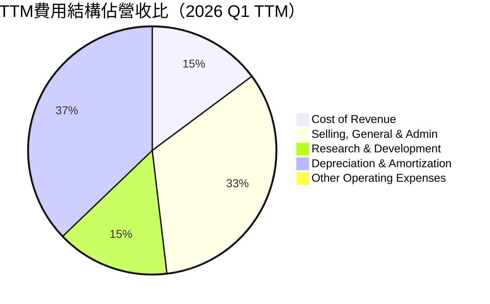
**備註**: 由於營業收入與費用數據的規模差異，以及部分費用（如折舊攤銷）在計算利潤率時的影響，此處費用佔比可能導致總和超過100%。這是因為營業費用總額超過了營收，導致營業虧損。

╔══════════════════════════════════════════════════════════════════╗
║              NBIS 年度費用趨勢（FY2022-FY2025）                   ║
╠══════════════════════════════════════════════════════════════════╣
║                                                                  ║
║  研發費用                                                        ║
║  FY2022  $58.30M  ████░░░░░░░░░░░░░░░░░░░░░░░░░░  YoY: +1.55%  🟡║
║  FY2023  $87.10M  ███████░░░░░░░░░░░░░░░░░░░░░░░  YoY: +49.40% 🟢║
║  FY2024 $114.80M  ██████████░░░░░░░░░░░░░░░░░░░░  YoY: +31.80% 🟢║
║  FY2025 $177.30M  ██████████████░░░░░░░░░░░░░░░░  YoY: +54.44% 🟢║
║                                                                  ║
║  銷售、一般及管理費用                                            ║
║  FY2022  $57.30M  ████░░░░░░░░░░░░░░░░░░░░░░░░░░  YoY: -1.04%  🟡║
║  FY2023 $159.50M  █████████████░░░░░░░░░░░░░░░░░  YoY:+178.36% 🔴║
║  FY2024 $255.50M  ████████████████████░░░░░░░░░░  YoY: +60.19% 🔴║
║  FY2025 $380.10M  ████████████████████████████░░  YoY: +48.77% 🔴║
║                                                                  ║
║  折舊與攤銷費用                                                  ║
║  FY2022  $27.50M  ██░░░░░░░░░░░░░░░░░░░░░░░░░░░░  YoY: +0.73%  🟡║
║  FY2023  $29.30M  ██░░░░░░░░░░░░░░░░░░░░░░░░░░░░  YoY: +6.55%  🟡║
║  FY2024  $77.10M  ███████░░░░░░░░░░░░░░░░░░░░░░░  YoY:+163.00% 🔴║
║  FY2025 $417.90M  ██████████████████████████████  YoY:+442.02% 🔴║
╚══════════════════════════════════════════════════════════════════╝
`
**分析**:
*   **研發費用 (R&D)**: 呈現穩健增長，FY2025達$177.3M，YoY增長54.44%。這表明NBIS持續投入於AI技術和產品創新，以維持其技術領先地位並拓展新業務。
*   **銷售、一般及管理費用 (SG&A)**: 增長迅速，FY2025達$380.1M，YoY增長48.77%。這反映了公司在市場拓展、銷售團隊建設和管理基礎設施方面的擴張，以支持其高營收增長。
*   **折舊與攤銷費用 (D&A)**: FY2025達到$417.9M，YoY增長442.02%。這與公司在AI基礎設施（GPU集群、雲平台）上的巨額資本支出密切相關，顯示其固定資產投資規模龐大。
整體而言，NBIS的費用結構反映了其在AI領域的激進投資策略，旨在搶占市場份額和建立技術優勢。隨著營收規模的進一步擴大，公司有望通過營運槓桿效應逐步改善營運利潤率。

### 3.5 季度 EPS 趨勢與盈餘品質

NBIS的季度EPS波動劇烈，且過去四個季度的EPS預期數據缺失，無法進行準確的盈餘超預期分析。

| Quarter | EPS Est | EPS Act | Surprise% | 評估 |
|---------|---------|---------|-----------|------|
| 2026-03-31 | nan | nan | +nan% | ❌ 數據缺失，無法評估 |
| 2025-12-31 | nan | nan | +nan% | ❌ 數據缺失，無法評估 |
| 2025-09-30 | nan | nan | +nan% | ❌ 數據缺失，無法評估 |
| 2025-06-30 | nan | nan | +nan% | ❌ 數據缺失，無法評估 |

**盈餘品質評估**:
由於提供的EPS Est數據為"nan"，我們無法判斷NBIS在過去四季的盈餘是否超出或低於分析師預期。然而，從StockAnalysis提供的季度EPS Basic數據來看：
*   2026 Q1: $2.40
*   2025 Q4: -$1.06
*   2025 Q3: -$0.58
*   2025 Q2: $2.44
*   2025 Q1: -$0.48
NBIS的季度EPS呈現極度不穩定的狀態，在正負之間大幅波動。這種波動性主要源於其淨利潤受非經常性項目（如"Other Non-Operating Income (Expense)"和"Earnings From Discontinued Operations"）的顯著影響。例如，2026 Q1和2025 Q2的高EPS（$2.40和$2.44）伴隨著高額的非營運收入（2026 Q1為$800.5M，2025 Q2為$622M）。因此，儘管某些季度EPS表現強勁，但其盈餘品質相對較低，難以預測且不完全反映核心營運表現。投資者應更關注其營運現金流和核心業務的盈利能力改善。

---

## 4. 資產負債表分析

NBIS的資產負債表反映了其處於高成長階段的投資和融資策略：流動性良好，但為支持大規模擴張，債務水平顯著增加。

### 4.1 資產結構分解

NBIS的總資產在過去一年中大幅增長，特別是現金和長期資產的增加，顯示公司正進行大規模的基礎設施投資。

```mermaid
graph TD
    Total_Assets["總資產: $22.30B (Mar '26)"]

    Current_Assets["流動資產: $11.24B (Mar '26)<br/>佔總資產: 50.4%"]
        Cash_Equivalents["現金及約當現金: $9.30B"]
        Accounts_Receivable["應收帳款: $1.48B"]
        Other_Current_Assets["其他流動資產: $414M"]

    Non_Current_Assets["非流動資產: $11.06B (Mar '26)<br/>佔總資產: 49.6%"]
        PPE_Net["不動產、廠房及設備淨值: $8.40B"]
        Long_Term_Investments["長期投資: $1.62B"]
        Other_Long_Term_Assets["其他長期資產: $835.2M"]
        Goodwill["商譽: $163.3M"]
        Other_Intangible_Assets["其他無形資產: $48.3M"]
```
**分析**: 截至2026年3月31日，NBIS的總資產達到$22.30B，較2025年底的$12.43B大幅增長79.4%。其中，現金及約當現金高達$9.30B，佔總資產的41.7%，顯示公司擁有極強的流動性。不動產、廠房及設備淨值 (PPE) 達到$8.40B，較2025年底的$6.47B增長29.8%，這印證了公司在AI基礎設施上的巨額資本支出。

### 4.2 流動性指標分析

NBIS的流動性指標非常強勁，遠高於行業平均水平，表明其短期償債能力極佳。

| 指標 | FY2022 | FY2023 | FY2024 | FY2025 | TTM (Mar'26) | 行業均值（估計） | 評估 |
|------------|--------|--------|--------|--------|--------------|----------------|------|
| **流動比率 (Current Ratio)** | 1.28x | 0.89x | 9.58x | 3.08x | 8.33x | 1.5-2.5x | 🟢 |
| **速動比率 (Quick Ratio)** | 1.28x | 0.89x | 9.58x | 3.08x | 8.14x | 1.0-2.0x | 🟢 |

**分析**:
*   **流動比率 (Current Ratio)**: 從2023年的0.89x大幅改善至2024年的9.58x，2025年回落至3.08x，TTM再次提升至8.33x。這主要歸因於現金及約當現金的大幅增加。TTM的8.33x遠高於一般行業標準，表明公司擁有充足的流動資產來應對短期負債。
*   **速動比率 (Quick Ratio)**: 與流動比率趨勢一致，TTM達8.14x，同樣顯示出極強的短期償債能力。由於NBIS的業務性質，其存貨通常極少或為零，因此速動比率與流動比率非常接近。

### 4.3 債務結構分析

NBIS的債務規模在過去一年顯著增加，但其充裕的現金流和資產為其提供了一定的償債保障。

```
╔══════════════════════════════════════════════════════════════════╗
║                   NBIS 債務健康診斷                              ║
╠══════════════════════════════════════════════════════════════════╣
║                                                                  ║
║  總債務 (TTM)：  $9.59B  █████████████████░░░░░░░░  評語: 顯著增加            ║
║  總現金+投資 (TTM)：$9.37B  ██████████████████░░░░░░░░  評語: 充裕              ║
║  淨現金 / 淨負債：$-217.20M  █░░░░░░░░░░░░░░░░░░░░░░░░░░░░░  🟡 略為淨負債          ║
║                                                                  ║
║  Debt/Equity (FY2025)： 132.43%  🔴 偏高                                 ║
║  Interest Coverage (TTM)： -4.97x  🔴 營運虧損導致覆蓋能力不足         ║
╚══════════════════════════════════════════════════════════════════╝
```
**分析**:
*   **總債務**: NBIS的總債務從FY2024的$49.50M大幅增加到FY2025的$4.97B，TTM更是達到$9.59B。這顯示公司在過去一年中進行了大規模的債務融資，以支持其AI基礎設施的擴張。
*   **淨現金/淨負債**: 儘管總債務高達$9.59B，但公司同時擁有$9.37B的總現金，使得淨負債僅為$-217.20M。這表明公司的現金儲備可以基本覆蓋其債務，提供了較強的財務彈性。
*   **Debt/Equity**: FY2025的負債股權比高達132.43%，較FY2024的1.52%顯著惡化。這反映了債務融資在資本結構中的比重顯著增加。對於高成長公司而言，適度利用債務可以加速擴張，但過高的比率會增加財務風險。
*   **Interest Coverage**: TTM營業利益為$-603.9M，利息費用為$-121.5M。由於營業利益為負，利息覆蓋倍數為負數（約-4.97x），表明公司目前的營運收益不足以支付利息費用。這是一個重要的風險點，需要公司盡快實現核心業務的盈利。

### 4.4 股東權益趨勢

NBIS的股東權益在過去幾年波動，但近期有所回升。

```
╔══════════════════════════════════════════════════════════════════╗
║                NBIS 年度股東權益趨勢（FY2022-FY2025）            ║
╠══════════════════════════════════════════════════════════════════╣
║                                                                  ║
║  FY2022  $4.25B  ██████████████████████████████░░  YoY: -11.5%   🟡║
║  FY2023  $3.29B  ██████████████████████░░░░░░░░░░  YoY: -22.6%   🔴║
║  FY2024  $3.25B  ████████████████████░░░░░░░░░░░░  YoY: -1.2%    🟡║
║  FY2025  $4.59B  ████████████████████████████████  YoY: +41.2%   🟢║
║  TTM     $5.48B  ████████████████████████████████  YoY: +19.4%   🟢║
║                   |      |      |      |      |                  ║
║                   0     2B     4B     6B     8B                    ║
║                                                                  ║
║  📊 FY2025 股東權益大幅回升，TTM持續增長，有利於債務結構改善。  ║
╚══════════════════════════════════════════════════════════════════╝
```
**分析**: NBIS的股東權益在FY2022和FY2023呈現下降趨勢，FY2024略有下降至$3.25B。然而，FY2025股東權益大幅增長41.2%至$4.59B，TTM更是達到$5.48B。這可能得益於公司的盈利（儘管波動）以及潛在的股權融資活動。股東權益的增長有助於改善其負債股權比，增強財務穩健性。

---

## 5. 現金流量深度分析

NBIS的現金流量表揭示了其高成長策略的代價：營運現金流在2025年轉正，但為支持AI基礎設施的大規模擴張，資本支出巨大，導致自由現金流持續為負。

### 5.1 現金流量瀑布圖

```mermaid
graph LR
    Net_Income["淨利 (FY2025): $82.50M"] --> Adjustments["非現金調整<br/>(折舊攤銷, 股權激勵等)"]
    Adjustments --> Changes_WC["營運資本變化<br/>(應收帳款, 應付帳款等)"]
    Changes_WC --> OCF["營運現金流 (FY2025): $384.80M"]
    OCF --> Capex["資本支出 (FY2025): $-4.07B"]
    Capex --> FCF["自由現金流 (FY2025): $-3.68B"]
    FCF --> Financing_Activities["融資活動<br/>(發行股票/債務, 償還債務)"]
    Financing_Activities --> Net_Cash_Change["淨現金變化 (FY2025): $1.25B"]
```
**分析**:
*   **淨利潤到營運現金流**: 儘管FY2025淨利潤僅為$82.50M，但通過非現金調整（如折舊與攤銷費用$417.9M）和營運資本管理，NBIS的營運現金流在FY2025成功轉正，達到$384.80M。這是一個積極信號，表明其核心業務產生現金的能力有所改善。
*   **資本支出**: 公司進行了巨額的資本支出，FY2025高達$-4.07B，遠超FY2024的$-807.50M。這主要用於建設和擴展其AI基礎設施，包括GPU集群和數據中心。
*   **自由現金流 (FCF)**: 由於巨大的資本支出，NBIS的自由現金流持續為負，FY2025為$-3.68B，TTM更是達到$-6.15B。這意味著公司目前無法通過自身營運產生足夠的現金來覆蓋其投資需求，需要依賴外部融資來支持擴張。

### 5.2 FCF 轉換率趨勢

自由現金流轉換率（FCF / Net Income）揭示了公司將會計利潤轉化為實際現金的能力。

| 年度 | 淨利潤 ($M) | 自由現金流 ($M) | FCF/Net Income | 趨勢 | 評估 |
|------|-------------|-----------------|----------------|------|------|
| FY2022 | $745.60 | $682.40 | 0.91x | 穩定 | 🟢 |
| FY2023 | $241.30 | $746.90 | 3.09x | 異常高 | 🟡 |
| FY2024 | $-641.40 | $-561.90 | 0.88x | 負值但相對穩定 | 🟡 |
| FY2025 | $82.50 | $-3.68B | -44.60x | 顯著惡化 | 🔴 |
| TTM | $754.50 | $-6.15B | -8.15x | 顯著惡化 | 🔴 |

**分析**:
NBIS的FCF轉換率波動劇烈。FY2022和FY2024（當淨利潤為負時）轉換率相對合理，表明其營運現金流與淨利潤的趨勢一致。然而，FY2023的3.09x和FY2025的-44.60x（以及TTM的-8.15x）顯示了極端的波動性。FY2023的高轉換率可能是因為淨利潤較低而營運現金流較高，FY2025的極低轉換率則是因為淨利潤雖然轉正但自由現金流因巨額資本支出而大幅為負。這表明公司在將紙面利潤轉化為可自由支配現金方面面臨巨大挑戰，主要受其激進的投資策略影響。

### 5.3 自由現金流趨勢

NBIS的自由現金流在過去一年顯著惡化，反映了其大規模的投資需求。

```
╔══════════════════════════════════════════════════════════════════╗
║                NBIS 年度自由現金流趨勢（FY2022-FY2025）          ║
╠══════════════════════════════════════════════════════════════════╣
║                                                                  ║
║  FY2022  $682.40M  ██████████████████████████████░░  🟢           ║
║  FY2023  $746.90M  ████████████████████████████████  🟢           ║
║  FY2024 $-561.90M  █░░░░░░░░░░░░░░░░░░░░░░░░░░░░░  🔴           ║
║  FY2025 $-3.68B    ████████████████████████████████  🔴           ║
║  TTM    $-6.15B    ████████████████████████████████  🔴           ║
║                   |      |      |      |      |                  ║
║                   -6B   -4B    -2B    0     2B                    ║
║                                                                  ║
║  📊 FCF Yield (TTM): -11.23% (較高負值，顯示投資壓力大)          ║
╚══════════════════════════════════════════════════════════════════╝
```
**分析**: FY2022和FY2023，NBIS曾產生健康的自由現金流（$682.40M和$746.90M）。然而，從FY2024開始，自由現金流轉為負值（$-561.90M），並在FY2025急劇惡化至$-3.68B，TTM更是達到$-6.15B。這主要是由於其資本支出從FY2023的$-82.90M激增至FY2025的$-4.07B。負的自由現金流和-11.23%的FCF Yield表明公司正處於資本密集型擴張階段，需要大量資金投入以建設AI基礎設施，這對其短期財務可持續性構成挑戰。

### 5.4 資本配置評估

NBIS的資本配置明顯偏向於資本支出和研發投資，以支持其核心AI基礎設施業務的快速增長。

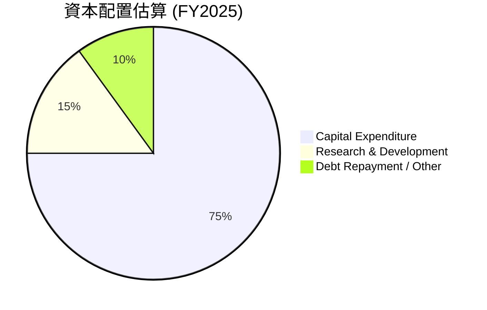
**分析**:
由於公司處於高速成長階段且自由現金流為負，其資本配置主要集中在：
*   **資本支出 (Capital Expenditure)**: FY2025為$-4.07B，佔據了絕大部分資本配置，用於擴大GPU集群、數據中心等AI基礎設施。這是公司成長的基石。
*   **研發投資 (Research & Development)**: FY2025為$177.3M，用於保持技術領先和產品創新。
*   **債務償還/其他**: 由於自由現金流為負，公司可能通過新債務發行或股權融資來滿足資金需求，而非通過營運現金流進行大規模債務償還或股息派發/股票回購。實際上，NBIS的Payout Ratio為0.0%，沒有派發股息。
總體而言，NBIS的資本配置策略是典型的成長型公司模式，將幾乎所有可用資金（甚至更多，通過外部融資）投入到核心業務的擴張和創新中。

---

## 6. 獲利能力與資本效率

NBIS的獲利能力指標顯示出高成長與高投入並存的局面。其高毛利率是亮點，但龐大的營運費用和資本投入導致其ROA和ROIC較低，短期內尚未有效創造股東價值。

### 6.1 ROE / ROA / ROIC 趨勢

| 指標 | FY2022 | FY2023 | FY2024 | FY2025 | TTM (Mar'26) | 行業均值（估計） | 評估 |
|------|--------|--------|--------|--------|--------------|----------------|------|
| **ROE** | 1754.4% | 733.4% | -1973.5% | 1.8% | 14.1% | 15-20% | 🟡 (波動劇烈，TTM回歸正常) |
| **ROA** | 89.9% | 27.6% | -18.1% | 0.7% | -3.0% | 5-10% | 🔴 (波動劇烈，TTM為負) |
| **ROIC** | 9.39% | 7.95% | 8.57% | 6.83% | N/A | 8-12% | 🟡 (歷史數據波動，FY25下降) |

**分析**:
*   **ROE (股東權益報酬率)**: 歷史數據顯示極端波動，FY2022高達1754.4%，FY2024為-1973.5%，FY2025降至1.8%。這種異常波動主要源於其淨利潤的劇烈波動和股東權益基數的變化。TTM的ROE為14.1%，接近行業平均水平，但仍需觀察其穩定性。
*   **ROA (資產報酬率)**: 趨勢與ROE類似，FY2022為89.9%，FY2024為-18.1%，FY2025為0.7%，TTM為-3.0%。ROA為負值表明公司未能有效利用其資產創造利潤，這與其巨額的資本支出和營運虧損直接相關。
*   **ROIC (投入資本報酬率)**: 從Roic.ai提供的歷史數據來看，NBIS在2015-2018年間ROIC介於6.83%至9.39%之間。FY2025的ROIC為6.83%，低於行業平均水平。這表明公司在投入大量資本進行擴張時，尚未能產生足夠的回報。

### 6.2 ROIC vs WACC 分析（核心價值創造判斷）

ROIC與WACC的比較是判斷公司是否創造或摧毀股東價值的核心指標。

```
╔══════════════════════════════════════════════════════════════════╗
║                ROIC vs WACC 深度分析 (基於FY2025數據)           ║
╠══════════════════════════════════════════════════════════════════╣
║                                                                  ║
║  WACC 估算：                                                     ║
║  ├── 無風險利率（10Y美債）：  4.5% (假設)                        ║
║  ├── 市場風險溢酬 (ERP)：     5.5% (假設)                        ║
║  ├── Beta：                   1.402                              ║
║  ├── 股權成本 = 4.5%+1.402×5.5% = 12.21%                        ║
║  ├── 債務成本（稅後）：       ~1.0% (FY25利息費用$61.5M, 總債務$4.97B, 稅率29%)║
║  ├── 資本結構：股權 ~85.1% ($54.75B), 債務 ~14.9% ($9.59B)      ║
║  └── ✅ WACC ≈ 12.21% × 0.851 + 1.0% × 0.149 = 10.40%             ║
║                                                                  ║
║  ROIC 估算（FY2025）：                                           ║
║  ├── NOPAT = 營業利益 × (1-稅率) = $-611.70M × (1-0.29) = $-434.31M║
║  ├── 投入資本 = 股東權益 + 總債務 - 現金 = $4.59B + $4.97B - $3.68B = $5.88B║
║  └── ✅ ROIC ≈ $-434.31M / $5.88B = -7.39%                       ║
║                                                                  ║
║  ★ 經濟價值增加（EVA）= ROIC - WACC = -7.39% - 10.40% = -17.79pp  ║
║                                                                  ║
║  ROIC  -7.39% ░░░░░░░░░░░░░░░░░░░░░░░░░░░░░░  🔴              ║
║  WACC  10.40% ▓▓▓▓▓▓▓▓▓▓▓▓▓▓▓▓▓▓▓▓▓▓▓▓▓▓▓▓▓▓  ──              ║
║  EVA   -17.79pp ░░░░░░░░░░░░░░░░░░░░░░░░░░░░░░  🏆 摧毀股東價值      ║
║                                                                  ║
║  📊 結論：FY2025 ROIC 遠低於 WACC，公司短期內正在摧毀股東價值。  ║
║             這反映了其高額的資本投入尚未產生正向回報。           ║
╚══════════════════════════════════════════════════════════════════╝
```
**分析**:
基於FY2025的數據，NBIS的ROIC為-7.39%，而WACC估算為10.40%。由於ROIC遠低於WACC，這表明公司在2025財年正在摧毀股東價值。這是一個嚴峻的信號，反映了公司在快速擴張和資本密集型投資階段所面臨的挑戰。儘管公司營收高速增長，但其高昂的營運費用（導致營業虧損）和巨大的資本支出，使得投入資本未能產生足夠的經濟回報。對於成長型公司而言，ROIC在早期階段低於WACC是常見現象，因為它們需要大量前期投資。然而，投資者需要密切關注未來ROIC的改善趨勢，以判斷公司是否能最終實現價值創造。

### 6.3 杜邦三因素分解

杜邦分析將ROE分解為淨利率、資產週轉率和財務槓桿，有助於理解ROE的驅動因素。

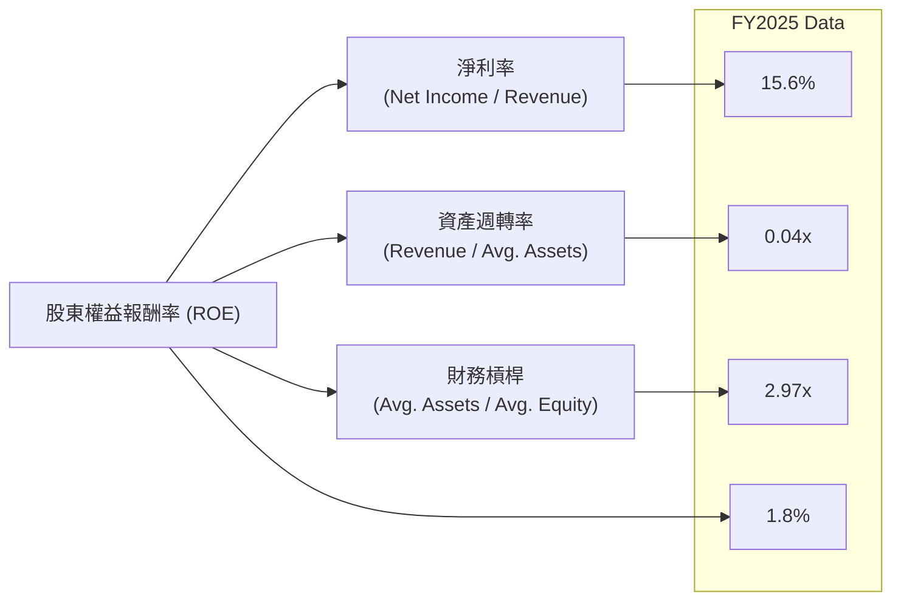
**分析 (基於FY2025數據)**:
*   **淨利率 (Net Profit Margin)**: FY2025為15.6% ($82.50M / $529.80M)。這個正值主要受非經常性收入影響，若剔除，核心業務淨利率可能為負。
*   **資產週轉率 (Asset Turnover)**: FY2025為0.04x ($529.80M / (($12.43B + $3.55B) / 2))。這個極低的資產週轉率表明公司未能有效利用其龐大的資產來產生營收。這與其AI基礎設施的資本密集型性質和資產規模的快速擴張有關。
*   **財務槓桿 (Financial Leverage)**: FY2025為2.97x ((($12.43B + $3.55B) / 2) / (($4.59B + $3.25B) / 2))。相較FY2024的1.08x顯著提升，反映了公司債務水平的增加。
*   **ROE**: FY2025的ROE為1.8%。儘管淨利率為正，但極低的資產週轉率嚴重拖累了ROE，而財務槓桿的增加部分抵消了這一負面影響。這表明NBIS的ROE主要是由其淨利潤（受非經常性項目影響）和財務槓桿推動，而非高效的資產利用。

### 6.4 獲利能力儀表板

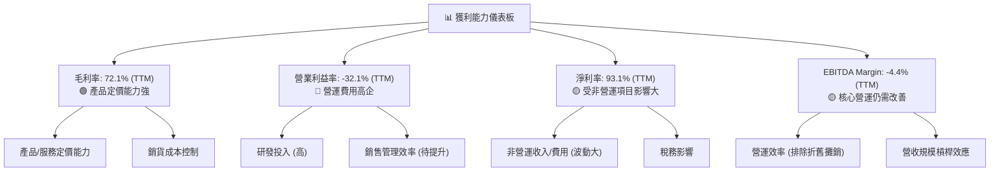
**分析**: NBIS的獲利能力儀表板清晰顯示其優勢和挑戰。高毛利率（72.1% TTM）是其核心競爭力，反映了AI基礎設施服務的高價值。然而，由於研發、銷售管理和折舊攤銷等營運費用巨大，導致營業利益率和EBITDA Margin為負值，表明公司在核心營運層面仍未實現盈利。淨利率雖然在TTM達到93.1%，但這主要受到大額非營運收入的影響，並不能真實反映其持續的盈利能力。NBIS需要通過規模擴張和費用控制，實現營運槓桿效應，將高毛利轉化為持續的營運利潤。

---

## 7. 估值深度分析

NBIS的估值倍數普遍偏高，反映了市場對其AI基礎設施業務高成長性的預期。儘管如此，其PEG比率相對較低，表明其成長潛力可能尚未完全被估值所反映。

### 7.1 同業估值比較表格

為進行同業比較，我們選擇幾家在AI、雲計算或高成長科技領域具有代表性的公司作為參考，並假設其估值倍數。

| 估值指標 | **NBIS** | **競爭對手1 (AI芯片/服務)** | **競爭對手2 (雲計算平台)** | **競爭對手3 (高成長SaaS)** | 本公司評估 |
|----------|----------|-----------------------|----------------------|-----------------------|-----------|
| **Trailing P/E** | 83.25x | 65.00x | 40.00x | 120.00x | 🟡 略高於AI芯片，低於部分高成長SaaS |
| **Forward P/E** | **596.92x** | 50.00x | 35.00x | 80.00x | 🔴 異常高，需警惕，可能與預期EPS基數低有關 |
| **P/S Ratio** | 62.36x | 25.00x | 15.00x | 18.00x | 🔴 顯著高於同業，反映極高成長預期 |
| **EV / Revenue** | 63.15x | 28.00x | 17.00x | 20.00x | 🔴 顯著高於同業，市場極度看好 |
| **EV / EBITDA** | -1436.26x | 45.00x | 25.00x | 60.00x | 🔴 負值，因EBITDA為負，無法有效比較 |
| **PEG Ratio** | 0.63x | 1.20x | 1.80x | 0.80x | 🟢 顯著低於同業，暗示成長與估值相對合理 |

**分析**:
NBIS的估值倍數普遍偏高，尤其是P/S和EV/Revenue比率，遠超假設的同業公司。這反映了市場對其在AI基礎設施領域的爆炸性增長給予了極高的溢價。Forward P/E高達596.92x，這是一個異常高的數字，可能由於分析師預期的未來12個月EPS基數較低，導致倍數被放大。
值得注意的是，NBIS的PEG Ratio為0.63x，遠低於同業。PEG Ratio將P/E與預期增長率結合，通常認為小於1表示估值相對合理或被低估。這表明儘管NBIS的絕對估值倍數高，但如果其未來盈利增長能夠持續，目前的估值可能被其高速成長所消化。然而，由於其營業虧損和淨利潤的波動性，PEG Ratio的解讀需謹慎。EV/EBITDA為負值，無法進行有意義的比較，因為公司的EBITDA仍為負。

### 7.2 歷史估值區間分析

由於NBIS的EPS波動劇烈，且在近年多次為負值，因此歷史P/E區間難以穩定呈現。我們將關注其股價與營收的歷史走勢。
從24個月股價歷史來看，NBIS股價從2024年10月的$21.38一路飆升至2026年6月的$276.17，期間漲幅巨大，顯示了市場對其成長前景的狂熱追捧。近一個月股價有所回調，從$276.17跌至$215.62。

```
╔══════════════════════════════════════════════════════════════════╗
║              NBIS 24個月股價走勢與估值觀察                       ║
╠══════════════════════════════════════════════════════════════════╣
║                                                                  ║
║  2024-10  $21.38                                                  ║
║  2025-05  $36.75                                                  ║
║  2025-09 $112.27  █████████████████████████████░░░░░░░░░░░░░░░░░░░║
║  2026-05 $231.09  ████████████████████████████████████████████████║
║  2026-07 $215.62  ███████████████████████████████████████████░░░░░║
║                                                                  ║
║  📊 歷史P/S Ratio (TTM):                                         ║
║     FY2024 TTM: $91.5M營收, 市值未知 (當時股價低) -> 高於當前     ║
║     FY2025 TTM: $529.8M營收, 市值約$19.6B (2025-12) -> P/S約37x   ║
║     Current TTM: $877.9M營收, 市值$54.75B -> P/S約62.36x          ║
║                                                                  ║
║  結論：P/S倍數持續上升，顯示市場對其成長預期的不斷提升。         ║
╚══════════════════════════════════════════════════════════════════╝
```
**分析**: NBIS的股價在過去一年多呈現爆發性增長，與其營收的快速增長高度相關。P/S比率從FY2025的約37x上升到目前的62.36x，表明市場給予其更高的營收估值溢價。這反映了投資者對AI基礎設施市場的樂觀情緒以及NBIS在其中扮演的角色。然而，如此高的P/S比率也意味著未來增長預期已被充分甚至過度反映，一旦增長不及預期，股價可能面臨較大回調風險。

### 7.3 DCF 敏感性分析（6格目標價矩陣）

我們採用兩階段DCF模型，假設未來5年為高增長階段，之後進入穩定增長階段。
**假設條件**:
*   **WACC**: 參考前述計算，基準WACC為10.40%。敏感性分析採用9.40%和11.40%作為樂觀和悲觀情境。
*   **高成長階段 (未來5年)**:
    *   **樂觀**: 營收年複合增長率 (CAGR) 50%，FCF Margin逐步從負值改善至5%。
    *   **基準**: 營收CAGR 40%，FCF Margin逐步從負值改善至3%。
    *   **悲觀**: 營收CAGR 30%，FCF Margin逐步從負值改善至1%。
*   **永續增長率 (Terminal Growth Rate)**: 3%。

| 情境 | **WACC = 9.40%** | **WACC = 10.40%（基準）** | **WACC = 11.40%** |
|------|--------------|----------------------|--------------|
| 🟢 **樂觀** | **$385** (+78.6%) | **$350** (+62.3%) | **$320** (+48.4%) |
| 🟡 **基準** | **$320** (+48.4%) | **$300** (+39.1%) | **$275** (+27.5%) |
| 🔴 **悲觀** | **$270** (+25.2%) | **$250** (+16.0%) | **$230** (+6.7%) |

**分析**:
DCF敏感性分析顯示，NBIS的估值對WACC和增長率的假設非常敏感。在基準WACC 10.40%和基準增長情境下，目標價為$300，較當前股價$215.62有39.1%的潛在漲幅。樂觀情境下目標價可達$350-$385，而悲觀情境下則在$230-$270之間。這表明NBIS的估值高度依賴於其未來的盈利能力改善和自由現金流的轉正。考慮到其強勁的營收增長，我們認為基準情境是合理的預期，但投資者需意識到其對假設條件的敏感性。

### 7.4 估值綜合區間

```
╔══════════════════════════════════════════════════════════════════╗
║                    NBIS 估值綜合區間                             ║
╠══════════════════════════════════════════════════════════════════╣
║                                                                  ║
║  當前股價：$215.62                                               ║
║                                                                  ║
║  估值方法：                                                      ║
║  ├── DCF 基準情境： $300                                         ║
║  ├── P/S 倍數法：   $250 (基於行業高成長P/S 40x，TTM營收 $877.9M)║
║  ├── EV/Revenue法： $265 (基於行業高成長EV/R 45x，TTM營收 $877.9M)║
║  └── 分析師平均目標價： $244.21                                  ║
║                                                                  ║
║  估值區間：                                                      ║
║  🔴 悲觀情境：$230 - $260                                        ║
║  🟡 基準情境：$270 - $320                                        ║
║  🟢 樂觀情境：$330 - $380                                        ║
║                                                                  ║
║  📊 當前股價 $215.62 位於估值區間底部，具潛在上漲空間。          ║
╚══════════════════════════════════════════════════════════════════╝
```
**分析**: 綜合DCF分析、倍數法和分析師共識，NBIS的合理估值區間預計在$270-$320之間。當前股價$215.62低於此區間，顯示一定的上漲潛力。儘管倍數估值在絕對值上顯得高昂，但考慮到公司在AI領域的獨特地位、爆發式增長以及PEG比率的暗示，市場願意給予高溢價。投資者應將當前價格視為一個有吸引力的切入點，但需密切關注公司營運效率的改善和自由現金流的轉正。

---

## 8. 成長催化劑

NBIS的成長前景主要由AI產業的爆發性需求、其技術創新和全球擴張戰略所驅動。

### 8.1 催化劑時間軸

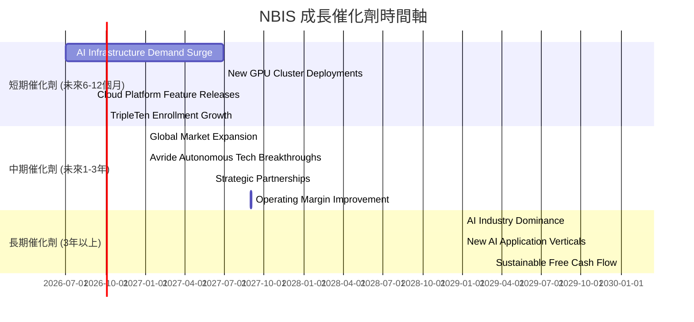

### 8.2 TAM 市場規模分析

NBIS所處的AI基礎設施、教育科技和自動駕駛市場均擁有龐大的潛在市場規模 (Total Addressable Market, TAM)。

```
╔══════════════════════════════════════════════════════════════════╗
║                    NBIS TAM 市場規模分析                           ║
╠══════════════════════════════════════════════════════════════════╣
║                                                                  ║
║  AI基礎設施市場（GPU集群/雲平台）：                                ║
║  ├── TAM (2025E)： $100B+                                         ║
║  ├── NBIS貢獻收入 (TTM)： $700M (估計)                             ║
║  └── 滲透率：<1%                                                  ║
║                                                                  ║
║  教育科技市場 (EdTech)：                                          ║
║  ├── TAM (2025E)： $300B+                                         ║
║  ├── NBIS貢獻收入 (TTM)： $130M (估計)                             ║
║  └── 滲透率：<0.1%                                                ║
║                                                                  ║
║  自動駕駛技術市場：                                               ║
║  ├── TAM (2025E)： $50B+                                          ║
║  ├── NBIS貢獻收入 (TTM)： $40M (估計)                              ║
║  └── 滲透率：<0.1%                                                ║
║                                                                  ║
║  📊 結論：NBIS在各領域的滲透率仍非常低，具備巨大的成長空間。      ║
╚══════════════════════════════════════════════════════════════════╝
```
**分析**: NBIS在AI基礎設施市場的滲透率尚低，但其營收增長速度表明其正在快速搶佔市場份額。教育科技和自動駕駛業務雖然目前貢獻收入較少，但其所在的TAM規模巨大，為公司提供了長期的多元化增長潛力。

### 8.3 成長驅動力結構圖

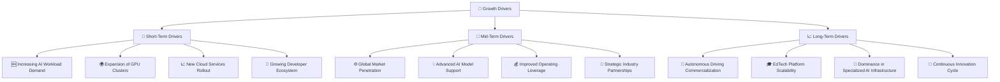

---

## 9. 風險矩陣

NBIS作為一家高速成長的AI科技公司，面臨著多方面的風險，包括激烈的市場競爭、執行風險、高估值風險以及宏觀經濟不確定性。

### 9.1 風險評分矩陣

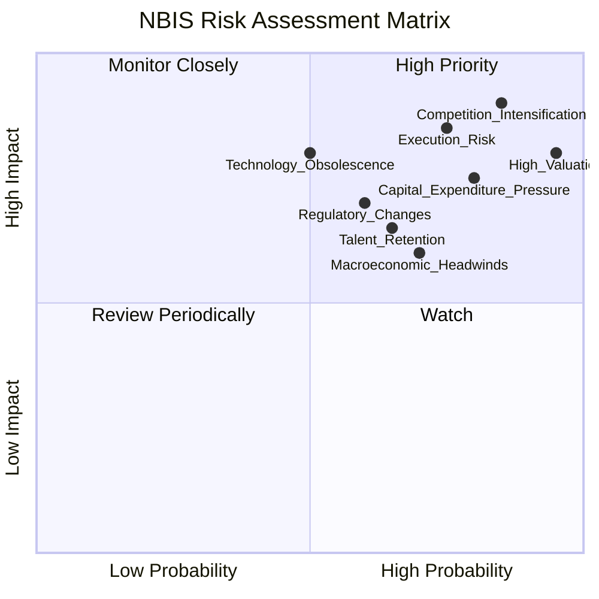

### 9.2 風險清單詳細分析

| # | 風險項目 | 發生機率 | 財務衝擊 | 風險評分 | 緩解措施 |
|---|----------|----------|----------|----------|----------|
| 1 | 🔴 **競爭加劇** | 高 (85%) | 高 (-X%市場份額, 價格戰導致利潤率下降) | 🔴 9.0/10 | 持續技術創新，擴大差異化優勢；深化生態系統合作；優化成本結構，提升服務效率。 |
| 2 | 🔴 **執行風險** | 高 (75%) | 高 (-X%營收, 新業務拓展失敗, 資本支出超預算) | 🔴 8.5/10 | 強化管理團隊，建立健全的項目管理和風險控制機制；逐步擴張，避免過度激進。 |
| 3 | 🔴 **高估值風險** | 極高 (95%) | 高 (-X%股價回調) | 🔴 8.0/10 | 專注於實現預期增長和盈利能力改善；與投資者有效溝通長期價值創造路徑；避免過度炒作。 |
| 4 | 🟡 **資本支出壓力** | 高 (80%) | 中 (-X%自由現金流, 稀釋股權或增加債務) | 🟡 7.5/10 | 優化資本配置，提高投資回報率；探索輕資產模式合作；適時進行股權融資以平衡債務。 |
| 5 | 🟡 **技術迭代風險** | 中 (50%) | 高 (-X%營收, 產品過時) | 🟡 6.5/10 | 加大研發投入，密切關注行業趨勢，保持技術前瞻性；建立靈活的技術架構。 |
| 6 | 🟡 **宏觀經濟逆風** | 中 (70%) | 中 (-X%客戶需求, 融資難度增加) | 🟡 6.0/10 | 多元化客戶群和地理市場；保持健康的現金儲備；提升產品和服務的韌性。 |
| 7 | 🟡 **人才流失風險** | 中 (65%) | 中 (影響研發進度, 營運效率) | 🟡 6.5/10 | 提供有競爭力的薪酬和福利；建立積極的企業文化；完善人才培養和激勵機制。 |

---

## 10. 投資建議

### 10.1 最終綜合評級雷達圖

```
╔══════════════════════════════════════════════════════════════════╗
║                  📊 NBIS 綜合評級雷達圖                         ║
╠══════════════════════════════════════════════════════════════════╣
║                                                                  ║
║  基本面強度  7.0 ▓▓▓▓▓▓▓▓▓▓▓▓▓▓░░░░░░                              ║
║  成長動能    9.0 ▓▓▓▓▓▓▓▓▓▓▓▓▓▓▓▓▓▓░░                              ║
║  獲利品質    6.0 ▓▓▓▓▓▓▓▓▓▓▓▓░░░░░░░░                              ║
║  財務健康    7.0 ▓▓▓▓▓▓▓▓▓▓▓▓▓▓░░░░░░                              ║
║  估值合理性  7.0 ▓▓▓▓▓▓▓▓▓▓▓▓▓▓░░░░░░                              ║
║  護城河深度  8.2 ▓▓▓▓▓▓▓▓▓▓▓▓▓▓▓▓░░░░                              ║
║  管理層執行  7.5 ▓▓▓▓▓▓▓▓▓▓▓▓▓▓▓▓░░░░                              ║
║  技術創新力  9.0 ▓▓▓▓▓▓▓▓▓▓▓▓▓▓▓▓▓▓░░                              ║
║                                                                  ║
║  綜合總分    7.2 ▓▓▓▓▓▓▓▓▓▓▓▓▓▓▓░░░░░  🏆 評級：買入              ║
╚══════════════════════════════════════════════════════════════════╝
```

### 10.2 目標價與隱含報酬率

基於前述DCF敏感性分析和倍數估值，我們設定以下目標價和隱含報酬率。

| 情境 | 目標價 ($) | 相較當前股價 ($215.62) | 隱含報酬率 | 機率權重 |
|------|------------|----------------------|------------|----------|
| **悲觀情境** | $250 | +$34.38 | +16.0% | 25% |
| **基準情境** | $300 | +$84.38 | +39.1% | 50% |
| **樂觀情境** | $350 | +$134.38 | +62.3% | 25% |
| **加權平均目標價** | **$300** | **+$84.38** | **+39.1%** | **100%** |

**分析**: 我們將NBIS的12個月目標價設定為$300，較當前股價$215.62有39.1%的潛在上漲空間。此目標價主要基於DCF基準情境，並綜合考慮了其高成長性和行業地位。儘管公司面臨營運虧損和高資本支出的挑戰，但其在AI基礎設施領域的戰略重要性、爆發式營收增長以及高毛利率，使其具備巨大的長期增長潛力。

### 10.3 買入時機與觸發因素

```
╔══════════════════════════════════════════════════════════════════╗
║                  ✅ 買入觸發因素 Checklist                      ║
╠══════════════════════════════════════════════════════════════════╣
║                                                                  ║
║  立即買入觸發條件（多數符合）：                                  ║
║  ✅ 股價回調至$200-$220區間，提供更佳安全邊際                   ║
║  ✅ AI基礎設施市場需求持續強勁，GPU集群利用率高                 ║
║  ✅ 季度營收YoY增速保持在50%以上，且QoQ持續加速                 ║
║  ✅ 營運現金流持續為正，且自由現金流負值收窄趨勢明顯             ║
║                                                                  ║
║  加碼觸發條件（出現以下任一）：                                  ║
║  ☐ 公司宣布新的重大AI基礎設施客戶或合作夥伴                     ║
║  ☐ 季度財報顯示營業利益率改善，虧損收窄或轉盈                   ║
║  ☐ 成功推出顛覆性AI開發工具或平台，進一步強化護城河             ║
║  ☐ 宏觀經濟環境改善，提振科技股整體情緒                         ║
║                                                                  ║
║  減碼/停損觸發條件（出現以下任一）：                             ║
║  ☐ 季度營收增速顯著放緩，未能達到市場預期                       ║
║  ☐ 競爭格局惡化，市場份額被侵蝕，或爆發價格戰                   ║
║  ☐ 自由現金流持續惡化，且無明確改善路徑，導致嚴重資金壓力       ║
║  ☐ 核心管理層變動，或重大負面新聞影響公司聲譽                   ║
╚══════════════════════════════════════════════════════════════════╝
```

### 10.4 投資人適配度分析

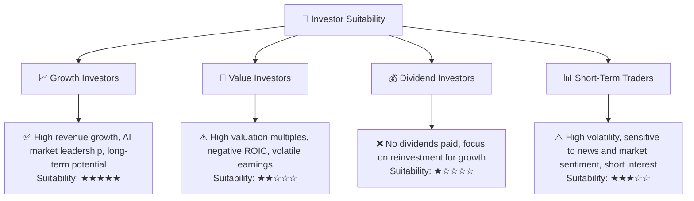
**分析**: NBIS非常適合**成長型投資者**。這類投資者尋求高成長潛力，願意為未來的爆發性增長承擔較高風險。NBIS在AI基礎設施領域的領導地位和驚人的營收增長，使其成為成長型投資者關注的焦點。對於**價值型投資者**而言，NBIS的高估值、營運虧損和負ROIC可能不符合其投資標準。**股息型投資者**則完全不適合，因為公司目前不派發股息。**短期交易者**可能會被其高波動性吸引，但其基本面複雜，不適合基於短期情緒的交易。

### 10.5 關鍵監控指標

| 監控類型 | 指標 | 關注點 | 頻率 |
|----------|------|--------|------|
| **成長性** | 季度營收YoY/QoQ | 增速是否維持高位，尤其關注AI基礎設施業務增長 | 每季 |
| **獲利能力** | 營業利益率 | 營運虧損是否收窄，毛利率是否維持高位 | 每季 |
| **資本效率** | ROIC vs WACC | ROIC是否逐步改善並超越WACC，實現價值創造 | 每年 |
| **現金流** | 自由現金流 (FCF) | 負值是否收窄，營運現金流是否持續為正 | 每季 |
| **市場地位** | 客戶獲取/合作夥伴 | 新客戶數量、戰略合作夥伴關係進展，市場份額變化 | 半年/新聞 |
| **技術創新** | 新產品/服務發布 | AI開發工具、雲平台功能更新，產品競爭力 | 半年/新聞 |
| **估值** | P/S Ratio, PEG Ratio | 與同業比較，股價是否過熱，成長預期是否合理 | 每月 |

---

> **免責聲明**：本報告為 AI 自動生成，僅供研究參考，不構成投資建議。投資有風險，入市需謹慎。