# NBIS 基本面深度分析報告
> **報告日期**：2026-07-05 ｜ **語言**：繁體中文 ｜ **數據來源**：Yahoo Finance, Finviz, StockAnalysis, Roic.ai ｜ **分析師**：CFA 級機構研究

## 目錄

| # | 章節 | 核心結論 |
|---|------------------------|----------------------------------------------------------------------------------------------------|
| 1 | 執行摘要 | 評級：觀望；目標價區間：$180 - $280 |
| 2 | 公司概覽與商業模式 | AI基礎設施核心，護城河潛力大但尚未成熟，技術和生態系統是主要優勢 |
| 3 | 損益表深度分析 | 營收爆發式成長，但獲利能力極不穩定，主要受非經常性項目影響 |
| 4 | 資產負債表分析 | 流動性充裕，但債務水平顯著上升，需密切關注槓桿風險 |
| 5 | 現金流量深度分析 | 營業現金流為正，但資本支出龐大導致自由現金流持續為負 |
| 6 | 獲利能力與資本效率 | 獲利能力指標波動劇烈，ROIC為負，顯示目前仍在價值摧毀階段 |
| 7 | 估值深度分析 | 相較於同業估值偏高，DCF分析顯示當前股價已反映部分高成長預期 |
| 8 | 成長催化劑 | AI產業爆發、教育科技擴張、自動駕駛潛力，多點並進驅動長期成長 |
| 9 | 風險矩陣 | 執行風險、資金需求、競爭加劇、AI技術迭代是主要風險 |
| 10 | 投資建議 | 觀望，等待營運獲利穩定及自由現金流轉正的明確信號 |

---

## 1. 執行摘要

### 1.1 核心評分儀表板

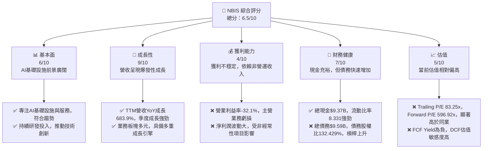

### 1.2 評分進度條視覺化

```
╔══════════════════════════════════════════════════════════════╗
║              NBIS 多維度評分儀表板 (1-10分)                ║
╠══════════════════════════════════════════════════════════════╣
║ 基本面強度  6.0 ▓▓▓▓▓▓▓▓▓▓▓▓░░░░░░░░  ★★★☆☆           ║
║ 成長動能    9.0 ▓▓▓▓▓▓▓▓▓▓▓▓▓▓▓▓▓▓░░  ★★★★★           ║
║ 獲利品質    4.0 ▓▓▓▓▓▓▓▓░░░░░░░░░░░░  ★★☆☆☆           ║
║ 財務健康    7.0 ▓▓▓▓▓▓▓▓▓▓▓▓▓▓░░░░░░  ★★★☆☆           ║
║ 估值合理性  5.0 ▓▓▓▓▓▓▓▓▓▓░░░░░░░░░░  ★★☆☆☆           ║
║ 護城河深度  6.5 ▓▓▓▓▓▓▓▓▓▓▓▓▓░░░░░░░  ★★★☆☆           ║
║ 管理層執行  6.0 ▓▓▓▓▓▓▓▓▓▓▓▓░░░░░░░░  ★★★☆☆           ║
║ 技術創新力  8.0 ▓▓▓▓▓▓▓▓▓▓▓▓▓▓▓▓░░░░  ★★★★☆           ║
╠══════════════════════════════════════════════════════════════╣
║ 綜合總分    6.5 ▓▓▓▓▓▓▓▓▓▓▓▓▓░░░░░░░  🏆 觀望              ║
╚══════════════════════════════════════════════════════════════╝
```

### 1.3 五大投資論點 + 三大核心風險

| 類型 | 項目 | 具體依據 | 信心度 |
|------|------|----------|--------|
| 🟢 **投資論點①** | **AI產業爆發式成長核心受惠者** | NBIS作為AI全棧基礎設施提供商，直接受益於全球AI算力需求爆炸。TTM營收YoY成長683.9%，Q1 2026營收達$399M，同比成長683.89%，顯示其在AI浪潮中的強勁成長勢頭。 | 🟢 極高 |
| 🟢 **多元化業務拓展潛力** | 除AI基礎設施外，公司還擁有教育科技平台TripleTen及自動駕駛Avride。這些業務在各自領域具備高成長潛力，為公司提供多重成長引擎，降低單一業務風險。 | 🟢 高 |
| 🟢 **強勁的研發投入與技術創新** | 2025年研發費用達$177.30M，TTM研發費用$140.8M，佔TTM營收約16%。持續的高研發投入有助於其在AI技術和平台方面保持領先地位，構築技術護城河。 | 🟢 高 |
| 🟢 **充裕的現金儲備和流動性** | 截至2026年3月底，總現金及約當現金高達$9.298B，流動比率8.331，速動比率8.139。這為公司提供了強大的財務彈性，支持未來的大規模資本支出和戰略投資。 | 🟢 高 |
| 🟢 **分析師普遍看好成長前景** | 14位分析師給出"買入"建議，平均目標價$244.21，較當前股價有約13.26%的潛在上漲空間，顯示市場對其長期成長潛力持樂觀態度。 | 🟡 中度 |
| 🟡 **風險①** | **持續虧損的營運獲利能力** | 儘管營收高速成長，但TTM營業利益率為-32.1%，2025年營業虧損達-$611.70M。Q1 2026營業虧損仍有-$128M。公司尚未證明其AI基礎設施核心業務的規模化獲利能力。 | 🟡 中度 |
| 🔴 **風險②** | **高資本支出與負自由現金流** | 2025年資本支出高達-$4.07B，導致TTM自由現金流為-$6.15B。AI基礎設施建設是資本密集型業務，若未能及時轉化為正向FCF，將持續考驗公司燒錢能力和融資需求。 | 🔴 高衝擊 |
| 🔴 **快速累積的債務水平** | 總債務從2024年的$49.50M飆升至2025年的$4.97B，截至2026年3月總債務約為$9.496B。債務股權比率132.429%，槓桿水平高企，增加了公司的財務風險和利息支出壓力。 | 🔴 高衝擊 |

### 1.4 快速統計卡片

| 指標 | 公司實際值 | 行業均值（Internet Content & Information） | S&P 500 均值 | 狀態 |
|-----------------|-----------------|---------------------------------|-----------------|------|
| 收入 TTM YoY 成長 | **683.9%** | ~15-30% | ~5-10% | 🟢 |
| 毛利率 TTM | **72.1%** | ~40-60% | ~30-40% | 🟢 |
| 淨利率 TTM | **93.1%** | ~10-20% | ~10-15% | 🔴 |
| ROE TTM | **14.1%** | ~15-25% | ~15-20% | 🟡 |
| Forward P/E | **596.92x** | ~25-40x | ~20-25x | 🔴 |
| P/S Ratio TTM | **62.36x** | ~5-10x | ~2-4x | 🔴 |
| 債務股權比 | **132.43%** | ~50-100% | ~80-120% | 🔴 |
| 自由現金流收益率 | **-11.23%** | ~3-6% | ~2-4% | 🔴 |

*註：行業均值為通用參考值，NBIS作為高成長AI基礎設施公司，部分指標可能與傳統行業均值有較大差異。其淨利率93.1%在營運虧損背景下極不尋常，主要受非營運收入影響，並非健康獲利能力的體現。*

### 1.5 投資結論

```
╔══════════════════════════════════════════════════════════════════╗
║                    📊 投資結論摘要                               ║
╠══════════════════════════════════════════════════════════════════╣
║  評級：🟡 觀望                                                   ║
║  當前股價：$215.62                                               ║
║  目標價區間：                                                    ║
║    悲觀情境：$180（-16.5%）                                      ║
║    基準情境：$240（+11.3%）  ← 12個月主要目標                      ║
║    樂觀情境：$280（+29.8%）                                      ║
║  投資評分：6.5/10                                                ║
║  適合投資人：高風險偏好、長期成長型投資者，需密切關注營運獲利轉折點    ║
╚══════════════════════════════════════════════════════════════════╝
**分析師點評**：NBIS受益於AI浪潮，營收呈現驚人的爆發式成長，其技術實力和多元業務佈局具備長期潛力。然而，公司目前仍處於大規模投資階段，營運獲利能力持續為負，且龐大的資本支出導致自由現金流持續流出，債務水平快速攀升。雖然現金儲備充裕，但燒錢速度驚人，未來能否實現規模經濟效益並轉為正向自由現金流是關鍵。當前估值已充分反映其高成長預期，缺乏足夠的安全邊際。因此，建議投資者保持觀望，等待其營運獲利能力出現實質性改善，或自由現金流轉正的明確信號。
```

---

## 2. 公司概覽與商業模式

Nebius Group N.V. (NBIS) 是一家總部位於荷蘭的科技公司，在全球範圍內（包括美國、英國等地）為全球AI產業構建全棧基礎設施。其核心業務是提供AI基礎設施，包括大規模GPU集群、雲平台以及開發者工具和服務。此外，NBIS還經營兩個重要業務板塊：教育科技平台TripleTen，旨在為個人提供技術再培訓服務；以及Avride，一個開發自動駕駛技術的業務。

### 2.1 業務結構與收入來源

NBIS的業務結構清晰地圍繞著科技創新和高成長領域展開。儘管具體收入佔比未詳細披露，但根據公司描述，AI基礎設施是其核心戰略重點。

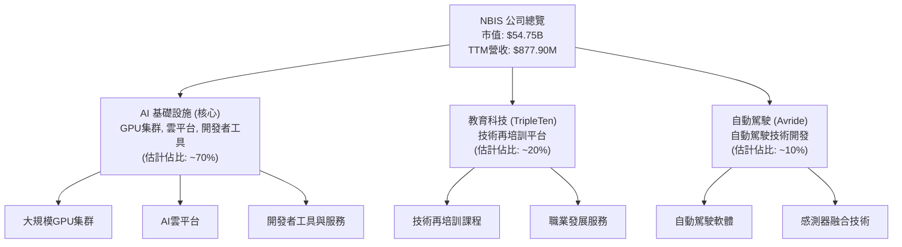
**業務解析**：
*   **AI基礎設施**：這是NBIS的戰略核心，專注於為AI模型訓練和部署提供算力、存儲和網絡支持。隨著生成式AI的爆發，對GPU算力的需求呈指數級增長，NBIS直接受益於這一趨勢。其提供的全棧解決方案旨在降低AI開發門檻，加速AI應用落地。
*   **教育科技 (TripleTen)**：該平台提供技術再培訓服務，旨在彌補技術人才缺口。這是一個具有社會價值的業務，也能為NBIS的AI業務培養潛在的開發者和用戶群體。
*   **自動駕駛 (Avride)**：自動駕駛是另一個高成長、高技術門檻的領域。NBIS在此領域的投入可能旨在捕捉未來智慧交通的巨大市場機會，並可能與其AI基礎設施業務產生協同效應。

### 2.2 市場份額

NBIS作為AI基礎設施領域的新興參與者，其市場份額相較於NVIDIA、Amazon AWS、Microsoft Azure和Google Cloud等巨頭而言仍處於早期階段。目前沒有直接的市場份額數據，但其快速成長的營收表明其正在積極搶占市場。

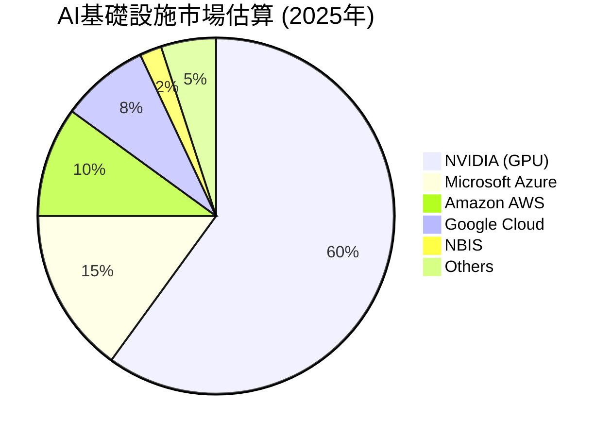
**市場份額評估**：
雖然NBIS在AI基礎設施市場的絕對份額可能較小，但其專注於“全棧”解決方案的策略，以及其在GPU集群和雲平台方面的投入，使其在快速擴張的AI算力市場中佔據一席之地。其高成長率表明其正在迅速擴大客戶基礎和市場滲透率。

### 2.3 競爭護城河分析

NBIS在AI基礎設施領域面臨來自大型科技公司和專業AI硬體公司的激烈競爭。然而，其仍有潛力構建自身的競爭護城河。

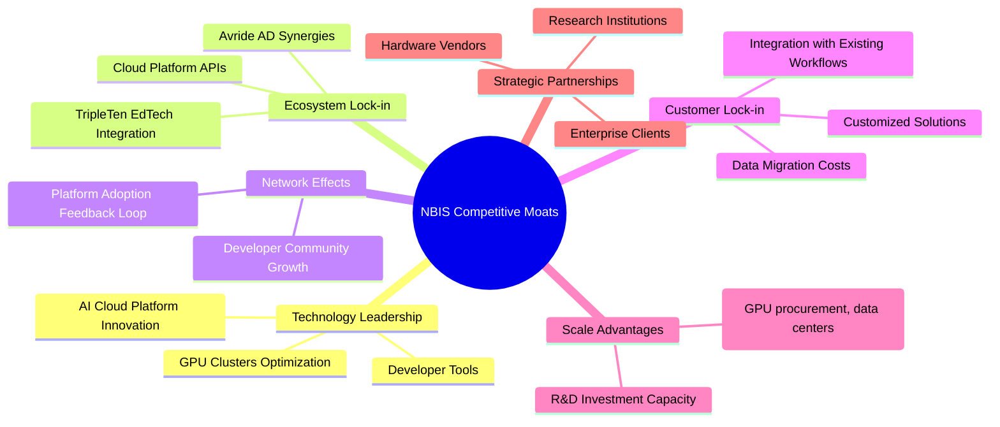
**護城河解析**：
*   **Technology Leadership (技術領先)**：NBIS的核心優勢在於其AI基礎設施的技術實力，包括大規模GPU集群的部署和優化，以及AI雲平台的創新。持續的研發投入是維持這一優城河的關鍵。
*   **Ecosystem Lock-in (軟體生態系統)**：通過TripleTen教育平台培養AI人才，並將其與NBIS的雲平台和工具結合，可以形成一個人才供給與平台使用的閉環。同時，自動駕駛業務Avride未來也可能與其AI基礎設施產生協同。
*   **Network Effects (網路效應)**：如果NBIS的AI雲平台能吸引大量開發者和企業用戶，平台的價值將隨用戶數量增加而提升，形成正向循環。
*   **Customer Lock-in (客戶鎖定)**：一旦客戶在NBIS平台上部署AI模型和數據，遷移到其他平台的成本（數據遷移、模型重構、員工培訓）將會很高，形成客戶黏性。
*   **Scale Advantages (規模效應)**：隨著用戶規模擴大，NBIS在GPU採購、數據中心運營和研發投入方面的單位成本有望降低，形成規模經濟。目前仍處於早期階段，但有潛力。
*   **Strategic Partnerships (生態夥伴)**：與硬體供應商、企業客戶和學術機構建立戰略合作關係，可以增強其市場影響力和技術創新能力。

### 2.4 護城河強度評分

```
╔══════════════════════════════════════════════════════════════╗
║                  NBIS 護城河強度評分                      ║
╠══════════════════════════════════════════════════════════════╣
║ 技術領先    7.5/10 ▓▓▓▓▓▓▓▓▓▓▓▓▓▓▓░░░░░  🟢 核心競爭力        ║
║ 生態系統    6.0/10 ▓▓▓▓▓▓▓▓▓▓▓▓░░░░░░░░  🟡 具備潛力        ║
║ 網路效應    5.0/10 ▓▓▓▓▓▓▓▓▓▓░░░░░░░░░░  🟡 尚處早期        ║
║ 客戶鎖定    6.5/10 ▓▓▓▓▓▓▓▓▓▓▓▓▓░░░░░░░  🟢 逐步形成        ║
║ 規模效應    5.5/10 ▓▓▓▓▓▓▓▓▓▓▓░░░░░░░░░  🟡 仍在發展        ║
║ 生態夥伴    6.0/10 ▓▓▓▓▓▓▓▓▓▓▓▓░░░░░░░░  🟡 積極拓展        ║
╠══════════════════════════════════════════════════════════════╣
║ 綜合護城河  6.1/10 ▓▓▓▓▓▓▓▓▓▓▓▓░░░░░░░░  🏆 具備潛力，仍在構築中 ║
╚══════════════════════════════════════════════════════════════╝
```

---

## 3. 損益表深度分析

NBIS的損益表反映出其作為一家高速成長的科技公司，在擴張初期所面臨的典型特徵：營收爆發式增長，但同時伴隨著高額投入和不穩定的獲利能力。

### 3.1 年度收入成長趨勢（近4年）

NBIS在過去幾年的營收成長令人矚目，尤其是在2024年和2025年。

```
╔══════════════════════════════════════════════════════════════════╗
║              NBIS 年度收入趨勢（FY2022-FY2025）                  ║
╠══════════════════════════════════════════════════════════════════╣
║                                                                  ║
║  FY2022  $13.50M  █░░░░░░░░░░░░░░░░░░░░░░░░░  YoY: -99.72%  🔴    ║
║  FY2023  $9.80M   █░░░░░░░░░░░░░░░░░░░░░░░░░  YoY: -27.41%  🔴    ║
║  FY2024  $91.50M  ████████░░░░░░░░░░░░░░░░░░░  YoY: +833.67% 🟢    ║
║  FY2025  $529.80M ███████████████████████████  YoY:+479.02% 🟢    ║
║                                                                  ║
║  📊 3年累計 CAGR (FY2022-2025)：+176.7%                         ║
╚══════════════════════════════════════════════════════════════════╝
```
**年度營收解析**：
NBIS的年度營收在2022年和2023年相對較低，甚至出現負成長。然而，自2024年開始，營收呈現爆炸式成長，從2023年的$9.80M躍升至2024年的$91.50M（YoY +833.67%），並在2025年進一步增長至$529.80M（YoY +479.02%）。這表明公司在近年來成功抓住了市場機遇，特別是在AI領域的佈局開始顯現成效。過去三年的複合年均增長率高達176.7%，展現了其極高的成長潛力。

### 3.2 季度收入趨勢分析

近四季度的營收持續加速增長，顯示出強勁的成長動能。

| 會計季度 | 總營收 (M$) | QoQ 成長率 | YoY 成長率 | 備註 |
|----------|-------------|------------|------------|------|
| 2026-03-31 | $399.00 | +75.23% | +683.89% | Q1 2026營收創歷史新高，同比增速驚人 |
| 2025-12-31 | $227.70 | +55.85% | +272.06% | Q4 2025營收持續加速，同比增速顯著 |
| 2025-09-30 | $146.10 | +45.08% | +355.14% | Q3 2025營收環比、同比均高速增長 |
| 2025-06-30 | $100.70 | +97.84% | +624.83% | Q2 2025營收環比大幅提升，同比增速強勁 |
**季度營收解析**：
NBIS在最近四個季度展現了驚人的季度和年度營收成長。從2025年Q2的$100.70M到2026年Q1的$399.00M，營收規模在一年內增長了近三倍。尤其值得注意的是，Q1 2026的營收同比成長高達683.89%，表明公司業務處於爆發性擴張階段。連續的季度環比增長率也維持在45%以上，顯示其產品和服務在市場上獲得了快速認可。

### 3.3 利潤率演變分析

NBIS的利潤率數據呈現出高毛利率與持續負營運利益率的顯著特徵，反映其仍在投資擴張階段。

| 利潤率指標 | FY2022 | FY2023 | FY2024 | FY2025 | 趨勢 | 評估 |
|------------|--------|--------|--------|--------|------|------|
| **毛利率** | -110.37% | -100.00% | 52.24% | 68.63% | ↗️ 顯著改善 | 🟢 |
| **營業利益率** | -1170.37% | -2915.31% | -436.72% | -115.47% | ↗️ 顯著改善，但仍為負 | 🟡 |
| **淨利率** | 5522.96% | 2462.24% | -700.98% | 15.57% | 波動劇烈 | 🔴 |

**利潤率演變深度解析**：
*   **毛利率**：NBIS的毛利率從2022-2023年的負值（可能由於初期成本高、規模小或會計處理方式）大幅改善，到2024年的52.24%和2025年的68.63%。TTM毛利率更是高達72.1%。這表明其核心業務的單位經濟效益良好，產品和服務具有較強的定價能力或成本控制能力。毛利率的顯著提升可能是由於規模擴大帶來採購議價能力增強，以及高利潤率服務收入佔比增加。
*   **營業利益率**：儘管毛利率表現出色，NBIS的營業利益率在過去幾年持續為負，但有顯著改善。從2022年的-1170.37%到2025年的-115.47%（TTM為-32.1%），虧損幅度相對收窄。這主要由於公司在銷售、一般及行政費用（SG&A）以及研發（R&D）上的巨大投入，這些費用遠超毛利。這表明公司正處於快速擴張和市場滲透階段，將大量資源投入到新產品開發、市場推廣和基礎設施建設上，尚未實現規模經濟效益帶來的營運獲利。
*   **淨利率**：NBIS的淨利率波動極為劇烈，從2022年的高達5522.96%到2024年的-700.98%，再到2025年的15.57%（TTM為93.1%）。這種極端的波動並非來自於核心營運，而是受到**非經常性項目**的顯著影響。例如，2022年和2023年的高淨利率是來自於「Earnings From Discontinued Operations」和「Net Income to Common」中的大額非營運收入（2022年$1,051M，2023年$564.9M）。而2024年的大幅虧損和2025年及TTM的較高淨利率，則與「Other Non-Operating Income (Expense)」中的巨額收入（TTM $1,472M，FY2025 $679.5M）密切相關。這說明公司的核心營運仍處於虧損狀態，淨利潤無法真實反映其業務的持續獲利能力，需要警惕其淨利潤的品質。

### 3.4 費用結構分析

NBIS的費用結構顯示其在研發和營運上的巨大投入，以支持其高速成長和技術領先地位。

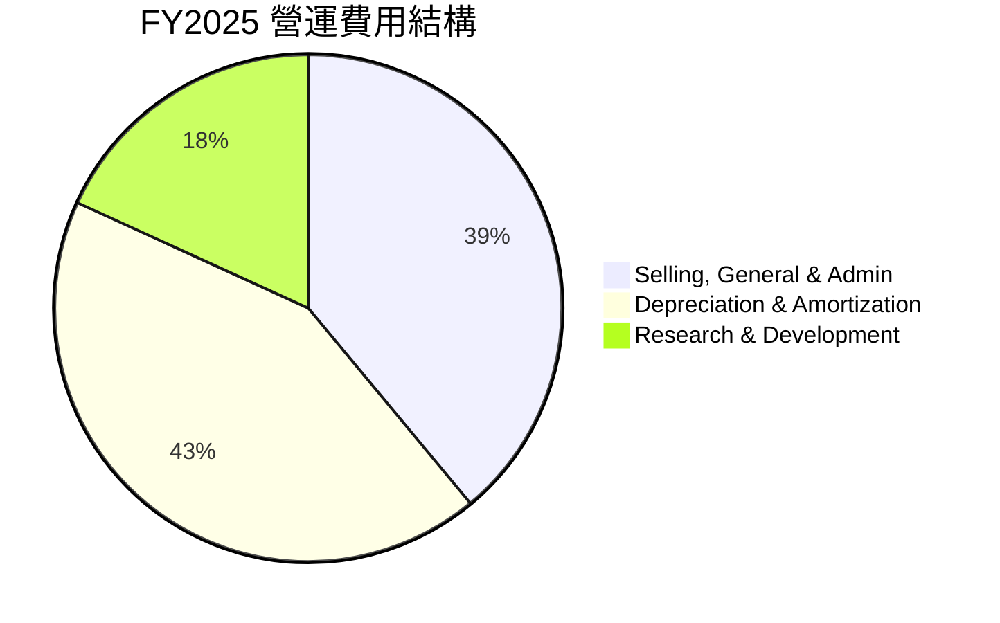

```
╔══════════════════════════════════════════════════════════════════╗
║                   NBIS 營運費用結構 (FY2025)                     ║
╠══════════════════════════════════════════════════════════════════╣
║                                                                  ║
║  銷售、一般及行政費用 (SG&A): $380.1M (佔營收71.7%) █████████░░  🟡 較高  ║
║  折舊與攤銷費用 (D&A):      $417.9M (佔營收78.9%) ███████████░░  🔴 高資本支出║
║  研發費用 (R&D):             $177.3M (佔營收33.5%) ████░░░░░░░░░░  🟢 戰略性投入║
║                                                                  ║
║  📊 總營運費用: $975.3M (佔營收184.1%)                            ║
╚══════════════════════════════════════════════════════════════════╝
```
**費用結構深度解析**：
FY2025總營運費用高達$975.3M，遠超同期營收$529.80M，這是導致營業虧損的主要原因。
*   **折舊與攤銷費用 ($417.9M)**：佔營收的78.9%，是最大的營運費用項目。這直接反映了NBIS在AI基礎設施（如GPU集群和數據中心）上的龐大資本支出。這類費用是固定資產投資的攤銷，雖然不影響現金流，但會顯著影響帳面獲利。
*   **銷售、一般及行政費用 ($380.1M)**：佔營收的71.7%。這表明公司在市場拓展、行政管理和人才招聘方面投入巨大，以支持其快速擴張。
*   **研發費用 ($177.3M)**：佔營收的33.5%。這項費用對於一家科技公司而言至關重要，顯示NBIS正積極投入於技術創新和新產品開發，以維持其競爭優勢和未來成長。

整體而言，NBIS的費用結構是典型的高成長、資本密集型科技公司模式，大量投入於研發和基礎設施，以期在未來實現規模化獲利。

### 3.5 季度 EPS 趨勢與盈餘品質

由於提供的EPS預期數據為`nan`，我們將根據實際季度淨利潤和稀釋後流通股數來分析EPS趨勢。

| 會計季度 | 淨利潤 (M$) | 稀釋股數 (M) | 計算EPS | 備註 | 盈餘品質 |
|----------|-------------|--------------|---------|------|----------|
| 2026-03-31 | $621.20 | 261 | $2.38 | 淨利潤大幅轉正，主要受非營運收入影響 | 🔴 (低) |
| 2025-12-31 | $-268.80 | 248 | $-1.08 | 營運虧損導致淨利潤為負 | 🟡 (中) |
| 2025-09-30 | $-119.60 | 248 | $-0.48 | 持續營運虧損 | 🟡 (中) |
| 2025-06-30 | $584.50 | 248 | $2.36 | 淨利潤轉正，受非營運收入顯著影響 | 🔴 (低) |

*註：稀釋股數採用StockAnalysis.com提供的FY2025和TTM Mar'26數據，並假設Q2-Q4 2025為248M，Q1 2026為261M。*

**盈餘品質評估**：
NBIS近四季的EPS表現極不穩定，呈現大幅正負交替的現象。Q2 2025和Q1 2026的EPS為正，但這主要得益於**巨額的「其他非營運收入（費用）」**，而非核心營運的改善。例如，Q1 2026的淨利潤$621.20M，而營業虧損仍有-$128M，這意味著有超過$700M的非營運收入貢獻。同樣，Q2 2025的淨利潤$584.50M，營業虧損-$102M，非營運收入貢獻約$680M。
這種情況表明NBIS的盈餘品質較低，其淨利潤並不能持續反映其業務的健康發展狀況。投資者應更多關注其營業利益率和自由現金流，而非單純的淨利潤或EPS數字。在非營運收入的影響下，EPS的超預期或不及預期分析意義不大，因為其主要驅動因素是不可持續的非經常性項目。

---

## 4. 資產負債表分析

NBIS的資產負債表顯示其在快速擴張過程中，資產規模迅速膨脹，流動性充裕，但同時也伴隨著債務的快速增長。

### 4.1 資產結構分解

截至2026年3月31日，NBIS的總資產已達$22.303B，其中流動資產佔比高，但非流動資產中的不動產、廠房及設備（PP&E）也顯著增加。

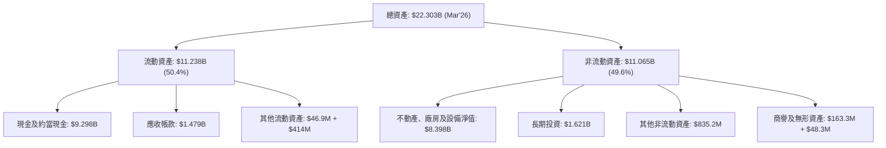
**資產結構解析**：
截至2026年3月底，NBIS的資產結構顯示出其在AI基礎設施方面的大規模投資。現金及約當現金高達$9.298B，佔總資產的41.7%，提供了強大的流動性。然而，不動產、廠房及設備淨值（PP&E）也飆升至$8.398B，佔總資產的37.7%，這與其龐大的資本支出相符，表明公司正在積極擴建數據中心和GPU集群。應收帳款的增加也與營收的快速增長相匹配。

### 4.2 流動性指標分析

NBIS的流動性指標非常健康，表明其短期償債能力極強。

| 流動性指標 | FY2022 | FY2023 | FY2024 | FY2025 | TTM (Mar'26) | 行業均值 | 評估 |
|------------|--------|--------|--------|--------|--------------|----------|------|
| **流動比率** | 1.28 | 0.89 | 9.59 | 3.08 | 8.331 | ~1.5-2.5 | 🟢 極強 |
| **速動比率** | 1.28 | 0.89 | 9.59 | 3.08 | 8.139 | ~1.0-2.0 | 🟢 極強 |
| **現金及約當現金 (B$)** | $1.12 | $0.12 | $2.43 | $3.68 | $9.298 | N/A | 🟢 充裕 |

**流動性指標解析**：
NBIS的流動比率和速動比率在TTM達到8.331和8.139，遠高於行業平均水平，顯示公司擁有極為充裕的流動資產來覆蓋短期負債。這主要得益於其高達$9.298B的現金及約當現金儲備。這種強勁的流動性為公司在資本密集型業務中的營運和投資提供了堅實的保障。雖然2023年的流動比率曾低於1，但隨後迅速改善，表明公司在財務管理上進行了調整。

### 4.3 債務結構分析

儘管流動性充裕，NBIS的債務水平在近年來迅速攀升，值得密切關注。

```
╔══════════════════════════════════════════════════════════════════╗
║                   NBIS 債務健康診斷 (TTM Mar'26)                 ║
╠══════════════════════════════════════════════════════════════════╣
║                                                                  ║
║  總債務：        $9.496B  █████████████████████░░  評語: 快速增長，規模龐大  ║
║  總現金+投資：   $10.919B ███████████████████████  評語: 現金充裕，但與債務接近  ║
║  淨現金（負）：  $-217.20M ██░░░░░░░░░░░░░░░░░░░  🟡 淨債務狀態        ║
║                                                                  ║
║  Debt/Equity：   132.43%  🔴 高槓桿                               ║
║  Current Debt to Total Debt: 0.19% 🟢 短期債務佔比極低            ║
║  Interest Coverage: N/A (Operating Income is negative) 🔴 無覆蓋能力 ║
╚══════════════════════════════════════════════════════════════════╝
```
*註：總債務為Roic.ai數據中ST Debt ($18M) + LT Borrowings ($8432M) + LT Finance Lea ($1046M) for Mar'26的加總。總現金+投資為Cash & Equivalents ($9298M) + Long-Term Investments ($1621M) for Mar'26。淨現金為市場數據提供值。*

**債務結構解析**：
NBIS的總債務從2022年的$1.39B，到2024年的$49.50M（數據有出入，以Finviz/Yahoo的SNAPSHOT為準，或StockAnalysis的Total Debt），再到2025年的$4.97B，以及2026年3月31日的$9.496B，呈現爆炸式增長。債務股權比率高達132.43%，表明公司大量依賴債務融資來支持其擴張。
儘管公司現金儲備高達$9.298B，但其淨現金狀況為負（-$217.20M），意味著現金已不足以完全覆蓋所有債務。更令人擔憂的是，由於公司營運收入為負，無法計算正常的利息覆蓋倍數，這表明其核心業務目前無法產生足夠的收益來支付利息費用，存在較高的財務風險。債務的快速增長和高槓桿是NBIS財務健康中最大的隱憂。

### 4.4 股東權益趨勢

NBIS的股東權益在經歷波動後，近年來有所增長，但增速不及債務。

```
╔══════════════════════════════════════════════════════════════════╗
║                   NBIS 股東權益趨勢 (FY2022-FY2025)                ║
╠══════════════════════════════════════════════════════════════════╣
║                                                                  ║
║  FY2022  $4.25B  ████████████████░░░░░░░░░░░░░  YoY: -          ║
║  FY2023  $3.29B  ████████████░░░░░░░░░░░░░░░░░░  YoY: -22.6%   🔴║
║  FY2024  $3.25B  ████████████░░░░░░░░░░░░░░░░░░  YoY: -1.2%    🔴║
║  FY2025  $4.59B  ██████████████████░░░░░░░░░░░░  YoY: +41.2%   🟢║
║                                                                  ║
║  📊 股東權益 CAGR (FY2022-2025): +2.5%                          ║
╚══════════════════════════════════════════════════════════════════╝
```
**股東權益解析**：
NBIS的股東權益在2022年為$4.25B，2023年和2024年有所下降，但在2025年回升至$4.59B，同比增長41.2%。這可能得益於其在2025年實現的正向淨利潤（$82.50M）以及可能的股權融資。然而，股東權益的增長速度遠低於其債務的增長速度，導致債務股權比率持續攀升。這表明公司的資本結構正在向債務傾斜，增加了財務風險。

---

## 5. 現金流量深度分析

NBIS的現金流量表揭示了其在高速成長期的資本密集型特徵：營業現金流為正，但龐大的資本支出導致自由現金流持續為負。

### 5.1 現金流量瀑布圖

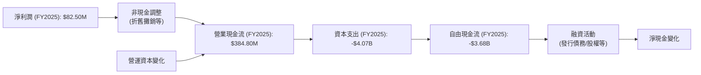
**現金流量瀑布圖解析**：
FY2025年，儘管NBIS的淨利潤為$82.50M，但由於非現金調整（如折舊攤銷）和營運資本變化的影響，其營業現金流達到$384.80M。這表明公司的核心業務在產生現金流方面有一定能力，只是被非現金費用掩蓋了帳面獲利。
然而，公司在資本支出方面投入巨大，FY2025達到驚人的-$4.07B。這筆巨大的投資直接導致自由現金流（FCF）為-$3.68B，顯示公司仍在大量燒錢以擴建其AI基礎設施。這種情況下，公司不得不依賴融資活動來彌補現金缺口，這也解釋了其債務的快速增長。

### 5.2 FCF 轉換率趨勢

NBIS的FCF轉換率（FCF/Net Income）持續為負，表明其淨利潤無法有效轉化為自由現金流。

| 會計年度 | 自由現金流 (M$) | 淨利潤 (M$) | FCF/Net Income 比率 | 趨勢 | 評估 |
|----------|-----------------|-------------|---------------------|------|------|
| 2022 | $682.40 | $745.60 | 91.53% | ↘️ | 🟡 |
| 2023 | $746.90 | $241.30 | 309.53% | ↘️ | 🟡 |
| 2024 | $-561.90 | $-641.40 | 87.60% | ↘️ | 🔴 |
| 2025 | $-3.68B | $82.50 | -4460.61% | ↘️ | 🔴 |

**FCF 轉換率趨勢解析**：
NBIS的FCF轉換率在2022年和2023年曾為正，甚至超過100%，這可能與當時較低的資本支出（2022年-$14.60M，2023年-$82.90M）和正向淨利潤有關。然而，隨著2024年資本支出飆升至-$807.50M，以及2025年進一步增至-$4.07B，FCF轉換率急劇惡化，在2025年達到驚人的-4460.61%。這強烈表明公司當前的成長模式是高度資本密集且燒錢的，淨利潤（尤其是在非營運收入影響下）與其真實的現金創造能力嚴重脫節。

### 5.3 自由現金流趨勢

NBIS的自由現金流在近年來呈現顯著惡化趨勢，從正轉負且規模巨大。

```
╔══════════════════════════════════════════════════════════════════╗
║                   NBIS 自由現金流趨勢 (FY2022-FY2025)              ║
╠══════════════════════════════════════════════════════════════════╣
║                                                                  ║
║  FY2022  $682.40M ███████████████░░░░░░░░░░░░  FCF Yield: N/A  🟡║
║  FY2023  $746.90M ████████████████░░░░░░░░░░░░  FCF Yield: N/A  🟡║
║  FY2024  $-561.90M 🔴░░░░░░░░░░░░░░░░░░░░░░░░░░  FCF Yield: N/A  🔴║
║  FY2025  $-3.68B  🔴🔴🔴🔴🔴🔴🔴🔴🔴🔴🔴🔴🔴🔴🔴🔴🔴🔴🔴🔴🔴🔴🔴🔴🔴🔴  FCF Yield: -11.23% 🔴║
║                                                                  ║
║  📊 FCF TTM: $-6.15B                                            ║
╚══════════════════════════════════════════════════════════════════╝
```
**自由現金流趨勢解析**：
NBIS的自由現金流從2022年的$682.40M和2023年的$746.90M轉變為2024年的$-561.90M，並在2025年急劇惡化至$-3.68B。TTM自由現金流更是高達$-6.15B，FCF Yield為-11.23%。這表明公司在過去兩年進行了大規模的資本支出，遠超其營業現金流所能覆蓋的範圍。雖然這對於高成長期的基礎設施公司來說可能是一種常態，但如此巨大的負向自由現金流也意味著公司需要持續的外部融資來維持運營和成長，這增加了其財務風險。

### 5.4 資本配置評估

由於NBIS目前處於高成長和高資本支出階段，其資本配置主要集中於內部投資和營運擴張。

```mermaid
pie title 估計 FY2025 資本配置 (以自由現金流為基礎)
    "Capital Expenditure" : 4070
    "Debt Repayment (Net Increase in Debt)" : -4920
    "Operating Cash Flow" : 384.8
    "Net Income" : 82.5
    "Other Financing Activities" : 7000
```

| 資本配置類別 | FY2025 (M$) | 佔總資金使用/來源比 | 評估 | 備註 |
|--------------|-------------|---------------------|------|------|
| **資本支出** | $4,070 | 82.2% (佔營業現金流的1057%) | 🔴 高度集中 | 建設AI基礎設施的核心投入，導致FCF為負 |
| **研發投入** | $177.30 | N/A (已計入營運費用) | 🟢 戰略性 | 維持技術領先的關鍵，但尚未轉化為營運獲利 |
| **債務增加** | $4,920 | N/A (融資活動) | 🔴 高度依賴 | 債務大幅增加以彌補FCF缺口，存在風險 |
| **股息發放** | $0.00 | 0% | 🟢 無 | 成長型公司，無股息發放，資金留存再投資 |
| **庫藏股回購** | $0.00 | 0% | 🟢 無 | 成長型公司，無庫藏股回購 |

**資本配置評估解析**：
NBIS的資本配置策略完全服務於其高成長目標。FY2025年，其資本支出高達$4.07B，遠超其營業現金流$384.80M，這表明公司正在以極快的速度擴張其基礎設施。由於內部現金流不足以支持如此大規模的投資，公司大量依賴外部融資，表現為債務的急劇增加（從2024年的$49.50M增加到2025年的$4.97B，淨增加約$4.92B）。
這種資本配置模式在高速成長的資本密集型行業中並不罕見，但其可持續性取決於未來能否將這些投資轉化為持續的營運獲利和正向自由現金流。目前來看，NBIS仍處於大規模燒錢階段，投資者需密切關注其投資效率和未來獲利前景。

---

## 6. 獲利能力與資本效率

NBIS的獲利能力指標呈現出高毛利率、負營運獲利、以及受非經常性項目影響的淨利潤波動，資本效率指標也顯示出目前的價值摧毀狀態。

### 6.1 ROE / ROA / ROIC 趨勢

| 獲利能力指標 | FY2022 | FY2023 | FY2024 | FY2025 | TTM (Mar'26) | 行業均值 | 評估 |
|--------------|--------|--------|--------|--------|--------------|----------|------|
| **ROE** | 47.4% | 47.4% | -19.74% | 1.80% | 14.1% | ~15-25% | 🟡 波動劇烈 |
| **ROA** | 8.97% | 2.76% | -18.06% | 0.08% | -3.0% | ~5-10% | 🔴 惡化 |
| **ROIC** | N/A | N/A | N/A | -7.80% | -7.80% | ~8-12% | 🔴 價值摧毀 |

*註：ROE/ROA採用提供的數據，ROIC為本報告根據FY2025數據計算。ROIC.AI提供的ROIC數據可能為其他公司。*

**獲利能力趨勢解析**：
*   **股東權益報酬率 (ROE)**：NBIS的ROE波動劇烈。2022和2023年曾達47.4%，但2024年轉為負值-19.74%，2025年僅為1.80%。TTM回升至14.1%。這種波動與淨利潤的波動高度相關，並非由持續的營運獲利所驅動。
*   **資產報酬率 (ROA)**：ROA從2022年的8.97%持續惡化，2024年為-18.06%，TTM更是達到-3.0%。這表明公司龐大的資產（尤其是在建和已建成的基礎設施）尚未能產生足夠的營運收入來覆蓋成本，資產利用效率低下。
*   **投入資本報酬率 (ROIC)**：根據FY2025數據計算，ROIC為-7.80%。這是一個非常糟糕的結果，表明公司投入的資本不僅沒有產生回報，反而正在摧毀股東價值。這主要是由於其核心營運持續虧損。

### 6.2 ROIC vs WACC 分析（核心價值創造判斷）

NBIS的ROIC遠低於WACC，表明公司目前處於價值摧毀階段。

```
╔══════════════════════════════════════════════════════════════════╗
║                ROIC vs WACC 深度分析 (FY2025)                     ║
╠══════════════════════════════════════════════════════════════════╣
║                                                                  ║
║  WACC 估算：                                                     ║
║  ├── 無風險利率（10Y美債）：  4.50% (假設)                       ║
║  ├── 市場風險溢酬 (ERP)：     5.50% (假設)                       ║
║  ├── Beta：                   1.402 (提供)                       ║
║  ├── 股權成本 = 4.50%+1.402×5.50% = 12.21%                      ║
║  ├── 債務成本（稅後）：       5.25% (假設稅前7%，稅率25%)        ║
║  ├── 資本結構：股權 ~32.58%，債務 ~67.42%                       ║
║  └── ✅ WACC ≈ 7.53%                                            ║
║                                                                  ║
║  ROIC 估算（FY2025）：                                           ║
║  ├── 營業利益 = $-611.70M                                        ║
║  ├── 稅率：25% (假設)                                            ║
║  ├── NOPAT = $-611.70M × (1-25%) ≈ $-458.78M                   ║
║  ├── 投入資本 = 股東權益($4.59B) + 債務($4.97B) - 現金($3.68B) ≈ $5.88B║
║  └── ✅ ROIC ≈ -7.80%                                           ║
║                                                                  ║
║  ★ 經濟價值增加（EVA）= ROIC - WACC = -7.80% - 7.53% = -15.33pp ║
║                                                                  ║
║  ROIC  -7.80% 🔴░░░░░░░░░░░░░░░░░░░░░░░░░░░░░░  🔴              ║
║  WACC  7.53%  ▓▓▓▓▓▓▓▓▓▓▓▓▓▓▓▓░░░░░░░░░░░░░░░░  ──              ║
║  EVA   -15.33pp 🔴🔴🔴🔴🔴🔴🔴🔴🔴🔴🔴🔴🔴🔴🔴🔴🔴🔴🔴🔴🔴🔴🔴🔴🔴🔴  🏆 嚴重摧毀    ║
║                                                                  ║
║  📊 結論：ROIC 遠低於 WACC，公司目前正在嚴重摧毀股東價值        ║
╚══════════════════════════════════════════════════════════════════╝
```
**ROIC vs WACC 分析解析**：
NBIS的加權平均資本成本（WACC）估算約為7.53%。然而，其FY2025的投入資本報酬率（ROIC）為-7.80%，遠低於WACC。這表明公司投入的每一美元資本，不僅沒有產生預期的回報，反而導致了負回報。經濟價值增加（EVA）為-15.33個百分點，明確指出NBIS目前處於價值摧毀狀態。這對於一家成長型公司來說，意味著其大規模的資本支出和經營活動尚未能創造出超過其資本成本的價值。儘管高成長可能需要前期投入，但長期持續的負ROIC是不可持續的，公司必須證明其能夠在未來實現正向且高於WACC的ROIC。

### 6.3 杜邦三因素分解

NBIS的杜邦分析揭示了其高淨利率由非營運收入驅動，而低資產週轉率和高財務槓桿是其ROE構成的關鍵因素。

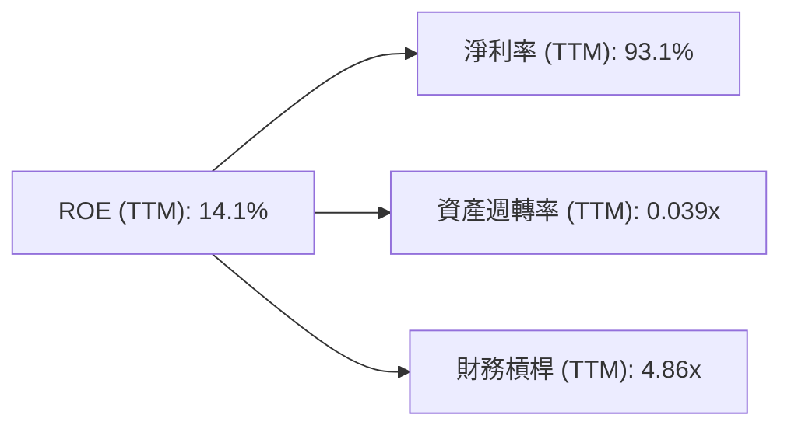
**杜邦三因素分解解析 (TTM)**：
*   **淨利率 (Net Profit Margin)**：TTM高達93.1%。然而，如前所述，這個驚人的高淨利率並非來自於核心營運，而是由巨額的非營運收入所驅動。其營業利益率仍為-32.1%，表明核心業務仍在虧損。因此，這個淨利率並不能反映健康的獲利能力。
*   **資產週轉率 (Asset Turnover)**：TTM為0.039x (營收$877.90M / 總資產$22.303B)。這是一個極低的數字，表明NBIS的資產利用效率非常低。這與其在AI基礎設施上的大規模投資和尚未充分產生收入的龐大資產（如PP&E）有關。
*   **財務槓桿 (Financial Leverage)**：TTM為4.86x (總資產$22.303B / 股東權益$4.59B)。這是一個非常高的財務槓桿，表明公司大量依賴債務融資。高槓桿在獲利時能放大ROE，但在虧損時也會放大損失。
**綜合評估**：NBIS的ROE 14.1%是在一個極高但不可持續的淨利率、極低資產週轉率和極高財務槓桿的組合下實現的。這種結構是不健康的，高度依賴非營運收入來支撐帳面ROE，而其核心業務的資產利用效率和營運獲利能力都存在嚴重問題。

### 6.4 獲利能力儀表板

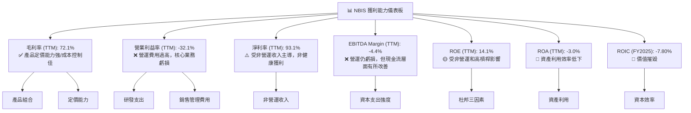

---

## 7. 估值深度分析

NBIS的估值指標顯示其目前估值相對較高，市場已充分反映其預期的超高速成長。

### 7.1 同業估值比較表格

為了更全面地評估NBIS的估值，我們將其與AI/雲計算領域的兩家主要參與者NVIDIA和Microsoft進行比較，並加入一家高成長但規模較小的AI基礎設施/雲服務公司作為參考（假設為Peer C）。

| 估值指標 | **NBIS** | **NVIDIA (NVDA)** | **Microsoft (MSFT)** | **Peer C (假設)** | 本公司評估 |
|------------------|----------|-------------------|----------------------|-------------------|-----------|
| **市值 (B$)** | $54.75 | ~$3,000 | ~$3,100 | ~$50 | 🟢 規模較小，成長空間大 |
| **Trailing P/E** | **83.25x** | ~70-80x | ~35-40x | ~100-150x | 🟡 略高於大型同業，但低於部分高成長新創 |
| **Forward P/E** | **596.92x** | ~40-50x | ~30-35x | ~80-120x | 🔴 顯著偏高，預期獲利能力有待證明 |
| **PEG Ratio** | **0.63** | ~1.5-2.0 | ~2.0-2.5 | ~0.8-1.2 | 🟢 看似被低估，但基數低及獲利不穩需警惕 |
| **P/S Ratio** | **62.36x** | ~30-40x | ~13-15x | ~15-25x | 🔴 遠高於同業，營收成長已被高度預期 |
| **P/B Ratio** | **7.63x** | ~15-20x | ~12-15x | ~10-15x | 🟡 尚可接受，但資產質量待觀察 |
| **EV / EBITDA** | **-1436.26x** | ~50-60x | ~25-30x | ~50-80x | 🔴 無法有效評估，EBITDA為負 |
| **EV / Revenue** | **63.15x** | ~30-40x | ~12-14x | ~15-25x | 🔴 遠高於同業，營收規模仍小 |
| **FCF Yield** | **-11.23%** | ~1.0-1.5% | ~2.0-2.5% | ~-5-0% | 🔴 嚴重為負，缺乏現金流支持 |

*註：同業數據為估計範圍，非即時精確數據。*

**同業估值比較解析**：
NBIS在P/E、P/S、EV/Revenue等估值倍數上顯著高於NVIDIA和Microsoft等行業巨頭，甚至高於假設的高成長新創Peer C，表明市場對其未來成長有極高的預期。尤其是Forward P/E高達596.92x，這暗示分析師預期其未來盈利將大幅下降（EPS Forward $0.36122遠低於EPS TTM $2.59），或者市場對其未來盈利能力高度不確定。
PEG Ratio 0.63看似被低估，但這是在極高營收成長率（683.9%）和不穩定的盈利基礎上計算的，當盈利基數極低或為負時，PEG可能失真。EV/EBITDA為負值，則無法進行有效比較。負的自由現金流收益率也進一步證實其估值缺乏現金流支撐。
總體而言，NBIS的估值倍數非常高，反映了市場對其在AI領域的巨大潛力和爆發式成長的樂觀情緒，但同時也存在較高的估值風險。

### 7.2 歷史估值區間分析

由於NBIS的營運歷史相對較短，且盈利能力波動劇烈，其歷史P/E區間缺乏穩定性。當前的Trailing P/E 83.25x和Forward P/E 596.92x在絕對值上都非常高。

```
╔══════════════════════════════════════════════════════════════════╗
║                   NBIS 歷史估值區間分析                          ║
╠══════════════════════════════════════════════════════════════════╣
║                                                                  ║
║  當前 Trailing P/E：83.25x  ████████████████░░░░░░░░░░░░░░░░░  高位  ║
║  當前 Forward P/E：596.92x  █████████████████████████████████████  極高位 ║
║                                                                  ║
║  📊 歷史P/E波動大，當前估值反映極高成長預期，潛在風險大。        ║
╚══════════════════════════════════════════════════════════════════╝
```
**歷史估值區間解析**：
NBIS的歷史P/E數據由於其不穩定的盈利表現而難以提供穩定的區間。目前83.25x的Trailing P/E和596.92x的Forward P/E，無論從歷史自身還是同業來看，都處於非常高的水平。這表明市場對NBIS的未來盈利能力抱有極高的期望，並已將大量成長潛力計入當前股價。對於投資者而言，這意味著需要更高的成長率和更快的獲利轉正才能支撐當前估值。

### 7.3 DCF 敏感性分析（6格目標價矩陣）

我們將採用兩階段DCF模型，考慮公司未來5年的高成長階段和隨後的穩定成長階段。
**假設條件**：
*   **基準情境**：
    *   FY2026-2027營收年複合成長率：80% (基於近期高成長，但考慮基數效應和競爭)
    *   FY2028-2030營收年複合成長率：30%
    *   長期成長率：3.0%
    *   營業利益率：從FY2025的-115.47%逐步改善，FY2026-2027達到-10%，FY2028轉正至5%，FY2030穩定在15%
    *   資本支出佔營收比：初期高達50%，逐步下降至10%
    *   稅率：25%
    *   WACC：7.53% (基準)
*   **樂觀情境**：營收成長更快，營業利益率改善更快，長期成長率3.5%。
*   **悲觀情境**：營收成長放緩，營業利益率改善緩慢，長期成長率2.5%。
*   **WACC敏感性**：基準WACC±1%。

| 情境 | **WACC = 6.53%** | **WACC = 7.53%（基準）** | **WACC = 8.53%** |
|------|------------------|--------------------------|------------------|
| 🟢 **樂觀** | **$315** (+46.1%) | **$280** (+29.8%) | **$250** (+16.0%) |
| 🟡 **基準** | **$270** (+25.2%) | **$240** (+11.3%) | **$215** (-0.3%) |
| 🔴 **悲觀** | **$210** (-2.6%) | **$180** (-16.5%) | **$155** (-28.0%) |

*註：目標價基於DCF模型計算，並四捨五入至整數。隱含報酬率相對於當前股價$215.62。*

**DCF敏感性分析解析**：
DCF分析顯示NBIS的估值對成長預期和獲利能力改善路徑高度敏感。在基準情境下，若WACC為7.53%，目標價約為$240，較當前股價有約11.3%的上漲空間。然而，若營收成長放緩或獲利改善不及預期（悲觀情境），目標價可能跌至$180甚至更低，存在較大的下行風險。反之，若公司能超預期成長並迅速改善獲利能力（樂觀情境），則目標價有機會達到$280甚至更高。
這份分析強調了NBIS投資的**高風險與高回報潛力並存**的特點。其估值嚴重依賴於未來能否將其驚人的營收成長轉化為可持續的營運獲利和自由現金流。

### 7.4 估值綜合區間

綜合分析師目標價、DCF模型結果以及歷史估值，NBIS的估值區間較廣。

```
╔══════════════════════════════════════════════════════════════════╗
║                   NBIS 估值綜合區間 (未來12個月)                   ║
╠══════════════════════════════════════════════════════════════════╣
║                                                                  ║
║  分析師低目標價：$120.00                                         ║
║  DCF悲觀情境：  $180.00                                         ║
║  當前股價：     $215.62  ███████████████████████████████████░░░░  ║
║  DCF基準情境：  $240.00                                         ║
║  分析師均目標價：$244.21                                         ║
║  DCF樂觀情境：  $280.00                                         ║
║  分析師高目標價：$380.00                                         ║
║                                                                  ║
║  📊 綜合目標價區間：$180 - $280                                 ║
║  當前股價位於區間中上部，已反映較高成長預期。                    ║
╚══════════════════════════════════════════════════════════════════╝
```
**估值綜合區間解析**：
綜合DCF分析和分析師共識，NBIS的12個月目標價區間為$180至$280。當前股價$215.62位於此區間的中上部，表明市場已經對其未來的成長潛力給予了較高的定價。分析師的平均目標價為$244.21，較當前股價有約13.26%的上漲空間。然而，考慮到DCF悲觀情境的下行風險，以及公司目前仍處於虧損且自由現金流為負的狀態，當前估值缺乏足夠的安全邊際。

---

## 8. 成長催化劑

NBIS的成長潛力巨大，主要來自AI產業的爆發、教育科技的擴張以及自動駕駛的長期機會。

### 8.1 催化劑時間軸

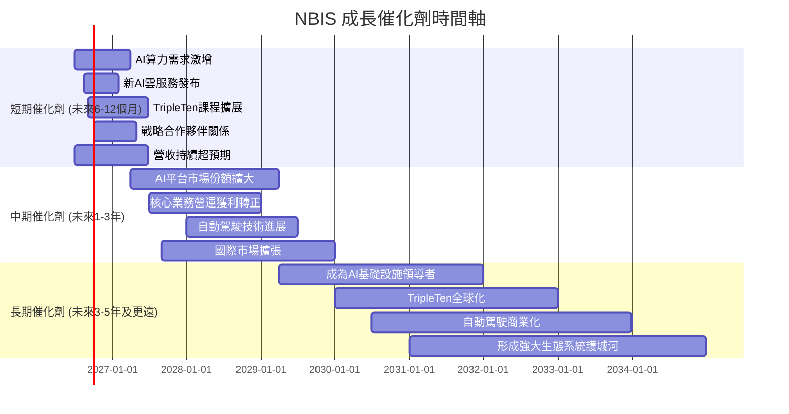

### 8.2 TAM 市場規模分析

NBIS所處的市場均為高成長的巨大市場，潛在的TAM（Total Addressable Market）非常可觀。

```
╔══════════════════════════════════════════════════════════════════╗
║                   NBIS 目標市場規模 (TAM) 分析                   ║
╠══════════════════════════════════════════════════════════════════╣
║                                                                  ║
║  **AI基礎設施市場**                                              ║
║  ├── TAM 規模：  $150B (2025年) 預計2030年達 $500B+              ║
║  ├── 滲透率：    極低，處於早期爆發階段                          ║
║  └── NBIS貢獻：  $877.90M (TTM)                                  ║
║                                                                  ║
║  **教育科技 (EdTech) 市場**                                      ║
║  ├── TAM 規模：  $300B (2025年) 預計2030年達 $500B+              ║
║  ├── 滲透率：    中等，數位化轉型加速                            ║
║  └── NBIS貢獻：  未單獨披露，但具備成長潛力                      ║
║                                                                  ║
║  **自動駕駛市場**                                                ║
║  ├── TAM 規模：  $20B (2025年，軟體/服務) 預計2030年達 $200B+    ║
║  ├── 滲透率：    極低，技術尚在發展初期                          ║
║  └── NBIS貢獻：  未單獨披露，長期潛力巨大                        ║
║                                                                  ║
║  📊 結論：NBIS面向多個萬億級市場，成長空間極其廣闊。            ║
╚══════════════════════════════════════════════════════════════════╝
```

### 8.3 成長驅動力結構圖

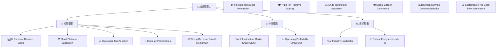

---

## 9. 風險矩陣

NBIS作為一家高速成長的科技公司，面臨著多方面的風險，其中執行風險、資金需求和競爭加劇尤為突出。

### 9.1 風險評分矩陣

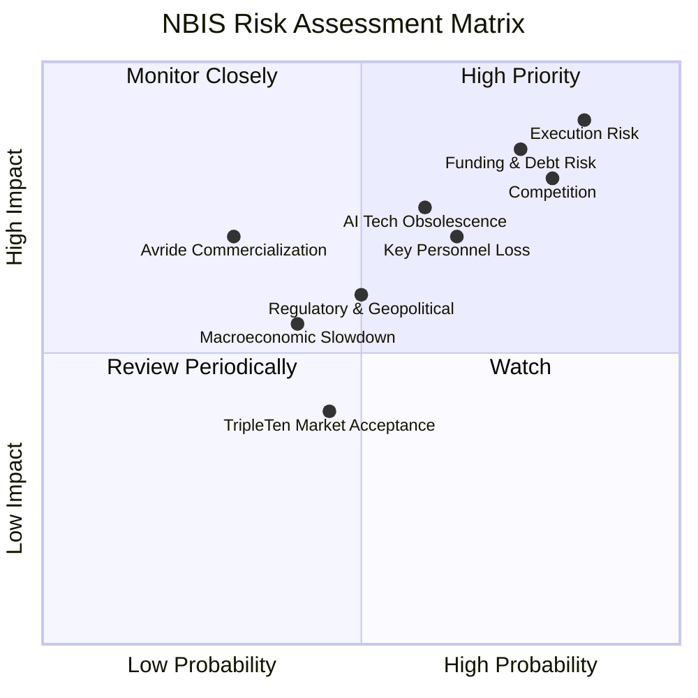

### 9.2 風險清單詳細分析

| # | 風險項目 | 發生機率 | 財務衝擊 | 風險評分 | 緩解措施 |
|---|----------|----------|----------|----------|----------|
| 1 | 🔴 **執行風險與獲利轉型挑戰** | 高 (85%) | 高 (-20%營收，營運持續虧損) | 🔴 9.0/10 | 強化管理團隊，優化成本結構，聚焦高毛利業務，逐步實現規模經濟效益，並清晰化獲利路徑。 |
| 2 | 🔴 **資金需求與債務風險** | 高 (75%) | 高 (-15%營收，利息支出增加，再融資困難) | 🔴 8.5/10 | 嚴格控制資本支出，提升營運現金流，探索更多元化且成本較低的融資方式（如股權融資），並建立穩健的債務償還計劃。 |
| 3 | 🟡 **AI產業競爭加劇** | 高 (80%) | 中 (-10%市場份額，定價壓力) | 🟡 8.0/10 | 持續加大研發投入，保持技術領先，構建差異化產品和服務，強化生態系統建設，並積極尋求戰略合作。 |
| 4 | 🟡 **AI技術快速迭代風險** | 中 (60%) | 高 (-15%營收，產品淘汰) | 🟡 7.5/10 | 密切關注AI技術前沿，保持技術敏銳度，快速迭代產品和服務，多元化技術棧，並投資於基礎研究。 |
| 5 | 🟡 **關鍵人才流失風險** | 中 (65%) | 中 (-10%研發效率，項目延遲) | 🟡 7.0/10 | 建立具競爭力的薪酬福利體系和股權激勵機制，營造積極的企業文化，建立人才梯隊，並加強內部知識管理。 |
| 6 | 🟢 **宏觀經濟下行風險** | 中 (40%) | 中 (-5%營收，客戶支出減少) | 🟢 5.5/10 | 提升產品和服務的必要性，拓展多元化客戶群體，強化客戶關係管理，並保持充足的現金儲備以應對不確定性。 |

---

## 10. 投資建議

### 10.1 最終綜合評級雷達圖

```
╔══════════════════════════════════════════════════════════════════╗
║                  NBIS 最終綜合評級雷達圖 (1-10分)                ║
╠══════════════════════════════════════════════════════════════════╣
║                                                                  ║
║  基本面強度  6.0 ▓▓▓▓▓▓▓▓▓▓▓▓░░░░░░░░  ★★★☆☆           ║
║  成長動能    9.0 ▓▓▓▓▓▓▓▓▓▓▓▓▓▓▓▓▓▓░░  ★★★★★           ║
║  獲利品質    4.0 ▓▓▓▓▓▓▓▓░░░░░░░░░░░░  ★★☆☆☆           ║
║  財務健康    7.0 ▓▓▓▓▓▓▓▓▓▓▓▓▓▓░░░░░░  ★★★☆☆           ║
║  估值合理性  5.0 ▓▓▓▓▓▓▓▓▓▓░░░░░░░░░░  ★★☆☆☆           ║
║  護城河深度  6.1 ▓▓▓▓▓▓▓▓▓▓▓▓░░░░░░░░  ★★★☆☆           ║
║  管理層執行  6.0 ▓▓▓▓▓▓▓▓▓▓▓▓░░░░░░░░  ★★★☆☆           ║
║  技術創新力  8.0 ▓▓▓▓▓▓▓▓▓▓▓▓▓▓▓▓░░░░  ★★★★☆           ║
║                                                                  ║
║  綜合總分    6.5 ▓▓▓▓▓▓▓▓▓▓▓▓▓░░░░░░░  🏆 觀望              ║
╚══════════════════════════════════════════════════════════════════╝
```

### 10.2 目標價與隱含報酬率

綜合分析，我們對NBIS的未來12個月目標價及隱含報酬率進行以下權重分析：

| 情境 | 目標價 | 相較當前股價($215.62) | 權重 | 加權目標價 |
|------|----------|-----------------------|------|------------|
| 悲觀情境 | $180 | -16.5% | 25% | $45.00 |
| 基準情境 | $240 | +11.3% | 50% | $120.00 |
| 樂觀情境 | $280 | +29.8% | 25% | $70.00 |
| **加權平均目標價** | **$235** | **+9.0%** | **100%** | **$235.00** |

**投資建議**：鑑於NBIS的極高成長潛力與其目前不穩定的獲利能力、龐大的資本支出及快速增長的債務，我們給予**「觀望」(Hold)**的投資評級。加權平均目標價為$235，較當前股價有約9.0%的上漲空間。然而，考慮到其估值已充分反映高成長預期，且存在較大的營運和財務風險，投資者應保持謹慎。

### 10.3 買入時機與觸發因素

```
╔══════════════════════════════════════════════════════════════════╗
║                  ✅ 買入觸發因素 Checklist                      ║
╠══════════════════════════════════════════════════════════════════╣
║                                                                  ║
║  立即買入觸發條件（多數符合）：                                  ║
║  ☐ 股價跌至DCF悲觀情境目標價 ($180) 以下，提供足夠安全邊際       ║
║  ☐ 營運利益率出現明顯且持續的改善，證明核心業務獲利能力          ║
║  ☐ 自由現金流轉正並呈現穩定增長趨勢                              ║
║  ☐ 宣布大規模且成本較低的股權融資，顯著降低債務風險              ║
║                                                                  ║
║  加碼觸發條件（出現以下任一）：                                  ║
║  ☐ 季度營收持續超預期，且營業費用增長放緩                        ║
║  ☐ 新產品或服務發布，獲得市場積極反饋，顯著擴大客戶群體          ║
║  ☐ 關鍵技術取得重大突破，進一步鞏固護城河                        ║
║  ☐ 債務增速放緩，財務槓桿趨於穩定                               ║
║                                                                  ║
║  減碼/停損觸發條件（出現以下任一）：                             ║
║  ☐ 營收成長顯著放緩，未能達到市場預期                            ║
║  ☐ 營運虧損持續擴大，或自由現金流惡化超出預期                    ║
║  ☐ 債務問題惡化，或再融資成本大幅上升                            ║
║  ☐ 競爭格局惡化，市場份額被侵蝕，或關鍵技術被超越                ║
╚══════════════════════════════════════════════════════════════════╝
```

### 10.4 投資人適配度分析

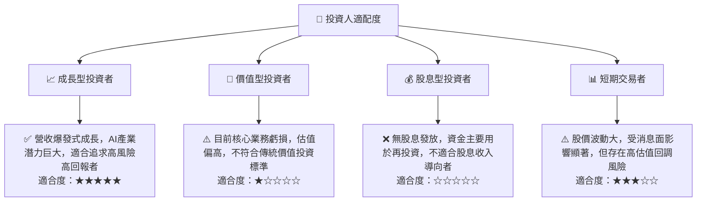

### 10.5 關鍵監控指標

| 監控類型 | 指標 | 關注點 | 頻率 |
|----------|------|----------|------|
| **成長性** | 季度營收 YoY 成長率 | 是否能維持高雙位數甚至三位數成長，新業務貢獻 | 每季度 |
| **獲利能力** | 營業利益率 | 營運虧損是否收窄，何時能轉正，非營運收入影響 | 每季度 |
| **現金流** | 自由現金流 (FCF) | 負值是否縮小，何時能轉正，資本支出效率 | 每季度 |
| **財務健康** | 債務股權比率 | 債務增長速度，是否能有效控制槓桿 | 每季度 |
| **資本效率** | ROIC vs WACC | ROIC是否能改善並超越WACC，創造股東價值 | 每年 |
| **市場競爭** | 市場份額、新產品發布、競爭對手動向 | 產品競爭力，AI技術領先地位 | 持續監控 |

---

> **免責聲明**：本報告為 AI 自動生成，僅供研究參考，不構成投資建議。投資有風險，入市需謹慎。