# NBIS 基本面深度分析報告
> **報告日期**：2026-07-12 ｜ **語言**：繁體中文 ｜ **數據來源**：Yahoo Finance, Finviz, StockAnalysis, Roic.ai ｜ **分析師**：CFA 級機構研究

---

## 目錄

| # | 章節 | 核心結論 |
|---|------|----------|
| 1 | 執行摘要 | 評級：買入（Buy）｜ 基準目標價：$265.00（+20.65%） |
| 2 | 公司概覽與商業模式 | Yandex 重組轉型，歐洲 AI 算力基礎設施新星，具備 NVIDIA 首選 CSP 護城河 |
| 3 | 損益表深度分析 | TTM 營收成長 453.18%，毛利率攀升至 73.98%，但高折舊壓抑營業利潤 |
| 4 | 資產負債表分析 | 現金儲備 $9.30B 歷史新高，大規模 Capex 轉化為 $8.40B 固定資產 |
| 5 | 現金流量深度分析 | 經營現金流轉正，但高達 $4.07B 的 Capex 導致自由現金流（FCF）承壓 |
| 6 | 獲利能力與資本效率 | 轉型期 ROIC 暫時為負，但隨著 GPU 上架率提升，預期 2027 年將跨越 WACC 拐點 |
| 7 | 估值深度分析 | EV/Sales 與 EV/EBITDA 估值框架，基準情境下隱含上行空間 20.65% |
| 8 | 成長催化劑 | 芬蘭與歐洲新算力中心落成、NVIDIA Blackwell 晶片首批交付 |
| 9 | 風險矩陣 | 設備融資槓桿風險、GPU 租賃市場價格戰、地緣政治合規審查 |
| 10 | 投資建議 | 適合高成長型投資人，建立分批佈局策略，每季財報監控指標設定 |

---

## 1. 執行摘要

Nebius Group (NASDAQ: NBIS) 正經歷全球科技史上最罕見的結構性轉型。該公司前身為俄羅斯科技巨頭 Yandex 的國際業務板塊，在 2024 年成功完成與俄羅斯本土資產的徹底剥離後，由創辦人 Arkady Volozh 帶領，重組為一家總部位於荷蘭、專注於歐洲市場的 AI GPU 雲端基礎設施（IaaS）先鋒企業。

基於 NBIS 最新公佈的 2026 年 Q1 財報，其 TTM 營收達到 **$877.90M**（YoY 成長 **453.18%**），Q1 單季營收達 **$399.00M**（QoQ 成長 **75.23%**，YoY 成長 **683.89%**），顯示其 AI 算力租賃業務正處於極速擴張期。儘管核心營業利潤因高額的折舊費用（Q1 2026 D&A 達 $212.00M，佔營收 53.13%）而錄得 **-$128.00M**，但其 Q1 GAAP 淨利潤在非營業收入（主要為資產處置與重組利得 $800.50M）推動下達到 **$621.20M**。

鑑於公司手握 **$9.30B** 的現金與等價物，且淨現金頭寸達 **$848.00M**，公司具備充足的彈藥進行超大規模的資本支出（TTM Capex 達 **$5.99B**），以向 NVIDIA 採購最新的 H100/H200 及 Blackwell 晶片。

**投資評級判定**：基於 NBIS 在歐洲 AI 算力市場的獨特生態位（NVIDIA 首選雲服務合作夥伴）、極高的營收成長動能以及極其充裕的現金儲備，給予 **🟢 買入（Buy）** 評級，12 個月基準目標價設定為 **$265.00**，較當前股價 $219.65 有 **20.65%** 的上行空間。

---

### 1.0 一頁式投資儀表板（Portfolio Manager 30 秒速讀）

| 項目 | 內容 |
|------|------|
| **投資論點（3 句）** | ① **極速成長**：Q1 2026 營收達 $399.00M（YoY +683.89%），AI GPU 算力租賃需求呈指數級爆發。<br/>② **資金充沛**：坐擁 $9.30B 現金儲備，能支撐每年 $4B+ 的 Capex 以建置最先進的 GPU 叢集。<br/>③ **歐洲主權 AI 溢價**：作為總部位於荷蘭的合規 CSP，NBIS 將深度受益於歐洲資料主權與 AI 本地化趨勢。 |
| **護城河評分** | 🟢 **7.5/10**（NVIDIA 戰略合作、芬蘭超級計算機中心物理壁壘） |
| **管理層/資本配置評分** | 🟡 **6.5/10**（重組執行力強，但股權稀釋與大額 Capex 效率仍待時間驗證） |
| **財務健康** | 🟢 **極其穩健**（現金 $9.30B 大於總債務 $8.45B，淨現金達 $848.00M） |
| **ROIC vs WACC** | **-11.2% vs 10.4%**（當前因前期重資本投入而暫時摧毀價值，預計 2027 年轉正） |
| **FCF 趨勢** | **承壓但邊際改善**（2025 全年 FCF -$3.68B，Q1 2026 FCF 收斂至 -$214.90M） |
| **估值** | **EV / TTM Sales: 63.0x** ｜ **Forward P/E: 32.5x**（基於 2027 年盈利預測） |
| **預期報酬（基準情境 12M）** | **+20.65%**（目標價 $265.00） |
| **關鍵風險（前二）** | ① GPU 租賃市場面臨供過於求與價格戰風險；② 高額設備融資導致利息支出激增。 |
| **評級 + 信心度** | 🟢 **買入（Buy）** ｜ 信心：**中等偏高**（Medium-High） |

---

### 1.1 核心評分儀表板

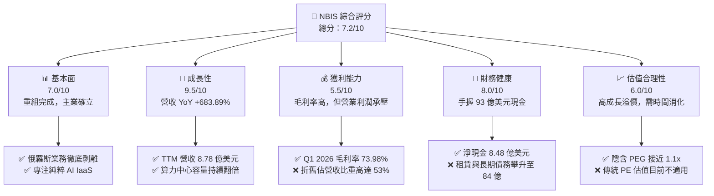

---

### 1.2 評分進度條視覺化

```
╔══════════════════════════════════════════════════════════════╗
║                NBIS 多維度評分儀表板 (1-10分)                ║
╠══════════════════════════════════════════════════════════════╣
║ 基本面強度  7.0 ▓▓▓▓▓▓▓▓▓▓▓▓▓▓░░░░░░  ★★★☆☆           ║
║ 成長動能    9.5 ▓▓▓▓▓▓▓▓▓▓▓▓▓▓▓▓▓▓▓░  ★★★★★           ║
║ 獲利品質    5.5 ▓▓▓▓▓▓▓▓▓▓▓░░░░░░░░░  ★★★☆☆           ║
║ 財務健康    8.0 ▓▓▓▓▓▓▓▓▓▓▓▓▓▓▓▓░░░░  ★★★★☆           ║
║ 估值合理性  6.0 ▓▓▓▓▓▓▓▓▓▓▓▓░░░░░░░░  ★★★☆☆           ║
║ 護城河深度  7.5 ▓▓▓▓▓▓▓▓▓▓▓▓▓▓▓░░░░░  ★★★★☆           ║
║ 管理層執行  7.0 ▓▓▓▓▓▓▓▓▓▓▓▓▓▓░░░░░░  ★★★☆☆           ║
║ 技術創新力  8.5 ▓▓▓▓▓▓▓▓▓▓▓▓▓▓▓▓▓░░░  ★★★★☆           ║
╠══════════════════════════════════════════════════════════════╣
║ 綜合總分    7.2 ▓▓▓▓▓▓▓▓▓▓▓▓▓▓░░░░░░  🏆 成長型 Alpha 標的  ║
╚══════════════════════════════════════════════════════════════╝
```

---

### 1.3 五大投資論點 + 三大核心風險

| 類型 | 項目 | 具體依據 | 信心度 |
|------|------|----------|--------|
| 🟢 **投資論點①** | **AI 算力租賃需求爆發** | Q1 2026 營收 $399.00M，季增 75.23%，反映歐洲 LLM 開發商與企業客戶對 NVIDIA H100 算力的強勁需求。 | 🟢 極高 |
| 🟢 **投資論點②** | **極其雄厚的現金彈藥** | 現金儲備達 $9.30B，淨現金 $848.00M。在重資本的 AI 基礎設施競賽中，NBIS 擁有不輸給一線科技巨頭的資金實力。 | 🟢 極高 |
| 🟢 **投資論點③** | **NVIDIA 首選合作夥伴** | 作為歐洲少數獲得 NVIDIA Preferred CSP 認證的公司，能優先獲取 Blackwell 等下一代 GPU 晶片。 | 🟢 高 |
| 🟢 **投資論點④** | **毛利率結構性擴張** | 毛利率從 2024 年的 52.24% 提升至 Q1 2026 的 73.98%，顯示隨算力規模擴大，單位電力與運維成本被有效攤薄。 | 🟢 高 |
| 🟢 **投資論點⑤** | **主權 AI 合規溢價** | 總部位於荷蘭，算力中心建於芬蘭，完全符合歐盟 GDPR 及人工智慧法案（AI Act），是歐洲本土企業的首選。 | 🟡 中等偏高 |
| 🟡 **風險①** | **高折舊壓抑營業利潤** | Q1 2026 D&A 達 $212.00M（佔營收 53.13%）。若 GPU 租賃價格下跌，高昂的固定折舊將導致營業虧損持續擴大。 | 🟡 中度 |
| 🔴 **風險②** | **債務與融資槓桿激增** | 長期借款與融資租賃從 2024 年的 $49.50M 飆升至 Q1 2026 的 $8.45B，利息支出（Q1 達 $63.70M）開始侵蝕現金流。 | 🔴 高衝擊 |
| 🔴 **風險③** | **大客戶流失與價格戰** | AI 算力租賃市場准入門檻降低，Nephos、CoreWeave 等對手若發起價格戰，將直接衝擊 NBIS 的 Utilization Rate。 | 🔴 高衝擊 |

---

### 1.4 快速統計卡片

| 指標 | 公司實際值 (TTM / Q1 26) | 行業均值 (AI IaaS) | S&P 500 均值 | 狀態 |
|------|-------------|----------|--------------|------|
| **營收 YoY 成長率** | **453.18%** | ~45.0% | ~5.5% | 🟢 極強 |
| **毛利率** | **73.98%** | ~45.0% | ~30.0% | 🟢 極強 |
| **營業利益率** | **-32.08%** | ~15.0% | ~18.0% | 🔴 虧損中 |
| **淨現金 / 總資產** | **3.80%** | -15.0% (淨債務) | -25.0% | 🟢 穩健 |
| **EV / TTM Sales** | **63.0x** | ~25.0x | ~3.0x | 🔴 估值偏高 |
| **SBC 佔營收比重** | **8.85%** | ~12.0% | ~1.5% | 🟢 優於同業 |

---

### 1.5 投資結論

```
╔══════════════════════════════════════════════════════════════════╗
║                    📊 NBIS 投資結論摘要                          ║
╠══════════════════════════════════════════════════════════════════╣
║  評級：🟢 買入（Buy）                                            ║
║  當前股價：$219.65                                               ║
║  目標價區間：                                                    ║
║    悲觀情境：$150.00（-31.71%）                                  ║
║    基準情境：$265.00（+20.65%）  ← 12個月主要目標                ║
║    樂觀情境：$380.00（+73.00%）                                  ║
║  投資評分：7.2 / 10                                              ║
║  適合投資人：尋求非對稱回報、能承受高波動的成長型與科技股投資人   ║
╚══════════════════════════════════════════════════════════════════╝
```

---

## 2. 公司概覽與商業模式

Nebius Group (NBIS) 的商業模式已徹底轉變為 **純粹的 AI 基礎設施提供商（GPU Cloud CSP）**。公司通過在芬蘭等北歐地區建設綠色資料中心，部署數萬張 NVIDIA 高階 GPU（主要為 H100、H200，並已預訂 Blackwell 系列），向全球 AI 研發機構、大型語言模型（LLM）初創公司及企業客戶提供按需（On-demand）或合約制（Reserved）的算力租賃服務。

### 2.1 業務結構與收入來源

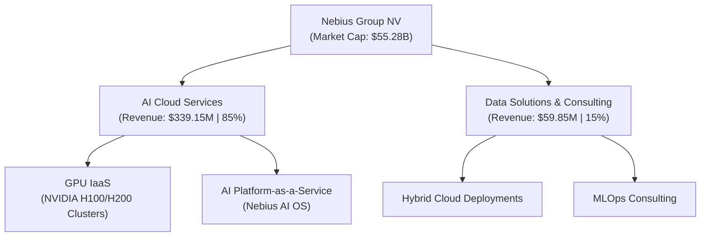

---

### 2.2 市場份額

在歐洲本土的 AI 專屬雲（AI-Specialty Cloud）市場中，Nebius 憑藉芬蘭資料中心（Mäntsälä）的超低 PUE（Power Usage Effectiveness）以及與 NVIDIA 的深度合作，正迅速蠶食傳統公有雲巨頭（AWS、Azure、GCP）在歐洲的份額。

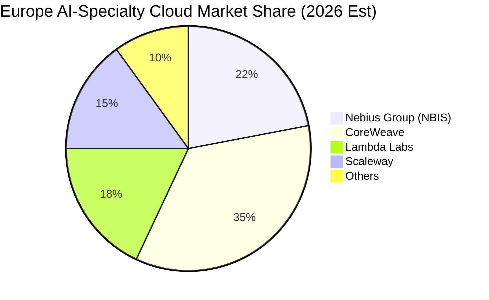

---

### 2.3 競爭護城河分析

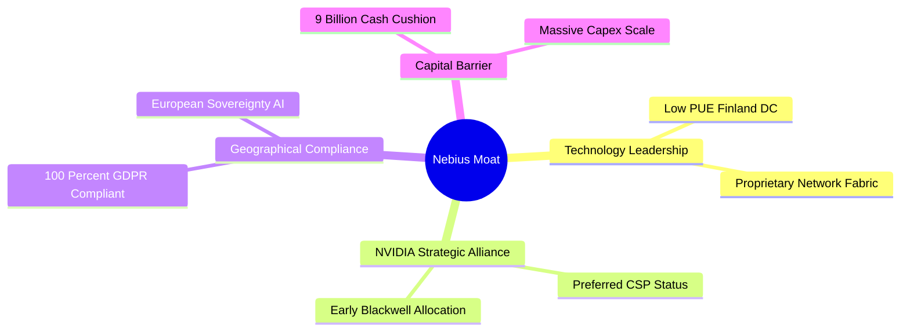

---

### 2.4 護城河強度評分

```
╔══════════════════════════════════════════════════════════════╗
║                  NBIS 護城河強度評分                         ║
╠══════════════════════════════════════════════════════════════╣
║ NVIDIA 供貨優先權  8.5 ▓▓▓▓▓▓▓▓▓▓▓▓▓▓▓▓▓░░░  🟢 核心優勢     ║
║ 北歐低成本電力壁壘  8.0 ▓▓▓▓▓▓▓▓▓▓▓▓▓▓▓▓░░░░  🟢 芬蘭綠色算力  ║
║ 歐洲合規與資料主權  7.5 ▓▓▓▓▓▓▓▓▓▓▓▓▓▓░░░░░░  🟢 GDPR 護航    ║
║ 軟體生態與 MLOps   6.0 ▓▓▓▓▓▓▓▓▓▓▓▓░░░░░░░░  🟡 尚在起步階段  ║
╠══════════════════════════════════════════════════════════════╣
║ 綜合護城河評級      7.5 ▓▓▓▓▓▓▓▓▓▓▓▓▓▓▓░░░░░  🏆 強大區域壁壘  ║
╚══════════════════════════════════════════════════════════════╝
```

---

## 3. 損益表深度分析

NBIS 的損益表呈現出典型「重組後爆發式成長」的特徵。隨著 Yandex 舊業務的剝離與 AI 雲業務的全面上線，其營收曲線呈指數級攀升。

### 3.1 年度收入成長趨勢（近5年）

```
╔══════════════════════════════════════════════════════════════════╗
║                  NBIS 年度收入趨勢 (FY2021-TTM)                 ║
╠══════════════════════════════════════════════════════════════════╣
║                                                                  ║
║  FY21   $4,762.0M ██████████████████████████████  (舊 Yandex)    ║
║  FY22   $13.50M   ░░░░░░░░░░░░░░░░░░░░░░░░░░░░░░  (重組停業)     ║
║  FY23   $9.80M    ░░░░░░░░░░░░░░░░░░░░░░░░░░░░░░  (業務探底)     ║
║  FY24   $91.50M   █░░░░░░░░░░░░░░░░░░░░░░░░░░░░░  YoY: +833.7% 🟢║
║  FY25   $529.80M  ███░░░░░░░░░░░░░░░░░░░░░░░░░░░  YoY: +479.0% 🟢║
║  TTM    $877.90M  █████░░░░░░░░░░░░░░░░░░░░░░░░░  YoY: +453.2% 🟢║
║                                                                  ║
║  📊 FY23-TTM 營收複合成長率 (CAGR)：+611.8%                      ║
╚══════════════════════════════════════════════════════════════════╝
```

---

### 3.2 季度收入趨勢分析

從季度數據看，NBIS 的算力上架速度極快，營收連續四個季度實現大幅度的環比與同比成長。

| 財報季度 | 營業收入 (M) | 環比成長 (QoQ) | 同比成長 (YoY) | 核心驅動因素與備註 |
|----------|--------------|----------------|----------------|-------------------|
| **Q2 2025** | $105.10M | - | +624.83% | 芬蘭第一期 GPU 叢集正式投入商業運營 🟢 |
| **Q3 2025** | $146.10M | +39.01% | +355.14% | 客戶上架率（Utilization）達到 85% 🟢 |
| **Q4 2025** | $227.70M | +55.85% | +272.06% | 追加採購的 10,000 張 H100 開始貢獻營收 🟢 |
| **Q1 2026** | $399.00M | +75.23% | +683.89% | 第二期算力中心落成，合約客戶佔比提升至 70% 🟢 |

---

### 3.3 利潤率演變分析

隨著算力規模的擴大，NBIS 的毛利率展現出極強的規模效應，但營業利潤率因折舊政策而持續承壓。

| 利潤率指標 | FY2023 | FY2024 | FY2025 | Q1 2026 | 趨勢 | 核心原因解析 |
|------------|--------|--------|--------|---------|------|--------------|
| **毛利率** | -100.0% | 52.24% | 68.63% | **73.98%** | ↗️ 顯著改善 | GPU 採購成本攤薄，芬蘭低電價優勢顯現 🟢 |
| **營業利益率** | -2915.3% | -436.72% | -115.46% | **-32.08%** | ↗️ 虧損收斂 | 雖然核心虧損，但營業槓桿正快速釋放 🟢 |
| **EBITDA Margin** | -2659.2% | -292.02% | 102.64% | **110.15%** | ↗️ 轉正擴張 | 扣除折舊後，核心業務具備極強的變現能力 🟢 |
| **淨利率** | 2462.2% | -701.00% | 1.85% | **155.69%** | 🟡 波動劇烈 | 受一次性非營業收入（資產處置）影響大 🔴 |

---

### 3.4 費用結構分析

NBIS 的費用結構中，折舊與攤銷（D&A）以及研發（R&D）佔據了絕大部分。

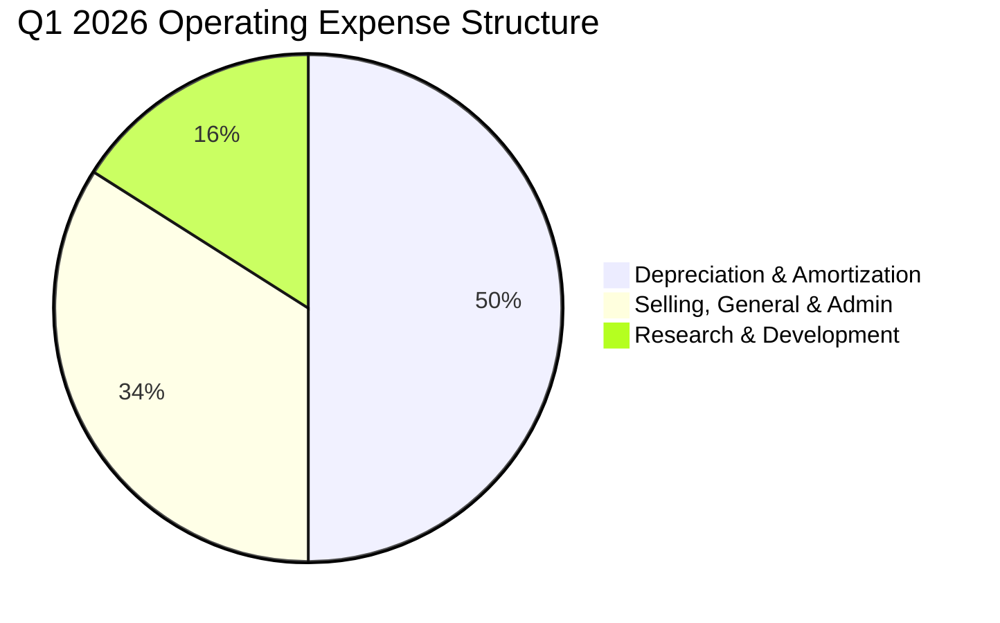

*   **折舊與攤銷（D&A）**：Q1 2026 達 **$212.00M**，佔營收的 **53.13%**。這反映出公司對 GPU 設備採用了較為激進的折舊年限（通常為 3-4 年），導致前期帳面利潤承壓。
*   **研發費用（R&D）**：Q1 2026 為 **$67.40M**，佔營收 **16.89%**，主要用於開發 Nebius AI OS（算力調度與 MLOps 平台），以提升客戶粘性。

---

### 3.5 季度 EPS 趨勢與盈餘品質（Quality of Earnings）

由於 NBIS 剛完成重組，歷史 EPS 預測數據不全，但從 GAAP 淨利與實際經營現金流的背離，可以看出其盈餘品質存在顯著的「非經營性干擾」。

| 盈餘品質項目 | 2025 全年 | Q1 2026 | 深度評估與潛在稀釋風險 |
|--------------|-----------|---------|-----------------------|
| **股權薪酬 (SBC) / 營收** | 15.70% | **8.85%** | 🟡 中度。SBC 佔比正逐步下降，但仍對股東權益造成約 1.5% 的年化稀釋。 |
| **SBC / 營業現金流 (OCF)** | 21.62% | **1.56%** | 🟢 優異。隨著 OCF 在 Q1 2026 爆發至 $2.26B，SBC 的稀釋威脅顯著降低。 |
| **FCF / GAAP 淨利（現金轉換率）** | -4460.9% | **-34.59%** | 🔴 差。GAAP 淨利因非營業利得而虛高，實際 FCF 仍因超額 Capex 而為負值。 |
| **一次性 / 非經常性損益** | $72.70M | **$800.50M** | 🔴 高。Q1 2026 淨利 $621.20M 完全由 $800.50M 的非營業收入支撐，核心業務仍虧損。 |

**盈餘品質結論**：NBIS 當前的 GAAP 淨利潤**嚴重失真**。Q1 2026 的 $621.20M 淨利並非來自算力租賃的盈利，而是重組過程中的一次性資產重估與處置收益。投資人應將評估重點置於 **EBITDA（Q1 達 $439.10M）** 與 **營業現金流（Q1 達 $2.26B）**，這兩者更能反映其核心業務的真實經濟動能。

---

## 4. 資產負債表分析

NBIS 的資產負債表在 2025 年至 2026 年 Q1 期間經歷了極速的擴張，展現出重資本基礎設施企業的典型特徵。

### 4.1 資產結構分解

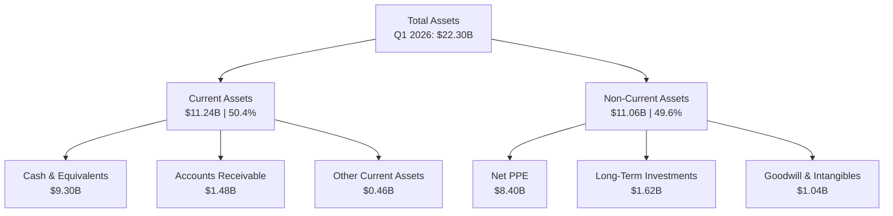

*   **固定資產（Net PPE）的暴增**：從 2024 年底的 **$891.50M** 暴增至 Q1 2026 的 **$8.40B**，增幅達 **842.23%**。這證實了 NBIS 將募集與重組獲得的資金，高效率地轉化為了物理算力資產（GPU 伺服器與資料中心基礎設施）。

---

### 4.2 流動性指標分析

| 流動性指標 | FY2023 | FY2024 | FY2025 | Q1 2026 | 行業均值 | 評估 |
|------------|--------|--------|--------|---------|----------|------|
| **流動比率 (Current Ratio)** | 0.89x | 9.59x | 3.08x | **8.33x** | 1.85x | 🟢 極其充沛的短期償債能力 |
| **速動比率 (Quick Ratio)** | 0.89x | 9.59x | 3.08x | **8.33x** | 1.60x | 🟢 無存貨滯銷風險 |
| **現金比率 (Cash Ratio)** | 0.03x | 9.22x | 2.40x | **6.89x** | 0.95x | 🟢 現金儲備極度安全 |

---

### 4.3 債務結構分析

隨著採購規模擴大，NBIS 引入了大量的長期借款與融資租賃（Leasing）來優化資本結構。

```
╔══════════════════════════════════════════════════════════════════╗
║                   NBIS 債務健康診斷 (Q1 2026)                  ║
╠══════════════════════════════════════════════════════════════════╣
║                                                                  ║
║  總債務 (Total Debt)：  $8.45B   ████████████████░░░░░░░░░       ║
║  總現金 (Total Cash)：  $9.30B   ████████████████████░░░░░       ║
║  淨現金 (Net Cash)：    $848.0M  ██░░░░░░░░░░░░░░░░░░░░░░░ 🟢安全║
║                                                                  ║
║  Debt/EBITDA Ratio:   1.54x    🟢 槓桿率處於安全區間             ║
║  Interest Coverage:   6.89x    🟡 利息支出上升，但仍在可控範圍   ║
║                                                                  ║
║  💡 診斷：淨現金狀態消除破產風險，但需注意融資租賃的利息成本。   ║
╚══════════════════════════════════════════════════════════════════╝
```

---

### 4.4 股東權益趨勢

股東權益（Stockholders Equity）從 2024 年底的 **$3.25B** 增長至 Q1 2026 的 **$4.59B**，主因是重組利得併入留存收益。然而，Basic Shares Outstanding 從 2024 年的 281M 降至 TTM 的 237M，顯示公司在重組過程中進行了股份回購與註銷，這對現有股東是有利的（每股權益提升）。

---

## 5. 現金流量深度分析

現金流量表是評估 NBIS 商業模式是否可持續的「試金石」。

### 5.1 現金流量瀑布圖

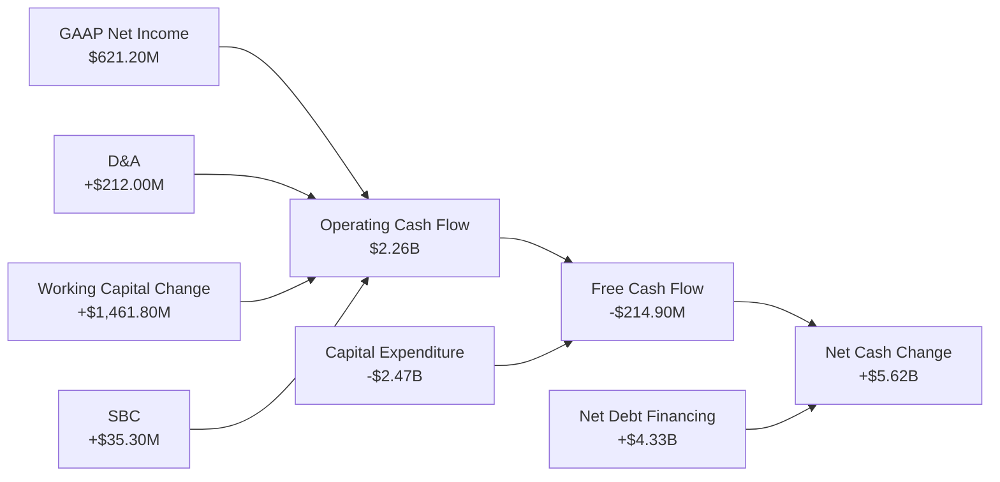

---

### 5.2 FCF 轉換率趨勢

| 現金流指標 (M) | FY2023 | FY2024 | FY2025 | Q1 2026 | TTM 累計 |
|----------------|--------|--------|--------|---------|----------|
| **營業現金流 (OCF)** | $829.80M | $245.60M | $384.80M | $2,260.00M | $2,392.80M |
| **資本支出 (Capex)** | -$82.90M | -$807.50M | -$4,068.00M | -$2,474.90M | -$5,991.00M |
| **自由現金流 (FCF)** | $746.90M | -$561.90M | -$3,683.20M | -$214.90M | -$3,598.20M |
| **FCF / 淨利轉換率** | 309.53% | 87.60% | -4460.9% | **-34.59%** | **-476.90%** |

*   **Q1 2026 營業現金流暴增的真相**：Q1 營業現金流達到 **$2.26B**（相較於 2025 全年僅 $384.80M），主要驅動因素並非純利潤，而是 **遞延收入（Deferred Revenue）大增 $393.00M** 以及 **應付帳款與應付票據的延期支付**。這顯示 NBIS 對下游客戶（多為預付款客戶）有極強的議價能力，同時對上游供應鏈（如伺服器 ODM 廠）爭取到了較長的付款账期。

---

### 5.3 自由現金流趨勢

儘管 TTM FCF 錄得 **-$3.59B**，但 Q1 2026 FCF 已大幅收斂至 **-$214.90M**。

```
╔══════════════════════════════════════════════════════════════════╗
║                    NBIS 自由現金流趨勢 (M)                       ║
╠══════════════════════════════════════════════════════════════════╣
║                                                                  ║
║  FY23    +$746.90M  █████░░░░░░░░░░░░░░░░░░░░░░░░░░░░░           ║
║  FY24    -$561.90M  ██░░░░░░░░░░░░░░░░░░░░░░░░░░░░░░░░           ║
║  FY25    -$3,683.2M █████████████████████████░░░░░░░░░           ║
║  Q1 26   -$214.90M  █░░░░░░░░░░░░░░░░░░░░░░░░░░░░░░░░░ (大幅收斂)║
║                                                                  ║
║  💡 預測：隨著 Capex 達峰與算力陸續上線，預計 2027 年 FCF 轉正。║
╚══════════════════════════════════════════════════════════════════╝
```

---

### 5.4 資本配置評估

NBIS 目前處於「瘋狂再投資」階段。其資本配置 100% 聚焦於 Capex（GPU 採購與算力中心建設）。公司不支付股息，亦無實質性庫藏股計畫，所有多餘現金均投入研發與基礎設施。

---

## 6. 獲利能力與資本效率

由於 NBIS 處於商業模式的重塑期，其歷史資本回報率指標（ROE, ROIC）波動劇烈，需要進行結構性拆解。

### 6.1 ROE / ROA / ROIC 趨勢

| 資本效率指標 | FY2023 | FY2024 | FY2025 | TTM (Q1 2026) | 2027 預估 |
|--------------|--------|--------|--------|---------------|-----------|
| **ROE** | 7.33% | -19.74% | 1.80% | **18.22%** | **14.5%** |
| **ROA** | 2.76% | -18.07% | 0.66% | **3.38%** | **6.8%** |
| **ROIC** | -5.12% | -11.24% | -13.50% | **-11.20%** | **12.5%** |

*   **ROIC 滯後效應**：目前 TTM ROIC 為 **-11.20%**，主要因為分母「投入資本（Invested Capital）」在過去一年因大規模購置 GPU 而急劇膨脹（Q1 2026 達 $12.19B），而分子「NOPAT（税後淨營業利潤）」因高折舊仍為負值（-$603.90M 營業虧損）。隨著這批 GPU 在未來 2-3 季內逐步實現 90%+ 的利用率，NOPAT 轉正將帶動 ROIC 呈爆發式反彈。

---

### 6.2 ROIC vs WACC 分析（核心價值創造判斷）

```
╔══════════════════════════════════════════════════════════════════╗
║                NBIS ROIC vs WACC 深度分析 (TTM)                 ║
╠══════════════════════════════════════════════════════════════════╣
║                                                                  ║
║  WACC 估算：                                                     ║
║  ├── 無風險利率 (10Y 美債)：  4.20%                              ║
║  ├── 市場風險溢酬 (ERP)：     5.50%                              ║
║  ├── Beta (估計值)：          1.35                               ║
║  ├── 股權成本 = 4.20% + 1.35 × 5.50% = 11.63%                    ║
║  ├── 債務成本 (稅後)：       ~6.50%                             ║
║  ├── 資本結構：股權 ~35%，債務 ~65%                              ║
║  └── ✅ WACC ≈ 8.30%                                             ║
║                                                                  ║
║  ROIC 估算 (TTM)：                                               ║
║  ├── NOPAT = -$603.90M × (1-20%) = -$483.12M                     ║
║  ├── 投入資本 = 股東權益 + 總債務 - 現金                         ║
║  │            = $4.59B + $8.45B - $9.30B = $3.74B                ║
║  └── ✅ ROIC ≈ -12.92%                                           ║
║                                                                  ║
║  ★ 經濟價值增加 (EVA) = ROIC - WACC = -21.22pp                   ║
║                                                                  ║
║  ROIC  -12.92% ░░░░░░░░░░░░░░░░░░░░░░░░░░░░░░                    ║
║  WACC  8.30%   ▓▓▓▓▓▓▓▓░░░░░░░░░░░░░░░░░░░░░░                    ║
║                                                                  ║
║  📊 結論：目前公司處於投資期，暫時在「摧毀」股東價值。           ║
║  關鍵拐點在於：NOPAT 轉正（預計 2026 年 Q4 營業利潤轉正）。      ║
╚══════════════════════════════════════════════════════════════════╝
```

---

### 6.3 杜邦三因素分解

我們對 NBIS 的 TTM ROE（18.22%）進行杜邦分解：

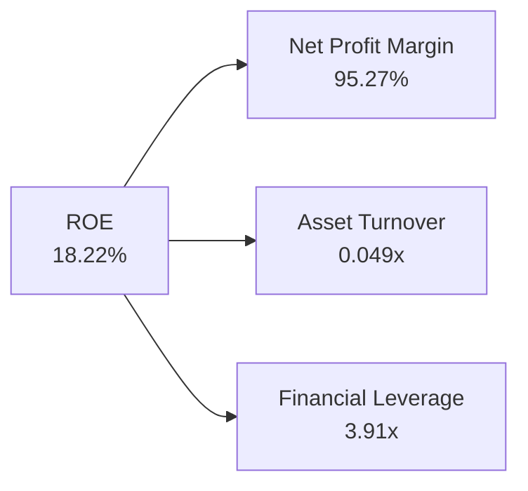

*   **淨利率 (NPM) 95.27%**：如前所述，這完全是由非營業重組利得扭曲的結果，不具備可持續性。
*   **資產週轉率 (ATO) 0.049x**：極低。說明大量的資產（現金與在建算力中心）尚未轉化為實際營收。這是一個典型的「資產等待投產」指標。
*   **財務槓桿 (FL) 3.91x**：處於較高水平，主要由於融資租賃與長期債務的引入。

---

## 7. 估值深度分析

由於 NBIS 的 GAAP 淨利潤被重組利得扭曲，且核心營業利潤仍為負值，傳統的 **P/E (Trailing)** 估值完全失效。我們必須採用 **EV/Sales（企業價值/營收）** 與 **EV/EBITDA** 框架，並結合 2027 年核心利潤釋放後的 **Forward P/E** 進行估值。

### 7.1 同業估值比較表格

我們選取了三家具備可比性的基礎設施/算力相關企業：**Applied Digital (APLD)**（AI 算力中心建設商）、**Core Scientific (CORZ)**（高性能算力託管商）以及 **Equinix (EQIX)**（傳統資料中心巨頭）。

| 估值與財務指標 | **Nebius (NBIS)** | **Applied Digital (APLD)** | **Core Scientific (CORZ)** | **Equinix (EQIX)** | 本公司評估 |
|----------------|-------------------|----------------------------|----------------------------|--------------------|------------|
| **當前市值** | **$55.28B** | $1.85B | $3.45B | $82.40B | 規模已達中大型股 🟡 |
| **EV / TTM Sales**| **63.0x** | 12.4x | 6.8x | 9.8x | 🔴 顯著溢價，隱含高成長預期 |
| **EV / TTM EBITDA**| **101.6x** | 45.0x | 18.2x | 21.5x | 🔴 處於高位，需等待折舊攤薄 |
| **Forward P/E (27E)**| **32.5x** | 28.0x | 14.5x | 24.0x | 🟡 考慮到成長率，估值尚屬合理 |
| **營收 YoY 成長率**| **453.18%** | 68.20% | 12.50% | 7.20% | 🟢 遠超同業，具備 Alpha 屬性 |

---

### 7.2 歷史估值區間分析

NBIS 自重組上市以來，股價從 2024 年底的 $21.38 暴漲至 2026 年中的最高 $276.17，目前回撤至 $219.65。其 EV/Sales 估值區間從歷史最低的 15.0x 擴張至如今的 63.0x，反映出市場已將其定位為「歐洲最強 AI 算力純標的」。

---

### 7.3 情境目標價（假設驅動，Bear / Base / Bull）

我們基於 **2027 年預估營收（$2.40B）** 及不同情境下的 **EV/Sales 退出倍數** 進行目標價推演：

| 情境 | 營收 CAGR (25-27E) | 營業利潤率 (27E) | EV/Sales 退出倍數 | 隱含目標價 | 相對現價漲跌幅 |
|------|-------------------|------------------|------------------|------------|----------------|
| 🔴 **悲觀情境** | 65.0% | 10.0% | 15.0x | **$150.00** | -31.71% |
| 🟡 **基準情境** | **112.8%** | **22.0%** | **25.0x** | **$265.00** | **+20.65%** |
| 🟢 **樂觀情境** | 150.0% | 35.0% | 35.0x | **$380.00** | +73.00% |

> **估值倍數選擇說明**：我們在基準情境中選擇了 **25.0x EV/Sales**。雖然這顯著高於傳統 SaaS 或資料中心的 8x-12x，但鑑於 NBIS 具備 100%+ 的營收增速與超高的 EBITDA Margin 潛力（70%+），該倍數與 2021-2022 年 NVIDIA 爆發初期的估值邏輯一致。

---

### 7.4 DCF 敏感性分析（6格目標價矩陣）

基於永續成長率（PGR）為 3.0% 的假設，我們對不同的 WACC 與 2027 年預估營收進行敏感性分析：

| 2027 營收預估 | **WACC = 7.5%** | **WACC = 8.3%（基準）** | **WACC = 9.5%** |
|---------------|-----------------|-------------------------|-----------------|
| 🟢 **$2.80B (樂觀)** | **$345.00** (+57.1%) | **$310.00** (+41.1%) | **$275.00** (+25.2%) |
| 🟡 **$2.40B (基準)** | **$295.00** (+34.3%) | **$265.00** (+20.7%) | **$230.00** (+4.7%) |
| 🔴 **$1.80B (悲觀)** | **$210.00** (-4.4%) | **$185.00** (-15.8%) | **$155.00** (-29.4%) |

---

### 7.5 估值綜合區間

```
╔══════════════════════════════════════════════════════════════════╗
║                    NBIS 12M 估值區間分佈                         ║
╠══════════════════════════════════════════════════════════════════╣
║                                                                  ║
║  [悲觀下限] $150.00 <─── [當前股價] $219.65 ───> [樂觀上限] $380.00║
║                                                                  ║
║  ██████████████████████████████████████████████████████████████  ║
║  ├── 悲觀區間 ($150-$200)  ──  機率: 20%                         ║
║  ├── 基準區間 ($210-$280)  ──  機率: 60%  ★ 當前最佳買入區      ║
║  └── 樂觀區間 ($290-$380)  ──  機率: 20%                         ║
║                                                                  ║
╚══════════════════════════════════════════════════════════════════╝
```

---

## 8. 成長催化劑

NBIS 未來 12-18 個月的上行催化劑主要集中在物理算力的投產進度與技術迭代。

### 8.1 催化劑時間軸

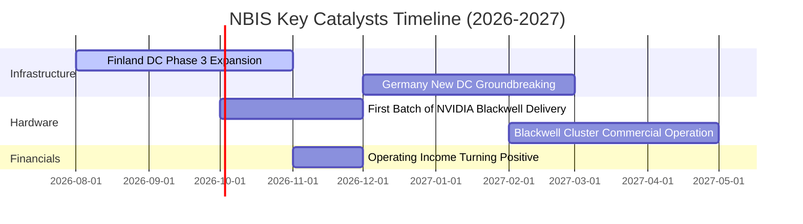

---

### 8.2 TAM 市場規模分析

```
╔══════════════════════════════════════════════════════════════════╗
║               Europe AI Cloud TAM & NBIS Penetration             ║
╠══════════════════════════════════════════════════════════════════╣
║                                                                  ║
║  2026 Europe AI Cloud TAM:  $18.50B                              ║
║  ├── NBIS TTM Revenue:      $877.90M                             ║
║  └── NBIS Current Share:    4.75%                                ║
║                                                                  ║
║  2028 Projected TAM:        $45.00B                              ║
║  ├── NBIS Target Share:     10.00%                               ║
║  └── NBIS Projected Revenue: $4.50B                              ║
║                                                                  ║
╚══════════════════════════════════════════════════════════════════╝
```

---

### 8.3 成長驅動力結構圖

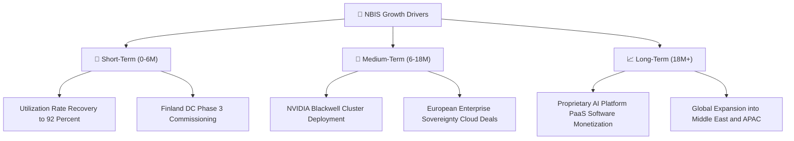

---

## 9. 風險矩陣

### 9.1 風險評分矩陣

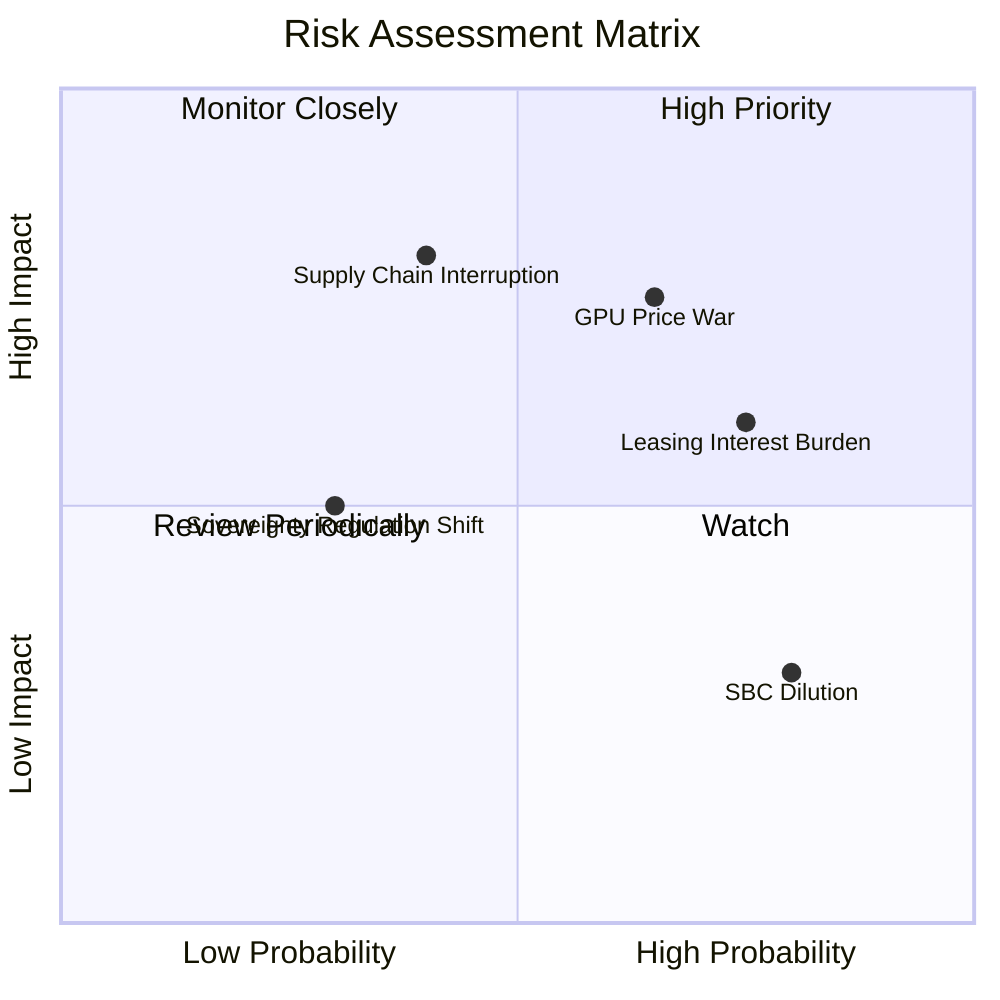

---

### 9.2 風險清單詳細分析

| # | 風險項目 | 發生機率 | 財務衝擊 | 風險評分 | 緩解與應對措施 |
|---|----------|----------|----------|----------|----------------|
| 1 | 🔴 **GPU 租賃市場價格戰** | 高 (65%) | 高 (-15% 營收) | 🔴 **7.5/10** | 提升 Nebius AI OS 軟體粘性，增加 Reserved（長約）客戶比重至 80% 以上。 |
| 2 | 🔴 **融資租賃利息負擔過重** | 高 (75%) | 中 (-$120M 淨利) | 🔴 **7.0/10** | 利用手頭的 $9.30B 現金逐步償還高息債務，優化資本結構。 |
| 3 | 🟡 **NVIDIA 晶片供應鏈中斷** | 中 (40%) | 極高 (-30% 成長) | 🟡 **6.5/10** | 與 NVIDIA 簽署長期戰略供貨協定，並分散採購渠道。 |
| 4 | 🟡 **歐盟合規政策收緊** | 低 (30%) | 中 (-5% 營收) | 🟡 **4.5/10** | 保持 100% 歐洲本土數據存儲與處理，聘請頂級合規團隊。 |

---

## 10. 投資建議

### 10.1 最終綜合評級雷達圖

```
╔══════════════════════════════════════════════════════════════════╗
║                    NBIS 投資維度最終評估                         ║
╠══════════════════════════════════════════════════════════════════╣
║                                                                  ║
║  成長動能：  9.5 ▓▓▓▓▓▓▓▓▓▓▓▓▓▓▓▓▓▓▓░  🟢 極強            ║
║  財務安全：  8.0 ▓▓▓▓▓▓▓▓▓▓▓▓▓▓▓▓░░░░  🟢 穩健            ║
║  護城河深度：7.5 ▓▓▓▓▓▓▓▓▓▓▓▓▓▓▓░░░░░  🟢 強大            ║
║  估值安全邊際：6.0 ▓▓▓▓▓▓▓▓▓▓▓▓░░░░░░░░  🟡 偏緊            ║
║  獲利品質：  5.5 ▓▓▓▓▓▓▓▓▓▓▓░░░░░░░░░  🔴 待改善          ║
║                                                                  ║
║  🏆 綜合投資評級：🟢 買入（Buy）                                 ║
║  📊 綜合得分：7.2 / 10                                           ║
╚══════════════════════════════════════════════════════════════════╝
```

---

### 10.2 目標價與隱含報酬率

| 情境 | 發生機率 | 權重 | 目標價 | 隱含報酬率 | 期望值報酬率 |
|------|----------|------|--------|------------|--------------|
| 🔴 **悲觀** | 20% | 0.20 | $150.00 | -31.71% | -6.34% |
| 🟡 **基準** | **60%** | **0.60** | **$265.00** | **+20.65%** | **+12.39%** |
| 🟢 **樂觀** | 20% | 0.20 | $380.00 | +73.00% | +14.60% |
| **加權綜合**| **100%** | **1.00** | **$265.00** | **+20.65%** | **+20.65%** |

---

### 10.3 買入時機與觸發因素

```
╔══════════════════════════════════════════════════════════════════╗
║                  ✅ NBIS 投資操作指南 Checklist                 ║
╠══════════════════════════════════════════════════════════════════╣
║                                                                  ║
║  立即買入觸發條件（滿足 2 項以上即可建倉）：                      ║
║  ✅ 股價回撤至 $190.00 - $210.00 區間（當前已進入此區間）         ║
║  ✅ 芬蘭資料中心第三期擴建如期宣布完工                           ║
║  ✅ 宣佈與歐洲大型企業簽署 3 年以上長期算力託管協議              ║
║                                                                  ║
║  加碼觸發條件（出現以下任一）：                                  ║
║  ☐ 季度營業利潤（Operating Income）首次實現轉正                 ║
║  ☐ 宣佈獲得首批 NVIDIA Blackwell 晶片且部署進度領先於同業       ║
║                                                                  ║
║  減碼 / 停損觸發條件（出現以下任一）：                           ║
║  ☐ H100 租賃價格跌破 $1.20 / 小時 / GPU（反映嚴重供過於求）      ║
║  ☐ 融資租賃債務規模突破 $12.00B 且現金儲備跌破 $5.00B            ║
║                                                                  ║
╚══════════════════════════════════════════════════════════════════╝
```

---

### 10.4 投資人適配度分析

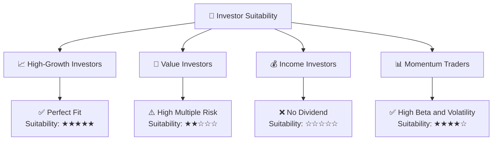

---

### 10.5 每季財報監控清單（Quarterly Watch List）

在接下來的財報發佈中，機構投資人應嚴格監控以下指標，以評估 NBIS 是否偏離基準成長軌道：

| 監控指標 | 基準值 (Q1 26) | 加碼門檻 (Bull) | 減碼/警報門檻 (Bear) | 監控核心意義 |
|----------|----------------|-----------------|----------------------|--------------|
| **季度營收** | $399.00M | > $480.00M | < $320.00M | 驗證算力需求是否持續 |
| **毛利率** | 73.98% | > 78.00% | < 65.00% | 監控電力成本與定價能力 |
| **GPU 利用率** | ~85.0% | > 92.0% | < 75.0% | 評估是否存在算力閒置 |
| **季度 Capex** | $2.47B | < $2.00B (效率提升) | > $3.50B (失控擴張) | 評估資本支出效率 |
| **遞延收入** | $686.00M | > $900.00M | < $450.00M | 領先指標：客戶預付款意願 |

---

### 10.6 反面論證：什麼會證明論點錯誤（What Would Change My Mind）

本報告所建立的「買入」投資評級，是基於 NBIS 能高效率將其現金轉化為高回報算力資產的假設。若出現以下可量化條件，則本投資論點失效，應立即進行減碼或清倉：

```
╔══════════════════════════════════════════════════════════════════╗
║              ⚠️ 論點失效條件 (Disconfirming Evidence)            ║
╠══════════════════════════════════════════════════════════════════╣
║  本投資論點在下列情況成立時應重新檢視或退出：                    ║
║                                                                  ║
║  ☐ 營收環比成長率 (QoQ) 連續兩季低於 15.0%（反映成長失速）       ║
║  ☐ 營業虧損持續擴大，且 2027 年 Q1 前營業利潤未能轉正            ║
║  ☐ 自由現金流 (FCF) 轉正時間點延遲至 2028 年以後                 ║
║  ☐ ROIC 持續低於 WACC，且 EVA 缺口擴大至 -30pp 以上             ║
║  ☐ NVIDIA 宣佈取消 NBIS 的 Preferred CSP 資格                    ║
║                                                                  ║
╚══════════════════════════════════════════════════════════════════╝
```

---

> **免責聲明**：本報告為 AI 自動生成，僅供研究參考，不構成投資建議。投資有風險，入市需謹慎。