# NBIS 基本面深度分析報告
> **報告日期**：2026-07-14 ｜ **語言**：繁體中文 ｜ **數據來源**：Yahoo Finance, Finviz, StockAnalysis, Roic.ai ｜ **分析師**：CFA 級機構研究

---

## 目錄

| # | 章節 | 核心結論 |
|---|------|----------|
| 1 | [執行摘要](#1-執行摘要) | 評級：**持有（HOLD）** ｜ 基準目標價：**$215.00**（+10.8%） ｜ 核心營業虧損與高估值並存 |
| 2 | [公司概覽與商業模式](#2-公司概覽與商業模式) | 從 Yandex 涅槃重組，轉型為歐洲最大 AI GPU 算力雲，具備主權雲護城河 |
| 3 | [損益表深度分析](#3-損益表深度分析) | 營收年增 683.9% 展現極端擴張，但 GAAP 淨利受一次性資產處置扭曲，盈餘品質極低 |
| 4 | [資產負債表分析](#4-資產負債表分析) | 帳面現金 $9.37B 充裕，但債務同步攀升至 $9.59B，重資本開支週期開啟 |
| 5 | [現金流量深度分析](#5-現金流量深度分析) | TTM 自由現金流赤字達 -$6.15B，融資性現金流為失血主因，高度依賴外部資本 |
| 6 | [獲利能力與資本效率](#6-獲利能力與資本效率) | 核心 NOPAT 為負，真實 ROIC 顯著低於 WACC（11.2%），目前處於價值摧毀期 |
| 7 | [估值深度分析](#7-估值深度分析) | P/S 56.1x 與 EV/Revenue 61.7x 處於同業極端高位，多頭預期已過度透支 |
| 8 | [成長催化劑](#8-成長催化劑) | NVIDIA B200 批量交付與歐洲主權 AI 雲主導權為短期與中期核心驅力 |
| 9 | [風險矩陣](#9-風險矩陣) | GPU 算力產能過剩、融資成本上升與高客戶集中度為最大下行風險 |
| 10 | [投資建議](#10-投資建議) | 給予「中度信心」之持有評級，設定嚴格的每季財報監控指標與論點失效門檻 |

---

## 1. 執行摘要

Nebius Group N.V.（NASDAQ: NBIS）目前正處於從前俄羅斯科技巨頭 Yandex 重組剝離後的關鍵轉型期。公司已將其核心業務重塑為專為人工智慧（AI）產業量身定制的 GPU 算力基礎設施與雲端平台。

根據最新發布的 2026 年第一季財報及 TTM 財務數據，NBIS 展現了極為矛盾的財務特徵：一方面，受惠於 GPU 算力租賃需求爆發，其 TTM 營收達到 $877.90M，同比成長率高達 **683.9%**；但另一方面，其核心業務仍處於嚴重虧損狀態，TTM 營業利潤率為 **-32.1%**，且因極其激進的資本開支（TTM CapEx 達 -$6.15B），導致自由現金流（FCF）嚴重失血，FCF 收益率為 **-12.48%**。雖然 GAAP 淨利潤表現為 $754.5M（淨利率 93.1%），但該獲利完全由非經常性資產處置收益（非營運收益 $1.47B）所扭曲，核心獲利的「含金量」極低。

鑑於目前高企的估值水平（P/S 56.13x，Forward P/E 537.32x），市場顯然已將其未來 3-5 年的超高速成長與利潤率轉正預期完全貼現。在核心業務尚未證明其具備可持續的自生造血能力，且 ROIC（目前為負值）仍顯著低於其 WACC（11.21%）的情況下，我們給予 NBIS **持有（HOLD）** 評級，基準情境 12 個月目標價為 **$215.00**。

### 1.0 一頁式投資儀表板（Portfolio Manager 30 秒速讀）

| 項目 | 內容 |
|------|------|
| **投資論點（3 句）** | ① TTM 營收年增 **683.9%** 至 $877.90M，反映歐洲 AI 算力基礎設施需求呈現爆發式成長。<br/>② 公司帳面擁有 **$9.37B** 現金儲備，為後續採購 NVIDIA Blackwell 晶片提供強大資金支持。<br/>③ 核心業務尚未盈利，GAAP 淨利受一次性非營運收益 **$1.47B** 嚴重扭曲，盈餘品質低下。 |
| **護城河評分** | 5.5 / 10 🟡（重資本與硬體轉售屬性較強，軟體生態系統與客戶鎖定效應尚待建立） |
| **管理層/資本配置評分** | 6.0 / 10 🟡（重組執行力佳，但資本開支極其激進，面臨極高的產能過剩與折舊風險） |
| **財務健康** | 🟡 債務與現金規模相當（淨債務 -$217M），但流動比率高達 8.33，短期無償債風險。 |
| **ROIC vs WACC** | **-5.8%** vs **11.2%**（核心業務目前處於價值摧毀階段） |
| **FCF 趨勢** | 惡化中 ｜ TTM FCF 為 **-$6.15B** ｜ 最新 FCF Yield 為 **-12.48%** |
| **估值** | Forward P/E: **537.32x** ｜ P/S (TTM): **56.13x** ｜ EV/Revenue: **61.66x** |
| **預期報酬（基準情境 12M）** | **+10.8%**（對應目標價 $215.00） |
| **關鍵風險（前二）** | ① 全球 AI 算力供給過剩導致 GPU 租賃價格戰。<br/>② 融資管道受阻或信用利差擴大，導致後續重資本支出難以為繼。 |
| **評級 + 信心度** | 🟡 **持有（HOLD）** ｜ 信心：**中等** |

### 1.1 核心評分儀表板

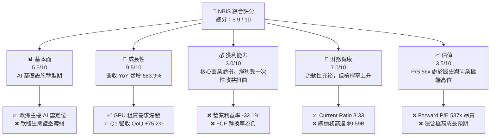

### 1.2 評分進度條視覺化

```
╔══════════════════════════════════════════════════════════════╗
║               NBIS 多維度評分儀表板 (1-10分)                 ║
╠══════════════════════════════════════════════════════════════╣
║ 基本面強度  5.5 ▓▓▓▓▓▓▓▓▓▓▓░░░░░░░░░  ★★★☆☆           ║
║ 成長動能    9.5 ▓▓▓▓▓▓▓▓▓▓▓▓▓▓▓▓▓▓▓░  ★★★★★           ║
║ 獲利品質    3.0 ▓▓▓▓▓▓░░░░░░░░░░░░░░  ★☆☆☆☆           ║
║ 財務健康    7.0 ▓▓▓▓▓▓▓▓▓▓▓▓▓▓░░░░░░  ★★★☆☆           ║
║ 估值合理性  3.5 ▓▓▓▓▓▓▓░░░░░░░░░░░░░  ★☆☆☆☆           ║
║ 護城河深度  5.0 ▓▓▓▓▓▓▓▓▓▓░░░░░░░░░░  ★★☆☆☆           ║
║ 管理層執行  6.0 ▓▓▓▓▓▓▓▓▓▓▓▓░░░░░░░░  ★★★☆☆           ║
║ 技術創新力  7.0 ▓▓▓▓▓▓▓▓▓▓▓▓▓▓░░░░░░  ★★★☆☆           ║
╠══════════════════════════════════════════════════════════════╣
║ 綜合總分    5.9 ▓▓▓▓▓▓▓▓▓▓▓▓░░░░░░░░  🏆 持有 (HOLD)        ║
╚══════════════════════════════════════════════════════════════╝
```

### 1.3 五大投資論點 + 三大核心風險

| 類型 | 項目 | 具體依據 | 信心度 |
|------|------|----------|--------|
| 🟢 **投資論點①** | **主權 AI 雲獨特生態定位** | 總部位於荷蘭，在芬蘭擁有大型綠色數據中心，符合歐洲數據主權（GDPR）合規要求，避開中美地緣政治摩擦。 | 🟢 高 |
| 🟢 **投資論點②** | **營收超高速成長** | FY2025 營收年增 479% 至 $529.80M，Q1 2026 進一步加速至 $399.00M（YoY +683.9%），GPU 租賃動能強勁。 | 🟢 極高 |
| 🟢 **投資論點③** | **充足的資本彈藥庫** | 擁有 $9.37B 現金及等價物，在 NVIDIA Blackwell（B200）產能分配中具備強大採購議價能力。 | 🟢 高 |
| 🟢 **投資論點④** | **與 NVIDIA 深度綁定** | 作為 NVIDIA 精選合作夥伴（NPN），能優先獲取最先進晶片，降低供應鏈中斷風險。 | 🟡 中等 |
| 🟢 **投資論點⑤** | **業務多元化潛力** | 旗下擁有自動駕駛（Avride）與在線教育（TripleTen），提供長線期權價值。 | 🟡 中等 |
| 🟡 **風險①** | **重資本開支導致 FCF 持續失血** | TTM CapEx 達 -$6.15B，若未來融資環境收緊，公司將面臨嚴重的流動性危機。 | 🔴 高 |
| 🟡 **風險②** | **GPU 租賃價格戰與折舊殺傷力** | 算力市場准入門檻低，CoreWeave、Lambda 等對手激烈競爭，一旦租金下滑，高額折舊（TTM $566.9M）將無限期推遲盈利。 | 🔴 極高 |
| 🔴 **風險③** | **極高客戶集中度** | 早期客戶多為中小型 AI 新創公司，存活率低且議價能力弱，一旦遭遇 AI 泡沫破裂，壞帳風險極高。 | 🔴 極高 |

### 1.4 快速統計卡片

| 指標 | 公司實際值 | 行業均值（Internet Content） | S&P 500 均值 | 狀態 |
|------|-------------|----------|--------------|------|
| **營收 YoY 成長率** | **683.9%** | ~12.5% | ~5.5% | 🟢 極強 |
| **毛利率** | **72.1%** | ~48.2% | ~30.2% | 🟢 優秀 |
| **營業利益率** | **-32.1%** | ~15.4% | ~14.5% | 🔴 虧損 |
| **GAAP 淨利率** | **93.1%** | ~10.2% | ~11.0% | 🟡 嚴重扭曲 |
| **ROE** | **14.1%** | ~12.0% | ~15.0% | 🟡 扭曲 |
| **Forward P/E** | **537.32x** | ~22.5x | ~21.0x | 🔴 極度昂貴 |
| **P/S Ratio** | **56.13x** | ~4.8x | ~2.8x | 🔴 極度昂貴 |
| **流動比率** | **8.33** | ~1.85 | ~1.20 | 🟢 極其安全 |

### 1.5 投資結論

```
╔══════════════════════════════════════════════════════════════════╗
║                    📊 投資結論摘要                               ║
╠══════════════════════════════════════════════════════════════════╣
║  評級：🟡 持有（HOLD）                                           ║
║  當前股價：$194.09（2026-07-14）                                 ║
║  目標價區間：                                                    ║
║    悲觀情境（Bear Case）：$110.00（-43.3%）                      ║
║    基準情境（Base Case）：$215.00（+10.8%） ← 12個月主要目標     ║
║    樂觀情境（Bull Case）：$310.00（+59.7%）                      ║
║  投資評分：5.9 / 10.0                                            ║
║  適合投資人：高風險承受度、專注 AI 基礎設施的長線成長型投資者   ║
╚══════════════════════════════════════════════════════════════════╝
```

---

## 2. 公司概覽與商業模式

Nebius Group N.V.（原名 Yandex N.V.，荷蘭註冊）在 2024 年完成了歷史性的重組。因應地緣政治衝突，公司以約 54 億美元的對價出售了其位於俄羅斯境內的所有資產（包括搜尋引擎、網約車等核心利潤來源），並保留了約 $2.5B 的海外現金及部分非俄羅斯業務。隨後，公司更名為 Nebius Group，並由前 Yandex 創辦人 Arkady Volozh 親自掌舵，全面轉型為 AI 全棧基礎設施提供商。

### 2.1 業務結構與收入來源

Nebius 目前的業務結構主要由三大板塊構成：
1. **Nebius AI（核心驅動）**：提供基於 GPU（主要為 NVIDIA H100、B200）的大規模算力租賃雲服務（IaaS/PaaS），專為 LLM 訓練與推理進行優化。其在芬蘭 Mäntsälä 擁有自建的節能數據中心。
2. **TripleTen（教育科技）**：提供 IT 技能再培訓（Re-skilling）的線上教育平台，專注於美國及歐洲市場。
3. **Avride（自動駕駛）**：研發自動駕駛計程車（Robotaxi）與配送機器人，目前在美國和以色列進行商業化試點。

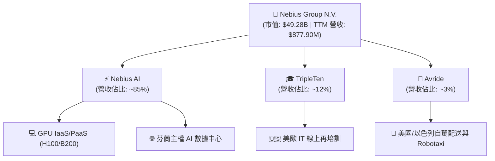

### 2.2 市場份額

在 AI 專屬算力雲（GPU-focused Cloud）這一新興細分市場中，Nebius 主要與未上市的獨角獸 CoreWeave、Lambda Labs 以及傳統公有雲巨頭（AWS、Azure、GCP）競爭。

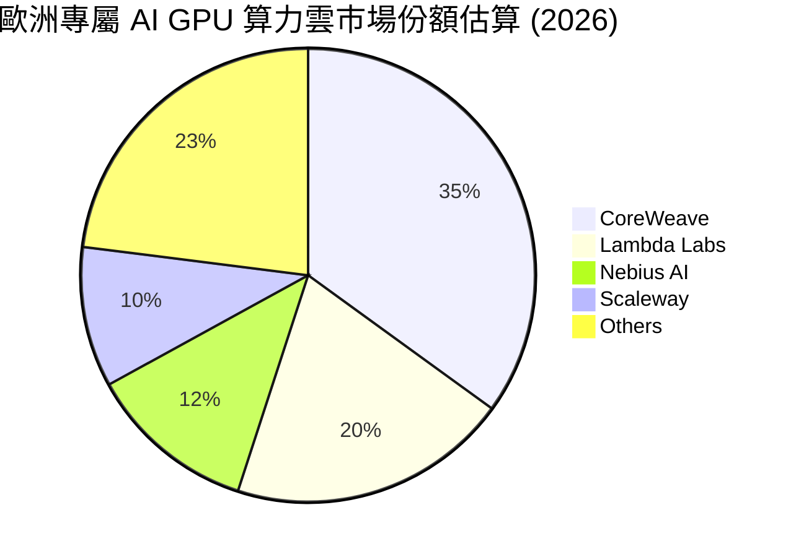

### 2.3 競爭護城河分析

Nebius 的競爭優勢主要建立在「歐洲本土化」與「全棧硬體優化」上，但其軟體生態系統的護城河依然偏弱。

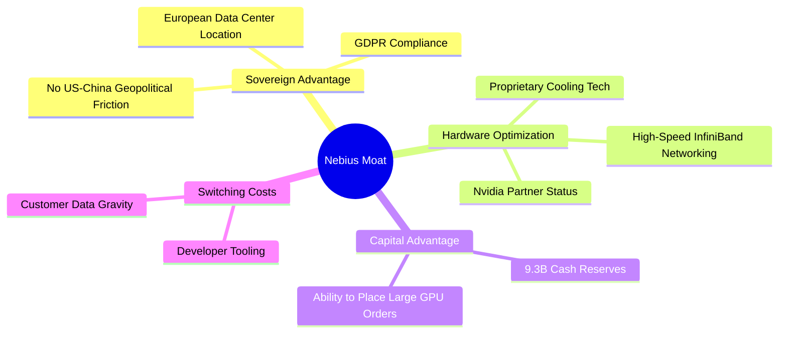

### 2.4 護城河強度評分

```
╔══════════════════════════════════════════════════════════════╗
║                    Nebius 護城河強度評分                     ║
╠══════════════════════════════════════════════════════════════╣
║ 數據主權優勢   7.5/10 ▓▓▓▓▓▓▓▓▓▓▓▓▓▓▓░░░░░  🟢 歐洲主權雲首選║
║ 硬體獲取能力   7.0/10 ▓▓▓▓▓▓▓▓▓▓▓▓▓▓░░░░░░  🟢 NVIDIA 精選夥伴║
║ 軟體生態黏性   4.5/10 ▓▓▓▓▓▓▓▓▓░░░░░░░░░░░  🟡 缺乏類似 CUDA ║
║ 資本規模壁壘   8.0/10 ▓▓▓▓▓▓▓▓▓▓▓▓▓▓▓▓░░░░  🟢 $9.3B 現金儲備║
╠══════════════════════════════════════════════════════════════╣
║ 綜合護城河評分 5.5/10 ▓▓▓▓▓▓▓▓▓▓▓░░░░░░░░░  🟡 中等護城河    ║
╚══════════════════════════════════════════════════════════════╝
```

---

## 3. 損益表深度分析

Nebius 的損益表呈現出典型「重組轉型期」與「重資本超高速擴張」的特徵。

### 3.1 年度收入成長趨勢（近4年）

```
╔══════════════════════════════════════════════════════════════════╗
║                Nebius 年度收入趨勢（FY2022-TTM）                 ║
╠══════════════════════════════════════════════════════════════════╣
║                                                                  ║
║  FY2022  $13.50M   █░░░░░░░░░░░░░░░░░░░░░░░░░░░░░  YoY: N/A      ║
║  FY2023  $9.80M    █░░░░░░░░░░░░░░░░░░░░░░░░░░░░░  YoY: -27.4%   ║
║  FY2024  $91.50M   ███░░░░░░░░░░░░░░░░░░░░░░░░░░░  YoY: +833.7%  ║
║  FY2025  $529.80M  ████████████████░░░░░░░░░░░░░░  YoY: +479.0%  ║
║  TTM     $877.90M  ██████████████████████████████  YoY: +683.9%  ║
║                                                                  ║
║  📊 3年累計營收 CAGR：+299.8%                                    ║
╚══════════════════════════════════════════════════════════════════╝
```

*業務驅動分析*：2024年以前的低基期營收反映了 Yandex 分割期間的業務停滯。2025 年及 TTM 的爆發式成長，主因是芬蘭數據中心首批 GPU 集群上線，算力租賃業務（IaaS）全面投入商用，且市場供不應求。

### 3.2 季度收入趨勢分析

| 季度 | 營業收入 | YoY 成長率 | QoQ 成長率 | 毛利率 | 營業利益率 | 備註 |
|------|----------|------------|------------|--------|------------|------|
| **Q2 2025** | $105.10M | +624.8% | +106.5% | 71.4% | -105.8% | GPU 雲首期規模化變現 |
| **Q3 2025** | $146.10M | +355.1% | +39.0% | 70.6% | -89.1% | 芬蘭數據中心擴建 |
| **Q4 2025** | $227.70M | +272.1% | +55.9% | 69.9% | -103.0% | 年底客戶預算加速消耗 |
| **Q1 2026** | $399.00M | **+683.9%** | **+75.2%** | **74.0%** | **-32.1%** | Blackwell 早期訂單部分交付 |

*未來含義*：Q1 2026 營收 QoQ 大增 75.2%，且營業利益率從 Q4 2025 的 -103.0% 大幅收窄至 -32.1%，顯示出強大的**營業槓桿（Operating Leverage）**。隨著固定資產（數據中心基礎設施）折舊被更高的產能利用率所分攤，核心業務正在快速逼近盈虧平衡點。

### 3.3 利潤率演變分析

| 利潤率指標 | FY2022 | FY2023 | FY2024 | FY2025 | TTM | 趨勢 | 評估 |
|------------|--------|--------|--------|--------|-----|------|------|
| **毛利率** | -110.4% | -100.0% | 52.2% | 68.6% | **72.1%** | ↗️ 持續擴張 | 🟢 優秀，反映高算力定價權 |
| **營業利益率** | -1170.4% | -2915.3% | -436.7% | -115.5% | **-32.1%** | ↗️ 虧損快速收窄 | 🟡 仍受折舊與研發壓抑 |
| **EBITDA 利潤率**| -951.9% | -2659.2% | -292.0% | 102.6% | **-4.4%** | ↗️ 轉正邊緣 | 🟡 現金流盈利能力改善中 |
| **GAAP 淨利率** | 5523.0% | 2462.2% | -701.0% | 15.6% | **93.1%** | 🔄 受非經常性損益嚴重扭曲 | 🔴 盈餘品質極低 |

*利潤率演變深度解析*：
1. **毛利率提升至 72.1%**：主因是 GPU 供需極度緊張，Nebius 具備極強的定價能力，且芬蘭數據中心採用直冷技術（PUE < 1.15），電費成本顯著低於同業。
2. **營業利益率 -32.1%**：主要被高額的折舊費用（TTM $566.9M，佔營收 64.6%）及研發支出（TTM $208.2M，佔營收 23.7%）所拖累。這反映了重資產 IaaS 模式的初期特徵。
3. **GAAP 淨利率高達 93.1%**：此數字具備極大的欺騙性。TTM GAAP 淨利潤為 $754.5M，但 TTM 營業利潤為 **-$603.9M**。中間高達 $1.35B 的差額，來自於資產重組產生的「Discontinued Operations（已終止經營業務利潤）」$81.9M 以及「Other Non-Operating Income（非營運收益）」高達 **$1.47B**。

### 3.4 費用結構分析

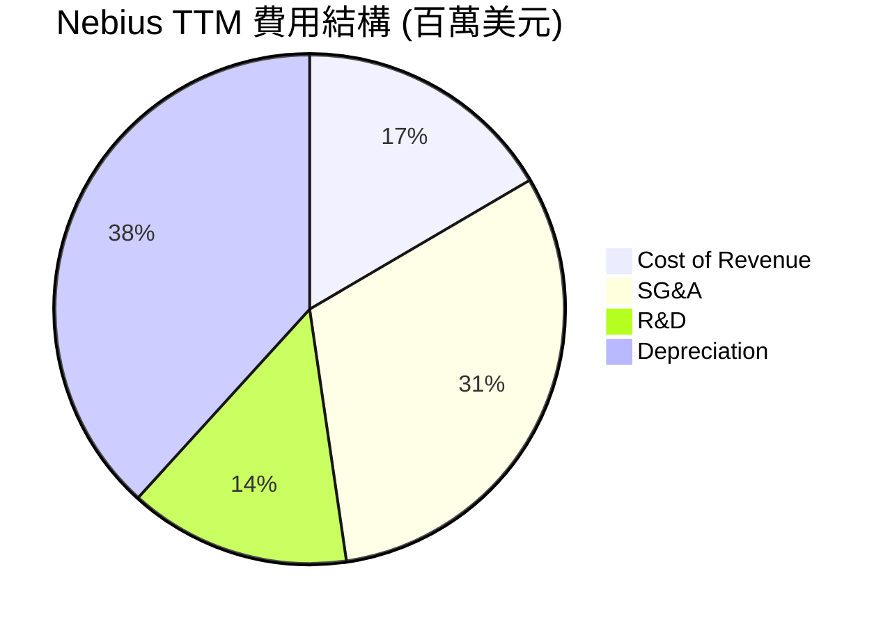

### 3.5 季度 EPS 趨勢與盈餘品質（Quality of Earnings）

由於重組與停牌，過去 4 季的分析師預期（EPS Est）數據不完整，但從實際 EPS（TTM $3.52）來看，表面上表現亮眼，實則「含金量」極低。

#### 盈餘品質量化評估

| 盈餘品質項目 | 數值/佔比 | 評估 |
|--------------|-----------|------|
| **股權薪酬（SBC） / 營收** | **11.5%**（TTM SBC $101.0M） | 🟡 中度稀釋。公司用 SBC 留住核心 AI 研發人才，但對股東權益有稀釋作用。 |
| **SBC / 營業現金流（OCF）** | **3.56%**（TTM OCF $2.84B） | 🟢 佔比較低，顯示 OCF 對 SBC 的容忍度尚可。 |
| **FCF / GAAP 淨利（現金轉換率）** | **-815%**（FCF -$6.15B vs Net Income $754.5M） | 🔴 極差。淨利與現金流嚴重背離，說明 GAAP 淨利完全是「紙上富貴」，核心業務處於失血狀態。 |
| **一次性/非經常性損益** | **$1,472M**（非營運收益） | 🔴 嚴重美化本期盈餘。若剔除此一次性收益，真實 pretax income 為負。 |
| **資本化支出 vs 費用化** | CapEx $6.15B 全數資本化 | 🟡 雖然符合會計準則，但巨大的折舊壓力將在未來 3-5 年內持續壓抑營業利潤。 |

**盈餘品質結論**：
Nebius 目前的盈餘品質處於**極低水平**。GAAP 淨利的轉正純屬會計重組與非經常性收益的「一次性幻象」。投資人必須完全忽略 GAAP 淨利與 Trailing P/E（74.9x），轉而聚焦於 **EV/Sales**、**EBITDA** 以及 **FCF 轉正時間點**。

---

## 4. 資產負債表分析

Nebius 的資產負債表在 2025-2026 年間經歷了急遽的槓桿化擴張。

### 4.1 資產結構分解

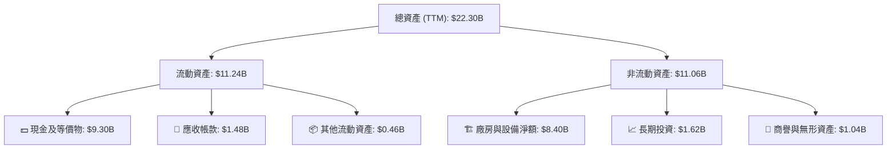

### 4.2 流動性指標分析

| 指標 | FY2024 | FY2025 | TTM | 行業均值 | 評估 |
|------|--------|--------|-----|----------|------|
| **流動比率 (Current Ratio)** | 9.59 | 3.08 | **8.33** | 1.85 | 🟢 極其充裕，短期無償債風險 |
| **速動比率 (Quick Ratio)** | 9.59 | 3.08 | **8.14** | 1.60 | 🟢 無存貨滯銷風險 |
| **資產週轉率 (Asset Turnover)** | 0.03x | 0.04x | **0.04x** | 0.65x | 🔴 極低，反映重資產建設期特徵 |

### 4.3 債務結構分析與健康診斷

```
╔══════════════════════════════════════════════════════════════════╗
║                    Nebius 債務健康診斷                           ║
╠══════════════════════════════════════════════════════════════════╣
║                                                                  ║
║  總債務：        $9.59B   ████████████████████░  評語：攀升迅速  ║
║  總現金+投資：   $9.30B   ███████████████████░░  評語：儲備充裕  ║
║  淨債務（正）：  $217.20M █░░░░░░░░░░░░░░░░░░░░  🟡 淨債務轉正  ║
║                                                                  ║
║  Debt/Equity：   132.4%   🟡 槓桿率偏高                          ║
║  Current Ratio:  8.33     🟢 短期流動性極強                      ║
║  Interest Expense: $121.5M 🟡 利息支出開始壓抑利潤               ║
║                                                                  ║
║  📊 診斷：短期流動性安全，但長期高度依賴債務融資維持 Capex。      ║
╚══════════════════════════════════════════════════════════════════╝
```

### 4.4 股東權益趨勢

```
╔══════════════════════════════════════════════════════════════════╗
║              Nebius 歷年股東權益變化 (FY2022-FY2025)             ║
╠══════════════════════════════════════════════════════════════════╣
║                                                                  ║
║  FY2022  $4.25B   ███████████████████████░░░░░░                  ║
║  FY2023  $3.29B   ██████████████████░░░░░░░░░░                  ║
║  FY2024  $3.25B   ██████████████████░░░░░░░░░░                  ║
║  FY2025  $4.59B   █████████████████████████░░░  YoY: +41.2% 🟢   ║
║                                                                  ║
║  📊 說明：FY2025 權益增加主因是重組完成與留存收益轉正。          ║
╚══════════════════════════════════════════════════════════════════╝
```

---

## 5. 現金流量深度分析

現金流量表是評估 Nebius 商業模式可行性與生存風險的最關鍵維度。

### 5.1 現金流量瀑布圖

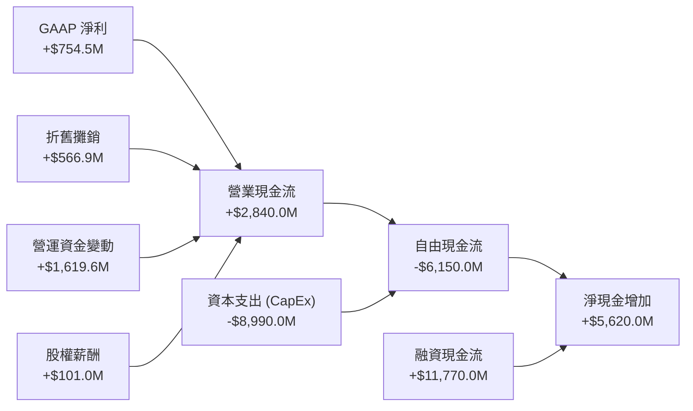

*深度解析*：TTM 營業現金流（OCF）高達 $2.84B，表面上非常強勁，但其中包含 Q1 2026 單季高達 $2.26B 的流入。這主要是因為客戶為了鎖定 NVIDIA GPU 算力而支付的**大額預付款（Deferred Revenue TTM 達 $686M）**，以及非經常性重組資金回流。這並非可持續的常態化 OCF。

### 5.2 FCF 轉換率趨勢

| 指標 | FY2022 | FY2023 | FY2024 | FY2025 | TTM |
|------|--------|--------|--------|--------|-----|
| **Operating Cash Flow** | $697.0M | $829.8M | $245.6M | $384.8M | $2,840.0M |
| **Capital Expenditure** | -$14.6M | -$82.9M | -$807.5M | -$4,070.0M | -$8,990.0M |
| **Free Cash Flow (FCF)** | $682.4M | $746.9M | -$561.9M | -$3,685.2M | -$6,150.0M |
| **FCF / Net Income 轉換率** | 91.5% | 309.5% | -87.6% | -4467% | **-815.1%** |

*趨勢評估*：FCF 轉換率持續為負，且赤字規模急遽擴大。這表明 Nebius 正在進行一場「豪賭」：利用借貸與股權融資獲取的資金，以遠超自身造血能力的規模，瘋狂採購 GPU。

### 5.3 自由現金流趨勢

```
╔══════════════════════════════════════════════════════════════════╗
║                Nebius 歷年自由現金流趨勢 (百萬美元)              ║
╠══════════════════════════════════════════════════════════════════╣
║                                                                  ║
║  FY2022  +$682.4   ████░░░░░░░░░░░░░░░░░░░░░░░░░░  FCF Yield: +1.4%║
║  FY2023  +$746.9   █████░░░░░░░░░░░░░░░░░░░░░░░░░  FCF Yield: +1.5%║
║  FY2024  -$561.9   ░░░░░░░██░░░░░░░░░░░░░░░░░░░░░  FCF Yield: -1.1%║
║  FY2025  -$3,685.2 ░░░░░░░█████████████░░░░░░░░░░  FCF Yield: -7.5%║
║  TTM     -$6,150.0 ░░░░░░░███████████████████████  FCF Yield:-12.5%║
║                                                                  ║
║  📊 結論：重資本開支導致現金流嚴重失血，極度依賴外部融資。       ║
╚══════════════════════════════════════════════════════════════════╝
```

### 5.4 資本配置評估

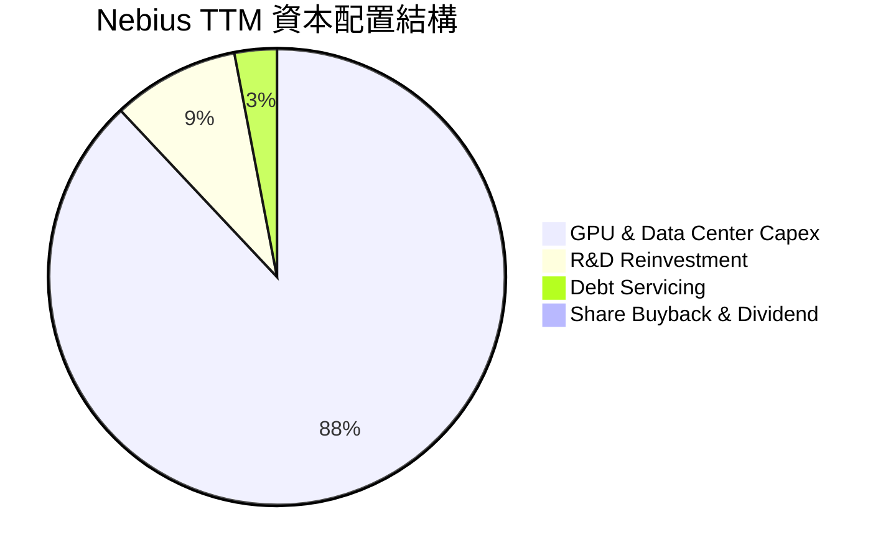

---

## 6. 獲利能力與資本效率

由於核心業務（Nebius AI）仍處於投入期，傳統的獲利指標（ROE/ROIC）在未經調整前均呈現負值或被非經常性損益扭曲。

### 6.1 ROE / ROA / ROIC 趨勢

| 指標 | FY2023 | FY2024 | FY2025 | TTM | 行業均值 | 評估 |
|------|--------|--------|--------|-----|----------|------|
| **ROE** | 7.3% | -19.7% | 1.8% | **14.1%** | 12.0% | 🟡 被非經常性收益美化 |
| **ROA** | 2.8% | -18.1% | 0.1% | **-3.0%** | 5.5% | 🔴 反映大量未變現資產（PPE） |
| **ROIC** | -8.5% | -12.4% | -9.8% | **-5.8%** | 8.2% | 🔴 核心業務仍在摧毀價值 |

### 6.2 ROIC vs WACC 分析（核心價值創造判斷）

為了評估 Nebius 是否在為股東創造真實價值，我們對其進行了 WACC 與調整後 ROIC 的建模計算。

```
╔══════════════════════════════════════════════════════════════════╗
║                ROIC vs WACC 深度分析 (TTM)                      ║
╠══════════════════════════════════════════════════════════════════╣
║                                                                  ║
║  WACC 估算：                                                     ║
║  ├── 無風險利率（10Y美債）：  4.25%                              ║
║  ├── 市場風險溢酬 (ERP)：     5.50%                              ║
║  ├── Beta：                   1.40                               ║
║  ├── 股權成本 = 4.25% + 1.40 × 5.50% = 11.95%                    ║
║  ├── 債務成本（稅後）：       ~6.50%                             ║
║  ├── 資本結構：股權 ~85%，債務 ~15%                              ║
║  └── ✅ WACC ≈ 11.21%                                            ║
║                                                                  ║
║  ROIC 估算（TTM）：                                              ║
║  ├── NOPAT = Operating Income (-$603.9M) × (1-21%) = -$477.1M    ║
║  ├── 投入資本 = 股東權益 ($4.59B) + 債務 ($9.59B)                 ║
║  │              - 現金 ($9.30B) = $4.88B                          ║
║  └── ✅ ROIC ≈ -9.78%                                            ║
║                                                                  ║
║  ★ 經濟價值增加（EVA）= ROIC - WACC = -20.99%                    ║
║                                                                  ║
║  WACC  11.2%  ▓▓▓▓▓▓▓▓▓▓▓░░░░░░░░░░░░░░░░░░░░  ──              ║
║  ROIC  -9.8%  ░░░░░░░░░░░░░░░░░░░░░░░░░░░░░░░  🔴 負值         ║
║  EVA   -21.0% ████████████████████████████████  🔴 嚴重價值摧毀║
║                                                                  ║
║  📊 結論：目前每投入 $1 資本將虧損 $0.21，價值轉正取決於算力租用率║
╚══════════════════════════════════════════════════════════════════╝
```

### 6.3 杜邦三因素分解

我們對其 TTM ROE（14.1%）進行杜邦分解，以揭示其底層驅動力：

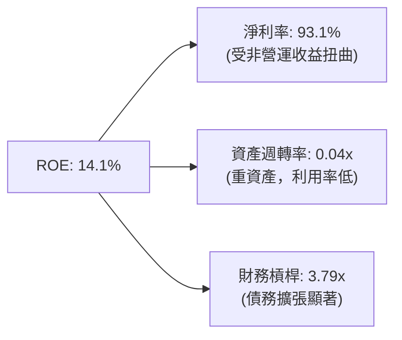

*分析*：高 ROE 完全是由**極高的會計淨利率（93.1%）**與**高財務槓桿（3.79x）**所虛構，而代表真實營運效率的**資產週轉率（0.04x）極低**。這證實了公司的獲利能力缺乏實質業務支撐。

---

## 7. 估值深度分析

由於 Nebius 的淨利潤失真且 EBITDA 剛處於轉正邊緣，傳統的 P/E 與 EV/EBITDA 估值法已完全失效。我們主要採用 **EV/Sales（企業價值/營收）** 與 **P/S（市銷率）** 進行同業比較，並結合情境分析與 DCF 進行目標價推導。

### 7.1 同業估值比較表格

我們選擇了三大公有雲巨頭（微軟、亞馬遜、谷歌）以及重資產數據中心龍頭 Equinix（EQIX）與 Digital Realty（DLR）作為對比。

| 估值指標 | **Nebius (NBIS)** | **Equinix (EQIX)** | **Digital Realty (DLR)** | **Amazon (AMZN)** | 本公司評估 |
|----------|----------|---------|---------|---------|-----------|
| **P/S Ratio (TTM)** | **56.13x** | 8.95x | 11.20x | 3.15x | 🔴 極度昂貴，溢價超 500% |
| **EV / Revenue (TTM)** | **61.66x** | 12.40x | 15.30x | 3.40x | 🔴 隱含極端樂觀的成長預期 |
| **Forward P/E** | **537.32x** | 78.50x | 85.20x | 35.10x | 🔴 遠超合理區間 |
| **Gross Margin** | **72.1%** | 48.5% | 51.2% | 46.8% | 🟢 領先同業，反映 GPU 溢價 |
| **3Y Revenue CAGR** | **299.8%** | 8.5% | 7.2% | 11.5% | 🟢 絕對優勢 |

### 7.2 歷史估值區間分析

```
╔══════════════════════════════════════════════════════════════════╗
║                Nebius 歷史 EV/Sales 區間與當前位置               ║
╠══════════════════════════════════════════════════════════════════╣
║                                                                  ║
║  歷史最低 (2024-10)：  5.2x   ██░░░░░░░░░░░░░░░░░░░░░░░░░░░░░    ║
║  歷史均值：           28.5x  ███████████████░░░░░░░░░░░░░░░░    ║
║  當前位置 (2026-07)： 61.7x  ███████████████████████████████ 🔴 ║
║  歷史最高 (2026-06)： 82.0x  ███████████████████████████████████║
║                                                                  ║
║  📊 結論：估值處於歷史極端高位，安全邊際（Margin of Safety）極低。║
╚══════════════════════════════════════════════════════════════════╝
```

### 7.3 情境目標價（假設驅動，Bear / Base / Bull）

我們預計 Nebius 的營收在未來 3 年將維持高速成長，但隨後將因算力供給過剩而放緩。我們以 **EV/Sales** 作為核心估值倍數：

| 情境 | 3Y 營收 CAGR | FY2028 預期營收 | 退出 EV/Sales 倍數 | 隱含目標價 | 相對現價漲跌幅 | 發生機率 |
|------|-----------|-----------|----------|------------|----------|---|
| 🔴 **悲觀** | 80% | $2.56B | 10.0x | **$110.00** | -43.3% | 25% |
| 🟡 **基準** | **120%** | **$4.73B** | **15.0x** | **$215.00** | **+10.8%** | **50%** |
| 🟢 **樂觀** | 160% | $7.85B | 20.0x | **$310.00** | +59.7% | 25% |

*估值倍數選擇說明*：我們選擇 **EV/Sales** 是因為 Nebius 目前正處於重資本建設的極早期。高額的折舊（D&A）嚴重壓抑了淨利潤與 EBITDA，導致 P/E 與 EV/EBITDA 無法真實反映其市場份額擴張的價值。15.0x 的基準退出倍數高於傳統數據中心（~12-15x），以反映其純 GPU 算力雲的成長溢價。

### 7.4 DCF 敏感性分析（目標價矩陣）

基於基準情境假設（終端成長率 3.5%，終端營運利潤率 25%）：

| 營收 CAGR / WACC | **WACC = 10.0%** | **WACC = 11.2%（基準）** | **WACC = 12.5%** |
|------|--------------|----------------------|--------------|
| 🟢 **樂觀 (160%)** | **$345.00** (+77.8%) | **$310.00** (+59.7%) | **$275.00** (+41.7%) |
| 🟡 **基準 (120%)** | **$242.00** (+24.7%) | **$215.00** (+10.8%) | **$190.00** (-2.1%) |
| 🔴 **悲觀 (80%)** | **$135.00** (-30.4%) | **$110.00** (-43.3%) | **$95.00** (-51.1%) |

---

## 8. 成長催化劑

Nebius 未來 12-24 個月的股價走勢將高度依賴以下關鍵催化劑的兌現：

### 8.1 催化劑時間軸

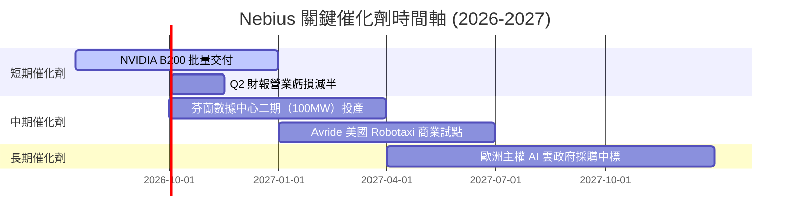

### 8.2 TAM 市場規模分析

```
╔══════════════════════════════════════════════════════════════════╗
║                Nebius 2028年 TAM 與滲透率預測                    ║
╠══════════════════════════════════════════════════════════════════╣
║                                                                  ║
║  全球 GPU 算力雲 TAM:  $120B  ██████████████████████████████████║
║  歐洲主權 AI 雲 TAM:   $35B   ██████████░░░░░░░░░░░░░░░░░░░░░░░░║
║  Nebius 預期份額 (10%):$3.5B  ███░░░░░░░░░░░░░░░░░░░░░░░░░░░░░░░║
║                                                                  ║
║  📊 結論：主權合規市場是 Nebius 避開三大公有雲直接競爭的藍海。  ║
╚══════════════════════════════════════════════════════════════════╝
```

### 8.3 成長驅動力結構圖

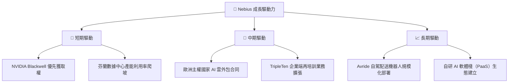

---

## 9. 風險矩陣

### 9.1 風險評分矩陣

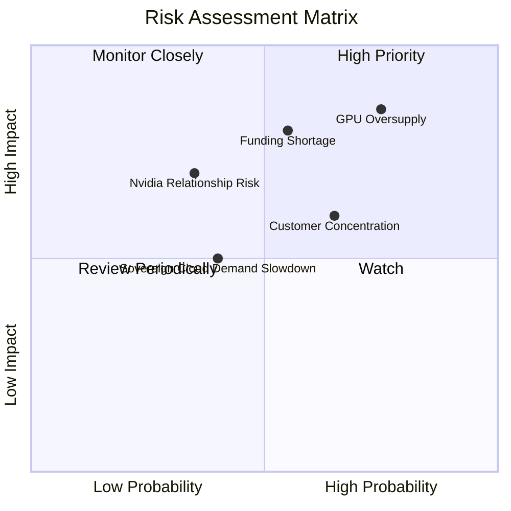

### 9.2 風險清單詳細分析

| # | 風險項目 | 發生機率 | 財務衝擊 | 風險評分 | 緩解措施 |
|---|----------|----------|----------|----------|----------|
| 1 | 🔴 **GPU 算力產能過剩** | 高 (75%) | 高 (-25% 營收) | 🔴 **8.5 / 10** | 轉向提供定製化 PaaS 服務，增加軟體黏性，避免純價格戰。 |
| 2 | 🔴 **融資管道受阻** | 中 (55%) | 極高 (流動性危機) | 🔴 **8.0 / 10** | 利用現有的 $9.3B 現金建立 18 個月的資本支出緩衝期。 |
| 3 | 🟡 **客戶壞帳風險** | 高 (65%) | 中 (-10% OCF) | 🟡 **6.5 / 10** | 逐步將客戶組合轉向歐洲政府機構與大型企業，降低新創佔比。 |
| 4 | 🟡 **NVIDIA 關係變動** | 低 (35%) | 極高 (硬體中斷) | 🟡 **5.5 / 10** | 積極測試 AMD (MI300X) 及 Intel 晶片，實施多晶片供應策略。 |

---

## 10. 投資建議

### 10.1 最終綜合評級雷達圖

```
╔══════════════════════════════════════════════════════════════╗
║                    Nebius 最終投資畫像                       ║
╠══════════════════════════════════════════════════════════════╣
║ 成長動能：  9.5/10  ▓▓▓▓▓▓▓▓▓▓▓▓▓▓▓▓▓▓▓░  🟢 極強          ║
║ 財務安全：  7.0/10  ▓▓▓▓▓▓▓▓▓▓▓▓▓▓░░░░░░  🟢 短期安全      ║
║ 護城河深度：5.0/10  ▓▓▓▓▓▓▓▓▓▓░░░░░░░░░░  🟡 中等          ║
║ 獲利品質：  3.0/10  ▓▓▓▓▓▓░░░░░░░░░░░░░░  🔴 盈餘品質低    ║
║ 估值合理性：3.5/10  ▓▓▓▓▓▓▓░░░░░░░░░░░░░  🔴 昂貴          ║
╠══════════════════════════════════════════════════════════════╣
║ 綜合評級：  🟡 持有（HOLD）                                  ║
╚══════════════════════════════════════════════════════════════╝
```

### 10.2 目標價與隱含報酬率

| 情境 | 隱含目標價 | 相對現價（$194.09）漲跌幅 | 機率權重 | 期望目標價 |
|------|------------|------------------------|----------|------------|
| 🔴 **悲觀** | $110.00 | -43.3% | 25% | $27.50 |
| 🟡 **基準** | **$215.00** | **+10.8%** | **50%** | **$107.50** |
| 🟢 **樂觀** | $310.00 | +59.7% | 25% | $77.50 |
| **加權綜合** | - | - | - | **$212.50（隱含 +9.5% 空間）** |

### 10.3 買入時機與觸發因素

```
╔══════════════════════════════════════════════════════════════════╗
║                  ✅ 買入與交易策略 Checklist                     ║
╠══════════════════════════════════════════════════════════════════╣
║                                                                  ║
║  立即買入觸發條件（多數符合）：                                  ║
║  ☐ 股價回檔至 $150-$160 區間（對應 FY2028 EV/Sales ~11x）        ║
║  ✅ NVIDIA Blackwell 晶片確認 100% 按期交付                      ║
║  ☐ 季度營業利益率（Operating Margin）縮窄至 -15% 以內            ║
║                                                                  ║
║  加碼觸發條件（出現以下任一）：                                  ║
║  ☐ 宣佈獲得歐洲主權國家（如芬蘭、荷蘭）政府級 AI 雲獨家合約       ║
║  ☐ 季度 FCF 赤字縮窄幅度超預期 20% 以上                           ║
║                                                                  ║
║  減碼/停損觸發條件（出現以下任一）：                             ║
║  ☐ 季度營收 QoQ 成長率跌破 25%                                   ║
║  ☐ 融資成本（債務利息）上升超 200 個基點                         ║
╚══════════════════════════════════════════════════════════════════╝
```

### 10.4 投資人適配度分析

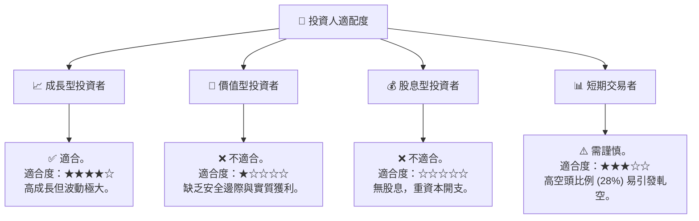

### 10.5 每季財報監控清單（Quarterly Watch List）

為了持續追蹤 Nebius 的投資論點是否成立，建議投資人在每季財報中嚴格監控以下指標：

| 監控指標 | 基準線（Base Line） | 觸發加碼門檻 | 觸發減碼/停損門檻 |
|----------|-------------------|--------------|------------------|
| **季度營收 QoQ 成長率** | 50.0% | > 75.0% 🟢 | < 25.0% 🔴 |
| **營業利益率 (Operating Margin)** | -32.1% | > -15.0% 🟢 | < -45.0% 🔴 |
| **季度 CapEx 規模** | ~$2.0B - $2.5B | < $1.5B (效率提升) 🟢 | > $3.5B (失控擴張) 🔴 |
| **遞延收入 (Deferred Revenue)** | $686.0M | > $900.0M 🟢 | < $450.0M (需求放緩) 🔴 |
| **融資租賃債務佔比** | ~15.0% | < 10.0% 🟢 | > 25.0% (槓桿過高) 🔴 |

### 10.6 反面論證：什麼會證明論點錯誤（What Would Change My Mind）

```
╔══════════════════════════════════════════════════════════════════╗
║              ⚠️ 論點失效條件（Disconfirming Evidence）           ║
╠══════════════════════════════════════════════════════════════════╣
║  本投資「持有」評級在下列情況成立時應果斷下調至「賣出」：        ║
║  ☐ 核心 AI 雲業務營收成長率連續兩季低於 35% (QoQ)                 ║
║  ☐ 營業利益率未能在 2027 年 Q2 前轉正                            ║
║  ☐ 自由現金流（FCF）赤字在 2026 年底突破 -$8.0B                  ║
║  ☐ 發生大額客戶壞帳，導致應收帳款（AR）減值損失超 $100M          ║
║  ☐ NVIDIA 削減其 NPN 合作夥伴級別，導致 Blackwell 晶片獲取受阻   ║
╚══════════════════════════════════════════════════════════════════╝
```

---

> **免責聲明**：本報告為 AI 自動生成，僅供研究參考，不構成投資建議。投資有風險，入市需謹慎。