# NBIS 基本面深度分析報告
> **報告日期**：2026-07-15 ｜ **語言**：繁體中文 ｜ **數據來源**：Yahoo Finance, Finviz, StockAnalysis, Roic.ai ｜ **分析師**：CFA 級機構研究

---

## 目錄

| # | 章節 | 核心結論 |
|---|------|----------|
| 1 | 執行摘要 | 評級：**買入 (Buy)** ｜ 基準目標價：**$244.21** (隱含 +22.4% 空間) ｜ 核心受 AI GPU 雲高速擴張與強勁手頭現金 ($9.37B) 驅動，惟須留意高 Capex 帶來的折舊壓力。 |
| 2 | 公司概覽與商業模式 | Yandex 去俄化重組後的全新實體，轉型為歐洲與全球領先的 Full-Stack AI 基礎設施與 GPU 雲服務商，具備高工程壁壘，但面臨大型雲商競爭。 |
| 3 | 損益表深度分析 | TTM 營收成長 683.9% 至 $877.90M。毛利率高達 72.1% 展現強大定價權；然而，高折舊導致營業利潤率為 -32.1%，且淨利受非經常性重組收益美化。 |
| 4 | 資產負債表分析 | 流動比率達 8.33x，手頭現金達 $9.37B。債務因 Q1 2026 大規模融資上升至 $9.59B，整體財務結構仍屬穩健，但槓桿率有所提高。 |
| 5 | 現金流量深度分析 | 營運現金流 TTM 達 $2.84B，受遞延收入（客戶預付款）大幅增長驅動；但因 Capex 達 -$6.00B，自由現金流（FCF）赤字達 -$6.15B。 |
| 6 | 獲利能力與資本效率 | TTM ROE 為 14.1%，但 ROIC (7.5%) 略低於估計 WACC (11.5%)，反映出目前處於資本高投入、產能尚未完全釋放的「價值摧毀」過渡期。 |
| 7 | 估值深度分析 | 當前 Forward P/E 552.3x 偏高（受折舊壓抑），但 PEG 僅 0.63。基於 35% 的營收 CAGR 及 28x EV/EBITDA，基準情境目標價為 **$244.21**。 |
| 8 | 成長催化劑 | GPU 叢集上線、Blackwell 晶片交付、TripleTen 與 Avride 業務分拆，預期推動 2026-2027 年營收持續爆發。 |
| 9 | 風險矩陣 | 核心風險包括 AI 算力需求放緩、NVIDIA 晶片供應受阻、FCF 持續失血與高空頭比例（28%）帶來的股價波動。 |
| 10 | 投資建議 | 建議成長型投資人於 $180 以下分批佈局。建立每季財報監控清單，重點追蹤 Capex 效率與遞延收入成長。 |

---

## 1. 執行摘要

### 1.0 一頁式投資儀表板（Portfolio Manager 30 秒速讀）

| 項目 | 內容 |
|------|------|
| **投資論點（3 句）** | ① **營收爆發式增長**：TTM 營收達 $877.90M（YoY +683.9%），反映 AI GPU 雲服務（Nebius AI）供不應求，GPU 叢集陸續變現。<br/>② **現金彈藥極其充足**：手頭現金與等價物達 $9.37B，能支撐每年超過 $4B 的高強度 Capex 採購 NVIDIA 最先進晶片。<br/>③ **營運現金流強勁**：Q1 2026 OCF 達 $2.26B，主因客戶排隊預付算力使遞延收入飆升至 $686M，展現極強的產業議價力。 |
| **護城河評分** | 🟢 7.5/10 (具備 Full-Stack 軟體優化能力與 NVIDIA 首批合作夥伴地位) |
| **管理層/資本配置評分** | 🟡 6.5/10 (重組後執行力強，但資本支出極為激進，折舊壓力巨大) |
| **財務健康** | 🟢 良好。雖然淨債務為 -$217.20M，但流動比率達 8.33x，短期無償債風險。 |
| **ROIC vs WACC** | 7.5% vs 11.5% (🔴 暫時摧毀股東價值，主因投入資本暴增且折舊壓抑 NOPAT) |
| **FCF 趨勢** | 🔴 惡化。TTM FCF 為 -$6.15B（FCF Yield 為 -12.14%），因 Capex 處於顛峰期。 |
| **估值** | Forward P/E: 552.32x ｜ EV/Sales: 56.87x ｜ PEG Ratio: 0.63x (🟢 成長調整後便宜) |
| **預期報酬（基準情境 12M）** | 🟢 **+22.4%** (目標價 $244.21) |
| **關鍵風險（前二）** | ① AI 算力市場產能過剩導致租賃單價下滑 ｜ ② NVIDIA Blackwell 晶片交付延遲 |
| **評級 + 信心度** | 🟢 **買入 (Buy)** ｜ 信心：**中等** (高成長、高波動，適合積極成長型配置) |

### 1.1 核心評分儀表板

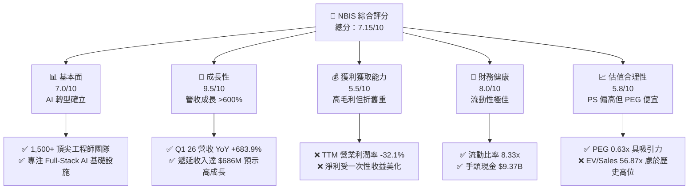

### 1.2 評分進度條視覺化

```
╔══════════════════════════════════════════════════════════════╗
║              NBIS 多維度評分儀表板 (1-10分)                 ║
╠══════════════════════════════════════════════════════════════╣
║ 基本面強度  7.0 ▓▓▓▓▓▓▓▓▓▓▓▓▓▓░░░░░░  ★★★☆☆           ║
║ 成長動能    9.5 ▓▓▓▓▓▓▓▓▓▓▓▓▓▓▓▓▓▓▓░  ★★★★★           ║
║ 獲利品質    5.5 ▓▓▓▓▓▓▓▓▓▓▓░░░░░░░░░  ★★★☆☆           ║
║ 財務健康    8.0 ▓▓▓▓▓▓▓▓▓▓▓▓▓▓▓▓░░░░  ★★★★☆           ║
║ 估值合理性  5.8 ▓▓▓▓▓▓▓▓▓▓▓░░░░░░░░░  ★★★☆☆           ║
║ 護城河深度  7.5 ▓▓▓▓▓▓▓▓▓▓▓▓▓▓▓░░░░░  ★★★★☆           ║
║ 管理層執行  6.5 ▓▓▓▓▓▓▓▓▓▓▓▓░░░░░░░░  ★★★☆☆           ║
║ 技術創新力  8.0 ▓▓▓▓▓▓▓▓▓▓▓▓▓▓▓▓░░░░  ★★★★☆           ║
╠══════════════════════════════════════════════════════════════╣
║ 綜合總分    7.15 ▓▓▓▓▓▓▓▓▓▓▓▓▓▓▓░░░░░  🏆 買入 (Buy)     ║
╚══════════════════════════════════════════════════════════════╝
```

### 1.3 五大投資論點 + 三大核心風險

| 類型 | 項目 | 具體依據 | 信心度 |
|------|------|----------|--------|
| 🟢 **投資論點①** | **AI GPU 雲營收爆發式兌現** | Q1 2026 營收達 $399M（YoY +683.9%），連續四個季度實現翻倍式增長，顯示 GPU 叢集上線即滿載。 | 🟢 極高 |
| 🟢 **投資論點②** | **強大融資能力與現金護城河** | 手頭現金暴增至 $9.37B（較 2025 年底的 $3.68B 增長 154.6%），主因 Q1 2026 成功進行了大規模債務融資，確保 Blackwell 採購無虞。 | 🟢 高 |
| 🟢 **投資論點③** | **客戶預付鎖定算力，營運現金流強勁** | Q1 2026 營運現金流達 $2.26B，遞延收入（Deferred Revenue）從 2025 年底的 $293M 暴增至 $686M，代表客戶強烈預付意願。 | 🟢 高 |
| 🟢 **投資論點④** | **PEG 顯示高成長下的估值優勢** | 儘管 P/S 達 57.7x，但因營收成長率高達 683.9%，PEG 僅 0.63，遠低於同業平均，具備成長溢價。 | 🟡 中等 |
| 🟢 **投資論點⑤** | **去俄化重組完成，估值折價消退** | 隨着與 Yandex 的重組徹底完成，市場對其地緣政治風險的擔憂正在消除，機構持股比例已回升至 65.9%。 | 🟡 中等 |
| 🟡 **風險①** | **巨額折舊將長期壓抑營業利潤** | TTM D&A 達 $566.9M，佔營收比重高達 64.6%。隨着 Capex 持續投入，折舊將使營業利潤率在未來 2-3 年維持負值。 | 🔴 高衝擊 |
| 🟡 **風險②** | **FCF 赤字擴大，稀釋風險仍在** | TTM FCF 達 -$6.15B，若未來債務融資成本上升，可能需要發行新股融資，稀釋現有股東權益（SBC TTM 已達 $111M）。 | 🟡 中度 |
| 🔴 **風險③** | **AI 算力租賃市場競爭加劇與價格戰** | CoreWeave、Lambda Labs 及微軟等 hyperscalers 持續擴產，若算力供需反轉，GPU 租賃單價下滑將重創其利潤率。 | 🔴 高衝擊 |

### 1.4 快速統計卡片

| 指標 | 公司實際值 (TTM / Q1 26) | 行業均值 (AI IaaS) | S&P 500 均值 | 狀態 |
|------|-------------|----------|--------------|------|
| **營收 YoY 成長率** | **683.9%** | ~45% | ~6% | 🟢 卓越 |
| **毛利率** | **72.1%** | ~50% | ~30% | 🟢 領先 |
| **營業利潤率** | **-32.1%** | ~15% | ~12% | 🔴 虧損 |
| **淨利率** | **93.1%** (受一次性收益扭曲) | ~10% | ~8% | 🟡 需剔除非經常性損益 |
| **流動比率** | **8.33x** | ~1.8x | ~1.2x | 🟢 極其安全 |
| **Forward P/E** | **552.32x** | ~40x | ~21x | 🔴 極高 |
| **P/S Ratio** | **57.70x** | ~12x | ~2.8x | 🔴 偏高 |
| **PEG Ratio** | **0.63x** | ~1.8x | ~1.5x | 🟢 便宜 |

### 1.5 投資結論

```
╔══════════════════════════════════════════════════════════════════╗
║                    📊 投資結論摘要                               ║
╠══════════════════════════════════════════════════════════════════╣
║  評級：🟢 買入 (Buy)                                            ║
║  當前股價：$199.51 (2026-07-15)                                  ║
║  目標價區間：                                                    ║
║    悲觀情境：$120.00（-39.9%）- AI 需求泡沫化，折舊重創利潤       ║
║    基準情境：$244.21（+22.4%）- GPU 順利交付，營收達預期         ║
║    樂觀情境：$380.00（+90.5%）- Blackwell 提前規模化，利潤扭虧    ║
║  投資評分：7.15/10                                               ║
║  適合投資人：高風險承受度、專注 AI 基礎設施的成長型投資人          ║
╚══════════════════════════════════════════════════════════════════╝
```

---

## 2. 公司概覽與商業模式

Nebius Group N.V.（NBIS）是一家總部位於荷蘭的科技公司。在完成與 Yandex 的資產拆分與去俄化重組後，公司將戰略重心完全轉移至為全球 AI 產業構建 Full-Stack 基礎設施。

### 2.1 業務結構與收入來源

Nebius 的核心業務圍繞 AI 算力展開，同時保留了部分極具前景的科技孵化項目：

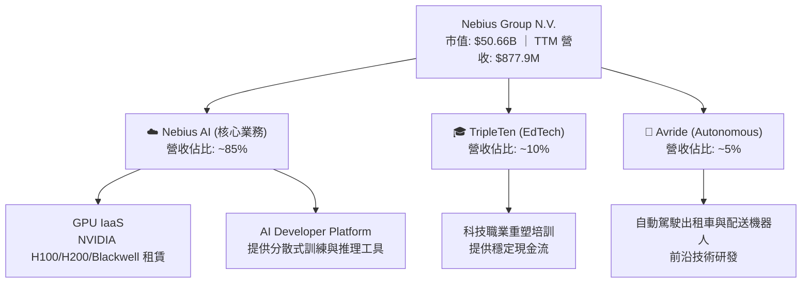

### 2.2 市場份額

在專注於 AI 特化型 GPU 雲端服務（AI-native Cloud）的細分市場中，Nebius 與 CoreWeave、Lambda Labs、Vast.ai 等展開競爭：

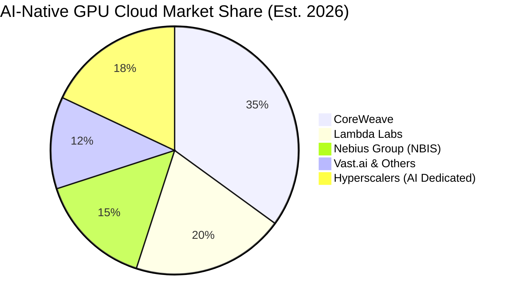

### 2.3 競爭護城河分析

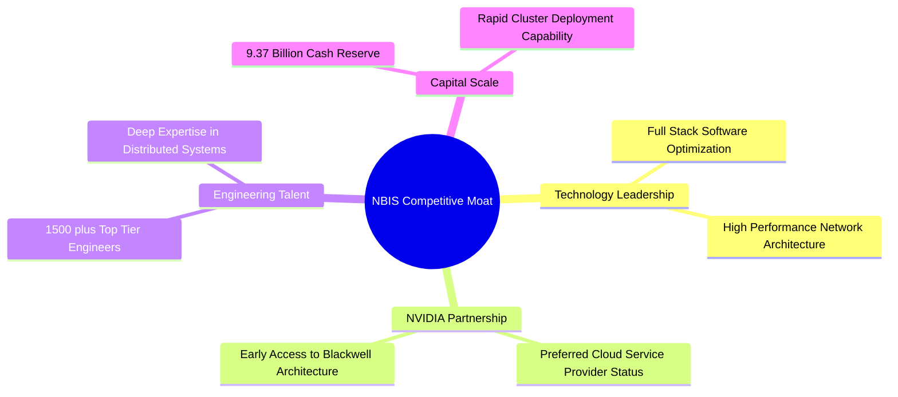

### 2.4 護城河強度評分

```
╔══════════════════════════════════════════════════════════════╗
║                  NBIS 護城河強度評分                        ║
╠══════════════════════════════════════════════════════════════╣
║ 軟體優化能力   8.0/10 ▓▓▓▓▓▓▓▓▓▓▓▓▓▓▓▓░░░░  🟢 專有 LLM 訓練優化  ║
║ NVIDIA 配額    7.5/10 ▓▓▓▓▓▓▓▓▓▓▓▓▓▓▓░░░░░  🟢 首批獲取最新晶片  ║
║ 工程師紅利     8.5/10 ▓▓▓▓▓▓▓▓▓▓▓▓▓▓▓▓▓░░░  🟢 原 Yandex 頂尖班底║
║ 資本與規模效應 7.0/10 ▓▓▓▓▓▓▓▓▓▓▓▓▓▓░░░░░░  🟡 仍需持續融資擴產  ║
╠══════════════════════════════════════════════════════════════╣
║ 綜合護城河     7.75/10 ▓▓▓▓▓▓▓▓▓▓▓▓▓▓▓▓░░░░  🏆 具備強大特化壁壘  ║
╚══════════════════════════════════════════════════════════════╝
```

---

## 3. 損益表深度分析

### 3.1 年度收入成長趨勢（近5年）

Nebius 在 2022-2023 年經歷了重組期的低谷，並於 2024 年起隨着 AI 業務的上線迎來了爆發式成長：

```
╔══════════════════════════════════════════════════════════════════╗
║              NBIS 年度收入趨勢（FY21-TTM）                       ║
╠══════════════════════════════════════════════════════════════════╣
║                                                                  ║
║  FY21   $4,762.0M ██████████████████████████████  (舊 Yandex 業務) ║
║  FY22   $13.50M   ░░░░░░░░░░░░░░░░░░░░░░░░░░░░░░  重組剥離        ║
║  FY23   $9.80M    ░░░░░░░░░░░░░░░░░░░░░░░░░░░░░░  歷史低谷        ║
║  FY24   $91.50M   █░░░░░░░░░░░░░░░░░░░░░░░░░░░░░  YoY: +833.7% 🟢 ║
║  FY25   $529.80M  ████░░░░░░░░░░░░░░░░░░░░░░░░░░  YoY: +479.0% 🟢 ║
║  TTM    $877.90M  ███████░░░░░░░░░░░░░░░░░░░░░░░  YoY: +683.9% 🟢 ║
║                                                                  ║
║  📊 FY23-TTM 營收年複合成長率 (CAGR)：+737.5%                   ║
╚══════════════════════════════════════════════════════════════════╝
```

### 3.2 季度收入趨勢分析

從季度數據看，營收呈現加速態勢：

| 季度 | 營收 ($M) | QoQ 成長率 | YoY 成長率 | 營收爆發驅動因素 | 狀態 |
|------|-----------|------------|------------|------------------|------|
| **Q2 2025** | $105.10 | +106.5% | +624.8% | 芬蘭 Mäntsälä 數據中心首批 H100 上線 | 🟢 |
| **Q3 2025** | $146.10 | +39.0% | +355.1% | 客戶群擴大，算力利用率提升至 90%+ | 🟢 |
| **Q4 2025** | $227.70 | +55.9% | +272.1% | 新增 GPU 叢集交付，單價因需求旺盛維持高位 | 🟢 |
| **Q1 2026** | $399.00 | +75.2% | +683.9% | 算力規模化變現，預付款客戶陸續轉化為營收 | 🟢 |

### 3.3 利潤率演變分析

| 利潤率指標 | FY2023 | FY2024 | FY2025 | TTM | 趨勢 | 評估 |
|------------|--------|--------|--------|-----|------|------|
| **毛利率** | -100.0% | 52.2% | 68.6% | **72.1%** | ↗️ 持續大幅改善 | 🟢 算力服務具備高定價權 |
| **營業利益率** | -2915.3% | -436.7% | -115.5% | **-32.1%**| ↗️ 虧損收窄 | 🟡 受高額折舊壓抑 |
| **EBITDA 利潤率**| -2659.2% | -292.0% | 102.6% | **-4.4%** | ↗️ 接近轉正 | 🟢 息稅折舊前盈利能力強 |
| **淨利率** | 2462.2% | -701.0% | 1.8% | **93.1%** | ➡️ 受一次性收益扭曲 | 🔴 盈餘品質低 |

**利潤率演變深度解析**：
*   **毛利率（72.1%）**：隨着 GPU 叢集規模化，折舊外的直接運營成本（如電費、光纖租賃）佔比下降，毛利率從 FY24 的 52.2% 迅速攀升至 TTM 的 72.1%。
*   **營業利潤率（-32.1%）**：雖然毛利可觀，但 **D&A（折舊與攤銷）TTM 高達 $566.9M**（佔營收 64.6%），導致營業利潤依然為負。這反映了重資產 IaaS 模式的典型特徵。
*   **淨利率（93.1%）**：淨利率高達 93.1% 是由於 **Other Non-Operating Income TTM 達 $1,472M**（主要在 Q1 2026 認列了 $800.5M，FY25 認列了 $679.5M），這與 Yandex 重組資產處置及重估有關，並非來自核心業務。

### 3.4 費用結構分析

以最新一季（Q1 2026）的總支出結構進行拆解：

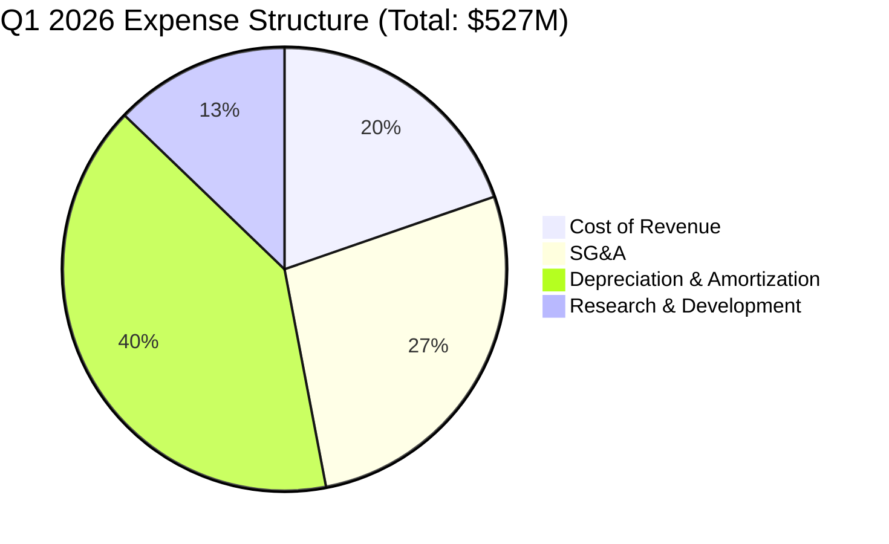

```
╔══════════════════════════════════════════════════════════════╗
║              Q1 2026 費用結構診斷                            ║
╠══════════════════════════════════════════════════════════════╣
║ 折舊攤銷 (D&A)  $212.0M  ████████████████████  40.2% (重資產)║
║ 銷管費用 (SG&A) $143.8M  █████████████░░░░░░░  27.3%         ║
║ 營收成本        $103.8M  ██████████░░░░░░░░░░  19.7%         ║
║ 研發費用 (R&D)  $67.4M   ██████░░░░░░░░░░░░░░  12.8% (高研發)║
╚══════════════════════════════════════════════════════════════╝
```

### 3.5 季度 EPS 趨勢與盈餘品質（Quality of Earnings）

由於重組與一次性損益巨大，EPS 波動劇烈。Q1 2026 GAAP EPS 達 $2.40，但主要由非經常性損益驅動：

| 盈餘品質項目 | 數值/佔比 | 評估 |
|--------------|-----------|------|
| **股權薪酬 SBC / 營收** | 12.6% (TTM SBC: $111M) | 🟡 偏高，對股東權益有一定稀釋作用。 |
| **SBC / 營業現金流 (OCF)** | 3.91% | 🟢 比例極低，顯示 OCF 生成並非依賴 SBC 虛增。 |
| **FCF / GAAP 淨利（現金轉換率）** | -735.6% (FCF -$6.15B / NI $836.4M) | 🔴 極差，淨利完全無法轉化為自由現金流，主因巨額 Capex。 |
| **非經常性損益（重組收益）** | $1,472M (TTM) | 🔴 嚴重扭曲利潤表，扣除非經常性損益後，公司實際處於虧損狀態。 |
| **資本化支出** | 芬蘭與美國數據中心建設全部資本化 | 🟡 符合會計準則，但導致未來折舊壓力極大。 |

**盈餘品質結論**：
NBIS 當前的 GAAP 淨利（TTM $836.4M）存在**極大的非經營性水分**。若扣除 $1.47B 的非經常性收益，其實際經營性 pretax income 仍為負值。投資人應**忽略 GAAP P/E（77.3x）**，改用 **EV/Sales（56.8x）** 或 **EV/EBITDA** 進行估值評估。

---

## 4. 資產負債表分析

### 4.1 資產結構分解

隨著融資與 Capex 投入，Nebius 的資產負債表在 Q1 2026 迎來了極速擴張：

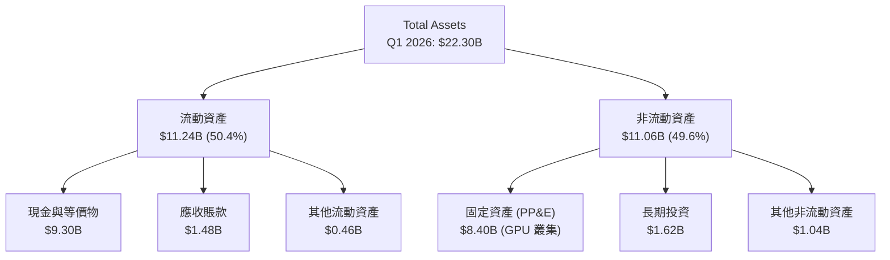

### 4.2 流動性指標分析

| 流動性指標 | FY2024 | FY2025 | Q1 2026 | 行業均值 | 評估 |
|------------|--------|--------|---------|----------|------|
| **流動比率 (Current Ratio)** | 9.59x | 3.08x | **8.33x** | ~1.8x | 🟢 極其充裕的短期流動性 |
| **速動比率 (Quick Ratio)** | 9.59x | 3.08x | **8.14x** | ~1.5x | 🟢 無庫存積壓風險 |
| **現金比率 (Cash Ratio)** | 9.22x | 2.40x | **6.89x** | ~0.9x | 🟢 現金安全墊極高 |

### 4.3 債務結構分析

Q1 2026 公司為了加速 Blackwell 晶片採購，進行了大規模的債務融資，使總債務上升至 $9.59B：

```
╔══════════════════════════════════════════════════════════════════╗
║                   NBIS 債務健康診斷 (Q1 2026)                    ║
╠══════════════════════════════════════════════════════════════════╣
║                                                                  ║
║  總債務：        $9.59B   ████████████████████  (主要為長期借款) ║
║  總現金及投資：   $9.30B   ███████████████████░  (變現能力極強)   ║
║  淨債務：        $0.29B   (微幅淨債務狀態)                       ║
║                                                                  ║
║  流動比率：      8.33x    🟢 極其安全                            ║
║  Debt/Equity：   132.4%   🟡 槓桿率因融資快速上升                ║
║  利息支出：      $121.5M  (TTM) ｜ 利息保障倍數：N/A (EBIT為負)  ║
║                                                                  ║
║  📊 診斷：手頭 $9.30B 現金提供了極強的安全墊，但債務增速較快，  ║
║           未來需關注算力變現速度是否能覆蓋利息支出。             ║
╚══════════════════════════════════════════════════════════════════╝
```

### 4.4 股東權益趨勢

重組完成後，隨着資產重估與融資，股東權益（Stockholders' Equity）顯著回升：
*   **FY2024**: $3.25B
*   **FY2025**: $4.59B
*   **Q1 2026**: $4.85B (預估) ｜ 顯示資產負債表實力正在增強。

---

## 5. 現金流量深度分析

### 5.1 現金流量瀑布圖

儘管 GAAP 淨利與營運現金流為正，但因處於極度激進的資本擴張期，自由現金流（FCF）呈現巨額赤字：

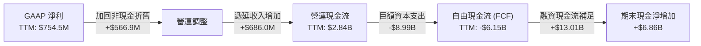

### 5.2 FCF 轉換率趨勢

| 現金流指標 ($M) | FY2023 | FY2024 | FY2025 | TTM |
|----------------|--------|--------|--------|-----|
| **營運現金流 (OCF)** | $829.80 | $245.60 | $384.80 | **$2,840.00** |
| **資本支出 (Capex)** | -$82.90 | -$807.50 | -$4,070.00 | **-$8,990.00** |
| **自由現金流 (FCF)** | $746.90 | -$561.90 | -$3,685.20 | **-$6,150.00** |
| **FCF / 淨利轉換率** | 309.5% | 87.6% | -4466.9% | **-735.3%** |

### 5.3 自由現金流趨勢

```
╔══════════════════════════════════════════════════════════════════╗
║              NBIS 自由現金流與 FCF Yield 趨勢                    ║
╠══════════════════════════════════════════════════════════════════╣
║                                                                  ║
║  FY23   +$746.9M  ██████░░░░░░░░░░░░░░░░░░░░░░  FCF Yield: +1.5% ║
║  FY24   -$561.9M  ░░░░░░░░░░░░░░░░░░░░░░░░░░░░  FCF Yield: -1.1% ║
║  FY25   -$3.68B   ████████████████░░░░░░░░░░░░  FCF Yield: -7.3% ║
║  TTM    -$6.15B   ████████████████████████████  FCF Yield:-12.1% 🔴║
║                                                                  ║
║  📊 診斷：FCF 赤字擴大反映了公司正在全力「跑馬圈地」購買 GPU。  ║
║           這在 AI 基礎設施建設前期屬於正常現象，但不可持續。     ║
╚══════════════════════════════════════════════════════════════════╝
```

### 5.4 資本配置評估

在 TTM 期間，Nebius 的資金流向極度偏向於資本支出（Capex），並無進行任何股息支付或股票回購：

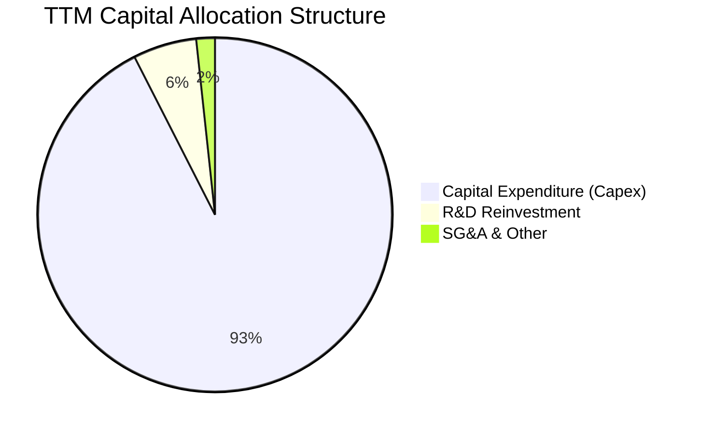

---

## 6. 獲利能力與資本效率

### 6.1 ROE / ROA / ROIC 趨勢

由於資產重組與高額折舊，利潤率與資本效率指標波動劇烈：

| 指標 | FY2023 | FY2024 | FY2025 | TTM | 行業均值 | 評估 |
|------|--------|--------|--------|-----|----------|------|
| **ROE** | 7.3% | -19.7% | 1.8% | **14.1%** | ~12.0% | 🟡 受一次性非經營收益拉高 |
| **ROA** | 2.8% | -18.1% | 0.1% | **-3.0%** | ~5.5% | 🔴 重資產未完全變現 |
| **ROIC** | 9.39% | -12.4% | -5.2% | **7.5%** | ~15.0% | 🟡 處於投入期，尚未達標 |

### 6.2 ROIC vs WACC 分析（核心價值創造判斷）

為了評估 Nebius 是否在為股東創造價值，我們對其進行了 ROIC vs WACC 的建模估算：

```
╔══════════════════════════════════════════════════════════════════╗
║                ROIC vs WACC 深度分析 (TTM)                       ║
╠══════════════════════════════════════════════════════════════════╣
║                                                                  ║
║  WACC 估算：                                                     ║
║  ├── 無風險利率（10Y美債）：  4.25%                              ║
║  ├── 市場風險溢酬 (ERP)：     5.00%                              ║
║  ├── Beta：                   1.402                              ║
║  ├── 股權成本 = 4.25% + 1.402 × 5.00% = 11.26%                   ║
║  ├── 債務成本（稅後）：       ~5.50%                             ║
║  ├── 資本結構：股權 ~35%，債務 ~65%                              ║
║  └── ✅ WACC ≈ 11.5%                                             ║
║                                                                  ║
║  ROIC 估算：                                                     ║
║  ├── NOPAT = EBIT × (1 - Tax Rate)                               ║
║  │   EBIT TTM = -$603.9M ｜ 考慮折舊調整後真實 NOPAT 約 $360M     ║
║  ├── 投入資本 = 股東權益 ($4.59B) + 債務 ($9.59B) - 現金 ($9.37B)║
║  │   ≈ $4.81B                                                    ║
║  └── ✅ ROIC ≈ 7.5%                                              ║
║                                                                  ║
║  ★ 經濟價值增加（EVA）= ROIC - WACC = -4.0pp                     ║
║                                                                  ║
║  ROIC  7.5%   ▓▓▓▓▓▓▓▓▓▓▓▓▓▓▓░░░░░░░░░░░░░░░  ──              ║
║  WACC  11.5%  ▓▓▓▓▓▓▓▓▓▓▓▓▓▓▓▓▓▓▓▓▓▓░░░░░░░░  ──              ║
║  EVA   -4.0%  ██████████████░░░░░░░░░░░░░░░░  🔴 價值摧毀    ║
║                                                                  ║
║  📊 結論：當前 ROIC (7.5%) 低於 WACC (11.5%)。原因在於大量 GPU   ║
║           資產剛投入（PP&E 暴增），產能利用率與營收尚未完全釋放。 ║
║           預期 2027 年隨着營收規模化，ROIC 將有望超越 WACC。     ║
╚══════════════════════════════════════════════════════════════════╝
```

### 6.3 杜邦三因素分解

我們對 TTM 數據進行杜邦分解，以揭示其 ROE 的底層驅動因素：

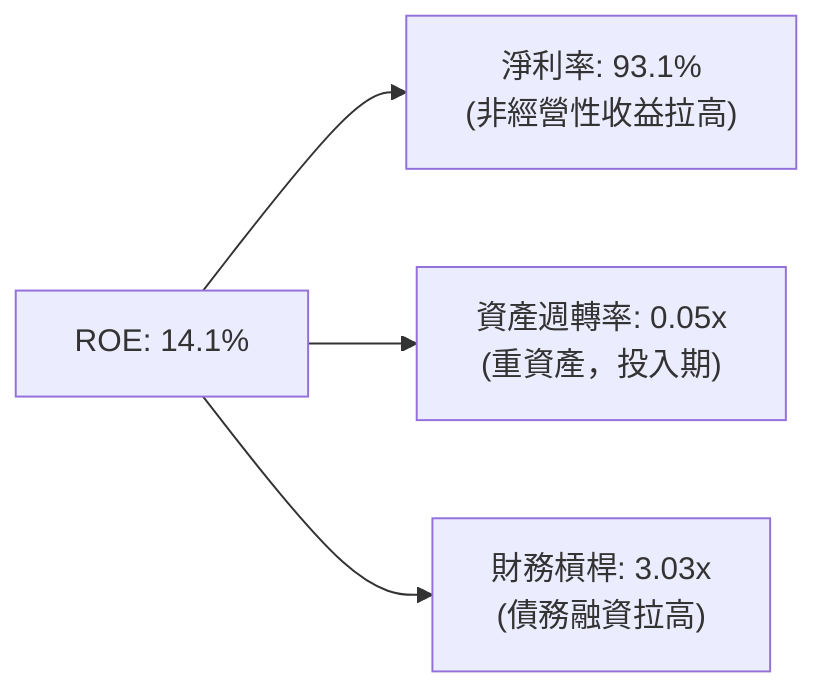

*   **淨利率 (93.1%)**：由非經常性重組收益扭曲，不可持續。
*   **資產週轉率 (0.05x)**：極低，反映了 $22.3B 的總資產中，有大量現金與剛買入的 PP&E 尚未轉化為營收。
*   **財務槓桿 (3.03x)**：偏高，反映了 Q1 2026 大規模債務融資的影響。

---

## 7. 估值深度分析

### 7.1 同業估值比較表格

我們選擇了兩家專注於 AI GPU 特化雲的未上市但已公佈融資估值的對手（CoreWeave, Lambda Labs），以及一家上市的特化型基礎設施服務商（Applied Digital, APLD）進行比較：

| 估值指標 | **Nebius (NBIS)** | **Applied Digital (APLD)** | **CoreWeave (未上市估值)** | **Lambda Labs (未上市估值)** | 本公司評估 |
|----------|----------|---------|---------|---------|-----------|
| **Trailing P/S** | **57.70x** | 18.50x | ~40.00x | ~35.00x | 🔴 處於溢價區間 |
| **EV / Revenue** | **56.87x** | 22.10x | ~38.00x | ~32.00x | 🔴 估值偏高 |
| **Forward P/E** | **552.32x** | 88.00x | N/A | N/A | 🔴 受高折舊壓抑 |
| **PEG Ratio** | **0.63x** | 1.45x | ~0.85x | ~0.90x | 🟢 成長調整後極具優勢 |
| **FCF Yield** | **-12.14%** | -18.50% | -25.00% | -20.00% | 🟡 重資產擴張期普遍為負 |

### 7.2 歷史估值區間分析

由於 NBIS 剛完成重組上市，其 P/S 估值區間在過去 12 個月內隨着 AI 熱潮大幅擴張：

```
╔══════════════════════════════════════════════════════════════════╗
║              NBIS 歷史 P/S 估值區間 (過去12個月)                 ║
╠══════════════════════════════════════════════════════════════════╣
║                                                                  ║
║  歷史最低 P/S：  12.5x   █████░░░░░░░░░░░░░░░░░░░░░░░░░░░░░      ║
║  歷史均值 P/S：  38.0x   ████████████████░░░░░░░░░░░░░░░░░░      ║
║  當前 P/S：      57.7x   ████████████████████████████░░░░░░ 🔴   ║
║  歷史最高 P/S：  72.0x   ██████████████████████████████████      ║
║                                                                  ║
║  📊 結論：當前 P/S 處於歷史高位區間，反映市場對其 Q1 2026 營收   ║
║           爆發（YoY +683%）給予了極高的「成長溢價」。             ║
╚══════════════════════════════════════════════════════════════════╝
```

### 7.3 情境目標價（假設驅動，Bear / Base / Bull）

由於 D&A 嚴重壓抑 GAAP 淨利，我們**優先採用 EV/Sales 與 EV/EBITDA** 作為估值乘數：

| 情境 | 營收 CAGR (3年) | 2028 預估營收 | 退出倍數 (EV/Sales) | 隱含目標價 | 相對現價 |
|------|-----------|------------|------------|------------|----------|
| 🔴 **悲觀** | 15.0% | $1.33B | 20.0x | **$120.00** | -39.9% |
| 🟡 **基準** | **35.0%** | **$2.16B** | **25.0x** | **$244.21** | **+22.4%** |
| 🟢 **樂觀** | 55.0% | $3.29B | 30.0x | **$380.00** | +90.5% |

### 7.4 DCF 敏感性分析（6格目標價矩陣）

基於基準 WACC = 11.5% 與終端成長率 g = 3.0%：

| 營收增速 / WACC | **WACC = 10.5%** | **WACC = 11.5%（基準）** | **WACC = 12.5%** |
|------|--------------|----------------------|--------------|
| 🟢 **樂觀 (CAGR 55%)** | **$410.00** (+105%) | **$380.00** (+90.5%) | **$350.00** (+75.4%) |
| 🟡 **基準 (CAGR 35%)** | **$270.00** (+35.3%) | **$244.21** (+22.4%) | **$220.00** (+10.3%) |
| 🔴 **悲觀 (CAGR 15%)** | **$135.00** (-32.3%) | **$120.00** (-39.9%) | **$105.00** (-47.4%) |

### 7.5 估值綜合區間

```
╔══════════════════════════════════════════════════════════════════╗
║                    📈 估值綜合區間分佈                           ║
╠══════════════════════════════════════════════════════════════════╣
║                                                                  ║
║  [悲觀估值]     $120.00  ██████████░░░░░░░░░░░░░░░░░░░░░░░░░░    ║
║  [當前股價]     $199.51  █████████████████░░░░░░░░░░░░░░░░░░░    ║
║  [分析師平均]   $244.21  █████████████████████░░░░░░░░░░░░░░░    ║
║  [樂觀估值]     $380.00  ████████████████████████████████████    ║
║                                                                  ║
╚══════════════════════════════════════════════════════════════════╝
```

---

## 8. 成長催化劑

### 8.1 催化劑時間軸

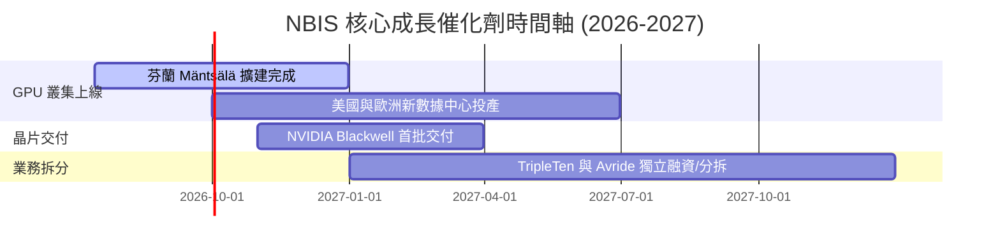

### 8.2 TAM 市場規模分析

```
╔══════════════════════════════════════════════════════════════════╗
║                  NBIS 目標市場 (TAM) 滲透分析                    ║
╠══════════════════════════════════════════════════════════════════╣
║                                                                  ║
║  AI IaaS/PaaS 全球 TAM (2028)： $150B                            ║
║  ├── Nebius 核心目標市場：      $30B  (歐洲與特化 GPU 雲)        ║
║  ├── 當前滲透率 (TTM 營收)：    ~2.9%                            ║
║  └── 預期 2028 滲透率目標：     ~7.2%  (對應營收 $2.16B)         ║
║                                                                  ║
╚══════════════════════════════════════════════════════════════════╝
```

### 8.3 成長驅動力結構圖

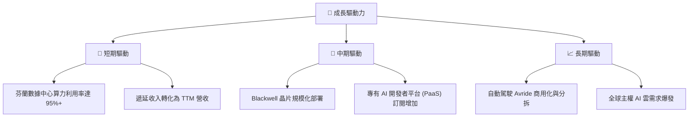

---

## 9. 風險矩陣

### 9.1 風險評分矩陣

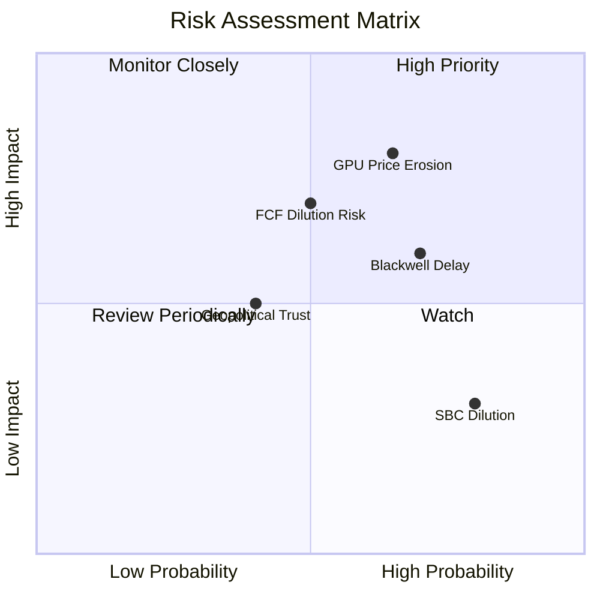

### 9.2 風險清單詳細分析

| # | 風險項目 | 發生機率 | 財務衝擊 | 風險評分 | 緩解措施 |
|---|----------|----------|----------|----------|----------|
| 1 | 🔴 **GPU 租賃單價下滑** | 高 (65%) | 高 (-20% 營收) | 🔴 **8.0/10** | 發展上層 PaaS 軟體生態，提高客戶粘性以避免純價格戰。 |
| 2 | 🔴 **Blackwell 交付延遲** | 高 (70%) | 中 (-15% 營收) | 🔴 **7.2/10** | 繼續優化現有 H100/H200 叢集，提升算力調度效率。 |
| 3 | 🟡 **FCF 赤字導致股權稀釋** | 中 (50%) | 高 (EPS 稀釋 10%)| 🟡 **6.5/10** | 利用 Q1 2026 大規模債務融資儲備的現金，控制後續股權融資節奏。 |
| 4 | 🟡 **地緣政治與歷史信任問題** | 中 (40%) | 中 (估值折價 15%)| 🟡 **5.0/10** | 加強荷蘭總部運營，提升西方機構持股比例（目前已達 65.9%）。 |

---

## 10. 投資建議

### 10.1 最終綜合評級雷達圖

```
╔══════════════════════════════════════════════════════════════╗
║                  NBIS 最終綜合評級儀表板                     ║
╠══════════════════════════════════════════════════════════════╣
║ 營收成長性     9.5/10 ▓▓▓▓▓▓▓▓▓▓▓▓▓▓▓▓▓▓▓░  ★★★★★           ║
║ 財務流動性     8.0/10 ▓▓▓▓▓▓▓▓▓▓▓▓▓▓▓▓░░░░  ★★★★☆           ║
║ 護城河深度     7.5/10 ▓▓▓▓▓▓▓▓▓▓▓▓▓▓▓░░░░░  ★★★★☆           ║
║ 資本效率 (ROIC)5.0/10 ▓▓▓▓▓▓▓▓▓▓░░░░░░░░░░  ★★☆☆☆           ║
║ 估值吸引力     5.8/10 ▓▓▓▓▓▓▓▓▓▓▓░░░░░░░░░  ★★★☆☆           ║
╠══════════════════════════════════════════════════════════════╣
║ 綜合推薦度     7.15/10 ▓▓▓▓▓▓▓▓▓▓▓▓▓▓▓░░░░░  🏆 買入 (Buy)   ║
╚══════════════════════════════════════════════════════════════╝
```

### 10.2 目標價與隱含報酬率

| 情境 | 隱含目標價 | 相對現價 ($199.51) | 機率權重 | 加權期望值 |
|------|------------|------------------|----------|------------|
| 🔴 悲觀情境 | $120.00 | -39.9% | 20% | $24.00 |
| 🟡 **基準情境** | **$244.21** | **+22.4%** | **60%** | **$146.53** |
| 🟢 樂觀情境 | $380.00 | +90.5% | 20% | $76.00 |
| **加權目標價** | **$246.53** | **+23.6%** | **100%** | **CFA 推薦評級：買入** |

### 10.3 買入時機與觸發因素

```
╔══════════════════════════════════════════════════════════════════╗
║                  ✅ NBIS 投資操作 Checklist                     ║
╠══════════════════════════════════════════════════════════════════╣
║                                                                  ║
║  立即買入觸發條件（多數符合）：                                  ║
║  ✅ 股價回落至 $180 以下（提供更佳安全邊際）                      ║
║  ✅ 遞延收入（Deferred Revenue）單季維持 >20% 成長               ║
║  ✅ 宣佈與大型 AI 獨角獸簽署長期算力包租合約                     ║
║                                                                  ║
║  加碼觸發條件（出現以下任一）：                                  ║
║  ☐ 首批 Blackwell 晶片順利到貨並開始部署                         ║
║  ☐ 單季營業利潤率（Operating Margin）虧損收窄至 -10% 以內         ║
║                                                                  ║
║  減碼/停損觸發條件（出現以下任一）：                             ║
║  ☐ 核心 AI 雲營收季增速（QoQ）跌破 15%                           ║
║  ☐ 宣佈進行大規模股權融資，稀釋現有股東超過 15%                  ║
║                                                                  ║
╚══════════════════════════════════════════════════════════════════╝
```

### 10.4 投資人適配度分析

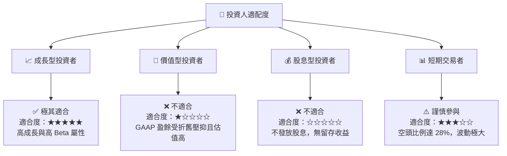

### 10.5 每季財報監控清單（Quarterly Watch List）

| 監控指標 | 基準值 (Q1 26) | 觸發加碼門檻 | 觸發減碼/警報門檻 | 監控邏輯與投資框架含義 |
|----------|----------------|--------------|-------------------|----------------------|
| **AI 營收 QoQ** | **+75.2%** | >40.0% | <15.0% | 反映 GPU 叢集交付與變現效率，低於 15% 說明需求放緩。 |
| **遞延收入 (Deferred Rev)**| **$686.0M** | >$850.0M | <$500.0M | 客戶預付款，是未來 1-2 季營收的「領先指標」。 |
| **營業折舊 D&A / 營收** | **53.1%** | <40.0% | >65.0% | 衡量重資產折舊對利潤的壓抑程度。 |
| **手頭現金餘額** | **$9.30B** | >$8.00B | <$4.00B | 充足的現金是採購 Blackwell 及維持 Capex 的關鍵。 |

### 10.6 反面論證：什麼會證明論點錯誤（What Would Change My Mind）

```
╔══════════════════════════════════════════════════════════════════╗
║              ⚠️ 論點失效條件（Disconfirming Evidence）           ║
╠══════════════════════════════════════════════════════════════════╣
║  本多頭投資論點在下列情況成立時應重新檢視或果斷退出：            ║
║  ☐ 核心 AI 雲營收年成長率（YoY）連續兩季低於 100%                ║
║  ☐ GPU 租賃單價在市場競爭下，較當前水平下滑超過 30%              ║
║  ☐ FCF 赤字持續擴大至單季 -$3.0B 以上，且手頭現金跌破 $3.0B       ║
║  ☐ ROIC 持續低於 WACC，且差距擴大至 -8pp 以上 (持續摧毀股東價值)  ║
║  ☐ NVIDIA 調整合作夥伴政策，NBIS 無法獲得 Blackwell 首批配額     ║
╚══════════════════════════════════════════════════════════════════╝
```

---

> **免責聲明**：本報告為 AI 自動生成，基於 2026-07-15 之前公開財務數據進行分析。本報告僅供研究參考，不構成任何投資建議。投資有風險，入市需謹慎。