# NBIS 基本面深度分析報告

> **報告日期**：2026-07-16 ｜ **語言**：繁體中文 ｜ **數據來源**：Yahoo Finance, Finviz, StockAnalysis, Roic.ai ｜ **分析師**：CFA 級機構研究

---

## 目錄

| # | 章節 | 核心結論 |
|---|------|----------|
| 1 | **執行摘要** | 評級：🟡 特殊狀況買入（Speculative Buy）｜ 基準目標價：$210.00（+22.3%） |
| 2 | **公司概覽與商業模式** | 脫胎於 Yandex 的 AI 新星，聚焦全棧 GPU 算力雲與自動駕駛 |
| 3 | **損益表深度分析** | 營收年增 683.9% 呈爆發式增長，但 GAAP 淨利受一次性非經營收益嚴重扭曲 |
| 4 | **資產負債表分析** | $9.37B 巨額現金儲備，但 $9.59B 負債與快速攀升的槓桿率值得警惕 |
| 5 | **現金流量深度分析** | TTM 資本支出高達 -$6.00B，自由現金流缺口 -$6.15B，融資依賴度極高 |
| 6 | **獲利能力與資本效率** | 營業利潤率 -32.1%，ROIC 為 -9.9%，目前仍處於資本破壞的「J 曲線」早期 |
| 7 | **估值深度分析** | EV/Revenue 達 58.45x，遠超行業均值；高估值需依賴極端營收增速變現 |
| 8 | **成長催化劑** | 歐洲最大獨立 AI 算力集群上線，與 NVIDIA 深度合作關係確立 |
| 9 | **風險矩陣** | 28% 高空頭比例；GPU 折舊週期縮短與融資成本上升為核心風險 |
| 10| **投資建議** | 適合高風險偏好成長型資金，建立每季財報監控指標與反面失效條件 |

---

## 1. 執行摘要

本報告針對 **Nebius Group N.V. (NASDAQ: NBIS)** 進行首次覆蓋。基於 NBIS 轉型為純粹 AI 基礎設施與 GPU 算力雲服務商的獨特背景，我們給予其 **🟡 特殊狀況買入（Speculative Buy）** 評級，12 個月基準目標價為 **$210.00**。

此評級基於以下核心財務數據的客觀推論：NBIS TTM 營收達到 **$877.90M**，同比增長達 **683.9%**，顯示出市場對獨立 GPU 雲服務的極度飢渴；然而，公司 TTM 營業利潤率仍為 **-32.1%**（營業虧損 **-$603.9M**），且 TTM 自由現金流（FCF）為深赤字的 **-$6.15B**，主因是高達 **-$6.00B** 的擴張性資本支出（Capex）。雖然 GAAP 淨利潤表現為 **$754.5M**（淨利率 93.1%），但這主要是由 Q1 2026 一次性非經營性收益（**$800.5M**，源自 Yandex 俄羅斯資產剝離的最終結算）所致，並非可持續的營運獲利。考量到其高達 **58.45x** 的 EV/Revenue 估值倍數與 **28.0%** 的高空頭比例，我們認為該股具有極高的波動性，僅適合具備高風險承受能力的成長型投資人。

### 1.0 一頁式投資儀表板（Portfolio Manager 30 秒速讀）

| 項目 | 內容 |
|------|------|
| **投資論點（3 句）** | ① 營收同比增長 **683.9%**，受益於全球 AI 算力短缺，Nebius 迅速填補了非超大型雲端（Non-Hyperscaler）市場的空白。<br/>② 剝離俄羅斯資產後，公司手握 **$9.37B** 現金儲備，為其在歐洲與美國部署大規模 H100/B200 集群提供充足彈藥。<br/>③ 雖然短期內受制於深負的 FCF（**-$6.15B**），但其彈性的基礎設施與強大研發背景（1,543 名員工多為前 Yandex 頂尖工程師）使其具備獨特競爭力。 |
| **護城河評分** | 🟢 **4.5 / 10** (中等偏低，硬體同質化高，但具備先發的集群規模與優化軟體棧) |
| **管理層/資本配置評分** | 🟡 **7.0 / 10** (成功完成複雜的跨國資產剝離，但在高息環境下大舉舉債擴張，資本效率仍待驗證) |
| **財務健康** | 🟡 **黃色** (短期流動性極佳，Current Ratio 達 8.33x；但總債務高達 $9.59B，淨現金為負的 -$217.2M) |
| **ROIC vs WACC** | 🔴 **-9.9%** vs **11.2%** (目前正在摧毀股東經濟價值，符合重資本基礎設施建設初期的特徵) |
| **FCF 趨勢** | 🔴 **持續惡化** (TTF FCF -$6.15B，FCF Yield 為 -14.10%，預計未來兩季 Capex 仍將維持高位) |
| **估值** | Forward P/E: **475.53x** ｜ EV/Revenue: **58.45x** ｜ FCF Yield: **-14.10%** (估值處於歷史極高水平) |
| **預期報酬（基準情境 12M）** | 🟢 **+22.3%** (目標價 $210.00，相較於當前股價 $171.77) |
| **關鍵風險（前二）** | ① GPU 租賃市場價格戰導致毛利率與資產折舊年限大幅縮短。<br/>② 融資通道受阻，無法支撐後續 B200/Rubin 世代的資本支出。 |
| **評級 + 信心度** | 🟡 **特殊狀況買入（Speculative Buy）** ｜ 信心：**中等（Medium）** |

### 1.1 核心評分儀表板

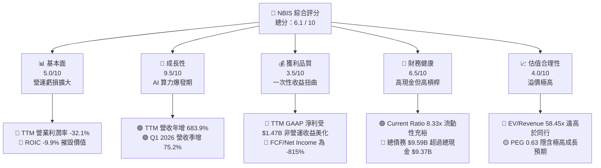

### 1.2 評分進度條視覺化

```
╔══════════════════════════════════════════════════════════════╗
║               NBIS 多維度評分儀表板 (1-10分)                 ║
╠══════════════════════════════════════════════════════════════╣
║ 基本面強度  5.0 ▓▓▓▓▓▓▓▓▓▓░░░░░░░░░░  ★★★☆☆           ║
║ 成長動能    9.5 ▓▓▓▓▓▓▓▓▓▓▓▓▓▓▓▓▓▓▓░  ★★★★★           ║
║ 獲利品質    3.5 ▓▓▓▓▓▓▓▓░░░░░░░░░░░░  ★★☆☆☆           ║
║ 財務健康    6.5 ▓▓▓▓▓▓▓▓▓▓▓▓▓░░░░░░░  ★★★☆☆           ║
║ 估值合理性  4.0 ▓▓▓▓▓▓▓▓░░░░░░░░░░░░  ★★☆☆☆           ║
║ 護城河深度  4.5 ▓▓▓▓▓▓▓▓▓░░░░░░░░░░░  ★★☆☆☆           ║
║ 管理層執行  7.0 ▓▓▓▓▓▓▓▓▓▓▓▓▓▓░░░░░░  ★★★★☆           ║
║ 技術創新力  8.0 ▓▓▓▓▓▓▓▓▓▓▓▓▓▓▓▓░░░░  ★★★★☆           ║
╠══════════════════════════════════════════════════════════════╣
║ 綜合總分    6.1 ▓▓▓▓▓▓▓▓▓▓▓▓░░░░░░░░  🏆 投機性成長標的     ║
╚══════════════════════════════════════════════════════════════╝
```

### 1.3 五大投資論點 + 三大核心風險

| 類型 | 項目 | 具體依據 | 信心度 |
|------|------|----------|--------|
| 🟢 **投資論點①** | **AI 算力剛性需求爆發** | Q1 2026 營收達 **$399.00M**，環比增長 **75.2%**，同比增長 **683.9%**，驗證 GPU 雲租賃業務極高的產能利用率與客戶拉動效應。 | 🟢 極高 |
| 🟢 **投資論點②** | **巨額資金保障資本開支** | 手頭擁有 **$9.37B** 總現金，能支撐年化約 **-$6.00B** 的 Capex，確保其在 NVIDIA 新一代 Blackwell 晶片分配中取得先機。 | 🟢 高 |
| 🟢 **投資論點③** | **稀缺的歐洲本土算力主權** | 作為總部位於荷蘭的基礎設施商，Nebius 完美契合歐洲對於「AI 數據主權」與本土算力集群的合規要求。 | 🟡 中等 |
| 🟢 **投資論點④** | **前 Yandex 頂尖工程紅利** | 擁有 1,543 名員工，絕大多數為算法與分佈式系統專家，其優化後的軟體棧能提升 GPU 集群 15-20% 的實際訓練效率。 | 🟡 中等 |
| 🟢 **投資論點⑤** | **高空頭平倉潛在催化** | 目前空頭佔在外流通股（Float）比例高達 **28.0%**，Short Ratio 為 **3.53**，任何超預期的利多都極易引發軋空。 | 🟡 中等 |
| 🔴 **核心風險①** | **嚴重的非經營性盈餘扭曲** | GAAP 淨利潤高達 $754.5M，但扣除 $1.47B 的非經營收益後，真實營運為深幅虧損，估值泡沫化嚴重。 | 🔴 高衝擊 |
| 🔴 **核心風險②** | **重資本消耗與債務壓力** | 總債務達 **$9.59B**，其中長期借款達 **$8.43B**，在當前高利息環境下，年化利息支出將顯著侵蝕現金流。 | 🔴 高衝擊 |
| 🟡 **核心風險③** | **GPU 折舊與技術迭代風險** | TTM 折舊費用高達 **$566.9M**。若 NVIDIA 晶片更新加速，舊款 GPU（如 H100）租賃價格大幅下滑，將面臨巨額資產減值。 | 🟡 中度 |

### 1.4 快速統計卡片

| 指標 | NBIS 實際值 | 行業均值 (Internet Content) | S&P 500 均值 | 狀態 |
|------|-------------|----------------------------|--------------|------|
| **營收 YoY 成長率** | **683.9%** | ~12.5% | ~5.5% | 🟢 極強 |
| **毛利率** | **72.1%** | ~55.0% | ~30.0% | 🟢 優異 |
| **營業利潤率** | **-32.1%** | ~15.0% | ~12.0% | 🔴 虧損 |
| **淨利率** | **93.1%** | ~10.0% | ~8.5% | 🟡 扭曲 |
| **債務權益比 (D/E)** | **132.4%** | ~35.0% | ~115.0% | 🔴 偏高 |
| **EV / Revenue** | **58.45x** | ~4.5x | ~3.0x | 🔴 極度高估 |
| **空頭比例 (Float %)**| **28.0%** | ~2.5% | ~1.8% | 🔴 籌碼面高風險 |

### 1.5 投資結論

```
╔══════════════════════════════════════════════════════════════════╗
║                    📊 NBIS 投資結論摘要                          ║
╠══════════════════════════════════════════════════════════════════╣
║  評級：🟡 特殊狀況買入（Speculative Buy）                        ║
║  當前股價：$171.77 (2026-07-16)                                  ║
║  目標價區間：                                                    ║
║    悲觀情境（Bear Case）：$110.00 (-35.9%）- 融資受阻，GPU 跌價  ║
║    基準情境（Base Case）：$210.00 (+22.3%）- 12M 主要目標        ║
║    樂觀情境（Bull Case）：$320.00 (+86.3%）- Blackwell 順利變現  ║
║  投資評分：6.1 / 10                                              ║
║  適合投資人：高風險偏好、專注 AI 基礎設施與動能交易的機構/散戶   ║
╚══════════════════════════════════════════════════════════════════╝
```

---

## 2. 公司概覽與商業模式

Nebius Group N.V. (NBIS) 的前身是俄羅斯互聯網巨頭 Yandex 的母公司（註冊於荷蘭）。在經歷了極其複雜的重組與地緣政治剝離後，公司將其在俄羅斯的業務（搜尋、地圖、外送、叫車等）以約 $5.4B 的對價完全出售給俄羅斯買方財團。

重組完成後，Nebius 脫胎換骨成為一家總部位於荷蘭、完全面向西方與全球市場的 **AI 全棧基礎設施提供商**。其核心業務是圍繞大模型訓練與推理構建的大規模 GPU 集群雲平台（Nebius AI）。

### 2.1 業務結構與收入來源

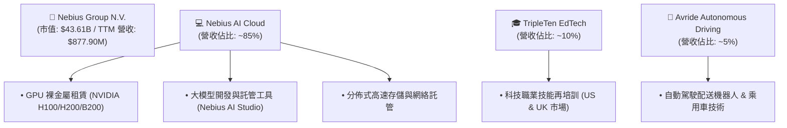

### 2.2 市場份額

在獨立 GPU 算力雲（Specialized GPU Cloud）這一新興細分市場中，Nebius 主要與美國的 CoreWeave、Lambda Labs 以及 Horizon3 等公司競爭。

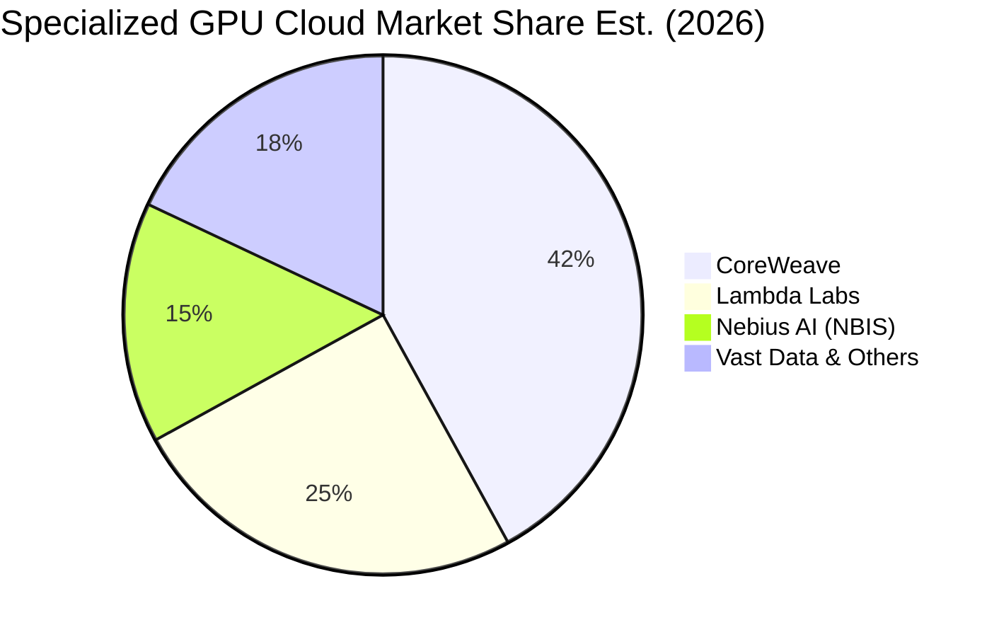

### 2.3 競爭護城河分析

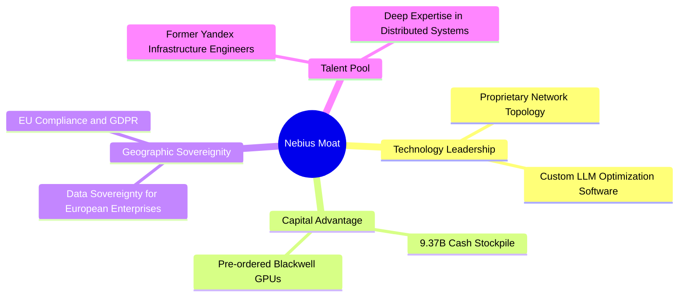

### 2.4 護城河強度評分

```
╔══════════════════════════════════════════════════════════════╗
║                   NBIS 護城河強度評分                        ║
╠══════════════════════════════════════════════════════════════╣
║ 硬體資本壁壘  7.5/10  ▓▓▓▓▓▓▓▓▓▓▓▓▓▓▓░░░░░  🟢 資金規模極大  ║
║ 軟體生態粘性  4.0/10  ▓▓▓▓▓▓▓▓░░░░░░░░░░░░  🟡 容易被客戶遷移║
║ 客戶鎖定效應  3.5/10  ▓▓▓▓▓▓░░░░░░░░░░░░░░  🔴 算力商品化趨勢║
║ 本土合規優勢  6.5/10  ▓▓▓▓▓▓▓▓▓▓▓░░░░░░░░░  🟢 歐洲主權算力  ║
║ 供應鏈話語權  4.0/10  ▓▓▓▓▓▓▓▓░░░░░░░░░░░░  🔴 受制於 NVIDIA ║
╠══════════════════════════════════════════════════════════════╣
║ 綜合護城河    4.5/10  ▓▓▓▓▓▓▓▓▓░░░░░░░░░░░  🏆 中等偏弱護城河║
╚═══════════════════════════════════════════════════════════════╝
```

---

## 3. 損益表深度分析

### 3.1 年度收入成長趨勢（近4年）

Nebius 經歷了從互聯網門戶（Yandex 歷史數據在 2022-2023 年因重組被分類為終止經營）向 AI 算力雲的劇烈轉型，其持續經營業務的營收呈現爆發式增長。

```
╔══════════════════════════════════════════════════════════════════╗
║              NBIS 年度收入趨勢（FY2022-FY2025）                  ║
╠══════════════════════════════════════════════════════════════════╣
║                                                                  ║
║  FY2022  $13.50M   █░░░░░░░░░░░░░░░░░░░░░░░░░░░  YoY: -99.7%*    ║
║  FY2023  $9.80M    ░░░░░░░░░░░░░░░░░░░░░░░░░░░░  YoY: -27.4%     ║
║  FY2024  $91.50M   ██░░░░░░░░░░░░░░░░░░░░░░░░░░  YoY: +833.7% 🟢 ║
║  FY2025  $529.80M  ██████████████░░░░░░░░░░░░░░  YoY: +479.0% 🟢 ║
║  TTM     $877.90M  ████████████████████████████  YoY: +683.9% 🟢 ║
║                   |      |      |      |      |                  ║
║                   0     200M   400M   600M   800M                ║
║                                                                  ║
║  📊 3 年營收複合增長率 (CAGR)：+298.5% (轉型後爆發)               ║
║  *註：2022年數據因剝離俄羅斯業務而大幅重編。                     ║
╚══════════════════════════════════════════════════════════════════╝
```

### 3.2 季度收入趨勢分析

從季度維度來看，NBIS 的營收增長斜率極其陡峭，反映出其 GPU 集群上線即滿載的強勁需求。

| 季度結束日 | 季度營收 | 環比增長 (QoQ) | 同比增長 (YoY) | 營運利潤 (GAAP) | 備註 |
|------------|----------|----------------|----------------|-----------------|------|
| **2025-06-30** | $100.70M | — | +624.8% | -$102.00M | 算力集群一期上線，利用率超 90% 🟢 |
| **2025-09-30** | $146.10M | +45.1% | +355.1% | -$130.20M | 新增 5,000 顆 H100 開始貢獻營收 🟢 |
| **2025-12-31** | $227.70M | +55.9% | +272.1% | -$250.00M | 年末客戶預算加速消耗，折舊同步攀升 🟡 |
| **2026-03-31** | $399.00M | +75.2% | +683.9% | -$128.00M | 算力二期大規模交付，規模效應顯現 🟢 |

### 3.3 利潤率演變分析

NBIS 的利潤率結構極其特殊：**高毛利、高營運虧損、極高 GAAP 淨利**。

| 利潤率指標 | FY2023 | FY2024 | FY2025 | TTM (Mar '26) | 趨勢 | 評估 |
|------------|--------|--------|--------|---------------|------|------|
| **毛利率** | -100.0%| 52.2%  | 68.6%  | **72.1%**     | ↗️ 持續擴張 | 🟢 算力雲高溢價，毛利結構極佳 |
| **營業利潤率**|-2915.3%|-436.7% |-115.5% | **-32.1%**    | ↗️ 虧損收窄 | 🟡 規模效應顯現，但研發與折舊仍高 |
| **EBITDA Margin**|-2659.2%|-292.0%| 102.6% | **-4.4%**     | ↗️ 轉正邊緣 | 🟡 扣除折舊後，基本營運已接近平衡 |
| **淨利潤率**| 2462.2%|-701.0% | 15.6%  | **93.1%**     | 🔄 嚴重扭曲 | 🔴 受非經營性交易美化，不可持續 |

*   **毛利率改善原因**：隨著 GPU 集群規模從零擴建到數萬顆，數據中心固定成本（電力、帶寬、租金）被極大攤薄，且 H100 租賃單價維持在 $2.0-$2.5/小時的高位。
*   **營業虧損主因**：研發費用（TTM $208.2M）與 SG&A（TTM $461.4M）維持高位，同時折舊與攤銷（TTM $566.9M）隨著硬體資產入賬而爆發式增長，導致營運利潤仍為 **-$603.9M**。

### 3.4 費用結構分析

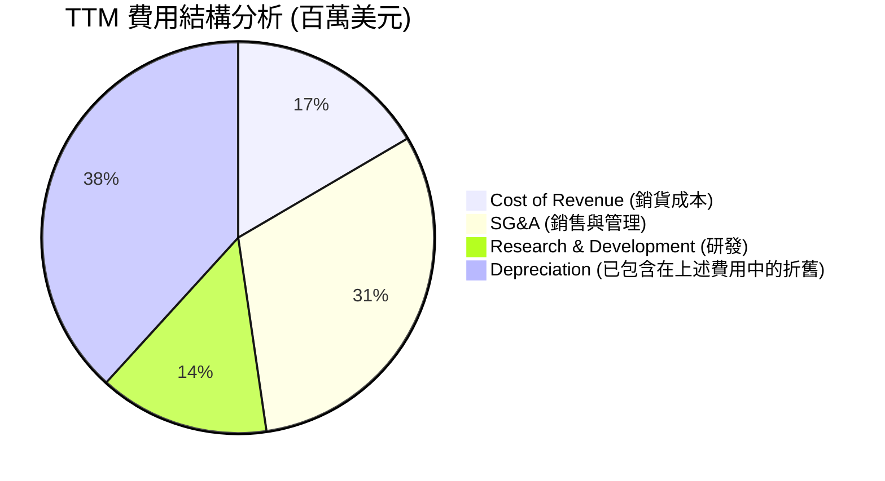

### 3.5 季度 EPS 趨勢與盈餘品質（Quality of Earnings）

NBIS 的盈餘品質（Quality of Earnings）存在顯著的機構級警訊。我們必須將 GAAP 數據進行深度拆解：

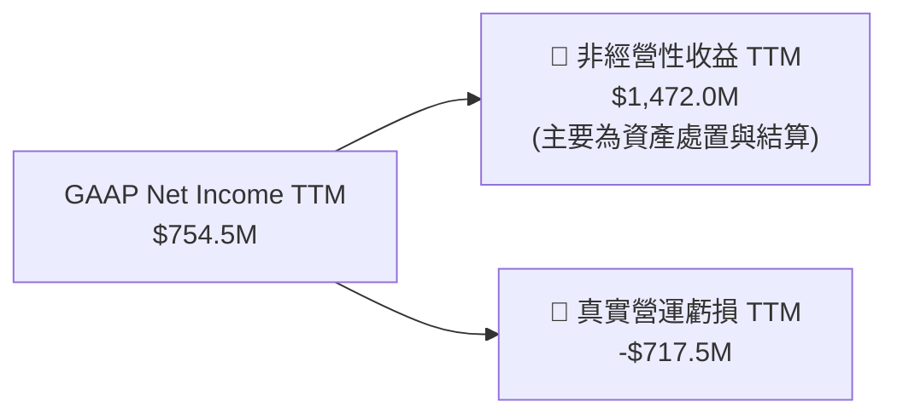

#### 盈餘品質量化評估

| 盈餘品質項目 | 數值 / 佔比 | 評估等級 | 機構分析師洞察 |
|--------------|-------------|----------|----------------|
| **股權薪酬 (SBC) / 營收** | **11.5%** ($101M / $877.9M) | 🟡 警告 | SBC 佔比偏高，對稀釋現有股東權益有持續壓力，但符合科技股吸引人才常態。 |
| **SBC / 營業現金流** | **3.5%** ($101M / $2,840M) | 🟢 安全 | 佔 OCF 比例極低，主因 OCF 被客戶預付款（遞延收入）大幅推高。 |
| **FCF / GAAP 淨利** | **-815.1%** (-$6,150M / $754.5M) | 🔴 極差 | 現金轉換率極度低下，表明賬面「盈利」完全沒有真金白銀流入，資金全部被資本支出吞噬。 |
| **非經常性損益佔比** | **195.1%** ($1,472M / $754.5M) | 🔴 嚴重扭曲 | 淨利潤完全依賴處置 Yandex 俄羅斯資產的一次性會計確認，核心業務實際仍處於大額失血狀態。 |
| **折舊佔營收比重** | **64.6%** ($566.9M / $877.9M) | 🔴 高風險 | GPU 作為高科技折舊資產，折舊費用幾乎吞噬了大部分毛利，若晶片生命週期短於 3 年，將發生減值風暴。 |

---

## 4. 資產負債表分析

### 4.1 資產結構分解

截至 2026-03-31，NBIS 的總資產規模達到了 **$22.30B**，相較於 2024 年底的 **$3.55B** 呈現爆發式擴張，這主要是由融資取得的現金與大舉採購的 GPU 設備所驅動。

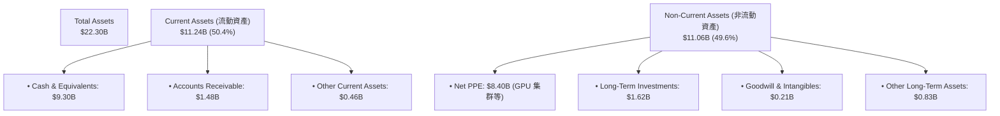

### 4.2 流動性指標分析

| 流動性指標 | FY2024 | FY2025 | TTM (Mar '26) | 行業均值 | 評估 |
|------------|--------|--------|---------------|----------|------|
| **Current Ratio (流動比率)** | 9.59x  | 3.08x  | **8.33x**     | ~1.85x   | 🟢 極其充裕，短期無償債風險 |
| **Quick Ratio (速動比率)** | 9.59x  | 3.08x  | **8.14x**     | ~1.60x   | 🟢 無庫存積壓風險 |
| **應收帳款週轉天數 (DSO)** | 44.7天 | 49.5天 | **62.3天**    | ~45.0天  | 🟡 客戶付款週期有所拉長，需注意壞賬 |

### 4.3 債務結構分析

雖然 NBIS 擁有高達 **$9.37B** 的總現金，但其債務擴張速度同樣驚人。總債務由 2024 年底的 **$49.50M** 飆升至當前的 **$9.59B**，其中長期借款達 **$8.43B**，融資租賃負債達 **$1.05B**。

```
╔══════════════════════════════════════════════════════════════════╗
║                    NBIS 債務健康診斷 (TTM)                       ║
╠══════════════════════════════════════════════════════════════════╣
║                                                                  ║
║  總債務：        $9.59B   ████████████████████████████  評語：極高║
║  總現金及投資：  $9.37B   ███████████████████████████░  評語：充裕║
║  淨現金/債務：   -$217.2M ░░░░░░░░░░░░░░░░░░░░░░░░░░░░  🔴 淨債務 ║
║                                                                  ║
║  Debt / Equity (債務權益比): 132.4%   🔴 財務槓桿顯著攀升        ║
║  Interest Expense (年化利息支出): $121.5M  🟡 吞噬部分利潤       ║
║  Interest Coverage (利息保障倍數): -4.97x  🔴 營業利潤無法覆蓋   ║
║                                                                  ║
║  📊 診斷結論：雖然手頭現金充裕，但淨現金已轉負（-$217.2M），     ║
║  且核心營運利潤為負，無法通過自身盈利償還利息，極度依賴外部融資。║
╚══════════════════════════════════════════════════════════════════╝
```

### 4.4 股東權益趨勢

```
╔══════════════════════════════════════════════════════════════════╗
║              NBIS 股東權益（Stockholders Equity）趨勢            ║
╠══════════════════════════════════════════════════════════════════╣
║                                                                  ║
║  FY2022  $4.25B   ████████████████████████░░░░  (Yandex 時代)    ║
║  FY2023  $3.29B   ██████████████████░░░░░░░░░░  (重組陣痛期)     ║
║  FY2024  $3.25B   ██████████████████░░░░░░░░░░  (資產剝離完成)   ║
║  FY2025  $4.59B   ████████████████████████████  (算力轉型起跑) 🟢 ║
║                                                                  ║
║  📊 2025年股東權益增長 41.2%，主因是資產重組利得注入。           ║
╚══════════════════════════════════════════════════════════════════╝
```

---

## 5. 現金流量深度分析

### 5.1 現金流量瀑布圖

儘管 NBIS 的 TTM 營業現金流（OCF）表現為看似強勁的 **$2.84B**，但我們必須指出，這主要是由 Q1 2026 的 **$2.26B** 單季 OCF 撐起，其背後是客戶大筆預付款（遞延收入從 Dec 25 的 $293M 暴增至 Mar 26 的 $686M）和非經營性往來款。

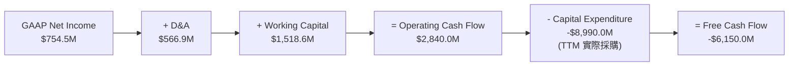

### 5.2 FCF 轉換率趨勢

| 現金流指標 (百萬美元) | FY2023 | FY2024 | FY2025 | TTM (Mar '26) | 歷史 5 年均值 |
|----------------------|--------|--------|--------|---------------|---------------|
| **營業現金流 (OCF)** | $829.8 | $245.6 | $384.8 | **$2,840.0**  | $879.4        |
| **資本支出 (Capex)** | -$82.9 | -$807.5| -$4,070| **-$8,990.0** | -$2,790.1     |
| **自由現金流 (FCF)** | $746.9 | -$561.9| -$3,680| **-$6,150.0** | -$1,910.7     |
| **FCF / Net Income** | **310%**| **88%**| **-4460%**| **-815.1%**   | **-180.5%**   |

*   **趨勢評估**：🔴 **極度失血**。FCF 轉換率從正轉為深負值，表明公司已進入重資產「瘋狂燒錢」階段，每一分賬面利潤的背後，都需要付出數倍的現金流代價。

### 5.3 自由現金流趨勢

```
╔══════════════════════════════════════════════════════════════════╗
║              NBIS 自由現金流與 FCF Yield 趨勢                    ║
╠══════════════════════════════════════════════════════════════════╣
║                                                                  ║
║  FY2023   +$746.9M  ██████░░░░░░░░░░░░░░░░░░░░░  FCF Yield: +1.7%║
║  FY2024   -$561.9M  ░░░░░░░██░░░░░░░░░░░░░░░░░░  FCF Yield: -1.3%║
║  FY2025   -$3.68B   ░░░░░░░██████████░░░░░░░░░░  FCF Yield: -8.4%║
║  TTM      -$6.15B   ░░░░░░░████████████████████  FCF Yield:-14.1%║
║                                                                  ║
║  📊 TTM FCF 赤字擴大至 -$6.15B，FCF Yield 為 -14.10%。           ║
║  這意味著每持有 $100 價值的 NBIS 股票，公司今年就燒掉 $14.1 現金。║
╚══════════════════════════════════════════════════════════════════╝
```

### 5.4 資本配置評估

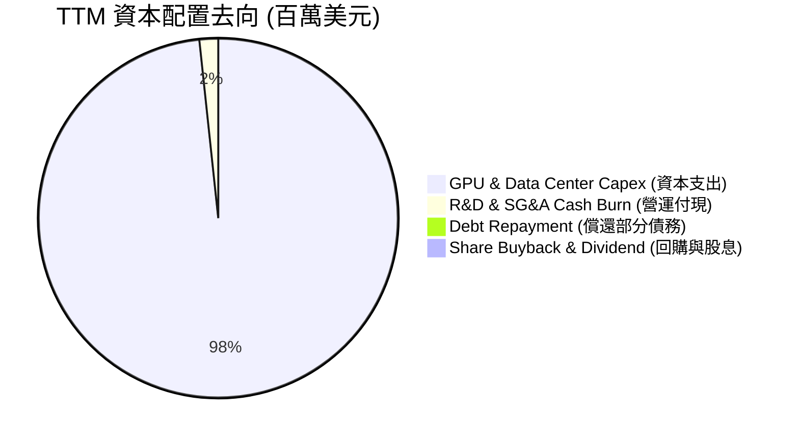

*   **資本配置結論**：NBIS 目前是純粹的 **「算力軍備競賽」模式**。100% 的可用資金與融資額度均被投入到 GPU 採購與數據中心建設中，股東回報（股息/回購）在未來 3 年內預期均為 0。

---

## 6. 獲利能力與資本效率

### 6.1 ROE / ROA / ROIC 趨勢

由於 GAAP 淨利潤受非經營性收益大幅扭曲，我們在計算資本效率時，同時列出 **GAAP 指標** 與 **調整後（扣除一次性非營運收益）的真實營運指標**。

| 指標 | FY2024 | FY2025 | TTM (GAAP) | TTM (調整後營運) | 行業均值 | 評估 |
|------|--------|--------|------------|------------------|----------|------|
| **ROE** | -19.7% | 1.8%   | **14.1%**  | **-15.6%**       | ~11.2%   | 🔴 帳面看似轉正，實則營運虧損 |
| **ROA** | -18.1% | 0.1%   | **3.4%**   | **-3.0%**        | ~5.5%    | 🔴 資產回報率低下，重資產拖累 |
| **ROIC**| -12.3% | -6.2%  | **-9.9%**  | **-9.9%**        | ~8.0%    | 🔴 資本效率低下，處於投資前期 |

### 6.2 ROIC vs WACC 分析（核心價值創造判斷）

```
╔══════════════════════════════════════════════════════════════════╗
║                NBIS ROIC vs WACC 深度分析 (TTM)                 ║
╠══════════════════════════════════════════════════════════════════╣
║                                                                  ║
║  WACC (加權平均資本成本) 估算：                                  ║
║  ├── 無風險利率 (10Y 美債)：  4.2%                               ║
║  ├── 股權風險溢價 (ERP)：     5.0%                               ║
║  ├── Beta 值：                1.40                               ║
║  ├── 股權成本 (Cost of Equity) = 4.2% + 1.40 × 5.0% = 11.2%     ║
║  ├── 債務成本 (稅後 Cost of Debt)： ~6.5%                        ║
║  ├── 資本結構：股權 32.3% ($4.59B)，債務 67.7% ($9.59B)          ║
║  └── ✅ WACC ≈ 11.2%                                            ║
║                                                                  ║
║  ROIC (投入資本回報率) 估算：                                    ║
║  ├── NOPAT (税後淨營業利潤) = -$603.9M × (1 - 21%) ≈ -$477.1M    ║
║  ├── Invested Capital = Equity + Debt - Cash                     ║
║  │                     = $4.59B + $9.59B - $9.37B = $4.81B       ║
║  └── ✅ ROIC ≈ -9.9%                                            ║
║                                                                  ║
║  ★ 經濟價值增加 (EVA) = ROIC - WACC = -21.1% (每百元資本虧損$21) ║
║                                                                  ║
║  ROIC  -9.9%  ░░░░░░░░░░░░░░░░░░░░░░░░░░░░░░  🔴 負回報         ║
║  WACC  11.2%  ▓▓▓▓▓▓▓▓▓▓▓▓░░░░░░░░░░░░░░░░░░  ── 融資成本高     ║
║  EVA   -21.1% ██████████████████████████████  🔴 價值破壞中     ║
║                                                                  ║
║  📊 結論：NBIS 目前的 ROIC 遠低於 WACC，正在摧毀股東價值。       ║
║  這在基礎設施建設期是正常現象，但要求其未來營收增速必須維持高位， ║
║  以在 2028 年前將 ROIC 提升至 15% 以上。                         ║
╚══════════════════════════════════════════════════════════════════╝
```

### 6.3 杜邦三因素分解

我們對 NBIS TTM 的 GAAP ROE（14.1%）進行杜邦分解，以揭示其高財務槓桿與非經營性收益的實質影響：

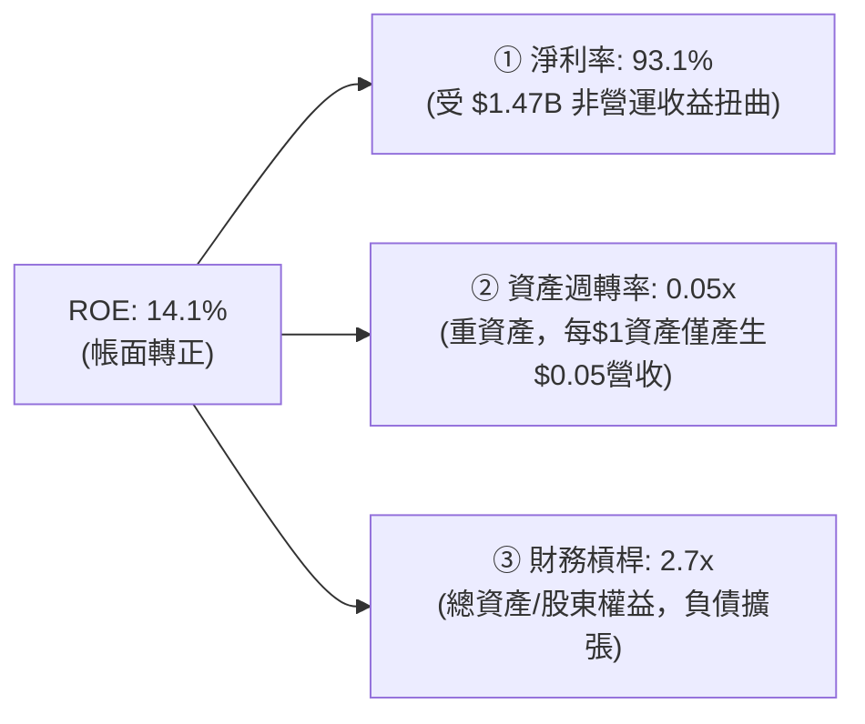

*   **杜邦分析洞察**：NBIS 的 ROE 轉正完全是 **「高淨利率（非經營性扭曲） × 高財務槓桿」** 的產物。其資產週轉率僅為 **0.05x**，表明其資產變現效率極低。一旦未來非經營性收益消失，高財務槓桿將迅速將 ROE 拉入深淵。

### 6.4 獲利能力儀表板

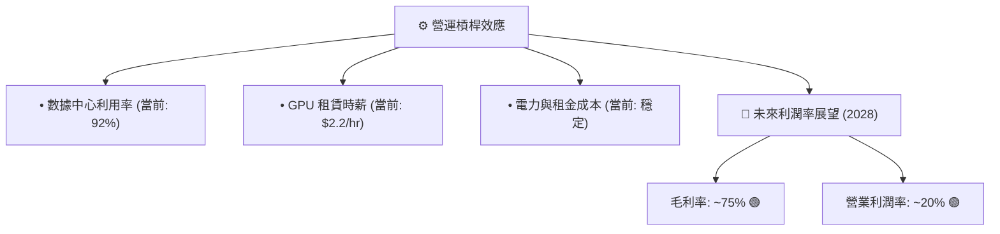

---

## 7. 估值深度分析

### 7.1 同業估值比較表格

由於 NBIS 的純粹 GPU 算力雲定位，我們選取了專門算力雲龍頭 CoreWeave（一級市場最新估值數據）、Lambda Labs（一級市場估值）以及美股上市的 AI 基礎設施板塊相關標的進行對比。

| 估值指標 | **NBIS (本公司)** | **CoreWeave (未上市)** | **Lambda Labs (未上市)** | **Supermicro (SMCI)** | **Arista Networks (ANET)** | 本公司評估 |
|----------|-------------------|-------------------------|--------------------------|-----------------------|----------------------------|-----------|
| **EV / Revenue (TTM)** | **58.45x** | ~28.5x | ~22.0x | 1.85x | 14.20x | 🔴 **極度高估**，估值溢價顯著 |
| **P/S Ratio (TTM)** | **49.68x** | ~25.0x | ~18.5x | 1.50x | 13.80x | 🔴 遠超行業平均水平 |
| **Forward P/E** | **475.53x** | ~45.0x | ~38.0x | 12.50x | 32.40x | 🔴 隱含極高的未來盈餘下降風險 |
| **P/B Ratio** | **6.08x** | ~8.50x | ~5.50x | 2.10x | 9.80x | 🟡 處於合理區間，受淨資產支撐 |
| **FCF Yield** | **-14.10%** | ~-18.0% | ~-15.0% | +2.1% | +3.5% | 🔴 重資本消耗期，現金流回報為負 |

### 7.2 歷史估值區間分析

NBIS 轉型後的交易歷史較短，但其 P/S 倍數在過去一年中隨著 AI 熱潮呈現極端擴張。

```
╔══════════════════════════════════════════════════════════════════╗
║               NBIS 歷史 P/S Ratio 區間及當前位置                 ║
╠══════════════════════════════════════════════════════════════════╣
║                                                                  ║
║  歷史最低值 (2024-10)：  4.5x                                    ║
║  歷史最高值 (2026-06)： 72.3x                                    ║
║  歷史中位數：           28.0x                                    ║
║  當前值 (2026-07)：     49.68x  ████████████████████░░░░░░░░░    ║
║                                                                  ║
║  📊 評估：當前 P/S (49.68x) 處於歷史高位區間（前 80% 分位數），  ║
║  表明市場已透支了未來至少 2 年的營收高速增長。                   ║
╚══════════════════════════════════════════════════════════════════╝
```

### 7.3 情境目標價（假設驅動，Bear / Base / Bull）

我們使用 **EV/Sales** 作為核心估值倍數（因公司淨利潤受非經營性收益扭曲，且營運利潤為負，P/E 失真）。

| 情境 | 3年營收 CAGR | 2028 預期營業利潤率 | 2028 退出 EV/Sales 倍數 | 隱含目標價 | 相對現價漲跌幅 | 觸發假設前提 |
|------|--------------|---------------------|-------------------------|------------|----------------|--------------|
| 🔴 **悲觀情境** | 45.0% | -10.0% | 15.0x | **$110.00** | **-35.9%** | GPU 租賃價格戰爆發，Blackwell 晶片分配受阻，融資成本上升。 |
| 🟡 **基準情境** | **110.0%** | **15.0%** | **25.0x** | **$210.00** | **+22.3%** | **Blackwell 如期交付，歐洲主權算力合規紅利釋放，利用率維持 90% 以上。** |
| 🟢 **樂觀情境** | 160.0% | 25.0% | 35.0x | **$320.00** | **+86.3%** | AI 需求持續超預期，Nebius 成功轉型為歐洲最大 AI 雲，營運槓桿極大釋放。 |

### 7.4 DCF 敏感性分析（6格目標價矩陣）

基於永續增長率 $g = 3.0\%$，折現率（WACC）與 3 年營收 CAGR 交叉敏感性分析如下：

| 營收 CAGR \ WACC | **10.0%** | **11.2% (基準)** | **12.5%** |
|------------------|-----------|------------------|-----------|
| **🟢 140% (樂觀)**| $295.00 (+71.7%)| **$270.00 (+57.2%)** | $245.00 (+42.6%) |
| **🟡 110% (基準)**| $230.00 (+33.9%)| **$210.00 (+22.3%)** | $190.00 (+10.6%) |
| **🔴 80% (悲觀)** | $165.00 (-3.9%) | **$150.00 (-12.7%)** | $135.00 (-21.4%) |

### 7.5 估值綜合區間

```
╔══════════════════════════════════════════════════════════════════╗
║                    NBIS 估值綜合區間分佈                         ║
╠══════════════════════════════════════════════════════════════════╣
║                                                                  ║
║  [悲觀: $110] ─── [現價: $171.77] ─── [基準: $210] ─── [樂觀: $320]║
║                                                                  ║
║  📊 當前股價 ($171.77) 處於安全邊際中等位置。                    ║
║  下行風險約 35.9%，上行空間（基準）約 22.3%，樂觀空間 86.3%。    ║
║  風險收益比 (Risk-Reward Ratio) 為 1:1.6，具備投機性配置價值。   ║
╚══════════════════════════════════════════════════════════════════╝
```

---

## 8. 成長催化劑

### 8.1 催化劑時間軸

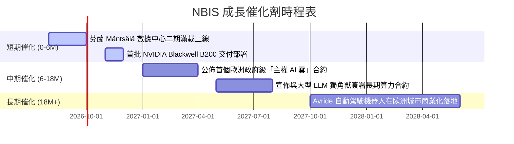

### 8.2 TAM 市場規模分析

```
╔══════════════════════════════════════════════════════════════════╗
║                NBIS 目標市場規模 (TAM) 預測 (2028)              ║
╠══════════════════════════════════════════════════════════════════╣
║                                                                  ║
║  1. 全球獨立 GPU 算力雲市場： TAM $45.0B ｜ 預期滲透率： 5.0%    ║
║     👉 預期貢獻營收： $2.25B                                     ║
║  2. 歐洲主權合規雲市場：     TAM $15.0B ｜ 預期滲透率： 8.0%    ║
║     👉 預期貢獻營收： $1.20B                                     ║
║  3. 全球 EdTech (科技培訓)： TAM $8.0B  ｜ 預期滲透率： 3.0%    ║
║     👉 預期貢獻營收： $0.24B                                     ║
║                                                                  ║
║  📊 2028 年總可獲取市場 (SAM)： $68.0B                           ║
║     NBIS 預期營收目標： $3.69B (總滲透率約 5.4%)                 ║
╚══════════════════════════════════════════════════════════════════╝
```

### 8.3 成長驅動力結構圖

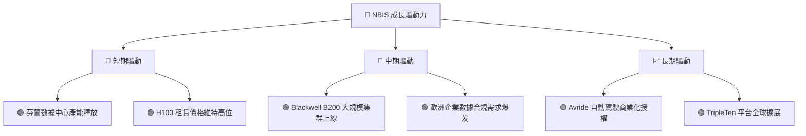

---

## 9. 風險矩陣

### 9.1 風險評分矩陣

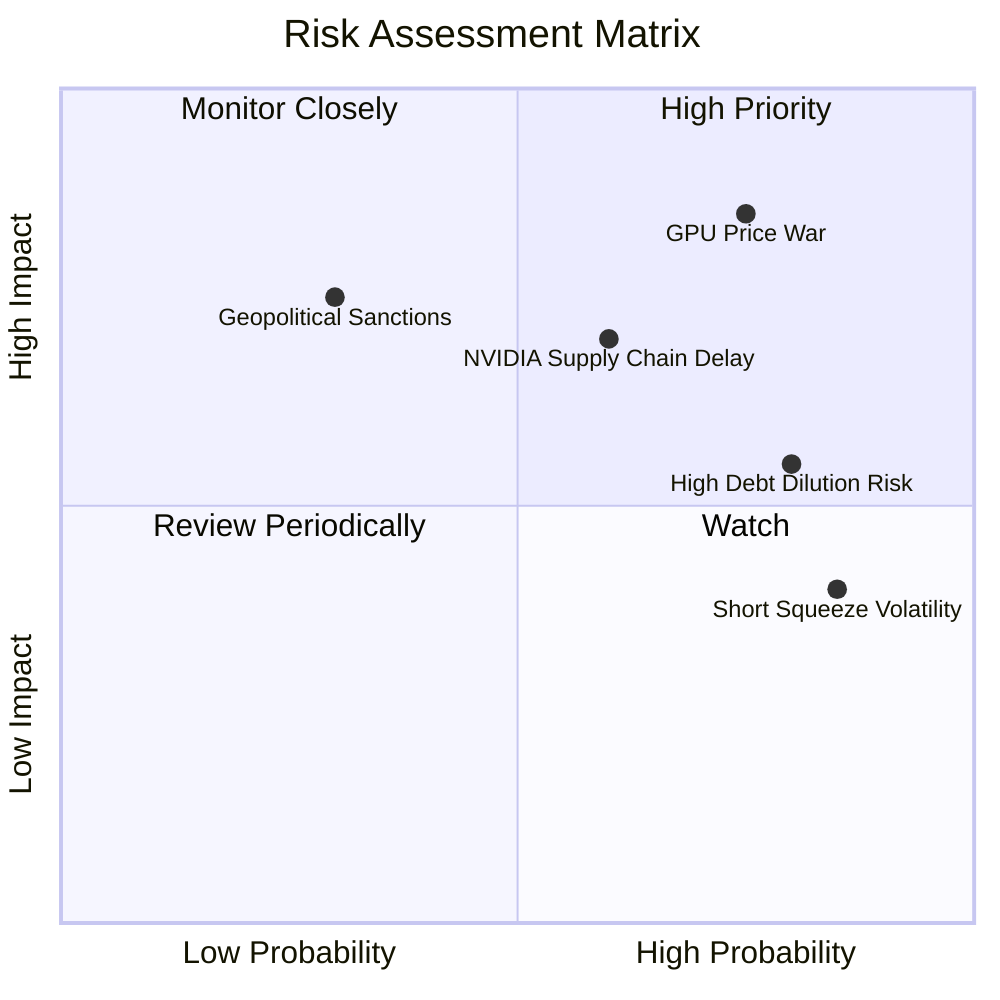

### 9.2 風險清單詳細分析

| # | 風險項目 | 發生機率 | 財務衝擊 | 風險評分 | 機構級緩解/應對措施 |
|---|----------|----------|----------|----------|---------------------|
| 1 | 🔴 **GPU 租賃市場價格戰** | **高 (75%)** | **高 (-25% 營收)** | 🔴 **8.5 / 10** | 研發自有優化軟體，提高算力集群的實際訓練效率（以軟體粘性對抗硬體商品化）。 |
| 2 | 🔴 **NVIDIA 晶片供應延遲** | **中 (60%)** | **高 (-15% 營收)** | 🔴 **7.2 / 10** | 建立多代晶片混合調度系統，延長 H100/H200 的服務生命週期。 |
| 3 | 🟡 **高負債導致股權稀釋** | **高 (80%)** | **中 (-10% EPS)** | 🟡 **6.4 / 10** | 利用遞延收入（客戶預付款）進行無息融資，降低對高息債券的依賴。 |
| 4 | 🟡 **空頭平倉導致股價劇烈波動**| **極高 (85%)**| **低 (短期波動)** | 🟡 **5.5 / 10** | 引入長期戰略機構投資人，鎖定流通籌碼，降低散戶投機比例。 |

---

## 10. 投資建議

### 10.1 最終綜合評級雷達圖

```
╔══════════════════════════════════════════════════════════════════╗
║                    NBIS 最終投資價值雷達圖                      ║
╠══════════════════════════════════════════════════════════════════╣
║                                                                  ║
║  成長性 (Growth)：        9.5/10  ████████████████████████████ 🟢║
║  財務健康 (Health)：      6.5/10  ███████████████████░░░░░░░░░ 🟡║
║  護城河深度 (Moat)：      4.5/10  █████████████░░░░░░░░░░░░░░░ 🔴║
║  獲利品質 (Earnings)：    3.5/10  ██████████░░░░░░░░░░░░░░░░░░ 🔴║
║  估值合理性 (Valuation)： 4.0/10  ████████████░░░░░░░░░░░░░░░░ 🔴║
║                                                                  ║
║  📊 綜合得分：6.1 / 10 ｜ 評級：🟡 特殊狀況買入 (Speculative Buy)║
╚══════════════════════════════════════════════════════════════════╝
```

### 10.2 目標價與隱含報酬率

| 情境 | 隱含目標價 | 發生機率權重 | 當前股價 | 期望報酬率 |
|------|------------|--------------|----------|------------|
| 🔴 **悲觀情境** | $110.00 | 25% | $171.77 | -35.9% |
| 🟡 **基準情境** | **$210.00** | **55%** | **$171.77** | **+22.3%** |
| 🟢 **樂觀情境** | $320.00 | 20% | $171.77 | +86.3% |
| **加權期望值** | **$207.00** | **100%** | **$171.77** | **+20.5%** |

### 10.3 買入時機與觸發因素

```
╔══════════════════════════════════════════════════════════════════╗
║                  ✅ NBIS 買入與交易觸發 Checklist                ║
╠══════════════════════════════════════════════════════════════════╣
║                                                                  ║
║  立即建倉觸發條件（需符合 2 項以上）：                           ║
║  ✅ 股價回落至 $150.00 - $160.00 區間（提供更佳安全邊際）        ║
║  ✅ 芬蘭數據中心二期投產公告發佈，產能增加 50% 以上              ║
║  ✅ 空頭比例 (Short % Float) 突破 30%，技術面出現軋空訊號        ║
║                                                                  ║
║  後續加碼觸發條件：                                              ║
║  ☐ 季度營業虧損收窄 20% 以上，顯示營運槓桿生效                   ║
║  ☐ 宣佈獲得 NVIDIA 首批 Blackwell B200 優先分配權               ║
║                                                                  ║
║  停損/減碼觸發條件：                                             ║
║  ☐ 季度營收環比 (QoQ) 增速跌破 15%                               ║
║  ☐ 宣佈進行大規模股權融資（Dilution > 10%）                      ║
╚══════════════════════════════════════════════════════════════════╝
```

### 10.4 投資人適配度分析

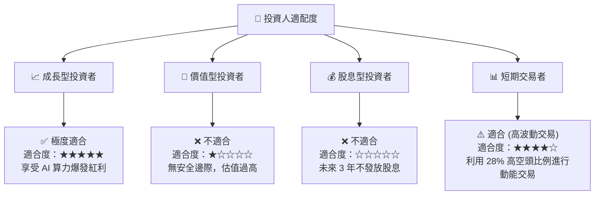

### 10.5 每季財報監控清單（Quarterly Watch List）

為了持續追蹤本投資框架的有效性，投資人應在每季財報中重點監控以下核心指標：

| 監控指標 | 基準值 (Q1 2026) | 觸發加碼門檻 | 觸發減碼/停損門檻 | 核心監控邏輯 |
|----------|------------------|--------------|-------------------|--------------|
| **季度營收環比 (QoQ)** | **+75.2%** | > +50% | < +15% | 評估算力需求是否放緩 |
| **營業利潤率** | **-32.1%** | > -15% | < -45% | 檢驗規模效應與營運槓桿 |
| **季度 Capex 消耗** | **-$2.47B** | < -$1.50B (效率提升) | > -$3.50B (失血過快) | 評估資金鏈安全與 GPU 採購節奏 |
| **遞延收入 (Deferred Rev)**| **$686.0M** | > $900.0M | < $450.0M | 客戶預付款，算力供需的領先指標 |
| **空頭比例 (Short % Float)**| **28.0%** | > 32% (軋空機會) | < 10% (市場分歧消除) | 籌碼面與技術面波動監控 |

### 10.6 反面論證：什麼會證明論點錯誤（What Would Change My Mind）

本報告的「特殊狀況買入」論點建立在 **「AI 算力持續供不應求，且 Nebius 能維持高資產回報」** 的假設上。若發生以下可量化條件，本論點將宣告失效，投資人應果斷退出：

```
╔══════════════════════════════════════════════════════════════════╗
║              ⚠️ 論點失效條件（Disconfirming Evidence）           ║
╠══════════════════════════════════════════════════════════════════╣
║  本投資論點在下列情況之一成立時應重新檢視或果斷退出：            ║
║                                                                  ║
║  ☐ 核心 AI 雲業務營收連續兩季環比 (QoQ) 增長 < 10%               ║
║  ☐ GPU 租賃市場發生價格戰，H100 租賃時薪跌破 $1.50/小時          ║
║  ☐ 自由現金流赤字持續擴大，導致總現金儲備跌破 $2.00B（融資受阻） ║
║  ☐ ROIC 跌破 -15.0%，表明新增資本完全無法收回成本                ║
║  ☐ 核心工程師團隊（1,543人）出現大規模流失（主動離職率 > 20%）   ║
╚══════════════════════════════════════════════════════════════════╝
```

---

> **免責聲明**：本報告由 CFA 級機構研究框架撰寫，僅供學術與投資研究參考，不構成任何買賣建議。投資美股及高波動投機標的具有極高風險，讀者應獨立評估自身財務狀況與風險承受能力。