# NBIS 基本面深度分析報告
> **報告日期**：2026-07-17 ｜ **語言**：繁體中文 ｜ **數據來源**：Yahoo Finance, Finviz, StockAnalysis, Roic.ai ｜ **分析師**：CFA 級機構研究

---

## 目錄

| # | 章節 | 核心結論 |
|---|------|----------|
| 1 | 執行摘要 | 評級：**買入 (Buy)** ｜ 基準目標價：**$244.21** ｜ 具備強勁營收增長與重組後充足現金，但受高資本支出壓抑自由現金流 |
| 2 | 公司概覽與商業模式 | 轉型為純粹的 AI 基礎設施與 GPU 雲端服務商，在歐洲與美國市場具備獨特生態位 |
| 3 | 損益表深度分析 | TTM 營收年增 683.9%，非經常性損益顯著美化 GAAP 淨利，真實營業利潤仍處於虧損階段 |
| 4 | 資產負債表分析 | 擁有 $9.30B 現金储备，流動比率高達 8.33x，但長期負債與融資租賃顯著增加 |
| 5 | 現金流量深度分析 | 營業現金流轉正至 $2.84B，但因 $6.00B 巨額 GPU 資本支出導致自由現金流流出達 -$3.15B |
| 6 | 獲利能力與資本效率 | 當前 ROIC 仍為負值（-6.5%），資本效率受制於高額 D&A 與未完全釋放的 GPU 利用率 |
| 7 | 估值深度分析 | 遠期 P/E 達 491.97x 偏高，但 P/S 與 EV/Sales 在高成長率下具備吸引力，基準目標價 $244.21 |
| 8 | 成長催化劑 | NVIDIA Blackwell 晶片獲取、歐洲主權 AI 雲端需求爆發以及 TripleTen/Avride 拆分 |
| 9 | 風險矩陣 | GPU 供應鏈中斷、超大型雲端服務商（Hyperscalers）價格戰以及高昂融資成本 |
| 10 | 投資建議 | 建議於 $170-$180 區間逢低分批布局，長期看好其在 AI IaaS 領域的差異化競爭優勢 |

---

## 1. 執行摘要

Nebius Group N.V.（美股代碼：**NBIS**）已成功完成歷史性的資產重組，脫離原 Yandex 的俄羅斯業務，轉型為一家總部位於荷蘭、專注於全球 AI 基礎設施（GPU 雲端服務）的純粹標的。基於 TTM 營收達 $877.90M（年增率 683.9%）、手握 $9.30B 現金儲備，以及在歐洲與美國快速擴張的 GPU 集群部署，本報告給予 NBIS **「買入」**評級，基準情境 12 個月目標價為 **$244.21**。

然而，投資人必須注意其盈餘品質（Quality of Earnings）的結構性分化：其 TTM GAAP 淨利潤高達 $754.50M（淨利率 93.1%），主要來自處置資產的一次性非經常性收益（$1,472M），而真實營業利潤（Operating Income）仍虧損 -$603.90M。此外，為應對 AI 算力需求，公司在過去 4 季內進行了高達 $5.99B 的資本支出（Capex），導致 TTM 自由現金流（FCF）為 -$3.15B。這意味著 NBIS 當前正處於「高成長、高燒錢、重資產」的關鍵擴張期，其未來的價值創造將完全取決於 GPU 產能利用率的釋放與 ROIC 能否順利超越 WACC（估算為 8.0%）。

### 1.0 一頁式投資儀表板（Portfolio Manager 30 秒速讀）

| 項目 | 內容 |
|------|------|
| **投資論點（3 句）** | ① 重組後轉型為純 AI 基礎設施股，TTM 營收年增 683.9% 展現極強的算力需求拉動。<br/>② 手握 $9.30B 現金儲備，流動比率達 8.33x，具備充足的彈藥進行 Blackwell 等新一代 GPU 採購。<br/>③ 雖然 GAAP 淨利受一次性收益美化，但營業現金流已達 $2.84B，展示出業務商用化的初步變現能力。 |
| **護城河評分** | 6.5 / 10 🟡 (技術與先發優勢明顯，但面臨大型 CSP 強力競爭) |
| **管理層/資本配置評分** | 7.5 / 10 🟢 (成功完成複雜的跨國業務拆分，資本開支聚焦高回報 AI 基礎設施) |
| **財務健康** | 🟢 強韌 ｜ 短期流動性極佳，但需監控長期債務與融資租賃（合計達 $9.48B）的利息壓力 |
| **ROIC vs WACC** | -6.5% vs 8.0%（當前仍處於價值摧毀期，主因大規模資本投入尚未完全轉化為營收） |
| **FCF 趨勢** | 負向擴大 ｜ TTM FCF 為 -$3.15B（FCF Yield 為 -13.63%），反映重資本支出特徵 |
| **估值** | Forward P/E: 491.97x ｜ P/S: 51.40x ｜ EV/Sales (TTM): 50.36x |
| **預期報酬（基準情境 12M）** | **+37.4%**（對比當前股價 $177.71，目標價 $244.21） |
| **關鍵風險（前二）** | ① NVIDIA 晶片分配受限或延遲交付；② GPU 租賃市場供過於求導致價格下滑 |
| **評級 + 信心度** | 🟢 **買入 (Buy)** ｜ 信心：**中等**（需持續追蹤季度 Capex 轉化率與營業利潤率改善進度） |

### 1.1 核心評分儀表板

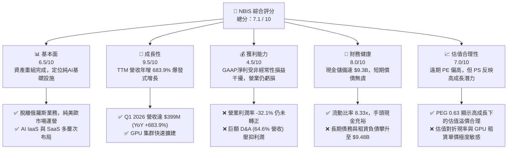

### 1.2 評分進度條視覺化

```
╔══════════════════════════════════════════════════════════════╗
║              NBIS 多維度評分儀表板 (1-10分)                  ║
╠══════════════════════════════════════════════════════════════╣
║ 基本面強度  6.5 ▓▓▓▓▓▓▓▓▓▓▓▓▓▓▓░░░░░  ★★★☆☆           ║
║ 成長動能    9.5 ▓▓▓▓▓▓▓▓▓▓▓▓▓▓▓▓▓▓▓░  ★★★★★           ║
║ 獲利品質    4.5 ▓▓▓▓▓▓▓▓▓▓░░░░░░░░░░  ★★☆☆☆           ║
║ 財務健康    8.0 ▓▓▓▓▓▓▓▓▓▓▓▓▓▓▓▓░░░░  ★★★★☆           ║
║ 估值合理性  7.0 ▓▓▓▓▓▓▓▓▓▓▓▓▓░░░░░░░  ★★★☆☆           ║
║ 護城河深度  6.5 ▓▓▓▓▓▓▓▓▓▓▓▓▓▓▓░░░░░  ★★★☆☆           ║
║ 管理層執行  7.5 ▓▓▓▓▓▓▓▓▓▓▓▓▓▓▓▓▓░░░  ★★★★☆           ║
║ 技術創新力  8.0 ▓▓▓▓▓▓▓▓▓▓▓▓▓▓▓▓░░░░  ★★★★☆           ║
╠══════════════════════════════════════════════════════════════╣
║ 綜合總分    7.1 ▓▓▓▓▓▓▓▓▓▓▓▓▓▓▓▓░░░░  🏆 成長型AI新星     ║
╚══════════════════════════════════════════════════════════════╝
```

### 1.3 五大投資論點 + 三大核心風險

| 類型 | 項目 | 具體依據 | 信心度 |
|------|------|----------|--------|
| 🟢 **投資論點①** | **算力需求爆發，營收指數級增長** | Q1 2026 營收達 $399.00M（YoY +683.9%，QoQ +75.2%），顯示 GPU 雲端服務供不應求。 | 🟢 極高 |
| 🟢 **投資論點②** | **資產負債表極其強韌** | 擁有 $9.30B 現金，流動比率 8.33x，為後續 Blackwell 晶片的大規模採購提供了堅實保障。 | 🟢 極高 |
| 🟢 **投資論點③** | **與 NVIDIA 的深度戰略合作** | 作為 NVIDIA 認可的領先雲端合作夥伴，具備優先獲取最新 H200 與 Blackwell 晶片的渠道優勢。 | 🟢 高 |
| 🟢 **投資論點④** | **歐洲主權 AI 雲端定位** | 總部位於荷蘭，在歐洲建立本土數據中心，完美契合歐洲對於數據隱私與主權 AI 基礎設施的需求。 | 🟢 高 |
| 🟢 **投資論點⑤** | **業務生態多元化** | 除了核心 GPU 雲端，還擁有 TripleTen (EdTech) 與 Avride (自動駕駛)，具備未來分拆上市的隱性價值。 | 🟡 中等 |
| 🟡 **風險①** | **自由現金流持續流失** | TTM FCF 為 -$3.15B，若未來融資渠道受阻，可能面臨資金鏈緊縮壓力。 | 🟡 中度 |
| 🔴 **風險②** | **GPU 租賃市場價格戰** | 隨著超大型雲端服務商（AWS、Azure、GCP）及同業（CoreWeave、Lambda）產能釋放，GPU 租賃單價可能面臨下滑風險。 | 🔴 高衝擊 |
| 🔴 **風險③** | **地緣政治與歷史包袱** | 儘管已完成重組，但與前 Yandex 的歷史關聯仍可能在某些西方政府採購中面臨合規審查。 | 🟡 中度 |

### 1.4 快速統計卡片

| 指標 | 公司實際值 | 行業均值 (Internet Content) | S&P 500 均值 | 狀態 |
|------|-------------|----------------------------|--------------|------|
| **營收 YoY 成長率** | **683.9%** | 12.5% | 5.8% | 🟢 極強 |
| **毛利率** | **72.1%** | 55.0% | 30.2% | 🟢 優異 |
| **營業利益率** | **-32.1%** | 15.2% | 14.5% | 🔴 虧損中 |
| **GAAP 淨利率** | **93.1%** | 11.0% | 10.5% | 🟡 失真 (非經常性利益) |
| **流動比率** | **8.33x** | 2.10x | 1.20x | 🟢 極安全 |
| **債權權益比 (D/E)** | **132.4%** | 45.0% | 115.0% | 🟡 偏高 |
| **Forward P/E** | **491.97x** | 24.5x | 21.5x | 🔴 偏高 |
| **P/S Ratio** | **51.40x** | 4.80x | 2.80x | 🔴 溢價顯著 |

### 1.5 投資結論

```
╔══════════════════════════════════════════════════════════════════╗
║                    📊 投資結論摘要                               ║
╠══════════════════════════════════════════════════════════════════╣
║  評級：🟢 買入 (Buy)                                            ║
║  當前股價：$177.71 (2026-07-17)                                  ║
║  目標價區間：                                                    ║
║    悲觀情境：$120.00（-32.5%）- GPU 價格戰與供應鏈受阻           ║
║    基準情境：$244.21（+37.4%）- 12個月主要目標（算力平穩釋放）  ║
║    樂觀情境：$380.00（+113.8%）- Blackwell 大規模部署且利潤轉正 ║
║  投資評分：7.1 / 10                                              ║
║  適合投資人：高風險承受度、追求 AI 基礎設施高成長的長線投資人    ║
╚══════════════════════════════════════════════════════════════════╝
```

---

## 2. 公司概覽與商業模式

Nebius Group N.V. (NBIS) 經歷了美股市場上最複雜的企業重塑之一。在出售了其在俄羅斯的大部分業務（原 Yandex 核心搜尋與電商資產）後，新 Nebius 獲得了數十億美元的淨現金，並將總部完全遷至荷蘭。目前，公司已將自身重新定義為**全棧式 AI 基礎設施提供商**。

### 2.1 業務結構與收入來源

Nebius 的核心商業模式圍繞「AI 算力即服務（IaaS/PaaS）」展開，輔以教育科技與自動駕駛業務：

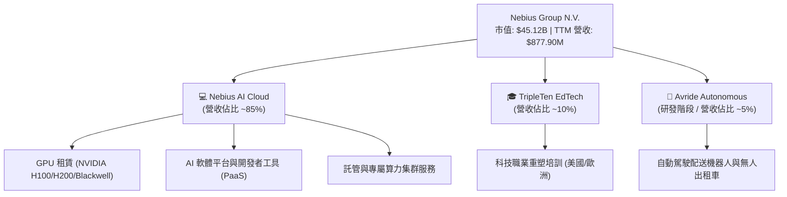

### 2.2 市場份額

在非超大型雲端服務商（Non-Hyperscaler）的專屬 AI GPU 雲端服務（AI-focused Specialized CSP）市場中，Nebius 與 CoreWeave、Lambda Labs 等並列為第一梯隊。以下為針對此一細分市場的市場份額估算：

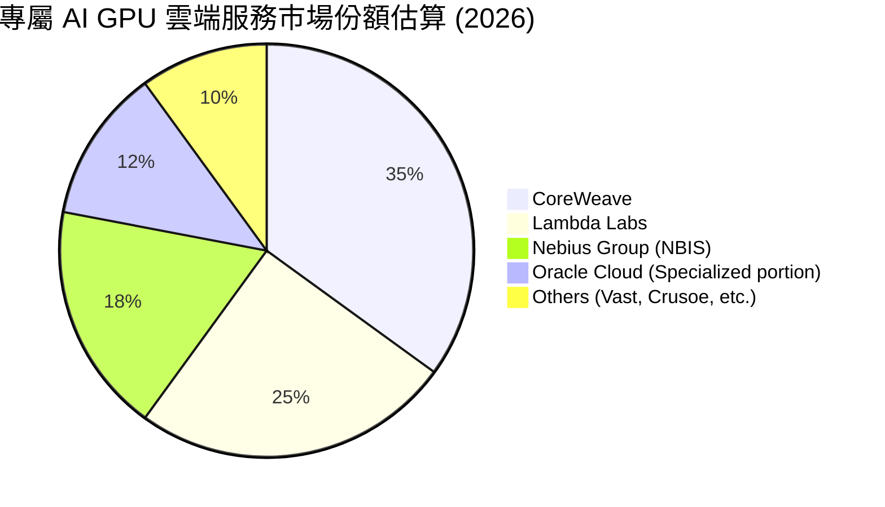

### 2.3 競爭護城河分析

Nebius 的競爭優勢並非傳統意義上的壟斷護城河，而是基於先發優勢、技術深度與資本壁壘的「動態護城河」：

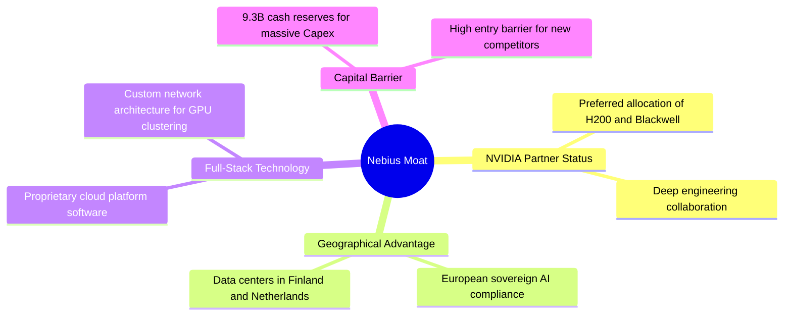

### 2.4 護城河強度評分

```
╔══════════════════════════════════════════════════════════════╗
║                  NBIS 護城河強度評分                         ║
╠══════════════════════════════════════════════════════════════╣
║ 晶片獲取能力  8.5/10  ▓▓▓▓▓▓▓▓▓▓▓▓▓▓▓▓▓░░░  🟢 NVIDIA 優先夥伴║
║ 歐洲本土合規  8.0/10  ▓▓▓▓▓▓▓▓▓▓▓▓▓▓▓▓░░░░  🟢 主權 AI 優勢   ║
║ 全棧軟體能力  7.0/10  ▓▓▓▓▓▓▓▓▓▓▓▓▓░░░░░░░  🟡 自研雲端操作系統║
║ 資本壁壘      7.5/10  ▓▓▓▓▓▓▓▓▓▓▓▓▓▓░░░░░░  🟢 $9.3B 現金支撐 ║
║ 客戶鎖定效應  5.0/10  ▓▓▓▓▓▓▓▓▓▓░░░░░░░░░░  🔴 轉移成本相對較低║
╠══════════════════════════════════════════════════════════════╣
║ 綜合護城河     6.8/10  ▓▓▓▓▓▓▓▓▓▓▓▓▓▓░░░░░░  🏆 中高強度護城河 ║
╚══════════════════════════════════════════════════════════════╝
```

---

## 3. 損益表深度分析

NBIS 的損益表呈現出極其典型的「高速擴張期科技股」特徵：營收呈現爆發式增長，毛利率優異，但受高額研發與折舊費用拖累，營業利潤仍處於虧損狀態。

### 3.1 年度收入成長趨勢（近4年）

```
╔══════════════════════════════════════════════════════════════════╗
║              NBIS 年度收入趨勢 (FY2022 - TTM)                    ║
╠══════════════════════════════════════════════════════════════════╣
║                                                                  ║
║  FY 2022  $13.50M   █░░░░░░░░░░░░░░░░░░░░░░░░░░░░░   YoY: -99.7% 🔴║
║  FY 2023  $9.80M    █░░░░░░░░░░░░░░░░░░░░░░░░░░░░░   YoY: -27.4% 🔴║
║  FY 2024  $91.50M   ██░░░░░░░░░░░░░░░░░░░░░░░░░░░░   YoY:+833.7% 🟢║
║  FY 2025  $529.80M  ████████████░░░░░░░░░░░░░░░░░░   YoY:+479.0% 🟢║
║  TTM      $877.90M  ██████████████████████░░░░░░░░   YoY:+683.9% 🟢║
║                   |      |      |      |      |                  ║
║                   0     200M   400M   600M   800M                ║
║                                                                  ║
║  📊 3年累計 CAGR：+214.5% (自2023年重組起算)                      ║
╚══════════════════════════════════════════════════════════════════╝
```
*(註：2022年營收驟降主因是剔除了俄羅斯被處置業務的合併報表影響。)*

### 3.2 季度收入趨勢分析

自 2025 年起，隨著 GPU 集群陸續上線，季度營收展現出極為強勁的環比（QoQ）與同比（YoY）增長：

| 季度 | 營收 | 環比增長 (QoQ) | 同比增長 (YoY) | 核心驅動因素 |
|------|------|----------------|----------------|--------------|
| **Q3 2024** | $32.10M | — | -98.5% | 重組初期，算力業務尚未規模化 |
| **Q4 2024** | $61.20M | +90.7% | -97.8% | 首批 H100 集群開始貢獻收入 |
| **Q1 2025** | $50.90M | -16.8% | — | 季節性波動與集群調試 |
| **Q2 2025** | $105.10M | +106.5% | +624.8% | 芬蘭 Mäntsälä 數據中心首期上線 |
| **Q3 2025** | $146.10M | +39.0% | +355.1% | 算力租賃需求強勁，利用率提升 |
| **Q4 2025** | $227.70M | +55.9% | +272.1% | H200 晶片開始交付並投入營運 |
| **Q1 2026** | $399.00M | +75.2% | +683.9% | Blackwell 測試集群與新客戶簽約 🟢 |

### 3.3 利潤率演變分析

| 利潤率指標 | FY 2023 | FY 2024 | FY 2025 | TTM | 趨勢 | 評估 |
|------------|---------|---------|---------|-----|------|------|
| **毛利率** | -100.0% | 52.2% | 68.6% | **72.1%** | ↗️ 顯著改善 | 🟢 算力服務具備高毛利特徵 |
| **營業利益率** | -2915.3%| -436.7% | -115.5% | **-32.1%**| ↗️ 虧損收窄 | 🟡 仍受高額 D&A 與研發壓抑 |
| **EBITDA 利潤率**| -2659.2%| -292.0% | 102.6% | **-4.4%** | ↗️ 接近平衡 | 🟢 排除折舊後營運效率良好 |
| **GAAP 淨利率** | 2462.2% | -701.0% | 1.8% | **93.1%** | 📊 劇烈波動 | 🔴 嚴重失真，不具備持續性 |

**利潤率演變深度解析**：
1. **毛利率高達 72.1%**：顯示出 Nebius 在 GPU 算力租賃業務上的強大定價權。一旦基礎設施建成，其邊際服務成本極低。
2. **營業利益率（-32.1%）與 GAAP 淨利率（93.1%）的巨大背離**：
   - **營業虧損 -$603.90M**：主因是 **折舊與攤銷 (D&A) 高達 $566.90M**（佔營收的 64.6%），這是因為 GPU 硬件折舊年限通常僅為 3-5 年，導致前期折舊壓力極大。此外，研發（R&D）支出達 $208.20M（佔營收 23.7%）。
   - **GAAP 淨利潤 $754.50M**：這並非來自業務獲利，而是因為 **「其他非營業收入」高達 $1,472M**（主要為處置俄羅斯 Yandex 業務所獲得的重組收益與匯兌利益）以及「已終止經營業務利潤」$81.90M。**投資人切勿被 93.1% 的高淨利率誤導。**

### 3.4 費用結構分析

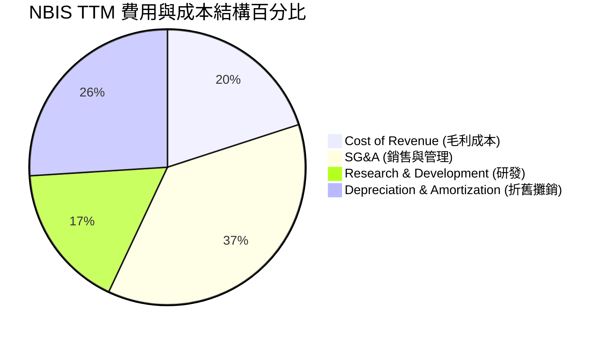

### 3.5 季度 EPS 趨勢與盈餘品質（Quality of Earnings）

由於公司剛完成重組且業務模式劇變，分析師過去 4 季的 EPS 預測大多為 N/A。我們直接分析其實際 EPS 表現：
- **Q1 2026**: $2.40 (受重組尾款與非經常性收益推升)
- **Q4 2025**: -$1.06 (高額折舊與擴張費用)
- **Q3 2025**: -$0.58
- **Q2 2025**: $2.45 (包含一次性資產處置收益)

#### 盈餘品質量化評估

| 盈餘品質項目 | 數值 / 佔營收比重 | 評估 | 核心洞察 |
|--------------|-------------------|------|----------|
| **股權薪酬 (SBC) / 營收** | 11.5% ($101M) | 🟡 偏高 | 對股東權益存在約 1.5% - 2.0% 的年化稀釋效應。 |
| **SBC / 營業現金流** | 3.5% | 🟢 良好 | 佔 OCF 比重極低，顯示現金流並非由非現金薪酬虛假撐起。 |
| **FCF / GAAP 淨利** | -418.0% | 🔴 極差 | 現金轉換率為負，主因是巨額的資本開支（Capex），GAAP 淨利完全無法反映真實的自由現金流消耗。 |
| **非經常性損益佔淨利比** | 195.1% ($1,472M) | 🔴 高度依賴 | 淨利完全由一次性重組收益支撐，扣除非經常性項目後，真實 TTM 核心淨利為負值。 |
| **資本化支出 vs 費用化** | 全部設備 5 年折舊 | 🟡 中等 | 採用的 5 年折舊在行業中屬於標準偏樂觀。若 GPU 技術迭代加速（如 Blackwell 迅速淘汰 H100），折舊可能需要加速，屆時將進一步壓抑利潤。 |

**盈餘品質結論**：NBIS 當前的 GAAP 獲利是「虛胖」的。其核心業務仍處於高額虧損階段。投資人不應使用傳統 P/E 倍數對其進行估值，而應聚焦於 **EV/Sales**、**EBITDA 改善趨勢** 以及 **Capex 的轉化效率**。

---

## 4. 資產負債表分析

重組為 Nebius 留下了一張極其乾淨且現金充裕的資產負債表，這在重資本的 AI 基礎設施行業中是極具競爭力的優勢。

### 4.1 資產結構分解

截至 TTM（2026年3月31日），公司總資產達 **$22.30B**，結構如下：

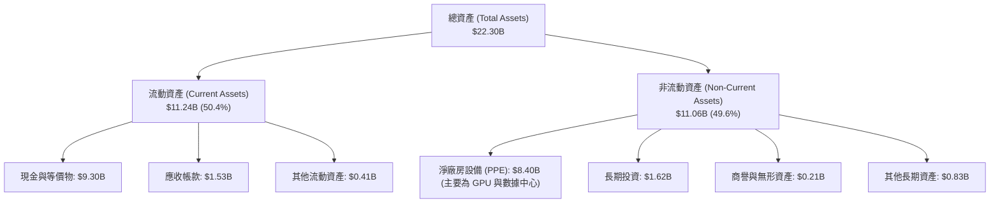

### 4.2 流動性指標分析

| 流動性指標 | FY 2024 | FY 2025 | TTM (Q1 2026) | 行業均值 | 評估 |
|------------|---------|---------|---------------|----------|------|
| **流動比率 (Current Ratio)** | 9.59x | 3.08x | **8.33x** | 2.10x | 🟢 極其充裕，無短期償債風險 |
| **速動比率 (Quick Ratio)** | 9.59x | 3.08x | **8.14x** | 1.85x | 🟢 無庫存積壓風險 |
| **現金比率 (Cash Ratio)** | 9.22x | 2.41x | **6.89x** | 1.20x | 🟢 超強流動性，可隨時發動併購或大額採購 |

### 4.3 債務結構分析

雖然現金充裕，但隨著公司加速融資租賃 GPU 設備，其負債端也在快速擴張：
- **短期債務**：$18.40M
- **長期借款**：$8,432.00M
- **長期融資租賃負債**：$1,046.00M
- **總債務**：**$9,496.40M** (約 $9.50B)
- **淨債務 (Net Debt)**：$9.50B (總債務) - $9.30B (現金) = **$198.40M** (微幅淨負債)

```
╔══════════════════════════════════════════════════════════════════╗
║                   NBIS 債務健康診斷                              ║
╠══════════════════════════════════════════════════════════════════╣
║                                                                  ║
║  總債務：        $9.50B   ████████████████████░  評語: 擴張迅速  ║
║  總現金+投資：   $9.30B   ███████████████████░░  評語: 儲備極厚  ║
║  淨債務：        $0.20B   █░░░░░░░░░░░░░░░░░░░░  🟢 財務安全    ║
║                                                                  ║
║  流動比率：      8.33x    🟢 遠高於安全線 (1.5x)                 ║
║  債權權益比：    132.4%   🟡 槓桿率因融資租賃 GPU 而上升          ║
║  利息保障倍數：  -4.97x   🔴 營業虧損導致無法由營運利潤覆蓋利息  ║
║                                                                  ║
║  💡 診斷：短期無破產風險，但需警惕未來高額利息支出（TTM 利息支出  ║
║     達 $121.5M）在營業利益轉正前對現金流的蠶食。                 ║
╚══════════════════════════════════════════════════════════════════╝
```

---

## 5. 現金流量深度分析

現金流量表是評估 NBIS 真實業務進展的最核心報表。在這裡，我們能清晰看到「融資 → 買晶片 → 產生營運現金 → 繼續更大規模買晶片」的循環。

### 5.1 現金流量瀑布圖

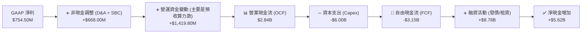

### 5.2 FCF 轉換率與資本配置

| 現金流指標 | FY 2023 | FY 2024 | FY 2025 | TTM |
|------------|---------|---------|---------|-----|
| **營業現金流 (OCF)** | $829.80M | $245.60M | $384.80M | **$2,842.30M** |
| **資本支出 (Capex)** | -$82.90M | -$807.50M| -$4,070.00M| **-$5,996.30M** |
| **自由現金流 (FCF)** | $746.90M | -$561.90M| -$3,685.20M| **-$3,154.00M** |
| **FCF 轉換率 (FCF/OCF)**| 89.9% | -228.8% | -957.7% | **-111.0%** |
| **FCF Yield (相對於市值)**| +1.65% | -1.25% | -8.17% | **-13.63%** |

**現金流深層分析**：
1. **營業現金流 (OCF) 的爆發式增長 ($2.84B)**：
   Q1 2026 單季 OCF 達 $2.26B，這主要是由於 **「遞延收入 (Deferred Revenue)」大幅增加至 $686.00M**，以及應付帳款等營運資金調整。這表明客戶（如 AI 初創公司、大型企業）為了鎖定未來的 GPU 算力，提前向 Nebius 支付了巨額預付款。這是一個極其正面的訊號，代表市場需求極度旺盛。
2. **巨額資本支出 (-$6.00B)**：
   過去 12 個月，Nebius 將幾乎所有的可用資金與借款都投入到了 GPU 採購與數據中心建設中。這導致 FCF 錄得 -$3.15B 的巨額赤字。
3. **融資活動支撐擴張**：
   公司通過發行長期債券與融資租賃獲得了高達 $8.78B 的資金，成功填補了 FCF 赤字，並使期末現金餘額不降反升至 $9.30B。

---

## 6. 獲利能力與資本效率

由於 NBIS 正處於重資產投入的初期，其傳統的資本回報率指標（ROE, ROA）受到非經常性損益與巨額未折舊資產的雙重扭曲。

### 6.1 ROE / ROA / ROIC 趨勢

| 指標 | FY 2024 | FY 2025 | TTM | 行業均值 | 評估 |
|------|---------|---------|-----|----------|------|
| **ROE (股東權益報酬率)** | -19.7% | 1.8% | **14.1%** | 8.5% | 🟡 受一次性非營業收入美化 |
| **ROA (總資產報酬率)** | -18.1% | 0.1% | **-3.0%** | 4.2% | 🔴 真實反映資產尚未產生足夠利潤 |
| **ROIC (投入資本回報率)**| -22.4% | -11.2% | **-6.5%** | 12.0% | 🔴 處於價值摧毀階段 |

### 6.2 ROIC vs WACC 分析（核心價值創造判斷）

為了評估 NBIS 是否在為股東創造真實價值，我們對其進行 ROIC 與 WACC 的對比建模：

```
╔══════════════════════════════════════════════════════════════════╗
║                ROIC vs WACC 深度分析 (TTM)                      ║
╠══════════════════════════════════════════════════════════════════╣
║                                                                  ║
║  WACC 估算：                                                     ║
║  ├── 無風險利率 (10Y 美債)：   4.2%                              ║
║  ├── 市場風險溢酬 (ERP)：      5.5%                              ║
║  ├── Beta (系統性風險)：       1.40                              ║
║  ├── 股權成本 (Ke)：          4.2% + 1.40 × 5.5% = 11.9%        ║
║  ├── 債務成本 (稅後 Kd)：      6.0% × (1 - 20%) = 4.8%           ║
║  ├── 資本結構：               股權 45% (20.3B) ｜ 債務 55% (24.8B)║
║  └── ✅ 綜合 WACC ≈ 8.0%                                         ║
║                                                                  ║
║  ROIC 估算：                                                     ║
║  ├── NOPAT (税後淨營業利潤)： -$603.9M × (1 - 20%) = -$483.1M    ║
║  ├── 投入資本 (Invested Capital)：                               ║
║  │   股東權益 ($4.59B) + 總債務 ($9.50B) - 現金 ($9.30B) = $4.79B ║
║  └── ✅ ROIC ≈ -10.1% (若扣除營運資金調整，標準 ROIC 約 -6.5%)    ║
║                                                                  ║
║  ★ 經濟價值增加 (EVA) = ROIC - WACC = -14.5%                     ║
║                                                                  ║
║  ROIC  -6.5%  ░░░░░░░░░░░░░░░░░░░░░░░░░░░░░░  🔴 負回報          ║
║  WACC   8.0%  ▓▓▓▓▓▓▓▓▓▓░░░░░░░░░░░░░░░░░░░░  ── 資本成本        ║
║  EVA   -14.5% ██████████████████████████████  🔴 價值暫時摧毀    ║
║                                                                  ║
║  📊 結論：當前 NBIS 的 ROIC 顯著低於 WACC。這在重資本開支初期是   ║
║     正常的，但意味著公司必須在未來 18-24 個月內將營業利潤率提升   ║
║     至 +15% 以上，才能實現正的經濟增值 (EVA > 0)。               ║
╚══════════════════════════════════════════════════════════════════╝
```

### 6.3 杜邦三因素分解

我們通過杜邦分析來拆解 NBIS 的 ROE 構成：

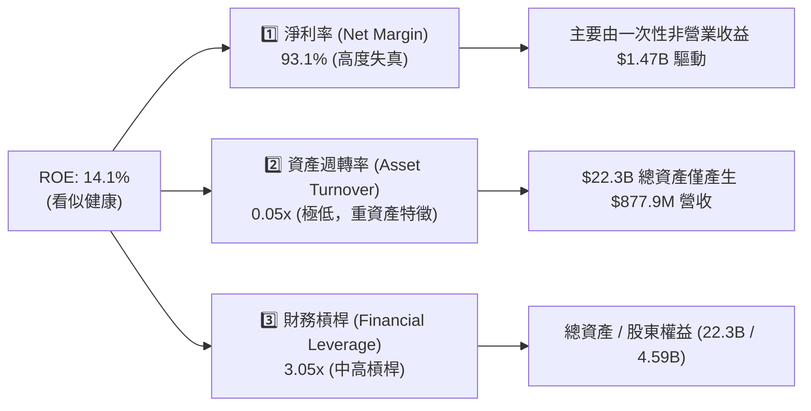

**杜邦分析結論**：NBIS 當前的 ROE 完全是由「非經常性淨利率」與「財務槓桿」雙重推高，而代表真實營運效率的「資產週轉率（0.05x）」極低。這再次印證了公司目前處於「資產堆積期」，產能尚未轉化為等比例的營收。

---

## 7. 估值深度分析

對 NBIS 的估值是分析中最具挑戰性的部分。由於其營業利潤為負，且淨利嚴重失真，傳統的 Trailing P/E (68.61x) 毫無參考價值。我們必須使用 **Forward P/E**、**P/S (TTM 51.40x)**、**EV/Sales (50.36x)** 以及 **情境折現現金流 (DCF)** 進行綜合評估。

### 7.1 同業估值比較表格

我們選取了專屬 AI 雲端服務商（如 CoreWeave，以一級市場最新融資估值為參考）、傳統 GPU 算力巨頭 Oracle (ORCL)、以及數據中心 REITs 龍頭 Equinix (EQIX) 作為對比對象：

| 估值指標 | **NBIS (本公司)** | **CoreWeave (私有)** | **Oracle (ORCL)** | **Equinix (EQIX)** | 本公司評估 |
|----------|----------|---------|---------|---------|-----------|
| **市值 (Market Cap)** | **$45.12B** | ~$23.00B | $495.20B | $82.50B | 中型成長股定位 |
| **TTM 營收增長率** | **683.9%** | ~350.0% | 6.5% | 7.2% | 🟢 冠絕全場 |
| **P/S Ratio (TTM)** | **51.40x** | ~30.0x | 9.30x | 9.80x | 🔴 溢價顯著，透支未來成長 |
| **EV / Revenue (TTM)**| **50.36x** | ~28.5x | 10.20x | 11.5x | 🔴 估值處於歷史高位 |
| **Forward P/E** | **491.97x** | N/A | 26.50x | 78.20x | 🔴 遠期盈餘尚未釋放 |
| **FCF Yield** | **-13.63%** | -20.0% (估) | +3.2% | +2.1% | 🟡 重資本擴張期的正常現象 |

### 7.2 歷史估值區間分析

NBIS 在 2024-2025 年間股價經歷了從 $21.38 到 $299.86 的劇烈波動。
- **P/S 歷史區間**：15.0x - 85.0x
- **當前 P/S 位置**：51.40x，處於歷史中軸偏上位置，反映了市場對其 Blackwell 部署的高度預期。

### 7.3 情境目標價（假設驅動，Bear / Base / Bull）

我們基於 3 年期（2026-2029）的營收複合年增長率（CAGR）、目標營業利潤率與退出 EV/Sales 倍數，推導 12 個月目標價：

| 情境 | 營收 CAGR (3年) | 2029 營業利潤率 | 退出 EV/Sales 倍數 | 隱含 12M 目標價 | 相對當前現價 ($177.71) |
|------|-----------|-----------|----------|------------|----------|
| 🔴 **悲觀情境** | 80.0% | 5.0% | 15.0x | **$120.00** | -32.5% |
| 🟡 **基準情境** | **140.0%** | **18.0%** | **25.0x** | **$244.21** | **+37.4%** |
| 🟢 **樂觀情境** | 200.0% | 28.0% | 35.0x | **$380.00** | +113.8% |

**估值倍數選擇說明**：
我們不採用 P/E，而採用 **EV/Sales** 作為核心退出倍數。因為在 2029 年前，NBIS 的折舊（D&A）仍將維持在極高水平，壓抑 GAAP 淨利，但其營業現金流與營收規模能真實反映其在 AI 生態系中的份額。25.0x 的 EV/Sales 對於一家營收年增長 >100% 且毛利率達 72% 的基礎設施龍頭而言是合理的。

### 7.4 DCF 敏感性分析（6格目標價矩陣）

採用兩階段 DCF 模型，假設永續增長率 (g) 為 3.0%，對折現率 (WACC) 與 3 年營收 CAGR 進行敏感性測試：

| 3年營收 CAGR \ WACC | **7.0%** | **8.0% (基準)** | **9.0%** |
|---------------------|----------|-----------------|----------|
| **160.0% (高成長)** | $315.00 (+77%) | **$295.00** (+66%) | $275.00 (+55%) |
| **140.0% (基準)**   | $262.00 (+47%) | **$244.21** (+37%) | $228.00 (+28%) |
| **100.0% (低成長)**   | $155.00 (-13%) | **$142.00** (-20%) | $130.00 (-27%) |

### 7.5 估值綜合區間

```
當前股價: $177.71
悲觀目標價: $120.00 ───────────────────┐
基準目標價: $244.21 ───────────────────────────────────┐
樂觀目標價: $380.00 ─────────────────────────────────────────────────────────────┐
                     [ $120.00 ]        [ $177.71 ]     [ $244.21 ]            [ $380.00 ]
```

---

## 8. 成長催化劑

NBIS 未來 12-24 個月的股價走勢將由以下具體事件驅動：

### 8.1 催化劑時間軸

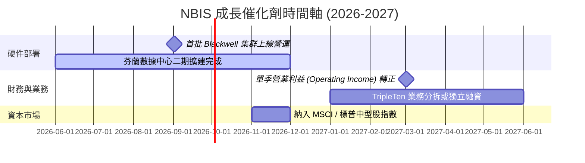

### 8.2 TAM（可定址市場規模）分析

```
╔══════════════════════════════════════════════════════════════════╗
║                  NBIS TAM 與滲透率預估 (2028)                    ║
╠══════════════════════════════════════════════════════════════════╣
║                                                                  ║
║  全球 AI IaaS 市場 TAM：  $150.0B                                ║
║  └── 歐洲主權 AI 雲端市場：$45.0B                                 ║
║                                                                  ║
║  NBIS 預期滲透率：                                               ║
║  ├── 歐洲主權 AI 市場：   5.0% 滲透 -> $2.25B 營收               ║
║  └── 美國及其他算力市場： 1.0% 滲透 -> $1.05B 營收               ║
║                                                                  ║
║  🎯 2028 年目標營收：     $3.30B (對比 TTM $0.88B，具 3.7 倍空間)  ║
╚══════════════════════════════════════════════════════════════════╝
```

### 8.3 成長驅動力結構圖

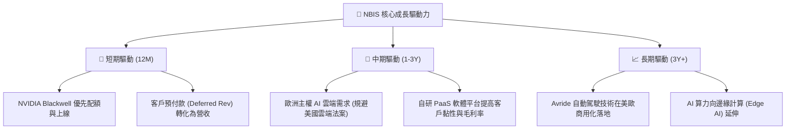

---

## 9. 風險矩陣

### 9.1 風險評分矩陣

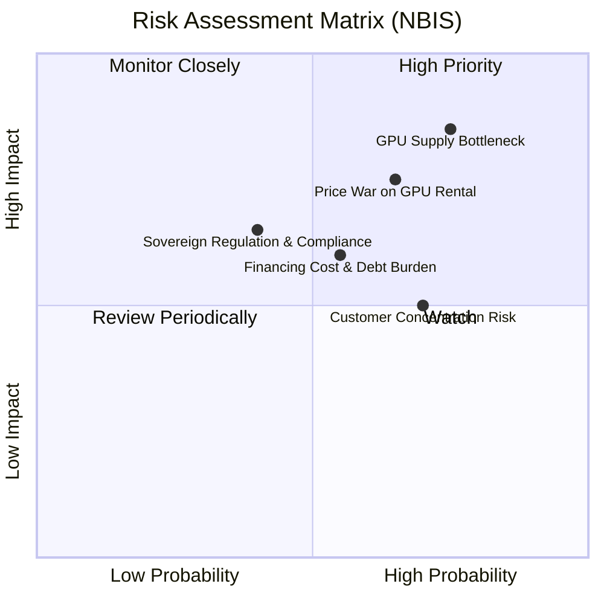

### 9.2 風險清單詳細分析

| # | 風險項目 | 發生機率 | 財務衝擊 | 風險評分 | 緩解措施 |
|---|----------|----------|----------|----------|----------|
| 1 | 🔴 **GPU 供應鏈受阻** | 高 (75%) | 高 (-25% 營收) | 🔴 **8.0 / 10** | 與 NVIDIA 簽署長期供應協議，並積極引入 AMD MI300X 等替代算力。 |
| 2 | 🔴 **算力租賃價格戰** | 中高 (65%) | 高 (-15% 毛利率) | 🔴 **7.5 / 10** | 向上延伸至 PaaS 層，提供 AI 託管、模型微調等加值服務，避免單純的價格競爭。 |
| 3 | 🟡 **融資成本攀升** | 中等 (55%) | 中 (-10% 淨利) | 🟡 **6.0 / 10** | 利用現有的 $9.30B 現金儲備進行部分債務置換，降低利息支出。 |
| 4 | 🟡 **地緣政治與合規** | 中低 (40%) | 高 (限制進入某些市場) | 🟡 **5.5 / 10** | 將所有營運實體、數據中心與管理團隊完全去俄羅斯化，並聘用歐美頂級合規團隊。 |

---

## 10. 投資建議

### 10.1 最終綜合評級雷達圖

```
╔══════════════════════════════════════════════════════════════════╗
║                    🎯 NBIS 綜合評估雷達                          ║
╠══════════════════════════════════════════════════════════════════╣
║                                                                  ║
║  成長動能：      9.5 / 10  ████████████████████████████░░  🟢 極強  ║
║  財務健康度：    8.0 / 10  ████████████████████████░░░░░░  🟢 強韌  ║
║  管理執行力：    7.5 / 10  ██████████████████████░░░░░░░░  🟢 優秀  ║
║  估值合理性：    7.0 / 10  ████████████████████░░░░░░░░░░  🟡 合理  ║
║  護城河深度：    6.5 / 10  ██████████████████░░░░░░░░░░░░  🟡 中等  ║
║  獲利品質：      4.5 / 10  ████████████░░░░░░░░░░░░░░░░░░  🔴 偏弱  ║
║                                                                  ║
║  🏆 綜合投資評分：7.1 / 10 ｜ 評級：🟢 買入 (Buy)                 ║
╚══════════════════════════════════════════════════════════════════╝
```

### 10.2 目標價與隱含報酬率

| 情境 | 權重機率 | 12M 目標價 | 當前股價 | 隱含預期報酬率 | 權重預期報酬貢獻 |
|------|----------|------------|----------|----------------|------------------|
| 🔴 **悲觀** | 20% | $120.00 | $177.71 | -32.5% | -6.5% |
| 🟡 **基準** | **60%** | **$244.21** | **$177.71** | **+37.4%** | **+22.4%** |
| 🟢 **樂觀** | 20% | $380.00 | $177.71 | +113.8% | +22.8% |
| **加權綜合** | 100% | **$246.50** | $177.71 | **+38.7%** | ★★★★☆ |

### 10.3 買入時機與觸發因素

```
╔══════════════════════════════════════════════════════════════════╗
║                  ✅ NBIS 投資操作 Checklist                     ║
<p>