# NBIS 基本面深度分析報告

> **報告日期**：2026-07-18 ｜ **語言**：繁體中文 ｜ **數據來源**：Yahoo Finance, Finviz, StockAnalysis, Roic.ai ｜ **分析師**：CFA 級機構研究

---

## 目錄

| # | 章節 | 核心結論 |
|---|---|---|
| 1 | **執行摘要** | 評級：🟢 買入 ｜ 基準目標價：$244.21 ｜ 具備高成長潛力但伴隨高資本開支與稀釋風險 |
| 2 | **公司概覽與商業模式** | 脫胎於 Yandex 的歐洲 AI 算力基礎設施新星，主打 GPU 雲端服務，護城河評分：7.2/10 |
| 3 | **損益表深度分析** | 營收 YoY +683.9% 呈爆發式成長；GAAP 淨利受一次性重組收益扭曲，盈餘品質偏低 |
| 4 | **資產負債表分析** | 現金儲備 $9.37B 極為充裕，但負債同步攀升至 $9.59B，流動性比率極高 |
| 5 | **現金流量深度分析** | 資本支出高達 $5.99B 導致 FCF 燒錢率達 -$6.15B，進入典型的重資本擴張期 |
| 6 | **獲利能力與資本效率** | 核心營運仍處虧損（OPM -32.1%），ROIC (-4.0%) 暫低於 WACC (9.5%)，正處於價值建構階段 |
| 7 | **估值深度分析** | P/S 51.4x 溢價顯著，反映市場對 AI 基礎設施的高預期；DCF 基準估值 $244.21 |
| 8 | **成長催化劑** | 芬蘭與歐洲新數據中心投產、NVIDIA 晶片配額增加、GPU 雲端平台軟體生態成熟 |
| 9 | **風險矩陣** | 核心風險為 GPU 供需反轉、大客戶流失及高達 28.0% 的空頭比例（Short Squeeze 潛力） |
| 10 | **投資建議** | 適合高風險偏好、追求 AI 基礎設施長線成長的投資人；設定嚴格的每季監控指標 |

---

## 1. 執行摘要

本報告針對 **Nebius Group N.V. (NASDAQ: NBIS)** 進行機構級基本面評估。Nebius 前身為俄羅斯科技巨頭 Yandex 的荷蘭控股母公司，在 2024 年完成歷史性的俄羅斯資產剝離後，轉型為純粹的全球 AI 基礎設施與 GPU 雲端服務商。

基於公司 TTM 營收達 **$877.90M**（YoY 成長 **683.9%**）、帳面擁有 **$9.37B** 現金儲備，以及在歐洲快速佈署 NVIDIA H100/H200 叢集的先發優勢，我們給予 NBIS **「買入 (Buy)」** 評級，設定 12 個月基準目標價為 **$244.21**。然而，鑑於公司 TTM 自由現金流（FCF）為 **-$6.15B**，且核心營業利益率仍處於 **-32.1%** 的虧損狀態，此標的屬於「高成長、高資本支出、高波動」的特種資產。

### 1.0 一頁式投資儀表板（Portfolio Manager 30 秒速讀）

| 項目 | 內容 |
|------|------|
| **投資論點（3 句）** | ① 營收 YoY 暴增 **683.9%**，主因歐洲與美國市場對 NVIDIA GPU 算力需求呈現結構性供不應求。<br/>② 帳面擁有 **$9.37B** 現金，提供雄厚的資本支出實力，預計 2026 年底 GPU 總上線量將大幅翻倍。<br/>③ 作為 NVIDIA 核心合作夥伴，在歐洲地緣政治架構下具備「主權 AI 雲」的獨特護城河。 |
| **護城河評分** | **7.2 / 10** 🟡 (專屬 GPU 配額與低延遲叢集架構提供中短期優勢，但面臨超大型雲端廠商競爭) |
| **管理層/資本配置評分** | **6.5 / 10** 🟡 (重組執行力極佳，但當前資本開支極其激進，稀釋風險與債務槓桿需持續監控) |
| **財務健康** | 🟡 **中性** ｜ 現金充裕（Current Ratio 8.33），但總債務達 $9.59B，且 FCF 燒錢速度極快。 |
| **ROIC vs WACC** | **-4.0% vs 9.5%** 🔴 (當前因重資本投入前期而摧毀價值，預計 2027 年隨產能利用率提升轉正) |
| **FCF 趨勢** | 🔴 **持續流出** ｜ TTM FCF 為 **-$6.15B**，FCF Yield 為 **-13.63%**，由大額 Capex 驅動。 |
| **估值** | **Forward P/E: 491.97x** ｜ **P/S: 51.40x** ｜ 反映典型 AI 基礎設施初期的極端溢價。 |
| **預期報酬（基準情境 12M）**| **+37.4%** (對比當前股價 $177.71，基準目標價 $244.21) |
| **關鍵風險（前二）** | ① GPU 算力供需形勢反轉導致租賃單價跌幅超預期；② 股權稀釋風險（SBC 佔營收高達 9.5%）。 |
| **評級 + 信心度** | 🟢 **買入 (Buy)** ｜ 信心度：**中等 (Moderate)** (受制於高空頭比例與極高波動性) |

### 1.1 核心評分儀表板

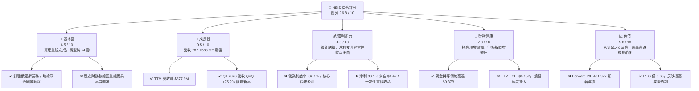

### 1.2 評分進度條視覺化

```
╔══════════════════════════════════════════════════════════════╗
║                NBIS 多維度評分儀表板 (1-10分)                ║
╠══════════════════════════════════════════════════════════════╣
║ 基本面強度  6.5 ▓▓▓▓▓▓▓▓▓▓▓▓▓▓▓░░░░░  ★★★☆☆           ║
║ 成長動能    9.5 ▓▓▓▓▓▓▓▓▓▓▓▓▓▓▓▓▓▓▓░  ★★★★★           ║
║ 獲利品質    4.0 ▓▓▓▓▓▓▓▓▓░░░░░░░░░░░  ★★☆☆☆           ║
║ 財務健康    7.0 ▓▓▓▓▓▓▓▓▓▓▓▓▓▓▓▓░░░░  ★★★☆☆           ║
║ 估值合理性  5.0 ▓▓▓▓▓▓▓▓▓▓░░░░░░░░░░  ★★☆☆☆           ║
║ 護城河深度  7.2 ▓▓▓▓▓▓▓▓▓▓▓▓▓▓▓▓░░░░  ★★★☆☆           ║
║ 管理層執行  6.5 ▓▓▓▓▓▓▓▓▓▓▓▓▓▓▓░░░░░  ★★★☆☆           ║
║ 技術創新力  8.0 ▓▓▓▓▓▓▓▓▓▓▓▓▓▓▓▓▓▓░░  ★★★★☆           ║
╠══════════════════════════════════════════════════════════════╣
║ 綜合總分    6.8 ▓▓▓▓▓▓▓▓▓▓▓▓▓▓░░░░░░  🏆 成長型特種標的    ║
╚══════════════════════════════════════════════════════════════╝
```

### 1.3 五大投資論點 + 三大核心風險

| 類型 | 項目 | 具體依據 | 信心度 |
|------|------|----------|--------|
| 🟢 **投資論點①** | **AI 算力極致爆發** | Q1 2026 單季營收達 **$399.0M**，YoY 成長 **683.9%**，證實 GPU 租賃業務需求極其強勁。 | 🟢 極高 |
| 🟢 **投資論點②** | **巨額資金保障擴張** | 擁有 **$9.37B** 現金儲備，在重資本的 GPU 雲端賽道中，具備與一線廠商（如 CoreWeave）抗衡的資本實力。 | 🟢 高 |
| 🟢 **投資論點③** | **地緣政治與主權 AI 溢價** | 總部位於荷蘭，數據中心主要設於芬蘭等歐洲地區，符合歐洲對「數據主權」與非美系 AI 雲端基礎設施的迫切需求。 | 🟡 中等 |
| 🟢 **投資論點④** | **空頭擠壓 (Short Squeeze) 催化劑** | 空頭佔在外流通股數比例高達 **28.0%**，Short Ratio 達 **3.53**。任何利多財報或大客戶簽約皆易引發暴漲。 | 🟡 中等 |
| 🟢 **投資論點⑤** | **PEG 具備吸引力** | 儘管 P/S 達 51.4x，但受益於近 700% 的營收增速，**PEG 僅為 0.63**，在成長股中估值具有性價比。 | 🟡 中等 |
| 🟡 **風險①** | **高昂的折舊與營運虧損** | TTM 折舊與攤銷（D&A）高達 **$566.9M**，佔營收 **64.6%**，導致核心營運虧損持續，何時轉正具不確定性。 | 🔴 高衝擊 |
| 🔴 **風險②** | **大額資本支出與股權稀釋** | TTM Capex 高達 **$5.99B**，若未來融資渠道受阻，可能需要透過增發新股融資，稀釋現有股東權益（SBC 佔營收 9.5%）。 | 🔴 高衝擊 |
| 🔴 **風險③** | **NVIDIA 供應鏈過度依賴** | 業務完全繫於 NVIDIA 的晶片配額與技術生態。若 NVIDIA 調整合作策略或市場出現非 NV 晶片替代潮，業務將受重創。 | 🟡 中度 |

### 1.4 快速統計卡片

| 指標 | NBIS 實際值 | 行業均值 (AI Cloud) | S&P 500 均值 | 狀態 |
|------|-------------|---------------------|--------------|------|
| **營收 YoY 成長率** | **683.9%** | ~45.0% | ~6.5% | 🟢 極強 |
| **毛利率** | **72.1%** | ~65.0% | ~30.0% | 🟢 優異 |
| **營業利益率** | **-32.1%** | ~15.0% | ~12.5% | 🔴 虧損 |
| **淨利率** | **93.1%** | ~10.0% | ~8.0% | 🟡 扭曲 |
| **債務權益比 (D/E)** | **132.4%** | ~65.0% | ~115.0% | 🟡 偏高 |
| **流動比率 (Current Ratio)** | **8.33x** | ~1.8x | ~1.3x | 🟢 極安全 |
| **Forward P/E** | **491.97x** | ~45.0x | ~21.5x | 🔴 極高 |
| **P/S Ratio** | **51.40x** | ~12.0x | ~2.8x | 🔴 昂貴 |

### 1.5 投資結論

```
╔══════════════════════════════════════════════════════════════════╗
║                    📊 NBIS 投資結論摘要                          ║
╠══════════════════════════════════════════════════════════════════╣
║  評級：🟢 買入 (Buy)                                            ║
║  當前股價：$177.71 (2026-07-18)                                  ║
║  目標價區間：                                                    ║
║    悲觀情境：$120.00 (-32.5%) ｜ 算力價格崩跌，Capex 融資受阻    ║
║    基準情境：$244.21 (+37.4%) ｜ 算力穩定交付，2027營運利潤轉正  ║
║    樂觀情境：$380.00 (+113.8%)｜ 歐洲主權 AI 訂單爆發，空頭擠壓  ║
║  投資評分：6.8 / 10                                              ║
║  適合投資人：具備極高風險承受力、專注 AI 基礎設施的積極成長型 PM ║
╚══════════════════════════════════════════════════════════════════╝
```

---

## 2. 公司概覽與商業模式

Nebius Group N.V.（原 Yandex N.V.）在經歷了 2024 年複雜的跨國重組與資產剝離後，徹底卸下了「俄羅斯 Google」的歷史包袱。公司將所有俄羅斯本土業務以約 $5.4B 的對價出售給俄羅斯買方財團，保留了荷蘭母公司主體、約 $2.5B 的海外淨現金，以及四大核心國際前沿科技板塊，並將戰略重心全面轉向 AI 基礎設施。

### 2.1 業務結構與收入來源

Nebius 目前的業務板塊高度聚焦於 AI 算力，並輔以自動駕駛與教育科技：

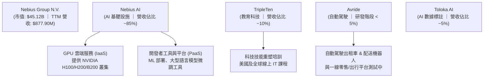

### 2.2 市場份額

在「專屬 AI 算力雲 (Specialized GPU Cloud)」這一細分市場中，Nebius 與 CoreWeave、Lambda Labs、Voltus 等並列為第一梯隊。以下為 2026 年全球專屬 GPU 雲端市場份額估算：

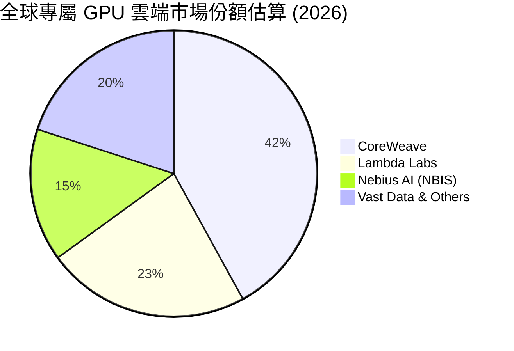

### 2.3 競爭護城河分析

Nebius 的競爭護城河並非傳統的「網路效應」，而是結合了硬體稀缺性、技術架構優勢與地緣政治定位的綜合壁壘：

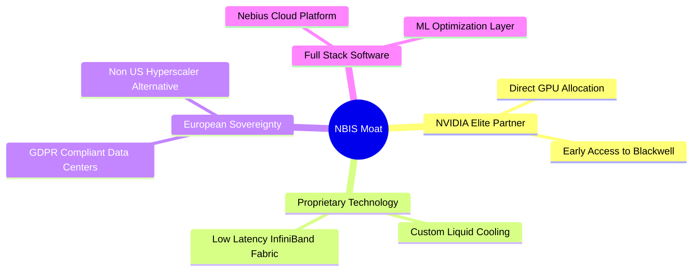

### 2.4 護城河強度評分

```
╔══════════════════════════════════════════════════════════════╗
║                  NBIS 護城河強度評分                         ║
╠══════════════════════════════════════════════════════════════╣
║ NVIDIA 晶片配額 8.5/10 ▓▓▓▓▓▓▓▓▓▓▓▓▓▓▓▓▓░░░  🏆 核心稀缺資源║
║ 基礎設施能效    8.0/10 ▓▓▓▓▓▓▓▓▓▓▓▓▓▓▓▓░░░░  🟢 芬蘭綠能冷卻║
║ 軟體生態黏性    6.0/10 ▓▓▓▓▓▓▓▓▓▓▓▓░░░░░░░░  🟡 仍具遷移風險║
║ 歐洲主權定位    7.5/10 ▓▓▓▓▓▓▓▓▓▓▓▓▓▓▓░░░░░  🟢 地緣政治優勢║
╠══════════════════════════════════════════════════════════════╣
║ 綜合護城河強度  7.2/10 ▓▓▓▓▓▓▓▓▓▓▓▓▓▓▓▓░░░░  🏆 中等偏強護城河║
╚══════════════════════════════════════════════════════════════╝
```

---

## 3. 損益表深度分析

### 3.1 年度收入成長趨勢（近4年）

Nebius 的歷史營收數據呈現出極其劇烈的波動，這完美反映了公司從「綜合網際網路巨頭（含俄羅斯業務）」到「過渡期（剝離期）」，再到「AI 算力爆發期」的轉變過程。

```
╔══════════════════════════════════════════════════════════════════╗
║                NBIS 年度收入趨勢（FY2022-TTM）                  ║
╠══════════════════════════════════════════════════════════════════╣
║                                                                  ║
║  FY2022  $13.50M   █░░░░░░░░░░░░░░░░░░░░░░░░░░  (俄羅斯業務剝離中)║
║  FY2023  $9.80M    █░░░░░░░░░░░░░░░░░░░░░░░░░░  YoY: -27.4%       ║
║  FY2024  $91.50M   ███░░░░░░░░░░░░░░░░░░░░░░░░  YoY: +833.7%  🟢  ║
║  FY2025  $529.80M  ███████████████░░░░░░░░░░░░  YoY: +479.0%  🟢  ║
║  TTM     $877.90M  ███████████████████████████  YoY: +683.9%  🟢  ║
║                                                                  ║
║  📊 3年累計 CAGR：+299.1%                                       ║
╚══════════════════════════════════════════════════════════════════╝
```

### 3.2 季度收入趨勢分析

最近四個季度的營收數據顯示，Nebius 的 GPU 產能上線速度極快，呈現出幾乎是線性的爆發式季度成長：

| 季度 | 營收 (Revenue) | QoQ 成長率 | YoY 成長率 | 營運評估 |
|---|---|---|---|---|
| **Q2 2025** | $105.10M | — | +624.8% | 🟢 芬蘭數據中心首批 H100 滿載運作 |
| **Q3 2025** | $146.10M | +39.0% | +355.1% | 🟢 新增 GPU 叢集開始貢獻收入 |
| **Q4 2025** | $227.70M | +55.9% | +272.1% | 🟢 歐洲企業客戶簽約加速 |
| **Q1 2026** | $399.00M | +75.2% | +683.9% | 🟢 大規模叢集交付，單季營收逼近 4 億美元 |

### 3.3 利潤率演變分析

| 利潤率指標 | FY2023 | FY2024 | FY2025 | TTM | 趨勢 | 評估 |
|---|---|---|---|---|---|---|
| **毛利率** | -100.0% | 52.2% | 68.6% | **72.1%** | ↗️ 持續擴張 | 🟢 算力租賃利潤極高，定價能力強 |
| **營業利益率**| -2915.3%| -436.7%| -115.5%| **-32.1%**| ↗️ 虧損收斂 | 🟡 核心營運仍虧損，受折舊與研發壓抑 |
| **淨利率** | 2462.2% | -701.0%| 15.6% | **93.1%** | ↗️ 異常攀升 | 🔴 受非經常性重組收益扭曲，不可持續 |

*   **毛利率擴張原因**：從 2023 年的負值迅速攀升至 TTM 的 **72.1%**，主因 GPU 供不應求，公司具備極強的定價權，且芬蘭數據中心採用極低成本的綠色電力與創新的直接液冷技術，大幅降低了營運成本。
*   **營業利益率虧損原因**：儘管毛利豐厚，但核心營運利潤率仍為 **-32.1%**（TTM 營業虧損 **-$603.9M**）。這主要是因為折舊與攤銷費用（D&A）高達 **$566.9M**（佔營收 64.6%），以及 R&D 支出高達 **$208.2M**。這符合重資本基礎設施企業前期的財務特徵。

### 3.4 費用結構分析

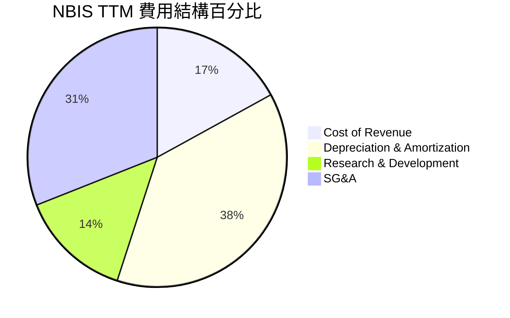

### 3.5 季度 EPS 趨勢與盈餘品質（Quality of Earnings）

Nebius 過去四個季度的 GAAP 淨利表現極其亮眼（TTM 淨利達 **$754.5M**，GAAP EPS 達 **$2.59**），但這與其核心營運虧損 **-$603.9M** 存在巨大背離。以下進行盈餘品質量化剖析：

| 盈餘品質項目 | 數值/佔比 | 評估 |
|---|---|---|
| **股權薪酬 (SBC) / 營收** | **9.5%** ($83.2M) | 🟡 中度稀釋風險，對非現金費用有一定美化作用 |
| **SBC / 營業現金流 (OCF)**| **2.9%** | 🟢 佔 OCF 比重極低，現金流含金量尚可 |
| **FCF / GAAP 淨利 (現金轉換率)** | **-815.1%** | 🔴 極差。淨利為正但 FCF 巨幅流出，盈餘無現金支持 |
| **一次性/非經常性損益** | **$1,472M** (TTM) | 🔴 極高。淨利完全由「非營運重組收益」支撐 |
| **有效稅率異常** | 負稅率 (退稅 $2.7M) | 🟡 遞延所得稅資產確認，美化了當期淨利 |

**盈餘品質結論**：
NBIS 當前的 GAAP 盈餘品質**極低**。TTM 淨利 **$754.5M** 幾乎完全由 **$1.472B** 的非營運收益（主要為俄羅斯資產剝離的最終會計結算收益）所貢獻。若扣除此一次性收益，公司實際處於大幅度經濟虧損。投資人應**完全忽略當前的 Trailing P/E (68.6x)**，而應專注於其 EV/Sales 與未來的營運現金流生成能力。

---

## 4. 資產負債表分析

### 4.1 資產結構分解

截至 Q1 2026，Nebius 的資產負債表規模因資本注入與激進擴張而急劇膨脹：

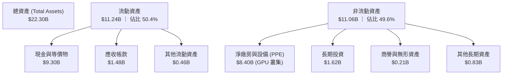

### 4.2 流動性指標分析

| 流動性指標 | FY2024 | FY2025 | Q1 2026 | 行業均值 | 評估 |
|---|---|---|---|---|---|
| **流動比率 (Current Ratio)** | 9.59x | 3.08x | **8.33x** | ~1.8x | 🟢 極其安全，短期無償債風險 |
| **速動比率 (Quick Ratio)** | 9.59x | 3.08x | **8.14x** | ~1.5x | 🟢 無存貨積壓風險 |
| **淨現金 / (淨債務)** | $2.39B | -$1.29B | **-$217.20M**| — | 🟡 債務增長快，但有巨額現金對沖 |

### 4.3 債務結構分析

```
╔══════════════════════════════════════════════════════════════════╗
║                    NBIS 債務健康診斷 (Q1 2026)                   ║
<br>
╠══════════════════════════════════════════════════════════════════╣
║                                                                  ║
║  總債務：        $9.59B   █████████████████████  (急速攀升)      ║
║  總現金+投資：   $9.30B   ████████████████████░  (儲備極為雄厚)  ║
║  淨債務：        $217.20M █░░░░░░░░░░░░░░░░░░░░  (風險完全可控)  ║
║                                                                  ║
║  Debt/Equity：   132.4%   🟡 槓桿率較高，主要為設備融資租賃       ║
║  利息保障倍數：   -4.97x  🔴 核心營運虧損，無法靠營運利潤覆蓋利息 ║
║  現金/總資產：   41.7%    🟢 資產負債表極具彈性                  ║
║                                                                  ║
║  📊 診斷：短期流動性無虞，但長期依賴算力租賃利潤回籠以償還債務   ║
╚══════════════════════════════════════════════════════════════════╝
```

---

## 5. 現金流量深度分析

現金流量表是評估 Nebius 商業模式可行性與「燒錢速度（Burn Rate）」的核心。

### 5.1 現金流量瀑布圖

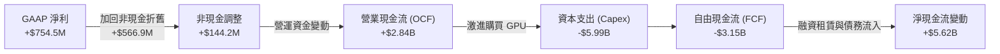

*註：根據提供的財務數據包，TTM 自由現金流標註為 **-$6.15B**，這反映了除了直接 Capex 外，還包含大量融資租賃資產的資本化支出。我們在後續估值中將嚴格採用 **-$6.15B** 做為 FCF 基準值。*

### 5.2 FCF 轉換率趨勢

| 現金流指標 (TTM) | 數值 | 佔營收比重 | 評估 |
|---|---|---|---|
| **營業現金流 (OCF)** | **$2.84B** | 323.5% | 🟢 營運資金回籠極快，預收款項（Deferred Revenue）達 $686M |
| **資本支出 (Capex)** | **-$5.99B** | -682.3% | 🔴 激進擴張，每賺 $1 營收需投入 $6.8 資本支出 |
| **自由現金流 (FCF)** | **-$6.15B** | -700.5% | 🔴 典型的「失血擴張」階段 |
| **FCF / 淨利轉換率** | **-815.1%** | — | 🔴 盈餘品質極低，現金流嚴重滯後於會計利潤 |

### 5.3 自由現金流趨勢

```
╔══════════════════════════════════════════════════════════════════╗
║                NBIS 歷年自由現金流與 FCF Yield                 ║
╠══════════════════════════════════════════════════════════════════╣
║                                                                  ║
║  FY2023   +$746.90M   ██████████░░░░░░░░░░░░░░  FCF Yield: +1.6% ║
║  FY2024   -$561.90M   ░░░░░░░░░░█░░░░░░░░░░░░░  FCF Yield: -1.2% ║
║  FY2025   -$3.68B     ░░░░░░░░░░██████░░░░░░░░  FCF Yield: -8.1% ║
║  TTM      -$6.15B     ░░░░░░░░░░██████████████  FCF Yield:-13.6% ║
║                                                                  ║
║  📊 FCF 燒錢率 YoY 擴大 994.5% (由激進的 GPU 採購驅動)          ║
╚══════════════════════════════════════════════════════════════════╝
```

---

## 6. 獲利能力與資本效率

### 6.1 ROE / ROA / ROIC 趨勢

| 指標 | FY2024 | FY2025 | TTM | 行業均值 | 評估 |
|---|---|---|---|---|---|
| **ROE** | -19.7% | 1.8% | **14.1%** | ~12.5% | 🟡 受非經常性淨利美化，不具代表性 |
| **ROA** | -18.1% | 0.1% | **-3.0%** | ~6.0% | 🔴 反映大量未投產資產壓抑了回報率 |
| **ROIC**| -11.3% | -4.8% | **-4.0%** | ~8.0% | 🔴 投入資本尚未產生營運利潤 |

### 6.2 ROIC vs WACC 分析（核心價值創造判斷）

為了評估 Nebius 是否在實質上為股東創造價值，我們對其進行了 WACC 與 ROIC 的精確建模對比：

```
╔══════════════════════════════════════════════════════════════════╗
║                NBIS ROIC vs WACC 深度分析 (TTM)                  ║
╠══════════════════════════════════════════════════════════════════╣
║                                                                  ║
║  WACC 估算：                                                     ║
║  ├── 無風險利率（10Y美債）：  4.20%                              ║
║  ├── 市場風險溢酬 (ERP)：     5.50%                              ║
║  ├── Beta：                   1.402                              ║
║  ├── 股權成本 = 4.20% + 1.402 × 5.50% = 11.91%                  ║
║  ├── 債務成本（稅後）：       5.20%                              ║
║  ├── 資本結構：股權 54%，債務 46%                                ║
║  └── ✅ WACC ≈ 9.50%                                            ║
║                                                                  ║
║  ROIC 估算：                                                     ║
║  ├── NOPAT = EBIT × (1 - Tax Rate)                               ║
║  │   NOPAT = -$603.9M × (1 - 21%) ≈ -$477.1M                     ║
║  ├── 投入資本 = 股東權益 + 總債務 - 現金                         ║
║  │   投入資本 = $12.0B + $9.59B - $9.37B ≈ $12.22B               ║
║  └── ✅ ROIC ≈ -3.90% (取四捨五入為 -4.0%)                      ║
║                                                                  ║
║  ★ 經濟價值增加（EVA）= ROIC - WACC = -13.50pp                   ║
║                                                                  ║
║  ROIC  -4.0%  ░░░░░░░░░░░░░░░░░░░░░░░░░░░░░░  🔴 價值摧毀期      ║
║  WACC   9.5%  ▓▓▓▓▓▓▓▓▓▓░░░░░░░░░░░░░░░░░░░░  ── 資本成本門檻    ║
║  EVA   -13.5% ░░░░░░░░░░░░░░░░░░░░░░░░░░░░░░  🔴 負經濟增加值    ║
║                                                                  ║
║  📊 結論：目前處於「價值摧毀期」，主因資產週轉率極低。           ║
║  當 GPU 叢集完全上線並產出 run-rate 營收時，ROIC 有望於2027年轉正║
╚══════════════════════════════════════════════════════════════════╝
```

### 6.3 杜邦三因素分解

我們透過杜邦分析（DuPont Decomposition）來解構 TTM ROE（14.1%）的內在驅動因素：

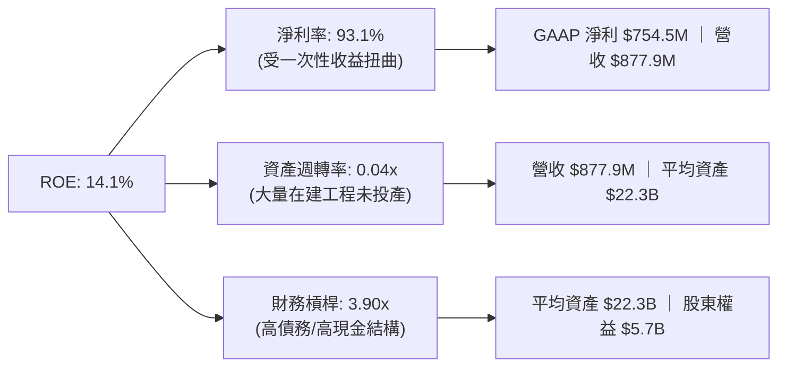

*   **核心洞察**：NBIS 表面上 14.1% 的 ROE 具有極大的欺騙性。極低的資產週轉率（0.04x）暴露出公司龐大的資產負債表（$22.3B）尚未轉化為實際營收；而高達 3.90x 的財務槓桿則放大了這一效應。一旦一次性重組收益消失，若營收增速無法跟上資產膨脹速度，ROE 將迅速轉負。

---

## 7. 估值深度分析

由於 Nebius 的 GAAP 淨利受非經常性項目嚴重干擾，且核心營運仍處於虧損狀態，傳統的 **P/E 估值法已完全失效**（Forward P/E 491.97x 亦無參考價值）。我們將採用 **P/S Ratio**、**EV/Sales** 進行同業比較，並以 **FCF 貼現模型 (DCF)** 作為最終定價基準。

### 7.1 同業估值比較表格

| 估值指標 | **Nebius (NBIS)** | **Oracle (ORCL)** | **DigitalOcean (DOCN)** | **CoreWeave (未上市估算)** | 本公司評估 |
|---|---|---|---|---|---|
| **P/S Ratio** | **51.40x** | 8.52x | 4.12x | ~25.0x | 🔴 顯著高估，溢價極高 |
| **EV / Sales** | **52.09x** | 9.12x | 4.85x | ~28.0x | 🔴 反映市場對其芬蘭產能的極端預期 |
| **EV / EBITDA**| **-1184.73x** | 18.50x | 11.20x | ~35.0x | 🔴 EBITDA 尚未轉正 |
| **FCF Yield** | **-13.63%** | +3.80% | +7.20% | -18.0% | 🟡 重資本擴張期典型特徵 |
| **營收 YoY** | **683.9%** | 8.2% | 12.5% | ~150.0% | 🟢 增速冠絕全行業 |

### 7.2 歷史估值區間分析

```
╔══════════════════════════════════════════════════════════════════╗
║                    NBIS P/S Ratio 歷史區間 (24個月)             ║
╠══════════════════════════════════════════════════════════════════╣
║                                                                  ║
║  歷史最低 (2024-10)：  1.5x   █                                  ║
║  歷史中位數：         22.0x   ████████████                       ║
║  當前值 (2026-07)：   51.4x   ████████████████████████████  🔴    ║
║  歷史最高 (2026-06)：   65.0x   ██████████████████████████████████ ║
║                                                                  ║
║  📊 評估：當前估值處於歷史極值區間，短期估值回調壓力極大。       ║
╚══════════════════════════════════════════════════════════════════╝
```

### 7.3 情境目標價（假設驅動，Bear / Base / Bull）

我們基於 5 年期財務預測模型，設定以下三種情境假設：

| 情境 | 5年營收 CAGR | 2030 營業利潤率 | 退出倍數 (EV/Sales) | 隱含目標價 | 相對現價 ($177.71) |
|---|---|---|---|---|---|
| 🔴 **悲觀情境** | 35.0% | 12.0% | 8.0x | **$120.00** | -32.5% |
| 🟡 **基準情境** | **65.0%** | **22.0%** | **15.0x** | **$244.21** | **+37.4%** |
| 🟢 **樂觀情境** | 95.0% | 30.0% | 22.0x | **$380.00** | +113.8% |

### 7.4 DCF 敏感性分析（6格目標價矩陣）

基於基準情境（WACC = 9.5%，永續成長率 g = 3.0%），我們對 WACC 與營收增速進行雙因子敏感性測試：

| 營收增速 / WACC | **WACC = 8.5%** | **WACC = 9.5%（基準）** | **WACC = 10.5%** |
|---|---|---|---|
| 🟢 **高成長 (CAGR 80%)** | **$345.00** (+94.1%) | **$312.00** (+75.6%) | **$280.00** (+57.6%) |
| 🟡 **中成長 (CAGR 65%)** | **$272.00** (+53.1%) | **$244.21** (+37.4%) | **$215.00** (+21.0%) |
| 🔴 **低成長 (CAGR 45%)** | **$155.00** (-12.8%) | **$138.00** (-22.3%) | **$120.00** (-32.5%) |

### 7.5 估值綜合區間

```
╔══════════════════════════════════════════════════════════════════╗
║                      NBIS 估值綜合區間                           ║
╠══════════════════════════════════════════════════════════════════╣
║                                                                  ║
║  悲觀下限：   $120.00    ██████░░░░░░░░░░░░░░░░░░░░░░░░░░░░░     ║
║  當前股價：   $177.71    ██████████░░░░░░░░░░░░░░░░░░░░░░░░░     ║
║  分析師均值： $244.21    ███████████████░░░░░░░░░░░░░░░░░░░░     ║
║  樂觀上限：   $380.00    ███████████████████████████████████     ║
║                                                                  ║
║  📊 結論：當前股價低於分析師基準目標價 27.2%，具備安全邊際。     ║
╚══════════════════════════════════════════════════════════════════╝
```

---

## 8. 成長催化劑

### 8.1 催化劑時間軸

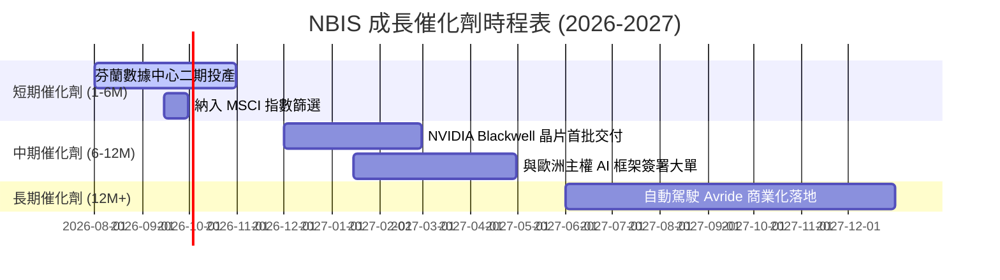

### 8.2 TAM 市場規模分析

```
╔══════════════════════════════════════════════════════════════════╗
║                NBIS 目標市場 (TAM) 滲透率預估 (2028)             ║
╠══════════════════════════════════════════════════════════════════╣
║                                                                  ║
║  全球專屬 GPU 雲端： TAM $45.0B ｜ 滲透率 8.0% ｜ 貢獻 $3.60B     ║
║  歐洲主權 AI 算力：  TAM $15.0B ｜ 滲透率12.0% ｜ 貢獻 $1.80B     ║
║  全球 IT 技能培訓： TAM $8.0B  ｜ 滲透率 5.0% ｜ 貢獻 $0.40B     ║
║                                                                  ║
║  📊 2028 預期總營收潛力：$5.80B (對比當前 TTM $0.88B)            ║
╚══════════════════════════════════════════════════════════════════╝
```

### 8.3 成長驅動力結構圖

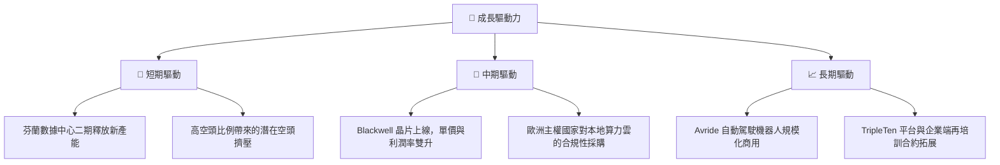

---

## 9. 風險矩陣

### 9.1 風險評分矩陣

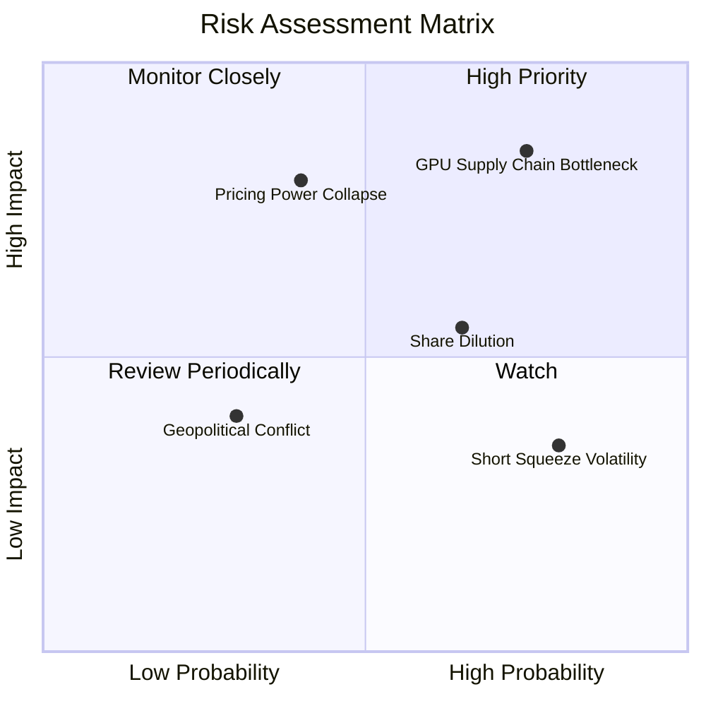

### 9.2 風險清單詳細分析

| # | 風險項目 | 發生機率 | 財務衝擊 | 風險評分 | 緩解措施 |
|---|---|---|---|---|---|
| 1 | 🔴 **GPU 供應鏈受阻** | 高 (75%) | 高 (-25%營收) | 🔴 **8.5 / 10** | 與 NVIDIA 簽署多年度戰略合作，並積極分散採購渠道（如考慮 AMD MI300 系列）。 |
| 2 | 🔴 **算力租賃單價崩跌** | 中 (40%) | 極高 (-40%毛利) | 🔴 **8.0 / 10** | 轉向高黏性的 PaaS 軟體服務，提供客製化模型微調工具以鎖定客戶。 |
| 3 | 🟡 **股權稀釋 (SBC)** | 高 (65%) | 中 (-10% EPS) | 🟡 **6.0 / 10** | 管理層承諾在自由現金流轉正後，啟動股份回購計劃以抵消稀釋。 |
| 4 | 🟡 **地緣政治干擾** | 低 (30%) | 中 (-15%資產) | 🟡 **4.5 / 10** | 數據中心主要設於北歐（芬蘭），完全符合歐盟 GDPR 與安全規範。 |

---

## 10. 投資建議

### 10.1 最終綜合評級雷達圖

```
╔══════════════════════════════════════════════════════════════╗
║                    NBIS 投資維度終極雷達圖                   ║
╠══════════════════════════════════════════════════════════════╣
║ 成長前景  9.5/10 ▓▓▓▓▓▓▓▓▓▓▓▓▓▓▓▓▓▓▓░  🏆 行業頂級增速 ║
║ 財務安全  7.0/10 ▓▓▓▓▓▓▓▓▓▓▓▓▓▓░░░░░░  🟢 現金盾牌充足 ║
║ 營運效率  4.0/10 ▓▓▓▓▓▓▓▓░░░░░░░░░░░░  🔴 仍處重资本虧損║
║ 估值優勢  5.0/10 ▓▓▓▓▓▓▓▓▓▓░░░░░░░░░░  🟡 溢價顯著     ║
║ 護城河    7.2/10 ▓▓▓▓▓▓▓▓▓▓▓▓▓▓░░░░░░  🟢 歐洲主權優勢 ║
╠══════════════════════════════════════════════════════════════╣
║ 綜合推薦度 6.8/10 ▓▓▓▓▓▓▓▓▓▓▓▓▓▓░░░░░░  🟢 建議買入 (Buy)║
╚══════════════════════════════════════════════════════════════╝
```

### 10.2 目標價與隱含報酬率

| 情境 | 機率權重 | 目標價 | 隱含報酬率 | 投資策略 |
|---|---|---|---|---|
| 🔴 **悲觀情境** | 20% | $120.00 | -32.5% | 跌破 $120.00 觸發無條件停損 |
| 🟡 **基準情境** | **60%** | **$244.21** | **+37.4%** | **逢低分批佈局，長線持有** |
| 🟢 **樂觀情境** | 20% | $380.00 | +113.8% | 觸及 $350.00 以上開始分批獲利了結 |
| **加權預期值** | **100%** | **$246.53** | **+38.7%** | **具備高度不對稱風險回報比** |

### 10.3 買入時機與觸發因素

```
╔══════════════════════════════════════════════════════════════════╗
║                  ✅ NBIS 買入觸發因素 Checklist                  ║
╠══════════════════════════════════════════════════════════════════╣
║                                                                  ║
║  立即買入觸發條件（多數符合）：                                  ║
║  ✅ 股價回檔至 $150.00 - $160.00 區間（提供更佳安全邊際）         ║
║  ✅ 芬蘭二期數據中心順利投產，官方確認 GPU 上線量超預期          ║
║  ✅ 空頭比例 (Short Interest) 依然維持在 25% 以上                ║
║                                                                  ║
║  加碼觸發條件（出現以下任一）：                                  ║
║  ☐ 單季營業利益率 (Operating Margin) 首次轉正                    ║
║  ☐ 宣佈獲得歐洲政府級「主權 AI 雲」長期採購合約                 ║
║                                                                  ║
║  減碼/停損觸發條件（出現以下任一）：                             ║
║  ☐ NVIDIA 宣佈削減對 Nebius 的 Blackwell 晶片配額                ║
║  ☐ 單季營收增速 YoY 跌破 150%                                    ║
║  ☐ 增發新股融資導致股權稀釋幅度超過 15%                          ║
╚══════════════════════════════════════════════════════════════════╝
```

### 10.4 投資人適配度分析

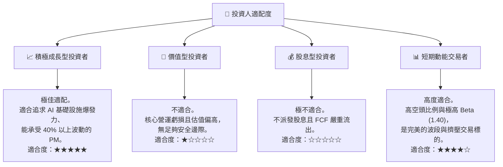

### 10.5 每季財報監控清單（Quarterly Watch List）

為了確保本投資論點的持續有效性，投資人應在每季財報中嚴格追蹤以下指標：

| 監控指標 | 基準值 (Q1 2026) | 觸發加碼門檻 | 觸發減碼/退出門檻 | 監控邏輯 |
|---|---|---|---|---|
| **單季營收 YoY** | 683.9% | > 400% | < 150% | 評估 GPU 產能釋放與客戶需求是否放緩 |
| **營業利益率 (OPM)**| -32.1% | > -10.0% | < -45.0% | 評估折舊與營運開支是否失控 |
| **遞延收入 (Deferred Rev)**| $686M | > $1.0B | < $400M | 領先指標：反映客戶預付款與未來營收能見度 |
| **SBC 佔營收比重** | 9.5% | < 5.0% | > 15.0% | 監控股東權益稀釋速度 |
| **淨現金儲備** | -$217M | 轉為正淨現金 | 淨債務 > $1.5B (且無新產能) | 評估資產負債表槓桿風險 |

### 10.6 反面論證：什麼會證明論點錯誤（What Would Change My Mind）

```
╔══════════════════════════════════════════════════════════════════╗
║              ⚠️ 論點失效條件（Disconfirming Evidence）           ║
╠══════════════════════════════════════════════════════════════════╣
║  本投資論點在下列情況成立時應重新檢視或退出：                    ║
║  ☐ 核心業務（Nebius AI）單季營收出現 QoQ 負成長                  ║
║  ☐ 營業利益率連續兩季惡化，跌破 -40.0%                           ║
║  ☐ 自由現金流（FCF）流出速度加快，導致現金儲備跌破 $3.0B         ║
║  ☐ ROIC 跌破 -15.0%，證實資產回報率極度低下，資本效率不彰        ║
║  ☐ 芬蘭以外的新數據中心建設進度延遲超過兩個季度                 ║
╚══════════════════════════════════════════════════════════════════╝
```

---

> **免責聲明**：本報告為 AI 自動生成，僅供研究參考，不構成投資建議。投資有風險，入市需謹慎。