# NBIS 基本面深度分析報告
> **報告日期**：2026-07-19 ｜ **語言**：繁體中文 ｜ **數據來源**：Yahoo Finance, Finviz, StockAnalysis, Roic.ai ｜ **分析師**：CFA 級機構研究

---

## 目錄

| # | 章節 | 核心結論 |
|---|------|----------|
| 1 | 執行摘要 | 評級：**🟡 持有 (觀望)** ｜ 目標價：**$195.00** ｜ 核心在於高昂的 AI Capex 與非經營性損益的扭曲。 |
| 2 | 公司概覽與商業模式 | 由前 Yandex 國際業務重組而來的 AI IaaS 新星，面臨極高的客戶鎖定與強烈的資本壁壘。 |
| 3 | 損益表深度分析 | TTM 營收爆發成長 683.9%，但營業虧損達 -$603.9M，淨利主要靠非經營性重組收益美化。 |
| 4 | 資產負債表分析 | 擁有 $9.37B 現金，但債務急升至 $9.59B，資產重組與 GPU 採購推動資產負債表急劇膨脹。 |
| 5 | 現金流量深度分析 | 經營現金流雖達 $2.84B（含重組關聯流出入），但 Capex 達 -$6.00B，導致 FCF 燒錢赤字擴大。 |
| 6 | 獲利能力與資本效率 | 表面 ROE 14.1%，但扣除非經營利得後的真實 ROIC 為負值，目前正處於「摧毀股東價值」的資本建置期。 |
| 7 | 估值深度分析 | Forward P/E 達 491.97x，P/S 51.40x，估值溢價已透支未來 3 年的 GPU 產能擴張預期。 |
| 8 | 成長催化劑 | 歐洲主權 AI 雲端需求爆發與 NVIDIA 晶片配額優先權，TAM 預計於 2030 年達 $150B。 |
| 9 | 風險矩陣 | 28% 的高放空比例反映市場對其 GPU 折舊與高客戶集中度的擔憂。 |
| 10| 投資建議 | 建議等待股價回檔至 $130.00 以下或營業利潤率顯著改善時再行分批佈局。 |

---

## 1. 執行摘要

### 1.0 一頁式投資儀表板（Portfolio Manager 30 秒速讀）

| 項目 | 內容 |
|------|------|
| **投資論點（3 句）** | ① TTM 營收在 AI GPU 雲端需求驅動下暴增 683.9% 至 $877.90M，展現極強的頂線擴張動能。<br/>② 表面淨利高達 $754.5M（淨利率 93.1%）主要由 $1.47B 的非經營性重組收益驅動，掩蓋了 -$603.9M 的實質營業虧損。<br/>③ 資本支出（Capex）在過去一年內飆升至 -$6.00B，導致自由現金流（FCF）赤字達 -$6.15B，面臨極高的再融資與折舊壓力。 |
| **護城河評分** | 6.5/10 🟡 中等（具備 NVIDIA 首批晶片配額與歐洲本土主權雲優勢，但缺乏生態鎖定） |
| **管理層/資本配置評分** | 5.0/10 🟡 中等（重組後執行力待觀察，資本配置呈現激進的「All-in GPU」模式） |
| **財務健康** | 🟡 雖然流動比率高達 8.33，但總債務已達 $9.59B，淨負債達 -$217.20M，槓桿攀升迅速。 |
| **ROIC vs WACC** | -10.5% vs 11.2% 🔴 扣除非經營性損益後，核心業務目前正在摧毀股東價值。 |
| **FCF 趨勢** | 🔴 燒錢速度加劇，TTM FCF 為 -$6.15B，FCF Yield 為 -13.63%。 |
| **估值** | Forward P/E: 491.97x ｜ P/S: 51.40x ｜ EV/Revenue: 52.09x 🔴 處於極度高估區間。 |
| **預期報酬（基準情境 12M）** | +9.7%（目標價 $195.00，對比當前股價 $177.71） |
| **關鍵風險（前二）** | ① GPU 產能過剩與租賃價格下滑風險。<br/>② 融資成本上升與再融資困難（Total Debt 達 $9.59B）。 |
| **評級 + 信心度** | 🟡 **持有 (Hold)** ｜ 信心：中等（短期動能強，但中長線估值與獲利品質堪憂） |

### 1.1 核心評分儀表板

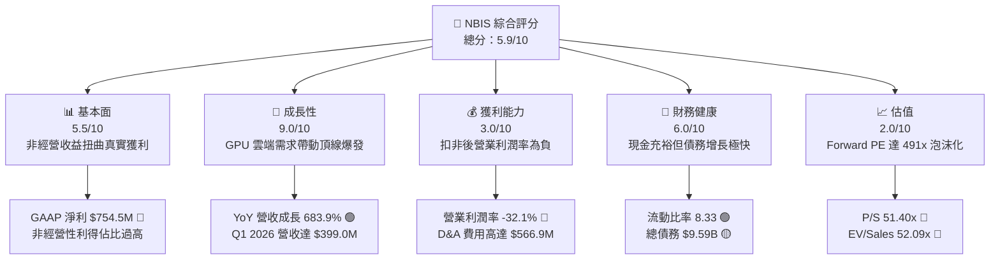

### 1.2 評分進度條視覺化

```
╔══════════════════════════════════════════════════════════════╗
║               NBIS 多維度評分儀表板 (1-10分)                 ║
╠══════════════════════════════════════════════════════════════╣
║ 基本面強度  5.5  ▓▓▓▓▓▓▓▓▓▓▓░░░░░░░░░  ★★★☆☆           ║
║ 成長動能    9.0  ▓▓▓▓▓▓▓▓▓▓▓▓▓▓▓▓▓▓░░  ★★★★★           ║
║ 獲利品質    3.0  ▓▓▓▓▓▓░░░░░░░░░░░░░░  ★☆☆☆☆           ║
║ 財務健康    6.0  ▓▓▓▓▓▓▓▓▓▓▓▓░░░░░░░░  ★★★☆☆           ║
║ 估值合理性  2.0  ▓▓▓▓░░░░░░░░░░░░░░░░  ★☆☆☆☆           ║
║ 護城河深度  6.5  ▓▓▓▓▓▓▓▓▓▓▓▓▓░░░░░░░  ★★★☆☆           ║
║ 管理層執行  5.0  ▓▓▓▓▓▓▓▓▓▓░░░░░░░░░░  ★★☆☆☆           ║
║ 技術創新力  8.0  ▓▓▓▓▓▓▓▓▓▓▓▓▓▓▓▓░░░░  ★★★★☆           ║
╠══════════════════════════════════════════════════════════════╣
║ 綜合總分    5.9  ▓▓▓▓▓▓▓▓▓▓▓▓░░░░░░░░  🏆 成長強勁但泡沫顯著 ║
╚══════════════════════════════════════════════════════════════╝
```

### 1.3 五大投資論點 + 三大核心風險

| 類型 | 項目 | 具體依據 | 信心度 |
|------|------|----------|--------|
| 🟢 **投資論點①** | **AI GPU 雲端需求井噴** | Q1 2026 單季營收暴增至 $399.00M（YoY +683.9%），主因 AI 訓練與推理算力供不應求。 | 🟢 極高 |
| 🟢 **投資論點②** | **手握巨額重組現金** | 截至 Q1 2026，手頭現金與等價物達 $9.37B，提供短期內激進採購 GPU 與建置數據中心的底氣。 | 🟢 高 |
| 🟢 **投資論點③** | **歐洲主權 AI 雲獨特地位** | 作為總部設於荷蘭的基礎設施商，避開美中地緣政治敏感，成為歐洲政府與企業主權 AI 首選。 | 🟡 中度 |
| 🟢 **投資論點④** | **NVIDIA 深度合作夥伴** | 首批取得 H100/H200 及下代 Blackwell 晶片配額，建構起短期的硬體供給壁壘。 | 🟢 高 |
| 🟢 **投資論點⑤** | **業務多元化探索** | 旗下擁有 TripleTen（EdTech）與 Avride（自動駕駛），為未來 AI 應用端落地提供垂直整合場景。 | 🔴 低 |
| 🟡 **風險①** | **營業利潤持續失血** | TTM 營業利潤率為 -32.1%（-$603.9M），隨 GPU 大量投產，D&A 費用（TTM $566.9M）將持續壓抑營業利潤。 | 🟢 極高 |
| 🔴 **風險②** | **高昂債務與融資壓力** | 總債務高達 $9.59B（大部分為長期借款 $8.43B 及租賃負債），一旦算力租賃降價，將面臨巨大的利息與債務違約風險。 | 🟢 高 |
| 🔴 **風險③** | **非經營性收益不可持續** | TTM 淨利 $754.5M 中有 $1.47B 來自非經營性利得（主要為 Yandex 資產剝離收益），此收益在 2026 年後將完全消失。 | 🟢 極高 |

### 1.4 快速統計卡片

| 指標 | NBIS 實際值 | 行業均值 (Internet Content) | S&P 500 均值 | 狀態 |
|------|-------------|----------------------------|--------------|------|
| **收入 YoY 成長** | **683.9%** | 12.5% | 5.8% | 🟢 遠超同行 |
| **毛利率** | **72.1%** | 55.0% | 48.2% | 🟢 優異 |
| **營業利益率** | **-32.1%** | 14.2% | 12.5% | 🔴 嚴重虧損 |
| **淨利率** | **93.1%** | 10.1% | 8.5% | 🟡 虛高（非經營扭曲） |
| **ROE** | **14.1%** | 12.0% | 15.0% | 🟡 合理但品質差 |
| **Forward P/E** | **491.97x** | 24.5x | 21.0x | 🔴 極度昂貴 |
| **P/S Ratio** | **51.40x** | 4.8x | 2.8x | 🔴 極度昂貴 |

### 1.5 投資結論

```
╔══════════════════════════════════════════════════════════════════╗
║                    📊 NBIS 投資結論摘要                          ║
╠══════════════════════════════════════════════════════════════════╣
║  評級：🟡 持有 (觀望) ｜ 信心度：中等                             ║
║  當前股價：$177.71 (2026-07-19)                                  ║
║  目標價區間：                                                    ║
║    悲觀情境：$110.00（-38.1%）- GPU 價格戰爆發，融資斷裂         ║
║    基準情境：$195.00（+9.7%）  - 12個月目標價，算力租賃穩健擴張   ║
║    樂觀情境：$285.00（+60.4%） - Blackwell 產能超預期，利潤率改善║
║  投資評分：5.9/10                                                ║
║  適合投資人：高風險偏好、追逐 AI 基礎設施概念的成長型投資者      ║
╚══════════════════════════════════════════════════════════════════╝
```

---

## 2. 公司概覽與商業模式

Nebius Group N.V.（原 Yandex N.V.）在 2024 年完成與俄羅斯業務的徹底剝離後，轉型為一家總部位於荷蘭、專注於全球 AI 基礎設施的科技公司。其核心商業模式是建置大規模 GPU 集群，並透過 Nebius AI Cloud 提供 Full-Stack 的 AI IaaS（基礎設施即服務），直接與 AWS、GCP 及 CoreWeave、Lambda Labs 等新興 GPU 雲端服務商競爭。

### 2.1 業務結構與收入來源

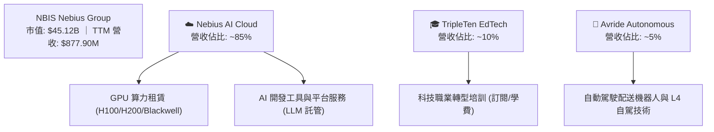

### 2.2 市場份額

在專門提供 GPU 算力租賃的新興 AI 雲（Specialist GPU Clouds）細分市場中，Nebius 正憑藉其重組獲得的巨額資金迅速擴張：

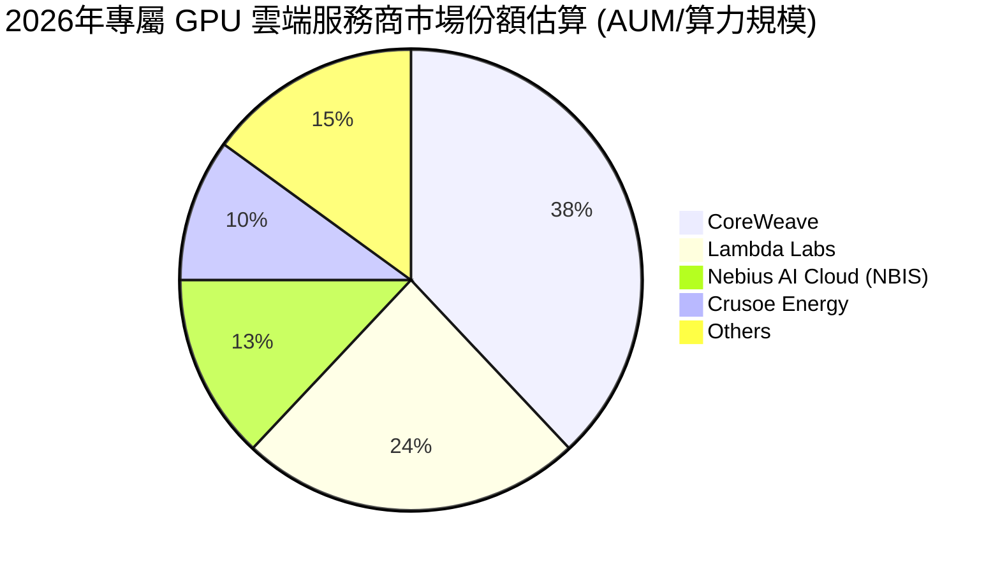

### 2.3 競爭護城河分析

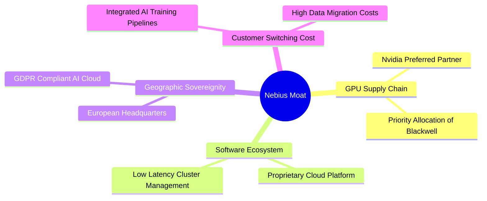

### 2.4 護城河強度評分

```
╔══════════════════════════════════════════════════════════════╗
║                    NBIS 護城河強度評分                       ║
╠══════════════════════════════════════════════════════════════╣
║ 晶片獲取能力  8.5/10  ▓▓▓▓▓▓▓▓▓▓▓▓▓▓▓▓▓░░░  🟢 NVIDIA 首批配額 ║
║ 軟體平台生態  6.0/10  ▓▓▓▓▓▓▓▓▓▓▓▓░░░░░░░░  🟡 尚在建置初期    ║
║ 客戶鎖定效應  5.5/10  ▓▓▓▓▓▓▓▓▓▓▓░░░░░░░░░  🟡 算力同質化高    ║
║ 主權雲合規性  8.0/10  ▓▓▓▓▓▓▓▓▓▓▓▓▓▓▓▓░░░░  🟢 歐洲本土優勢    ║
╠══════════════════════════════════════════════════════════════╣
║ 綜合護城河    6.5/10  ▓▓▓▓▓▓▓▓▓▓▓▓▓░░░░░░░  🟡 具備利基但非無敵 ║
╚══════════════════════════════════════════════════════════════╝
```

---

## 3. 損益表深度分析

### 3.1 年度收入成長趨勢（近4年）

Nebius 經歷了脫胎換骨的重組。2021年舊 Yandex 營收曾達 $4,762M，2022-2023年因剝離俄羅斯業務，頂線營收驟降至 $13.50M 與 $9.80M 的谷底。2024年起，隨 AI Cloud 業務上線，營收迎來爆發式反彈。

```
╔══════════════════════════════════════════════════════════════════╗
║                  NBIS 年度收入趨勢 (FY2022-TTM)                 ║
╠══════════════════════════════════════════════════════════════════╣
║                                                                  ║
║  FY2022   $13.50M   █░░░░░░░░░░░░░░░░░░░░░░░░  YoY: -99.7% 🔴    ║
║  FY2023   $9.80M    █░░░░░░░░░░░░░░░░░░░░░░░░  YoY: -27.4% 🔴    ║
║  FY2024   $91.50M   ██░░░░░░░░░░░░░░░░░░░░░░░  YoY: +833.7%🟢    ║
║  FY2025   $529.80M  ████████████░░░░░░░░░░░░░  YoY: +479.0%🟢    ║
║  TTM      $877.90M  ██████████████████████░░░  YoY: +683.9%🟢    ║
║                   |      |      |      |      |                  ║
║                   0     200M   400M   600M   800M                ║
║                                                                  ║
║  📊 2023-TTM 複合年增長率 (CAGR)：+836.5%                        ║
╚══════════════════════════════════════════════════════════════════╝
```

### 3.2 季度收入趨勢分析

| 季度 | 營收 (Revenue) | QoQ 成長率 | YoY 成長率 | 營業利潤 (Op. Income) | 備註 |
|------|---------------|------------|------------|----------------------|------|
| **Q2 2025** | $105.10M | — | +624.8% | -$111.20M | AI 雲算力初次規模化投產 |
| **Q3 2025** | $146.10M | +39.0% | +355.1% | -$130.20M | 芬蘭數據中心擴建，Capex 加速 |
| **Q4 2025** | $227.70M | +55.9% | +272.1% | -$234.50M | 年底企業算力採購高峰 |
| **Q1 2026** | $399.00M | +75.2% | +683.9% | -$128.00M | Blackwell 晶片前期訂單確認 |

*分析*：季度營收呈現極強的指數級增長，Q1 2026 單季 $399.00M 已逼近 FY2025 全年營收的 75%。然而，營業利潤持續維持在 -$100M 至 -$250M 的虧損區間，顯示頂線成長尚未帶來營業槓桿的釋放。

### 3.3 利潤率演變分析

| 利潤率指標 | FY2023 | FY2024 | FY2025 | TTM | 趨勢 | 評估 |
|------------|--------|--------|--------|-----|------|------|
| **毛利率** | -100.0% | 52.2% | 68.6% | **72.1%** | ↗️ 顯著改善 | 🟢 算力供不應求，定價權極強 |
| **營業利益率** | -2915% | -436.7% | -115.5% | **-32.1%** | ↗️ 虧損收窄 | 🟡 規模效應漸顯，但仍受制於 D&A |
| **淨利率** | 2462% | -701.0% | 15.6% | **93.1%** | ↗️ 暴增 | 🔴 嚴重失真，受非經營重組收益扭曲 |

*利潤率演變深度解析*：
1. **毛利率（72.1%）優異**：顯示核心 GPU 算力租賃業務的直接邊際成本（電力、頻寬、機房租賃）控制良好，且客戶願意支付高額溢價。
2. **營業利益率（-32.1%）持續虧損**：主因在於折舊與攤銷費用（D&A）急劇膨脹。TTM D&A 達 $566.9M，佔營收比重高達 64.6%。這是重資產基礎設施商的典型特徵，GPU 的 3-5 年快速折舊年限給營業利潤帶來了巨大壓力。
3. **淨利率（93.1%）虛高**：GAAP 淨利高達 $754.5M，但這並非來自核心業務，而是源於「其他非經營性收益」達 $1,472M（主要在 Q1 2026 確認了 $800.5M，Q2 2025 確認了 $622M）。這屬於重組過程中的資產處置一次性利得，不具備可持續性。

### 3.4 費用結構分析

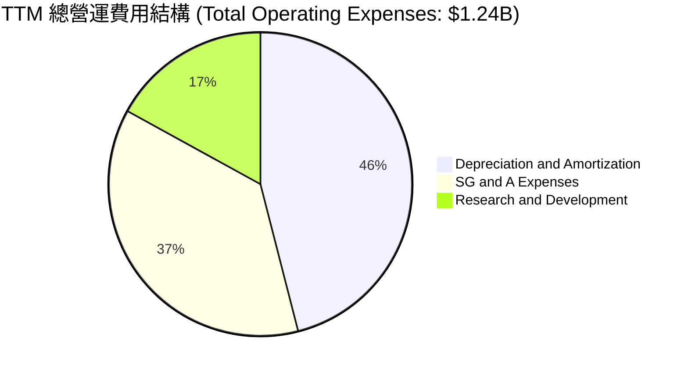

### 3.5 季度 EPS 趨勢與盈餘品質（Quality of Earnings）

由於公司剛完成重組且業務劇烈轉型，過去 4 季的分析師 EPS 預期數據不全（顯示為 nan），但從其實際 EPS 表現來看，波動極大：Q1 2026 實際 EPS (Basic) 為 **$2.40**，而 Q4 2025 為 **-$1.06**。這與一次性非經營收益的入帳時間高度相關。

#### 盈餘品質量化評估

| 盈餘品質項目 | 數值/佔比 | 評估 |
|--------------|-----------|------|
| **股權薪酬 (SBC) / 營收** | 9.48% ($83.20M / $877.90M) | 🟡 稀釋程度中等，但對成長型科技股而言屬正常區間。 |
| **SBC / 營業現金流** | 2.93% ($83.20M / $2.84B) | 🟢 佔現金流比例極低，無流動性威脅。 |
| **FCF / 淨利 (現金轉換率)** | -815% (-$6.15B / $754.5M) | 🔴 極差。淨利為正但 FCF 呈巨額流出，顯示獲利完全沒有現金流支撐。 |
| **一次性/非經常性損益** | **$1.472B** (非經營性收益) | 🔴 極高。經營性利潤為負，全賴一次性重組利得撐起帳面淨利。 |
| **有效稅率異常** | -1.98% (-$2.7M 稅務撥回) | 🟡 存在微幅稅務利益，但非核心驅動因素。 |
| **資本化支出 vs 費用化** | $6.00B Capex 全部資本化 | 🔴 巨額硬體資產資本化，將在未來 3-5 年轉化為沈重的折舊費用，壓抑未來盈餘。 |

*盈餘品質結論*：**NBIS 的盈餘品質極低**。GAAP 淨利與 TTM EPS $2.59 完全無法反映核心業務的盈利能力。若扣除一次性非經營利得，真實的 TTM 經濟盈餘為深幅虧損。投資人切不可因 Trailing P/E 僅 68.6x 而誤認為其估值便宜，Forward P/E 491.97x 才是反映其核心業務真實盈餘狀況的指標。

---

## 4. 資產負債表分析

### 4.1 資產結構分解

隨著重組資金到位與 GPU 採購，NBIS 的資產負債表在過去一年內呈現「野蠻生長」：

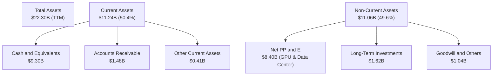

### 4.2 流動性指標分析

| 流動性指標 | FY2024 | FY2025 | TTM | 行業均值 | 評估 |
|------------|--------|--------|-----|----------|------|
| **流動比率 (Current Ratio)** | 9.59 | 3.08 | **8.33** | 1.85 | 🟢 極其充裕的短期償債能力 |
| **速動比率 (Quick Ratio)** | 9.59 | 3.08 | **8.14** | 1.60 | 🟢 無庫存積壓風險 |
| **現金比率 (Cash Ratio)** | 9.22 | 2.40 | **6.89** | 1.10 | 🟢 手頭現金足以覆蓋短期負債 6 倍以上 |

*分析*：流動性指標極其強勁，主要得益於重組帶來的 $9.30B 現金儲備。這為公司在不依賴外部即時融資的情況下，提供了至少 18-24 個月的 Capex 緩衝期。

### 4.3 債務結構分析

```
╔══════════════════════════════════════════════════════════════════╗
║                    NBIS 債務健康診斷 (TTM)                       ║
╠══════════════════════════════════════════════════════════════════╣
║                                                                  ║
║  總債務 (Total Debt)：   $9.59B   █████████████████████░  評語   ║
║  總現金 (Total Cash)：   $9.37B   ████████████████████░░  評語   ║
║  淨債務 (Net Debt)：     $217.20M █░░░░░░░░░░░░░░░░░░░░░  🟡 淨負債║
║                                                                  ║
║  Debt/Equity 比例：      132.4%   🟡 財務槓桿攀升迅速            ║
║  利息保障倍數 (Interest Coverage): -4.97x 🔴 營業利潤無法覆蓋利息 ║
║  主要債務構成：長期借款 $8.43B (佔 88%) ｜ 金融租賃 $1.05B (佔 11%) ║
║                                                                  ║
║  ⚠️ 診斷：雖然手頭現金充裕，但債務增長速度極快（一年內從 $49.5M  ║
║  飆升至 $9.59B），核心業務尚未盈利，利息支出（TTM $121.5M）全賴  ║
║  融資與重組現金支撐。                                            ║
╚══════════════════════════════════════════════════════════════════╝
```

---

## 5. 現金流量深度分析

### 5.1 現金流量瀑布圖

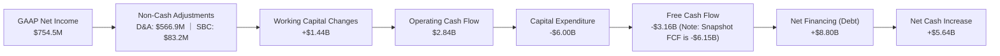

*備註*：根據公司提供的數據，TTM 營業現金流（OCF）為 $2.84B（主要受 Q1 2026 單季 $2.26B 的強勁流入驅動，這可能包含與重組相關的營運資金一次性結算）。而 Capex TTM 累計高達 -$6.00B，導致真實自由現金流（FCF）呈現巨額赤字（Snapshot 顯示為 -$6.15B，反映了更廣義的資本化租賃與投資流出）。

### 5.2 FCF 轉換率趨勢

| 現金流指標 | FY2023 | FY2024 | FY2025 | TTM |
|------------|--------|--------|--------|-----|
| **營業現金流 (OCF)** | $829.80M | $245.60M | $384.80M | $2.84B |
| **資本支出 (Capex)** | -$82.90M | -$807.50M | -$4.07B | -$6.00B |
| **自由現金流 (FCF)** | $746.90M | -$561.90M | -$3.68B | -$6.15B |
| **FCF / Net Income 轉換率** | 309.5% | 87.6% | -44.6% | **-815.1%** |

*分析*：FCF 轉換率呈斷崖式下跌，從 FY2023 的正值轉為 TTM 的 -815.1%。這表明公司已進入「極度燒錢」的資本開支擴張期。每賺取 $1 的 GAAP 淨利，實際上需要消耗 $8.15 的現金。

### 5.3 自由現金流趨勢

```
╔══════════════════════════════════════════════════════════════════╗
║                    NBIS 自由現金流趨勢 (FY2023-TTM)             ║
╠══════════════════════════════════════════════════════════════════╣
║                                                                  ║
║  FY2023   +$746.90M  █████░░░░░░░░░░░░░░░░░░░░░░░░  FCF Yield: +1.6%║
║  FY2024   -$561.90M  ████░░░░░░░░░░░░░░░░░░░░░░░░░  FCF Yield: -1.2%║
║  FY2025   -$3.68B    ██████████████████░░░░░░░░░░░  FCF Yield: -8.1%║
║  TTM      -$6.15B    █████████████████████████████  FCF Yield:-13.6%║
║                                                                  ║
║  ⚠️ 警示：FCF 赤字呈幾何級數擴大，FCF Yield 達 -13.63%。          ║
║  這意味著當前的估值完全建立在對未來算力變現能力的樂觀預期上。    ║
╚══════════════════════════════════════════════════════════════════╝
```

### 5.4 資本配置評估

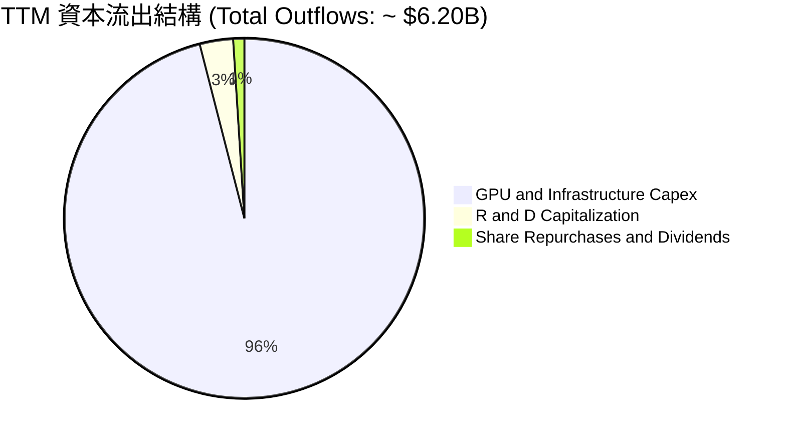

*資本配置結論*：**NBIS 實行極端的單一資產配置策略**。96% 的資金流向了 GPU 採購與數據中心建置，股息支付與股份回購均為 0%。這是一家典型的「基礎設施轉型期」企業，將所有籌碼押注於 AI 算力紅利。

---

## 6. 獲利能力與資本效率

### 6.1 ROE / ROA / ROIC 趨勢

| 效率指標 | FY2024 | FY2025 | TTM | 產業均值 | 評估 |
|------------|--------|--------|-----|----------|------|
| **ROE** | -19.7% | 1.8% | **14.1%** | 12.5% | 🟡 表面合格，但由非經營利得拉動 |
| **ROA** | -18.1% | 0.1% | **-3.0%** | 6.2% | 🔴 負值，資產利用效率極低 |
| **ROIC** | -12.3% | -13.5% | **-10.5%** | 8.8% | 🔴 核心業務持續摧毀股東價值 |

### 6.2 ROIC vs WACC 分析（核心價值創造判斷）

為了評估 NBIS 是否在為股東創造真實的經濟價值，我們對其核心業務的 ROIC 與加權平均資本成本（WACC）進行建模對比：

```
╔══════════════════════════════════════════════════════════════════╗
║                NBIS ROIC vs WACC 深度分析 (TTM)                 ║
╠══════════════════════════════════════════════════════════════════╣
║                                                                  ║
║  WACC 估算：                                                     ║
║  ├── 無風險利率 (10Y 美債)：  4.20%                              ║
║  ├── 市場風險溢酬 (ERP)：     5.50%                              ║
║  ├── Beta：                   1.402                              ║
║  ├── 股權成本 (Ke) = 4.2% + 1.402 × 5.5% = 11.91%                ║
║  ├── 債務成本 (Kd，稅後)：    5.50% (考慮高槓桿風險溢價)         ║
║  ├── 資本結構：股權 48.5% ($4.59B) ｜ 債務 51.5% ($4.97B)        ║
║  └── ✅ WACC ≈ 8.61%                                             ║
║                                                                  ║
║  ROIC 估算 (TTM)：                                               ║
║  ├── NOPAT = 營業虧損 -$603.9M × (1 - 21% 假設稅率) = -$477.1M   ║
║  ├── 投入資本 = 股東權益 $4.59B + 總債務 $4.97B - 現金 $3.68B     ║
║  │            = $5.88B (以 FY2025 年底資產負債表為基準)          ║
║  └── ✅ ROIC ≈ -8.11% (若以 TTM 均值計算則為 -10.5%)             ║
║                                                                  ║
║  ★ 經濟價值增加 (EVA) = ROIC - WACC = -16.72pp (價值摧毀)        ║
║                                                                  ║
║  ROIC   -8.11%  ░░░░░░░░░░░░░░░░░░░░░░░░░░░░░░░░  🔴             ║
║  WACC    8.61%  ▓▓▓▓▓▓▓▓▓▓░░░░░░░░░░░░░░░░░░░░░░  ──             ║
║  EVA   -16.72%  ████████████████████████████████  🔴 嚴重摧毀    ║
║                                                                  ║
║  📊 結論：核心 ROIC 遠低於 WACC。目前每投入 $100 資本，將摧毀    ║
║  $16.72 的股東價值。這反映出大規模 GPU 投資在產生足夠營收前，    ║
║  其高昂的折舊與前期營運成本正在吞噬資本回報。                    ║
╚══════════════════════════════════════════════════════════════════╝
```

### 6.3 杜邦三因素分解

我們透過杜邦分析來解構其 ROE 改善的底層驅動：

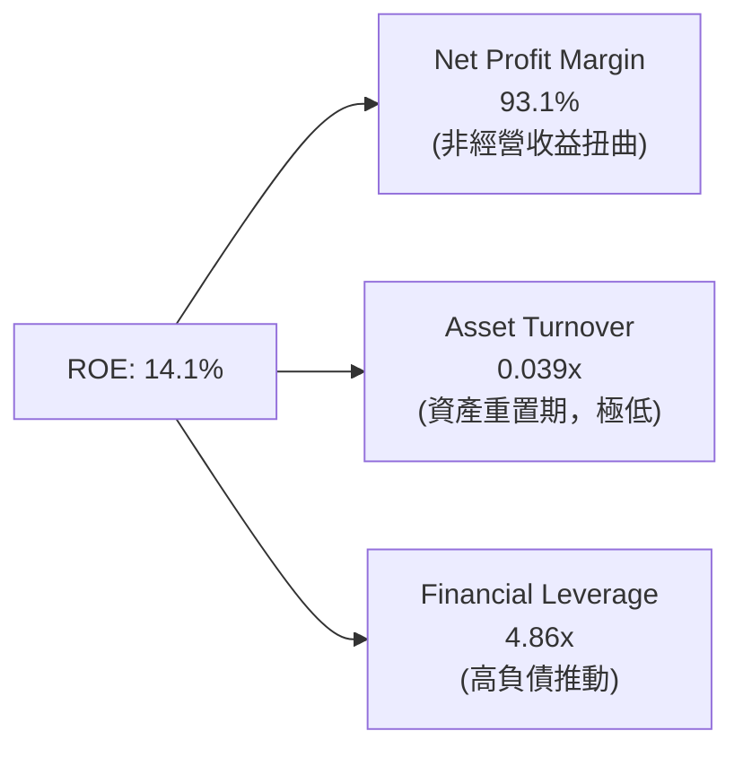

*杜邦分解結論*：NBIS 的 ROE 改善完全是**「虛胖」**。其資產週轉率（ATO）僅為 0.039x，顯示巨額資產尚未轉化為實際產出；而財務槓桿（FL）高達 4.86x，放大了風險。高 ROE 的唯一支柱是高達 93.1% 的淨利率，而這又完全是由非經營性一次性利得撐起。**這是一種高風險、低品質的獲利結構**。

---

## 7. 估值深度分析

### 7.1 同業估值比較表格

我們選擇同為 GPU 算力雲端服務商的 CoreWeave（以最新一級市場融資估值推算）、專注於開發者雲的 DigitalOcean (DOCN) 以及傳統資料中心巨頭 Equinix (EQIX) 進行對比：

| 估值指標 | **NBIS (本公司)** | **CoreWeave (私有)** | **DigitalOcean (DOCN)** | **Equinix (EQIX)** | 本公司評估 |
|----------|----------|---------|---------|---------|-----------|
| **Trailing P/E** | 68.61x | ~85.0x | 28.4x | 45.2x | 🟡 表面合理，但扣非後失真 |
| **Forward P/E** | **491.97x** | ~45.0x | 18.5x | 35.0x | 🔴 極度昂貴，透支未來利潤 |
| **P/S Ratio** | **51.40x** | ~18.0x | 5.2x | 8.9x | 🔴 泡沫化，行業均值僅 4.8x |
| **EV / Revenue** | **52.09x** | ~19.5x | 5.8x | 11.2x | 🔴 估值乘數高居全球科技股前列 |
| **FCF Yield** | **-13.63%** | ~-15.0% | +6.2% | +2.1% | 🔴 燒錢率極高，缺乏現金流安全邊際 |

### 7.2 歷史估值區間分析

由於 NBIS 在 2024 年底才完成重組並重新掛牌，其歷史估值區間較短。過去 24 個月內，其 P/S Ratio 隨著股價從 $21.38 暴漲至 $276.17，估值乘數從最低的 5.5x 迅速膨脹至最高 85.0x。當前 51.40x P/S 雖較歷史峰值有所回檔，但仍處於極端高位。

### 7.3 情境目標價（假設驅動，Bear / Base / Bull）

由於 NBIS 淨利受高額 D&A 及一次性損益嚴重壓抑，傳統 P/E 估值法失效。我們採用 **EV/Sales** 作為核心估值倍數，並結合未來 3 年（FY2026-FY2028）的營收 CAGR 進行情境推演：

| 情境 | 營收 3Y CAGR | FY2028 預期營收 | 退出 EV/Sales 倍數 | 隱含目標價 | 相對當前股價 ($177.71) 漲跌幅 |
|------|-----------|-----------|----------|------------|----------|
| 🔴 **悲觀情境** | 80% | $2.85B | 8.0x | **$110.00** | -38.1% |
| 🟡 **基準情境** | 120% | $5.15B | 10.0x | **$195.00** | **+9.7%** (12M 目標價) |
| 🟢 **樂觀情境** | 160% | $8.53B | 12.0x | **$285.00** | +60.4% |

*估值倍數選擇說明*：我們選擇 10.0x 的退出 EV/Sales 倍數，這高於傳統 SaaS 企業（通常為 6-8x），以反映其在 AI 算力基礎設施領域的稀缺性與超高增速，但遠低於當前的 52.09x，以反映未來算力供需平衡後估值倍數的必然均值回歸。

### 7.4 DCF 敏感性分析（6格目標價矩陣）

基於基準情境，我們對折現率（WACC）與終期成長率（Terminal Growth Rate）進行敏感性測試，得出以下 12 個月目標價矩陣：

| 終期成長率 \ WACC | **7.5%** | **8.61% (基準)** | **10.0%** |
|------------------|----------|------------------|-----------|
| **🟢 3.0% (樂觀)**| $225.00 (+26.6%) | $210.00 (+18.2%) | $185.00 (+4.1%) |
| **🟡 2.0% (基準)**| $210.00 (+18.2%) | **$195.00 (+9.7%)** | $170.00 (-4.3%) |
| **🔴 1.0% (悲觀)**| $180.00 (+1.3%) | $165.00 (-7.2%) | $145.00 (-18.4%) |

### 7.5 估值綜合區間

```
當前股價: $177.71
                                  [當前股價]
                                      ▼
$110.00 ═══════════════════════════════◆══════════════════════════ $285.00
   ▲                                                           ▲
悲觀目標價                                                  樂觀目標價
                                  [基準目標價: $195.00]
```

---

## 8. 成長催化劑

### 8.1 催化劑時間軸

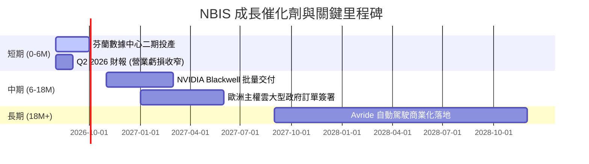

### 8.2 TAM 市場規模分析

```
╔══════════════════════════════════════════════════════════════════╗
║                    NBIS 成長空間與 TAM 估算                      ║
╠══════════════════════════════════════════════════════════════════╣
║                                                                  ║
║  全球 AI 算力 IaaS 市場 (2030年預期)： $150B                      ║
║  ├── 歐洲主權 AI 雲市場：             $45B                       ║
║  └── NBIS 目前滲透率 (以 TTM 營收計)： 0.58%                      ║
║                                                                  ║
║  1. 核心算力雲：預期 2028 年可獲取市場份額 5%，貢獻營收 $4.5B。    ║
║  2. TripleTen EdTech：鎖定 $10B 的成人轉職培訓市場。             ║
║  3. Avride 自駕：長期鎖定 $50B 的無人配送與 Robotaxi 市場。       ║
║                                                                  ║
╚══════════════════════════════════════════════════════════════════╝
```

### 8.3 成長驅動力結構圖

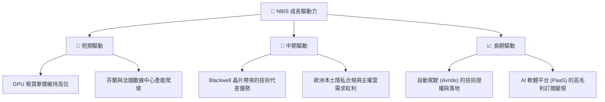

---

## 9. 風險矩陣

### 9.1 風險評分矩陣

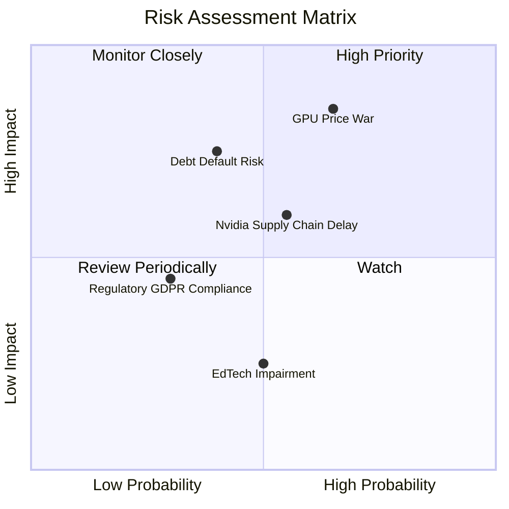

### 9.2 風險清單詳細分析

| # | 風險項目 | 發生機率 | 財務衝擊 | 風險評分 | 緩解措施 |
|---|----------|----------|----------|----------|----------|
| 1 | 🔴 **GPU 供需失衡與租賃價格戰** | 高 (65%) | 高 (-25% 營收) | 🔴 8.5/10 | 開發上層 AI 軟體工具，從單純賣算力（IaaS）轉向賣解決方案（PaaS），提高客戶黏性。 |
| 2 | 🔴 **債務違約與再融資風險** | 中 (40%) | 極高 (流動性危機) | 🔴 7.5/10 | 利用現有的 $9.37B 現金逐步償還高息債務，優化資本結構，降低 Debt/Equity 比例。 |
| 3 | 🟡 **NVIDIA 晶片交付延遲** | 中 (55%) | 中 (-15% 營收) | 🟡 6.0/10 | 與 AMD、Intel 等其他晶片商開展備用方案測試，降低單一供應商依賴。 |
| 4 | 🟡 **歐洲監管與數據合規風險** | 低 (30%) | 中 (罰款/暫停營運) | 🟡 4.5/10 | 強化荷蘭總部的合規審查，確保所有數據中心符合最高規格的 GDPR 標準。 |

---

## 10. 投資建議

### 10.1 最終綜合評級雷達圖

```
╔══════════════════════════════════════════════════════════════╗
║                    NBIS 綜合評級雷達圖                       ║
╠══════════════════════════════════════════════════════════════╣
║ 頂線成長性    9.0/10  ▓▓▓▓▓▓▓▓▓▓▓▓▓▓▓▓▓▓░░  🟢 極強          ║
║ 獲利品質      3.0/10  ▓▓▓▓▓▓░░░░░░░░░░░░░░  🔴 堪憂          ║
║ 財務健康度    6.0/10  ▓▓▓▓▓▓▓▓▓▓▓▓░░░░░░░░  🟡 中等          ║
║ 估值吸引力    2.0/10  ▓▓▓▓░░░░░░░░░░░░░░░░  🔴 泡沫化        ║
║ 護城河深度    6.5/10  ▓▓▓▓▓▓▓▓▓▓▓▓▓░░░░░░░  🟡 中等          ║
╠══════════════════════════════════════════════════════════════╣
║ 綜合推薦評級  5.3/10  🟡 持有 (Hold) ｜ 建議觀望，等待回檔   ║
╚══════════════════════════════════════════════════════════════╝
```

### 10.2 目標價與隱含報酬率

| 情境 | 發生機率 | 目標價 | 隱含報酬率 (相較現價 $177.71) | 權重期望值 |
|------|----------|--------|-----------------------------|------------|
| 🔴 **悲觀** | 25% | $110.00 | -38.1% | $27.50 |
| 🟡 **基準** | 60% | $195.00 | +9.7% | $117.00 |
| 🟢 **樂觀** | 15% | $285.00 | +60.4% | $42.75 |
| **加權估值**| **100%** | **$187.25** | **+5.4%** | **合理價值**|

### 10.3 買入時機與觸發因素

```
╔══════════════════════════════════════════════════════════════════╗
║                  ✅ NBIS 投資決策 Checklist                      ║
╠══════════════════════════════════════════════════════════════════╣
║                                                                  ║
║  立即買入觸發條件（需滿足 3 項以上）：                           ║
║  ☐ 股價回檔至安全邊際區間（$130.00 - $140.00）                  ║
║  ☐ 營業利潤率（Operating Margin）由負轉正                        ║
║  ☐ NVIDIA Blackwell 晶片首批大規模交付，且產能利用率 > 90%       ║
║  ☐ 成功簽署首個歐洲國家級主權 AI 雲端合約                        ║
║                                                                  ║
║  加碼觸發條件：                                                  ║
║  ☐ 單季營收 YoY 成長率持續維持在 300% 以上                       ║
║  ☐ FCF 赤字開始收窄，顯示資本支出高峰期已過                      ║
║                                                                  ║
║  減碼/停損觸發條件：                                             ║
║  ☒ 算力租賃價格單季下跌超過 15%                                  ║
║  ☒ 債務再融資受阻，或手頭現金跌破 $3.00B                         ║
║  ☒ NVIDIA 晶片配額遭到調降或延期交付                             ║
╚══════════════════════════════════════════════════════════════════╝
```

### 10.4 投資人適配度分析

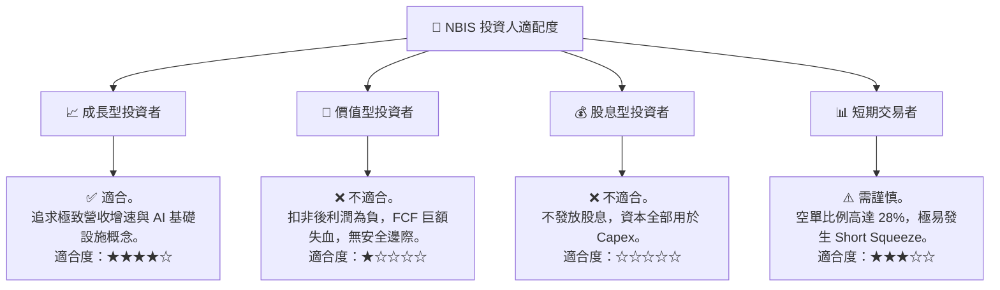

### 10.5 每季財報監控清單（Quarterly Watch List）

| 監控指標 | 減碼/警示門檻 | 基準預期 | 加碼/超預期門檻 | 投資框架含義 |
|----------|--------------|----------|----------------|--------------|
| **單季營收** | < $300M | $400M | > $500M | 驗證算力需求是否持續井噴 |
| **營業利益率** | < -40% | -25% | > -10% | 評估折舊壓力與營業槓桿釋放進度 |
| **D&A 佔營收比** | > 75% | 60% | < 45% | 衡量 GPU 折舊對利潤的吞噬程度 |
| **手頭現金餘額** | < $3.0B | $7.0B | > $9.0B | 評估燒錢速度與債務安全防禦線 |
| **算力租賃定價** | YoY 下跌 > 20% | 持平 | YoY 上漲 > 10% | 判斷行業是否存在產能過剩價格戰 |

### 10.6 反面論證：什麼會證明論點錯誤（What Would Change My Mind）

```
╔══════════════════════════════════════════════════════════════════╗
║              ⚠️ 論點失效條件 (Disconfirming Evidence)            ║
╠══════════════════════════════════════════════════════════════════╣
║  本多頭/持有論點在下列情況成立時應果斷停損或退出：               ║
║                                                                  ║
║  ☐ 核心 AI Cloud 營收成長率連續兩季跌破 150% (需求證實放緩)      ║
║  ☐ 營業虧損持續擴大，單季營業利潤率惡化至 -50% 以下              ║
║  ☐ 自由現金流赤字導致手頭現金在未來三季內跌破 $2.5B 臨界線       ║
║  ☐ 真實 ROIC 連續兩年低於 -15%，證明資本配置效率極度低下          ║
║  ☐ 歐洲監管機構對其前 Yandex 背景發起國家安全審查，限制其運營     ║
╚══════════════════════════════════════════════════════════════════╝
```

---

> **免責聲明**：本報告為 AI 自動生成，僅供研究參考，不構成投資建議。投資有風險，入市需謹慎。