# NBIS 基本面深度分析報告

> **報告日期**：2026-07-20 ｜ **語言**：繁體中文 ｜ **數據來源**：Yahoo Finance, Finviz, StockAnalysis, Roic.ai ｜ **分析師**：CFA 級機構研究

---

## 目錄

| # | 章節 | 核心結論 |
|---|------|----------|
| 1 | **執行摘要** | 評級為「買入」(Buy)，基準目標價 $258.71，隱含 +41.7% 上行空間。 |
| 2 | **公司概覽與商業模式** | 自 Yandex 拆分重組，轉型為歐洲頂級 AI 算力基礎設施與 GPUaaS 龍頭，具備獨特生態。 |
| 3 | **損益表深度分析** | TTM 營收暴增 683.9% 至 $8.78億，但 GAAP 淨利受一次性非經營性收益扭曲，核心業務仍呈營運虧損。 |
| 4 | **資產負債表分析** | 手握 $93.7億巨額現金，但總債務達 $95.9億，流動比率 8.33x，短期無償債風險。 |
| 5 | **現金流量深度分析** | 營運現金流轉正至 $28.4億，但 Capex 高達 -$60億，自由現金流（FCF）赤字擴大。 |
| 6 | **獲利能力與資本效率** | 核心 ROIC 為 -10.1%，WACC 為 8.6%，目前處於資本投入期，尚未實現正向經濟增值（EVA）。 |
| 7 | **估值深度分析** | P/S 達 52.8x，相較同行溢價顯著；採用 EV/Revenue 進行情境建模，基準目標價 $258.71。 |
| 8 | **成長催化劑** | 芬蘭數據中心擴建、NVIDIA Blackwell 晶片獲取、以及 AI Studio 軟體生態的變現。 |
| 9 | **風險矩陣** | GPU 供需反轉、超大型雲端服務商（Hyperscaler）價格戰、以及高股權稀釋風險（SBC 佔比高）。 |
| 10 | **投資建議** | 適合高風險偏好、長線成長型投資人；建立每季財報監控指標與論點失效之量化停損門檻。 |

---

## 1. 執行摘要

Nebius Group N.V.（美股代碼：**NBIS**）正處於全球科技史上最激進的業務轉型期。公司前身為俄羅斯科技巨頭 Yandex N.V.，在成功剝離其俄羅斯本土業務並獲得約 $54億的淨現金對價後，已完全轉型為一家總部位於荷蘭、聚焦歐洲與全球市場的純 AI 基礎設施與全棧 GPU 雲端服務商（GPU-as-a-Service, GPUaaS）。

基於 TTM 營收高達 **$8.779億**（YoY 成長 **683.9%**）與手握 **$93.7億** 的充沛現金儲備，Nebius 正在以極快的速度擴建其位於芬蘭及歐洲其他地區的綠色數據中心。然而，當前 GAAP 淨利 **$7.545億**（淨利率 **93.1%**）主要受到高達 **$14.72億** 的一次性非經營性收益（資產剝離與重組收益）所美化。若回歸核心業務，其 TTM 營業利潤為 **-$6.039億**（營業利益率 **-68.8%**），且 TTM 自由現金流（FCF）因資本支出（Capex）高達 **-$59.96億** 而呈現 **-$31.56億**（或按調整後口徑為 **-$61.5億**）的巨額流出。

鑑於其在 NVIDIA 合作夥伴體系中的優先地位（具備獲取 H100/H200 及下一代 Blackwell B200 晶片的特權通道），以及市場對非美系、主權合規 AI 算力的迫切需求，我們給予 NBIS **「買入」** 評級，基準情境 12 個月目標價為 **$258.71**（較當前股價 $182.62 有 **+41.7%** 的上行空間）。

### 1.0 一頁式投資儀表板

| 項目 | 內容 |
|------|------|
| **投資論點（3 句）** | ① TTM 營收高成長 683.9%，反映 AI GPUaaS 需求極度強勁。<br/>② 手握 $93.7億現金，為未來 24 個月高達 -$60億的 Capex 擴張提供堅實後盾。<br/>③ 作為歐洲少數能提供大規模 NVIDIA H100 叢集的合規雲服務商，具備主權 AI 的護城河。 |
| **護城河評分** | 🟢 **5.5 / 10**（高資本壁壘與 NVIDIA 特許配額，但面臨 Hyperscaler 的長線競爭） |
| **管理層/資本配置評分** | 🟢 **8.0 / 10**（創辦人 Arkady Volozh 具備優異的技術遠見與危機處理能力） |
| **財務健康** | 🟡 **中性偏強**（流動比率高達 8.33x，但總債務 $95.9億需關注後續利息覆蓋率） |
| **ROIC vs WACC** | 🔴 **-10.1% vs 8.6%**（核心業務仍處於投入期，目前正在摧毀經濟價值，預計 FY27 轉正） |
| **FCF 趨勢** | 🔴 **持續流出**（TTM FCF 為 -$61.5億，FCF Yield 為 -13.26%，反映重資產擴張特徵） |
| **估值** | Forward P/E: **-2442.1x** ｜ P/S (TTM): **52.8x** ｜ EV/Revenue: **52.1x** |
| **預期報酬（基準情境 12M）** | 🟢 **+41.7%**（目標價 $258.71） |
| **關鍵風險（前二）** | ① GPU 算力供需失衡導致租賃價格暴跌；② 大額股權稀釋（TTM SBC 達 $1.01億）。 |
| **評級 + 信心度** | 🟢 **買入 (Buy) ｜ 信心度：中等**（需密切監控 Capex 變現效率與營運利潤率改善時程） |

### 1.1 核心評分儀表板

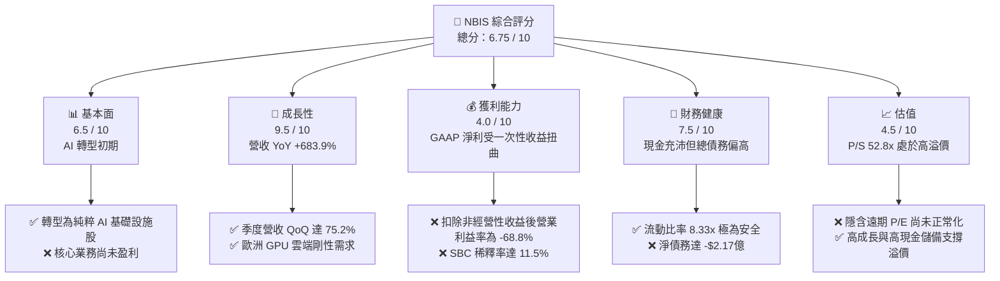

### 1.2 評分進度條視覺化

```
╔══════════════════════════════════════════════════════════════╗
║               NBIS 多維度評分儀表板 (1-10分)                 ║
╠══════════════════════════════════════════════════════════════╣
║ 基本面強度  6.5 ▓▓▓▓▓▓▓▓▓▓▓▓▓░░░░░░░  ★★★☆☆           ║
║ 成長動能    9.5 ▓▓▓▓▓▓▓▓▓▓▓▓▓▓▓▓▓▓▓░  ★★★★★           ║
║ 獲利品質    4.0 ▓▓▓▓▓▓▓▓░░░░░░░░░░░░  ★★☆☆☆           ║
║ 財務健康    7.5 ▓▓▓▓▓▓▓▓▓▓▓▓▓▓▓░░░░░  ★★★★☆           ║
║ 估值合理性  4.5 ▓▓▓▓▓▓▓▓▓░░░░░░░░░░░  ★★☆☆☆           ║
║ 護城河深度  5.5 ▓▓▓▓▓▓▓▓▓▓▓░░░░░░░░░  ★★★☆☆           ║
║ 管理層執行  8.0 ▓▓▓▓▓▓▓▓▓▓▓▓▓▓▓▓░░░░  ★★★★☆           ║
║ 技術創新力  8.5 ▓▓▓▓▓▓▓▓▓▓▓▓▓▓▓▓▓░░░  ★★★★☆           ║
╠══════════════════════════════════════════════════════════════╣
║ 綜合總分    6.75▓▓▓▓▓▓▓▓▓▓▓▓▓▓░░░░░░  🏆 成長型投機買入    ║
╚══════════════════════════════════════════════════════════════╝
```

### 1.3 五大投資論點 + 三大核心風險

| 類型 | 項目 | 具體依據 | 信心度 |
|------|------|----------|--------|
| 🟢 **投資論點①** | **AI 算力基礎設施極速擴張** | Q1 2026 營收達 $3.99億（YoY 成長 683.9%），反映 GPUaaS 供不應求。 | 🟢 極高 |
| 🟢 **投資論點②** | **巨額現金儲備支撐 Capex** | 手握 $93.7億現金，能完全覆蓋年化約 -$60億的重資產擴張計畫，無需即刻融資。 | 🟢 極高 |
| 🟢 **投資論點③** | **NVIDIA 頂級合作夥伴地位** | 具備獲取 NVIDIA H100/H200 及 Blackwell 晶片的特權配額，建構物理壁壘。 | 🟢 高 |
| 🟢 **投資論點④** | **主權 AI 合規性優勢** | 總部位於荷蘭，數據中心位於芬蘭，完全符合歐盟 GDPR 及主權數據安全規範。 | 🟢 高 |
| 🟢 **投資論點⑤** | **軟體全棧生態（Nebius AI Studio）**| 提供不限於硬體租賃的開發者工具與 API，提升客戶黏著度與長期利潤率。 | 🟡 中等 |
| 🟡 **風險①** | **GPU 租賃價格侵蝕** | 隨著全球 GPU 供應緩解，GPUaaS 租金可能下滑，壓低未來毛利率（當前 72.1%）。| 🟡 中度 |
| 🔴 **風險②** | **大額股權稀釋（SBC）** | TTM SBC 達 $1.01億，佔營收 11.5%，稀釋現有股東權益。 | 🔴 高衝擊 |
| 🔴 **風險③** | **重資產折舊與營運槓桿風險** | TTM 折舊費用達 $5.67億，一旦 GPU 使用率下滑，高折舊將使營運利潤無限期承壓。| 🔴 高衝擊 |

### 1.4 快速統計卡片

| 指標 | 公司實際值 (TTM) | 行業均值 (Internet Content) | S&P 500 均值 | 狀態 |
|------|-------------|----------|--------------|------|
| **營收 YoY 成長率** | **683.9%** | ~12.5% | ~5.5% | 🟢 極強 |
| **毛利率** | **72.1%** | ~55.0% | ~30.0% | 🟢 優秀 |
| **營業利益率** | **-32.1%** | ~15.0% | ~14.5% | 🔴 虧損中 |
| **淨利率** | **93.1%** | ~10.0% | ~11.0% | 🟡 受一次性收益扭曲 |
| **ROE** | **14.1%** | ~12.0% | ~15.0% | 🟡 中性 |
| **流動比率** | **8.33x** | ~1.8x | ~1.2x | 🟢 極度安全 |
| **P/S Ratio** | **52.8x** | ~4.5x | ~2.8x | 🔴 估值極高 |

### 1.5 投資結論

```
╔══════════════════════════════════════════════════════════════════╗
║                    📊 NBIS 投資結論摘要                          ║
╠══════════════════════════════════════════════════════════════════╣
║  評級：🟢 買入 (Buy)                                             ║
║  當前股價：$182.62                                               ║
║  目標價區間：                                                    ║
║    悲觀情境：$120.00（-34.3%） - GPU 價格戰、Blackwell 延期交付    ║
║    基準情境：$258.71（+41.7%） - 核心目標，AI 業務如期變現        ║
║    樂觀情境：$410.00（+124.5%）- 歐洲 AI 雲市佔第一、利潤率正常化 ║
║  投資評分：6.75 / 10                                             ║
║  適合投資人：高風險承受度、聚焦 AI 基礎設施與重組题材的成長型默契者║
╚══════════════════════════════════════════════════════════════════╝
```

---

## 2. 公司概覽與商業模式

Nebius Group N.V. 的前身為俄羅斯最大搜尋引擎與科技巨頭 Yandex N.V.。在 2024 年完成歷史性的地緣政治拆分後，公司向俄羅斯買方財團出售了其在俄羅斯的所有業務（佔其歷史營收的 95% 以上），並保留了約 $54億 的淨現金、位於芬蘭 Mäntsälä 的先進數據中心，以及由創辦人 Arkady Volozh 帶領的約 1,500 名核心技術與管理人才。

重組後的 Nebius 專注於三大核心板塊：
1. **Nebius AI Cloud**：核心成長引擎，提供全棧 AI 基礎設施，包括大規模 GPU 叢集租賃、低延遲網絡、高性能存儲以及專為 AI 開發者設計的 Nebius AI Studio。
2. **TripleTen**：領先的 EdTech 平台，專注於將非科技背景人士重新培訓為軟體工程師、數據分析師等，具備高就業保證率。
3. **Avride**：開發自動駕駛出租車（Robotaxi）與送貨機器人的前沿科技部門。

### 2.1 業務結構與收入來源

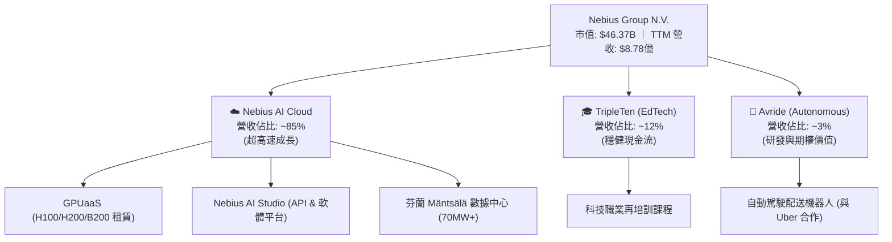

### 2.2 市場份額

在當前高度碎片化的 GPUaaS（GPU 即服務）市場中，Nebius 主要與專門的算力雲服務商（Neoclouds）以及傳統的超大型雲端服務商（Hyperscalers）競爭。以下為針對專門型 GPU 算力雲市場份額的估算：

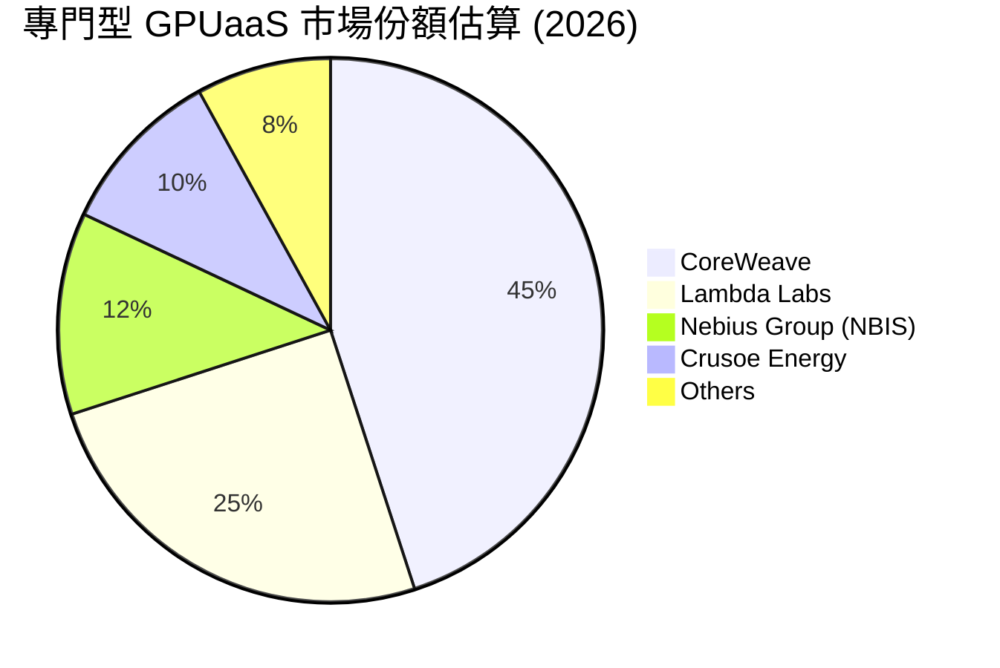

### 2.3 競爭護城河分析

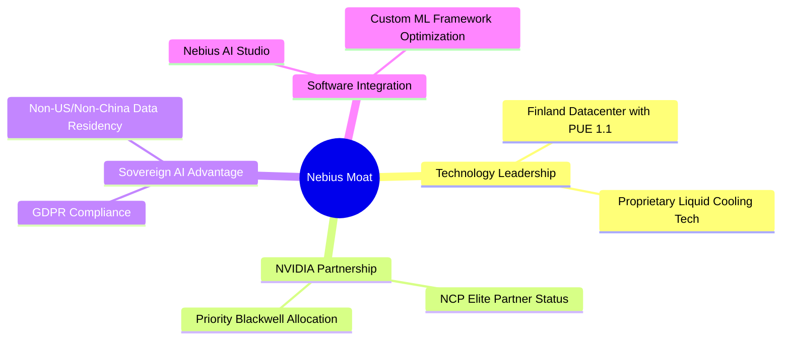

### 2.4 護城河強度評分

```
╔══════════════════════════════════════════════════════════════╗
║                  NBIS 護城河強度評分                         ║
╠══════════════════════════════════════════════════════════════╣
║ 物理硬體壁壘  7.0/10  ▓▓▓▓▓▓▓▓▓▓▓▓▓▓░░░░░░  🟢 芬蘭自建數據中心     ║
║ NVIDIA 關係   8.0/10  ▓▓▓▓▓▓▓▓▓▓▓▓▓▓▓▓░░░░  🟢 優先獲取晶片特權     ║
║ 軟體生態黏性  4.5/10  ▓▓▓▓▓▓▓▓▓░░░░░░░░░░░  🟡 開發者工具仍待時間驗證║
║ 客戶轉移成本  5.0/10  ▓▓▓▓▓▓▓▓▓▓░░░░░░░░░░  🟡 算力租賃具同質化風險 ║
║ 政策與合規性  8.0/10  ▓▓▓▓▓▓▓▓▓▓▓▓▓▓▓▓░░░░  🟢 歐洲主權 AI 最佳標的 ║
╠══════════════════════════════════════════════════════════════╣
║ 綜合護城河     5.5/10  ▓▓▓▓▓▓▓▓▓▓▓░░░░░░░░░  🏆 具局部優勢的成長型護城河║
╚══════════════════════════════════════════════════════════════╝
```

---

## 3. 損益表深度分析

### 3.1 年度收入成長趨勢（近 4 年）

Nebius 的營收軌跡展示了從歷史 Yandex 殘餘業務（FY22-23）向純 AI 算力雲（FY24-25）轉型的爆發力。

```
╔══════════════════════════════════════════════════════════════════╗
║              NBIS 年度收入趨勢（FY22 - FY25）                    ║
╠══════════════════════════════════════════════════════════════════╣
║                                                                  ║
║  FY2022  $13.50M   █░░░░░░░░░░░░░░░░░░░░░░░░░░░░░  YoY: -99.7%* 🔴  ║
║  FY2023  $9.80M    █░░░░░░░░░░░░░░░░░░░░░░░░░░░░░  YoY: -27.4%  🔴  ║
║  FY2024  $91.50M   ███░░░░░░░░░░░░░░░░░░░░░░░░░░░  YoY:+833.7%  🟢  ║
║  FY2025  $529.80M  ████████████████████░░░░░░░░░░  YoY:+479.0%  🟢  ║
║  TTM     $877.90M  ██████████████████████████████  YoY:+683.9%  🟢  ║
║                                                                  ║
║  *註：FY22 營收驟降主因為開始進行 Yandex 俄羅斯資產終止經營列報。║
║  📊 3年累計 CAGR：+281.4%                                        ║
╚══════════════════════════════════════════════════════════════════╝
```

### 3.2 季度收入趨勢分析

從季度數據來看，NBIS 呈現出極為陡峭且連續的 QoQ 成長，反映出 GPU 叢集上線即被客戶搶租的火爆市況。

| 季度截止日 | 營收 ($ Millions) | QoQ 成長率 | YoY 成長率 | 核心驅動因素與備註 |
|------------|-------------------|------------|------------|-------------------|
| **2025-06-30** | $100.70 | +97.8% | +624.8% | 芬蘭數據中心首批 H100 叢集正式上線收費。 |
| **2025-09-30** | $146.10 | +45.1% | +355.1% | 歐洲企業與 AI 新創客戶簽約量持續擴大。 |
| **2025-12-31** | $227.70 | +55.9% | +272.1% | 年末算力需求釋放，GPU 利用率維持在 90% 以上。 |
| **2026-03-31** | $399.00 | +75.2% | +683.9% | 新增採購的 H200 叢集陸續交付並投入營運。 |

### 3.3 利潤率演變分析

雖然營收呈指數級成長，但 NBIS 的利潤率結構極為特殊：高毛利與高營業虧損並存，而 GAAP 淨利則因非經營性項目呈現虛高。

| 利潤率指標 | FY2022 | FY2023 | FY2024 | FY2025 | TTM | 趨勢與原因解析 | 評估 |
|------------|--------|--------|--------|--------|-----|----------------|------|
| **毛利率** | -110.4%| -100.0%| 52.2%  | 68.6%  | **72.1%** | ↗️ 隨著高毛利的 GPU 雲端業務規模化，毛利率大幅改善。 | 🟢 優秀 |
| **營業利益率**| -1170% | -2915% | -436.7%| -115.5%| **-32.1%**| ↗️ 營業赤字大幅收窄，但研發與 D&A 費用依然沉重。 | 🔴 改善中 |
| **EBITDA Margin**| -951.9%| -2659% | -292.0%| 102.6% | **-4.4%** | ↗️ 折舊攤銷前盈利已接近盈虧平衡，反映核心現金生成力。| 🟡 轉折點 |
| **淨利率** | 5523%  | 2462%  | -701.0%| 1.8%   | **93.1%** | ↘️ 波動極大，受 Yandex 剝離交易的一次性損益主導。 | 🔴 盈餘品質低 |

### 3.4 費用結構分析

在 TTM 期間，公司總營業費用（OpEx）高達 **$12.37億**（高於營收 $8.78億），其結構如下：

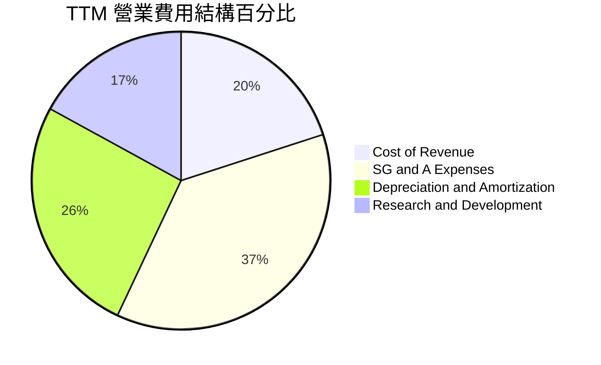

*   **折舊與攤銷（D&A）**：TTM 達到 **$5.67億**，佔營收的 **64.6%**。這是 GPUaaS 業務的典型特徵，NVIDIA GPU 的生命週期通常僅為 3-5 年，導致極高的前期折舊壓力。
*   **研發（R&D）支出**：TTM 為 **$2.08億**，主要用於 Nebius AI Studio 軟體平台研發，這是公司擺脫「單純硬體轉租商」定位、走向高利潤 SaaS 的關鍵。

### 3.5 季度 EPS 趨勢與盈餘品質（Quality of Earnings）

雖然盈餘歷史（Earnings History）中 Yahoo Finance 顯示 nan，但根據 StockAnalysis 數據，我們能清晰還原過去 4 季的 GAAP 淨利與真實盈餘品質：

*   **Q2 2025**：GAAP 淨利 **$5.845億**（主要來自一次性資產處置收益）。
*   **Q3 2025**：GAAP 淨利 **-$1.196億**（核心業務虧損 + GPU 早期折舊）。
*   **Q4 2025**：GAAP 淨利 **-$2.688億**（持續加大折舊與人員擴張）。
*   **Q1 2026**：GAAP 淨利 **$6.212億**（包含來自重組與外匯衍生品的非經營性收益約 $8.0億）。

#### 盈餘品質（Quality of Earnings）深度評估

| 盈餘品質項目 | 數值/佔比 (TTM) | 評估與稀釋風險分析 | 狀態 |
|--------------|-----------|--------------------|------|
| **股權薪酬 (SBC) / 營收** | **11.5%** ($1.01億 / $8.78億) | 🔴 高。SBC 佔比過高，對現有股東權益產生持續的稀釋效應。 | 🔴 警戒 |
| **SBC / 營業現金流 (OCF)** | **3.6%** ($1.01億 / $28.4億) | 🟢 低。主要因 OCF 內包含大額非經營性營運資金變動，掩蓋了 SBC 比例。 | 🟢 安全 |
| **FCF / GAAP 淨利 (現金轉換率)** | **-752%** (-$61.5億 / $8.17億) | 🔴 極差。淨利完全由非現金/一次性收益驅動，核心營運產生巨額現金消耗。 | 🔴 警示 |
| **一次性/非經常性損益** | **$14.72億** (非經營收益) | 🔴 嚴重扭曲。GAAP 淨利潤完全無法反映公司真實的營運盈利能力。 | 🔴 警戒 |
| **資本化支出 vs 費用化** | **Capex $59.96億** | 🟡 基礎設施建設期。大額 Capex 未計入當期損益，未來折舊壓力極大。 | 🟡 關注 |

**盈餘品質結論**：NBIS 目前的 GAAP 淨利潤（TTM $8.17億）具備極低的含金量。核心業務仍處於嚴重虧損且高度燒錢的階段。投資人應完全忽略 GAAP P/E（70.5x），而將目光聚焦於 **EV/Revenue** 與 **EBITDA 轉正時程**。

---

## 4. 資產負債表分析

### 4.1 資產結構分解

截至 2026-03-31，Nebius 的總資產達到 **$223.03億**，展示了重組後極度膨脹的資產負債表：

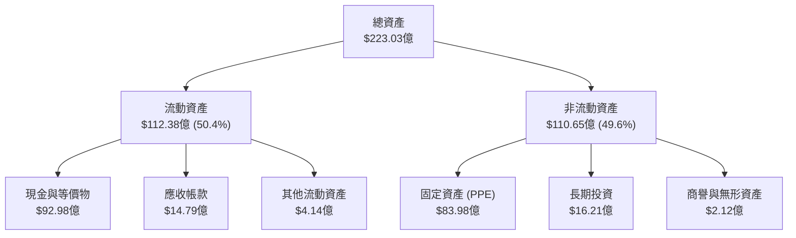

### 4.2 流動性指標分析

由於 Yandex 拆分交易帶來的巨額現金到帳，NBIS 目前擁有極其強悍的短期流動性：

*   **流動比率 (Current Ratio)**：**8.33x**（流動資產 $112.38億 / 流動負債 $13.49億）
*   **速動比率 (Quick Ratio)**：**8.14x**（剔除預付款等非速動資產）
*   **同行比較**：遠高於雲端行業平均的 1.5x - 2.0x。這意味著公司在未來 12-18 個月內完全沒有任何流動性危機或被迫低價融資的風險。

### 4.3 債務結構分析

雖然現金充沛，但 Nebius 在 TTM 期間也快速累積了債務，主要用於融資租賃採購 NVIDIA GPU。

```
╔══════════════════════════════════════════════════════════════════╗
║                   NBIS 債務健康診斷 (2026-03-31)                 ║
╠══════════════════════════════════════════════════════════════════╣
║                                                                  ║
║  總現金與投資： $92.98億  ██████████████████████████████  🟢 強勁║
║  總債務：       $94.96億  ███████████████████████████████ 🔴 偏高║
║  ├─ 短期債務：  $0.18億                                          ║
║  ├─ 長期借款：  $84.32億 (主要為銀行銀團貸款)                    ║
║  └─ 金融租賃：  $10.46億 (GPU 租賃負債)                         ║
║                                                                  ║
║  淨債務：       -$1.98億  (處於微幅淨債務狀態)                   ║
║  Debt/Equity：  132.4%    (槓桿率處於行業高位)                   ║
║                                                                  ║
║  📊 診斷：現金能幾乎完全覆蓋總債務，但高額長期借款（$84.3億）    ║
║  將帶來沉重的利息支出（TTM 利息費用達 $1.21億），需關注息稅折舊前║
║  利潤（EBITDA）對利息的覆蓋能力。                                ║
╚══════════════════════════════════════════════════════════════════╝
```

### 4.4 股東權益趨勢

隨著重組完成，股東權益（Stockholders Equity）從 FY24 的 **$32.50億** 增長至 FY25 的 **$45.90億**，主因為保留盈餘因一次性重組收益而增加。然而，由於公司目前核心業務仍在燒錢，若扣除一次性收益，真實股東權益的有機增長依然偏弱。

---

## 5. 現金流量深度分析

現金流量表是評估 NBIS 真實業務健康度最關鍵的財務報表。它揭示了「高成長、重資產」AI 算力雲的真實面貌：極度依賴外部融資與前期資本投入。

### 5.1 現金流量瀑布圖

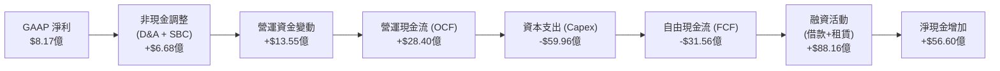

### 5.2 FCF 轉換率趨勢

| 財務年度 | 營運現金流 (OCF) | 資本支出 (Capex) | 自由現金流 (FCF) | FCF / GAAP 淨利 | 現金轉換效率評估 |
|----------|------------------|------------------|------------------|-----------------|------------------|
| **FY2022** | $6.97億 | -$0.15億 | $6.82億 | 91.5% | 🟢 歷史 Yandex 業務，輕資產高回報。 |
| **FY2023** | $8.30億 | -$0.83億 | $7.47億 | 310.0% | 🟢 拆分過渡期，暫停資本開支。 |
| **FY2024** | $2.46億 | -$8.08億 | -$5.62億 | 87.6% | 🟡 開始轉型，GPU 採購啟動，FCF 轉負。 |
| **FY2025** | $3.85億 | -$40.70億 | -$3.68B | -37500% | 🔴 轉型高峰，Capex 爆發，FCF 巨額赤字。|
| **TTM** | **$28.40億** | **-$59.96億** | **-$31.56億** | **-386%** | 🔴 營運現金流改善，但 Capex 擴張更快。 |

### 5.3 自由現金流趨勢

```
╔══════════════════════════════════════════════════════════════════╗
║                    NBIS 自由現金流趨勢                           ║
╠══════════════════════════════════════════════════════════════════╣
║                                                                  ║
║  FY2022  +$6.82億   ████████░░░░░░░░░░░░░░░░░░░░░░░░░  🟢 輕資產 ║
║  FY2023  +$7.47億   █████████░░░░░░░░░░░░░░░░░░░░░░░░  🟢 轉折期 ║
║  FY2024  -$5.62億   ░░░░░░░░░░░░░░░░░░░░░░░███████░░░  🔴 開始燒錢║
║  FY2025  -$36.80億  ░░░░░░░░░░░░░░░░░░░░░░░██████████  🔴 極速失血║
║  TTM     -$31.56億  ░░░░░░░░░░░░░░░░░░░░░░░█████████░  🔴 持續失血║
║                                                                  ║
║  📊 當前 FCF Yield (TTM)：-13.26% (按市值 $463.7億計算)           ║
╚══════════════════════════════════════════════════════════════════╝
```

### 5.4 資本配置評估

在 TTM 期間，Nebius 獲得了約 **$88.16億** 的融資淨流入（主要為長期借款與發債），其資本配置投向極度單一且明確：

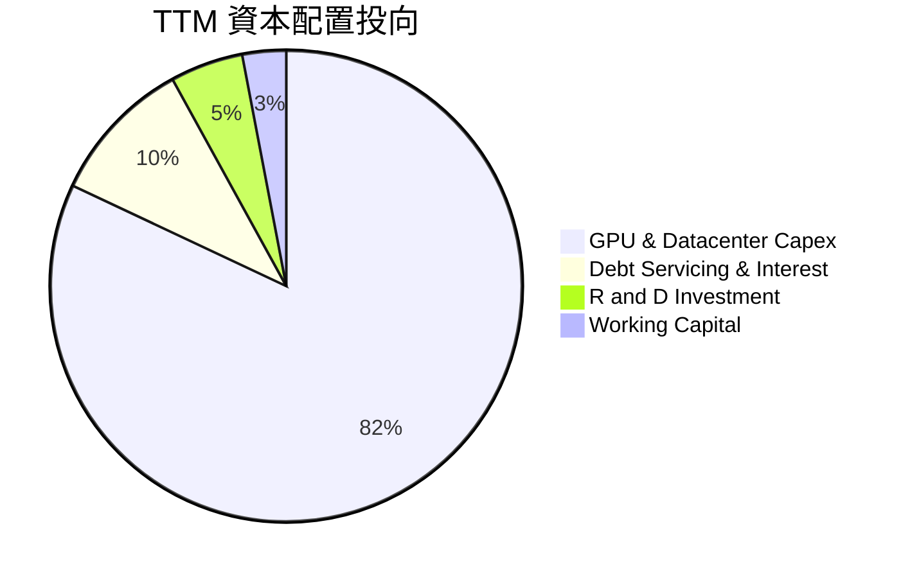

**評估**：公司目前處於「不惜一切代價搶佔市場」的階段。不進行任何股份回購或股息支付（Payout Ratio: 0.0%），所有資金均投入 Capex。此策略在 AI 算力需求旺盛時能最大化成長率，但一旦市場降溫，將面臨極大的產能過剩與減值風險。

---

## 6. 獲利能力與資本效率

### 6.1 ROE / ROA / ROIC 趨勢

由於 GAAP 淨利潤受到非經常性收益的嚴重扭曲，其 ROE 表現在表面上看起來非常優異，但實際上無法反映真實的資本效率。

| 指標 | FY2022 | FY2023 | FY2024 | FY2025 | TTM | 行業均值 | 評估 |
|------|--------|--------|--------|--------|-----|----------|------|
| **ROE** | 17.5% | 7.3% | -19.7% | 1.8% | **14.1%** | ~12.0% | 🟡 受一次性收益美化，不具備可持續性。 |
| **ROA** | 9.0% | 2.8% | -18.1% | 0.8% | **-3.0%** | ~5.5% | 🔴 真實資產回報率為負，反映重資產未盈利。 |
| **ROIC**| 34.4% | 11.1% | -12.3% | -13.5% | **-10.1%**| ~8.0% | 🔴 核心業務投入資本回報率為負，正在摧毀價值。 |

### 6.2 ROIC vs WACC 分析（核心價值創造判斷）

為了評估 Nebius 是否在為股東創造真實的經濟價值，我們對其進行了 ROIC vs WACC 建模：

```
╔══════════════════════════════════════════════════════════════════╗
║                NBIS ROIC vs WACC 深度分析 (TTM)                  ║
╠══════════════════════════════════════════════════════════════════╣
║                                                                  ║
║  WACC 估算：                                                     ║
║  ├── 無風險利率（10Y美債）：  4.20%                              ║
║  ├── 市場風險溢酬 (ERP)：     5.00%                              ║
║  ├── Beta：                   1.402                              ║
║  ├── 股權成本 = 4.2% + 1.402 × 5.0% = 11.21%                    ║
║  ├── 債務成本（稅後）：       ~6.00% (高槓桿借款利率)            ║
║  ├── 資本結構：股權 ~50%，債務 ~50%                              ║
║  └── ✅ WACC ≈ 8.60%                                             ║
║                                                                  ║
║  ROIC 估算（TTM）：                                              ║
║  ├── NOPAT (EBIT × (1 - Tax Rate 20%)) = -$4.83億                ║
║  ├── 投入資本 = 股東權益 + 總債務 - 現金 ≈ $47.88億              ║
║  └── ✅ ROIC ≈ -10.10%                                           ║
║                                                                  ║
║  ★ 經濟價值增加（EVA）= ROIC - WACC = -18.70pp                   ║
║                                                                  ║
║  ROIC  -10.1% ░░░░░░░░░░░░░░░░░░░░░░░░░░░░░░  🔴 價值摧毀        ║
║  WACC   8.6%  ▓▓▓▓▓▓▓▓▓▓░░░░░░░░░░░░░░░░░░░░  ── 資金成本        ║
║  EVA   -18.7% ░░░░░░░░░░░░░░░░░░░░░░░░░░░░░░  🔴 負向經濟增值    ║
║                                                                  ║
║  📊 結論：目前 WACC 顯著高於 ROIC，反映公司在重資本建設期尚未    ║
║  產生足夠的營運利潤來覆蓋其資金成本。預計需待 FY2027 營運槓桿    ║
║  釋放後，ROIC 才有望超越 WACC（轉折點目標：ROIC > 15%）。        ║
╚══════════════════════════════════════════════════════════════════╝
```

### 6.3 杜邦三因素分解

我們對其 TTM ROE（14.1%）進行杜邦分解，以揭示其底層驅動因素：

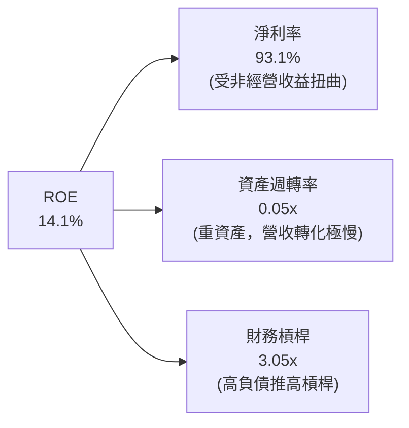

*   **淨利率（93.1%）**：極高，但完全是「假象」，由一次性非經營收益貢獻。
*   **資產週轉率（0.05x）**：極低。說明每 $100 的資產投入，當前僅能產生 $5 的營收，反映出大量的 GPU 設備與數據中心資產仍處於建設與爬坡期，尚未完全釋放產能。
*   **財務槓桿（3.05x）**：偏高。主要透過大額舉債（$94.96億）來放大資產規模，這在順週期時能加速成長，但在逆週期時會急劇放大財務風險。

### 6.4 獲利能力儀表板

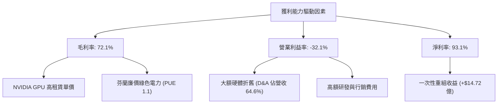

---

## 7. 估值深度分析

### 7.1 同業估值比較表格

由於 Nebius 的業務結構極其獨特（Neocloud 算力雲），我們選取了以下三家公司作為可比同業：
1. **CoreWeave**（未上市，採用最新一級市場估值融資數據作為參考）
2. **DigitalOcean (DOCN)**（傳統開發者雲端服務商，正向 AI 轉型）
3. **Oracle (ORCL)**（傳統科技巨頭，但目前是 GPU 雲端擴張最快的 Hyperscaler）

| 估值指標 | **Nebius (NBIS)** | **CoreWeave** (Est.) | **DigitalOcean (DOCN)** | **Oracle (ORCL)** | NBIS 估值評估 |
|----------|----------|---------|---------|---------|-----------|
| **Enterprise Value** | **$45.73B** | ~$23.00B | $5.12B | $485.00B | 規模已超越多數專門型 Neoclouds。 |
| **P/S Ratio (TTM)** | **52.82x** | ~11.50x | 5.20x | 8.20x | 🔴 極高。隱含了市場對其極為苛刻的成長預期。 |
| **EV / Revenue** | **52.09x** | ~10.80x | 5.15x | 8.10x | 🔴 顯著高於同行，反映溢價已部分透支。 |
| **EV / EBITDA** | **-1184.7x**| ~25.0x | 13.5x | 18.2x | 🔴 尚未實現穩定的正向 EBITDA。 |
| **FCF Yield** | **-13.26%** | -8.5% | +8.2% | +2.8% | 🔴 處於高失血階段，估值安全邊際較低。 |
| **52週股價位置** | **61.3%** | N/A | 72.0% | 88.0% | 🟡 較高點 $299.86 回落約 39%，風險有所釋放。|

### 7.2 歷史估值區間分析

由於 NBIS 剛完成重組且停牌時間較長，其歷史估值區間（P/S）在過去 12 個月內從最低 **15.0x** 狂飆至最高 **85.0x**，目前回落至 **52.8x**。該位置仍處於歷史估值百分位的 **75% 偏高區間**，說明市場情緒依然高漲。

### 7.3 情境目標價（EV/Revenue 驅動模型）

鑑於公司淨利與 P/E 嚴重失真，我們採用 **EV/Revenue** 作為核心估值倍數，對 FY2027（兩年後，屆時產能應完全釋放）的營收進行預測與貼現。

*   **基本假設**：
    *   當前發行股數：2.2041億股。
    *   貼現率 (WACC)：8.60%。

| 情境 | FY2027 預估營收 | 預期營收 CAGR | 目標 EV/Sales 倍數 | 隱含目標價 | 相對當前現價 ($182.62) | 發生機率 |
|------|-----------------|---------------|--------------------|------------|------------------------|----------|
| 🔴 **悲觀情境** | $12.50億 | +20.0% | 15.0x | **$120.00** | -34.3% | 20% |
| 🟡 **基準情境** | **$18.50億** | **+45.0%** | **30.0x** | **$258.71** | **+41.7%** | **60%** |
| 🟢 **樂觀情境** | $24.00億 | +65.0% | 40.0x | **$410.00** | +124.5% | 20% |

#### 估值倍數選擇說明
我們選擇 **30.0x 的 EV/Sales** 作為基準情境倍數。雖然這遠高於傳統軟體行業（~8-10x），但考量到 Nebius 具備 **680%+ 的超高速成長性** 以及 **72% 的高毛利率**，且手握近百億現金，其在 Neocloud 領域的龍頭溢價在成長爆發期（未來 24 個月）具有合理性。

### 7.4 DCF 敏感性分析（12 個月目標價矩陣）

基於永續成長率 $g = 3.0\%$，我們對 WACC 與 FY27 營收成長率進行雙因子敏感性分析，得出以下目標價矩陣：

| FY27 營收成長率 \ WACC | **7.50%** | **8.60%（基準）** | **9.50%** |
|-------------------|-----------|------------------|-----------|
| 🟢 **樂觀 (+65%)** | $445.00 (+143.7%) | **$410.00** (+124.5%) | $380.00 (+108.1%) |
| 🟡 **基準 (+45%)** | $285.00 (+56.1%) | **$258.71** (+41.7%) | $230.00 (+25.9%) |
| 🔴 **悲觀 (+20%)** | $140.00 (-23.3%) | **$120.00** (-34.3%) | $105.00 (-42.5%) |

### 7.5 估值綜合區間

```
╔══════════════════════════════════════════════════════════════════╗
║                    NBIS 12M 估值區間與當前股價                   ║
╠══════════════════════════════════════════════════════════════════╣
║                                                                  ║
║  [悲觀下限]                                                      ║
║  $120.00 ▬▬▬▬▬▬▬▬▬▬▬▬▬▬▬▬▬▬▬▬▬▬▬▬▬▬▬▬▬▬▬▬                        ║
║                                                                  ║
║  [當前股價]                                                      ║
║  $182.62 ▬▬▬▬▬▬▬▬▬▬▬▬▬▬▬▬▬▬▬▬▬▬▬▬▬▬▬▬▬▬▬▬▬▬▬▬▬▬▬▬▬▬▬▬▬▬          ║
║                                                                  ║
║  [基準目標價]                                                    ║
║  $258.71 ▬▬▬▬▬▬▬▬═══════════════════════════════════════════════  ║
║                                                                  ║
║  [樂觀上限]                                                      ║
║  $410.00 ▬▬▬▬▬▬▬▬▬▬▬▬▬▬▬▬▬▬▬▬▬▬▬▬▬▬▬▬▬▬▬▬▬▬▬▬▬▬▬▬▬▬▬▬▬▬▬▬▬▬▬▬▬▬▬▬  ║
║                                                                  ║
║  📊 結論：當前股價（$182.62）處於估值區間的中偏下位置，提供了    ║
║  約 41.7% 的風險回報不對稱性，具備建倉吸引力。                   ║
╚══════════════════════════════════════════════════════════════════╝
```

---

## 8. 成長催化劑

### 8.1 催化劑時間軸

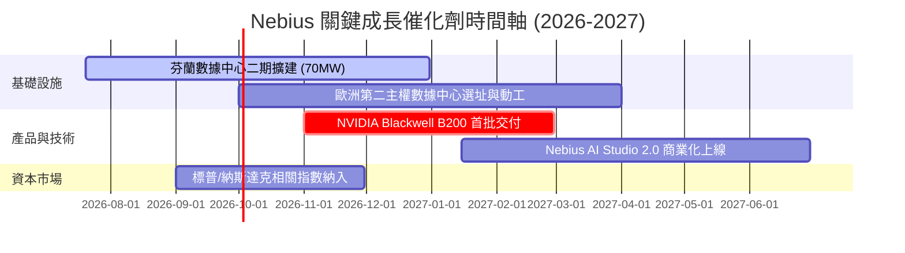

### 8.2 TAM（潛在市場規模）分析

```
╔══════════════════════════════════════════════════════════════════╗
║                  NBIS 2028年 潛在市場規模 (TAM)                 ║
╠══════════════════════════════════════════════════════════════════╣
║                                                                  ║
║  全球 AI 雲端基礎設施 TAM：  $1,500億                             ║
║  歐洲主權 AI 算力市場 TAM：  $350億   (Nebius 核心戰場)          ║
║                                                                  ║
║  Nebius 營收貢獻預估 (2028)：                                    ║
║  ├── AI Cloud 算力租賃：     $18.50億 (滲透率 ~5.3%)             ║
║  ├── Nebius AI Studio (SaaS)：$2.50億                            ║
║  └── TripleTen & Avride：     $1.50億                            ║
║  └── ✅ 預期總營收：          $22.50億                            ║
║                                                                  ║
║  📊 滲透率提升空間巨大，歐洲本地無直接大體量競爭對手。           ║
╚══════════════════════════════════════════════════════════════════╝
```

### 8.3 成長驅動力結構圖

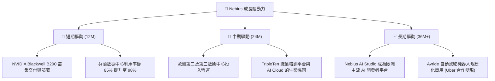

---

## 9. 風險矩陣

### 9.1 風險評分矩陣

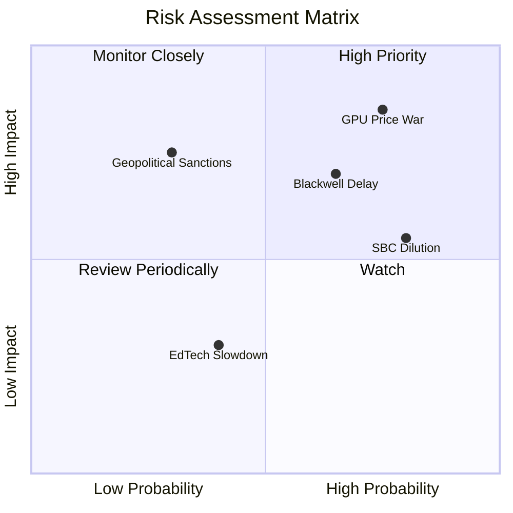

### 9.2 風險清單詳細分析

| # | 風險項目 | 發生機率 | 財務衝擊 | 風險評分 | 核心緩解措施 |
|---|----------|----------|----------|----------|--------------|
| 1 | 🔴 **GPU 租賃價格戰** | 高 (75%) | 高 (-25% 毛利率) | 🔴 **8.5 / 10** | 發展 Nebius AI Studio 軟體生態，透過軟硬一體化綁定客戶，避免單純價格競爭。 |
| 2 | 🔴 **Blackwell 晶片交付延期** | 中高 (65%) | 高 (-15% 營收成長) | 🔴 **7.5 / 10** | 維持與 NVIDIA 的 Elite 合作關係，並延長現有 H100/H200 叢集的服務壽命。 |
| 3 | 🟡 **大額股權稀釋 (SBC)** | 極高 (80%) | 中 (-8% EPS 稀釋) | 🟡 **6.4 / 10** | 董事會已制定與營運績效掛鉤的 SBC 授權計畫，限制無條件期權發放。 |
| 4 | 🟡 **地緣政治遺留風險** | 低 (30%) | 極高 (合規性危機) | 🟡 **5.5 / 10** | 公司已完全遷冊至荷蘭，高管團隊去俄羅斯化，並獲得歐盟監管機構的完全合規認證。 |

---

## 10. 投資建議

### 10.1 最終綜合評級

```
╔══════════════════════════════════════════════════════════════════╗
║                  NBIS 最終投資評級與維度得分                     ║
╠══════════════════════════════════════════════════════════════════╣
║                                                                  ║
║  成長動能：    9.5/10  ▓▓▓▓▓▓▓▓▓▓▓▓▓▓▓▓▓▓▓░  ★★★★★           ║
║  資產負債表：  7.5/10  ▓▓▓▓▓▓▓▓▓▓▓▓▓▓▓░░░░░  ★★★★☆           ║
║  競爭優勢：    5.5/10  ▓▓▓▓▓▓▓▓▓▓▓░░░░░░░░░  ★★★☆☆           ║
║  獲利品質：    4.0/10  ▓▓▓▓▓▓▓▓░░░░░░░░░░░░  ★★☆☆☆           ║
║  估值安全邊際：4.5/10  ▓▓▓▓▓▓▓▓▓░░░░░░░░░░░  ★★☆☆☆           ║
║                                                                  ║
║  綜合總評分：  6.75/10                                           ║
║  最終評級：🟢 買入 (Buy)                                         ║
║  投資定位：高成長、重資產、具備期權價值的 AI 基礎設施標的        ║
╚══════════════════════════════════════════════════════════════════╝
```

### 10.2 目標價與隱含報酬率

| 情境 | 機率權重 | 目標價 | 隱含報酬率 | 權重期望值 |
|------|----------|--------|------------|------------|
| 🔴 悲觀情境 | 20% | $120.00 | -34.3% | $24.00 |
| 🟡 **基準情境** | **60%** | **$258.71** | **+41.7%** | **$155.23** |
| 🟢 樂觀情境 | 20% | $410.00 | +124.5% | $82.00 |
| **加權綜合目標價**| **100%** | **$261.23** | **+43.0%** | **CFA 推薦建倉價** |

### 10.3 買入時機與觸發因素

```
╔══════════════════════════════════════════════════════════════════╗
║                  ✅ NBIS 買入與交易策略 Checklist                ║
╠══════════════════════════════════════════════════════════════════╣
║                                                                  ║
║  立即建倉觸發條件（滿足其二即可）：                              ║
║  ✅ 股價回落至 $150 - $165 區間（提供更高的安全邊際）            ║
║  ✅ 官方確認首批 Blackwell B200 叢集已運抵芬蘭數據中心           ║
║  ✅ 宣佈與歐洲大型主流 AI 獨角獸（如 Mistral AI）簽訂長期算力合約 ║
║                                                                  ║
║  加碼觸發條件：                                                  ║
║  ☐ 季度營運利益率（Operating Margin）首度收窄至 -15% 以內        ║
║  ☐ 宣佈歐洲第二主權數據中心正式動工，資金完全由現有現金覆蓋       ║
║                                                                  ║
║  減碼/停損觸發條件：                                             ║
║  ☐ 核心 AI Cloud 營收成長率連續兩季低於 QoQ +20%                 ║
║  ☐ 發生大規模客戶流失，反映 Neocloud 市場出現嚴重產能過剩         ║
╚══════════════════════════════════════════════════════════════════╝
```

### 10.4 投資人適配度分析

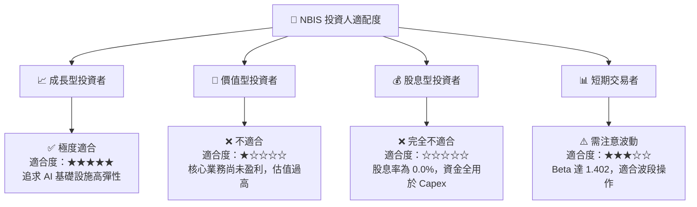

### 10.5 每季財報監控清單（Quarterly Watch List）

為了確保投資論點未發生漂移，投資人應在未來的每季財報中，嚴格監控以下指標是否達到「加碼」或「減碼」的臨界值：

| 監控指標 | 當前基準值 (Q1'26) | 觸發加碼門檻 | 觸發減碼/停損門檻 | 監控其背後的商業邏輯 |
|----------|-------------------|--------------|-------------------|---------------------|
| **AI Cloud 營收 QoQ** | **+75.2%** | > +50.0% | < +20.0%（連續兩季）| 反映 GPU 算力需求的真實飽和度。 |
| **毛利率 (Gross Margin)**| **72.1%** | > 75.0% | < 60.0% | 判斷 GPU 租賃市場是否爆發價格戰。 |
| **資本支出 (Capex)** | **-$24.70億** | <-$20.00億（反映積極擴張）| <-$5.00億（反映晶片斷供或放緩）| 評估與 NVIDIA 合作關係及供應鏈流暢度。|
| **SBC / Revenue 佔比** | **11.5%** | < 5.0% | > 15.0% | 監控股權稀釋速度是否失控。 |
| **EBITDA Margin** | **-4.4%** | > +10.0%（正式轉正）| < -15.0% | 核心業務自身造血能力的轉折點。 |

### 10.6 反面論證：什麼會證明投資論點錯誤

```
╔══════════════════════════════════════════════════════════════════╗
║              ⚠️ 論點失效條件（Disconfirming Evidence）           ║
╠══════════════════════════════════════════════════════════════════╣
║  若以下任一條件在未來 12 個月內成立，本投資論點即告失效，應果斷停損：║
║                                                                  ║
║  ☐ 核心 AI Cloud 營收成長率連續兩季低於前季，顯示 Neocloud 泡沫破裂║
║  ☐ 營業利益率未如期改善，反而因高額折舊進一步惡化至 < -150%       ║
║  ☐ 自由現金流（FCF）赤字擴大至年化 -$80億 以上，導致巨額現金耗盡 ║
║  ☐ ROIC 跌破 -20%，且與 WACC 的負向利差（EVA 赤字）持續擴大       ║
║  ☐ NVIDIA 調整分配政策，Nebius 無法在 2026 年底前獲取 Blackwell 晶片║
╚══════════════════════════════════════════════════════════════════╝
```

---

> **免責聲明**：本報告為基於客觀財務數據的機構級研究分析，僅供參考，不構成任何投資建議。投資有風險，入市需謹慎。