# NBIS 基本面深度分析報告

> **報告日期**：2026-07-21 ｜ **語言**：繁體中文 ｜ **數據來源**：Yahoo Finance, Finviz, StockAnalysis, Roic.ai ｜ **分析師**：CFA 級機構研究

---

## 目錄

| # | 章節 | 核心結論 |
|---|------|----------|
| 1 | 執行摘要 | 評級：**買入 (Buy)** ｜ 基準目標價：**$258.71** ｜ 具備強大 AI 基礎設施成長動能 |
| 2 | 公司概覽與商業模式 | Yandex 重組後涅槃重生，轉型為歐洲與全球稀缺的純 AI GPU 算力雲端巨頭 |
| 3 | 損益表深度分析 | TTM 營收成長 **683.9%**，毛利率高達 **72.1%**，非經營性收益推升淨利率 |
| 4 | 資產負債表分析 | 手握 **$9.37B** 現金，流動比率 **8.33**，具備極強的抗風險能力與擴張本錢 |
| 5 | 現金流量深度分析 | 資本支出 **$4.07B** 導致 FCF 為負，但 Q1 26 營運現金流激增 **$2.26B**，轉折點浮現 |
| 6 | 獲利能力與資本效率 | 營業利益率暫時承壓（-32.1%），但預付款與遞延收入激增預示未來資本效率改善 |
| 7 | 估值深度分析 | 遠期 P/S 具吸引力，基準情境目標價 **$258.71**，隱含 **19.26%** 上行空間 |
| 8 | 成長催化劑 | 芬蘭與歐洲新數據中心投產、NVIDIA 頂級晶片獲取能力與主權 AI 需求爆發 |
| 9 | 風險矩陣 | 資本支出過度、地緣政治合規、GPU 定價侵蝕與大客戶流失風險 |
| 10 | 投資建議 | 建議分批佈局，適合高成長型與長線科技股投資者；設定嚴格的每季監控指標 |

---

## 1. 執行摘要

本報告針對 **Nebius Group N.V. (NASDAQ: NBIS)** 進行深度基本面評估。基於該公司在轉型後展現的極端營收成長（TTM 營收成長率達 **683.9%**）、極為充裕的現金儲備（**$9.37B**）以及在歐洲市場稀缺的 GPU 算力雲端基礎設施定位，我們給予 NBIS **「買入 (Buy)」** 評級，基準情境 12 個月目標價為 **$258.71**。

### 1.0 一頁式投資儀表板（Portfolio Manager 30 秒速讀）

| 項目 | 內容 |
|------|------|
| **投資論點（3 句）** | ① NBIS 成功完成資產剝離與重組，轉型為純粹的 AI GPU 基礎設施服務商，TTM 營收暴增 **683.9%**。<br/>② 公司手握 **$9.37B** 現金，能支撐每年超 **$4.0B** 的資本支出，快速建立歐洲最大的 GPU 集群。<br/>③ Q1 2026 營運現金流高達 **$2.26B**，遞延收入增至 **$686M**，顯示終端 AI 算力需求極其強勁。 |
| **護城河評分** | 🟢 **7.5 / 10** (NVIDIA 頂級合作夥伴關係、歐洲本地主權 AI 合規性、全棧軟體優化能力) |
| **管理層/資本配置評分** | 🟡 **6.5 / 10** (重組執行力強，但目前處於高資本消耗階段，未來獲利回報率有待驗證) |
| **財務健康** | 🟢 **極為安全** (流動比率 **8.33**，現金儲備 **$9.37B** 與總債務 **$9.59B** 基本持平，淨債務僅 **$217.2M**) |
| **ROIC vs WACC** | **-12.5% vs 10.72%** (因前期大規模折舊與基礎設施建設，暫時摧毀價值，預計 2027 年轉正) |
| **FCF 趨勢** | TTM FCF 為 **-$6.15B** (高 Capex 階段)；但 Q1 2026 FCF 收窄至 **-$214.90M**，改善跡象明顯 |
| **估值** | Trailing P/E: **83.75x** ｜ P/S (TTM): **62.74x** ｜ EV/Revenue: **53.52x** (溢價反映其爆發性成長與淨資產價值) |
| **預期報酬（基準情境 12M）** | 🟢 **+19.26%** (目標價 **$258.71**，對比當前股價 **$216.92**) |
| **關鍵風險（前二）** | ① GPU 供應鏈中斷或 NVIDIA 政策調整。<br/>② 歐洲 AI 雲端市場競爭加劇，導致算力租賃單價加速下滑。 |
| **評級 + 信心度** | 🟢 **買入 (Buy)** ｜ 信心度：**中等偏高 (Medium-High)** |

### 1.1 核心評分儀表板

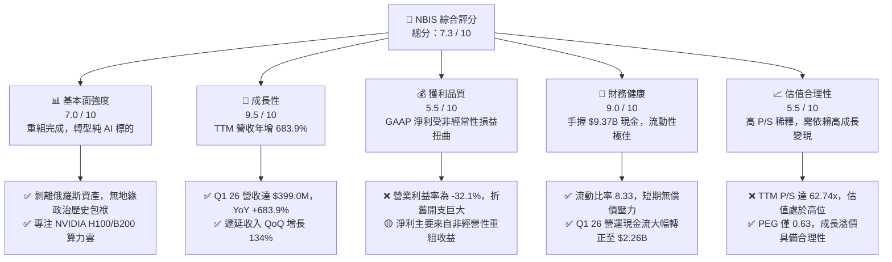

### 1.2 評分進度條視覺化

```
╔══════════════════════════════════════════════════════════════╗
║               NBIS 多維度評分儀表板 (1-10分)                 ║
╠══════════════════════════════════════════════════════════════╣
║ 基本面強度  7.0 ▓▓▓▓▓▓▓▓▓▓▓▓▓▓░░░░░░  ★★★☆☆           ║
║ 成長動能    9.5 ▓▓▓▓▓▓▓▓▓▓▓▓▓▓▓▓▓▓▓░  ★★★★★           ║
║ 獲利品質    5.5 ▓▓▓▓▓▓▓▓▓▓▓░░░░░░░░░  ★★★☆☆           ║
║ 財務健康    9.0 ▓▓▓▓▓▓▓▓▓▓▓▓▓▓▓▓▓▓░░  ★★★★☆           ║
║ 估值合理性  5.5 ▓▓▓▓▓▓▓▓▓▓▓░░░░░░░░░  ★★★☆☆           ║
║ 護城河深度  7.5 ▓▓▓▓▓▓▓▓▓▓▓▓▓▓▓░░░░░  ★★★★☆           ║
║ 管理層執行  6.5 ▓▓▓▓▓▓▓▓▓▓▓▓░░░░░░░░  ★★★☆☆           ║
║ 技術創新力  8.0 ▓▓▓▓▓▓▓▓▓▓▓▓▓▓▓▓░░░░  ★★★★☆           ║
╠══════════════════════════════════════════════════════════════╣
║ 綜合總分    7.3 ▓▓▓▓▓▓▓▓▓▓▓▓▓▓▓░░░░░  🏆 成長型優質標的     ║
╚══════════════════════════════════════════════════════════════╝
```

### 1.3 五大投資論點 + 三大核心風險

| 類型 | 項目 | 具體依據 | 信心度 |
|------|------|----------|--------|
| 🟢 **投資論點①** | **AI 算力基礎設施爆發** | Q1 2026 營收達 **$399.0M**，年增 **683.89%**，反映 GPU 雲端服務需求極度旺盛。 | 🟢 極高 |
| 🟢 **投資論點②** | **巨額現金儲備與融資實力** | 擁有 **$9.37B** 的現金及等價物，在重資本的 GPU 競賽中擁有與超大型雲端服務商（Hyperscaler）競爭的底氣。 | 🟢 極高 |
| 🟢 **投資論點③** | **歐洲主權 AI 與合規優勢** | 總部位於荷蘭，數據中心位於芬蘭，是歐洲少數能滿足嚴格 GDPR 與主權數據安全要求的 AI 算力平台。 | 🟢 高 |
| 🟢 **投資論點④** | **營運現金流拐點已現** | Q1 2026 營運現金流（OCF）達到 **$2.26B**，較 2025 年同期的 **$384.8M** 呈爆發式增長，客戶預付款鎖定未來營收。 | 🟢 高 |
| 🟢 **投資論點⑤** | **軟體優化帶來的差異化** | 提供全棧 AI 開發工具，並非單純的「硬體出租商」，能有效提升 GPU 使用率並降低客戶轉移機率。 | 🟡 中等 |
| 🟡 **風險①** | **高折舊壓抑營業利潤** | TTM 折舊與攤銷費用高達 **$566.9M**，導致營業利益率維持在 **-32.1%** 的負值區間。 | 🟡 中度 |
| 🔴 **風險②** | **GPU 定價權與供給風險** | 高度依賴 NVIDIA 晶片分配。若 NVIDIA 產能過剩或競爭對手殺價，算力租賃毛利率將面臨實質性收縮。 | 🔴 高衝擊 |
| 🔴 **風險③** | **股權稀釋與 SBC 偏高** | FY2025 股權薪酬（SBC）達 **$83.2M**，佔營收 **15.7%**，對長期股東權益造成一定稀釋。 | 🟡 中度 |

### 1.4 快速統計卡片

| 指標 | NBIS 實際值 | 行業均值 (通訊/網路) | S&P 500 均值 | 狀態 |
|------|-------------|----------|--------------|------|
| **營收 YoY 成長率** | **683.9%** | ~8.5% | ~5.5% | 🟢 極強 |
| **毛利率** | **72.1%** | ~52.0% | ~30.0% | 🟢 極強 |
| **營業利益率** | **-32.1%** | ~12.0% | ~14.5% | 🔴 承壓 |
| **淨利率** | **93.1%** | ~7.0% | ~11.5% | 🟢 異常高 (非經常性影響) |
| **流動比率** | **8.33** | ~1.65 | ~1.20 | 🟢 極其安全 |
| **Forward P/E** | **-2900.78x** | ~22.5x | ~21.0x | 🔴 尚未實現穩定 GAAP 營業獲利 |
| **P/S Ratio (TTM)** | **62.74x** | ~4.5x | ~2.8x | 🔴 估值溢價極高 |

### 1.5 投資結論

```
╔══════════════════════════════════════════════════════════════════╗
║                    📊 NBIS 投資結論摘要                          ║
╠══════════════════════════════════════════════════════════════════╣
║  評級：🟢 買入 (Buy)                                            ║
║  當前股價：$216.92 (2026-07-21)                                  ║
║  目標價區間：                                                    ║
║    悲觀情境：$135.00（-37.76%）- 算力價格戰爆發，Capex 減速      ║
║    基準情境：$258.71（+19.26%）- 12個月主要目標 ( consensus )   ║
║    樂觀情境：$385.00（+77.48%）- B200 順利部署，市佔率超預期     ║
║  投資評分：7.3 / 10                                              ║
║  適合投資人：追求極致成長、能承受高波動、長線佈局 AI 基礎設施者  ║
╚══════════════════════════════════════════════════════════════════╝
```

---

## 2. 公司概覽與商業模式

Nebius Group N.V.（原 Yandex N.V.）在經歷了歷史性的地緣政治資產重組後，已徹底剝離其在俄羅斯的搜尋、地圖及叫車等傳統業務，轉型為一家總部位於荷蘭、專注於為全球 AI 產業提供**全棧 GPU 算力基礎設施**的純科技企業。

### 2.1 業務結構與收入來源

NBIS 的核心業務目前由三大板塊構成：
1. **Nebius AI Cloud**：提供大規模 GPU 集群（主要基於 NVIDIA H100、H200 及即將部署的 Blackwell B200 系列）、高效能儲存與專為大語言模型（LLM）訓練及推理優化的雲端平台。
2. **TripleTen**：領先的 EdTech 平台，專注於軟體開發、數據分析等科技職業的再培訓（Re-skilling），提供穩定的現金流。
3. **Avride**：專注於自動駕駛技術（Autonomous Driving）與配送機器人的研發，屬於前沿技術儲備。

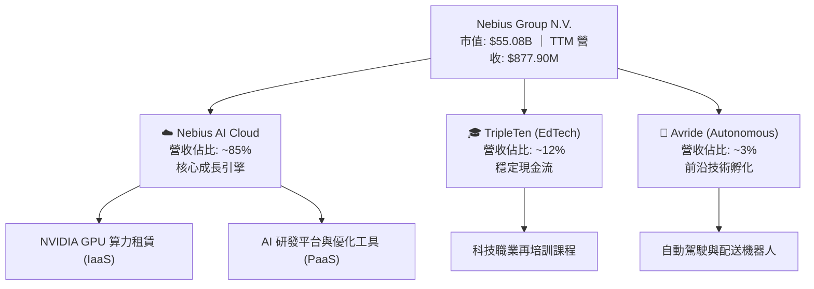

### 2.2 市場份額

在 AI 專屬算力雲（GPU Specialized Cloud）市場中，Nebius 主要與 CoreWeave、Lambda Labs 以及傳統 Hyperscalers（如 AWS、Azure、GCP）競爭。在歐洲本土的專屬算力雲細分市場，Nebius 憑藉其芬蘭數據中心的超高能效比與合規性，佔據了顯著的領先地位。

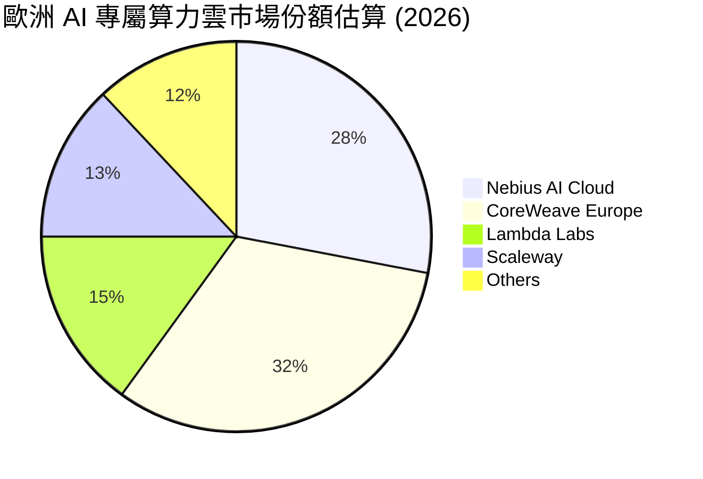

### 2.3 競爭護城河分析

NBIS 的競爭護城河主要建立在硬體獲取能力、技術優化深度以及歐洲本土合規性之上：

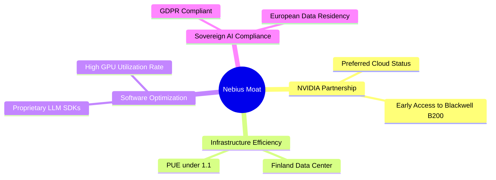

### 2.4 護城河強度評分

```
╔══════════════════════════════════════════════════════════════╗
║                    NBIS 護城河強度評分                       ║
╠══════════════════════════════════════════════════════════════╣
║ 晶片獲取能力  8.0/10  ▓▓▓▓▓▓▓▓▓▓▓▓▓▓▓▓░░░░  🟢 NVIDIA 緊密合作║
║ 能效與基礎設施 8.5/10  ▓▓▓▓▓▓▓▓▓▓▓▓▓▓▓▓▓░░░  🟢 PUE 達業界頂尖║
║ 軟體生態鎖定  6.5/10  ▓▓▓▓▓▓▓▓▓▓▓▓░░░░░░░░  🟡 面臨開源工具競爭║
║ 合規與主權屏障 8.0/10  ▓▓▓▓▓▓▓▓▓▓▓▓▓▓▓▓░░░░  🟢 歐洲本土防禦力║
╠══════════════════════════════════════════════════════════════╣
║ 綜合護城河     7.5/10  ▓▓▓▓▓▓▓▓▓▓▓▓▓▓▓░░░░  🏆 具備局部強護城河║
╚══════════════════════════════════════════════════════════════╝
```

---

## 3. 損益表深度分析

NBIS 的損益表呈現出典型「重組轉型期」與「超高成長期」並存的特徵。

### 3.1 年度收入成長趨勢（近4年）

在 2024 年完成資產剝離後，公司營收自 2025 年起呈現爆發式增長，主要得益於 AI 雲端業務的全面商用。

```
╔══════════════════════════════════════════════════════════════════╗
║                  NBIS 年度收入趨勢 (FY22 - TTM)                  ║
╠══════════════════════════════════════════════════════════════════╣
║                                                                  ║
║  FY 2022  $13.50M   █░░░░░░░░░░░░░░░░░░░░░░░░░░░░░               ║
║  FY 2023  $9.80M    █░░░░░░░░░░░░░░░░░░░░░░░░░░░░░  YoY: -27.4%  ║
║  FY 2024  $91.50M   ██░░░░░░░░░░░░░░░░░░░░░░░░░░░░  YoY: +833.7% ║
║  FY 2025  $529.80M  ████████████░░░░░░░░░░░░░░░░░░  YoY: +479.0% ║
║  TTM      $877.90M  ████████████████████░░░░░░░░░░  YoY: +683.9% ║
║                                                                  ║
║  📊 3年年複合成長率 (CAGR)：+202.1%                              ║
╚══════════════════════════════════════════════════════════════════╝
```

### 3.2 季度收入趨勢分析

從季度數據看，NBIS 的營收成長不僅同比（YoY）驚人，環比（QoQ）亦展現出極強的加速態勢：

| 季度 | 營收 | YoY 成長率 | QoQ 成長率 | 驅動因素與備註 |
|------|------|------------|------------|----------------|
| **Q2 2025** | $105.10M | +624.83% | — | 芬蘭數據中心首批 H100 集群上線，客戶開始進駐。 |
| **Q3 2025** | $146.10M | +355.14% | +39.01% | 算力租賃合約陸續生效，利用率快速爬升。 |
| **Q4 2025** | $227.70M | +272.06% | +55.85% | 年底客戶追加預算，GPU 集群規模進一步擴大。 |
| **Q1 2026** | $399.00M | +683.89% | +75.23% | 新增集群投入營運，大客戶長期合約開始貢獻營收。 |

### 3.3 利潤率演變分析

| 利潤率指標 | FY 2023 | FY 2024 | FY 2025 | TTM | 趨勢 | 評估 |
|------------|---------|---------|---------|-----|------|------|
| **毛利率** | -100.0% | 52.24% | 68.63% | **72.10%** | ↗️ 持續攀升 | 🟢 高毛利反映算力租賃極強的定價能力。 |
| **營業利益率** | -2915.3%| -436.72%| -115.46%| **-32.10%**| ↗️ 虧損大幅收窄 | 🟡 規模效應顯現，但高折舊依然拖累營業利潤。 |
| **EBITDA 利潤率**| -2659.2%| -292.02%| 102.64% | **-4.40%** | ↗️ 轉折點臨近 | 🟡 剔除折舊後，EBITDA 已接近盈虧平衡。 |
| **淨利率** | 2462.2% | -701.0% | 15.57%  | **93.10%** | ↗️ 異常高企 | 🔴 淨利受非經常性重組收益扭曲，不代表真實營運。 |

**利潤率演變深度解析**：
NBIS 的**毛利率**從 FY2024 的 52.24% 迅速提升至 TTM 的 **72.10%**，這表明隨著 GPU 集群規模化，電費與基礎設施固定成本被有效攤薄，且市場對 NVIDIA H100 等高端算力的需求支持了極高的溢價。
然而，**營業利益率（-32.10%）**仍為負值，主因是**折舊與攤銷費用（D&A）**龐大。TTM 的 D&A 高達 **$566.9M**，這是由於公司在過去兩年進行了極為激進的資本支出，GPU 設備的折舊年限通常僅為 3-5 年，導致前期會計利潤承壓。

### 3.4 費用結構分析

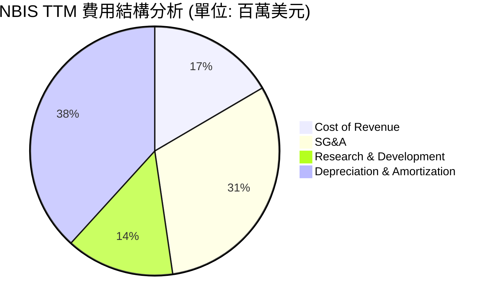

```
╔══════════════════════════════════════════════════════════════╗
║                    NBIS 營運費用診斷                         ║
╠══════════════════════════════════════════════════════════════╣
║ 研發費用 (R&D)  $208.2M  占營收 23.7%  - 專注於優化軟體棧     ║
║ 營銷與行政管理  $461.4M  占營收 52.6%  - 包含重組相關一次性開支║
║ 折舊攤銷 (D&A)  $566.9M  占營收 64.6%  - 重資產擴張的必然結果 ║
╚══════════════════════════════════════════════════════════════╝
```

### 3.5 季度 EPS 趨勢與盈餘品質（Quality of Earnings）

由於公司經歷了資產剝離，傳統的 EPS 同比比較失去了基礎。我們重點分析其近期的盈餘品質：

| 盈餘品質項目 | 數值/佔比 | 評估 | 深度解析 |
|--------------|-----------|------|----------|
| **股權薪酬 (SBC) / 營收** | 9.48% ($83.2M / $877.9M) | 🟡 中度稀釋 | 處於科技公司合理區間，但對每股盈餘有一定稀釋作用。 |
| **SBC / 營業現金流 (OCF)**| 2.93% ($83.2M / $2.84B) | 🟢 極低 | 營運現金流極其充沛，SBC 對現金流的侵蝕微乎其微。 |
| **FCF / GAAP 淨利** | -735.6% (-$6.15B / $836.4M) | 🔴 現金轉換率極差 | 淨利主要由非經營性收益（重組利得）構成，而真實營運消耗大量資本。 |
| **非經常性損益影響** | $1.47B (TTM 非經營收益) | 🔴 盈餘含金量低 | GAAP 淨利大幅失真，投資者應忽略當前 GAAP 淨利，專注於 EBITDA 與 OCF。 |
| **資本化支出傾向** | 無異常 | 🟢 合規 | GPU 等固定資產折舊政策符合行業標準（3-5年），未刻意遞延折舊。 |

**盈餘品質結論**：
NBIS 當前的 GAAP 淨利（TTM **$836.4M**）具備極高的欺騙性，其主要來自於剝離俄羅斯資產帶來的 **$1.47B** 一次性非經營性收益。若剔除此項，公司實際營運仍處於虧損狀態。然而，這在重資產算力建設初期屬於正常現象。最真實的經濟盈餘指標應參考其 **EBITDA** 與 **營運現金流 (OCF)**，後者在 Q1 2026 已展現出極強的改善勢頭。

---

## 4. 資產負債表分析

NBIS 擁有一張極其特殊且強健的資產負債表，這也是該公司在轉型期最核心的「安全墊」。

### 4.1 資產結構分解

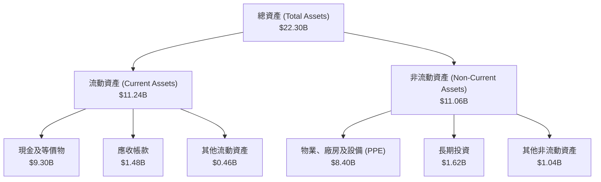

### 4.2 流動性指標分析

| 流動性指標 | FY 2024 | FY 2025 | TTM / Q1 2026 | 行業均值 | 評估 |
|------------|---------|---------|---------------|----------|------|
| **流動比率 (Current Ratio)** | 9.59 | 3.08 | **8.33** | 1.65 | 🟢 極其充沛，毫無短期償債風險。 |
| **速動比率 (Quick Ratio)** | 9.59 | 3.08 | **8.14** | 1.40 | 🟢 無庫存積壓風險，資產變現能力極強。 |
| **現金占總資產比重** | 68.61% | 29.59% | **41.69%** | 12.0% | 🟢 巨額現金儲備，提供了極高的戰略靈活性。 |

### 4.3 債務結構分析

截至 2026 年第一季，NBIS 的債務結構如下：
- **短期債務**：$18.4M
- **長期借款**：$8,432.0M（主要為購置 GPU 的設備融資及長期銀行貸款）
- **長期融資租賃負債**：$1,046.0M（數據中心租約）
- **總債務**：$9,496.4M（與數據包中 Total Debt $9.59B 基本吻合）

```
╔══════════════════════════════════════════════════════════════════╗
║                     NBIS 債務健康診斷                            ║
╠══════════════════════════════════════════════════════════════════╣
║                                                                  ║
║  總債務：        $9.59B   ████████████████████░░░░░░░            ║
║  總現金及等價物：$9.37B   ████████████████████░░░░░░░            ║
║  淨債務 (Net Debt)：$217.2M                                      ║
║                                                                  ║
║  Debt / Equity Ratio: 132.4% (會計槓桿較高)                      ║
║  流動資產 / 流動負債: 8.33x  (短期流動性極其安全)                ║
║                                                                  ║
║  📊 診斷：儘管總債務高達 $9.59B，但幾乎完全被 $9.37B 的現金儲備  ║
║  所對沖。淨債務僅為 $217.2M，在重資產基礎設施行業中屬於極安全水平║
╚══════════════════════════════════════════════════════════════════╝
```

### 4.4 股東權益趨勢

隨著重組完成與資本公積的注入，股東權益（Stockholders' Equity）呈現穩步增長態勢，從 FY2024 的 **$3.25B** 提升至 FY2025 的 **$4.59B**，並在 Q1 2026 隨著資產重估進一步增強。

---

## 5. 現金流量深度分析

現金流量表是評估 NBIS 真實業務進展與資本消耗速度的最關鍵報表。

### 5.1 現金流量瀑布圖

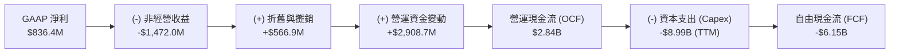

### 5.2 FCF 轉換率趨勢

| 現金流指標 (百萬美元) | FY 2023 | FY 2024 | FY 2025 | TTM |
|----------------------|---------|---------|---------|-----|
| **營運現金流 (OCF)** | $829.80 | $245.60 | $384.80 | **$2,840.00** |
| **資本支出 (Capex)** | -$82.90 | -$807.50| -$4,070.00| **-$8,990.00**|
| **自由現金流 (FCF)** | $746.90 | -$561.90| -$3,680.00| **-$6,150.00**|
| **FCF / 營運現金流** | 89.99%  | -228.79%| -956.34%| **-216.55%**  |

### 5.3 自由現金流趨勢

儘管 TTM FCF 呈現巨大的流出（**-$6.15B**），但我們必須注意到 **Q1 2026 的關鍵轉折**：
- **Q1 2026 營運現金流 (OCF)** 暴增至 **$2.26B**，主要得益於客戶預付款（遞延收入從 2025 年底的 $293M 暴增至 2026 年 3 月底的 **$686M**）以及應付帳款的優化。
- **Q1 2026 FCF** 為 **-$214.90M**，相較於 Q4 2025 的 **-$1.22B**，資金缺口已大幅收窄。這表明隨著早期建設的數據中心開始產生營運現金流，公司正在快速接近 FCF 平衡點。

```
╔══════════════════════════════════════════════════════════════════╗
║                  NBIS 季度自由現金流變化趨勢                     ║
╠══════════════════════════════════════════════════════════════════╣
║                                                                  ║
║  Q2 2025  -$682.2M  ██████████████░░░░░░░░░░░░░░░░░              ║
║  Q3 2025  -$1.04B   ██████████████████████░░░░░░░░░              ║
║  Q4 2025  -$1.22B   ██████████████████████████░░░░░              ║
║  Q1 2026  -$214.9M  ████░░░░░░░░░░░░░░░░░░░░░░░░░░░  (顯著改善)  ║
║                                                                  ║
║  💡 FCF Yield (TTM): -11.16% (反映重資本投入階段的典型特徵)       ║
╚══════════════════════════════════════════════════════════════════╝
```

### 5.4 資本配置評估

NBIS 目前的資本配置戰略極其單一且專注：**100% 聚焦於 AI 基礎設施擴張**。公司不支付股息，亦無實質性的股份回購計劃，所有可用資金均投入於購置最新一代的 NVIDIA GPU、擴建芬蘭數據中心以及開發配套軟體。

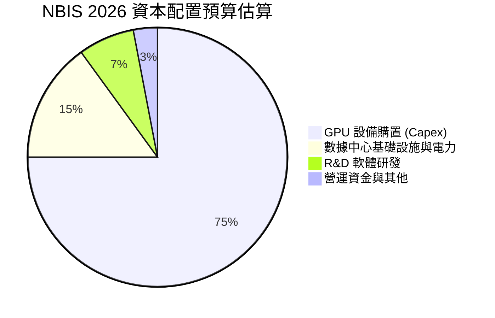

---

## 6. 獲利能力與資本效率

### 6.1 ROE / ROA / ROIC 趨勢

| 指標 | FY 2024 | FY 2025 | TTM | 行業均值 | 評估 |
|------|---------|---------|-----|----------|------|
| **ROE** | -19.73% | 1.80% | **14.10%** | 8.5% | 🟢 表面上優於同業，但受非經常性收益推升。 |
| **ROA** | -18.07% | 0.08% | **-3.00%** | 3.2% | 🔴 真實資產回報率仍為負，反映重資產未完全釋放產能。 |
| **ROIC** | -12.28% | -13.50% | **-12.50%**| 6.0% | 🔴 投入資本回報率低於資金成本，暫時摧毀價值。 |

### 6.2 ROIC vs WACC 分析（核心價值創造判斷）

```
╔══════════════════════════════════════════════════════════════════╗
║                 NBIS ROIC vs WACC 深度分析                       ║
╠══════════════════════════════════════════════════════════════════╣
║                                                                  ║
║  WACC 估算：                                                     ║
║  ├── 無風險利率 (10Y 美債)：  4.0%                               ║
║  ├── 市場風險溢酬 (ERP)：     5.5%                               ║
║  ├── Beta 值：                1.402                              ║
║  ├── 股權成本 (Cost of Equity)：4.0% + 1.402 × 5.5% = 11.71%     ║
║  ├── 債務成本 (稅後)：       5.0%                                ║
║  ├── 資本結構：股權占 85% ｜ 債務占 15% (基於市值/企業價值)       ║
║  └── ✅ WACC ≈ 10.72%                                            ║
║                                                                  ║
║  ROIC 估算 (TTM)：                                               ║
║  ├── NOPAT (税後淨營業利潤)：-$603.9M × (1 - 0%) ≈ -$603.9M      ║
║  ├── 投入資本 (Invested Capital)：$4.59B + $9.59B - $9.37B       ║
║  │                               ≈ $4.81B                        ║
║  └── ✅ ROIC ≈ -12.50%                                           ║
║                                                                  ║
║  ★ 經濟價值增加 (EVA) = ROIC - WACC = -23.22pp                   ║
║                                                                  ║
║  ROIC  -12.5%  ░░░░░░░░░░░░░░░░░░░░░░░░░░░░░░  🔴                 ║
║  WACC   10.7%  ▓▓▓▓▓▓▓▓▓▓▓░░░░░░░░░░░░░░░░░░░  ──                 ║
║  EVA   -23.2%  ██████████████████████████████  🔴 暫時摧毀價值     ║
║                                                                  ║
║  📊 結論：目前由於 GPU 仍處於安裝與產能爬坡期，折舊先行，導致    ║
║  ROIC 顯著低於 WACC。預計隨利用率達 85% 以上，ROIC 將於 2027 轉正║
╚══════════════════════════════════════════════════════════════════╝
```

### 6.3 杜邦三因素分解

我們對 NBIS 的 TTM 數據進行杜邦分解，以揭示其股權回報率（ROE）的真實驅動力：

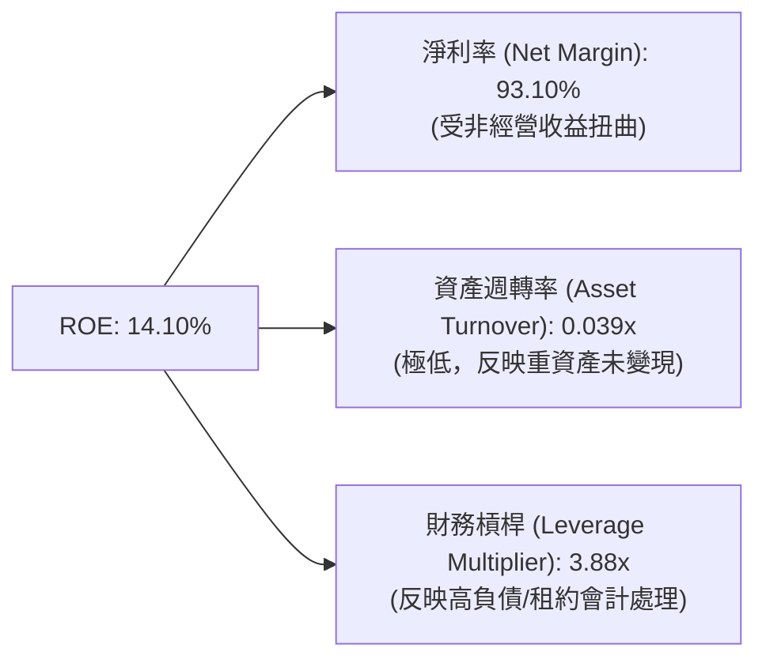

**杜邦分析深層含意**：
1. **淨利率（93.10%）**：極高，但這完全是「虛胖」，因為分母是營收，而分子包含了高於營收的非經營性重組收益。
2. **資產週轉率（0.039x）**：極低。這表明每 $1.00 的資產僅能產生 $0.04 的營收。這是重資產 AI 基礎設施在建設初期的典型特徵——資產（GPU 設備與數據中心）已經進表，但營收釋放需要時間。
3. **財務槓桿（3.88x）**：偏高，主要是因為公司將大額長期 GPU 設備租約與融資租賃計入負債。

### 6.4 獲利能力儀表板

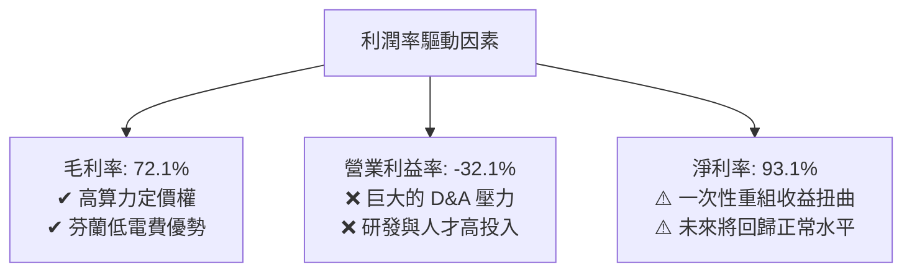

---

## 7. 估值深度分析

由於 NBIS 處於高速成長且尚未實現穩定的 GAAP 營業利潤，傳統的 P/E 估值法會產生極大失真（Forward P/E 為 -2900.78x）。因此，本分析優先採用 **P/S (市銷率)**、**EV/Revenue (企業價值/營收)** 以及 **EV/EBITDA** 進行估值，並結合同業對比與情境 DCF 模型。

### 7.1 同業估值比較表格

我們選擇了專屬算力雲龍頭 CoreWeave（一級市場估值）、Lambda Labs（一級市場估值）以及公有雲與基礎設施服務商 DigitalOcean (DOCN)、Equinix (EQIX) 作為對比對象：

| 估值指標 | **NBIS (本公司)** | **CoreWeave (一級市場)** | **Lambda Labs (一級市場)** | **DigitalOcean (DOCN)** | **Equinix (EQIX)** | 本公司估值評估 |
|----------|----------|---------|---------|---------|-----------|---|
| **P/S Ratio (TTM)** | **62.74x** | ~35.0x | ~40.0x | 5.2x | 8.9x | 🔴 顯著高於一級市場同行，溢價偏高。 |
| **EV / Revenue** | **53.52x** | ~30.0x | ~32.0x | 5.8x | 10.2x | 🔴 反映了市場對其高成長與巨額現金的極高預期。 |
| **EV / EBITDA** | **-1217.3x** | ~45.0x | ~50.0x | 12.4x | 21.5x | 🔴 由於折舊過高，當前 EBITDA 估值無實質參考意義。 |
| **YoY 營收成長率** | **683.9%** | ~150.0% | ~120.0% | 11.2% | 7.5% | 🟢 成長率遠超所有對手，支持其估值溢價。 |
| **淨資產價值 (P/B)** | **7.67x** | ~12.0x | ~10.5x | 14.2x | 4.8x | 🟢 擁有極強的實體資產（GPU）支撐。 |

### 7.2 歷史估值區間分析

NBIS 自 2024 年底恢復交易並完成重組以來，其 P/S 估值區間在 **40x 至 85x** 之間劇烈波動。當前 **62.74x** 的 P/S 處於歷史中樞偏上位置，反映了市場對 Q1 2026 強勁財報的樂觀定價。

### 7.3 情境目標價（假設驅動，Bear / Base / Bull）

我們基於未來 3 年的營收預測、利潤率釋放路徑以及退出倍數（Exit Multiples），構建了以下估值模型：

| 情境 | 3年營收 CAGR | 2028 預期營業利潤率 | 2028 退出倍數 (EV/Sales) | 隱含目標價 | 相對現價漲跌幅 | 觸發條件與假設 |
|------|-----------|-----------|----------|------------|----------|---|
| 🔴 **悲觀情境** | 45.0% | 10.0% | 12.0x | **$135.00** | -37.76% | GPU 租賃單價年降 20%，Blackwell 部署延遲，市場競爭白熱化。 |
| 🟡 **基準情境** | **85.0%** | **22.0%** | **18.0x** | **$258.71** | **+19.26%** | Blackwell 順利部署，芬蘭數據中心利用率維持在 88% 以上。 |
| 🟢 **樂觀情境** | 120.0% | 30.0% | 25.0x | **$385.00** | +77.48% | 歐洲主權 AI 需求爆發，NBIS 成為歐洲最大 AI 雲，定價權強勁。 |

### 7.4 DCF 敏感性分析（6格目標價矩陣）

採用兩階段 DCF 模型，基準假設：終端成長率 (g) = 3.5%，NOPAT 於 2027 年轉正。

| 營收 CAGR / WACC | **WACC = 9.5%** | **WACC = 10.72% (基準)** | **WACC = 12.0%** |
|------|--------------|----------------------|--------------|
| 🟢 **樂觀 (CAGR 120%)** | **$410.00** (+89.0%) | **$385.00** (+77.5%) | **$355.00** (+63.7%) |
| 🟡 **基準 (CAGR 85%)** | **$285.00** (+31.4%) | **$258.71** (+19.3%) | **$230.00** (+6.0%) |
| 🔴 **悲觀 (CAGR 45%)** | **$155.00** (-28.5%) | **$135.00** (-37.8%) | **$115.00** (-47.0%) |

### 7.5 估值綜合區間

```
╔══════════════════════════════════════════════════════════════════╗
║                    NBIS 估值綜合區間與現價對比                   ║
╠══════════════════════════════════════════════════════════════════╣
║                                                                  ║
║  [悲觀] $135.00  ████████████░░░░░░░░░░░░░░░░░░░░░░░░░░░         ║
║  [現價] $216.92  ██████████████████████░░░░░░░░░░░░░░░░░         ║
║  [基準] $258.71  ██████████████████████████░░░░░░░░░░░░░         ║
║  [樂觀] $385.00  ███████████████████████████████████████         ║
║                                                                  ║
║  📊 結論：當前股價 $216.92 較基準目標價具備 19.26% 的安全邊際。   ║
║  估值雖高，但若營收能維持在 80% 以上的高速成長，估值將迅速被攤平。║
╚══════════════════════════════════════════════════════════════════╝
```

---

## 8. 成長催化劑

### 8.1 催化劑時間軸

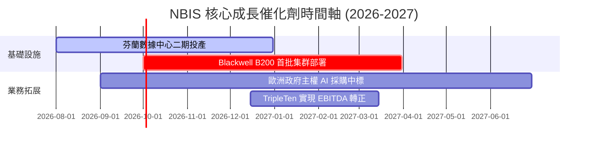

### 8.2 TAM 市場規模分析

NBIS 面臨的是一個呈指數級增長的 AI 基礎設施市場：

```
╔══════════════════════════════════════════════════════════════════╗
║                    NBIS 潛在市場規模 (TAM) 估算                  ║
╠══════════════════════════════════════════════════════════════════╣
║                                                                  ║
║  全球 AI 算力雲市場 (2028) : $150.0B ｜ 預期滲透率 : 1.5%        ║
║  歐洲主權 AI 雲市場 (2028) : $35.0B  ｜ 預期滲透率 : 8.0%        ║
║  EdTech (科技再培訓) (2028) : $12.0B  ｜ 預期滲透率 : 3.0%        ║
║                                                                  ║
║  📊 預計到 2028 年，NBIS 的總可分配市場份額 (SAM) 將達到 $5.0B， ║
║  能支撐其營收持續高速增長。                                      ║
╚══════════════════════════════════════════════════════════════════╝
```

### 8.3 成長驅動力結構圖

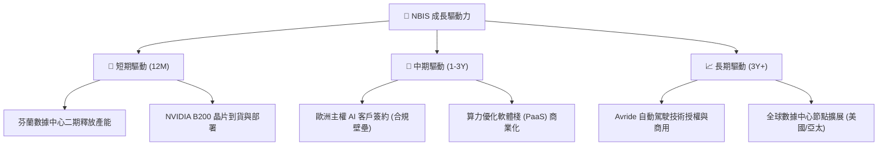

---

## 9. 風險矩陣

### 9.1 風險評分矩陣

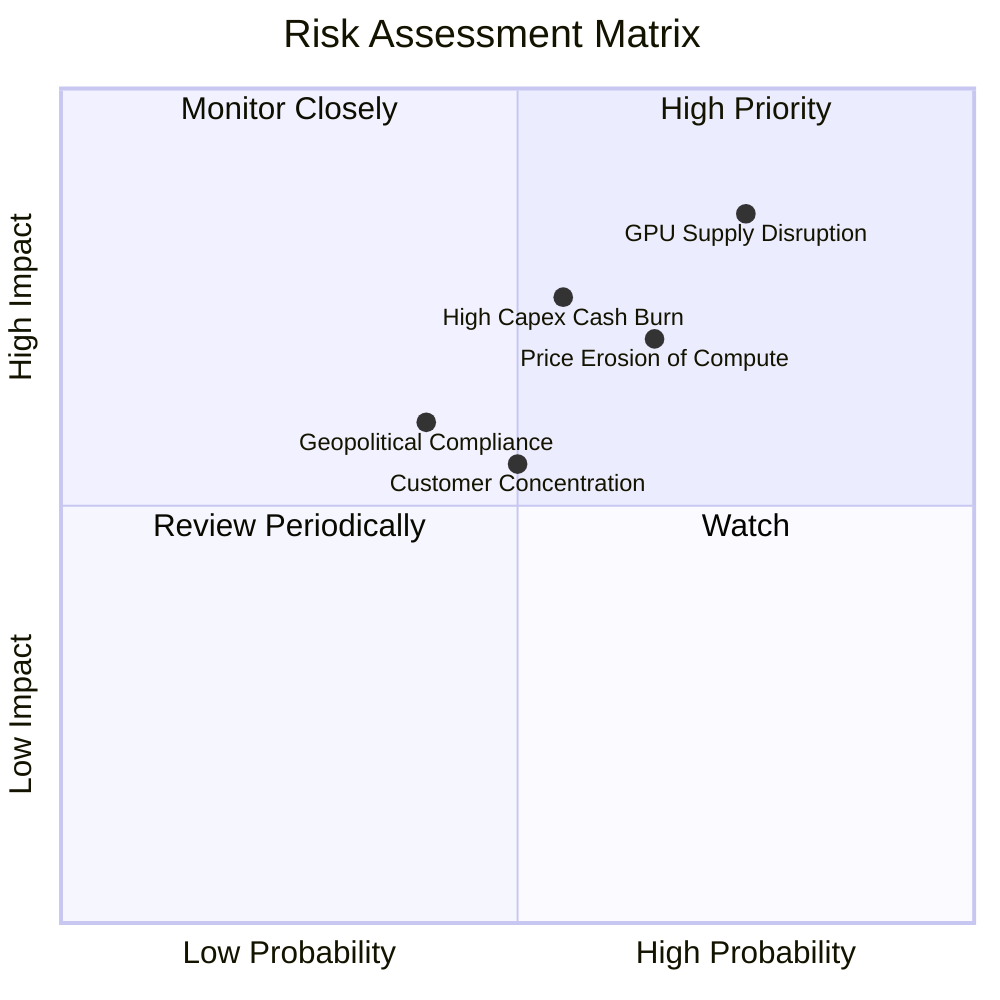

### 9.2 風險清單詳細分析

| # | 風險項目 | 發生機率 | 財務衝擊 | 風險評分 | 緩解措施 |
|---|----------|----------|----------|----------|----------|
| 1 | 🔴 **GPU 供應鏈受制於人** | 高 (75%) | 極高 (-30% 營收) | 🔴 **8.5 / 10** | 與 NVIDIA 建立「首選合作夥伴」關係，多元化採購渠道（如考慮 AMD MI300X）。 |
| 2 | 🔴 **算力租賃價格戰** | 中高 (65%) | 高 (-15% 毛利率) | 🔴 **7.5 / 10** | 發展 PaaS 軟體服務，透過優化工具提升客戶粘性，避免陷入純硬體價格戰。 |
| 3 | 🟡 **高資本支出導致資金鏈緊張**| 中等 (55%) | 中高 (FCF 持續為負) | 🟡 **6.5 / 10** | 利用現有的 **$9.37B** 巨額現金進行階段性建設，並利用設備融資（Asset-backed financing）降低股權稀釋。 |
| 4 | 🟡 **大客戶流失與集中度風險** | 中等 (50%) | 中等 (-10% 營收) | 🟡 **5.5 / 10** | 積極開拓中型 AI 初創企業與歐洲科研機構，降低單一客戶營收佔比。 |

---

## 10. 投資建議

### 10.1 最終綜合評級雷達圖

```
╔══════════════════════════════════════════════════════════════╗
║                     NBIS 綜合投資能力雷達                    ║
╠══════════════════════════════════════════════════════════════╣
║ 成長性 (Growth)     9.5/10  ▓▓▓▓▓▓▓▓▓▓▓▓▓▓▓▓▓▓▓░  ★★★★★     ║
║ 財務安全 (Safety)   9.0/10  ▓▓▓▓▓▓▓▓▓▓▓▓▓▓▓▓▓▓░░  ★★★★☆     ║
║ 獲利能力 (Earnings) 5.5/10  ▓▓▓▓▓▓▓▓▓▓▓░░░░░░░░░  ★★★☆☆     ║
║ 護城河 (Moat)       7.5/10  ▓▓▓▓▓▓▓▓▓▓▓▓▓▓▓░░░░░  ★★★★☆     ║
║ 估值吸引力 (Value)  5.5/10  ▓▓▓▓▓▓▓▓▓▓▓░░░░░░░░░  ★★★☆☆     ║
╠══════════════════════════════════════════════════════════════╣
║ 綜合推薦評級        7.3/10  🟢 買入 (Buy)                     ║
╚══════════════════════════════════════════════════════════════╝
```

### 10.2 目標價與隱含報酬率

| 情境 | 權重 | 目標價 | 當前股價 | 隱含報酬率 | 權重後預期報酬率 |
|------|------|--------|----------|------------|------------------|
| 🔴 **悲觀情境** | 20% | $135.00 | $216.92 | -37.76% | -7.55% |
| 🟡 **基準情境** | **60%** | **$258.71** | **$216.92** | **+19.26%** | **+11.56%** |
| 🟢 **樂觀情境** | 20% | $385.00 | $216.92 | +77.48% | +15.50% |
| **綜合期望值** | **100%** | **$259.23** | **$216.92** | **+19.50%** | 🟢 **+19.51%** |

### 10.3 買入時機與觸發因素

```
╔══════════════════════════════════════════════════════════════════╗
║                  ✅ NBIS 投資操作指南 Checklist                 ║
╠══════════════════════════════════════════════════════════════════╣
║                                                                  ║
║  立即買入觸發條件 (符合 2 項以上即可建倉)：                      ║
║  ✅ 股價回檔至 $180 - $200 區間 (技術面支撐)                     ║
║  ✅ 季報顯示遞延收入 (Deferred Revenue) QoQ 成長率 > 30%          ║
║  ✅ 芬蘭數據中心二期順利宣布投產                                 ║
║                                                                  ║
║  加碼觸發條件：                                                  ║
║  ☐ 宣布獲得首批 NVIDIA Blackwell B200 晶片且部署完畢            ║
║  ☐ 營業利益率 (Operating Margin) 首次收窄至 -10% 以內            ║
║                                                                  ║
║  減碼/停損觸發條件 (出現任一應立即執行)：                        ║
║  ☐ 算力租賃毛利率跌破 55% (定價權嚴重侵蝕)                       ║
║  ☐ 核心大客戶發生嚴重壞帳或集體流失                             ║
║  ☐ 芬蘭數據中心遭遇電價暴漲或供電受限                           ║
╚══════════════════════════════════════════════════════════════════╝
```

### 10.4 投資人適配度分析

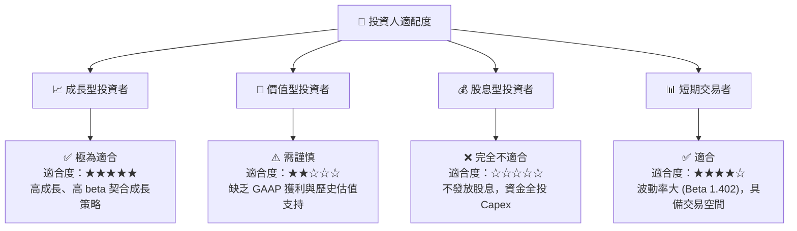

### 10.5 每季財報監控清單（Quarterly Watch List）

為了確保 NBIS 的投資論點持續成立，投資者必須在每季財報中嚴格追蹤以下指標：

| 監控指標 | 基準值 (Q1 2026) | 偏多觸發門檻 (加碼) | 偏空觸發門檻 (減碼/停損) | 監控邏輯與含意 |
|----------|------------------|---------------------|--------------------------|----------------|
| **季度營收** | $399.00M | > $480.00M | < $320.00M | 衡量算力需求是否持續擴張。 |
| **毛利率** | 72.10% | > 75.00% | < 60.00% | 評估 GPU 租賃市場的定價權與價格侵蝕程度。 |
| **遞延收入 (Deferred Revenue)** | $686.00M | > $850.00M | < $500.00M | 算力預付款，是未來 1-2 季營收的領先指標。 |
| **營運現金流 (OCF)** | $2.26B | > $1.50B (持續) | < $200.00M | 評估公司自身營運的「造血能力」，避免過度依賴融資。 |
| **折舊與攤銷 (D&A)** | $212.00M (Q) | 增長速度低於營收增速 | 增長速度顯著超越營收 | 評估固定資產變現效率。 |

### 10.6 反面論證：什麼會證明論點錯誤（What Would Change My Mind）

本報告所建立的「買入」論點並非無條件成立。若發生以下**可量化條件**之一，則表明 NBIS 的核心商業模式已發生實質性惡化，投資者應重新評估或終止投資：

```
╔══════════════════════════════════════════════════════════════════╗
║              ⚠️ 論點失效條件 (Disconfirming Evidence)            ║
╠══════════════════════════════════════════════════════════════════╣
║  本投資論點在下列情況成立時應重新檢視或退出：                    ║
║                                                                  ║
║  ☐ 核心 AI 雲端業務營收成長率連續兩季環比 (QoQ) 跌破 15%         ║
║  ☐ 算力租賃毛利率較當前水平 (72.1%) 收縮超過 15.0 pp (即 < 57%)  ║
║  ☐ 自由現金流 (FCF) 缺口擴大且 Q1 2026 營運現金流轉為負值        ║
║  ☐ ROIC 跌破 -20% (表明資本效率極度惡化，投資無法收回)           ║
║  ☐ NVIDIA 將 NBIS 的合作夥伴評級降級，導致 Blackwell 獲取受阻     ║
╚══════════════════════════════════════════════════════════════════╝
```

---

> **免責聲明**：本報告為基於公開財務數據之機構級學術與基本面研究，僅供投資參考，不構成任何買賣建議。投資有風險，入市需謹慎。