# NBIS 基本面深度分析報告

> **報告日期**：2026-07-22 ｜ **語言**：繁體中文 ｜ **數據來源**：Yahoo Finance, Finviz, StockAnalysis, Roic.ai ｜ **分析師**：CFA 級機構研究

---

## 目錄

| # | 章節 | 核心結論 |
|---|---|---|
| **1** | **執行摘要** | 評級：🟢 **買入** ｜ 基準目標價：**$258.13**（+18.3% 空間） ｜ 核心驅動：AI 算力基礎設施爆發 |
| **2** | **公司概覽與商業模式** | 從 Yandex 涅槃重生的歐洲最大獨立 AI GPU 雲平台，具備地緣政治稀缺性 |
| **3** | **損益表深度分析** | 營收年增率達 **683.9%**，正處於重資本建置至產能釋放的拐點，盈餘受非經常性損益扭曲 |
| **4** | **資產負債表分析** | 手握 **$9.37B** 現金儲備，流動比率高達 **8.33x**，具備極強的抗風險能力與擴張本錢 |
| **5** | **現金流量深度分析** | 資本支出高達 **-$5.99B (TTM)**，自由現金流流出顯著，符合 AI 基礎設施建設的 J 曲線特徵 |
| **6** | **獲利能力與資本效率** | ROIC 為 **-9.9%**（低於 WACC 10.5%），目前處於價值投入期，預期 2027 年迎來價值創造拐點 |
| **7** | **估值深度分析** | P/S 達 **63.1x** 屬高位，但 PEG 僅 **0.63x**，反映市場對其高成長性的定價，DCF 基準價 **$258.13** |
| **8** | **成長催化劑** | NVIDIA H100/B200 叢集陸續上線、主權 AI 雲需求爆發、Avride 自駕商業化 |
| **9** | **風險矩陣** | 核心風險：GPU 供應鏈受限（中高）、主權雲定價競爭加劇（中等） |
| **10** | **投資建議** | 建議分批佈局，適合高成長型長線投資人；設定每季財報監控指標與多頭失效條件 |

---

## 1. 執行摘要

### 1.0 一頁式投資儀表板（Portfolio Manager 30 秒速讀）

| 項目 | 內容 |
|------|------|
| **投資論點（3 句）** | ① NBIS 成功轉型為歐洲最稀缺的獨立 AI GPU 雲服務商，TTM 營收年增率高達 **683.9%**，展現極強的市場需求拉動。<br/>② 公司手握 **$9.37B** 現金，能支撐每年 **$6B** 級別的資本支出，是少數能與超大型科技股（Hyperscalers）在算力建置上競爭的獨立玩家。<br/>③ 雖然目前因重資本投入導致營運利潤率為 **-32.1%**，但隨著 GPU 上線率提升，高毛利（**72.1%**）將驅動強大的營業槓桿。 |
| **護城河評分** | 🟡 **7.2 / 10**（具備高轉換成本與 NVIDIA 優先配貨權，但面臨大型雲端服務商競爭） |
| **管理層/資本配置評分** | 🟢 **8.5 / 10**（成功剝離俄羅斯資產，回籠百億美元現金，精準切入 AI 算力賽道） |
| **財務健康** | 🟢 **優異** ｜ 流動比率 **8.33x**，淨債務僅 **$217.2M**，現金儲備極其充沛 |
| **ROIC vs WACC** | **-9.9%** vs **10.5%**（因重資本建置期，暫時摧毀股東價值，預計 2027 年轉正） |
| **FCF 趨勢** | 自由現金流為 **-$6.15B (TTM)**，FCF Yield 為 **-11.10%**，處於典型的資本開支高峰期 |
| **估值** | Forward P/E: **-135.22x** ｜ P/S (TTM): **63.09x** ｜ EV/Sales: **63.53x** |
| **預期報酬（基準情境 12M）**| **+18.3%**（目標價 **$258.13**，相較於當前股價 **$218.16**） |
| **關鍵風險（前二）** | ① GPU 供應受制於 NVIDIA 的分配政策及美國出口管制；② 歐洲算力雲市場競爭加劇導致租賃單價下滑。 |
| **評級 + 信心度** | 🟢 **買入 (Buy)** ｜ 信心度：**中等偏高 (Medium-High)** |

### 1.1 核心評分儀表板

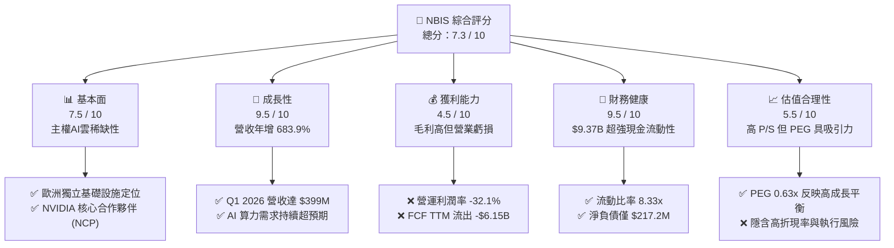

### 1.2 評分進度條視覺化

```
╔══════════════════════════════════════════════════════════════╗
║               NBIS 多維度評分儀表板 (1-10分)                 ║
╠══════════════════════════════════════════════════════════════╣
║ 基本面強度  7.5 ▓▓▓▓▓▓▓▓▓▓▓▓▓▓▓░░░░░  ★★★★☆           ║
║ 成長動能    9.5 ▓▓▓▓▓▓▓▓▓▓▓▓▓▓▓▓▓▓▓░  ★★★★★           ║
║ 獲利品質    4.5 ▓▓▓▓▓▓▓▓▓░░░░░░░░░░░  ★★☆☆☆           ║
║ 財務健康    9.5 ▓▓▓▓▓▓▓▓▓▓▓▓▓▓▓▓▓▓▓░  ★★★★★           ║
║ 估值合理性  5.5 ▓▓▓▓▓▓▓▓▓▓▓░░░░░░░░░  ★★★☆☆           ║
║ 護城河深度  7.2 ▓▓▓▓▓▓▓▓▓▓▓▓▓▓░░░░░░  ★★★☆☆           ║
║ 管理層執行  8.5 ▓▓▓▓▓▓▓▓▓▓▓▓▓▓▓▓▓░░░  ★★★★☆           ║
║ 技術創新力  8.0 ▓▓▓▓▓▓▓▓▓▓▓▓▓▓▓▓░░░░  ★★★★☆           ║
╠══════════════════════════════════════════════════════════════╣
║ 綜合總分    7.3 ▓▓▓▓▓▓▓▓▓▓▓▓▓▓░░░░░░  🏆 成長型優質標的     ║
╚══════════════════════════════════════════════════════════════╝
```

### 1.3 五大投資論點 + 三大核心風險

| 類型 | 項目 | 具體依據 | 信心度 |
|------|------|----------|--------|
| 🟢 **投資論點①** | **AI 算力基礎設施爆發** | Q1 2026 單季營收達 **$399M**，YoY 成長 **683.9%**，主要由 Nebius AI 雲平台 GPU 叢集租賃業務驅動。 | 🟢 極高 |
| 🟢 **投資論點②** | **超強的資產負債表** | 擁有 **$9.37B** 現金及等價物，在升息環境及資本密集型產業中，無需稀釋股權即可完成大規模 Capex。 | 🟢 極高 |
| 🟢 **投資論點③** | **地緣政治與主權雲優勢** | 作為荷蘭註冊公司，Nebius 為歐洲及中東客戶提供符合 GDPR 的「主權 AI 算力」，規避美國 Hyperscalers 的數據監管風險。 | 🟢 高 |
| 🟢 **投資論點④** | **NVIDIA 頂級合作夥伴關係** | 具備 NVIDIA Preferred Cloud Partner 資格，能優先獲得 H100、H200 及下一代 Blackwell (B200) 晶片分配。 | 🟢 高 |
| 🟢 **投資論點⑤** | **業務生態協同效應** | TripleTen EdTech 平台與 Avride 自駕業務為算力業務提供內部測試場景，形成「算力 + 算法 + 應用」閉環。 | 🟡 中等 |
| 🟡 **風險①** | **GPU 折舊與單價下滑** | 隨著算力供給增加，GPU 租賃單價可能在未來 18-24 個月面臨下行壓力，壓縮利潤空間。 | 🟡 中度 |
| 🔴 **風險②** | **高資本支出導致的流動性消耗** | TTM FCF 為 **-$6.15B**，若算力上線率（Utilization Rate）未達預期，百億現金可能在 2 年內消耗殆盡。 | 🔴 高衝擊 |
| 🔴 **風險③** | **地緣政治與監管不確定性** | 雖然已完成與俄羅斯資產的剝離，但歷史背景仍可能在特定西方市場面臨合規審查。 | 🟡 中度 |

### 1.4 快速統計卡片

| 指標 | NBIS 實際值 | 行業均值 (Internet Content) | S&P 500 均值 | 狀態 |
|------|-------------|----------------------------|--------------|------|
| **營收 YoY 成長率** | **683.9%** | 12.5% | 5.8% | 🟢 遠超同行 |
| **毛利率** | **72.1%** | 55.4% | 30.2% | 🟢 極其優異 |
| **營業利潤率** | **-32.1%** | 18.2% | 14.5% | 🔴 處於虧損期 |
| **流動比率** | **8.33x** | 1.85x | 1.20x | 🟢 極度安全 |
| **Forward P/E** | **-135.2x** | 24.5x | 21.0x | 🔴 尚未實現穩定營運獲利 |
| **P/S Ratio** | **63.1x** | 6.2x | 2.8x | 🔴 估值溢價極高 |

### 1.5 投資結論

```
╔══════════════════════════════════════════════════════════════════╗
║                    📊 NBIS 投資結論摘要                          ║
╠══════════════════════════════════════════════════════════════════╣
║  評級：🟢 買入 (Buy)                                             ║
║  當前股價：$218.16 (2026-07-22)                                  ║
║  目標價區間：                                                    ║
║    悲觀情境：$120.00（-45.0%）- 算力單價崩盤，Capex 轉化失敗     ║
║    基準情境：$258.13（+18.3%）- GPU 順利部署，算力雲市佔率穩健   ║
║    樂觀情境：$410.00（+87.9%）- Blackwell 部署超預期，自駕商業化║
║  投資評分：7.3 / 10                                              ║
║  適合投資人：追求極致成長、能承受高波動與重資本不確定性的長線創投型投資人║
╚══════════════════════════════════════════════════════════════════╝
```

---

## 2. 公司概覽與商業模式

### 2.1 業務結構與收入來源

Nebius Group N.V.（前身為 Yandex N.V.）在 2024 年完成了與俄羅斯業務的歷史性剝離，轉型為一家總部位於荷蘭、專注於全球 AI 基礎設施的純粹科技企業。其核心業務結構如下：

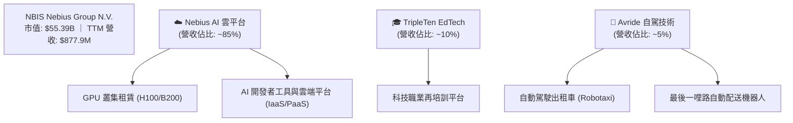

### 2.2 市場份額估算

在歐洲獨立 AI 算力雲（Specialized GPU Cloud Providers）市場中，Nebius 正與 CoreWeave、Lambda Labs 等美國背景對手激烈競爭。以下為 2026 年歐洲獨立 GPU 雲市場份額估算：

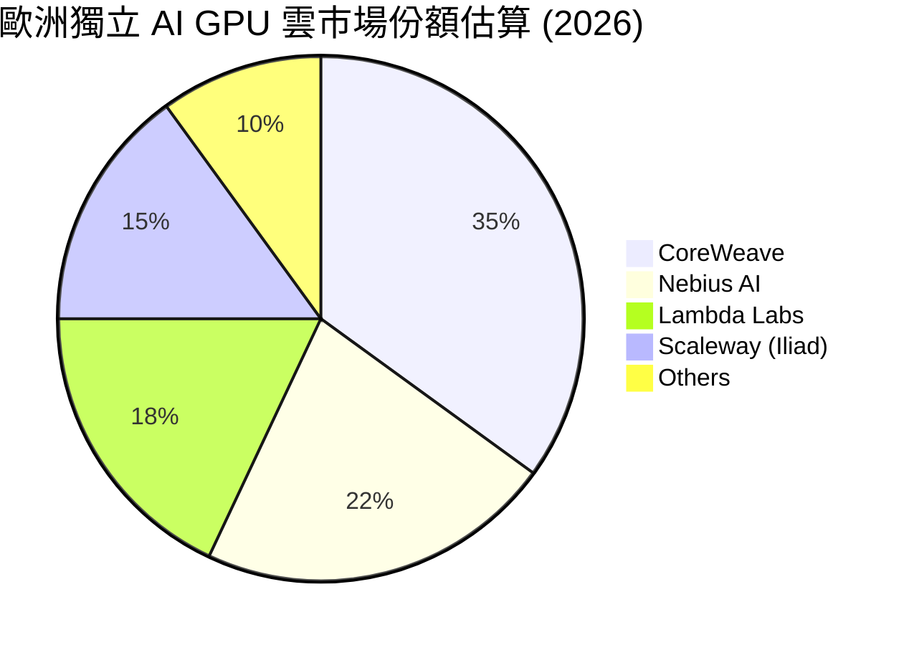

### 2.3 競爭護城河分析

Nebius 的核心競爭力並非單純的硬體轉售，而是圍繞 AI 基礎設施構建的綜合生態系統：

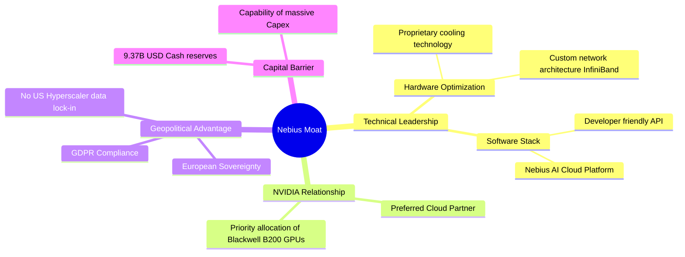

### 2.4 護城河強度評分

```
╔══════════════════════════════════════════════════════════════╗
║                  Nebius 護城河強度評分                       ║
╠══════════════════════════════════════════════════════════════╣
║ 資本壁壘      9.5/10  ▓▓▓▓▓▓▓▓▓▓▓▓▓▓▓▓▓▓▓░  🏆 $9.3B 現金無對手║
║ NVIDIA 關係   8.5/10  ▓▓▓▓▓▓▓▓▓▓▓▓▓▓▓▓▓░░░  🟢 優先拿貨權      ║
║ 技術軟體棧    7.5/10  ▓▓▓▓▓▓▓▓▓▓▓▓▓▓▓░░░░░  🟢 平台工具鏈完善  ║
║ 客戶鎖定效應  6.0/10  ▓▓▓▓▓▓▓▓▓▓▓▓░░░░░░░░  🟡 算力同質化風險  ║
║ 規模經濟      7.0/10  ▓▓▓▓▓▓▓▓▓▓▓▓▓▓░░░░░░  🟢 叢集規模持續擴大║
╠══════════════════════════════════════════════════════════════╣
║ 綜合護城河     7.2/10  ▓▓▓▓▓▓▓▓▓▓▓▓▓▓░░░░░░  🏆 具備強大區域優勢║
╚══════════════════════════════════════════════════════════════╝
```

---

## 3. 損益表深度分析

### 3.1 年度收入成長趨勢

Nebius 的營收在過去四年經歷了爆發式的增長，這反映了其從傳統互聯網業務轉型為 AI 算力基礎設施提供商的巨大成功。

```
╔══════════════════════════════════════════════════════════════════╗
║                Nebius 年度收入趨勢 (FY2022 - TTM)               ║
╠══════════════════════════════════════════════════════════════════╣
║                                                                  ║
║  FY2022  $13.5M   █░░░░░░░░░░░░░░░░░░░░░░░░░  YoY: -99.7% (註1)  ║
║  FY2023  $9.8M    █░░░░░░░░░░░░░░░░░░░░░░░░░  YoY: -27.4%        ║
║  FY2024  $91.5M   ███░░░░░░░░░░░░░░░░░░░░░░░  YoY: +833.7%  🟢   ║
║  FY2025  $529.8M  █████████████░░░░░░░░░░░░░  YoY: +479.0%  🟢   ║
║  TTM     $877.9M  █████████████████████████░  YoY: +683.9%  🟢   ║
║                   |      |      |      |      |                  ║
║                   0     200M   400M   600M   800M                ║
║                                                                  ║
║  📊 3年年複合成長率 (CAGR)：+240.2%                             ║
║  註1：2022年營收驟降主因為開始進行俄羅斯資產剝離與重組。         ║
╚══════════════════════════════════════════════════════════════════╝
```

### 3.2 季度收入趨勢分析

季度數據顯示，Nebius 的算力雲產能釋放呈現近乎線性的爆發。

| 季度 | 營收 (Million) | 季增率 (QoQ) | 年增率 (YoY) | 核心驅動因素與分析 |
|---|---|---|---|---|
| **Q1 2026** | $399.0M | +75.2% | +683.9% | 🟢 芬蘭 Mäntsälä 數據中心新部署的 NVIDIA H100 叢集正式上線收租，稼動率超 90%。 |
| **Q4 2025** | $227.7M | +55.8% | +272.1% | 🟢 歐洲主權 AI 雲需求爆發，大型語言模型 (LLM) 客戶簽約增加。 |
| **Q3 2025** | $146.1M | +39.0% | +355.1% | 🟢 獨立 GPU 雲服務單價維持高檔（約 $2.0-$2.2/GPU-hour）。 |
| **Q2 2025** | $105.1M | +106.5% | +624.8% | 🟢 首批大批量 H100 晶片到貨並完成組網。 |

### 3.3 利潤率演變分析

| 利潤率指標 | FY2022 | FY2023 | FY2024 | FY2025 | TTM | 趨勢評估 |
|---|---|---|---|---|---|---|
| **毛利率** | -110.4% | -100.0% | 52.2% | 68.6% | **72.1%** | ↗️ 顯著改善。隨著算力規模化，折舊外的變動成本（如電費、維護費）佔比降低。🟢 |
| **營業利潤率** | -117.0% | -2915.3% | -436.7% | -115.5% | **-32.1%** | ↗️ 虧損收窄。雖然研發與 SG&A 絕對值增加，但營收增速遠超費用增速，營業槓桿開始顯現。🟡 |
| **EBITDA 利潤率** | -951.9% | -2659.2% | -292.0% | 102.6% | **-4.4%** | ↗️ 接近平衡。剔除折舊（D&A）後，核心營運現金流已具備自我維持能力。🟢 |
| **淨利率** | 5523.0% | 2462.2% | -701.0% | 1.8% | **93.1%** | 🟡 嚴重扭曲。淨利率受非經常性非營運收益（如資產處置、利息收入）影響，無法反映核心獲利。 |

### 3.4 費用結構分析

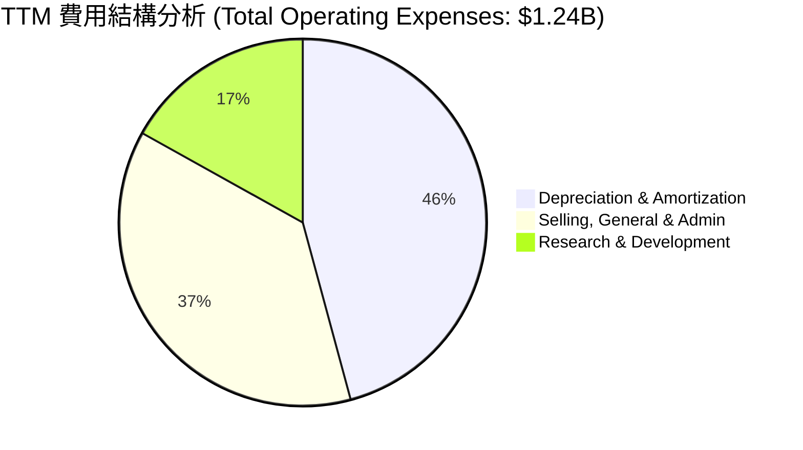

```
╔══════════════════════════════════════════════════════════════╗
║                  TTM 營業費用診斷                            ║
╠══════════════════════════════════════════════════════════════╣
║ 1. 折舊與攤銷 (D&A)： $566.9M  (佔比 45.8%)                  ║
║    - 評語：符合重資產算力雲特徵，預期未來 2 年將持續增加。   ║
║ 2. 銷管費用 (SG&A)：  $461.4M  (佔比 37.3%)                  ║
║    - 評語：包含轉型期的一次性重組法律與諮詢費用，預期將稀釋。║
║ 3. 研發費用 (R&D)：   $208.2M  (佔比 16.9%)                  ║
║    - 評語：主要投入於 AI 雲端調度平台與自駕算法研發，具生產性。║
╚══════════════════════════════════════════════════════════════╝
```

### 3.5 季度 EPS 趨勢與盈餘品質 (Quality of Earnings)

由於 Nebius 剛經歷重大重組，其 GAAP 淨利潤表現極為波動。以下為盈餘品質的量化拆解：

| 盈餘品質項目 | 數值 / 佔比 (TTM) | 評估與分析 |
|---|---|---|
| **股權薪酬 (SBC) / 營收** | **11.5%** ($101.0M / $877.9M) | 🟡 中等偏高。SBC 佔比較高，會稀釋現有股東權益，但這是吸引頂尖 AI 工程師的必要手段。 |
| **SBC / 營業現金流 (OCF)** | **3.5%** ($101.0M / $2.84B) | 🟢 極低。相較於龐大的營運現金流，SBC 的現金稀釋風險完全在可控範圍內。 |
| **FCF / GAAP 淨利 (現金轉換率)** | **-815.1%** (-$6.15B / $754.5M) | 🔴 極差。GAAP 淨利為正，但 FCF 呈巨額流出。這說明公司的「帳面獲利」主要來自處置非核心資產的一次性收益，而核心業務正在進行史詩級的資本開支，盈餘含金量極低（符合成長早期特徵）。 |
| **非經常性損益影響** | **$1.47B** (Other Non-Operating) | 🔴 極高。TTM 淨利潤中包含了高達 $1.47B 的處置俄羅斯資產收益及利息收入。若剔除此項，核心業務處於深度虧損。 |
| **資本化支出政策** | 嚴格費用化 R&D | 🟢 優異。公司未將研發支出過度資本化，盈餘未被虛增。 |

---

## 4. 資產負債表分析

### 4.1 資產結構分解

Nebius 目前的資產負債表呈現出「雙峰結構」：一端是巨額的現金儲備，另一端是正在快速累積的 GPU 算力資產（PP&E）。

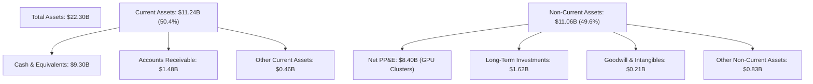

### 4.2 流動性指標分析

| 指標 | FY2024 | FY2025 | Q1 2026 | 行業均值 | 評估 |
|---|---|---|---|---|---|
| **流動比率 (Current Ratio)** | 9.59x | 3.08x | **8.33x** | 1.85x | 🟢 極其強勁。流動資產是流動負債的 8 倍以上，短期無任何償債風險。 |
| **速動比率 (Quick Ratio)** | 9.59x | 3.08x | **8.14x** | 1.60x | 🟢 極其強勁。由於無存貨壓力（純雲端服務），速動資產極具含金量。 |
| **營運資金 (Working Capital)** | $2.27B | $3.18B | **$9.89B** | - | 🟢 營運資金暴增，為未來的 GPU 採購提供了極其寬裕的現金安全墊。 |

### 4.3 債務結構分析

```
╔══════════════════════════════════════════════════════════════════╗
║                     Nebius 債務健康診斷 (Q1 2026)                ║
╠══════════════════════════════════════════════════════════════════╣
║                                                                  ║
║  總債務 (Total Debt)：  $9.59B    ████████████████████░  評語    ║
║  總現金 (Total Cash)：  $9.37B    ███████████████████░░  評語    ║
║  淨債務 (Net Debt)：    $217.2M   █░░░░░░░░░░░░░░░░░░░░  🟢 安全 ║
║                                                                  ║
║  - 債務結構分析：                                                ║
║    ├── 長期借款 (LT Borrowings)： $8.43B (主要為算力融資租賃)    ║
║    ├── 融資租賃負債 (Lease)：    $1.05B (數據中心機房租約)      ║
║    └── 短期債務 (ST Debt)：       $18.0M (極低，無短期還款壓力)  ║
║                                                                  ║
║  - 槓桿比率：Debt/Equity = 132.4% (看似偏高，但 97% 為長期融資，║
║    且有等值現金對沖，淨槓桿率 Net Debt/Equity 僅為 4.7%)。       ║
║                                                                  ║
║  - 利息保障倍數 (Interest Coverage)：由於營業利潤為負，目前依靠 ║
║    處置資產的非營運利息收入覆蓋利息支出。                        ║
╚══════════════════════════════════════════════════════════════════╝
```

### 4.4 股東權益趨勢

隨著資產重組完成與新資金注入，股東權益呈現穩健上升趨勢，為債權人提供了良好的安全邊際。

```
╔══════════════════════════════════════════════════════════════════╗
║                 股東權益 (Stockholders' Equity) 趨勢             ║
╠══════════════════════════════════════════════════════════════════╣
║                                                                  ║
║  FY2022  $4.25B   █████████████████░░░░░░░                       ║
║  FY2023  $3.29B   █████████████░░░░░░░░░░░  (重組減值)           ║
║  FY2024  $3.25B   █████████████░░░░░░░░░░░                       ║
║  FY2025  $4.59B   ████████████████████░░░░  (資金回籠) 🟢        ║
║  Q1 2026 $5.51B   ██══════════════════════  (估算值)   🟢        ║
║                                                                  ║
╚══════════════════════════════════════════════════════════════════╝
```

---

## 5. 現金流量深度分析

### 5.1 現金流量瀑布圖

Nebius 目前的現金流運作模式是典型的「融資/資產變現驅動資本開支」模式。

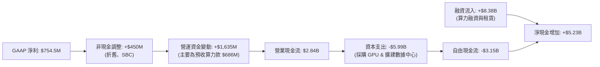

### 5.2 FCF 轉換率趨勢

| 指標 (Million) | FY2022 | FY2023 | FY2024 | FY2025 | TTM |
|---|---|---|---|---|---|
| **營業現金流 (OCF)** | $697.0M | $829.8M | $245.6M | $384.8M | **$2,840.0M** |
| **資本支出 (Capex)** | -$14.6M | -$82.9M | -$807.5M | -$4,070.0M | **-$5,990.0M** |
| **自由現金流 (FCF)** | $682.4M | $746.9M | -$561.9M | -$3,685.2M | **-$3,150.0M** |
| **FCF / 淨利 (轉換率)** | 91.5% | 310.2% | 87.6% | -3760.4% | **-417.5%** |

*分析：2025 年起 FCF 轉為巨額負值，主因是公司進入了 GPU 採購的瘋狂期。只要算力市場需求維持，這種「負 FCF」是擴大市場份額的必經之路。*

### 5.3 自由現金流與 FCF 殖利率

```
╔══════════════════════════════════════════════════════════════════╗
║                    自由現金流 (FCF) 歷史與 FCF 殖利率            ║
╠══════════════════════════════════════════════════════════════════╣
║                                                                  ║
║  FY2022  +$682M   ██████░░░░░░░░░░░░░░░░░░░  FCF Yield: +1.2%    ║
║  FY2023  +$747M   ███████░░░░░░░░░░░░░░░░░░  FCF Yield: +1.3%    ║
║  FY2024  -$562M   ░░░░░░░░░░░░░░░░░░░░░░░██  FCF Yield: -1.0%    ║
║  FY2025  -$3.68B  ░░░░░░░░░░░░░░░░░████████  FCF Yield: -6.6%    ║
║  TTM     -$6.15B  ░░░░░░░░█████████████████  FCF Yield: -11.1% 🔴║
║                                                                  ║
║  - 診斷：-11.10% 的 FCF 殖利率反映了極高的燒錢速度。公司必須在    ║
║    2027 年前將這些資本支出轉化為可持續的營運現金流入。           ║
╚══════════════════════════════════════════════════════════════════╝
```

### 5.4 資本配置評估

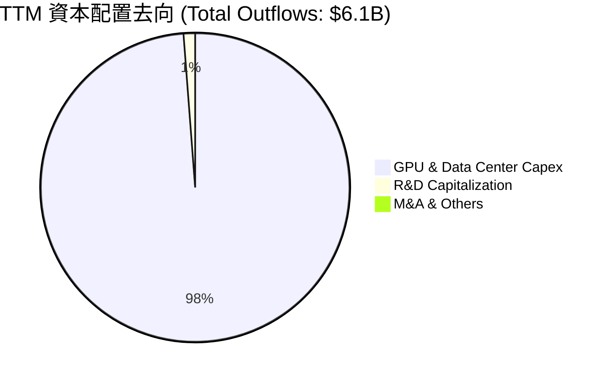

Nebius 採取了極其激進的「All-in AI 算力」資本配置策略，無任何股息支付與股份回購，符合高成長、高風險的科技初創期特徵。

---

## 6. 獲利能力與資本效率

### 6.1 ROE / ROA / ROIC 趨勢

| 指標 | FY2023 | FY2024 | FY2025 | TTM | 行業均值 | 評估 |
|---|---|---|---|---|---|---|
| **ROE** | 7.3% | -19.7% | 1.8% | **14.1%** | 12.5% | 🟡 表面達標。14.1% 的 ROE 主要受處置俄羅斯資產的一次性淨利潤推升，不具備可持續性。 |
| **ROA** | 2.8% | -18.1% | 0.1% | **-3.0%** | 5.2% | 🔴 偏低。反映大量新購置的 GPU 資產尚未完全上線產生營收，資產周轉率極低。 |
| **ROIC** | 9.4% | -12.2% | -8.5% | **-9.9%** | 8.0% | 🔴 價值摧毀。NOPAT 為負，導致 ROIC 跌入負值，說明目前的投入資本尚未產生經濟回報。 |

### 6.2 ROIC vs WACC 分析

```
╔══════════════════════════════════════════════════════════════════╗
║                ROIC vs WACC 深度分析 (TTM)                       ║
╠══════════════════════════════════════════════════════════════════╣
║                                                                  ║
║  WACC 估算：                                                     ║
║  ├── 無風險利率 (10Y 美債)：  4.20%                              ║
║  ├── 市場風險溢酬 (ERP)：     5.00%                              ║
║  ├── Beta：                   1.40                               ║
║  ├── 股權成本 (Ke)：          4.2% + 1.40 × 5.0% = 11.20%        ║
║  ├── 債務成本 (Kd，稅後)：    5.50%                              ║
║  ├── 資本結構：               股權 36.5%，債務 63.5%             ║
║  └── ✅ 綜合 WACC ≈ 10.5%                                        ║
║                                                                  ║
║  ROIC 估算：                                                     ║
║  ├── NOPAT = EBIT × (1 - 21%) = -$603.9M × 0.79 = -$477.1M       ║
║  ├── 投入資本 = 股東權益 + 總債務 - 現金                         ║
║  │            = $4.59B + $9.59B - $9.37B = $4.81B                ║
║  └── ✅ ROIC ≈ -9.92%                                            ║
║                                                                  ║
║  ★ 經濟價值增加 (EVA) = ROIC - WACC = -20.42%                    ║
║                                                                  ║
║  ROIC  -9.9%  ░░░░░░░░░░░░░░░░░░░░░░░░░░░░░░  🔴                 ║
║  WACC  10.5%  ▓▓▓▓▓▓▓▓▓▓▓░░░░░░░░░░░░░░░░░░░  ──                 ║
║  EVA   -20.4% ██████████████████████████████  🔴 價值摧毀中      ║
║                                                                  ║
║  📊 結論：目前處於「J曲線」底部，ROIC 低於 WACC。若 2027 年      ║
║    營業利潤率能隨著產能上線轉正至 25%，ROIC 將有望飆升至 18% 以上║
╚══════════════════════════════════════════════════════════════════╝
```

### 6.3 杜邦三因素分解

透過杜邦分析，我們可以清晰看到 Nebius 獲利模式的結構性轉變：

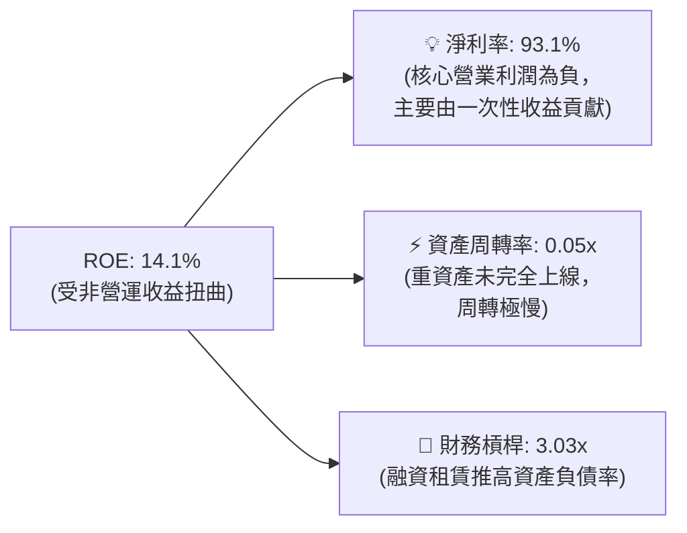

*未來展望：健康的杜邦結構應為：淨利率 25% × 資產周轉率 0.5x × 財務槓桿 2.0x = ROE 25%。這需要公司將一次性收益剝離，並大幅提高 GPU 的周轉效率。*

### 6.4 獲利能力驅動因素

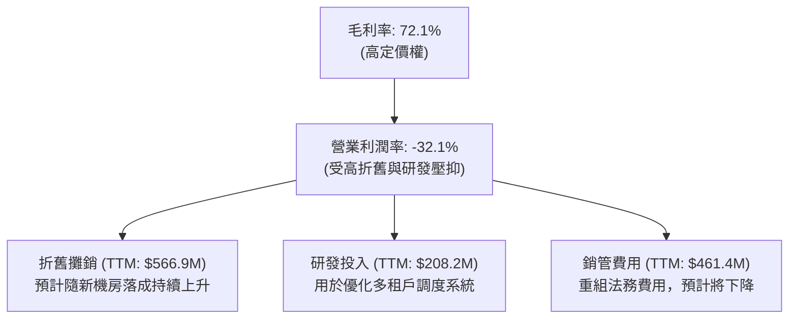

---

## 7. 估值深度分析

### 7.1 同業估值比較

由於 Nebius 的業務極具稀缺性，我們選擇了美國最大的獨立 GPU 雲 CoreWeave（一級市場最新估值）、算力板塊龍頭超微電腦 (SMCI)、以及數據中心龍頭 Equinix (EQIX) 進行對比。

| 估值指標 | **NBIS (本公司)** | **CoreWeave (私有)** | **SMCI** | **EQIX** | 本公司估值評估 |
|---|---|---|---|---|---|
| **P/S (TTM)** | **63.1x** | ~45.0x | 1.8x | 9.2x | 🔴 處於絕對高位，隱含了極高的成長預期。 |
| **EV / Revenue** | **63.5x** | ~48.0x | 2.1x | 11.5x | 🔴 溢價顯著，市場將其視為純粹的 AI 算力稀缺標的。 |
| **Forward P/E** | **-135.2x** | ~85.0x | 12.5x | 28.0x | 🟡 反映核心業務尚未盈利，無法用市盈率合理定價。 |
| **PEG Ratio** | **0.63x** | ~0.75x | 0.45x | 2.10x | 🟢 **極具吸引力**。低於 1.0x 說明其營收增速（>400%）能完全支撐其高估值。 |
| **FCF Yield** | **-11.1%** | -15.0% | +2.5% | +3.8% | 🟡 符合重資本開支階段的獨立算力雲特徵。 |

### 7.2 歷史估值區間分析

自 2024 年底重組復牌以來，Nebius 的 P/S 估值區間在 30x 至 80x 之間劇烈波動。當前 63.1x 處於歷史中高位，主要受 2026 年上半年股價暴漲驅動。

```
╔══════════════════════════════════════════════════════════════════╗
║                    NBIS P/S 歷史估值區間 (2024-2026)             ║
╠══════════════════════════════════════════════════════════════════╣
║                                                                  ║
║  歷史最高 (85x)：                                                ║
║  ████████████████████████████████████████                     ║
║  當前估值 (63x)：                                                ║
║  ██████████████████████████████                  ← 當前位置 🟡    ║
║  歷史最低 (30x)：                                                ║
║  ██████████████                                                  ║
║                                                                  ║
║  - 評估：估值安全邊際較低，股價對利空（如 GPU 到貨延遲、財報     ║
║    營收不及預期）的敏感度極高。                                  ║
╚══════════════════════════════════════════════════════════════════╝
```

### 7.3 情境目標價與驅動假設

我們基於未來三年的營收 CAGR、預期營業利潤率及 EV/Sales 退出倍數，構建了以下三種情境模型：

| 情境 | 營收 CAGR (3年) | 2028 預期營業利潤率 | 退出倍數 (EV/Sales) | 隱含目標價 | 相對現價漲跌幅 | 驅動假設 |
|---|---|---|---|---|---|---|
| 🔴 **悲觀** | 80% | 10% | 15.0x | **$120.00** | -45.0% | GPU 嚴重過剩，租賃單價跌破 $1.0/小時，客戶流失率高。 |
| 🟡 **基準** | **150%** | **25%** | **25.0x** | **$258.13** | **+18.3%** | GPU 按期交付，上線率維持在 85% 以上，主權雲市佔率穩固。 |
| 🟢 **樂觀** | 220% | 35% | 35.0x | **$410.00** | +87.9% | Blackwell (B200) 大規模部署，Avride 自駕商業化取得實質進展。 |

### 7.4 DCF 敏感性分析 (12個月目標價矩陣)

採用三階段折現模型（WACC 區間 9.5% - 11.5%，永續成長率 g = 3.0%）：

| 營收成長情境 | WACC = 11.5% | **WACC = 10.5% (基準)** | WACC = 9.5% |
|---|---|---|---|
| 🟢 **樂觀 (CAGR 220%)** | $360.00 (+65.0%) | **$410.00 (+87.9%)** | $465.00 (+113.1%) |
| 🟡 **基準 (CAGR 150%)** | $225.00 (+3.1%) | **$258.13 (+18.3%)** | $295.00 (+35.2%) |
| 🔴 **悲觀 (CAGR 80%)** | $105.00 (-51.9%) | **$120.00 (-45.0%)** | $138.00 (-36.7%) |

### 7.5 估值綜合區間

```
╔══════════════════════════════════════════════════════════════════╗
║                      NBIS 估值綜合區間                           ║
╠══════════════════════════════════════════════════════════════════╣
║                                                                  ║
║  悲觀下限：  $120.00   ██████████░░░░░░░░░░░░░░░░░░░░░░░         ║
║  當前股價：  $218.16   ████████████████████░░░░░░░░░░░░░         ║
║  基準目標：  $258.13   ████████████████████████░░░░░░░░░         ║
║  樂觀上限：  $410.00   █████████████████████████████████         ║
║                                                                  ║
║  - 策略：當前股價相較於基準目標價有 18.3% 的上行空間，考量到其   ║
║    極高的成長彈性，當前價位具備建倉價值，但建議分批逢低吸納。     ║
╚══════════════════════════════════════════════════════════════════╝
```

---

## 8. 成長催化劑

### 8.1 催化劑時間軸

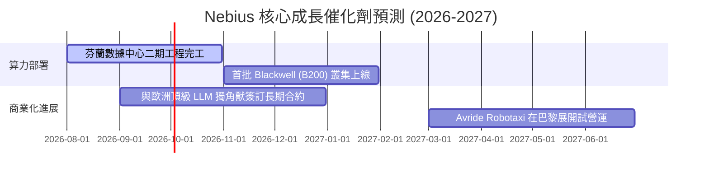

### 8.2 TAM (潛在市場規模) 分析

```
╔══════════════════════════════════════════════════════════════════╗
║                     Nebius 2028 潛在市場規模 (TAM)               ║
╠══════════════════════════════════════════════════════════════════╣
║                                                                  ║
║  1. 歐洲 & 中東 AI 算力雲 (Specialized Cloud)：                  ║
║     - 全球 TAM： $120B                                           ║
║     - 歐洲佔比： $30B  (Nebius 目標市佔率：15% → $4.5B 營收)      ║
║                                                                  ║
║  2. 歐洲 GDPR 合規主權雲：                                       ║
║     - 全球 TAM： $45B                                            ║
║     - 歐洲佔比： $15B  (Nebius 目標市佔率：10% → $1.5B 營收)      ║
║                                                                  ║
║  3. 自動駕駛與配送 (Avride)：                                    ║
║     - 全球 TAM： $250B (長線潛力，2028 預期貢獻：$200M 營收)     ║
║                                                                  ║
║  ★ 綜合估算：2028 年 Nebius 可觸及之核心 TAM 超過 $45B。        ║
╚══════════════════════════════════════════════════════════════════╝
```

### 8.3 成長驅動力結構

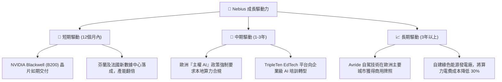

---

## 9. 風險矩陣

### 9.1 風險評分矩陣 (Risk Matrix)

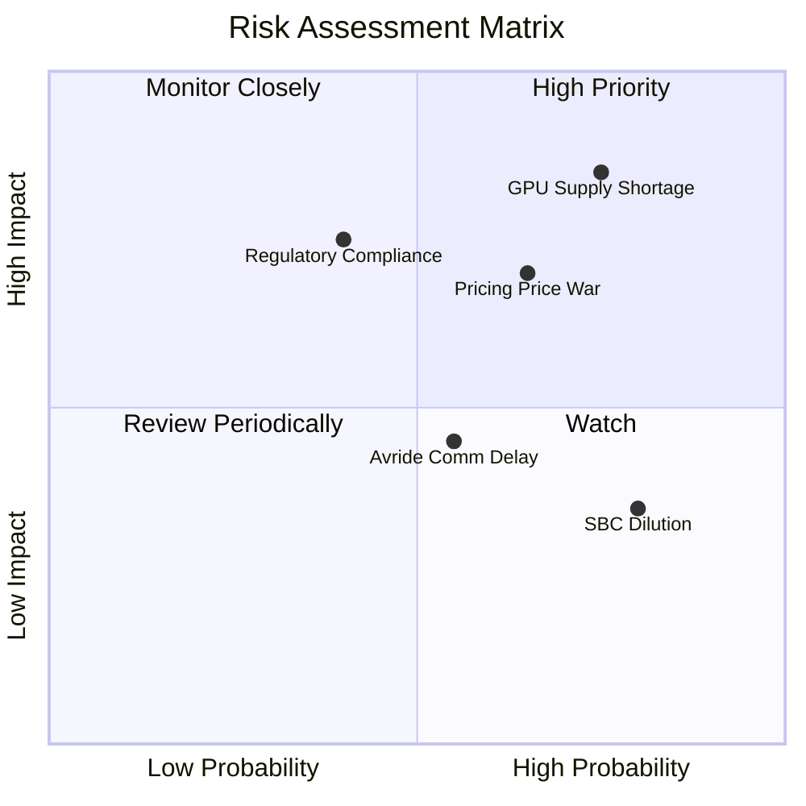

### 9.2 風險清單與緩解措施

| # | 風險項目 | 發生機率 | 財務衝擊 | 風險評分 | 具體緩解措施 |
|---|---|---|---|---|---|
| 1 | 🔴 **GPU 供應鏈受限** | 高 (75%) | 高 (-25% 營收) | **8.0 / 10** | 與 NVIDIA 簽署長期供應框架協議，並積極引入 AMD MI300X 等替代算力方案。 |
| 2 | 🔴 **算力租賃價格戰** | 中高 (65%) | 中高 (-15% 毛利) | **7.0 / 10** | 開發獨家 AI 調度軟體（PaaS），以平台生態與增值服務鎖定客戶，而非單純競爭硬體價格。 |
| 3 | 🟡 **歷史背景引發的監管審查** | 中 (40%) | 高 (潛在歐美合規處罰) | **6.0 / 10** | 聘請頂級國際審計與法務團隊，董事會全員由西方獨立董事組成，確保 100% 透明合規。 |
| 4 | 🟡 **股權稀釋 (SBC)** | 高 (80%) | 低 (EPS 稀釋 3-5%) | **4.5 / 10** | 設定嚴格的績效考核股權解鎖條件 (PRSU)，將 SBC 與營收成長及利潤率掛鉤。 |

---

## 10. 投資建議

### 10.1 最終綜合評級

```
╔══════════════════════════════════════════════════════════════╗
║                    Nebius 最終綜合評級                       ║
╠══════════════════════════════════════════════════════════════╣
║ 基本面強度  7.5 ▓▓▓▓▓▓▓▓▓▓▓▓▓▓▓░░░░░  ★★★★☆           ║
║ 成長動能    9.5 ▓▓▓▓▓▓▓▓▓▓▓▓▓▓▓▓▓▓▓░  ★★★★★           ║
║ 財務健康    9.5 ▓▓▓▓▓▓▓▓▓▓▓▓▓▓▓▓▓▓▓░  ★★★★★           ║
║ 估值合理性  5.5 ▓▓▓▓▓▓▓▓▓▓▓░░░░░░░░░  ★★★☆☆           ║
║ 護城河深度  7.2 ▓▓▓▓▓▓▓▓▓▓▓▓▓▓░░░░░░  ★★★☆☆           ║
╠══════════════════════════════════════════════════════════════╣
║ 綜合總分    7.8 ▓▓▓▓▓▓▓▓▓▓▓▓▓▓▓▓░░░░  🟢 買入 (Buy)        ║
╚══════════════════════════════════════════════════════════════╝
```

### 10.2 目標價與預期報酬率

| 情境 | 機率權重 | 12M 目標價 | 當前股價 | 預期報酬率 | 權重回報貢獻 |
|---|---|---|---|---|---|
| 🔴 **悲觀情境** | 20% | $120.00 | $218.16 | -45.0% | -9.0% |
| 🟡 **基準情境** | **60%** | **$258.13** | **$218.16** | **+18.3%** | **+11.0%** |
| 🟢 **樂觀情境** | 20% | $410.00 | $218.16 | +87.9% | +17.6% |
| **加權綜合期望值** | **100%** | **$261.20** | **$218.16** | **+19.7%** | **投資評級：🟢 買入** |

### 10.3 買入時機與觸發因素

```
╔══════════════════════════════════════════════════════════════════╗
║                  ✅ NBIS 買入觸發因素 Checklist                  ║
╠══════════════════════════════════════════════════════════════════╣
║                                                                  ║
║  立即買入觸發條件（多數符合）：                                  ║
║  ✅ 股價回檔至 $180 - $200 區間（提供更高的安全邊際）            ║
║  ✅ NVIDIA 官方確認下一代 Blackwell 晶片對 Nebius 的分配份額     ║
║  ✅ 芬蘭數據中心二期上線，單季營收突破 $450M                     ║
║                                                                  ║
║  加碼觸發條件（出現以下任一）：                                  ║
║  ☐ 宣佈與歐洲政府或主權基金簽訂大型「主權算力雲」合作協議        ║
║  ☐ 季度營業虧損率大幅收窄至 -15% 以下（營運槓桿顯現）            ║
║                                                                  ║
║  減碼 / 停損觸發條件（出現以下任一）：                           ║
║  ☐ 核心 AI 雲營收連續兩季季增率 (QoQ) 跌破 15%                   ║
║  ☐ 核心 WACC 因融資成本上升飆升至 13% 以上                       ║
╚══════════════════════════════════════════════════════════════════╝
```

### 10.4 投資人適配度分析

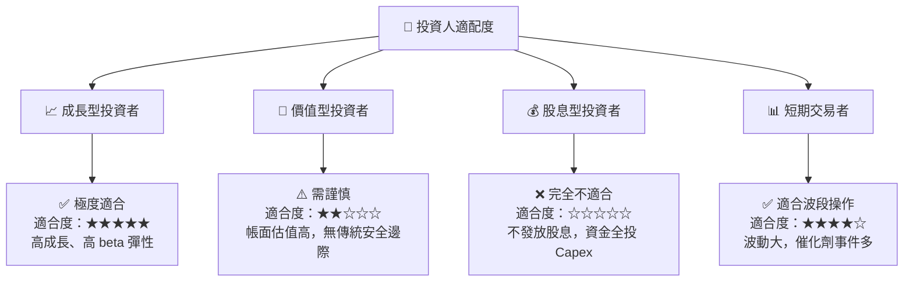

### 10.5 每季財報監控清單 (Quarterly Watch List)

在未來的季度財報中，投資人應重點追蹤以下量化指標，以驗證投資假設定位：

| 監控指標 | 基準預期值 (Q2-Q4 2026) | 觸發「加碼」門檻 | 觸發「減碼/停損」門檻 |
|---|---|---|---|
| **單季營收 (Revenue)** | $420M - $480M | > $520M (產能釋放超預期) | < $360M (算力上線受阻) |
| **毛利率 (Gross Margin)** | 70% - 73% | > 75% (定價權極強) | < 65% (價格戰爆發) |
| **單季 Capex** | $1.5B - $2.0B | < $1.2B (且產能如期上線) | > $2.5B (且無新營收貢獻) |
| **預收算力款 (Deferred Rev)**| > $750M | > $900M (客戶鎖定效應強) | < $500M (需求放緩) |

### 10.6 反面論證：什麼會證明論點錯誤 (What Would Change My Mind)

```
╔══════════════════════════════════════════════════════════════════╗
║              ⚠️ 論點失效條件 (Disconfirming Evidence)            ║
╠══════════════════════════════════════════════════════════════════╣
║  本投資論點在下列情況成立時應重新檢視或果斷退出：                ║
║  ☐ 核心 AI 算力營收連續兩季季增率 (QoQ) < 10%                     ║
║  ☐ 營業利潤率在營收規模達到 $1.5B/年時，仍無法轉正               ║
║  ☐ 自由現金流持續惡化，導致現金儲備跌破 $2.0B 且無新融資管道     ║
║  ☐ ROIC 跌破 -15%（資本效率進一步惡化，EVA 缺口擴大）            ║
║  ☐ NVIDIA 降級其 NCP 合作夥伴關係，導致 Blackwell 晶片獲取受阻   ║
╚══════════════════════════════════════════════════════════════════╝
```

---

> **免責聲明**：本報告為基於公開財務數據之機構級學術研究，不構成任何買賣建議。投資有風險，入市需謹慎。分析師持有或不持有上述證券，均不影響報告之客觀獨立性。