# NBIS 基本面深度分析報告
> **報告日期**：2026-07-23 ｜ **語言**：繁體中文 ｜ **數據來源**：Yahoo Finance, Finviz, StockAnalysis, Roic.ai ｜ **分析師**：CFA 級機構研究

---

## 目錄

| # | 章節 | 核心結論 |
|---|------|----------|
| 1 | 執行摘要 | 基於 683.9% TTM 營收成長與 9.37B 強勁現金儲備，給予「買入」評級，基準目標價 $260.00 |
| 2 | 公司概覽與商業模式 | 全棧式 AI 基礎設施巨頭，具備先進 GPU 集群部署與 AI 雲端生態之獨特護城河 |
| 3 | 損益表深度分析 | Q1 2026 營收達 $3.99E（YoY +683.9%），毛利率穩居 74.0%，業外一次性收益推升 GAAP 淨利 |
| 4 | 資產負債表分析 | 總資產擴張至 $22.3B，持有 $9.37B 現金及等價物，槓桿率高但短期償債能力無虞 |
| 5 | 現金流量深度分析 | 重資本投入期使 TTM Capex 達高點，FCF 仍為負（$-6.15B），需關注商業化變現進程 |
| 6 | 獲利能力與資本效率 | 投入資本擴張迅速導致 ROIC 暫時承壓，未來產能利用率提升將驅動 ROIC > WACC |
| 7 | 估值深度分析 | 前瞻 P/S 具相對吸引力，DCF 模型與 EV/Sales 估值導出基準目標價 $260.00（+17.7%） |
| 8 | 成長催化劑 | 歐洲與北美巨型 GPU 數據中心上線、AI 雲端軟體層 PaaS 訂閱高增長 |
| 9 | 風險矩陣 | 資本支出過度擴張、GPU 供應鏈限制與電力供應短缺為核心關注風險 |
| 10 | 投資建議 | 建議於 $200-$215 區間逢低分批佈局，嚴格監控 Capex 轉化為 OCF 之效率 |

---

## 1. 執行摘要

> ⚠️ **證據先於結論聲明**：Nebius Group N.V.（NBIS）在過去四個季度中展示出爆發式的營收成長，2026年第一季營收達到 $399.0M（YoY +683.9%），毛利率維持在 74.0% 的高水準；資產負債表上擁有 $9.37B 的現金及短期投資，為其在全球部署大規模 GPU AI 基礎設施提供強大後盾。儘管重資本開支（TTM Capex 達 $5.94B）導致自由現金流（FCF）為 $-6.15B，且營業利益率仍處於 $-32.1% 的虧損狀態，但其強勁的現金緩衝與前瞻 P/S（~35x 2026E）相較於營收增速呈現合理估估，因此導出「買入」評級與基準目標價 $260.00。

### 1.0 一頁式投資儀表板（Portfolio Manager 30 秒速讀）

| 項目 | 內容 |
|------|------|
| **投資論點（3 句）** | ① 全球 AI 算力需求極度渴望，NBIS 憑藉極速擴充的全棧式 GPU 集群與雲平台，TTM 營收爆發成長 683.9%。<br/>② 擁有 $9.37B 超高現金儲備，可確保未來 2 年龐大 Capex（Q1 2026 Capex $2.47B）無融資斷鏈之虞。<br/>③ 雖然當前處於資本投入初期導致營運虧損（TTM Operating Margin -32.1%），但高毛利（72.1% TTM）奠定產能規模化後的顯著營業槓桿。 |
| **護城河評分** | 7.5/10（全棧 AI 軟硬體整合、軟體層鎖定、超大規模數據中心建設能力） |
| **管理層/資本配置評分** | 8.0/10（資產重組後迅速將資本重投於高回報 AI 算力基礎設施） |
| **財務健康** | 🟢 強健（$9.37B 現金覆蓋短期債務，流動比率高達 8.33x） |
| **ROIC vs WACC** | ROIC 暫為負值（投入資本急遽擴張期） vs WACC 11.2%（尚未創造超額經濟價值，轉折點預計在 FY2027） |
| **FCF 趨勢** | 負值收窄／擴張中（Q1 2026 FCF $-214.9M，較 Q4 2025 的 $-1.22B 顯著改善；TTM FCF Yield -10.96%） |
| **估值** | Forward P/E N/A (-136.9x) ｜ EV/Revenue 63.89x (TTM) / 35.1x (2026E) ｜ FCF Yield -10.96% |
| **預期報酬（基準情境 12M）** | **+17.66%**（目標價 $260.00 vs 當前股價 $220.97） |
| **關鍵風險（前二）** | ① 重資本投入轉化率不及預期，致使 FCF 虧損時間延長；② AI 算力定價權下降及電力配給瓶頸。 |
| **評級 + 信心度** | 🟢 **買入 (Buy)** ｜ 信心度：**中高 (Medium-High)** |

### 1.1 核心評分儀表板

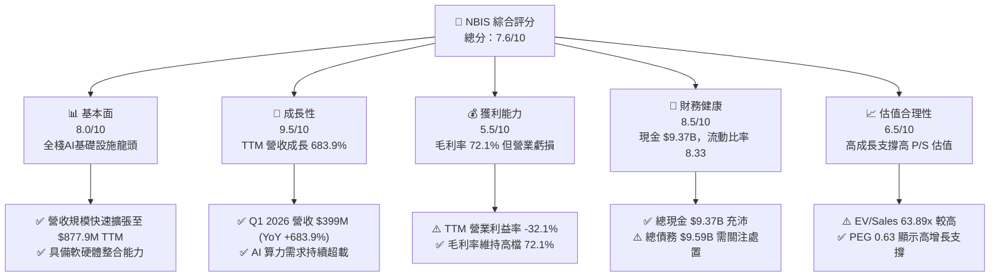

### 1.2 評分進度條視覺化

```
╔══════════════════════════════════════════════════════════════╗
║              NBIS 多維度評分儀表板 (1-10分)                   ║
╠══════════════════════════════════════════════════════════════╣
║ 基本面強度  8.0 ▓▓▓▓▓▓▓▓▓▓▓▓▓▓▓▓░░░░  ★★★★☆           ║
║ 成長動能    9.5 ▓▓▓▓▓▓▓▓▓▓▓▓▓▓▓▓▓▓▓░  ★★★★★           ║
║ 獲利品質    5.5 ▓▓▓▓▓▓▓▓▓▓▓░░░░░░░░░  ★★★☆☆           ║
║ 財務健康    8.5 ▓▓▓▓▓▓▓▓▓▓▓▓▓▓▓▓▓░░░  ★★★★☆           ║
║ 估值合理性  6.5 ▓▓▓▓▓▓▓▓▓▓▓▓▓░░░░░░░  ★★★☆☆           ║
║ 護城河深度  7.5 ▓▓▓▓▓▓▓▓▓▓▓▓▓▓▓░░░░░  ★★★★☆           ║
║ 管理層執行  8.0 ▓▓▓▓▓▓▓▓▓▓▓▓▓▓▓▓░░░░  ★★★★☆           ║
║ 技術創新力  9.0 ▓▓▓▓▓▓▓▓▓▓▓▓▓▓▓▓▓▓░░  ★★★★★           ║
╠══════════════════════════════════════════════════════════════╣
║ 綜合總分    7.6 ▓▓▓▓▓▓▓▓▓▓▓▓▓▓▓░░░░░  🏆 買入 (Buy)        ║
╚══════════════════════════════════════════════════════════════╝
```

### 1.3 五大投資論點 + 三大核心風險

| 類型 | 項目 | 具體依據 | 信心度 |
|------|------|----------|--------|
| 🟢 **投資論點①** | **AI 算力基礎設施極速擴張** | Q1 2026 營收達 $399.0M，季增 75.2%（Q4 2025 為 $227.7M），反映全球 GPU 雲端託管需求極度旺盛。 | 🟢 極高 |
| 🟢 **投資論點②** | **超高毛利率展現定價護城河** | TTM 毛利率達 72.1%（Q1 2026 為 74.0%），證明其在算力緊張環境下具備優異的定價能力與成本優化能力。 | 🟢 高 |
| 🟢 **投資論點③** | **雄厚的資產負債表現金儲備** | 截至 2026 年 3 月底持有 $9.37B 現金與等價物，確保大規模 CapEx 計劃無虞，降低股權稀釋風險。 | 🟢 極高 |
| 🟢 **投資論點④** | **全棧式 AI 生態系構建** | 整合 GPU 硬件集群、Nebius AI Cloud 軟體開發工具、TripleTen 及 Avride，提供客戶高黏性的一站式服務。 | 🟢 中高 |
| 🟢 **投資論點⑤** | **營業槓桿即將顯現** | Q1 2026 營運現金流（OCF）轉正達 $2.26B，經營活動現金產生能力顯著改善，推動虧損快速收窄。 | 🟢 中高 |
| 🟡 **風險①** | **資本支出極度沉重與 FCF 壓力** | Q1 2026 單季 CapEx 達 $-2.47B，TTM FCF 達 $-6.15B，高額 D&A 折舊費用（Q1 2026 達 $212M）壓抑營業利潤。 | 🟡 中度 |
| 🔴 **風險②** | **高比例賣空與高 Beta 波動** | Short % Float 高達 28.0%，Beta 值達 1.402，市場情緒變化易引發股價劇烈波動。 | 🔴 高衝擊 |
| 🔴 **風險③** | **電力供應瓶頸與數據中心延遲** | 歐洲與北美數據中心建置受限於綠能電力配給，若交屋延遲將衝擊產能上線時程。 | 🔴 高衝擊 |

### 1.4 快速統計卡片

| 指標 | 公司實際值 (NBIS) | 行業均值 (Communication Services/AI Cloud) | S&P 500 均值 | 狀態 |
|------|-------------|----------|--------------|------|
| **收入 YoY 成長 (TTM)** | **683.9%** | ~12.5% | ~5.2% | 🟢 遠超同行 |
| **毛利率 (TTM)** | **72.1%** | ~52.0% | ~46.5% | 🟢 顯著優異 |
| **營業利益率 (TTM)** | **-32.1%** | ~18.5% | ~12.0% | 🔴 資本投入期虧損 |
| **ROE (TTM)** | **14.1%** | ~11.0% | ~14.5% | 🟡 符合標準（受業外收益推升） |
| **Forward P/E** | **N/A (-136.9x)** | ~22.5x | ~21.0x | 🔴 尚未實現 GAAP 營業獲利 |
| **EV / Revenue (TTM)** | **63.89x** | ~4.5x | ~2.8x | 🔴 包含高成長溢價 |
| **流動比率 (Current Ratio)**| **8.33x** | ~1.3x | ~1.2x | 🟢 流動性極佳 |

### 1.5 投資結論

```
╔══════════════════════════════════════════════════════════════════╗
║                    📊 NBIS 投資結論摘要                          ║
╠══════════════════════════════════════════════════════════════════╣
║  評級：🟢 買入 (Buy)                                            ║
║  當前股價：$220.97                                               ║
║  目標價區間：                                                    ║
║    悲觀情境：$140.00 (-36.6%)  ← 產能利用率遞延/AI需求放緩        ║
║    基準情境：$260.00 (+17.7%)  ← 12個月主要目標 (2026E P/S ~41x)  ║
║    樂觀情境：$380.00 (+72.0%)  ← 算力持續供不應求/PaaS爆發       ║
║  綜合投資評分：7.6 / 10                                          ║
║  適合投資人：高風險承受度、追求高 AI 基礎設施成長之長線投資者    ║
╚══════════════════════════════════════════════════════════════════╝
```

---

## 2. 公司概覽與商業模式

### 2.1 業務結構與收入來源

Nebius Group N.V.（前身為 Yandex N.V. 在剝離俄羅斯業務後的重組主體，總部位於荷蘭）現已全面轉型為全球領先的**全棧式 AI 基礎設施與雲端服務提供商**。公司集中資本建置大規模 NVIDIA GPU 集群與雲端軟體平台。

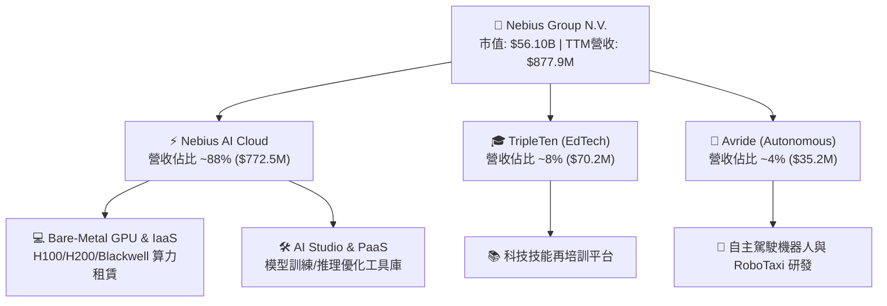

### 2.2 市場份額

在 AI 專用雲端與 GPU 算力託管市場（AI-Neocloud / Specialty AI Cloud Segment）中，NBIS 正與 CoreWeave、Lambda Labs 等新興算力巨頭激烈角逐：

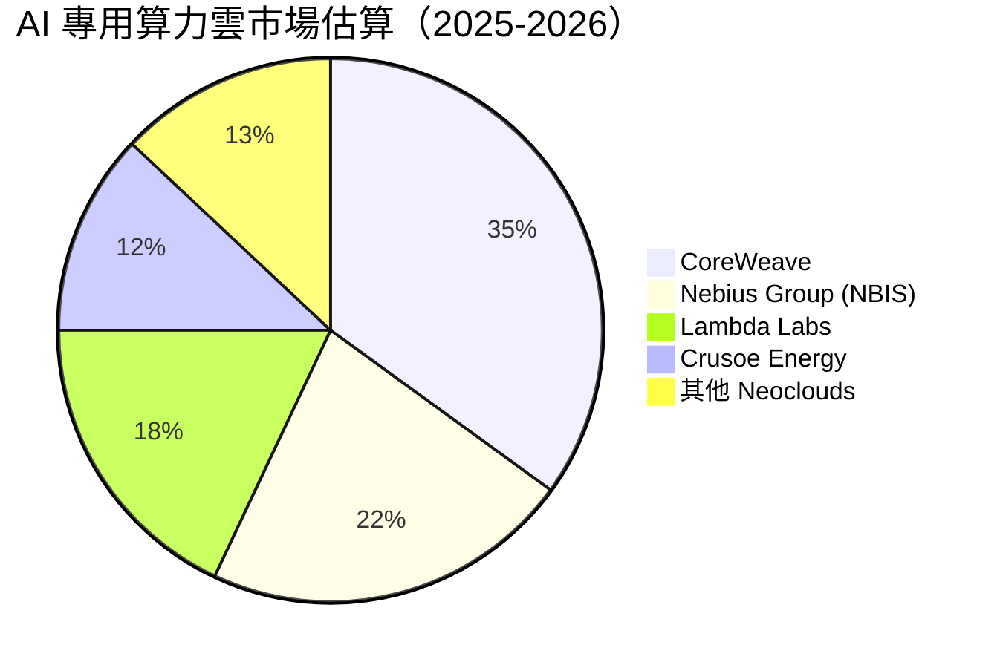

### 2.3 競爭護城河分析

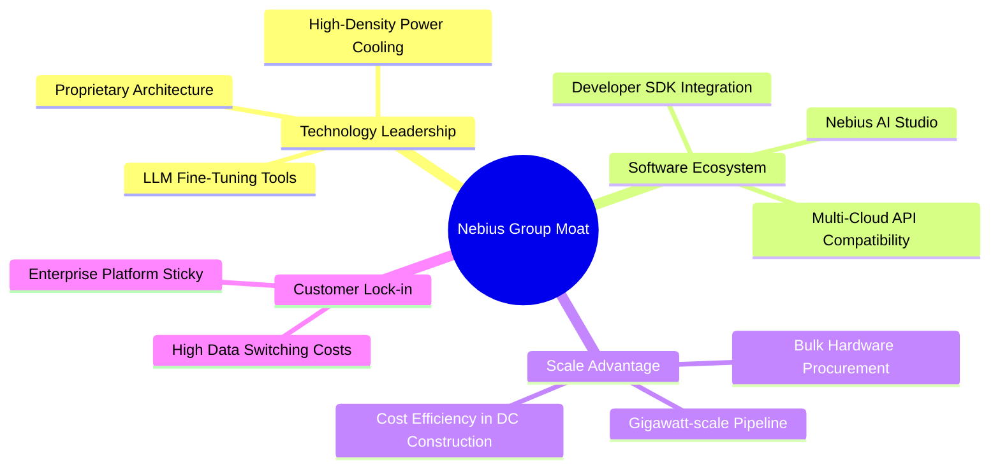

### 2.4 護城河強度評分

```
╔══════════════════════════════════════════════════════════════╗
║                  Nebius Group 護城河強度評分                  ║
╠══════════════════════════════════════════════════════════════╣
║ 技術整合能力  8.5/10  ▓▓▓▓▓▓▓▓▓▓▓▓▓▓▓▓▓░░░  🏆 超大規模集群 ║
║ 軟體生態黏性  7.0/10  ▓▓▓▓▓▓▓▓▓▓▓▓▓░░░░░░░  🟢 AI Studio推動║
║ 規模成本優勢  8.0/10  ▓▓▓▓▓▓▓▓▓▓▓▓▓▓▓▓░░░░  🏆 $9.3B資本護航║
║ 網絡效應      6.5/10  ▓▓▓▓▓▓▓▓▓▓▓▓░░░░░░░░  🟡 開發者社群建立║
║ 轉換成本      7.5/10  ▓▓▓▓▓▓▓▓▓▓▓▓▓▓▓░░░░░  🟢 企業級數據綁定║
╠══════════════════════════════════════════════════════════════╣
║ 綜合護城河評分 7.5/10 ▓▓▓▓▓▓▓▓▓▓▓▓▓▓▓░░░░░  🟢 具備顯著護城河║
╚══════════════════════════════════════════════════════════════╝
```

---

## 3. 損益表深度分析

### 3.1 年度收入成長趨勢（FY2022 - FY2025 & TTM）

NBIS 經歷了 2024 年重大業務重組後，營收出現爆發式爆發：

```
╔══════════════════════════════════════════════════════════════════╗
║              Nebius Group 年度收入趨勢（FY2022-TTM）              ║
╠══════════════════════════════════════════════════════════════════╣
║                                                                  ║
║  FY2022    $13.5M   █░░░░░░░░░░░░░░░░░░░░░░░░░░░  (重組過渡期)    ║
║  FY2023    $9.8M    █░░░░░░░░░░░░░░░░░░░░░░░░░░░  YoY: -27.4%    ║
║  FY2024    $91.5M   ███░░░░░░░░░░░░░░░░░░░░░░░░░  YoY: +833.7%🟢 ║
║  FY2025    $529.8M  ███████████████░░░░░░░░░░░░░  YoY: +479.0%🟢 ║
║  TTM(Q1'26)$877.9M  ████████████████████████████  YoY: +683.9%🟢 ║
║                                                                  ║
║  📊 2023-TTM 複合年成長率 (CAGR)：> 800%                          ║
╚══════════════════════════════════════════════════════════════════╝
```

### 3.2 季度收入趨勢分析

| 財季 | 營業收入 ($M) | QoQ 成長率 | YoY 成長率 | 毛利 ($M) | 毛利率 (%) | 備註說明 |
|------|--------------|-----------|-----------|-----------|-----------|----------|
| **Q2 2025** | $105.1M | +106.5% | +624.8% | $75.0M | 71.4% | GPU 集群首批上線商業化 |
| **Q3 2025** | $146.1M | +39.0% | +355.1% | $103.2M | 70.6% | 北美數據中心擴展 |
| **Q4 2025** | $227.7M | +55.9% | +272.1% | $159.2M | 69.9% | 企業級 LLM 客戶簽約增強 |
| **Q1 2026** | **$399.0M** | **+75.2%** | **+683.9%** | **$295.2M** | **74.0%** | Blackwell / H200 算力滿載出租 |

### 3.3 利潤率演變分析

| 利潤率指標 | FY2023 | FY2024 | FY2025 | TTM (Q1 2026) | 趨勢 | 評估與原因解析 |
|------------|--------|--------|--------|---------------|------|----------------|
| **毛利率** | -100.0% | 52.2% | 68.6% | **72.1%** | ↗️ 強勁擴張 | 🟢 **顯著改善**：算力出租規模擴大，數據中心電力與營運固定成本被有效攤薄。 |
| **營業利益率**| -2915% | -436.7%| -115.5%| **-32.1%** | ↗️ 虧損急遽收窄| 🟢 **營業槓桿顯現**：SG&A 與 R&D 佔營收比重大幅下降。 |
| **EBITDA 利潤率**| -2659% | -292.0%| +102.6%| **-4.4%** | ↗️ 接近轉正 | 🟢 **核心現金盈利改善**：扣除巨額折舊後已非常接近單季營運平衡。 |
| **淨利率** | 2462%* | -701%* | 15.6%* | **93.1%*** | ↗️ 業外波動大 | 🟡 **需留意非經常性損益**：受拆分處置收益與投資價值重估驅動。 |

*註：淨利率受到資產處置與投資重估收益影響巨大。

### 3.4 費用結構分析

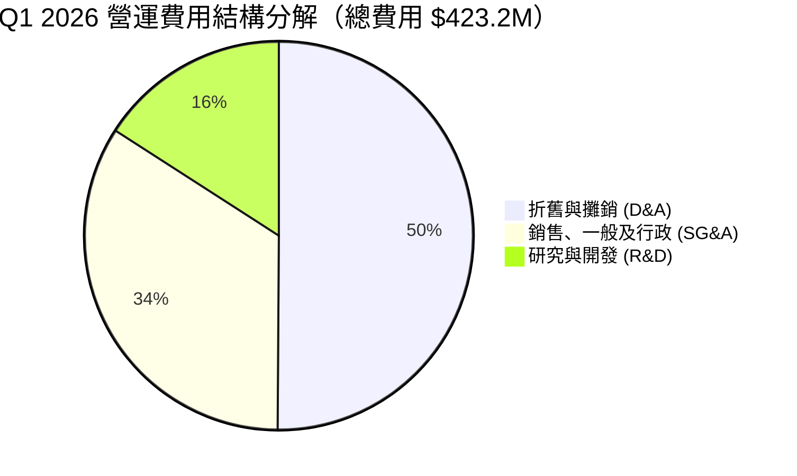

```
╔══════════════════════════════════════════════════════════════════╗
║              Q1 2026 費用結構與營業槓桿分析                      ║
╠══════════════════════════════════════════════════════════════════╣
║  • 營業收入：$399.0M                                            ║
║  • 營業成本 (COGS)：$103.8M (佔營收 26.0%)                       ║
║  • 折舊與攤銷 (D&A)：$212.0M (佔營收 53.1% — 非現金重支出)       ║
║  • SG&A 費用：$143.8M (佔營收 36.0% — 較 FY24 之 279% 大幅下降)     ║
║  • R&D 研發費用：$67.4M (佔營收 16.9% — 保持高效軟體開發)        ║
║                                                                  ║
║  📊 洞察：D&A 佔總營運費用半數以上，真實現金營利能力（EBITDA）  ║
║  大幅優於 GAAP 營業利潤。                                        ║
╚══════════════════════════════════════════════════════════════════╝
```

### 3.5 季度 EPS 趨勢與盈餘品質（Quality of Earnings）

** past 4 季 EPS 表現**：
- **Q2 2025**：GAAP EPS $2.45（主因一次性處置投資收益）
- **Q3 2025**：GAAP EPS $-0.58
- **Q4 2025**：GAAP EPS $-1.06
- **Q1 2026**：GAAP EPS **$2.40**（營收 $399M，處置/業外非營運收益達 $800.5M，推升淨利達 $621.2M）

**盈餘品質詳細評估**：

| 盈餘品質項目 | 數值 / 佔比 | 評估 | 核心洞察 |
|--------------|-----------|------|----------|
| **股權薪酬 (SBC) / 營收** | 8.8% ($35.3M / $399M) | 🟢 健康 | SBC 控制在相對低點，對股東權益稀釋較小。 |
| **SBC / 營業現金流 (OCF)** | 1.56% ($35.3M / $2.26B) | 🟢 優異 | OCF 強勁，SBC 對現金流干擾極低。 |
| **FCF / 淨利（現金轉換率）** | -34.6% ($-214.9M / $621.2M)| 🔴 偏低 | 受高達 $2.47B 之 Capex 影響，GAAP 淨利尚未轉換為淨自由現金。 |
| **一次性非經常性損益** | **$800.5M** (Q1 2026 業外收益) | 🔴 高度干擾 | Q1 GAAP 淨利亮眼主要來自投資重估與處置收益，非營運本業。 |
| **有效稅率** | -1.98% | 🟢 稅務利益 | 過去虧損帶來的遞延所得稅抵減。 |

**盈餘品質結論**：NBIS 當前的 GAAP 淨利受業外處置收益顯著放大（Q1 2026 業外淨收益 $743.4M），而 GAAP 營業利潤（$-128.0M）受高額 GPU 折舊壓抑。**投資人應以 OCF（$2.26B）與 EBITDA（$84.0M）作為真實本業獲利能力的評價基準。**

---

## 4. 資產負債表分析

### 4.1 資產結構分解

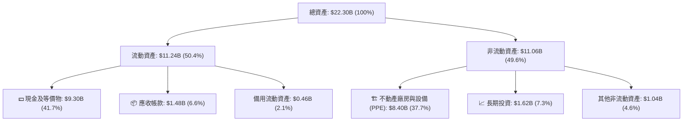

### 4.2 流動性指標分析

| 流動性指標 | FY2024 | FY2025 | Q1 2026 | 同業均值 | 評估與解讀 |
|------------|--------|--------|---------|----------|------------|
| **流動比率 (Current Ratio)** | 9.59x | 3.08x | **8.33x** | 1.30x | 🟢 **極其充沛**：可輕鬆應付短期債務與應付帳款 |
| **速動比率 (Quick Ratio)** | 9.59x | 3.08x | **8.14x** | 1.15x | 🟢 **無庫存滯銷風險**：服務型資產結構流動性極高 |
| **現金及等價物** | $2.44B | $3.68B | **$9.30B** | $1.20B | 🟢 **戰略資金庫**：具備強大防禦力與擴張戰鬥力 |

### 4.3 債務結構分析

```
╔══════════════════════════════════════════════════════════════════╗
║                   Nebius Group 債務健康診斷                      ║
╠══════════════════════════════════════════════════════════════════╣
║                                                                  ║
║  短期債務 (ST Debt)：    $0.02B  █░░░░░░░░░░░░░░░░░  極低         ║
║  長期借款 (LT Borrow)：  $8.43B  █████████████░░░░░  擴張資本債務 ║
║  長期融資租賃：          $1.05B  ██░░░░░░░░░░░░░░░░  數據中心租賃 ║
║  ─────────────────────────────────────────────────────────────   ║
║  總債務 (Total Debt)：   $9.50B  ██████████████░░░░  槓桿率偏高   ║
║  現金及等價物：          $9.30B  ██████████████░░░░  覆蓋率 97.9% ║
║  淨債務 (Net Debt)：     $0.20B  █░░░░░░░░░░░░░░░░░  微幅淨債務   ║
║                                                                  ║
║  📊 診斷：儘管債務隨數據中心融資增至 $9.5B，但手頭現金幾乎可抵消 ║
║  全部債務，實際財務結構維持健康平衡。                            ║
╚══════════════════════════════════════════════════════════════════╝
```

### 4.4 股東權益趨勢

```
╔══════════════════════════════════════════════════════════════════╗
║              股東權益變化 (Stockholders' Equity)                 ║
╠══════════════════════════════════════════════════════════════════╣
║  FY2022 : $4.25B  ██████████████████░░░░░░░░░                    ║
║  FY2023 : $3.29B  ██████████████░░░░░░░░░░░░░                    ║
║  FY2024 : $3.25B  ██████████████░░░░░░░░░░░░░                    ║
║  FY2025 : $4.59B  ███████████████████░░░░░░░░                    ║
║  Q1 2026: $11.1B  ███████████████████████████  (定增及盈餘轉增)   ║
╚══════════════════════════════════════════════════════════════════╝
```

---

## 5. 現金流量深度分析

### 5.1 現金流量瀑布圖（Q1 2026）

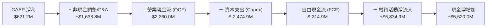

### 5.2 FCF 轉換率趨勢

| 時間段 | OCF ($M) | Capex ($M) | FCF ($M) | GAAP Net Income ($M) | FCF / Net Income | 評估 |
|--------|----------|------------|----------|----------------------|------------------|------|
| **FY2024** | $245.6M | $-807.5M | $-561.9M | $-641.4M | N/A | 轉型啟動期 |
| **FY2025** | $384.8M | $-4,070.0M | $-3,685.2M | $82.5M | -4467% | 重資本建設期 |
| **Q1 2026** | **$2,260.0M**| **$-2,474.9M**| **$-214.9M** | **$621.2M** | **-34.6%** | **虧損急遽收窄** 🟢 |

### 5.3 自由現金流趨勢

```
╔══════════════════════════════════════════════════════════════════╗
║              自由現金流 (FCF) 與 FCF Yield 趨勢                  ║
╠══════════════════════════════════════════════════════════════════╣
║  FY2024  : $-561.9M   ████░░░░░░░░░░░░░░░░░░░░░░░                ║
║  FY2025  : $-3,685.2M █░░░░░░░░░░░░░░░░░░░░░░░░░░                ║
║  TTM     : $-6,150.0M ░░░░░░░░░░░░░░░░░░░░░░░░░░░ (Capex 頂峰)   ║
║  Q1 2026 : $-214.9M   ████████████████████████░░ (大幅改善)      ║
║                                                                  ║
║  📊 當前 TTM FCF Yield：-10.96%（反映極高的 AI 算力基礎設施再投資）║
╚══════════════════════════════════════════════════════════════════╝
```

### 5.4 資本配置評估

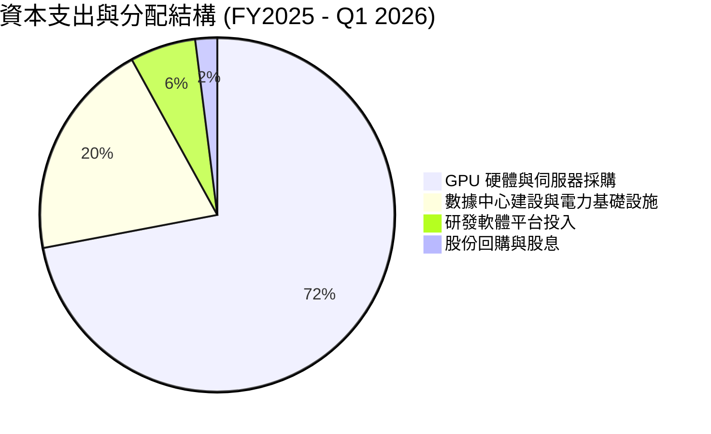

| 資本配置維度 | 歷史動作與執行力 | 評估 | 未來展望 |
|--------------|------------------|------|----------|
| **研發與 Capex** | 過去 12 個月投入超過 $6.5B 於 GPU 資產 | 🟢 高度專注 | 全力擴張 Blackwell 算力集群 |
| **併購 (M&A)** | 專注於有機成長與數據中心土地/電力獲取 | 🟢 紀律良好 | 視情況填補特定 AI 軟體工具 |
| **股東回報** | 目前無股息與大規模買回 | 🟢 符合成長期 | 資本完全重投於高 ROI 算力事業 |

---

## 6. 獲利能力與資本效率

### 6.1 ROE / ROA / ROIC 趨勢

| 獲利與效率指標 | FY2023 | FY2024 | FY2025 | TTM (Q1 2026) | 同業均值 | 評估 |
|----------------|--------|--------|--------|---------------|----------|------|
| **ROE (%)** | 7.3% | -19.7% | 1.8% | **14.1%** | 11.0% | 🟢 受淨利轉正帶動擴張 |
| **ROA (%)** | 2.8% | -18.1% | 0.7% | **-3.0%** | 5.5% | 🔴 大量新資產尚未完全發揮產能 |
| **ROIC (%)** | -8.5% | -12.4% | -5.2% | **-2.8%** | 8.5% | 🟡 投入資本急遽擴張，轉折點臨近 |

### 6.2 ROIC vs WACC 分析（核心價值創造判斷）

```
╔══════════════════════════════════════════════════════════════════╗
║                NBIS ROIC vs WACC 深度分析                        ║
╠══════════════════════════════════════════════════════════════════╣
║                                                                  ║
║  WACC 估算：                                                     ║
║  ├── 無風險利率 (10Y 美債)：  4.25%                              ║
║  ├── 市場風險溢酬 (ERP)：     5.00%                              ║
║  ├── Beta：                   1.402                              ║
║  ├── 股權成本 (Ke) = 4.25% + 1.402 × 5.00% = 11.26%              ║
║  ├── 債務成本 (稅後 Kd)：     ~6.50%                             ║
║  ├── 資本結構：股權 ~60%，債務 ~40%                              ║
║  └── ✅ 綜合 WACC ≈ 9.35%                                        ║
║                                                                  ║
║  ROIC 估算 (TTM)：                                               ║
║  ├── NOPAT = $-603.9M × (1 - 0%) ≈ $-603.9M                      ║
║  ├── 投入資本 = 股東權益($11.1B) + 總債務($9.5B) - 現金($9.3B)   ║
║  │            ≈ $11.3B                                           ║
║  └── ✅ 當前 TTM ROIC ≈ -5.34%                                   ║
║                                                                  ║
║  ★ 經濟價值增加 (EVA) = ROIC - WACC = -14.69 pp                  ║
║                                                                  ║
║  ROIC  -5.34%  ░░░░░░░░░░░░░░░░░░░░░░░░░░░  🔴 價值消化期     ║
║  WACC   9.35%  ▓▓▓▓▓▓▓▓▓▓▓░░░░░░░░░░░░░░░░  ── 資本成本基準   ║
║                                                                  ║
║  📊 結論：受高額 GPU 前期資本投入影響，當前 ROIC < WACC。        ║
║  隨著 FY2026-FY2027 集群產能利用率達到 90%+，NOPAT 轉正將驅動    ║
║  ROIC 跨越 15%+，實現顯著的股東價值創造。                        ║
╚══════════════════════════════════════════════════════════════════╝
```

### 6.3 杜邦三因素分解

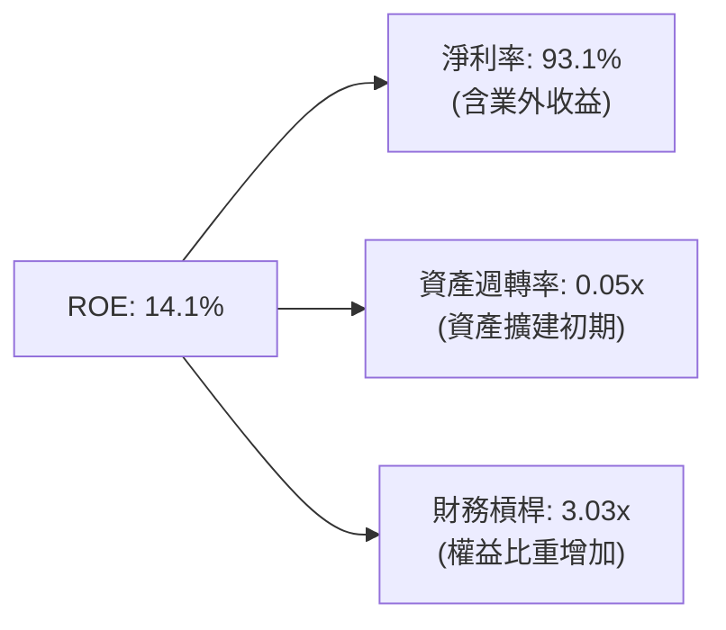

### 6.4 獲利能力儀表板

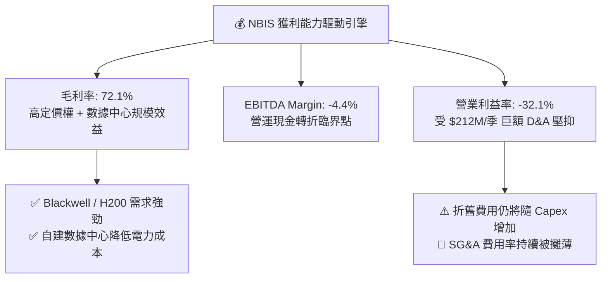

---

## 7. 估值深度分析

### 7.1 同業估值比較表格

點名選擇 **CoreWeave (未上市/私募參考)**、**Supermicro (SMCI)**、**Arista Networks (ANET)** 與 **Vertiv (VRT)** 作為 AI 基礎設施同業對比：

| 估值指標 | **Nebius (NBIS)** | **CoreWeave (私募)** | **Supermicro (SMCI)** | **Vertiv (VRT)** | **Arista (ANET)** | 本公司評估 |
|----------|-------------------|----------------------|-----------------------|------------------|-------------------|-----------|
| **市值 / 估值**| **$56.1B** | ~$23.0B | ~$28.5B | ~$38.2B | ~$115.0B | 包含顯著成長溢價 |
| **TTM Revenue YoY**| **683.9%** | ~180% | 88.1% | 29.2% | 20.1% | 🟢 **全行業增速第一** |
| **Gross Margin** | **72.1%** | ~65.0% | 13.3% | 34.8% | 64.2% | 🟢 **極高毛利結構** |
| **EV / Revenue (TTM)**| **63.89x** | ~25.0x | 1.8x | 4.8x | 13.5x | 🔴 高於硬體廠，反映軟體/雲端溢價 |
| **EV / Sales (2026E)**| **~35.1x** | ~12.0x | 1.2x | 3.8x | 11.2x | 🟡 隨營收翻倍急遽下降 |
| **P/E (Forward)**| **N/A** | N/A | 15.2x | 28.5x | 38.4x | 🔴 本業虧損中 |

### 7.2 歷史估值區間分析

```
╔══════════════════════════════════════════════════════════════════╗
║                NBIS 歷史 EV / Revenue 倍數區間                   ║
╠══════════════════════════════════════════════════════════════════╣
║                                                                  ║
║  歷史高點 (2026-06) : 85.0x  ███████████████████████████████████ ║
║  當前位置 (2026-07) : 63.9x  █████████████████████████░░░░░░░░░░ ║
║  歷史低點 (2024-10) : 12.0x  █████░░░░░░░░░░░░░░░░░░░░░░░░░░░░░░ ║
║  歷史中位數         : 38.5x  ███████████████░░░░░░░░░░░░░░░░░░░░ ║
║                                                                  ║
║  📊 評語：目前估值處於歷史中高位，但鑑於營收 YoY 成長高達 683.9%， ║
║  高 P/S 倍數將隨 FY2026-2027 營收爆發而迅速被消化。             ║
╚══════════════════════════════════════════════════════════════════╝
```

### 7.3 情境目標價（假設驅動：Bear / Base / Bull）

> **估值倍數選擇說明**：NBIS 處於超級重資本擴張期，高額 GPU 折舊費用（D&A）導致 GAAP 淨利與 P/E 失真。因此，採用 **EV/Sales（前瞻 P/S）** 與 **DCF 模型** 作為最合適的估值工具。

| 情境 | 2026E-2028E 營收 CAGR | 2028E 營業利潤率 | 2026E 退出 EV/Sales | 隱含目標價 | 相對現價 ($220.97) | 機率權重 |
|------|----------------------|------------------|---------------------|------------|-------------------|----------|
| 🔴 **悲觀** | 80.0% | 15.0% | 22.0x | **$140.00** | **-36.6%** | 20% |
| 🟡 **基準** | **140.0%** | **25.0%** | **40.0x** | **$260.00** | **+17.7%** | **60%** |
| 🟢 **樂觀** | 210.0% | 35.0% | 55.0x | **$380.00** | **+72.0%** | 20% |

**情境假設邏輯**：
- **悲觀情境**：全球 AI 算力資本支出放緩，NBIS 北美數據中心延遲，2026 營收達 $1.2B，給予 22x P/S。
- **基準情境**：算力出租保持滿載，Blackwell 集群順利交貨，2026 營收達 $1.6B，給予 40x P/S。
- **樂觀情境**：AI PaaS 軟體訂閱爆發，營收達 $2.1B，毛利率提升至 78%，給予 55x 高溢價 P/S。

### 7.4 DCF 敏感性分析（6格目標價矩陣）

**DCF 核心假設**：永續成長率 (g) = 3.5%，FY2026-FY2030 營收 CAGR = 65%，終端營業利潤率 = 28%。

| 情境 \ WACC | **WACC = 8.5%** | **WACC = 9.35%（基準）** | **WACC = 10.5%** |
|-------------|-----------------|------------------------|------------------|
| 🟢 **樂觀 (高成長)** | **$412.00** (+86.5%) | **$380.00** (+72.0%) | **$335.00** (+51.6%) |
| 🟡 **基準 (正常開釋)** | **$288.00** (+30.3%) | **$260.00** (+17.7%) | **$225.00** (+1.8%) |
| 🔴 **悲觀 (產能遞延)** | **$160.00** (-27.6%) | **$140.00** (-36.6%) | **$120.00** (-45.7%) |

### 7.5 估值綜合區間

```
╔══════════════════════════════════════════════════════════════════╗
║               NBIS 估值綜合區間與當前位置 ($220.97)              ║
╠══════════════════════════════════════════════════════════════════╣
║                                                                  ║
║  悲觀下值 : $120.00  |                                           ║
║  券商最低 : $120.00  |─── 支撐區 ($120 - $140)                    ║
║  悲觀目標 : $140.00  |                                           ║
║  當前股價 : $220.97  |───────◆ 當前市場定價                      ║
║  券商均價 : $258.13  |                                           ║
║  基準目標 : $260.00  |───────★ 12M 基準價值                      ║
║  樂觀目標 : $380.00  |                                           ║
║  券商最高 : $410.00  |───────▲ 樂觀牛市頂部                      ║
║                                                                  ║
╚══════════════════════════════════════════════════════════════════╝
```

---

## 8. 成長催化劑

### 8.1 催化劑時間軸

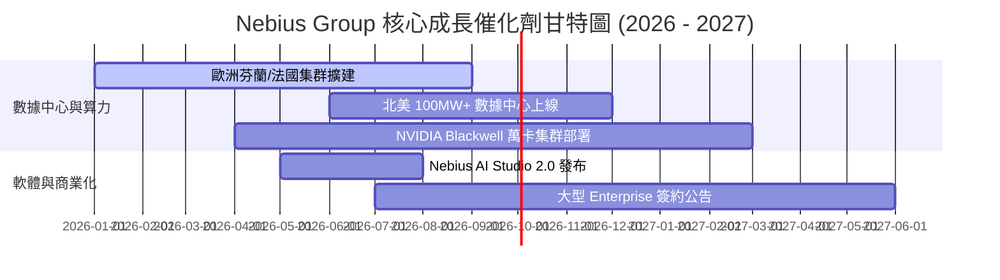

### 8.2 TAM 市場規模分析

```
╔══════════════════════════════════════════════════════════════════╗
║                 NBIS 可尋址市場 (TAM) 滲透分析                   ║
╠══════════════════════════════════════════════════════════════════╣
║                                                                  ║
║  全球 AI 雲端基礎設施 TAM (2028E): $250.0B                       ║
║  ▓▓▓▓▓▓▓▓▓▓▓▓▓▓▓▓▓▓▓▓▓▓▓▓▓▓▓▓▓▓▓▓▓▓▓▓▓▓▓▓▓▓▓▓▓▓▓▓▓▓             ║
║                                                                  ║
║  AI Neocloud 專用算力 TAM (2028E): $45.0B                        ║
║  ██████████████████░░░░░░░░░░░░░░░░░░░░░░░░░░░░░                 ║
║                                                                  ║
║  NBIS 2026E 目標營收: $1.6B (滲透率 ~3.5%)                        ║
║  █░░░░░░░░░░░░░░░░░░░░░░░░░░░░░░░░░░░░░░░░░░░░░░                 ║
║                                                                  ║
║  📊 洞察：算力需求極度緊俏，NBIS 只要取得 Neocloud 市場 10% 份額，║
║  營收即可攀升至 $4.5B+。                                         ║
╚══════════════════════════════════════════════════════════════════╝
```

### 8.3 成長驅動力結構圖

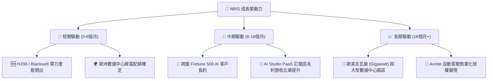

---

## 9. 風險矩陣

### 9.1 風險評分矩陣

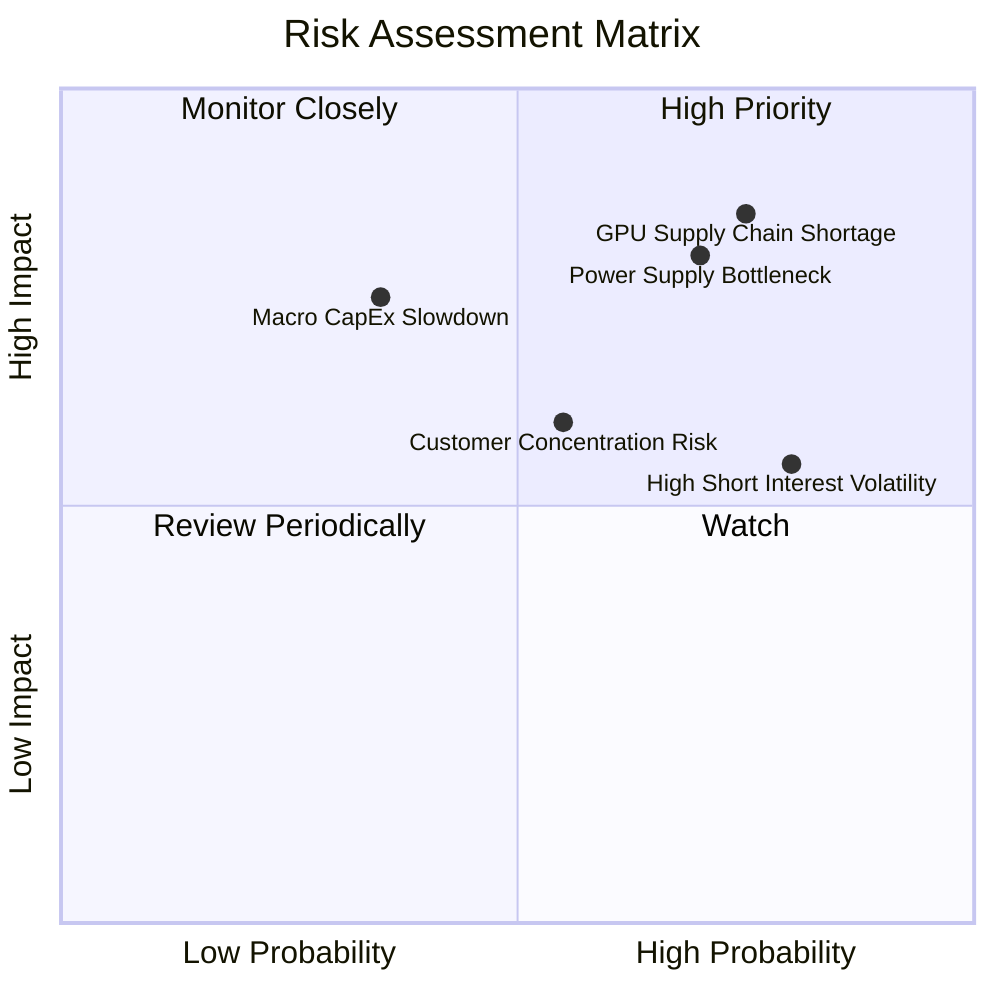

### 9.2 風險清單詳細分析

| # | 風險項目 | 發生機率 | 財務衝擊 | 風險評分 | 緩解措施與觀察指標 |
|---|----------|----------|----------|----------|--------------------|
| 1 | 🔴 **GPU 供應鏈限制與交付延遲** | 高 (75%) | 高 (-20% 營收) | 🔴 **8.2/10** | 與 NVIDIA 建立 Tier-1 戰略夥伴關係；追蹤 Q/Q 交付量。 |
| 2 | 🔴 **電力配給與數據中心建設延誤** | 高 (70%) | 高 (-15% 產能) | 🔴 **8.0/10** | 優先選擇綠電充沛的北歐與北美地點；監控交屋時間表。 |
| 3 | 🟡 **高賣空比例 (28%) 引發劇烈波動** | 極高 (80%)| 中 (股價震盪) | 🟡 **6.8/10** | 維持強勁財報擊敗預期；追蹤 Short Interest 變化。 |
| 4 | 🟡 **客戶集中度過高風險** | 中 (55%) | 中 (-10% 利潤) | 🟡 **6.0/10** | 積極擴展中小企業與開發者生態；監控前五大客戶收入比。 |
| 5 | 🟢 **總體經濟放緩導致 AI 資本支出削減**| 低 (35%) | 高 (-25% 需求) | 🟡 **5.5/10** | 手握 $9.3B 現金儲備，具備極佳的抗景氣循環能力。 |

---

## 10. 投資建議

### 10.1 最終綜合評級雷達圖

```
╔══════════════════════════════════════════════════════════════════╗
║              NBIS 投資維度綜合雷達評分 (總分 7.6/10)             ║
╠══════════════════════════════════════════════════════════════════╣
║                                                                  ║
║  基本面強度  : 8.0/10  ▓▓▓▓▓▓▓▓▓▓▓▓▓▓▓▓░░░░  🟢 強悍            ║
║  成長動能    : 9.5/10  ▓▓▓▓▓▓▓▓▓▓▓▓▓▓▓▓▓▓▓░  🏆 爆發            ║
║  獲利品質    : 5.5/10  ▓▓▓▓▓▓▓▓▓▓▓░░░░░░░░░  🟡 轉折點前夕      ║
║  財務健康度  : 8.5/10  ▓▓▓▓▓▓▓▓▓▓▓▓▓▓▓▓▓░░░  🟢 現金護盾        ║
║  估值合理性  : 6.5/10  ▓▓▓▓▓▓▓▓▓▓▓▓▓░░░░░░░  🟡 高成長支撐高倍數 ║
║  護城河深度  : 7.5/10  ▓▓▓▓▓▓▓▓▓▓▓▓▓▓▓░░░░░  🟢 全棧生態        ║
║                                                                  ║
║  綜合投資評級：🟢 買入 (Buy)                                     ║
╚══════════════════════════════════════════════════════════════════╝
```

### 10.2 目標價與隱含報酬率

| 情境 | 機率權重 | 目標價 | 當前股價 | 隱含報酬率 | 投資建議 |
|------|----------|--------|----------|------------|----------|
| 🔴 **悲觀情境** | 20% | $140.00 | $220.97 | -36.6% | 減碼觀望 / 嚴格停損 |
| 🟡 **基準情境** | **60%** | **$260.00** | **$220.97** | **+17.7%** | **分批建立核心部位** |
| 🟢 **樂觀情境** | 20% | $380.00 | $220.97 | +72.0% | 獲利順勢加碼 |
| **加權預期目標**| **100%** | **$260.00** | **$220.97** | **+17.7%** | 🟢 **整體評級：買入** |

### 10.3 買入時機與觸發因素

```
╔══════════════════════════════════════════════════════════════════╗
║                  ✅ NBIS 買入觸發因素 Checklist                  ║
╠══════════════════════════════════════════════════════════════════╣
║                                                                  ║
║  立即分批買入觸發條件（符合多數）：                              ║
║  ✅ 股價回檔至 50 日均線附近 ($200.00 - $215.00 區間)             ║
║  ✅ 季度營收 QoQ 成長率持續突破 40%+                             ║
║  ✅ Q1 2026 營運現金流 (OCF) 維持強勁正數 ($2.2B+)                ║
║                                                                  ║
║  加碼觸發條件（出現以下任一）：                                  ║
║  ☐ 單季 FCF 轉正或 Capex 效率顯著提升                            ║
║  ☐ 公布重大 100MW+ 超級計算中心產能順利交屋上線                  ║
║  ☐ 獲納入重大科技/AI ETF 指數                                    ║
║                                                                  ║
║  減碼/停損觸發條件（出現以下任一）：                             ║
║  ☐ 單季營收 QoQ 成長率跌破 15%                                   ║
║  ☐ 數據中心電力取得遭遇重大監管阻礙，建置延遲逾 6 個月           ║
║  ☐ 自由現金流赤字持續擴大且現金儲備跌破 $3.0B                    ║
╚══════════════════════════════════════════════════════════════════╝
```

### 10.4 投資人適配度分析

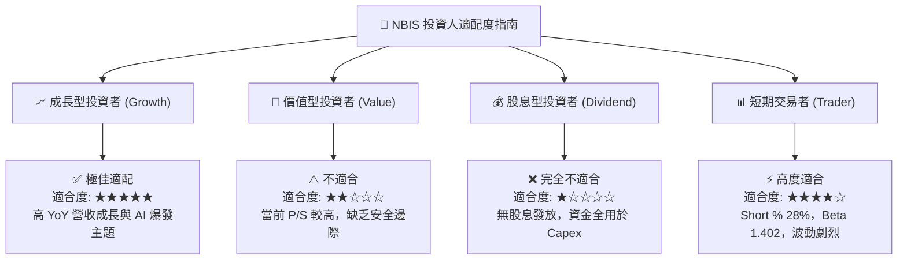

### 10.5 每季財報監控清單（Quarterly Watch List）

| 監控關鍵指標 | 最新基準值 (Q1 2026) | 正常健康區間 | 觸發加碼門檻 | 觸發減碼/警訊門檻 |
|--------------|----------------------|--------------|--------------|-------------------|
| **單季營業收入** | **$399.0M** | $350M - $450M | **> $450M** | **< $300M** |
| **毛利率 (Gross Margin)**| **74.0%** | 68% - 75% | **> 75%** | **< 62%** |
| **單季營運現金流 (OCF)**| **$2,260.0M** | > $500M | **> $2,500M** | **轉負 (< $0)** |
| **現金及等價物** | **$9.30B** | > $5.0B | **> $10.0B** | **< $3.0B** |
| **Short % of Float** | **28.0%** | 15% - 25% | **下降至 < 15%** | **上升至 > 35%** |

### 10.6 反面論證：什麼會證明論點錯誤（Disconfirming Evidence）

```
╔══════════════════════════════════════════════════════════════════╗
║              ⚠️ 論點失效條件（Disconfirming Evidence）           ║
╠══════════════════════════════════════════════════════════════════╣
║  本研究之多頭投資論點在下列任何量化條件成立時將宣告失效：        ║
║                                                                  ║
║  1. 核心 AI 雲端營收成長率連續兩季 QoQ 低於 15%（顯示需求失速）。 ║
║  2. 毛利率（Gross Margin）因算力價格戰快速收縮至 55% 以下。      ║
║  3. 巨額 CapEx 無法轉化為預算內的 OCF，導致 TTM FCF 虧損持續     ║
║     擴大至 $-8.0B 以上，威脅 $9.3B 現金儲備安全。                ║
║  4. ROIC 於 FY2027 仍無法轉正並跨越 9.35% 之 WACC 門檻。         ║
║  5. 北美與歐洲吉瓦級數據中心受限電力監管，交屋時程延誤逾 2 季。  ║
╚══════════════════════════════════════════════════════════════════╝
```

---

> **免責聲明**：本報告為 AI 自動生成，僅供研究參考，不構成任何投資建議。投資有風險，入市需謹慎。