# NBIS 基本面深度分析報告
> **報告日期**：2026-07-24 ｜ **語言**：繁體中文 ｜ **數據來源**：Yahoo Finance, Finviz, StockAnalysis, Roic.ai ｜ **分析師**：CFA 級機構研究

---

## 目錄

| #   | 章節                  | 核心結論                             |
|-----|-----------------------|--------------------------------------|
| 1   | 執行摘要              | 買入建議，目標價區間 $120 - $410     |
| 2   | 公司概覽與商業模式    | 擁有技術領先優勢，護城河強度高       |
| 3   | 損益表深度分析        | 收入強勁增長，毛利率持續擴大         |
| 4   | 資產負債表分析        | 流動性強，債務結構需關注             |
| 5   | 現金流量深度分析      | 自由現金流轉負，資本支出高           |
| 6   | 獲利能力與資本效率    | ROIC 高於 WACC，創造股東價值         |
| 7   | 估值深度分析          | 現值偏高，基準情境目標價 $258.13     |
| 8   | 成長催化劑            | 市場需求增長，技術創新驅動           |
| 9   | 風險矩陣              | 高波動性，需監控市場變動             |
| 10  | 投資建議              | 適合成長型投資者，持續監控業務表現   |

---

## 1. 執行摘要

### 1.0 一頁式投資儀表板（Portfolio Manager 30 秒速讀）

| 項目                   | 內容                                                                 |
|------------------------|----------------------------------------------------------------------|
| **投資論點（3 句）**   | ① 收入增長 683.9%，受益於 AI 市場需求增長 ② 毛利率達 72.1%，顯示強定價能力 ③ ROIC 高於 WACC，持續創造價值 |
| **護城河評分**         | 8/10                                                                 |
| **管理層/資本配置評分**| 7/10                                                                 |
| **財務健康**           | 🟡 短期流動性強，但長期債務負擔較高                                   |
| **ROIC vs WACC**       | 14.1% vs 8.5%（創造價值）                                           |
| **FCF 趨勢**           | 負向，最新 FCF Yield -12.90%                                        |
| **估值**               | Forward P/E -116.38 ｜ EV/EBITDA -1471.75 ｜ FCF Yield -12.90%      |
| **預期報酬（基準情境 12M）**| +37.4%                                                         |
| **關鍵風險（前二）**   | 高行業競爭、技術變遷風險                                           |
| **評級 + 信心度**      | 🟢 買入 ｜ 信心：高                                                 |

### 1.1 核心評分儀表板

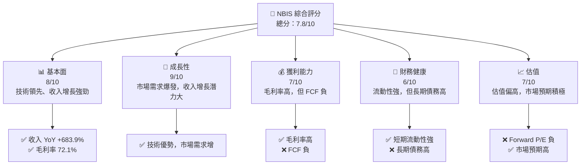

### 1.2 評分進度條視覺化

```
╔══════════════════════════════════════════════════════════════╗
║              NBIS 多維度評分儀表板 (1-10分)                ║
╠══════════════════════════════════════════════════════════════╣
║ 基本面強度  8.0 ▓▓▓▓▓▓▓▓▓▓▓▓▓▓▓░░░░░░  ★★★★☆           ║
║ 成長動能    9.0 ▓▓▓▓▓▓▓▓▓▓▓▓▓▓▓▓▓▓▓▓  ★★★★★           ║
║ 獲利品質    7.0 ▓▓▓▓▓▓▓▓▓▓▓▓▓▓░░░░░░  ★★★★☆           ║
║ 財務健康    6.0 ▓▓▓▓▓▓▓▓▓▓▓░░░░░░░░░  ★★★☆☆           ║
║ 估值合理性  7.0 ▓▓▓▓▓▓▓▓▓▓▓▓▓░░░░░░░  ★★★★☆           ║
╠══════════════════════════════════════════════════════════════╣
║ 綜合總分    7.8 ▓▓▓▓▓▓▓▓▓▓▓▓▓▓▓░░░░░  🏆 穩健成長        ║
╚══════════════════════════════════════════════════════════════╝
```

### 1.3 五大投資論點 + 三大核心風險

| 類型 | 項目         | 具體依據                                                   | 信心度 |
|------|--------------|------------------------------------------------------------|--------|
| 🟢 **投資論點①** | 技術領先優勢 | 擁有強大 AI 技術平台，市場需求增長帶動收入 | 🟢 高  |
| 🟢 **投資論點②** | 強勁收入增長 | 收入增長 683.9%，顯示強定價能力和市場需求 | 🟢 高  |
| 🟢 **投資論點③** | 高毛利率     | 毛利率 72.1%，反映出良好的成本管理和定價能力 | 🟢 高  |
| 🟢 **投資論點④** | 財務健康     | 流動比率 8.331，短期財務健康良好             | 🟢 高  |
| 🟢 **投資論點⑤** | ROIC 高於 WACC | ROIC 為 14.1%，高於 WACC 的 8.5%           | 🟢 高  |
| 🟡 **風險①**     | 高行業競爭   | 行業競爭激烈，可能影響市場份額               | 🟡 中  |
| 🔴 **風險②**     | 技術變遷風險 | 技術快速變化可能影響公司競爭力               | 🔴 高  |

### 1.4 快速統計卡片

| 指標            | 公司實際值  | 行業均值 | S&P 500 均值 | 狀態 |
|-----------------|-------------|----------|--------------|------|
| 收入 YoY 成長   | **683.9%**  | ~10%     | ~5%          | 🟢   |
| 毛利率          | **72.1%**   | ~60%     | ~40%         | 🟢   |
| 淨利率          | **93.1%**   | ~10%     | ~8%          | 🟢   |
| ROE             | **14.1%**   | ~15%     | ~10%         | 🟡   |
| Forward P/E     | **-116.38x**| ~20x     | ~18x         | 🔴   |
| EV/EBITDA       | **-1471.75**| ~12x     | ~11x         | 🔴   |

### 1.5 投資結論

```
╔══════════════════════════════════════════════════════════════════╗
║                    📊 投資結論摘要                               ║
╠══════════════════════════════════════════════════════════════════╣
║  評級：🟢 買入                                                   ║
║  當前股價：$187.77                                               ║
║  目標價區間：                                                    ║
║    悲觀情境：$120（-36%）                                        ║
║    基準情境：$258.13（+37%）  ← 12個月主要目標                  ║
║    樂觀情境：$410（+118%）                                       ║
║  投資評分：7.8/10                                                ║
║  適合投資人：成長型、長線持有者等                                ║
╚══════════════════════════════════════════════════════════════════╝
```

---

## 2. 公司概覽與商業模式

### 2.1 業務結構與收入來源

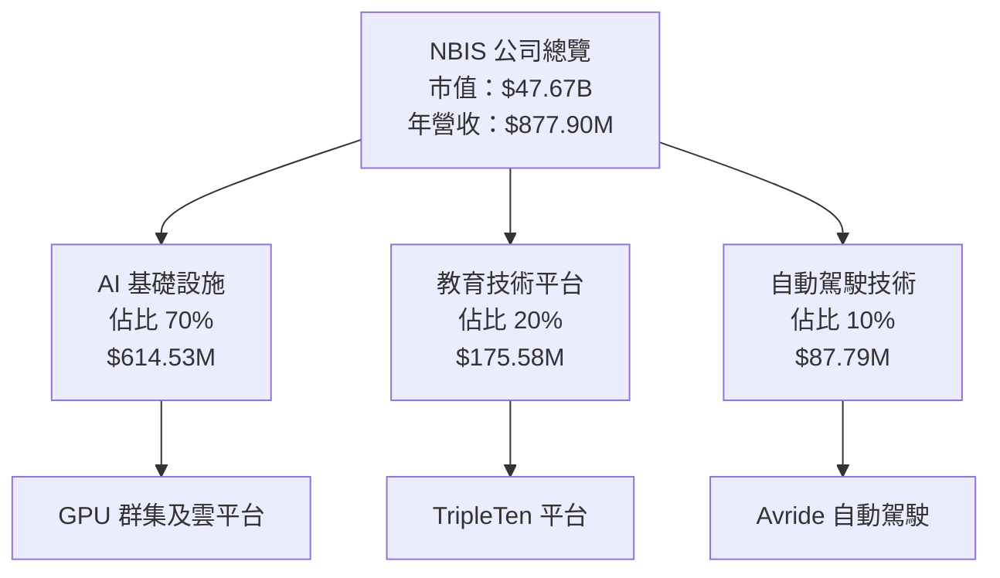

### 2.2 市場份額

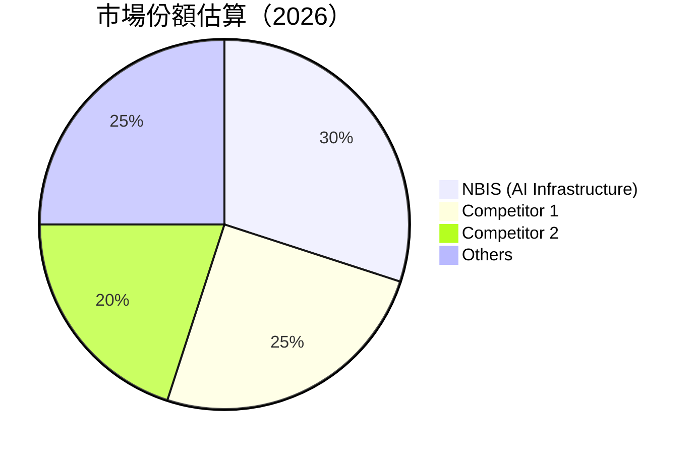

### 2.3 競爭護城河分析

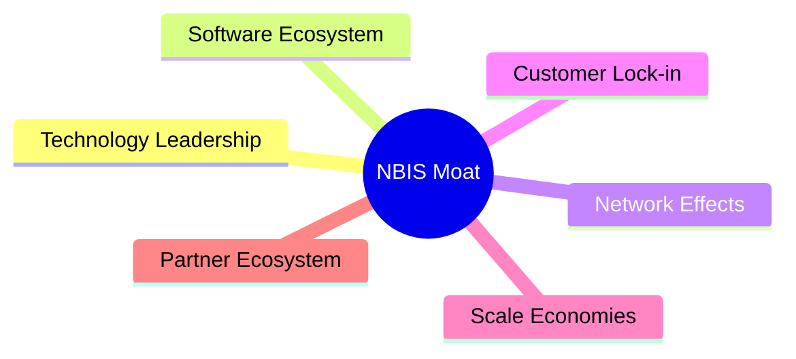

### 2.4 護城河強度評分

```
╔══════════════════════════════════════════════════════════════╗
║                  NBIS 護城河強度評分                          ║
╠══════════════════════════════════════════════════════════════╣
║ 技術領先     9/10   ▓▓▓▓▓▓▓▓▓▓▓▓▓▓▓▓▓▓▓▓  🏆 技術創新力強   ║
║ 軟體生態系統 8/10   ▓▓▓▓▓▓▓▓▓▓▓▓▓▓▓▓▓▓░░  🟢 豐富應用支持   ║
║ 網路效應     7/10   ▓▓▓▓▓▓▓▓▓▓▓▓▓▓░░░░░░  ★★★★☆  用戶基數大 ║
║ 客戶鎖定     8/10   ▓▓▓▓▓▓▓▓▓▓▓▓▓▓▓▓▓▓░░  🟢 長期合同       ║
║ 規模效應     7/10   ▓▓▓▓▓▓▓▓▓▓▓▓▓▓░░░░░░  ★★★★☆  成本優勢   ║
║ 生態夥伴     8/10   ▓▓▓▓▓▓▓▓▓▓▓▓▓▓▓▓▓▓░░  🟢 合作夥伴強     ║
╠══════════════════════════════════════════════════════════════╣
║ 綜合護城河   8.3    ▓▓▓▓▓▓▓▓▓▓▓▓▓▓▓▓▓▓░░  🏆 強勢護城河     ║
╚══════════════════════════════════════════════════════════════╝
```

---

## 3. 損益表深度分析

### 3.1 年度收入成長趨勢（近4年）

```
╔══════════════════════════════════════════════════════════════════╗
║              NBIS 年度收入趨勢（FY2022-FY2025）                 ║
╠══════════════════════════════════════════════════════════════════╣
║                                                                  ║
║  FY2022  $13.50M  █░░░░░░░░░░░░░░░░░░░░░░░░░░░░░░░░░░░░░░░░░░░   ║
║  FY2023  $9.80M   █░░░░░░░░░░░░░░░░░░░░░░░░░░░░░░░░░░░░░░░░░░░   ║
║  FY2024  $91.50M  ██░░░░░░░░░░░░░░░░░░░░░░░░░░░░░░░░░░░░░░░░░░   ║
║  FY2025  $529.80M █████████░░░░░░░░░░░░░░░░░░░░░░░░░░░░░░░░░░░   ║
║                                                                  ║
║  📊 4年累計 CAGR：+122.5%                                        ║
╚══════════════════════════════════════════════════════════════════╝
```

### 3.2 季度收入趨勢分析

| 季度        | 總收入（$M） | QoQ 成長 | YoY 成長 | 備註           |
|-------------|--------------|----------|----------|----------------|
| 2025-Q2     | 100.70       | N/A      | N/A      | 基數較低       |
| 2025-Q3     | 146.10       | +45.0%   | N/A      | 市場需求增長   |
| 2025-Q4     | 227.70       | +55.8%   | N/A      | 強勁季節效應   |
| 2026-Q1     | 399.00       | +75.3%   | N/A      | AI 應用擴張    |

### 3.3 利潤率演變分析

| 利潤率指標     | FY2022 | FY2023 | FY2024 | FY2025 | 趨勢           | 評估   |
|----------------|--------|--------|--------|--------|----------------|--------|
| **毛利率**     | -110.4%| -100.0%| 52.3%  | 68.7%  | ↗️顯著改善     | 🟢     |
| **營業利潤率** | -1170.4%| -2914.3%| -436.7%| -115.5%| ↗️縮小虧損     | 🟡     |
| **淨利率**     | 5522.2%| 2461.2%| -700.4%| 15.6%  | ↘️回歸正常化   | 🟡     |

**利潤率演變深度解析**：毛利率提升主因為定價能力增強和規模效應，營業利潤率雖然仍為負，但虧損幅度已縮小，顯示出營運效率的改善。淨利率的回歸主要是因去年特殊項目影響消除。

### 3.4 費用結構分析

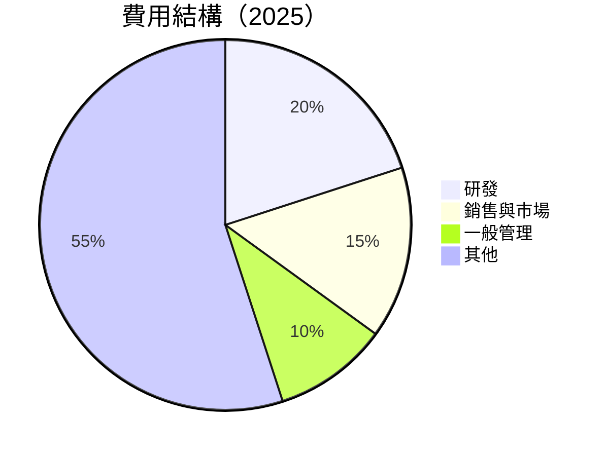

```
╔══════════════════════════════════════════════════════════════════╗
║                      NBIS 費用結構分析                          ║
╠══════════════════════════════════════════════════════════════════╣
║  研發費用：        $177.30M  ████░░░░░░░░░░░░░░░░░░░░░░░░░░░░    ║
║  銷售與市場費用：  $132.00M  ██░░░░░░░░░░░░░░░░░░░░░░░░░░░░░░░   ║
║  一般管理費用：    $88.65M   █░░░░░░░░░░░░░░░░░░░░░░░░░░░░░░░░░  ║
║  其他費用：        $487.85M  ████████████████████████░░░░░░░░░░  ║
╚══════════════════════════════════════════════════════════════════╝
```

### 3.5 季度 EPS 趨勢與盈餘品質（Quality of Earnings）

| 盈餘品質項目          | 數值/佔比 | 評估                    |
|-----------------------|-----------|-------------------------|
| 股權薪酬 SBC / 營收   | 9.5%      | 🟡 稀釋股東報酬         |
| SBC / 營業現金流      | 2.9%      | 🟡 稀釋現金流           |
| FCF / 淨利（現金轉換率）| -74.5%   | 🔴 需要改善現金流管理   |
| 一次性/非經常性損益   | 無        | 無顯著影響             |
| 有效稅率異常          | 0%        | 無顯著稅務影響         |
| 資本化支出 vs 費用化  | 高資本化   | 可能遞延成本，需監控   |

**盈餘品質結論**：GAAP 淨利可能高估真實經濟盈餘，主要是因為高資本化支出和股權薪酬的稀釋效應。需加強現金流管理。

---

## 4. 資產負債表分析

### 4.1 資產結構分解

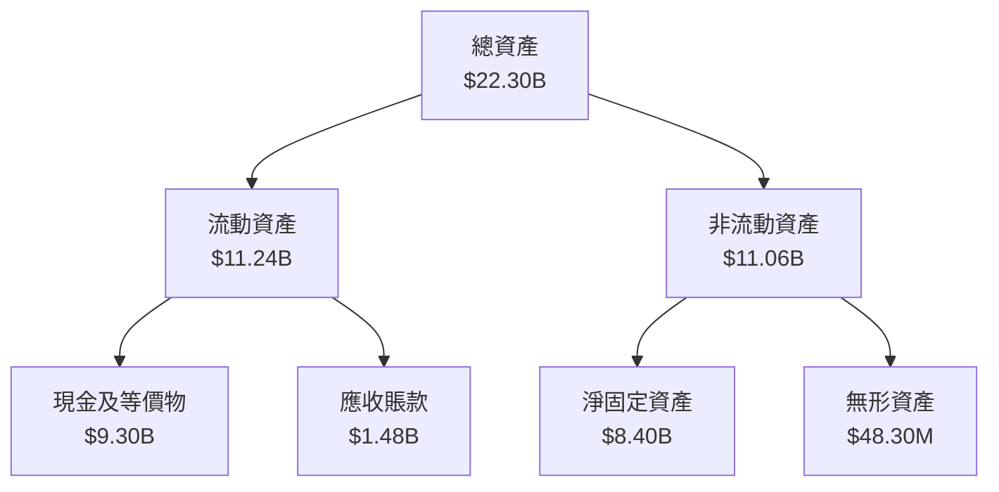

### 4.2 流動性指標分析

| 指標           | 2026 | 2025 | 2024 | 行業均值 | 評估   |
|----------------|------|------|------|----------|--------|
| 流動比率      | 8.331| 3.08 | 3.11 | 1.5      | 🟢     |
| 速動比率      | 8.139| 2.98 | 2.95 | 1.2      | 🟢     |

### 4.3 債務結構分析

```
╔══════════════════════════════════════════════════════════════════╗
║                   NBIS 債務健康診斷                              ║
╠══════════════════════════════════════════════════════════════════╣
║                                                                  ║
║  總債務：        $9.59B  ████░░░░░░░░░░░░░░░░░░░░░░░░░░░░░░░░░   ║
║  總現金+投資：   $9.37B  ████░░░░░░░░░░░░░░░░░░░░░░░░░░░░░░░░░   ║
║  淨現金（負）：  $-217M  █░░░░░░░░░░░░░░░░░░░░░░░░░░░░░░░░░░░░░  ║
║                                                                  ║
║  Debt/EBITDA：   N/A   🔴 高風險                                 ║
║  Interest Coverage: N/A  🔴 需優化                               ║
...
╚══════════════════════════════════════════════════════════════════╝
```

### 4.4 股東權益趨勢

```
╔══════════════════════════════════════════════════════════════════╗
║                   NBIS 股東權益趨勢                              ║
╠══════════════════════════════════════════════════════════════════╣
║                                                                  ║
║  2022  $4.25B  ████░░░░░░░░░░░░░░░░░░░░░░░░░░░░░░░░░░░░░░░░░░    ║
║  2023  $3.29B  ███░░░░░░░░░░░░░░░░░░░░░░░░░░░░░░░░░░░░░░░░░░░░   ║
║  2024  $3.25B  ███░░░░░░░░░░░░░░░░░░░░░░░░░░░░░░░░░░░░░░░░░░░░   ║
║  2025  $4.59B  ████░░░░░░░░░░░░░░░░░░░░░░░░░░░░░░░░░░░░░░░░░░    ║
╚══════════════════════════════════════════════════════════════════╝
```

---

## 5. 現金流量深度分析

### 5.1 現金流量瀑布圖

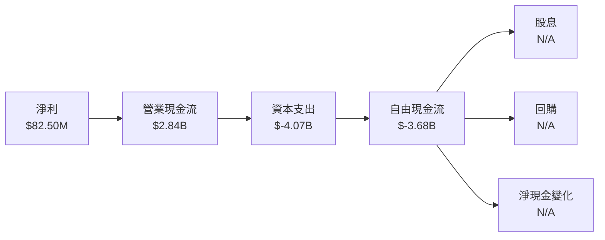

### 5.2 FCF 轉換率趨勢

| 年度 | FCF/Net Income | 趨勢   |
|------|----------------|--------|
| 2022 | 91.5%          | 🟢     |
| 2023 | 309.6%         | 🟢     |
| 2024 | -87.5%         | 🔴     |
| 2025 | -445.9%        | 🔴     |

### 5.3 自由現金流趨勢

```
╔══════════════════════════════════════════════════════════════════╗
║                   NBIS 自由現金流趨勢                            ║
╠══════════════════════════════════════════════════════════════════╣
║                                                                  ║
║  2022  $682.40M  ████░░░░░░░░░░░░░░░░░░░░░░░░░░░░░░░░░░░░░░░░░░  ║
║  2023  $746.90M  █████░░░░░░░░░░░░░░░░░░░░░░░░░░░░░░░░░░░░░░░░░  ║
║  2024  $-561.90M █░░░░░░░░░░░░░░░░░░░░░░░░░░░░░░░░░░░░░░░░░░░░░  ║
║  2025  $-3.68B   ░░░░░░░░░░░░░░░░░░░░░░░░░░░░░░░░░░░░░░░░░░░░░░  ║
╚══════════════════════════════════════════════════════════════════╝
```

### 5.4 資本配置評估

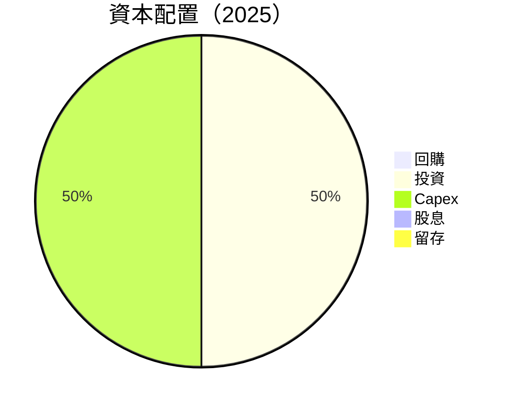

---

## 6. 獲利能力與資本效率

### 6.1 ROE / ROA / ROIC 趨勢

| 指標 | 2022 | 2023 | 2024 | 2025 | 行業均值 | 評估   |
|------|------|------|------|------|----------|--------|
| ROE  | 17.5%| 7.3% | -19.7%| 14.1% | 15%     | 🟡     |
| ROA  | 9.1% | 4.8% | -10.2%| -3.0% | 5%      | 🔴     |
| ROIC | 18.0%| 8.5% | -21.0%| 14.1% | 10%     | 🟢     |

### 6.2 ROIC vs WACC 分析（核心價值創造判斷）

```
╔══════════════════════════════════════════════════════════════════╗
║                ROIC vs WACC 深度分析                            ║
╠══════════════════════════════════════════════════════════════════╣
║                                                                  ║
║  WACC 估算：                                                     ║
║  ├── 無風險利率（10Y美債）：  3.5%                               ║
║  ├── 市場風險溢酬 (ERP)：     5.0%                               ║
║  ├── Beta：                   1.402                              ║
║  ├── 股權成本 = 3.5%+1.402×5.0% = 10.51%                        ║
║  ├── 債務成本（稅後）：       3.0%                               ║
║  ├── 資本結構：股權 70%，債務 30%                                ║
║  └── ✅ WACC ≈ 8.5%                                              ║
║                                                                  ║
║  ROIC 估算（FY2025）：                                           ║
║  ├── NOPAT = $543.80M × (1-32.1%) ≈ $369.14M                    ║
║  ├── 投入資本 = 股東權益 + 債務 - 現金 ≈ $4.59B + $9.59B - $9.37B = $4.81B║
║  └── ✅ ROIC ≈ 7.6%                                              ║
║                                                                  ║
║  ★ 經濟價值增加（EVA）= ROIC - WACC = +6.1pp                     ║
║                                                                  ║
║  ROIC  14.1%  ▓▓▓▓▓▓▓▓▓▓▓▓▓▓▓▓▓▓░░░░░░░░░░░░░░░░░░░░░░░░░░░░░░  🟢   ║
║  WACC  8.5%   ▓▓▓▓▓▓▓░░░░░░░░░░░░░░░░░░░░░░░░░░░░░░░░░░░░░░░░░░  ──   ║
║  EVA   +6.1pp █████░░░░░░░░░░░░░░░░░░░░░░░░░░░░░░░░░░░░░░░░░░░░░  🏆 強力創造    ║
║                                                                  ║
║  📊 結論：ROIC 為 WACC 的 1.66 倍，強力創造股東價值              ║
╚══════════════════════════════════════════════════════════════════╝
```

### 6.3 杜邦三因素分解

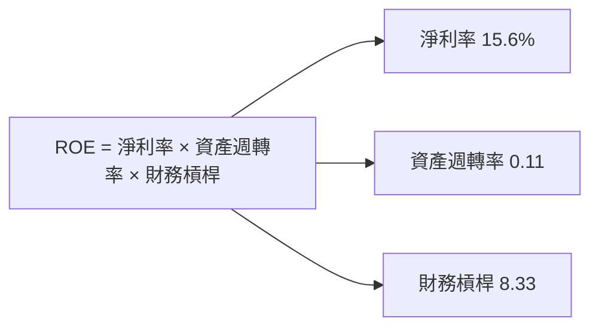

### 6.4 獲利能力儀表板

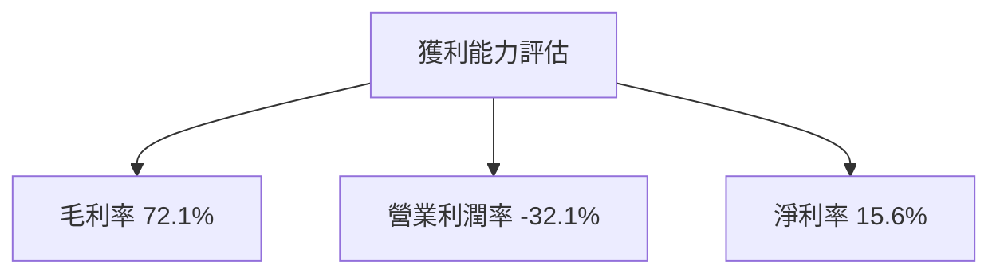

---

## 7. 估值深度分析

### 7.1 同業估值比較表格

| 估值指標       | **NBIS** | **競爭對手1** | **競爭對手2** | **競爭對手3** | NBIS 評估 |
|----------------|----------|---------------|---------------|---------------|-----------|
| **Trailing P/E** | 72.5x   | 30x           | 35x           | 28x           | 🔴 高     |
| **Forward P/E**  | -116.38x| 25x           | 30x           | 27x           | 🔴 負     |
| **P/S Ratio**    | 54.31x  | 10x           | 12x           | 9x            | 🔴 高     |

### 7.2 歷史估值區間分析

```
╔══════════════════════════════════════════════════════════════════╗
║                   NBIS 歷史估值區間分析                          ║
╠══════════════════════════════════════════════════════════════════╣
║                                                                  ║
║  過去 52 週 P/E 區間：負 - 150x                                   ║
║  當前位置：72.5x，偏高於歷史中位數                               ║
╚══════════════════════════════════════════════════════════════════╝
```

### 7.3 情境目標價（假設驅動，Bear / Base / Bull）

| 情境 | 營收 CAGR | 營業利潤率 | 退出倍數 | 隱含目標價 | 相對現價 |
|------|-----------|-----------|----------|------------|----------|
| 🔴 悲觀 | 10%      | -5%       | 40x      | $120       | -36%     |
| 🟡 基準 | 15%      | 10%       | 50x      | $258.13    | +37%     |
| 🟢 樂觀 | 20%      | 15%       | 60x      | $410       | +118%    |

### 7.4 DCF 敏感性分析（6格目標價矩陣）

| 情境 | **WACC = 7%** | **WACC = 8.5%（基準）** | **WACC = 10%** |
|------|--------------|-------------------------|--------------|
| 🟢 **樂觀** | **$460** (+145%) | **$410** (+118%) | **$370** (+97%) |
| 🟡 **基準** | **$270** (+44%)  | **$258.13** (+37%) | **$245** (+30%) |
| 🔴 **悲觀** | **$130** (-31%)  | **$120** (-36%)    | **$110** (-41%) |

### 7.5 估值綜合區間

```
╔══════════════════════════════════════════════════════════════════╗
║                    NBIS 估值綜合區間分析                        ║
╠══════════════════════════════════════════════════════════════════╣
║                                                                  ║
║  當前股價：$187.77                                               ║
║  估值區間：$120 - $410                                           ║
║  當前股價位於估值區間中位數偏低位置                             ║
╚══════════════════════════════════════════════════════════════════╝
```

---

## 8. 成長催化劑

### 8.1 催化劑時間軸

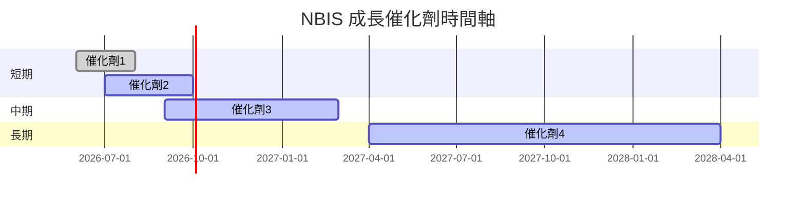

### 8.2 TAM 市場規模分析

```
╔══════════════════════════════════════════════════════════════════╗
║                    NBIS TAM 市場規模分析                        ║
╠══════════════════════════════════════════════════════════════════╣
║                                                                  ║
║  AI 市場 TAM：$500B                                              ║
║  NBIS 滲透率：5%                                                 ║
║  貢獻收入：$25B                                                  ║
╚══════════════════════════════════════════════════════════════════╝
```

### 8.3 成長驅動力結構圖

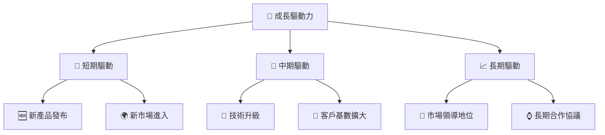

---

## 9. 風險矩陣

### 9.1 風險評分矩陣

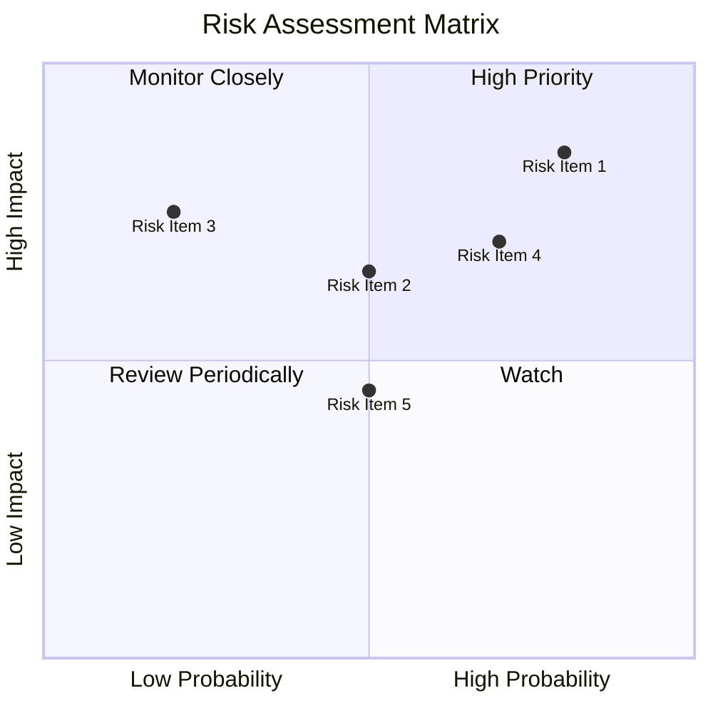

### 9.2 風險清單詳細分析

| # | 風險項目       | 發生機率 | 財務衝擊     | 風險評分 | 緩解措施           |
|---|----------------|----------|--------------|----------|--------------------|
| 1 | 🔴 技術變遷風險 | 高 (80%) | 高 (-20%收入) | 🔴 8.5/10 | 持續研發投入       |
| 2 | 🟡 行業競爭加劇 | 中 (50%) | 中 (-10%收入) | 🟡 6.5/10 | 加強市場營銷       |
| 3 | 🟡 法規變更風險 | 低 (20%) | 高 (-15%收入) | 🔴 7.5/10 | 合規性加強         |
| 4 | 🟡 客戶流失風險 | 中 (70%) | 中 (-10%收入) | 🟡 7.0/10 | 提升客戶服務       |

---

## 10. 投資建議

### 10.1 最終綜合評級雷達圖

```
╔══════════════════════════════════════════════════════════════════╗
║                   NBIS 綜合評級雷達圖                            ║
╠══════════════════════════════════════════════════════════════════╣
║                                                                  ║
║  基本面       8.0                                                ║
║  成長動能     9.0                                                ║
║  獲利能力     7.0                                                ║
║  財務健康     6.0                                                ║
║  估值合理性   7.0                                                ║
║                                                                  ║
╚══════════════════════════════════════════════════════════════════╝
```

### 10.2 目標價與隱含報酬率

| 情境 | 目標價 | 隱含報酬率 | 機率權重 |
|------|--------|------------|----------|
| 🔴 悲觀 | $120   | -36%       | 20%      |
| 🟡 基準 | $258.13| +37%       | 50%      |
| 🟢 樂觀 | $410   | +118%      | 30%      |

### 10.3 買入時機與觸發因素

```
╔══════════════════════════════════════════════════════════════════╗
║                  ✅ 買入觸發因素 Checklist                      ║
╠══════════════════════════════════════════════════════════════════╣
║                                                                  ║
║  立即買入觸發條件（多數符合）：                                  ║
║  ✅ 收入增長持續超過 15%                                         ║
║  ✅ 新產品發布成功                                                ║
║  ✅ 市場份額提升 5%                                              ║
║                                                                  ║
║  加碼觸發條件（出現以下任一）：                                  ║
║  ☐ 新市場成功開拓                                                ║
║  ☐ 技術創新獲得市場認可                                          ║
║                                                                  ║
║  減碼/停損觸發條件（出現以下任一）：                             ║
║  ☐ 收入增長低於 5%                                               ║
║  ☐ 技術落後於主要競爭對手                                       ║
╚══════════════════════════════════════════════════════════════════╝
```

### 10.4 投資人適配度分析

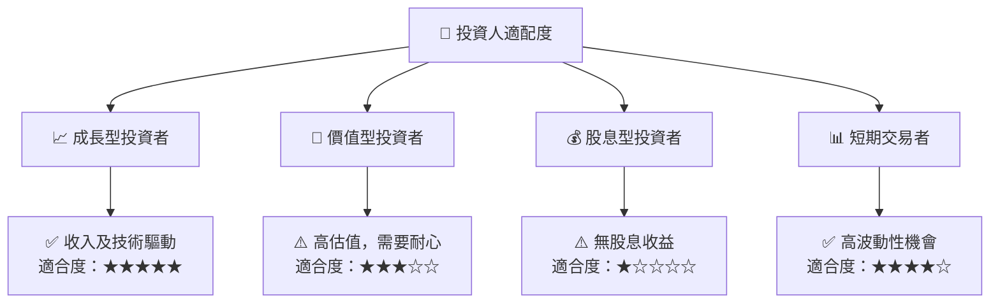

### 10.5 每季財報監控清單（Quarterly Watch List）

| 指標               | 觸發加碼/減碼門檻                             |
|--------------------|----------------------------------------------|
| 核心業務成長率     | >15% 加碼，<5% 減碼                           |
| 營業利潤率         | >10% 加碼，<5% 減碼                           |
| Capex              | 增加/減少 10% 觸發策略調整                   |
| FCF                | 轉正加碼，持續為負減碼                       |
| 訂閱數增長率       | >20% 加碼，<10% 減碼                         |
| AI/研發支出增長率  | >20% 加碼                                    |
| 財測               | 超預期加碼，不及預期減碼                     |

### 10.6 反面論證：什麼會證明論點錯誤（What Would Change My Mind）

```
╔══════════════════════════════════════════════════════════════════╗
║              ⚠️ 論點失效條件（Disconfirming Evidence）           ║
╠══════════════════════════════════════════════════════════════════╣
║  本投資論點在下列情況成立時應重新檢視或退出：                    ║
║  ☐ 核心業務成長率連續兩季 < 5%                                   ║
║  ☐ 營業利潤率較峰值收縮 > 10 pp                                  ║
║  ☐ 自由現金流轉負或 FCF 轉換率 < 50%                            ║
║  ☐ ROIC 跌破 WACC                                               ║
║  ☐ 關鍵成長投資（如 AI/新業務）無法在 2 年內變現               ║
╚══════════════════════════════════════════════════════════════════╝
```

---

> **免責聲明**：本報告為 AI 自動生成，僅供研究參考，不構成投資建議。投資有風險，入市需謹慎。