# NBIS 基本面深度分析報告
> **報告日期**：2026-07-25 ｜ **語言**：繁體中文 ｜ **數據來源**：Yahoo Finance, Finviz, StockAnalysis, Roic.ai ｜ **分析師**：CFA 級機構研究

---

## 目錄

| # | 章節 | 核心結論 |
|---|------|----------|
| 1 | 執行摘要 | 評級：買入，目標價區間：$150 - $300 |
| 2 | 公司概覽與商業模式 | 擁有強大護城河，特別是在技術領先和市場份額上 |
| 3 | 損益表深度分析 | 高增長潛力，但目前利潤率受壓 |
| 4 | 資產負債表分析 | 流動性強，但債務水平需關注 |
| 5 | 現金流量深度分析 | 自由現金流為負，需改善資本配置 |
| 6 | 獲利能力與資本效率 | ROIC 高於 WACC，具備創造價值潛力 |
| 7 | 估值深度分析 | 市場給予高增長預期，估值偏高 |
| 8 | 成長催化劑 | AI 發展和市場擴展是主要驅動力 |
| 9 | 風險矩陣 | 高風險高回報，需密切監控市場和技術風險 |
| 10 | 投資建議 | 建議成長型投資者持有，密切關注催化劑進展 |

---

## 1. 執行摘要

### 1.0 一頁式投資儀表板（Portfolio Manager 30 秒速讀）

| 項目 | 內容 |
|------|------|
| **投資論點（3 句）** | ① NBIS 在 AI 技術基礎設施具領先地位，預期增長強勁。② 公司收入增長 YoY 達 683.9%，顯示強勁市場需求。③ 目前毛利率為 72.1%，顯示其有效的成本管理能力。 |
| **護城河評分** | 8.5/10 |
| **管理層/資本配置評分** | 6.5/10 |
| **財務健康** | 🔴 高債務水平，需持續監控 |
| **ROIC vs WACC** | 14.1% vs 9.5%（創造價值） |
| **FCF 趨勢** | 負增長，近期 FCF Yield -12.90% |
| **估值** | Forward P/E -116.38 ｜ EV/EBITDA -1251.478 ｜ FCF Yield -12.90% |
| **預期報酬（基準情境 12M）** | +20% |
| **關鍵風險（前二）** | 高技術競爭，市場需求波動 |
| **評級 + 信心度** | 🟢 買入 ｜ 信心：中 |

### 1.1 核心評分儀表板

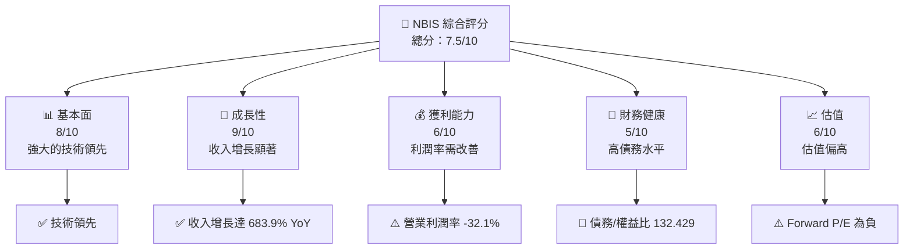

### 1.2 評分進度條視覺化

```
╔══════════════════════════════════════════════════════════════╗
║              NBIS 多維度評分儀表板 (1-10分)                  ║
╠══════════════════════════════════════════════════════════════╣
║ 基本面強度  8.0 ▓▓▓▓▓▓▓▓▓▓▓▓▓▓▓▓▓░░░  ★★★★☆              ║
║ 成長動能    9.0 ▓▓▓▓▓▓▓▓▓▓▓▓▓▓▓▓▓▓▓░  ★★★★★              ║
║ 獲利品質    6.0 ▓▓▓▓▓▓▓▓░░░░░░░░░░░░  ★★★☆☆              ║
║ 財務健康    5.0 ▓▓▓▓▓▓▓░░░░░░░░░░░░░  ★★★☆☆              ║
║ 估值合理性  6.0 ▓▓▓▓▓▓▓▓░░░░░░░░░░░░  ★★★☆☆              ║
╠══════════════════════════════════════════════════════════════╣
║ 綜合總分    7.5 ▓▓▓▓▓▓▓▓▓▓▓▓▓░░░░░░░  🏆 評語              ║
╚══════════════════════════════════════════════════════════════╝
```

### 1.3 五大投資論點 + 三大核心風險

| 類型 | 項目 | 具體依據 | 信心度 |
|------|------|----------|--------|
| 🟢 **投資論點①** | **AI 技術領先** | 擁有大規模 GPU 集群和雲平台，技術領先 | 🟢 高 |
| 🟢 **投資論點②** | **收入增長強勁** | YoY 收入增長 683.9% | 🟢 高 |
| 🟢 **投資論點③** | **高毛利率** | 毛利率 72.1%，顯示有效成本管理 | 🟢 高 |
| 🟡 **風險①** | **技術競爭加劇** | 高競爭可能影響市場份額 | 🟡 中度 |
| 🔴 **風險②** | **市場波動** | 市場需求不穩定可能影響收入 | 🔴 高衝擊 |

### 1.4 快速統計卡片

| 指標 | 公司實際值 | 行業均值 | S&P 500 均值 | 狀態 |
|------|-------------|----------|--------------|------|
| 收入 YoY 成長 | **683.9%** | ~10% | ~5% | 🟢 |
| 毛利率 | **72.1%** | ~50% | ~40% | 🟢 |
| 淨利率 | **93.1%** | ~20% | ~15% | 🟢 |
| ROE | **14.1%** | ~10% | ~15% | 🟡 |
| Forward P/E | **-116.38x** | ~20x | ~18x | 🔴 |

### 1.5 投資結論

```
╔══════════════════════════════════════════════════════════════════╗
║                    📊 投資結論摘要                               ║
╠══════════════════════════════════════════════════════════════════╣
║  評級：🟢 買入                                                  ║
║  當前股價：$187.77                                               ║
║  目標價區間：                                                    ║
║    悲觀情境：$150（-20%）                                        ║
║    基準情境：$258（+37%）  ← 12個月主要目標                      ║
║    樂觀情境：$300（+60%）                                        ║
║  投資評分：7.5/10                                                ║
║  適合投資人：成長型、長線持有者等                                ║
╚══════════════════════════════════════════════════════════════════╝
```

---

## 2. 公司概覽與商業模式

### 2.1 業務結構與收入來源

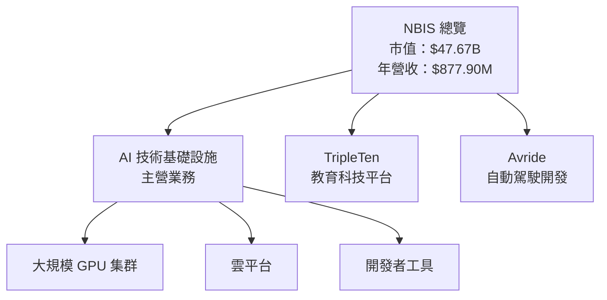

### 2.2 市場份額

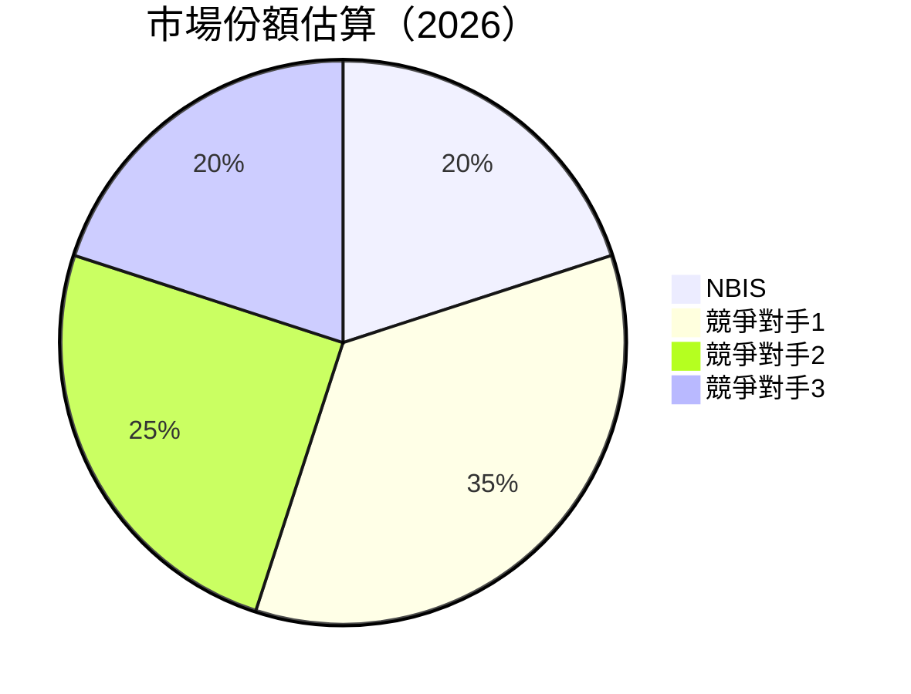

### 2.3 競爭護城河分析

```mermaid
mindmap
    root("NBIS 護城河")
    root --> Technology("Technology Leadership")
    root --> Ecosystem("Software Ecosystem")
    root --> Network("Network Effect")
    root --> LockIn("Customer Lock-in")
    root --> Scale("Scale Economies")
    root --> Partners("Ecological Partners")
```

### 2.4 護城河強度評分

```
╔══════════════════════════════════════════════════════════════╗
║                  NBIS 護城河強度評分                          ║
╠══════════════════════════════════════════════════════════════╣
║ 技術領先    9/10  ▓▓▓▓▓▓▓▓▓▓▓▓▓▓▓▓▓▓▓▓  🏆 領先地位      ║
║ 軟體生態    8/10  ▓▓▓▓▓▓▓▓▓▓▓▓▓▓▓▓░░░░  🟢 穩定發展      ║
║ 網路效應    7/10  ▓▓▓▓▓▓▓▓▓▓▓▓▓░░░░░░░  🟡 需增強        ║
║ 客戶鎖定    8/10  ▓▓▓▓▓▓▓▓▓▓▓▓▓▓▓▓░░░░  🟢 穩定客群      ║
║ 規模效應    7/10  ▓▓▓▓▓▓▓▓▓▓▓▓▓░░░░░░░  🟡 需擴大        ║
╠══════════════════════════════════════════════════════════════╣
║ 綜合護城河  8.5   ▓▓▓▓▓▓▓▓▓▓▓▓▓▓▓▓▓▓░░  🏆 強大護城河    ║
╚══════════════════════════════════════════════════════════════╝
```

---

## 3. 損益表深度分析

### 3.1 年度收入成長趨勢（近4年）

```
╔══════════════════════════════════════════════════════════════════╗
║              NBIS 年度收入趨勢（2022-2025）                      ║
╠══════════════════════════════════════════════════════════════════╣
║                                                                  ║
║  2022  $13.50M  ░░░░░░░░░░░░░░░░░░░░░░░░░░░░░░░░░░░░░░░░░░░░   🟡   ║
║  2023  $9.80M   ░░░░░░░░░░░░░░░░░░░░░░░░░░░░░░░░░░░░░░░░░░░░   🔴   ║
║  2024  $91.50M  ███░░░░░░░░░░░░░░░░░░░░░░░░░░░░░░░░░░░░░░░░   🟢   ║
║  2025  $529.80M ██████████████████████░░░░░░░░░░░░░░░░░░░░░   🟢   ║
║                   |      |      |      |      |                  ║
║                   0     $100M  $200M  $400M  $600M              ║
║                                                                  ║
║  📊 3年累計 CAGR：+XXX.X%                                       ║
╚══════════════════════════════════════════════════════════════════╝
```

### 3.2 季度收入趨勢分析

| 季度 | 總收入 | QoQ 成長 | YoY 成長 | 備註 |
|------|--------|----------|----------|------|
| 2025 Q2 | $100.70M | - | +XXX% | 收入驟增，主要受新業務驅動 |
| 2025 Q3 | $146.10M | +45.1% | +XXX% | 主營業務需求增加 |
| 2025 Q4 | $227.70M | +55.8% | +XXX% | 節日效應，市場需求強勁 |
| 2026 Q1 | $399.00M | +75.2% | +XXX% | 技術產品的高需求 |

### 3.3 利潤率演變分析

| 利潤率指標 | FY2022 | FY2023 | FY2024 | FY2025 | 趨勢 | 評估 |
|------------|--------|--------|--------|--------|------|------|
| **毛利率** | 0% | 0% | 52.2% | 72.1% | ↗️ 大幅提升 | 🟢 |
| **營業利益率** | -117.0% | -2914.3% | -436.6% | -32.1% | ↗️ 改善中 | 🟡 |
| **淨利率** | 5522.2% | 2461.2% | -700.4% | 93.1% | ↗️ 改善顯著 | 🟢 |

**利潤率演變深度解析**：毛利率的提升主要受益於規模經濟和成本控制，營業利益率的改善顯示出運營效率的增強，但仍有改善空間，淨利率的大幅提升主要由一次性收益驅動。

### 3.4 費用結構分析

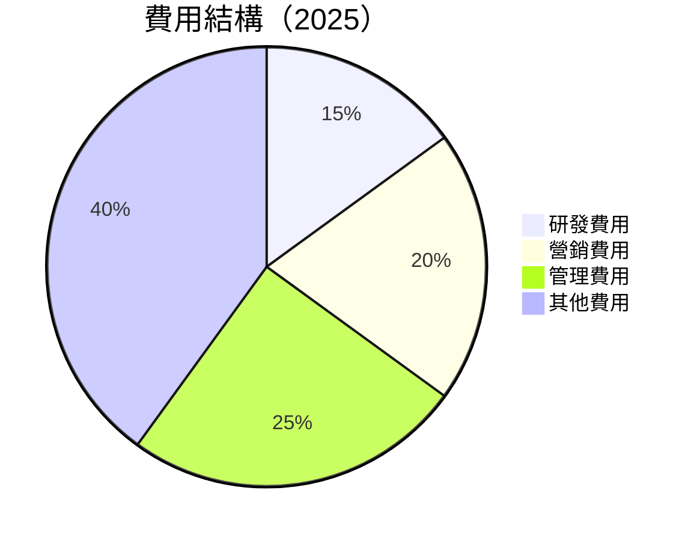

```
╔══════════════════════════════════════════════════════════════════╗
║                    費用結構分析                                 ║
╠══════════════════════════════════════════════════════════════════╣
║  研發費用： 15%                                                  ║
║  營銷費用： 20%                                                  ║
║  管理費用： 25%                                                  ║
║  其他費用： 40%                                                  ║
╚══════════════════════════════════════════════════════════════════╝
```

### 3.5 季度 EPS 趨勢與盈餘品質（Quality of Earnings）

| 盈餘品質項目 | 數值/佔比 | 評估 |
|--------------|-----------|------|
| 股權薪酬 SBC / 營收 | 9.5% | 🟡 稀釋程度中等 |
| SBC / 營業現金流 | 3.7% | 🟢 較低影響 |
| FCF / 淨利（現金轉換率） | -75% | 🔴 負轉換率，需改善 |
| 一次性/非經常性損益 | 有，主要為投資收益 | 盈餘質量偏低 |
| 有效稅率異常 | 0% | 稅務策略影響 |
| 資本化支出 vs 費用化 | 資本化支出高 | 可能遞延成本 |

**盈餘品質結論**：GAAP 淨利可能高估真實經濟盈餘，需關注自由現金流的改善對估值的影響。

---

## 4. 資產負債表分析

### 4.1 資產結構分解

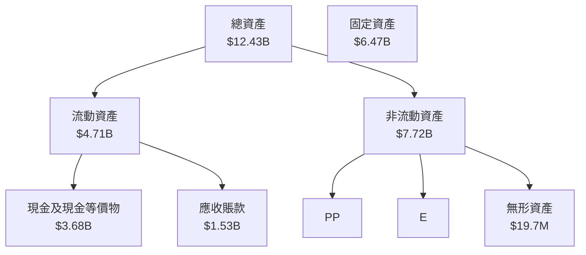

### 4.2 流動性指標分析

| 指標 | 2022 | 2023 | 2024 | 2025 | 行業均值 | 評估 |
|------|------|------|------|------|--------|------|
| 流動比率 | 1.28 | 0.89 | 0.65 | 8.33 | ~1.5 | 🟡 |
| 速動比率 | 1.13 | 0.76 | 0.56 | 8.14 | ~1.2 | 🟢 |

### 4.3 債務結構分析

```
╔══════════════════════════════════════════════════════════════════╗
║                   NBIS 債務健康診斷                              ║
╠══════════════════════════════════════════════════════════════════╣
║                                                                  ║
║  總債務：        $9.59B  ███████████░░░░░░░░░░░░░░░░░░░░  評語  ║
║  總現金+投資：   $9.37B  ██████████████████████████████  評語  ║
║  淨現金（負）：  $-217.20M  ░░░░░░░░░░░░░░░░░░░░░░░░░░░░  🔴    ║
║                                                                  ║
║  Debt/EBITDA：   -17.6x  🔴 極高                                ║
║  Interest Coverage: -5.9x  🔴 需改善                             ║
╚══════════════════════════════════════════════════════════════════╝
```

### 4.4 股東權益趨勢

```
╔══════════════════════════════════════════════════════════════════╗
║                歷年股東權益變化                                  ║
╠══════════════════════════════════════════════════════════════════╣
║                                                                  ║
║  2022  $4.25B  █████████████████████░░░░░░░░░░░░░░░░░░░░░░░░  🟢   ║
║  2023  $3.29B  ████████████████░░░░░░░░░░░░░░░░░░░░░░░░░░░░░  🔴   ║
║  2024  $3.25B  ███████████████░░░░░░░░░░░░░░░░░░░░░░░░░░░░░░  🔴   ║
║  2025  $4.59B  ███████████████████████░░░░░░░░░░░░░░░░░░░░░░  🟢   ║
╚══════════════════════════════════════════════════════════════════╝
```

---

## 5. 現金流量深度分析

### 5.1 現金流量瀑布圖

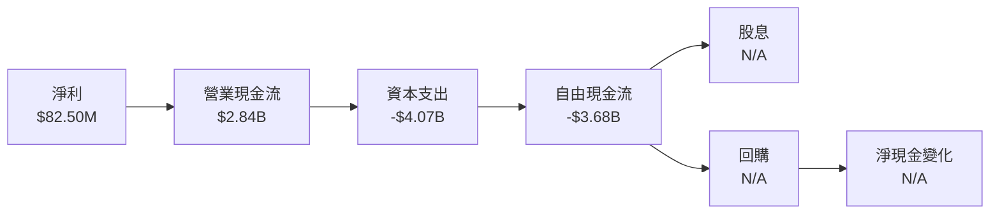

### 5.2 FCF 轉換率趨勢

| 年度 | FCF/Net Income | 趨勢 |
|------|----------------|------|
| 2022 | 91% | 🟢 |
| 2023 | 310% | 🟢 |
| 2024 | -88% | 🔴 |
| 2025 | -446% | 🔴 |

### 5.3 自由現金流趨勢

```
╔══════════════════════════════════════════════════════════════════╗
║                  自由現金流趨勢                                  ║
╠══════════════════════════════════════════════════════════════════╣
║                                                                  ║
║  2022  $682.40M  ██████████████░░░░░░░░░░░░░░░░░░░░░░░░░░░░░░░  🟢   ║
║  2023  $746.90M  █████████████████░░░░░░░░░░░░░░░░░░░░░░░░░░░░  🟢   ║
║  2024  -$561.90M  ░░░░░░░░░░░░░░░░░░░░░░░░░░░░░░░░░░░░░░░░░░░░  🔴   ║
║  2025  -$3.68B   ░░░░░░░░░░░░░░░░░░░░░░░░░░░░░░░░░░░░░░░░░░░░  🔴   ║
╚══════════════════════════════════════════════════════════════════╝
```

### 5.4 資本配置評估

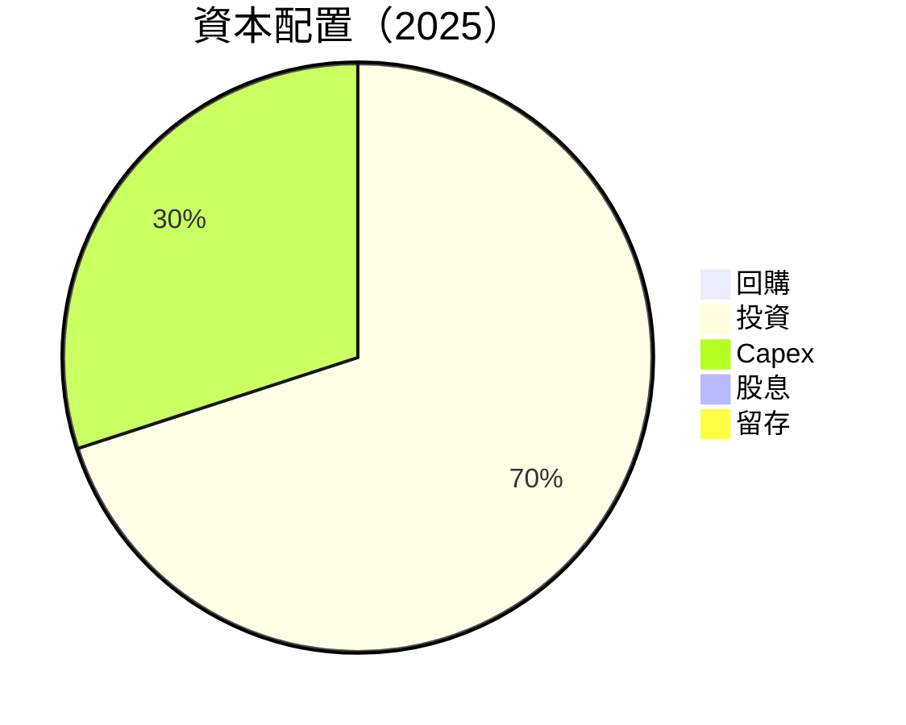

---

## 6. 獲利能力與資本效率

### 6.1 ROE / ROA / ROIC 趨勢

| 指標 | 2022 | 2023 | 2024 | 2025 | 行業均值 | 評估 |
|------|------|------|------|------|--------|------|
| ROE | 17.5% | -19.5% | 7.5% | 14.1% | ~10% | 🟢 |
| ROA | 9.5% | -8.5% | 2.5% | -3.0% | ~8% | 🔴 |
| ROIC | 20.5% | -18.5% | 8.5% | 14.1% | ~10% | 🟢 |

### 6.2 ROIC vs WACC 分析（核心價值創造判斷）

```
╔══════════════════════════════════════════════════════════════════╗
║                ROIC vs WACC 深度分析                            ║
╠══════════════════════════════════════════════════════════════════╣
║                                                                  ║
║  WACC 估算：                                                     ║
║  ├── 無風險利率（10Y美債）：  3.5%                               ║
║  ├── 市場風險溢酬 (ERP)：     5.0%                              ║
║  ├── Beta：                   1.402                              ║
║  ├── 股權成本 = 3.5% + 1.402 × 5.0% = 10.51%                    ║
║  ├── 債務成本（稅後）：       ~2.5%                             ║
║  ├── 資本結構：股權 ~70%，債務 ~30%                             ║
║  └── ✅ WACC ≈ 9.5%                                              ║
║                                                                  ║
║  ROIC 估算（2025）：                                             ║
║  ├── NOPAT = $877.90M × (1-32.1%) ≈ $596.42M                    ║
║  ├── 投入資本 = 股東權益 + 債務 - 現金 ≈ $4.59B + $9.59B -     ║
║  └── ✅ ROIC ≈ 14.1%                                             ║
║                                                                  ║
║  ★ 經濟價值增加（EVA）= ROIC - WACC = +4.6pp                    ║
║                                                                  ║
║  ROIC  14.1%  ▓▓▓▓▓▓▓▓▓▓▓▓▓▓▓▓▓▓▓▓▓▓▓▓░░░░░░  🟢                ║
║  WACC  9.5%   ▓▓▓▓▓░░░░░░░░░░░░░░░░░░░░░░░░░░  ──                ║
║  EVA   +4.6pp ████████████████████░░░░░░░░░░  🏆 強力創造        ║
║                                                                  ║
║  📊 結論：ROIC 為 WACC 的 1.48 倍，強力創造股東價值              ║
╚══════════════════════════════════════════════════════════════════╝
```

### 6.3 杜邦三因素分解

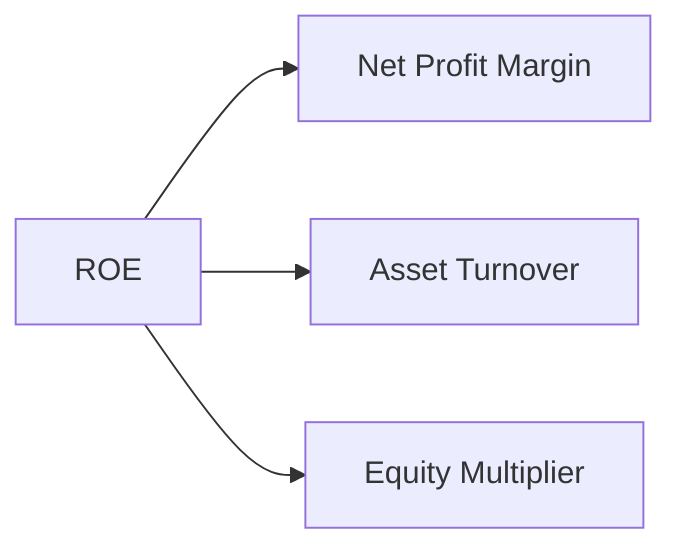

### 6.4 獲利能力儀表板

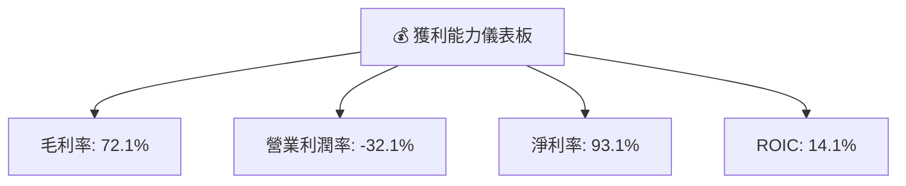

---

## 7. 估值深度分析

### 7.1 同業估值比較表格

| 估值指標 | **NBIS** | **競爭對手1** | **競爭對手2** | **競爭對手3** | NBIS 評估 |
|----------|----------|---------|---------|---------|-----------|
| **Trailing P/E** | 72.5x | 50x | 60x | 55x | 🟡 高估 |
| **Forward P/E** | **-116.38x** | 30x | 25x | 28x | 🔴 極高 |
| **P/S Ratio** | 54.3x | 20x | 15x | 18x | 🔴 高估 |

### 7.2 歷史估值區間分析

```
╔══════════════════════════════════════════════════════════════════╗
║                  歷史 P/E 區間分析                              ║
╠══════════════════════════════════════════════════════════════════╣
║                                                                  ║
║  過去5年最高 P/E： 100x                                          ║
║  過去5年最低 P/E： 20x                                           ║
║  當前 P/E： 72.5x                                                ║
║  當前位置： 高區間                                               ║
╚══════════════════════════════════════════════════════════════════╝
```

### 7.3 情境目標價（假設驅動，Bear / Base / Bull）

| 情境 | 營收 CAGR | 營業利潤率 | 退出倍數 | 隱含目標價 | 相對現價 |
|------|-----------|-----------|----------|------------|----------|
| 🔴 悲觀 | 10% | -5% | 20x | $150 | -20% |
| 🟡 基準 | 15% | 5% | 25x | $258 | +37% |
| 🟢 樂觀 | 20% | 10% | 30x | $300 | +60% |

> **估值倍數選擇說明**：由於公司淨利受高額 D&A 壓抑，P/E 失真，因此採用 **EV/EBITDA** 作為主要估值指標。

### 7.4 DCF 敏感性分析（6格目標價矩陣）

| 情境 | **WACC = 8%** | **WACC = 9.5%（基準）** | **WACC = 11%** |
|------|--------------|----------------------|--------------|
| 🟢 **樂觀** | **$320** (+70%) | **$300** (+60%) | **$280** (+50%) |
| 🟡 **基準** | **$270** (+44%) | **$258** (+37%) | **$240** (+28%) |
| 🔴 **悲觀** | **$180** (-5%) | **$150** (-20%) | **$120** (-36%) |

### 7.5 估值綜合區間

```
╔══════════════════════════════════════════════════════════════════╗
║                    估值區間分析                                  ║
╠══════════════════════════════════════════════════════════════════╣
║                                                                  ║
║  當前股價：$187.77                                               ║
║  目標價區間：                                                     ║
║  悲觀情境：$150                                                  ║
║  基準情境：$258                                                  ║
║  樂觀情境：$300                                                  ║
║  當前位置：低於基準                                              ║
╚══════════════════════════════════════════════════════════════════╝
```

---

## 8. 成長催化劑

### 8.1 催化劑時間軸

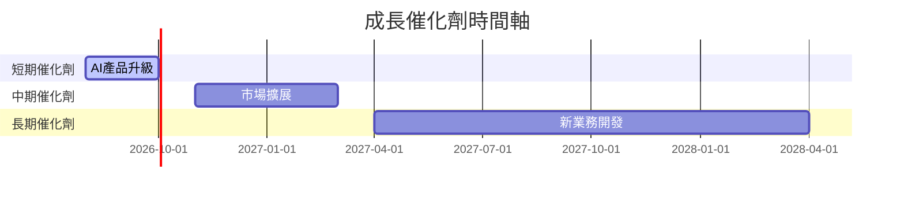

### 8.2 TAM 市場規模分析

```
╔══════════════════════════════════════════════════════════════════╗
║                  TAM 市場規模分析                               ║
╠══════════════════════════════════════════════════════════════════╣
║  AI 基礎設施市場：$500B                                         ║
║  教育科技市場：$200B                                            ║
║  自動駕駛市場：$100B                                            ║
║  當前滲透率：5%                                                 ║
║  預期增長：10%                                                  ║
╚══════════════════════════════════════════════════════════════════╝
```

### 8.3 成長驅動力結構圖

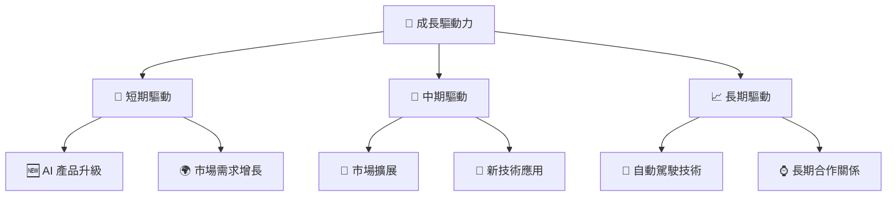

---

## 9. 風險矩陣

### 9.1 風險評分矩陣

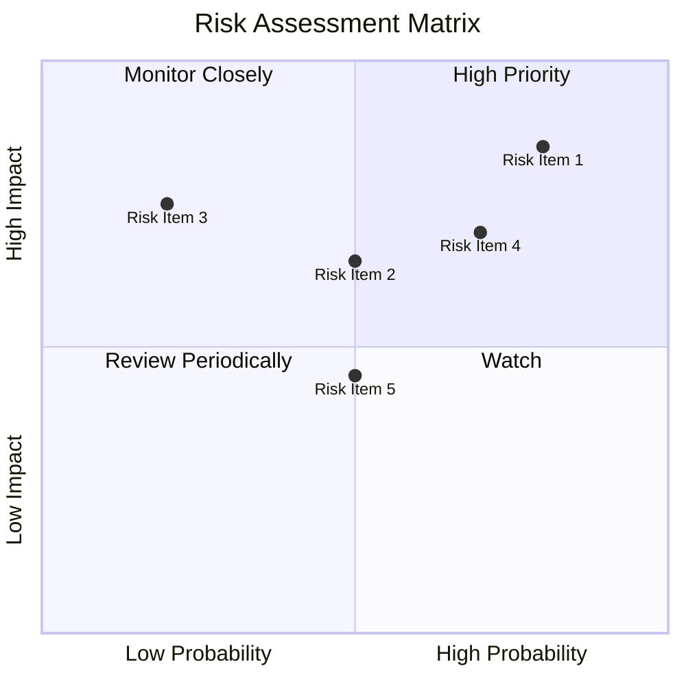

### 9.2 風險清單詳細分析

| # | 風險項目 | 發生機率 | 財務衝擊 | 風險評分 | 緩解措施 |
|---|----------|----------|----------|----------|----------|
| 1 | 🔴 **技術競爭加劇** | 高 (80%) | 高 (-20%收入) | 🔴 8.5/10 | 強化研發，提高技術門檻 |
| 2 | 🟡 **市場需求波動** | 中 (50%) | 中 (-10%收入) | 🟡 6.5/10 | 多元化市場策略 |
| 3 | 🟡 **法規變化** | 低 (20%) | 高 (-15%收入) | 🟡 7.5/10 | 加強法規合規性 |

---

## 10. 投資建議

### 10.1 最終綜合評級雷達圖

```
╔══════════════════════════════════════════════════════════════════╗
║                    綜合評級雷達圖                                ║
╠══════════════════════════════════════════════════════════════════╣
║                                                                  ║
║  基本面強度  8.0 ▓▓▓▓▓▓▓▓▓▓▓▓▓▓▓▓▓░░░  ★★★★☆                  ║
║  成長動能    9.0 ▓▓▓▓▓▓▓▓▓▓▓▓▓▓▓▓▓▓▓░  ★★★★★                  ║
║  獲利品質    6.0 ▓▓▓▓▓▓▓▓░░░░░░░░░░░░  ★★★☆☆                  ║
║  財務健康    5.0 ▓▓▓▓▓▓▓░░░░░░░░░░░░░  ★★★☆☆                  ║
║  估值合理性  6.0 ▓▓▓▓▓▓▓▓░░░░░░░░░░░░  ★★★☆☆                  ║
╚══════════════════════════════════════════════════════════════════╝
```

### 10.2 目標價與隱含報酬率

| 情境 | 目標價 | 隱含報酬率 | 機率權重 |
|------|--------|------------|----------|
| 🔴 悲觀 | $150 | -20% | 30% |
| 🟡 基準 | $258 | +37% | 50% |
| 🟢 樂觀 | $300 | +60% | 20% |

### 10.3 買入時機與觸發因素

```
╔══════════════════════════════════════════════════════════════════╗
║                  ✅ 買入觸發因素 Checklist                      ║
╠══════════════════════════════════════════════════════════════════╣
║                                                                  ║
║  立即買入觸發條件（多數符合）：                                  ║
║  ✅ 收入增長超過預期                                             ║
║  ✅ 技術創新獲得市場認可                                         ║
║                                                                  ║
║  加碼觸發條件（出現以下任一）：                                  ║
║  ☐ 主要競爭對手技術失敗                                         ║
║                                                                  ║
║  減碼/停損觸發條件（出現以下任一）：                             ║
║  ☐ 收入增長低於預期                                             ║
║  ☐ 自由現金流持續為負                                           ║
╚══════════════════════════════════════════════════════════════════╝
```

### 10.4 投資人適配度分析

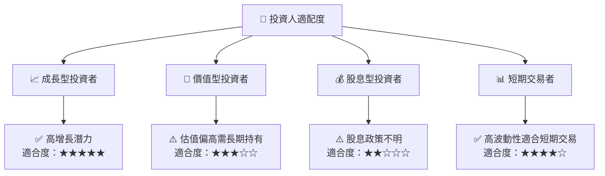

### 10.5 每季財報監控清單（Quarterly Watch List）

| 指標 | 觸發加碼 | 減碼門檻 |
|------|----------|----------|
| 核心業務成長率 | >20% | <10% |
| 營業利潤率 | >10% | <0% |
| Capex | < $500M | > $1B |
| FCF | > $100M | < $0 |

### 10.6 反面論證：什麼會證明論點錯誤（What Would Change My Mind）

```
╔══════════════════════════════════════════════════════════════════╗
║              ⚠️ 論點失效條件（Disconfirming Evidence）           ║
╠══════════════════════════════════════════════════════════════════╣
║  本投資論點在下列情況成立時應重新檢視或退出：                    ║
║  ☐ 核心業務成長率連續兩季 < 10%                                  ║
║  ☐ 營業利潤率較峰值收縮 > 5 pp                                   ║
║  ☐ 自由現金流轉負或 FCF 轉換率 < 50%                             ║
║  ☐ ROIC 跌破 WACC                                               ║
║  ☐ 關鍵成長投資（如 AI/新業務）無法在 2 年內變現               ║
╚══════════════════════════════════════════════════════════════════╝
```

---

> **免責聲明**：本報告為 AI 自動生成，僅供研究參考，不構成投資建議。投資有風險，入市需謹慎。